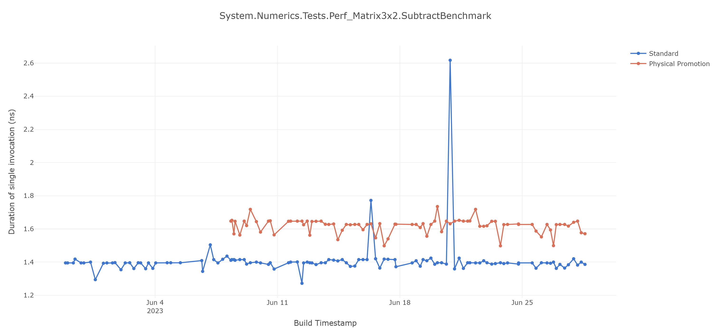

# ``MicroBenchmarks.Serializers.Xml_ToStream<MyEventsListerViewModel>.XmlSerializer_``

Regressed by 33.09%

Hot functions:

- (14.48%) ``XmlUtf8RawTextWriter.RawText`` (Tier-1)
  - No physical promotion
- (7.59%) ``XmlWellFormedWriter.WriteStartElement`` (Tier-1)
  - No physical promotion
- (5.24%) ``XmlWellFormedWriter.WriteEndElement`` (Tier-1)
  - No physical promotion
- (4.41%) ``XmlUtf8RawTextWriter.WriteRawWithCharChecking`` (Tier-1)
  - No physical promotion
- (3.03%) ``XmlWellFormedWriter.AdvanceState`` (Tier-1)
  - No physical promotion
- (2.76%) ``XsdDateTime.TryFormat`` (Tier-1)
  - No physical promotion
- (2.62%) ``XmlWellFormedWriter.PushNamespaceImplicit`` (Tier-1)
  - No physical promotion
- (2.62%) ``XmlSerializationWriterMyEventsListerViewModel.Write3_MyEventsListerItem`` (Tier-1)
  - **Has physical promotion**
- (2.21%) ``XsdDateTime.GetYearMonthDay`` (jit ???)
  - No physical promotion
- (1.93%) ``XsdDateTime.GetYearMonthDay`` (Tier-1)
  - No physical promotion
- (1.93%) ``XmlUtf8RawTextWriter.WriteElementTextBlock`` (Tier-1)
  - No physical promotion
- (1.79%) ``XmlWellFormedWriter.CheckNCName`` (Tier-1)
  - No physical promotion
- (1.24%) ``XmlUtf8RawTextWriter.WriteElementTextBlock`` (jit ???)
  - No physical promotion
- (1.10%) ``XmlWellFormedWriter.LookupPrefix`` (Tier-1)
  - No physical promotion
- (1.10%) ``XmlWellFormedWriter.WriteRaw`` (Tier-1)
  - No physical promotion

Probably no regression; but base is bimodal and sometimes better

<details>

<summary>Graph and diffs</summary>


### ``[Microsoft.GeneratedCode]XmlSerializationWriterMyEventsListerViewModel.Write3_MyEventsListerItem(class System.String,class System.String,class MicroBenchmarks.Serializers.MyEventsListerItem,bool,bool)``

Massive function with significantly different block layout, probably due to PGO. Hard to know if it's related to the physical promotions or not

```diff
 ; optimized using Dynamic PGO
 ; rsp based frame
 ; fully interruptible
-; with Dynamic PGO: edge weights are invalid, and fgCalledCount is 80960
+; with Dynamic PGO: edge weights are invalid, and fgCalledCount is 34336
 ; 213 inlinees with PGO data; 40 single block inlinees; 4 inlinees without PGO data
 ; Final local variable assignments
 ;
-;  V00 this         [V00,T01] ( 55, 64.59)     ref  ->  rsi         this class-hnd single-def
-;  V01 arg1         [V01,T130] (  4,  3.02)     ref  ->  rdx         class-hnd single-def
-;  V02 arg2         [V02,T131] (  4,  3.02)     ref  ->   r8         class-hnd single-def
-;  V03 arg3         [V03,T34] ( 17, 15.17)     ref  ->  rdi         class-hnd single-def
-;  V04 arg4         [V04,T254] (  1,  0.00)    bool  ->  [rsp+1A0H]   single-def
-;  V05 arg5         [V05,T207] (  2,  2.02)    bool  ->  rbx         single-def
+;  V00 this         [V00,T01] ( 53, 63.16)     ref  ->  rsi         this class-hnd single-def
+;  V01 arg1         [V01,T133] (  4,  3.01)     ref  ->  rdx         class-hnd single-def
+;  V02 arg2         [V02,T134] (  4,  3.01)     ref  ->   r8         class-hnd single-def
+;  V03 arg3         [V03,T37] ( 17, 15.13)     ref  ->  rdi         class-hnd single-def
+;  V04 arg4         [V04,T257] (  1,  0.00)    bool  ->  [rsp+1A0H]   single-def
+;  V05 arg5         [V05,T213] (  2,  2.01)    bool  ->  rbx         single-def
 ;* V06 loc0         [V06    ] (  0,  0   )     ref  ->  zero-ref    class-hnd
-;  V07 loc1         [V07,T37] ( 11, 16.20)     ref  ->  rbx         class-hnd single-def
-;  V08 loc2         [V08,T08] ( 13, 26.21)     int  ->  rbp        
+;  V07 loc1         [V07,T42] ( 11, 16.18)     ref  ->  rbx         class-hnd single-def
+;  V08 loc2         [V08,T10] ( 13, 26.18)     int  ->  rbp        
 ;  V09 OutArgs      [V09    ] (  1,  1   )  struct (48) [rsp+00H]   do-not-enreg[XS] addr-exposed "OutgoingArgSpace"
 ;* V10 tmp1         [V10    ] (  0,  0   )  struct (16) zero-ref    "spilled call-like call argument"
 ;* V11 tmp2         [V11    ] (  0,  0   )  struct (16) zero-ref    "spilled call-like call argument"
-;  V12 tmp3         [V12,T65] (  5, 10.09)     int  ->  r13         "guarded devirt return temp"
+;  V12 tmp3         [V12,T70] (  5, 10.08)     int  ->  r13         "guarded devirt return temp"
 ;* V13 tmp4         [V13    ] (  0,  0   )     ref  ->  zero-ref    class-hnd exact "guarded devirt this exact temp"
-;  V14 tmp5         [V14,T148] (  2,  4.07)     int  ->  rbx         ld-addr-op "Inlining Arg"
-;  V15 tmp6         [V15,T93] (  4,  6.20)     ref  ->  rcx         class-hnd exact single-def "Inlining Arg"
-;  V16 tmp7         [V16,T142] (  4,  4.07)     ref  ->  r12         class-hnd "Inline return value spill temp"
-;  V17 tmp8         [V17,T44] ( 11, 15.25)     int  ->  rbx         "Inlining Arg"
+;  V14 tmp5         [V14,T149] (  2,  4.05)     int  ->  rbx         ld-addr-op "Inlining Arg"
+;  V15 tmp6         [V15,T96] (  4,  6.18)     ref  ->  rcx         class-hnd exact single-def "Inlining Arg"
+;  V16 tmp7         [V16,T143] (  4,  4.05)     ref  ->  r12         class-hnd "Inline return value spill temp"
+;  V17 tmp8         [V17,T38] ( 11, 16.22)     int  ->  rbx         "Inlining Arg"
 ;* V18 tmp9         [V18    ] (  0,  0   )    bool  ->  zero-ref    single-def "Inline return value spill temp"
-;  V19 tmp10        [V19,T194] (  2,  2.03)     ref  ->  rdx         class-hnd "Inline return value spill temp"
-;  V20 tmp11        [V20,T217] (  3,  1.27)     ref  ->  rdx         class-hnd "Inline return value spill temp"
-;  V21 tmp12        [V21,T218] (  3,  1.23)     ref  ->  rax         class-hnd exact single-def "Inline stloc first use temp"
+;  V19 tmp10        [V19,T198] (  2,  2.03)     ref  ->  rdx         class-hnd "Inline return value spill temp"
+;  V20 tmp11        [V20,T219] (  3,  1.27)     ref  ->  rdx         class-hnd "Inline return value spill temp"
+;  V21 tmp12        [V21,T220] (  3,  1.22)     ref  ->  rax         class-hnd exact single-def "Inline stloc first use temp"
 ;* V22 tmp13        [V22    ] (  0,  0   )     ref  ->  zero-ref   
-;  V23 tmp14        [V23,T239] (  2,  0.19)     ref  ->  rax         class-hnd single-def "dup spill"
-;  V24 tmp15        [V24,T241] (  4,  0.14)     ref  ->  rdx        
-;  V25 tmp16        [V25,T229] (  2,  0.83)     ref  ->  rdx         class-hnd single-def "dup spill"
-;  V26 tmp17        [V26,T230] (  4,  0.63)     ref  ->  rdx        
+;  V23 tmp14        [V23,T241] (  2,  0.19)     ref  ->  rax         class-hnd single-def "dup spill"
+;  V24 tmp15        [V24,T243] (  4,  0.14)     ref  ->  rdx        
+;  V25 tmp16        [V25,T231] (  2,  0.83)     ref  ->  rdx         class-hnd single-def "dup spill"
+;  V26 tmp17        [V26,T232] (  4,  0.62)     ref  ->  rdx        
 ;* V27 tmp18        [V27    ] (  0,  0   )     ref  ->  zero-ref    class-hnd "Inline return value spill temp"
 ;* V28 tmp19        [V28    ] (  0,  0   )     ref  ->  zero-ref    class-hnd single-def "Inline stloc first use temp"
 ;* V29 tmp20        [V29    ] (  0,  0   )     ref  ->  zero-ref    single-def "CASTCLASS eval op1"
@@ -623,52 +623,52 @@ G_M29907_IG15:
 ;* V35 tmp26        [V35    ] (  0,  0   )     ref  ->  zero-ref    class-hnd single-def "dup spill"
 ;* V36 tmp27        [V36    ] (  0,  0   )     ref  ->  zero-ref    class-hnd single-def "dup spill"
 ;* V37 tmp28        [V37    ] (  0,  0   )     ref  ->  zero-ref    class-hnd single-def "Inline return value spill temp"
-;* V38 tmp29        [V38,T204] (  0,  0   )     int  ->  zero-ref    "Inlining Arg"
-;  V39 tmp30        [V39,T66] (  7,  9.17)     ref  ->  r14         class-hnd single-def "Inlining Arg"
-;  V40 tmp31        [V40,T163] (  3,  3.05)     int  ->  r15         single-def "Inline stloc first use temp"
-;  V41 tmp32        [V41,T143] (  4,  4.07)     ref  ->  r12         class-hnd single-def "Inline stloc first use temp"
-;  V42 tmp33        [V42    ] (  3,  3.05)   byref  ->  [rsp+118H]   must-init pinned "Inline stloc first use temp"
-;  V43 tmp34        [V43,T190] (  3,  2.03)    long  ->  rax        
+;* V38 tmp29        [V38,T208] (  0,  0   )     int  ->  zero-ref    "Inlining Arg"
+;  V39 tmp30        [V39,T71] (  7,  9.14)     ref  ->  r14         class-hnd single-def "Inlining Arg"
+;  V40 tmp31        [V40,T164] (  3,  3.04)     int  ->  r15         single-def "Inline stloc first use temp"
+;  V41 tmp32        [V41,T144] (  4,  4.05)     ref  ->  r12         class-hnd single-def "Inline stloc first use temp"
+;  V42 tmp33        [V42    ] (  3,  3.04)   byref  ->  [rsp+118H]   must-init pinned "Inline stloc first use temp"
+;  V43 tmp34        [V43,T192] (  3,  2.03)    long  ->  rax        
 ;* V44 tmp35        [V44    ] (  0,  0   )    long  ->  zero-ref    "Inline stloc first use temp"
-;  V45 tmp36        [V45,T140] (  7,  4.07)    long  ->  rcx         "Inline stloc first use temp"
-;  V46 tmp37        [V46,T91] ( 12,  6.62)     int  ->  rax         "Inline stloc first use temp"
-;  V47 tmp38        [V47,T145] (  4,  4.07)    long  ->  rcx         "dup spill"
+;  V45 tmp36        [V45,T141] (  7,  4.05)    long  ->  rcx         "Inline stloc first use temp"
+;  V46 tmp37        [V46,T94] ( 12,  6.60)     int  ->  rax         "Inline stloc first use temp"
+;  V47 tmp38        [V47,T146] (  4,  4.05)    long  ->  rcx         "dup spill"
 ;* V48 tmp39        [V48    ] (  0,  0   )  struct (16) zero-ref    "ReadOnlySpan<T> for CreateSpan<T>"
 ;* V49 tmp40        [V49    ] (  0,  0   )  struct (16) zero-ref    "Inline stloc first use temp"
-;  V50 tmp41        [V50,T110] (  3,  6.10)     int  ->  rcx         "Inlining Arg"
+;  V50 tmp41        [V50,T113] (  3,  6.08)     int  ->  rcx         "Inlining Arg"
 ;* V51 tmp42        [V51    ] (  0,  0   )   byref  ->  zero-ref    "impAppendStmt"
 ;* V52 tmp43        [V52    ] (  0,  0   )    long  ->  zero-ref    "Inline stloc first use temp"
 ;* V53 tmp44        [V53    ] (  0,  0   )  struct (16) zero-ref    ld-addr-op "Inlining Arg"
 ;* V54 tmp45        [V54    ] (  0,  0   )     int  ->  zero-ref    "Inline return value spill temp"
 ;* V55 tmp46        [V55    ] (  0,  0   )     int  ->  zero-ref    "Inlining Arg"
-;  V56 tmp47        [V56,T191] (  3,  2.03)     int  ->  r15         "Inline return value spill temp"
-;  V57 tmp48        [V57,T132] (  3,  4.49)     int  ->  r15         "Inlining Arg"
-;  V58 tmp49        [V58,T32] ( 11, 22.35)     int  ->  registers   "Inlining Arg"
-;  V59 tmp50        [V59,T35] (  8, 16.25)    long  ->  r15         "Inlining Arg"
-;  V60 tmp51        [V60,T50] (  6, 12.19)     int  ->  rcx         "Inlining Arg"
+;  V56 tmp47        [V56,T193] (  3,  2.03)     int  ->  r15         "Inline return value spill temp"
+;  V57 tmp48        [V57,T135] (  3,  4.48)     int  ->  r15         "Inlining Arg"
+;  V58 tmp49        [V58,T35] ( 11, 22.27)     int  ->  registers   "Inlining Arg"
+;  V59 tmp50        [V59,T40] (  8, 16.20)    long  ->  r15         "Inlining Arg"
+;  V60 tmp51        [V60,T61] (  6, 12.15)     int  ->  rcx         "Inlining Arg"
 ;* V61 tmp52        [V61    ] (  0,  0   )  struct ( 8) zero-ref    "dup spill"
 ;* V62 tmp53        [V62    ] (  0,  0   )     int  ->  zero-ref    "Inline stloc first use temp"
 ;* V63 tmp54        [V63    ] (  0,  0   )  struct ( 8) zero-ref    "dup spill"
-;  V64 tmp55        [V64,T81] (  2,  8.07)    long  ->  r15         "dup spill"
-;  V65 tmp56        [V65,T244] (  3,  0.04)     int  ->  rax         "Inline stloc first use temp"
+;  V64 tmp55        [V64,T80] (  2,  8.04)    long  ->  r15         "dup spill"
+;  V65 tmp56        [V65,T247] (  3,  0.04)     int  ->  rax         "Inline stloc first use temp"
 ;* V66 tmp57        [V66    ] (  0,  0   )  struct ( 8) zero-ref    ld-addr-op "NewObj constructor temp"
 ;* V67 tmp58        [V67    ] (  0,  0   )     int  ->  zero-ref    "Inlining Arg"
 ;* V68 tmp59        [V68    ] (  0,  0   )    long  ->  zero-ref   
 ;* V69 tmp60        [V69    ] (  0,  0   )    long  ->  zero-ref   
-;  V70 tmp61        [V70,T246] (  2,  0.03)     ref  ->  rdx        
+;  V70 tmp61        [V70,T249] (  2,  0.03)     ref  ->  rdx        
 ;* V71 tmp62        [V71    ] (  0,  0   )   byref  ->  zero-ref    "Inlining Arg"
-;  V72 tmp63        [V72,T123] (  3,  6.05)     int  ->  rax         "Inline stloc first use temp"
+;  V72 tmp63        [V72,T126] (  3,  6.03)     int  ->  rax         "Inline stloc first use temp"
 ;* V73 tmp64        [V73    ] (  0,  0   )  struct ( 8) zero-ref    ld-addr-op "NewObj constructor temp"
 ;* V74 tmp65        [V74    ] (  0,  0   )     int  ->  zero-ref    "Inlining Arg"
 ;* V75 tmp66        [V75    ] (  0,  0   )     int  ->  zero-ref    "Inlining Arg"
-;  V76 tmp67        [V76,T188] (  3,  2.03)     ref  ->  r12         class-hnd "Inline return value spill temp"
-;  V77 tmp68        [V77,T182] (  2,  2.04)     ref  ->  r12         class-hnd single-def "dup spill"
-;  V78 tmp69        [V78,T211] (  4,  1.53)     ref  ->  r12        
+;  V76 tmp67        [V76,T190] (  3,  2.03)     ref  ->  r12         class-hnd "Inline return value spill temp"
+;  V77 tmp68        [V77,T186] (  2,  2.03)     ref  ->  r12         class-hnd single-def "dup spill"
+;  V78 tmp69        [V78,T184] (  4,  2.03)     ref  ->  r12        
 ;* V79 tmp70        [V79    ] (  0,  0   )     ref  ->  zero-ref    class-hnd single-def "Inline return value spill temp"
-;  V80 tmp71        [V80,T213] (  3,  1.52)     int  ->  r12         single-def "Inline stloc first use temp"
-;  V81 tmp72        [V81,T206] (  4,  2.02)     ref  ->  rax         class-hnd single-def "Inline stloc first use temp"
-;  V82 tmp73        [V82    ] (  3,  1.50)   byref  ->  [rsp+110H]   must-init pinned "Inline stloc first use temp"
-;  V83 tmp74        [V83,T223] (  3,  1.01)    long  ->  rcx        
+;  V80 tmp71        [V80,T217] (  3,  1.52)     int  ->  r12         single-def "Inline stloc first use temp"
+;  V81 tmp72        [V81,T210] (  4,  2.03)     ref  ->  rax         class-hnd single-def "Inline stloc first use temp"
+;  V82 tmp73        [V82    ] (  3,  1.52)   byref  ->  [rsp+110H]   must-init pinned "Inline stloc first use temp"
+;  V83 tmp74        [V83,T229] (  3,  1.01)    long  ->  rcx        
 ;* V84 tmp75        [V84    ] (  0,  0   )    long  ->  zero-ref    "Inline stloc first use temp"
 ;* V85 tmp76        [V85    ] (  0,  0   )    long  ->  zero-ref    "Inline stloc first use temp"
 ;* V86 tmp77        [V86    ] (  0,  0   )  struct (16) zero-ref    "ReadOnlySpan<T> for CreateSpan<T>"
@@ -679,157 +679,157 @@ G_M29907_IG15:
 ;* V91 tmp82        [V91    ] (  0,  0   )     int  ->  zero-ref    "Inline return value spill temp"
 ;* V92 tmp83        [V92    ] (  0,  0   )     int  ->  zero-ref    "Inlining Arg"
 ;* V93 tmp84        [V93    ] (  0,  0   )    long  ->  zero-ref    "Inline return value spill temp"
-;  V94 tmp85        [V94,T67] ( 10,  9.06)     int  ->  registers   "Inlining Arg"
-;  V95 tmp86        [V95,T128] (  6,  5.04)    long  ->  rcx         "Inlining Arg"
+;  V94 tmp85        [V94,T72] ( 10,  9.11)     int  ->  registers   "Inlining Arg"
+;  V95 tmp86        [V95,T131] (  6,  5.07)    long  ->  rcx         "Inlining Arg"
 ;* V96 tmp87        [V96    ] (  0,  0   )    long  ->  zero-ref    "dup spill"
 ;* V97 tmp88        [V97    ] (  0,  0   )  struct ( 8) zero-ref    "dup spill"
 ;* V98 tmp89        [V98    ] (  0,  0   )     int  ->  zero-ref    "Inline stloc first use temp"
-;  V99 tmp90        [V99,T215] (  3,  1.51)     int  ->   r8         "Inline stloc first use temp"
+;  V99 tmp90        [V99,T215] (  3,  1.52)     int  ->   r8         "Inline stloc first use temp"
 ;* V100 tmp91       [V100    ] (  0,  0   )  struct ( 8) zero-ref    ld-addr-op "NewObj constructor temp"
 ;* V101 tmp92       [V101    ] (  0,  0   )     int  ->  zero-ref    "Inlining Arg"
 ;* V102 tmp93       [V102    ] (  0,  0   )    long  ->  zero-ref   
 ;* V103 tmp94       [V103    ] (  0,  0   )    long  ->  zero-ref   
-;  V104 tmp95       [V104,T225] (  2,  1.00)     ref  ->   r9        
+;  V104 tmp95       [V104,T225] (  2,  1.01)     ref  ->   r9        
 ;* V105 tmp96       [V105    ] (  0,  0   )   byref  ->  zero-ref    "Inlining Arg"
 ;* V106 tmp97       [V106    ] (  0,  0   )    long  ->  zero-ref   
-;  V107 tmp98       [V107,T252] (  2,  0.00)    long  ->  rcx         single-def
-;  V108 tmp99       [V108,T250] (  2,  0.00)     ref  ->  rdx         single-def
+;  V107 tmp98       [V107,T255] (  2,  0.00)    long  ->  rcx         single-def
+;  V108 tmp99       [V108,T253] (  2,  0.00)     ref  ->  rdx         single-def
 ;* V109 tmp100      [V109    ] (  0,  0   )   byref  ->  zero-ref    "Inlining Arg"
 ;* V110 tmp101      [V110    ] (  0,  0   )     int  ->  zero-ref    "Inlining Arg"
 ;* V111 tmp102      [V111    ] (  0,  0   )     ref  ->  zero-ref    class-hnd "impAppendStmt"
 ;* V112 tmp103      [V112    ] (  0,  0   )     ref  ->  zero-ref    class-hnd "Inlining Arg"
 ;* V113 tmp104      [V113    ] (  0,  0   )    bool  ->  zero-ref    single-def "Inline return value spill temp"
-;  V114 tmp105      [V114,T71] (  4,  8.14)     ref  ->  r14         class-hnd single-def "Inlining Arg"
+;  V114 tmp105      [V114,T74] (  4,  8.11)     ref  ->  r14         class-hnd single-def "Inlining Arg"
 ;* V115 tmp106      [V115    ] (  0,  0   )     ref  ->  zero-ref    class-hnd "impAppendStmt"
 ;* V116 tmp107      [V116    ] (  0,  0   )    bool  ->  zero-ref    single-def "Inline return value spill temp"
-;  V117 tmp108      [V117,T46] (  6, 12.20)     ref  ->  r15         class-hnd single-def "Inlining Arg"
+;  V117 tmp108      [V117,T57] (  6, 12.16)     ref  ->  r15         class-hnd single-def "Inlining Arg"
 ;* V118 tmp109      [V118    ] (  0,  0   )    bool  ->  zero-ref    "Inline return value spill temp"
 ;* V119 tmp110      [V119    ] (  0,  0   )     ref  ->  zero-ref    class-hnd "Inlining Arg"
-;  V120 tmp111      [V120    ] (  3,  3.06)  struct (16) [rsp+100H]   do-not-enreg[XS] must-init addr-exposed ld-addr-op "Inline ldloca(s) first use temp"
-;  V121 tmp112      [V121    ] (  3,  6.10)  struct (16) [rsp+F0H]   do-not-enreg[SB] ld-addr-op "Inlining Arg"
+;  V120 tmp111      [V120    ] (  3,  3.05)  struct (16) [rsp+100H]   do-not-enreg[XS] must-init addr-exposed ld-addr-op "Inline ldloca(s) first use temp"
+;  V121 tmp112      [V121    ] (  3,  6.08)  struct (16) [rsp+F0H]   do-not-enreg[SB] ld-addr-op "Inlining Arg"
 ;  V122 tmp113      [V122    ] (  6,  4.11)  struct ( 8) [rsp+E8H]   do-not-enreg[XS] must-init addr-exposed ld-addr-op "Inline stloc first use temp"
-;* V123 tmp114      [V123,T219] (  0,  0   )     int  ->  zero-ref    single-def "Inline stloc first use temp"
-;  V124 tmp115      [V124,T186] (  4,  2.03)     int  ->  rcx         "Inline stloc first use temp"
+;* V123 tmp114      [V123,T221] (  0,  0   )     int  ->  zero-ref    single-def "Inline stloc first use temp"
+;  V124 tmp115      [V124,T194] (  3,  2.03)     int  ->  rcx         "Inline stloc first use temp"
 ;* V125 tmp116      [V125    ] (  0,  0   )     int  ->  zero-ref    "impAppendStmt"
 ;* V126 tmp117      [V126    ] (  0,  0   )  struct ( 8) zero-ref    "impAppendStmt"
 ;* V127 tmp118      [V127    ] (  0,  0   )  struct ( 8) zero-ref    "spilled call-like call argument"
 ;* V128 tmp119      [V128    ] (  0,  0   )  struct ( 8) zero-ref    ld-addr-op "Inline stloc first use temp"
 ;* V129 tmp120      [V129    ] (  0,  0   )  struct ( 8) zero-ref    ld-addr-op "NewObj constructor temp"
 ;* V130 tmp121      [V130    ] (  0,  0   )  struct ( 8) zero-ref    ld-addr-op "NewObj constructor temp"
-;  V131 tmp122      [V131,T149] (  2,  4.07)     int  ->  rax         "Inlining Arg"
-;  V132 tmp123      [V132,T136] (  4,  4.08)    long  ->  rax         single-def "Inline stloc first use temp"
+;  V131 tmp122      [V131,T150] (  2,  4.05)     int  ->  rax         "Inlining Arg"
+;  V132 tmp123      [V132,T137] (  4,  4.07)    long  ->  rax         single-def "Inline stloc first use temp"
 ;* V133 tmp124      [V133    ] (  0,  0   )  struct ( 8) zero-ref    ld-addr-op "Inlining Arg"
-;  V134 tmp125      [V134,T164] (  3,  3.05)    long  ->  rdx         single-def "Inline stloc first use temp"
+;  V134 tmp125      [V134,T165] (  3,  3.04)    long  ->  rdx         single-def "Inline stloc first use temp"
 ;* V135 tmp126      [V135    ] (  0,  0   )  struct ( 8) zero-ref    ld-addr-op "NewObj constructor temp"
-;  V136 tmp127      [V136,T263] (  2,  0   )     ref  ->  rsi         class-hnd single-def "Inline stloc first use temp"
-;  V137 tmp128      [V137,T259] (  3,  0   )     ref  ->  rdi         class-hnd exact single-def "NewObj constructor temp"
+;  V136 tmp127      [V136,T268] (  2,  0   )     ref  ->  rsi         class-hnd single-def "Inline stloc first use temp"
+;  V137 tmp128      [V137,T264] (  3,  0   )     ref  ->  rdi         class-hnd exact single-def "NewObj constructor temp"
 ;* V138 tmp129      [V138    ] (  0,  0   )    long  ->  zero-ref    "Inlining Arg"
-;  V139 tmp130      [V139,T94] (  3,  6.12)    long  ->  rcx         "Inlining Arg"
+;  V139 tmp130      [V139,T97] (  3,  6.10)    long  ->  rcx         "Inlining Arg"
 ;* V140 tmp131      [V140    ] (  0,  0   )  struct ( 8) zero-ref    ld-addr-op "NewObj constructor temp"
-;* V141 tmp132      [V141,T180] (  0,  0   )     int  ->  zero-ref    "Inlining Arg"
-;* V142 tmp133      [V142,T220] (  0,  0   )    long  ->  zero-ref    single-def "Inline stloc first use temp"
-;  V143 tmp134      [V143,T96] (  3,  6.10)     ref  ->  rbx         class-hnd single-def "Inlining Arg"
+;* V141 tmp132      [V141,T182] (  0,  0   )     int  ->  zero-ref    "Inlining Arg"
+;* V142 tmp133      [V142,T222] (  0,  0   )    long  ->  zero-ref    single-def "Inline stloc first use temp"
+;  V143 tmp134      [V143,T99] (  3,  6.08)     ref  ->  rbx         class-hnd single-def "Inlining Arg"
 ;* V144 tmp135      [V144    ] (  0,  0   )     ref  ->  zero-ref    class-hnd "impAppendStmt"
 ;* V145 tmp136      [V145    ] (  0,  0   )     ref  ->  zero-ref    class-hnd "Inlining Arg"
 ;* V146 tmp137      [V146    ] (  0,  0   )    bool  ->  zero-ref    single-def "Inline return value spill temp"
-;  V147 tmp138      [V147    ] (  3,  3.06)  struct (16) [rsp+D8H]   do-not-enreg[XS] must-init addr-exposed ld-addr-op "Inline ldloca(s) first use temp"
-;  V148 tmp139      [V148    ] (  3,  6.10)  struct (16) [rsp+C8H]   do-not-enreg[SB] ld-addr-op "Inlining Arg"
+;  V147 tmp138      [V147    ] (  3,  3.05)  struct (16) [rsp+D8H]   do-not-enreg[XS] must-init addr-exposed ld-addr-op "Inline ldloca(s) first use temp"
+;  V148 tmp139      [V148    ] (  3,  6.08)  struct (16) [rsp+C8H]   do-not-enreg[SB] ld-addr-op "Inlining Arg"
 ;  V149 tmp140      [V149    ] (  6,  4.11)  struct ( 8) [rsp+C0H]   do-not-enreg[XS] must-init addr-exposed ld-addr-op "Inline stloc first use temp"
-;* V150 tmp141      [V150,T221] (  0,  0   )     int  ->  zero-ref    single-def "Inline stloc first use temp"
-;  V151 tmp142      [V151,T187] (  4,  2.03)     int  ->  rcx         "Inline stloc first use temp"
+;* V150 tmp141      [V150,T223] (  0,  0   )     int  ->  zero-ref    single-def "Inline stloc first use temp"
+;  V151 tmp142      [V151,T195] (  3,  2.03)     int  ->  rcx         "Inline stloc first use temp"
 ;* V152 tmp143      [V152    ] (  0,  0   )     int  ->  zero-ref    "impAppendStmt"
 ;* V153 tmp144      [V153    ] (  0,  0   )  struct ( 8) zero-ref    "impAppendStmt"
 ;* V154 tmp145      [V154    ] (  0,  0   )  struct ( 8) zero-ref    "spilled call-like call argument"
 ;* V155 tmp146      [V155    ] (  0,  0   )  struct ( 8) zero-ref    ld-addr-op "Inline stloc first use temp"
 ;* V156 tmp147      [V156    ] (  0,  0   )  struct ( 8) zero-ref    ld-addr-op "NewObj constructor temp"
 ;* V157 tmp148      [V157    ] (  0,  0   )  struct ( 8) zero-ref    ld-addr-op "NewObj constructor temp"
-;  V158 tmp149      [V158,T150] (  2,  4.07)     int  ->  rax         "Inlining Arg"
-;  V159 tmp150      [V159,T137] (  4,  4.08)    long  ->  rax         single-def "Inline stloc first use temp"
+;  V158 tmp149      [V158,T151] (  2,  4.05)     int  ->  rax         "Inlining Arg"
+;  V159 tmp150      [V159,T138] (  4,  4.07)    long  ->  rax         single-def "Inline stloc first use temp"
 ;* V160 tmp151      [V160    ] (  0,  0   )  struct ( 8) zero-ref    ld-addr-op "Inlining Arg"
-;  V161 tmp152      [V161,T165] (  3,  3.05)    long  ->  rdx         single-def "Inline stloc first use temp"
+;  V161 tmp152      [V161,T166] (  3,  3.04)    long  ->  rdx         single-def "Inline stloc first use temp"
 ;* V162 tmp153      [V162    ] (  0,  0   )  struct ( 8) zero-ref    ld-addr-op "NewObj constructor temp"
-;  V163 tmp154      [V163,T264] (  2,  0   )     ref  ->  rbp         class-hnd single-def "Inline stloc first use temp"
-;  V164 tmp155      [V164,T260] (  3,  0   )     ref  ->  rsi         class-hnd exact single-def "NewObj constructor temp"
+;  V163 tmp154      [V163,T269] (  2,  0   )     ref  ->  rsi         class-hnd single-def "Inline stloc first use temp"
+;  V164 tmp155      [V164,T265] (  3,  0   )     ref  ->  rdi         class-hnd exact single-def "NewObj constructor temp"
 ;* V165 tmp156      [V165    ] (  0,  0   )    long  ->  zero-ref    "Inlining Arg"
-;  V166 tmp157      [V166,T95] (  3,  6.12)    long  ->  rcx         "Inlining Arg"
+;  V166 tmp157      [V166,T98] (  3,  6.10)    long  ->  rcx         "Inlining Arg"
 ;* V167 tmp158      [V167    ] (  0,  0   )  struct ( 8) zero-ref    ld-addr-op "NewObj constructor temp"
-;* V168 tmp159      [V168,T181] (  0,  0   )     int  ->  zero-ref    "Inlining Arg"
-;* V169 tmp160      [V169,T222] (  0,  0   )    long  ->  zero-ref    single-def "Inline stloc first use temp"
-;  V170 tmp161      [V170,T97] (  3,  6.10)     ref  ->  rbx         class-hnd single-def "Inlining Arg"
+;* V168 tmp159      [V168,T183] (  0,  0   )     int  ->  zero-ref    "Inlining Arg"
+;* V169 tmp160      [V169,T224] (  0,  0   )    long  ->  zero-ref    single-def "Inline stloc first use temp"
+;  V170 tmp161      [V170,T100] (  3,  6.08)     ref  ->  rbx         class-hnd single-def "Inlining Arg"
 ;* V171 tmp162      [V171    ] (  0,  0   )     ref  ->  zero-ref    class-hnd "impAppendStmt"
 ;* V172 tmp163      [V172    ] (  0,  0   )     ref  ->  zero-ref    class-hnd "Inlining Arg"
 ;* V173 tmp164      [V173    ] (  0,  0   )    bool  ->  zero-ref    single-def "Inline return value spill temp"
-;  V174 tmp165      [V174,T72] (  4,  8.14)     ref  ->  rbx         class-hnd single-def "Inlining Arg"
+;  V174 tmp165      [V174,T75] (  4,  8.11)     ref  ->  rbx         class-hnd single-def "Inlining Arg"
 ;* V175 tmp166      [V175    ] (  0,  0   )     ref  ->  zero-ref    class-hnd "impAppendStmt"
 ;* V176 tmp167      [V176    ] (  0,  0   )    bool  ->  zero-ref    single-def "Inline return value spill temp"
-;  V177 tmp168      [V177,T47] (  6, 12.20)     ref  ->  r14         class-hnd single-def "Inlining Arg"
+;  V177 tmp168      [V177,T58] (  6, 12.16)     ref  ->  r14         class-hnd single-def "Inlining Arg"
 ;* V178 tmp169      [V178    ] (  0,  0   )    bool  ->  zero-ref    "Inline return value spill temp"
 ;* V179 tmp170      [V179    ] (  0,  0   )     ref  ->  zero-ref    class-hnd "Inlining Arg"
-;  V180 tmp171      [V180,T73] (  4,  8.14)     ref  ->  rbx         class-hnd single-def "Inlining Arg"
+;  V180 tmp171      [V180,T76] (  4,  8.11)     ref  ->  rbx         class-hnd single-def "Inlining Arg"
 ;* V181 tmp172      [V181    ] (  0,  0   )     ref  ->  zero-ref    class-hnd "impAppendStmt"
 ;* V182 tmp173      [V182    ] (  0,  0   )    bool  ->  zero-ref    single-def "Inline return value spill temp"
-;  V183 tmp174      [V183,T48] (  6, 12.20)     ref  ->  r14         class-hnd single-def "Inlining Arg"
+;  V183 tmp174      [V183,T59] (  6, 12.16)     ref  ->  r14         class-hnd single-def "Inlining Arg"
 ;* V184 tmp175      [V184    ] (  0,  0   )    bool  ->  zero-ref    "Inline return value spill temp"
 ;* V185 tmp176      [V185    ] (  0,  0   )     ref  ->  zero-ref    class-hnd "Inlining Arg"
-;  V186 tmp177      [V186,T74] (  4,  8.14)     ref  ->  rbx         class-hnd single-def "Inlining Arg"
+;  V186 tmp177      [V186,T77] (  4,  8.11)     ref  ->  rbx         class-hnd single-def "Inlining Arg"
 ;* V187 tmp178      [V187    ] (  0,  0   )     ref  ->  zero-ref    class-hnd "impAppendStmt"
 ;* V188 tmp179      [V188    ] (  0,  0   )    bool  ->  zero-ref    single-def "Inline return value spill temp"
-;  V189 tmp180      [V189,T49] (  6, 12.20)     ref  ->  r14         class-hnd single-def "Inlining Arg"
+;  V189 tmp180      [V189,T60] (  6, 12.16)     ref  ->  r14         class-hnd single-def "Inlining Arg"
 ;* V190 tmp181      [V190    ] (  0,  0   )    bool  ->  zero-ref    "Inline return value spill temp"
 ;* V191 tmp182      [V191    ] (  0,  0   )     ref  ->  zero-ref    class-hnd "Inlining Arg"
-;  V192 tmp183      [V192,T151] (  2,  4.07)     int  ->  rbx         ld-addr-op "Inlining Arg"
-;  V193 tmp184      [V193,T147] (  2,  4.07)     ref  ->  rcx         class-hnd exact single-def "Inlining Arg"
-;  V194 tmp185      [V194,T144] (  4,  4.07)     ref  ->  rbp         class-hnd "Inline return value spill temp"
-;  V195 tmp186      [V195,T45] ( 11, 15.25)     int  ->  rbx         "Inlining Arg"
+;  V192 tmp183      [V192,T152] (  2,  4.05)     int  ->  rbx         ld-addr-op "Inlining Arg"
+;  V193 tmp184      [V193,T148] (  2,  4.05)     ref  ->  rcx         class-hnd exact single-def "Inlining Arg"
+;  V194 tmp185      [V194,T145] (  4,  4.05)     ref  ->  rbp         class-hnd "Inline return value spill temp"
+;  V195 tmp186      [V195,T39] ( 11, 16.22)     int  ->  rbx         "Inlining Arg"
 ;* V196 tmp187      [V196    ] (  0,  0   )    bool  ->  zero-ref    single-def "Inline return value spill temp"
-;  V197 tmp188      [V197,T195] (  2,  2.03)     ref  ->  rax         class-hnd "Inline return value spill temp"
+;  V197 tmp188      [V197,T199] (  2,  2.03)     ref  ->  rax         class-hnd "Inline return value spill temp"
 ;* V198 tmp189      [V198    ] (  0,  0   )     ref  ->  zero-ref    class-hnd single-def "Inline return value spill temp"
-;* V199 tmp190      [V199,T205] (  0,  0   )     int  ->  zero-ref    "Inlining Arg"
-;  V200 tmp191      [V200,T64] (  8, 10.19)     ref  ->  r14         class-hnd single-def "Inlining Arg"
-;  V201 tmp192      [V201,T166] (  3,  3.05)     int  ->  r15         single-def "Inline stloc first use temp"
-;  V202 tmp193      [V202,T127] (  5,  5.09)     ref  ->  rbp         class-hnd single-def "Inline stloc first use temp"
-;  V203 tmp194      [V203    ] (  3,  3.05)   byref  ->  [rsp+B8H]   must-init pinned "Inline stloc first use temp"
-;  V204 tmp195      [V204,T192] (  3,  2.03)    long  ->  rax        
+;* V199 tmp190      [V199,T209] (  0,  0   )     int  ->  zero-ref    "Inlining Arg"
+;  V200 tmp191      [V200,T69] (  8, 10.16)     ref  ->  r14         class-hnd single-def "Inlining Arg"
+;  V201 tmp192      [V201,T167] (  3,  3.04)     int  ->  r15         single-def "Inline stloc first use temp"
+;  V202 tmp193      [V202,T130] (  5,  5.07)     ref  ->  rbp         class-hnd single-def "Inline stloc first use temp"
+;  V203 tmp194      [V203    ] (  3,  3.04)   byref  ->  [rsp+B8H]   must-init pinned "Inline stloc first use temp"
+;  V204 tmp195      [V204,T196] (  3,  2.03)    long  ->  rax        
 ;* V205 tmp196      [V205    ] (  0,  0   )    long  ->  zero-ref    "Inline stloc first use temp"
-;  V206 tmp197      [V206,T141] (  7,  4.07)    long  ->  rcx         "Inline stloc first use temp"
-;  V207 tmp198      [V207,T92] ( 12,  6.62)     int  ->  rax         "Inline stloc first use temp"
-;  V208 tmp199      [V208,T146] (  4,  4.07)    long  ->  rcx         "dup spill"
+;  V206 tmp197      [V206,T142] (  7,  4.05)    long  ->  rcx         "Inline stloc first use temp"
+;  V207 tmp198      [V207,T95] ( 12,  6.60)     int  ->  rax         "Inline stloc first use temp"
+;  V208 tmp199      [V208,T147] (  4,  4.05)    long  ->  rcx         "dup spill"
 ;* V209 tmp200      [V209    ] (  0,  0   )  struct (16) zero-ref    "ReadOnlySpan<T> for CreateSpan<T>"
 ;* V210 tmp201      [V210    ] (  0,  0   )  struct (16) zero-ref    "Inline stloc first use temp"
-;  V211 tmp202      [V211,T111] (  3,  6.10)     int  ->  rcx         "Inlining Arg"
+;  V211 tmp202      [V211,T114] (  3,  6.08)     int  ->  rcx         "Inlining Arg"
 ;* V212 tmp203      [V212    ] (  0,  0   )   byref  ->  zero-ref    "impAppendStmt"
 ;* V213 tmp204      [V213    ] (  0,  0   )    long  ->  zero-ref    "Inline stloc first use temp"
 ;* V214 tmp205      [V214    ] (  0,  0   )  struct (16) zero-ref    ld-addr-op "Inlining Arg"
 ;* V215 tmp206      [V215    ] (  0,  0   )     int  ->  zero-ref    "Inline return value spill temp"
 ;* V216 tmp207      [V216    ] (  0,  0   )     int  ->  zero-ref    "Inlining Arg"
-;  V217 tmp208      [V217,T193] (  3,  2.03)     int  ->  r15         "Inline return value spill temp"
-;  V218 tmp209      [V218,T133] (  3,  4.49)     int  ->  r15         "Inlining Arg"
-;  V219 tmp210      [V219,T33] ( 11, 22.35)     int  ->  registers   "Inlining Arg"
-;  V220 tmp211      [V220,T36] (  8, 16.25)    long  ->  r15         "Inlining Arg"
-;  V221 tmp212      [V221,T51] (  6, 12.19)     int  ->  rcx         "Inlining Arg"
+;  V217 tmp208      [V217,T197] (  3,  2.03)     int  ->  r15         "Inline return value spill temp"
+;  V218 tmp209      [V218,T136] (  3,  4.48)     int  ->  r15         "Inlining Arg"
+;  V219 tmp210      [V219,T36] ( 11, 22.27)     int  ->  registers   "Inlining Arg"
+;  V220 tmp211      [V220,T41] (  8, 16.20)    long  ->  r15         "Inlining Arg"
+;  V221 tmp212      [V221,T62] (  6, 12.15)     int  ->  rcx         "Inlining Arg"
 ;* V222 tmp213      [V222    ] (  0,  0   )  struct ( 8) zero-ref    "dup spill"
 ;* V223 tmp214      [V223    ] (  0,  0   )     int  ->  zero-ref    "Inline stloc first use temp"
 ;* V224 tmp215      [V224    ] (  0,  0   )  struct ( 8) zero-ref    "dup spill"
-;  V225 tmp216      [V225,T82] (  2,  8.07)    long  ->  r15         "dup spill"
-;  V226 tmp217      [V226,T245] (  3,  0.04)     int  ->  rax         "Inline stloc first use temp"
+;  V225 tmp216      [V225,T81] (  2,  8.04)    long  ->  r15         "dup spill"
+;  V226 tmp217      [V226,T248] (  3,  0.04)     int  ->  rax         "Inline stloc first use temp"
 ;* V227 tmp218      [V227    ] (  0,  0   )  struct ( 8) zero-ref    ld-addr-op "NewObj constructor temp"
 ;* V228 tmp219      [V228    ] (  0,  0   )     int  ->  zero-ref    "Inlining Arg"
 ;* V229 tmp220      [V229    ] (  0,  0   )    long  ->  zero-ref   
 ;* V230 tmp221      [V230    ] (  0,  0   )    long  ->  zero-ref   
-;  V231 tmp222      [V231,T247] (  2,  0.03)     ref  ->  rdx        
+;  V231 tmp222      [V231,T250] (  2,  0.03)     ref  ->  rdx        
 ;* V232 tmp223      [V232    ] (  0,  0   )   byref  ->  zero-ref    "Inlining Arg"
-;  V233 tmp224      [V233,T124] (  3,  6.05)     int  ->  rax         "Inline stloc first use temp"
+;  V233 tmp224      [V233,T127] (  3,  6.03)     int  ->  rax         "Inline stloc first use temp"
 ;* V234 tmp225      [V234    ] (  0,  0   )  struct ( 8) zero-ref    ld-addr-op "NewObj constructor temp"
 ;* V235 tmp226      [V235    ] (  0,  0   )     int  ->  zero-ref    "Inlining Arg"
 ;* V236 tmp227      [V236    ] (  0,  0   )     int  ->  zero-ref    "Inlining Arg"
-;  V237 tmp228      [V237,T189] (  3,  2.03)     ref  ->  rbp         class-hnd "Inline return value spill temp"
-;  V238 tmp229      [V238,T183] (  2,  2.04)     ref  ->  rbp         class-hnd single-def "dup spill"
-;  V239 tmp230      [V239,T212] (  4,  1.53)     ref  ->  rbp        
+;  V237 tmp228      [V237,T191] (  3,  2.03)     ref  ->  rbp         class-hnd "Inline return value spill temp"
+;  V238 tmp229      [V238,T187] (  2,  2.03)     ref  ->  rbp         class-hnd single-def "dup spill"
+;  V239 tmp230      [V239,T185] (  4,  2.03)     ref  ->  rbp        
 ;* V240 tmp231      [V240    ] (  0,  0   )     ref  ->  zero-ref    class-hnd single-def "Inline return value spill temp"
-;  V241 tmp232      [V241,T214] (  3,  1.52)     int  ->  rbp         single-def "Inline stloc first use temp"
-;  V242 tmp233      [V242,T175] (  5,  2.52)     ref  ->  rax         class-hnd single-def "Inline stloc first use temp"
-;  V243 tmp234      [V243    ] (  3,  1.50)   byref  ->  [rsp+B0H]   must-init pinned "Inline stloc first use temp"
-;  V244 tmp235      [V244,T224] (  3,  1.01)    long  ->  rcx        
+;  V241 tmp232      [V241,T218] (  3,  1.52)     int  ->  rbp         single-def "Inline stloc first use temp"
+;  V242 tmp233      [V242,T177] (  5,  2.53)     ref  ->  rax         class-hnd single-def "Inline stloc first use temp"
+;  V243 tmp234      [V243    ] (  3,  1.52)   byref  ->  [rsp+B0H]   must-init pinned "Inline stloc first use temp"
+;  V244 tmp235      [V244,T230] (  3,  1.01)    long  ->  rcx        
 ;* V245 tmp236      [V245    ] (  0,  0   )    long  ->  zero-ref    "Inline stloc first use temp"
 ;* V246 tmp237      [V246    ] (  0,  0   )    long  ->  zero-ref    "Inline stloc first use temp"
 ;* V247 tmp238      [V247    ] (  0,  0   )  struct (16) zero-ref    "ReadOnlySpan<T> for CreateSpan<T>"
@@ -840,94 +840,94 @@ G_M29907_IG15:
 ;* V252 tmp243      [V252    ] (  0,  0   )     int  ->  zero-ref    "Inline return value spill temp"
 ;* V253 tmp244      [V253    ] (  0,  0   )     int  ->  zero-ref    "Inlining Arg"
 ;* V254 tmp245      [V254    ] (  0,  0   )    long  ->  zero-ref    "Inline return value spill temp"
-;  V255 tmp246      [V255,T68] ( 10,  9.06)     int  ->  registers   "Inlining Arg"
-;  V256 tmp247      [V256,T129] (  6,  5.04)    long  ->  rcx         "Inlining Arg"
+;  V255 tmp246      [V255,T73] ( 10,  9.11)     int  ->  registers   "Inlining Arg"
+;  V256 tmp247      [V256,T132] (  6,  5.07)    long  ->  rcx         "Inlining Arg"
 ;* V257 tmp248      [V257    ] (  0,  0   )    long  ->  zero-ref    "dup spill"
 ;* V258 tmp249      [V258    ] (  0,  0   )  struct ( 8) zero-ref    "dup spill"
 ;* V259 tmp250      [V259    ] (  0,  0   )     int  ->  zero-ref    "Inline stloc first use temp"
-;  V260 tmp251      [V260,T216] (  3,  1.51)     int  ->   r8         "Inline stloc first use temp"
+;  V260 tmp251      [V260,T216] (  3,  1.52)     int  ->   r8         "Inline stloc first use temp"
 ;* V261 tmp252      [V261    ] (  0,  0   )  struct ( 8) zero-ref    ld-addr-op "NewObj constructor temp"
 ;* V262 tmp253      [V262    ] (  0,  0   )     int  ->  zero-ref    "Inlining Arg"
 ;* V263 tmp254      [V263    ] (  0,  0   )    long  ->  zero-ref   
 ;* V264 tmp255      [V264    ] (  0,  0   )    long  ->  zero-ref   
-;  V265 tmp256      [V265,T226] (  2,  1.00)     ref  ->   r9        
+;  V265 tmp256      [V265,T226] (  2,  1.01)     ref  ->   r9        
 ;* V266 tmp257      [V266    ] (  0,  0   )   byref  ->  zero-ref    "Inlining Arg"
 ;* V267 tmp258      [V267    ] (  0,  0   )    long  ->  zero-ref   
-;  V268 tmp259      [V268,T253] (  2,  0.00)    long  ->  rcx         single-def
-;  V269 tmp260      [V269,T251] (  2,  0.00)     ref  ->  rdx         single-def
+;  V268 tmp259      [V268,T256] (  2,  0.00)    long  ->  rcx         single-def
+;  V269 tmp260      [V269,T254] (  2,  0.00)     ref  ->  rdx         single-def
 ;* V270 tmp261      [V270    ] (  0,  0   )   byref  ->  zero-ref    "Inlining Arg"
 ;* V271 tmp262      [V271    ] (  0,  0   )     int  ->  zero-ref    "Inlining Arg"
 ;* V272 tmp263      [V272    ] (  0,  0   )     ref  ->  zero-ref    class-hnd "impAppendStmt"
 ;* V273 tmp264      [V273    ] (  0,  0   )     ref  ->  zero-ref    class-hnd "Inlining Arg"
 ;* V274 tmp265      [V274    ] (  0,  0   )    bool  ->  zero-ref    single-def "Inline return value spill temp"
-;  V275 tmp266      [V275,T00] ( 23, 80.38)     ref  ->  r12         class-hnd "Inlining Arg"
+;  V275 tmp266      [V275,T00] ( 25, 79.94)     ref  ->  r12         class-hnd "Inlining Arg"
 ;* V276 tmp267      [V276    ] (  0,  0   )     ref  ->  zero-ref    class-hnd "Inline stloc first use temp"
-;  V277 tmp268      [V277,T04] ( 16, 32.18)  struct (24) [rsp+98H]   do-not-enreg[SF] ld-addr-op "Inline stloc first use temp"
+;  V277 tmp268      [V277,T47] (  8, 15.95)  struct (24) [rsp+98H]   do-not-enreg[SF] ld-addr-op "Inline stloc first use temp"
 ;* V278 tmp269      [V278    ] (  0,  0   )  struct (16) zero-ref    "spilled call-like call argument"
 ;* V279 tmp270      [V279    ] (  0,  0   )  struct (16) zero-ref    "spilled call-like call argument"
-;  V280 tmp271      [V280,T05] (  8, 32.18)     ref  ->  r13         class-hnd "Inlining Arg"
+;  V280 tmp271      [V280,T07] (  8, 31.89)     ref  ->  r13         class-hnd "Inlining Arg"
 ;* V281 tmp272      [V281    ] (  0,  0   )     ref  ->  zero-ref    class-hnd "impAppendStmt"
 ;* V282 tmp273      [V282    ] (  0,  0   )    bool  ->  zero-ref    "Inline return value spill temp"
-;  V283 tmp274      [V283,T02] ( 12, 48.27)     ref  ->  r14         class-hnd "Inlining Arg"
+;  V283 tmp274      [V283,T02] ( 12, 47.84)     ref  ->  r14         class-hnd "Inlining Arg"
 ;* V284 tmp275      [V284    ] (  0,  0   )    bool  ->  zero-ref    "Inline return value spill temp"
 ;* V285 tmp276      [V285    ] (  0,  0   )     ref  ->  zero-ref    class-hnd "Inlining Arg"
-;  V286 tmp277      [V286    ] (  6, 12.11)  struct (16) [rsp+88H]   do-not-enreg[XS] must-init addr-exposed ld-addr-op "Inline ldloca(s) first use temp"
-;  V287 tmp278      [V287    ] (  7, 24.22)  struct (16) [rsp+78H]   do-not-enreg[SB] ld-addr-op "Inlining Arg"
-;  V288 tmp279      [V288    ] ( 13, 16.30)  struct ( 8) [rsp+70H]   do-not-enreg[XS] must-init addr-exposed ld-addr-op "Inline stloc first use temp"
-;* V289 tmp280      [V289,T154] (  0,  0   )     int  ->  zero-ref    "Inline stloc first use temp"
-;  V290 tmp281      [V290,T83] (  8,  8.05)     int  ->  rcx         "Inline stloc first use temp"
+;  V286 tmp277      [V286    ] (  6, 11.96)  struct (16) [rsp+88H]   do-not-enreg[XS] must-init addr-exposed ld-addr-op "Inline ldloca(s) first use temp"
+;  V287 tmp278      [V287    ] ( 10, 39.87)  struct (16) [rsp+78H]   do-not-enreg[SB] ld-addr-op "Inlining Arg"
+;  V288 tmp279      [V288    ] ( 12, 16.08)  struct ( 8) [rsp+70H]   do-not-enreg[XS] must-init addr-exposed ld-addr-op "Inline stloc first use temp"
+;* V289 tmp280      [V289,T157] (  0,  0   )     int  ->  zero-ref    "Inline stloc first use temp"
+;  V290 tmp281      [V290,T82] (  8,  7.97)     int  ->  rcx         "Inline stloc first use temp"
 ;* V291 tmp282      [V291    ] (  0,  0   )     int  ->  zero-ref    "impAppendStmt"
 ;* V292 tmp283      [V292    ] (  0,  0   )  struct ( 8) zero-ref    "impAppendStmt"
 ;* V293 tmp284      [V293    ] (  0,  0   )  struct ( 8) zero-ref    "spilled call-like call argument"
 ;* V294 tmp285      [V294    ] (  0,  0   )  struct ( 8) zero-ref    ld-addr-op "Inline stloc first use temp"
 ;* V295 tmp286      [V295    ] (  0,  0   )  struct ( 8) zero-ref    ld-addr-op "NewObj constructor temp"
 ;* V296 tmp287      [V296    ] (  0,  0   )  struct ( 8) zero-ref    ld-addr-op "NewObj constructor temp"
-;  V297 tmp288      [V297,T42] (  4, 16.09)     int  ->  r13         "Inlining Arg"
-;  V298 tmp289      [V298,T38] (  8, 16.13)    long  ->  rax         "Inline stloc first use temp"
+;  V297 tmp288      [V297,T53] (  4, 15.95)     int  ->  rax         "Inlining Arg"
+;  V298 tmp289      [V298,T43] (  8, 15.99)    long  ->   r9         "Inline stloc first use temp"
 ;* V299 tmp290      [V299    ] (  0,  0   )  struct ( 8) zero-ref    ld-addr-op "Inlining Arg"
-;  V300 tmp291      [V300,T52] (  6, 12.07)    long  ->   r8         "Inline stloc first use temp"
+;  V300 tmp291      [V300,T63] (  6, 11.96)    long  ->  r11         "Inline stloc first use temp"
 ;* V301 tmp292      [V301    ] (  0,  0   )  struct ( 8) zero-ref    ld-addr-op "NewObj constructor temp"
-;  V302 tmp293      [V302,T265] (  2,  0   )     ref  ->  rdi         class-hnd "Inline stloc first use temp"
-;  V303 tmp294      [V303,T261] (  3,  0   )     ref  ->  rsi         class-hnd exact "NewObj constructor temp"
+;  V302 tmp293      [V302,T270] (  2,  0   )     ref  ->  rdi         class-hnd "Inline stloc first use temp"
+;  V303 tmp294      [V303,T266] (  3,  0   )     ref  ->  rsi         class-hnd exact "NewObj constructor temp"
 ;* V304 tmp295      [V304    ] (  0,  0   )    long  ->  zero-ref    "Inlining Arg"
-;  V305 tmp296      [V305,T09] (  6, 24.22)    long  ->  r10         "Inlining Arg"
+;  V305 tmp296      [V305,T22] (  6, 23.92)    long  ->  rax         "Inlining Arg"
 ;* V306 tmp297      [V306    ] (  0,  0   )  struct ( 8) zero-ref    ld-addr-op "NewObj constructor temp"
-;  V307 tmp298      [V307,T69] (  2,  0.16)     int  ->  rcx         "Inlining Arg"
-;  V308 tmp299      [V308,T134] (  2,  0.08)    long  ->  rcx         "Inline stloc first use temp"
-;  V309 tmp300      [V309,T12] (  6, 24.14)     ref  ->  r14         class-hnd "Inlining Arg"
+;  V307 tmp298      [V307,T54] (  4, 15.95)     int  ->  rcx         "Inlining Arg"
+;  V308 tmp299      [V308,T44] (  8, 15.99)    long  ->  rcx         "Inline stloc first use temp"
+;  V309 tmp300      [V309,T13] (  6, 23.92)     ref  ->  r13         class-hnd "Inlining Arg"
 ;* V310 tmp301      [V310    ] (  0,  0   )     ref  ->  zero-ref    class-hnd "impAppendStmt"
 ;* V311 tmp302      [V311    ] (  0,  0   )     ref  ->  zero-ref    class-hnd "Inlining Arg"
 ;* V312 tmp303      [V312    ] (  0,  0   )    bool  ->  zero-ref    "Inline return value spill temp"
-;  V313 tmp304      [V313    ] (  6, 12.11)  struct (16) [rsp+60H]   do-not-enreg[XS] must-init addr-exposed ld-addr-op "Inline ldloca(s) first use temp"
-;  V314 tmp305      [V314    ] (  7, 24.22)  struct (16) [rsp+50H]   do-not-enreg[SB] ld-addr-op "Inlining Arg"
-;  V315 tmp306      [V315    ] ( 13, 16.30)  struct ( 8) [rsp+48H]   do-not-enreg[XS] must-init addr-exposed ld-addr-op "Inline stloc first use temp"
-;* V316 tmp307      [V316,T155] (  0,  0   )     int  ->  zero-ref    "Inline stloc first use temp"
-;  V317 tmp308      [V317,T84] (  8,  8.05)     int  ->  rcx         "Inline stloc first use temp"
+;  V313 tmp304      [V313    ] (  6, 11.96)  struct (16) [rsp+60H]   do-not-enreg[XS] must-init addr-exposed ld-addr-op "Inline ldloca(s) first use temp"
+;  V314 tmp305      [V314    ] ( 10, 39.87)  struct (16) [rsp+50H]   do-not-enreg[SB] ld-addr-op "Inlining Arg"
+;  V315 tmp306      [V315    ] ( 12, 16.08)  struct ( 8) [rsp+48H]   do-not-enreg[XS] must-init addr-exposed ld-addr-op "Inline stloc first use temp"
+;* V316 tmp307      [V316,T158] (  0,  0   )     int  ->  zero-ref    "Inline stloc first use temp"
+;  V317 tmp308      [V317,T83] (  8,  7.97)     int  ->  rcx         "Inline stloc first use temp"
 ;* V318 tmp309      [V318    ] (  0,  0   )     int  ->  zero-ref    "impAppendStmt"
 ;* V319 tmp310      [V319    ] (  0,  0   )  struct ( 8) zero-ref    "impAppendStmt"
 ;* V320 tmp311      [V320    ] (  0,  0   )  struct ( 8) zero-ref    "spilled call-like call argument"
 ;* V321 tmp312      [V321    ] (  0,  0   )  struct ( 8) zero-ref    ld-addr-op "Inline stloc first use temp"
 ;* V322 tmp313      [V322    ] (  0,  0   )  struct ( 8) zero-ref    ld-addr-op "NewObj constructor temp"
 ;* V323 tmp314      [V323    ] (  0,  0   )  struct ( 8) zero-ref    ld-addr-op "NewObj constructor temp"
-;  V324 tmp315      [V324,T43] (  4, 16.09)     int  ->  rax         "Inlining Arg"
-;  V325 tmp316      [V325,T39] (  8, 16.13)    long  ->  rdx         "Inline stloc first use temp"
+;  V324 tmp315      [V324,T55] (  4, 15.95)     int  ->   r9         "Inlining Arg"
+;  V325 tmp316      [V325,T45] (  8, 15.99)    long  ->  r10         "Inline stloc first use temp"
 ;* V326 tmp317      [V326    ] (  0,  0   )  struct ( 8) zero-ref    ld-addr-op "Inlining Arg"
-;  V327 tmp318      [V327,T53] (  6, 12.07)    long  ->   r9         "Inline stloc first use temp"
+;  V327 tmp318      [V327,T64] (  6, 11.96)    long  ->  rcx         "Inline stloc first use temp"
 ;* V328 tmp319      [V328    ] (  0,  0   )  struct ( 8) zero-ref    ld-addr-op "NewObj constructor temp"
-;  V329 tmp320      [V329,T266] (  2,  0   )     ref  ->  rsi         class-hnd "Inline stloc first use temp"
-;  V330 tmp321      [V330,T262] (  3,  0   )     ref  ->  rdi         class-hnd exact "NewObj constructor temp"
+;  V329 tmp320      [V329,T271] (  2,  0   )     ref  ->  rsi         class-hnd "Inline stloc first use temp"
+;  V330 tmp321      [V330,T267] (  3,  0   )     ref  ->  rdi         class-hnd exact "NewObj constructor temp"
 ;* V331 tmp322      [V331    ] (  0,  0   )    long  ->  zero-ref    "Inlining Arg"
-;  V332 tmp323      [V332,T10] (  6, 24.22)    long  ->  r11         "Inlining Arg"
+;  V332 tmp323      [V332,T23] (  6, 23.92)    long  ->  rdx         "Inlining Arg"
 ;* V333 tmp324      [V333    ] (  0,  0   )  struct ( 8) zero-ref    ld-addr-op "NewObj constructor temp"
-;  V334 tmp325      [V334,T70] (  2,  0.16)     int  ->  rcx         "Inlining Arg"
-;  V335 tmp326      [V335,T135] (  2,  0.08)    long  ->  rcx         "Inline stloc first use temp"
-;  V336 tmp327      [V336,T13] (  6, 24.14)     ref  ->  r14         class-hnd "Inlining Arg"
+;  V334 tmp325      [V334,T56] (  4, 15.95)     int  ->  rcx         "Inlining Arg"
+;  V335 tmp326      [V335,T46] (  8, 15.99)    long  ->  rcx         "Inline stloc first use temp"
+;  V336 tmp327      [V336,T14] (  6, 23.92)     ref  ->  r13         class-hnd "Inlining Arg"
 ;* V337 tmp328      [V337    ] (  0,  0   )     ref  ->  zero-ref    class-hnd "impAppendStmt"
 ;* V338 tmp329      [V338    ] (  0,  0   )     ref  ->  zero-ref    class-hnd "Inlining Arg"
 ;* V339 tmp330      [V339    ] (  0,  0   )    bool  ->  zero-ref    "Inline return value spill temp"
-;  V340 tmp331      [V340,T31] ( 10, 23.85)     ref  ->  rcx         "guarded devirt arg temp"
+;  V340 tmp331      [V340,T26] ( 10, 23.73)     ref  ->  rcx         "guarded devirt arg temp"
 ;* V341 tmp332      [V341    ] (  0,  0   )     ref  ->  zero-ref    class-hnd exact "guarded devirt this exact temp"
-;  V342 tmp333      [V342,T126] (  5,  5.93)     ref  ->  rcx         single-def "guarded devirt arg temp"
+;  V342 tmp333      [V342,T129] (  5,  5.95)     ref  ->  rcx         single-def "guarded devirt arg temp"
 ;* V343 tmp334      [V343    ] (  0,  0   )     ref  ->  zero-ref    class-hnd exact "guarded devirt this exact temp"
 ;* V344 tmp335      [V344    ] (  0,  0   )   short  ->  zero-ref    V10._offsetMinutes(offs=0x00) P-INDEP "field V10._offsetMinutes (fldOffset=0x0)"
 ;* V345 tmp336      [V345    ] (  0,  0   )    long  ->  zero-ref    V10._dateTime(offs=0x08) P-INDEP "field V10._dateTime (fldOffset=0x8)"
@@ -944,9 +944,9 @@ G_M29907_IG15:
 ;* V356 tmp347      [V356    ] (  0,  0   )     int  ->  zero-ref    V63.Item1(offs=0x00) P-INDEP "field V63.Item1 (fldOffset=0x0)"
 ;* V357 tmp348      [V357    ] (  0,  0   )     int  ->  zero-ref    V63.Item2(offs=0x04) P-INDEP "field V63.Item2 (fldOffset=0x4)"
 ;* V358 tmp349      [V358    ] (  0,  0   )     int  ->  zero-ref    V66.Item1(offs=0x00) P-INDEP "field V66.Item1 (fldOffset=0x0)"
-;  V359 tmp350      [V359,T248] (  2,  0.03)     int  ->  r13         V66.Item2(offs=0x04) P-INDEP "field V66.Item2 (fldOffset=0x4)"
+;  V359 tmp350      [V359,T251] (  2,  0.03)     int  ->  r13         V66.Item2(offs=0x04) P-INDEP "field V66.Item2 (fldOffset=0x4)"
 ;* V360 tmp351      [V360    ] (  0,  0   )     int  ->  zero-ref    V73.Item1(offs=0x00) P-INDEP "field V73.Item1 (fldOffset=0x0)"
-;  V361 tmp352      [V361,T156] (  2,  4.04)     int  ->   r8         V73.Item2(offs=0x04) P-INDEP "field V73.Item2 (fldOffset=0x4)"
+;  V361 tmp352      [V361,T155] (  2,  4.02)     int  ->   r8         V73.Item2(offs=0x04) P-INDEP "field V73.Item2 (fldOffset=0x4)"
 ;* V362 tmp353      [V362    ] (  0,  0   )   byref  ->  zero-ref    single-def V86._reference(offs=0x00) P-INDEP "field V86._reference (fldOffset=0x0)"
 ;* V363 tmp354      [V363    ] (  0,  0   )     int  ->  zero-ref    single-def V86._length(offs=0x08) P-INDEP "field V86._length (fldOffset=0x8)"
 ;* V364 tmp355      [V364    ] (  0,  0   )   byref  ->  zero-ref    V87._reference(offs=0x00) P-INDEP "field V87._reference (fldOffset=0x0)"
@@ -956,33 +956,33 @@ G_M29907_IG15:
 ;* V368 tmp359      [V368    ] (  0,  0   )     int  ->  zero-ref    V97.Item1(offs=0x00) P-INDEP "field V97.Item1 (fldOffset=0x0)"
 ;* V369 tmp360      [V369    ] (  0,  0   )     int  ->  zero-ref    V97.Item2(offs=0x04) P-INDEP "field V97.Item2 (fldOffset=0x4)"
 ;* V370 tmp361      [V370    ] (  0,  0   )     int  ->  zero-ref    V100.Item1(offs=0x00) P-INDEP "field V100.Item1 (fldOffset=0x0)"
-;  V371 tmp362      [V371,T227] (  2,  1.00)     int  ->  rbx         V100.Item2(offs=0x04) P-INDEP "field V100.Item2 (fldOffset=0x4)"
-;  V372 tmp363      [V372    ] (  2,  2.05)    long  ->  [rsp+100H]   do-not-enreg[X] addr-exposed V120._dt(offs=0x00) P-DEP "field V120._dt (fldOffset=0x0)"
+;  V371 tmp362      [V371,T227] (  2,  1.01)     int  ->  rbx         V100.Item2(offs=0x04) P-INDEP "field V100.Item2 (fldOffset=0x4)"
+;  V372 tmp363      [V372    ] (  2,  2.04)    long  ->  [rsp+100H]   do-not-enreg[X] addr-exposed V120._dt(offs=0x00) P-DEP "field V120._dt (fldOffset=0x0)"
 ;  V373 tmp364      [V373    ] (  2,  2.03)     int  ->  [rsp+108H]   do-not-enreg[X] addr-exposed V120._extra(offs=0x08) P-DEP "field V120._extra (fldOffset=0x8)"
-;  V374 tmp365      [V374,T138] (  2,  3.05)   short  ->  [rsp+F0H]   do-not-enreg[] V121._offsetMinutes(offs=0x00) P-DEP "field V121._offsetMinutes (fldOffset=0x0)"
-;  V375 tmp366      [V375,T173] (  2,  3.05)    long  ->  [rsp+F8H]   do-not-enreg[] V121._dateTime(offs=0x08) P-DEP "field V121._dateTime (fldOffset=0x8)"
+;  V374 tmp365      [V374,T139] (  2,  3.04)   short  ->  [rsp+F0H]   do-not-enreg[] V121._offsetMinutes(offs=0x00) P-DEP "field V121._offsetMinutes (fldOffset=0x0)"
+;  V375 tmp366      [V375,T174] (  2,  3.04)    long  ->  [rsp+F8H]   do-not-enreg[] V121._dateTime(offs=0x08) P-DEP "field V121._dateTime (fldOffset=0x8)"
 ;  V376 tmp367      [V376    ] (  6,  4.11)    long  ->  [rsp+E8H]   do-not-enreg[X] addr-exposed V122._ticks(offs=0x00) P-DEP "field V122._ticks (fldOffset=0x0)"
-;  V377 tmp368      [V377,T196] (  2,  2.03)    long  ->  rcx         single-def V126._dateData(offs=0x00) P-INDEP "field V126._dateData (fldOffset=0x0)"
+;  V377 tmp368      [V377,T200] (  2,  2.03)    long  ->  rcx         single-def V126._dateData(offs=0x00) P-INDEP "field V126._dateData (fldOffset=0x0)"
 ;* V378 tmp369      [V378    ] (  0,  0   )    long  ->  zero-ref    single-def V127._ticks(offs=0x00) P-INDEP "field V127._ticks (fldOffset=0x0)"
 ;* V379 tmp370      [V379    ] (  0,  0   )    long  ->  zero-ref    single-def V128._dateData(offs=0x00) P-INDEP "field V128._dateData (fldOffset=0x0)"
-;  V380 tmp371      [V380,T176] (  2,  2.06)    long  ->  rcx         single-def V129._dateData(offs=0x00) P-INDEP "field V129._dateData (fldOffset=0x0)"
-;  V381 tmp372      [V381,T197] (  2,  2.03)    long  ->  rdx         single-def V130._ticks(offs=0x00) P-INDEP "field V130._ticks (fldOffset=0x0)"
-;  V382 tmp373      [V382,T167] (  3,  3.05)    long  ->  rcx         single-def V133._dateData(offs=0x00) P-INDEP "field V133._dateData (fldOffset=0x0)"
-;  V383 tmp374      [V383,T198] (  2,  2.03)    long  ->  rcx         single-def V135._dateData(offs=0x00) P-INDEP "field V135._dateData (fldOffset=0x0)"
-;  V384 tmp375      [V384,T177] (  2,  2.06)    long  ->  rax         single-def V140._ticks(offs=0x00) P-INDEP "field V140._ticks (fldOffset=0x0)"
-;  V385 tmp376      [V385    ] (  2,  2.05)    long  ->  [rsp+D8H]   do-not-enreg[X] addr-exposed V147._dt(offs=0x00) P-DEP "field V147._dt (fldOffset=0x0)"
+;  V380 tmp371      [V380,T178] (  2,  2.05)    long  ->  rcx         single-def V129._dateData(offs=0x00) P-INDEP "field V129._dateData (fldOffset=0x0)"
+;  V381 tmp372      [V381,T201] (  2,  2.03)    long  ->  rdx         single-def V130._ticks(offs=0x00) P-INDEP "field V130._ticks (fldOffset=0x0)"
+;  V382 tmp373      [V382,T168] (  3,  3.04)    long  ->  rcx         single-def V133._dateData(offs=0x00) P-INDEP "field V133._dateData (fldOffset=0x0)"
+;  V383 tmp374      [V383,T202] (  2,  2.03)    long  ->  rcx         single-def V135._dateData(offs=0x00) P-INDEP "field V135._dateData (fldOffset=0x0)"
+;  V384 tmp375      [V384,T179] (  2,  2.05)    long  ->  rax         single-def V140._ticks(offs=0x00) P-INDEP "field V140._ticks (fldOffset=0x0)"
+;  V385 tmp376      [V385    ] (  2,  2.04)    long  ->  [rsp+D8H]   do-not-enreg[X] addr-exposed V147._dt(offs=0x00) P-DEP "field V147._dt (fldOffset=0x0)"
 ;  V386 tmp377      [V386    ] (  2,  2.03)     int  ->  [rsp+E0H]   do-not-enreg[X] addr-exposed V147._extra(offs=0x08) P-DEP "field V147._extra (fldOffset=0x8)"
-;  V387 tmp378      [V387,T139] (  2,  3.05)   short  ->  [rsp+C8H]   do-not-enreg[] V148._offsetMinutes(offs=0x00) P-DEP "field V148._offsetMinutes (fldOffset=0x0)"
-;  V388 tmp379      [V388,T174] (  2,  3.05)    long  ->  [rsp+D0H]   do-not-enreg[] V148._dateTime(offs=0x08) P-DEP "field V148._dateTime (fldOffset=0x8)"
+;  V387 tmp378      [V387,T140] (  2,  3.04)   short  ->  [rsp+C8H]   do-not-enreg[] V148._offsetMinutes(offs=0x00) P-DEP "field V148._offsetMinutes (fldOffset=0x0)"
+;  V388 tmp379      [V388,T175] (  2,  3.04)    long  ->  [rsp+D0H]   do-not-enreg[] V148._dateTime(offs=0x08) P-DEP "field V148._dateTime (fldOffset=0x8)"
 ;  V389 tmp380      [V389    ] (  6,  4.11)    long  ->  [rsp+C0H]   do-not-enreg[X] addr-exposed V149._ticks(offs=0x00) P-DEP "field V149._ticks (fldOffset=0x0)"
-;  V390 tmp381      [V390,T199] (  2,  2.03)    long  ->  rcx         single-def V153._dateData(offs=0x00) P-INDEP "field V153._dateData (fldOffset=0x0)"
+;  V390 tmp381      [V390,T203] (  2,  2.03)    long  ->  rcx         single-def V153._dateData(offs=0x00) P-INDEP "field V153._dateData (fldOffset=0x0)"
 ;* V391 tmp382      [V391    ] (  0,  0   )    long  ->  zero-ref    single-def V154._ticks(offs=0x00) P-INDEP "field V154._ticks (fldOffset=0x0)"
 ;* V392 tmp383      [V392    ] (  0,  0   )    long  ->  zero-ref    single-def V155._dateData(offs=0x00) P-INDEP "field V155._dateData (fldOffset=0x0)"
-;  V393 tmp384      [V393,T178] (  2,  2.06)    long  ->  rcx         single-def V156._dateData(offs=0x00) P-INDEP "field V156._dateData (fldOffset=0x0)"
-;  V394 tmp385      [V394,T200] (  2,  2.03)    long  ->  rdx         single-def V157._ticks(offs=0x00) P-INDEP "field V157._ticks (fldOffset=0x0)"
-;  V395 tmp386      [V395,T168] (  3,  3.05)    long  ->  rcx         single-def V160._dateData(offs=0x00) P-INDEP "field V160._dateData (fldOffset=0x0)"
-;  V396 tmp387      [V396,T201] (  2,  2.03)    long  ->  rcx         single-def V162._dateData(offs=0x00) P-INDEP "field V162._dateData (fldOffset=0x0)"
-;  V397 tmp388      [V397,T179] (  2,  2.06)    long  ->  rax         single-def V167._ticks(offs=0x00) P-INDEP "field V167._ticks (fldOffset=0x0)"
+;  V393 tmp384      [V393,T180] (  2,  2.05)    long  ->  rcx         single-def V156._dateData(offs=0x00) P-INDEP "field V156._dateData (fldOffset=0x0)"
+;  V394 tmp385      [V394,T204] (  2,  2.03)    long  ->  rdx         single-def V157._ticks(offs=0x00) P-INDEP "field V157._ticks (fldOffset=0x0)"
+;  V395 tmp386      [V395,T169] (  3,  3.04)    long  ->  rcx         single-def V160._dateData(offs=0x00) P-INDEP "field V160._dateData (fldOffset=0x0)"
+;  V396 tmp387      [V396,T205] (  2,  2.03)    long  ->  rcx         single-def V162._dateData(offs=0x00) P-INDEP "field V162._dateData (fldOffset=0x0)"
+;  V397 tmp388      [V397,T181] (  2,  2.05)    long  ->  rax         single-def V167._ticks(offs=0x00) P-INDEP "field V167._ticks (fldOffset=0x0)"
 ;* V398 tmp389      [V398    ] (  0,  0   )   byref  ->  zero-ref    single-def V209._reference(offs=0x00) P-INDEP "field V209._reference (fldOffset=0x0)"
 ;* V399 tmp390      [V399    ] (  0,  0   )     int  ->  zero-ref    single-def V209._length(offs=0x08) P-INDEP "field V209._length (fldOffset=0x8)"
 ;* V400 tmp391      [V400    ] (  0,  0   )   byref  ->  zero-ref    V210._reference(offs=0x00) P-INDEP "field V210._reference (fldOffset=0x0)"
@@ -994,9 +994,9 @@ G_M29907_IG15:
 ;* V406 tmp397      [V406    ] (  0,  0   )     int  ->  zero-ref    V224.Item1(offs=0x00) P-INDEP "field V224.Item1 (fldOffset=0x0)"
 ;* V407 tmp398      [V407    ] (  0,  0   )     int  ->  zero-ref    V224.Item2(offs=0x04) P-INDEP "field V224.Item2 (fldOffset=0x4)"
 ;* V408 tmp399      [V408    ] (  0,  0   )     int  ->  zero-ref    V227.Item1(offs=0x00) P-INDEP "field V227.Item1 (fldOffset=0x0)"
-;  V409 tmp400      [V409,T249] (  2,  0.03)     int  ->  r12         V227.Item2(offs=0x04) P-INDEP "field V227.Item2 (fldOffset=0x4)"
+;  V409 tmp400      [V409,T252] (  2,  0.03)     int  ->  r12         V227.Item2(offs=0x04) P-INDEP "field V227.Item2 (fldOffset=0x4)"
 ;* V410 tmp401      [V410    ] (  0,  0   )     int  ->  zero-ref    V234.Item1(offs=0x00) P-INDEP "field V234.Item1 (fldOffset=0x0)"
-;  V411 tmp402      [V411,T157] (  2,  4.04)     int  ->   r8         V234.Item2(offs=0x04) P-INDEP "field V234.Item2 (fldOffset=0x4)"
+;  V411 tmp402      [V411,T156] (  2,  4.02)     int  ->   r8         V234.Item2(offs=0x04) P-INDEP "field V234.Item2 (fldOffset=0x4)"
 ;* V412 tmp403      [V412    ] (  0,  0   )   byref  ->  zero-ref    single-def V247._reference(offs=0x00) P-INDEP "field V247._reference (fldOffset=0x0)"
 ;* V413 tmp404      [V413    ] (  0,  0   )     int  ->  zero-ref    single-def V247._length(offs=0x08) P-INDEP "field V247._length (fldOffset=0x8)"
 ;* V414 tmp405      [V414    ] (  0,  0   )   byref  ->  zero-ref    V248._reference(offs=0x00) P-INDEP "field V248._reference (fldOffset=0x0)"
@@ -1006,72 +1006,72 @@ G_M29907_IG15:
 ;* V418 tmp409      [V418    ] (  0,  0   )     int  ->  zero-ref    V258.Item1(offs=0x00) P-INDEP "field V258.Item1 (fldOffset=0x0)"
 ;* V419 tmp410      [V419    ] (  0,  0   )     int  ->  zero-ref    V258.Item2(offs=0x04) P-INDEP "field V258.Item2 (fldOffset=0x4)"
 ;* V420 tmp411      [V420    ] (  0,  0   )     int  ->  zero-ref    V261.Item1(offs=0x00) P-INDEP "field V261.Item1 (fldOffset=0x0)"
-;  V421 tmp412      [V421,T228] (  2,  1.00)     int  ->  rbx         V261.Item2(offs=0x04) P-INDEP "field V261.Item2 (fldOffset=0x4)"
+;  V421 tmp412      [V421,T228] (  2,  1.01)     int  ->  rbx         V261.Item2(offs=0x04) P-INDEP "field V261.Item2 (fldOffset=0x4)"
 ;* V422 tmp413      [V422    ] (  0,  0   )   short  ->  zero-ref    V278._offsetMinutes(offs=0x00) P-INDEP "field V278._offsetMinutes (fldOffset=0x0)"
 ;* V423 tmp414      [V423    ] (  0,  0   )    long  ->  zero-ref    V278._dateTime(offs=0x08) P-INDEP "field V278._dateTime (fldOffset=0x8)"
 ;* V424 tmp415      [V424    ] (  0,  0   )   short  ->  zero-ref    V279._offsetMinutes(offs=0x00) P-INDEP "field V279._offsetMinutes (fldOffset=0x0)"
 ;* V425 tmp416      [V425    ] (  0,  0   )    long  ->  zero-ref    V279._dateTime(offs=0x08) P-INDEP "field V279._dateTime (fldOffset=0x8)"
-;  V426 tmp417      [V426    ] (  4,  8.09)    long  ->  [rsp+88H]   do-not-enreg[X] addr-exposed V286._dt(offs=0x00) P-DEP "field V286._dt (fldOffset=0x0)"
-;  V427 tmp418      [V427    ] (  4,  8.05)     int  ->  [rsp+90H]   do-not-enreg[X] addr-exposed V286._extra(offs=0x08) P-DEP "field V286._extra (fldOffset=0x8)"
-;  V428 tmp419      [V428,T40] (  5, 12.11)   short  ->  [rsp+78H]   do-not-enreg[] V287._offsetMinutes(offs=0x00) P-DEP "field V287._offsetMinutes (fldOffset=0x0)"
-;  V429 tmp420      [V429,T56] (  4, 12.07)    long  ->  [rsp+80H]   do-not-enreg[] V287._dateTime(offs=0x08) P-DEP "field V287._dateTime (fldOffset=0x8)"
-;  V430 tmp421      [V430    ] ( 13, 16.30)    long  ->  [rsp+70H]   do-not-enreg[X] addr-exposed V288._ticks(offs=0x00) P-DEP "field V288._ticks (fldOffset=0x0)"
-;  V431 tmp422      [V431,T85] (  4,  8.05)    long  ->  r14         V292._dateData(offs=0x00) P-INDEP "field V292._dateData (fldOffset=0x0)"
+;  V426 tmp417      [V426    ] (  4,  7.97)    long  ->  [rsp+88H]   do-not-enreg[X] addr-exposed V286._dt(offs=0x00) P-DEP "field V286._dt (fldOffset=0x0)"
+;  V427 tmp418      [V427    ] (  4,  7.97)     int  ->  [rsp+90H]   do-not-enreg[X] addr-exposed V286._extra(offs=0x08) P-DEP "field V286._extra (fldOffset=0x8)"
+;  V428 tmp419      [V428,T49] (  6, 15.95)   short  ->  [rsp+78H]   do-not-enreg[] V287._offsetMinutes(offs=0x00) P-DEP "field V287._offsetMinutes (fldOffset=0x0)"
+;  V429 tmp420      [V429,T50] (  6, 15.95)    long  ->  [rsp+80H]   do-not-enreg[] V287._dateTime(offs=0x08) P-DEP "field V287._dateTime (fldOffset=0x8)"
+;  V430 tmp421      [V430    ] ( 12, 16.08)    long  ->  [rsp+70H]   do-not-enreg[X] addr-exposed V288._ticks(offs=0x00) P-DEP "field V288._ticks (fldOffset=0x0)"
+;  V431 tmp422      [V431,T84] (  4,  7.97)    long  ->   r8         V292._dateData(offs=0x00) P-INDEP "field V292._dateData (fldOffset=0x0)"
 ;* V432 tmp423      [V432    ] (  0,  0   )    long  ->  zero-ref    V293._ticks(offs=0x00) P-INDEP "field V293._ticks (fldOffset=0x0)"
 ;* V433 tmp424      [V433    ] (  0,  0   )    long  ->  zero-ref    V294._dateData(offs=0x00) P-INDEP "field V294._dateData (fldOffset=0x0)"
-;  V434 tmp425      [V434,T77] (  4,  8.13)    long  ->  r10         V295._dateData(offs=0x00) P-INDEP "field V295._dateData (fldOffset=0x0)"
-;  V435 tmp426      [V435,T86] (  4,  8.05)    long  ->  rdx         V296._ticks(offs=0x00) P-INDEP "field V296._ticks (fldOffset=0x0)"
-;  V436 tmp427      [V436,T54] (  6, 12.07)    long  ->  r14         V299._dateData(offs=0x00) P-INDEP "field V299._dateData (fldOffset=0x0)"
-;  V437 tmp428      [V437,T87] (  4,  8.05)    long  ->   r9         V301._dateData(offs=0x00) P-INDEP "field V301._dateData (fldOffset=0x0)"
-;  V438 tmp429      [V438,T78] (  4,  8.13)    long  ->  r11         V306._ticks(offs=0x00) P-INDEP "field V306._ticks (fldOffset=0x0)"
-;  V439 tmp430      [V439    ] (  4,  8.09)    long  ->  [rsp+60H]   do-not-enreg[X] addr-exposed V313._dt(offs=0x00) P-DEP "field V313._dt (fldOffset=0x0)"
-;  V440 tmp431      [V440    ] (  4,  8.05)     int  ->  [rsp+68H]   do-not-enreg[X] addr-exposed V313._extra(offs=0x08) P-DEP "field V313._extra (fldOffset=0x8)"
-;  V441 tmp432      [V441,T41] (  5, 12.11)   short  ->  [rsp+50H]   do-not-enreg[] V314._offsetMinutes(offs=0x00) P-DEP "field V314._offsetMinutes (fldOffset=0x0)"
-;  V442 tmp433      [V442,T57] (  4, 12.07)    long  ->  [rsp+58H]   do-not-enreg[] V314._dateTime(offs=0x08) P-DEP "field V314._dateTime (fldOffset=0x8)"
-;  V443 tmp434      [V443    ] ( 13, 16.30)    long  ->  [rsp+48H]   do-not-enreg[X] addr-exposed V315._ticks(offs=0x00) P-DEP "field V315._ticks (fldOffset=0x0)"
-;  V444 tmp435      [V444,T88] (  4,  8.05)    long  ->  r14         V319._dateData(offs=0x00) P-INDEP "field V319._dateData (fldOffset=0x0)"
+;  V434 tmp425      [V434,T85] (  4,  7.97)    long  ->  rax         V295._dateData(offs=0x00) P-INDEP "field V295._dateData (fldOffset=0x0)"
+;  V435 tmp426      [V435,T86] (  4,  7.97)    long  ->  r10         V296._ticks(offs=0x00) P-INDEP "field V296._ticks (fldOffset=0x0)"
+;  V436 tmp427      [V436,T65] (  6, 11.96)    long  ->   r8         V299._dateData(offs=0x00) P-INDEP "field V299._dateData (fldOffset=0x0)"
+;  V437 tmp428      [V437,T87] (  4,  7.97)    long  ->  rcx         V301._dateData(offs=0x00) P-INDEP "field V301._dateData (fldOffset=0x0)"
+;  V438 tmp429      [V438,T88] (  4,  7.97)    long  ->  rax         V306._ticks(offs=0x00) P-INDEP "field V306._ticks (fldOffset=0x0)"
+;  V439 tmp430      [V439    ] (  4,  7.97)    long  ->  [rsp+60H]   do-not-enreg[X] addr-exposed V313._dt(offs=0x00) P-DEP "field V313._dt (fldOffset=0x0)"
+;  V440 tmp431      [V440    ] (  4,  7.97)     int  ->  [rsp+68H]   do-not-enreg[X] addr-exposed V313._extra(offs=0x08) P-DEP "field V313._extra (fldOffset=0x8)"
+;  V441 tmp432      [V441,T51] (  6, 15.95)   short  ->  [rsp+50H]   do-not-enreg[] V314._offsetMinutes(offs=0x00) P-DEP "field V314._offsetMinutes (fldOffset=0x0)"
+;  V442 tmp433      [V442,T52] (  6, 15.95)    long  ->  [rsp+58H]   do-not-enreg[] V314._dateTime(offs=0x08) P-DEP "field V314._dateTime (fldOffset=0x8)"
+;  V443 tmp434      [V443    ] ( 12, 16.08)    long  ->  [rsp+48H]   do-not-enreg[X] addr-exposed V315._ticks(offs=0x00) P-DEP "field V315._ticks (fldOffset=0x0)"
+;  V444 tmp435      [V444,T89] (  4,  7.97)    long  ->   r8         V319._dateData(offs=0x00) P-INDEP "field V319._dateData (fldOffset=0x0)"
 ;* V445 tmp436      [V445    ] (  0,  0   )    long  ->  zero-ref    V320._ticks(offs=0x00) P-INDEP "field V320._ticks (fldOffset=0x0)"
 ;* V446 tmp437      [V446    ] (  0,  0   )    long  ->  zero-ref    V321._dateData(offs=0x00) P-INDEP "field V321._dateData (fldOffset=0x0)"
-;  V447 tmp438      [V447,T79] (  4,  8.13)    long  ->  r11         V322._dateData(offs=0x00) P-INDEP "field V322._dateData (fldOffset=0x0)"
-;  V448 tmp439      [V448,T89] (  4,  8.05)    long  ->   r8         V323._ticks(offs=0x00) P-INDEP "field V323._ticks (fldOffset=0x0)"
-;  V449 tmp440      [V449,T55] (  6, 12.07)    long  ->  r14         V326._dateData(offs=0x00) P-INDEP "field V326._dateData (fldOffset=0x0)"
-;  V450 tmp441      [V450,T90] (  4,  8.05)    long  ->  r10         V328._dateData(offs=0x00) P-INDEP "field V328._dateData (fldOffset=0x0)"
-;  V451 tmp442      [V451,T80] (  4,  8.13)    long  ->  rcx         V333._ticks(offs=0x00) P-INDEP "field V333._ticks (fldOffset=0x0)"
-;  V452 tmp443      [V452,T240] (  2,  0.19)     ref  ->  rdx         single-def "argument with side effect"
-;  V453 tmp444      [V453,T152] (  2,  4.07)    long  ->  rax         "Cast away GC"
-;  V454 tmp445      [V454,T184] (  2,  2.04)     ref  ->  rcx         single-def "arr expr"
-;  V455 tmp446      [V455,T208] (  2,  1.99)    long  ->  rcx         "Cast away GC"
-;  V456 tmp447      [V456,T98] (  3,  6.10)     ref  ->  rcx         single-def "argument with side effect"
-;* V457 tmp448      [V457    ] (  0,  0   )     ref  ->  zero-ref    "argument with side effect"
-;* V458 tmp449      [V458    ] (  0,  0   )     ref  ->  zero-ref    "argument with side effect"
-;  V459 tmp450      [V459,T99] (  3,  6.10)     ref  ->  rcx         single-def "argument with side effect"
-;  V460 tmp451      [V460,T100] (  3,  6.10)     ref  ->  rcx         single-def "argument with side effect"
-;* V461 tmp452      [V461    ] (  0,  0   )     ref  ->  zero-ref    "argument with side effect"
+;  V447 tmp438      [V447,T90] (  4,  7.97)    long  ->  rdx         V322._dateData(offs=0x00) P-INDEP "field V322._dateData (fldOffset=0x0)"
+;  V448 tmp439      [V448,T91] (  4,  7.97)    long  ->  r11         V323._ticks(offs=0x00) P-INDEP "field V323._ticks (fldOffset=0x0)"
+;  V449 tmp440      [V449,T66] (  6, 11.96)    long  ->   r8         V326._dateData(offs=0x00) P-INDEP "field V326._dateData (fldOffset=0x0)"
+;  V450 tmp441      [V450,T92] (  4,  7.97)    long  ->  rax         V328._dateData(offs=0x00) P-INDEP "field V328._dateData (fldOffset=0x0)"
+;  V451 tmp442      [V451,T93] (  4,  7.97)    long  ->  rax         V333._ticks(offs=0x00) P-INDEP "field V333._ticks (fldOffset=0x0)"
+;  V452 tmp443      [V452,T06] ( 20, 31.89)    bool  ->  r14         "V277.[000..001)"
+;  V453 tmp444      [V453,T12] ( 12, 23.92)   short  ->  rax         "V277.[008..010)"
+;  V454 tmp445      [V454,T48] (  8, 15.95)    long  ->  rdx         "V277.[016..024)"
+;  V455 tmp446      [V455,T03] ( 10, 39.87)   byref  ->  r13         "Spilling address for field-by-field copy"
+;  V456 tmp447      [V456,T04] ( 10, 39.87)   byref  ->  r13         "Spilling address for field-by-field copy"
+;  V457 tmp448      [V457,T242] (  2,  0.19)     ref  ->  rdx         single-def "argument with side effect"
+;  V458 tmp449      [V458,T153] (  2,  4.05)    long  ->  rax         "Cast away GC"
+;  V459 tmp450      [V459,T188] (  2,  2.03)     ref  ->  rcx         single-def "arr expr"
+;  V460 tmp451      [V460,T211] (  2,  2.02)    long  ->  rcx         "Cast away GC"
+;  V461 tmp452      [V461,T101] (  3,  6.08)     ref  ->  rcx         single-def "argument with side effect"
 ;* V462 tmp453      [V462    ] (  0,  0   )     ref  ->  zero-ref    "argument with side effect"
 ;* V463 tmp454      [V463    ] (  0,  0   )     ref  ->  zero-ref    "argument with side effect"
-;* V464 tmp455      [V464    ] (  0,  0   )     ref  ->  zero-ref    "argument with side effect"
-;* V465 tmp456      [V465    ] (  0,  0   )     ref  ->  zero-ref    "argument with side effect"
-;  V466 tmp457      [V466,T267] (  2,  0   )     ref  ->   r8         single-def "argument with side effect"
-;  V467 tmp458      [V467,T112] (  3,  6.10)    long  ->   r8         "fgMakeTemp is creating a new local variable"
-;  V468 tmp459      [V468,T75] (  4,  8.14)    long  ->   r8         "fgMakeTemp is creating a new local variable"
-;  V469 tmp460      [V469,T101] (  3,  6.10)     ref  ->  rcx         single-def "argument with side effect"
+;  V464 tmp455      [V464,T102] (  3,  6.08)     ref  ->  rcx         single-def "argument with side effect"
+;  V465 tmp456      [V465,T103] (  3,  6.08)     ref  ->  rcx         single-def "argument with side effect"
+;* V466 tmp457      [V466    ] (  0,  0   )     ref  ->  zero-ref    "argument with side effect"
+;* V467 tmp458      [V467    ] (  0,  0   )     ref  ->  zero-ref    "argument with side effect"
+;* V468 tmp459      [V468    ] (  0,  0   )     ref  ->  zero-ref    "argument with side effect"
+;* V469 tmp460      [V469    ] (  0,  0   )     ref  ->  zero-ref    "argument with side effect"
 ;* V470 tmp461      [V470    ] (  0,  0   )     ref  ->  zero-ref    "argument with side effect"
-;* V471 tmp462      [V471    ] (  0,  0   )     ref  ->  zero-ref    "argument with side effect"
-;  V472 tmp463      [V472,T102] (  3,  6.10)     ref  ->  rcx         single-def "argument with side effect"
-;  V473 tmp464      [V473,T103] (  3,  6.10)     ref  ->  rcx         single-def "argument with side effect"
-;  V474 tmp465      [V474,T268] (  2,  0   )     ref  ->   r8         single-def "argument with side effect"
-;  V475 tmp466      [V475,T113] (  3,  6.10)    long  ->   r8         "fgMakeTemp is creating a new local variable"
-;  V476 tmp467      [V476,T76] (  4,  8.14)    long  ->   r8         "fgMakeTemp is creating a new local variable"
-;  V477 tmp468      [V477,T104] (  3,  6.10)     ref  ->  rcx         single-def "argument with side effect"
-;* V478 tmp469      [V478    ] (  0,  0   )     ref  ->  zero-ref    "argument with side effect"
-;* V479 tmp470      [V479    ] (  0,  0   )     ref  ->  zero-ref    "argument with side effect"
-;  V480 tmp471      [V480,T105] (  3,  6.10)     ref  ->  rcx         single-def "argument with side effect"
-;  V481 tmp472      [V481,T106] (  3,  6.10)     ref  ->  rcx         single-def "argument with side effect"
-;* V482 tmp473      [V482    ] (  0,  0   )     ref  ->  zero-ref    "argument with side effect"
+;  V471 tmp462      [V471,T272] (  2,  0   )     ref  ->   r8         single-def "argument with side effect"
+;  V472 tmp463      [V472,T115] (  3,  6.08)    long  ->   r8         "fgMakeTemp is creating a new local variable"
+;  V473 tmp464      [V473,T78] (  4,  8.11)    long  ->   r8         "fgMakeTemp is creating a new local variable"
+;  V474 tmp465      [V474,T104] (  3,  6.08)     ref  ->  rcx         single-def "argument with side effect"
+;* V475 tmp466      [V475    ] (  0,  0   )     ref  ->  zero-ref    "argument with side effect"
+;* V476 tmp467      [V476    ] (  0,  0   )     ref  ->  zero-ref    "argument with side effect"
+;  V477 tmp468      [V477,T105] (  3,  6.08)     ref  ->  rcx         single-def "argument with side effect"
+;  V478 tmp469      [V478,T106] (  3,  6.08)     ref  ->  rcx         single-def "argument with side effect"
+;  V479 tmp470      [V479,T273] (  2,  0   )     ref  ->   r8         single-def "argument with side effect"
+;  V480 tmp471      [V480,T116] (  3,  6.08)    long  ->   r8         "fgMakeTemp is creating a new local variable"
+;  V481 tmp472      [V481,T79] (  4,  8.11)    long  ->   r8         "fgMakeTemp is creating a new local variable"
+;  V482 tmp473      [V482,T107] (  3,  6.08)     ref  ->  rcx         single-def "argument with side effect"
 ;* V483 tmp474      [V483    ] (  0,  0   )     ref  ->  zero-ref    "argument with side effect"
 ;* V484 tmp475      [V484    ] (  0,  0   )     ref  ->  zero-ref    "argument with side effect"
-;* V485 tmp476      [V485    ] (  0,  0   )     ref  ->  zero-ref    "argument with side effect"
-;* V486 tmp477      [V486    ] (  0,  0   )     ref  ->  zero-ref    "argument with side effect"
+;  V485 tmp476      [V485,T108] (  3,  6.08)     ref  ->  rcx         single-def "argument with side effect"
+;  V486 tmp477      [V486,T109] (  3,  6.08)     ref  ->  rcx         single-def "argument with side effect"
 ;* V487 tmp478      [V487    ] (  0,  0   )     ref  ->  zero-ref    "argument with side effect"
 ;* V488 tmp479      [V488    ] (  0,  0   )     ref  ->  zero-ref    "argument with side effect"
 ;* V489 tmp480      [V489    ] (  0,  0   )     ref  ->  zero-ref    "argument with side effect"
@@ -1082,88 +1082,93 @@ G_M29907_IG15:
 ;* V494 tmp485      [V494    ] (  0,  0   )     ref  ->  zero-ref    "argument with side effect"
 ;* V495 tmp486      [V495    ] (  0,  0   )     ref  ->  zero-ref    "argument with side effect"
 ;* V496 tmp487      [V496    ] (  0,  0   )     ref  ->  zero-ref    "argument with side effect"
-;  V497 tmp488      [V497,T153] (  2,  4.07)    long  ->  rax         "Cast away GC"
-;  V498 tmp489      [V498,T185] (  2,  2.04)     ref  ->  rcx         single-def "arr expr"
-;  V499 tmp490      [V499,T209] (  2,  1.99)    long  ->  rcx         "Cast away GC"
-;  V500 tmp491      [V500,T107] (  3,  6.10)     ref  ->  rcx         single-def "argument with side effect"
+;* V497 tmp488      [V497    ] (  0,  0   )     ref  ->  zero-ref    "argument with side effect"
+;* V498 tmp489      [V498    ] (  0,  0   )     ref  ->  zero-ref    "argument with side effect"
+;* V499 tmp490      [V499    ] (  0,  0   )     ref  ->  zero-ref    "argument with side effect"
+;* V500 tmp491      [V500    ] (  0,  0   )     ref  ->  zero-ref    "argument with side effect"
 ;* V501 tmp492      [V501    ] (  0,  0   )     ref  ->  zero-ref    "argument with side effect"
-;* V502 tmp493      [V502    ] (  0,  0   )     ref  ->  zero-ref    "argument with side effect"
-;  V503 tmp494      [V503,T108] (  3,  6.10)     ref  ->  rcx         single-def "argument with side effect"
-;  V504 tmp495      [V504,T109] (  3,  6.10)     ref  ->  rcx         single-def "argument with side effect"
-;  V505 tmp496      [V505,T11] (  6, 24.18)     ref  ->  r14         "arr expr"
+;  V502 tmp493      [V502,T154] (  2,  4.05)    long  ->  rax         "Cast away GC"
+;  V503 tmp494      [V503,T189] (  2,  2.03)     ref  ->  rcx         single-def "arr expr"
+;  V504 tmp495      [V504,T212] (  2,  2.02)    long  ->  rcx         "Cast away GC"
+;  V505 tmp496      [V505,T110] (  3,  6.08)     ref  ->  rcx         single-def "argument with side effect"
 ;* V506 tmp497      [V506    ] (  0,  0   )     ref  ->  zero-ref    "argument with side effect"
 ;* V507 tmp498      [V507    ] (  0,  0   )     ref  ->  zero-ref    "argument with side effect"
-;* V508 tmp499      [V508    ] (  0,  0   )     ref  ->  zero-ref    "argument with side effect"
-;* V509 tmp500      [V509    ] (  0,  0   )     ref  ->  zero-ref    "argument with side effect"
-;* V510 tmp501      [V510    ] (  0,  0   )     ref  ->  zero-ref    "argument with side effect"
-;  V511 tmp502      [V511,T269] (  2,  0   )     ref  ->   r8         "argument with side effect"
-;  V512 tmp503      [V512,T21] (  6, 24.14)    long  ->   r8         "fgMakeTemp is creating a new local variable"
-;  V513 tmp504      [V513,T06] (  8, 32.18)    long  ->   r8         "fgMakeTemp is creating a new local variable"
-;  V514 tmp505      [V514,T14] (  6, 24.14)     ref  ->  rcx         "argument with side effect"
+;  V508 tmp499      [V508,T111] (  3,  6.08)     ref  ->  rcx         single-def "argument with side effect"
+;  V509 tmp500      [V509,T112] (  3,  6.08)     ref  ->  rcx         single-def "argument with side effect"
+;  V510 tmp501      [V510,T11] (  6, 24.15)     ref  ->  r14         "arr expr"
+;* V511 tmp502      [V511    ] (  0,  0   )     ref  ->  zero-ref    "argument with side effect"
+;* V512 tmp503      [V512    ] (  0,  0   )     ref  ->  zero-ref    "argument with side effect"
+;* V513 tmp504      [V513    ] (  0,  0   )     ref  ->  zero-ref    "argument with side effect"
+;* V514 tmp505      [V514    ] (  0,  0   )     ref  ->  zero-ref    "argument with side effect"
 ;* V515 tmp506      [V515    ] (  0,  0   )     ref  ->  zero-ref    "argument with side effect"
-;* V516 tmp507      [V516    ] (  0,  0   )     ref  ->  zero-ref    "argument with side effect"
-;  V517 tmp508      [V517,T15] (  6, 24.14)     ref  ->  rcx         "argument with side effect"
-;  V518 tmp509      [V518,T16] (  6, 24.14)     ref  ->  rcx         "argument with side effect"
-;  V519 tmp510      [V519,T270] (  2,  0   )     ref  ->   r8         "argument with side effect"
-;  V520 tmp511      [V520,T22] (  6, 24.14)    long  ->   r8         "fgMakeTemp is creating a new local variable"
-;  V521 tmp512      [V521,T07] (  8, 32.18)    long  ->   r8         "fgMakeTemp is creating a new local variable"
-;  V522 tmp513      [V522,T17] (  6, 24.14)     ref  ->  rcx         "argument with side effect"
-;* V523 tmp514      [V523    ] (  0,  0   )     ref  ->  zero-ref    "argument with side effect"
-;* V524 tmp515      [V524    ] (  0,  0   )     ref  ->  zero-ref    "argument with side effect"
-;  V525 tmp516      [V525,T18] (  6, 24.14)     ref  ->  rcx         "argument with side effect"
-;  V526 tmp517      [V526,T19] (  6, 24.14)     ref  ->  rcx         "argument with side effect"
-;  V527 tmp518      [V527,T20] (  6, 24.14)     ref  ->  rcx         "argument with side effect"
-;  V528 tmp519      [V528,T122] (  3,  6.10)     ref  ->  rcx         single-def "argument with side effect"
-;  V529 tmp520      [V529,T125] (  3,  6.00)     ref  ->  rcx         single-def "argument with side effect"
-;  V530 cse0        [V530,T255] (  3, 11.99)  double  ->  mm6         "CSE - conservative"
-;  V531 cse1        [V531,T256] (  3, 11.99)  double  ->  mm6         "CSE - conservative"
-;  V532 cse2        [V532,T257] (  3,  3.06)  double  ->  mm6         "CSE - conservative"
-;  V533 cse3        [V533,T258] (  3,  3.06)  double  ->  mm6         "CSE - conservative"
-;  V534 cse4        [V534,T58] (  2,  7.96)    long  ->  rax         "CSE - conservative"
-;  V535 cse5        [V535,T59] (  2,  7.96)    long  ->  rdx         "CSE - conservative"
-;  V536 cse6        [V536,T158] (  2,  2.03)    long  ->  rax         "CSE - conservative"
-;  V537 cse7        [V537,T159] (  2,  2.03)    long  ->  rax         "CSE - conservative"
-;  V538 cse8        [V538,T62] (  3, 11.95)    long  ->  [rsp+40H]   spill-single-def "CSE - conservative"
-;  V539 cse9        [V539,T60] (  3, 11.99)    long  ->  r11         "CSE - conservative"
-;  V540 cse10       [V540,T61] (  3, 11.99)    long  ->  rcx         "CSE - conservative"
-;  V541 cse11       [V541,T169] (  3,  3.05)    long  ->  r13         "CSE - conservative"
-;  V542 cse12       [V542,T160] (  3,  3.06)    long  ->  rax         "CSE - conservative"
-;  V543 cse13       [V543,T161] (  3,  3.06)    long  ->  rax         "CSE - conservative"
-;  V544 cse14       [V544,T170] (  3,  3.05)    long  ->  r15         "CSE - conservative"
-;  V545 cse15       [V545,T171] (  3,  3.05)    long  ->  r15         "CSE - conservative"
-;  V546 cse16       [V546,T172] (  3,  3.05)    long  ->  r15         "CSE - conservative"
-;  V547 cse17       [V547,T242] (  3,  0.12)    long  ->  [rsp+38H]   spill-single-def "CSE - conservative"
-;  V548 cse18       [V548,T202] (  2,  2.03)     int  ->  rcx         "CSE - conservative"
-;  V549 cse19       [V549,T203] (  2,  2.03)     int  ->  rcx         "CSE - conservative"
-;  V550 cse20       [V550,T162] (  3,  3.05)     ref  ->  rbp         "CSE - conservative"
-;  V551 cse21       [V551,T210] ( 12,  1.56)     ref  ->  rdx         "CSE - conservative"
-;  V552 cse22       [V552,T63] (  3, 11.90)     ref  ->  rcx         "CSE - conservative"
-;  V553 cse23       [V553,T03] ( 34, 34.40)     ref  ->  registers   "CSE - aggressive"
-;  V554 cse24       [V554,T243] (  2,  0.09)     ref  ->  rdx         "CSE - conservative"
-;  V555 rat0        [V555,T114] (  3,  6.10)    long  ->  rdx         "ReplaceWithLclVar is creating a new local variable"
-;  V556 rat1        [V556,T115] (  3,  6.10)    long  ->  rdx         "ReplaceWithLclVar is creating a new local variable"
-;  V557 rat2        [V557,T116] (  3,  6.10)    long  ->  rdx         "ReplaceWithLclVar is creating a new local variable"
-;  V558 rat3        [V558,T117] (  3,  6.10)    long  ->  rdx         "ReplaceWithLclVar is creating a new local variable"
-;  V559 rat4        [V559,T118] (  3,  6.10)    long  ->  rdx         "ReplaceWithLclVar is creating a new local variable"
-;  V560 rat5        [V560,T119] (  3,  6.10)    long  ->  rdx         "ReplaceWithLclVar is creating a new local variable"
-;  V561 rat6        [V561,T120] (  3,  6.10)    long  ->  rdx         "ReplaceWithLclVar is creating a new local variable"
-;  V562 rat7        [V562,T121] (  3,  6.10)    long  ->  rdx         "ReplaceWithLclVar is creating a new local variable"
-;  V563 rat8        [V563,T23] (  3, 23.89)    long  ->  rdx         "ReplaceWithLclVar is creating a new local variable"
-;  V564 rat9        [V564,T24] (  3, 23.89)    long  ->  rdx         "ReplaceWithLclVar is creating a new local variable"
-;  V565 rat10       [V565,T25] (  3, 23.89)    long  ->  rdx         "ReplaceWithLclVar is creating a new local variable"
-;  V566 rat11       [V566,T26] (  3, 23.89)    long  ->  rdx         "ReplaceWithLclVar is creating a new local variable"
-;  V567 rat12       [V567,T27] (  3, 23.89)    long  ->  rdx         "ReplaceWithLclVar is creating a new local variable"
-;  V568 rat13       [V568,T28] (  3, 23.89)    long  ->  rdx         "ReplaceWithLclVar is creating a new local variable"
-;  V569 rat14       [V569,T29] (  3, 23.89)    long  ->  rdx         "ReplaceWithLclVar is creating a new local variable"
-;  V570 rat15       [V570,T30] (  3, 23.89)    long  ->  rdx         "ReplaceWithLclVar is creating a new local variable"
-;  V571 rat16       [V571,T231] (  3,  0.24)    long  ->  rdx         "ReplaceWithLclVar is creating a new local variable"
-;  V572 rat17       [V572,T232] (  3,  0.24)    long  ->  rdx         "ReplaceWithLclVar is creating a new local variable"
-;  V573 rat18       [V573,T233] (  3,  0.24)    long  ->  rdx         "ReplaceWithLclVar is creating a new local variable"
-;  V574 rat19       [V574,T234] (  3,  0.24)    long  ->  rdx         "ReplaceWithLclVar is creating a new local variable"
-;  V575 rat20       [V575,T235] (  3,  0.24)    long  ->  rdx         "ReplaceWithLclVar is creating a new local variable"
-;  V576 rat21       [V576,T236] (  3,  0.24)    long  ->  rdx         "ReplaceWithLclVar is creating a new local variable"
-;  V577 rat22       [V577,T237] (  3,  0.24)    long  ->  rdx         "ReplaceWithLclVar is creating a new local variable"
-;  V578 rat23       [V578,T238] (  3,  0.24)    long  ->  rdx         "ReplaceWithLclVar is creating a new local variable"
+;  V516 tmp507      [V516,T274] (  2,  0   )     ref  ->   r8         "argument with side effect"
+;  V517 tmp508      [V517,T24] (  6, 23.92)    long  ->   r8         "fgMakeTemp is creating a new local variable"
+;  V518 tmp509      [V518,T08] (  8, 31.89)    long  ->   r8         "fgMakeTemp is creating a new local variable"
+;  V519 tmp510      [V519,T15] (  6, 23.92)     ref  ->  rcx         "argument with side effect"
+;* V520 tmp511      [V520    ] (  0,  0   )     ref  ->  zero-ref    "argument with side effect"
+;* V521 tmp512      [V521    ] (  0,  0   )     ref  ->  zero-ref    "argument with side effect"
+;  V522 tmp513      [V522,T16] (  6, 23.92)     ref  ->  rcx         "argument with side effect"
+;  V523 tmp514      [V523,T17] (  6, 23.92)     ref  ->  rcx         "argument with side effect"
+;  V524 tmp515      [V524,T275] (  2,  0   )     ref  ->   r8         "argument with side effect"
+;  V525 tmp516      [V525,T25] (  6, 23.92)    long  ->   r8         "fgMakeTemp is creating a new local variable"
+;  V526 tmp517      [V526,T09] (  8, 31.89)    long  ->   r8         "fgMakeTemp is creating a new local variable"
+;  V527 tmp518      [V527,T18] (  6, 23.92)     ref  ->  rcx         "argument with side effect"
+;* V528 tmp519      [V528    ] (  0,  0   )     ref  ->  zero-ref    "argument with side effect"
+;* V529 tmp520      [V529    ] (  0,  0   )     ref  ->  zero-ref    "argument with side effect"
+;  V530 tmp521      [V530,T19] (  6, 23.92)     ref  ->  rcx         "argument with side effect"
+;  V531 tmp522      [V531,T20] (  6, 23.92)     ref  ->  rcx         "argument with side effect"
+;  V532 tmp523      [V532,T21] (  6, 23.92)     ref  ->  rcx         "argument with side effect"
+;  V533 tmp524      [V533,T125] (  3,  6.08)     ref  ->  rcx         single-def "argument with side effect"
+;  V534 tmp525      [V534,T128] (  3,  6.00)     ref  ->  rcx         single-def "argument with side effect"
+;  V535 cse0        [V535,T258] (  3, 11.78)  double  ->  mm6         "CSE - conservative"
+;  V536 cse1        [V536,T259] (  3, 11.78)  double  ->  mm6         "CSE - conservative"
+;  V537 cse2        [V537,T260] (  3,  3.05)  double  ->  mm6         "CSE - conservative"
+;  V538 cse3        [V538,T261] (  3,  3.05)  double  ->  mm6         "CSE - conservative"
+;  V539 cse4        [V539,T262] (  3,  0.12)  double  ->  mm6         "CSE - conservative"
+;  V540 cse5        [V540,T263] (  3,  0.12)  double  ->  mm6         "CSE - conservative"
+;  V541 cse6        [V541,T159] (  2,  2.03)    long  ->  rax         "CSE - conservative"
+;  V542 cse7        [V542,T160] (  2,  2.03)    long  ->  rax         "CSE - conservative"
+;  V543 cse8        [V543,T67] (  3, 11.84)    long  ->  [rsp+40H]   spill-single-def "CSE - conservative"
+;  V544 cse9        [V544,T170] (  3,  3.04)    long  ->  r13         "CSE - conservative"
+;  V545 cse10       [V545,T161] (  3,  3.05)    long  ->  rax         "CSE - conservative"
+;  V546 cse11       [V546,T162] (  3,  3.05)    long  ->  rax         "CSE - conservative"
+;  V547 cse12       [V547,T171] (  3,  3.04)    long  ->  r15         "CSE - conservative"
+;  V548 cse13       [V548,T172] (  3,  3.04)    long  ->  r15         "CSE - conservative"
+;  V549 cse14       [V549,T173] (  3,  3.04)    long  ->  r15         "CSE - conservative"
+;  V550 cse15       [V550,T244] (  3,  0.12)    long  ->  [rsp+38H]   spill-single-def "CSE - conservative"
+;  V551 cse16       [V551,T206] (  2,  2.03)     int  ->  rcx         "CSE - conservative"
+;  V552 cse17       [V552,T207] (  2,  2.03)     int  ->  rcx         "CSE - conservative"
+;  V553 cse18       [V553,T163] (  3,  3.04)     ref  ->  rbp         "CSE - conservative"
+;  V554 cse19       [V554,T214] ( 12,  1.57)     ref  ->  rdx         "CSE - conservative"
+;  V555 cse20       [V555,T68] (  3, 11.81)     ref  ->  rcx         "CSE - conservative"
+;  V556 cse21       [V556,T176] (  3,  2.99)     ref  ->  rcx         "CSE - conservative"
+;  V557 cse22       [V557,T245] (  3,  0.12)     ref  ->  rcx         "CSE - conservative"
+;  V558 cse23       [V558,T05] ( 34, 34.23)     ref  ->  registers   "CSE - aggressive"
+;  V559 cse24       [V559,T246] (  2,  0.09)     ref  ->  rdx         "CSE - conservative"
+;  V560 rat0        [V560,T117] (  3,  6.08)    long  ->  rdx         "ReplaceWithLclVar is creating a new local variable"
+;  V561 rat1        [V561,T118] (  3,  6.08)    long  ->  rdx         "ReplaceWithLclVar is creating a new local variable"
+;  V562 rat2        [V562,T119] (  3,  6.08)    long  ->  rdx         "ReplaceWithLclVar is creating a new local variable"
+;  V563 rat3        [V563,T120] (  3,  6.08)    long  ->  rdx         "ReplaceWithLclVar is creating a new local variable"
+;  V564 rat4        [V564,T121] (  3,  6.08)    long  ->  rdx         "ReplaceWithLclVar is creating a new local variable"
+;  V565 rat5        [V565,T122] (  3,  6.08)    long  ->  rdx         "ReplaceWithLclVar is creating a new local variable"
+;  V566 rat6        [V566,T123] (  3,  6.08)    long  ->  rdx         "ReplaceWithLclVar is creating a new local variable"
+;  V567 rat7        [V567,T124] (  3,  6.08)    long  ->  rdx         "ReplaceWithLclVar is creating a new local variable"
+;  V568 rat8        [V568,T27] (  3, 23.68)    long  ->  rdx         "ReplaceWithLclVar is creating a new local variable"
+;  V569 rat9        [V569,T28] (  3, 23.68)    long  ->  rdx         "ReplaceWithLclVar is creating a new local variable"
+;  V570 rat10       [V570,T29] (  3, 23.68)    long  ->  rdx         "ReplaceWithLclVar is creating a new local variable"
+;  V571 rat11       [V571,T30] (  3, 23.68)    long  ->  rdx         "ReplaceWithLclVar is creating a new local variable"
+;  V572 rat12       [V572,T31] (  3, 23.68)    long  ->  rdx         "ReplaceWithLclVar is creating a new local variable"
+;  V573 rat13       [V573,T32] (  3, 23.68)    long  ->  rdx         "ReplaceWithLclVar is creating a new local variable"
+;  V574 rat14       [V574,T33] (  3, 23.68)    long  ->  rdx         "ReplaceWithLclVar is creating a new local variable"
+;  V575 rat15       [V575,T34] (  3, 23.68)    long  ->  rdx         "ReplaceWithLclVar is creating a new local variable"
+;  V576 rat16       [V576,T233] (  3,  0.24)    long  ->  rdx         "ReplaceWithLclVar is creating a new local variable"
+;  V577 rat17       [V577,T234] (  3,  0.24)    long  ->  rdx         "ReplaceWithLclVar is creating a new local variable"
+;  V578 rat18       [V578,T235] (  3,  0.24)    long  ->  rdx         "ReplaceWithLclVar is creating a new local variable"
+;  V579 rat19       [V579,T236] (  3,  0.24)    long  ->  rdx         "ReplaceWithLclVar is creating a new local variable"
+;  V580 rat20       [V580,T237] (  3,  0.24)    long  ->  rdx         "ReplaceWithLclVar is creating a new local variable"
+;  V581 rat21       [V581,T238] (  3,  0.24)    long  ->  rdx         "ReplaceWithLclVar is creating a new local variable"
+;  V582 rat22       [V582,T239] (  3,  0.24)    long  ->  rdx         "ReplaceWithLclVar is creating a new local variable"
+;  V583 rat23       [V583,T240] (  3,  0.24)    long  ->  rdx         "ReplaceWithLclVar is creating a new local variable"
 ;
 ; Lcl frame size = 312
 
@@ -1195,7 +1200,7 @@ G_M29907_IG01:
 						;; size=104 bbWeight=1 PerfScore 23.83
 G_M29907_IG02:
        test     rdi, rdi
-       je       G_M29907_IG154
+       je       G_M29907_IG164
 						;; size=9 bbWeight=1 PerfScore 1.25
 G_M29907_IG03:
        cmp      bl, 1
@@ -1205,11 +1210,11 @@ G_M29907_IG04:
        mov      rcx, 0xD1FFAB1E      ; MicroBenchmarks.Serializers.MyEventsListerItem
        cmp      qword ptr [rdi], rcx
        jne      G_M29907_IG165
-						;; size=19 bbWeight=1.01 PerfScore 4.31
+						;; size=19 bbWeight=1.01 PerfScore 4.28
 G_M29907_IG05:
        xor      ecx, ecx
        mov      dword ptr [rsp+20H], ecx
-						;; size=6 bbWeight=1.02 PerfScore 1.27
+						;; size=6 bbWeight=1.01 PerfScore 1.27
 G_M29907_IG06:
        mov      gword ptr [rsp+28H], rcx
        mov      rcx, rsi
@@ -1217,18 +1222,18 @@ G_M29907_IG06:
        call     [<unknown method>]
        cmp      bl, 1
        je       G_M29907_IG166
-						;; size=26 bbWeight=1.02 PerfScore 5.85
+						;; size=26 bbWeight=1.01 PerfScore 5.83
 G_M29907_IG07:
        mov      ebx, dword ptr [rdi+30H]
        mov      rcx, 0xD1FFAB1E      ; const ptr
        mov      rbp, gword ptr [rcx]
        mov      rcx, rbp
        test     ebx, ebx
-       jge      G_M29907_IG32
+       jge      G_M29907_IG33
        mov      rax, rcx
        cmp      byte  ptr [rcx+61H], 0
-       jne      G_M29907_IG26
-						;; size=40 bbWeight=1.02 PerfScore 10.17
+       jne      G_M29907_IG27
+						;; size=40 bbWeight=1.01 PerfScore 10.14
 G_M29907_IG08:
        mov      rdx, gword ptr [rax+18H]
        test     rdx, rdx
@@ -1247,7 +1252,7 @@ G_M29907_IG09:
        sar      r15, 32
        cmp      r15d, 1
        jg       G_M29907_IG20
-						;; size=49 bbWeight=1.02 PerfScore 10.42
+						;; size=49 bbWeight=1.01 PerfScore 10.39
 G_M29907_IG10:
        mov      r15d, 1
 						;; size=6 bbWeight=0.80 PerfScore 0.20
@@ -1261,7 +1266,7 @@ G_M29907_IG11:
        lea      rcx, bword ptr [r12+0CH]
        mov      bword ptr [rsp+118H], rcx
        mov      rax, bword ptr [rsp+118H]
-						;; size=45 bbWeight=1.02 PerfScore 8.39
+						;; size=45 bbWeight=1.01 PerfScore 8.36
 G_M29907_IG12:
        movsxd   rcx, r15d
        lea      r15, [rax+2*rcx]
@@ -1270,11 +1275,11 @@ G_M29907_IG12:
        mov      ecx, 1
        cmp      r13d, 100
        jae      SHORT G_M29907_IG19
-						;; size=24 bbWeight=1.02 PerfScore 2.80
+						;; size=24 bbWeight=1.01 PerfScore 2.79
 G_M29907_IG13:
        test     r13d, r13d
        je       SHORT G_M29907_IG15
-						;; size=5 bbWeight=1.02 PerfScore 1.27
+						;; size=5 bbWeight=1.01 PerfScore 1.27
 G_M29907_IG14:
        dec      ecx
        mov      eax, 0xD1FFAB1E
@@ -1291,18 +1296,18 @@ G_M29907_IG14:
        mov      word  ptr [r15], r8w
        test     r13d, r13d
        jne      SHORT G_M29907_IG14
-						;; size=49 bbWeight=2.02 PerfScore 15.13
+						;; size=49 bbWeight=2.01 PerfScore 15.08
 G_M29907_IG15:
        test     ecx, ecx
        jg       SHORT G_M29907_IG14
        mov      rcx, r15
        mov      eax, dword ptr [r14+08H]
        dec      eax
-       js       G_M29907_IG31
-						;; size=19 bbWeight=1.02 PerfScore 4.83
+       js       G_M29907_IG32
+						;; size=19 bbWeight=1.01 PerfScore 4.81
 G_M29907_IG16:
        cmp      dword ptr [r14+08H], eax
-       jle      G_M29907_IG30
+       jle      G_M29907_IG31
 						;; size=10 bbWeight=0.51 PerfScore 2.03
 G_M29907_IG17:
        add      rcx, -2
@@ -1311,10 +1316,10 @@ G_M29907_IG17:
        mov      word  ptr [rcx], dx
        dec      eax
        jns      SHORT G_M29907_IG17
-						;; size=19 bbWeight=1.01 PerfScore 4.78
+						;; size=19 bbWeight=1.00 PerfScore 4.77
 G_M29907_IG18:
-       jmp      G_M29907_IG31
-						;; size=5 bbWeight=0.51 PerfScore 1.02
+       jmp      G_M29907_IG32
+						;; size=5 bbWeight=0.51 PerfScore 1.01
 G_M29907_IG19:
        add      r15, -4
        add      ecx, -2
@@ -1339,15 +1344,15 @@ G_M29907_IG20:
 						;; size=5 bbWeight=0.21 PerfScore 0.42
 G_M29907_IG21:
        inc      ebp
-						;; size=2 bbWeight=3.99 PerfScore 1.00
+						;; size=2 bbWeight=3.98 PerfScore 1.00
 G_M29907_IG22:
        mov      r13d, dword ptr [rbx+10H]
        cmp      ebp, r13d
-       jl       G_M29907_IG98
-						;; size=13 bbWeight=4.99 PerfScore 16.23
+       jl       G_M29907_IG113
+						;; size=13 bbWeight=4.99 PerfScore 16.21
 G_M29907_IG23:
-       jmp      G_M29907_IG129
-						;; size=5 bbWeight=1.02 PerfScore 2.03
+       jmp      G_M29907_IG131
+						;; size=5 bbWeight=1.01 PerfScore 2.03
 G_M29907_IG24:
        mov      rcx, rax
        call     [System.Globalization.CultureInfo:get_NumberFormat():System.Globalization.NumberFormatInfo:this]
@@ -1357,10 +1362,12 @@ G_M29907_IG24:
 G_M29907_IG25:
        mov      rcx, 0xD1FFAB1E      ; MicroBenchmarks.Serializers.MyEventsListerItemTask
        cmp      qword ptr [r12], rcx
-       jne      G_M29907_IG159
-       jmp      SHORT G_M29907_IG28
-						;; size=22 bbWeight=3.98 PerfScore 24.89
+       jne      G_M29907_IG184
+						;; size=20 bbWeight=4.01 PerfScore 17.02
 G_M29907_IG26:
+       jmp      SHORT G_M29907_IG29
+						;; size=2 bbWeight=3.95 PerfScore 7.89
+G_M29907_IG27:
        mov      rdx, 0xD1FFAB1E
        call     [System.Globalization.CultureInfo:GetFormat(System.Type):System.Object:this]
        mov      rdx, rax
@@ -1370,14 +1377,14 @@ G_M29907_IG26:
        test     rdx, rdx
        je       G_M29907_IG168
 						;; size=47 bbWeight=0.05 PerfScore 0.39
-G_M29907_IG27:
+G_M29907_IG28:
        jmp      G_M29907_IG09
 						;; size=5 bbWeight=0.05 PerfScore 0.09
-G_M29907_IG28:
+G_M29907_IG29:
        xor      ecx, ecx
        mov      dword ptr [rsp+20H], ecx
-						;; size=6 bbWeight=3.98 PerfScore 4.98
-G_M29907_IG29:
+						;; size=6 bbWeight=3.95 PerfScore 4.93
+G_M29907_IG30:
        mov      gword ptr [rsp+28H], rcx
        mov      rcx, rsi
        mov      r9, r12
@@ -1386,42 +1393,45 @@ G_M29907_IG29:
        call     [<unknown method>]
        mov      r13, gword ptr [r12+08H]
        test     r13, r13
-       je       G_M29907_IG82
-       jmp      G_M29907_IG80
-						;; size=49 bbWeight=3.98 PerfScore 40.82
-G_M29907_IG30:
+       je       G_M29907_IG110
+       jmp      G_M29907_IG81
+						;; size=49 bbWeight=3.95 PerfScore 40.46
+G_M29907_IG31:
        add      rcx, -2
        cmp      eax, dword ptr [r14+08H]
-       jae      G_M29907_IG186
+       jae      G_M29907_IG191
        mov      edx, eax
        movzx    rdx, word  ptr [r14+2*rdx+0CH]
        mov      word  ptr [rcx], dx
        dec      eax
-       jns      SHORT G_M29907_IG30
+       jns      SHORT G_M29907_IG31
 						;; size=29 bbWeight=0.01 PerfScore 0.09
-G_M29907_IG31:
+G_M29907_IG32:
        xor      ecx, ecx
        mov      bword ptr [rsp+118H], rcx
-       jmp      G_M29907_IG45
-						;; size=15 bbWeight=1.02 PerfScore 3.31
-G_M29907_IG32:
-       cmp      ebx, 300
-       jae      SHORT G_M29907_IG35
-						;; size=8 bbWeight=1.02 PerfScore 1.27
+       jmp      G_M29907_IG46
+						;; size=15 bbWeight=1.01 PerfScore 3.29
 G_M29907_IG33:
+       cmp      ebx, 300
+       jae      SHORT G_M29907_IG36
+						;; size=8 bbWeight=1.01 PerfScore 1.27
+G_M29907_IG34:
        mov      rcx, 0xD1FFAB1E      ; const ptr
        mov      rcx, gword ptr [rcx]
        cmp      ebx, 1
-       jae      G_M29907_IG186
+       jae      G_M29907_IG191
        mov      eax, ebx
        mov      r12, gword ptr [rcx+8*rax+10H]
        test     r12, r12
-       je       G_M29907_IG169
-						;; size=38 bbWeight=0.51 PerfScore 3.57
-G_M29907_IG34:
-       jmp      G_M29907_IG45
-						;; size=5 bbWeight=0.51 PerfScore 1.02
+       jne      SHORT G_M29907_IG35
+       mov      ecx, ebx
+       call     [<unknown method>]
+       mov      r12, rax
+						;; size=45 bbWeight=0.51 PerfScore 5.32
 G_M29907_IG35:
+       jmp      G_M29907_IG46
+						;; size=5 bbWeight=0.51 PerfScore 1.01
+G_M29907_IG36:
        mov      r12d, ebx
        mov      ecx, ebx
        or       ecx, 1
@@ -1433,28 +1443,28 @@ G_M29907_IG35:
        mov      ecx, r12d
        call     <unknown method>
        test     rax, rax
-       je       G_M29907_IG107
+       je       G_M29907_IG86
 						;; size=50 bbWeight=0.51 PerfScore 4.69
-G_M29907_IG36:
+G_M29907_IG37:
        lea      rcx, bword ptr [rax+0CH]
        mov      bword ptr [rsp+110H], rcx
        mov      rcx, bword ptr [rsp+110H]
-						;; size=20 bbWeight=0.50 PerfScore 1.25
-G_M29907_IG37:
+						;; size=20 bbWeight=0.51 PerfScore 1.27
+G_M29907_IG38:
        movsxd   rdx, r12d
        lea      rcx, [rcx+2*rdx]
        cmp      ebx, 10
-       jb       SHORT G_M29907_IG43
+       jb       SHORT G_M29907_IG44
 						;; size=12 bbWeight=0.51 PerfScore 1.01
-G_M29907_IG38:
-       cmp      ebx, 100
-       jb       G_M29907_IG77
-						;; size=9 bbWeight=0.50 PerfScore 0.63
 G_M29907_IG39:
+       cmp      ebx, 100
+       jb       G_M29907_IG78
+						;; size=9 bbWeight=0.50 PerfScore 0.63
+G_M29907_IG40:
        mov      rdx, 0xD1FFAB1E      ; const ptr
        mov      rdx, gword ptr [rdx]
-						;; size=13 bbWeight=0.25 PerfScore 0.56
-G_M29907_IG40:
+						;; size=13 bbWeight=0.25 PerfScore 0.57
+G_M29907_IG41:
        add      rcx, -4
        mov      r8d, ebx
        imul     r8, r8, 0xD1FFAB1E
@@ -1467,27 +1477,27 @@ G_M29907_IG40:
        mov      r9d, dword ptr [r9+r10+10H]
        mov      dword ptr [rcx], r9d
        cmp      r8d, 100
-       jae      G_M29907_IG76
-						;; size=52 bbWeight=0.50 PerfScore 5.27
-G_M29907_IG41:
-       cmp      r8d, 10
-       jae      G_M29907_IG104
-						;; size=10 bbWeight=0.50 PerfScore 0.63
+       jae      G_M29907_IG77
+						;; size=52 bbWeight=0.51 PerfScore 5.32
 G_M29907_IG42:
+       cmp      r8d, 10
+       jae      G_M29907_IG84
+						;; size=10 bbWeight=0.50 PerfScore 0.63
+G_M29907_IG43:
        mov      ebx, r8d
 						;; size=3 bbWeight=0.25 PerfScore 0.06
-G_M29907_IG43:
+G_M29907_IG44:
        lea      edx, [rbx+30H]
        mov      word  ptr [rcx-02H], dx
 						;; size=7 bbWeight=0.51 PerfScore 0.76
-G_M29907_IG44:
+G_M29907_IG45:
        xor      ecx, ecx
        mov      bword ptr [rsp+110H], rcx
        mov      r12, rax
 						;; size=13 bbWeight=0.51 PerfScore 0.76
-G_M29907_IG45:
+G_M29907_IG46:
        test     r12, r12
-       je       SHORT G_M29907_IG46
+       je       SHORT G_M29907_IG47
        mov      rcx, gword ptr [rsi+08H]
        xor      rdx, rdx
        mov      r8, 0xD1FFAB1E
@@ -1505,11 +1515,11 @@ G_M29907_IG45:
        mov      rax, qword ptr [rcx]
        mov      rax, qword ptr [rax+48H]
        call     [rax+10H]<unknown method>
-						;; size=74 bbWeight=1.02 PerfScore 30.00
-G_M29907_IG46:
+						;; size=74 bbWeight=1.01 PerfScore 29.90
+G_M29907_IG47:
        mov      r14, gword ptr [rdi+08H]
        test     r14, r14
-       je       SHORT G_M29907_IG48
+       je       SHORT G_M29907_IG49
        mov      r15, gword ptr [rsi+08H]
        mov      rcx, r15
        xor      rdx, rdx
@@ -1520,18 +1530,18 @@ G_M29907_IG46:
        mov      r13, qword ptr [rax+48H]
        call     [r13+08H]<unknown method>
        cmp      dword ptr [r14+08H], 0
-       je       SHORT G_M29907_IG47
+       je       SHORT G_M29907_IG48
        mov      rcx, r15
        mov      rdx, r14
        mov      rax, qword ptr [r15]
        mov      rax, qword ptr [rax+50H]
        call     [rax+20H]<unknown method>
-						;; size=75 bbWeight=1.02 PerfScore 25.43
-G_M29907_IG47:
+						;; size=75 bbWeight=1.01 PerfScore 25.34
+G_M29907_IG48:
        mov      rcx, r15
        call     [r13+10H]<unknown method>
-						;; size=7 bbWeight=1.02 PerfScore 3.31
-G_M29907_IG48:
+						;; size=7 bbWeight=1.01 PerfScore 3.29
+G_M29907_IG49:
        vmovups  xmm0, xmmword ptr [rdi+38H]
        vmovups  xmmword ptr [rsp+F0H], xmm0
        mov      rcx, qword ptr [rsp+F8H]
@@ -1539,14 +1549,14 @@ G_M29907_IG48:
        imul     rax, rax, 60
        mov      rdx, 0xD1FFAB1E
        cmp      rax, rdx
-       jg       G_M29907_IG163
-						;; size=54 bbWeight=1.02 PerfScore 12.71
-G_M29907_IG49:
+       jg       G_M29907_IG189
+						;; size=54 bbWeight=1.01 PerfScore 12.67
+G_M29907_IG50:
        mov      rdx, 0xD1FFAB1E
        cmp      rax, rdx
-       jl       G_M29907_IG163
-						;; size=19 bbWeight=1.03 PerfScore 1.54
-G_M29907_IG50:
+       jl       G_M29907_IG189
+						;; size=19 bbWeight=1.02 PerfScore 1.54
+G_M29907_IG51:
        imul     rax, rax, 0xD1FFAB1E
        mov      rdx, rax
        mov      r8, 0xD1FFAB1E
@@ -1554,7 +1564,7 @@ G_M29907_IG50:
        add      rdx, r8
        mov      r8, 0xD1FFAB1E
        cmp      rdx, r8
-       ja       G_M29907_IG173
+       ja       G_M29907_IG171
        mov      r8, 0xD1FFAB1E
        and      rcx, r8
        or       rcx, rdx
@@ -1562,9 +1572,9 @@ G_M29907_IG50:
        and      rcx, rdx
        mov      rdx, 0xD1FFAB1E
        cmp      rcx, rdx
-       ja       G_M29907_IG162
-						;; size=93 bbWeight=1.02 PerfScore 7.37
-G_M29907_IG51:
+       ja       G_M29907_IG188
+						;; size=93 bbWeight=1.01 PerfScore 7.35
+G_M29907_IG52:
        mov      qword ptr [rsp+100H], rcx
        mov      qword ptr [rsp+E8H], rax
        vxorps   xmm0, xmm0, xmm0
@@ -1572,15 +1582,16 @@ G_M29907_IG51:
        vdivsd   xmm6, xmm0, qword ptr [reloc @RWD00]
        vxorps   xmm0, xmm0, xmm0
        vucomisd xmm0, xmm6
-       ja       G_M29907_IG103
-						;; size=52 bbWeight=1.03 PerfScore 28.44
-G_M29907_IG52:
-       vxorps   xmm0, xmm0, xmm0
-       vucomisd xmm6, xmm0
-       ja       G_M29907_IG172
-       mov      ecx, 1
-						;; size=19 bbWeight=1.01 PerfScore 3.61
+       ja       G_M29907_IG83
+						;; size=52 bbWeight=1.02 PerfScore 28.35
 G_M29907_IG53:
+       vxorps   xmm0, xmm0, xmm0
+       mov      ecx, 1
+       mov      eax, 3
+       vucomisd xmm6, xmm0
+       cmova    ecx, eax
+						;; size=21 bbWeight=1.00 PerfScore 3.07
+G_M29907_IG54:
        mov      rdx, 0xD1FFAB1E
        mov      rax, rdx
        imul     rdx:rax, qword ptr [rsp+E8H]
@@ -1624,7 +1635,7 @@ G_M29907_IG53:
        call     [<unknown method>]
        mov      rbx, rax
        test     rbx, rbx
-       je       SHORT G_M29907_IG54
+       je       SHORT G_M29907_IG55
        mov      rcx, gword ptr [rsi+08H]
        xor      rdx, rdx
        mov      r8, 0xD1FFAB1E
@@ -1643,8 +1654,8 @@ G_M29907_IG53:
        mov      rax, qword ptr [rcx]
        mov      rax, qword ptr [rax+48H]
        call     [rax+10H]<unknown method>
-						;; size=265 bbWeight=1.02 PerfScore 64.83
-G_M29907_IG54:
+						;; size=265 bbWeight=1.01 PerfScore 64.62
+G_M29907_IG55:
        vmovups  xmm0, xmmword ptr [rdi+48H]
        vmovups  xmmword ptr [rsp+C8H], xmm0
        mov      rcx, qword ptr [rsp+D0H]
@@ -1652,14 +1663,14 @@ G_M29907_IG54:
        imul     rax, rax, 60
        mov      rdx, 0xD1FFAB1E
        cmp      rax, rdx
-       jg       G_M29907_IG163
-						;; size=54 bbWeight=1.02 PerfScore 12.71
-G_M29907_IG55:
+       jg       G_M29907_IG189
+						;; size=54 bbWeight=1.01 PerfScore 12.67
+G_M29907_IG56:
        mov      rdx, 0xD1FFAB1E
        cmp      rax, rdx
-       jl       G_M29907_IG163
-						;; size=19 bbWeight=1.03 PerfScore 1.54
-G_M29907_IG56:
+       jl       G_M29907_IG189
+						;; size=19 bbWeight=1.02 PerfScore 1.54
+G_M29907_IG57:
        imul     rax, rax, 0xD1FFAB1E
        mov      rdx, rax
        mov      r8, 0xD1FFAB1E
@@ -1667,7 +1678,7 @@ G_M29907_IG56:
        add      rdx, r8
        mov      r8, 0xD1FFAB1E
        cmp      rdx, r8
-       ja       G_M29907_IG174
+       ja       G_M29907_IG170
        mov      r8, 0xD1FFAB1E
        and      rcx, r8
        or       rcx, rdx
@@ -1675,9 +1686,9 @@ G_M29907_IG56:
        and      rcx, rdx
        mov      rdx, 0xD1FFAB1E
        cmp      rcx, rdx
-       ja       G_M29907_IG162
-						;; size=93 bbWeight=1.02 PerfScore 7.37
-G_M29907_IG57:
+       ja       G_M29907_IG188
+						;; size=93 bbWeight=1.01 PerfScore 7.35
+G_M29907_IG58:
        mov      qword ptr [rsp+D8H], rcx
        mov      qword ptr [rsp+C0H], rax
        vxorps   xmm0, xmm0, xmm0
@@ -1685,15 +1696,16 @@ G_M29907_IG57:
        vdivsd   xmm6, xmm0, qword ptr [reloc @RWD00]
        vxorps   xmm0, xmm0, xmm0
        vucomisd xmm0, xmm6
-       ja       G_M29907_IG102
-						;; size=52 bbWeight=1.03 PerfScore 28.44
-G_M29907_IG58:
-       vxorps   xmm0, xmm0, xmm0
-       vucomisd xmm6, xmm0
-       ja       G_M29907_IG171
-       mov      ecx, 1
-						;; size=19 bbWeight=1.01 PerfScore 3.61
+       ja       G_M29907_IG82
+						;; size=52 bbWeight=1.02 PerfScore 28.35
 G_M29907_IG59:
+       vxorps   xmm0, xmm0, xmm0
+       mov      ecx, 1
+       mov      eax, 3
+       vucomisd xmm6, xmm0
+       cmova    ecx, eax
+						;; size=21 bbWeight=1.00 PerfScore 3.07
+G_M29907_IG60:
        mov      rdx, 0xD1FFAB1E
        mov      rax, rdx
        imul     rdx:rax, qword ptr [rsp+C0H]
@@ -1737,7 +1749,7 @@ G_M29907_IG59:
        call     [<unknown method>]
        mov      rbx, rax
        test     rbx, rbx
-       je       SHORT G_M29907_IG60
+       je       SHORT G_M29907_IG61
        mov      rcx, gword ptr [rsi+08H]
        xor      rdx, rdx
        mov      r8, 0xD1FFAB1E
@@ -1755,11 +1767,11 @@ G_M29907_IG59:
        mov      rax, qword ptr [rcx]
        mov      rax, qword ptr [rax+48H]
        call     [rax+10H]<unknown method>
-						;; size=262 bbWeight=1.02 PerfScore 64.58
-G_M29907_IG60:
+						;; size=262 bbWeight=1.01 PerfScore 64.36
+G_M29907_IG61:
        mov      rbx, gword ptr [rdi+10H]
        test     rbx, rbx
-       je       SHORT G_M29907_IG62
+       je       SHORT G_M29907_IG63
        mov      r14, gword ptr [rsi+08H]
        mov      rcx, r14
        xor      rdx, rdx
@@ -1771,21 +1783,21 @@ G_M29907_IG60:
        mov      r15, qword ptr [rax+48H]
        call     [r15+08H]<unknown method>
        cmp      dword ptr [rbx+08H], 0
-       je       SHORT G_M29907_IG61
+       je       SHORT G_M29907_IG62
        mov      rcx, r14
        mov      rdx, rbx
        mov      rax, qword ptr [r14]
        mov      rax, qword ptr [rax+50H]
        call     [rax+20H]<unknown method>
-						;; size=77 bbWeight=1.02 PerfScore 25.68
-G_M29907_IG61:
+						;; size=77 bbWeight=1.01 PerfScore 25.59
+G_M29907_IG62:
        mov      rcx, r14
        call     [r15+10H]<unknown method>
-						;; size=7 bbWeight=1.02 PerfScore 3.31
-G_M29907_IG62:
+						;; size=7 bbWeight=1.01 PerfScore 3.29
+G_M29907_IG63:
        mov      rbx, gword ptr [rdi+18H]
        test     rbx, rbx
-       je       SHORT G_M29907_IG64
+       je       SHORT G_M29907_IG65
        mov      r14, gword ptr [rsi+08H]
        mov      rcx, r14
        xor      rdx, rdx
@@ -1796,21 +1808,21 @@ G_M29907_IG62:
        mov      r15, qword ptr [rax+48H]
        call     [r15+08H]<unknown method>
        cmp      dword ptr [rbx+08H], 0
-       je       SHORT G_M29907_IG63
+       je       SHORT G_M29907_IG64
        mov      rcx, r14
        mov      rdx, rbx
        mov      rax, qword ptr [r14]
        mov      rax, qword ptr [rax+50H]
        call     [rax+20H]<unknown method>
-						;; size=74 bbWeight=1.02 PerfScore 25.43
-G_M29907_IG63:
+						;; size=74 bbWeight=1.01 PerfScore 25.34
+G_M29907_IG64:
        mov      rcx, r14
        call     [r15+10H]<unknown method>
-						;; size=7 bbWeight=1.02 PerfScore 3.31
-G_M29907_IG64:
+						;; size=7 bbWeight=1.01 PerfScore 3.29
+G_M29907_IG65:
        mov      rbx, gword ptr [rdi+20H]
        test     rbx, rbx
-       je       SHORT G_M29907_IG66
+       je       SHORT G_M29907_IG67
        mov      r14, gword ptr [rsi+08H]
        mov      rcx, r14
        xor      rdx, rdx
@@ -1821,22 +1833,22 @@ G_M29907_IG64:
        mov      r15, qword ptr [rax+48H]
        call     [r15+08H]<unknown method>
        cmp      dword ptr [rbx+08H], 0
-       je       SHORT G_M29907_IG65
+       je       SHORT G_M29907_IG66
        mov      rcx, r14
        mov      rdx, rbx
        mov      rax, qword ptr [r14]
        mov      rax, qword ptr [rax+50H]
        call     [rax+20H]<unknown method>
-						;; size=74 bbWeight=1.02 PerfScore 25.43
-G_M29907_IG65:
+						;; size=74 bbWeight=1.01 PerfScore 25.34
+G_M29907_IG66:
        mov      rcx, r14
        call     [r15+10H]<unknown method>
-						;; size=7 bbWeight=1.02 PerfScore 3.31
-G_M29907_IG66:
+						;; size=7 bbWeight=1.01 PerfScore 3.29
+G_M29907_IG67:
        mov      ebx, dword ptr [rdi+34H]
        mov      rcx, rbp
        test     ebx, ebx
-       jge      G_M29907_IG105
+       jge      G_M29907_IG90
        call     [System.Globalization.NumberFormatInfo:<GetInstance>g__GetProviderNonNull|58_0(System.IFormatProvider):System.Globalization.NumberFormatInfo]
        mov      r14, gword ptr [rax+28H]
        mov      ecx, ebx
@@ -1849,37 +1861,37 @@ G_M29907_IG66:
        add      r15, qword ptr [rax+8*rcx]
        sar      r15, 32
        cmp      r15d, 1
-       jg       G_M29907_IG79
-						;; size=69 bbWeight=1.02 PerfScore 17.03
-G_M29907_IG67:
+       jg       G_M29907_IG80
+						;; size=69 bbWeight=1.01 PerfScore 16.98
+G_M29907_IG68:
        mov      r15d, 1
 						;; size=6 bbWeight=0.80 PerfScore 0.20
-G_M29907_IG68:
+G_M29907_IG69:
        add      r15d, dword ptr [r14+08H]
        mov      ecx, r15d
        call     <unknown method>
        mov      rbp, rax
        test     rbp, rbp
-       je       G_M29907_IG170
+       je       G_M29907_IG169
        cmp      byte  ptr [rbp], bpl
        lea      rcx, bword ptr [rbp+0CH]
        mov      bword ptr [rsp+B8H], rcx
        mov      rax, bword ptr [rsp+B8H]
-						;; size=48 bbWeight=1.02 PerfScore 11.44
-G_M29907_IG69:
+						;; size=48 bbWeight=1.01 PerfScore 11.40
+G_M29907_IG70:
        movsxd   rcx, r15d
        lea      r15, [rax+2*rcx]
        mov      r12d, ebx
        neg      r12d
        mov      ecx, 1
        cmp      r12d, 100
-       jae      G_M29907_IG78
-						;; size=28 bbWeight=1.02 PerfScore 2.80
-G_M29907_IG70:
-       test     r12d, r12d
-       je       SHORT G_M29907_IG72
-						;; size=5 bbWeight=1.02 PerfScore 1.27
+       jae      G_M29907_IG79
+						;; size=28 bbWeight=1.01 PerfScore 2.79
 G_M29907_IG71:
+       test     r12d, r12d
+       je       SHORT G_M29907_IG73
+						;; size=5 bbWeight=1.01 PerfScore 1.27
+G_M29907_IG72:
        dec      ecx
        mov      eax, 0xD1FFAB1E
        mov      edx, r12d
@@ -1894,42 +1906,42 @@ G_M29907_IG71:
        add      r8d, 48
        mov      word  ptr [r15], r8w
        test     r12d, r12d
-       jne      SHORT G_M29907_IG71
-						;; size=49 bbWeight=2.02 PerfScore 15.13
-G_M29907_IG72:
+       jne      SHORT G_M29907_IG72
+						;; size=49 bbWeight=2.01 PerfScore 15.08
+G_M29907_IG73:
        test     ecx, ecx
-       jg       SHORT G_M29907_IG71
+       jg       SHORT G_M29907_IG72
        mov      rcx, r15
        mov      eax, dword ptr [r14+08H]
        dec      eax
-       js       G_M29907_IG101
-						;; size=19 bbWeight=1.02 PerfScore 4.83
-G_M29907_IG73:
-       test     r14, r14
-       je       G_M29907_IG100
-       cmp      dword ptr [r14+08H], eax
-       jle      G_M29907_IG100
-						;; size=19 bbWeight=0.51 PerfScore 2.67
+       js       G_M29907_IG89
+						;; size=19 bbWeight=1.01 PerfScore 4.81
 G_M29907_IG74:
+       test     r14, r14
+       je       G_M29907_IG88
+       cmp      dword ptr [r14+08H], eax
+       jle      G_M29907_IG88
+						;; size=19 bbWeight=0.51 PerfScore 2.66
+G_M29907_IG75:
        add      rcx, -2
        mov      edx, eax
        movzx    rdx, word  ptr [r14+2*rdx+0CH]
        mov      word  ptr [rcx], dx
        dec      eax
-       jns      SHORT G_M29907_IG74
-						;; size=19 bbWeight=1.01 PerfScore 4.78
-G_M29907_IG75:
-       jmp      G_M29907_IG101
-						;; size=5 bbWeight=0.51 PerfScore 1.02
+       jns      SHORT G_M29907_IG75
+						;; size=19 bbWeight=1.00 PerfScore 4.77
 G_M29907_IG76:
-       mov      ebx, r8d
-       jmp      G_M29907_IG40
-						;; size=8 bbWeight=0.25 PerfScore 0.57
+       jmp      G_M29907_IG89
+						;; size=5 bbWeight=0.51 PerfScore 1.01
 G_M29907_IG77:
-       mov      r8d, ebx
+       mov      ebx, r8d
        jmp      G_M29907_IG41
-						;; size=8 bbWeight=0.25 PerfScore 0.56
+						;; size=8 bbWeight=0.25 PerfScore 0.57
 G_M29907_IG78:
+       mov      r8d, ebx
+       jmp      G_M29907_IG42
+						;; size=8 bbWeight=0.25 PerfScore 0.57
+G_M29907_IG79:
        add      r15, -4
        add      ecx, -2
        mov      eax, r12d
@@ -1945,13 +1957,13 @@ G_M29907_IG78:
        mov      dword ptr [r15], edx
        cmp      eax, 100
        mov      r12d, eax
-       jae      SHORT G_M29907_IG78
-       jmp      G_M29907_IG70
+       jae      SHORT G_M29907_IG79
+       jmp      G_M29907_IG71
 						;; size=68 bbWeight=0.01 PerfScore 0.19
-G_M29907_IG79:
-       jmp      G_M29907_IG68
-						;; size=5 bbWeight=0.21 PerfScore 0.42
 G_M29907_IG80:
+       jmp      G_M29907_IG69
+						;; size=5 bbWeight=0.21 PerfScore 0.42
+G_M29907_IG81:
        mov      r14, gword ptr [rsi+08H]
        mov      rcx, r14
        xor      rdx, rdx
@@ -1962,377 +1974,86 @@ G_M29907_IG80:
        mov      qword ptr [rsp+40H], rax
        call     [rax+08H]<unknown method>
        cmp      dword ptr [r13+08H], 0
-       je       SHORT G_M29907_IG81
-       mov      rcx, r14
-       mov      rdx, r13
-       mov      rax, qword ptr [r14]
-       mov      rax, qword ptr [rax+50H]
-       call     [rax+20H]<unknown method>
-						;; size=60 bbWeight=3.98 PerfScore 89.60
-G_M29907_IG81:
-       mov      rcx, r14
-       mov      r14, qword ptr [rsp+40H]
-       call     [r14+10H]<unknown method>
-						;; size=12 bbWeight=3.98 PerfScore 16.93
+       je       G_M29907_IG87
+       jmp      SHORT G_M29907_IG85
+						;; size=50 bbWeight=3.95 PerfScore 67.10
 G_M29907_IG82:
-       vmovdqu  xmm0, xmmword ptr [r12+10H]
-       vmovdqu  xmmword ptr [rsp+98H], xmm0
-       mov      rcx, qword ptr [r12+20H]
-       mov      qword ptr [rsp+A8H], rcx
-       cmp      byte  ptr [rsp+98H], 0
-       je       G_M29907_IG177
-       vmovdqu  xmm0, xmmword ptr [r12+10H]
-       vmovdqu  xmmword ptr [rsp+98H], xmm0
-       mov      rcx, qword ptr [r12+20H]
-       mov      qword ptr [rsp+A8H], rcx
-       vmovups  xmm0, xmmword ptr [rsp+A0H]
-       vmovups  xmmword ptr [rsp+78H], xmm0
-       mov      r14, qword ptr [rsp+80H]
-       movsx    r13, word  ptr [rsp+78H]
-       movsxd   rcx, r13d
-       imul     rax, rcx, 60
-       mov      rcx, 0xD1FFAB1E
-       cmp      rax, rcx
-       jg       G_M29907_IG163
-						;; size=127 bbWeight=3.98 PerfScore 122.46
-G_M29907_IG83:
-       mov      rcx, 0xD1FFAB1E
-       cmp      rax, rcx
-       jl       G_M29907_IG163
-						;; size=19 bbWeight=4.03 PerfScore 6.04
-G_M29907_IG84:
-       imul     r11, rax, 0xD1FFAB1E
-       mov      rdx, r11
-       mov      r8, 0xD1FFAB1E
-       and      r8, r14
-       add      r8, rdx
-       mov      rcx, 0xD1FFAB1E
-       cmp      r8, rcx
-       ja       G_M29907_IG160
-       mov      r9, 0xD1FFAB1E
-       and      r9, r14
-       or       r9, r8
-       mov      r10, 0xD1FFAB1E
-       and      r10, r9
-       mov      rcx, 0xD1FFAB1E
-       cmp      r10, rcx
-       ja       G_M29907_IG162
-						;; size=93 bbWeight=3.98 PerfScore 28.87
-G_M29907_IG85:
-       mov      qword ptr [rsp+88H], r10
-       mov      qword ptr [rsp+70H], r11
-       vxorps   xmm0, xmm0, xmm0
-       vcvtsi2sd xmm0, xmm0, qword ptr [rsp+70H]
-       vdivsd   xmm6, xmm0, qword ptr [reloc @RWD00]
-       vxorps   xmm0, xmm0, xmm0
-       vucomisd xmm0, xmm6
-       ja       G_M29907_IG97
-						;; size=46 bbWeight=4.03 PerfScore 111.38
-G_M29907_IG86:
-       vxorps   xmm0, xmm0, xmm0
-       vucomisd xmm6, xmm0
-       ja       G_M29907_IG176
-       mov      ecx, 1
-						;; size=19 bbWeight=3.94 PerfScore 14.12
-G_M29907_IG87:
-       mov      rdx, 0xD1FFAB1E
-       mov      rax, rdx
-       imul     rdx:rax, qword ptr [rsp+70H]
-       mov      r8, rdx
-       shr      r8, 63
-       sar      rdx, 33
-       add      r8, rdx
-       mov      rdx, 0xD1FFAB1E
-       mov      rax, rdx
-       imul     rdx:rax, r8
-       mov      rax, rdx
-       shr      rax, 63
-       sar      rdx, 2
-       add      rax, rdx
-       lea      rax, [rax+2*rax]
-       shl      rax, 3
-       sub      r8, rax
-       shl      r8d, 8
-       shl      ecx, 16
-       or       ecx, r8d
-       mov      rdx, 0xD1FFAB1E
-       mov      rax, rdx
-       imul     rdx:rax, qword ptr [rsp+70H]
-       mov      r8, rdx
-       shr      r8, 63
-       sar      rdx, 26
-       add      r8, rdx
-       mov      rdx, 0xD1FFAB1E
-       mov      rax, rdx
-       imul     rdx:rax, r8
-       add      rdx, r8
-       mov      rax, rdx
-       shr      rax, 63
-       sar      rdx, 5
-       add      rax, rdx
-       imul     rax, rax, 60
-       mov      rdx, r8
-       sub      rdx, rax
-       or       ecx, edx
-       mov      dword ptr [rsp+90H], ecx
-       lea      rcx, [rsp+88H]
-       call     [<unknown method>]
-       mov      r14, rax
-       test     r14, r14
-       je       G_M29907_IG177
-       mov      rcx, gword ptr [rsi+08H]
-       xor      rdx, rdx
-       mov      r8, 0xD1FFAB1E
-       mov      r9, r15
-       mov      rax, qword ptr [rcx]
-       mov      rax, qword ptr [rax+48H]
-       call     [rax+08H]<unknown method>
-       mov      rcx, gword ptr [rsi+08H]
-       mov      rdx, r14
-       mov      rax, qword ptr [rcx]
-       mov      rax, qword ptr [rax+58H]
-       call     [rax]<unknown method>
-       mov      rcx, gword ptr [rsi+08H]
-       mov      rax, qword ptr [rcx]
-       mov      rax, qword ptr [rax+48H]
-       call     [rax+10H]<unknown method>
-						;; size=252 bbWeight=3.98 PerfScore 252.88
-G_M29907_IG88:
-       vmovdqu  xmm0, xmmword ptr [r12+28H]
-       vmovdqu  xmmword ptr [rsp+98H], xmm0
-       mov      rcx, qword ptr [r12+38H]
-       mov      qword ptr [rsp+A8H], rcx
-       cmp      byte  ptr [rsp+98H], 0
-       je       G_M29907_IG179
-       vmovdqu  xmm0, xmmword ptr [r12+28H]
-       vmovdqu  xmmword ptr [rsp+98H], xmm0
-       mov      rcx, qword ptr [r12+38H]
-       mov      qword ptr [rsp+A8H], rcx
-       vmovups  xmm0, xmmword ptr [rsp+A0H]
-       vmovups  xmmword ptr [rsp+50H], xmm0
-       mov      r14, qword ptr [rsp+58H]
-       movsx    rax, word  ptr [rsp+50H]
-       movsxd   rcx, eax
-       imul     rdx, rcx, 60
-       mov      rcx, 0xD1FFAB1E
-       cmp      rdx, rcx
-       jg       G_M29907_IG163
-						;; size=124 bbWeight=3.98 PerfScore 122.46
-G_M29907_IG89:
-       mov      rcx, 0xD1FFAB1E
-       cmp      rdx, rcx
-       jl       G_M29907_IG163
-						;; size=19 bbWeight=4.03 PerfScore 6.04
-G_M29907_IG90:
-       imul     rcx, rdx, 0xD1FFAB1E
-       mov      r8, rcx
-       mov      r9, 0xD1FFAB1E
-       and      r9, r14
-       add      r9, r8
-       mov      rax, 0xD1FFAB1E
-       cmp      r9, rax
-       ja       G_M29907_IG161
-       mov      r10, 0xD1FFAB1E
-       and      r10, r14
-       or       r10, r9
-       mov      r11, 0xD1FFAB1E
-       and      r11, r10
-       mov      rax, 0xD1FFAB1E
-       cmp      r11, rax
-       ja       G_M29907_IG162
-						;; size=93 bbWeight=3.98 PerfScore 28.87
-G_M29907_IG91:
-       mov      qword ptr [rsp+60H], r11
-       mov      qword ptr [rsp+48H], rcx
-       vxorps   xmm0, xmm0, xmm0
-       vcvtsi2sd xmm0, xmm0, qword ptr [rsp+48H]
-       vdivsd   xmm6, xmm0, qword ptr [reloc @RWD00]
-       vxorps   xmm0, xmm0, xmm0
-       vucomisd xmm0, xmm6
-       ja       G_M29907_IG96
-						;; size=43 bbWeight=4.03 PerfScore 111.38
-G_M29907_IG92:
-       vxorps   xmm0, xmm0, xmm0
-       vucomisd xmm6, xmm0
-       ja       G_M29907_IG178
-       mov      ecx, 1
-						;; size=19 bbWeight=3.94 PerfScore 14.12
-G_M29907_IG93:
-       mov      rdx, 0xD1FFAB1E
-       mov      rax, rdx
-       imul     rdx:rax, qword ptr [rsp+48H]
-       mov      r8, rdx
-       shr      r8, 63
-       sar      rdx, 33
-       add      r8, rdx
-       mov      rdx, 0xD1FFAB1E
-       mov      rax, rdx
-       imul     rdx:rax, r8
-       mov      rax, rdx
-       shr      rax, 63
-       sar      rdx, 2
-       add      rax, rdx
-       lea      rax, [rax+2*rax]
-       shl      rax, 3
-       sub      r8, rax
-       shl      r8d, 8
-       shl      ecx, 16
-       or       ecx, r8d
-       mov      rdx, 0xD1FFAB1E
-       mov      rax, rdx
-       imul     rdx:rax, qword ptr [rsp+48H]
-       mov      r8, rdx
-       shr      r8, 63
-       sar      rdx, 26
-       add      r8, rdx
-       mov      rdx, 0xD1FFAB1E
-       mov      rax, rdx
-       imul     rdx:rax, r8
-       add      rdx, r8
-       mov      rax, rdx
-       shr      rax, 63
-       sar      rdx, 5
-       add      rax, rdx
-       imul     rax, rax, 60
-       mov      rdx, r8
-       sub      rdx, rax
-       or       ecx, edx
-       mov      dword ptr [rsp+68H], ecx
-       lea      rcx, [rsp+60H]
-       call     [<unknown method>]
-       mov      r14, rax
-       test     r14, r14
-       je       G_M29907_IG179
-       mov      rcx, gword ptr [rsi+08H]
-       xor      rdx, rdx
-       mov      r8, 0xD1FFAB1E
-       mov      r9, r15
-       mov      rax, qword ptr [rcx]
-       mov      rax, qword ptr [rax+48H]
-       call     [rax+08H]<unknown method>
-       mov      rcx, gword ptr [rsi+08H]
-       mov      rdx, r14
-       mov      rax, qword ptr [rcx]
-       mov      rax, qword ptr [rax+58H]
-       call     [rax]<unknown method>
-       mov      rcx, gword ptr [rsi+08H]
-       mov      rax, qword ptr [rcx]
-       mov      rax, qword ptr [rax+48H]
-       call     [rax+10H]<unknown method>
-						;; size=246 bbWeight=3.98 PerfScore 252.88
-G_M29907_IG94:
-       mov      rcx, gword ptr [rsi+08H]
-       mov      rax, qword ptr [rcx]
-       mov      rax, qword ptr [rax+48H]
-       call     [rax+10H]<unknown method>
-       mov      rcx, gword ptr [rsi+40H]
-       test     rcx, rcx
-       je       G_M29907_IG21
-						;; size=27 bbWeight=3.98 PerfScore 48.78
-G_M29907_IG95:
-       mov      rdx, 0xD1FFAB1E      ; System.Collections.Hashtable
-       cmp      qword ptr [rcx], rdx
-       jne      G_M29907_IG180
-       mov      rdx, r12
-       cmp      dword ptr [rcx], ecx
-       call     [System.Collections.Hashtable:Remove(System.Object):this]
-       jmp      G_M29907_IG21
-						;; size=35 bbWeight=3.94 PerfScore 49.19
-G_M29907_IG96:
-       lea      rcx, [rsp+48H]
-       call     [System.TimeSpan:Negate():System.TimeSpan:this]
-       mov      qword ptr [rsp+48H], rax
-       mov      ecx, 2
-       jmp      G_M29907_IG93
-						;; size=26 bbWeight=0.04 PerfScore 0.29
-G_M29907_IG97:
-       lea      rcx, [rsp+70H]
-       call     [System.TimeSpan:Negate():System.TimeSpan:this]
-       mov      qword ptr [rsp+70H], rax
-       mov      ecx, 2
-       jmp      G_M29907_IG87
-						;; size=26 bbWeight=0.04 PerfScore 0.29
-G_M29907_IG98:
-       cmp      ebp, dword ptr [rbx+10H]
-       jae      G_M29907_IG158
-       mov      r14, gword ptr [rbx+08H]
-       cmp      ebp, dword ptr [r14+08H]
-       jae      G_M29907_IG186
-       mov      ecx, ebp
-       mov      r12, gword ptr [r14+8*rcx+10H]
-       test     r12, r12
-       jne      G_M29907_IG25
-						;; size=39 bbWeight=3.99 PerfScore 53.85
-G_M29907_IG99:
-       mov      rcx, rsi
-       mov      rdx, 0xD1FFAB1E
-       mov      r8, r15
-       call     [System.Xml.Serialization.XmlSerializationWriter:WriteNullTagLiteral(System.String,System.String):this]
-       jmp      G_M29907_IG21
-						;; size=27 bbWeight=0.01 PerfScore 0.04
-G_M29907_IG100:
-       add      rcx, -2
-       cmp      eax, dword ptr [r14+08H]
-       jae      G_M29907_IG186
-       mov      edx, eax
-       movzx    rdx, word  ptr [r14+2*rdx+0CH]
-       mov      word  ptr [rcx], dx
-       dec      eax
-       jns      SHORT G_M29907_IG100
-						;; size=29 bbWeight=0.01 PerfScore 0.09
-G_M29907_IG101:
-       xor      ecx, ecx
-       mov      bword ptr [rsp+B8H], rcx
-       jmp      G_M29907_IG120
-						;; size=15 bbWeight=1.02 PerfScore 3.31
-G_M29907_IG102:
        lea      rcx, [rsp+C0H]
        call     [System.TimeSpan:Negate():System.TimeSpan:this]
        mov      qword ptr [rsp+C0H], rax
        mov      ecx, 2
-       jmp      G_M29907_IG59
-						;; size=32 bbWeight=0.01 PerfScore 0.07
-G_M29907_IG103:
+       jmp      G_M29907_IG60
+						;; size=32 bbWeight=0.02 PerfScore 0.11
+G_M29907_IG83:
        lea      rcx, [rsp+E8H]
        call     [System.TimeSpan:Negate():System.TimeSpan:this]
        mov      qword ptr [rsp+E8H], rax
        mov      ecx, 2
-       jmp      G_M29907_IG53
-						;; size=32 bbWeight=0.01 PerfScore 0.07
-G_M29907_IG104:
+       jmp      G_M29907_IG54
+						;; size=32 bbWeight=0.02 PerfScore 0.11
+G_M29907_IG84:
        add      rcx, -4
        mov      rdx, 0xD1FFAB1E      ; const ptr
        mov      rdx, gword ptr [rdx]
        shl      r8d, 2
        mov      edx, dword ptr [rdx+r8+10H]
        mov      dword ptr [rcx], edx
-       jmp      G_M29907_IG44
+       jmp      G_M29907_IG45
 						;; size=33 bbWeight=0.00 PerfScore 0.00
-G_M29907_IG105:
-       cmp      ebx, 300
-       jae      SHORT G_M29907_IG110
-						;; size=8 bbWeight=1.02 PerfScore 1.27
-G_M29907_IG106:
-       jmp      SHORT G_M29907_IG108
-						;; size=2 bbWeight=0.51 PerfScore 1.02
-G_M29907_IG107:
+G_M29907_IG85:
+       mov      rcx, r14
+       mov      rdx, r13
+       mov      rax, qword ptr [r14]
+       mov      rax, qword ptr [rax+50H]
+       call     [rax+20H]<unknown method>
+       jmp      SHORT G_M29907_IG87
+						;; size=18 bbWeight=3.95 PerfScore 37.50
+G_M29907_IG86:
        xor      ecx, ecx
-       jmp      G_M29907_IG37
-						;; size=7 bbWeight=0.01 PerfScore 0.02
-G_M29907_IG108:
+       jmp      G_M29907_IG38
+						;; size=7 bbWeight=0.00 PerfScore 0.00
+G_M29907_IG87:
+       mov      rcx, r14
+       mov      r13, qword ptr [rsp+40H]
+       call     [r13+10H]<unknown method>
+       jmp      G_M29907_IG110
+						;; size=17 bbWeight=3.95 PerfScore 24.67
+G_M29907_IG88:
+       add      rcx, -2
+       cmp      eax, dword ptr [r14+08H]
+       jae      G_M29907_IG191
+       mov      edx, eax
+       movzx    rdx, word  ptr [r14+2*rdx+0CH]
+       mov      word  ptr [rcx], dx
+       dec      eax
+       jns      SHORT G_M29907_IG88
+						;; size=29 bbWeight=0.01 PerfScore 0.09
+G_M29907_IG89:
+       xor      ecx, ecx
+       mov      bword ptr [rsp+B8H], rcx
+       jmp      G_M29907_IG103
+						;; size=15 bbWeight=1.01 PerfScore 3.29
+G_M29907_IG90:
+       cmp      ebx, 300
+       jae      SHORT G_M29907_IG93
+						;; size=8 bbWeight=1.01 PerfScore 1.27
+G_M29907_IG91:
        mov      rcx, 0xD1FFAB1E      ; const ptr
        mov      rcx, gword ptr [rcx]
        cmp      ebx, 1
-       jae      G_M29907_IG186
-       mov      edx, ebx
-       mov      rbp, gword ptr [rcx+8*rdx+10H]
+       jae      G_M29907_IG191
+       mov      eax, ebx
+       mov      rbp, gword ptr [rcx+8*rax+10H]
        test     rbp, rbp
-       je       G_M29907_IG175
-						;; size=38 bbWeight=0.51 PerfScore 3.57
-G_M29907_IG109:
-       jmp      G_M29907_IG120
-						;; size=5 bbWeight=0.51 PerfScore 1.02
-G_M29907_IG110:
+       jne      SHORT G_M29907_IG92
+       mov      ecx, ebx
+       call     [<unknown method>]
+       mov      rbp, rax
+						;; size=45 bbWeight=0.51 PerfScore 5.32
+G_M29907_IG92:
+       jmp      G_M29907_IG103
+						;; size=5 bbWeight=0.51 PerfScore 1.01
+G_M29907_IG93:
        mov      ebp, ebx
        mov      ecx, ebx
        or       ecx, 1
@@ -2344,29 +2065,29 @@ G_M29907_IG110:
        mov      ecx, ebp
        call     <unknown method>
        test     rax, rax
-       je       G_M29907_IG127
+       je       G_M29907_IG111
 						;; size=48 bbWeight=0.51 PerfScore 4.69
-G_M29907_IG111:
+G_M29907_IG94:
        cmp      byte  ptr [rax], al
        lea      rcx, bword ptr [rax+0CH]
        mov      bword ptr [rsp+B0H], rcx
        mov      rcx, bword ptr [rsp+B0H]
-						;; size=22 bbWeight=0.50 PerfScore 2.74
-G_M29907_IG112:
+						;; size=22 bbWeight=0.51 PerfScore 2.78
+G_M29907_IG95:
        movsxd   rdx, ebp
        lea      rcx, [rcx+2*rdx]
        cmp      ebx, 10
-       jb       SHORT G_M29907_IG118
+       jb       SHORT G_M29907_IG101
 						;; size=12 bbWeight=0.51 PerfScore 1.01
-G_M29907_IG113:
+G_M29907_IG96:
        cmp      ebx, 100
-       jb       G_M29907_IG125
+       jb       G_M29907_IG108
 						;; size=9 bbWeight=0.50 PerfScore 0.63
-G_M29907_IG114:
+G_M29907_IG97:
        mov      rdx, 0xD1FFAB1E      ; const ptr
        mov      rdx, gword ptr [rdx]
-						;; size=13 bbWeight=0.25 PerfScore 0.56
-G_M29907_IG115:
+						;; size=13 bbWeight=0.25 PerfScore 0.57
+G_M29907_IG98:
        add      rcx, -4
        mov      r8d, ebx
        imul     r8, r8, 0xD1FFAB1E
@@ -2379,27 +2100,27 @@ G_M29907_IG115:
        mov      r9d, dword ptr [r9+r10+10H]
        mov      dword ptr [rcx], r9d
        cmp      r8d, 100
-       jae      G_M29907_IG124
-						;; size=52 bbWeight=0.50 PerfScore 5.27
-G_M29907_IG116:
+       jae      G_M29907_IG107
+						;; size=52 bbWeight=0.51 PerfScore 5.32
+G_M29907_IG99:
        cmp      r8d, 10
-       jae      G_M29907_IG126
+       jae      G_M29907_IG109
 						;; size=10 bbWeight=0.50 PerfScore 0.63
-G_M29907_IG117:
+G_M29907_IG100:
        mov      ebx, r8d
 						;; size=3 bbWeight=0.25 PerfScore 0.06
-G_M29907_IG118:
+G_M29907_IG101:
        lea      edx, [rbx+30H]
        mov      word  ptr [rcx-02H], dx
 						;; size=7 bbWeight=0.51 PerfScore 0.76
-G_M29907_IG119:
+G_M29907_IG102:
        xor      ecx, ecx
        mov      bword ptr [rsp+B0H], rcx
        mov      rbp, rax
 						;; size=13 bbWeight=0.51 PerfScore 0.76
-G_M29907_IG120:
+G_M29907_IG103:
        test     rbp, rbp
-       je       SHORT G_M29907_IG121
+       je       SHORT G_M29907_IG104
        mov      rcx, gword ptr [rsi+08H]
        xor      rdx, rdx
        mov      r8, 0xD1FFAB1E
@@ -2417,17 +2138,17 @@ G_M29907_IG120:
        mov      rax, qword ptr [rcx]
        mov      rax, qword ptr [rax+48H]
        call     [rax+10H]<unknown method>
-						;; size=74 bbWeight=1.02 PerfScore 30.00
-G_M29907_IG121:
+						;; size=74 bbWeight=1.01 PerfScore 29.90
+G_M29907_IG104:
        mov      rbx, gword ptr [rdi+28H]
        test     rbx, rbx
-       je       G_M29907_IG130
-						;; size=13 bbWeight=1.02 PerfScore 3.31
-G_M29907_IG122:
+       je       G_M29907_IG132
+						;; size=13 bbWeight=1.01 PerfScore 3.29
+G_M29907_IG105:
        xor      ecx, ecx
        mov      dword ptr [rsp+20H], ecx
-						;; size=6 bbWeight=1.02 PerfScore 1.27
-G_M29907_IG123:
+						;; size=6 bbWeight=1.01 PerfScore 1.27
+G_M29907_IG106:
        mov      gword ptr [rsp+28H], rcx
        mov      rcx, rsi
        mov      rdx, 0xD1FFAB1E
@@ -2438,77 +2159,432 @@ G_M29907_IG123:
        xor      ebp, ebp
        mov      rcx, 0xD1FFAB1E      ; System.Collections.Generic.List`1[MicroBenchmarks.Serializers.MyEventsListerItemTask]
        cmp      qword ptr [rbx], rcx
-       jne      G_M29907_IG153
+       jne      G_M29907_IG138
        jmp      G_M29907_IG22
-						;; size=66 bbWeight=1.02 PerfScore 11.94
-G_M29907_IG124:
+						;; size=66 bbWeight=1.01 PerfScore 11.90
+G_M29907_IG107:
        mov      ebx, r8d
-       jmp      G_M29907_IG115
+       jmp      G_M29907_IG98
 						;; size=8 bbWeight=0.25 PerfScore 0.57
-G_M29907_IG125:
+G_M29907_IG108:
        mov      r8d, ebx
-       jmp      G_M29907_IG116
-						;; size=8 bbWeight=0.25 PerfScore 0.56
-G_M29907_IG126:
+       jmp      G_M29907_IG99
+						;; size=8 bbWeight=0.25 PerfScore 0.57
+G_M29907_IG109:
        add      rcx, -4
        mov      rdx, 0xD1FFAB1E      ; const ptr
        mov      rdx, gword ptr [rdx]
        shl      r8d, 2
        mov      edx, dword ptr [rdx+r8+10H]
        mov      dword ptr [rcx], edx
-       jmp      G_M29907_IG119
+       jmp      G_M29907_IG102
 						;; size=33 bbWeight=0.00 PerfScore 0.00
-G_M29907_IG127:
+G_M29907_IG110:
+       movzx    r14, byte  ptr [r12+10H]
+       test     r14d, r14d
+       je       G_M29907_IG174
+       jmp      SHORT G_M29907_IG112
+						;; size=17 bbWeight=3.95 PerfScore 20.72
+G_M29907_IG111:
        xor      ecx, ecx
-       jmp      G_M29907_IG112
-						;; size=7 bbWeight=0.01 PerfScore 0.02
+       jmp      G_M29907_IG95
+						;; size=7 bbWeight=0.00 PerfScore 0.00
+G_M29907_IG112:
+       lea      r13, bword ptr [r12+10H]
+       movzx    r14, byte  ptr [r13]
+       movsx    rax, word  ptr [r13+08H]
+       mov      rdx, qword ptr [r13+10H]
+       vmovdqu  xmm0, xmmword ptr [r13]
+       vmovdqu  xmmword ptr [rsp+98H], xmm0
+       mov      rcx, qword ptr [r13+10H]
+       mov      qword ptr [rsp+A8H], rcx
+       test     r14d, r14d
+       je       G_M29907_IG186
+       jmp      SHORT G_M29907_IG115
+						;; size=57 bbWeight=3.95 PerfScore 77.95
+G_M29907_IG113:
+       cmp      ebp, dword ptr [rbx+10H]
+       jae      G_M29907_IG183
+       mov      r14, gword ptr [rbx+08H]
+       cmp      ebp, dword ptr [r14+08H]
+       jae      G_M29907_IG191
+       mov      ecx, ebp
+       mov      r12, gword ptr [r14+8*rcx+10H]
+       test     r12, r12
+       jne      G_M29907_IG25
+						;; size=39 bbWeight=3.98 PerfScore 53.80
+G_M29907_IG114:
+       mov      rcx, rsi
+       mov      rdx, 0xD1FFAB1E
+       mov      r8, r15
+       call     [System.Xml.Serialization.XmlSerializationWriter:WriteNullTagLiteral(System.String,System.String):this]
+       jmp      G_M29907_IG21
+						;; size=27 bbWeight=0.04 PerfScore 0.22
+G_M29907_IG115:
+       vmovups  xmm0, xmmword ptr [rsp+A0H]
+       vmovups  xmmword ptr [rsp+78H], xmm0
+       mov      word  ptr [rsp+78H], ax
+       mov      qword ptr [rsp+80H], rdx
+       mov      r8, qword ptr [rsp+80H]
+       movsxd   rcx, eax
+       imul     r9, rcx, 60
+       mov      rcx, 0xD1FFAB1E
+       cmp      r9, rcx
+       jg       G_M29907_IG189
+						;; size=62 bbWeight=3.95 PerfScore 42.43
+G_M29907_IG116:
+       mov      rcx, 0xD1FFAB1E
+       cmp      r9, rcx
+       jl       G_M29907_IG189
+						;; size=19 bbWeight=3.99 PerfScore 5.98
+G_M29907_IG117:
+       imul     r10, r9, 0xD1FFAB1E
+       mov      r11, 0xD1FFAB1E
+       and      r11, r8
+       add      r11, r10
+       mov      rcx, 0xD1FFAB1E
+       cmp      r11, rcx
+       ja       G_M29907_IG185
+       mov      rcx, 0xD1FFAB1E
+       and      rcx, r8
+       or       rcx, r11
+       mov      rax, 0xD1FFAB1E
+       and      rax, rcx
+       mov      rcx, 0xD1FFAB1E
+       cmp      rax, rcx
+       ja       G_M29907_IG188
+       mov      qword ptr [rsp+88H], rax
+       movsx    rcx, word  ptr [rsp+78H]
+       imul     rcx, rcx, 60
+       mov      rax, 0xD1FFAB1E
+       cmp      rcx, rax
+       jg       G_M29907_IG189
+						;; size=127 bbWeight=3.95 PerfScore 57.23
+G_M29907_IG118:
+       mov      rax, 0xD1FFAB1E
+       cmp      rcx, rax
+       jl       G_M29907_IG189
+						;; size=19 bbWeight=3.99 PerfScore 5.98
+G_M29907_IG119:
+       imul     rax, rcx, 0xD1FFAB1E
+       mov      qword ptr [rsp+70H], rax
+       vxorps   xmm0, xmm0, xmm0
+       vcvtsi2sd xmm0, xmm0, qword ptr [rsp+70H]
+       vdivsd   xmm6, xmm0, qword ptr [reloc @RWD00]
+       vxorps   xmm0, xmm0, xmm0
+       vucomisd xmm0, xmm6
+       ja       G_M29907_IG136
+						;; size=45 bbWeight=3.95 PerfScore 113.15
+G_M29907_IG120:
+       vxorps   xmm0, xmm0, xmm0
+       vucomisd xmm6, xmm0
+       ja       G_M29907_IG172
+       mov      ecx, 1
+						;; size=19 bbWeight=3.88 PerfScore 13.91
+G_M29907_IG121:
+       mov      rdx, 0xD1FFAB1E
+       mov      rax, rdx
+       imul     rdx:rax, qword ptr [rsp+70H]
+       mov      r8, rdx
+       shr      r8, 63
+       sar      rdx, 33
+       add      r8, rdx
+       mov      rdx, 0xD1FFAB1E
+       mov      rax, rdx
+       imul     rdx:rax, r8
+       mov      rax, rdx
+       shr      rax, 63
+       sar      rdx, 2
+       add      rax, rdx
+       lea      rax, [rax+2*rax]
+       shl      rax, 3
+       sub      r8, rax
+       shl      r8d, 8
+       shl      ecx, 16
+       or       ecx, r8d
+       mov      rdx, 0xD1FFAB1E
+       mov      rax, rdx
+       imul     rdx:rax, qword ptr [rsp+70H]
+       mov      r8, rdx
+       shr      r8, 63
+       sar      rdx, 26
+       add      r8, rdx
+       mov      rdx, 0xD1FFAB1E
+       mov      rax, rdx
+       imul     rdx:rax, r8
+       add      rdx, r8
+       mov      rax, rdx
+       shr      rax, 63
+       sar      rdx, 5
+       add      rax, rdx
+       imul     rax, rax, 60
+       mov      rdx, r8
+       sub      rdx, rax
+       or       ecx, edx
+       mov      dword ptr [rsp+90H], ecx
+       lea      rcx, [rsp+88H]
+       call     [<unknown method>]
+       mov      r13, rax
+       test     r13, r13
+       je       G_M29907_IG174
+       mov      rcx, gword ptr [rsi+08H]
+       xor      rdx, rdx
+       mov      r8, 0xD1FFAB1E
+       mov      r9, r15
+       mov      rax, qword ptr [rcx]
+       mov      rax, qword ptr [rax+48H]
+       call     [rax+08H]<unknown method>
+       mov      rcx, gword ptr [rsi+08H]
+       mov      rdx, r13
+       mov      rax, qword ptr [rcx]
+       mov      rax, qword ptr [rax+58H]
+       call     [rax]<unknown method>
+       mov      rcx, gword ptr [rsi+08H]
+       mov      rax, qword ptr [rcx]
+       mov      rax, qword ptr [rax+48H]
+       call     [rax+10H]<unknown method>
+       movzx    r14, byte  ptr [r12+28H]
+       test     r14d, r14d
+       je       G_M29907_IG175
+						;; size=267 bbWeight=3.95 PerfScore 263.46
+G_M29907_IG122:
+       lea      r13, bword ptr [r12+28H]
+       movzx    r14, byte  ptr [r13]
+       movsx    rax, word  ptr [r13+08H]
+       mov      rdx, qword ptr [r13+10H]
+       vmovdqu  xmm0, xmmword ptr [r13]
+       vmovdqu  xmmword ptr [rsp+98H], xmm0
+       mov      rcx, qword ptr [r13+10H]
+       mov      qword ptr [rsp+A8H], rcx
+       test     r14d, r14d
+       je       G_M29907_IG186
+       vmovups  xmm0, xmmword ptr [rsp+A0H]
+       vmovups  xmmword ptr [rsp+50H], xmm0
+       mov      word  ptr [rsp+50H], ax
+       mov      qword ptr [rsp+58H], rdx
+       mov      r8, qword ptr [rsp+58H]
+       mov      r9d, eax
+       movsxd   rcx, r9d
+       imul     r10, rcx, 60
+       mov      rcx, 0xD1FFAB1E
+       cmp      r10, rcx
+       jg       G_M29907_IG189
+						;; size=114 bbWeight=3.95 PerfScore 113.48
+G_M29907_IG123:
+       mov      rcx, 0xD1FFAB1E
+       cmp      r10, rcx
+       jl       G_M29907_IG189
+						;; size=19 bbWeight=3.99 PerfScore 5.98
+G_M29907_IG124:
+       imul     r11, r10, 0xD1FFAB1E
+       mov      rcx, 0xD1FFAB1E
+       and      rcx, r8
+       add      rcx, r11
+       mov      rax, 0xD1FFAB1E
+       cmp      rcx, rax
+       ja       G_M29907_IG187
+       mov      rax, 0xD1FFAB1E
+       and      rax, r8
+       or       rax, rcx
+       mov      rdx, 0xD1FFAB1E
+       and      rdx, rax
+       mov      rcx, 0xD1FFAB1E
+       cmp      rdx, rcx
+       ja       G_M29907_IG188
+       mov      qword ptr [rsp+60H], rdx
+       movsx    rcx, word  ptr [rsp+50H]
+       imul     rcx, rcx, 60
+       mov      rax, 0xD1FFAB1E
+       cmp      rcx, rax
+       jg       G_M29907_IG189
+						;; size=124 bbWeight=3.95 PerfScore 57.23
+G_M29907_IG125:
+       mov      rax, 0xD1FFAB1E
+       cmp      rcx, rax
+       jl       G_M29907_IG189
+						;; size=19 bbWeight=3.99 PerfScore 5.98
+G_M29907_IG126:
+       imul     rax, rcx, 0xD1FFAB1E
+       mov      qword ptr [rsp+48H], rax
+       vxorps   xmm0, xmm0, xmm0
+       vcvtsi2sd xmm0, xmm0, qword ptr [rsp+48H]
+       vdivsd   xmm6, xmm0, qword ptr [reloc @RWD00]
+       vxorps   xmm0, xmm0, xmm0
+       vucomisd xmm0, xmm6
+       ja       G_M29907_IG134
+						;; size=45 bbWeight=3.95 PerfScore 113.15
+G_M29907_IG127:
+       vxorps   xmm0, xmm0, xmm0
+       vucomisd xmm6, xmm0
+       ja       G_M29907_IG173
+       mov      ecx, 1
+						;; size=19 bbWeight=3.88 PerfScore 13.91
 G_M29907_IG128:
-       cmp      ebp, r13d
-       jl       SHORT G_M29907_IG132
-						;; size=5 bbWeight=0.05 PerfScore 0.06
+       mov      rdx, 0xD1FFAB1E
+       mov      rax, rdx
+       imul     rdx:rax, qword ptr [rsp+48H]
+       mov      r8, rdx
+       shr      r8, 63
+       sar      rdx, 33
+       add      r8, rdx
+       mov      rdx, 0xD1FFAB1E
+       mov      rax, rdx
+       imul     rdx:rax, r8
+       mov      rax, rdx
+       shr      rax, 63
+       sar      rdx, 2
+       add      rax, rdx
+       lea      rax, [rax+2*rax]
+       shl      rax, 3
+       sub      r8, rax
+       shl      r8d, 8
+       shl      ecx, 16
+       or       ecx, r8d
+       mov      rdx, 0xD1FFAB1E
+       mov      rax, rdx
+       imul     rdx:rax, qword ptr [rsp+48H]
+       mov      r8, rdx
+       shr      r8, 63
+       sar      rdx, 26
+       add      r8, rdx
+       mov      rdx, 0xD1FFAB1E
+       mov      rax, rdx
+       imul     rdx:rax, r8
+       add      rdx, r8
+       mov      rax, rdx
+       shr      rax, 63
+       sar      rdx, 5
+       add      rax, rdx
+       imul     rax, rax, 60
+       mov      rdx, r8
+       sub      rdx, rax
+       or       ecx, edx
+       mov      dword ptr [rsp+68H], ecx
+       lea      rcx, [rsp+60H]
+       call     [<unknown method>]
+       mov      r13, rax
+       test     r13, r13
+       je       G_M29907_IG175
+       mov      rcx, gword ptr [rsi+08H]
+       xor      rdx, rdx
+       mov      r8, 0xD1FFAB1E
+       mov      r9, r15
+       mov      rax, qword ptr [rcx]
+       mov      rax, qword ptr [rax+48H]
+       call     [rax+08H]<unknown method>
+       mov      rcx, gword ptr [rsi+08H]
+       mov      rdx, r13
+       mov      rax, qword ptr [rcx]
+       mov      rax, qword ptr [rax+58H]
+       call     [rax]<unknown method>
+       mov      rcx, gword ptr [rsi+08H]
+       mov      rax, qword ptr [rcx]
+       mov      rax, qword ptr [rax+48H]
+       call     [rax+10H]<unknown method>
+						;; size=246 bbWeight=3.95 PerfScore 250.63
 G_M29907_IG129:
        mov      rcx, gword ptr [rsi+08H]
        mov      rax, qword ptr [rcx]
        mov      rax, qword ptr [rax+48H]
        call     [rax+10H]<unknown method>
-						;; size=14 bbWeight=1.02 PerfScore 9.14
+       mov      rcx, gword ptr [rsi+40H]
+       test     rcx, rcx
+       je       G_M29907_IG21
+						;; size=27 bbWeight=3.95 PerfScore 48.35
 G_M29907_IG130:
+       mov      rdx, 0xD1FFAB1E      ; System.Collections.Hashtable
+       cmp      qword ptr [rcx], rdx
+       jne      G_M29907_IG176
+       mov      rdx, r12
+       cmp      dword ptr [rcx], ecx
+       call     [System.Collections.Hashtable:Remove(System.Object):this]
+       jmp      G_M29907_IG21
+						;; size=35 bbWeight=3.91 PerfScore 48.94
+G_M29907_IG131:
+       mov      rcx, gword ptr [rsi+08H]
+       mov      rax, qword ptr [rcx]
+       mov      rax, qword ptr [rax+48H]
+       call     [rax+10H]<unknown method>
+						;; size=14 bbWeight=1.01 PerfScore 9.11
+G_M29907_IG132:
        mov      rcx, gword ptr [rsi+08H]
        mov      rax, qword ptr [rcx]
        mov      rax, qword ptr [rax+48H]
        call     [rax+10H]<unknown method>
-       cmp      gword ptr [rsi+40H], 0
-       je       G_M29907_IG151
-						;; size=25 bbWeight=1.00 PerfScore 13.01
-G_M29907_IG131:
        mov      rcx, gword ptr [rsi+40H]
+       test     rcx, rcx
+       je       SHORT G_M29907_IG135
+						;; size=23 bbWeight=1.00 PerfScore 12.25
+G_M29907_IG133:
        mov      rdx, 0xD1FFAB1E      ; System.Collections.Hashtable
        cmp      qword ptr [rcx], rdx
-       jne      G_M29907_IG164
+       jne      G_M29907_IG190
        mov      rdx, rdi
        cmp      dword ptr [rcx], ecx
        call     [System.Collections.Hashtable:Remove(System.Object):this]
-       jmp      G_M29907_IG151
-						;; size=39 bbWeight=0.99 PerfScore 14.34
-G_M29907_IG132:
+       jmp      SHORT G_M29907_IG135
+						;; size=32 bbWeight=0.99 PerfScore 12.40
+G_M29907_IG134:
+       lea      rcx, [rsp+48H]
+       call     [System.TimeSpan:Negate():System.TimeSpan:this]
+       mov      qword ptr [rsp+48H], rax
+       mov      ecx, 2
+       jmp      G_M29907_IG128
+						;; size=26 bbWeight=0.07 PerfScore 0.44
+G_M29907_IG135:
+       vmovaps  xmm6, xmmword ptr [rsp+120H]
+       add      rsp, 312
+       pop      rbx
+       pop      rbp
+       pop      rsi
+       pop      rdi
+       pop      r12
+       pop      r13
+       pop      r14
+       pop      r15
+       ret      
+						;; size=29 bbWeight=1 PerfScore 9.25
+G_M29907_IG136:
+       lea      rcx, [rsp+70H]
+       call     [System.TimeSpan:Negate():System.TimeSpan:this]
+       mov      qword ptr [rsp+70H], rax
+       mov      ecx, 2
+       jmp      G_M29907_IG121
+						;; size=26 bbWeight=0.07 PerfScore 0.44
+G_M29907_IG137:
+       inc      ebp
+						;; size=2 bbWeight=0.04 PerfScore 0.01
+G_M29907_IG138:
+       mov      rcx, 0xD1FFAB1E      ; System.Collections.Generic.List`1[MicroBenchmarks.Serializers.MyEventsListerItemTask]
+       cmp      qword ptr [rbx], rcx
+       jne      G_M29907_IG182
+       mov      r13d, dword ptr [rbx+10H]
+						;; size=23 bbWeight=0.05 PerfScore 0.31
+G_M29907_IG139:
+       cmp      ebp, r13d
+       jge      G_M29907_IG131
+						;; size=9 bbWeight=0.05 PerfScore 0.06
+G_M29907_IG140:
        cmp      ebp, dword ptr [rbx+10H]
-       jae      G_M29907_IG158
+       jae      G_M29907_IG183
        mov      r14, gword ptr [rbx+08H]
        cmp      ebp, dword ptr [r14+08H]
-       jae      G_M29907_IG186
+       jae      G_M29907_IG191
        mov      ecx, ebp
        mov      r12, gword ptr [r14+8*rcx+10H]
        test     r12, r12
-       je       G_M29907_IG156
+       je       G_M29907_IG163
 						;; size=39 bbWeight=0.04 PerfScore 0.54
-G_M29907_IG133:
+G_M29907_IG141:
        mov      rcx, 0xD1FFAB1E      ; MicroBenchmarks.Serializers.MyEventsListerItemTask
        cmp      qword ptr [r12], rcx
-       jne      G_M29907_IG159
+       jne      G_M29907_IG184
+						;; size=20 bbWeight=0.04 PerfScore 0.17
+G_M29907_IG142:
        xor      ecx, ecx
        mov      dword ptr [rsp+20H], ecx
-						;; size=26 bbWeight=0.04 PerfScore 0.22
-G_M29907_IG134:
+						;; size=6 bbWeight=0.04 PerfScore 0.05
+G_M29907_IG143:
        mov      gword ptr [rsp+28H], rcx
        mov      rcx, rsi
        mov      r9, r12
@@ -2517,7 +2593,7 @@ G_M29907_IG134:
        call     [<unknown method>]
        mov      r13, gword ptr [r12+08H]
        test     r13, r13
-       je       SHORT G_M29907_IG136
+       je       SHORT G_M29907_IG145
        mov      r14, gword ptr [rsi+08H]
        mov      rcx, r14
        xor      rdx, rdx
@@ -2528,84 +2604,93 @@ G_M29907_IG134:
        mov      qword ptr [rsp+38H], rax
        call     [rax+08H]<unknown method>
        cmp      dword ptr [r13+08H], 0
-       je       SHORT G_M29907_IG135
+       je       SHORT G_M29907_IG144
        mov      rcx, r14
        mov      rdx, r13
        mov      rax, qword ptr [r14]
        mov      rax, qword ptr [rax+50H]
        call     [rax+20H]<unknown method>
-						;; size=100 bbWeight=0.04 PerfScore 1.24
-G_M29907_IG135:
+						;; size=100 bbWeight=0.04 PerfScore 1.23
+G_M29907_IG144:
        mov      rcx, r14
        mov      r14, qword ptr [rsp+38H]
        call     [r14+10H]<unknown method>
 						;; size=12 bbWeight=0.04 PerfScore 0.17
-G_M29907_IG136:
-       vmovdqu  xmm0, xmmword ptr [r12+10H]
+G_M29907_IG145:
+       movzx    r14, byte  ptr [r12+10H]
+       test     r14d, r14d
+       je       G_M29907_IG179
+       lea      r13, bword ptr [r12+10H]
+       movzx    r14, byte  ptr [r13]
+       movsx    rax, word  ptr [r13+08H]
+       mov      rdx, qword ptr [r13+10H]
+       vmovdqu  xmm0, xmmword ptr [r13]
        vmovdqu  xmmword ptr [rsp+98H], xmm0
-       mov      rcx, qword ptr [r12+20H]
-       mov      qword ptr [rsp+A8H], rcx
-       cmp      byte  ptr [rsp+98H], 0
-       je       G_M29907_IG183
-       vmovdqu  xmm0, xmmword ptr [r12+10H]
-       vmovdqu  xmmword ptr [rsp+98H], xmm0
-       mov      rcx, qword ptr [r12+20H]
+       mov      rcx, qword ptr [r13+10H]
        mov      qword ptr [rsp+A8H], rcx
+       test     r14d, r14d
+       je       G_M29907_IG186
        vmovups  xmm0, xmmword ptr [rsp+A0H]
        vmovups  xmmword ptr [rsp+78H], xmm0
-       mov      r14, qword ptr [rsp+80H]
-       movsx    r13, word  ptr [rsp+78H]
-       movsxd   rcx, r13d
-       imul     rax, rcx, 60
+       mov      word  ptr [rsp+78H], ax
+       mov      qword ptr [rsp+80H], rdx
+       mov      r8, qword ptr [rsp+80H]
+       movsxd   rcx, eax
+       imul     r9, rcx, 60
        mov      rcx, 0xD1FFAB1E
-       cmp      rax, rcx
-       jg       G_M29907_IG163
-						;; size=127 bbWeight=0.04 PerfScore 1.24
-G_M29907_IG137:
+       cmp      r9, rcx
+       jg       G_M29907_IG189
+						;; size=132 bbWeight=0.04 PerfScore 1.27
+G_M29907_IG146:
        mov      rcx, 0xD1FFAB1E
-       cmp      rax, rcx
-       jl       G_M29907_IG163
+       cmp      r9, rcx
+       jl       G_M29907_IG189
 						;; size=19 bbWeight=0.04 PerfScore 0.06
-G_M29907_IG138:
-       imul     rdx, rax, 0xD1FFAB1E
-       mov      r8, 0xD1FFAB1E
-       and      r8, r14
-       add      r8, rdx
+G_M29907_IG147:
+       imul     r10, r9, 0xD1FFAB1E
+       mov      r11, 0xD1FFAB1E
+       and      r11, r8
+       add      r11, r10
        mov      rcx, 0xD1FFAB1E
-       cmp      r8, rcx
-       ja       G_M29907_IG160
-       mov      r9, 0xD1FFAB1E
-       and      r9, r14
-       or       r9, r8
-       mov      r10, 0xD1FFAB1E
-       and      r10, r9
+       cmp      r11, rcx
+       ja       G_M29907_IG185
        mov      rcx, 0xD1FFAB1E
-       cmp      r10, rcx
-       ja       G_M29907_IG162
-						;; size=90 bbWeight=0.04 PerfScore 0.28
-G_M29907_IG139:
-       mov      qword ptr [rsp+88H], r10
+       and      rcx, r8
+       or       rcx, r11
+       mov      rax, 0xD1FFAB1E
+       and      rax, rcx
+       mov      rcx, 0xD1FFAB1E
+       cmp      rax, rcx
+       ja       G_M29907_IG188
+       mov      qword ptr [rsp+88H], rax
        movsx    rcx, word  ptr [rsp+78H]
        imul     rcx, rcx, 60
-       imul     r11, rcx, 0xD1FFAB1E
-       mov      qword ptr [rsp+70H], r11
+       mov      rax, 0xD1FFAB1E
+       cmp      rcx, rax
+       jg       G_M29907_IG189
+						;; size=127 bbWeight=0.04 PerfScore 0.58
+G_M29907_IG148:
+       mov      rax, 0xD1FFAB1E
+       cmp      rcx, rax
+       jl       G_M29907_IG189
+						;; size=19 bbWeight=0.04 PerfScore 0.06
+G_M29907_IG149:
+       imul     rax, rcx, 0xD1FFAB1E
+       mov      qword ptr [rsp+70H], rax
        vxorps   xmm0, xmm0, xmm0
        vcvtsi2sd xmm0, xmm0, qword ptr [rsp+70H]
-       vdivsd   xmm0, xmm0, qword ptr [reloc @RWD00]
-       vxorps   xmm1, xmm1, xmm1
-       vucomisd xmm1, xmm0
-       ja       G_M29907_IG155
-						;; size=63 bbWeight=0.04 PerfScore 1.41
-G_M29907_IG140:
+       vdivsd   xmm6, xmm0, qword ptr [reloc @RWD00]
        vxorps   xmm0, xmm0, xmm0
-       vcvtsi2sd xmm0, xmm0, qword ptr [rsp+70H]
-       vdivsd   xmm0, xmm0, qword ptr [reloc @RWD00]
-       vxorps   xmm1, xmm1, xmm1
-       vucomisd xmm0, xmm1
-       ja       G_M29907_IG181
+       vucomisd xmm0, xmm6
+       ja       G_M29907_IG162
+						;; size=45 bbWeight=0.04 PerfScore 1.14
+G_M29907_IG150:
+       vxorps   xmm0, xmm0, xmm0
+       vucomisd xmm6, xmm0
+       ja       G_M29907_IG178
        mov      ecx, 1
-						;; size=38 bbWeight=0.04 PerfScore 1.03
-G_M29907_IG141:
+						;; size=19 bbWeight=0.04 PerfScore 0.14
+G_M29907_IG151:
        mov      rdx, 0xD1FFAB1E
        mov      rax, rdx
        imul     rdx:rax, qword ptr [rsp+70H]
@@ -2647,9 +2732,9 @@ G_M29907_IG141:
        mov      dword ptr [rsp+90H], ecx
        lea      rcx, [rsp+88H]
        call     [<unknown method>]
-       mov      r14, rax
-       test     r14, r14
-       je       G_M29907_IG183
+       mov      r13, rax
+       test     r13, r13
+       je       G_M29907_IG179
        mov      rcx, gword ptr [rsi+08H]
        xor      rdx, rdx
        mov      r8, 0xD1FFAB1E
@@ -2658,7 +2743,7 @@ G_M29907_IG141:
        mov      rax, qword ptr [rax+48H]
        call     [rax+08H]<unknown method>
        mov      rcx, gword ptr [rsi+08H]
-       mov      rdx, r14
+       mov      rdx, r13
        mov      rax, qword ptr [rcx]
        mov      rax, qword ptr [rax+58H]
        call     [rax]<unknown method>
@@ -2666,73 +2751,83 @@ G_M29907_IG141:
        mov      rax, qword ptr [rcx]
        mov      rax, qword ptr [rax+48H]
        call     [rax+10H]<unknown method>
-						;; size=250 bbWeight=0.04 PerfScore 2.54
-G_M29907_IG142:
-       vmovdqu  xmm0, xmmword ptr [r12+28H]
+       movzx    r14, byte  ptr [r12+28H]
+       test     r14d, r14d
+       je       G_M29907_IG180
+						;; size=265 bbWeight=0.04 PerfScore 2.65
+G_M29907_IG152:
+       lea      r13, bword ptr [r12+28H]
+       movzx    r14, byte  ptr [r13]
+       movsx    rax, word  ptr [r13+08H]
+       mov      rdx, qword ptr [r13+10H]
+       vmovdqu  xmm0, xmmword ptr [r13]
        vmovdqu  xmmword ptr [rsp+98H], xmm0
-       mov      rcx, qword ptr [r12+38H]
-       mov      qword ptr [rsp+A8H], rcx
-       cmp      byte  ptr [rsp+98H], 0
-       je       G_M29907_IG184
-       vmovdqu  xmm0, xmmword ptr [r12+28H]
-       vmovdqu  xmmword ptr [rsp+98H], xmm0
-       mov      rcx, qword ptr [r12+38H]
+       mov      rcx, qword ptr [r13+10H]
        mov      qword ptr [rsp+A8H], rcx
+       test     r14d, r14d
+       je       G_M29907_IG186
        vmovups  xmm0, xmmword ptr [rsp+A0H]
        vmovups  xmmword ptr [rsp+50H], xmm0
-       mov      r14, qword ptr [rsp+58H]
-       movsx    rax, word  ptr [rsp+50H]
-       movsxd   rcx, eax
-       imul     rdx, rcx, 60
+       mov      word  ptr [rsp+50H], ax
+       mov      qword ptr [rsp+58H], rdx
+       mov      r8, qword ptr [rsp+58H]
+       mov      r9d, eax
+       movsxd   rcx, r9d
+       imul     r10, rcx, 60
        mov      rcx, 0xD1FFAB1E
-       cmp      rdx, rcx
-       jg       G_M29907_IG163
-						;; size=124 bbWeight=0.04 PerfScore 1.24
-G_M29907_IG143:
+       cmp      r10, rcx
+       jg       G_M29907_IG189
+						;; size=114 bbWeight=0.04 PerfScore 1.15
+G_M29907_IG153:
        mov      rcx, 0xD1FFAB1E
-       cmp      rdx, rcx
-       jl       G_M29907_IG163
+       cmp      r10, rcx
+       jl       G_M29907_IG189
 						;; size=19 bbWeight=0.04 PerfScore 0.06
-G_M29907_IG144:
-       imul     r8, rdx, 0xD1FFAB1E
-       mov      r9, 0xD1FFAB1E
-       and      r9, r14
-       add      r9, r8
+G_M29907_IG154:
+       imul     r11, r10, 0xD1FFAB1E
        mov      rcx, 0xD1FFAB1E
-       cmp      r9, rcx
-       ja       G_M29907_IG161
-       mov      r10, 0xD1FFAB1E
-       and      r10, r14
-       or       r10, r9
-       mov      r11, 0xD1FFAB1E
-       and      r11, r10
+       and      rcx, r8
+       add      rcx, r11
+       mov      rax, 0xD1FFAB1E
+       cmp      rcx, rax
+       ja       G_M29907_IG187
+       mov      rax, 0xD1FFAB1E
+       and      rax, r8
+       or       rax, rcx
+       mov      rdx, 0xD1FFAB1E
+       and      rdx, rax
        mov      rcx, 0xD1FFAB1E
-       cmp      r11, rcx
-       ja       G_M29907_IG162
-						;; size=90 bbWeight=0.04 PerfScore 0.28
-G_M29907_IG145:
-       mov      qword ptr [rsp+60H], r11
+       cmp      rdx, rcx
+       ja       G_M29907_IG188
+       mov      qword ptr [rsp+60H], rdx
        movsx    rcx, word  ptr [rsp+50H]
        imul     rcx, rcx, 60
-       imul     rcx, rcx, 0xD1FFAB1E
-       mov      qword ptr [rsp+48H], rcx
+       mov      rax, 0xD1FFAB1E
+       cmp      rcx, rax
+       jg       G_M29907_IG189
+						;; size=124 bbWeight=0.04 PerfScore 0.58
+G_M29907_IG155:
+       mov      rax, 0xD1FFAB1E
+       cmp      rcx, rax
+       jl       G_M29907_IG189
+						;; size=19 bbWeight=0.04 PerfScore 0.06
+G_M29907_IG156:
+       imul     rax, rcx, 0xD1FFAB1E
+       mov      qword ptr [rsp+48H], rax
        vxorps   xmm0, xmm0, xmm0
        vcvtsi2sd xmm0, xmm0, qword ptr [rsp+48H]
-       vdivsd   xmm0, xmm0, qword ptr [reloc @RWD00]
-       vxorps   xmm1, xmm1, xmm1
-       vucomisd xmm1, xmm0
-       ja       G_M29907_IG150
-						;; size=60 bbWeight=0.04 PerfScore 1.41
-G_M29907_IG146:
+       vdivsd   xmm6, xmm0, qword ptr [reloc @RWD00]
        vxorps   xmm0, xmm0, xmm0
-       vcvtsi2sd xmm0, xmm0, qword ptr [rsp+48H]
-       vdivsd   xmm0, xmm0, qword ptr [reloc @RWD00]
-       vxorps   xmm1, xmm1, xmm1
-       vucomisd xmm0, xmm1
-       ja       G_M29907_IG182
+       vucomisd xmm0, xmm6
+       ja       G_M29907_IG161
+						;; size=45 bbWeight=0.04 PerfScore 1.14
+G_M29907_IG157:
+       vxorps   xmm0, xmm0, xmm0
+       vucomisd xmm6, xmm0
+       ja       G_M29907_IG177
        mov      ecx, 1
-						;; size=38 bbWeight=0.04 PerfScore 1.03
-G_M29907_IG147:
+						;; size=19 bbWeight=0.04 PerfScore 0.14
+G_M29907_IG158:
        mov      rdx, 0xD1FFAB1E
        mov      rax, rdx
        imul     rdx:rax, qword ptr [rsp+48H]
@@ -2774,9 +2869,9 @@ G_M29907_IG147:
        mov      dword ptr [rsp+68H], ecx
        lea      rcx, [rsp+60H]
        call     [<unknown method>]
-       mov      r14, rax
-       test     r14, r14
-       je       G_M29907_IG184
+       mov      r13, rax
+       test     r13, r13
+       je       G_M29907_IG180
        mov      rcx, gword ptr [rsi+08H]
        xor      rdx, rdx
        mov      r8, 0xD1FFAB1E
@@ -2785,7 +2880,7 @@ G_M29907_IG147:
        mov      rax, qword ptr [rax+48H]
        call     [rax+08H]<unknown method>
        mov      rcx, gword ptr [rsi+08H]
-       mov      rdx, r14
+       mov      rdx, r13
        mov      rax, qword ptr [rcx]
        mov      rax, qword ptr [rax+58H]
        call     [rax]<unknown method>
@@ -2793,141 +2888,53 @@ G_M29907_IG147:
        mov      rax, qword ptr [rcx]
        mov      rax, qword ptr [rax+48H]
        call     [rax+10H]<unknown method>
-						;; size=244 bbWeight=0.04 PerfScore 2.54
-G_M29907_IG148:
+						;; size=244 bbWeight=0.04 PerfScore 2.52
+G_M29907_IG159:
        mov      rcx, gword ptr [rsi+08H]
        mov      rax, qword ptr [rcx]
        mov      rax, qword ptr [rax+48H]
        call     [rax+10H]<unknown method>
-       cmp      gword ptr [rsi+40H], 0
-       je       SHORT G_M29907_IG152
-						;; size=21 bbWeight=0.04 PerfScore 0.52
-G_M29907_IG149:
        mov      rcx, gword ptr [rsi+40H]
+       test     rcx, rcx
+       je       G_M29907_IG137
+						;; size=27 bbWeight=0.04 PerfScore 0.49
+G_M29907_IG160:
        mov      rdx, 0xD1FFAB1E      ; System.Collections.Hashtable
        cmp      qword ptr [rcx], rdx
-       jne      G_M29907_IG185
+       jne      G_M29907_IG181
        mov      rdx, r12
        cmp      dword ptr [rcx], ecx
        call     [System.Collections.Hashtable:Remove(System.Object):this]
-       jmp      SHORT G_M29907_IG152
-						;; size=36 bbWeight=0.04 PerfScore 0.58
-G_M29907_IG150:
+       jmp      G_M29907_IG137
+						;; size=35 bbWeight=0.04 PerfScore 0.49
+G_M29907_IG161:
        lea      rcx, [rsp+48H]
        call     [System.TimeSpan:Negate():System.TimeSpan:this]
        mov      qword ptr [rsp+48H], rax
        mov      ecx, 2
-       jmp      G_M29907_IG147
+       jmp      G_M29907_IG158
 						;; size=26 bbWeight=0.00 PerfScore 0.00
-G_M29907_IG151:
-       vmovaps  xmm6, xmmword ptr [rsp+120H]
-       add      rsp, 312
-       pop      rbx
-       pop      rbp
-       pop      rsi
-       pop      rdi
-       pop      r12
-       pop      r13
-       pop      r14
-       pop      r15
-       ret      
-						;; size=29 bbWeight=1.00 PerfScore 9.26
-G_M29907_IG152:
-       inc      ebp
-						;; size=2 bbWeight=0.04 PerfScore 0.01
-G_M29907_IG153:
-       mov      rcx, 0xD1FFAB1E      ; System.Collections.Generic.List`1[MicroBenchmarks.Serializers.MyEventsListerItemTask]
-       cmp      qword ptr [rbx], rcx
-       jne      SHORT G_M29907_IG157
-       mov      r13d, dword ptr [rbx+10H]
-       jmp      G_M29907_IG128
-						;; size=24 bbWeight=0.05 PerfScore 0.42
-G_M29907_IG154:
-       cmp      byte  ptr [rsp+1A0H], 1
-       jne      SHORT G_M29907_IG151
-       mov      rcx, rsi
-       call     [System.Xml.Serialization.XmlSerializationWriter:WriteNullTagLiteral(System.String,System.String):this]
-       jmp      SHORT G_M29907_IG151
-						;; size=21 bbWeight=0.00 PerfScore 0.01
-G_M29907_IG155:
+G_M29907_IG162:
        lea      rcx, [rsp+70H]
        call     [System.TimeSpan:Negate():System.TimeSpan:this]
        mov      qword ptr [rsp+70H], rax
        mov      ecx, 2
-       jmp      G_M29907_IG141
+       jmp      G_M29907_IG151
 						;; size=26 bbWeight=0.00 PerfScore 0.00
-G_M29907_IG156:
+G_M29907_IG163:
        mov      rcx, rsi
        mov      rdx, 0xD1FFAB1E
        mov      r8, r15
        call     [System.Xml.Serialization.XmlSerializationWriter:WriteNullTagLiteral(System.String,System.String):this]
-       jmp      SHORT G_M29907_IG152
-						;; size=24 bbWeight=0.00 PerfScore 0.00
-G_M29907_IG157:
-       mov      rcx, rbx
-       mov      r11, 0xD1FFAB1E      ; code for <unknown method>
-       call     [r11]<unknown method>
-       mov      r13d, eax
-       jmp      G_M29907_IG128
-						;; size=24 bbWeight=0 PerfScore 0.00
-G_M29907_IG158:
-       call     [System.ThrowHelper:ThrowArgumentOutOfRange_IndexMustBeLessException()]
-       int3     
-						;; size=7 bbWeight=0 PerfScore 0.00
-G_M29907_IG159:
-       mov      rcx, rsi
-       mov      rdx, r12
-       call     [<unknown method>]
-       mov      rcx, rax
-       call     CORINFO_HELP_THROW
-						;; size=20 bbWeight=0 PerfScore 0.00
-G_M29907_IG160:
-       mov      ecx, 0x1E8F
-       mov      rdx, 0xD1FFAB1E
-       call     CORINFO_HELP_STRCNS
-       mov      rdi, rax
-       mov      rcx, 0xD1FFAB1E      ; <unknown class>
-       call     CORINFO_HELP_NEWSFAST
-       mov      rsi, rax
-       call     [<unknown method>]
-       mov      r8, rax
-       mov      rdx, rdi
-       mov      rcx, rsi
-       call     [<unknown method>]
-       mov      rcx, rsi
-       call     CORINFO_HELP_THROW
-						;; size=70 bbWeight=0 PerfScore 0.00
-G_M29907_IG161:
-       mov      ecx, 0x1E8F
-       mov      rdx, 0xD1FFAB1E
-       call     CORINFO_HELP_STRCNS
-       mov      rsi, rax
-       mov      rcx, 0xD1FFAB1E      ; <unknown class>
-       call     CORINFO_HELP_NEWSFAST
-       mov      rdi, rax
-       call     [<unknown method>]
-       mov      r8, rax
-       mov      rdx, rsi
-       mov      rcx, rdi
-       call     [<unknown method>]
-       mov      rcx, rdi
-       call     CORINFO_HELP_THROW
-						;; size=70 bbWeight=0 PerfScore 0.00
-G_M29907_IG162:
-       call     [System.DateTime:ThrowTicksOutOfRange()]
-       int3     
-						;; size=7 bbWeight=0 PerfScore 0.00
-G_M29907_IG163:
-       call     [System.ThrowHelper:ThrowArgumentOutOfRange_TimeSpanTooLong()]
-       int3     
-						;; size=7 bbWeight=0 PerfScore 0.00
+       jmp      G_M29907_IG137
+						;; size=27 bbWeight=0.00 PerfScore 0.00
 G_M29907_IG164:
-       mov      rdx, rdi
-       mov      rax, qword ptr [rcx]
-       mov      rax, qword ptr [rax+50H]
-       call     [rax+38H]System.Collections.Hashtable:Remove(System.Object):this
-       jmp      G_M29907_IG151
-						;; size=18 bbWeight=0 PerfScore 0.00
+       cmp      byte  ptr [rsp+1A0H], 1
+       jne      G_M29907_IG135
+       mov      rcx, rsi
+       call     [System.Xml.Serialization.XmlSerializationWriter:WriteNullTagLiteral(System.String,System.String):this]
+       jmp      G_M29907_IG135
+						;; size=28 bbWeight=0.00 PerfScore 0.00
 G_M29907_IG165:
        mov      rcx, rsi
        mov      rdx, rdi
@@ -2950,27 +2957,13 @@ G_M29907_IG167:
 G_M29907_IG168:
        call     [System.Globalization.NumberFormatInfo:get_CurrentInfo():System.Globalization.NumberFormatInfo]
        mov      rdx, rax
-       jmp      G_M29907_IG27
+       jmp      G_M29907_IG28
 						;; size=14 bbWeight=0 PerfScore 0.00
 G_M29907_IG169:
-       mov      ecx, ebx
-       call     [<unknown method>]
-       mov      r12, rax
-       jmp      G_M29907_IG34
-						;; size=16 bbWeight=0 PerfScore 0.00
-G_M29907_IG170:
        xor      eax, eax
-       jmp      G_M29907_IG69
+       jmp      G_M29907_IG70
 						;; size=7 bbWeight=0 PerfScore 0.00
-G_M29907_IG171:
-       mov      ecx, 3
-       jmp      G_M29907_IG59
-						;; size=10 bbWeight=0 PerfScore 0.00
-G_M29907_IG172:
-       mov      ecx, 3
-       jmp      G_M29907_IG53
-						;; size=10 bbWeight=0 PerfScore 0.00
-G_M29907_IG173:
+G_M29907_IG170:
        mov      ecx, 0x1E8F
        mov      rdx, 0xD1FFAB1E
        call     CORINFO_HELP_STRCNS
@@ -2986,93 +2979,160 @@ G_M29907_IG173:
        mov      rcx, rdi
        call     CORINFO_HELP_THROW
 						;; size=70 bbWeight=0 PerfScore 0.00
-G_M29907_IG174:
+G_M29907_IG171:
        mov      ecx, 0x1E8F
        mov      rdx, 0xD1FFAB1E
        call     CORINFO_HELP_STRCNS
-       mov      rbp, rax
+       mov      rsi, rax
        mov      rcx, 0xD1FFAB1E      ; <unknown class>
        call     CORINFO_HELP_NEWSFAST
-       mov      rsi, rax
+       mov      rdi, rax
        call     [<unknown method>]
        mov      r8, rax
-       mov      rdx, rbp
-       mov      rcx, rsi
+       mov      rdx, rsi
+       mov      rcx, rdi
        call     [<unknown method>]
-       mov      rcx, rsi
+       mov      rcx, rdi
        call     CORINFO_HELP_THROW
 						;; size=70 bbWeight=0 PerfScore 0.00
+G_M29907_IG172:
+       mov      ecx, 3
+       jmp      G_M29907_IG121
+						;; size=10 bbWeight=0 PerfScore 0.00
+G_M29907_IG173:
+       mov      ecx, 3
+       jmp      G_M29907_IG128
+						;; size=10 bbWeight=0 PerfScore 0.00
+G_M29907_IG174:
+       mov      rcx, rsi
+       mov      rdx, 0xD1FFAB1E
+       mov      r8, r15
+       call     [System.Xml.Serialization.XmlSerializationWriter:WriteNullTagLiteral(System.String,System.String):this]
+       movzx    r14, byte  ptr [r12+28H]
+       test     r14d, r14d
+       jne      G_M29907_IG122
+						;; size=37 bbWeight=0 PerfScore 0.00
 G_M29907_IG175:
-       mov      ecx, ebx
-       call     [<unknown method>]
-       mov      rbp, rax
-       jmp      G_M29907_IG109
-						;; size=16 bbWeight=0 PerfScore 0.00
+       mov      rcx, rsi
+       mov      rdx, 0xD1FFAB1E
+       mov      r8, r15
+       call     [System.Xml.Serialization.XmlSerializationWriter:WriteNullTagLiteral(System.String,System.String):this]
+       jmp      G_M29907_IG129
+						;; size=27 bbWeight=0 PerfScore 0.00
 G_M29907_IG176:
-       mov      ecx, 3
-       jmp      G_M29907_IG87
-						;; size=10 bbWeight=0 PerfScore 0.00
-G_M29907_IG177:
-       mov      rcx, rsi
-       mov      rdx, 0xD1FFAB1E
-       mov      r8, r15
-       call     [System.Xml.Serialization.XmlSerializationWriter:WriteNullTagLiteral(System.String,System.String):this]
-       jmp      G_M29907_IG88
-						;; size=27 bbWeight=0 PerfScore 0.00
-G_M29907_IG178:
-       mov      ecx, 3
-       jmp      G_M29907_IG93
-						;; size=10 bbWeight=0 PerfScore 0.00
-G_M29907_IG179:
-       mov      rcx, rsi
-       mov      rdx, 0xD1FFAB1E
-       mov      r8, r15
-       call     [System.Xml.Serialization.XmlSerializationWriter:WriteNullTagLiteral(System.String,System.String):this]
-       jmp      G_M29907_IG94
-						;; size=27 bbWeight=0 PerfScore 0.00
-G_M29907_IG180:
        mov      rdx, r12
        mov      rax, qword ptr [rcx]
        mov      rax, qword ptr [rax+50H]
        call     [rax+38H]System.Collections.Hashtable:Remove(System.Object):this
        jmp      G_M29907_IG21
 						;; size=18 bbWeight=0 PerfScore 0.00
+G_M29907_IG177:
+       mov      ecx, 3
+       jmp      G_M29907_IG158
+						;; size=10 bbWeight=0 PerfScore 0.00
+G_M29907_IG178:
+       mov      ecx, 3
+       jmp      G_M29907_IG151
+						;; size=10 bbWeight=0 PerfScore 0.00
+G_M29907_IG179:
+       mov      rcx, rsi
+       mov      rdx, 0xD1FFAB1E
+       mov      r8, r15
+       call     [System.Xml.Serialization.XmlSerializationWriter:WriteNullTagLiteral(System.String,System.String):this]
+       movzx    r14, byte  ptr [r12+28H]
+       test     r14d, r14d
+       jne      G_M29907_IG152
+						;; size=37 bbWeight=0 PerfScore 0.00
+G_M29907_IG180:
+       mov      rcx, rsi
+       mov      rdx, 0xD1FFAB1E
+       mov      r8, r15
+       call     [System.Xml.Serialization.XmlSerializationWriter:WriteNullTagLiteral(System.String,System.String):this]
+       jmp      G_M29907_IG159
+						;; size=27 bbWeight=0 PerfScore 0.00
 G_M29907_IG181:
-       mov      ecx, 3
-       jmp      G_M29907_IG141
-						;; size=10 bbWeight=0 PerfScore 0.00
-G_M29907_IG182:
-       mov      ecx, 3
-       jmp      G_M29907_IG147
-						;; size=10 bbWeight=0 PerfScore 0.00
-G_M29907_IG183:
-       mov      rcx, rsi
-       mov      rdx, 0xD1FFAB1E
-       mov      r8, r15
-       call     [System.Xml.Serialization.XmlSerializationWriter:WriteNullTagLiteral(System.String,System.String):this]
-       jmp      G_M29907_IG142
-						;; size=27 bbWeight=0 PerfScore 0.00
-G_M29907_IG184:
-       mov      rcx, rsi
-       mov      rdx, 0xD1FFAB1E
-       mov      r8, r15
-       call     [System.Xml.Serialization.XmlSerializationWriter:WriteNullTagLiteral(System.String,System.String):this]
-       jmp      G_M29907_IG148
-						;; size=27 bbWeight=0 PerfScore 0.00
-G_M29907_IG185:
        mov      rdx, r12
        mov      rax, qword ptr [rcx]
        mov      rax, qword ptr [rax+50H]
        call     [rax+38H]System.Collections.Hashtable:Remove(System.Object):this
-       jmp      G_M29907_IG152
+       jmp      G_M29907_IG137
 						;; size=18 bbWeight=0 PerfScore 0.00
+G_M29907_IG182:
+       mov      rcx, rbx
+       mov      r11, 0xD1FFAB1E      ; code for <unknown method>
+       call     [r11]<unknown method>
+       mov      r13d, eax
+       jmp      G_M29907_IG139
+						;; size=24 bbWeight=0 PerfScore 0.00
+G_M29907_IG183:
+       call     [System.ThrowHelper:ThrowArgumentOutOfRange_IndexMustBeLessException()]
+       int3     
+						;; size=7 bbWeight=0 PerfScore 0.00
+G_M29907_IG184:
+       mov      rcx, rsi
+       mov      rdx, r12
+       call     [<unknown method>]
+       mov      rcx, rax
+       call     CORINFO_HELP_THROW
+						;; size=20 bbWeight=0 PerfScore 0.00
+G_M29907_IG185:
+       mov      ecx, 0x1E8F
+       mov      rdx, 0xD1FFAB1E
+       call     CORINFO_HELP_STRCNS
+       mov      rdi, rax
+       mov      rcx, 0xD1FFAB1E      ; <unknown class>
+       call     CORINFO_HELP_NEWSFAST
+       mov      rsi, rax
+       call     [<unknown method>]
+       mov      r8, rax
+       mov      rdx, rdi
+       mov      rcx, rsi
+       call     [<unknown method>]
+       mov      rcx, rsi
+       call     CORINFO_HELP_THROW
+						;; size=70 bbWeight=0 PerfScore 0.00
 G_M29907_IG186:
+       call     [System.ThrowHelper:ThrowInvalidOperationException_InvalidOperation_NoValue()]
+       int3     
+						;; size=7 bbWeight=0 PerfScore 0.00
+G_M29907_IG187:
+       mov      ecx, 0x1E8F
+       mov      rdx, 0xD1FFAB1E
+       call     CORINFO_HELP_STRCNS
+       mov      rsi, rax
+       mov      rcx, 0xD1FFAB1E      ; <unknown class>
+       call     CORINFO_HELP_NEWSFAST
+       mov      rdi, rax
+       call     [<unknown method>]
+       mov      r8, rax
+       mov      rdx, rsi
+       mov      rcx, rdi
+       call     [<unknown method>]
+       mov      rcx, rdi
+       call     CORINFO_HELP_THROW
+						;; size=70 bbWeight=0 PerfScore 0.00
+G_M29907_IG188:
+       call     [System.DateTime:ThrowTicksOutOfRange()]
+       int3     
+						;; size=7 bbWeight=0 PerfScore 0.00
+G_M29907_IG189:
+       call     [System.ThrowHelper:ThrowArgumentOutOfRange_TimeSpanTooLong()]
+       int3     
+						;; size=7 bbWeight=0 PerfScore 0.00
+G_M29907_IG190:
+       mov      rdx, rdi
+       mov      rax, qword ptr [rcx]
+       mov      rax, qword ptr [rax+50H]
+       call     [rax+38H]System.Collections.Hashtable:Remove(System.Object):this
+       jmp      G_M29907_IG135
+						;; size=18 bbWeight=0 PerfScore 0.00
+G_M29907_IG191:
        call     CORINFO_HELP_RNGCHKFAIL
        int3     
 						;; size=6 bbWeight=0 PerfScore 0.00
 RWD00  	dq	41C1E1A300000000h	;    600000000
 
 
-; Total bytes of code 7013, prolog size 104, PerfScore 2829.94, instruction count 1531, allocated bytes for code 7013 (MethodHash=75198b2c) for method Microsoft.Xml.Serialization.GeneratedAssembly.XmlSerializationWriterMyEventsListerViewModel:Write3_MyEventsListerItem(System.String,System.String,MicroBenchmarks.Serializers.MyEventsListerItem,bool,bool):this (Tier1)
+; Total bytes of code 7192, prolog size 104, PerfScore 2954.77, instruction count 1576, allocated bytes for code 7192 (MethodHash=75198b2c) for method Microsoft.Xml.Serialization.GeneratedAssembly.XmlSerializationWriterMyEventsListerViewModel:Write3_MyEventsListerItem(System.String,System.String,MicroBenchmarks.Serializers.MyEventsListerItem,bool,bool):this (Tier1)
 ; ============================================================
 


```

</details>

# ``System.Text.Json.Serialization.Tests.WriteJson<ImmutableDictionary<String, String>>.SerializeToStream(Mode: SourceGen)``

Regressed by 31.00%

Hot functions:

- (16.42%) ``OptimizedInboxTextEncoder.GetIndexOfFirstCharToEncode`` (Tier-1)
  - No physical promotion
- (12.48%) ``Utf8JsonWriter.WriteStringMinimized`` (Tier-1)
  - No physical promotion
- (10.50%) ``System.Collections.Immutable.ImmutableDictionary`2+Enumerator.MoveNext`` (Tier-1)
  - **Has physical promotion**
- (7.77%) ``SystemTextJsonSourceGeneratedContext.ImmutableDictionaryStringStringSerializeHandler`` (Tier-1)
  - No physical promotion
- (6.85%) ``System.Collections.Immutable.SortedInt32KeyNode`1.get_Value`` (Tier-1)
  - **Has physical promotion**
- (6.69%) ``System.Collections.Immutable.SecurePooledObject`1.IsOwned`` (Tier-1)
  - No physical promotion
- (6.24%) ``Utf8.FromUtf16`` (Tier-1)
  - No physical promotion
- (4.94%) ``System.Collections.Immutable.SortedInt32KeyNode`1+Enumerator.MoveNext`` (Tier-1)
  - No physical promotion
- (4.65%) ``Ascii.NarrowUtf16ToAscii`` (Tier-1)
  - No physical promotion
- (3.81%) ``System.Collections.Immutable.ImmutableDictionary`2+HashBucket+Enumerator.MoveNext`` (Tier-1)
  - No physical promotion
- (3.38%) ``Utf8Utility.TranscodeToUtf8`` (Tier-1)
  - No physical promotion
- (2.38%) ``System.Collections.Immutable.SortedInt32KeyNode`1+Enumerator.get_Current`` (Tier-1)
  - No physical promotion
- (2.12%) ``System.Collections.Immutable.SecurePooledObject`1.Use`` (Tier-1)
  - No physical promotion
- (1.08%) ``System.Collections.Immutable.SortedInt32KeyNode`1+Enumerator.get_PoolUserId`` (Tier-1)
  - No physical promotion

Not clear there is a regression; base is bimodal and in its worse mode they seem to be equal. Seemingly the physical promotion version is "stuck" in the worse mode. Still, there are improvements we could make:

In the first function the block store could stay as is since the struct is up-to-date.
We would need a reverse post-order walk to know at this point that it is up to date.
This improvement essentially falls under the "resolution" umbrella.

The second function is similar, but since the struct store also has write barriers involved we end up needing an extra callee save to write the promoted field after.
With a RPO walk we would know the struct was up-to-date and we wouldn't need to write the field at all.

<details>

<summary>Graph and diffs</summary>


### ``[System.Collections.Immutable]System.Collections.Immutable.ImmutableDictionary`2+Enumerator[System.__Canon,System.__Canon].MoveNext()``

```diff
 ; optimized using Dynamic PGO
 ; rsp based frame
 ; partially interruptible
-; with Dynamic PGO: edge weights are valid, and fgCalledCount is 140880
+; with Dynamic PGO: edge weights are valid, and fgCalledCount is 530696
 ; 1 inlinees with PGO data; 3 single block inlinees; 0 inlinees without PGO data
 ; Final local variable assignments
 ;
@@ -555,24 +555,26 @@ G_M5878_IG27:
 ;  V01 TypeCtx      [V01,T01] (  7,  5.40)    long  ->  rbx         single-def
 ;  V02 loc0         [V02    ] (  2,  1.98)  struct (32) [rsp+78H]   do-not-enreg[XS] must-init addr-exposed ld-addr-op
 ;  V03 OutArgs      [V03    ] (  1,  1   )  struct (32) [rsp+00H]   do-not-enreg[XS] addr-exposed "OutgoingArgSpace"
-;  V04 tmp1         [V04,T07] (  2,  4   )    long  ->  rdx         "spilling helperCall"
-;  V05 tmp2         [V05,T08] (  2,  4   )    long  ->  rdx         "spilling helperCall"
-;  V06 tmp3         [V06,T10] (  2,  3.96)    long  ->   r8         "spilling helperCall"
+;  V04 tmp1         [V04,T08] (  2,  4   )    long  ->  rdx         "spilling helperCall"
+;  V05 tmp2         [V05,T09] (  2,  4   )    long  ->  rdx         "spilling helperCall"
+;  V06 tmp3         [V06,T11] (  2,  3.96)    long  ->   r8         "spilling helperCall"
 ;* V07 tmp4         [V07    ] (  0,  0   )    long  ->  zero-ref    "spilling helperCall"
-;  V08 tmp5         [V08,T02] (  3,  5.94)  struct (88) [rsp+20H]   do-not-enreg[SF] must-init ld-addr-op "NewObj constructor temp"
+;  V08 tmp5         [V08,T03] (  3,  5.94)  struct (88) [rsp+20H]   do-not-enreg[SF] must-init ld-addr-op "NewObj constructor temp"
 ;* V09 tmp6         [V09    ] (  0,  0   )    long  ->  zero-ref    "spilling helperCall"
 ;* V10 tmp7         [V10    ] (  0,  0   )  struct (24) zero-ref    do-not-enreg[S] "spilled call-like call argument"
-;  V11 tmp8         [V11,T11] (  2,  3.96)    long  ->  rdx         "spilling helperCall"
-;  V12 tmp9         [V12,T14] (  3,  0   )     ref  ->  rsi         class-hnd exact single-def "NewObj constructor temp"
+;  V11 tmp8         [V11,T12] (  2,  3.96)    long  ->  rdx         "spilling helperCall"
+;  V12 tmp9         [V12,T15] (  3,  0   )     ref  ->  rsi         class-hnd exact single-def "NewObj constructor temp"
 ;* V13 tmp10        [V13    ] (  0,  0   )     ref  ->  zero-ref    class-hnd "Inlining Arg"
-;  V14 tmp11        [V14,T15] (  2,  0   )     ref  ->  rdx         single-def "argument with side effect"
-;  V15 cse0         [V15,T12] (  3,  2.99)    long  ->  rdi         "CSE - aggressive"
-;  V16 cse1         [V16,T13] (  3,  2.99)    long  ->  rbp         "CSE - moderate"
-;  V17 cse2         [V17,T09] (  4,  3.98)   byref  ->  r14         "CSE - aggressive"
-;  V18 rat0         [V18,T05] (  3,  4   )    long  ->  rbp         "runtime lookup"
-;  V19 rat1         [V19,T03] (  3,  5.60)    long  ->  rbp         "fgMakeTemp is creating a new local variable"
-;  V20 rat2         [V20,T06] (  3,  4   )    long  ->  rdi         "runtime lookup"
-;  V21 rat3         [V21,T04] (  3,  5.60)    long  ->  rdi         "fgMakeTemp is creating a new local variable"
+;* V14 tmp11        [V14    ] (  0,  0   )     int  ->  zero-ref    "V08.[000..004)"
+;  V15 tmp12        [V15,T02] (  3,  5.94)   byref  ->  rbx         single-def "Spilling address for field-by-field copy"
+;  V16 tmp13        [V16,T16] (  2,  0   )     ref  ->  rdx         single-def "argument with side effect"
+;  V17 cse0         [V17,T13] (  3,  2.99)    long  ->  rdi         "CSE - aggressive"
+;  V18 cse1         [V18,T14] (  3,  2.99)    long  ->  rbp         "CSE - moderate"
+;  V19 cse2         [V19,T10] (  4,  3.98)   byref  ->  r14         "CSE - aggressive"
+;  V20 rat0         [V20,T06] (  3,  4   )    long  ->  rbp         "runtime lookup"
+;  V21 rat1         [V21,T04] (  3,  5.60)    long  ->  rbp         "fgMakeTemp is creating a new local variable"
+;  V22 rat2         [V22,T07] (  3,  4   )    long  ->  rdi         "runtime lookup"
+;  V23 rat3         [V23,T05] (  3,  5.60)    long  ->  rdi         "fgMakeTemp is creating a new local variable"
 ;
 ; Lcl frame size = 160
 
@@ -662,7 +664,8 @@ G_M5878_IG12:
        vxorps   ymm0, ymm0, ymm0
        vmovdqu  ymmword ptr [rsp+40H], ymm0
        vmovdqu  ymmword ptr [rsp+58H], ymm0
-       mov      rdi, r14
+       mov      rbx, r14
+       mov      rdi, rbx
        lea      rsi, bword ptr [rsp+20H]
        movsq    
        call     CORINFO_HELP_ASSIGN_BYREF
@@ -675,11 +678,13 @@ G_M5878_IG12:
        movsq    
        movsq    
        movsq    
+       xor      ecx, ecx
+       mov      dword ptr [rbx], ecx
        mov      rdx, rbp
        mov      rcx, r14
        call     [System.Collections.Immutable.ImmutableDictionary`2+HashBucket+Enumerator[System.__Canon,System.__Canon]:MoveNext():bool:this]
        nop      
-						;; size=80 bbWeight=0.99 PerfScore 17.66
+						;; size=87 bbWeight=0.99 PerfScore 19.14
 G_M5878_IG13:
        add      rsp, 160
        pop      rbx
@@ -729,6 +734,6 @@ G_M5878_IG18:
        ret      
 						;; size=14 bbWeight=0 PerfScore 0.00
 
-; Total bytes of code 458, prolog size 85, PerfScore 128.59, instruction count 116, allocated bytes for code 458 (MethodHash=6356e909) for method System.Collections.Immutable.ImmutableDictionary`2+Enumerator[System.__Canon,System.__Canon]:MoveNext():bool:this (Tier1)
+; Total bytes of code 465, prolog size 85, PerfScore 130.78, instruction count 119, allocated bytes for code 465 (MethodHash=6356e909) for method System.Collections.Immutable.ImmutableDictionary`2+Enumerator[System.__Canon,System.__Canon]:MoveNext():bool:this (Tier1)
 ; ============================================================
 


```

### ``[System.Collections.Immutable]System.Collections.Immutable.SortedInt32KeyNode`1[System.Collections.Immutable.ImmutableDictionary`2+HashBucket[System.__Canon,System.__Canon]].get_Value()``

```diff
 ; Final local variable assignments
 ;
 ;  V00 this         [V00,T00] (  5,  5   )     ref  ->  rbx         this class-hnd single-def
-;  V01 RetBuf       [V01,T01] (  4,  4   )   byref  ->  rbp         single-def
+;  V01 RetBuf       [V01,T01] (  5,  5   )   byref  ->  rbp         single-def
 ;  V02 OutArgs      [V02    ] (  1,  1   )  struct (32) [rsp+00H]   do-not-enreg[XS] addr-exposed "OutgoingArgSpace"
-;  V03 tmp1         [V03,T02] (  3,  6   )  struct (32) [rsp+40H]   do-not-enreg[SF] must-init ld-addr-op "NewObj constructor temp"
+;  V03 tmp1         [V03,T04] (  2,  4   )  struct (32) [rsp+38H]   do-not-enreg[SF] must-init ld-addr-op "NewObj constructor temp"
 ;* V04 tmp2         [V04    ] (  0,  0   )    long  ->  zero-ref    "spilling helperCall"
-;  V05 tmp3         [V05,T05] (  2,  4   )     int  ->  rax         "Inlining Arg"
-;  V06 tmp4         [V06,T06] (  2,  4   )  struct (24) [rsp+28H]   do-not-enreg[S] must-init "Inlining Arg"
-;* V07 rat0         [V07,T04] (  0,  0   )    long  ->  zero-ref    "Spilling to split statement for tree"
-;* V08 rat1         [V08,T07] (  0,  0   )    long  ->  zero-ref    "runtime lookup"
-;* V09 rat2         [V09,T03] (  0,  0   )    long  ->  zero-ref    "fgMakeTemp is creating a new local variable"
+;  V05 tmp3         [V05,T05] (  2,  4   )     int  ->  r14         "Inlining Arg"
+;  V06 tmp4         [V06,T06] (  2,  4   )  struct (24) [rsp+20H]   do-not-enreg[S] must-init "Inlining Arg"
+;* V07 tmp5         [V07    ] (  0,  0   )     int  ->  zero-ref    "V03.[000..004)"
+;* V08 rat0         [V08,T03] (  0,  0   )    long  ->  zero-ref    "Spilling to split statement for tree"
+;* V09 rat1         [V09,T07] (  0,  0   )    long  ->  zero-ref    "runtime lookup"
+;* V10 rat2         [V10,T02] (  0,  0   )    long  ->  zero-ref    "fgMakeTemp is creating a new local variable"
 ;
-; Lcl frame size = 104
+; Lcl frame size = 96
 
 G_M22178_IG01:
+       push     r14
        push     rdi
        push     rsi
        push     rbp
        push     rbx
-       sub      rsp, 104
+       sub      rsp, 96
        vzeroupper 
-       xor      eax, eax
-       mov      qword ptr [rsp+28H], rax
        vxorps   xmm4, xmm4, xmm4
+       vmovdqa  xmmword ptr [rsp+20H], xmm4
        vmovdqa  xmmword ptr [rsp+30H], xmm4
        vmovdqa  xmmword ptr [rsp+40H], xmm4
-       vmovdqa  xmmword ptr [rsp+50H], xmm4
-       mov      qword ptr [rsp+60H], rcx
+       xor      eax, eax
+       mov      qword ptr [rsp+50H], rax
+       mov      qword ptr [rsp+58H], rcx
        mov      rbx, rcx
        mov      rbp, rdx
-						;; size=51 bbWeight=1 PerfScore 14.33
+						;; size=53 bbWeight=1 PerfScore 15.33
 G_M22178_IG02:
        cmp      dword ptr [rbx], ebx
-       mov      eax, dword ptr [rbx+18H]
-						;; size=5 bbWeight=1 PerfScore 5.00
+       mov      r14d, dword ptr [rbx+18H]
+						;; size=6 bbWeight=1 PerfScore 5.00
 G_M22178_IG03:
        vmovdqu  xmm0, xmmword ptr [rbx+20H]
-       vmovdqu  xmmword ptr [rsp+28H], xmm0
-       mov      rdx, qword ptr [rbx+30H]
-       mov      qword ptr [rsp+38H], rdx
+       vmovdqu  xmmword ptr [rsp+20H], xmm0
+       mov      rax, qword ptr [rbx+30H]
+       mov      qword ptr [rsp+30H], rax
 						;; size=20 bbWeight=1 PerfScore 8.00
 G_M22178_IG04:
-       mov      dword ptr [rsp+40H], eax
-						;; size=4 bbWeight=1 PerfScore 1.00
-G_M22178_IG05:
-       vmovdqu  xmm0, xmmword ptr [rsp+28H]
-       vmovdqu  xmmword ptr [rsp+48H], xmm0
-       mov      rax, qword ptr [rsp+38H]
-       mov      qword ptr [rsp+58H], rax
+       vmovdqu  xmm0, xmmword ptr [rsp+20H]
+       vmovdqu  xmmword ptr [rsp+40H], xmm0
+       mov      rax, qword ptr [rsp+30H]
+       mov      qword ptr [rsp+50H], rax
 						;; size=22 bbWeight=1 PerfScore 6.00
-G_M22178_IG06:
+G_M22178_IG05:
        mov      rdi, rbp
-       lea      rsi, bword ptr [rsp+40H]
+       lea      rsi, bword ptr [rsp+38H]
        movsq    
        call     CORINFO_HELP_ASSIGN_BYREF
        call     CORINFO_HELP_ASSIGN_BYREF
        call     CORINFO_HELP_ASSIGN_BYREF
+       mov      dword ptr [rbp], r14d
        mov      rax, rbp
-						;; size=28 bbWeight=1 PerfScore 5.00
-G_M22178_IG07:
-       add      rsp, 104
+						;; size=32 bbWeight=1 PerfScore 6.00
+G_M22178_IG06:
+       add      rsp, 96
        pop      rbx
        pop      rbp
        pop      rsi
        pop      rdi
+       pop      r14
        ret      
-						;; size=9 bbWeight=1 PerfScore 3.25
+						;; size=11 bbWeight=1 PerfScore 3.75
 
-; Total bytes of code 139, prolog size 45, PerfScore 56.48, instruction count 39, allocated bytes for code 139 (MethodHash=08b0a95d) for method System.Collections.Immutable.SortedInt32KeyNode`1[System.Collections.Immutable.ImmutableDictionary`2+HashBucket[System.__Canon,System.__Canon]]:get_Value():System.Collections.Generic.KeyValuePair`2[int,System.Collections.Immutable.ImmutableDictionary`2+HashBucket[System.__Canon,System.__Canon]]:this (Tier1)
+; Total bytes of code 144, prolog size 47, PerfScore 58.48, instruction count 41, allocated bytes for code 144 (MethodHash=08b0a95d) for method System.Collections.Immutable.SortedInt32KeyNode`1[System.Collections.Immutable.ImmutableDictionary`2+HashBucket[System.__Canon,System.__Canon]]:get_Value():System.Collections.Generic.KeyValuePair`2[int,System.Collections.Immutable.ImmutableDictionary`2+HashBucket[System.__Canon,System.__Canon]]:this (Tier1)
 ; ============================================================
 


```

</details>

# ``System.Text.Json.Serialization.Tests.WriteJson<ImmutableDictionary<String, String>>.SerializeToWriter(Mode: SourceGen)``

Regressed by 29.57%

Hot functions:

- (15.83%) ``Utf8JsonWriter.WriteString`` (Tier-1)
  - No physical promotion
- (12.82%) ``System.Collections.Immutable.ImmutableDictionary`2+Enumerator.MoveNext`` (Tier-1)
  - **Has physical promotion**
- (11.42%) ``OptimizedInboxTextEncoder.GetIndexOfFirstCharToEncode`` (Tier-1)
  - No physical promotion
- (8.02%) ``System.Collections.Immutable.SortedInt32KeyNode`1.get_Value`` (Tier-1)
  - **Has physical promotion**
- (6.20%) ``System.Collections.Immutable.SortedInt32KeyNode`1+Enumerator.MoveNext`` (Tier-1)
  - No physical promotion
- (5.72%) ``Ascii.NarrowUtf16ToAscii`` (Tier-1)
  - No physical promotion
- (5.41%) ``System.Collections.Immutable.SecurePooledObject`1.IsOwned`` (Tier-1)
  - No physical promotion
- (5.22%) ``Utf8.FromUtf16`` (Tier-1)
  - No physical promotion
- (5.17%) ``SystemTextJsonSourceGeneratedContext.ImmutableDictionaryStringStringSerializeHandler`` (Tier-1)
  - No physical promotion
- (4.67%) ``System.Collections.Immutable.ImmutableDictionary`2+HashBucket+Enumerator.MoveNext`` (Tier-1)
  - No physical promotion
- (3.27%) ``System.Collections.Immutable.SortedInt32KeyNode`1+Enumerator.get_Current`` (Tier-1)
  - No physical promotion
- (3.22%) ``Utf8Utility.TranscodeToUtf8`` (Tier-1)
  - No physical promotion
- (3.01%) ``System.Collections.Immutable.SecurePooledObject`1.Use`` (Tier-1)
  - No physical promotion
- (1.35%) ``System.Collections.Immutable.SortedInt32KeyNode`1+Enumerator.get_PoolUserId`` (Tier-1)
  - No physical promotion

Same commentary as above.

<details>

<summary>Graph and diffs</summary>

### ``[System.Collections.Immutable]System.Collections.Immutable.ImmutableDictionary`2+Enumerator[System.__Canon,System.__Canon].MoveNext()``

```diff
 ; optimized using Dynamic PGO
 ; rsp based frame
 ; partially interruptible
-; with Dynamic PGO: edge weights are valid, and fgCalledCount is 116025
+; with Dynamic PGO: edge weights are valid, and fgCalledCount is 107843
 ; 1 inlinees with PGO data; 3 single block inlinees; 0 inlinees without PGO data
 ; Final local variable assignments
 ;
@@ -555,24 +555,26 @@ G_M5878_IG27:
 ;  V01 TypeCtx      [V01,T01] (  7,  5.40)    long  ->  rbx         single-def
 ;  V02 loc0         [V02    ] (  2,  1.98)  struct (32) [rsp+78H]   do-not-enreg[XS] must-init addr-exposed ld-addr-op
 ;  V03 OutArgs      [V03    ] (  1,  1   )  struct (32) [rsp+00H]   do-not-enreg[XS] addr-exposed "OutgoingArgSpace"
-;  V04 tmp1         [V04,T07] (  2,  4   )    long  ->  rdx         "spilling helperCall"
-;  V05 tmp2         [V05,T08] (  2,  4   )    long  ->  rdx         "spilling helperCall"
-;  V06 tmp3         [V06,T10] (  2,  3.96)    long  ->   r8         "spilling helperCall"
+;  V04 tmp1         [V04,T08] (  2,  4   )    long  ->  rdx         "spilling helperCall"
+;  V05 tmp2         [V05,T09] (  2,  4   )    long  ->  rdx         "spilling helperCall"
+;  V06 tmp3         [V06,T11] (  2,  3.96)    long  ->   r8         "spilling helperCall"
 ;* V07 tmp4         [V07    ] (  0,  0   )    long  ->  zero-ref    "spilling helperCall"
-;  V08 tmp5         [V08,T02] (  3,  5.94)  struct (88) [rsp+20H]   do-not-enreg[SF] must-init ld-addr-op "NewObj constructor temp"
+;  V08 tmp5         [V08,T03] (  3,  5.94)  struct (88) [rsp+20H]   do-not-enreg[SF] must-init ld-addr-op "NewObj constructor temp"
 ;* V09 tmp6         [V09    ] (  0,  0   )    long  ->  zero-ref    "spilling helperCall"
 ;* V10 tmp7         [V10    ] (  0,  0   )  struct (24) zero-ref    do-not-enreg[S] "spilled call-like call argument"
-;  V11 tmp8         [V11,T11] (  2,  3.96)    long  ->  rdx         "spilling helperCall"
-;  V12 tmp9         [V12,T14] (  3,  0   )     ref  ->  rsi         class-hnd exact single-def "NewObj constructor temp"
+;  V11 tmp8         [V11,T12] (  2,  3.96)    long  ->  rdx         "spilling helperCall"
+;  V12 tmp9         [V12,T15] (  3,  0   )     ref  ->  rsi         class-hnd exact single-def "NewObj constructor temp"
 ;* V13 tmp10        [V13    ] (  0,  0   )     ref  ->  zero-ref    class-hnd "Inlining Arg"
-;  V14 tmp11        [V14,T15] (  2,  0   )     ref  ->  rdx         single-def "argument with side effect"
-;  V15 cse0         [V15,T12] (  3,  2.99)    long  ->  rdi         "CSE - aggressive"
-;  V16 cse1         [V16,T13] (  3,  2.99)    long  ->  rbp         "CSE - moderate"
-;  V17 cse2         [V17,T09] (  4,  3.98)   byref  ->  r14         "CSE - aggressive"
-;  V18 rat0         [V18,T05] (  3,  4   )    long  ->  rbp         "runtime lookup"
-;  V19 rat1         [V19,T03] (  3,  5.60)    long  ->  rbp         "fgMakeTemp is creating a new local variable"
-;  V20 rat2         [V20,T06] (  3,  4   )    long  ->  rdi         "runtime lookup"
-;  V21 rat3         [V21,T04] (  3,  5.60)    long  ->  rdi         "fgMakeTemp is creating a new local variable"
+;* V14 tmp11        [V14    ] (  0,  0   )     int  ->  zero-ref    "V08.[000..004)"
+;  V15 tmp12        [V15,T02] (  3,  5.94)   byref  ->  rbx         single-def "Spilling address for field-by-field copy"
+;  V16 tmp13        [V16,T16] (  2,  0   )     ref  ->  rdx         single-def "argument with side effect"
+;  V17 cse0         [V17,T13] (  3,  2.99)    long  ->  rdi         "CSE - aggressive"
+;  V18 cse1         [V18,T14] (  3,  2.99)    long  ->  rbp         "CSE - moderate"
+;  V19 cse2         [V19,T10] (  4,  3.98)   byref  ->  r14         "CSE - aggressive"
+;  V20 rat0         [V20,T06] (  3,  4   )    long  ->  rbp         "runtime lookup"
+;  V21 rat1         [V21,T04] (  3,  5.60)    long  ->  rbp         "fgMakeTemp is creating a new local variable"
+;  V22 rat2         [V22,T07] (  3,  4   )    long  ->  rdi         "runtime lookup"
+;  V23 rat3         [V23,T05] (  3,  5.60)    long  ->  rdi         "fgMakeTemp is creating a new local variable"
 ;
 ; Lcl frame size = 160
 
@@ -662,7 +664,8 @@ G_M5878_IG12:
        vxorps   ymm0, ymm0, ymm0
        vmovdqu  ymmword ptr [rsp+40H], ymm0
        vmovdqu  ymmword ptr [rsp+58H], ymm0
-       mov      rdi, r14
+       mov      rbx, r14
+       mov      rdi, rbx
        lea      rsi, bword ptr [rsp+20H]
        movsq    
        call     CORINFO_HELP_ASSIGN_BYREF
@@ -675,11 +678,13 @@ G_M5878_IG12:
        movsq    
        movsq    
        movsq    
+       xor      ecx, ecx
+       mov      dword ptr [rbx], ecx
        mov      rdx, rbp
        mov      rcx, r14
        call     [System.Collections.Immutable.ImmutableDictionary`2+HashBucket+Enumerator[System.__Canon,System.__Canon]:MoveNext():bool:this]
        nop      
-						;; size=80 bbWeight=0.99 PerfScore 17.66
+						;; size=87 bbWeight=0.99 PerfScore 19.14
 G_M5878_IG13:
        add      rsp, 160
        pop      rbx
@@ -729,6 +734,6 @@ G_M5878_IG18:
        ret      
 						;; size=14 bbWeight=0 PerfScore 0.00
 
-; Total bytes of code 458, prolog size 85, PerfScore 128.59, instruction count 116, allocated bytes for code 458 (MethodHash=6356e909) for method System.Collections.Immutable.ImmutableDictionary`2+Enumerator[System.__Canon,System.__Canon]:MoveNext():bool:this (Tier1)
+; Total bytes of code 465, prolog size 85, PerfScore 130.78, instruction count 119, allocated bytes for code 465 (MethodHash=6356e909) for method System.Collections.Immutable.ImmutableDictionary`2+Enumerator[System.__Canon,System.__Canon]:MoveNext():bool:this (Tier1)
 ; ============================================================
 


```

### ``[System.Collections.Immutable]System.Collections.Immutable.SortedInt32KeyNode`1[System.Collections.Immutable.ImmutableDictionary`2+HashBucket[System.__Canon,System.__Canon]].get_Value()``

```diff
 ; Final local variable assignments
 ;
 ;  V00 this         [V00,T00] (  5,  5   )     ref  ->  rbx         this class-hnd single-def
-;  V01 RetBuf       [V01,T01] (  4,  4   )   byref  ->  rbp         single-def
+;  V01 RetBuf       [V01,T01] (  5,  5   )   byref  ->  rbp         single-def
 ;  V02 OutArgs      [V02    ] (  1,  1   )  struct (32) [rsp+00H]   do-not-enreg[XS] addr-exposed "OutgoingArgSpace"
-;  V03 tmp1         [V03,T02] (  3,  6   )  struct (32) [rsp+40H]   do-not-enreg[SF] must-init ld-addr-op "NewObj constructor temp"
+;  V03 tmp1         [V03,T04] (  2,  4   )  struct (32) [rsp+38H]   do-not-enreg[SF] must-init ld-addr-op "NewObj constructor temp"
 ;* V04 tmp2         [V04    ] (  0,  0   )    long  ->  zero-ref    "spilling helperCall"
-;  V05 tmp3         [V05,T05] (  2,  4   )     int  ->  rax         "Inlining Arg"
-;  V06 tmp4         [V06,T06] (  2,  4   )  struct (24) [rsp+28H]   do-not-enreg[S] must-init "Inlining Arg"
-;* V07 rat0         [V07,T04] (  0,  0   )    long  ->  zero-ref    "Spilling to split statement for tree"
-;* V08 rat1         [V08,T07] (  0,  0   )    long  ->  zero-ref    "runtime lookup"
-;* V09 rat2         [V09,T03] (  0,  0   )    long  ->  zero-ref    "fgMakeTemp is creating a new local variable"
+;  V05 tmp3         [V05,T05] (  2,  4   )     int  ->  r14         "Inlining Arg"
+;  V06 tmp4         [V06,T06] (  2,  4   )  struct (24) [rsp+20H]   do-not-enreg[S] must-init "Inlining Arg"
+;* V07 tmp5         [V07    ] (  0,  0   )     int  ->  zero-ref    "V03.[000..004)"
+;* V08 rat0         [V08,T03] (  0,  0   )    long  ->  zero-ref    "Spilling to split statement for tree"
+;* V09 rat1         [V09,T07] (  0,  0   )    long  ->  zero-ref    "runtime lookup"
+;* V10 rat2         [V10,T02] (  0,  0   )    long  ->  zero-ref    "fgMakeTemp is creating a new local variable"
 ;
-; Lcl frame size = 104
+; Lcl frame size = 96
 
 G_M22178_IG01:
+       push     r14
        push     rdi
        push     rsi
        push     rbp
        push     rbx
-       sub      rsp, 104
+       sub      rsp, 96
        vzeroupper 
-       xor      eax, eax
-       mov      qword ptr [rsp+28H], rax
        vxorps   xmm4, xmm4, xmm4
+       vmovdqa  xmmword ptr [rsp+20H], xmm4
        vmovdqa  xmmword ptr [rsp+30H], xmm4
        vmovdqa  xmmword ptr [rsp+40H], xmm4
-       vmovdqa  xmmword ptr [rsp+50H], xmm4
-       mov      qword ptr [rsp+60H], rcx
+       xor      eax, eax
+       mov      qword ptr [rsp+50H], rax
+       mov      qword ptr [rsp+58H], rcx
        mov      rbx, rcx
        mov      rbp, rdx
-						;; size=51 bbWeight=1 PerfScore 14.33
+						;; size=53 bbWeight=1 PerfScore 15.33
 G_M22178_IG02:
        cmp      dword ptr [rbx], ebx
-       mov      eax, dword ptr [rbx+18H]
-						;; size=5 bbWeight=1 PerfScore 5.00
+       mov      r14d, dword ptr [rbx+18H]
+						;; size=6 bbWeight=1 PerfScore 5.00
 G_M22178_IG03:
        vmovdqu  xmm0, xmmword ptr [rbx+20H]
-       vmovdqu  xmmword ptr [rsp+28H], xmm0
-       mov      rdx, qword ptr [rbx+30H]
-       mov      qword ptr [rsp+38H], rdx
+       vmovdqu  xmmword ptr [rsp+20H], xmm0
+       mov      rax, qword ptr [rbx+30H]
+       mov      qword ptr [rsp+30H], rax
 						;; size=20 bbWeight=1 PerfScore 8.00
 G_M22178_IG04:
-       mov      dword ptr [rsp+40H], eax
-						;; size=4 bbWeight=1 PerfScore 1.00
-G_M22178_IG05:
-       vmovdqu  xmm0, xmmword ptr [rsp+28H]
-       vmovdqu  xmmword ptr [rsp+48H], xmm0
-       mov      rax, qword ptr [rsp+38H]
-       mov      qword ptr [rsp+58H], rax
+       vmovdqu  xmm0, xmmword ptr [rsp+20H]
+       vmovdqu  xmmword ptr [rsp+40H], xmm0
+       mov      rax, qword ptr [rsp+30H]
+       mov      qword ptr [rsp+50H], rax
 						;; size=22 bbWeight=1 PerfScore 6.00
-G_M22178_IG06:
+G_M22178_IG05:
        mov      rdi, rbp
-       lea      rsi, bword ptr [rsp+40H]
+       lea      rsi, bword ptr [rsp+38H]
        movsq    
        call     CORINFO_HELP_ASSIGN_BYREF
        call     CORINFO_HELP_ASSIGN_BYREF
        call     CORINFO_HELP_ASSIGN_BYREF
+       mov      dword ptr [rbp], r14d
        mov      rax, rbp
-						;; size=28 bbWeight=1 PerfScore 5.00
-G_M22178_IG07:
-       add      rsp, 104
+						;; size=32 bbWeight=1 PerfScore 6.00
+G_M22178_IG06:
+       add      rsp, 96
        pop      rbx
        pop      rbp
        pop      rsi
        pop      rdi
+       pop      r14
        ret      
-						;; size=9 bbWeight=1 PerfScore 3.25
+						;; size=11 bbWeight=1 PerfScore 3.75
 
-; Total bytes of code 139, prolog size 45, PerfScore 56.48, instruction count 39, allocated bytes for code 139 (MethodHash=08b0a95d) for method System.Collections.Immutable.SortedInt32KeyNode`1[System.Collections.Immutable.ImmutableDictionary`2+HashBucket[System.__Canon,System.__Canon]]:get_Value():System.Collections.Generic.KeyValuePair`2[int,System.Collections.Immutable.ImmutableDictionary`2+HashBucket[System.__Canon,System.__Canon]]:this (Tier1)
+; Total bytes of code 144, prolog size 47, PerfScore 58.48, instruction count 41, allocated bytes for code 144 (MethodHash=08b0a95d) for method System.Collections.Immutable.SortedInt32KeyNode`1[System.Collections.Immutable.ImmutableDictionary`2+HashBucket[System.__Canon,System.__Canon]]:get_Value():System.Collections.Generic.KeyValuePair`2[int,System.Collections.Immutable.ImmutableDictionary`2+HashBucket[System.__Canon,System.__Canon]]:this (Tier1)
 ; ============================================================
 


```

</details>

# ``System.Text.Json.Serialization.Tests.WriteJson<ImmutableDictionary<String, String>>.SerializeToString(Mode: SourceGen)``

Regressed by 28.72%

Hot functions:

- (14.52%) ``SystemTextJsonSourceGeneratedContext.ImmutableDictionaryStringStringSerializeHandler`` (Tier-1)
  - No physical promotion
- (12.04%) ``Utf8JsonWriter.WriteStringMinimized`` (Tier-1)
  - No physical promotion
- (10.87%) ``OptimizedInboxTextEncoder.GetIndexOfFirstCharToEncode`` (Tier-1)
  - No physical promotion
- (6.85%) ``System.Collections.Immutable.SortedInt32KeyNode`1.get_Value`` (Tier-1)
  - **Has physical promotion**
- (6.66%) ``System.Collections.Immutable.SecurePooledObject`1.IsOwned`` (Tier-1)
  - No physical promotion
- (6.07%) ``Ascii.NarrowUtf16ToAscii`` (Tier-1)
  - No physical promotion
- (5.51%) ``Utf8.FromUtf16`` (Tier-1)
  - No physical promotion
- (4.58%) ``System.Collections.Immutable.SortedInt32KeyNode`1+Enumerator.MoveNext`` (Tier-1)
  - No physical promotion
- (3.60%) ``System.Collections.Immutable.ImmutableDictionary`2+HashBucket+Enumerator.MoveNext`` (Tier-1)
  - No physical promotion
- (2.98%) ``Utf8Utility.TranscodeToUtf8`` (Tier-1)
  - No physical promotion
- (2.82%) ``System.Collections.Immutable.SecurePooledObject`1.Use`` (Tier-1)
  - No physical promotion
- (2.74%) ``Utf8JsonWriter.WriteStringEscape`` (Tier-1)
  - No physical promotion
- (2.45%) ``System.Collections.Immutable.SortedInt32KeyNode`1+Enumerator.get_Current`` (Tier-1)
  - No physical promotion
- (1.49%) ``Ascii.WidenAsciiToUtf16`` (Tier-1)
  - No physical promotion
- (1.31%) ``System.Collections.Generic.Stack`1.Pop`` (Tier-1)
  - No physical promotion
- (1.20%) ``Ascii.GetIndexOfFirstNonAsciiByte_Intrinsified`` (Tier-1)
  - No physical promotion

Again same commentary as above.

<details>

<summary>Graph and diffs</summary>

### ``[System.Collections.Immutable]System.Collections.Immutable.SortedInt32KeyNode`1[System.Collections.Immutable.ImmutableDictionary`2+HashBucket[System.__Canon,System.__Canon]].get_Value()``

```diff
 ; Final local variable assignments
 ;
 ;  V00 this         [V00,T00] (  5,  5   )     ref  ->  rbx         this class-hnd single-def
-;  V01 RetBuf       [V01,T01] (  4,  4   )   byref  ->  rbp         single-def
+;  V01 RetBuf       [V01,T01] (  5,  5   )   byref  ->  rbp         single-def
 ;  V02 OutArgs      [V02    ] (  1,  1   )  struct (32) [rsp+00H]   do-not-enreg[XS] addr-exposed "OutgoingArgSpace"
-;  V03 tmp1         [V03,T02] (  3,  6   )  struct (32) [rsp+40H]   do-not-enreg[SF] must-init ld-addr-op "NewObj constructor temp"
+;  V03 tmp1         [V03,T04] (  2,  4   )  struct (32) [rsp+38H]   do-not-enreg[SF] must-init ld-addr-op "NewObj constructor temp"
 ;* V04 tmp2         [V04    ] (  0,  0   )    long  ->  zero-ref    "spilling helperCall"
-;  V05 tmp3         [V05,T05] (  2,  4   )     int  ->  rax         "Inlining Arg"
-;  V06 tmp4         [V06,T06] (  2,  4   )  struct (24) [rsp+28H]   do-not-enreg[S] must-init "Inlining Arg"
-;* V07 rat0         [V07,T04] (  0,  0   )    long  ->  zero-ref    "Spilling to split statement for tree"
-;* V08 rat1         [V08,T07] (  0,  0   )    long  ->  zero-ref    "runtime lookup"
-;* V09 rat2         [V09,T03] (  0,  0   )    long  ->  zero-ref    "fgMakeTemp is creating a new local variable"
+;  V05 tmp3         [V05,T05] (  2,  4   )     int  ->  r14         "Inlining Arg"
+;  V06 tmp4         [V06,T06] (  2,  4   )  struct (24) [rsp+20H]   do-not-enreg[S] must-init "Inlining Arg"
+;* V07 tmp5         [V07    ] (  0,  0   )     int  ->  zero-ref    "V03.[000..004)"
+;* V08 rat0         [V08,T03] (  0,  0   )    long  ->  zero-ref    "Spilling to split statement for tree"
+;* V09 rat1         [V09,T07] (  0,  0   )    long  ->  zero-ref    "runtime lookup"
+;* V10 rat2         [V10,T02] (  0,  0   )    long  ->  zero-ref    "fgMakeTemp is creating a new local variable"
 ;
-; Lcl frame size = 104
+; Lcl frame size = 96
 
 G_M22178_IG01:
+       push     r14
        push     rdi
        push     rsi
        push     rbp
        push     rbx
-       sub      rsp, 104
+       sub      rsp, 96
        vzeroupper 
-       xor      eax, eax
-       mov      qword ptr [rsp+28H], rax
        vxorps   xmm4, xmm4, xmm4
+       vmovdqa  xmmword ptr [rsp+20H], xmm4
        vmovdqa  xmmword ptr [rsp+30H], xmm4
        vmovdqa  xmmword ptr [rsp+40H], xmm4
-       vmovdqa  xmmword ptr [rsp+50H], xmm4
-       mov      qword ptr [rsp+60H], rcx
+       xor      eax, eax
+       mov      qword ptr [rsp+50H], rax
+       mov      qword ptr [rsp+58H], rcx
        mov      rbx, rcx
        mov      rbp, rdx
-						;; size=51 bbWeight=1 PerfScore 14.33
+						;; size=53 bbWeight=1 PerfScore 15.33
 G_M22178_IG02:
        cmp      dword ptr [rbx], ebx
-       mov      eax, dword ptr [rbx+18H]
-						;; size=5 bbWeight=1 PerfScore 5.00
+       mov      r14d, dword ptr [rbx+18H]
+						;; size=6 bbWeight=1 PerfScore 5.00
 G_M22178_IG03:
        vmovdqu  xmm0, xmmword ptr [rbx+20H]
-       vmovdqu  xmmword ptr [rsp+28H], xmm0
-       mov      rdx, qword ptr [rbx+30H]
-       mov      qword ptr [rsp+38H], rdx
+       vmovdqu  xmmword ptr [rsp+20H], xmm0
+       mov      rax, qword ptr [rbx+30H]
+       mov      qword ptr [rsp+30H], rax
 						;; size=20 bbWeight=1 PerfScore 8.00
 G_M22178_IG04:
-       mov      dword ptr [rsp+40H], eax
-						;; size=4 bbWeight=1 PerfScore 1.00
-G_M22178_IG05:
-       vmovdqu  xmm0, xmmword ptr [rsp+28H]
-       vmovdqu  xmmword ptr [rsp+48H], xmm0
-       mov      rax, qword ptr [rsp+38H]
-       mov      qword ptr [rsp+58H], rax
+       vmovdqu  xmm0, xmmword ptr [rsp+20H]
+       vmovdqu  xmmword ptr [rsp+40H], xmm0
+       mov      rax, qword ptr [rsp+30H]
+       mov      qword ptr [rsp+50H], rax
 						;; size=22 bbWeight=1 PerfScore 6.00
-G_M22178_IG06:
+G_M22178_IG05:
        mov      rdi, rbp
-       lea      rsi, bword ptr [rsp+40H]
+       lea      rsi, bword ptr [rsp+38H]
        movsq    
        call     CORINFO_HELP_ASSIGN_BYREF
        call     CORINFO_HELP_ASSIGN_BYREF
        call     CORINFO_HELP_ASSIGN_BYREF
+       mov      dword ptr [rbp], r14d
        mov      rax, rbp
-						;; size=28 bbWeight=1 PerfScore 5.00
-G_M22178_IG07:
-       add      rsp, 104
+						;; size=32 bbWeight=1 PerfScore 6.00
+G_M22178_IG06:
+       add      rsp, 96
        pop      rbx
        pop      rbp
        pop      rsi
        pop      rdi
+       pop      r14
        ret      
-						;; size=9 bbWeight=1 PerfScore 3.25
+						;; size=11 bbWeight=1 PerfScore 3.75
 
-; Total bytes of code 139, prolog size 45, PerfScore 56.48, instruction count 39, allocated bytes for code 139 (MethodHash=08b0a95d) for method System.Collections.Immutable.SortedInt32KeyNode`1[System.Collections.Immutable.ImmutableDictionary`2+HashBucket[System.__Canon,System.__Canon]]:get_Value():System.Collections.Generic.KeyValuePair`2[int,System.Collections.Immutable.ImmutableDictionary`2+HashBucket[System.__Canon,System.__Canon]]:this (Tier1)
+; Total bytes of code 144, prolog size 47, PerfScore 58.48, instruction count 41, allocated bytes for code 144 (MethodHash=08b0a95d) for method System.Collections.Immutable.SortedInt32KeyNode`1[System.Collections.Immutable.ImmutableDictionary`2+HashBucket[System.__Canon,System.__Canon]]:get_Value():System.Collections.Generic.KeyValuePair`2[int,System.Collections.Immutable.ImmutableDictionary`2+HashBucket[System.__Canon,System.__Canon]]:this (Tier1)
 ; ============================================================
 


```

</details>

# ``System.Text.Json.Serialization.Tests.WriteJson<ImmutableDictionary<String, String>>.SerializeToUtf8Bytes(Mode: SourceGen)``

Regressed by 28.27%

Hot functions:

- (15.80%) ``OptimizedInboxTextEncoder.GetIndexOfFirstCharToEncode`` (Tier-1)
  - No physical promotion
- (12.52%) ``Utf8JsonWriter.WriteStringMinimized`` (Tier-1)
  - No physical promotion
- (10.36%) ``System.Collections.Immutable.ImmutableDictionary`2+Enumerator.MoveNext`` (Tier-1)
  - **Has physical promotion**
- (9.73%) ``SystemTextJsonSourceGeneratedContext.ImmutableDictionaryStringStringSerializeHandler`` (Tier-1)
  - No physical promotion
- (6.60%) ``System.Collections.Immutable.SortedInt32KeyNode`1.get_Value`` (Tier-1)
  - **Has physical promotion**
- (5.44%) ``System.Collections.Immutable.SecurePooledObject`1.IsOwned`` (Tier-1)
  - No physical promotion
- (5.15%) ``System.Collections.Immutable.SortedInt32KeyNode`1+Enumerator.MoveNext`` (Tier-1)
  - No physical promotion
- (4.84%) ``Utf8.FromUtf16`` (Tier-1)
  - No physical promotion
- (4.13%) ``Ascii.NarrowUtf16ToAscii`` (Tier-1)
  - No physical promotion
- (3.81%) ``Utf8Utility.TranscodeToUtf8`` (Tier-1)
  - No physical promotion
- (3.34%) ``System.Collections.Immutable.ImmutableDictionary`2+HashBucket+Enumerator.MoveNext`` (Tier-1)
  - No physical promotion
- (2.66%) ``System.Collections.Immutable.SortedInt32KeyNode`1+Enumerator.get_Current`` (Tier-1)
  - No physical promotion
- (2.29%) ``System.Collections.Immutable.SecurePooledObject`1.Use`` (Tier-1)
  - No physical promotion
- (1.10%) ``System.Collections.Generic.Stack`1.Pop`` (Tier-1)
  - No physical promotion

Like above.

<details>

<summary>Graph and diffs</summary>

### ``[System.Collections.Immutable]System.Collections.Immutable.ImmutableDictionary`2+Enumerator[System.__Canon,System.__Canon].MoveNext()``

```diff
 ; optimized using Dynamic PGO
 ; rsp based frame
 ; partially interruptible
-; with Dynamic PGO: edge weights are valid, and fgCalledCount is 1043798
+; with Dynamic PGO: edge weights are valid, and fgCalledCount is 123732
 ; 1 inlinees with PGO data; 3 single block inlinees; 0 inlinees without PGO data
 ; Final local variable assignments
 ;
@@ -555,24 +555,26 @@ G_M5878_IG27:
 ;  V01 TypeCtx      [V01,T01] (  7,  5.40)    long  ->  rbx         single-def
 ;  V02 loc0         [V02    ] (  2,  1.98)  struct (32) [rsp+78H]   do-not-enreg[XS] must-init addr-exposed ld-addr-op
 ;  V03 OutArgs      [V03    ] (  1,  1   )  struct (32) [rsp+00H]   do-not-enreg[XS] addr-exposed "OutgoingArgSpace"
-;  V04 tmp1         [V04,T07] (  2,  4   )    long  ->  rdx         "spilling helperCall"
-;  V05 tmp2         [V05,T08] (  2,  4   )    long  ->  rdx         "spilling helperCall"
-;  V06 tmp3         [V06,T10] (  2,  3.96)    long  ->   r8         "spilling helperCall"
+;  V04 tmp1         [V04,T08] (  2,  4   )    long  ->  rdx         "spilling helperCall"
+;  V05 tmp2         [V05,T09] (  2,  4   )    long  ->  rdx         "spilling helperCall"
+;  V06 tmp3         [V06,T11] (  2,  3.96)    long  ->   r8         "spilling helperCall"
 ;* V07 tmp4         [V07    ] (  0,  0   )    long  ->  zero-ref    "spilling helperCall"
-;  V08 tmp5         [V08,T02] (  3,  5.94)  struct (88) [rsp+20H]   do-not-enreg[SF] must-init ld-addr-op "NewObj constructor temp"
+;  V08 tmp5         [V08,T03] (  3,  5.94)  struct (88) [rsp+20H]   do-not-enreg[SF] must-init ld-addr-op "NewObj constructor temp"
 ;* V09 tmp6         [V09    ] (  0,  0   )    long  ->  zero-ref    "spilling helperCall"
 ;* V10 tmp7         [V10    ] (  0,  0   )  struct (24) zero-ref    do-not-enreg[S] "spilled call-like call argument"
-;  V11 tmp8         [V11,T11] (  2,  3.96)    long  ->  rdx         "spilling helperCall"
-;  V12 tmp9         [V12,T14] (  3,  0   )     ref  ->  rsi         class-hnd exact single-def "NewObj constructor temp"
+;  V11 tmp8         [V11,T12] (  2,  3.96)    long  ->  rdx         "spilling helperCall"
+;  V12 tmp9         [V12,T15] (  3,  0   )     ref  ->  rsi         class-hnd exact single-def "NewObj constructor temp"
 ;* V13 tmp10        [V13    ] (  0,  0   )     ref  ->  zero-ref    class-hnd "Inlining Arg"
-;  V14 tmp11        [V14,T15] (  2,  0   )     ref  ->  rdx         single-def "argument with side effect"
-;  V15 cse0         [V15,T12] (  3,  2.99)    long  ->  rdi         "CSE - aggressive"
-;  V16 cse1         [V16,T13] (  3,  2.99)    long  ->  rbp         "CSE - moderate"
-;  V17 cse2         [V17,T09] (  4,  3.98)   byref  ->  r14         "CSE - aggressive"
-;  V18 rat0         [V18,T05] (  3,  4   )    long  ->  rbp         "runtime lookup"
-;  V19 rat1         [V19,T03] (  3,  5.60)    long  ->  rbp         "fgMakeTemp is creating a new local variable"
-;  V20 rat2         [V20,T06] (  3,  4   )    long  ->  rdi         "runtime lookup"
-;  V21 rat3         [V21,T04] (  3,  5.60)    long  ->  rdi         "fgMakeTemp is creating a new local variable"
+;* V14 tmp11        [V14    ] (  0,  0   )     int  ->  zero-ref    "V08.[000..004)"
+;  V15 tmp12        [V15,T02] (  3,  5.94)   byref  ->  rbx         single-def "Spilling address for field-by-field copy"
+;  V16 tmp13        [V16,T16] (  2,  0   )     ref  ->  rdx         single-def "argument with side effect"
+;  V17 cse0         [V17,T13] (  3,  2.99)    long  ->  rdi         "CSE - aggressive"
+;  V18 cse1         [V18,T14] (  3,  2.99)    long  ->  rbp         "CSE - moderate"
+;  V19 cse2         [V19,T10] (  4,  3.98)   byref  ->  r14         "CSE - aggressive"
+;  V20 rat0         [V20,T06] (  3,  4   )    long  ->  rbp         "runtime lookup"
+;  V21 rat1         [V21,T04] (  3,  5.60)    long  ->  rbp         "fgMakeTemp is creating a new local variable"
+;  V22 rat2         [V22,T07] (  3,  4   )    long  ->  rdi         "runtime lookup"
+;  V23 rat3         [V23,T05] (  3,  5.60)    long  ->  rdi         "fgMakeTemp is creating a new local variable"
 ;
 ; Lcl frame size = 160
 
@@ -662,7 +664,8 @@ G_M5878_IG12:
        vxorps   ymm0, ymm0, ymm0
        vmovdqu  ymmword ptr [rsp+40H], ymm0
        vmovdqu  ymmword ptr [rsp+58H], ymm0
-       mov      rdi, r14
+       mov      rbx, r14
+       mov      rdi, rbx
        lea      rsi, bword ptr [rsp+20H]
        movsq    
        call     CORINFO_HELP_ASSIGN_BYREF
@@ -675,11 +678,13 @@ G_M5878_IG12:
        movsq    
        movsq    
        movsq    
+       xor      ecx, ecx
+       mov      dword ptr [rbx], ecx
        mov      rdx, rbp
        mov      rcx, r14
        call     [System.Collections.Immutable.ImmutableDictionary`2+HashBucket+Enumerator[System.__Canon,System.__Canon]:MoveNext():bool:this]
        nop      
-						;; size=80 bbWeight=0.99 PerfScore 17.66
+						;; size=87 bbWeight=0.99 PerfScore 19.14
 G_M5878_IG13:
        add      rsp, 160
        pop      rbx
@@ -729,6 +734,6 @@ G_M5878_IG18:
        ret      
 						;; size=14 bbWeight=0 PerfScore 0.00
 
-; Total bytes of code 458, prolog size 85, PerfScore 128.60, instruction count 116, allocated bytes for code 458 (MethodHash=6356e909) for method System.Collections.Immutable.ImmutableDictionary`2+Enumerator[System.__Canon,System.__Canon]:MoveNext():bool:this (Tier1)
+; Total bytes of code 465, prolog size 85, PerfScore 130.77, instruction count 119, allocated bytes for code 465 (MethodHash=6356e909) for method System.Collections.Immutable.ImmutableDictionary`2+Enumerator[System.__Canon,System.__Canon]:MoveNext():bool:this (Tier1)
 ; ============================================================
 


```

### ``[System.Collections.Immutable]System.Collections.Immutable.SortedInt32KeyNode`1[System.Collections.Immutable.ImmutableDictionary`2+HashBucket[System.__Canon,System.__Canon]].get_Value()``

```diff
 ; Final local variable assignments
 ;
 ;  V00 this         [V00,T00] (  5,  5   )     ref  ->  rbx         this class-hnd single-def
-;  V01 RetBuf       [V01,T01] (  4,  4   )   byref  ->  rbp         single-def
+;  V01 RetBuf       [V01,T01] (  5,  5   )   byref  ->  rbp         single-def
 ;  V02 OutArgs      [V02    ] (  1,  1   )  struct (32) [rsp+00H]   do-not-enreg[XS] addr-exposed "OutgoingArgSpace"
-;  V03 tmp1         [V03,T02] (  3,  6   )  struct (32) [rsp+40H]   do-not-enreg[SF] must-init ld-addr-op "NewObj constructor temp"
+;  V03 tmp1         [V03,T04] (  2,  4   )  struct (32) [rsp+38H]   do-not-enreg[SF] must-init ld-addr-op "NewObj constructor temp"
 ;* V04 tmp2         [V04    ] (  0,  0   )    long  ->  zero-ref    "spilling helperCall"
-;  V05 tmp3         [V05,T05] (  2,  4   )     int  ->  rax         "Inlining Arg"
-;  V06 tmp4         [V06,T06] (  2,  4   )  struct (24) [rsp+28H]   do-not-enreg[S] must-init "Inlining Arg"
-;* V07 rat0         [V07,T04] (  0,  0   )    long  ->  zero-ref    "Spilling to split statement for tree"
-;* V08 rat1         [V08,T07] (  0,  0   )    long  ->  zero-ref    "runtime lookup"
-;* V09 rat2         [V09,T03] (  0,  0   )    long  ->  zero-ref    "fgMakeTemp is creating a new local variable"
+;  V05 tmp3         [V05,T05] (  2,  4   )     int  ->  r14         "Inlining Arg"
+;  V06 tmp4         [V06,T06] (  2,  4   )  struct (24) [rsp+20H]   do-not-enreg[S] must-init "Inlining Arg"
+;* V07 tmp5         [V07    ] (  0,  0   )     int  ->  zero-ref    "V03.[000..004)"
+;* V08 rat0         [V08,T03] (  0,  0   )    long  ->  zero-ref    "Spilling to split statement for tree"
+;* V09 rat1         [V09,T07] (  0,  0   )    long  ->  zero-ref    "runtime lookup"
+;* V10 rat2         [V10,T02] (  0,  0   )    long  ->  zero-ref    "fgMakeTemp is creating a new local variable"
 ;
-; Lcl frame size = 104
+; Lcl frame size = 96
 
 G_M22178_IG01:
+       push     r14
        push     rdi
        push     rsi
        push     rbp
        push     rbx
-       sub      rsp, 104
+       sub      rsp, 96
        vzeroupper 
-       xor      eax, eax
-       mov      qword ptr [rsp+28H], rax
        vxorps   xmm4, xmm4, xmm4
+       vmovdqa  xmmword ptr [rsp+20H], xmm4
        vmovdqa  xmmword ptr [rsp+30H], xmm4
        vmovdqa  xmmword ptr [rsp+40H], xmm4
-       vmovdqa  xmmword ptr [rsp+50H], xmm4
-       mov      qword ptr [rsp+60H], rcx
+       xor      eax, eax
+       mov      qword ptr [rsp+50H], rax
+       mov      qword ptr [rsp+58H], rcx
        mov      rbx, rcx
        mov      rbp, rdx
-						;; size=51 bbWeight=1 PerfScore 14.33
+						;; size=53 bbWeight=1 PerfScore 15.33
 G_M22178_IG02:
        cmp      dword ptr [rbx], ebx
-       mov      eax, dword ptr [rbx+18H]
-						;; size=5 bbWeight=1 PerfScore 5.00
+       mov      r14d, dword ptr [rbx+18H]
+						;; size=6 bbWeight=1 PerfScore 5.00
 G_M22178_IG03:
        vmovdqu  xmm0, xmmword ptr [rbx+20H]
-       vmovdqu  xmmword ptr [rsp+28H], xmm0
-       mov      rdx, qword ptr [rbx+30H]
-       mov      qword ptr [rsp+38H], rdx
+       vmovdqu  xmmword ptr [rsp+20H], xmm0
+       mov      rax, qword ptr [rbx+30H]
+       mov      qword ptr [rsp+30H], rax
 						;; size=20 bbWeight=1 PerfScore 8.00
 G_M22178_IG04:
-       mov      dword ptr [rsp+40H], eax
-						;; size=4 bbWeight=1 PerfScore 1.00
-G_M22178_IG05:
-       vmovdqu  xmm0, xmmword ptr [rsp+28H]
-       vmovdqu  xmmword ptr [rsp+48H], xmm0
-       mov      rax, qword ptr [rsp+38H]
-       mov      qword ptr [rsp+58H], rax
+       vmovdqu  xmm0, xmmword ptr [rsp+20H]
+       vmovdqu  xmmword ptr [rsp+40H], xmm0
+       mov      rax, qword ptr [rsp+30H]
+       mov      qword ptr [rsp+50H], rax
 						;; size=22 bbWeight=1 PerfScore 6.00
-G_M22178_IG06:
+G_M22178_IG05:
        mov      rdi, rbp
-       lea      rsi, bword ptr [rsp+40H]
+       lea      rsi, bword ptr [rsp+38H]
        movsq    
        call     CORINFO_HELP_ASSIGN_BYREF
        call     CORINFO_HELP_ASSIGN_BYREF
        call     CORINFO_HELP_ASSIGN_BYREF
+       mov      dword ptr [rbp], r14d
        mov      rax, rbp
-						;; size=28 bbWeight=1 PerfScore 5.00
-G_M22178_IG07:
-       add      rsp, 104
+						;; size=32 bbWeight=1 PerfScore 6.00
+G_M22178_IG06:
+       add      rsp, 96
        pop      rbx
        pop      rbp
        pop      rsi
        pop      rdi
+       pop      r14
        ret      
-						;; size=9 bbWeight=1 PerfScore 3.25
+						;; size=11 bbWeight=1 PerfScore 3.75
 
-; Total bytes of code 139, prolog size 45, PerfScore 56.48, instruction count 39, allocated bytes for code 139 (MethodHash=08b0a95d) for method System.Collections.Immutable.SortedInt32KeyNode`1[System.Collections.Immutable.ImmutableDictionary`2+HashBucket[System.__Canon,System.__Canon]]:get_Value():System.Collections.Generic.KeyValuePair`2[int,System.Collections.Immutable.ImmutableDictionary`2+HashBucket[System.__Canon,System.__Canon]]:this (Tier1)
+; Total bytes of code 144, prolog size 47, PerfScore 58.48, instruction count 41, allocated bytes for code 144 (MethodHash=08b0a95d) for method System.Collections.Immutable.SortedInt32KeyNode`1[System.Collections.Immutable.ImmutableDictionary`2+HashBucket[System.__Canon,System.__Canon]]:get_Value():System.Collections.Generic.KeyValuePair`2[int,System.Collections.Immutable.ImmutableDictionary`2+HashBucket[System.__Canon,System.__Canon]]:this (Tier1)
 ; ============================================================
 


```

</details>

# ``System.Text.Json.Serialization.Tests.WriteJson<ImmutableDictionary<String, String>>.SerializeObjectProperty(Mode: SourceGen)``

Regressed by 24.88%

Hot functions:

- (13.84%) ``OptimizedInboxTextEncoder.GetIndexOfFirstCharToEncode`` (Tier-1)
  - No physical promotion
- (11.86%) ``Utf8JsonWriter.WriteStringMinimized`` (Tier-1)
  - No physical promotion
- (9.37%) ``SystemTextJsonSourceGeneratedContext.ImmutableDictionaryStringStringSerializeHandler`` (Tier-1)
  - No physical promotion
- (9.32%) ``System.Collections.Immutable.ImmutableDictionary`2+Enumerator.MoveNext`` (Tier-1)
  - **Has physical promotion**
- (6.39%) ``System.Collections.Immutable.SortedInt32KeyNode`1+Enumerator.MoveNext`` (Tier-1)
  - No physical promotion
- (5.79%) ``System.Collections.Immutable.SortedInt32KeyNode`1.get_Value`` (Tier-1)
  - **Has physical promotion**
- (5.61%) ``Utf8.FromUtf16`` (Tier-1)
  - No physical promotion
- (5.14%) ``System.Collections.Immutable.SecurePooledObject`1.IsOwned`` (Tier-1)
  - No physical promotion
- (4.31%) ``Ascii.NarrowUtf16ToAscii`` (Tier-1)
  - No physical promotion
- (3.19%) ``Utf8Utility.TranscodeToUtf8`` (Tier-1)
  - No physical promotion
- (2.54%) ``System.Collections.Immutable.ImmutableDictionary`2+HashBucket+Enumerator.MoveNext`` (Tier-1)
  - No physical promotion
- (2.47%) ``System.Collections.Immutable.SortedInt32KeyNode`1+Enumerator.get_Current`` (Tier-1)
  - No physical promotion
- (2.23%) ``System.Collections.Immutable.SecurePooledObject`1.Use`` (Tier-1)
  - No physical promotion
- (1.45%) ``Ascii.WidenAsciiToUtf16`` (Tier-1)
  - No physical promotion
- (1.43%) ``Ascii.GetIndexOfFirstNonAsciiByte_Intrinsified`` (Tier-1)
  - No physical promotion
- (1.09%) ``System.Collections.Generic.Stack`1.Pop`` (Tier-1)
  - No physical promotion

Like above.

<details>

<summary>Graph and diffs</summary>

### ``[System.Collections.Immutable]System.Collections.Immutable.ImmutableDictionary`2+Enumerator[System.__Canon,System.__Canon].MoveNext()``

```diff
 ; optimized using Dynamic PGO
 ; rsp based frame
 ; partially interruptible
-; with Dynamic PGO: edge weights are valid, and fgCalledCount is 570180
+; with Dynamic PGO: edge weights are valid, and fgCalledCount is 587253
 ; 1 inlinees with PGO data; 3 single block inlinees; 0 inlinees without PGO data
 ; Final local variable assignments
 ;
@@ -555,24 +555,26 @@ G_M5878_IG27:
 ;  V01 TypeCtx      [V01,T01] (  7,  5.40)    long  ->  rbx         single-def
 ;  V02 loc0         [V02    ] (  2,  1.98)  struct (32) [rsp+78H]   do-not-enreg[XS] must-init addr-exposed ld-addr-op
 ;  V03 OutArgs      [V03    ] (  1,  1   )  struct (32) [rsp+00H]   do-not-enreg[XS] addr-exposed "OutgoingArgSpace"
-;  V04 tmp1         [V04,T07] (  2,  4   )    long  ->  rdx         "spilling helperCall"
-;  V05 tmp2         [V05,T08] (  2,  4   )    long  ->  rdx         "spilling helperCall"
-;  V06 tmp3         [V06,T10] (  2,  3.96)    long  ->   r8         "spilling helperCall"
+;  V04 tmp1         [V04,T08] (  2,  4   )    long  ->  rdx         "spilling helperCall"
+;  V05 tmp2         [V05,T09] (  2,  4   )    long  ->  rdx         "spilling helperCall"
+;  V06 tmp3         [V06,T11] (  2,  3.96)    long  ->   r8         "spilling helperCall"
 ;* V07 tmp4         [V07    ] (  0,  0   )    long  ->  zero-ref    "spilling helperCall"
-;  V08 tmp5         [V08,T02] (  3,  5.94)  struct (88) [rsp+20H]   do-not-enreg[SF] must-init ld-addr-op "NewObj constructor temp"
+;  V08 tmp5         [V08,T03] (  3,  5.94)  struct (88) [rsp+20H]   do-not-enreg[SF] must-init ld-addr-op "NewObj constructor temp"
 ;* V09 tmp6         [V09    ] (  0,  0   )    long  ->  zero-ref    "spilling helperCall"
 ;* V10 tmp7         [V10    ] (  0,  0   )  struct (24) zero-ref    do-not-enreg[S] "spilled call-like call argument"
-;  V11 tmp8         [V11,T11] (  2,  3.96)    long  ->  rdx         "spilling helperCall"
-;  V12 tmp9         [V12,T14] (  3,  0   )     ref  ->  rsi         class-hnd exact single-def "NewObj constructor temp"
+;  V11 tmp8         [V11,T12] (  2,  3.96)    long  ->  rdx         "spilling helperCall"
+;  V12 tmp9         [V12,T15] (  3,  0   )     ref  ->  rsi         class-hnd exact single-def "NewObj constructor temp"
 ;* V13 tmp10        [V13    ] (  0,  0   )     ref  ->  zero-ref    class-hnd "Inlining Arg"
-;  V14 tmp11        [V14,T15] (  2,  0   )     ref  ->  rdx         single-def "argument with side effect"
-;  V15 cse0         [V15,T12] (  3,  2.99)    long  ->  rdi         "CSE - aggressive"
-;  V16 cse1         [V16,T13] (  3,  2.99)    long  ->  rbp         "CSE - moderate"
-;  V17 cse2         [V17,T09] (  4,  3.98)   byref  ->  r14         "CSE - aggressive"
-;  V18 rat0         [V18,T05] (  3,  4   )    long  ->  rbp         "runtime lookup"
-;  V19 rat1         [V19,T03] (  3,  5.60)    long  ->  rbp         "fgMakeTemp is creating a new local variable"
-;  V20 rat2         [V20,T06] (  3,  4   )    long  ->  rdi         "runtime lookup"
-;  V21 rat3         [V21,T04] (  3,  5.60)    long  ->  rdi         "fgMakeTemp is creating a new local variable"
+;* V14 tmp11        [V14    ] (  0,  0   )     int  ->  zero-ref    "V08.[000..004)"
+;  V15 tmp12        [V15,T02] (  3,  5.94)   byref  ->  rbx         single-def "Spilling address for field-by-field copy"
+;  V16 tmp13        [V16,T16] (  2,  0   )     ref  ->  rdx         single-def "argument with side effect"
+;  V17 cse0         [V17,T13] (  3,  2.99)    long  ->  rdi         "CSE - aggressive"
+;  V18 cse1         [V18,T14] (  3,  2.99)    long  ->  rbp         "CSE - moderate"
+;  V19 cse2         [V19,T10] (  4,  3.98)   byref  ->  r14         "CSE - aggressive"
+;  V20 rat0         [V20,T06] (  3,  4   )    long  ->  rbp         "runtime lookup"
+;  V21 rat1         [V21,T04] (  3,  5.60)    long  ->  rbp         "fgMakeTemp is creating a new local variable"
+;  V22 rat2         [V22,T07] (  3,  4   )    long  ->  rdi         "runtime lookup"
+;  V23 rat3         [V23,T05] (  3,  5.60)    long  ->  rdi         "fgMakeTemp is creating a new local variable"
 ;
 ; Lcl frame size = 160
 
@@ -662,7 +664,8 @@ G_M5878_IG12:
        vxorps   ymm0, ymm0, ymm0
        vmovdqu  ymmword ptr [rsp+40H], ymm0
        vmovdqu  ymmword ptr [rsp+58H], ymm0
-       mov      rdi, r14
+       mov      rbx, r14
+       mov      rdi, rbx
        lea      rsi, bword ptr [rsp+20H]
        movsq    
        call     CORINFO_HELP_ASSIGN_BYREF
@@ -675,11 +678,13 @@ G_M5878_IG12:
        movsq    
        movsq    
        movsq    
+       xor      ecx, ecx
+       mov      dword ptr [rbx], ecx
        mov      rdx, rbp
        mov      rcx, r14
        call     [System.Collections.Immutable.ImmutableDictionary`2+HashBucket+Enumerator[System.__Canon,System.__Canon]:MoveNext():bool:this]
        nop      
-						;; size=80 bbWeight=0.99 PerfScore 17.66
+						;; size=87 bbWeight=0.99 PerfScore 19.14
 G_M5878_IG13:
        add      rsp, 160
        pop      rbx
@@ -729,6 +734,6 @@ G_M5878_IG18:
        ret      
 						;; size=14 bbWeight=0 PerfScore 0.00
 
-; Total bytes of code 458, prolog size 85, PerfScore 128.59, instruction count 116, allocated bytes for code 458 (MethodHash=6356e909) for method System.Collections.Immutable.ImmutableDictionary`2+Enumerator[System.__Canon,System.__Canon]:MoveNext():bool:this (Tier1)
+; Total bytes of code 465, prolog size 85, PerfScore 130.77, instruction count 119, allocated bytes for code 465 (MethodHash=6356e909) for method System.Collections.Immutable.ImmutableDictionary`2+Enumerator[System.__Canon,System.__Canon]:MoveNext():bool:this (Tier1)
 ; ============================================================
 


```

### ``[System.Collections.Immutable]System.Collections.Immutable.SortedInt32KeyNode`1[System.Collections.Immutable.ImmutableDictionary`2+HashBucket[System.__Canon,System.__Canon]].get_Value()``

```diff
 ; Final local variable assignments
 ;
 ;  V00 this         [V00,T00] (  5,  5   )     ref  ->  rbx         this class-hnd single-def
-;  V01 RetBuf       [V01,T01] (  4,  4   )   byref  ->  rbp         single-def
+;  V01 RetBuf       [V01,T01] (  5,  5   )   byref  ->  rbp         single-def
 ;  V02 OutArgs      [V02    ] (  1,  1   )  struct (32) [rsp+00H]   do-not-enreg[XS] addr-exposed "OutgoingArgSpace"
-;  V03 tmp1         [V03,T02] (  3,  6   )  struct (32) [rsp+40H]   do-not-enreg[SF] must-init ld-addr-op "NewObj constructor temp"
+;  V03 tmp1         [V03,T04] (  2,  4   )  struct (32) [rsp+38H]   do-not-enreg[SF] must-init ld-addr-op "NewObj constructor temp"
 ;* V04 tmp2         [V04    ] (  0,  0   )    long  ->  zero-ref    "spilling helperCall"
-;  V05 tmp3         [V05,T05] (  2,  4   )     int  ->  rax         "Inlining Arg"
-;  V06 tmp4         [V06,T06] (  2,  4   )  struct (24) [rsp+28H]   do-not-enreg[S] must-init "Inlining Arg"
-;* V07 rat0         [V07,T04] (  0,  0   )    long  ->  zero-ref    "Spilling to split statement for tree"
-;* V08 rat1         [V08,T07] (  0,  0   )    long  ->  zero-ref    "runtime lookup"
-;* V09 rat2         [V09,T03] (  0,  0   )    long  ->  zero-ref    "fgMakeTemp is creating a new local variable"
+;  V05 tmp3         [V05,T05] (  2,  4   )     int  ->  r14         "Inlining Arg"
+;  V06 tmp4         [V06,T06] (  2,  4   )  struct (24) [rsp+20H]   do-not-enreg[S] must-init "Inlining Arg"
+;* V07 tmp5         [V07    ] (  0,  0   )     int  ->  zero-ref    "V03.[000..004)"
+;* V08 rat0         [V08,T03] (  0,  0   )    long  ->  zero-ref    "Spilling to split statement for tree"
+;* V09 rat1         [V09,T07] (  0,  0   )    long  ->  zero-ref    "runtime lookup"
+;* V10 rat2         [V10,T02] (  0,  0   )    long  ->  zero-ref    "fgMakeTemp is creating a new local variable"
 ;
-; Lcl frame size = 104
+; Lcl frame size = 96
 
 G_M22178_IG01:
+       push     r14
        push     rdi
        push     rsi
        push     rbp
        push     rbx
-       sub      rsp, 104
+       sub      rsp, 96
        vzeroupper 
-       xor      eax, eax
-       mov      qword ptr [rsp+28H], rax
        vxorps   xmm4, xmm4, xmm4
+       vmovdqa  xmmword ptr [rsp+20H], xmm4
        vmovdqa  xmmword ptr [rsp+30H], xmm4
        vmovdqa  xmmword ptr [rsp+40H], xmm4
-       vmovdqa  xmmword ptr [rsp+50H], xmm4
-       mov      qword ptr [rsp+60H], rcx
+       xor      eax, eax
+       mov      qword ptr [rsp+50H], rax
+       mov      qword ptr [rsp+58H], rcx
        mov      rbx, rcx
        mov      rbp, rdx
-						;; size=51 bbWeight=1 PerfScore 14.33
+						;; size=53 bbWeight=1 PerfScore 15.33
 G_M22178_IG02:
        cmp      dword ptr [rbx], ebx
-       mov      eax, dword ptr [rbx+18H]
-						;; size=5 bbWeight=1 PerfScore 5.00
+       mov      r14d, dword ptr [rbx+18H]
+						;; size=6 bbWeight=1 PerfScore 5.00
 G_M22178_IG03:
        vmovdqu  xmm0, xmmword ptr [rbx+20H]
-       vmovdqu  xmmword ptr [rsp+28H], xmm0
-       mov      rdx, qword ptr [rbx+30H]
-       mov      qword ptr [rsp+38H], rdx
+       vmovdqu  xmmword ptr [rsp+20H], xmm0
+       mov      rax, qword ptr [rbx+30H]
+       mov      qword ptr [rsp+30H], rax
 						;; size=20 bbWeight=1 PerfScore 8.00
 G_M22178_IG04:
-       mov      dword ptr [rsp+40H], eax
-						;; size=4 bbWeight=1 PerfScore 1.00
-G_M22178_IG05:
-       vmovdqu  xmm0, xmmword ptr [rsp+28H]
-       vmovdqu  xmmword ptr [rsp+48H], xmm0
-       mov      rax, qword ptr [rsp+38H]
-       mov      qword ptr [rsp+58H], rax
+       vmovdqu  xmm0, xmmword ptr [rsp+20H]
+       vmovdqu  xmmword ptr [rsp+40H], xmm0
+       mov      rax, qword ptr [rsp+30H]
+       mov      qword ptr [rsp+50H], rax
 						;; size=22 bbWeight=1 PerfScore 6.00
-G_M22178_IG06:
+G_M22178_IG05:
        mov      rdi, rbp
-       lea      rsi, bword ptr [rsp+40H]
+       lea      rsi, bword ptr [rsp+38H]
        movsq    
        call     CORINFO_HELP_ASSIGN_BYREF
        call     CORINFO_HELP_ASSIGN_BYREF
        call     CORINFO_HELP_ASSIGN_BYREF
+       mov      dword ptr [rbp], r14d
        mov      rax, rbp
-						;; size=28 bbWeight=1 PerfScore 5.00
-G_M22178_IG07:
-       add      rsp, 104
+						;; size=32 bbWeight=1 PerfScore 6.00
+G_M22178_IG06:
+       add      rsp, 96
        pop      rbx
        pop      rbp
        pop      rsi
        pop      rdi
+       pop      r14
        ret      
-						;; size=9 bbWeight=1 PerfScore 3.25
+						;; size=11 bbWeight=1 PerfScore 3.75
 
-; Total bytes of code 139, prolog size 45, PerfScore 56.48, instruction count 39, allocated bytes for code 139 (MethodHash=08b0a95d) for method System.Collections.Immutable.SortedInt32KeyNode`1[System.Collections.Immutable.ImmutableDictionary`2+HashBucket[System.__Canon,System.__Canon]]:get_Value():System.Collections.Generic.KeyValuePair`2[int,System.Collections.Immutable.ImmutableDictionary`2+HashBucket[System.__Canon,System.__Canon]]:this (Tier1)
+; Total bytes of code 144, prolog size 47, PerfScore 58.48, instruction count 41, allocated bytes for code 144 (MethodHash=08b0a95d) for method System.Collections.Immutable.SortedInt32KeyNode`1[System.Collections.Immutable.ImmutableDictionary`2+HashBucket[System.__Canon,System.__Canon]]:get_Value():System.Collections.Generic.KeyValuePair`2[int,System.Collections.Immutable.ImmutableDictionary`2+HashBucket[System.__Canon,System.__Canon]]:this (Tier1)
 ; ============================================================
 


```

</details>

# ``System.Text.Json.Document.Tests.Perf_DocumentParse.Parse(IsDataIndented: False, TestRandomAccess: True, TestCase: Json400KB)``

Regressed by 22.46%

Hot functions:

- (63.98%) ``JsonDocument.GetArrayIndexElement`` (Tier-1)
  - No physical promotion
- (9.73%) ``JsonDocument.TryGetNamedPropertyValue`` (FullOpt)
  - No physical promotion
- (2.68%) ``JsonDocument.Parse`` (Tier-1)
  - **Has physical promotion**
- (1.78%) ``IndexOfAnyAsciiSearcher.IndexOfAnyVectorized`` (Tier-1)
  - No physical promotion
- (1.76%) ``Utf8JsonReader.ConsumeNextToken`` (Tier-1)
  - No physical promotion
- (1.62%) ``Utf8JsonReader.ReadSingleSegment`` (Tier-1)
  - No physical promotion
- (1.37%) ``JsonDocument.TryGetNamedPropertyValue`` (FullOpt)
  - No physical promotion
- (1.22%) ``Perf_DocumentParse.ReadJson400KB`` (Tier-1)
  - No physical promotion
- (1.08%) ``Ascii.GetIndexOfFirstNonAsciiByte_Intrinsified`` (Tier-1)
  - No physical promotion
- (1.04%) ``SpanHelpers.SequenceEqual`` (Tier-1)
  - No physical promotion

Base is bimodal and physical promotion is stuck in the worse mode.

There are both OSR and normal tier1 variants of the function above. Only the OSR variant has physical promotions and seems to get a decent improvement in CQ:
```diff
-; Total bytes of code 4056, prolog size 89, PerfScore 27333.80, instruction count 982, allocated bytes for code 4056 (MethodHash=71ac9cd4) for method System.Text.Json.JsonDocument:Parse(System.ReadOnlySpan`1[ubyte],System.Text.Json.JsonReaderOptions,byref,byref) (Tier1-OSR)
+; Total bytes of code 3871, prolog size 86, PerfScore 25842.26, instruction count 958, allocated bytes for code 3871 (MethodHash=71ac9cd4) for method System.Text.Json.JsonDocument:Parse(System.ReadOnlySpan`1[ubyte],System.Text.Json.JsonReaderOptions,byref,byref) (Tier1-OSR)
```

```diff
-; Total bytes of code 3051, prolog size 86, PerfScore 9637.59, instruction count 724, allocated bytes for code 3051 (MethodHash=71ac9cd4) for method System.Text.Json.JsonDocument:Parse(System.ReadOnlySpan`1[ubyte],System.Text.Json.JsonReaderOptions,byref,byref) (Tier1-OSR)
+; Total bytes of code 2910, prolog size 83, PerfScore 9276.40, instruction count 707, allocated bytes for code 2910 (MethodHash=71ac9cd4) for method System.Text.Json.JsonDocument:Parse(System.ReadOnlySpan`1[ubyte],System.Text.Json.JsonReaderOptions,byref,byref) (Tier1-OSR)
```


<details>

<summary>Graph and diffs</summary>


### ``[System.Text.Json]JsonDocument.Parse(value class System.ReadOnlySpan`1<unsigned int8>,value class System.Text.Json.JsonReaderOptions,value class MetadataDb&,value class StackRowStack&)``

Full diffs:
```diff
 ;* V00 arg0         [V00    ] (  0,   0   )   byref  ->  zero-ref    single-def
 ;* V01 arg1         [V01    ] (  0,   0   )  struct ( 8) zero-ref    do-not-enreg[S] single-def
 ;  V02 arg2         [V02,T09] ( 72, 844.68)   byref  ->  rsi         single-def
-;  V03 arg3         [V03,T44] ( 34, 124.32)   byref  ->  rdi         single-def
-;  V04 loc0         [V04,T40] (  4, 153.85)    bool  ->  [rsp+284H]   tier0-frame
-;  V05 loc1         [V05,T80] ( 11,  44.21)     int  ->  [rsp+280H]   tier0-frame
-;  V06 loc2         [V06,T24] ( 17, 227.55)     int  ->  [rsp+27CH]   tier0-frame
-;  V07 loc3         [V07,T27] ( 17, 213.79)     int  ->  [rsp+278H]   tier0-frame
-;  V08 loc4         [V08    ] ( 16,2167.23)  struct (192) [rsp+1B8H]   do-not-enreg[XS] addr-exposed ld-addr-op tier0-frame
+;  V03 arg3         [V03,T43] ( 34, 124.32)   byref  ->  rdi         single-def
+;  V04 loc0         [V04,T39] (  4, 153.85)    bool  ->  [rsp+264H]   tier0-frame
+;  V05 loc1         [V05,T79] ( 11,  44.21)     int  ->  [rsp+260H]   tier0-frame
+;  V06 loc2         [V06,T24] ( 17, 227.55)     int  ->  [rsp+25CH]   tier0-frame
+;  V07 loc3         [V07,T27] ( 17, 213.79)     int  ->  [rsp+258H]   tier0-frame
+;  V08 loc4         [V08    ] ( 16,2167.23)  struct (192) [rsp+198H]   do-not-enreg[XS] addr-exposed ld-addr-op tier0-frame
 ;  V09 loc5         [V09,T11] ( 14, 703.34)   ubyte  ->  rbx        
 ;  V10 loc6         [V10,T32] (  8, 200.78)     int  ->  rbp        
-;  V11 loc7         [V11,T156] (  3,  14.18)  struct ( 8) [rsp+1A8H]   do-not-enreg[SF] ld-addr-op tier0-frame
-;  V12 loc8         [V12,T151] (  3,  16.54)     int  ->  [rsp+1A4H]   spill-single-def tier0-frame
-;  V13 loc9         [V13,T206] (  2,  11.03)     int  ->  r12        
+;* V11 loc7         [V11    ] (  0,   0   )  struct ( 8) zero-ref    do-not-enreg[SF] ld-addr-op
+;  V12 loc8         [V12,T150] (  3,  16.54)     int  ->  r13        
+;  V13 loc9         [V13,T203] (  2,  11.03)     int  ->  r12        
 ;* V14 loc10        [V14    ] (  0,   0   )  struct ( 8) zero-ref   
-;  V15 loc11        [V15,T35] ( 10, 184.98)  struct (16) [rsp+188H]   do-not-enreg[SF] ld-addr-op tier0-frame
-;  V16 loc12        [V16,T166] (  4,  11.09)  struct ( 8) [rsp+180H]   do-not-enreg[SF] ld-addr-op tier0-frame
-;  V17 loc13        [V17,T219] (  4,   9.67)     int  ->  rdx        
-;  V18 loc14        [V18,T262] (  2,   5.52)     int  ->  r12        
+;* V15 loc11        [V15    ] (  0,   0   )  struct (16) zero-ref    do-not-enreg[SF] ld-addr-op
+;* V16 loc12        [V16    ] (  0,   0   )  struct ( 8) zero-ref    do-not-enreg[SF] ld-addr-op
+;  V17 loc13        [V17,T216] (  4,   9.67)     int  ->  r10        
+;  V18 loc14        [V18,T259] (  2,   5.52)     int  ->  r13        
 ;* V19 loc15        [V19    ] (  0,   0   )  struct ( 8) zero-ref   
 ;  V20 OutArgs      [V20    ] (  1,   1   )  struct (40) [rsp+00H]   do-not-enreg[XS] addr-exposed "OutgoingArgSpace"
 ;* V21 tmp1         [V21    ] (  0,   0   )  struct (56) zero-ref    do-not-enreg[XS] addr-exposed ld-addr-op "NewObj constructor temp"
 ;* V22 tmp2         [V22    ] (  0,   0   )  struct (16) zero-ref    ld-addr-op "Inline ldloca(s) first use temp"
-;  V23 tmp3         [V23,T77] (  5,  47.27)     ref  ->  rdx         class-hnd "impAppendStmt"
+;  V23 tmp3         [V23,T76] (  5,  47.27)     ref  ->  rdx         class-hnd "impAppendStmt"
 ;* V24 tmp4         [V24    ] (  0,   0   )  struct (16) zero-ref    "spilled call-like call argument"
-;  V25 tmp5         [V25,T79] (  4,  47.27)     ref  ->  r12         class-hnd "Inline stloc first use temp"
-;  V26 tmp6         [V26,T53] (  6,  99.27)     int  ->  rdx         "Inline stloc first use temp"
+;  V25 tmp5         [V25,T78] (  4,  47.27)     ref  ->  r12         class-hnd "Inline stloc first use temp"
+;  V26 tmp6         [V26,T52] (  6,  99.27)     int  ->  rdx         "Inline stloc first use temp"
 ;* V27 tmp7         [V27    ] (  0,   0   )  struct (16) zero-ref    "Inline return value spill temp"
-;  V28 tmp8         [V28,T93] (  5,  37.82)     int  ->  r12         "Inlining Arg"
+;  V28 tmp8         [V28,T92] (  5,  37.82)     int  ->  r12         "Inlining Arg"
 ;* V29 tmp9         [V29    ] (  0,   0   )  struct (16) zero-ref    ld-addr-op "NewObj constructor temp"
 ;* V30 tmp10        [V30    ] (  0,   0   )  struct (16) zero-ref    ld-addr-op "Inline ldloca(s) first use temp"
-;  V31 tmp11        [V31,T144] (  2,  18.91)   byref  ->  rcx         "Inlining Arg"
-;  V32 tmp12        [V32,T146] (  2,  18.91)     int  ->  rax         "Inlining Arg"
+;  V31 tmp11        [V31,T143] (  2,  18.91)   byref  ->  rcx         "Inlining Arg"
+;  V32 tmp12        [V32,T145] (  2,  18.91)     int  ->  rax         "Inlining Arg"
 ;* V33 tmp13        [V33    ] (  0,   0   )  struct (16) zero-ref    ld-addr-op "Inlining Arg"
 ;* V34 tmp14        [V34    ] (  0,   0   )  struct (16) zero-ref    ld-addr-op "Inlining Arg"
 ;* V35 tmp15        [V35    ] (  0,   0   )   byref  ->  zero-ref    "Inlining Arg"
@@ -658,30 +658,30 @@ G_M25387_IG23:
 ;* V38 tmp18        [V38    ] (  0,   0   )     int  ->  zero-ref    "Inlining Arg"
 ;* V39 tmp19        [V39    ] (  0,   0   )  struct ( 8) zero-ref    ld-addr-op "Inlining Arg"
 ;* V40 tmp20        [V40    ] (  0,   0   )  struct (16) zero-ref    "spilled call-like call argument"
-;  V41 tmp21        [V41,T95] (  7,  33.09)     ref  ->  r12         class-hnd "Inline stloc first use temp"
+;  V41 tmp21        [V41,T94] (  7,  33.09)     ref  ->  r13         class-hnd "Inline stloc first use temp"
 ;* V42 tmp22        [V42    ] (  0,   0   )  struct (16) zero-ref    "Inline return value spill temp"
-;  V43 tmp23        [V43,T78] (  5,  47.27)     ref  ->  rcx         class-hnd "Inlining Arg"
-;  V44 tmp24        [V44,T94] (  5,  37.82)     int  ->  rbx         "Inlining Arg"
+;  V43 tmp23        [V43,T77] (  5,  47.27)     ref  ->  rcx         class-hnd "Inlining Arg"
+;  V44 tmp24        [V44,T93] (  5,  37.82)     int  ->  r12         "Inlining Arg"
 ;* V45 tmp25        [V45    ] (  0,   0   )  struct (16) zero-ref    ld-addr-op "NewObj constructor temp"
 ;* V46 tmp26        [V46    ] (  0,   0   )  struct (16) zero-ref    ld-addr-op "Inline ldloca(s) first use temp"
-;  V47 tmp27        [V47,T145] (  2,  18.91)   byref  ->  rdx         "Inlining Arg"
-;  V48 tmp28        [V48,T147] (  2,  18.91)     int  ->  rax         "Inlining Arg"
+;  V47 tmp27        [V47,T144] (  2,  18.91)   byref  ->  rdx         "Inlining Arg"
+;  V48 tmp28        [V48,T146] (  2,  18.91)     int  ->  rax         "Inlining Arg"
 ;* V49 tmp29        [V49    ] (  0,   0   )  struct (16) zero-ref    ld-addr-op "Inlining Arg"
 ;* V50 tmp30        [V50    ] (  0,   0   )  struct (16) zero-ref    ld-addr-op "Inlining Arg"
 ;* V51 tmp31        [V51    ] (  0,   0   )   byref  ->  zero-ref    "Inlining Arg"
 ;* V52 tmp32        [V52    ] (  0,   0   )  struct ( 8) zero-ref    "Inlining Arg"
-;  V53 tmp33        [V53,T190] (  3,  11.03)     int  ->  registers   "Inline return value spill temp"
-;  V54 tmp34        [V54,T89] (  4,  44.11)     ref  ->  rax         class-hnd "impAppendStmt"
+;  V53 tmp33        [V53,T187] (  3,  11.03)     int  ->  r13         "Inline return value spill temp"
+;  V54 tmp34        [V54,T88] (  4,  44.11)     ref  ->  rax         class-hnd "impAppendStmt"
 ;* V55 tmp35        [V55    ] (  0,   0   )  struct (16) zero-ref    ld-addr-op "Inline stloc first use temp"
 ;  V56 tmp36        [V56,T12] (  9, 643.96)     int  ->  rcx         "Inline stloc first use temp"
 ;* V57 tmp37        [V57    ] (  0,   0   )  struct (16) zero-ref    "spilled call-like call argument"
 ;* V58 tmp38        [V58    ] (  0,   0   )  struct (16) zero-ref    "spilled call-like call argument"
 ;* V59 tmp39        [V59    ] (  0,   0   )  struct (16) zero-ref    ld-addr-op "Inline stloc first use temp"
-;  V60 tmp40        [V60,T97] (  4,  33.08)     int  ->   r8         "Inlining Arg"
+;  V60 tmp40        [V60,T96] (  4,  33.08)     int  ->  r13         "Inlining Arg"
 ;* V61 tmp41        [V61    ] (  0,   0   )  struct (16) zero-ref    ld-addr-op "NewObj constructor temp"
 ;* V62 tmp42        [V62    ] (  0,   0   )  struct (16) zero-ref    ld-addr-op "NewObj constructor temp"
 ;  V63 tmp43        [V63,T13] (  2, 418.28)   byref  ->  rdx         "Inlining Arg"
-;  V64 tmp44        [V64,T14] (  2, 418.28)     int  ->   r9         "Inlining Arg"
+;  V64 tmp44        [V64,T14] (  2, 418.28)     int  ->   r8         "Inlining Arg"
 ;* V65 tmp45        [V65    ] (  0,   0   )  struct (16) zero-ref    ld-addr-op "Inlining Arg"
 ;* V66 tmp46        [V66    ] (  0,   0   )  struct (16) zero-ref    ld-addr-op "NewObj constructor temp"
 ;* V67 tmp47        [V67    ] (  0,   0   )   byref  ->  zero-ref    "Inlining Arg"
@@ -690,30 +690,30 @@ G_M25387_IG23:
 ;* V70 tmp50        [V70    ] (  0,   0   )  struct (16) zero-ref    ld-addr-op "Inlining Arg"
 ;* V71 tmp51        [V71    ] (  0,   0   )   byref  ->  zero-ref    "Inlining Arg"
 ;* V72 tmp52        [V72    ] (  0,   0   )  struct (16) zero-ref    "Inline stloc first use temp"
-;* V73 tmp53        [V73,T218] (  0,   0   )     int  ->  zero-ref    ld-addr-op "Inlining Arg"
+;* V73 tmp53        [V73,T215] (  0,   0   )     int  ->  zero-ref    ld-addr-op "Inlining Arg"
 ;* V74 tmp54        [V74    ] (  0,   0   )  struct (16) zero-ref    "Inline return value spill temp"
-;  V75 tmp55        [V75,T90] (  4,  44.11)     ref  ->  rcx         class-hnd "Inlining Arg"
-;  V76 tmp56        [V76,T84] (  5,  44.11)     int  ->  r11         "Inlining Arg"
+;  V75 tmp55        [V75,T89] (  4,  44.11)     ref  ->  rcx         class-hnd "Inlining Arg"
+;  V76 tmp56        [V76,T83] (  5,  44.11)     int  ->   r9         "Inlining Arg"
 ;* V77 tmp57        [V77    ] (  0,   0   )  struct (16) zero-ref    ld-addr-op "NewObj constructor temp"
 ;* V78 tmp58        [V78    ] (  0,   0   )  struct (16) zero-ref    ld-addr-op "Inline ldloca(s) first use temp"
-;  V79 tmp59        [V79,T129] (  2,  22.05)   byref  ->  rcx         "Inlining Arg"
-;  V80 tmp60        [V80,T134] (  2,  22.05)     int  ->  rdx         "Inlining Arg"
+;  V79 tmp59        [V79,T128] (  2,  22.05)   byref  ->  rcx         "Inlining Arg"
+;  V80 tmp60        [V80,T133] (  2,  22.05)     int  ->  r10         "Inlining Arg"
 ;* V81 tmp61        [V81    ] (  0,   0   )  struct (16) zero-ref    ld-addr-op "Inlining Arg"
 ;* V82 tmp62        [V82    ] (  0,   0   )  struct (16) zero-ref    ld-addr-op "Inlining Arg"
 ;* V83 tmp63        [V83    ] (  0,   0   )   byref  ->  zero-ref    "Inlining Arg"
 ;* V84 tmp64        [V84    ] (  0,   0   )     int  ->  zero-ref    "Inlining Arg"
 ;* V85 tmp65        [V85    ] (  0,   0   )  struct (16) zero-ref    ld-addr-op "Inline ldloca(s) first use temp"
-;  V86 tmp66        [V86,T135] (  2,  22.05)     int  ->  [rsp+74H]   spill-single-def "Inlining Arg"
-;  V87 tmp67        [V87,T73] (  5,  55.14)     ref  ->  rcx         class-hnd "impAppendStmt"
+;  V86 tmp66        [V86,T134] (  2,  22.05)     int  ->  [rsp+54H]   spill-single-def "Inlining Arg"
+;  V87 tmp67        [V87,T72] (  5,  55.14)     ref  ->  rcx         class-hnd "impAppendStmt"
 ;* V88 tmp68        [V88    ] (  0,   0   )  struct (16) zero-ref    "spilled call-like call argument"
-;  V89 tmp69        [V89,T55] (  6,  82.70)     ref  ->  [rsp+50H]   class-hnd spill-single-def "Inline stloc first use temp"
-;  V90 tmp70        [V90,T45] (  6, 115.78)     int  ->  rdx         "Inline stloc first use temp"
+;  V89 tmp69        [V89,T54] (  6,  82.70)     ref  ->  [rsp+30H]   class-hnd spill-single-def "Inline stloc first use temp"
+;  V90 tmp70        [V90,T44] (  6, 115.78)     int  ->  rdx         "Inline stloc first use temp"
 ;* V91 tmp71        [V91    ] (  0,   0   )  struct (16) zero-ref    "Inline return value spill temp"
-;  V92 tmp72        [V92,T85] (  5,  44.11)     int  ->  r11         "Inlining Arg"
+;  V92 tmp72        [V92,T84] (  5,  44.11)     int  ->  r10         "Inlining Arg"
 ;* V93 tmp73        [V93    ] (  0,   0   )  struct (16) zero-ref    ld-addr-op "NewObj constructor temp"
 ;* V94 tmp74        [V94    ] (  0,   0   )  struct (16) zero-ref    ld-addr-op "Inline ldloca(s) first use temp"
-;  V95 tmp75        [V95,T130] (  2,  22.05)   byref  ->  rdx         "Inlining Arg"
-;  V96 tmp76        [V96,T136] (  2,  22.05)     int  ->  rcx         "Inlining Arg"
+;  V95 tmp75        [V95,T129] (  2,  22.05)   byref  ->  rdx         "Inlining Arg"
+;  V96 tmp76        [V96,T135] (  2,  22.05)     int  ->  rcx         "Inlining Arg"
 ;* V97 tmp77        [V97    ] (  0,   0   )  struct (16) zero-ref    ld-addr-op "Inlining Arg"
 ;* V98 tmp78        [V98    ] (  0,   0   )  struct (16) zero-ref    ld-addr-op "Inlining Arg"
 ;* V99 tmp79        [V99    ] (  0,   0   )   byref  ->  zero-ref    "Inlining Arg"
@@ -722,14 +722,14 @@ G_M25387_IG23:
 ;* V102 tmp82       [V102    ] (  0,   0   )  struct (16) zero-ref    "Inline stloc first use temp"
 ;* V103 tmp83       [V103    ] (  0,   0   )  struct (16) zero-ref    "spilled call-like call argument"
 ;* V104 tmp84       [V104    ] (  0,   0   )     int  ->  zero-ref    "Inline stloc first use temp"
-;  V105 tmp85       [V105,T207] (  2,  11.03)     int  ->  rax         ld-addr-op "Inline stloc first use temp"
+;  V105 tmp85       [V105,T204] (  2,  11.03)     int  ->  rax         ld-addr-op "Inline stloc first use temp"
 ;* V106 tmp86       [V106    ] (  0,   0   )  struct (16) zero-ref    "Inline return value spill temp"
-;  V107 tmp87       [V107,T74] (  5,  55.14)     ref  ->  rcx         class-hnd "Inlining Arg"
-;  V108 tmp88       [V108,T86] (  5,  44.11)     int  ->  r10         "Inlining Arg"
+;  V107 tmp87       [V107,T73] (  5,  55.14)     ref  ->  rcx         class-hnd "Inlining Arg"
+;  V108 tmp88       [V108,T85] (  5,  44.11)     int  ->  r13         "Inlining Arg"
 ;* V109 tmp89       [V109    ] (  0,   0   )  struct (16) zero-ref    ld-addr-op "NewObj constructor temp"
 ;* V110 tmp90       [V110    ] (  0,   0   )  struct (16) zero-ref    ld-addr-op "Inline ldloca(s) first use temp"
-;  V111 tmp91       [V111,T131] (  2,  22.05)   byref  ->  rdx         "Inlining Arg"
-;  V112 tmp92       [V112,T137] (  2,  22.05)     int  ->  rcx         "Inlining Arg"
+;  V111 tmp91       [V111,T130] (  2,  22.05)   byref  ->  rdx         "Inlining Arg"
+;  V112 tmp92       [V112,T136] (  2,  22.05)     int  ->  rcx         "Inlining Arg"
 ;* V113 tmp93       [V113    ] (  0,   0   )  struct (16) zero-ref    ld-addr-op "Inlining Arg"
 ;* V114 tmp94       [V114    ] (  0,   0   )  struct (16) zero-ref    ld-addr-op "NewObj constructor temp"
 ;* V115 tmp95       [V115    ] (  0,   0   )   byref  ->  zero-ref    "Inlining Arg"
@@ -744,14 +744,14 @@ G_M25387_IG23:
 ;* V124 tmp104      [V124    ] (  0,   0   )  struct (16) zero-ref    "Inline stloc first use temp"
 ;* V125 tmp105      [V125    ] (  0,   0   )  struct (16) zero-ref    "spilled call-like call argument"
 ;* V126 tmp106      [V126    ] (  0,   0   )     int  ->  zero-ref    "Inline stloc first use temp"
-;  V127 tmp107      [V127,T208] (  2,  11.03)     int  ->  rax         ld-addr-op "Inline stloc first use temp"
+;  V127 tmp107      [V127,T205] (  2,  11.03)     int  ->  rax         ld-addr-op "Inline stloc first use temp"
 ;* V128 tmp108      [V128    ] (  0,   0   )  struct (16) zero-ref    "Inline return value spill temp"
-;  V129 tmp109      [V129,T75] (  5,  55.14)     ref  ->  rcx         class-hnd "Inlining Arg"
-;  V130 tmp110      [V130,T87] (  5,  44.11)     int  ->  r12         "Inlining Arg"
+;  V129 tmp109      [V129,T74] (  5,  55.14)     ref  ->  rcx         class-hnd "Inlining Arg"
+;  V130 tmp110      [V130,T86] (  5,  44.11)     int  ->  r12         "Inlining Arg"
 ;* V131 tmp111      [V131    ] (  0,   0   )  struct (16) zero-ref    ld-addr-op "NewObj constructor temp"
 ;* V132 tmp112      [V132    ] (  0,   0   )  struct (16) zero-ref    ld-addr-op "Inline ldloca(s) first use temp"
-;  V133 tmp113      [V133,T132] (  2,  22.05)   byref  ->  rdx         "Inlining Arg"
-;  V134 tmp114      [V134,T138] (  2,  22.05)     int  ->  rcx         "Inlining Arg"
+;  V133 tmp113      [V133,T131] (  2,  22.05)   byref  ->  rdx         "Inlining Arg"
+;  V134 tmp114      [V134,T137] (  2,  22.05)     int  ->  rcx         "Inlining Arg"
 ;* V135 tmp115      [V135    ] (  0,   0   )  struct (16) zero-ref    ld-addr-op "Inlining Arg"
 ;* V136 tmp116      [V136    ] (  0,   0   )  struct (16) zero-ref    ld-addr-op "NewObj constructor temp"
 ;* V137 tmp117      [V137    ] (  0,   0   )   byref  ->  zero-ref    "Inlining Arg"
@@ -767,12 +767,12 @@ G_M25387_IG23:
 ;* V147 tmp127      [V147    ] (  0,   0   )  struct (16) zero-ref    "spilled call-like call argument"
 ;* V148 tmp128      [V148    ] (  0,   0   )  struct ( 8) zero-ref    "Inline stloc first use temp"
 ;* V149 tmp129      [V149    ] (  0,   0   )  struct (16) zero-ref    "Inline return value spill temp"
-;  V150 tmp130      [V150,T76] (  5,  55.14)     ref  ->  rcx         class-hnd "Inlining Arg"
-;  V151 tmp131      [V151,T88] (  5,  44.11)     int  ->  rax         "Inlining Arg"
+;  V150 tmp130      [V150,T75] (  5,  55.14)     ref  ->  rcx         class-hnd "Inlining Arg"
+;  V151 tmp131      [V151,T87] (  5,  44.11)     int  ->  rax         "Inlining Arg"
 ;* V152 tmp132      [V152    ] (  0,   0   )  struct (16) zero-ref    ld-addr-op "NewObj constructor temp"
 ;* V153 tmp133      [V153    ] (  0,   0   )  struct (16) zero-ref    ld-addr-op "Inline ldloca(s) first use temp"
-;  V154 tmp134      [V154,T133] (  2,  22.05)   byref  ->   r8         "Inlining Arg"
-;  V155 tmp135      [V155,T139] (  2,  22.05)     int  ->  rcx         "Inlining Arg"
+;  V154 tmp134      [V154,T132] (  2,  22.05)   byref  ->   r9         "Inlining Arg"
+;  V155 tmp135      [V155,T138] (  2,  22.05)     int  ->  rcx         "Inlining Arg"
 ;* V156 tmp136      [V156    ] (  0,   0   )  struct (16) zero-ref    ld-addr-op "Inlining Arg"
 ;* V157 tmp137      [V157    ] (  0,   0   )  struct (16) zero-ref    ld-addr-op "NewObj constructor temp"
 ;* V158 tmp138      [V158    ] (  0,   0   )   byref  ->  zero-ref    "Inlining Arg"
@@ -781,16 +781,16 @@ G_M25387_IG23:
 ;* V161 tmp141      [V161    ] (  0,   0   )  struct (16) zero-ref    ld-addr-op "Inlining Arg"
 ;* V162 tmp142      [V162    ] (  0,   0   )   byref  ->  zero-ref    "Inlining Arg"
 ;* V163 tmp143      [V163    ] (  0,   0   )  struct (16) zero-ref    ld-addr-op "Inline ldloca(s) first use temp"
-;  V164 tmp144      [V164,T100] (  5,  27.72)     ref  ->  rdx         class-hnd "impAppendStmt"
+;  V164 tmp144      [V164,T99] (  5,  27.72)     ref  ->  rdx         class-hnd "impAppendStmt"
 ;* V165 tmp145      [V165    ] (  0,   0   )  struct (16) zero-ref    "spilled call-like call argument"
-;  V166 tmp146      [V166,T102] (  4,  27.72)     ref  ->  r12         class-hnd "Inline stloc first use temp"
-;  V167 tmp147      [V167,T67] (  6,  58.21)     int  ->  rdx         "Inline stloc first use temp"
+;  V166 tmp146      [V166,T101] (  4,  27.72)     ref  ->  r12         class-hnd "Inline stloc first use temp"
+;  V167 tmp147      [V167,T66] (  6,  58.21)     int  ->  rdx         "Inline stloc first use temp"
 ;* V168 tmp148      [V168    ] (  0,   0   )  struct (16) zero-ref    "Inline return value spill temp"
-;  V169 tmp149      [V169,T115] (  5,  22.18)     int  ->   r8         "Inlining Arg"
+;  V169 tmp149      [V169,T114] (  5,  22.18)     int  ->  r13         "Inlining Arg"
 ;* V170 tmp150      [V170    ] (  0,   0   )  struct (16) zero-ref    ld-addr-op "NewObj constructor temp"
 ;* V171 tmp151      [V171    ] (  0,   0   )  struct (16) zero-ref    ld-addr-op "Inline ldloca(s) first use temp"
-;  V172 tmp152      [V172,T168] (  2,  11.09)   byref  ->  rcx         "Inlining Arg"
-;  V173 tmp153      [V173,T170] (  2,  11.09)     int  ->   r9         "Inlining Arg"
+;  V172 tmp152      [V172,T165] (  2,  11.09)   byref  ->  rcx         "Inlining Arg"
+;  V173 tmp153      [V173,T167] (  2,  11.09)     int  ->   r9         "Inlining Arg"
 ;* V174 tmp154      [V174    ] (  0,   0   )  struct (16) zero-ref    ld-addr-op "Inlining Arg"
 ;* V175 tmp155      [V175    ] (  0,   0   )  struct (16) zero-ref    ld-addr-op "Inlining Arg"
 ;* V176 tmp156      [V176    ] (  0,   0   )   byref  ->  zero-ref    "Inlining Arg"
@@ -799,30 +799,30 @@ G_M25387_IG23:
 ;* V179 tmp159      [V179    ] (  0,   0   )     int  ->  zero-ref    "Inlining Arg"
 ;* V180 tmp160      [V180    ] (  0,   0   )  struct ( 8) zero-ref    ld-addr-op "Inlining Arg"
 ;* V181 tmp161      [V181    ] (  0,   0   )  struct (16) zero-ref    "spilled call-like call argument"
-;  V182 tmp162      [V182,T140] (  7,  19.40)     ref  ->  r14         class-hnd "Inline stloc first use temp"
+;  V182 tmp162      [V182,T139] (  7,  19.40)     ref  ->  r14         class-hnd "Inline stloc first use temp"
 ;* V183 tmp163      [V183    ] (  0,   0   )  struct (16) zero-ref    "Inline return value spill temp"
-;  V184 tmp164      [V184,T101] (  5,  27.72)     ref  ->  rdx         class-hnd "Inlining Arg"
-;  V185 tmp165      [V185,T116] (  5,  22.18)     int  ->  rcx         "Inlining Arg"
+;  V184 tmp164      [V184,T100] (  5,  27.72)     ref  ->  rdx         class-hnd "Inlining Arg"
+;  V185 tmp165      [V185,T115] (  5,  22.18)     int  ->  rcx         "Inlining Arg"
 ;* V186 tmp166      [V186    ] (  0,   0   )  struct (16) zero-ref    ld-addr-op "NewObj constructor temp"
 ;* V187 tmp167      [V187    ] (  0,   0   )  struct (16) zero-ref    ld-addr-op "Inline ldloca(s) first use temp"
-;  V188 tmp168      [V188,T169] (  2,  11.09)   byref  ->  rax         "Inlining Arg"
-;  V189 tmp169      [V189,T171] (  2,  11.09)     int  ->  rdx         "Inlining Arg"
+;  V188 tmp168      [V188,T166] (  2,  11.09)   byref  ->  rax         "Inlining Arg"
+;  V189 tmp169      [V189,T168] (  2,  11.09)     int  ->  rdx         "Inlining Arg"
 ;* V190 tmp170      [V190    ] (  0,   0   )  struct (16) zero-ref    ld-addr-op "Inlining Arg"
 ;* V191 tmp171      [V191    ] (  0,   0   )  struct (16) zero-ref    ld-addr-op "Inlining Arg"
 ;* V192 tmp172      [V192    ] (  0,   0   )   byref  ->  zero-ref    "Inlining Arg"
 ;* V193 tmp173      [V193    ] (  0,   0   )  struct ( 8) zero-ref    "Inlining Arg"
-;  V194 tmp174      [V194,T246] (  3,   5.52)     int  ->  rdx         "Inline return value spill temp"
-;  V195 tmp175      [V195,T122] (  4,  22.09)     ref  ->  rax         class-hnd "impAppendStmt"
+;  V194 tmp174      [V194,T243] (  3,   5.52)     int  ->  r10         "Inline return value spill temp"
+;  V195 tmp175      [V195,T121] (  4,  22.09)     ref  ->  rax         class-hnd "impAppendStmt"
 ;* V196 tmp176      [V196    ] (  0,   0   )  struct (16) zero-ref    ld-addr-op "Inline stloc first use temp"
-;  V197 tmp177      [V197,T18] (  9, 322.57)     int  ->   r9         "Inline stloc first use temp"
+;  V197 tmp177      [V197,T18] (  9, 322.57)     int  ->  rcx         "Inline stloc first use temp"
 ;* V198 tmp178      [V198    ] (  0,   0   )  struct (16) zero-ref    "spilled call-like call argument"
 ;* V199 tmp179      [V199    ] (  0,   0   )  struct (16) zero-ref    "spilled call-like call argument"
 ;* V200 tmp180      [V200    ] (  0,   0   )  struct (16) zero-ref    ld-addr-op "Inline stloc first use temp"
-;  V201 tmp181      [V201,T149] (  4,  16.57)     int  ->   r8         "Inlining Arg"
+;  V201 tmp181      [V201,T148] (  4,  16.57)     int  ->   r9         "Inlining Arg"
 ;* V202 tmp182      [V202    ] (  0,   0   )  struct (16) zero-ref    ld-addr-op "NewObj constructor temp"
 ;* V203 tmp183      [V203    ] (  0,   0   )  struct (16) zero-ref    ld-addr-op "NewObj constructor temp"
-;  V204 tmp184      [V204,T28] (  2, 209.52)   byref  ->  rcx         "Inlining Arg"
-;  V205 tmp185      [V205,T29] (  2, 209.52)     int  ->  rdx         "Inlining Arg"
+;  V204 tmp184      [V204,T28] (  2, 209.52)   byref  ->  rdx         "Inlining Arg"
+;  V205 tmp185      [V205,T29] (  2, 209.52)     int  ->  r10         "Inlining Arg"
 ;* V206 tmp186      [V206    ] (  0,   0   )  struct (16) zero-ref    ld-addr-op "Inlining Arg"
 ;* V207 tmp187      [V207    ] (  0,   0   )  struct (16) zero-ref    ld-addr-op "NewObj constructor temp"
 ;* V208 tmp188      [V208    ] (  0,   0   )   byref  ->  zero-ref    "Inlining Arg"
@@ -831,14 +831,14 @@ G_M25387_IG23:
 ;* V211 tmp191      [V211    ] (  0,   0   )  struct (16) zero-ref    ld-addr-op "Inlining Arg"
 ;* V212 tmp192      [V212    ] (  0,   0   )   byref  ->  zero-ref    "Inlining Arg"
 ;* V213 tmp193      [V213    ] (  0,   0   )  struct (16) zero-ref    "Inline stloc first use temp"
-;  V214 tmp194      [V214,T178] (  2,  11.05)     int  ->  rcx         ld-addr-op "Inlining Arg"
+;  V214 tmp194      [V214,T175] (  2,  11.05)     int  ->  rdx         ld-addr-op "Inlining Arg"
 ;* V215 tmp195      [V215    ] (  0,   0   )  struct (16) zero-ref    "Inline return value spill temp"
-;  V216 tmp196      [V216,T123] (  4,  22.09)     ref  ->  rax         class-hnd "Inlining Arg"
-;  V217 tmp197      [V217,T117] (  5,  22.09)     int  ->   r8         "Inlining Arg"
+;  V216 tmp196      [V216,T122] (  4,  22.09)     ref  ->  rcx         class-hnd "Inlining Arg"
+;  V217 tmp197      [V217,T116] (  5,  22.09)     int  ->  rax         "Inlining Arg"
 ;* V218 tmp198      [V218    ] (  0,   0   )  struct (16) zero-ref    ld-addr-op "NewObj constructor temp"
 ;* V219 tmp199      [V219    ] (  0,   0   )  struct (16) zero-ref    ld-addr-op "Inline ldloca(s) first use temp"
-;  V220 tmp200      [V220,T173] (  2,  11.05)   byref  ->  rax         "Inlining Arg"
-;  V221 tmp201      [V221,T179] (  2,  11.05)     int  ->   r9         "Inlining Arg"
+;  V220 tmp200      [V220,T170] (  2,  11.05)   byref  ->  rcx         "Inlining Arg"
+;  V221 tmp201      [V221,T176] (  2,  11.05)     int  ->   r9         "Inlining Arg"
 ;* V222 tmp202      [V222    ] (  0,   0   )  struct (16) zero-ref    ld-addr-op "Inlining Arg"
 ;* V223 tmp203      [V223    ] (  0,   0   )  struct (16) zero-ref    ld-addr-op "Inlining Arg"
 ;* V224 tmp204      [V224    ] (  0,   0   )   byref  ->  zero-ref    "Inlining Arg"
@@ -846,14 +846,14 @@ G_M25387_IG23:
 ;* V226 tmp206      [V226    ] (  0,   0   )  struct (16) zero-ref    "Inline stloc first use temp"
 ;* V227 tmp207      [V227    ] (  0,   0   )  struct (16) zero-ref    "spilled call-like call argument"
 ;* V228 tmp208      [V228    ] (  0,   0   )     int  ->  zero-ref    "Inline stloc first use temp"
-;  V229 tmp209      [V229,T263] (  2,   5.52)     int  ->  rax         ld-addr-op "Inline stloc first use temp"
+;  V229 tmp209      [V229,T260] (  2,   5.52)     int  ->  rax         ld-addr-op "Inline stloc first use temp"
 ;* V230 tmp210      [V230    ] (  0,   0   )  struct (16) zero-ref    "Inline return value spill temp"
-;  V231 tmp211      [V231,T103] (  5,  27.62)     ref  ->  rcx         class-hnd "Inlining Arg"
-;  V232 tmp212      [V232,T118] (  5,  22.09)     int  ->  rax         "Inlining Arg"
+;  V231 tmp211      [V231,T102] (  5,  27.62)     ref  ->  rcx         class-hnd "Inlining Arg"
+;  V232 tmp212      [V232,T117] (  5,  22.09)     int  ->  rax         "Inlining Arg"
 ;* V233 tmp213      [V233    ] (  0,   0   )  struct (16) zero-ref    ld-addr-op "NewObj constructor temp"
 ;* V234 tmp214      [V234    ] (  0,   0   )  struct (16) zero-ref    ld-addr-op "Inline ldloca(s) first use temp"
-;  V235 tmp215      [V235,T174] (  2,  11.05)   byref  ->   r8         "Inlining Arg"
-;  V236 tmp216      [V236,T180] (  2,  11.05)     int  ->  rcx         "Inlining Arg"
+;  V235 tmp215      [V235,T171] (  2,  11.05)   byref  ->  rdx         "Inlining Arg"
+;  V236 tmp216      [V236,T177] (  2,  11.05)     int  ->  rcx         "Inlining Arg"
 ;* V237 tmp217      [V237    ] (  0,   0   )  struct (16) zero-ref    ld-addr-op "Inlining Arg"
 ;* V238 tmp218      [V238    ] (  0,   0   )  struct (16) zero-ref    ld-addr-op "NewObj constructor temp"
 ;* V239 tmp219      [V239    ] (  0,   0   )   byref  ->  zero-ref    "Inlining Arg"
@@ -868,14 +868,14 @@ G_M25387_IG23:
 ;* V248 tmp228      [V248    ] (  0,   0   )  struct (16) zero-ref    "Inline stloc first use temp"
 ;* V249 tmp229      [V249    ] (  0,   0   )  struct (16) zero-ref    "spilled call-like call argument"
 ;* V250 tmp230      [V250    ] (  0,   0   )     int  ->  zero-ref    "Inline stloc first use temp"
-;  V251 tmp231      [V251,T288] (  2,   2.76)     int  ->  rdx         ld-addr-op "Inline stloc first use temp"
+;  V251 tmp231      [V251,T285] (  2,   2.76)     int  ->  rax         ld-addr-op "Inline stloc first use temp"
 ;* V252 tmp232      [V252    ] (  0,   0   )  struct (16) zero-ref    "Inline return value spill temp"
-;  V253 tmp233      [V253,T161] (  5,  13.81)     ref  ->  rcx         class-hnd "Inlining Arg"
-;  V254 tmp234      [V254,T172] (  5,  11.05)     int  ->  rdx         "Inlining Arg"
+;  V253 tmp233      [V253,T159] (  5,  13.81)     ref  ->  rcx         class-hnd "Inlining Arg"
+;  V254 tmp234      [V254,T169] (  5,  11.05)     int  ->  r10         "Inlining Arg"
 ;* V255 tmp235      [V255    ] (  0,   0   )  struct (16) zero-ref    ld-addr-op "NewObj constructor temp"
 ;* V256 tmp236      [V256    ] (  0,   0   )  struct (16) zero-ref    ld-addr-op "Inline ldloca(s) first use temp"
-;  V257 tmp237      [V257,T252] (  2,   5.52)   byref  ->  rax         "Inlining Arg"
-;  V258 tmp238      [V258,T264] (  2,   5.52)     int  ->  rcx         "Inlining Arg"
+;  V257 tmp237      [V257,T249] (  2,   5.52)   byref  ->  rdx         "Inlining Arg"
+;  V258 tmp238      [V258,T261] (  2,   5.52)     int  ->  rcx         "Inlining Arg"
 ;* V259 tmp239      [V259    ] (  0,   0   )  struct (16) zero-ref    ld-addr-op "Inlining Arg"
 ;* V260 tmp240      [V260    ] (  0,   0   )  struct (16) zero-ref    ld-addr-op "NewObj constructor temp"
 ;* V261 tmp241      [V261    ] (  0,   0   )   byref  ->  zero-ref    "Inlining Arg"
@@ -888,17 +888,17 @@ G_M25387_IG23:
 ;* V268 tmp248      [V268    ] (  0,   0   )   byref  ->  zero-ref    "Inlining Arg"
 ;* V269 tmp249      [V269    ] (  0,   0   )     int  ->  zero-ref    "Inlining Arg"
 ;* V270 tmp250      [V270    ] (  0,   0   )  struct (16) zero-ref    ld-addr-op "Inline ldloca(s) first use temp"
-;  V271 tmp251      [V271,T181] (  2,  11.05)     int  ->  r14         "Inlining Arg"
-;  V272 tmp252      [V272,T104] (  5,  27.62)     ref  ->  rcx         class-hnd "impAppendStmt"
+;  V271 tmp251      [V271,T178] (  2,  11.05)     int  ->  r12         "Inlining Arg"
+;  V272 tmp252      [V272,T103] (  5,  27.62)     ref  ->  rcx         class-hnd "impAppendStmt"
 ;* V273 tmp253      [V273    ] (  0,   0   )  struct (16) zero-ref    "spilled call-like call argument"
-;  V274 tmp254      [V274,T91] (  6,  41.43)     ref  ->  [rsp+48H]   class-hnd spill-single-def "Inline stloc first use temp"
-;  V275 tmp255      [V275,T68] (  6,  58.00)     int  ->  rdx         "Inline stloc first use temp"
+;  V274 tmp254      [V274,T90] (  6,  41.43)     ref  ->  r14         class-hnd "Inline stloc first use temp"
+;  V275 tmp255      [V275,T67] (  6,  58.00)     int  ->  rdx         "Inline stloc first use temp"
 ;* V276 tmp256      [V276    ] (  0,   0   )  struct (16) zero-ref    "Inline return value spill temp"
-;  V277 tmp257      [V277,T119] (  5,  22.09)     int  ->   r9         "Inlining Arg"
+;  V277 tmp257      [V277,T118] (  5,  22.09)     int  ->   r9         "Inlining Arg"
 ;* V278 tmp258      [V278    ] (  0,   0   )  struct (16) zero-ref    ld-addr-op "NewObj constructor temp"
 ;* V279 tmp259      [V279    ] (  0,   0   )  struct (16) zero-ref    ld-addr-op "Inline ldloca(s) first use temp"
-;  V280 tmp260      [V280,T175] (  2,  11.05)   byref  ->  rdx         "Inlining Arg"
-;  V281 tmp261      [V281,T182] (  2,  11.05)     int  ->  r10         "Inlining Arg"
+;  V280 tmp260      [V280,T172] (  2,  11.05)   byref  ->  rdx         "Inlining Arg"
+;  V281 tmp261      [V281,T179] (  2,  11.05)     int  ->  r10         "Inlining Arg"
 ;* V282 tmp262      [V282    ] (  0,   0   )  struct (16) zero-ref    ld-addr-op "Inlining Arg"
 ;* V283 tmp263      [V283    ] (  0,   0   )  struct (16) zero-ref    ld-addr-op "Inlining Arg"
 ;* V284 tmp264      [V284    ] (  0,   0   )   byref  ->  zero-ref    "Inlining Arg"
@@ -907,14 +907,14 @@ G_M25387_IG23:
 ;* V287 tmp267      [V287    ] (  0,   0   )  struct (16) zero-ref    "Inline stloc first use temp"
 ;* V288 tmp268      [V288    ] (  0,   0   )  struct (16) zero-ref    "spilled call-like call argument"
 ;* V289 tmp269      [V289    ] (  0,   0   )     int  ->  zero-ref    "Inline stloc first use temp"
-;  V290 tmp270      [V290,T265] (  2,   5.52)     int  ->  rax         ld-addr-op "Inline stloc first use temp"
+;  V290 tmp270      [V290,T262] (  2,   5.52)     int  ->  rax         ld-addr-op "Inline stloc first use temp"
 ;* V291 tmp271      [V291    ] (  0,   0   )  struct (16) zero-ref    "Inline return value spill temp"
-;  V292 tmp272      [V292,T105] (  5,  27.62)     ref  ->  rcx         class-hnd "Inlining Arg"
-;  V293 tmp273      [V293,T120] (  5,  22.09)     int  ->  r12         "Inlining Arg"
+;  V292 tmp272      [V292,T104] (  5,  27.62)     ref  ->  rcx         class-hnd "Inlining Arg"
+;  V293 tmp273      [V293,T119] (  5,  22.09)     int  ->  r13         "Inlining Arg"
 ;* V294 tmp274      [V294    ] (  0,   0   )  struct (16) zero-ref    ld-addr-op "NewObj constructor temp"
 ;* V295 tmp275      [V295    ] (  0,   0   )  struct (16) zero-ref    ld-addr-op "Inline ldloca(s) first use temp"
-;  V296 tmp276      [V296,T176] (  2,  11.05)   byref  ->  rdx         "Inlining Arg"
-;  V297 tmp277      [V297,T183] (  2,  11.05)     int  ->  rcx         "Inlining Arg"
+;  V296 tmp276      [V296,T173] (  2,  11.05)   byref  ->  rdx         "Inlining Arg"
+;  V297 tmp277      [V297,T180] (  2,  11.05)     int  ->  rcx         "Inlining Arg"
 ;* V298 tmp278      [V298    ] (  0,   0   )  struct (16) zero-ref    ld-addr-op "Inlining Arg"
 ;* V299 tmp279      [V299    ] (  0,   0   )  struct (16) zero-ref    ld-addr-op "NewObj constructor temp"
 ;* V300 tmp280      [V300    ] (  0,   0   )   byref  ->  zero-ref    "Inlining Arg"
@@ -930,12 +930,12 @@ G_M25387_IG23:
 ;* V310 tmp290      [V310    ] (  0,   0   )  struct (16) zero-ref    "spilled call-like call argument"
 ;* V311 tmp291      [V311    ] (  0,   0   )  struct ( 8) zero-ref    "Inline stloc first use temp"
 ;* V312 tmp292      [V312    ] (  0,   0   )  struct (16) zero-ref    "Inline return value spill temp"
-;  V313 tmp293      [V313,T106] (  5,  27.62)     ref  ->  rcx         class-hnd "Inlining Arg"
-;  V314 tmp294      [V314,T121] (  5,  22.09)     int  ->  rax         "Inlining Arg"
+;  V313 tmp293      [V313,T105] (  5,  27.62)     ref  ->  rcx         class-hnd "Inlining Arg"
+;  V314 tmp294      [V314,T120] (  5,  22.09)     int  ->  rax         "Inlining Arg"
 ;* V315 tmp295      [V315    ] (  0,   0   )  struct (16) zero-ref    ld-addr-op "NewObj constructor temp"
 ;* V316 tmp296      [V316    ] (  0,   0   )  struct (16) zero-ref    ld-addr-op "Inline ldloca(s) first use temp"
-;  V317 tmp297      [V317,T177] (  2,  11.05)   byref  ->   r8         "Inlining Arg"
-;  V318 tmp298      [V318,T184] (  2,  11.05)     int  ->  r11         "Inlining Arg"
+;  V317 tmp297      [V317,T174] (  2,  11.05)   byref  ->   r9         "Inlining Arg"
+;  V318 tmp298      [V318,T181] (  2,  11.05)     int  ->  r11         "Inlining Arg"
 ;* V319 tmp299      [V319    ] (  0,   0   )  struct (16) zero-ref    ld-addr-op "Inlining Arg"
 ;* V320 tmp300      [V320    ] (  0,   0   )  struct (16) zero-ref    ld-addr-op "NewObj constructor temp"
 ;* V321 tmp301      [V321    ] (  0,   0   )   byref  ->  zero-ref    "Inlining Arg"
@@ -945,18 +945,18 @@ G_M25387_IG23:
 ;* V325 tmp305      [V325    ] (  0,   0   )   byref  ->  zero-ref    "Inlining Arg"
 ;* V326 tmp306      [V326    ] (  0,   0   )  struct (16) zero-ref    ld-addr-op "Inline ldloca(s) first use temp"
 ;* V327 tmp307      [V327    ] (  0,   0   )     int  ->  zero-ref    "Inlining Arg"
-;  V328 tmp308      [V328,T38] (  2, 154.62)     int  ->  r12         "Inlining Arg"
+;  V328 tmp308      [V328,T37] (  2, 154.62)     int  ->  r13         "Inlining Arg"
 ;  V329 tmp309      [V329,T15] (  5, 386.55)     ref  ->  rcx         class-hnd "impAppendStmt"
 ;* V330 tmp310      [V330    ] (  0,   0   )  struct (16) zero-ref    "spilled call-like call argument"
-;  V331 tmp311      [V331,T16] (  4, 386.55)     ref  ->  [rsp+40H]   class-hnd spill-single-def "Inline stloc first use temp"
+;  V331 tmp311      [V331,T16] (  4, 386.55)     ref  ->  r12         class-hnd "Inline stloc first use temp"
 ;  V332 tmp312      [V332,T10] (  6, 811.76)     int  ->  rdx         "Inline stloc first use temp"
 ;* V333 tmp313      [V333    ] (  0,   0   )     int  ->  zero-ref    "Inlining Arg"
 ;* V334 tmp314      [V334    ] (  0,   0   )  struct (16) zero-ref    "Inline return value spill temp"
 ;  V335 tmp315      [V335,T21] (  5, 309.24)     int  ->   r9         "Inlining Arg"
 ;* V336 tmp316      [V336    ] (  0,   0   )  struct (16) zero-ref    ld-addr-op "NewObj constructor temp"
 ;* V337 tmp317      [V337    ] (  0,   0   )  struct (16) zero-ref    ld-addr-op "Inline ldloca(s) first use temp"
-;  V338 tmp318      [V338,T37] (  2, 154.62)   byref  ->  rdx         "Inlining Arg"
-;  V339 tmp319      [V339,T39] (  2, 154.62)     int  ->  r10         "Inlining Arg"
+;  V338 tmp318      [V338,T36] (  2, 154.62)   byref  ->  rdx         "Inlining Arg"
+;  V339 tmp319      [V339,T38] (  2, 154.62)     int  ->  r10         "Inlining Arg"
 ;* V340 tmp320      [V340    ] (  0,   0   )  struct (16) zero-ref    ld-addr-op "Inlining Arg"
 ;* V341 tmp321      [V341    ] (  0,   0   )  struct (16) zero-ref    ld-addr-op "Inlining Arg"
 ;* V342 tmp322      [V342    ] (  0,   0   )   byref  ->  zero-ref    "Inlining Arg"
@@ -964,35 +964,35 @@ G_M25387_IG23:
 ;* V344 tmp324      [V344    ] (  0,   0   )     int  ->  zero-ref    "Inlining Arg"
 ;* V345 tmp325      [V345    ] (  0,   0   )  struct (16) zero-ref    ld-addr-op "Inline ldloca(s) first use temp"
 ;* V346 tmp326      [V346    ] (  0,   0   )     int  ->  zero-ref    "Inlining Arg"
-;  V347 tmp327      [V347,T42] (  2, 138.05)     int  ->  r12         "Inlining Arg"
+;  V347 tmp327      [V347,T41] (  2, 138.05)     int  ->  r12         "Inlining Arg"
 ;  V348 tmp328      [V348,T17] (  5, 345.13)     ref  ->   r9         class-hnd "impAppendStmt"
 ;* V349 tmp329      [V349    ] (  0,   0   )  struct (16) zero-ref    "spilled call-like call argument"
-;  V350 tmp330      [V350,T05] (  4,1173.43)     ref  ->  [rsp+38H]   class-hnd spill-single-def "Inline stloc first use temp"
+;  V350 tmp330      [V350,T05] (  4,1173.43)     ref  ->  r13         class-hnd "Inline stloc first use temp"
 ;  V351 tmp331      [V351,T00] (  6,2795.52)     int  ->  rdx         "Inline stloc first use temp"
 ;* V352 tmp332      [V352    ] (  0,   0   )     int  ->  zero-ref    "Inlining Arg"
 ;* V353 tmp333      [V353    ] (  0,   0   )  struct (16) zero-ref    "Inline return value spill temp"
 ;  V354 tmp334      [V354,T22] (  5, 276.10)     int  ->  r10         "Inlining Arg"
 ;* V355 tmp335      [V355    ] (  0,   0   )  struct (16) zero-ref    ld-addr-op "NewObj constructor temp"
 ;* V356 tmp336      [V356    ] (  0,   0   )  struct (16) zero-ref    ld-addr-op "Inline ldloca(s) first use temp"
-;  V357 tmp337      [V357,T41] (  2, 138.05)   byref  ->  rdx         "Inlining Arg"
-;  V358 tmp338      [V358,T43] (  2, 138.05)     int  ->   r9         "Inlining Arg"
+;  V357 tmp337      [V357,T40] (  2, 138.05)   byref  ->  rdx         "Inlining Arg"
+;  V358 tmp338      [V358,T42] (  2, 138.05)     int  ->   r9         "Inlining Arg"
 ;* V359 tmp339      [V359    ] (  0,   0   )  struct (16) zero-ref    ld-addr-op "Inlining Arg"
 ;* V360 tmp340      [V360    ] (  0,   0   )  struct (16) zero-ref    ld-addr-op "Inlining Arg"
 ;* V361 tmp341      [V361    ] (  0,   0   )   byref  ->  zero-ref    "Inlining Arg"
 ;* V362 tmp342      [V362    ] (  0,   0   )  struct (16) zero-ref    "Inlining Arg"
 ;* V363 tmp343      [V363    ] (  0,   0   )     int  ->  zero-ref    "Inlining Arg"
 ;* V364 tmp344      [V364    ] (  0,   0   )  struct (16) zero-ref    ld-addr-op "Inline ldloca(s) first use temp"
-;  V365 tmp345      [V365,T82] (  2,  44.19)     int  ->  r12         "Inlining Arg"
-;  V366 tmp346      [V366,T46] (  5, 110.47)     ref  ->  rcx         class-hnd "impAppendStmt"
+;  V365 tmp345      [V365,T81] (  2,  44.19)     int  ->  r12         "Inlining Arg"
+;  V366 tmp346      [V366,T45] (  5, 110.47)     ref  ->  rcx         class-hnd "impAppendStmt"
 ;* V367 tmp347      [V367    ] (  0,   0   )  struct (16) zero-ref    "spilled call-like call argument"
-;  V368 tmp348      [V368,T47] (  4, 110.47)     ref  ->  [rsp+30H]   class-hnd spill-single-def "Inline stloc first use temp"
+;  V368 tmp348      [V368,T46] (  4, 110.47)     ref  ->  r13         class-hnd "Inline stloc first use temp"
 ;  V369 tmp349      [V369,T25] (  6, 231.99)     int  ->  rdx         "Inline stloc first use temp"
 ;* V370 tmp350      [V370    ] (  0,   0   )  struct (16) zero-ref    "Inline return value spill temp"
-;  V371 tmp351      [V371,T54] (  5,  88.38)     int  ->   r9         "Inlining Arg"
+;  V371 tmp351      [V371,T53] (  5,  88.38)     int  ->   r9         "Inlining Arg"
 ;* V372 tmp352      [V372    ] (  0,   0   )  struct (16) zero-ref    ld-addr-op "NewObj constructor temp"
 ;* V373 tmp353      [V373    ] (  0,   0   )  struct (16) zero-ref    ld-addr-op "Inline ldloca(s) first use temp"
-;  V374 tmp354      [V374,T81] (  2,  44.19)   byref  ->  rdx         "Inlining Arg"
-;  V375 tmp355      [V375,T83] (  2,  44.19)     int  ->  r10         "Inlining Arg"
+;  V374 tmp354      [V374,T80] (  2,  44.19)   byref  ->  rdx         "Inlining Arg"
+;  V375 tmp355      [V375,T82] (  2,  44.19)     int  ->  r10         "Inlining Arg"
 ;* V376 tmp356      [V376    ] (  0,   0   )  struct (16) zero-ref    ld-addr-op "Inlining Arg"
 ;* V377 tmp357      [V377    ] (  0,   0   )  struct (16) zero-ref    ld-addr-op "Inlining Arg"
 ;* V378 tmp358      [V378    ] (  0,   0   )   byref  ->  zero-ref    "Inlining Arg"
@@ -1001,57 +1001,57 @@ G_M25387_IG23:
 ;  V381 tmp361      [V381,T03] (  3,1600   )     int  ->  rax        
 ;  V382 tmp362      [V382,T02] (  3,1700   )    bool  ->  rcx         "Inline stloc first use temp"
 ;* V383 tmp363      [V383    ] (  0,   0   )  struct (16) zero-ref    ld-addr-op "Inline ldloca(s) first use temp"
-;* V384 tmp364      [V384    ] (  0,   0   )   byref  ->  zero-ref    V766._reference(offs=0x00) P-INDEP "field V00._reference (fldOffset=0x0)"
-;* V385 tmp365      [V385    ] (  0,   0   )     int  ->  zero-ref    V766._length(offs=0x08) P-INDEP "field V00._length (fldOffset=0x8)"
+;* V384 tmp364      [V384    ] (  0,   0   )   byref  ->  zero-ref    V771._reference(offs=0x00) P-INDEP "field V00._reference (fldOffset=0x0)"
+;* V385 tmp365      [V385    ] (  0,   0   )     int  ->  zero-ref    V771._length(offs=0x08) P-INDEP "field V00._length (fldOffset=0x8)"
 ;* V386 tmp366      [V386    ] (  0,   0   )     int  ->  zero-ref    V14.SizeOrLength(offs=0x00) P-INDEP "field V14.SizeOrLength (fldOffset=0x0)"
 ;* V387 tmp367      [V387    ] (  0,   0   )     int  ->  zero-ref    V14.NumberOfRows(offs=0x04) P-INDEP "field V14.NumberOfRows (fldOffset=0x4)"
 ;* V388 tmp368      [V388    ] (  0,   0   )     int  ->  zero-ref    V19.SizeOrLength(offs=0x00) P-INDEP "field V19.SizeOrLength (fldOffset=0x0)"
 ;* V389 tmp369      [V389    ] (  0,   0   )     int  ->  zero-ref    V19.NumberOfRows(offs=0x04) P-INDEP "field V19.NumberOfRows (fldOffset=0x4)"
-;  V390 tmp370      [V390,T222] (  2,   9.45)     int  ->  rbp         V22._location(offs=0x00) P-INDEP "field V22._location (fldOffset=0x0)"
-;* V391 tmp371      [V391,T280] (  0,   0   )     int  ->  zero-ref    V22._sizeOrLengthUnion(offs=0x04) P-INDEP "field V22._sizeOrLengthUnion (fldOffset=0x4)"
-;  V392 tmp372      [V392,T223] (  2,   9.45)     int  ->  rbx         V22._numberOfRowsAndTypeUnion(offs=0x08) P-INDEP "field V22._numberOfRowsAndTypeUnion (fldOffset=0x8)"
+;  V390 tmp370      [V390,T219] (  2,   9.45)     int  ->  rbp         V22._location(offs=0x00) P-INDEP "field V22._location (fldOffset=0x0)"
+;* V391 tmp371      [V391,T277] (  0,   0   )     int  ->  zero-ref    V22._sizeOrLengthUnion(offs=0x04) P-INDEP "field V22._sizeOrLengthUnion (fldOffset=0x4)"
+;  V392 tmp372      [V392,T220] (  2,   9.45)     int  ->  rbx         V22._numberOfRowsAndTypeUnion(offs=0x08) P-INDEP "field V22._numberOfRowsAndTypeUnion (fldOffset=0x8)"
 ;* V393 tmp373      [V393    ] (  0,   0   )   byref  ->  zero-ref    V24._reference(offs=0x00) P-INDEP "field V24._reference (fldOffset=0x0)"
 ;* V394 tmp374      [V394    ] (  0,   0   )     int  ->  zero-ref    V24._length(offs=0x08) P-INDEP "field V24._length (fldOffset=0x8)"
-;  V395 tmp375      [V395,T111] (  3,  23.64)   byref  ->  rcx         V27._reference(offs=0x00) P-INDEP "field V27._reference (fldOffset=0x0)"
-;  V396 tmp376      [V396,T113] (  3,  23.64)     int  ->  rax         V27._length(offs=0x08) P-INDEP "field V27._length (fldOffset=0x8)"
-;  V397 tmp377      [V397,T220] (  2,   9.45)   byref  ->  rcx         V29._reference(offs=0x00) P-INDEP "field V29._reference (fldOffset=0x0)"
-;  V398 tmp378      [V398,T224] (  2,   9.45)     int  ->  rax         V29._length(offs=0x08) P-INDEP "field V29._length (fldOffset=0x8)"
+;  V395 tmp375      [V395,T110] (  3,  23.64)   byref  ->  rcx         V27._reference(offs=0x00) P-INDEP "field V27._reference (fldOffset=0x0)"
+;  V396 tmp376      [V396,T112] (  3,  23.64)     int  ->  rax         V27._length(offs=0x08) P-INDEP "field V27._length (fldOffset=0x8)"
+;  V397 tmp377      [V397,T217] (  2,   9.45)   byref  ->  rcx         V29._reference(offs=0x00) P-INDEP "field V29._reference (fldOffset=0x0)"
+;  V398 tmp378      [V398,T221] (  2,   9.45)     int  ->  rax         V29._length(offs=0x08) P-INDEP "field V29._length (fldOffset=0x8)"
 ;* V399 tmp379      [V399    ] (  0,   0   )   byref  ->  zero-ref    V30._reference(offs=0x00) P-INDEP "field V30._reference (fldOffset=0x0)"
 ;* V400 tmp380      [V400    ] (  0,   0   )     int  ->  zero-ref    V30._length(offs=0x08) P-INDEP "field V30._length (fldOffset=0x8)"
-;  V401 tmp381      [V401,T96] (  4,  33.09)   byref  ->  rcx         V33._reference(offs=0x00) P-INDEP "field V33._reference (fldOffset=0x0)"
+;  V401 tmp381      [V401,T95] (  4,  33.09)   byref  ->  rcx         V33._reference(offs=0x00) P-INDEP "field V33._reference (fldOffset=0x0)"
 ;* V402 tmp382      [V402    ] (  0,   0   )     int  ->  zero-ref    V33._length(offs=0x08) P-INDEP "field V33._length (fldOffset=0x8)"
 ;* V403 tmp383      [V403    ] (  0,   0   )   byref  ->  zero-ref    V34._reference(offs=0x00) P-INDEP "field V34._reference (fldOffset=0x0)"
 ;* V404 tmp384      [V404    ] (  0,   0   )     int  ->  zero-ref    V34._length(offs=0x08) P-INDEP "field V34._length (fldOffset=0x8)"
 ;* V405 tmp385      [V405    ] (  0,   0   )     int  ->  zero-ref    V36._location(offs=0x00) P-INDEP "field V36._location (fldOffset=0x0)"
 ;* V406 tmp386      [V406    ] (  0,   0   )     int  ->  zero-ref    V36._sizeOrLengthUnion(offs=0x04) P-INDEP "field V36._sizeOrLengthUnion (fldOffset=0x4)"
 ;* V407 tmp387      [V407    ] (  0,   0   )     int  ->  zero-ref    V36._numberOfRowsAndTypeUnion(offs=0x08) P-INDEP "field V36._numberOfRowsAndTypeUnion (fldOffset=0x8)"
-;  V408 tmp388      [V408,T225] (  2,   9.45)     int  ->  r13         V39.SizeOrLength(offs=0x00) P-INDEP "field V39.SizeOrLength (fldOffset=0x0)"
-;* V409 tmp389      [V409,T281] (  0,   0   )     int  ->  zero-ref    V39.NumberOfRows(offs=0x04) P-INDEP "field V39.NumberOfRows (fldOffset=0x4)"
+;  V408 tmp388      [V408,T222] (  2,   9.45)     int  ->  rbx         V39.SizeOrLength(offs=0x00) P-INDEP "field V39.SizeOrLength (fldOffset=0x0)"
+;* V409 tmp389      [V409,T278] (  0,   0   )     int  ->  zero-ref    V39.NumberOfRows(offs=0x04) P-INDEP "field V39.NumberOfRows (fldOffset=0x4)"
 ;* V410 tmp390      [V410    ] (  0,   0   )   byref  ->  zero-ref    V40._reference(offs=0x00) P-INDEP "field V40._reference (fldOffset=0x0)"
 ;* V411 tmp391      [V411    ] (  0,   0   )     int  ->  zero-ref    V40._length(offs=0x08) P-INDEP "field V40._length (fldOffset=0x8)"
-;  V412 tmp392      [V412,T112] (  3,  23.64)   byref  ->  rdx         V42._reference(offs=0x00) P-INDEP "field V42._reference (fldOffset=0x0)"
-;  V413 tmp393      [V413,T114] (  3,  23.64)     int  ->  rax         V42._length(offs=0x08) P-INDEP "field V42._length (fldOffset=0x8)"
-;  V414 tmp394      [V414,T221] (  2,   9.45)   byref  ->  rdx         V45._reference(offs=0x00) P-INDEP "field V45._reference (fldOffset=0x0)"
-;  V415 tmp395      [V415,T226] (  2,   9.45)     int  ->  rax         V45._length(offs=0x08) P-INDEP "field V45._length (fldOffset=0x8)"
+;  V412 tmp392      [V412,T111] (  3,  23.64)   byref  ->  rdx         V42._reference(offs=0x00) P-INDEP "field V42._reference (fldOffset=0x0)"
+;  V413 tmp393      [V413,T113] (  3,  23.64)     int  ->  rax         V42._length(offs=0x08) P-INDEP "field V42._length (fldOffset=0x8)"
+;  V414 tmp394      [V414,T218] (  2,   9.45)   byref  ->  rdx         V45._reference(offs=0x00) P-INDEP "field V45._reference (fldOffset=0x0)"
+;  V415 tmp395      [V415,T223] (  2,   9.45)     int  ->  rax         V45._length(offs=0x08) P-INDEP "field V45._length (fldOffset=0x8)"
 ;* V416 tmp396      [V416    ] (  0,   0   )   byref  ->  zero-ref    V46._reference(offs=0x00) P-INDEP "field V46._reference (fldOffset=0x0)"
 ;* V417 tmp397      [V417    ] (  0,   0   )     int  ->  zero-ref    V46._length(offs=0x08) P-INDEP "field V46._length (fldOffset=0x8)"
-;  V418 tmp398      [V418,T99] (  3,  28.36)   byref  ->  rdx         V49._reference(offs=0x00) P-INDEP "field V49._reference (fldOffset=0x0)"
+;  V418 tmp398      [V418,T98] (  3,  28.36)   byref  ->  rdx         V49._reference(offs=0x00) P-INDEP "field V49._reference (fldOffset=0x0)"
 ;* V419 tmp399      [V419    ] (  0,   0   )     int  ->  zero-ref    V49._length(offs=0x08) P-INDEP "field V49._length (fldOffset=0x8)"
 ;* V420 tmp400      [V420    ] (  0,   0   )   byref  ->  zero-ref    V50._reference(offs=0x00) P-INDEP "field V50._reference (fldOffset=0x0)"
 ;* V421 tmp401      [V421    ] (  0,   0   )     int  ->  zero-ref    V50._length(offs=0x08) P-INDEP "field V50._length (fldOffset=0x8)"
 ;* V422 tmp402      [V422    ] (  0,   0   )     int  ->  zero-ref    V52.SizeOrLength(offs=0x00) P-INDEP "field V52.SizeOrLength (fldOffset=0x0)"
 ;* V423 tmp403      [V423    ] (  0,   0   )     int  ->  zero-ref    V52.NumberOfRows(offs=0x04) P-INDEP "field V52.NumberOfRows (fldOffset=0x4)"
-;  V424 tmp404      [V424,T48] (  2, 110.08)   byref  ->  rax         V55._reference(offs=0x00) P-INDEP "field V55._reference (fldOffset=0x0)"
-;  V425 tmp405      [V425,T26] (  3, 214.65)     int  ->   r8         V55._length(offs=0x08) P-INDEP "field V55._length (fldOffset=0x8)"
+;  V424 tmp404      [V424,T47] (  2, 110.08)   byref  ->  rax         V55._reference(offs=0x00) P-INDEP "field V55._reference (fldOffset=0x0)"
+;  V425 tmp405      [V425,T26] (  3, 214.65)     int  ->  r13         V55._length(offs=0x08) P-INDEP "field V55._length (fldOffset=0x8)"
 ;* V426 tmp406      [V426    ] (  0,   0   )   byref  ->  zero-ref    V57._reference(offs=0x00) P-INDEP "field V57._reference (fldOffset=0x0)"
 ;* V427 tmp407      [V427    ] (  0,   0   )     int  ->  zero-ref    V57._length(offs=0x08) P-INDEP "field V57._length (fldOffset=0x8)"
 ;* V428 tmp408      [V428    ] (  0,   0   )   byref  ->  zero-ref    V58._reference(offs=0x00) P-INDEP "field V58._reference (fldOffset=0x0)"
 ;* V429 tmp409      [V429    ] (  0,   0   )     int  ->  zero-ref    V58._length(offs=0x08) P-INDEP "field V58._length (fldOffset=0x8)"
 ;* V430 tmp410      [V430    ] (  0,   0   )     int  ->  zero-ref    V59._location(offs=0x00) P-INDEP "field V59._location (fldOffset=0x0)"
-;  V431 tmp411      [V431,T31] (  2, 209.14)     int  ->   r9         V59._sizeOrLengthUnion(offs=0x04) P-INDEP "field V59._sizeOrLengthUnion (fldOffset=0x4)"
-;  V432 tmp412      [V432,T49] (  2, 110.08)     int  ->  rdx         V59._numberOfRowsAndTypeUnion(offs=0x08) P-INDEP "field V59._numberOfRowsAndTypeUnion (fldOffset=0x8)"
-;  V433 tmp413      [V433,T185] (  3,  11.03)   byref  ->  rax         V61._reference(offs=0x00) P-INDEP "field V61._reference (fldOffset=0x0)"
-;  V434 tmp414      [V434,T191] (  3,  11.03)     int  ->   r8         V61._length(offs=0x08) P-INDEP "field V61._length (fldOffset=0x8)"
+;  V431 tmp411      [V431,T31] (  2, 209.14)     int  ->   r8         V59._sizeOrLengthUnion(offs=0x04) P-INDEP "field V59._sizeOrLengthUnion (fldOffset=0x4)"
+;  V432 tmp412      [V432,T48] (  2, 110.08)     int  ->  rdx         V59._numberOfRowsAndTypeUnion(offs=0x08) P-INDEP "field V59._numberOfRowsAndTypeUnion (fldOffset=0x8)"
+;  V433 tmp413      [V433,T182] (  3,  11.03)   byref  ->  rax         V61._reference(offs=0x00) P-INDEP "field V61._reference (fldOffset=0x0)"
+;  V434 tmp414      [V434,T188] (  3,  11.03)     int  ->  r13         V61._length(offs=0x08) P-INDEP "field V61._length (fldOffset=0x8)"
 ;* V435 tmp415      [V435    ] (  0,   0   )   byref  ->  zero-ref    V62._reference(offs=0x00) P-INDEP "field V62._reference (fldOffset=0x0)"
 ;* V436 tmp416      [V436    ] (  0,   0   )     int  ->  zero-ref    V62._length(offs=0x08) P-INDEP "field V62._length (fldOffset=0x8)"
 ;* V437 tmp417      [V437    ] (  0,   0   )   byref  ->  zero-ref    V65._reference(offs=0x00) P-INDEP "field V65._reference (fldOffset=0x0)"
@@ -1064,75 +1064,75 @@ G_M25387_IG23:
 ;* V444 tmp424      [V444    ] (  0,   0   )     int  ->  zero-ref    V70._length(offs=0x08) P-INDEP "field V70._length (fldOffset=0x8)"
 ;* V445 tmp425      [V445    ] (  0,   0   )   byref  ->  zero-ref    V72._reference(offs=0x00) P-INDEP "field V72._reference (fldOffset=0x0)"
 ;* V446 tmp426      [V446    ] (  0,   0   )     int  ->  zero-ref    V72._length(offs=0x08) P-INDEP "field V72._length (fldOffset=0x8)"
-;  V447 tmp427      [V447,T186] (  3,  11.03)   byref  ->  rcx         V74._reference(offs=0x00) P-INDEP "field V74._reference (fldOffset=0x0)"
-;  V448 tmp428      [V448,T192] (  3,  11.03)     int  ->  rdx         V74._length(offs=0x08) P-INDEP "field V74._length (fldOffset=0x8)"
-;  V449 tmp429      [V449,T196] (  2,  11.03)   byref  ->  rcx         V77._reference(offs=0x00) P-INDEP "field V77._reference (fldOffset=0x0)"
-;  V450 tmp430      [V450,T209] (  2,  11.03)     int  ->  rdx         V77._length(offs=0x08) P-INDEP "field V77._length (fldOffset=0x8)"
+;  V447 tmp427      [V447,T183] (  3,  11.03)   byref  ->  rcx         V74._reference(offs=0x00) P-INDEP "field V74._reference (fldOffset=0x0)"
+;  V448 tmp428      [V448,T189] (  3,  11.03)     int  ->  r10         V74._length(offs=0x08) P-INDEP "field V74._length (fldOffset=0x8)"
+;  V449 tmp429      [V449,T193] (  2,  11.03)   byref  ->  rcx         V77._reference(offs=0x00) P-INDEP "field V77._reference (fldOffset=0x0)"
+;  V450 tmp430      [V450,T206] (  2,  11.03)     int  ->  r10         V77._length(offs=0x08) P-INDEP "field V77._length (fldOffset=0x8)"
 ;* V451 tmp431      [V451    ] (  0,   0   )   byref  ->  zero-ref    V78._reference(offs=0x00) P-INDEP "field V78._reference (fldOffset=0x0)"
 ;* V452 tmp432      [V452    ] (  0,   0   )     int  ->  zero-ref    V78._length(offs=0x08) P-INDEP "field V78._length (fldOffset=0x8)"
-;  V453 tmp433      [V453,T197] (  2,  11.03)   byref  ->  rcx         V81._reference(offs=0x00) P-INDEP "field V81._reference (fldOffset=0x0)"
+;  V453 tmp433      [V453,T194] (  2,  11.03)   byref  ->  rcx         V81._reference(offs=0x00) P-INDEP "field V81._reference (fldOffset=0x0)"
 ;* V454 tmp434      [V454    ] (  0,   0   )     int  ->  zero-ref    V81._length(offs=0x08) P-INDEP "field V81._length (fldOffset=0x8)"
 ;* V455 tmp435      [V455    ] (  0,   0   )   byref  ->  zero-ref    V82._reference(offs=0x00) P-INDEP "field V82._reference (fldOffset=0x0)"
 ;* V456 tmp436      [V456    ] (  0,   0   )     int  ->  zero-ref    V82._length(offs=0x08) P-INDEP "field V82._length (fldOffset=0x8)"
-;  V457 tmp437      [V457,T210] (  2,  11.03)     int  ->   r8         V85._location(offs=0x00) P-INDEP "field V85._location (fldOffset=0x0)"
-;  V458 tmp438      [V458,T211] (  2,  11.03)     int  ->  rax         V85._sizeOrLengthUnion(offs=0x04) P-INDEP "field V85._sizeOrLengthUnion (fldOffset=0x4)"
-;  V459 tmp439      [V459,T212] (  2,  11.03)     int  ->   r9         V85._numberOfRowsAndTypeUnion(offs=0x08) P-INDEP "field V85._numberOfRowsAndTypeUnion (fldOffset=0x8)"
+;  V457 tmp437      [V457,T207] (  2,  11.03)     int  ->  rax         V85._location(offs=0x00) P-INDEP "field V85._location (fldOffset=0x0)"
+;  V458 tmp438      [V458,T208] (  2,  11.03)     int  ->  r11         V85._sizeOrLengthUnion(offs=0x04) P-INDEP "field V85._sizeOrLengthUnion (fldOffset=0x4)"
+;  V459 tmp439      [V459,T209] (  2,  11.03)     int  ->   r9         V85._numberOfRowsAndTypeUnion(offs=0x08) P-INDEP "field V85._numberOfRowsAndTypeUnion (fldOffset=0x8)"
 ;* V460 tmp440      [V460    ] (  0,   0   )   byref  ->  zero-ref    V88._reference(offs=0x00) P-INDEP "field V88._reference (fldOffset=0x0)"
 ;* V461 tmp441      [V461    ] (  0,   0   )     int  ->  zero-ref    V88._length(offs=0x08) P-INDEP "field V88._length (fldOffset=0x8)"
-;  V462 tmp442      [V462,T109] (  3,  27.57)   byref  ->  rdx         V91._reference(offs=0x00) P-INDEP "field V91._reference (fldOffset=0x0)"
-;  V463 tmp443      [V463,T110] (  3,  27.57)     int  ->  rcx         V91._length(offs=0x08) P-INDEP "field V91._length (fldOffset=0x8)"
-;  V464 tmp444      [V464,T198] (  2,  11.03)   byref  ->  rdx         V93._reference(offs=0x00) P-INDEP "field V93._reference (fldOffset=0x0)"
-;  V465 tmp445      [V465,T213] (  2,  11.03)     int  ->  rcx         V93._length(offs=0x08) P-INDEP "field V93._length (fldOffset=0x8)"
+;  V462 tmp442      [V462,T108] (  3,  27.57)   byref  ->  rdx         V91._reference(offs=0x00) P-INDEP "field V91._reference (fldOffset=0x0)"
+;  V463 tmp443      [V463,T109] (  3,  27.57)     int  ->  rcx         V91._length(offs=0x08) P-INDEP "field V91._length (fldOffset=0x8)"
+;  V464 tmp444      [V464,T195] (  2,  11.03)   byref  ->  rdx         V93._reference(offs=0x00) P-INDEP "field V93._reference (fldOffset=0x0)"
+;  V465 tmp445      [V465,T210] (  2,  11.03)     int  ->  rcx         V93._length(offs=0x08) P-INDEP "field V93._length (fldOffset=0x8)"
 ;* V466 tmp446      [V466    ] (  0,   0   )   byref  ->  zero-ref    V94._reference(offs=0x00) P-INDEP "field V94._reference (fldOffset=0x0)"
 ;* V467 tmp447      [V467    ] (  0,   0   )     int  ->  zero-ref    V94._length(offs=0x08) P-INDEP "field V94._length (fldOffset=0x8)"
-;  V468 tmp448      [V468,T92] (  4,  38.59)   byref  ->  rdx         V97._reference(offs=0x00) P-INDEP "field V97._reference (fldOffset=0x0)"
+;  V468 tmp448      [V468,T91] (  4,  38.59)   byref  ->  rdx         V97._reference(offs=0x00) P-INDEP "field V97._reference (fldOffset=0x0)"
 ;* V469 tmp449      [V469    ] (  0,   0   )     int  ->  zero-ref    V97._length(offs=0x08) P-INDEP "field V97._length (fldOffset=0x8)"
 ;* V470 tmp450      [V470    ] (  0,   0   )   byref  ->  zero-ref    V98._reference(offs=0x00) P-INDEP "field V98._reference (fldOffset=0x0)"
 ;* V471 tmp451      [V471    ] (  0,   0   )     int  ->  zero-ref    V98._length(offs=0x08) P-INDEP "field V98._length (fldOffset=0x8)"
 ;* V472 tmp452      [V472    ] (  0,   0   )     int  ->  zero-ref    V100._location(offs=0x00) P-INDEP "field V100._location (fldOffset=0x0)"
 ;* V473 tmp453      [V473    ] (  0,   0   )     int  ->  zero-ref    V100._sizeOrLengthUnion(offs=0x04) P-INDEP "field V100._sizeOrLengthUnion (fldOffset=0x4)"
 ;* V474 tmp454      [V474    ] (  0,   0   )     int  ->  zero-ref    V100._numberOfRowsAndTypeUnion(offs=0x08) P-INDEP "field V100._numberOfRowsAndTypeUnion (fldOffset=0x8)"
-;  V475 tmp455      [V475,T107] (  3,  16.54)   byref  ->  rdx         V102._reference(offs=0x00) P-INDEP "field V102._reference (fldOffset=0x0)"
-;  V476 tmp456      [V476,T152] (  3,  16.54)     int  ->  rcx         V102._length(offs=0x08) P-INDEP "field V102._length (fldOffset=0x8)"
+;  V475 tmp455      [V475,T106] (  3,  16.54)   byref  ->  rdx         V102._reference(offs=0x00) P-INDEP "field V102._reference (fldOffset=0x0)"
+;  V476 tmp456      [V476,T151] (  3,  16.54)     int  ->  rcx         V102._length(offs=0x08) P-INDEP "field V102._length (fldOffset=0x8)"
 ;* V477 tmp457      [V477    ] (  0,   0   )   byref  ->  zero-ref    V103._reference(offs=0x00) P-INDEP "field V103._reference (fldOffset=0x0)"
 ;* V478 tmp458      [V478    ] (  0,   0   )     int  ->  zero-ref    V103._length(offs=0x08) P-INDEP "field V103._length (fldOffset=0x8)"
-;  V479 tmp459      [V479,T187] (  3,  11.03)   byref  ->  rdx         V106._reference(offs=0x00) P-INDEP "field V106._reference (fldOffset=0x0)"
-;  V480 tmp460      [V480,T193] (  3,  11.03)     int  ->  rcx         V106._length(offs=0x08) P-INDEP "field V106._length (fldOffset=0x8)"
-;  V481 tmp461      [V481,T199] (  2,  11.03)   byref  ->  rdx         V109._reference(offs=0x00) P-INDEP "field V109._reference (fldOffset=0x0)"
-;  V482 tmp462      [V482,T214] (  2,  11.03)     int  ->  rcx         V109._length(offs=0x08) P-INDEP "field V109._length (fldOffset=0x8)"
+;  V479 tmp459      [V479,T184] (  3,  11.03)   byref  ->  rdx         V106._reference(offs=0x00) P-INDEP "field V106._reference (fldOffset=0x0)"
+;  V480 tmp460      [V480,T190] (  3,  11.03)     int  ->  rcx         V106._length(offs=0x08) P-INDEP "field V106._length (fldOffset=0x8)"
+;  V481 tmp461      [V481,T196] (  2,  11.03)   byref  ->  rdx         V109._reference(offs=0x00) P-INDEP "field V109._reference (fldOffset=0x0)"
+;  V482 tmp462      [V482,T211] (  2,  11.03)     int  ->  rcx         V109._length(offs=0x08) P-INDEP "field V109._length (fldOffset=0x8)"
 ;* V483 tmp463      [V483    ] (  0,   0   )   byref  ->  zero-ref    V110._reference(offs=0x00) P-INDEP "field V110._reference (fldOffset=0x0)"
 ;* V484 tmp464      [V484    ] (  0,   0   )     int  ->  zero-ref    V110._length(offs=0x08) P-INDEP "field V110._length (fldOffset=0x8)"
 ;* V485 tmp465      [V485    ] (  0,   0   )   byref  ->  zero-ref    V113._reference(offs=0x00) P-INDEP "field V113._reference (fldOffset=0x0)"
 ;* V486 tmp466      [V486    ] (  0,   0   )     int  ->  zero-ref    V113._length(offs=0x08) P-INDEP "field V113._length (fldOffset=0x8)"
-;* V487 tmp467      [V487,T276] (  0,   0   )   byref  ->  zero-ref    V114._reference(offs=0x00) P-INDEP "field V114._reference (fldOffset=0x0)"
+;* V487 tmp467      [V487,T273] (  0,   0   )   byref  ->  zero-ref    V114._reference(offs=0x00) P-INDEP "field V114._reference (fldOffset=0x0)"
 ;* V488 tmp468      [V488    ] (  0,   0   )     int  ->  zero-ref    V114._length(offs=0x08) P-INDEP "field V114._length (fldOffset=0x8)"
-;* V489 tmp469      [V489,T277] (  0,   0   )   byref  ->  zero-ref    V117._reference(offs=0x00) P-INDEP "field V117._reference (fldOffset=0x0)"
+;* V489 tmp469      [V489,T274] (  0,   0   )   byref  ->  zero-ref    V117._reference(offs=0x00) P-INDEP "field V117._reference (fldOffset=0x0)"
 ;* V490 tmp470      [V490    ] (  0,   0   )     int  ->  zero-ref    V117._length(offs=0x08) P-INDEP "field V117._length (fldOffset=0x8)"
 ;* V491 tmp471      [V491    ] (  0,   0   )   byref  ->  zero-ref    V118._reference(offs=0x00) P-INDEP "field V118._reference (fldOffset=0x0)"
 ;* V492 tmp472      [V492    ] (  0,   0   )     int  ->  zero-ref    V118._length(offs=0x08) P-INDEP "field V118._length (fldOffset=0x8)"
-;  V493 tmp473      [V493,T200] (  2,  11.03)   byref  ->  rdx         V120._reference(offs=0x00) P-INDEP "field V120._reference (fldOffset=0x0)"
+;  V493 tmp473      [V493,T197] (  2,  11.03)   byref  ->  rdx         V120._reference(offs=0x00) P-INDEP "field V120._reference (fldOffset=0x0)"
 ;* V494 tmp474      [V494    ] (  0,   0   )     int  ->  zero-ref    V120._length(offs=0x08) P-INDEP "field V120._length (fldOffset=0x8)"
 ;* V495 tmp475      [V495    ] (  0,   0   )   byref  ->  zero-ref    V121._reference(offs=0x00) P-INDEP "field V121._reference (fldOffset=0x0)"
 ;* V496 tmp476      [V496    ] (  0,   0   )     int  ->  zero-ref    V121._length(offs=0x08) P-INDEP "field V121._length (fldOffset=0x8)"
-;  V497 tmp477      [V497,T108] (  3,  16.54)   byref  ->  rdx         V124._reference(offs=0x00) P-INDEP "field V124._reference (fldOffset=0x0)"
-;  V498 tmp478      [V498,T153] (  3,  16.54)     int  ->  rcx         V124._length(offs=0x08) P-INDEP "field V124._length (fldOffset=0x8)"
+;  V497 tmp477      [V497,T107] (  3,  16.54)   byref  ->  rdx         V124._reference(offs=0x00) P-INDEP "field V124._reference (fldOffset=0x0)"
+;  V498 tmp478      [V498,T152] (  3,  16.54)     int  ->  rcx         V124._length(offs=0x08) P-INDEP "field V124._length (fldOffset=0x8)"
 ;* V499 tmp479      [V499    ] (  0,   0   )   byref  ->  zero-ref    V125._reference(offs=0x00) P-INDEP "field V125._reference (fldOffset=0x0)"
 ;* V500 tmp480      [V500    ] (  0,   0   )     int  ->  zero-ref    V125._length(offs=0x08) P-INDEP "field V125._length (fldOffset=0x8)"
-;  V501 tmp481      [V501,T188] (  3,  11.03)   byref  ->  rdx         V128._reference(offs=0x00) P-INDEP "field V128._reference (fldOffset=0x0)"
-;  V502 tmp482      [V502,T194] (  3,  11.03)     int  ->  rcx         V128._length(offs=0x08) P-INDEP "field V128._length (fldOffset=0x8)"
-;  V503 tmp483      [V503,T201] (  2,  11.03)   byref  ->  rdx         V131._reference(offs=0x00) P-INDEP "field V131._reference (fldOffset=0x0)"
-;  V504 tmp484      [V504,T215] (  2,  11.03)     int  ->  rcx         V131._length(offs=0x08) P-INDEP "field V131._length (fldOffset=0x8)"
+;  V501 tmp481      [V501,T185] (  3,  11.03)   byref  ->  rdx         V128._reference(offs=0x00) P-INDEP "field V128._reference (fldOffset=0x0)"
+;  V502 tmp482      [V502,T191] (  3,  11.03)     int  ->  rcx         V128._length(offs=0x08) P-INDEP "field V128._length (fldOffset=0x8)"
+;  V503 tmp483      [V503,T198] (  2,  11.03)   byref  ->  rdx         V131._reference(offs=0x00) P-INDEP "field V131._reference (fldOffset=0x0)"
+;  V504 tmp484      [V504,T212] (  2,  11.03)     int  ->  rcx         V131._length(offs=0x08) P-INDEP "field V131._length (fldOffset=0x8)"
 ;* V505 tmp485      [V505    ] (  0,   0   )   byref  ->  zero-ref    V132._reference(offs=0x00) P-INDEP "field V132._reference (fldOffset=0x0)"
 ;* V506 tmp486      [V506    ] (  0,   0   )     int  ->  zero-ref    V132._length(offs=0x08) P-INDEP "field V132._length (fldOffset=0x8)"
 ;* V507 tmp487      [V507    ] (  0,   0   )   byref  ->  zero-ref    V135._reference(offs=0x00) P-INDEP "field V135._reference (fldOffset=0x0)"
 ;* V508 tmp488      [V508    ] (  0,   0   )     int  ->  zero-ref    V135._length(offs=0x08) P-INDEP "field V135._length (fldOffset=0x8)"
-;* V509 tmp489      [V509,T278] (  0,   0   )   byref  ->  zero-ref    V136._reference(offs=0x00) P-INDEP "field V136._reference (fldOffset=0x0)"
+;* V509 tmp489      [V509,T275] (  0,   0   )   byref  ->  zero-ref    V136._reference(offs=0x00) P-INDEP "field V136._reference (fldOffset=0x0)"
 ;* V510 tmp490      [V510    ] (  0,   0   )     int  ->  zero-ref    V136._length(offs=0x08) P-INDEP "field V136._length (fldOffset=0x8)"
-;* V511 tmp491      [V511,T279] (  0,   0   )   byref  ->  zero-ref    V139._reference(offs=0x00) P-INDEP "field V139._reference (fldOffset=0x0)"
+;* V511 tmp491      [V511,T276] (  0,   0   )   byref  ->  zero-ref    V139._reference(offs=0x00) P-INDEP "field V139._reference (fldOffset=0x0)"
 ;* V512 tmp492      [V512    ] (  0,   0   )     int  ->  zero-ref    V139._length(offs=0x08) P-INDEP "field V139._length (fldOffset=0x8)"
 ;* V513 tmp493      [V513    ] (  0,   0   )   byref  ->  zero-ref    V140._reference(offs=0x00) P-INDEP "field V140._reference (fldOffset=0x0)"
 ;* V514 tmp494      [V514    ] (  0,   0   )     int  ->  zero-ref    V140._length(offs=0x08) P-INDEP "field V140._length (fldOffset=0x8)"
-;  V515 tmp495      [V515,T202] (  2,  11.03)   byref  ->  rdx         V142._reference(offs=0x00) P-INDEP "field V142._reference (fldOffset=0x0)"
+;  V515 tmp495      [V515,T199] (  2,  11.03)   byref  ->  rdx         V142._reference(offs=0x00) P-INDEP "field V142._reference (fldOffset=0x0)"
 ;* V516 tmp496      [V516    ] (  0,   0   )     int  ->  zero-ref    V142._length(offs=0x08) P-INDEP "field V142._length (fldOffset=0x8)"
 ;* V517 tmp497      [V517    ] (  0,   0   )   byref  ->  zero-ref    V143._reference(offs=0x00) P-INDEP "field V143._reference (fldOffset=0x0)"
 ;* V518 tmp498      [V518    ] (  0,   0   )     int  ->  zero-ref    V143._length(offs=0x08) P-INDEP "field V143._length (fldOffset=0x8)"
@@ -1140,170 +1140,170 @@ G_M25387_IG23:
 ;* V520 tmp500      [V520    ] (  0,   0   )     int  ->  zero-ref    V146._length(offs=0x08) P-INDEP "field V146._length (fldOffset=0x8)"
 ;* V521 tmp501      [V521    ] (  0,   0   )   byref  ->  zero-ref    V147._reference(offs=0x00) P-INDEP "field V147._reference (fldOffset=0x0)"
 ;* V522 tmp502      [V522    ] (  0,   0   )     int  ->  zero-ref    V147._length(offs=0x08) P-INDEP "field V147._length (fldOffset=0x8)"
-;  V523 tmp503      [V523,T216] (  2,  11.03)     int  ->  rcx         V148.SizeOrLength(offs=0x00) P-INDEP "field V148.SizeOrLength (fldOffset=0x0)"
+;  V523 tmp503      [V523,T213] (  2,  11.03)     int  ->  rcx         V148.SizeOrLength(offs=0x00) P-INDEP "field V148.SizeOrLength (fldOffset=0x0)"
 ;* V524 tmp504      [V524    ] (  0,   0   )     int  ->  zero-ref    V148.NumberOfRows(offs=0x04) P-INDEP "field V148.NumberOfRows (fldOffset=0x4)"
-;  V525 tmp505      [V525,T189] (  3,  11.03)   byref  ->   r8         V149._reference(offs=0x00) P-INDEP "field V149._reference (fldOffset=0x0)"
-;  V526 tmp506      [V526,T195] (  3,  11.03)     int  ->  rcx         V149._length(offs=0x08) P-INDEP "field V149._length (fldOffset=0x8)"
-;  V527 tmp507      [V527,T203] (  2,  11.03)   byref  ->   r8         V152._reference(offs=0x00) P-INDEP "field V152._reference (fldOffset=0x0)"
-;  V528 tmp508      [V528,T217] (  2,  11.03)     int  ->  rcx         V152._length(offs=0x08) P-INDEP "field V152._length (fldOffset=0x8)"
+;  V525 tmp505      [V525,T186] (  3,  11.03)   byref  ->   r9         V149._reference(offs=0x00) P-INDEP "field V149._reference (fldOffset=0x0)"
+;  V526 tmp506      [V526,T192] (  3,  11.03)     int  ->  rcx         V149._length(offs=0x08) P-INDEP "field V149._length (fldOffset=0x8)"
+;  V527 tmp507      [V527,T200] (  2,  11.03)   byref  ->   r9         V152._reference(offs=0x00) P-INDEP "field V152._reference (fldOffset=0x0)"
+;  V528 tmp508      [V528,T214] (  2,  11.03)     int  ->  rcx         V152._length(offs=0x08) P-INDEP "field V152._length (fldOffset=0x8)"
 ;* V529 tmp509      [V529    ] (  0,   0   )   byref  ->  zero-ref    V153._reference(offs=0x00) P-INDEP "field V153._reference (fldOffset=0x0)"
 ;* V530 tmp510      [V530    ] (  0,   0   )     int  ->  zero-ref    V153._length(offs=0x08) P-INDEP "field V153._length (fldOffset=0x8)"
 ;* V531 tmp511      [V531    ] (  0,   0   )   byref  ->  zero-ref    V156._reference(offs=0x00) P-INDEP "field V156._reference (fldOffset=0x0)"
 ;* V532 tmp512      [V532    ] (  0,   0   )     int  ->  zero-ref    V156._length(offs=0x08) P-INDEP "field V156._length (fldOffset=0x8)"
-;  V533 tmp513      [V533,T204] (  2,  11.03)   byref  ->   r8         V157._reference(offs=0x00) P-INDEP "field V157._reference (fldOffset=0x0)"
+;  V533 tmp513      [V533,T201] (  2,  11.03)   byref  ->   r9         V157._reference(offs=0x00) P-INDEP "field V157._reference (fldOffset=0x0)"
 ;* V534 tmp514      [V534    ] (  0,   0   )     int  ->  zero-ref    V157._length(offs=0x08) P-INDEP "field V157._length (fldOffset=0x8)"
-;  V535 tmp515      [V535,T205] (  2,  11.03)   byref  ->   r8         V160._reference(offs=0x00) P-INDEP "field V160._reference (fldOffset=0x0)"
+;  V535 tmp515      [V535,T202] (  2,  11.03)   byref  ->   r9         V160._reference(offs=0x00) P-INDEP "field V160._reference (fldOffset=0x0)"
 ;* V536 tmp516      [V536    ] (  0,   0   )     int  ->  zero-ref    V160._length(offs=0x08) P-INDEP "field V160._length (fldOffset=0x8)"
 ;* V537 tmp517      [V537    ] (  0,   0   )   byref  ->  zero-ref    V161._reference(offs=0x00) P-INDEP "field V161._reference (fldOffset=0x0)"
 ;* V538 tmp518      [V538    ] (  0,   0   )     int  ->  zero-ref    V161._length(offs=0x08) P-INDEP "field V161._length (fldOffset=0x8)"
-;  V539 tmp519      [V539,T235] (  2,   5.54)     int  ->  rax         V163._location(offs=0x00) P-INDEP "field V163._location (fldOffset=0x0)"
-;* V540 tmp520      [V540,T283] (  0,   0   )     int  ->  zero-ref    V163._sizeOrLengthUnion(offs=0x04) P-INDEP "field V163._sizeOrLengthUnion (fldOffset=0x4)"
-;  V541 tmp521      [V541,T236] (  2,   5.54)     int  ->  r12         V163._numberOfRowsAndTypeUnion(offs=0x08) P-INDEP "field V163._numberOfRowsAndTypeUnion (fldOffset=0x8)"
+;  V539 tmp519      [V539,T232] (  2,   5.54)     int  ->  rax         V163._location(offs=0x00) P-INDEP "field V163._location (fldOffset=0x0)"
+;* V540 tmp520      [V540,T280] (  0,   0   )     int  ->  zero-ref    V163._sizeOrLengthUnion(offs=0x04) P-INDEP "field V163._sizeOrLengthUnion (fldOffset=0x4)"
+;  V541 tmp521      [V541,T233] (  2,   5.54)     int  ->  r12         V163._numberOfRowsAndTypeUnion(offs=0x08) P-INDEP "field V163._numberOfRowsAndTypeUnion (fldOffset=0x8)"
 ;* V542 tmp522      [V542    ] (  0,   0   )   byref  ->  zero-ref    V165._reference(offs=0x00) P-INDEP "field V165._reference (fldOffset=0x0)"
 ;* V543 tmp523      [V543    ] (  0,   0   )     int  ->  zero-ref    V165._length(offs=0x08) P-INDEP "field V165._length (fldOffset=0x8)"
-;  V544 tmp524      [V544,T157] (  3,  13.86)   byref  ->  rcx         V168._reference(offs=0x00) P-INDEP "field V168._reference (fldOffset=0x0)"
-;  V545 tmp525      [V545,T159] (  3,  13.86)     int  ->   r9         V168._length(offs=0x08) P-INDEP "field V168._length (fldOffset=0x8)"
-;  V546 tmp526      [V546,T233] (  2,   5.54)   byref  ->  rcx         V170._reference(offs=0x00) P-INDEP "field V170._reference (fldOffset=0x0)"
-;  V547 tmp527      [V547,T237] (  2,   5.54)     int  ->   r9         V170._length(offs=0x08) P-INDEP "field V170._length (fldOffset=0x8)"
+;  V544 tmp524      [V544,T155] (  3,  13.86)   byref  ->  rcx         V168._reference(offs=0x00) P-INDEP "field V168._reference (fldOffset=0x0)"
+;  V545 tmp525      [V545,T157] (  3,  13.86)     int  ->   r9         V168._length(offs=0x08) P-INDEP "field V168._length (fldOffset=0x8)"
+;  V546 tmp526      [V546,T230] (  2,   5.54)   byref  ->  rcx         V170._reference(offs=0x00) P-INDEP "field V170._reference (fldOffset=0x0)"
+;  V547 tmp527      [V547,T234] (  2,   5.54)     int  ->   r9         V170._length(offs=0x08) P-INDEP "field V170._length (fldOffset=0x8)"
 ;* V548 tmp528      [V548    ] (  0,   0   )   byref  ->  zero-ref    V171._reference(offs=0x00) P-INDEP "field V171._reference (fldOffset=0x0)"
 ;* V549 tmp529      [V549    ] (  0,   0   )     int  ->  zero-ref    V171._length(offs=0x08) P-INDEP "field V171._length (fldOffset=0x8)"
-;  V550 tmp530      [V550,T141] (  4,  19.40)   byref  ->  rcx         V174._reference(offs=0x00) P-INDEP "field V174._reference (fldOffset=0x0)"
+;  V550 tmp530      [V550,T140] (  4,  19.40)   byref  ->  rcx         V174._reference(offs=0x00) P-INDEP "field V174._reference (fldOffset=0x0)"
 ;* V551 tmp531      [V551    ] (  0,   0   )     int  ->  zero-ref    V174._length(offs=0x08) P-INDEP "field V174._length (fldOffset=0x8)"
 ;* V552 tmp532      [V552    ] (  0,   0   )   byref  ->  zero-ref    V175._reference(offs=0x00) P-INDEP "field V175._reference (fldOffset=0x0)"
 ;* V553 tmp533      [V553    ] (  0,   0   )     int  ->  zero-ref    V175._length(offs=0x08) P-INDEP "field V175._length (fldOffset=0x8)"
 ;* V554 tmp534      [V554    ] (  0,   0   )     int  ->  zero-ref    V177._location(offs=0x00) P-INDEP "field V177._location (fldOffset=0x0)"
 ;* V555 tmp535      [V555    ] (  0,   0   )     int  ->  zero-ref    V177._sizeOrLengthUnion(offs=0x04) P-INDEP "field V177._sizeOrLengthUnion (fldOffset=0x4)"
 ;* V556 tmp536      [V556    ] (  0,   0   )     int  ->  zero-ref    V177._numberOfRowsAndTypeUnion(offs=0x08) P-INDEP "field V177._numberOfRowsAndTypeUnion (fldOffset=0x8)"
-;  V557 tmp537      [V557,T238] (  2,   5.54)     int  ->  r12         V180.SizeOrLength(offs=0x00) P-INDEP "field V180.SizeOrLength (fldOffset=0x0)"
-;  V558 tmp538      [V558,T239] (  2,   5.54)     int  ->  rbx         V180.NumberOfRows(offs=0x04) P-INDEP "field V180.NumberOfRows (fldOffset=0x4)"
+;  V557 tmp537      [V557,T235] (  2,   5.54)     int  ->  r12         V180.SizeOrLength(offs=0x00) P-INDEP "field V180.SizeOrLength (fldOffset=0x0)"
+;  V558 tmp538      [V558,T236] (  2,   5.54)     int  ->  r13         V180.NumberOfRows(offs=0x04) P-INDEP "field V180.NumberOfRows (fldOffset=0x4)"
 ;* V559 tmp539      [V559    ] (  0,   0   )   byref  ->  zero-ref    V181._reference(offs=0x00) P-INDEP "field V181._reference (fldOffset=0x0)"
 ;* V560 tmp540      [V560    ] (  0,   0   )     int  ->  zero-ref    V181._length(offs=0x08) P-INDEP "field V181._length (fldOffset=0x8)"
-;  V561 tmp541      [V561,T158] (  3,  13.86)   byref  ->  rax         V183._reference(offs=0x00) P-INDEP "field V183._reference (fldOffset=0x0)"
-;  V562 tmp542      [V562,T160] (  3,  13.86)     int  ->  rdx         V183._length(offs=0x08) P-INDEP "field V183._length (fldOffset=0x8)"
-;  V563 tmp543      [V563,T234] (  2,   5.54)   byref  ->  rax         V186._reference(offs=0x00) P-INDEP "field V186._reference (fldOffset=0x0)"
-;  V564 tmp544      [V564,T240] (  2,   5.54)     int  ->  rdx         V186._length(offs=0x08) P-INDEP "field V186._length (fldOffset=0x8)"
+;  V561 tmp541      [V561,T156] (  3,  13.86)   byref  ->  rax         V183._reference(offs=0x00) P-INDEP "field V183._reference (fldOffset=0x0)"
+;  V562 tmp542      [V562,T158] (  3,  13.86)     int  ->  rdx         V183._length(offs=0x08) P-INDEP "field V183._length (fldOffset=0x8)"
+;  V563 tmp543      [V563,T231] (  2,   5.54)   byref  ->  rax         V186._reference(offs=0x00) P-INDEP "field V186._reference (fldOffset=0x0)"
+;  V564 tmp544      [V564,T237] (  2,   5.54)     int  ->  rdx         V186._length(offs=0x08) P-INDEP "field V186._length (fldOffset=0x8)"
 ;* V565 tmp545      [V565    ] (  0,   0   )   byref  ->  zero-ref    V187._reference(offs=0x00) P-INDEP "field V187._reference (fldOffset=0x0)"
 ;* V566 tmp546      [V566    ] (  0,   0   )     int  ->  zero-ref    V187._length(offs=0x08) P-INDEP "field V187._length (fldOffset=0x8)"
-;  V567 tmp547      [V567,T148] (  3,  16.63)   byref  ->  rax         V190._reference(offs=0x00) P-INDEP "field V190._reference (fldOffset=0x0)"
+;  V567 tmp547      [V567,T147] (  3,  16.63)   byref  ->  rax         V190._reference(offs=0x00) P-INDEP "field V190._reference (fldOffset=0x0)"
 ;* V568 tmp548      [V568    ] (  0,   0   )     int  ->  zero-ref    V190._length(offs=0x08) P-INDEP "field V190._length (fldOffset=0x8)"
 ;* V569 tmp549      [V569    ] (  0,   0   )   byref  ->  zero-ref    V191._reference(offs=0x00) P-INDEP "field V191._reference (fldOffset=0x0)"
 ;* V570 tmp550      [V570    ] (  0,   0   )     int  ->  zero-ref    V191._length(offs=0x08) P-INDEP "field V191._length (fldOffset=0x8)"
 ;* V571 tmp551      [V571    ] (  0,   0   )     int  ->  zero-ref    V193.SizeOrLength(offs=0x00) P-INDEP "field V193.SizeOrLength (fldOffset=0x0)"
 ;* V572 tmp552      [V572    ] (  0,   0   )     int  ->  zero-ref    V193.NumberOfRows(offs=0x04) P-INDEP "field V193.NumberOfRows (fldOffset=0x4)"
-;  V573 tmp553      [V573,T71] (  2,  55.14)   byref  ->  rax         V196._reference(offs=0x00) P-INDEP "field V196._reference (fldOffset=0x0)"
-;  V574 tmp554      [V574,T50] (  3, 107.52)     int  ->   r8         V196._length(offs=0x08) P-INDEP "field V196._length (fldOffset=0x8)"
+;  V573 tmp553      [V573,T70] (  2,  55.14)   byref  ->  rax         V196._reference(offs=0x00) P-INDEP "field V196._reference (fldOffset=0x0)"
+;  V574 tmp554      [V574,T49] (  3, 107.52)     int  ->   r9         V196._length(offs=0x08) P-INDEP "field V196._length (fldOffset=0x8)"
 ;* V575 tmp555      [V575    ] (  0,   0   )   byref  ->  zero-ref    V198._reference(offs=0x00) P-INDEP "field V198._reference (fldOffset=0x0)"
 ;* V576 tmp556      [V576    ] (  0,   0   )     int  ->  zero-ref    V198._length(offs=0x08) P-INDEP "field V198._length (fldOffset=0x8)"
 ;* V577 tmp557      [V577    ] (  0,   0   )   byref  ->  zero-ref    V199._reference(offs=0x00) P-INDEP "field V199._reference (fldOffset=0x0)"
 ;* V578 tmp558      [V578    ] (  0,   0   )     int  ->  zero-ref    V199._length(offs=0x08) P-INDEP "field V199._length (fldOffset=0x8)"
 ;* V579 tmp559      [V579    ] (  0,   0   )     int  ->  zero-ref    V200._location(offs=0x00) P-INDEP "field V200._location (fldOffset=0x0)"
-;  V580 tmp560      [V580,T52] (  2, 104.76)     int  ->  rdx         V200._sizeOrLengthUnion(offs=0x04) P-INDEP "field V200._sizeOrLengthUnion (fldOffset=0x4)"
-;  V581 tmp561      [V581,T72] (  2,  55.14)     int  ->  rcx         V200._numberOfRowsAndTypeUnion(offs=0x08) P-INDEP "field V200._numberOfRowsAndTypeUnion (fldOffset=0x8)"
-;  V582 tmp562      [V582,T241] (  3,   5.52)   byref  ->  rax         V202._reference(offs=0x00) P-INDEP "field V202._reference (fldOffset=0x0)"
-;  V583 tmp563      [V583,T247] (  3,   5.52)     int  ->   r8         V202._length(offs=0x08) P-INDEP "field V202._length (fldOffset=0x8)"
+;  V580 tmp560      [V580,T51] (  2, 104.76)     int  ->  r10         V200._sizeOrLengthUnion(offs=0x04) P-INDEP "field V200._sizeOrLengthUnion (fldOffset=0x4)"
+;  V581 tmp561      [V581,T71] (  2,  55.14)     int  ->  rdx         V200._numberOfRowsAndTypeUnion(offs=0x08) P-INDEP "field V200._numberOfRowsAndTypeUnion (fldOffset=0x8)"
+;  V582 tmp562      [V582,T238] (  3,   5.52)   byref  ->  rax         V202._reference(offs=0x00) P-INDEP "field V202._reference (fldOffset=0x0)"
+;  V583 tmp563      [V583,T244] (  3,   5.52)     int  ->   r9         V202._length(offs=0x08) P-INDEP "field V202._length (fldOffset=0x8)"
 ;* V584 tmp564      [V584    ] (  0,   0   )   byref  ->  zero-ref    V203._reference(offs=0x00) P-INDEP "field V203._reference (fldOffset=0x0)"
 ;* V585 tmp565      [V585    ] (  0,   0   )     int  ->  zero-ref    V203._length(offs=0x08) P-INDEP "field V203._length (fldOffset=0x8)"
 ;* V586 tmp566      [V586    ] (  0,   0   )   byref  ->  zero-ref    V206._reference(offs=0x00) P-INDEP "field V206._reference (fldOffset=0x0)"
 ;* V587 tmp567      [V587    ] (  0,   0   )     int  ->  zero-ref    V206._length(offs=0x08) P-INDEP "field V206._length (fldOffset=0x8)"
-;  V588 tmp568      [V588,T51] (  2, 104.76)   byref  ->  rcx         V207._reference(offs=0x00) P-INDEP "field V207._reference (fldOffset=0x0)"
+;  V588 tmp568      [V588,T50] (  2, 104.76)   byref  ->  rdx         V207._reference(offs=0x00) P-INDEP "field V207._reference (fldOffset=0x0)"
 ;* V589 tmp569      [V589    ] (  0,   0   )     int  ->  zero-ref    V207._length(offs=0x08) P-INDEP "field V207._length (fldOffset=0x8)"
-;  V590 tmp570      [V590,T36] (  3, 157.14)   byref  ->  rcx         V210._reference(offs=0x00) P-INDEP "field V210._reference (fldOffset=0x0)"
+;  V590 tmp570      [V590,T35] (  3, 157.14)   byref  ->  rdx         V210._reference(offs=0x00) P-INDEP "field V210._reference (fldOffset=0x0)"
 ;* V591 tmp571      [V591    ] (  0,   0   )     int  ->  zero-ref    V210._length(offs=0x08) P-INDEP "field V210._length (fldOffset=0x8)"
 ;* V592 tmp572      [V592    ] (  0,   0   )   byref  ->  zero-ref    V211._reference(offs=0x00) P-INDEP "field V211._reference (fldOffset=0x0)"
 ;* V593 tmp573      [V593    ] (  0,   0   )     int  ->  zero-ref    V211._length(offs=0x08) P-INDEP "field V211._length (fldOffset=0x8)"
 ;* V594 tmp574      [V594    ] (  0,   0   )   byref  ->  zero-ref    V213._reference(offs=0x00) P-INDEP "field V213._reference (fldOffset=0x0)"
 ;* V595 tmp575      [V595    ] (  0,   0   )     int  ->  zero-ref    V213._length(offs=0x08) P-INDEP "field V213._length (fldOffset=0x8)"
-;  V596 tmp576      [V596,T242] (  3,   5.52)   byref  ->  rax         V215._reference(offs=0x00) P-INDEP "field V215._reference (fldOffset=0x0)"
-;  V597 tmp577      [V597,T248] (  3,   5.52)     int  ->   r9         V215._length(offs=0x08) P-INDEP "field V215._length (fldOffset=0x8)"
-;  V598 tmp578      [V598,T253] (  2,   5.52)   byref  ->  rax         V218._reference(offs=0x00) P-INDEP "field V218._reference (fldOffset=0x0)"
-;  V599 tmp579      [V599,T266] (  2,   5.52)     int  ->   r9         V218._length(offs=0x08) P-INDEP "field V218._length (fldOffset=0x8)"
+;  V596 tmp576      [V596,T239] (  3,   5.52)   byref  ->  rcx         V215._reference(offs=0x00) P-INDEP "field V215._reference (fldOffset=0x0)"
+;  V597 tmp577      [V597,T245] (  3,   5.52)     int  ->   r9         V215._length(offs=0x08) P-INDEP "field V215._length (fldOffset=0x8)"
+;  V598 tmp578      [V598,T250] (  2,   5.52)   byref  ->  rcx         V218._reference(offs=0x00) P-INDEP "field V218._reference (fldOffset=0x0)"
+;  V599 tmp579      [V599,T263] (  2,   5.52)     int  ->   r9         V218._length(offs=0x08) P-INDEP "field V218._length (fldOffset=0x8)"
 ;* V600 tmp580      [V600    ] (  0,   0   )   byref  ->  zero-ref    V219._reference(offs=0x00) P-INDEP "field V219._reference (fldOffset=0x0)"
 ;* V601 tmp581      [V601    ] (  0,   0   )     int  ->  zero-ref    V219._length(offs=0x08) P-INDEP "field V219._length (fldOffset=0x8)"
-;  V602 tmp582      [V602,T254] (  2,   5.52)   byref  ->  rax         V222._reference(offs=0x00) P-INDEP "field V222._reference (fldOffset=0x0)"
+;  V602 tmp582      [V602,T251] (  2,   5.52)   byref  ->  rcx         V222._reference(offs=0x00) P-INDEP "field V222._reference (fldOffset=0x0)"
 ;* V603 tmp583      [V603    ] (  0,   0   )     int  ->  zero-ref    V222._length(offs=0x08) P-INDEP "field V222._length (fldOffset=0x8)"
 ;* V604 tmp584      [V604    ] (  0,   0   )   byref  ->  zero-ref    V223._reference(offs=0x00) P-INDEP "field V223._reference (fldOffset=0x0)"
 ;* V605 tmp585      [V605    ] (  0,   0   )     int  ->  zero-ref    V223._length(offs=0x08) P-INDEP "field V223._length (fldOffset=0x8)"
-;  V606 tmp586      [V606,T162] (  3,   8.29)   byref  ->   r8         V226._reference(offs=0x00) P-INDEP "field V226._reference (fldOffset=0x0)"
-;  V607 tmp587      [V607,T228] (  3,   8.29)     int  ->  rcx         V226._length(offs=0x08) P-INDEP "field V226._length (fldOffset=0x8)"
+;  V606 tmp586      [V606,T160] (  3,   8.29)   byref  ->  rdx         V226._reference(offs=0x00) P-INDEP "field V226._reference (fldOffset=0x0)"
+;  V607 tmp587      [V607,T225] (  3,   8.29)     int  ->  rcx         V226._length(offs=0x08) P-INDEP "field V226._length (fldOffset=0x8)"
 ;* V608 tmp588      [V608    ] (  0,   0   )   byref  ->  zero-ref    V227._reference(offs=0x00) P-INDEP "field V227._reference (fldOffset=0x0)"
 ;* V609 tmp589      [V609    ] (  0,   0   )     int  ->  zero-ref    V227._length(offs=0x08) P-INDEP "field V227._length (fldOffset=0x8)"
-;  V610 tmp590      [V610,T243] (  3,   5.52)   byref  ->   r8         V230._reference(offs=0x00) P-INDEP "field V230._reference (fldOffset=0x0)"
-;  V611 tmp591      [V611,T249] (  3,   5.52)     int  ->  rcx         V230._length(offs=0x08) P-INDEP "field V230._length (fldOffset=0x8)"
-;  V612 tmp592      [V612,T255] (  2,   5.52)   byref  ->   r8         V233._reference(offs=0x00) P-INDEP "field V233._reference (fldOffset=0x0)"
-;  V613 tmp593      [V613,T267] (  2,   5.52)     int  ->  rcx         V233._length(offs=0x08) P-INDEP "field V233._length (fldOffset=0x8)"
+;  V610 tmp590      [V610,T240] (  3,   5.52)   byref  ->  rdx         V230._reference(offs=0x00) P-INDEP "field V230._reference (fldOffset=0x0)"
+;  V611 tmp591      [V611,T246] (  3,   5.52)     int  ->  rcx         V230._length(offs=0x08) P-INDEP "field V230._length (fldOffset=0x8)"
+;  V612 tmp592      [V612,T252] (  2,   5.52)   byref  ->  rdx         V233._reference(offs=0x00) P-INDEP "field V233._reference (fldOffset=0x0)"
+;  V613 tmp593      [V613,T264] (  2,   5.52)     int  ->  rcx         V233._length(offs=0x08) P-INDEP "field V233._length (fldOffset=0x8)"
 ;* V614 tmp594      [V614    ] (  0,   0   )   byref  ->  zero-ref    V234._reference(offs=0x00) P-INDEP "field V234._reference (fldOffset=0x0)"
 ;* V615 tmp595      [V615    ] (  0,   0   )     int  ->  zero-ref    V234._length(offs=0x08) P-INDEP "field V234._length (fldOffset=0x8)"
 ;* V616 tmp596      [V616    ] (  0,   0   )   byref  ->  zero-ref    V237._reference(offs=0x00) P-INDEP "field V237._reference (fldOffset=0x0)"
 ;* V617 tmp597      [V617    ] (  0,   0   )     int  ->  zero-ref    V237._length(offs=0x08) P-INDEP "field V237._length (fldOffset=0x8)"
-;* V618 tmp598      [V618,T290] (  0,   0   )   byref  ->  zero-ref    V238._reference(offs=0x00) P-INDEP "field V238._reference (fldOffset=0x0)"
+;* V618 tmp598      [V618,T287] (  0,   0   )   byref  ->  zero-ref    V238._reference(offs=0x00) P-INDEP "field V238._reference (fldOffset=0x0)"
 ;* V619 tmp599      [V619    ] (  0,   0   )     int  ->  zero-ref    V238._length(offs=0x08) P-INDEP "field V238._length (fldOffset=0x8)"
-;* V620 tmp600      [V620,T291] (  0,   0   )   byref  ->  zero-ref    V241._reference(offs=0x00) P-INDEP "field V241._reference (fldOffset=0x0)"
+;* V620 tmp600      [V620,T288] (  0,   0   )   byref  ->  zero-ref    V241._reference(offs=0x00) P-INDEP "field V241._reference (fldOffset=0x0)"
 ;* V621 tmp601      [V621    ] (  0,   0   )     int  ->  zero-ref    V241._length(offs=0x08) P-INDEP "field V241._length (fldOffset=0x8)"
 ;* V622 tmp602      [V622    ] (  0,   0   )   byref  ->  zero-ref    V242._reference(offs=0x00) P-INDEP "field V242._reference (fldOffset=0x0)"
 ;* V623 tmp603      [V623    ] (  0,   0   )     int  ->  zero-ref    V242._length(offs=0x08) P-INDEP "field V242._length (fldOffset=0x8)"
-;  V624 tmp604      [V624,T256] (  2,   5.52)   byref  ->   r8         V244._reference(offs=0x00) P-INDEP "field V244._reference (fldOffset=0x0)"
+;  V624 tmp604      [V624,T253] (  2,   5.52)   byref  ->  rdx         V244._reference(offs=0x00) P-INDEP "field V244._reference (fldOffset=0x0)"
 ;* V625 tmp605      [V625    ] (  0,   0   )     int  ->  zero-ref    V244._length(offs=0x08) P-INDEP "field V244._length (fldOffset=0x8)"
 ;* V626 tmp606      [V626    ] (  0,   0   )   byref  ->  zero-ref    V245._reference(offs=0x00) P-INDEP "field V245._reference (fldOffset=0x0)"
 ;* V627 tmp607      [V627    ] (  0,   0   )     int  ->  zero-ref    V245._length(offs=0x08) P-INDEP "field V245._length (fldOffset=0x8)"
-;  V628 tmp608      [V628,T232] (  3,   4.14)   byref  ->  rax         V248._reference(offs=0x00) P-INDEP "field V248._reference (fldOffset=0x0)"
-;  V629 tmp609      [V629,T282] (  3,   4.14)     int  ->  rcx         V248._length(offs=0x08) P-INDEP "field V248._length (fldOffset=0x8)"
+;  V628 tmp608      [V628,T229] (  3,   4.14)   byref  ->  rdx         V248._reference(offs=0x00) P-INDEP "field V248._reference (fldOffset=0x0)"
+;  V629 tmp609      [V629,T279] (  3,   4.14)     int  ->  rcx         V248._length(offs=0x08) P-INDEP "field V248._length (fldOffset=0x8)"
 ;* V630 tmp610      [V630    ] (  0,   0   )   byref  ->  zero-ref    V249._reference(offs=0x00) P-INDEP "field V249._reference (fldOffset=0x0)"
 ;* V631 tmp611      [V631    ] (  0,   0   )     int  ->  zero-ref    V249._length(offs=0x08) P-INDEP "field V249._length (fldOffset=0x8)"
-;  V632 tmp612      [V632,T284] (  3,   2.76)   byref  ->  rax         V252._reference(offs=0x00) P-INDEP "field V252._reference (fldOffset=0x0)"
-;  V633 tmp613      [V633,T285] (  3,   2.76)     int  ->  rcx         V252._length(offs=0x08) P-INDEP "field V252._length (fldOffset=0x8)"
-;  V634 tmp614      [V634,T286] (  2,   2.76)   byref  ->  rax         V255._reference(offs=0x00) P-INDEP "field V255._reference (fldOffset=0x0)"
-;  V635 tmp615      [V635,T289] (  2,   2.76)     int  ->  rcx         V255._length(offs=0x08) P-INDEP "field V255._length (fldOffset=0x8)"
+;  V632 tmp612      [V632,T281] (  3,   2.76)   byref  ->  rdx         V252._reference(offs=0x00) P-INDEP "field V252._reference (fldOffset=0x0)"
+;  V633 tmp613      [V633,T282] (  3,   2.76)     int  ->  rcx         V252._length(offs=0x08) P-INDEP "field V252._length (fldOffset=0x8)"
+;  V634 tmp614      [V634,T283] (  2,   2.76)   byref  ->  rdx         V255._reference(offs=0x00) P-INDEP "field V255._reference (fldOffset=0x0)"
+;  V635 tmp615      [V635,T286] (  2,   2.76)     int  ->  rcx         V255._length(offs=0x08) P-INDEP "field V255._length (fldOffset=0x8)"
 ;* V636 tmp616      [V636    ] (  0,   0   )   byref  ->  zero-ref    V256._reference(offs=0x00) P-INDEP "field V256._reference (fldOffset=0x0)"
 ;* V637 tmp617      [V637    ] (  0,   0   )     int  ->  zero-ref    V256._length(offs=0x08) P-INDEP "field V256._length (fldOffset=0x8)"
 ;* V638 tmp618      [V638    ] (  0,   0   )   byref  ->  zero-ref    V259._reference(offs=0x00) P-INDEP "field V259._reference (fldOffset=0x0)"
 ;* V639 tmp619      [V639    ] (  0,   0   )     int  ->  zero-ref    V259._length(offs=0x08) P-INDEP "field V259._length (fldOffset=0x8)"
-;* V640 tmp620      [V640,T294] (  0,   0   )   byref  ->  zero-ref    V260._reference(offs=0x00) P-INDEP "field V260._reference (fldOffset=0x0)"
+;* V640 tmp620      [V640,T291] (  0,   0   )   byref  ->  zero-ref    V260._reference(offs=0x00) P-INDEP "field V260._reference (fldOffset=0x0)"
 ;* V641 tmp621      [V641    ] (  0,   0   )     int  ->  zero-ref    V260._length(offs=0x08) P-INDEP "field V260._length (fldOffset=0x8)"
-;* V642 tmp622      [V642,T295] (  0,   0   )   byref  ->  zero-ref    V263._reference(offs=0x00) P-INDEP "field V263._reference (fldOffset=0x0)"
+;* V642 tmp622      [V642,T292] (  0,   0   )   byref  ->  zero-ref    V263._reference(offs=0x00) P-INDEP "field V263._reference (fldOffset=0x0)"
 ;* V643 tmp623      [V643    ] (  0,   0   )     int  ->  zero-ref    V263._length(offs=0x08) P-INDEP "field V263._length (fldOffset=0x8)"
 ;* V644 tmp624      [V644    ] (  0,   0   )   byref  ->  zero-ref    V264._reference(offs=0x00) P-INDEP "field V264._reference (fldOffset=0x0)"
 ;* V645 tmp625      [V645    ] (  0,   0   )     int  ->  zero-ref    V264._length(offs=0x08) P-INDEP "field V264._length (fldOffset=0x8)"
-;  V646 tmp626      [V646,T287] (  2,   2.76)   byref  ->  rax         V266._reference(offs=0x00) P-INDEP "field V266._reference (fldOffset=0x0)"
+;  V646 tmp626      [V646,T284] (  2,   2.76)   byref  ->  rdx         V266._reference(offs=0x00) P-INDEP "field V266._reference (fldOffset=0x0)"
 ;* V647 tmp627      [V647    ] (  0,   0   )     int  ->  zero-ref    V266._length(offs=0x08) P-INDEP "field V266._length (fldOffset=0x8)"
 ;* V648 tmp628      [V648    ] (  0,   0   )   byref  ->  zero-ref    V267._reference(offs=0x00) P-INDEP "field V267._reference (fldOffset=0x0)"
 ;* V649 tmp629      [V649    ] (  0,   0   )     int  ->  zero-ref    V267._length(offs=0x08) P-INDEP "field V267._length (fldOffset=0x8)"
-;  V650 tmp630      [V650,T268] (  2,   5.52)     int  ->  rax         V270._location(offs=0x00) P-INDEP "field V270._location (fldOffset=0x0)"
-;  V651 tmp631      [V651,T269] (  2,   5.52)     int  ->  r14         V270._sizeOrLengthUnion(offs=0x04) P-INDEP "field V270._sizeOrLengthUnion (fldOffset=0x4)"
-;  V652 tmp632      [V652,T270] (  2,   5.52)     int  ->   r8         V270._numberOfRowsAndTypeUnion(offs=0x08) P-INDEP "field V270._numberOfRowsAndTypeUnion (fldOffset=0x8)"
+;  V650 tmp630      [V650,T265] (  2,   5.52)     int  ->  rax         V270._location(offs=0x00) P-INDEP "field V270._location (fldOffset=0x0)"
+;  V651 tmp631      [V651,T266] (  2,   5.52)     int  ->  r12         V270._sizeOrLengthUnion(offs=0x04) P-INDEP "field V270._sizeOrLengthUnion (fldOffset=0x4)"
+;  V652 tmp632      [V652,T267] (  2,   5.52)     int  ->  r14         V270._numberOfRowsAndTypeUnion(offs=0x08) P-INDEP "field V270._numberOfRowsAndTypeUnion (fldOffset=0x8)"
 ;* V653 tmp633      [V653    ] (  0,   0   )   byref  ->  zero-ref    V273._reference(offs=0x00) P-INDEP "field V273._reference (fldOffset=0x0)"
 ;* V654 tmp634      [V654    ] (  0,   0   )     int  ->  zero-ref    V273._length(offs=0x08) P-INDEP "field V273._length (fldOffset=0x8)"
-;  V655 tmp635      [V655,T164] (  3,  13.81)   byref  ->  rdx         V276._reference(offs=0x00) P-INDEP "field V276._reference (fldOffset=0x0)"
-;  V656 tmp636      [V656,T165] (  3,  13.81)     int  ->  r10         V276._length(offs=0x08) P-INDEP "field V276._length (fldOffset=0x8)"
-;  V657 tmp637      [V657,T257] (  2,   5.52)   byref  ->  rdx         V278._reference(offs=0x00) P-INDEP "field V278._reference (fldOffset=0x0)"
-;  V658 tmp638      [V658,T271] (  2,   5.52)     int  ->  r10         V278._length(offs=0x08) P-INDEP "field V278._length (fldOffset=0x8)"
+;  V655 tmp635      [V655,T162] (  3,  13.81)   byref  ->  rdx         V276._reference(offs=0x00) P-INDEP "field V276._reference (fldOffset=0x0)"
+;  V656 tmp636      [V656,T163] (  3,  13.81)     int  ->  r10         V276._length(offs=0x08) P-INDEP "field V276._length (fldOffset=0x8)"
+;  V657 tmp637      [V657,T254] (  2,   5.52)   byref  ->  rdx         V278._reference(offs=0x00) P-INDEP "field V278._reference (fldOffset=0x0)"
+;  V658 tmp638      [V658,T268] (  2,   5.52)     int  ->  r10         V278._length(offs=0x08) P-INDEP "field V278._length (fldOffset=0x8)"
 ;* V659 tmp639      [V659    ] (  0,   0   )   byref  ->  zero-ref    V279._reference(offs=0x00) P-INDEP "field V279._reference (fldOffset=0x0)"
 ;* V660 tmp640      [V660    ] (  0,   0   )     int  ->  zero-ref    V279._length(offs=0x08) P-INDEP "field V279._length (fldOffset=0x8)"
-;  V661 tmp641      [V661,T142] (  4,  19.33)   byref  ->  rdx         V282._reference(offs=0x00) P-INDEP "field V282._reference (fldOffset=0x0)"
+;  V661 tmp641      [V661,T141] (  4,  19.33)   byref  ->  rdx         V282._reference(offs=0x00) P-INDEP "field V282._reference (fldOffset=0x0)"
 ;* V662 tmp642      [V662    ] (  0,   0   )     int  ->  zero-ref    V282._length(offs=0x08) P-INDEP "field V282._length (fldOffset=0x8)"
 ;* V663 tmp643      [V663    ] (  0,   0   )   byref  ->  zero-ref    V283._reference(offs=0x00) P-INDEP "field V283._reference (fldOffset=0x0)"
 ;* V664 tmp644      [V664    ] (  0,   0   )     int  ->  zero-ref    V283._length(offs=0x08) P-INDEP "field V283._length (fldOffset=0x8)"
 ;* V665 tmp645      [V665    ] (  0,   0   )     int  ->  zero-ref    V285._location(offs=0x00) P-INDEP "field V285._location (fldOffset=0x0)"
 ;* V666 tmp646      [V666    ] (  0,   0   )     int  ->  zero-ref    V285._sizeOrLengthUnion(offs=0x04) P-INDEP "field V285._sizeOrLengthUnion (fldOffset=0x4)"
 ;* V667 tmp647      [V667    ] (  0,   0   )     int  ->  zero-ref    V285._numberOfRowsAndTypeUnion(offs=0x08) P-INDEP "field V285._numberOfRowsAndTypeUnion (fldOffset=0x8)"
-;  V668 tmp648      [V668,T163] (  3,   8.29)   byref  ->  rdx         V287._reference(offs=0x00) P-INDEP "field V287._reference (fldOffset=0x0)"
-;  V669 tmp649      [V669,T229] (  3,   8.29)     int  ->  rcx         V287._length(offs=0x08) P-INDEP "field V287._length (fldOffset=0x8)"
+;  V668 tmp648      [V668,T161] (  3,   8.29)   byref  ->  rdx         V287._reference(offs=0x00) P-INDEP "field V287._reference (fldOffset=0x0)"
+;  V669 tmp649      [V669,T226] (  3,   8.29)     int  ->  rcx         V287._length(offs=0x08) P-INDEP "field V287._length (fldOffset=0x8)"
 ;* V670 tmp650      [V670    ] (  0,   0   )   byref  ->  zero-ref    V288._reference(offs=0x00) P-INDEP "field V288._reference (fldOffset=0x0)"
 ;* V671 tmp651      [V671    ] (  0,   0   )     int  ->  zero-ref    V288._length(offs=0x08) P-INDEP "field V288._length (fldOffset=0x8)"
-;  V672 tmp652      [V672,T244] (  3,   5.52)   byref  ->  rdx         V291._reference(offs=0x00) P-INDEP "field V291._reference (fldOffset=0x0)"
-;  V673 tmp653      [V673,T250] (  3,   5.52)     int  ->  rcx         V291._length(offs=0x08) P-INDEP "field V291._length (fldOffset=0x8)"
-;  V674 tmp654      [V674,T258] (  2,   5.52)   byref  ->  rdx         V294._reference(offs=0x00) P-INDEP "field V294._reference (fldOffset=0x0)"
-;  V675 tmp655      [V675,T272] (  2,   5.52)     int  ->  rcx         V294._length(offs=0x08) P-INDEP "field V294._length (fldOffset=0x8)"
+;  V672 tmp652      [V672,T241] (  3,   5.52)   byref  ->  rdx         V291._reference(offs=0x00) P-INDEP "field V291._reference (fldOffset=0x0)"
+;  V673 tmp653      [V673,T247] (  3,   5.52)     int  ->  rcx         V291._length(offs=0x08) P-INDEP "field V291._length (fldOffset=0x8)"
+;  V674 tmp654      [V674,T255] (  2,   5.52)   byref  ->  rdx         V294._reference(offs=0x00) P-INDEP "field V294._reference (fldOffset=0x0)"
+;  V675 tmp655      [V675,T269] (  2,   5.52)     int  ->  rcx         V294._length(offs=0x08) P-INDEP "field V294._length (fldOffset=0x8)"
 ;* V676 tmp656      [V676    ] (  0,   0   )   byref  ->  zero-ref    V295._reference(offs=0x00) P-INDEP "field V295._reference (fldOffset=0x0)"
 ;* V677 tmp657      [V677    ] (  0,   0   )     int  ->  zero-ref    V295._length(offs=0x08) P-INDEP "field V295._length (fldOffset=0x8)"
 ;* V678 tmp658      [V678    ] (  0,   0   )   byref  ->  zero-ref    V298._reference(offs=0x00) P-INDEP "field V298._reference (fldOffset=0x0)"
 ;* V679 tmp659      [V679    ] (  0,   0   )     int  ->  zero-ref    V298._length(offs=0x08) P-INDEP "field V298._length (fldOffset=0x8)"
-;* V680 tmp660      [V680,T292] (  0,   0   )   byref  ->  zero-ref    V299._reference(offs=0x00) P-INDEP "field V299._reference (fldOffset=0x0)"
+;* V680 tmp660      [V680,T289] (  0,   0   )   byref  ->  zero-ref    V299._reference(offs=0x00) P-INDEP "field V299._reference (fldOffset=0x0)"
 ;* V681 tmp661      [V681    ] (  0,   0   )     int  ->  zero-ref    V299._length(offs=0x08) P-INDEP "field V299._length (fldOffset=0x8)"
-;* V682 tmp662      [V682,T293] (  0,   0   )   byref  ->  zero-ref    V302._reference(offs=0x00) P-INDEP "field V302._reference (fldOffset=0x0)"
+;* V682 tmp662      [V682,T290] (  0,   0   )   byref  ->  zero-ref    V302._reference(offs=0x00) P-INDEP "field V302._reference (fldOffset=0x0)"
 ;* V683 tmp663      [V683    ] (  0,   0   )     int  ->  zero-ref    V302._length(offs=0x08) P-INDEP "field V302._length (fldOffset=0x8)"
 ;* V684 tmp664      [V684    ] (  0,   0   )   byref  ->  zero-ref    V303._reference(offs=0x00) P-INDEP "field V303._reference (fldOffset=0x0)"
 ;* V685 tmp665      [V685    ] (  0,   0   )     int  ->  zero-ref    V303._length(offs=0x08) P-INDEP "field V303._length (fldOffset=0x8)"
-;  V686 tmp666      [V686,T259] (  2,   5.52)   byref  ->  rdx         V305._reference(offs=0x00) P-INDEP "field V305._reference (fldOffset=0x0)"
+;  V686 tmp666      [V686,T256] (  2,   5.52)   byref  ->  rdx         V305._reference(offs=0x00) P-INDEP "field V305._reference (fldOffset=0x0)"
 ;* V687 tmp667      [V687    ] (  0,   0   )     int  ->  zero-ref    V305._length(offs=0x08) P-INDEP "field V305._length (fldOffset=0x8)"
 ;* V688 tmp668      [V688    ] (  0,   0   )   byref  ->  zero-ref    V306._reference(offs=0x00) P-INDEP "field V306._reference (fldOffset=0x0)"
 ;* V689 tmp669      [V689    ] (  0,   0   )     int  ->  zero-ref    V306._length(offs=0x08) P-INDEP "field V306._length (fldOffset=0x8)"
@@ -1311,31 +1311,31 @@ G_M25387_IG23:
 ;* V691 tmp671      [V691    ] (  0,   0   )     int  ->  zero-ref    V309._length(offs=0x08) P-INDEP "field V309._length (fldOffset=0x8)"
 ;* V692 tmp672      [V692    ] (  0,   0   )   byref  ->  zero-ref    V310._reference(offs=0x00) P-INDEP "field V310._reference (fldOffset=0x0)"
 ;* V693 tmp673      [V693    ] (  0,   0   )     int  ->  zero-ref    V310._length(offs=0x08) P-INDEP "field V310._length (fldOffset=0x8)"
-;  V694 tmp674      [V694,T273] (  2,   5.52)     int  ->  r14         V311.SizeOrLength(offs=0x00) P-INDEP "field V311.SizeOrLength (fldOffset=0x0)"
-;  V695 tmp675      [V695,T274] (  2,   5.52)     int  ->  rcx         V311.NumberOfRows(offs=0x04) P-INDEP "field V311.NumberOfRows (fldOffset=0x4)"
-;  V696 tmp676      [V696,T245] (  3,   5.52)   byref  ->   r8         V312._reference(offs=0x00) P-INDEP "field V312._reference (fldOffset=0x0)"
-;  V697 tmp677      [V697,T251] (  3,   5.52)     int  ->  r11         V312._length(offs=0x08) P-INDEP "field V312._length (fldOffset=0x8)"
-;  V698 tmp678      [V698,T260] (  2,   5.52)   byref  ->   r8         V315._reference(offs=0x00) P-INDEP "field V315._reference (fldOffset=0x0)"
-;  V699 tmp679      [V699,T275] (  2,   5.52)     int  ->  r11         V315._length(offs=0x08) P-INDEP "field V315._length (fldOffset=0x8)"
+;  V694 tmp674      [V694,T270] (  2,   5.52)     int  ->  r14         V311.SizeOrLength(offs=0x00) P-INDEP "field V311.SizeOrLength (fldOffset=0x0)"
+;  V695 tmp675      [V695,T271] (  2,   5.52)     int  ->  rcx         V311.NumberOfRows(offs=0x04) P-INDEP "field V311.NumberOfRows (fldOffset=0x4)"
+;  V696 tmp676      [V696,T242] (  3,   5.52)   byref  ->   r9         V312._reference(offs=0x00) P-INDEP "field V312._reference (fldOffset=0x0)"
+;  V697 tmp677      [V697,T248] (  3,   5.52)     int  ->  r11         V312._length(offs=0x08) P-INDEP "field V312._length (fldOffset=0x8)"
+;  V698 tmp678      [V698,T257] (  2,   5.52)   byref  ->   r9         V315._reference(offs=0x00) P-INDEP "field V315._reference (fldOffset=0x0)"
+;  V699 tmp679      [V699,T272] (  2,   5.52)     int  ->  r11         V315._length(offs=0x08) P-INDEP "field V315._length (fldOffset=0x8)"
 ;* V700 tmp680      [V700    ] (  0,   0   )   byref  ->  zero-ref    V316._reference(offs=0x00) P-INDEP "field V316._reference (fldOffset=0x0)"
 ;* V701 tmp681      [V701    ] (  0,   0   )     int  ->  zero-ref    V316._length(offs=0x08) P-INDEP "field V316._length (fldOffset=0x8)"
 ;* V702 tmp682      [V702    ] (  0,   0   )   byref  ->  zero-ref    V319._reference(offs=0x00) P-INDEP "field V319._reference (fldOffset=0x0)"
 ;* V703 tmp683      [V703    ] (  0,   0   )     int  ->  zero-ref    V319._length(offs=0x08) P-INDEP "field V319._length (fldOffset=0x8)"
-;  V704 tmp684      [V704,T261] (  2,   5.52)   byref  ->   r8         V320._reference(offs=0x00) P-INDEP "field V320._reference (fldOffset=0x0)"
+;  V704 tmp684      [V704,T258] (  2,   5.52)   byref  ->   r9         V320._reference(offs=0x00) P-INDEP "field V320._reference (fldOffset=0x0)"
 ;* V705 tmp685      [V705    ] (  0,   0   )     int  ->  zero-ref    V320._length(offs=0x08) P-INDEP "field V320._length (fldOffset=0x8)"
-;  V706 tmp686      [V706,T227] (  3,   8.29)   byref  ->   r8         V323._reference(offs=0x00) P-INDEP "field V323._reference (fldOffset=0x0)"
+;  V706 tmp686      [V706,T224] (  3,   8.29)   byref  ->   r9         V323._reference(offs=0x00) P-INDEP "field V323._reference (fldOffset=0x0)"
 ;* V707 tmp687      [V707    ] (  0,   0   )     int  ->  zero-ref    V323._length(offs=0x08) P-INDEP "field V323._length (fldOffset=0x8)"
 ;* V708 tmp688      [V708    ] (  0,   0   )   byref  ->  zero-ref    V324._reference(offs=0x00) P-INDEP "field V324._reference (fldOffset=0x0)"
 ;* V709 tmp689      [V709    ] (  0,   0   )     int  ->  zero-ref    V324._length(offs=0x08) P-INDEP "field V324._length (fldOffset=0x8)"
-;  V710 tmp690      [V710,T58] (  2,  77.31)     int  ->  rax         V326._location(offs=0x00) P-INDEP "field V326._location (fldOffset=0x0)"
-;  V711 tmp691      [V711,T59] (  2,  77.31)     int  ->  r12         V326._sizeOrLengthUnion(offs=0x04) P-INDEP "field V326._sizeOrLengthUnion (fldOffset=0x4)"
-;  V712 tmp692      [V712,T60] (  2,  77.31)     int  ->   r8         V326._numberOfRowsAndTypeUnion(offs=0x08) P-INDEP "field V326._numberOfRowsAndTypeUnion (fldOffset=0x8)"
+;  V710 tmp690      [V710,T57] (  2,  77.31)     int  ->  r12         V326._location(offs=0x00) P-INDEP "field V326._location (fldOffset=0x0)"
+;  V711 tmp691      [V711,T58] (  2,  77.31)     int  ->  r13         V326._sizeOrLengthUnion(offs=0x04) P-INDEP "field V326._sizeOrLengthUnion (fldOffset=0x4)"
+;  V712 tmp692      [V712,T59] (  2,  77.31)     int  ->  rax         V326._numberOfRowsAndTypeUnion(offs=0x08) P-INDEP "field V326._numberOfRowsAndTypeUnion (fldOffset=0x8)"
 ;* V713 tmp693      [V713    ] (  0,   0   )   byref  ->  zero-ref    V330._reference(offs=0x00) P-INDEP "field V330._reference (fldOffset=0x0)"
 ;* V714 tmp694      [V714    ] (  0,   0   )     int  ->  zero-ref    V330._length(offs=0x08) P-INDEP "field V330._length (fldOffset=0x8)"
 ;  V715 tmp695      [V715,T33] (  3, 193.28)   byref  ->  rdx         V334._reference(offs=0x00) P-INDEP "field V334._reference (fldOffset=0x0)"
 ;  V716 tmp696      [V716,T34] (  3, 193.28)     int  ->  r10         V334._length(offs=0x08) P-INDEP "field V334._length (fldOffset=0x8)"
-;  V717 tmp697      [V717,T57] (  2,  77.31)   byref  ->  rdx         V336._reference(offs=0x00) P-INDEP "field V336._reference (fldOffset=0x0)"
-;  V718 tmp698      [V718,T61] (  2,  77.31)     int  ->  r10         V336._length(offs=0x08) P-INDEP "field V336._length (fldOffset=0x8)"
+;  V717 tmp697      [V717,T56] (  2,  77.31)   byref  ->  rdx         V336._reference(offs=0x00) P-INDEP "field V336._reference (fldOffset=0x0)"
+;  V718 tmp698      [V718,T60] (  2,  77.31)     int  ->  r10         V336._length(offs=0x08) P-INDEP "field V336._length (fldOffset=0x8)"
 ;* V719 tmp699      [V719    ] (  0,   0   )   byref  ->  zero-ref    V337._reference(offs=0x00) P-INDEP "field V337._reference (fldOffset=0x0)"
 ;* V720 tmp700      [V720    ] (  0,   0   )     int  ->  zero-ref    V337._length(offs=0x08) P-INDEP "field V337._length (fldOffset=0x8)"
 ;  V721 tmp701      [V721,T23] (  4, 270.59)   byref  ->  rdx         V340._reference(offs=0x00) P-INDEP "field V340._reference (fldOffset=0x0)"
@@ -1345,15 +1345,15 @@ G_M25387_IG23:
 ;* V725 tmp705      [V725    ] (  0,   0   )     int  ->  zero-ref    V343._location(offs=0x00) P-INDEP "field V343._location (fldOffset=0x0)"
 ;* V726 tmp706      [V726    ] (  0,   0   )     int  ->  zero-ref    V343._sizeOrLengthUnion(offs=0x04) P-INDEP "field V343._sizeOrLengthUnion (fldOffset=0x4)"
 ;* V727 tmp707      [V727    ] (  0,   0   )     int  ->  zero-ref    V343._numberOfRowsAndTypeUnion(offs=0x08) P-INDEP "field V343._numberOfRowsAndTypeUnion (fldOffset=0x8)"
-;  V728 tmp708      [V728,T63] (  2,  69.03)     int  ->  rax         V345._location(offs=0x00) P-INDEP "field V345._location (fldOffset=0x0)"
-;  V729 tmp709      [V729,T64] (  2,  69.03)     int  ->  r12         V345._sizeOrLengthUnion(offs=0x04) P-INDEP "field V345._sizeOrLengthUnion (fldOffset=0x4)"
-;  V730 tmp710      [V730,T65] (  2,  69.03)     int  ->   r8         V345._numberOfRowsAndTypeUnion(offs=0x08) P-INDEP "field V345._numberOfRowsAndTypeUnion (fldOffset=0x8)"
+;  V728 tmp708      [V728,T62] (  2,  69.03)     int  ->  r13         V345._location(offs=0x00) P-INDEP "field V345._location (fldOffset=0x0)"
+;  V729 tmp709      [V729,T63] (  2,  69.03)     int  ->  r12         V345._sizeOrLengthUnion(offs=0x04) P-INDEP "field V345._sizeOrLengthUnion (fldOffset=0x4)"
+;  V730 tmp710      [V730,T64] (  2,  69.03)     int  ->  rax         V345._numberOfRowsAndTypeUnion(offs=0x08) P-INDEP "field V345._numberOfRowsAndTypeUnion (fldOffset=0x8)"
 ;* V731 tmp711      [V731    ] (  0,   0   )   byref  ->  zero-ref    V349._reference(offs=0x00) P-INDEP "field V349._reference (fldOffset=0x0)"
 ;* V732 tmp712      [V732    ] (  0,   0   )     int  ->  zero-ref    V349._length(offs=0x08) P-INDEP "field V349._length (fldOffset=0x8)"
 ;  V733 tmp713      [V733,T06] (  3,1138.92)   byref  ->  rdx         V353._reference(offs=0x00) P-INDEP "field V353._reference (fldOffset=0x0)"
 ;  V734 tmp714      [V734,T07] (  3,1138.92)     int  ->   r9         V353._length(offs=0x08) P-INDEP "field V353._length (fldOffset=0x8)"
-;  V735 tmp715      [V735,T62] (  2,  69.03)   byref  ->  rdx         V355._reference(offs=0x00) P-INDEP "field V355._reference (fldOffset=0x0)"
-;  V736 tmp716      [V736,T66] (  2,  69.03)     int  ->   r9         V355._length(offs=0x08) P-INDEP "field V355._length (fldOffset=0x8)"
+;  V735 tmp715      [V735,T61] (  2,  69.03)   byref  ->  rdx         V355._reference(offs=0x00) P-INDEP "field V355._reference (fldOffset=0x0)"
+;  V736 tmp716      [V736,T65] (  2,  69.03)     int  ->   r9         V355._length(offs=0x08) P-INDEP "field V355._length (fldOffset=0x8)"
 ;* V737 tmp717      [V737    ] (  0,   0   )   byref  ->  zero-ref    V356._reference(offs=0x00) P-INDEP "field V356._reference (fldOffset=0x0)"
 ;* V738 tmp718      [V738    ] (  0,   0   )     int  ->  zero-ref    V356._length(offs=0x08) P-INDEP "field V356._length (fldOffset=0x8)"
 ;  V739 tmp719      [V739,T04] (  4,1207.94)   byref  ->  rdx         V359._reference(offs=0x00) P-INDEP "field V359._reference (fldOffset=0x0)"
@@ -1363,68 +1363,72 @@ G_M25387_IG23:
 ;* V743 tmp723      [V743    ] (  0,   0   )     int  ->  zero-ref    V362._location(offs=0x00) P-INDEP "field V362._location (fldOffset=0x0)"
 ;* V744 tmp724      [V744    ] (  0,   0   )     int  ->  zero-ref    V362._sizeOrLengthUnion(offs=0x04) P-INDEP "field V362._sizeOrLengthUnion (fldOffset=0x4)"
 ;* V745 tmp725      [V745    ] (  0,   0   )     int  ->  zero-ref    V362._numberOfRowsAndTypeUnion(offs=0x08) P-INDEP "field V362._numberOfRowsAndTypeUnion (fldOffset=0x8)"
-;  V746 tmp726      [V746,T125] (  2,  22.09)     int  ->  rax         V364._location(offs=0x00) P-INDEP "field V364._location (fldOffset=0x0)"
-;  V747 tmp727      [V747,T126] (  2,  22.09)     int  ->  r12         V364._sizeOrLengthUnion(offs=0x04) P-INDEP "field V364._sizeOrLengthUnion (fldOffset=0x4)"
-;  V748 tmp728      [V748,T127] (  2,  22.09)     int  ->   r8         V364._numberOfRowsAndTypeUnion(offs=0x08) P-INDEP "field V364._numberOfRowsAndTypeUnion (fldOffset=0x8)"
+;  V746 tmp726      [V746,T124] (  2,  22.09)     int  ->  rax         V364._location(offs=0x00) P-INDEP "field V364._location (fldOffset=0x0)"
+;  V747 tmp727      [V747,T125] (  2,  22.09)     int  ->  r12         V364._sizeOrLengthUnion(offs=0x04) P-INDEP "field V364._sizeOrLengthUnion (fldOffset=0x4)"
+;  V748 tmp728      [V748,T126] (  2,  22.09)     int  ->  r13         V364._numberOfRowsAndTypeUnion(offs=0x08) P-INDEP "field V364._numberOfRowsAndTypeUnion (fldOffset=0x8)"
 ;* V749 tmp729      [V749    ] (  0,   0   )   byref  ->  zero-ref    V367._reference(offs=0x00) P-INDEP "field V367._reference (fldOffset=0x0)"
 ;* V750 tmp730      [V750    ] (  0,   0   )     int  ->  zero-ref    V367._length(offs=0x08) P-INDEP "field V367._length (fldOffset=0x8)"
-;  V751 tmp731      [V751,T69] (  3,  55.24)   byref  ->  rdx         V370._reference(offs=0x00) P-INDEP "field V370._reference (fldOffset=0x0)"
-;  V752 tmp732      [V752,T70] (  3,  55.24)     int  ->  r10         V370._length(offs=0x08) P-INDEP "field V370._length (fldOffset=0x8)"
-;  V753 tmp733      [V753,T124] (  2,  22.09)   byref  ->  rdx         V372._reference(offs=0x00) P-INDEP "field V372._reference (fldOffset=0x0)"
-;  V754 tmp734      [V754,T128] (  2,  22.09)     int  ->  r10         V372._length(offs=0x08) P-INDEP "field V372._length (fldOffset=0x8)"
+;  V751 tmp731      [V751,T68] (  3,  55.24)   byref  ->  rdx         V370._reference(offs=0x00) P-INDEP "field V370._reference (fldOffset=0x0)"
+;  V752 tmp732      [V752,T69] (  3,  55.24)     int  ->  r10         V370._length(offs=0x08) P-INDEP "field V370._length (fldOffset=0x8)"
+;  V753 tmp733      [V753,T123] (  2,  22.09)   byref  ->  rdx         V372._reference(offs=0x00) P-INDEP "field V372._reference (fldOffset=0x0)"
+;  V754 tmp734      [V754,T127] (  2,  22.09)     int  ->  r10         V372._length(offs=0x08) P-INDEP "field V372._length (fldOffset=0x8)"
 ;* V755 tmp735      [V755    ] (  0,   0   )   byref  ->  zero-ref    V373._reference(offs=0x00) P-INDEP "field V373._reference (fldOffset=0x0)"
 ;* V756 tmp736      [V756    ] (  0,   0   )     int  ->  zero-ref    V373._length(offs=0x08) P-INDEP "field V373._length (fldOffset=0x8)"
-;  V757 tmp737      [V757,T56] (  4,  77.33)   byref  ->  rdx         V376._reference(offs=0x00) P-INDEP "field V376._reference (fldOffset=0x0)"
+;  V757 tmp737      [V757,T55] (  4,  77.33)   byref  ->  rdx         V376._reference(offs=0x00) P-INDEP "field V376._reference (fldOffset=0x0)"
 ;* V758 tmp738      [V758    ] (  0,   0   )     int  ->  zero-ref    V376._length(offs=0x08) P-INDEP "field V376._length (fldOffset=0x8)"
 ;* V759 tmp739      [V759    ] (  0,   0   )   byref  ->  zero-ref    V377._reference(offs=0x00) P-INDEP "field V377._reference (fldOffset=0x0)"
 ;* V760 tmp740      [V760    ] (  0,   0   )     int  ->  zero-ref    V377._length(offs=0x08) P-INDEP "field V377._length (fldOffset=0x8)"
 ;* V761 tmp741      [V761    ] (  0,   0   )     int  ->  zero-ref    V379._location(offs=0x00) P-INDEP "field V379._location (fldOffset=0x0)"
 ;* V762 tmp742      [V762    ] (  0,   0   )     int  ->  zero-ref    V379._sizeOrLengthUnion(offs=0x04) P-INDEP "field V379._sizeOrLengthUnion (fldOffset=0x4)"
 ;* V763 tmp743      [V763    ] (  0,   0   )     int  ->  zero-ref    V379._numberOfRowsAndTypeUnion(offs=0x08) P-INDEP "field V379._numberOfRowsAndTypeUnion (fldOffset=0x8)"
-;  V764 tmp744      [V764,T296] (  2,   0   )   byref  ->   r9         V383._reference(offs=0x00) P-INDEP "field V383._reference (fldOffset=0x0)"
-;* V765 tmp745      [V765,T297] (  0,   0   )     int  ->  zero-ref    V383._length(offs=0x08) P-INDEP "field V383._length (fldOffset=0x8)"
-;* V766 tmp746      [V766    ] (  0,   0   )  struct (16) zero-ref    "Promoted implicit byref"
-;* V767 tmp747      [V767    ] (  0,   0   )  struct (56) zero-ref    do-not-enreg[XS] addr-exposed "by-value struct argument"
-;* V768 tmp748      [V768    ] (  0,   0   )   byref  ->  zero-ref    "argument with side effect"
-;  V769 tmp749      [V769    ] (  3,   0   )  struct (16) [rsp+60H]   do-not-enreg[XSF] must-init addr-exposed "by-value struct argument"
-;  V770 cse0        [V770,T19] ( 27, 322.47)     ref  ->  [rsp+28H]   "CSE - moderate"
-;  V771 cse1        [V771,T143] (  4,  18.91)     int  ->  rdx         "CSE - conservative"
-;  V772 cse2        [V772,T167] (  4,  11.09)     int  ->  rdx         "CSE - conservative"
-;  V773 cse3        [V773,T154] (  3,  16.54)     int  ->  rcx         "CSE - conservative"
-;  V774 cse4        [V774,T155] (  3,  16.54)     int  ->  rdx         "CSE - conservative"
-;  V775 cse5        [V775,T230] (  3,   8.29)     int  ->  rcx         "CSE - conservative"
-;  V776 cse6        [V776,T231] (  3,   8.29)     int  ->  rdx         "CSE - conservative"
-;  V777 cse7        [V777,T01] ( 30,2476.12)     int  ->  [rsp+5CH]   "CSE - aggressive"
-;  V778 cse8        [V778,T08] ( 21, 989.27)     ref  ->  registers   "CSE - aggressive"
-;  V779 cse9        [V779,T98] (  3,  33.08)     ref  ->   r8         "CSE - conservative"
-;  V780 cse10       [V780,T150] (  3,  16.57)     ref  ->  rax         "CSE - conservative"
+;  V764 tmp744      [V764,T293] (  2,   0   )   byref  ->   r9         V383._reference(offs=0x00) P-INDEP "field V383._reference (fldOffset=0x0)"
+;* V765 tmp745      [V765,T294] (  0,   0   )     int  ->  zero-ref    V383._length(offs=0x08) P-INDEP "field V383._length (fldOffset=0x8)"
+;* V766 tmp746      [V766    ] (  0,   0   )     int  ->  zero-ref    "V11.[000..004)"
+;* V767 tmp747      [V767    ] (  0,   0   )     int  ->  zero-ref    "V11.[004..008)"
+;* V768 tmp748      [V768    ] (  0,   0   )     int  ->  zero-ref    "V15.[008..012)"
+;* V769 tmp749      [V769    ] (  0,   0   )     int  ->  zero-ref    "V16.[000..004)"
+;* V770 tmp750      [V770    ] (  0,   0   )     int  ->  zero-ref    "V16.[004..008)"
+;* V771 tmp751      [V771    ] (  0,   0   )  struct (16) zero-ref    "Promoted implicit byref"
+;* V772 tmp752      [V772    ] (  0,   0   )  struct (56) zero-ref    do-not-enreg[XS] addr-exposed "by-value struct argument"
+;* V773 tmp753      [V773    ] (  0,   0   )   byref  ->  zero-ref    "argument with side effect"
+;  V774 tmp754      [V774    ] (  3,   0   )  struct (16) [rsp+40H]   do-not-enreg[XSF] must-init addr-exposed "by-value struct argument"
+;  V775 cse0        [V775,T19] ( 27, 322.47)     ref  ->  [rsp+28H]   "CSE - moderate"
+;  V776 cse1        [V776,T142] (  4,  18.91)     int  ->  rdx         "CSE - conservative"
+;  V777 cse2        [V777,T164] (  4,  11.09)     int  ->  rdx         "CSE - conservative"
+;  V778 cse3        [V778,T153] (  3,  16.54)     int  ->  rcx         "CSE - conservative"
+;  V779 cse4        [V779,T154] (  3,  16.54)     int  ->  rdx         "CSE - conservative"
+;  V780 cse5        [V780,T227] (  3,   8.29)     int  ->  rcx         "CSE - conservative"
+;  V781 cse6        [V781,T228] (  3,   8.29)     int  ->  rdx         "CSE - conservative"
+;  V782 cse7        [V782,T01] ( 30,2476.12)     int  ->  [rsp+3CH]   "CSE - aggressive"
+;  V783 cse8        [V783,T08] ( 21, 989.27)     ref  ->  registers   "CSE - aggressive"
+;  V784 cse9        [V784,T97] (  3,  33.08)     ref  ->  rax         "CSE - conservative"
+;  V785 cse10       [V785,T149] (  3,  16.57)     ref  ->  r14         "CSE - conservative"
 ;
-; Lcl frame size = 120
+; Lcl frame size = 88
 
 G_M25387_IG01:
-       sub      rsp, 184
-       mov      qword ptr [rsp+2B8H], r15
-       mov      qword ptr [rsp+2B0H], r14
-       mov      qword ptr [rsp+2A8H], r13
-       mov      qword ptr [rsp+2A0H], r12
-       mov      qword ptr [rsp+298H], rdi
-       mov      qword ptr [rsp+290H], rsi
-       mov      qword ptr [rsp+288H], rbx
-       vzeroupper 
+       sub      rsp, 152
+       mov      qword ptr [rsp+298H], r15
+       mov      qword ptr [rsp+290H], r14
+       mov      qword ptr [rsp+288H], r13
+       mov      qword ptr [rsp+280H], r12
+       mov      qword ptr [rsp+278H], rdi
+       mov      qword ptr [rsp+270H], rsi
+       mov      qword ptr [rsp+268H], rbx
        xor      eax, eax
-       mov      qword ptr [rsp+60H], rax
-       mov      rsi, bword ptr [rsp+2E0H]
-       mov      rdi, bword ptr [rsp+2E8H]
-						;; size=89 bbWeight=1 PerfScore 13.50
+       mov      qword ptr [rsp+40H], rax
+       mov      rsi, bword ptr [rsp+2C0H]
+       mov      rdi, bword ptr [rsp+2C8H]
+						;; size=86 bbWeight=1 PerfScore 12.50
 G_M25387_IG02:
-       jmp      G_M25387_IG48
+       jmp      G_M25387_IG44
        align    [0 bytes for IG09]
 						;; size=5 bbWeight=1 PerfScore 2.00
 G_M25387_IG03:
-       movzx    rbx, byte  ptr [rsp+1E0H]
-       mov      ebp, dword ptr [rsp+1D0H]
+       movzx    rbx, byte  ptr [rsp+1C0H]
+       mov      ebp, dword ptr [rsp+1B0H]
        cmp      ebx, 1
-       je       G_M25387_IG95
+       je       G_M25387_IG87
 						;; size=24 bbWeight=100.79 PerfScore 327.57
 G_M25387_IG04:
        cmp      ebx, 2
@@ -1432,44 +1436,44 @@ G_M25387_IG04:
 						;; size=5 bbWeight=95.26 PerfScore 119.08
 G_M25387_IG05:
        cmp      ebx, 3
-       jne      G_M25387_IG36
+       jne      G_M25387_IG34
 						;; size=9 bbWeight=89.75 PerfScore 112.19
 G_M25387_IG06:
-       jmp      G_M25387_IG25
+       jmp      G_M25387_IG23
 						;; size=5 bbWeight=2.77 PerfScore 5.54
 G_M25387_IG07:
        mov      r12, gword ptr [rsi]
        mov      rax, r12
-       mov      r8d, dword ptr [rsi+08H]
+       mov      r13d, dword ptr [rsi+08H]
        test     rax, rax
-       je       G_M25387_IG112
+       je       G_M25387_IG104
        mov      ecx, dword ptr [rax+08H]
-       cmp      ecx, r8d
-       jb       G_M25387_IG109
+       cmp      ecx, r13d
+       jb       G_M25387_IG101
        add      rax, 16
 						;; size=35 bbWeight=5.51 PerfScore 49.62
 G_M25387_IG08:
        mov      ecx, dword ptr [rsi+08H]
        add      ecx, -12
-       js       G_M25387_IG113
+       js       G_M25387_IG105
 						;; size=12 bbWeight=5.51 PerfScore 17.92
 G_M25387_IG09:
-       cmp      ecx, r8d
-       ja       G_M25387_IG109
+       cmp      ecx, r13d
+       ja       G_M25387_IG101
        mov      edx, ecx
        add      rdx, rax
-       mov      r9d, r8d
-       sub      r9d, ecx
-       cmp      r9d, 12
-       jl       G_M25387_IG110
-       mov      r9d, dword ptr [rdx+04H]
+       mov      r8d, r13d
+       sub      r8d, ecx
+       cmp      r8d, 12
+       jl       G_M25387_IG102
+       mov      r8d, dword ptr [rdx+04H]
        mov      edx, dword ptr [rdx+08H]
-       cmp      r9d, -1
+       cmp      r8d, -1
        je       SHORT G_M25387_IG11
 						;; size=43 bbWeight=104.57 PerfScore 914.98
 G_M25387_IG10:
        add      ecx, -12
-       js       G_M25387_IG113
+       js       G_M25387_IG105
        jmp      SHORT G_M25387_IG09
 						;; size=11 bbWeight=104.57 PerfScore 339.85
 G_M25387_IG11:
@@ -1477,62 +1481,55 @@ G_M25387_IG11:
        movzx    rdx, dl
        cmp      edx, 1
        jne      SHORT G_M25387_IG10
-       mov      r9d, ecx
+       mov      r13d, ecx
 						;; size=14 bbWeight=5.51 PerfScore 12.41
 G_M25387_IG12:
-       mov      r10d, r9d
-       mov      dword ptr [rsp+1A4H], r10d
-       mov      r15d, dword ptr [rsp+278H]
+       mov      r15d, dword ptr [rsp+258H]
        inc      r15d
-       mov      r13d, dword ptr [rsp+27CH]
-       inc      r13d
+       mov      r8d, dword ptr [rsp+25CH]
+       inc      r8d
        mov      rcx, r12
-       lea      r11d, [r10+04H]
+       lea      r9d, [r13+04H]
        test     rcx, rcx
-       je       G_M25387_IG114
+       je       G_M25387_IG106
        mov      edx, dword ptr [rcx+08H]
        mov      r12d, edx
-       cmp      r12d, r11d
-       jb       G_M25387_IG109
-       mov      edx, r11d
+       cmp      r12d, r9d
+       jb       G_M25387_IG101
+       mov      edx, r9d
        lea      rcx, bword ptr [rcx+rdx+10H]
-       mov      edx, r12d
-       sub      edx, r11d
-						;; size=78 bbWeight=5.51 PerfScore 60.65
+       mov      r10d, r12d
+       sub      r10d, r9d
+						;; size=67 bbWeight=5.51 PerfScore 53.76
 G_M25387_IG13:
-       cmp      edx, 4
-       jb       G_M25387_IG110
-       mov      dword ptr [rcx], r13d
+       cmp      r10d, 4
+       jb       G_M25387_IG102
+       mov      dword ptr [rsp+25CH], r8d
+       mov      dword ptr [rcx], r8d
        mov      ecx, dword ptr [rsi+08H]
        mov      r12d, ecx
-						;; size=18 bbWeight=5.51 PerfScore 24.81
-G_M25387_IG14:
-       vmovdqu  xmm0, xmmword ptr [rsp+250H]
-       vmovdqu  xmmword ptr [rsp+188H], xmm0
-						;; size=18 bbWeight=5.51 PerfScore 22.05
-G_M25387_IG15:
-       mov      eax, dword ptr [rsp+190H]
-       mov      dword ptr [rsp+74H], eax
-       mov      r8, gword ptr [rsi]
-       mov      edx, dword ptr [r8+08H]
+       mov      r11d, dword ptr [rsp+238H]
+       mov      dword ptr [rsp+54H], r11d
+       mov      rax, gword ptr [rsi]
+       mov      edx, dword ptr [rax+08H]
        add      edx, -12
        cmp      edx, ecx
-       jg       G_M25387_IG19
-						;; size=29 bbWeight=5.51 PerfScore 41.35
-G_M25387_IG16:
-       mov      gword ptr [rsp+50H], r8
-       mov      edx, dword ptr [r8+08H]
+       jg       G_M25387_IG17
+						;; size=57 bbWeight=5.51 PerfScore 71.68
+G_M25387_IG14:
+       mov      gword ptr [rsp+30H], rax
+       mov      edx, dword ptr [rax+08H]
        add      edx, edx
        cmp      edx, 0xD1FFAB1E
-       jbe      SHORT G_M25387_IG17
+       jbe      SHORT G_M25387_IG15
        mov      edx, 0xD1FFAB1E
-						;; size=24 bbWeight=22.05 PerfScore 104.76
-G_M25387_IG17:
-       cmp      dword ptr [r8+08H], edx
-       jne      SHORT G_M25387_IG18
+						;; size=23 bbWeight=22.05 PerfScore 104.76
+G_M25387_IG15:
+       cmp      dword ptr [rax+08H], edx
+       jne      SHORT G_M25387_IG16
        mov      edx, 0xD1FFAB1E
-						;; size=11 bbWeight=22.05 PerfScore 93.73
-G_M25387_IG18:
+						;; size=10 bbWeight=22.05 PerfScore 93.73
+G_M25387_IG16:
        mov      rcx, 0xD1FFAB1E      ; const ptr
        mov      rcx, gword ptr [rcx]
        mov      r9, rcx
@@ -1542,7 +1539,7 @@ G_M25387_IG18:
        mov      rdx, rax
        mov      rcx, rsi
        call     CORINFO_HELP_CHECKED_ASSIGN_REF
-       mov      rax, gword ptr [rsp+50H]
+       mov      rax, gword ptr [rsp+30H]
        mov      r8d, dword ptr [rax+08H]
        mov      dword ptr [rsp+20H], r8d
        mov      r8, gword ptr [rsi]
@@ -1551,137 +1548,138 @@ G_M25387_IG18:
        xor      r9d, r9d
        call     [<unknown method>]
        mov      rcx, gword ptr [rsp+28H]
-       mov      rdx, gword ptr [rsp+50H]
+       mov      rdx, gword ptr [rsp+30H]
        xor      r8d, r8d
        call     [<unknown method>]
 						;; size=91 bbWeight=5.51 PerfScore 128.19
-G_M25387_IG19:
-       mov      r8d, ebp
-       mov      eax, dword ptr [rsp+74H]
+G_M25387_IG17:
+       mov      eax, ebp
+       mov      r11d, dword ptr [rsp+54H]
        mov      r9d, ebx
        shl      r9d, 28
        mov      rcx, gword ptr [rsi]
-       mov      r11d, dword ptr [rsi+08H]
+       mov      r10d, dword ptr [rsi+08H]
        test     rcx, rcx
-       je       G_M25387_IG115
-       cmp      dword ptr [rcx+08H], r11d
-       jb       G_M25387_IG109
-       mov      edx, r11d
-       lea      rdx, bword ptr [rcx+rdx+10H]
-       mov      ecx, dword ptr [rcx+08H]
-       sub      ecx, r11d
-						;; size=54 bbWeight=5.51 PerfScore 81.32
-G_M25387_IG20:
-       cmp      ecx, 12
-       jb       G_M25387_IG110
-						;; size=9 bbWeight=22.05 PerfScore 27.57
-G_M25387_IG21:
-       mov      dword ptr [rdx], r8d
-       mov      dword ptr [rdx+04H], eax
-       mov      dword ptr [rdx+08H], r9d
-       add      dword ptr [rsi+08H], 12
-       mov      rcx, gword ptr [rsi]
-       mov      r10d, dword ptr [rsp+1A4H]
-       add      r10d, 8
-       test     rcx, rcx
-       je       G_M25387_IG116
+       je       G_M25387_IG107
        cmp      dword ptr [rcx+08H], r10d
-       jb       G_M25387_IG109
+       jb       G_M25387_IG101
        mov      edx, r10d
        lea      rdx, bword ptr [rcx+rdx+10H]
        mov      ecx, dword ptr [rcx+08H]
        sub      ecx, r10d
-						;; size=62 bbWeight=5.51 PerfScore 99.24
-G_M25387_IG22:
+						;; size=54 bbWeight=5.51 PerfScore 81.32
+G_M25387_IG18:
+       cmp      ecx, 12
+       jb       G_M25387_IG102
+						;; size=9 bbWeight=22.05 PerfScore 27.57
+G_M25387_IG19:
+       mov      dword ptr [rdx], eax
+       mov      dword ptr [rdx+04H], r11d
+       mov      dword ptr [rdx+08H], r9d
+       add      dword ptr [rsi+08H], 12
+       mov      rcx, gword ptr [rsi]
+       add      r13d, 8
+       test     rcx, rcx
+       je       G_M25387_IG108
+       cmp      dword ptr [rcx+08H], r13d
+       jb       G_M25387_IG101
+       mov      edx, r13d
+       lea      rdx, bword ptr [rcx+rdx+10H]
+       mov      ecx, dword ptr [rcx+08H]
+       sub      ecx, r13d
+						;; size=54 bbWeight=5.51 PerfScore 93.73
+G_M25387_IG20:
        cmp      ecx, 4
-       jl       G_M25387_IG110
+       jl       G_M25387_IG102
        mov      eax, dword ptr [rdx]
        and      eax, 0xD1FFAB1E
-       or       eax, r13d
+       mov      r8d, dword ptr [rsp+25CH]
+       or       eax, r8d
        cmp      ecx, 4
-       jb       G_M25387_IG110
+       jb       G_M25387_IG102
        mov      dword ptr [rdx], eax
        mov      rcx, gword ptr [rsi]
        add      r12d, 8
        test     rcx, rcx
-       je       G_M25387_IG117
+       je       G_M25387_IG109
        cmp      dword ptr [rcx+08H], r12d
-       jb       G_M25387_IG109
+       jb       G_M25387_IG101
        mov      edx, r12d
        lea      rdx, bword ptr [rcx+rdx+10H]
        mov      ecx, dword ptr [rcx+08H]
        sub      ecx, r12d
-						;; size=70 bbWeight=5.51 PerfScore 93.73
-G_M25387_IG23:
+						;; size=78 bbWeight=5.51 PerfScore 99.24
+G_M25387_IG21:
        cmp      ecx, 4
-       jl       G_M25387_IG110
+       jl       G_M25387_IG102
        mov      eax, dword ptr [rdx]
        and      eax, 0xD1FFAB1E
-       or       eax, r13d
+       or       eax, r8d
        cmp      ecx, 4
-       jb       G_M25387_IG110
+       jb       G_M25387_IG102
        mov      dword ptr [rdx], eax
        mov      rcx, gword ptr [rdi]
        mov      edx, dword ptr [rdi+08H]
        mov      eax, edx
        test     rcx, rcx
-       je       G_M25387_IG118
+       je       G_M25387_IG110
        cmp      dword ptr [rcx+08H], eax
-       jb       G_M25387_IG109
-       mov      r8d, eax
-       lea      r8, bword ptr [rcx+r8+10H]
+       jb       G_M25387_IG101
+       mov      r9d, eax
+       lea      r9, bword ptr [rcx+r9+10H]
        mov      ecx, dword ptr [rcx+08H]
        sub      ecx, eax
 						;; size=69 bbWeight=5.51 PerfScore 104.76
-G_M25387_IG24:
+G_M25387_IG22:
        cmp      ecx, 8
-       jl       G_M25387_IG110
-       mov      ecx, dword ptr [r8]
+       jl       G_M25387_IG102
+       mov      ecx, dword ptr [r9]
        add      edx, 8
        mov      dword ptr [rdi+08H], edx
-       add      r13d, ecx
-       jmp      G_M25387_IG47
-						;; size=26 bbWeight=5.51 PerfScore 37.22
-G_M25387_IG25:
-       cmp      dword ptr [rsp+284H], 0
-       jne      G_M25387_IG119
+       add      r8d, ecx
+       mov      dword ptr [rsp+25CH], r8d
+       jmp      G_M25387_IG43
+						;; size=34 bbWeight=5.51 PerfScore 42.73
+G_M25387_IG23:
+       cmp      dword ptr [rsp+264H], 0
+       jne      G_M25387_IG111
 						;; size=14 bbWeight=2.77 PerfScore 8.32
-G_M25387_IG26:
-       mov      r13d, dword ptr [rsp+27CH]
-       inc      r13d
+G_M25387_IG24:
+       mov      r8d, dword ptr [rsp+25CH]
+       inc      r8d
+       mov      dword ptr [rsp+25CH], r8d
        mov      ecx, dword ptr [rsi+08H]
        mov      rdx, gword ptr [rsi]
        mov      eax, dword ptr [rdx+08H]
        add      eax, -12
        cmp      ecx, eax
-       jl       SHORT G_M25387_IG30
-						;; size=27 bbWeight=2.77 PerfScore 24.25
-G_M25387_IG27:
+       jl       SHORT G_M25387_IG28
+						;; size=35 bbWeight=2.77 PerfScore 27.03
+G_M25387_IG25:
        mov      r12, rdx
        mov      eax, dword ptr [r12+08H]
-       lea      edx, [rax+rax]
+       mov      r13d, eax
+       lea      edx, [r13+r13]
        cmp      edx, 0xD1FFAB1E
-       jbe      SHORT G_M25387_IG28
+       jbe      SHORT G_M25387_IG26
        mov      edx, 0xD1FFAB1E
-						;; size=24 bbWeight=11.09 PerfScore 47.12
-G_M25387_IG28:
-       mov      dword ptr [rsp+5CH], eax
-       cmp      eax, edx
-       jne      SHORT G_M25387_IG29
+						;; size=29 bbWeight=11.09 PerfScore 66.53
+G_M25387_IG26:
+       cmp      r13d, edx
+       jne      SHORT G_M25387_IG27
        mov      edx, 0xD1FFAB1E
-						;; size=13 bbWeight=11.09 PerfScore 27.72
-G_M25387_IG29:
+						;; size=10 bbWeight=11.09 PerfScore 16.63
+G_M25387_IG27:
        mov      rcx, 0xD1FFAB1E      ; const ptr
        mov      rcx, gword ptr [rcx]
-       mov      r8, rcx
-       mov      gword ptr [rsp+28H], r8
-       mov      rcx, r8
+       mov      rax, rcx
+       mov      gword ptr [rsp+28H], rax
+       mov      rcx, rax
        call     [<unknown method>]
        mov      rdx, rax
        mov      rcx, rsi
        call     CORINFO_HELP_CHECKED_ASSIGN_REF
-       mov      r8d, dword ptr [rsp+5CH]
-       mov      dword ptr [rsp+20H], r8d
+       mov      dword ptr [rsp+20H], r13d
        mov      r8, gword ptr [rsi]
        mov      rcx, r12
        xor      edx, edx
@@ -1691,40 +1689,37 @@ G_M25387_IG29:
        mov      rdx, r12
        xor      r8d, r8d
        call     [<unknown method>]
-						;; size=85 bbWeight=2.77 PerfScore 56.82
-G_M25387_IG30:
+						;; size=80 bbWeight=2.77 PerfScore 54.05
+G_M25387_IG28:
        mov      eax, ebp
        mov      r12d, ebx
        shl      r12d, 28
        mov      rdx, gword ptr [rsi]
-       mov      r8d, dword ptr [rsi+08H]
+       mov      r13d, dword ptr [rsi+08H]
        test     rdx, rdx
-       je       G_M25387_IG120
-       cmp      dword ptr [rdx+08H], r8d
-       jb       G_M25387_IG109
-       mov      ecx, r8d
+       je       G_M25387_IG112
+       cmp      dword ptr [rdx+08H], r13d
+       jb       G_M25387_IG101
+       mov      ecx, r13d
        lea      rcx, bword ptr [rdx+rcx+10H]
        mov      r9d, dword ptr [rdx+08H]
-       sub      r9d, r8d
+       sub      r9d, r13d
 						;; size=50 bbWeight=2.77 PerfScore 38.11
-G_M25387_IG31:
+G_M25387_IG29:
        cmp      r9d, 12
-       jb       G_M25387_IG110
+       jb       G_M25387_IG102
 						;; size=10 bbWeight=11.09 PerfScore 13.86
-G_M25387_IG32:
+G_M25387_IG30:
        mov      dword ptr [rcx], eax
        mov      dword ptr [rcx+04H], -1
        mov      dword ptr [rcx+08H], r12d
        add      dword ptr [rsi+08H], 12
-       mov      r14d, dword ptr [rsp+280H]
-       mov      dword ptr [rsp+180H], r14d
-       mov      r15d, dword ptr [rsp+278H]
-       lea      edx, [r15+01H]
-       mov      dword ptr [rsp+184H], edx
-       mov      r12d, dword ptr [rsp+180H]
-       mov      ebx, dword ptr [rsp+184H]
+       mov      r14d, dword ptr [rsp+260H]
+       mov      r12d, r14d
+       mov      r15d, dword ptr [rsp+258H]
+       lea      r13d, [r15+01H]
        cmp      dword ptr [rdi+08H], 8
-       jge      SHORT G_M25387_IG33
+       jge      SHORT G_M25387_IG31
        mov      r14, gword ptr [rdi]
        mov      edx, dword ptr [r14+08H]
        add      edx, edx
@@ -1755,77 +1750,70 @@ G_M25387_IG32:
        mov      rdx, r14
        xor      r8d, r8d
        call     [<unknown method>]
-						;; size=187 bbWeight=2.77 PerfScore 164.93
-G_M25387_IG33:
+						;; size=160 bbWeight=2.77 PerfScore 154.53
+G_M25387_IG31:
        add      dword ptr [rdi+08H], -8
        mov      rdx, gword ptr [rdi]
        mov      ecx, dword ptr [rdi+08H]
        test     rdx, rdx
-       je       G_M25387_IG121
+       je       G_M25387_IG113
        cmp      dword ptr [rdx+08H], ecx
-       jb       G_M25387_IG109
+       jb       G_M25387_IG101
        mov      eax, ecx
        lea      rax, bword ptr [rdx+rax+10H]
        mov      edx, dword ptr [rdx+08H]
        sub      edx, ecx
 						;; size=40 bbWeight=2.77 PerfScore 43.66
-G_M25387_IG34:
+G_M25387_IG32:
        cmp      edx, 8
-       jb       G_M25387_IG110
+       jb       G_M25387_IG102
 						;; size=9 bbWeight=11.09 PerfScore 13.86
-G_M25387_IG35:
+G_M25387_IG33:
        mov      dword ptr [rax], r12d
-       mov      dword ptr [rax+04H], ebx
+       mov      dword ptr [rax+04H], r13d
        xor      r14d, r14d
        xor      r15d, r15d
-       mov      dword ptr [rsp+280H], r14d
-       jmp      G_M25387_IG47
-       align    [0 bytes for IG55]
-						;; size=25 bbWeight=2.77 PerfScore 15.25
-G_M25387_IG36:
+       mov      dword ptr [rsp+260H], r14d
+       jmp      G_M25387_IG43
+       align    [2 bytes for IG51]
+						;; size=28 bbWeight=2.77 PerfScore 15.25
+G_M25387_IG34:
        cmp      ebx, 4
-       je       G_M25387_IG53
+       je       G_M25387_IG49
 						;; size=9 bbWeight=86.98 PerfScore 108.72
-G_M25387_IG37:
+G_M25387_IG35:
        cmp      ebx, 5
-       jne      G_M25387_IG77
+       jne      G_M25387_IG71
 						;; size=9 bbWeight=84.22 PerfScore 105.27
-G_M25387_IG38:
-       mov      r15d, dword ptr [rsp+278H]
+G_M25387_IG36:
+       mov      r15d, dword ptr [rsp+258H]
        inc      r15d
-       mov      r13d, dword ptr [rsp+27CH]
-       inc      r13d
-						;; size=22 bbWeight=38.66 PerfScore 96.64
-G_M25387_IG39:
-       vmovdqu  xmm0, xmmword ptr [rsp+250H]
-       vmovdqu  xmmword ptr [rsp+188H], xmm0
-						;; size=18 bbWeight=38.66 PerfScore 154.62
-G_M25387_IG40:
-       mov      r12d, dword ptr [rsp+190H]
+       mov      r8d, dword ptr [rsp+25CH]
+       inc      r8d
+       mov      dword ptr [rsp+25CH], r8d
+       mov      r13d, dword ptr [rsp+238H]
        mov      ecx, dword ptr [rsi+08H]
-       mov      rdx, gword ptr [rsi]
-       mov      eax, dword ptr [rdx+08H]
-       add      eax, -12
-       cmp      ecx, eax
-       jl       G_M25387_IG44
-						;; size=28 bbWeight=38.66 PerfScore 328.57
-G_M25387_IG41:
-       mov      rax, rdx
-       mov      gword ptr [rsp+40H], rax
-       mov      ecx, dword ptr [rax+08H]
-       mov      r8d, ecx
-       lea      edx, [r8+r8]
+       mov      r12, gword ptr [rsi]
+       mov      edx, dword ptr [r12+08H]
+       add      edx, -12
+       cmp      ecx, edx
+       jl       SHORT G_M25387_IG40
+						;; size=56 bbWeight=38.66 PerfScore 463.86
+G_M25387_IG37:
+       mov      ecx, dword ptr [r12+08H]
+       mov      eax, ecx
+       lea      edx, [rax+rax]
        cmp      edx, 0xD1FFAB1E
-       jbe      SHORT G_M25387_IG42
+       jbe      SHORT G_M25387_IG38
        mov      edx, 0xD1FFAB1E
-						;; size=31 bbWeight=154.62 PerfScore 850.42
-G_M25387_IG42:
-       mov      dword ptr [rsp+5CH], r8d
-       cmp      r8d, edx
-       jne      SHORT G_M25387_IG43
+						;; size=23 bbWeight=154.62 PerfScore 657.14
+G_M25387_IG38:
+       mov      dword ptr [rsp+3CH], eax
+       cmp      eax, edx
+       jne      SHORT G_M25387_IG39
        mov      edx, 0xD1FFAB1E
-						;; size=15 bbWeight=154.62 PerfScore 386.55
-G_M25387_IG43:
+						;; size=13 bbWeight=154.62 PerfScore 386.55
+G_M25387_IG39:
        mov      rcx, 0xD1FFAB1E      ; const ptr
        mov      rcx, gword ptr [rcx]
        mov      r9, rcx
@@ -1835,370 +1823,422 @@ G_M25387_IG43:
        mov      rdx, rax
        mov      rcx, rsi
        call     CORINFO_HELP_CHECKED_ASSIGN_REF
-       mov      eax, dword ptr [rsp+5CH]
+       mov      eax, dword ptr [rsp+3CH]
        mov      dword ptr [rsp+20H], eax
        mov      r8, gword ptr [rsi]
-       mov      rcx, gword ptr [rsp+40H]
+       mov      rcx, r12
        xor      edx, edx
        xor      r9d, r9d
        call     [<unknown method>]
        mov      rcx, gword ptr [rsp+28H]
-       mov      rdx, gword ptr [rsp+40H]
+       mov      rdx, r12
        xor      r8d, r8d
        call     [<unknown method>]
-						;; size=87 bbWeight=38.66 PerfScore 850.42
-G_M25387_IG44:
-       lea      eax, [rbp+01H]
-       mov      r8d, ebx
-       shl      r8d, 28
+						;; size=83 bbWeight=38.66 PerfScore 792.44
+G_M25387_IG40:
+       lea      r12d, [rbp+01H]
+       mov      eax, ebx
+       shl      eax, 28
        mov      rcx, gword ptr [rsi]
        mov      r9d, dword ptr [rsi+08H]
        test     rcx, rcx
-       je       G_M25387_IG130
+       je       G_M25387_IG122
        cmp      dword ptr [rcx+08H], r9d
-       jb       G_M25387_IG109
+       jb       G_M25387_IG101
        mov      edx, r9d
        lea      rdx, bword ptr [rcx+rdx+10H]
        mov      r10d, dword ptr [rcx+08H]
        sub      r10d, r9d
-						;; size=51 bbWeight=38.66 PerfScore 541.18
-G_M25387_IG45:
+						;; size=50 bbWeight=38.66 PerfScore 541.18
+G_M25387_IG41:
        cmp      r10d, 12
-       jb       G_M25387_IG110
+       jb       G_M25387_IG102
 						;; size=10 bbWeight=154.62 PerfScore 193.28
-G_M25387_IG46:
-       mov      dword ptr [rdx], eax
-       mov      dword ptr [rdx+04H], r12d
-       mov      dword ptr [rdx+08H], r8d
+G_M25387_IG42:
+       mov      dword ptr [rdx], r12d
+       mov      dword ptr [rdx+04H], r13d
+       mov      dword ptr [rdx+08H], eax
        add      dword ptr [rsi+08H], 12
-       cmp      byte  ptr [rsp+1E6H], 0
-       jne      G_M25387_IG131
+       cmp      byte  ptr [rsp+1C6H], 0
+       jne      G_M25387_IG123
 						;; size=28 bbWeight=38.66 PerfScore 347.90
-G_M25387_IG47:
+G_M25387_IG43:
        xor      ebp, ebp
-       cmp      byte  ptr [rsp+1DEH], 0
+       cmp      byte  ptr [rsp+1BEH], 0
        sete     bpl
-       mov      dword ptr [rsp+27CH], r13d
-       mov      dword ptr [rsp+278H], r15d
-       mov      dword ptr [rsp+284H], ebp
-						;; size=37 bbWeight=99.99 PerfScore 624.94
-G_M25387_IG48:
-       cmp      byte  ptr [rsp+1E3H], 0
-       jne      G_M25387_IG86
+       mov      dword ptr [rsp+258H], r15d
+       mov      dword ptr [rsp+264H], ebp
+						;; size=29 bbWeight=99.99 PerfScore 524.95
+G_M25387_IG44:
+       cmp      byte  ptr [rsp+1C3H], 0
+       jne      G_M25387_IG79
 						;; size=14 bbWeight=100 PerfScore 300.00
-G_M25387_IG49:
-       lea      rcx, [rsp+1B8H]
+G_M25387_IG45:
+       lea      rcx, [rsp+198H]
        call     [<unknown method>]
 						;; size=14 bbWeight=400 PerfScore 1400.00
-G_M25387_IG50:
+G_M25387_IG46:
        movzx    rcx, al
        test     ecx, ecx
-       jne      SHORT G_M25387_IG52
+       jne      SHORT G_M25387_IG48
 						;; size=7 bbWeight=800 PerfScore 1200.00
-G_M25387_IG51:
-       cmp      byte  ptr [rsp+1DCH], 0
-       je       G_M25387_IG107
-       cmp      byte  ptr [rsp+1E0H], 0
-       je       G_M25387_IG111
+G_M25387_IG47:
+       cmp      byte  ptr [rsp+1BCH], 0
+       je       G_M25387_IG99
+       cmp      byte  ptr [rsp+1C0H], 0
+       je       G_M25387_IG103
 						;; size=28 bbWeight=400 PerfScore 2400.00
-G_M25387_IG52:
+G_M25387_IG48:
        test     ecx, ecx
-       je       G_M25387_IG107
+       je       G_M25387_IG99
        jmp      G_M25387_IG03
 						;; size=13 bbWeight=100 PerfScore 325.00
-G_M25387_IG53:
+G_M25387_IG49:
        mov      r12, gword ptr [rsi]
        mov      rax, r12
-       mov      r8d, dword ptr [rsi+08H]
+       mov      r9d, dword ptr [rsi+08H]
        test     rax, rax
-       je       G_M25387_IG122
+       je       G_M25387_IG114
        mov      ecx, dword ptr [rax+08H]
-       mov      r9d, ecx
-       cmp      r9d, r8d
-       jb       G_M25387_IG109
+       mov      r13d, ecx
+       cmp      r13d, r9d
+       jb       G_M25387_IG101
        add      rax, 16
 						;; size=38 bbWeight=2.76 PerfScore 25.55
-G_M25387_IG54:
-       mov      r9d, dword ptr [rsi+08H]
-       add      r9d, -12
-       js       G_M25387_IG123
-						;; size=14 bbWeight=2.76 PerfScore 8.98
-G_M25387_IG55:
-       cmp      r9d, r8d
-       ja       G_M25387_IG109
-       mov      ecx, r9d
-       add      rcx, rax
-       mov      edx, r8d
-       sub      edx, r9d
-       cmp      edx, 12
-       jl       G_M25387_IG110
-       mov      edx, dword ptr [rcx+04H]
-       mov      ecx, dword ptr [rcx+08H]
-       cmp      edx, -1
-       je       SHORT G_M25387_IG57
-						;; size=41 bbWeight=52.38 PerfScore 458.33
-G_M25387_IG56:
-       add      r9d, -12
-       js       G_M25387_IG123
-       jmp      SHORT G_M25387_IG55
-						;; size=12 bbWeight=52.38 PerfScore 170.24
-G_M25387_IG57:
-       shr      ecx, 28
-       movzx    rcx, cl
-       cmp      ecx, 3
-       jne      SHORT G_M25387_IG56
-       mov      edx, r9d
+G_M25387_IG50:
+       mov      ecx, dword ptr [rsi+08H]
+       add      ecx, -12
+       js       G_M25387_IG115
+						;; size=12 bbWeight=2.76 PerfScore 8.98
+G_M25387_IG51:
+       cmp      ecx, r9d
+       ja       G_M25387_IG101
+       mov      edx, ecx
+       add      rdx, rax
+       mov      r10d, r9d
+       sub      r10d, ecx
+       cmp      r10d, 12
+       jl       G_M25387_IG102
+       mov      r10d, dword ptr [rdx+04H]
+       mov      edx, dword ptr [rdx+08H]
+       cmp      r10d, -1
+       je       SHORT G_M25387_IG53
+						;; size=43 bbWeight=52.38 PerfScore 458.33
+G_M25387_IG52:
+       add      ecx, -12
+       js       G_M25387_IG115
+       jmp      SHORT G_M25387_IG51
+						;; size=11 bbWeight=52.38 PerfScore 170.24
+G_M25387_IG53:
+       shr      edx, 28
+       movzx    rdx, dl
+       cmp      edx, 3
+       jne      SHORT G_M25387_IG52
+       mov      r10d, ecx
 						;; size=14 bbWeight=2.76 PerfScore 6.21
-G_M25387_IG58:
-       mov      r15d, dword ptr [rsp+278H]
+G_M25387_IG54:
+       mov      r15d, dword ptr [rsp+258H]
        inc      r15d
-       mov      r13d, dword ptr [rsp+27CH]
-       inc      r13d
-       mov      r14d, dword ptr [rsp+280H]
-       mov      ecx, r14d
-       mov      rax, r12
-       lea      r8d, [rdx+04H]
-       test     rax, rax
-       je       G_M25387_IG124
-       mov      r9d, dword ptr [rax+08H]
-       mov      r12d, r9d
-       cmp      r12d, r8d
-       jb       G_M25387_IG109
-       mov      r9d, r8d
-       lea      rax, bword ptr [rax+r9+10H]
-       mov      r9d, r12d
-       sub      r9d, r8d
-						;; size=79 bbWeight=2.76 PerfScore 30.38
-G_M25387_IG59:
-       cmp      r9d, 4
-       jb       G_M25387_IG110
-       mov      dword ptr [rax], ecx
-       mov      rcx, gword ptr [rsi]
-       lea      eax, [rdx+08H]
+       mov      r8d, dword ptr [rsp+25CH]
+       inc      r8d
+       mov      dword ptr [rsp+25CH], r8d
+       mov      r14d, dword ptr [rsp+260H]
+       mov      edx, r14d
+       mov      rcx, r12
+       lea      eax, [r10+04H]
        test     rcx, rcx
-       je       G_M25387_IG125
+       je       G_M25387_IG116
+       mov      r13d, dword ptr [rcx+08H]
+       cmp      r13d, eax
+       jb       G_M25387_IG101
+       mov      r9d, eax
+       lea      rcx, bword ptr [rcx+r9+10H]
+       mov      r9d, r13d
+       sub      r9d, eax
+						;; size=84 bbWeight=2.76 PerfScore 32.45
+G_M25387_IG55:
+       cmp      r9d, 4
+       jb       G_M25387_IG102
+       mov      dword ptr [rcx], edx
+       mov      rcx, gword ptr [rsi]
+       lea      eax, [r10+08H]
+       test     rcx, rcx
+       je       G_M25387_IG117
        cmp      dword ptr [rcx+08H], eax
-       jb       G_M25387_IG109
-       mov      r8d, eax
-       lea      r8, bword ptr [rcx+r8+10H]
+       jb       G_M25387_IG101
+       mov      edx, eax
+       lea      rdx, bword ptr [rcx+rdx+10H]
        mov      ecx, dword ptr [rcx+08H]
        sub      ecx, eax
 						;; size=49 bbWeight=2.76 PerfScore 37.28
-G_M25387_IG60:
+G_M25387_IG56:
        cmp      ecx, 4
-       jl       G_M25387_IG110
-       mov      eax, dword ptr [r8]
+       jl       G_M25387_IG102
+       mov      eax, dword ptr [rdx]
        and      eax, 0xD1FFAB1E
        or       eax, r15d
        cmp      ecx, 4
-       jb       G_M25387_IG110
-       mov      dword ptr [r8], eax
+       jb       G_M25387_IG102
+       mov      dword ptr [rdx], eax
        lea      ecx, [r14+01H]
        cmp      ecx, r15d
-       je       SHORT G_M25387_IG63
-						;; size=41 bbWeight=2.76 PerfScore 21.40
-G_M25387_IG61:
+       je       SHORT G_M25387_IG59
+						;; size=39 bbWeight=2.76 PerfScore 21.40
+G_M25387_IG57:
        mov      rcx, gword ptr [rsi]
-       add      edx, 4
+       add      r10d, 4
        test     rcx, rcx
-       je       G_M25387_IG126
-       cmp      dword ptr [rcx+08H], edx
-       jb       G_M25387_IG109
-       mov      eax, edx
-       lea      rax, bword ptr [rcx+rax+10H]
+       je       G_M25387_IG118
+       cmp      dword ptr [rcx+08H], r10d
+       jb       G_M25387_IG101
+       mov      edx, r10d
+       lea      rdx, bword ptr [rcx+rdx+10H]
        mov      ecx, dword ptr [rcx+08H]
-       sub      ecx, edx
-						;; size=36 bbWeight=1.38 PerfScore 15.19
-G_M25387_IG62:
+       sub      ecx, r10d
+						;; size=40 bbWeight=1.38 PerfScore 15.19
+G_M25387_IG58:
        cmp      ecx, 4
-       jl       G_M25387_IG110
-       mov      edx, dword ptr [rax]
-       or       edx, 0xD1FFAB1E
+       jl       G_M25387_IG102
+       mov      eax, dword ptr [rdx]
+       or       eax, 0xD1FFAB1E
        cmp      ecx, 4
-       jb       G_M25387_IG110
-       mov      dword ptr [rax], edx
-						;; size=28 bbWeight=1.38 PerfScore 7.94
-G_M25387_IG63:
+       jb       G_M25387_IG102
+       mov      dword ptr [rdx], eax
+						;; size=27 bbWeight=1.38 PerfScore 7.94
+G_M25387_IG59:
        mov      ecx, dword ptr [rsi+08H]
-       mov      r12d, ecx
-						;; size=6 bbWeight=2.76 PerfScore 6.21
-G_M25387_IG64:
-       vmovdqu  xmm0, xmmword ptr [rsp+250H]
-       vmovdqu  xmmword ptr [rsp+188H], xmm0
-						;; size=18 bbWeight=2.76 PerfScore 11.05
-G_M25387_IG65:
-       mov      r14d, dword ptr [rsp+190H]
-       mov      rax, gword ptr [rsi]
-       mov      edx, dword ptr [rax+08H]
+       mov      r13d, ecx
+       mov      r12d, dword ptr [rsp+238H]
+       mov      r14, gword ptr [rsi]
+       mov      edx, dword ptr [r14+08H]
        add      edx, -12
        cmp      edx, ecx
-       jg       G_M25387_IG69
-						;; size=25 bbWeight=2.76 PerfScore 17.95
-G_M25387_IG66:
-       mov      gword ptr [rsp+48H], rax
-       mov      edx, dword ptr [rax+08H]
+       jg       SHORT G_M25387_IG63
+						;; size=28 bbWeight=2.76 PerfScore 24.17
+G_M25387_IG60:
+       mov      edx, dword ptr [r14+08H]
        add      edx, edx
        cmp      edx, 0xD1FFAB1E
-       jbe      SHORT G_M25387_IG67
+       jbe      SHORT G_M25387_IG61
        mov      edx, 0xD1FFAB1E
-						;; size=23 bbWeight=11.05 PerfScore 52.47
-G_M25387_IG67:
-       cmp      dword ptr [rax+08H], edx
-       jne      SHORT G_M25387_IG68
+						;; size=19 bbWeight=11.05 PerfScore 41.43
+G_M25387_IG61:
+       cmp      dword ptr [r14+08H], edx
+       jne      SHORT G_M25387_IG62
        mov      edx, 0xD1FFAB1E
-						;; size=10 bbWeight=11.05 PerfScore 46.95
-G_M25387_IG68:
+						;; size=11 bbWeight=11.05 PerfScore 46.95
+G_M25387_IG62:
        mov      rcx, 0xD1FFAB1E      ; const ptr
        mov      rcx, gword ptr [rcx]
-       mov      r8, rcx
-       mov      gword ptr [rsp+28H], r8
-       mov      rcx, r8
+       mov      rax, rcx
+       mov      gword ptr [rsp+28H], rax
+       mov      rcx, rax
        call     [<unknown method>]
        mov      rdx, rax
        mov      rcx, rsi
        call     CORINFO_HELP_CHECKED_ASSIGN_REF
-       mov      rax, gword ptr [rsp+48H]
-       mov      r8d, dword ptr [rax+08H]
+       mov      r8d, dword ptr [r14+08H]
        mov      dword ptr [rsp+20H], r8d
        mov      r8, gword ptr [rsi]
-       mov      rcx, rax
+       mov      rcx, r14
        xor      edx, edx
        xor      r9d, r9d
        call     [<unknown method>]
        mov      rcx, gword ptr [rsp+28H]
-       mov      rdx, gword ptr [rsp+48H]
+       mov      rdx, r14
        xor      r8d, r8d
        call     [<unknown method>]
-						;; size=91 bbWeight=2.76 PerfScore 64.21
-G_M25387_IG69:
+						;; size=84 bbWeight=2.76 PerfScore 59.38
+G_M25387_IG63:
        mov      eax, ebp
-       mov      r8d, ebx
-       shl      r8d, 28
+       mov      r14d, ebx
+       shl      r14d, 28
        mov      rcx, gword ptr [rsi]
        mov      r9d, dword ptr [rsi+08H]
        test     rcx, rcx
-       je       G_M25387_IG127
+       je       G_M25387_IG119
        cmp      dword ptr [rcx+08H], r9d
-       jb       G_M25387_IG109
+       jb       G_M25387_IG101
        mov      edx, r9d
        lea      rdx, bword ptr [rcx+rdx+10H]
        mov      r10d, dword ptr [rcx+08H]
        sub      r10d, r9d
 						;; size=50 bbWeight=2.76 PerfScore 37.98
-G_M25387_IG70:
+G_M25387_IG64:
        cmp      r10d, 12
-       jb       G_M25387_IG110
+       jb       G_M25387_IG102
 						;; size=10 bbWeight=11.05 PerfScore 13.81
-G_M25387_IG71:
+G_M25387_IG65:
        mov      dword ptr [rdx], eax
-       mov      dword ptr [rdx+04H], r14d
-       mov      dword ptr [rdx+08H], r8d
+       mov      dword ptr [rdx+04H], r12d
+       mov      dword ptr [rdx+08H], r14d
        add      dword ptr [rsi+08H], 12
        mov      rcx, gword ptr [rsi]
-       add      r12d, 8
+       add      r13d, 8
        test     rcx, rcx
-       je       G_M25387_IG128
-       cmp      dword ptr [rcx+08H], r12d
-       jb       G_M25387_IG109
-       mov      edx, r12d
+       je       G_M25387_IG120
+       cmp      dword ptr [rcx+08H], r13d
+       jb       G_M25387_IG101
+       mov      edx, r13d
        lea      rdx, bword ptr [rcx+rdx+10H]
        mov      ecx, dword ptr [rcx+08H]
-       sub      ecx, r12d
+       sub      ecx, r13d
 						;; size=54 bbWeight=2.76 PerfScore 46.95
-G_M25387_IG72:
+G_M25387_IG66:
        cmp      ecx, 4
-       jl       G_M25387_IG110
+       jl       G_M25387_IG102
        mov      eax, dword ptr [rdx]
        and      eax, 0xD1FFAB1E
        or       eax, r15d
        cmp      ecx, 4
-       jb       G_M25387_IG110
+       jb       G_M25387_IG102
        mov      dword ptr [rdx], eax
        mov      rcx, gword ptr [rdi]
        mov      edx, dword ptr [rdi+08H]
        mov      eax, edx
        test     rcx, rcx
-       je       G_M25387_IG129
+       je       G_M25387_IG121
        cmp      dword ptr [rcx+08H], eax
-       jb       G_M25387_IG109
-       mov      r8d, eax
-       lea      r8, bword ptr [rcx+r8+10H]
+       jb       G_M25387_IG101
+       mov      r9d, eax
+       lea      r9, bword ptr [rcx+r9+10H]
        mov      r11d, dword ptr [rcx+08H]
        sub      r11d, eax
 						;; size=71 bbWeight=2.76 PerfScore 52.47
-G_M25387_IG73:
+G_M25387_IG67:
        cmp      r11d, 8
-       jl       G_M25387_IG110
-       mov      r14d, dword ptr [r8]
-       mov      ecx, dword ptr [r8+04H]
+       jl       G_M25387_IG102
+       mov      r14d, dword ptr [r9]
+       mov      ecx, dword ptr [r9+04H]
        add      edx, 8
        mov      dword ptr [rdi+08H], edx
        add      r15d, ecx
-       mov      dword ptr [rsp+280H], r14d
-       jmp      G_M25387_IG47
+       mov      dword ptr [rsp+260H], r14d
+       jmp      G_M25387_IG43
 						;; size=39 bbWeight=2.76 PerfScore 26.93
-G_M25387_IG74:
+G_M25387_IG68:
        cmp      dword ptr [r9+08H], r10d
-       jb       G_M25387_IG109
+       jb       G_M25387_IG101
        mov      edx, r10d
        lea      rdx, bword ptr [r9+rdx+10H]
        mov      r9d, dword ptr [r9+08H]
        sub      r9d, r10d
 						;; size=25 bbWeight=34.51 PerfScore 258.84
-G_M25387_IG75:
+G_M25387_IG69:
        cmp      r9d, 12
-       jb       G_M25387_IG110
+       jb       G_M25387_IG102
 						;; size=10 bbWeight=1104.40 PerfScore 1380.51
-G_M25387_IG76:
-       mov      dword ptr [rdx], eax
+G_M25387_IG70:
+       mov      dword ptr [rdx], r13d
        mov      dword ptr [rdx+04H], r12d
-       mov      dword ptr [rdx+08H], r8d
+       mov      dword ptr [rdx+08H], eax
        add      dword ptr [rsi+08H], 12
-       cmp      byte  ptr [rsp+1E6H], 0
-       jne      G_M25387_IG131
-       jmp      G_M25387_IG47
+       cmp      byte  ptr [rsp+1C6H], 0
+       jne      G_M25387_IG123
+       jmp      G_M25387_IG43
 						;; size=33 bbWeight=34.51 PerfScore 379.64
-G_M25387_IG77:
-       mov      r15d, dword ptr [rsp+278H]
+G_M25387_IG71:
+       mov      r15d, dword ptr [rsp+258H]
        inc      r15d
-       mov      r13d, dword ptr [rsp+27CH]
-       inc      r13d
-       cmp      dword ptr [rsp+284H], 0
-       jne      G_M25387_IG85
-						;; size=36 bbWeight=45.56 PerfScore 250.58
-G_M25387_IG78:
+       mov      r8d, dword ptr [rsp+25CH]
+       inc      r8d
+       mov      dword ptr [rsp+25CH], r8d
+       cmp      dword ptr [rsp+264H], 0
+       jne      G_M25387_IG78
+						;; size=44 bbWeight=45.56 PerfScore 296.14
+G_M25387_IG72:
        cmp      ebx, 7
-       jne      G_M25387_IG87
+       jne      G_M25387_IG80
 						;; size=9 bbWeight=45.56 PerfScore 56.95
-G_M25387_IG79:
-       vmovdqu  xmm0, xmmword ptr [rsp+250H]
-       vmovdqu  xmmword ptr [rsp+188H], xmm0
-						;; size=18 bbWeight=34.51 PerfScore 138.05
-G_M25387_IG80:
-       mov      r12d, dword ptr [rsp+190H]
+G_M25387_IG73:
+       mov      r12d, dword ptr [rsp+238H]
        mov      ecx, dword ptr [rsi+08H]
        mov      rdx, gword ptr [rsi]
        mov      eax, dword ptr [rdx+08H]
        add      eax, -12
        cmp      ecx, eax
-       jl       G_M25387_IG84
-						;; size=28 bbWeight=34.51 PerfScore 293.36
+       jl       SHORT G_M25387_IG77
+						;; size=24 bbWeight=34.51 PerfScore 293.36
+G_M25387_IG74:
+       mov      r13, rdx
+       mov      eax, dword ptr [r13+08H]
+       lea      edx, [rax+rax]
+       cmp      edx, 0xD1FFAB1E
+       jbe      SHORT G_M25387_IG75
+       mov      edx, 0xD1FFAB1E
+						;; size=23 bbWeight=552.20 PerfScore 2346.86
+G_M25387_IG75:
+       mov      dword ptr [rsp+3CH], eax
+       cmp      eax, edx
+       jne      SHORT G_M25387_IG76
+       mov      edx, 0xD1FFAB1E
+						;; size=13 bbWeight=552.20 PerfScore 1380.51
+G_M25387_IG76:
+       mov      rcx, 0xD1FFAB1E      ; const ptr
+       mov      rcx, gword ptr [rcx]
+       mov      r9, rcx
+       mov      gword ptr [rsp+28H], r9
+       mov      rcx, r9
+       call     [<unknown method>]
+       mov      rdx, rax
+       mov      rcx, rsi
+       call     CORINFO_HELP_CHECKED_ASSIGN_REF
+       mov      eax, dword ptr [rsp+3CH]
+       mov      dword ptr [rsp+20H], eax
+       mov      r8, gword ptr [rsi]
+       mov      rcx, r13
+       xor      edx, edx
+       xor      r9d, r9d
+       call     [<unknown method>]
+       mov      rcx, gword ptr [rsp+28H]
+       mov      rdx, r13
+       xor      r8d, r8d
+       call     [<unknown method>]
+						;; size=83 bbWeight=34.51 PerfScore 707.51
+G_M25387_IG77:
+       lea      r13d, [rbp+01H]
+       mov      eax, ebx
+       shl      eax, 28
+       mov      r9, gword ptr [rsi]
+       mov      r10d, dword ptr [rsi+08H]
+       test     r9, r9
+       je       G_M25387_IG124
+       jmp      G_M25387_IG68
+						;; size=30 bbWeight=34.51 PerfScore 293.36
+G_M25387_IG78:
+       mov      r14d, dword ptr [rsp+260H]
+       inc      r14d
+       mov      dword ptr [rsp+260H], r14d
+       jmp      G_M25387_IG72
+						;; size=24 bbWeight=9.67 PerfScore 41.08
+G_M25387_IG79:
+       lea      rcx, [rsp+198H]
+       call     [<unknown method>]
+       jmp      G_M25387_IG46
+						;; size=19 bbWeight=400 PerfScore 2200.00
+G_M25387_IG80:
+       mov      r12d, dword ptr [rsp+238H]
+       mov      ecx, dword ptr [rsi+08H]
+       mov      rdx, gword ptr [rsi]
+       mov      eax, dword ptr [rdx+08H]
+       add      eax, -12
+       cmp      ecx, eax
+       jl       SHORT G_M25387_IG84
+						;; size=24 bbWeight=11.05 PerfScore 93.90
 G_M25387_IG81:
-       mov      rax, rdx
-       mov      gword ptr [rsp+38H], rax
-       mov      ecx, dword ptr [rax+08H]
-       mov      r8d, ecx
-       lea      edx, [r8+r8]
+       mov      r13, rdx
+       mov      eax, dword ptr [r13+08H]
+       lea      edx, [rax+rax]
        cmp      edx, 0xD1FFAB1E
        jbe      SHORT G_M25387_IG82
        mov      edx, 0xD1FFAB1E
-						;; size=31 bbWeight=552.20 PerfScore 3037.11
+						;; size=23 bbWeight=44.19 PerfScore 187.80
 G_M25387_IG82:
-       mov      dword ptr [rsp+5CH], r8d
-       cmp      r8d, edx
+       mov      dword ptr [rsp+3CH], eax
+       cmp      eax, edx
        jne      SHORT G_M25387_IG83
        mov      edx, 0xD1FFAB1E
-						;; size=15 bbWeight=552.20 PerfScore 1380.51
+						;; size=13 bbWeight=44.19 PerfScore 110.47
 G_M25387_IG83:
        mov      rcx, 0xD1FFAB1E      ; const ptr
        mov      rcx, gword ptr [rcx]
@@ -2209,148 +2249,76 @@ G_M25387_IG83:
        mov      rdx, rax
        mov      rcx, rsi
        call     CORINFO_HELP_CHECKED_ASSIGN_REF
-       mov      eax, dword ptr [rsp+5CH]
+       mov      eax, dword ptr [rsp+3CH]
        mov      dword ptr [rsp+20H], eax
        mov      r8, gword ptr [rsi]
-       mov      rcx, gword ptr [rsp+38H]
+       mov      rcx, r13
        xor      edx, edx
        xor      r9d, r9d
        call     [<unknown method>]
        mov      rcx, gword ptr [rsp+28H]
-       mov      rdx, gword ptr [rsp+38H]
+       mov      rdx, r13
        xor      r8d, r8d
        call     [<unknown method>]
-						;; size=87 bbWeight=34.51 PerfScore 759.28
+						;; size=83 bbWeight=11.05 PerfScore 226.47
 G_M25387_IG84:
-       lea      eax, [rbp+01H]
-       mov      r8d, ebx
-       shl      r8d, 28
-       mov      r9, gword ptr [rsi]
-       mov      r10d, dword ptr [rsi+08H]
-       test     r9, r9
-       je       G_M25387_IG132
-       jmp      G_M25387_IG74
-						;; size=31 bbWeight=34.51 PerfScore 293.36
-G_M25387_IG85:
-       mov      r14d, dword ptr [rsp+280H]
-       inc      r14d
-       mov      dword ptr [rsp+280H], r14d
-       jmp      G_M25387_IG78
-						;; size=24 bbWeight=9.67 PerfScore 41.08
-G_M25387_IG86:
-       lea      rcx, [rsp+1B8H]
-       call     [<unknown method>]
-       jmp      G_M25387_IG50
-						;; size=19 bbWeight=400 PerfScore 2200.00
-G_M25387_IG87:
-       vmovdqu  xmm0, xmmword ptr [rsp+250H]
-       vmovdqu  xmmword ptr [rsp+188H], xmm0
-						;; size=18 bbWeight=11.05 PerfScore 44.19
-G_M25387_IG88:
-       mov      r12d, dword ptr [rsp+190H]
-       mov      ecx, dword ptr [rsi+08H]
-       mov      rdx, gword ptr [rsi]
-       mov      eax, dword ptr [rdx+08H]
-       add      eax, -12
-       cmp      ecx, eax
-       jl       G_M25387_IG92
-						;; size=28 bbWeight=11.05 PerfScore 93.90
-G_M25387_IG89:
-       mov      rax, rdx
-       mov      gword ptr [rsp+30H], rax
-       mov      ecx, dword ptr [rax+08H]
-       mov      r8d, ecx
-       lea      edx, [r8+r8]
-       cmp      edx, 0xD1FFAB1E
-       jbe      SHORT G_M25387_IG90
-       mov      edx, 0xD1FFAB1E
-						;; size=31 bbWeight=44.19 PerfScore 243.04
-G_M25387_IG90:
-       mov      dword ptr [rsp+5CH], r8d
-       cmp      r8d, edx
-       jne      SHORT G_M25387_IG91
-       mov      edx, 0xD1FFAB1E
-						;; size=15 bbWeight=44.19 PerfScore 110.47
-G_M25387_IG91:
-       mov      rcx, 0xD1FFAB1E      ; const ptr
-       mov      rcx, gword ptr [rcx]
-       mov      r9, rcx
-       mov      gword ptr [rsp+28H], r9
-       mov      rcx, r9
-       call     [<unknown method>]
-       mov      rdx, rax
-       mov      rcx, rsi
-       call     CORINFO_HELP_CHECKED_ASSIGN_REF
-       mov      eax, dword ptr [rsp+5CH]
-       mov      dword ptr [rsp+20H], eax
-       mov      r8, gword ptr [rsi]
-       mov      rcx, gword ptr [rsp+30H]
-       xor      edx, edx
-       xor      r9d, r9d
-       call     [<unknown method>]
-       mov      rcx, gword ptr [rsp+28H]
-       mov      rdx, gword ptr [rsp+30H]
-       xor      r8d, r8d
-       call     [<unknown method>]
-						;; size=87 bbWeight=11.05 PerfScore 243.04
-G_M25387_IG92:
        mov      eax, ebp
-       mov      r8d, ebx
-       shl      r8d, 28
+       mov      r13d, ebx
+       shl      r13d, 28
        mov      rcx, gword ptr [rsi]
        mov      r9d, dword ptr [rsi+08H]
        test     rcx, rcx
-       je       G_M25387_IG133
+       je       G_M25387_IG125
        cmp      dword ptr [rcx+08H], r9d
-       jb       G_M25387_IG109
+       jb       G_M25387_IG101
        mov      edx, r9d
        lea      rdx, bword ptr [rcx+rdx+10H]
        mov      r10d, dword ptr [rcx+08H]
        sub      r10d, r9d
 						;; size=50 bbWeight=11.05 PerfScore 151.90
-G_M25387_IG93:
+G_M25387_IG85:
        cmp      r10d, 12
-       jb       G_M25387_IG110
+       jb       G_M25387_IG102
 						;; size=10 bbWeight=44.19 PerfScore 55.24
-G_M25387_IG94:
+G_M25387_IG86:
        mov      dword ptr [rdx], eax
        mov      dword ptr [rdx+04H], r12d
-       mov      dword ptr [rdx+08H], r8d
+       mov      dword ptr [rdx+08H], r13d
        add      dword ptr [rsi+08H], 12
-       jmp      G_M25387_IG47
+       jmp      G_M25387_IG43
 						;; size=19 bbWeight=11.05 PerfScore 88.38
-G_M25387_IG95:
-       cmp      dword ptr [rsp+284H], 0
-       je       SHORT G_M25387_IG97
+G_M25387_IG87:
+       cmp      dword ptr [rsp+264H], 0
+       je       SHORT G_M25387_IG89
 						;; size=10 bbWeight=5.53 PerfScore 16.59
-G_M25387_IG96:
-       mov      r14d, dword ptr [rsp+280H]
+G_M25387_IG88:
+       mov      r14d, dword ptr [rsp+260H]
        inc      r14d
-       mov      dword ptr [rsp+280H], r14d
+       mov      dword ptr [rsp+260H], r14d
 						;; size=19 bbWeight=5.52 PerfScore 12.43
-G_M25387_IG97:
-       mov      r15d, dword ptr [rsp+278H]
+G_M25387_IG89:
+       mov      r15d, dword ptr [rsp+258H]
        inc      r15d
        mov      ecx, dword ptr [rsi+08H]
        mov      r12, gword ptr [rsi]
        mov      edx, dword ptr [r12+08H]
        add      edx, -12
        cmp      ecx, edx
-       jl       SHORT G_M25387_IG101
+       jl       SHORT G_M25387_IG93
 						;; size=29 bbWeight=4.73 PerfScore 41.36
-G_M25387_IG98:
+G_M25387_IG90:
        mov      r13d, dword ptr [r12+08H]
        lea      edx, [r13+r13]
        cmp      edx, 0xD1FFAB1E
-       jbe      SHORT G_M25387_IG99
+       jbe      SHORT G_M25387_IG91
        mov      edx, 0xD1FFAB1E
 						;; size=23 bbWeight=18.91 PerfScore 104.00
-G_M25387_IG99:
+G_M25387_IG91:
        cmp      r13d, edx
-       jne      SHORT G_M25387_IG100
+       jne      SHORT G_M25387_IG92
        mov      edx, 0xD1FFAB1E
 						;; size=10 bbWeight=18.91 PerfScore 28.36
-G_M25387_IG100:
+G_M25387_IG92:
        mov      rcx, 0xD1FFAB1E      ; const ptr
        mov      rax, gword ptr [rcx]
        mov      gword ptr [rsp+28H], rax
@@ -2370,96 +2338,94 @@ G_M25387_IG100:
        xor      r8d, r8d
        call     [<unknown method>]
 						;; size=77 bbWeight=4.73 PerfScore 91.00
-G_M25387_IG101:
+G_M25387_IG93:
        shl      ebx, 28
        mov      rdx, gword ptr [rsi]
        mov      r12d, dword ptr [rsi+08H]
        test     rdx, rdx
-       je       G_M25387_IG134
+       je       G_M25387_IG126
        cmp      dword ptr [rdx+08H], r12d
-       jb       G_M25387_IG109
+       jb       G_M25387_IG101
        mov      ecx, r12d
        lea      rcx, bword ptr [rdx+rcx+10H]
        mov      eax, dword ptr [rdx+08H]
        sub      eax, r12d
 						;; size=43 bbWeight=4.73 PerfScore 62.64
-G_M25387_IG102:
+G_M25387_IG94:
        cmp      eax, 12
-       jb       G_M25387_IG110
+       jb       G_M25387_IG102
 						;; size=9 bbWeight=18.91 PerfScore 23.64
-G_M25387_IG103:
+G_M25387_IG95:
        mov      dword ptr [rcx], ebp
        mov      dword ptr [rcx+04H], -1
        mov      dword ptr [rcx+08H], ebx
        add      dword ptr [rsi+08H], 12
-       mov      r13d, dword ptr [rsp+27CH]
-       inc      r13d
-       mov      dword ptr [rsp+1A8H], r13d
-       mov      dword ptr [rsp+1ACH], -1
-       mov      r13d, dword ptr [rsp+1A8H]
+       mov      ebx, dword ptr [rsp+25CH]
+       inc      ebx
        cmp      dword ptr [rdi+08H], 8
-       jge      SHORT G_M25387_IG104
-       mov      r12, gword ptr [rdi]
-       mov      edx, dword ptr [r12+08H]
+       jge      SHORT G_M25387_IG96
+       mov      r13, gword ptr [rdi]
+       mov      edx, dword ptr [r13+08H]
        add      edx, edx
        mov      rcx, 0xD1FFAB1E      ; const ptr
        mov      rcx, gword ptr [rcx]
-       mov      rbx, rcx
-       mov      rcx, rbx
+       mov      r12, rcx
+       mov      rcx, r12
        call     [<unknown method>]
        mov      rdx, rax
        mov      rcx, rdi
        call     CORINFO_HELP_CHECKED_ASSIGN_REF
-       mov      r9d, dword ptr [r12+08H]
+       mov      r9d, dword ptr [r13+08H]
        mov      edx, dword ptr [rdi+08H]
        sub      r9d, edx
        mov      dword ptr [rsp+20H], r9d
        mov      r9, gword ptr [rdi]
        mov      r9d, dword ptr [r9+08H]
-       sub      r9d, dword ptr [r12+08H]
+       sub      r9d, dword ptr [r13+08H]
        add      r9d, edx
        mov      r8, gword ptr [rdi]
-       mov      rcx, r12
+       mov      rcx, r13
        call     [<unknown method>]
        mov      rcx, gword ptr [rdi]
        mov      ecx, dword ptr [rcx+08H]
-       sub      ecx, dword ptr [r12+08H]
+       sub      ecx, dword ptr [r13+08H]
        add      dword ptr [rdi+08H], ecx
-       mov      rcx, rbx
-       mov      rdx, r12
+       mov      rcx, r12
+       mov      rdx, r13
        xor      r8d, r8d
        call     [<unknown method>]
-						;; size=178 bbWeight=4.73 PerfScore 270.64
-G_M25387_IG104:
+						;; size=145 bbWeight=4.73 PerfScore 256.46
+G_M25387_IG96:
        add      dword ptr [rdi+08H], -8
        mov      rcx, gword ptr [rdi]
-       mov      ebx, dword ptr [rdi+08H]
+       mov      r12d, dword ptr [rdi+08H]
        test     rcx, rcx
-       je       G_M25387_IG135
-       cmp      dword ptr [rcx+08H], ebx
-       jb       SHORT G_M25387_IG109
-       mov      edx, ebx
+       je       G_M25387_IG127
+       cmp      dword ptr [rcx+08H], r12d
+       jb       SHORT G_M25387_IG101
+       mov      edx, r12d
        lea      rdx, bword ptr [rcx+rdx+10H]
        mov      eax, dword ptr [rcx+08H]
-       sub      eax, ebx
-						;; size=36 bbWeight=4.73 PerfScore 74.46
-G_M25387_IG105:
+       sub      eax, r12d
+						;; size=40 bbWeight=4.73 PerfScore 74.46
+G_M25387_IG97:
        cmp      eax, 8
-       jb       SHORT G_M25387_IG110
+       jb       SHORT G_M25387_IG102
 						;; size=5 bbWeight=18.91 PerfScore 23.64
-G_M25387_IG106:
-       mov      dword ptr [rdx], r13d
+G_M25387_IG98:
+       mov      dword ptr [rdx], ebx
        mov      dword ptr [rdx+04H], -1
-       xor      r13d, r13d
-       jmp      G_M25387_IG47
-						;; size=18 bbWeight=4.73 PerfScore 20.09
-G_M25387_IG107:
+       xor      ebx, ebx
+       mov      dword ptr [rsp+25CH], ebx
+       jmp      G_M25387_IG43
+						;; size=23 bbWeight=4.73 PerfScore 24.82
+G_M25387_IG99:
        mov      rcx, rsi
        call     [System.Text.Json.JsonDocument+MetadataDb:CompleteAllocations():this]
        nop      
 						;; size=10 bbWeight=0 PerfScore 0.00
-G_M25387_IG108:
-       add      rsp, 648
+G_M25387_IG100:
+       add      rsp, 616
        pop      rbx
        pop      rsi
        pop      rdi
@@ -2470,191 +2436,190 @@ G_M25387_IG108:
        pop      rbp
        ret      
 						;; size=20 bbWeight=0 PerfScore 0.00
-G_M25387_IG109:
+G_M25387_IG101:
        call     [System.ThrowHelper:ThrowArgumentOutOfRangeException()]
        int3     
 						;; size=7 bbWeight=0 PerfScore 0.00
-G_M25387_IG110:
+G_M25387_IG102:
        mov      ecx, 40
        call     [System.ThrowHelper:ThrowArgumentOutOfRangeException(int)]
        int3     
 						;; size=12 bbWeight=0 PerfScore 0.00
-G_M25387_IG111:
+G_M25387_IG103:
        xor      r9, r9
-       mov      bword ptr [rsp+60H], r9
+       mov      bword ptr [rsp+40H], r9
        xor      r9d, r9d
-       mov      dword ptr [rsp+68H], r9d
-       lea      r9, [rsp+60H]
-       lea      rcx, [rsp+1B8H]
+       mov      dword ptr [rsp+48H], r9d
+       lea      r9, [rsp+40H]
+       lea      rcx, [rsp+198H]
        mov      edx, 32
        xor      r8d, r8d
        call     [System.Text.Json.ThrowHelper:ThrowJsonReaderException(byref,int,ubyte,System.ReadOnlySpan`1[ubyte])]
        int3     
 						;; size=44 bbWeight=0 PerfScore 0.00
-G_M25387_IG112:
-       test     r8d, r8d
-       jne      SHORT G_M25387_IG109
+G_M25387_IG104:
+       test     r13d, r13d
+       jne      SHORT G_M25387_IG101
        xor      rax, rax
-       xor      r8d, r8d
+       xor      r13d, r13d
        jmp      G_M25387_IG08
 						;; size=15 bbWeight=0 PerfScore 0.00
-G_M25387_IG113:
-       mov      edx, -1
-       mov      r9d, edx
+G_M25387_IG105:
+       mov      r13d, -1
        jmp      G_M25387_IG12
-						;; size=13 bbWeight=0 PerfScore 0.00
-G_M25387_IG114:
-       test     r11d, r11d
-       jne      SHORT G_M25387_IG109
+						;; size=11 bbWeight=0 PerfScore 0.00
+G_M25387_IG106:
+       test     r9d, r9d
+       jne      SHORT G_M25387_IG101
        xor      rcx, rcx
-       xor      edx, edx
+       xor      r10d, r10d
        jmp      G_M25387_IG13
+						;; size=15 bbWeight=0 PerfScore 0.00
+G_M25387_IG107:
+       test     r10d, r10d
+       jne      SHORT G_M25387_IG101
+       xor      rdx, rdx
+       xor      ecx, ecx
+       jmp      G_M25387_IG18
 						;; size=14 bbWeight=0 PerfScore 0.00
-G_M25387_IG115:
-       test     r11d, r11d
-       jne      SHORT G_M25387_IG109
+G_M25387_IG108:
+       test     r13d, r13d
+       jne      SHORT G_M25387_IG101
        xor      rdx, rdx
        xor      ecx, ecx
        jmp      G_M25387_IG20
 						;; size=14 bbWeight=0 PerfScore 0.00
-G_M25387_IG116:
-       test     r10d, r10d
-       jne      SHORT G_M25387_IG109
+G_M25387_IG109:
+       test     r12d, r12d
+       jne      G_M25387_IG101
        xor      rdx, rdx
        xor      ecx, ecx
+       jmp      G_M25387_IG21
+						;; size=18 bbWeight=0 PerfScore 0.00
+G_M25387_IG110:
+       test     eax, eax
+       jne      G_M25387_IG101
+       xor      r9, r9
+       xor      ecx, ecx
        jmp      G_M25387_IG22
-						;; size=14 bbWeight=0 PerfScore 0.00
-G_M25387_IG117:
-       test     r12d, r12d
-       jne      G_M25387_IG109
-       xor      rdx, rdx
-       xor      ecx, ecx
-       jmp      G_M25387_IG23
 						;; size=18 bbWeight=0 PerfScore 0.00
-G_M25387_IG118:
-       test     eax, eax
-       jne      G_M25387_IG109
-       xor      r8, r8
-       xor      ecx, ecx
-       jmp      G_M25387_IG24
-						;; size=18 bbWeight=0 PerfScore 0.00
-G_M25387_IG119:
-       mov      r14d, dword ptr [rsp+280H]
+G_M25387_IG111:
+       mov      r14d, dword ptr [rsp+260H]
        inc      r14d
-       mov      dword ptr [rsp+280H], r14d
-       jmp      G_M25387_IG26
+       mov      dword ptr [rsp+260H], r14d
+       jmp      G_M25387_IG24
 						;; size=24 bbWeight=0 PerfScore 0.00
-G_M25387_IG120:
-       test     r8d, r8d
-       jne      G_M25387_IG109
+G_M25387_IG112:
+       test     r13d, r13d
+       jne      G_M25387_IG101
        xor      rcx, rcx
        xor      r9d, r9d
-       jmp      G_M25387_IG31
+       jmp      G_M25387_IG29
 						;; size=19 bbWeight=0 PerfScore 0.00
-G_M25387_IG121:
+G_M25387_IG113:
        test     ecx, ecx
-       jne      G_M25387_IG109
+       jne      G_M25387_IG101
        xor      rax, rax
        xor      edx, edx
-       jmp      G_M25387_IG34
+       jmp      G_M25387_IG32
 						;; size=17 bbWeight=0 PerfScore 0.00
-G_M25387_IG122:
-       test     r8d, r8d
-       jne      G_M25387_IG109
-       xor      rax, rax
-       xor      r8d, r8d
-       jmp      G_M25387_IG54
-						;; size=19 bbWeight=0 PerfScore 0.00
-G_M25387_IG123:
-       mov      edx, -1
-       jmp      G_M25387_IG58
-						;; size=10 bbWeight=0 PerfScore 0.00
-G_M25387_IG124:
-       test     r8d, r8d
-       jne      G_M25387_IG109
+G_M25387_IG114:
+       test     r9d, r9d
+       jne      G_M25387_IG101
        xor      rax, rax
        xor      r9d, r9d
-       jmp      G_M25387_IG59
+       jmp      G_M25387_IG50
 						;; size=19 bbWeight=0 PerfScore 0.00
-G_M25387_IG125:
+G_M25387_IG115:
+       mov      r10d, -1
+       jmp      G_M25387_IG54
+						;; size=11 bbWeight=0 PerfScore 0.00
+G_M25387_IG116:
        test     eax, eax
-       jne      G_M25387_IG109
-       xor      r8, r8
-       xor      ecx, ecx
-       jmp      G_M25387_IG60
+       jne      G_M25387_IG101
+       xor      rcx, rcx
+       xor      r9d, r9d
+       jmp      G_M25387_IG55
 						;; size=18 bbWeight=0 PerfScore 0.00
-G_M25387_IG126:
-       test     edx, edx
-       jne      G_M25387_IG109
-       xor      rax, rax
+G_M25387_IG117:
+       test     eax, eax
+       jne      G_M25387_IG101
+       xor      rdx, rdx
        xor      ecx, ecx
-       jmp      G_M25387_IG62
+       jmp      G_M25387_IG56
 						;; size=17 bbWeight=0 PerfScore 0.00
-G_M25387_IG127:
-       test     r9d, r9d
-       jne      G_M25387_IG109
-       xor      rdx, rdx
-       xor      r10d, r10d
-       jmp      G_M25387_IG70
-						;; size=19 bbWeight=0 PerfScore 0.00
-G_M25387_IG128:
-       test     r12d, r12d
-       jne      G_M25387_IG109
+G_M25387_IG118:
+       test     r10d, r10d
+       jne      G_M25387_IG101
        xor      rdx, rdx
        xor      ecx, ecx
-       jmp      G_M25387_IG72
+       jmp      G_M25387_IG58
 						;; size=18 bbWeight=0 PerfScore 0.00
-G_M25387_IG129:
-       test     eax, eax
-       jne      G_M25387_IG109
-       xor      r8, r8
-       xor      r11d, r11d
-       jmp      G_M25387_IG73
-						;; size=19 bbWeight=0 PerfScore 0.00
-G_M25387_IG130:
+G_M25387_IG119:
        test     r9d, r9d
-       jne      G_M25387_IG109
+       jne      G_M25387_IG101
        xor      rdx, rdx
        xor      r10d, r10d
-       jmp      G_M25387_IG45
+       jmp      G_M25387_IG64
 						;; size=19 bbWeight=0 PerfScore 0.00
-G_M25387_IG131:
+G_M25387_IG120:
+       test     r13d, r13d
+       jne      G_M25387_IG101
+       xor      rdx, rdx
+       xor      ecx, ecx
+       jmp      G_M25387_IG66
+						;; size=18 bbWeight=0 PerfScore 0.00
+G_M25387_IG121:
+       test     eax, eax
+       jne      G_M25387_IG101
+       xor      r9, r9
+       xor      r11d, r11d
+       jmp      G_M25387_IG67
+						;; size=19 bbWeight=0 PerfScore 0.00
+G_M25387_IG122:
+       test     r9d, r9d
+       jne      G_M25387_IG101
+       xor      rdx, rdx
+       xor      r10d, r10d
+       jmp      G_M25387_IG41
+						;; size=19 bbWeight=0 PerfScore 0.00
+G_M25387_IG123:
        mov      edx, dword ptr [rsi+08H]
        add      edx, -12
        mov      rcx, rsi
        call     [System.Text.Json.JsonDocument+MetadataDb:SetHasComplexChildren(int):this]
-       jmp      G_M25387_IG47
+       jmp      G_M25387_IG43
 						;; size=20 bbWeight=0 PerfScore 0.00
-G_M25387_IG132:
+G_M25387_IG124:
        test     r10d, r10d
-       jne      G_M25387_IG109
+       jne      G_M25387_IG101
        xor      rdx, rdx
        xor      r9d, r9d
-       jmp      G_M25387_IG75
+       jmp      G_M25387_IG69
 						;; size=19 bbWeight=0 PerfScore 0.00
-G_M25387_IG133:
+G_M25387_IG125:
        test     r9d, r9d
-       jne      G_M25387_IG109
+       jne      G_M25387_IG101
        xor      rdx, rdx
        xor      r10d, r10d
-       jmp      G_M25387_IG93
+       jmp      G_M25387_IG85
 						;; size=19 bbWeight=0 PerfScore 0.00
-G_M25387_IG134:
+G_M25387_IG126:
        test     r12d, r12d
-       jne      G_M25387_IG109
+       jne      G_M25387_IG101
        xor      rcx, rcx
        xor      eax, eax
-       jmp      G_M25387_IG102
+       jmp      G_M25387_IG94
 						;; size=18 bbWeight=0 PerfScore 0.00
-G_M25387_IG135:
-       test     ebx, ebx
-       jne      G_M25387_IG109
+G_M25387_IG127:
+       test     r12d, r12d
+       jne      G_M25387_IG101
        xor      rdx, rdx
        xor      eax, eax
-       jmp      G_M25387_IG105
-						;; size=17 bbWeight=0 PerfScore 0.00
+       jmp      G_M25387_IG97
+						;; size=18 bbWeight=0 PerfScore 0.00
 
-; Total bytes of code 4056, prolog size 89, PerfScore 27333.80, instruction count 982, allocated bytes for code 4056 (MethodHash=71ac9cd4) for method System.Text.Json.JsonDocument:Parse(System.ReadOnlySpan`1[ubyte],System.Text.Json.JsonReaderOptions,byref,byref) (Tier1-OSR)
+; Total bytes of code 3871, prolog size 86, PerfScore 25842.26, instruction count 958, allocated bytes for code 3871 (MethodHash=71ac9cd4) for method System.Text.Json.JsonDocument:Parse(System.ReadOnlySpan`1[ubyte],System.Text.Json.JsonReaderOptions,byref,byref) (Tier1-OSR)
 ; ============================================================
 
 ; Assembly listing for method System.Text.Json.JsonDocument:Parse(System.ReadOnlyMemory`1[ubyte],System.Text.Json.JsonDocumentOptions):System.Text.Json.JsonDocument (Instrumented Tier0)
@@ -3276,41 +3241,41 @@ G_M25387_IG23:
 ; optimized using Dynamic PGO
 ; rsp based frame
 ; fully interruptible
-; with Dynamic PGO: edge weights are invalid, and fgCalledCount is 902.57
+; with Dynamic PGO: edge weights are invalid, and fgCalledCount is 733.13
 ; 148 inlinees with PGO data; 97 single block inlinees; 0 inlinees without PGO data
 ; Final local variable assignments
 ;
 ;* V00 arg0         [V00    ] (  0,  0   )   byref  ->  zero-ref    single-def
 ;* V01 arg1         [V01    ] (  0,  0   )  struct ( 8) zero-ref    do-not-enreg[S] single-def
-;  V02 arg2         [V02,T01] ( 67,650.98)   byref  ->  rsi         single-def
-;  V03 arg3         [V03,T47] ( 20, 67.21)   byref  ->  rdi         single-def
-;  V04 loc0         [V04,T22] (  4,153.67)    bool  ->  [rsp+244H]   tier0-frame
-;  V05 loc1         [V05,T64] ( 11, 43.88)     int  ->  [rsp+240H]   tier0-frame
-;  V06 loc2         [V06,T12] ( 17,226.22)     int  ->  [rsp+23CH]   tier0-frame
-;  V07 loc3         [V07,T13] ( 17,213.50)     int  ->  [rsp+238H]   tier0-frame
-;  V08 loc4         [V08    ] ( 16,664.55)  struct (192) [rsp+178H]   do-not-enreg[XS] addr-exposed ld-addr-op tier0-frame
-;  V09 loc5         [V09,T00] ( 14,699.58)   ubyte  ->  rbx        
-;  V10 loc6         [V10,T18] (  8,200.00)     int  ->  rbp        
-;  V11 loc7         [V11,T120] (  3, 16.25)  struct ( 8) [rsp+168H]   do-not-enreg[SF] ld-addr-op tier0-frame
-;  V12 loc8         [V12,T122] (  3, 15.74)     int  ->  r12        
-;  V13 loc9         [V13,T184] (  2, 10.49)     int  ->  r13        
+;  V02 arg2         [V02,T01] ( 67,651.67)   byref  ->  rsi         single-def
+;  V03 arg3         [V03,T53] ( 20, 65.94)   byref  ->  rdi         single-def
+;  V04 loc0         [V04,T26] (  4,153.72)    bool  ->  [rsp+244H]   tier0-frame
+;  V05 loc1         [V05,T63] ( 11, 44.45)     int  ->  [rsp+240H]   tier0-frame
+;  V06 loc2         [V06,T12] ( 17,226.61)     int  ->  [rsp+23CH]   tier0-frame
+;  V07 loc3         [V07,T13] ( 17,213.68)     int  ->  [rsp+238H]   tier0-frame
+;  V08 loc4         [V08    ] ( 16,665.69)  struct (192) [rsp+178H]   do-not-enreg[XS] addr-exposed ld-addr-op tier0-frame
+;  V09 loc5         [V09,T00] ( 14,701.36)   ubyte  ->  rbx        
+;  V10 loc6         [V10,T19] (  8,200.34)     int  ->  rbp        
+;* V11 loc7         [V11    ] (  0,  0   )  struct ( 8) zero-ref    do-not-enreg[SF] ld-addr-op
+;  V12 loc8         [V12,T119] (  3, 15.97)     int  ->  r13        
+;  V13 loc9         [V13,T170] (  2, 10.64)     int  ->  r15        
 ;* V14 loc10        [V14    ] (  0,  0   )  struct ( 8) zero-ref   
-;  V15 loc11        [V15,T21] ( 10,183.45)  struct (16) [rsp+148H]   do-not-enreg[SF] ld-addr-op tier0-frame
-;  V16 loc12        [V16,T131] (  4, 11.43)  struct ( 8) [rsp+140H]   do-not-enreg[SF] ld-addr-op tier0-frame
-;  V17 loc13        [V17,T197] (  4,  9.42)     int  ->   r8        
-;  V18 loc14        [V18,T241] (  2,  5.40)     int  ->  r12        
+;* V15 loc11        [V15    ] (  0,  0   )  struct (16) zero-ref    do-not-enreg[SF] ld-addr-op
+;* V16 loc12        [V16    ] (  0,  0   )  struct ( 8) zero-ref    do-not-enreg[SF] ld-addr-op
+;  V17 loc13        [V17,T194] (  4,  9.54)     int  ->   r8        
+;  V18 loc14        [V18,T236] (  2,  5.47)     int  ->  r13        
 ;* V19 loc15        [V19    ] (  0,  0   )  struct ( 8) zero-ref   
 ;  V20 OutArgs      [V20    ] (  1,  1   )  struct (32) [rsp+00H]   do-not-enreg[XS] addr-exposed "OutgoingArgSpace"
 ;* V21 tmp1         [V21    ] (  0,  0   )  struct (56) zero-ref    do-not-enreg[XS] addr-exposed ld-addr-op "NewObj constructor temp"
 ;* V22 tmp2         [V22    ] (  0,  0   )  struct (16) zero-ref    ld-addr-op "Inline ldloca(s) first use temp"
-;  V23 tmp3         [V23,T55] (  5, 54.16)     ref  ->  rcx         class-hnd "impAppendStmt"
+;  V23 tmp3         [V23,T61] (  5, 50.66)     ref  ->  rcx         class-hnd "impAppendStmt"
 ;* V24 tmp4         [V24    ] (  0,  0   )  struct (16) zero-ref    "spilled call-like call argument"
 ;* V25 tmp5         [V25    ] (  0,  0   )  struct (16) zero-ref    "Inline return value spill temp"
-;  V26 tmp6         [V26,T69] (  5, 43.33)     int  ->  r15         "Inlining Arg"
+;  V26 tmp6         [V26,T74] (  5, 40.53)     int  ->  r15         "Inlining Arg"
 ;* V27 tmp7         [V27    ] (  0,  0   )  struct (16) zero-ref    ld-addr-op "NewObj constructor temp"
 ;* V28 tmp8         [V28    ] (  0,  0   )  struct (16) zero-ref    ld-addr-op "Inline ldloca(s) first use temp"
-;  V29 tmp9         [V29,T97] (  2, 21.66)   byref  ->  rax         "Inlining Arg"
-;  V30 tmp10        [V30,T99] (  2, 21.66)     int  ->  rdx         "Inlining Arg"
+;  V29 tmp9         [V29,T114] (  2, 20.26)   byref  ->  rax         "Inlining Arg"
+;  V30 tmp10        [V30,T116] (  2, 20.26)     int  ->  rdx         "Inlining Arg"
 ;* V31 tmp11        [V31    ] (  0,  0   )  struct (16) zero-ref    ld-addr-op "Inlining Arg"
 ;* V32 tmp12        [V32    ] (  0,  0   )  struct (16) zero-ref    ld-addr-op "Inlining Arg"
 ;* V33 tmp13        [V33    ] (  0,  0   )   byref  ->  zero-ref    "Inlining Arg"
@@ -3320,28 +3285,28 @@ G_M25387_IG23:
 ;* V37 tmp17        [V37    ] (  0,  0   )  struct ( 8) zero-ref    ld-addr-op "Inlining Arg"
 ;* V38 tmp18        [V38    ] (  0,  0   )  struct (16) zero-ref    "spilled call-like call argument"
 ;* V39 tmp19        [V39    ] (  0,  0   )  struct (16) zero-ref    "Inline return value spill temp"
-;  V40 tmp20        [V40,T56] (  5, 54.16)     ref  ->  rcx         class-hnd "Inlining Arg"
-;  V41 tmp21        [V41,T70] (  5, 43.33)     int  ->  r12         "Inlining Arg"
+;  V40 tmp20        [V40,T62] (  5, 50.66)     ref  ->  rcx         class-hnd "Inlining Arg"
+;  V41 tmp21        [V41,T75] (  5, 40.53)     int  ->  r13         "Inlining Arg"
 ;* V42 tmp22        [V42    ] (  0,  0   )  struct (16) zero-ref    ld-addr-op "NewObj constructor temp"
 ;* V43 tmp23        [V43    ] (  0,  0   )  struct (16) zero-ref    ld-addr-op "Inline ldloca(s) first use temp"
-;  V44 tmp24        [V44,T98] (  2, 21.66)   byref  ->  rax         "Inlining Arg"
-;  V45 tmp25        [V45,T100] (  2, 21.66)     int  ->   r8         "Inlining Arg"
+;  V44 tmp24        [V44,T115] (  2, 20.26)   byref  ->  rax         "Inlining Arg"
+;  V45 tmp25        [V45,T117] (  2, 20.26)     int  ->   r8         "Inlining Arg"
 ;* V46 tmp26        [V46    ] (  0,  0   )  struct (16) zero-ref    ld-addr-op "Inlining Arg"
 ;* V47 tmp27        [V47    ] (  0,  0   )  struct (16) zero-ref    ld-addr-op "Inlining Arg"
 ;* V48 tmp28        [V48    ] (  0,  0   )   byref  ->  zero-ref    "Inlining Arg"
 ;* V49 tmp29        [V49    ] (  0,  0   )  struct ( 8) zero-ref    "Inlining Arg"
-;  V50 tmp30        [V50,T167] (  3, 10.49)     int  ->  r12         "Inline return value spill temp"
-;  V51 tmp31        [V51,T76] (  4, 41.96)     ref  ->  rcx         class-hnd "impAppendStmt"
+;  V50 tmp30        [V50,T153] (  3, 10.64)     int  ->  r13         "Inline return value spill temp"
+;  V51 tmp31        [V51,T73] (  4, 42.58)     ref  ->  rcx         class-hnd "impAppendStmt"
 ;* V52 tmp32        [V52    ] (  0,  0   )  struct (16) zero-ref    ld-addr-op "Inline stloc first use temp"
-;  V53 tmp33        [V53,T02] (  9,606.94)     int  ->  rax         "Inline stloc first use temp"
+;  V53 tmp33        [V53,T02] (  9,621.36)     int  ->  rdx         "Inline stloc first use temp"
 ;* V54 tmp34        [V54    ] (  0,  0   )  struct (16) zero-ref    "spilled call-like call argument"
 ;* V55 tmp35        [V55    ] (  0,  0   )  struct (16) zero-ref    "spilled call-like call argument"
 ;* V56 tmp36        [V56    ] (  0,  0   )  struct (16) zero-ref    ld-addr-op "Inline stloc first use temp"
-;  V57 tmp37        [V57,T77] (  4, 31.47)     int  ->  r13         "Inlining Arg"
+;  V57 tmp37        [V57,T76] (  4, 31.93)     int  ->  rax         "Inlining Arg"
 ;* V58 tmp38        [V58    ] (  0,  0   )  struct (16) zero-ref    ld-addr-op "NewObj constructor temp"
 ;* V59 tmp39        [V59    ] (  0,  0   )  struct (16) zero-ref    ld-addr-op "NewObj constructor temp"
-;  V60 tmp40        [V60,T03] (  2,394.14)   byref  ->  rdx         "Inlining Arg"
-;  V61 tmp41        [V61,T04] (  2,394.14)     int  ->   r8         "Inlining Arg"
+;  V60 tmp40        [V60,T03] (  2,403.59)   byref  ->   r8         "Inlining Arg"
+;  V61 tmp41        [V61,T04] (  2,403.59)     int  ->   r9         "Inlining Arg"
 ;* V62 tmp42        [V62    ] (  0,  0   )  struct (16) zero-ref    ld-addr-op "Inlining Arg"
 ;* V63 tmp43        [V63    ] (  0,  0   )  struct (16) zero-ref    ld-addr-op "NewObj constructor temp"
 ;* V64 tmp44        [V64    ] (  0,  0   )   byref  ->  zero-ref    "Inlining Arg"
@@ -3350,28 +3315,28 @@ G_M25387_IG23:
 ;* V67 tmp47        [V67    ] (  0,  0   )  struct (16) zero-ref    ld-addr-op "Inlining Arg"
 ;* V68 tmp48        [V68    ] (  0,  0   )   byref  ->  zero-ref    "Inlining Arg"
 ;* V69 tmp49        [V69    ] (  0,  0   )  struct (16) zero-ref    "Inline stloc first use temp"
-;* V70 tmp50        [V70,T196] (  0,  0   )     int  ->  zero-ref    ld-addr-op "Inlining Arg"
+;* V70 tmp50        [V70,T182] (  0,  0   )     int  ->  zero-ref    ld-addr-op "Inlining Arg"
 ;* V71 tmp51        [V71    ] (  0,  0   )  struct (16) zero-ref    "Inline return value spill temp"
-;  V72 tmp52        [V72,T59] (  5, 52.45)     ref  ->  rax         class-hnd "Inlining Arg"
-;  V73 tmp53        [V73,T71] (  5, 41.96)     int  ->  rdx         "Inlining Arg"
+;  V72 tmp52        [V72,T56] (  5, 53.22)     ref  ->  rax         class-hnd "Inlining Arg"
+;  V73 tmp53        [V73,T68] (  5, 42.58)     int  ->   r8         "Inlining Arg"
 ;* V74 tmp54        [V74    ] (  0,  0   )  struct (16) zero-ref    ld-addr-op "NewObj constructor temp"
 ;* V75 tmp55        [V75    ] (  0,  0   )  struct (16) zero-ref    ld-addr-op "Inline ldloca(s) first use temp"
-;  V76 tmp56        [V76,T108] (  2, 20.98)   byref  ->  rcx         "Inlining Arg"
-;  V77 tmp57        [V77,T113] (  2, 20.98)     int  ->  rax         "Inlining Arg"
+;  V76 tmp56        [V76,T102] (  2, 21.29)   byref  ->  rcx         "Inlining Arg"
+;  V77 tmp57        [V77,T107] (  2, 21.29)     int  ->  rax         "Inlining Arg"
 ;* V78 tmp58        [V78    ] (  0,  0   )  struct (16) zero-ref    ld-addr-op "Inlining Arg"
 ;* V79 tmp59        [V79    ] (  0,  0   )  struct (16) zero-ref    ld-addr-op "Inlining Arg"
 ;* V80 tmp60        [V80    ] (  0,  0   )   byref  ->  zero-ref    "Inlining Arg"
 ;* V81 tmp61        [V81    ] (  0,  0   )     int  ->  zero-ref    "Inlining Arg"
 ;* V82 tmp62        [V82    ] (  0,  0   )  struct (16) zero-ref    ld-addr-op "Inline ldloca(s) first use temp"
-;  V83 tmp63        [V83,T114] (  2, 20.98)     int  ->  [rsp+34H]   spill-single-def "Inlining Arg"
-;  V84 tmp64        [V84,T60] (  5, 52.45)     ref  ->  rcx         class-hnd "impAppendStmt"
+;  V83 tmp63        [V83,T108] (  2, 21.29)     int  ->  [rsp+34H]   spill-single-def "Inlining Arg"
+;  V84 tmp64        [V84,T57] (  5, 53.22)     ref  ->  rcx         class-hnd "impAppendStmt"
 ;* V85 tmp65        [V85    ] (  0,  0   )  struct (16) zero-ref    "spilled call-like call argument"
 ;* V86 tmp66        [V86    ] (  0,  0   )  struct (16) zero-ref    "Inline return value spill temp"
-;  V87 tmp67        [V87,T72] (  5, 41.96)     int  ->  r10         "Inlining Arg"
+;  V87 tmp67        [V87,T69] (  5, 42.58)     int  ->  r10         "Inlining Arg"
 ;* V88 tmp68        [V88    ] (  0,  0   )  struct (16) zero-ref    ld-addr-op "NewObj constructor temp"
 ;* V89 tmp69        [V89    ] (  0,  0   )  struct (16) zero-ref    ld-addr-op "Inline ldloca(s) first use temp"
-;  V90 tmp70        [V90,T109] (  2, 20.98)   byref  ->  rdx         "Inlining Arg"
-;  V91 tmp71        [V91,T115] (  2, 20.98)     int  ->  r11         "Inlining Arg"
+;  V90 tmp70        [V90,T103] (  2, 21.29)   byref  ->   r8         "Inlining Arg"
+;  V91 tmp71        [V91,T109] (  2, 21.29)     int  ->  r11         "Inlining Arg"
 ;* V92 tmp72        [V92    ] (  0,  0   )  struct (16) zero-ref    ld-addr-op "Inlining Arg"
 ;* V93 tmp73        [V93    ] (  0,  0   )  struct (16) zero-ref    ld-addr-op "Inlining Arg"
 ;* V94 tmp74        [V94    ] (  0,  0   )   byref  ->  zero-ref    "Inlining Arg"
@@ -3380,14 +3345,14 @@ G_M25387_IG23:
 ;* V97 tmp77        [V97    ] (  0,  0   )  struct (16) zero-ref    "Inline stloc first use temp"
 ;* V98 tmp78        [V98    ] (  0,  0   )  struct (16) zero-ref    "spilled call-like call argument"
 ;* V99 tmp79        [V99    ] (  0,  0   )     int  ->  zero-ref    "Inline stloc first use temp"
-;  V100 tmp80       [V100,T185] (  2, 10.49)     int  ->  rdx         ld-addr-op "Inline stloc first use temp"
+;  V100 tmp80       [V100,T171] (  2, 10.64)     int  ->  rdx         ld-addr-op "Inline stloc first use temp"
 ;* V101 tmp81       [V101    ] (  0,  0   )  struct (16) zero-ref    "Inline return value spill temp"
-;  V102 tmp82       [V102,T61] (  5, 52.45)     ref  ->  rcx         class-hnd "Inlining Arg"
-;  V103 tmp83       [V103,T73] (  5, 41.96)     int  ->  r12         "Inlining Arg"
+;  V102 tmp82       [V102,T58] (  5, 53.22)     ref  ->  rcx         class-hnd "Inlining Arg"
+;  V103 tmp83       [V103,T70] (  5, 42.58)     int  ->  r13         "Inlining Arg"
 ;* V104 tmp84       [V104    ] (  0,  0   )  struct (16) zero-ref    ld-addr-op "NewObj constructor temp"
 ;* V105 tmp85       [V105    ] (  0,  0   )  struct (16) zero-ref    ld-addr-op "Inline ldloca(s) first use temp"
-;  V106 tmp86       [V106,T110] (  2, 20.98)   byref  ->  rax         "Inlining Arg"
-;  V107 tmp87       [V107,T116] (  2, 20.98)     int  ->  rcx         "Inlining Arg"
+;  V106 tmp86       [V106,T104] (  2, 21.29)   byref  ->  rax         "Inlining Arg"
+;  V107 tmp87       [V107,T110] (  2, 21.29)     int  ->  rcx         "Inlining Arg"
 ;* V108 tmp88       [V108    ] (  0,  0   )  struct (16) zero-ref    ld-addr-op "Inlining Arg"
 ;* V109 tmp89       [V109    ] (  0,  0   )  struct (16) zero-ref    ld-addr-op "NewObj constructor temp"
 ;* V110 tmp90       [V110    ] (  0,  0   )   byref  ->  zero-ref    "Inlining Arg"
@@ -3402,14 +3367,14 @@ G_M25387_IG23:
 ;* V119 tmp99       [V119    ] (  0,  0   )  struct (16) zero-ref    "Inline stloc first use temp"
 ;* V120 tmp100      [V120    ] (  0,  0   )  struct (16) zero-ref    "spilled call-like call argument"
 ;* V121 tmp101      [V121    ] (  0,  0   )     int  ->  zero-ref    "Inline stloc first use temp"
-;  V122 tmp102      [V122,T186] (  2, 10.49)     int  ->  rdx         ld-addr-op "Inline stloc first use temp"
+;  V122 tmp102      [V122,T172] (  2, 10.64)     int  ->  rdx         ld-addr-op "Inline stloc first use temp"
 ;* V123 tmp103      [V123    ] (  0,  0   )  struct (16) zero-ref    "Inline return value spill temp"
-;  V124 tmp104      [V124,T62] (  5, 52.45)     ref  ->  rcx         class-hnd "Inlining Arg"
-;  V125 tmp105      [V125,T74] (  5, 41.96)     int  ->  r13         "Inlining Arg"
+;  V124 tmp104      [V124,T59] (  5, 53.22)     ref  ->  rcx         class-hnd "Inlining Arg"
+;  V125 tmp105      [V125,T71] (  5, 42.58)     int  ->  r15         "Inlining Arg"
 ;* V126 tmp106      [V126    ] (  0,  0   )  struct (16) zero-ref    ld-addr-op "NewObj constructor temp"
 ;* V127 tmp107      [V127    ] (  0,  0   )  struct (16) zero-ref    ld-addr-op "Inline ldloca(s) first use temp"
-;  V128 tmp108      [V128,T111] (  2, 20.98)   byref  ->  rax         "Inlining Arg"
-;  V129 tmp109      [V129,T117] (  2, 20.98)     int  ->  rcx         "Inlining Arg"
+;  V128 tmp108      [V128,T105] (  2, 21.29)   byref  ->  rax         "Inlining Arg"
+;  V129 tmp109      [V129,T111] (  2, 21.29)     int  ->  rcx         "Inlining Arg"
 ;* V130 tmp110      [V130    ] (  0,  0   )  struct (16) zero-ref    ld-addr-op "Inlining Arg"
 ;* V131 tmp111      [V131    ] (  0,  0   )  struct (16) zero-ref    ld-addr-op "NewObj constructor temp"
 ;* V132 tmp112      [V132    ] (  0,  0   )   byref  ->  zero-ref    "Inlining Arg"
@@ -3425,12 +3390,12 @@ G_M25387_IG23:
 ;* V142 tmp122      [V142    ] (  0,  0   )  struct (16) zero-ref    "spilled call-like call argument"
 ;* V143 tmp123      [V143    ] (  0,  0   )  struct ( 8) zero-ref    "Inline stloc first use temp"
 ;* V144 tmp124      [V144    ] (  0,  0   )  struct (16) zero-ref    "Inline return value spill temp"
-;  V145 tmp125      [V145,T63] (  5, 52.45)     ref  ->  rcx         class-hnd "Inlining Arg"
-;  V146 tmp126      [V146,T75] (  5, 41.96)     int  ->  rdx         "Inlining Arg"
+;  V145 tmp125      [V145,T60] (  5, 53.22)     ref  ->  rcx         class-hnd "Inlining Arg"
+;  V146 tmp126      [V146,T72] (  5, 42.58)     int  ->  rdx         "Inlining Arg"
 ;* V147 tmp127      [V147    ] (  0,  0   )  struct (16) zero-ref    ld-addr-op "NewObj constructor temp"
 ;* V148 tmp128      [V148    ] (  0,  0   )  struct (16) zero-ref    ld-addr-op "Inline ldloca(s) first use temp"
-;  V149 tmp129      [V149,T112] (  2, 20.98)   byref  ->   r8         "Inlining Arg"
-;  V150 tmp130      [V150,T118] (  2, 20.98)     int  ->  rcx         "Inlining Arg"
+;  V149 tmp129      [V149,T106] (  2, 21.29)   byref  ->   r8         "Inlining Arg"
+;  V150 tmp130      [V150,T112] (  2, 21.29)     int  ->  rcx         "Inlining Arg"
 ;* V151 tmp131      [V151    ] (  0,  0   )  struct (16) zero-ref    ld-addr-op "Inlining Arg"
 ;* V152 tmp132      [V152    ] (  0,  0   )  struct (16) zero-ref    ld-addr-op "NewObj constructor temp"
 ;* V153 tmp133      [V153    ] (  0,  0   )   byref  ->  zero-ref    "Inlining Arg"
@@ -3439,14 +3404,14 @@ G_M25387_IG23:
 ;* V156 tmp136      [V156    ] (  0,  0   )  struct (16) zero-ref    ld-addr-op "Inlining Arg"
 ;* V157 tmp137      [V157    ] (  0,  0   )   byref  ->  zero-ref    "Inlining Arg"
 ;* V158 tmp138      [V158    ] (  0,  0   )  struct (16) zero-ref    ld-addr-op "Inline ldloca(s) first use temp"
-;  V159 tmp139      [V159,T78] (  5, 28.59)     ref  ->  rcx         class-hnd "impAppendStmt"
+;  V159 tmp139      [V159,T77] (  5, 28.86)     ref  ->  rcx         class-hnd "impAppendStmt"
 ;* V160 tmp140      [V160    ] (  0,  0   )  struct (16) zero-ref    "spilled call-like call argument"
 ;* V161 tmp141      [V161    ] (  0,  0   )  struct (16) zero-ref    "Inline return value spill temp"
-;  V162 tmp142      [V162,T87] (  5, 22.87)     int  ->  rdx         "Inlining Arg"
+;  V162 tmp142      [V162,T86] (  5, 23.09)     int  ->  rdx         "Inlining Arg"
 ;* V163 tmp143      [V163    ] (  0,  0   )  struct (16) zero-ref    ld-addr-op "NewObj constructor temp"
 ;* V164 tmp144      [V164    ] (  0,  0   )  struct (16) zero-ref    ld-addr-op "Inline ldloca(s) first use temp"
-;  V165 tmp145      [V165,T132] (  2, 11.43)   byref  ->   r8         "Inlining Arg"
-;  V166 tmp146      [V166,T134] (  2, 11.43)     int  ->   r9         "Inlining Arg"
+;  V165 tmp145      [V165,T129] (  2, 11.55)   byref  ->   r8         "Inlining Arg"
+;  V166 tmp146      [V166,T131] (  2, 11.55)     int  ->   r9         "Inlining Arg"
 ;* V167 tmp147      [V167    ] (  0,  0   )  struct (16) zero-ref    ld-addr-op "Inlining Arg"
 ;* V168 tmp148      [V168    ] (  0,  0   )  struct (16) zero-ref    ld-addr-op "Inlining Arg"
 ;* V169 tmp149      [V169    ] (  0,  0   )   byref  ->  zero-ref    "Inlining Arg"
@@ -3456,28 +3421,28 @@ G_M25387_IG23:
 ;* V173 tmp153      [V173    ] (  0,  0   )  struct ( 8) zero-ref    ld-addr-op "Inlining Arg"
 ;* V174 tmp154      [V174    ] (  0,  0   )  struct (16) zero-ref    "spilled call-like call argument"
 ;* V175 tmp155      [V175    ] (  0,  0   )  struct (16) zero-ref    "Inline return value spill temp"
-;  V176 tmp156      [V176,T79] (  5, 28.59)     ref  ->  rcx         class-hnd "Inlining Arg"
-;  V177 tmp157      [V177,T88] (  5, 22.87)     int  ->   r8         "Inlining Arg"
+;  V176 tmp156      [V176,T78] (  5, 28.86)     ref  ->  rcx         class-hnd "Inlining Arg"
+;  V177 tmp157      [V177,T87] (  5, 23.09)     int  ->   r8         "Inlining Arg"
 ;* V178 tmp158      [V178    ] (  0,  0   )  struct (16) zero-ref    ld-addr-op "NewObj constructor temp"
 ;* V179 tmp159      [V179    ] (  0,  0   )  struct (16) zero-ref    ld-addr-op "Inline ldloca(s) first use temp"
-;  V180 tmp160      [V180,T133] (  2, 11.43)   byref  ->  rax         "Inlining Arg"
-;  V181 tmp161      [V181,T135] (  2, 11.43)     int  ->  r10         "Inlining Arg"
+;  V180 tmp160      [V180,T130] (  2, 11.55)   byref  ->  rax         "Inlining Arg"
+;  V181 tmp161      [V181,T132] (  2, 11.55)     int  ->  r10         "Inlining Arg"
 ;* V182 tmp162      [V182    ] (  0,  0   )  struct (16) zero-ref    ld-addr-op "Inlining Arg"
 ;* V183 tmp163      [V183    ] (  0,  0   )  struct (16) zero-ref    ld-addr-op "Inlining Arg"
 ;* V184 tmp164      [V184    ] (  0,  0   )   byref  ->  zero-ref    "Inlining Arg"
 ;* V185 tmp165      [V185    ] (  0,  0   )  struct ( 8) zero-ref    "Inlining Arg"
-;  V186 tmp166      [V186,T225] (  3,  5.40)     int  ->   r8         "Inline return value spill temp"
-;  V187 tmp167      [V187,T106] (  4, 21.61)     ref  ->  rcx         class-hnd "impAppendStmt"
+;  V186 tmp166      [V186,T220] (  3,  5.47)     int  ->   r8         "Inline return value spill temp"
+;  V187 tmp167      [V187,T100] (  4, 21.89)     ref  ->  rcx         class-hnd "impAppendStmt"
 ;* V188 tmp168      [V188    ] (  0,  0   )  struct (16) zero-ref    ld-addr-op "Inline stloc first use temp"
-;  V189 tmp169      [V189,T06] (  9,312.57)     int  ->  rdx         "Inline stloc first use temp"
+;  V189 tmp169      [V189,T06] (  9,319.44)     int  ->  rdx         "Inline stloc first use temp"
 ;* V190 tmp170      [V190    ] (  0,  0   )  struct (16) zero-ref    "spilled call-like call argument"
 ;* V191 tmp171      [V191    ] (  0,  0   )  struct (16) zero-ref    "spilled call-like call argument"
 ;* V192 tmp172      [V192    ] (  0,  0   )  struct (16) zero-ref    ld-addr-op "Inline stloc first use temp"
-;  V193 tmp173      [V193,T121] (  4, 16.21)     int  ->  rax         "Inlining Arg"
+;  V193 tmp173      [V193,T118] (  4, 16.42)     int  ->  rax         "Inlining Arg"
 ;* V194 tmp174      [V194    ] (  0,  0   )  struct (16) zero-ref    ld-addr-op "NewObj constructor temp"
 ;* V195 tmp175      [V195    ] (  0,  0   )  struct (16) zero-ref    ld-addr-op "NewObj constructor temp"
-;  V196 tmp176      [V196,T14] (  2,202.98)   byref  ->   r8         "Inlining Arg"
-;  V197 tmp177      [V197,T15] (  2,202.98)     int  ->   r9         "Inlining Arg"
+;  V196 tmp176      [V196,T14] (  2,207.49)   byref  ->   r8         "Inlining Arg"
+;  V197 tmp177      [V197,T15] (  2,207.49)     int  ->   r9         "Inlining Arg"
 ;* V198 tmp178      [V198    ] (  0,  0   )  struct (16) zero-ref    ld-addr-op "Inlining Arg"
 ;* V199 tmp179      [V199    ] (  0,  0   )  struct (16) zero-ref    ld-addr-op "NewObj constructor temp"
 ;* V200 tmp180      [V200    ] (  0,  0   )   byref  ->  zero-ref    "Inlining Arg"
@@ -3486,14 +3451,14 @@ G_M25387_IG23:
 ;* V203 tmp183      [V203    ] (  0,  0   )  struct (16) zero-ref    ld-addr-op "Inlining Arg"
 ;* V204 tmp184      [V204    ] (  0,  0   )   byref  ->  zero-ref    "Inlining Arg"
 ;* V205 tmp185      [V205    ] (  0,  0   )  struct (16) zero-ref    "Inline stloc first use temp"
-;  V206 tmp186      [V206,T153] (  2, 10.80)     int  ->   r9         ld-addr-op "Inlining Arg"
+;  V206 tmp186      [V206,T139] (  2, 10.94)     int  ->   r9         ld-addr-op "Inlining Arg"
 ;* V207 tmp187      [V207    ] (  0,  0   )  struct (16) zero-ref    "Inline return value spill temp"
-;  V208 tmp188      [V208,T80] (  5, 27.01)     ref  ->  rax         class-hnd "Inlining Arg"
-;  V209 tmp189      [V209,T101] (  5, 21.61)     int  ->  r10         "Inlining Arg"
+;  V208 tmp188      [V208,T79] (  5, 27.36)     ref  ->  rax         class-hnd "Inlining Arg"
+;  V209 tmp189      [V209,T95] (  5, 21.89)     int  ->  r10         "Inlining Arg"
 ;* V210 tmp190      [V210    ] (  0,  0   )  struct (16) zero-ref    ld-addr-op "NewObj constructor temp"
 ;* V211 tmp191      [V211    ] (  0,  0   )  struct (16) zero-ref    ld-addr-op "Inline ldloca(s) first use temp"
-;  V212 tmp192      [V212,T148] (  2, 10.80)   byref  ->  rcx         "Inlining Arg"
-;  V213 tmp193      [V213,T154] (  2, 10.80)     int  ->  rax         "Inlining Arg"
+;  V212 tmp192      [V212,T134] (  2, 10.94)   byref  ->  rcx         "Inlining Arg"
+;  V213 tmp193      [V213,T140] (  2, 10.94)     int  ->  rax         "Inlining Arg"
 ;* V214 tmp194      [V214    ] (  0,  0   )  struct (16) zero-ref    ld-addr-op "Inlining Arg"
 ;* V215 tmp195      [V215    ] (  0,  0   )  struct (16) zero-ref    ld-addr-op "Inlining Arg"
 ;* V216 tmp196      [V216    ] (  0,  0   )   byref  ->  zero-ref    "Inlining Arg"
@@ -3501,14 +3466,14 @@ G_M25387_IG23:
 ;* V218 tmp198      [V218    ] (  0,  0   )  struct (16) zero-ref    "Inline stloc first use temp"
 ;* V219 tmp199      [V219    ] (  0,  0   )  struct (16) zero-ref    "spilled call-like call argument"
 ;* V220 tmp200      [V220    ] (  0,  0   )     int  ->  zero-ref    "Inline stloc first use temp"
-;  V221 tmp201      [V221,T242] (  2,  5.40)     int  ->  rdx         ld-addr-op "Inline stloc first use temp"
+;  V221 tmp201      [V221,T237] (  2,  5.47)     int  ->  rdx         ld-addr-op "Inline stloc first use temp"
 ;* V222 tmp202      [V222    ] (  0,  0   )  struct (16) zero-ref    "Inline return value spill temp"
-;  V223 tmp203      [V223,T81] (  5, 27.01)     ref  ->  rcx         class-hnd "Inlining Arg"
-;  V224 tmp204      [V224,T102] (  5, 21.61)     int  ->  rdx         "Inlining Arg"
+;  V223 tmp203      [V223,T80] (  5, 27.36)     ref  ->  rcx         class-hnd "Inlining Arg"
+;  V224 tmp204      [V224,T96] (  5, 21.89)     int  ->  rdx         "Inlining Arg"
 ;* V225 tmp205      [V225    ] (  0,  0   )  struct (16) zero-ref    ld-addr-op "NewObj constructor temp"
 ;* V226 tmp206      [V226    ] (  0,  0   )  struct (16) zero-ref    ld-addr-op "Inline ldloca(s) first use temp"
-;  V227 tmp207      [V227,T149] (  2, 10.80)   byref  ->  rax         "Inlining Arg"
-;  V228 tmp208      [V228,T155] (  2, 10.80)     int  ->  rcx         "Inlining Arg"
+;  V227 tmp207      [V227,T135] (  2, 10.94)   byref  ->  rax         "Inlining Arg"
+;  V228 tmp208      [V228,T141] (  2, 10.94)     int  ->  rcx         "Inlining Arg"
 ;* V229 tmp209      [V229    ] (  0,  0   )  struct (16) zero-ref    ld-addr-op "Inlining Arg"
 ;* V230 tmp210      [V230    ] (  0,  0   )  struct (16) zero-ref    ld-addr-op "NewObj constructor temp"
 ;* V231 tmp211      [V231    ] (  0,  0   )   byref  ->  zero-ref    "Inlining Arg"
@@ -3523,14 +3488,14 @@ G_M25387_IG23:
 ;* V240 tmp220      [V240    ] (  0,  0   )  struct (16) zero-ref    "Inline stloc first use temp"
 ;* V241 tmp221      [V241    ] (  0,  0   )  struct (16) zero-ref    "spilled call-like call argument"
 ;* V242 tmp222      [V242    ] (  0,  0   )     int  ->  zero-ref    "Inline stloc first use temp"
-;  V243 tmp223      [V243,T270] (  2,  2.62)     int  ->  rdx         ld-addr-op "Inline stloc first use temp"
+;  V243 tmp223      [V243,T267] (  2,  2.66)     int  ->  rdx         ld-addr-op "Inline stloc first use temp"
 ;* V244 tmp224      [V244    ] (  0,  0   )  struct (16) zero-ref    "Inline return value spill temp"
-;  V245 tmp225      [V245,T129] (  5, 13.12)     ref  ->  rcx         class-hnd "Inlining Arg"
-;  V246 tmp226      [V246,T160] (  5, 10.49)     int  ->   r8         "Inlining Arg"
+;  V245 tmp225      [V245,T127] (  5, 13.31)     ref  ->  rcx         class-hnd "Inlining Arg"
+;  V246 tmp226      [V246,T146] (  5, 10.65)     int  ->   r8         "Inlining Arg"
 ;* V247 tmp227      [V247    ] (  0,  0   )  struct (16) zero-ref    ld-addr-op "NewObj constructor temp"
 ;* V248 tmp228      [V248    ] (  0,  0   )  struct (16) zero-ref    ld-addr-op "Inline ldloca(s) first use temp"
-;  V249 tmp229      [V249,T254] (  2,  5.25)   byref  ->  rax         "Inlining Arg"
-;  V250 tmp230      [V250,T255] (  2,  5.25)     int  ->  rcx         "Inlining Arg"
+;  V249 tmp229      [V249,T249] (  2,  5.33)   byref  ->  rax         "Inlining Arg"
+;  V250 tmp230      [V250,T250] (  2,  5.33)     int  ->  rcx         "Inlining Arg"
 ;* V251 tmp231      [V251    ] (  0,  0   )  struct (16) zero-ref    ld-addr-op "Inlining Arg"
 ;* V252 tmp232      [V252    ] (  0,  0   )  struct (16) zero-ref    ld-addr-op "NewObj constructor temp"
 ;* V253 tmp233      [V253    ] (  0,  0   )   byref  ->  zero-ref    "Inlining Arg"
@@ -3543,15 +3508,15 @@ G_M25387_IG23:
 ;* V260 tmp240      [V260    ] (  0,  0   )   byref  ->  zero-ref    "Inlining Arg"
 ;* V261 tmp241      [V261    ] (  0,  0   )     int  ->  zero-ref    "Inlining Arg"
 ;* V262 tmp242      [V262    ] (  0,  0   )  struct (16) zero-ref    ld-addr-op "Inline ldloca(s) first use temp"
-;  V263 tmp243      [V263,T156] (  2, 10.80)     int  ->  r13         "Inlining Arg"
-;  V264 tmp244      [V264,T82] (  5, 27.01)     ref  ->  rcx         class-hnd "impAppendStmt"
+;  V263 tmp243      [V263,T142] (  2, 10.94)     int  ->  r15         "Inlining Arg"
+;  V264 tmp244      [V264,T81] (  5, 27.36)     ref  ->  rcx         class-hnd "impAppendStmt"
 ;* V265 tmp245      [V265    ] (  0,  0   )  struct (16) zero-ref    "spilled call-like call argument"
 ;* V266 tmp246      [V266    ] (  0,  0   )  struct (16) zero-ref    "Inline return value spill temp"
-;  V267 tmp247      [V267,T103] (  5, 21.61)     int  ->   r8         "Inlining Arg"
+;  V267 tmp247      [V267,T97] (  5, 21.89)     int  ->   r8         "Inlining Arg"
 ;* V268 tmp248      [V268    ] (  0,  0   )  struct (16) zero-ref    ld-addr-op "NewObj constructor temp"
 ;* V269 tmp249      [V269    ] (  0,  0   )  struct (16) zero-ref    ld-addr-op "Inline ldloca(s) first use temp"
-;  V270 tmp250      [V270,T150] (  2, 10.80)   byref  ->   r9         "Inlining Arg"
-;  V271 tmp251      [V271,T157] (  2, 10.80)     int  ->  rcx         "Inlining Arg"
+;  V270 tmp250      [V270,T136] (  2, 10.94)   byref  ->   r9         "Inlining Arg"
+;  V271 tmp251      [V271,T143] (  2, 10.94)     int  ->  rcx         "Inlining Arg"
 ;* V272 tmp252      [V272    ] (  0,  0   )  struct (16) zero-ref    ld-addr-op "Inlining Arg"
 ;* V273 tmp253      [V273    ] (  0,  0   )  struct (16) zero-ref    ld-addr-op "Inlining Arg"
 ;* V274 tmp254      [V274    ] (  0,  0   )   byref  ->  zero-ref    "Inlining Arg"
@@ -3560,14 +3525,14 @@ G_M25387_IG23:
 ;* V277 tmp257      [V277    ] (  0,  0   )  struct (16) zero-ref    "Inline stloc first use temp"
 ;* V278 tmp258      [V278    ] (  0,  0   )  struct (16) zero-ref    "spilled call-like call argument"
 ;* V279 tmp259      [V279    ] (  0,  0   )     int  ->  zero-ref    "Inline stloc first use temp"
-;  V280 tmp260      [V280,T243] (  2,  5.40)     int  ->  rdx         ld-addr-op "Inline stloc first use temp"
+;  V280 tmp260      [V280,T238] (  2,  5.47)     int  ->  rdx         ld-addr-op "Inline stloc first use temp"
 ;* V281 tmp261      [V281    ] (  0,  0   )  struct (16) zero-ref    "Inline return value spill temp"
-;  V282 tmp262      [V282,T83] (  5, 27.01)     ref  ->  rcx         class-hnd "Inlining Arg"
-;  V283 tmp263      [V283,T104] (  5, 21.61)     int  ->  r12         "Inlining Arg"
+;  V282 tmp262      [V282,T82] (  5, 27.36)     ref  ->  rcx         class-hnd "Inlining Arg"
+;  V283 tmp263      [V283,T98] (  5, 21.89)     int  ->  r13         "Inlining Arg"
 ;* V284 tmp264      [V284    ] (  0,  0   )  struct (16) zero-ref    ld-addr-op "NewObj constructor temp"
 ;* V285 tmp265      [V285    ] (  0,  0   )  struct (16) zero-ref    ld-addr-op "Inline ldloca(s) first use temp"
-;  V286 tmp266      [V286,T151] (  2, 10.80)   byref  ->  rax         "Inlining Arg"
-;  V287 tmp267      [V287,T158] (  2, 10.80)     int  ->  rcx         "Inlining Arg"
+;  V286 tmp266      [V286,T137] (  2, 10.94)   byref  ->  rax         "Inlining Arg"
+;  V287 tmp267      [V287,T144] (  2, 10.94)     int  ->  rcx         "Inlining Arg"
 ;* V288 tmp268      [V288    ] (  0,  0   )  struct (16) zero-ref    ld-addr-op "Inlining Arg"
 ;* V289 tmp269      [V289    ] (  0,  0   )  struct (16) zero-ref    ld-addr-op "NewObj constructor temp"
 ;* V290 tmp270      [V290    ] (  0,  0   )   byref  ->  zero-ref    "Inlining Arg"
@@ -3583,12 +3548,12 @@ G_M25387_IG23:
 ;* V300 tmp280      [V300    ] (  0,  0   )  struct (16) zero-ref    "spilled call-like call argument"
 ;* V301 tmp281      [V301    ] (  0,  0   )  struct ( 8) zero-ref    "Inline stloc first use temp"
 ;* V302 tmp282      [V302    ] (  0,  0   )  struct (16) zero-ref    "Inline return value spill temp"
-;  V303 tmp283      [V303,T84] (  5, 27.01)     ref  ->  rcx         class-hnd "Inlining Arg"
-;  V304 tmp284      [V304,T105] (  5, 21.61)     int  ->  rdx         "Inlining Arg"
+;  V303 tmp283      [V303,T83] (  5, 27.36)     ref  ->  rcx         class-hnd "Inlining Arg"
+;  V304 tmp284      [V304,T99] (  5, 21.89)     int  ->  rdx         "Inlining Arg"
 ;* V305 tmp285      [V305    ] (  0,  0   )  struct (16) zero-ref    ld-addr-op "NewObj constructor temp"
 ;* V306 tmp286      [V306    ] (  0,  0   )  struct (16) zero-ref    ld-addr-op "Inline ldloca(s) first use temp"
-;  V307 tmp287      [V307,T152] (  2, 10.80)   byref  ->   r8         "Inlining Arg"
-;  V308 tmp288      [V308,T159] (  2, 10.80)     int  ->   r9         "Inlining Arg"
+;  V307 tmp287      [V307,T138] (  2, 10.94)   byref  ->   r8         "Inlining Arg"
+;  V308 tmp288      [V308,T145] (  2, 10.94)     int  ->   r9         "Inlining Arg"
 ;* V309 tmp289      [V309    ] (  0,  0   )  struct (16) zero-ref    ld-addr-op "Inlining Arg"
 ;* V310 tmp290      [V310    ] (  0,  0   )  struct (16) zero-ref    ld-addr-op "NewObj constructor temp"
 ;* V311 tmp291      [V311    ] (  0,  0   )   byref  ->  zero-ref    "Inlining Arg"
@@ -3598,16 +3563,16 @@ G_M25387_IG23:
 ;* V315 tmp295      [V315    ] (  0,  0   )   byref  ->  zero-ref    "Inlining Arg"
 ;* V316 tmp296      [V316    ] (  0,  0   )  struct (16) zero-ref    ld-addr-op "Inline ldloca(s) first use temp"
 ;* V317 tmp297      [V317    ] (  0,  0   )     int  ->  zero-ref    "Inlining Arg"
-;  V318 tmp298      [V318,T25] (  2,153.52)     int  ->  r13         "Inlining Arg"
-;  V319 tmp299      [V319,T08] (  4,307.03)     ref  ->  rcx         class-hnd "impAppendStmt"
+;  V318 tmp298      [V318,T24] (  2,154.23)     int  ->  r15         "Inlining Arg"
+;  V319 tmp299      [V319,T08] (  4,308.46)     ref  ->  rcx         class-hnd "impAppendStmt"
 ;* V320 tmp300      [V320    ] (  0,  0   )  struct (16) zero-ref    "spilled call-like call argument"
 ;* V321 tmp301      [V321    ] (  0,  0   )     int  ->  zero-ref    "Inlining Arg"
 ;* V322 tmp302      [V322    ] (  0,  0   )  struct (16) zero-ref    "Inline return value spill temp"
-;  V323 tmp303      [V323,T07] (  5,307.03)     int  ->  rdx         "Inlining Arg"
+;  V323 tmp303      [V323,T07] (  5,308.46)     int  ->  rdx         "Inlining Arg"
 ;* V324 tmp304      [V324    ] (  0,  0   )  struct (16) zero-ref    ld-addr-op "NewObj constructor temp"
 ;* V325 tmp305      [V325    ] (  0,  0   )  struct (16) zero-ref    ld-addr-op "Inline ldloca(s) first use temp"
-;  V326 tmp306      [V326,T24] (  2,153.52)   byref  ->  rcx         "Inlining Arg"
-;  V327 tmp307      [V327,T26] (  2,153.52)     int  ->   r9         "Inlining Arg"
+;  V326 tmp306      [V326,T23] (  2,154.23)   byref  ->  rcx         "Inlining Arg"
+;  V327 tmp307      [V327,T25] (  2,154.23)     int  ->   r9         "Inlining Arg"
 ;* V328 tmp308      [V328    ] (  0,  0   )  struct (16) zero-ref    ld-addr-op "Inlining Arg"
 ;* V329 tmp309      [V329    ] (  0,  0   )  struct (16) zero-ref    ld-addr-op "Inlining Arg"
 ;* V330 tmp310      [V330    ] (  0,  0   )   byref  ->  zero-ref    "Inlining Arg"
@@ -3615,171 +3580,171 @@ G_M25387_IG23:
 ;* V332 tmp312      [V332    ] (  0,  0   )     int  ->  zero-ref    "Inlining Arg"
 ;* V333 tmp313      [V333    ] (  0,  0   )  struct (16) zero-ref    ld-addr-op "Inline ldloca(s) first use temp"
 ;* V334 tmp314      [V334    ] (  0,  0   )     int  ->  zero-ref    "Inlining Arg"
-;  V335 tmp315      [V335,T30] (  2,137.81)     int  ->  r13         "Inlining Arg"
-;  V336 tmp316      [V336,T05] (  5,344.53)     ref  ->  rcx         class-hnd "impAppendStmt"
+;  V335 tmp315      [V335,T29] (  2,137.65)     int  ->  r15         "Inlining Arg"
+;  V336 tmp316      [V336,T05] (  5,344.11)     ref  ->  rcx         class-hnd "impAppendStmt"
 ;* V337 tmp317      [V337    ] (  0,  0   )  struct (16) zero-ref    "spilled call-like call argument"
 ;* V338 tmp318      [V338    ] (  0,  0   )     int  ->  zero-ref    "Inlining Arg"
 ;* V339 tmp319      [V339    ] (  0,  0   )  struct (16) zero-ref    "Inline return value spill temp"
-;  V340 tmp320      [V340,T11] (  5,275.62)     int  ->  rdx         "Inlining Arg"
+;  V340 tmp320      [V340,T11] (  5,275.29)     int  ->  rdx         "Inlining Arg"
 ;* V341 tmp321      [V341    ] (  0,  0   )  struct (16) zero-ref    ld-addr-op "NewObj constructor temp"
 ;* V342 tmp322      [V342    ] (  0,  0   )  struct (16) zero-ref    ld-addr-op "Inline ldloca(s) first use temp"
-;  V343 tmp323      [V343,T29] (  2,137.81)   byref  ->   r8         "Inlining Arg"
-;  V344 tmp324      [V344,T31] (  2,137.81)     int  ->  rcx         "Inlining Arg"
+;  V343 tmp323      [V343,T28] (  2,137.65)   byref  ->   r8         "Inlining Arg"
+;  V344 tmp324      [V344,T30] (  2,137.65)     int  ->  rcx         "Inlining Arg"
 ;* V345 tmp325      [V345    ] (  0,  0   )  struct (16) zero-ref    ld-addr-op "Inlining Arg"
 ;* V346 tmp326      [V346    ] (  0,  0   )  struct (16) zero-ref    ld-addr-op "Inlining Arg"
 ;* V347 tmp327      [V347    ] (  0,  0   )   byref  ->  zero-ref    "Inlining Arg"
 ;* V348 tmp328      [V348    ] (  0,  0   )  struct (16) zero-ref    "Inlining Arg"
 ;* V349 tmp329      [V349    ] (  0,  0   )     int  ->  zero-ref    "Inlining Arg"
 ;* V350 tmp330      [V350    ] (  0,  0   )  struct (16) zero-ref    ld-addr-op "Inline ldloca(s) first use temp"
-;  V351 tmp331      [V351,T67] (  2, 43.79)     int  ->  r13         "Inlining Arg"
-;  V352 tmp332      [V352,T33] (  5,109.47)     ref  ->  rcx         class-hnd "impAppendStmt"
+;  V351 tmp331      [V351,T66] (  2, 44.07)     int  ->  r15         "Inlining Arg"
+;  V352 tmp332      [V352,T32] (  5,110.19)     ref  ->  rcx         class-hnd "impAppendStmt"
 ;* V353 tmp333      [V353    ] (  0,  0   )  struct (16) zero-ref    "spilled call-like call argument"
 ;* V354 tmp334      [V354    ] (  0,  0   )  struct (16) zero-ref    "Inline return value spill temp"
-;  V355 tmp335      [V355,T39] (  5, 87.57)     int  ->  rdx         "Inlining Arg"
+;  V355 tmp335      [V355,T38] (  5, 88.15)     int  ->  rdx         "Inlining Arg"
 ;* V356 tmp336      [V356    ] (  0,  0   )  struct (16) zero-ref    ld-addr-op "NewObj constructor temp"
 ;* V357 tmp337      [V357    ] (  0,  0   )  struct (16) zero-ref    ld-addr-op "Inline ldloca(s) first use temp"
-;  V358 tmp338      [V358,T66] (  2, 43.79)   byref  ->   r9         "Inlining Arg"
-;  V359 tmp339      [V359,T68] (  2, 43.79)     int  ->  rcx         "Inlining Arg"
+;  V358 tmp338      [V358,T65] (  2, 44.07)   byref  ->   r9         "Inlining Arg"
+;  V359 tmp339      [V359,T67] (  2, 44.07)     int  ->  rcx         "Inlining Arg"
 ;* V360 tmp340      [V360    ] (  0,  0   )  struct (16) zero-ref    ld-addr-op "Inlining Arg"
 ;* V361 tmp341      [V361    ] (  0,  0   )  struct (16) zero-ref    ld-addr-op "Inlining Arg"
 ;* V362 tmp342      [V362    ] (  0,  0   )   byref  ->  zero-ref    "Inlining Arg"
 ;* V363 tmp343      [V363    ] (  0,  0   )  struct (16) zero-ref    "Inlining Arg"
 ;* V364 tmp344      [V364    ] (  0,  0   )     int  ->  zero-ref    "Inlining Arg"
-;  V365 tmp345      [V365,T17] (  3,200   )     int  ->  rax        
-;  V366 tmp346      [V366,T09] (  3,300   )    bool  ->  rbx         "Inline stloc first use temp"
+;  V365 tmp345      [V365,T20] (  3,200   )     int  ->  rax        
+;  V366 tmp346      [V366,T10] (  3,300   )    bool  ->  rbx         "Inline stloc first use temp"
 ;* V367 tmp347      [V367    ] (  0,  0   )  struct (16) zero-ref    ld-addr-op "Inline ldloca(s) first use temp"
-;* V368 tmp348      [V368    ] (  0,  0   )   byref  ->  zero-ref    V750._reference(offs=0x00) P-INDEP "field V00._reference (fldOffset=0x0)"
-;* V369 tmp349      [V369    ] (  0,  0   )     int  ->  zero-ref    V750._length(offs=0x08) P-INDEP "field V00._length (fldOffset=0x8)"
+;* V368 tmp348      [V368    ] (  0,  0   )   byref  ->  zero-ref    V755._reference(offs=0x00) P-INDEP "field V00._reference (fldOffset=0x0)"
+;* V369 tmp349      [V369    ] (  0,  0   )     int  ->  zero-ref    V755._length(offs=0x08) P-INDEP "field V00._length (fldOffset=0x8)"
 ;* V370 tmp350      [V370    ] (  0,  0   )     int  ->  zero-ref    V14.SizeOrLength(offs=0x00) P-INDEP "field V14.SizeOrLength (fldOffset=0x0)"
 ;* V371 tmp351      [V371    ] (  0,  0   )     int  ->  zero-ref    V14.NumberOfRows(offs=0x04) P-INDEP "field V14.NumberOfRows (fldOffset=0x4)"
 ;* V372 tmp352      [V372    ] (  0,  0   )     int  ->  zero-ref    V19.SizeOrLength(offs=0x00) P-INDEP "field V19.SizeOrLength (fldOffset=0x0)"
 ;* V373 tmp353      [V373    ] (  0,  0   )     int  ->  zero-ref    V19.NumberOfRows(offs=0x04) P-INDEP "field V19.NumberOfRows (fldOffset=0x4)"
-;  V374 tmp354      [V374,T142] (  2, 10.83)     int  ->  rbp         V22._location(offs=0x00) P-INDEP "field V22._location (fldOffset=0x0)"
-;* V375 tmp355      [V375,T217] (  0,  0   )     int  ->  zero-ref    V22._sizeOrLengthUnion(offs=0x04) P-INDEP "field V22._sizeOrLengthUnion (fldOffset=0x4)"
-;  V376 tmp356      [V376,T143] (  2, 10.83)     int  ->  rbx         V22._numberOfRowsAndTypeUnion(offs=0x08) P-INDEP "field V22._numberOfRowsAndTypeUnion (fldOffset=0x8)"
+;  V374 tmp354      [V374,T189] (  2, 10.13)     int  ->  rbp         V22._location(offs=0x00) P-INDEP "field V22._location (fldOffset=0x0)"
+;* V375 tmp355      [V375,T255] (  0,  0   )     int  ->  zero-ref    V22._sizeOrLengthUnion(offs=0x04) P-INDEP "field V22._sizeOrLengthUnion (fldOffset=0x4)"
+;  V376 tmp356      [V376,T190] (  2, 10.13)     int  ->  rbx         V22._numberOfRowsAndTypeUnion(offs=0x08) P-INDEP "field V22._numberOfRowsAndTypeUnion (fldOffset=0x8)"
 ;* V377 tmp357      [V377    ] (  0,  0   )   byref  ->  zero-ref    V24._reference(offs=0x00) P-INDEP "field V24._reference (fldOffset=0x0)"
 ;* V378 tmp358      [V378    ] (  0,  0   )     int  ->  zero-ref    V24._length(offs=0x08) P-INDEP "field V24._length (fldOffset=0x8)"
-;  V379 tmp359      [V379,T136] (  3, 10.83)   byref  ->  rax         V25._reference(offs=0x00) P-INDEP "field V25._reference (fldOffset=0x0)"
-;  V380 tmp360      [V380,T138] (  3, 10.83)     int  ->  rdx         V25._length(offs=0x08) P-INDEP "field V25._length (fldOffset=0x8)"
-;  V381 tmp361      [V381,T140] (  2, 10.83)   byref  ->  rax         V27._reference(offs=0x00) P-INDEP "field V27._reference (fldOffset=0x0)"
-;  V382 tmp362      [V382,T144] (  2, 10.83)     int  ->  rdx         V27._length(offs=0x08) P-INDEP "field V27._length (fldOffset=0x8)"
+;  V379 tmp359      [V379,T183] (  3, 10.13)   byref  ->  rax         V25._reference(offs=0x00) P-INDEP "field V25._reference (fldOffset=0x0)"
+;  V380 tmp360      [V380,T185] (  3, 10.13)     int  ->  rdx         V25._length(offs=0x08) P-INDEP "field V25._length (fldOffset=0x8)"
+;  V381 tmp361      [V381,T187] (  2, 10.13)   byref  ->  rax         V27._reference(offs=0x00) P-INDEP "field V27._reference (fldOffset=0x0)"
+;  V382 tmp362      [V382,T191] (  2, 10.13)     int  ->  rdx         V27._length(offs=0x08) P-INDEP "field V27._length (fldOffset=0x8)"
 ;* V383 tmp363      [V383    ] (  0,  0   )   byref  ->  zero-ref    V28._reference(offs=0x00) P-INDEP "field V28._reference (fldOffset=0x0)"
 ;* V384 tmp364      [V384    ] (  0,  0   )     int  ->  zero-ref    V28._length(offs=0x08) P-INDEP "field V28._length (fldOffset=0x8)"
-;  V385 tmp365      [V385,T96] (  4, 21.66)   byref  ->  rax         V31._reference(offs=0x00) P-INDEP "field V31._reference (fldOffset=0x0)"
+;  V385 tmp365      [V385,T113] (  4, 20.26)   byref  ->  rax         V31._reference(offs=0x00) P-INDEP "field V31._reference (fldOffset=0x0)"
 ;* V386 tmp366      [V386    ] (  0,  0   )     int  ->  zero-ref    V31._length(offs=0x08) P-INDEP "field V31._length (fldOffset=0x8)"
 ;* V387 tmp367      [V387    ] (  0,  0   )   byref  ->  zero-ref    V32._reference(offs=0x00) P-INDEP "field V32._reference (fldOffset=0x0)"
 ;* V388 tmp368      [V388    ] (  0,  0   )     int  ->  zero-ref    V32._length(offs=0x08) P-INDEP "field V32._length (fldOffset=0x8)"
 ;* V389 tmp369      [V389    ] (  0,  0   )     int  ->  zero-ref    V34._location(offs=0x00) P-INDEP "field V34._location (fldOffset=0x0)"
 ;* V390 tmp370      [V390    ] (  0,  0   )     int  ->  zero-ref    V34._sizeOrLengthUnion(offs=0x04) P-INDEP "field V34._sizeOrLengthUnion (fldOffset=0x4)"
 ;* V391 tmp371      [V391    ] (  0,  0   )     int  ->  zero-ref    V34._numberOfRowsAndTypeUnion(offs=0x08) P-INDEP "field V34._numberOfRowsAndTypeUnion (fldOffset=0x8)"
-;  V392 tmp372      [V392,T145] (  2, 10.83)     int  ->  r15         V37.SizeOrLength(offs=0x00) P-INDEP "field V37.SizeOrLength (fldOffset=0x0)"
-;* V393 tmp373      [V393,T218] (  0,  0   )     int  ->  zero-ref    V37.NumberOfRows(offs=0x04) P-INDEP "field V37.NumberOfRows (fldOffset=0x4)"
+;  V392 tmp372      [V392,T192] (  2, 10.13)     int  ->  r12         V37.SizeOrLength(offs=0x00) P-INDEP "field V37.SizeOrLength (fldOffset=0x0)"
+;* V393 tmp373      [V393,T256] (  0,  0   )     int  ->  zero-ref    V37.NumberOfRows(offs=0x04) P-INDEP "field V37.NumberOfRows (fldOffset=0x4)"
 ;* V394 tmp374      [V394    ] (  0,  0   )   byref  ->  zero-ref    V38._reference(offs=0x00) P-INDEP "field V38._reference (fldOffset=0x0)"
 ;* V395 tmp375      [V395    ] (  0,  0   )     int  ->  zero-ref    V38._length(offs=0x08) P-INDEP "field V38._length (fldOffset=0x8)"
-;  V396 tmp376      [V396,T137] (  3, 10.83)   byref  ->  rax         V39._reference(offs=0x00) P-INDEP "field V39._reference (fldOffset=0x0)"
-;  V397 tmp377      [V397,T139] (  3, 10.83)     int  ->   r8         V39._length(offs=0x08) P-INDEP "field V39._length (fldOffset=0x8)"
-;  V398 tmp378      [V398,T141] (  2, 10.83)   byref  ->  rax         V42._reference(offs=0x00) P-INDEP "field V42._reference (fldOffset=0x0)"
-;  V399 tmp379      [V399,T146] (  2, 10.83)     int  ->   r8         V42._length(offs=0x08) P-INDEP "field V42._length (fldOffset=0x8)"
+;  V396 tmp376      [V396,T184] (  3, 10.13)   byref  ->  rax         V39._reference(offs=0x00) P-INDEP "field V39._reference (fldOffset=0x0)"
+;  V397 tmp377      [V397,T186] (  3, 10.13)     int  ->   r8         V39._length(offs=0x08) P-INDEP "field V39._length (fldOffset=0x8)"
+;  V398 tmp378      [V398,T188] (  2, 10.13)   byref  ->  rax         V42._reference(offs=0x00) P-INDEP "field V42._reference (fldOffset=0x0)"
+;  V399 tmp379      [V399,T193] (  2, 10.13)     int  ->   r8         V42._length(offs=0x08) P-INDEP "field V42._length (fldOffset=0x8)"
 ;* V400 tmp380      [V400    ] (  0,  0   )   byref  ->  zero-ref    V43._reference(offs=0x00) P-INDEP "field V43._reference (fldOffset=0x0)"
 ;* V401 tmp381      [V401    ] (  0,  0   )     int  ->  zero-ref    V43._length(offs=0x08) P-INDEP "field V43._length (fldOffset=0x8)"
-;  V402 tmp382      [V402,T119] (  3, 16.25)   byref  ->  rax         V46._reference(offs=0x00) P-INDEP "field V46._reference (fldOffset=0x0)"
+;  V402 tmp382      [V402,T124] (  3, 15.20)   byref  ->  rax         V46._reference(offs=0x00) P-INDEP "field V46._reference (fldOffset=0x0)"
 ;* V403 tmp383      [V403    ] (  0,  0   )     int  ->  zero-ref    V46._length(offs=0x08) P-INDEP "field V46._length (fldOffset=0x8)"
 ;* V404 tmp384      [V404    ] (  0,  0   )   byref  ->  zero-ref    V47._reference(offs=0x00) P-INDEP "field V47._reference (fldOffset=0x0)"
 ;* V405 tmp385      [V405    ] (  0,  0   )     int  ->  zero-ref    V47._length(offs=0x08) P-INDEP "field V47._length (fldOffset=0x8)"
 ;* V406 tmp386      [V406    ] (  0,  0   )     int  ->  zero-ref    V49.SizeOrLength(offs=0x00) P-INDEP "field V49.SizeOrLength (fldOffset=0x0)"
 ;* V407 tmp387      [V407    ] (  0,  0   )     int  ->  zero-ref    V49.NumberOfRows(offs=0x04) P-INDEP "field V49.NumberOfRows (fldOffset=0x4)"
-;  V408 tmp388      [V408,T35] (  2,103.78)   byref  ->  rcx         V52._reference(offs=0x00) P-INDEP "field V52._reference (fldOffset=0x0)"
-;  V409 tmp389      [V409,T16] (  3,202.31)     int  ->  r13         V52._length(offs=0x08) P-INDEP "field V52._length (fldOffset=0x8)"
+;  V408 tmp388      [V408,T34] (  2,106.22)   byref  ->  rcx         V52._reference(offs=0x00) P-INDEP "field V52._reference (fldOffset=0x0)"
+;  V409 tmp389      [V409,T16] (  3,207.12)     int  ->  rax         V52._length(offs=0x08) P-INDEP "field V52._length (fldOffset=0x8)"
 ;* V410 tmp390      [V410    ] (  0,  0   )   byref  ->  zero-ref    V54._reference(offs=0x00) P-INDEP "field V54._reference (fldOffset=0x0)"
 ;* V411 tmp391      [V411    ] (  0,  0   )     int  ->  zero-ref    V54._length(offs=0x08) P-INDEP "field V54._length (fldOffset=0x8)"
 ;* V412 tmp392      [V412    ] (  0,  0   )   byref  ->  zero-ref    V55._reference(offs=0x00) P-INDEP "field V55._reference (fldOffset=0x0)"
 ;* V413 tmp393      [V413    ] (  0,  0   )     int  ->  zero-ref    V55._length(offs=0x08) P-INDEP "field V55._length (fldOffset=0x8)"
 ;* V414 tmp394      [V414    ] (  0,  0   )     int  ->  zero-ref    V56._location(offs=0x00) P-INDEP "field V56._location (fldOffset=0x0)"
-;  V415 tmp395      [V415,T20] (  2,197.07)     int  ->   r8         V56._sizeOrLengthUnion(offs=0x04) P-INDEP "field V56._sizeOrLengthUnion (fldOffset=0x4)"
-;  V416 tmp396      [V416,T36] (  2,103.78)     int  ->  rdx         V56._numberOfRowsAndTypeUnion(offs=0x08) P-INDEP "field V56._numberOfRowsAndTypeUnion (fldOffset=0x8)"
-;  V417 tmp397      [V417,T161] (  3, 10.49)   byref  ->  rcx         V58._reference(offs=0x00) P-INDEP "field V58._reference (fldOffset=0x0)"
-;  V418 tmp398      [V418,T168] (  3, 10.49)     int  ->  r13         V58._length(offs=0x08) P-INDEP "field V58._length (fldOffset=0x8)"
+;  V415 tmp395      [V415,T18] (  2,201.80)     int  ->   r9         V56._sizeOrLengthUnion(offs=0x04) P-INDEP "field V56._sizeOrLengthUnion (fldOffset=0x4)"
+;  V416 tmp396      [V416,T35] (  2,106.22)     int  ->   r8         V56._numberOfRowsAndTypeUnion(offs=0x08) P-INDEP "field V56._numberOfRowsAndTypeUnion (fldOffset=0x8)"
+;  V417 tmp397      [V417,T147] (  3, 10.64)   byref  ->  rcx         V58._reference(offs=0x00) P-INDEP "field V58._reference (fldOffset=0x0)"
+;  V418 tmp398      [V418,T154] (  3, 10.64)     int  ->  rax         V58._length(offs=0x08) P-INDEP "field V58._length (fldOffset=0x8)"
 ;* V419 tmp399      [V419    ] (  0,  0   )   byref  ->  zero-ref    V59._reference(offs=0x00) P-INDEP "field V59._reference (fldOffset=0x0)"
 ;* V420 tmp400      [V420    ] (  0,  0   )     int  ->  zero-ref    V59._length(offs=0x08) P-INDEP "field V59._length (fldOffset=0x8)"
 ;* V421 tmp401      [V421    ] (  0,  0   )   byref  ->  zero-ref    V62._reference(offs=0x00) P-INDEP "field V62._reference (fldOffset=0x0)"
 ;* V422 tmp402      [V422    ] (  0,  0   )     int  ->  zero-ref    V62._length(offs=0x08) P-INDEP "field V62._length (fldOffset=0x8)"
-;  V423 tmp403      [V423,T19] (  2,197.07)   byref  ->  rdx         V63._reference(offs=0x00) P-INDEP "field V63._reference (fldOffset=0x0)"
+;  V423 tmp403      [V423,T17] (  2,201.80)   byref  ->   r8         V63._reference(offs=0x00) P-INDEP "field V63._reference (fldOffset=0x0)"
 ;* V424 tmp404      [V424    ] (  0,  0   )     int  ->  zero-ref    V63._length(offs=0x08) P-INDEP "field V63._length (fldOffset=0x8)"
-;  V425 tmp405      [V425,T10] (  3,295.60)   byref  ->  rdx         V66._reference(offs=0x00) P-INDEP "field V66._reference (fldOffset=0x0)"
+;  V425 tmp405      [V425,T09] (  3,302.69)   byref  ->   r8         V66._reference(offs=0x00) P-INDEP "field V66._reference (fldOffset=0x0)"
 ;* V426 tmp406      [V426    ] (  0,  0   )     int  ->  zero-ref    V66._length(offs=0x08) P-INDEP "field V66._length (fldOffset=0x8)"
 ;* V427 tmp407      [V427    ] (  0,  0   )   byref  ->  zero-ref    V67._reference(offs=0x00) P-INDEP "field V67._reference (fldOffset=0x0)"
 ;* V428 tmp408      [V428    ] (  0,  0   )     int  ->  zero-ref    V67._length(offs=0x08) P-INDEP "field V67._length (fldOffset=0x8)"
 ;* V429 tmp409      [V429    ] (  0,  0   )   byref  ->  zero-ref    V69._reference(offs=0x00) P-INDEP "field V69._reference (fldOffset=0x0)"
 ;* V430 tmp410      [V430    ] (  0,  0   )     int  ->  zero-ref    V69._length(offs=0x08) P-INDEP "field V69._length (fldOffset=0x8)"
-;  V431 tmp411      [V431,T162] (  3, 10.49)   byref  ->  rcx         V71._reference(offs=0x00) P-INDEP "field V71._reference (fldOffset=0x0)"
-;  V432 tmp412      [V432,T169] (  3, 10.49)     int  ->  rax         V71._length(offs=0x08) P-INDEP "field V71._length (fldOffset=0x8)"
-;  V433 tmp413      [V433,T174] (  2, 10.49)   byref  ->  rcx         V74._reference(offs=0x00) P-INDEP "field V74._reference (fldOffset=0x0)"
-;  V434 tmp414      [V434,T187] (  2, 10.49)     int  ->  rax         V74._length(offs=0x08) P-INDEP "field V74._length (fldOffset=0x8)"
+;  V431 tmp411      [V431,T148] (  3, 10.64)   byref  ->  rcx         V71._reference(offs=0x00) P-INDEP "field V71._reference (fldOffset=0x0)"
+;  V432 tmp412      [V432,T155] (  3, 10.64)     int  ->  rax         V71._length(offs=0x08) P-INDEP "field V71._length (fldOffset=0x8)"
+;  V433 tmp413      [V433,T160] (  2, 10.64)   byref  ->  rcx         V74._reference(offs=0x00) P-INDEP "field V74._reference (fldOffset=0x0)"
+;  V434 tmp414      [V434,T173] (  2, 10.64)     int  ->  rax         V74._length(offs=0x08) P-INDEP "field V74._length (fldOffset=0x8)"
 ;* V435 tmp415      [V435    ] (  0,  0   )   byref  ->  zero-ref    V75._reference(offs=0x00) P-INDEP "field V75._reference (fldOffset=0x0)"
 ;* V436 tmp416      [V436    ] (  0,  0   )     int  ->  zero-ref    V75._length(offs=0x08) P-INDEP "field V75._length (fldOffset=0x8)"
-;  V437 tmp417      [V437,T175] (  2, 10.49)   byref  ->  rcx         V78._reference(offs=0x00) P-INDEP "field V78._reference (fldOffset=0x0)"
+;  V437 tmp417      [V437,T161] (  2, 10.64)   byref  ->  rcx         V78._reference(offs=0x00) P-INDEP "field V78._reference (fldOffset=0x0)"
 ;* V438 tmp418      [V438    ] (  0,  0   )     int  ->  zero-ref    V78._length(offs=0x08) P-INDEP "field V78._length (fldOffset=0x8)"
 ;* V439 tmp419      [V439    ] (  0,  0   )   byref  ->  zero-ref    V79._reference(offs=0x00) P-INDEP "field V79._reference (fldOffset=0x0)"
 ;* V440 tmp420      [V440    ] (  0,  0   )     int  ->  zero-ref    V79._length(offs=0x08) P-INDEP "field V79._length (fldOffset=0x8)"
-;  V441 tmp421      [V441,T188] (  2, 10.49)     int  ->  rax         V82._location(offs=0x00) P-INDEP "field V82._location (fldOffset=0x0)"
-;  V442 tmp422      [V442,T189] (  2, 10.49)     int  ->   r8         V82._sizeOrLengthUnion(offs=0x04) P-INDEP "field V82._sizeOrLengthUnion (fldOffset=0x4)"
-;  V443 tmp423      [V443,T190] (  2, 10.49)     int  ->   r9         V82._numberOfRowsAndTypeUnion(offs=0x08) P-INDEP "field V82._numberOfRowsAndTypeUnion (fldOffset=0x8)"
+;  V441 tmp421      [V441,T174] (  2, 10.64)     int  ->  rax         V82._location(offs=0x00) P-INDEP "field V82._location (fldOffset=0x0)"
+;  V442 tmp422      [V442,T175] (  2, 10.64)     int  ->  rdx         V82._sizeOrLengthUnion(offs=0x04) P-INDEP "field V82._sizeOrLengthUnion (fldOffset=0x4)"
+;  V443 tmp423      [V443,T176] (  2, 10.64)     int  ->   r9         V82._numberOfRowsAndTypeUnion(offs=0x08) P-INDEP "field V82._numberOfRowsAndTypeUnion (fldOffset=0x8)"
 ;* V444 tmp424      [V444    ] (  0,  0   )   byref  ->  zero-ref    V85._reference(offs=0x00) P-INDEP "field V85._reference (fldOffset=0x0)"
 ;* V445 tmp425      [V445    ] (  0,  0   )     int  ->  zero-ref    V85._length(offs=0x08) P-INDEP "field V85._length (fldOffset=0x8)"
-;  V446 tmp426      [V446,T163] (  3, 10.49)   byref  ->  rdx         V86._reference(offs=0x00) P-INDEP "field V86._reference (fldOffset=0x0)"
-;  V447 tmp427      [V447,T170] (  3, 10.49)     int  ->  r11         V86._length(offs=0x08) P-INDEP "field V86._length (fldOffset=0x8)"
-;  V448 tmp428      [V448,T176] (  2, 10.49)   byref  ->  rdx         V88._reference(offs=0x00) P-INDEP "field V88._reference (fldOffset=0x0)"
-;  V449 tmp429      [V449,T191] (  2, 10.49)     int  ->  r11         V88._length(offs=0x08) P-INDEP "field V88._length (fldOffset=0x8)"
+;  V446 tmp426      [V446,T149] (  3, 10.64)   byref  ->   r8         V86._reference(offs=0x00) P-INDEP "field V86._reference (fldOffset=0x0)"
+;  V447 tmp427      [V447,T156] (  3, 10.64)     int  ->  r11         V86._length(offs=0x08) P-INDEP "field V86._length (fldOffset=0x8)"
+;  V448 tmp428      [V448,T162] (  2, 10.64)   byref  ->   r8         V88._reference(offs=0x00) P-INDEP "field V88._reference (fldOffset=0x0)"
+;  V449 tmp429      [V449,T177] (  2, 10.64)     int  ->  r11         V88._length(offs=0x08) P-INDEP "field V88._length (fldOffset=0x8)"
 ;* V450 tmp430      [V450    ] (  0,  0   )   byref  ->  zero-ref    V89._reference(offs=0x00) P-INDEP "field V89._reference (fldOffset=0x0)"
 ;* V451 tmp431      [V451    ] (  0,  0   )     int  ->  zero-ref    V89._length(offs=0x08) P-INDEP "field V89._length (fldOffset=0x8)"
-;  V452 tmp432      [V452,T107] (  4, 20.98)   byref  ->  rdx         V92._reference(offs=0x00) P-INDEP "field V92._reference (fldOffset=0x0)"
+;  V452 tmp432      [V452,T101] (  4, 21.29)   byref  ->   r8         V92._reference(offs=0x00) P-INDEP "field V92._reference (fldOffset=0x0)"
 ;* V453 tmp433      [V453    ] (  0,  0   )     int  ->  zero-ref    V92._length(offs=0x08) P-INDEP "field V92._length (fldOffset=0x8)"
 ;* V454 tmp434      [V454    ] (  0,  0   )   byref  ->  zero-ref    V93._reference(offs=0x00) P-INDEP "field V93._reference (fldOffset=0x0)"
 ;* V455 tmp435      [V455    ] (  0,  0   )     int  ->  zero-ref    V93._length(offs=0x08) P-INDEP "field V93._length (fldOffset=0x8)"
 ;* V456 tmp436      [V456    ] (  0,  0   )     int  ->  zero-ref    V95._location(offs=0x00) P-INDEP "field V95._location (fldOffset=0x0)"
 ;* V457 tmp437      [V457    ] (  0,  0   )     int  ->  zero-ref    V95._sizeOrLengthUnion(offs=0x04) P-INDEP "field V95._sizeOrLengthUnion (fldOffset=0x4)"
 ;* V458 tmp438      [V458    ] (  0,  0   )     int  ->  zero-ref    V95._numberOfRowsAndTypeUnion(offs=0x08) P-INDEP "field V95._numberOfRowsAndTypeUnion (fldOffset=0x8)"
-;  V459 tmp439      [V459,T85] (  3, 15.74)   byref  ->  rax         V97._reference(offs=0x00) P-INDEP "field V97._reference (fldOffset=0x0)"
-;  V460 tmp440      [V460,T123] (  3, 15.74)     int  ->  rcx         V97._length(offs=0x08) P-INDEP "field V97._length (fldOffset=0x8)"
+;  V459 tmp439      [V459,T84] (  3, 15.97)   byref  ->  rax         V97._reference(offs=0x00) P-INDEP "field V97._reference (fldOffset=0x0)"
+;  V460 tmp440      [V460,T120] (  3, 15.97)     int  ->  rcx         V97._length(offs=0x08) P-INDEP "field V97._length (fldOffset=0x8)"
 ;* V461 tmp441      [V461    ] (  0,  0   )   byref  ->  zero-ref    V98._reference(offs=0x00) P-INDEP "field V98._reference (fldOffset=0x0)"
 ;* V462 tmp442      [V462    ] (  0,  0   )     int  ->  zero-ref    V98._length(offs=0x08) P-INDEP "field V98._length (fldOffset=0x8)"
-;  V463 tmp443      [V463,T164] (  3, 10.49)   byref  ->  rax         V101._reference(offs=0x00) P-INDEP "field V101._reference (fldOffset=0x0)"
-;  V464 tmp444      [V464,T171] (  3, 10.49)     int  ->  rcx         V101._length(offs=0x08) P-INDEP "field V101._length (fldOffset=0x8)"
-;  V465 tmp445      [V465,T177] (  2, 10.49)   byref  ->  rax         V104._reference(offs=0x00) P-INDEP "field V104._reference (fldOffset=0x0)"
-;  V466 tmp446      [V466,T192] (  2, 10.49)     int  ->  rcx         V104._length(offs=0x08) P-INDEP "field V104._length (fldOffset=0x8)"
+;  V463 tmp443      [V463,T150] (  3, 10.64)   byref  ->  rax         V101._reference(offs=0x00) P-INDEP "field V101._reference (fldOffset=0x0)"
+;  V464 tmp444      [V464,T157] (  3, 10.64)     int  ->  rcx         V101._length(offs=0x08) P-INDEP "field V101._length (fldOffset=0x8)"
+;  V465 tmp445      [V465,T163] (  2, 10.64)   byref  ->  rax         V104._reference(offs=0x00) P-INDEP "field V104._reference (fldOffset=0x0)"
+;  V466 tmp446      [V466,T178] (  2, 10.64)     int  ->  rcx         V104._length(offs=0x08) P-INDEP "field V104._length (fldOffset=0x8)"
 ;* V467 tmp447      [V467    ] (  0,  0   )   byref  ->  zero-ref    V105._reference(offs=0x00) P-INDEP "field V105._reference (fldOffset=0x0)"
 ;* V468 tmp448      [V468    ] (  0,  0   )     int  ->  zero-ref    V105._length(offs=0x08) P-INDEP "field V105._length (fldOffset=0x8)"
 ;* V469 tmp449      [V469    ] (  0,  0   )   byref  ->  zero-ref    V108._reference(offs=0x00) P-INDEP "field V108._reference (fldOffset=0x0)"
 ;* V470 tmp450      [V470    ] (  0,  0   )     int  ->  zero-ref    V108._length(offs=0x08) P-INDEP "field V108._length (fldOffset=0x8)"
-;* V471 tmp451      [V471,T256] (  0,  0   )   byref  ->  zero-ref    V109._reference(offs=0x00) P-INDEP "field V109._reference (fldOffset=0x0)"
+;* V471 tmp451      [V471,T251] (  0,  0   )   byref  ->  zero-ref    V109._reference(offs=0x00) P-INDEP "field V109._reference (fldOffset=0x0)"
 ;* V472 tmp452      [V472    ] (  0,  0   )     int  ->  zero-ref    V109._length(offs=0x08) P-INDEP "field V109._length (fldOffset=0x8)"
-;* V473 tmp453      [V473,T257] (  0,  0   )   byref  ->  zero-ref    V112._reference(offs=0x00) P-INDEP "field V112._reference (fldOffset=0x0)"
+;* V473 tmp453      [V473,T252] (  0,  0   )   byref  ->  zero-ref    V112._reference(offs=0x00) P-INDEP "field V112._reference (fldOffset=0x0)"
 ;* V474 tmp454      [V474    ] (  0,  0   )     int  ->  zero-ref    V112._length(offs=0x08) P-INDEP "field V112._length (fldOffset=0x8)"
 ;* V475 tmp455      [V475    ] (  0,  0   )   byref  ->  zero-ref    V113._reference(offs=0x00) P-INDEP "field V113._reference (fldOffset=0x0)"
 ;* V476 tmp456      [V476    ] (  0,  0   )     int  ->  zero-ref    V113._length(offs=0x08) P-INDEP "field V113._length (fldOffset=0x8)"
-;  V477 tmp457      [V477,T178] (  2, 10.49)   byref  ->  rax         V115._reference(offs=0x00) P-INDEP "field V115._reference (fldOffset=0x0)"
+;  V477 tmp457      [V477,T164] (  2, 10.64)   byref  ->  rax         V115._reference(offs=0x00) P-INDEP "field V115._reference (fldOffset=0x0)"
 ;* V478 tmp458      [V478    ] (  0,  0   )     int  ->  zero-ref    V115._length(offs=0x08) P-INDEP "field V115._length (fldOffset=0x8)"
 ;* V479 tmp459      [V479    ] (  0,  0   )   byref  ->  zero-ref    V116._reference(offs=0x00) P-INDEP "field V116._reference (fldOffset=0x0)"
 ;* V480 tmp460      [V480    ] (  0,  0   )     int  ->  zero-ref    V116._length(offs=0x08) P-INDEP "field V116._length (fldOffset=0x8)"
-;  V481 tmp461      [V481,T86] (  3, 15.74)   byref  ->  rax         V119._reference(offs=0x00) P-INDEP "field V119._reference (fldOffset=0x0)"
-;  V482 tmp462      [V482,T124] (  3, 15.74)     int  ->  rcx         V119._length(offs=0x08) P-INDEP "field V119._length (fldOffset=0x8)"
+;  V481 tmp461      [V481,T85] (  3, 15.97)   byref  ->  rax         V119._reference(offs=0x00) P-INDEP "field V119._reference (fldOffset=0x0)"
+;  V482 tmp462      [V482,T121] (  3, 15.97)     int  ->  rcx         V119._length(offs=0x08) P-INDEP "field V119._length (fldOffset=0x8)"
 ;* V483 tmp463      [V483    ] (  0,  0   )   byref  ->  zero-ref    V120._reference(offs=0x00) P-INDEP "field V120._reference (fldOffset=0x0)"
 ;* V484 tmp464      [V484    ] (  0,  0   )     int  ->  zero-ref    V120._length(offs=0x08) P-INDEP "field V120._length (fldOffset=0x8)"
-;  V485 tmp465      [V485,T165] (  3, 10.49)   byref  ->  rax         V123._reference(offs=0x00) P-INDEP "field V123._reference (fldOffset=0x0)"
-;  V486 tmp466      [V486,T172] (  3, 10.49)     int  ->  rcx         V123._length(offs=0x08) P-INDEP "field V123._length (fldOffset=0x8)"
-;  V487 tmp467      [V487,T179] (  2, 10.49)   byref  ->  rax         V126._reference(offs=0x00) P-INDEP "field V126._reference (fldOffset=0x0)"
-;  V488 tmp468      [V488,T193] (  2, 10.49)     int  ->  rcx         V126._length(offs=0x08) P-INDEP "field V126._length (fldOffset=0x8)"
+;  V485 tmp465      [V485,T151] (  3, 10.64)   byref  ->  rax         V123._reference(offs=0x00) P-INDEP "field V123._reference (fldOffset=0x0)"
+;  V486 tmp466      [V486,T158] (  3, 10.64)     int  ->  rcx         V123._length(offs=0x08) P-INDEP "field V123._length (fldOffset=0x8)"
+;  V487 tmp467      [V487,T165] (  2, 10.64)   byref  ->  rax         V126._reference(offs=0x00) P-INDEP "field V126._reference (fldOffset=0x0)"
+;  V488 tmp468      [V488,T179] (  2, 10.64)     int  ->  rcx         V126._length(offs=0x08) P-INDEP "field V126._length (fldOffset=0x8)"
 ;* V489 tmp469      [V489    ] (  0,  0   )   byref  ->  zero-ref    V127._reference(offs=0x00) P-INDEP "field V127._reference (fldOffset=0x0)"
 ;* V490 tmp470      [V490    ] (  0,  0   )     int  ->  zero-ref    V127._length(offs=0x08) P-INDEP "field V127._length (fldOffset=0x8)"
 ;* V491 tmp471      [V491    ] (  0,  0   )   byref  ->  zero-ref    V130._reference(offs=0x00) P-INDEP "field V130._reference (fldOffset=0x0)"
 ;* V492 tmp472      [V492    ] (  0,  0   )     int  ->  zero-ref    V130._length(offs=0x08) P-INDEP "field V130._length (fldOffset=0x8)"
-;* V493 tmp473      [V493,T258] (  0,  0   )   byref  ->  zero-ref    V131._reference(offs=0x00) P-INDEP "field V131._reference (fldOffset=0x0)"
+;* V493 tmp473      [V493,T253] (  0,  0   )   byref  ->  zero-ref    V131._reference(offs=0x00) P-INDEP "field V131._reference (fldOffset=0x0)"
 ;* V494 tmp474      [V494    ] (  0,  0   )     int  ->  zero-ref    V131._length(offs=0x08) P-INDEP "field V131._length (fldOffset=0x8)"
-;* V495 tmp475      [V495,T259] (  0,  0   )   byref  ->  zero-ref    V134._reference(offs=0x00) P-INDEP "field V134._reference (fldOffset=0x0)"
+;* V495 tmp475      [V495,T254] (  0,  0   )   byref  ->  zero-ref    V134._reference(offs=0x00) P-INDEP "field V134._reference (fldOffset=0x0)"
 ;* V496 tmp476      [V496    ] (  0,  0   )     int  ->  zero-ref    V134._length(offs=0x08) P-INDEP "field V134._length (fldOffset=0x8)"
 ;* V497 tmp477      [V497    ] (  0,  0   )   byref  ->  zero-ref    V135._reference(offs=0x00) P-INDEP "field V135._reference (fldOffset=0x0)"
 ;* V498 tmp478      [V498    ] (  0,  0   )     int  ->  zero-ref    V135._length(offs=0x08) P-INDEP "field V135._length (fldOffset=0x8)"
-;  V499 tmp479      [V499,T180] (  2, 10.49)   byref  ->  rax         V137._reference(offs=0x00) P-INDEP "field V137._reference (fldOffset=0x0)"
+;  V499 tmp479      [V499,T166] (  2, 10.64)   byref  ->  rax         V137._reference(offs=0x00) P-INDEP "field V137._reference (fldOffset=0x0)"
 ;* V500 tmp480      [V500    ] (  0,  0   )     int  ->  zero-ref    V137._length(offs=0x08) P-INDEP "field V137._length (fldOffset=0x8)"
 ;* V501 tmp481      [V501    ] (  0,  0   )   byref  ->  zero-ref    V138._reference(offs=0x00) P-INDEP "field V138._reference (fldOffset=0x0)"
 ;* V502 tmp482      [V502    ] (  0,  0   )     int  ->  zero-ref    V138._length(offs=0x08) P-INDEP "field V138._length (fldOffset=0x8)"
@@ -3787,170 +3752,170 @@ G_M25387_IG23:
 ;* V504 tmp484      [V504    ] (  0,  0   )     int  ->  zero-ref    V141._length(offs=0x08) P-INDEP "field V141._length (fldOffset=0x8)"
 ;* V505 tmp485      [V505    ] (  0,  0   )   byref  ->  zero-ref    V142._reference(offs=0x00) P-INDEP "field V142._reference (fldOffset=0x0)"
 ;* V506 tmp486      [V506    ] (  0,  0   )     int  ->  zero-ref    V142._length(offs=0x08) P-INDEP "field V142._length (fldOffset=0x8)"
-;  V507 tmp487      [V507,T194] (  2, 10.49)     int  ->  rcx         V143.SizeOrLength(offs=0x00) P-INDEP "field V143.SizeOrLength (fldOffset=0x0)"
+;  V507 tmp487      [V507,T180] (  2, 10.64)     int  ->  rcx         V143.SizeOrLength(offs=0x00) P-INDEP "field V143.SizeOrLength (fldOffset=0x0)"
 ;* V508 tmp488      [V508    ] (  0,  0   )     int  ->  zero-ref    V143.NumberOfRows(offs=0x04) P-INDEP "field V143.NumberOfRows (fldOffset=0x4)"
-;  V509 tmp489      [V509,T166] (  3, 10.49)   byref  ->   r8         V144._reference(offs=0x00) P-INDEP "field V144._reference (fldOffset=0x0)"
-;  V510 tmp490      [V510,T173] (  3, 10.49)     int  ->  rcx         V144._length(offs=0x08) P-INDEP "field V144._length (fldOffset=0x8)"
-;  V511 tmp491      [V511,T181] (  2, 10.49)   byref  ->   r8         V147._reference(offs=0x00) P-INDEP "field V147._reference (fldOffset=0x0)"
-;  V512 tmp492      [V512,T195] (  2, 10.49)     int  ->  rcx         V147._length(offs=0x08) P-INDEP "field V147._length (fldOffset=0x8)"
+;  V509 tmp489      [V509,T152] (  3, 10.64)   byref  ->   r8         V144._reference(offs=0x00) P-INDEP "field V144._reference (fldOffset=0x0)"
+;  V510 tmp490      [V510,T159] (  3, 10.64)     int  ->  rcx         V144._length(offs=0x08) P-INDEP "field V144._length (fldOffset=0x8)"
+;  V511 tmp491      [V511,T167] (  2, 10.64)   byref  ->   r8         V147._reference(offs=0x00) P-INDEP "field V147._reference (fldOffset=0x0)"
+;  V512 tmp492      [V512,T181] (  2, 10.64)     int  ->  rcx         V147._length(offs=0x08) P-INDEP "field V147._length (fldOffset=0x8)"
 ;* V513 tmp493      [V513    ] (  0,  0   )   byref  ->  zero-ref    V148._reference(offs=0x00) P-INDEP "field V148._reference (fldOffset=0x0)"
 ;* V514 tmp494      [V514    ] (  0,  0   )     int  ->  zero-ref    V148._length(offs=0x08) P-INDEP "field V148._length (fldOffset=0x8)"
 ;* V515 tmp495      [V515    ] (  0,  0   )   byref  ->  zero-ref    V151._reference(offs=0x00) P-INDEP "field V151._reference (fldOffset=0x0)"
 ;* V516 tmp496      [V516    ] (  0,  0   )     int  ->  zero-ref    V151._length(offs=0x08) P-INDEP "field V151._length (fldOffset=0x8)"
-;  V517 tmp497      [V517,T182] (  2, 10.49)   byref  ->   r8         V152._reference(offs=0x00) P-INDEP "field V152._reference (fldOffset=0x0)"
+;  V517 tmp497      [V517,T168] (  2, 10.64)   byref  ->   r8         V152._reference(offs=0x00) P-INDEP "field V152._reference (fldOffset=0x0)"
 ;* V518 tmp498      [V518    ] (  0,  0   )     int  ->  zero-ref    V152._length(offs=0x08) P-INDEP "field V152._length (fldOffset=0x8)"
-;  V519 tmp499      [V519,T183] (  2, 10.49)   byref  ->   r8         V155._reference(offs=0x00) P-INDEP "field V155._reference (fldOffset=0x0)"
+;  V519 tmp499      [V519,T169] (  2, 10.64)   byref  ->   r8         V155._reference(offs=0x00) P-INDEP "field V155._reference (fldOffset=0x0)"
 ;* V520 tmp500      [V520    ] (  0,  0   )     int  ->  zero-ref    V155._length(offs=0x08) P-INDEP "field V155._length (fldOffset=0x8)"
 ;* V521 tmp501      [V521    ] (  0,  0   )   byref  ->  zero-ref    V156._reference(offs=0x00) P-INDEP "field V156._reference (fldOffset=0x0)"
 ;* V522 tmp502      [V522    ] (  0,  0   )     int  ->  zero-ref    V156._length(offs=0x08) P-INDEP "field V156._length (fldOffset=0x8)"
-;  V523 tmp503      [V523,T211] (  2,  5.72)     int  ->  rax         V158._location(offs=0x00) P-INDEP "field V158._location (fldOffset=0x0)"
-;* V524 tmp504      [V524,T261] (  0,  0   )     int  ->  zero-ref    V158._sizeOrLengthUnion(offs=0x04) P-INDEP "field V158._sizeOrLengthUnion (fldOffset=0x4)"
-;  V525 tmp505      [V525,T212] (  2,  5.72)     int  ->  r13         V158._numberOfRowsAndTypeUnion(offs=0x08) P-INDEP "field V158._numberOfRowsAndTypeUnion (fldOffset=0x8)"
+;  V523 tmp503      [V523,T208] (  2,  5.77)     int  ->  rax         V158._location(offs=0x00) P-INDEP "field V158._location (fldOffset=0x0)"
+;* V524 tmp504      [V524,T258] (  0,  0   )     int  ->  zero-ref    V158._sizeOrLengthUnion(offs=0x04) P-INDEP "field V158._sizeOrLengthUnion (fldOffset=0x4)"
+;  V525 tmp505      [V525,T209] (  2,  5.77)     int  ->  r15         V158._numberOfRowsAndTypeUnion(offs=0x08) P-INDEP "field V158._numberOfRowsAndTypeUnion (fldOffset=0x8)"
 ;* V526 tmp506      [V526    ] (  0,  0   )   byref  ->  zero-ref    V160._reference(offs=0x00) P-INDEP "field V160._reference (fldOffset=0x0)"
 ;* V527 tmp507      [V527    ] (  0,  0   )     int  ->  zero-ref    V160._length(offs=0x08) P-INDEP "field V160._length (fldOffset=0x8)"
-;  V528 tmp508      [V528,T205] (  3,  5.72)   byref  ->   r8         V161._reference(offs=0x00) P-INDEP "field V161._reference (fldOffset=0x0)"
-;  V529 tmp509      [V529,T207] (  3,  5.72)     int  ->   r9         V161._length(offs=0x08) P-INDEP "field V161._length (fldOffset=0x8)"
-;  V530 tmp510      [V530,T209] (  2,  5.72)   byref  ->   r8         V163._reference(offs=0x00) P-INDEP "field V163._reference (fldOffset=0x0)"
-;  V531 tmp511      [V531,T213] (  2,  5.72)     int  ->   r9         V163._length(offs=0x08) P-INDEP "field V163._length (fldOffset=0x8)"
+;  V528 tmp508      [V528,T202] (  3,  5.77)   byref  ->   r8         V161._reference(offs=0x00) P-INDEP "field V161._reference (fldOffset=0x0)"
+;  V529 tmp509      [V529,T204] (  3,  5.77)     int  ->   r9         V161._length(offs=0x08) P-INDEP "field V161._length (fldOffset=0x8)"
+;  V530 tmp510      [V530,T206] (  2,  5.77)   byref  ->   r8         V163._reference(offs=0x00) P-INDEP "field V163._reference (fldOffset=0x0)"
+;  V531 tmp511      [V531,T210] (  2,  5.77)     int  ->   r9         V163._length(offs=0x08) P-INDEP "field V163._length (fldOffset=0x8)"
 ;* V532 tmp512      [V532    ] (  0,  0   )   byref  ->  zero-ref    V164._reference(offs=0x00) P-INDEP "field V164._reference (fldOffset=0x0)"
 ;* V533 tmp513      [V533    ] (  0,  0   )     int  ->  zero-ref    V164._length(offs=0x08) P-INDEP "field V164._length (fldOffset=0x8)"
-;  V534 tmp514      [V534,T130] (  4, 11.43)   byref  ->   r8         V167._reference(offs=0x00) P-INDEP "field V167._reference (fldOffset=0x0)"
+;  V534 tmp514      [V534,T128] (  4, 11.55)   byref  ->   r8         V167._reference(offs=0x00) P-INDEP "field V167._reference (fldOffset=0x0)"
 ;* V535 tmp515      [V535    ] (  0,  0   )     int  ->  zero-ref    V167._length(offs=0x08) P-INDEP "field V167._length (fldOffset=0x8)"
 ;* V536 tmp516      [V536    ] (  0,  0   )   byref  ->  zero-ref    V168._reference(offs=0x00) P-INDEP "field V168._reference (fldOffset=0x0)"
 ;* V537 tmp517      [V537    ] (  0,  0   )     int  ->  zero-ref    V168._length(offs=0x08) P-INDEP "field V168._length (fldOffset=0x8)"
 ;* V538 tmp518      [V538    ] (  0,  0   )     int  ->  zero-ref    V170._location(offs=0x00) P-INDEP "field V170._location (fldOffset=0x0)"
 ;* V539 tmp519      [V539    ] (  0,  0   )     int  ->  zero-ref    V170._sizeOrLengthUnion(offs=0x04) P-INDEP "field V170._sizeOrLengthUnion (fldOffset=0x4)"
 ;* V540 tmp520      [V540    ] (  0,  0   )     int  ->  zero-ref    V170._numberOfRowsAndTypeUnion(offs=0x08) P-INDEP "field V170._numberOfRowsAndTypeUnion (fldOffset=0x8)"
-;  V541 tmp521      [V541,T214] (  2,  5.72)     int  ->  r13         V173.SizeOrLength(offs=0x00) P-INDEP "field V173.SizeOrLength (fldOffset=0x0)"
-;  V542 tmp522      [V542,T215] (  2,  5.72)     int  ->  rbx         V173.NumberOfRows(offs=0x04) P-INDEP "field V173.NumberOfRows (fldOffset=0x4)"
+;  V541 tmp521      [V541,T211] (  2,  5.77)     int  ->  r15         V173.SizeOrLength(offs=0x00) P-INDEP "field V173.SizeOrLength (fldOffset=0x0)"
+;  V542 tmp522      [V542,T212] (  2,  5.77)     int  ->  rbx         V173.NumberOfRows(offs=0x04) P-INDEP "field V173.NumberOfRows (fldOffset=0x4)"
 ;* V543 tmp523      [V543    ] (  0,  0   )   byref  ->  zero-ref    V174._reference(offs=0x00) P-INDEP "field V174._reference (fldOffset=0x0)"
 ;* V544 tmp524      [V544    ] (  0,  0   )     int  ->  zero-ref    V174._length(offs=0x08) P-INDEP "field V174._length (fldOffset=0x8)"
-;  V545 tmp525      [V545,T206] (  3,  5.72)   byref  ->  rax         V175._reference(offs=0x00) P-INDEP "field V175._reference (fldOffset=0x0)"
-;  V546 tmp526      [V546,T208] (  3,  5.72)     int  ->  r10         V175._length(offs=0x08) P-INDEP "field V175._length (fldOffset=0x8)"
-;  V547 tmp527      [V547,T210] (  2,  5.72)   byref  ->  rax         V178._reference(offs=0x00) P-INDEP "field V178._reference (fldOffset=0x0)"
-;  V548 tmp528      [V548,T216] (  2,  5.72)     int  ->  r10         V178._length(offs=0x08) P-INDEP "field V178._length (fldOffset=0x8)"
+;  V545 tmp525      [V545,T203] (  3,  5.77)   byref  ->  rax         V175._reference(offs=0x00) P-INDEP "field V175._reference (fldOffset=0x0)"
+;  V546 tmp526      [V546,T205] (  3,  5.77)     int  ->  r10         V175._length(offs=0x08) P-INDEP "field V175._length (fldOffset=0x8)"
+;  V547 tmp527      [V547,T207] (  2,  5.77)   byref  ->  rax         V178._reference(offs=0x00) P-INDEP "field V178._reference (fldOffset=0x0)"
+;  V548 tmp528      [V548,T213] (  2,  5.77)     int  ->  r10         V178._length(offs=0x08) P-INDEP "field V178._length (fldOffset=0x8)"
 ;* V549 tmp529      [V549    ] (  0,  0   )   byref  ->  zero-ref    V179._reference(offs=0x00) P-INDEP "field V179._reference (fldOffset=0x0)"
 ;* V550 tmp530      [V550    ] (  0,  0   )     int  ->  zero-ref    V179._length(offs=0x08) P-INDEP "field V179._length (fldOffset=0x8)"
-;  V551 tmp531      [V551,T198] (  3,  8.58)   byref  ->  rax         V182._reference(offs=0x00) P-INDEP "field V182._reference (fldOffset=0x0)"
+;  V551 tmp531      [V551,T195] (  3,  8.66)   byref  ->  rax         V182._reference(offs=0x00) P-INDEP "field V182._reference (fldOffset=0x0)"
 ;* V552 tmp532      [V552    ] (  0,  0   )     int  ->  zero-ref    V182._length(offs=0x08) P-INDEP "field V182._length (fldOffset=0x8)"
 ;* V553 tmp533      [V553    ] (  0,  0   )   byref  ->  zero-ref    V183._reference(offs=0x00) P-INDEP "field V183._reference (fldOffset=0x0)"
 ;* V554 tmp534      [V554    ] (  0,  0   )     int  ->  zero-ref    V183._length(offs=0x08) P-INDEP "field V183._length (fldOffset=0x8)"
 ;* V555 tmp535      [V555    ] (  0,  0   )     int  ->  zero-ref    V185.SizeOrLength(offs=0x00) P-INDEP "field V185.SizeOrLength (fldOffset=0x0)"
 ;* V556 tmp536      [V556    ] (  0,  0   )     int  ->  zero-ref    V185.NumberOfRows(offs=0x04) P-INDEP "field V185.NumberOfRows (fldOffset=0x4)"
-;  V557 tmp537      [V557,T57] (  2, 53.45)   byref  ->  rcx         V188._reference(offs=0x00) P-INDEP "field V188._reference (fldOffset=0x0)"
-;  V558 tmp538      [V558,T34] (  3,104.19)     int  ->  rax         V188._length(offs=0x08) P-INDEP "field V188._length (fldOffset=0x8)"
+;  V557 tmp537      [V557,T54] (  2, 54.61)   byref  ->  rcx         V188._reference(offs=0x00) P-INDEP "field V188._reference (fldOffset=0x0)"
+;  V558 tmp538      [V558,T33] (  3,106.48)     int  ->  rax         V188._length(offs=0x08) P-INDEP "field V188._length (fldOffset=0x8)"
 ;* V559 tmp539      [V559    ] (  0,  0   )   byref  ->  zero-ref    V190._reference(offs=0x00) P-INDEP "field V190._reference (fldOffset=0x0)"
 ;* V560 tmp540      [V560    ] (  0,  0   )     int  ->  zero-ref    V190._length(offs=0x08) P-INDEP "field V190._length (fldOffset=0x8)"
 ;* V561 tmp541      [V561    ] (  0,  0   )   byref  ->  zero-ref    V191._reference(offs=0x00) P-INDEP "field V191._reference (fldOffset=0x0)"
 ;* V562 tmp542      [V562    ] (  0,  0   )     int  ->  zero-ref    V191._length(offs=0x08) P-INDEP "field V191._length (fldOffset=0x8)"
 ;* V563 tmp543      [V563    ] (  0,  0   )     int  ->  zero-ref    V192._location(offs=0x00) P-INDEP "field V192._location (fldOffset=0x0)"
-;  V564 tmp544      [V564,T38] (  2,101.49)     int  ->   r9         V192._sizeOrLengthUnion(offs=0x04) P-INDEP "field V192._sizeOrLengthUnion (fldOffset=0x4)"
-;  V565 tmp545      [V565,T58] (  2, 53.45)     int  ->   r8         V192._numberOfRowsAndTypeUnion(offs=0x08) P-INDEP "field V192._numberOfRowsAndTypeUnion (fldOffset=0x8)"
-;  V566 tmp546      [V566,T219] (  3,  5.40)   byref  ->  rcx         V194._reference(offs=0x00) P-INDEP "field V194._reference (fldOffset=0x0)"
-;  V567 tmp547      [V567,T226] (  3,  5.40)     int  ->  rax         V194._length(offs=0x08) P-INDEP "field V194._length (fldOffset=0x8)"
+;  V564 tmp544      [V564,T37] (  2,103.74)     int  ->   r9         V192._sizeOrLengthUnion(offs=0x04) P-INDEP "field V192._sizeOrLengthUnion (fldOffset=0x4)"
+;  V565 tmp545      [V565,T55] (  2, 54.61)     int  ->   r8         V192._numberOfRowsAndTypeUnion(offs=0x08) P-INDEP "field V192._numberOfRowsAndTypeUnion (fldOffset=0x8)"
+;  V566 tmp546      [V566,T214] (  3,  5.47)   byref  ->  rcx         V194._reference(offs=0x00) P-INDEP "field V194._reference (fldOffset=0x0)"
+;  V567 tmp547      [V567,T221] (  3,  5.47)     int  ->  rax         V194._length(offs=0x08) P-INDEP "field V194._length (fldOffset=0x8)"
 ;* V568 tmp548      [V568    ] (  0,  0   )   byref  ->  zero-ref    V195._reference(offs=0x00) P-INDEP "field V195._reference (fldOffset=0x0)"
 ;* V569 tmp549      [V569    ] (  0,  0   )     int  ->  zero-ref    V195._length(offs=0x08) P-INDEP "field V195._length (fldOffset=0x8)"
 ;* V570 tmp550      [V570    ] (  0,  0   )   byref  ->  zero-ref    V198._reference(offs=0x00) P-INDEP "field V198._reference (fldOffset=0x0)"
 ;* V571 tmp551      [V571    ] (  0,  0   )     int  ->  zero-ref    V198._length(offs=0x08) P-INDEP "field V198._length (fldOffset=0x8)"
-;  V572 tmp552      [V572,T37] (  2,101.49)   byref  ->   r8         V199._reference(offs=0x00) P-INDEP "field V199._reference (fldOffset=0x0)"
+;  V572 tmp552      [V572,T36] (  2,103.74)   byref  ->   r8         V199._reference(offs=0x00) P-INDEP "field V199._reference (fldOffset=0x0)"
 ;* V573 tmp553      [V573    ] (  0,  0   )     int  ->  zero-ref    V199._length(offs=0x08) P-INDEP "field V199._length (fldOffset=0x8)"
-;  V574 tmp554      [V574,T27] (  3,152.23)   byref  ->   r8         V202._reference(offs=0x00) P-INDEP "field V202._reference (fldOffset=0x0)"
+;  V574 tmp554      [V574,T21] (  3,155.61)   byref  ->   r8         V202._reference(offs=0x00) P-INDEP "field V202._reference (fldOffset=0x0)"
 ;* V575 tmp555      [V575    ] (  0,  0   )     int  ->  zero-ref    V202._length(offs=0x08) P-INDEP "field V202._length (fldOffset=0x8)"
 ;* V576 tmp556      [V576    ] (  0,  0   )   byref  ->  zero-ref    V203._reference(offs=0x00) P-INDEP "field V203._reference (fldOffset=0x0)"
 ;* V577 tmp557      [V577    ] (  0,  0   )     int  ->  zero-ref    V203._length(offs=0x08) P-INDEP "field V203._length (fldOffset=0x8)"
 ;* V578 tmp558      [V578    ] (  0,  0   )   byref  ->  zero-ref    V205._reference(offs=0x00) P-INDEP "field V205._reference (fldOffset=0x0)"
 ;* V579 tmp559      [V579    ] (  0,  0   )     int  ->  zero-ref    V205._length(offs=0x08) P-INDEP "field V205._length (fldOffset=0x8)"
-;  V580 tmp560      [V580,T220] (  3,  5.40)   byref  ->  rcx         V207._reference(offs=0x00) P-INDEP "field V207._reference (fldOffset=0x0)"
-;  V581 tmp561      [V581,T227] (  3,  5.40)     int  ->  rax         V207._length(offs=0x08) P-INDEP "field V207._length (fldOffset=0x8)"
-;  V582 tmp562      [V582,T232] (  2,  5.40)   byref  ->  rcx         V210._reference(offs=0x00) P-INDEP "field V210._reference (fldOffset=0x0)"
-;  V583 tmp563      [V583,T244] (  2,  5.40)     int  ->  rax         V210._length(offs=0x08) P-INDEP "field V210._length (fldOffset=0x8)"
+;  V580 tmp560      [V580,T215] (  3,  5.47)   byref  ->  rcx         V207._reference(offs=0x00) P-INDEP "field V207._reference (fldOffset=0x0)"
+;  V581 tmp561      [V581,T222] (  3,  5.47)     int  ->  rax         V207._length(offs=0x08) P-INDEP "field V207._length (fldOffset=0x8)"
+;  V582 tmp562      [V582,T227] (  2,  5.47)   byref  ->  rcx         V210._reference(offs=0x00) P-INDEP "field V210._reference (fldOffset=0x0)"
+;  V583 tmp563      [V583,T239] (  2,  5.47)     int  ->  rax         V210._length(offs=0x08) P-INDEP "field V210._length (fldOffset=0x8)"
 ;* V584 tmp564      [V584    ] (  0,  0   )   byref  ->  zero-ref    V211._reference(offs=0x00) P-INDEP "field V211._reference (fldOffset=0x0)"
 ;* V585 tmp565      [V585    ] (  0,  0   )     int  ->  zero-ref    V211._length(offs=0x08) P-INDEP "field V211._length (fldOffset=0x8)"
-;  V586 tmp566      [V586,T233] (  2,  5.40)   byref  ->  rcx         V214._reference(offs=0x00) P-INDEP "field V214._reference (fldOffset=0x0)"
+;  V586 tmp566      [V586,T228] (  2,  5.47)   byref  ->  rcx         V214._reference(offs=0x00) P-INDEP "field V214._reference (fldOffset=0x0)"
 ;* V587 tmp567      [V587    ] (  0,  0   )     int  ->  zero-ref    V214._length(offs=0x08) P-INDEP "field V214._length (fldOffset=0x8)"
 ;* V588 tmp568      [V588    ] (  0,  0   )   byref  ->  zero-ref    V215._reference(offs=0x00) P-INDEP "field V215._reference (fldOffset=0x0)"
 ;* V589 tmp569      [V589    ] (  0,  0   )     int  ->  zero-ref    V215._length(offs=0x08) P-INDEP "field V215._length (fldOffset=0x8)"
-;  V590 tmp570      [V590,T127] (  3,  8.10)   byref  ->  rax         V218._reference(offs=0x00) P-INDEP "field V218._reference (fldOffset=0x0)"
-;  V591 tmp571      [V591,T200] (  3,  8.10)     int  ->  rcx         V218._length(offs=0x08) P-INDEP "field V218._length (fldOffset=0x8)"
+;  V590 tmp570      [V590,T125] (  3,  8.21)   byref  ->  rax         V218._reference(offs=0x00) P-INDEP "field V218._reference (fldOffset=0x0)"
+;  V591 tmp571      [V591,T197] (  3,  8.21)     int  ->  rcx         V218._length(offs=0x08) P-INDEP "field V218._length (fldOffset=0x8)"
 ;* V592 tmp572      [V592    ] (  0,  0   )   byref  ->  zero-ref    V219._reference(offs=0x00) P-INDEP "field V219._reference (fldOffset=0x0)"
 ;* V593 tmp573      [V593    ] (  0,  0   )     int  ->  zero-ref    V219._length(offs=0x08) P-INDEP "field V219._length (fldOffset=0x8)"
-;  V594 tmp574      [V594,T221] (  3,  5.40)   byref  ->  rax         V222._reference(offs=0x00) P-INDEP "field V222._reference (fldOffset=0x0)"
-;  V595 tmp575      [V595,T228] (  3,  5.40)     int  ->  rcx         V222._length(offs=0x08) P-INDEP "field V222._length (fldOffset=0x8)"
-;  V596 tmp576      [V596,T234] (  2,  5.40)   byref  ->  rax         V225._reference(offs=0x00) P-INDEP "field V225._reference (fldOffset=0x0)"
-;  V597 tmp577      [V597,T245] (  2,  5.40)     int  ->  rcx         V225._length(offs=0x08) P-INDEP "field V225._length (fldOffset=0x8)"
+;  V594 tmp574      [V594,T216] (  3,  5.47)   byref  ->  rax         V222._reference(offs=0x00) P-INDEP "field V222._reference (fldOffset=0x0)"
+;  V595 tmp575      [V595,T223] (  3,  5.47)     int  ->  rcx         V222._length(offs=0x08) P-INDEP "field V222._length (fldOffset=0x8)"
+;  V596 tmp576      [V596,T229] (  2,  5.47)   byref  ->  rax         V225._reference(offs=0x00) P-INDEP "field V225._reference (fldOffset=0x0)"
+;  V597 tmp577      [V597,T240] (  2,  5.47)     int  ->  rcx         V225._length(offs=0x08) P-INDEP "field V225._length (fldOffset=0x8)"
 ;* V598 tmp578      [V598    ] (  0,  0   )   byref  ->  zero-ref    V226._reference(offs=0x00) P-INDEP "field V226._reference (fldOffset=0x0)"
 ;* V599 tmp579      [V599    ] (  0,  0   )     int  ->  zero-ref    V226._length(offs=0x08) P-INDEP "field V226._length (fldOffset=0x8)"
 ;* V600 tmp580      [V600    ] (  0,  0   )   byref  ->  zero-ref    V229._reference(offs=0x00) P-INDEP "field V229._reference (fldOffset=0x0)"
 ;* V601 tmp581      [V601    ] (  0,  0   )     int  ->  zero-ref    V229._length(offs=0x08) P-INDEP "field V229._length (fldOffset=0x8)"
-;* V602 tmp582      [V602,T262] (  0,  0   )   byref  ->  zero-ref    V230._reference(offs=0x00) P-INDEP "field V230._reference (fldOffset=0x0)"
+;* V602 tmp582      [V602,T259] (  0,  0   )   byref  ->  zero-ref    V230._reference(offs=0x00) P-INDEP "field V230._reference (fldOffset=0x0)"
 ;* V603 tmp583      [V603    ] (  0,  0   )     int  ->  zero-ref    V230._length(offs=0x08) P-INDEP "field V230._length (fldOffset=0x8)"
-;* V604 tmp584      [V604,T263] (  0,  0   )   byref  ->  zero-ref    V233._reference(offs=0x00) P-INDEP "field V233._reference (fldOffset=0x0)"
+;* V604 tmp584      [V604,T260] (  0,  0   )   byref  ->  zero-ref    V233._reference(offs=0x00) P-INDEP "field V233._reference (fldOffset=0x0)"
 ;* V605 tmp585      [V605    ] (  0,  0   )     int  ->  zero-ref    V233._length(offs=0x08) P-INDEP "field V233._length (fldOffset=0x8)"
 ;* V606 tmp586      [V606    ] (  0,  0   )   byref  ->  zero-ref    V234._reference(offs=0x00) P-INDEP "field V234._reference (fldOffset=0x0)"
 ;* V607 tmp587      [V607    ] (  0,  0   )     int  ->  zero-ref    V234._length(offs=0x08) P-INDEP "field V234._length (fldOffset=0x8)"
-;  V608 tmp588      [V608,T235] (  2,  5.40)   byref  ->  rax         V236._reference(offs=0x00) P-INDEP "field V236._reference (fldOffset=0x0)"
+;  V608 tmp588      [V608,T230] (  2,  5.47)   byref  ->  rax         V236._reference(offs=0x00) P-INDEP "field V236._reference (fldOffset=0x0)"
 ;* V609 tmp589      [V609    ] (  0,  0   )     int  ->  zero-ref    V236._length(offs=0x08) P-INDEP "field V236._length (fldOffset=0x8)"
 ;* V610 tmp590      [V610    ] (  0,  0   )   byref  ->  zero-ref    V237._reference(offs=0x00) P-INDEP "field V237._reference (fldOffset=0x0)"
 ;* V611 tmp591      [V611    ] (  0,  0   )     int  ->  zero-ref    V237._length(offs=0x08) P-INDEP "field V237._length (fldOffset=0x8)"
-;  V612 tmp592      [V612,T204] (  3,  3.94)   byref  ->  rax         V240._reference(offs=0x00) P-INDEP "field V240._reference (fldOffset=0x0)"
-;  V613 tmp593      [V613,T260] (  3,  3.94)     int  ->  rcx         V240._length(offs=0x08) P-INDEP "field V240._length (fldOffset=0x8)"
+;  V612 tmp592      [V612,T201] (  3,  3.99)   byref  ->  rax         V240._reference(offs=0x00) P-INDEP "field V240._reference (fldOffset=0x0)"
+;  V613 tmp593      [V613,T257] (  3,  3.99)     int  ->  rcx         V240._length(offs=0x08) P-INDEP "field V240._length (fldOffset=0x8)"
 ;* V614 tmp594      [V614    ] (  0,  0   )   byref  ->  zero-ref    V241._reference(offs=0x00) P-INDEP "field V241._reference (fldOffset=0x0)"
 ;* V615 tmp595      [V615    ] (  0,  0   )     int  ->  zero-ref    V241._length(offs=0x08) P-INDEP "field V241._length (fldOffset=0x8)"
-;  V616 tmp596      [V616,T266] (  3,  2.62)   byref  ->  rax         V244._reference(offs=0x00) P-INDEP "field V244._reference (fldOffset=0x0)"
-;  V617 tmp597      [V617,T267] (  3,  2.62)     int  ->  rcx         V244._length(offs=0x08) P-INDEP "field V244._length (fldOffset=0x8)"
-;  V618 tmp598      [V618,T268] (  2,  2.62)   byref  ->  rax         V247._reference(offs=0x00) P-INDEP "field V247._reference (fldOffset=0x0)"
-;  V619 tmp599      [V619,T271] (  2,  2.62)     int  ->  rcx         V247._length(offs=0x08) P-INDEP "field V247._length (fldOffset=0x8)"
+;  V616 tmp596      [V616,T263] (  3,  2.66)   byref  ->  rax         V244._reference(offs=0x00) P-INDEP "field V244._reference (fldOffset=0x0)"
+;  V617 tmp597      [V617,T264] (  3,  2.66)     int  ->  rcx         V244._length(offs=0x08) P-INDEP "field V244._length (fldOffset=0x8)"
+;  V618 tmp598      [V618,T265] (  2,  2.66)   byref  ->  rax         V247._reference(offs=0x00) P-INDEP "field V247._reference (fldOffset=0x0)"
+;  V619 tmp599      [V619,T268] (  2,  2.66)     int  ->  rcx         V247._length(offs=0x08) P-INDEP "field V247._length (fldOffset=0x8)"
 ;* V620 tmp600      [V620    ] (  0,  0   )   byref  ->  zero-ref    V248._reference(offs=0x00) P-INDEP "field V248._reference (fldOffset=0x0)"
 ;* V621 tmp601      [V621    ] (  0,  0   )     int  ->  zero-ref    V248._length(offs=0x08) P-INDEP "field V248._length (fldOffset=0x8)"
 ;* V622 tmp602      [V622    ] (  0,  0   )   byref  ->  zero-ref    V251._reference(offs=0x00) P-INDEP "field V251._reference (fldOffset=0x0)"
 ;* V623 tmp603      [V623    ] (  0,  0   )     int  ->  zero-ref    V251._length(offs=0x08) P-INDEP "field V251._length (fldOffset=0x8)"
-;* V624 tmp604      [V624,T272] (  0,  0   )   byref  ->  zero-ref    V252._reference(offs=0x00) P-INDEP "field V252._reference (fldOffset=0x0)"
+;* V624 tmp604      [V624,T269] (  0,  0   )   byref  ->  zero-ref    V252._reference(offs=0x00) P-INDEP "field V252._reference (fldOffset=0x0)"
 ;* V625 tmp605      [V625    ] (  0,  0   )     int  ->  zero-ref    V252._length(offs=0x08) P-INDEP "field V252._length (fldOffset=0x8)"
-;* V626 tmp606      [V626,T273] (  0,  0   )   byref  ->  zero-ref    V255._reference(offs=0x00) P-INDEP "field V255._reference (fldOffset=0x0)"
+;* V626 tmp606      [V626,T270] (  0,  0   )   byref  ->  zero-ref    V255._reference(offs=0x00) P-INDEP "field V255._reference (fldOffset=0x0)"
 ;* V627 tmp607      [V627    ] (  0,  0   )     int  ->  zero-ref    V255._length(offs=0x08) P-INDEP "field V255._length (fldOffset=0x8)"
 ;* V628 tmp608      [V628    ] (  0,  0   )   byref  ->  zero-ref    V256._reference(offs=0x00) P-INDEP "field V256._reference (fldOffset=0x0)"
 ;* V629 tmp609      [V629    ] (  0,  0   )     int  ->  zero-ref    V256._length(offs=0x08) P-INDEP "field V256._length (fldOffset=0x8)"
-;  V630 tmp610      [V630,T269] (  2,  2.62)   byref  ->  rax         V258._reference(offs=0x00) P-INDEP "field V258._reference (fldOffset=0x0)"
+;  V630 tmp610      [V630,T266] (  2,  2.66)   byref  ->  rax         V258._reference(offs=0x00) P-INDEP "field V258._reference (fldOffset=0x0)"
 ;* V631 tmp611      [V631    ] (  0,  0   )     int  ->  zero-ref    V258._length(offs=0x08) P-INDEP "field V258._length (fldOffset=0x8)"
 ;* V632 tmp612      [V632    ] (  0,  0   )   byref  ->  zero-ref    V259._reference(offs=0x00) P-INDEP "field V259._reference (fldOffset=0x0)"
 ;* V633 tmp613      [V633    ] (  0,  0   )     int  ->  zero-ref    V259._length(offs=0x08) P-INDEP "field V259._length (fldOffset=0x8)"
-;  V634 tmp614      [V634,T246] (  2,  5.40)     int  ->  rax         V262._location(offs=0x00) P-INDEP "field V262._location (fldOffset=0x0)"
-;  V635 tmp615      [V635,T247] (  2,  5.40)     int  ->  r13         V262._sizeOrLengthUnion(offs=0x04) P-INDEP "field V262._sizeOrLengthUnion (fldOffset=0x4)"
-;  V636 tmp616      [V636,T248] (  2,  5.40)     int  ->  rdx         V262._numberOfRowsAndTypeUnion(offs=0x08) P-INDEP "field V262._numberOfRowsAndTypeUnion (fldOffset=0x8)"
+;  V634 tmp614      [V634,T241] (  2,  5.47)     int  ->  rax         V262._location(offs=0x00) P-INDEP "field V262._location (fldOffset=0x0)"
+;  V635 tmp615      [V635,T242] (  2,  5.47)     int  ->  r15         V262._sizeOrLengthUnion(offs=0x04) P-INDEP "field V262._sizeOrLengthUnion (fldOffset=0x4)"
+;  V636 tmp616      [V636,T243] (  2,  5.47)     int  ->  rdx         V262._numberOfRowsAndTypeUnion(offs=0x08) P-INDEP "field V262._numberOfRowsAndTypeUnion (fldOffset=0x8)"
 ;* V637 tmp617      [V637    ] (  0,  0   )   byref  ->  zero-ref    V265._reference(offs=0x00) P-INDEP "field V265._reference (fldOffset=0x0)"
 ;* V638 tmp618      [V638    ] (  0,  0   )     int  ->  zero-ref    V265._length(offs=0x08) P-INDEP "field V265._length (fldOffset=0x8)"
-;  V639 tmp619      [V639,T222] (  3,  5.40)   byref  ->   r9         V266._reference(offs=0x00) P-INDEP "field V266._reference (fldOffset=0x0)"
-;  V640 tmp620      [V640,T229] (  3,  5.40)     int  ->  rcx         V266._length(offs=0x08) P-INDEP "field V266._length (fldOffset=0x8)"
-;  V641 tmp621      [V641,T236] (  2,  5.40)   byref  ->   r9         V268._reference(offs=0x00) P-INDEP "field V268._reference (fldOffset=0x0)"
-;  V642 tmp622      [V642,T249] (  2,  5.40)     int  ->  rcx         V268._length(offs=0x08) P-INDEP "field V268._length (fldOffset=0x8)"
+;  V639 tmp619      [V639,T217] (  3,  5.47)   byref  ->   r9         V266._reference(offs=0x00) P-INDEP "field V266._reference (fldOffset=0x0)"
+;  V640 tmp620      [V640,T224] (  3,  5.47)     int  ->  rcx         V266._length(offs=0x08) P-INDEP "field V266._length (fldOffset=0x8)"
+;  V641 tmp621      [V641,T231] (  2,  5.47)   byref  ->   r9         V268._reference(offs=0x00) P-INDEP "field V268._reference (fldOffset=0x0)"
+;  V642 tmp622      [V642,T244] (  2,  5.47)     int  ->  rcx         V268._length(offs=0x08) P-INDEP "field V268._length (fldOffset=0x8)"
 ;* V643 tmp623      [V643    ] (  0,  0   )   byref  ->  zero-ref    V269._reference(offs=0x00) P-INDEP "field V269._reference (fldOffset=0x0)"
 ;* V644 tmp624      [V644    ] (  0,  0   )     int  ->  zero-ref    V269._length(offs=0x08) P-INDEP "field V269._length (fldOffset=0x8)"
-;  V645 tmp625      [V645,T147] (  4, 10.80)   byref  ->   r9         V272._reference(offs=0x00) P-INDEP "field V272._reference (fldOffset=0x0)"
+;  V645 tmp625      [V645,T133] (  4, 10.94)   byref  ->   r9         V272._reference(offs=0x00) P-INDEP "field V272._reference (fldOffset=0x0)"
 ;* V646 tmp626      [V646    ] (  0,  0   )     int  ->  zero-ref    V272._length(offs=0x08) P-INDEP "field V272._length (fldOffset=0x8)"
 ;* V647 tmp627      [V647    ] (  0,  0   )   byref  ->  zero-ref    V273._reference(offs=0x00) P-INDEP "field V273._reference (fldOffset=0x0)"
 ;* V648 tmp628      [V648    ] (  0,  0   )     int  ->  zero-ref    V273._length(offs=0x08) P-INDEP "field V273._length (fldOffset=0x8)"
 ;* V649 tmp629      [V649    ] (  0,  0   )     int  ->  zero-ref    V275._location(offs=0x00) P-INDEP "field V275._location (fldOffset=0x0)"
 ;* V650 tmp630      [V650    ] (  0,  0   )     int  ->  zero-ref    V275._sizeOrLengthUnion(offs=0x04) P-INDEP "field V275._sizeOrLengthUnion (fldOffset=0x4)"
 ;* V651 tmp631      [V651    ] (  0,  0   )     int  ->  zero-ref    V275._numberOfRowsAndTypeUnion(offs=0x08) P-INDEP "field V275._numberOfRowsAndTypeUnion (fldOffset=0x8)"
-;  V652 tmp632      [V652,T128] (  3,  8.10)   byref  ->  rax         V277._reference(offs=0x00) P-INDEP "field V277._reference (fldOffset=0x0)"
-;  V653 tmp633      [V653,T201] (  3,  8.10)     int  ->  rcx         V277._length(offs=0x08) P-INDEP "field V277._length (fldOffset=0x8)"
+;  V652 tmp632      [V652,T126] (  3,  8.21)   byref  ->  rax         V277._reference(offs=0x00) P-INDEP "field V277._reference (fldOffset=0x0)"
+;  V653 tmp633      [V653,T198] (  3,  8.21)     int  ->  rcx         V277._length(offs=0x08) P-INDEP "field V277._length (fldOffset=0x8)"
 ;* V654 tmp634      [V654    ] (  0,  0   )   byref  ->  zero-ref    V278._reference(offs=0x00) P-INDEP "field V278._reference (fldOffset=0x0)"
 ;* V655 tmp635      [V655    ] (  0,  0   )     int  ->  zero-ref    V278._length(offs=0x08) P-INDEP "field V278._length (fldOffset=0x8)"
-;  V656 tmp636      [V656,T223] (  3,  5.40)   byref  ->  rax         V281._reference(offs=0x00) P-INDEP "field V281._reference (fldOffset=0x0)"
-;  V657 tmp637      [V657,T230] (  3,  5.40)     int  ->  rcx         V281._length(offs=0x08) P-INDEP "field V281._length (fldOffset=0x8)"
-;  V658 tmp638      [V658,T237] (  2,  5.40)   byref  ->  rax         V284._reference(offs=0x00) P-INDEP "field V284._reference (fldOffset=0x0)"
-;  V659 tmp639      [V659,T250] (  2,  5.40)     int  ->  rcx         V284._length(offs=0x08) P-INDEP "field V284._length (fldOffset=0x8)"
+;  V656 tmp636      [V656,T218] (  3,  5.47)   byref  ->  rax         V281._reference(offs=0x00) P-INDEP "field V281._reference (fldOffset=0x0)"
+;  V657 tmp637      [V657,T225] (  3,  5.47)     int  ->  rcx         V281._length(offs=0x08) P-INDEP "field V281._length (fldOffset=0x8)"
+;  V658 tmp638      [V658,T232] (  2,  5.47)   byref  ->  rax         V284._reference(offs=0x00) P-INDEP "field V284._reference (fldOffset=0x0)"
+;  V659 tmp639      [V659,T245] (  2,  5.47)     int  ->  rcx         V284._length(offs=0x08) P-INDEP "field V284._length (fldOffset=0x8)"
 ;* V660 tmp640      [V660    ] (  0,  0   )   byref  ->  zero-ref    V285._reference(offs=0x00) P-INDEP "field V285._reference (fldOffset=0x0)"
 ;* V661 tmp641      [V661    ] (  0,  0   )     int  ->  zero-ref    V285._length(offs=0x08) P-INDEP "field V285._length (fldOffset=0x8)"
 ;* V662 tmp642      [V662    ] (  0,  0   )   byref  ->  zero-ref    V288._reference(offs=0x00) P-INDEP "field V288._reference (fldOffset=0x0)"
 ;* V663 tmp643      [V663    ] (  0,  0   )     int  ->  zero-ref    V288._length(offs=0x08) P-INDEP "field V288._length (fldOffset=0x8)"
-;* V664 tmp644      [V664,T264] (  0,  0   )   byref  ->  zero-ref    V289._reference(offs=0x00) P-INDEP "field V289._reference (fldOffset=0x0)"
+;* V664 tmp644      [V664,T261] (  0,  0   )   byref  ->  zero-ref    V289._reference(offs=0x00) P-INDEP "field V289._reference (fldOffset=0x0)"
 ;* V665 tmp645      [V665    ] (  0,  0   )     int  ->  zero-ref    V289._length(offs=0x08) P-INDEP "field V289._length (fldOffset=0x8)"
-;* V666 tmp646      [V666,T265] (  0,  0   )   byref  ->  zero-ref    V292._reference(offs=0x00) P-INDEP "field V292._reference (fldOffset=0x0)"
+;* V666 tmp646      [V666,T262] (  0,  0   )   byref  ->  zero-ref    V292._reference(offs=0x00) P-INDEP "field V292._reference (fldOffset=0x0)"
 ;* V667 tmp647      [V667    ] (  0,  0   )     int  ->  zero-ref    V292._length(offs=0x08) P-INDEP "field V292._length (fldOffset=0x8)"
 ;* V668 tmp648      [V668    ] (  0,  0   )   byref  ->  zero-ref    V293._reference(offs=0x00) P-INDEP "field V293._reference (fldOffset=0x0)"
 ;* V669 tmp649      [V669    ] (  0,  0   )     int  ->  zero-ref    V293._length(offs=0x08) P-INDEP "field V293._length (fldOffset=0x8)"
-;  V670 tmp650      [V670,T238] (  2,  5.40)   byref  ->  rax         V295._reference(offs=0x00) P-INDEP "field V295._reference (fldOffset=0x0)"
+;  V670 tmp650      [V670,T233] (  2,  5.47)   byref  ->  rax         V295._reference(offs=0x00) P-INDEP "field V295._reference (fldOffset=0x0)"
 ;* V671 tmp651      [V671    ] (  0,  0   )     int  ->  zero-ref    V295._length(offs=0x08) P-INDEP "field V295._length (fldOffset=0x8)"
 ;* V672 tmp652      [V672    ] (  0,  0   )   byref  ->  zero-ref    V296._reference(offs=0x00) P-INDEP "field V296._reference (fldOffset=0x0)"
 ;* V673 tmp653      [V673    ] (  0,  0   )     int  ->  zero-ref    V296._length(offs=0x08) P-INDEP "field V296._length (fldOffset=0x8)"
@@ -3958,87 +3923,92 @@ G_M25387_IG23:
 ;* V675 tmp655      [V675    ] (  0,  0   )     int  ->  zero-ref    V299._length(offs=0x08) P-INDEP "field V299._length (fldOffset=0x8)"
 ;* V676 tmp656      [V676    ] (  0,  0   )   byref  ->  zero-ref    V300._reference(offs=0x00) P-INDEP "field V300._reference (fldOffset=0x0)"
 ;* V677 tmp657      [V677    ] (  0,  0   )     int  ->  zero-ref    V300._length(offs=0x08) P-INDEP "field V300._length (fldOffset=0x8)"
-;  V678 tmp658      [V678,T251] (  2,  5.40)     int  ->  r12         V301.SizeOrLength(offs=0x00) P-INDEP "field V301.SizeOrLength (fldOffset=0x0)"
-;  V679 tmp659      [V679,T252] (  2,  5.40)     int  ->  rcx         V301.NumberOfRows(offs=0x04) P-INDEP "field V301.NumberOfRows (fldOffset=0x4)"
-;  V680 tmp660      [V680,T224] (  3,  5.40)   byref  ->   r8         V302._reference(offs=0x00) P-INDEP "field V302._reference (fldOffset=0x0)"
-;  V681 tmp661      [V681,T231] (  3,  5.40)     int  ->   r9         V302._length(offs=0x08) P-INDEP "field V302._length (fldOffset=0x8)"
-;  V682 tmp662      [V682,T239] (  2,  5.40)   byref  ->   r8         V305._reference(offs=0x00) P-INDEP "field V305._reference (fldOffset=0x0)"
-;  V683 tmp663      [V683,T253] (  2,  5.40)     int  ->   r9         V305._length(offs=0x08) P-INDEP "field V305._length (fldOffset=0x8)"
+;  V678 tmp658      [V678,T246] (  2,  5.47)     int  ->  r13         V301.SizeOrLength(offs=0x00) P-INDEP "field V301.SizeOrLength (fldOffset=0x0)"
+;  V679 tmp659      [V679,T247] (  2,  5.47)     int  ->  rcx         V301.NumberOfRows(offs=0x04) P-INDEP "field V301.NumberOfRows (fldOffset=0x4)"
+;  V680 tmp660      [V680,T219] (  3,  5.47)   byref  ->   r8         V302._reference(offs=0x00) P-INDEP "field V302._reference (fldOffset=0x0)"
+;  V681 tmp661      [V681,T226] (  3,  5.47)     int  ->   r9         V302._length(offs=0x08) P-INDEP "field V302._length (fldOffset=0x8)"
+;  V682 tmp662      [V682,T234] (  2,  5.47)   byref  ->   r8         V305._reference(offs=0x00) P-INDEP "field V305._reference (fldOffset=0x0)"
+;  V683 tmp663      [V683,T248] (  2,  5.47)     int  ->   r9         V305._length(offs=0x08) P-INDEP "field V305._length (fldOffset=0x8)"
 ;* V684 tmp664      [V684    ] (  0,  0   )   byref  ->  zero-ref    V306._reference(offs=0x00) P-INDEP "field V306._reference (fldOffset=0x0)"
 ;* V685 tmp665      [V685    ] (  0,  0   )     int  ->  zero-ref    V306._length(offs=0x08) P-INDEP "field V306._length (fldOffset=0x8)"
 ;* V686 tmp666      [V686    ] (  0,  0   )   byref  ->  zero-ref    V309._reference(offs=0x00) P-INDEP "field V309._reference (fldOffset=0x0)"
 ;* V687 tmp667      [V687    ] (  0,  0   )     int  ->  zero-ref    V309._length(offs=0x08) P-INDEP "field V309._length (fldOffset=0x8)"
-;  V688 tmp668      [V688,T240] (  2,  5.40)   byref  ->   r8         V310._reference(offs=0x00) P-INDEP "field V310._reference (fldOffset=0x0)"
+;  V688 tmp668      [V688,T235] (  2,  5.47)   byref  ->   r8         V310._reference(offs=0x00) P-INDEP "field V310._reference (fldOffset=0x0)"
 ;* V689 tmp669      [V689    ] (  0,  0   )     int  ->  zero-ref    V310._length(offs=0x08) P-INDEP "field V310._length (fldOffset=0x8)"
-;  V690 tmp670      [V690,T199] (  3,  8.10)   byref  ->   r8         V313._reference(offs=0x00) P-INDEP "field V313._reference (fldOffset=0x0)"
+;  V690 tmp670      [V690,T196] (  3,  8.21)   byref  ->   r8         V313._reference(offs=0x00) P-INDEP "field V313._reference (fldOffset=0x0)"
 ;* V691 tmp671      [V691    ] (  0,  0   )     int  ->  zero-ref    V313._length(offs=0x08) P-INDEP "field V313._length (fldOffset=0x8)"
 ;* V692 tmp672      [V692    ] (  0,  0   )   byref  ->  zero-ref    V314._reference(offs=0x00) P-INDEP "field V314._reference (fldOffset=0x0)"
 ;* V693 tmp673      [V693    ] (  0,  0   )     int  ->  zero-ref    V314._length(offs=0x08) P-INDEP "field V314._length (fldOffset=0x8)"
-;  V694 tmp674      [V694,T43] (  2, 76.76)     int  ->  rax         V316._location(offs=0x00) P-INDEP "field V316._location (fldOffset=0x0)"
-;  V695 tmp675      [V695,T44] (  2, 76.76)     int  ->  r13         V316._sizeOrLengthUnion(offs=0x04) P-INDEP "field V316._sizeOrLengthUnion (fldOffset=0x4)"
-;  V696 tmp676      [V696,T45] (  2, 76.76)     int  ->   r8         V316._numberOfRowsAndTypeUnion(offs=0x08) P-INDEP "field V316._numberOfRowsAndTypeUnion (fldOffset=0x8)"
+;  V694 tmp674      [V694,T42] (  2, 77.12)     int  ->  rax         V316._location(offs=0x00) P-INDEP "field V316._location (fldOffset=0x0)"
+;  V695 tmp675      [V695,T43] (  2, 77.12)     int  ->  r15         V316._sizeOrLengthUnion(offs=0x04) P-INDEP "field V316._sizeOrLengthUnion (fldOffset=0x4)"
+;  V696 tmp676      [V696,T44] (  2, 77.12)     int  ->   r8         V316._numberOfRowsAndTypeUnion(offs=0x08) P-INDEP "field V316._numberOfRowsAndTypeUnion (fldOffset=0x8)"
 ;* V697 tmp677      [V697    ] (  0,  0   )   byref  ->  zero-ref    V320._reference(offs=0x00) P-INDEP "field V320._reference (fldOffset=0x0)"
 ;* V698 tmp678      [V698    ] (  0,  0   )     int  ->  zero-ref    V320._length(offs=0x08) P-INDEP "field V320._length (fldOffset=0x8)"
-;  V699 tmp679      [V699,T40] (  3, 76.76)   byref  ->  rcx         V322._reference(offs=0x00) P-INDEP "field V322._reference (fldOffset=0x0)"
-;  V700 tmp680      [V700,T41] (  3, 76.76)     int  ->   r9         V322._length(offs=0x08) P-INDEP "field V322._length (fldOffset=0x8)"
-;  V701 tmp681      [V701,T42] (  2, 76.76)   byref  ->  rcx         V324._reference(offs=0x00) P-INDEP "field V324._reference (fldOffset=0x0)"
-;  V702 tmp682      [V702,T46] (  2, 76.76)     int  ->   r9         V324._length(offs=0x08) P-INDEP "field V324._length (fldOffset=0x8)"
+;  V699 tmp679      [V699,T39] (  3, 77.12)   byref  ->  rcx         V322._reference(offs=0x00) P-INDEP "field V322._reference (fldOffset=0x0)"
+;  V700 tmp680      [V700,T40] (  3, 77.12)     int  ->   r9         V322._length(offs=0x08) P-INDEP "field V322._length (fldOffset=0x8)"
+;  V701 tmp681      [V701,T41] (  2, 77.12)   byref  ->  rcx         V324._reference(offs=0x00) P-INDEP "field V324._reference (fldOffset=0x0)"
+;  V702 tmp682      [V702,T45] (  2, 77.12)     int  ->   r9         V324._length(offs=0x08) P-INDEP "field V324._length (fldOffset=0x8)"
 ;* V703 tmp683      [V703    ] (  0,  0   )   byref  ->  zero-ref    V325._reference(offs=0x00) P-INDEP "field V325._reference (fldOffset=0x0)"
 ;* V704 tmp684      [V704    ] (  0,  0   )     int  ->  zero-ref    V325._length(offs=0x08) P-INDEP "field V325._length (fldOffset=0x8)"
-;  V705 tmp685      [V705,T23] (  4,153.52)   byref  ->  rcx         V328._reference(offs=0x00) P-INDEP "field V328._reference (fldOffset=0x0)"
+;  V705 tmp685      [V705,T22] (  4,154.23)   byref  ->  rcx         V328._reference(offs=0x00) P-INDEP "field V328._reference (fldOffset=0x0)"
 ;* V706 tmp686      [V706    ] (  0,  0   )     int  ->  zero-ref    V328._length(offs=0x08) P-INDEP "field V328._length (fldOffset=0x8)"
 ;* V707 tmp687      [V707    ] (  0,  0   )   byref  ->  zero-ref    V329._reference(offs=0x00) P-INDEP "field V329._reference (fldOffset=0x0)"
 ;* V708 tmp688      [V708    ] (  0,  0   )     int  ->  zero-ref    V329._length(offs=0x08) P-INDEP "field V329._length (fldOffset=0x8)"
 ;* V709 tmp689      [V709    ] (  0,  0   )     int  ->  zero-ref    V331._location(offs=0x00) P-INDEP "field V331._location (fldOffset=0x0)"
 ;* V710 tmp690      [V710    ] (  0,  0   )     int  ->  zero-ref    V331._sizeOrLengthUnion(offs=0x04) P-INDEP "field V331._sizeOrLengthUnion (fldOffset=0x4)"
 ;* V711 tmp691      [V711    ] (  0,  0   )     int  ->  zero-ref    V331._numberOfRowsAndTypeUnion(offs=0x08) P-INDEP "field V331._numberOfRowsAndTypeUnion (fldOffset=0x8)"
-;  V712 tmp692      [V712,T51] (  2, 68.91)     int  ->  rax         V333._location(offs=0x00) P-INDEP "field V333._location (fldOffset=0x0)"
-;  V713 tmp693      [V713,T52] (  2, 68.91)     int  ->  r13         V333._sizeOrLengthUnion(offs=0x04) P-INDEP "field V333._sizeOrLengthUnion (fldOffset=0x4)"
-;  V714 tmp694      [V714,T53] (  2, 68.91)     int  ->  r10         V333._numberOfRowsAndTypeUnion(offs=0x08) P-INDEP "field V333._numberOfRowsAndTypeUnion (fldOffset=0x8)"
+;  V712 tmp692      [V712,T49] (  2, 68.82)     int  ->  rax         V333._location(offs=0x00) P-INDEP "field V333._location (fldOffset=0x0)"
+;  V713 tmp693      [V713,T50] (  2, 68.82)     int  ->  r15         V333._sizeOrLengthUnion(offs=0x04) P-INDEP "field V333._sizeOrLengthUnion (fldOffset=0x4)"
+;  V714 tmp694      [V714,T51] (  2, 68.82)     int  ->  r10         V333._numberOfRowsAndTypeUnion(offs=0x08) P-INDEP "field V333._numberOfRowsAndTypeUnion (fldOffset=0x8)"
 ;* V715 tmp695      [V715    ] (  0,  0   )   byref  ->  zero-ref    V337._reference(offs=0x00) P-INDEP "field V337._reference (fldOffset=0x0)"
 ;* V716 tmp696      [V716    ] (  0,  0   )     int  ->  zero-ref    V337._length(offs=0x08) P-INDEP "field V337._length (fldOffset=0x8)"
-;  V717 tmp697      [V717,T48] (  3, 68.91)   byref  ->   r8         V339._reference(offs=0x00) P-INDEP "field V339._reference (fldOffset=0x0)"
-;  V718 tmp698      [V718,T49] (  3, 68.91)     int  ->  rcx         V339._length(offs=0x08) P-INDEP "field V339._length (fldOffset=0x8)"
-;  V719 tmp699      [V719,T50] (  2, 68.91)   byref  ->   r8         V341._reference(offs=0x00) P-INDEP "field V341._reference (fldOffset=0x0)"
-;  V720 tmp700      [V720,T54] (  2, 68.91)     int  ->  rcx         V341._length(offs=0x08) P-INDEP "field V341._length (fldOffset=0x8)"
+;  V717 tmp697      [V717,T46] (  3, 68.82)   byref  ->   r8         V339._reference(offs=0x00) P-INDEP "field V339._reference (fldOffset=0x0)"
+;  V718 tmp698      [V718,T47] (  3, 68.82)     int  ->  rcx         V339._length(offs=0x08) P-INDEP "field V339._length (fldOffset=0x8)"
+;  V719 tmp699      [V719,T48] (  2, 68.82)   byref  ->   r8         V341._reference(offs=0x00) P-INDEP "field V341._reference (fldOffset=0x0)"
+;  V720 tmp700      [V720,T52] (  2, 68.82)     int  ->  rcx         V341._length(offs=0x08) P-INDEP "field V341._length (fldOffset=0x8)"
 ;* V721 tmp701      [V721    ] (  0,  0   )   byref  ->  zero-ref    V342._reference(offs=0x00) P-INDEP "field V342._reference (fldOffset=0x0)"
 ;* V722 tmp702      [V722    ] (  0,  0   )     int  ->  zero-ref    V342._length(offs=0x08) P-INDEP "field V342._length (fldOffset=0x8)"
-;  V723 tmp703      [V723,T28] (  4,137.81)   byref  ->   r8         V345._reference(offs=0x00) P-INDEP "field V345._reference (fldOffset=0x0)"
+;  V723 tmp703      [V723,T27] (  4,137.65)   byref  ->   r8         V345._reference(offs=0x00) P-INDEP "field V345._reference (fldOffset=0x0)"
 ;* V724 tmp704      [V724    ] (  0,  0   )     int  ->  zero-ref    V345._length(offs=0x08) P-INDEP "field V345._length (fldOffset=0x8)"
 ;* V725 tmp705      [V725    ] (  0,  0   )   byref  ->  zero-ref    V346._reference(offs=0x00) P-INDEP "field V346._reference (fldOffset=0x0)"
 ;* V726 tmp706      [V726    ] (  0,  0   )     int  ->  zero-ref    V346._length(offs=0x08) P-INDEP "field V346._length (fldOffset=0x8)"
 ;* V727 tmp707      [V727    ] (  0,  0   )     int  ->  zero-ref    V348._location(offs=0x00) P-INDEP "field V348._location (fldOffset=0x0)"
 ;* V728 tmp708      [V728    ] (  0,  0   )     int  ->  zero-ref    V348._sizeOrLengthUnion(offs=0x04) P-INDEP "field V348._sizeOrLengthUnion (fldOffset=0x4)"
 ;* V729 tmp709      [V729    ] (  0,  0   )     int  ->  zero-ref    V348._numberOfRowsAndTypeUnion(offs=0x08) P-INDEP "field V348._numberOfRowsAndTypeUnion (fldOffset=0x8)"
-;  V730 tmp710      [V730,T92] (  2, 21.89)     int  ->  rax         V350._location(offs=0x00) P-INDEP "field V350._location (fldOffset=0x0)"
-;  V731 tmp711      [V731,T93] (  2, 21.89)     int  ->  r13         V350._sizeOrLengthUnion(offs=0x04) P-INDEP "field V350._sizeOrLengthUnion (fldOffset=0x4)"
-;  V732 tmp712      [V732,T94] (  2, 21.89)     int  ->   r8         V350._numberOfRowsAndTypeUnion(offs=0x08) P-INDEP "field V350._numberOfRowsAndTypeUnion (fldOffset=0x8)"
+;  V730 tmp710      [V730,T91] (  2, 22.04)     int  ->  rax         V350._location(offs=0x00) P-INDEP "field V350._location (fldOffset=0x0)"
+;  V731 tmp711      [V731,T92] (  2, 22.04)     int  ->  r15         V350._sizeOrLengthUnion(offs=0x04) P-INDEP "field V350._sizeOrLengthUnion (fldOffset=0x4)"
+;  V732 tmp712      [V732,T93] (  2, 22.04)     int  ->   r8         V350._numberOfRowsAndTypeUnion(offs=0x08) P-INDEP "field V350._numberOfRowsAndTypeUnion (fldOffset=0x8)"
 ;* V733 tmp713      [V733    ] (  0,  0   )   byref  ->  zero-ref    V353._reference(offs=0x00) P-INDEP "field V353._reference (fldOffset=0x0)"
 ;* V734 tmp714      [V734    ] (  0,  0   )     int  ->  zero-ref    V353._length(offs=0x08) P-INDEP "field V353._length (fldOffset=0x8)"
-;  V735 tmp715      [V735,T89] (  3, 21.89)   byref  ->   r9         V354._reference(offs=0x00) P-INDEP "field V354._reference (fldOffset=0x0)"
-;  V736 tmp716      [V736,T90] (  3, 21.89)     int  ->  rcx         V354._length(offs=0x08) P-INDEP "field V354._length (fldOffset=0x8)"
-;  V737 tmp717      [V737,T91] (  2, 21.89)   byref  ->   r9         V356._reference(offs=0x00) P-INDEP "field V356._reference (fldOffset=0x0)"
-;  V738 tmp718      [V738,T95] (  2, 21.89)     int  ->  rcx         V356._length(offs=0x08) P-INDEP "field V356._length (fldOffset=0x8)"
+;  V735 tmp715      [V735,T88] (  3, 22.04)   byref  ->   r9         V354._reference(offs=0x00) P-INDEP "field V354._reference (fldOffset=0x0)"
+;  V736 tmp716      [V736,T89] (  3, 22.04)     int  ->  rcx         V354._length(offs=0x08) P-INDEP "field V354._length (fldOffset=0x8)"
+;  V737 tmp717      [V737,T90] (  2, 22.04)   byref  ->   r9         V356._reference(offs=0x00) P-INDEP "field V356._reference (fldOffset=0x0)"
+;  V738 tmp718      [V738,T94] (  2, 22.04)     int  ->  rcx         V356._length(offs=0x08) P-INDEP "field V356._length (fldOffset=0x8)"
 ;* V739 tmp719      [V739    ] (  0,  0   )   byref  ->  zero-ref    V357._reference(offs=0x00) P-INDEP "field V357._reference (fldOffset=0x0)"
 ;* V740 tmp720      [V740    ] (  0,  0   )     int  ->  zero-ref    V357._length(offs=0x08) P-INDEP "field V357._length (fldOffset=0x8)"
-;  V741 tmp721      [V741,T65] (  4, 43.79)   byref  ->   r9         V360._reference(offs=0x00) P-INDEP "field V360._reference (fldOffset=0x0)"
+;  V741 tmp721      [V741,T64] (  4, 44.07)   byref  ->   r9         V360._reference(offs=0x00) P-INDEP "field V360._reference (fldOffset=0x0)"
 ;* V742 tmp722      [V742    ] (  0,  0   )     int  ->  zero-ref    V360._length(offs=0x08) P-INDEP "field V360._length (fldOffset=0x8)"
 ;* V743 tmp723      [V743    ] (  0,  0   )   byref  ->  zero-ref    V361._reference(offs=0x00) P-INDEP "field V361._reference (fldOffset=0x0)"
 ;* V744 tmp724      [V744    ] (  0,  0   )     int  ->  zero-ref    V361._length(offs=0x08) P-INDEP "field V361._length (fldOffset=0x8)"
 ;* V745 tmp725      [V745    ] (  0,  0   )     int  ->  zero-ref    V363._location(offs=0x00) P-INDEP "field V363._location (fldOffset=0x0)"
 ;* V746 tmp726      [V746    ] (  0,  0   )     int  ->  zero-ref    V363._sizeOrLengthUnion(offs=0x04) P-INDEP "field V363._sizeOrLengthUnion (fldOffset=0x4)"
 ;* V747 tmp727      [V747    ] (  0,  0   )     int  ->  zero-ref    V363._numberOfRowsAndTypeUnion(offs=0x08) P-INDEP "field V363._numberOfRowsAndTypeUnion (fldOffset=0x8)"
-;  V748 tmp728      [V748,T274] (  2,  0   )   byref  ->   r9         V367._reference(offs=0x00) P-INDEP "field V367._reference (fldOffset=0x0)"
-;* V749 tmp729      [V749,T275] (  0,  0   )     int  ->  zero-ref    V367._length(offs=0x08) P-INDEP "field V367._length (fldOffset=0x8)"
-;* V750 tmp730      [V750    ] (  0,  0   )  struct (16) zero-ref    "Promoted implicit byref"
-;* V751 tmp731      [V751    ] (  0,  0   )  struct (56) zero-ref    do-not-enreg[XS] addr-exposed "by-value struct argument"
-;* V752 tmp732      [V752    ] (  0,  0   )   byref  ->  zero-ref    "argument with side effect"
-;  V753 tmp733      [V753    ] (  3,  0   )  struct (16) [rsp+20H]   do-not-enreg[XSF] must-init addr-exposed "by-value struct argument"
-;  V754 cse0        [V754,T125] (  3, 15.74)     int  ->  rcx         "CSE - conservative"
-;  V755 cse1        [V755,T126] (  3, 15.74)     int  ->  rax         "CSE - conservative"
-;  V756 cse2        [V756,T202] (  3,  8.10)     int  ->  rcx         "CSE - conservative"
-;  V757 cse3        [V757,T203] (  3,  8.10)     int  ->  rax         "CSE - conservative"
-;  V758 cse4        [V758,T32] (  3,115.14)     int  ->   r9         "CSE - moderate"
+;  V748 tmp728      [V748,T271] (  2,  0   )   byref  ->   r9         V367._reference(offs=0x00) P-INDEP "field V367._reference (fldOffset=0x0)"
+;* V749 tmp729      [V749,T272] (  0,  0   )     int  ->  zero-ref    V367._length(offs=0x08) P-INDEP "field V367._length (fldOffset=0x8)"
+;* V750 tmp730      [V750    ] (  0,  0   )     int  ->  zero-ref    "V11.[000..004)"
+;* V751 tmp731      [V751    ] (  0,  0   )     int  ->  zero-ref    "V11.[004..008)"
+;* V752 tmp732      [V752    ] (  0,  0   )     int  ->  zero-ref    "V15.[008..012)"
+;* V753 tmp733      [V753    ] (  0,  0   )     int  ->  zero-ref    "V16.[000..004)"
+;* V754 tmp734      [V754    ] (  0,  0   )     int  ->  zero-ref    "V16.[004..008)"
+;* V755 tmp735      [V755    ] (  0,  0   )  struct (16) zero-ref    "Promoted implicit byref"
+;* V756 tmp736      [V756    ] (  0,  0   )  struct (56) zero-ref    do-not-enreg[XS] addr-exposed "by-value struct argument"
+;* V757 tmp737      [V757    ] (  0,  0   )   byref  ->  zero-ref    "argument with side effect"
+;  V758 tmp738      [V758    ] (  3,  0   )  struct (16) [rsp+20H]   do-not-enreg[XSF] must-init addr-exposed "by-value struct argument"
+;  V759 cse0        [V759,T122] (  3, 15.97)     int  ->  rcx         "CSE - conservative"
+;  V760 cse1        [V760,T123] (  3, 15.97)     int  ->  rax         "CSE - conservative"
+;  V761 cse2        [V761,T199] (  3,  8.21)     int  ->  rcx         "CSE - conservative"
+;  V762 cse3        [V762,T200] (  3,  8.21)     int  ->  rax         "CSE - conservative"
+;  V763 cse4        [V763,T31] (  3,115.67)     int  ->   r9         "CSE - moderate"
 ;
 ; Lcl frame size = 56
 
@@ -4051,635 +4021,617 @@ G_M25387_IG01:
        mov      qword ptr [rsp+258H], rdi
        mov      qword ptr [rsp+250H], rsi
        mov      qword ptr [rsp+248H], rbx
-       vzeroupper 
        xor      eax, eax
        mov      qword ptr [rsp+20H], rax
        mov      rsi, bword ptr [rsp+2A0H]
        mov      rdi, bword ptr [rsp+2A8H]
-						;; size=86 bbWeight=1 PerfScore 13.50
+						;; size=83 bbWeight=1 PerfScore 12.50
 G_M25387_IG02:
-       jmp      G_M25387_IG29
-       align    [0 bytes for IG09]
-						;; size=5 bbWeight=1 PerfScore 2.00
+       jmp      G_M25387_IG30
+       align    [5 bytes for IG09]
+						;; size=10 bbWeight=1 PerfScore 2.00
 G_M25387_IG03:
        movzx    rbx, byte  ptr [rsp+1A0H]
        mov      ebp, dword ptr [rsp+190H]
        cmp      ebx, 1
-       je       G_M25387_IG61
-						;; size=24 bbWeight=100.00 PerfScore 325.00
+       je       G_M25387_IG59
+						;; size=24 bbWeight=100.34 PerfScore 326.09
 G_M25387_IG04:
        cmp      ebx, 2
        je       SHORT G_M25387_IG07
-						;; size=5 bbWeight=94.58 PerfScore 118.23
+						;; size=5 bbWeight=94.93 PerfScore 118.67
 G_M25387_IG05:
        cmp      ebx, 3
-       jne      G_M25387_IG21
-						;; size=9 bbWeight=89.34 PerfScore 111.67
+       jne      G_M25387_IG24
+						;; size=9 bbWeight=89.61 PerfScore 112.01
 G_M25387_IG06:
-       jmp      G_M25387_IG63
-						;; size=5 bbWeight=2.86 PerfScore 5.72
+       jmp      G_M25387_IG61
+						;; size=5 bbWeight=2.89 PerfScore 5.77
 G_M25387_IG07:
        mov      rcx, gword ptr [rsi]
-       mov      r13d, dword ptr [rsi+08H]
-       test     rcx, rcx
-       je       G_M25387_IG81
-       cmp      dword ptr [rcx+08H], r13d
-       jb       G_M25387_IG79
-       add      rcx, 16
-						;; size=30 bbWeight=5.25 PerfScore 49.83
-G_M25387_IG08:
        mov      eax, dword ptr [rsi+08H]
-       add      eax, -12
-       js       G_M25387_IG82
-						;; size=12 bbWeight=5.25 PerfScore 17.05
+       test     rcx, rcx
+       je       G_M25387_IG79
+       cmp      dword ptr [rcx+08H], eax
+       jb       G_M25387_IG77
+       add      rcx, 16
+						;; size=28 bbWeight=5.32 PerfScore 50.56
+G_M25387_IG08:
+       mov      edx, dword ptr [rsi+08H]
+       add      edx, -12
+       js       G_M25387_IG80
+						;; size=12 bbWeight=5.32 PerfScore 17.30
 G_M25387_IG09:
-       cmp      eax, r13d
-       ja       G_M25387_IG79
-       mov      edx, eax
-       add      rdx, rcx
-       mov      r8d, r13d
-       sub      r8d, eax
-       cmp      r8d, 12
-       jl       G_M25387_IG80
-       mov      r8d, dword ptr [rdx+04H]
-       mov      edx, dword ptr [rdx+08H]
-       cmp      r8d, -1
+       cmp      edx, eax
+       ja       G_M25387_IG77
+       mov      r8d, edx
+       add      r8, rcx
+       mov      r9d, eax
+       sub      r9d, edx
+       cmp      r9d, 12
+       jl       G_M25387_IG78
+       mov      r9d, dword ptr [r8+04H]
+       mov      r8d, dword ptr [r8+08H]
+       cmp      r9d, -1
        je       SHORT G_M25387_IG11
-						;; size=43 bbWeight=98.53 PerfScore 862.17
+						;; size=44 bbWeight=100.90 PerfScore 882.86
 G_M25387_IG10:
-       add      eax, -12
-       js       G_M25387_IG82
+       add      edx, -12
+       js       G_M25387_IG80
        jmp      SHORT G_M25387_IG09
-						;; size=11 bbWeight=98.53 PerfScore 320.24
+						;; size=11 bbWeight=100.90 PerfScore 327.92
 G_M25387_IG11:
-       shr      edx, 28
-       movzx    rdx, dl
-       cmp      edx, 1
+       shr      r8d, 28
+       movzx    r8, r8b
+       cmp      r8d, 1
        jne      SHORT G_M25387_IG10
-       mov      r12d, eax
-						;; size=14 bbWeight=5.25 PerfScore 11.80
+       mov      r13d, edx
+						;; size=17 bbWeight=5.32 PerfScore 11.98
 G_M25387_IG12:
        mov      r14d, dword ptr [rsp+238H]
        inc      r14d
-       mov      r15d, dword ptr [rsp+23CH]
-       inc      r15d
+       mov      r12d, dword ptr [rsp+23CH]
+       inc      r12d
        mov      rax, gword ptr [rsi]
-       lea      edx, [r12+04H]
+       lea      r8d, [r13+04H]
        test     rax, rax
-       je       G_M25387_IG83
-       cmp      dword ptr [rax+08H], edx
-       jb       G_M25387_IG79
-       mov      ecx, edx
-       lea      rcx, bword ptr [rax+rcx+10H]
-       mov      eax, dword ptr [rax+08H]
-       sub      eax, edx
-						;; size=60 bbWeight=5.25 PerfScore 72.12
+       je       G_M25387_IG81
+						;; size=38 bbWeight=5.32 PerfScore 33.26
 G_M25387_IG13:
-       cmp      eax, 4
-       jb       G_M25387_IG80
-       mov      dword ptr [rcx], r15d
-       mov      ecx, dword ptr [rsi+08H]
-       mov      r13d, ecx
-						;; size=18 bbWeight=5.25 PerfScore 23.60
+       cmp      dword ptr [rax+08H], r8d
+       jb       G_M25387_IG77
+       mov      edx, r8d
+       lea      rcx, bword ptr [rax+rdx+10H]
+       mov      eax, dword ptr [rax+08H]
+       sub      eax, r8d
+						;; size=24 bbWeight=5.32 PerfScore 39.92
 G_M25387_IG14:
-       vmovdqu  xmm0, xmmword ptr [rsp+210H]
-       vmovdqu  xmmword ptr [rsp+148H], xmm0
-						;; size=18 bbWeight=5.25 PerfScore 20.98
-G_M25387_IG15:
-       mov      r8d, dword ptr [rsp+150H]
-       mov      dword ptr [rsp+34H], r8d
+       cmp      eax, 4
+       jb       G_M25387_IG78
+       mov      dword ptr [rcx], r12d
+       mov      ecx, dword ptr [rsi+08H]
+       mov      r15d, ecx
+       mov      edx, dword ptr [rsp+218H]
+       mov      dword ptr [rsp+34H], edx
        mov      rax, gword ptr [rsi]
        mov      eax, dword ptr [rax+08H]
        add      eax, -12
        cmp      eax, ecx
-       jle      G_M25387_IG84
-						;; size=30 bbWeight=5.25 PerfScore 39.34
-G_M25387_IG16:
+       jle      G_M25387_IG82
+						;; size=46 bbWeight=5.32 PerfScore 63.87
+G_M25387_IG15:
        mov      eax, ebp
        mov      r9d, ebx
        shl      r9d, 28
        mov      rcx, gword ptr [rsi]
        mov      r10d, dword ptr [rsi+08H]
        test     rcx, rcx
-       je       G_M25387_IG85
+       je       G_M25387_IG83
+						;; size=25 bbWeight=5.32 PerfScore 33.26
+G_M25387_IG16:
        cmp      dword ptr [rcx+08H], r10d
-       jb       G_M25387_IG79
-       mov      edx, r10d
-       lea      rdx, bword ptr [rcx+rdx+10H]
+       jb       G_M25387_IG77
+       mov      r8d, r10d
+       lea      r8, bword ptr [rcx+r8+10H]
        mov      r11d, dword ptr [rcx+08H]
        sub      r11d, r10d
-						;; size=50 bbWeight=5.25 PerfScore 72.12
+						;; size=25 bbWeight=5.32 PerfScore 39.92
 G_M25387_IG17:
        cmp      r11d, 12
-       jb       G_M25387_IG80
-       mov      dword ptr [rdx], eax
-       mov      dword ptr [rdx+04H], r8d
-       mov      dword ptr [rdx+08H], r9d
+       jb       G_M25387_IG78
+       mov      dword ptr [r8], eax
+       mov      dword ptr [r8+04H], edx
+       mov      dword ptr [r8+08H], r9d
        add      dword ptr [rsi+08H], 12
        mov      rcx, gword ptr [rsi]
-       add      r12d, 8
-       test     rcx, rcx
-       je       G_M25387_IG86
-       cmp      dword ptr [rcx+08H], r12d
-       jb       G_M25387_IG79
-       mov      eax, r12d
-       lea      rax, bword ptr [rcx+rax+10H]
-       mov      ecx, dword ptr [rcx+08H]
-       sub      ecx, r12d
-						;; size=64 bbWeight=5.25 PerfScore 95.72
-G_M25387_IG18:
-       cmp      ecx, 4
-       jl       G_M25387_IG80
-       mov      edx, dword ptr [rax]
-       and      edx, 0xD1FFAB1E
-       or       edx, r15d
-       cmp      ecx, 4
-       jb       G_M25387_IG80
-       mov      dword ptr [rax], edx
-       mov      rcx, gword ptr [rsi]
        add      r13d, 8
        test     rcx, rcx
-       je       G_M25387_IG87
+       je       G_M25387_IG84
+						;; size=41 bbWeight=5.32 PerfScore 57.22
+G_M25387_IG18:
        cmp      dword ptr [rcx+08H], r13d
-       jb       G_M25387_IG79
+       jb       G_M25387_IG77
        mov      eax, r13d
        lea      rax, bword ptr [rcx+rax+10H]
        mov      ecx, dword ptr [rcx+08H]
        sub      ecx, r13d
-						;; size=71 bbWeight=5.25 PerfScore 89.17
+						;; size=24 bbWeight=5.32 PerfScore 39.92
 G_M25387_IG19:
        cmp      ecx, 4
-       jl       G_M25387_IG80
+       jl       G_M25387_IG78
        mov      edx, dword ptr [rax]
        and      edx, 0xD1FFAB1E
-       or       edx, r15d
+       or       edx, r12d
        cmp      ecx, 4
-       jb       G_M25387_IG80
+       jb       G_M25387_IG78
+       mov      dword ptr [rax], edx
+       mov      rcx, gword ptr [rsi]
+       add      r15d, 8
+       test     rcx, rcx
+       je       G_M25387_IG85
+						;; size=47 bbWeight=5.32 PerfScore 50.56
+G_M25387_IG20:
+       cmp      dword ptr [rcx+08H], r15d
+       jb       G_M25387_IG77
+       mov      eax, r15d
+       lea      rax, bword ptr [rcx+rax+10H]
+       mov      ecx, dword ptr [rcx+08H]
+       sub      ecx, r15d
+						;; size=24 bbWeight=5.32 PerfScore 39.92
+G_M25387_IG21:
+       cmp      ecx, 4
+       jl       G_M25387_IG78
+       mov      edx, dword ptr [rax]
+       and      edx, 0xD1FFAB1E
+       or       edx, r12d
+       cmp      ecx, 4
+       jb       G_M25387_IG78
        mov      dword ptr [rax], edx
        mov      rcx, gword ptr [rdi]
        mov      eax, dword ptr [rdi+08H]
        mov      edx, eax
        test     rcx, rcx
-       je       G_M25387_IG88
+       je       G_M25387_IG86
+						;; size=48 bbWeight=5.32 PerfScore 61.21
+G_M25387_IG22:
        cmp      dword ptr [rcx+08H], edx
-       jb       G_M25387_IG79
+       jb       G_M25387_IG77
        mov      r8d, edx
        lea      r8, bword ptr [rcx+r8+10H]
        mov      ecx, dword ptr [rcx+08H]
        sub      ecx, edx
-						;; size=70 bbWeight=5.25 PerfScore 99.66
-G_M25387_IG20:
+						;; size=22 bbWeight=5.32 PerfScore 39.92
+G_M25387_IG23:
        cmp      ecx, 8
-       jl       G_M25387_IG80
+       jl       G_M25387_IG78
        mov      ecx, dword ptr [r8]
        add      eax, 8
        mov      dword ptr [rdi+08H], eax
-       add      r15d, ecx
-       jmp      G_M25387_IG28
-       align    [5 bytes for IG35]
-						;; size=31 bbWeight=5.25 PerfScore 35.40
-G_M25387_IG21:
+       add      r12d, ecx
+       jmp      G_M25387_IG29
+       align    [4 bytes for IG35]
+						;; size=30 bbWeight=5.32 PerfScore 35.93
+G_M25387_IG24:
        cmp      ebx, 4
        je       G_M25387_IG33
-						;; size=9 bbWeight=86.48 PerfScore 108.10
-G_M25387_IG22:
+						;; size=9 bbWeight=86.72 PerfScore 108.41
+G_M25387_IG25:
        cmp      ebx, 5
-       jne      G_M25387_IG50
-						;; size=9 bbWeight=83.78 PerfScore 104.72
-G_M25387_IG23:
+       jne      G_M25387_IG48
+						;; size=9 bbWeight=83.99 PerfScore 104.98
+G_M25387_IG26:
        mov      r14d, dword ptr [rsp+238H]
        inc      r14d
-       mov      r15d, dword ptr [rsp+23CH]
-       inc      r15d
-						;; size=22 bbWeight=38.38 PerfScore 95.95
-G_M25387_IG24:
-       vmovdqu  xmm0, xmmword ptr [rsp+210H]
-       vmovdqu  xmmword ptr [rsp+148H], xmm0
-						;; size=18 bbWeight=38.38 PerfScore 153.52
-G_M25387_IG25:
-       mov      r13d, dword ptr [rsp+150H]
+       mov      r12d, dword ptr [rsp+23CH]
+       inc      r12d
+       mov      r15d, dword ptr [rsp+218H]
        mov      ecx, dword ptr [rsi+08H]
        mov      rax, gword ptr [rsi]
        mov      eax, dword ptr [rax+08H]
        add      eax, -12
        cmp      ecx, eax
-       jge      G_M25387_IG98
-						;; size=28 bbWeight=38.38 PerfScore 326.22
-G_M25387_IG26:
+       jge      G_M25387_IG96
+						;; size=50 bbWeight=38.56 PerfScore 424.14
+G_M25387_IG27:
        lea      eax, [rbp+01H]
        mov      r8d, ebx
        shl      r8d, 28
        mov      rcx, gword ptr [rsi]
        mov      edx, dword ptr [rsi+08H]
        test     rcx, rcx
-       je       G_M25387_IG99
+       je       G_M25387_IG97
        mov      r9d, dword ptr [rcx+08H]
        cmp      r9d, edx
-       jb       G_M25387_IG79
+       jb       G_M25387_IG77
        mov      r10d, edx
        lea      rcx, bword ptr [rcx+r10+10H]
        sub      r9d, edx
-						;; size=49 bbWeight=38.38 PerfScore 431.77
-G_M25387_IG27:
+						;; size=49 bbWeight=38.56 PerfScore 433.78
+G_M25387_IG28:
        cmp      r9d, 12
-       jb       G_M25387_IG80
+       jb       G_M25387_IG78
        mov      dword ptr [rcx], eax
-       mov      dword ptr [rcx+04H], r13d
+       mov      dword ptr [rcx+04H], r15d
        mov      dword ptr [rcx+08H], r8d
        add      dword ptr [rsi+08H], 12
        cmp      byte  ptr [rsp+1A6H], 0
-       jne      G_M25387_IG100
-						;; size=38 bbWeight=38.38 PerfScore 393.39
-G_M25387_IG28:
-       xor      r13d, r13d
-       cmp      byte  ptr [rsp+19EH], 0
-       sete     r13b
-       mov      dword ptr [rsp+23CH], r15d
-       mov      dword ptr [rsp+238H], r14d
-       mov      dword ptr [rsp+244H], r13d
-						;; size=39 bbWeight=100.00 PerfScore 624.99
+       jne      G_M25387_IG98
+						;; size=38 bbWeight=38.56 PerfScore 395.22
 G_M25387_IG29:
+       xor      r15d, r15d
+       cmp      byte  ptr [rsp+19EH], 0
+       sete     r15b
+       mov      dword ptr [rsp+23CH], r12d
+       mov      dword ptr [rsp+238H], r14d
+       mov      dword ptr [rsp+244H], r15d
+						;; size=39 bbWeight=100.00 PerfScore 624.99
+G_M25387_IG30:
        cmp      byte  ptr [rsp+1A3H], 0
-       jne      G_M25387_IG75
+       jne      G_M25387_IG73
        lea      rcx, [rsp+178H]
        call     [<unknown method>]
 						;; size=28 bbWeight=100 PerfScore 650.00
-G_M25387_IG30:
+G_M25387_IG31:
        movzx    rbx, al
        test     ebx, ebx
-       je       G_M25387_IG76
+       je       G_M25387_IG74
 						;; size=11 bbWeight=100 PerfScore 150.00
-G_M25387_IG31:
-       test     ebx, ebx
-       je       G_M25387_IG77
-						;; size=8 bbWeight=100 PerfScore 125.00
 G_M25387_IG32:
+       test     ebx, ebx
+       je       G_M25387_IG75
        jmp      G_M25387_IG03
-						;; size=5 bbWeight=100.00 PerfScore 200.00
+						;; size=13 bbWeight=100 PerfScore 325.00
 G_M25387_IG33:
        mov      rcx, gword ptr [rsi]
        mov      eax, dword ptr [rsi+08H]
        test     rcx, rcx
-       je       G_M25387_IG89
+       je       G_M25387_IG87
        cmp      dword ptr [rcx+08H], eax
-       jb       G_M25387_IG79
+       jb       G_M25387_IG77
        add      rcx, 16
-						;; size=28 bbWeight=2.70 PerfScore 25.66
+						;; size=28 bbWeight=2.74 PerfScore 25.99
 G_M25387_IG34:
        mov      edx, dword ptr [rsi+08H]
        add      edx, -12
-       js       G_M25387_IG90
-						;; size=12 bbWeight=2.70 PerfScore 8.78
+       js       G_M25387_IG88
+						;; size=12 bbWeight=2.74 PerfScore 8.89
 G_M25387_IG35:
        cmp      edx, eax
-       ja       G_M25387_IG79
+       ja       G_M25387_IG77
        mov      r8d, edx
        add      r8, rcx
        mov      r9d, eax
        sub      r9d, edx
        cmp      r9d, 12
-       jl       G_M25387_IG80
+       jl       G_M25387_IG78
        mov      r9d, dword ptr [r8+04H]
        mov      r8d, dword ptr [r8+08H]
        cmp      r9d, -1
        je       SHORT G_M25387_IG37
-						;; size=44 bbWeight=50.74 PerfScore 444.02
+						;; size=44 bbWeight=51.87 PerfScore 453.87
 G_M25387_IG36:
        add      edx, -12
-       js       G_M25387_IG90
+       js       G_M25387_IG88
        jmp      SHORT G_M25387_IG35
-						;; size=11 bbWeight=50.74 PerfScore 164.92
+						;; size=11 bbWeight=51.87 PerfScore 168.58
 G_M25387_IG37:
        shr      r8d, 28
        movzx    r8, r8b
        cmp      r8d, 3
        jne      SHORT G_M25387_IG36
        mov      r8d, edx
-						;; size=17 bbWeight=2.70 PerfScore 6.08
+						;; size=17 bbWeight=2.74 PerfScore 6.16
 G_M25387_IG38:
        mov      r14d, dword ptr [rsp+238H]
        inc      r14d
-       mov      r15d, dword ptr [rsp+23CH]
-       inc      r15d
-       mov      r12d, dword ptr [rsp+240H]
-       mov      r9d, r12d
+       mov      r12d, dword ptr [rsp+23CH]
+       inc      r12d
+       mov      r13d, dword ptr [rsp+240H]
+       mov      r9d, r13d
        mov      rax, gword ptr [rsi]
        lea      r10d, [r8+04H]
        test     rax, rax
-       je       G_M25387_IG91
+       je       G_M25387_IG89
        cmp      dword ptr [rax+08H], r10d
-       jb       G_M25387_IG79
+       jb       G_M25387_IG77
        mov      edx, r10d
        lea      rcx, bword ptr [rax+rdx+10H]
        mov      eax, dword ptr [rax+08H]
        sub      eax, r10d
-						;; size=73 bbWeight=2.70 PerfScore 40.52
+						;; size=73 bbWeight=2.74 PerfScore 41.04
 G_M25387_IG39:
        cmp      eax, 4
-       jb       G_M25387_IG80
+       jb       G_M25387_IG78
        mov      dword ptr [rcx], r9d
        mov      rcx, gword ptr [rsi]
        lea      edx, [r8+08H]
        test     rcx, rcx
-       je       G_M25387_IG92
+       je       G_M25387_IG90
        cmp      dword ptr [rcx+08H], edx
-       jb       G_M25387_IG79
+       jb       G_M25387_IG77
        mov      eax, edx
        lea      rax, bword ptr [rcx+rax+10H]
        mov      ecx, dword ptr [rcx+08H]
        sub      ecx, edx
-						;; size=49 bbWeight=2.70 PerfScore 36.47
+						;; size=49 bbWeight=2.74 PerfScore 36.94
 G_M25387_IG40:
        cmp      ecx, 4
-       jl       G_M25387_IG80
+       jl       G_M25387_IG78
        mov      edx, dword ptr [rax]
        and      edx, 0xD1FFAB1E
        or       edx, r14d
        cmp      ecx, 4
-       jb       G_M25387_IG80
+       jb       G_M25387_IG78
        mov      dword ptr [rax], edx
-       inc      r12d
-       cmp      r12d, r14d
+       inc      r13d
+       cmp      r13d, r14d
        je       SHORT G_M25387_IG43
-						;; size=39 bbWeight=2.70 PerfScore 20.26
+						;; size=39 bbWeight=2.74 PerfScore 20.52
 G_M25387_IG41:
        mov      rcx, gword ptr [rsi]
        add      r8d, 4
        test     rcx, rcx
-       je       G_M25387_IG93
+       je       G_M25387_IG91
        cmp      dword ptr [rcx+08H], r8d
-       jb       G_M25387_IG79
+       jb       G_M25387_IG77
        mov      eax, r8d
        lea      rax, bword ptr [rcx+rax+10H]
        mov      ecx, dword ptr [rcx+08H]
        sub      ecx, r8d
-						;; size=40 bbWeight=1.31 PerfScore 14.43
+						;; size=40 bbWeight=1.33 PerfScore 14.64
 G_M25387_IG42:
        cmp      ecx, 4
-       jl       G_M25387_IG80
+       jl       G_M25387_IG78
        mov      edx, dword ptr [rax]
        or       edx, 0xD1FFAB1E
        cmp      ecx, 4
-       jb       G_M25387_IG80
+       jb       G_M25387_IG78
        mov      dword ptr [rax], edx
-						;; size=28 bbWeight=1.31 PerfScore 7.54
+						;; size=28 bbWeight=1.33 PerfScore 7.65
 G_M25387_IG43:
        mov      ecx, dword ptr [rsi+08H]
-       mov      r12d, ecx
-						;; size=6 bbWeight=2.70 PerfScore 6.08
-G_M25387_IG44:
-       vmovdqu  xmm0, xmmword ptr [rsp+210H]
-       vmovdqu  xmmword ptr [rsp+148H], xmm0
-						;; size=18 bbWeight=2.70 PerfScore 10.80
-G_M25387_IG45:
-       mov      r13d, dword ptr [rsp+150H]
+       mov      r13d, ecx
+       mov      r15d, dword ptr [rsp+218H]
        mov      rax, gword ptr [rsi]
        mov      eax, dword ptr [rax+08H]
        add      eax, -12
        cmp      eax, ecx
-       jle      G_M25387_IG94
-						;; size=25 bbWeight=2.70 PerfScore 17.56
-G_M25387_IG46:
+       jle      G_M25387_IG92
+						;; size=31 bbWeight=2.74 PerfScore 23.94
+G_M25387_IG44:
        mov      eax, ebp
        mov      edx, ebx
        shl      edx, 28
        mov      rcx, gword ptr [rsi]
        mov      r8d, dword ptr [rsi+08H]
        test     rcx, rcx
-       je       G_M25387_IG95
+       je       G_M25387_IG93
        cmp      dword ptr [rcx+08H], r8d
-       jb       G_M25387_IG79
+       jb       G_M25387_IG77
        mov      r9d, r8d
        lea      r9, bword ptr [rcx+r9+10H]
        mov      ecx, dword ptr [rcx+08H]
        sub      ecx, r8d
-						;; size=47 bbWeight=2.70 PerfScore 37.14
-G_M25387_IG47:
+						;; size=47 bbWeight=2.74 PerfScore 37.62
+G_M25387_IG45:
        cmp      ecx, 12
-       jb       G_M25387_IG80
+       jb       G_M25387_IG78
        mov      dword ptr [r9], eax
-       mov      dword ptr [r9+04H], r13d
+       mov      dword ptr [r9+04H], r15d
        mov      dword ptr [r9+08H], edx
        add      dword ptr [rsi+08H], 12
        mov      rcx, gword ptr [rsi]
-       add      r12d, 8
+       add      r13d, 8
        test     rcx, rcx
-       je       G_M25387_IG96
-       cmp      dword ptr [rcx+08H], r12d
-       jb       G_M25387_IG79
-       mov      eax, r12d
+       je       G_M25387_IG94
+       cmp      dword ptr [rcx+08H], r13d
+       jb       G_M25387_IG77
+       mov      eax, r13d
        lea      rax, bword ptr [rcx+rax+10H]
        mov      ecx, dword ptr [rcx+08H]
-       sub      ecx, r12d
-						;; size=64 bbWeight=2.70 PerfScore 49.30
-G_M25387_IG48:
+       sub      ecx, r13d
+						;; size=64 bbWeight=2.74 PerfScore 49.94
+G_M25387_IG46:
        cmp      ecx, 4
-       jl       G_M25387_IG80
+       jl       G_M25387_IG78
        mov      edx, dword ptr [rax]
        and      edx, 0xD1FFAB1E
        or       edx, r14d
        cmp      ecx, 4
-       jb       G_M25387_IG80
+       jb       G_M25387_IG78
        mov      dword ptr [rax], edx
        mov      rcx, gword ptr [rdi]
        mov      eax, dword ptr [rdi+08H]
        mov      edx, eax
        test     rcx, rcx
-       je       G_M25387_IG97
+       je       G_M25387_IG95
        cmp      dword ptr [rcx+08H], edx
-       jb       G_M25387_IG79
+       jb       G_M25387_IG77
        mov      r8d, edx
        lea      r8, bword ptr [rcx+r8+10H]
        mov      r9d, dword ptr [rcx+08H]
        sub      r9d, edx
-						;; size=72 bbWeight=2.70 PerfScore 51.32
-G_M25387_IG49:
+						;; size=72 bbWeight=2.74 PerfScore 51.99
+G_M25387_IG47:
        cmp      r9d, 8
-       jl       G_M25387_IG80
-       mov      r12d, dword ptr [r8]
+       jl       G_M25387_IG78
+       mov      r13d, dword ptr [r8]
        mov      ecx, dword ptr [r8+04H]
        add      eax, 8
        mov      dword ptr [rdi+08H], eax
        add      r14d, ecx
-       mov      dword ptr [rsp+240H], r12d
-       jmp      G_M25387_IG28
-						;; size=39 bbWeight=2.70 PerfScore 26.34
-G_M25387_IG50:
+       mov      dword ptr [rsp+240H], r13d
+       jmp      G_M25387_IG29
+						;; size=39 bbWeight=2.74 PerfScore 26.68
+G_M25387_IG48:
        mov      r14d, dword ptr [rsp+238H]
        inc      r14d
-       mov      r15d, dword ptr [rsp+23CH]
-       inc      r15d
+       mov      r12d, dword ptr [rsp+23CH]
+       inc      r12d
        cmp      dword ptr [rsp+244H], 0
-       jne      G_M25387_IG56
-						;; size=36 bbWeight=45.40 PerfScore 249.70
-G_M25387_IG51:
+       jne      G_M25387_IG53
+						;; size=36 bbWeight=45.43 PerfScore 249.86
+G_M25387_IG49:
        cmp      ebx, 7
-       jne      G_M25387_IG57
-						;; size=9 bbWeight=45.40 PerfScore 56.75
-G_M25387_IG52:
-       vmovdqu  xmm0, xmmword ptr [rsp+210H]
-       vmovdqu  xmmword ptr [rsp+148H], xmm0
-						;; size=18 bbWeight=34.45 PerfScore 137.81
-G_M25387_IG53:
-       mov      r13d, dword ptr [rsp+150H]
+       jne      G_M25387_IG54
+						;; size=9 bbWeight=45.43 PerfScore 56.79
+G_M25387_IG50:
+       mov      r15d, dword ptr [rsp+218H]
        mov      ecx, dword ptr [rsi+08H]
        mov      rax, gword ptr [rsi]
        mov      eax, dword ptr [rax+08H]
        add      eax, -12
        cmp      ecx, eax
-       jge      G_M25387_IG101
-						;; size=28 bbWeight=34.45 PerfScore 292.85
-G_M25387_IG54:
+       jge      G_M25387_IG99
+						;; size=28 bbWeight=34.41 PerfScore 292.50
+G_M25387_IG51:
        lea      eax, [rbp+01H]
        mov      r10d, ebx
        shl      r10d, 28
        mov      rcx, gword ptr [rsi]
        mov      edx, dword ptr [rsi+08H]
        test     rcx, rcx
-       je       G_M25387_IG102
+       je       G_M25387_IG100
        cmp      dword ptr [rcx+08H], edx
-       jb       G_M25387_IG79
+       jb       G_M25387_IG77
        mov      r8d, edx
        lea      r8, bword ptr [rcx+r8+10H]
        mov      ecx, dword ptr [rcx+08H]
        sub      ecx, edx
-						;; size=47 bbWeight=34.45 PerfScore 482.34
-G_M25387_IG55:
+						;; size=47 bbWeight=34.41 PerfScore 481.76
+G_M25387_IG52:
        cmp      ecx, 12
-       jb       G_M25387_IG80
+       jb       G_M25387_IG78
        mov      dword ptr [r8], eax
-       mov      dword ptr [r8+04H], r13d
+       mov      dword ptr [r8+04H], r15d
        mov      dword ptr [r8+08H], r10d
        add      dword ptr [rsi+08H], 12
        cmp      byte  ptr [rsp+1A6H], 0
-       jne      G_M25387_IG100
-       jmp      G_M25387_IG28
-						;; size=43 bbWeight=34.45 PerfScore 422.05
-G_M25387_IG56:
-       mov      r12d, dword ptr [rsp+240H]
-       inc      r12d
-       mov      dword ptr [rsp+240H], r12d
-       jmp      G_M25387_IG51
-						;; size=24 bbWeight=9.70 PerfScore 41.24
-G_M25387_IG57:
-       vmovdqu  xmm0, xmmword ptr [rsp+210H]
-       vmovdqu  xmmword ptr [rsp+148H], xmm0
-						;; size=18 bbWeight=10.95 PerfScore 43.79
-G_M25387_IG58:
-       mov      r13d, dword ptr [rsp+150H]
+       jne      G_M25387_IG98
+       jmp      G_M25387_IG29
+						;; size=43 bbWeight=34.41 PerfScore 421.54
+G_M25387_IG53:
+       mov      r13d, dword ptr [rsp+240H]
+       inc      r13d
+       mov      dword ptr [rsp+240H], r13d
+       jmp      G_M25387_IG49
+						;; size=24 bbWeight=9.83 PerfScore 41.80
+G_M25387_IG54:
+       mov      r15d, dword ptr [rsp+218H]
        mov      ecx, dword ptr [rsi+08H]
        mov      rax, gword ptr [rsi]
        mov      eax, dword ptr [rax+08H]
        add      eax, -12
        cmp      ecx, eax
-       jge      G_M25387_IG103
-						;; size=28 bbWeight=10.95 PerfScore 93.05
-G_M25387_IG59:
+       jge      G_M25387_IG101
+						;; size=28 bbWeight=11.02 PerfScore 93.66
+G_M25387_IG55:
        mov      eax, ebp
        mov      r8d, ebx
        shl      r8d, 28
        mov      rcx, gword ptr [rsi]
        mov      edx, dword ptr [rsi+08H]
        test     rcx, rcx
-       je       G_M25387_IG104
+       je       G_M25387_IG102
+						;; size=24 bbWeight=11.02 PerfScore 68.87
+G_M25387_IG56:
        cmp      dword ptr [rcx+08H], edx
-       jb       G_M25387_IG79
+       jb       G_M25387_IG77
        mov      r9d, edx
        lea      r9, bword ptr [rcx+r9+10H]
        mov      ecx, dword ptr [rcx+08H]
        sub      ecx, edx
-						;; size=46 bbWeight=10.95 PerfScore 150.51
-G_M25387_IG60:
+						;; size=22 bbWeight=11.02 PerfScore 82.64
+G_M25387_IG57:
        cmp      ecx, 12
-       jb       G_M25387_IG80
+       jb       G_M25387_IG78
+						;; size=9 bbWeight=11.02 PerfScore 13.77
+G_M25387_IG58:
        mov      dword ptr [r9], eax
-       mov      dword ptr [r9+04H], r13d
+       mov      dword ptr [r9+04H], r15d
        mov      dword ptr [r9+08H], r8d
        add      dword ptr [rsi+08H], 12
-       jmp      G_M25387_IG28
-						;; size=29 bbWeight=10.95 PerfScore 101.26
+       jmp      G_M25387_IG29
+						;; size=20 bbWeight=11.02 PerfScore 88.15
+G_M25387_IG59:
+       cmp      dword ptr [rsp+244H], 0
+       je       G_M25387_IG68
+						;; size=14 bbWeight=5.40 PerfScore 16.21
+G_M25387_IG60:
+       jmp      G_M25387_IG67
+						;; size=5 bbWeight=5.40 PerfScore 10.80
 G_M25387_IG61:
        cmp      dword ptr [rsp+244H], 0
-       je       G_M25387_IG70
-						;; size=14 bbWeight=5.42 PerfScore 16.25
+       jne      G_M25387_IG103
+						;; size=14 bbWeight=2.89 PerfScore 8.66
 G_M25387_IG62:
-       jmp      G_M25387_IG69
-						;; size=5 bbWeight=5.32 PerfScore 10.65
-G_M25387_IG63:
-       cmp      dword ptr [rsp+244H], 0
-       jne      G_M25387_IG105
-						;; size=14 bbWeight=2.86 PerfScore 8.58
-G_M25387_IG64:
-       mov      r15d, dword ptr [rsp+23CH]
-       inc      r15d
+       mov      r12d, dword ptr [rsp+23CH]
+       inc      r12d
        mov      ecx, dword ptr [rsi+08H]
        mov      rax, gword ptr [rsi]
        mov      eax, dword ptr [rax+08H]
        add      eax, -12
        cmp      ecx, eax
-       jge      G_M25387_IG106
-						;; size=31 bbWeight=2.86 PerfScore 25.01
-G_M25387_IG65:
+       jge      G_M25387_IG104
+						;; size=31 bbWeight=2.89 PerfScore 25.25
+G_M25387_IG63:
        mov      eax, ebp
-       mov      r13d, ebx
-       shl      r13d, 28
+       mov      r15d, ebx
+       shl      r15d, 28
        mov      rcx, gword ptr [rsi]
        mov      edx, dword ptr [rsi+08H]
        test     rcx, rcx
-       je       G_M25387_IG107
+       je       G_M25387_IG105
        cmp      dword ptr [rcx+08H], edx
-       jb       G_M25387_IG79
+       jb       G_M25387_IG77
        mov      r8d, edx
        lea      r8, bword ptr [rcx+r8+10H]
        mov      r9d, dword ptr [rcx+08H]
        sub      r9d, edx
-						;; size=48 bbWeight=2.86 PerfScore 39.30
-G_M25387_IG66:
+						;; size=48 bbWeight=2.89 PerfScore 39.69
+G_M25387_IG64:
        cmp      r9d, 12
-       jb       G_M25387_IG80
+       jb       G_M25387_IG78
        mov      dword ptr [r8], eax
        mov      dword ptr [r8+04H], -1
-       mov      dword ptr [r8+08H], r13d
+       mov      dword ptr [r8+08H], r15d
        add      dword ptr [rsi+08H], 12
-       mov      r12d, dword ptr [rsp+240H]
-       mov      dword ptr [rsp+140H], r12d
+       mov      r13d, dword ptr [rsp+240H]
+       mov      r15d, r13d
        mov      r14d, dword ptr [rsp+238H]
-       lea      ecx, [r14+01H]
-       mov      dword ptr [rsp+144H], ecx
-       mov      r13d, dword ptr [rsp+140H]
-       mov      ebx, dword ptr [rsp+144H]
+       lea      ebx, [r14+01H]
        cmp      dword ptr [rdi+08H], 8
-       jl       G_M25387_IG108
-						;; size=89 bbWeight=2.86 PerfScore 50.74
-G_M25387_IG67:
+       jl       G_M25387_IG106
+						;; size=62 bbWeight=2.89 PerfScore 40.41
+G_M25387_IG65:
        add      dword ptr [rdi+08H], -8
        mov      rcx, gword ptr [rdi]
        mov      r8d, dword ptr [rdi+08H]
        test     rcx, rcx
-       je       G_M25387_IG109
+       je       G_M25387_IG107
        cmp      dword ptr [rcx+08H], r8d
-       jb       G_M25387_IG79
+       jb       G_M25387_IG77
        mov      eax, r8d
        lea      rax, bword ptr [rcx+rax+10H]
        mov      r10d, dword ptr [rcx+08H]
        sub      r10d, r8d
-						;; size=45 bbWeight=2.86 PerfScore 45.02
-G_M25387_IG68:
+						;; size=45 bbWeight=2.89 PerfScore 45.46
+G_M25387_IG66:
        cmp      r10d, 8
-       jb       G_M25387_IG80
-       mov      dword ptr [rax], r13d
+       jb       G_M25387_IG78
+       mov      dword ptr [rax], r15d
        mov      dword ptr [rax+04H], ebx
-       xor      r12d, r12d
+       xor      r13d, r13d
        xor      r14d, r14d
-       mov      dword ptr [rsp+240H], r12d
-       jmp      G_M25387_IG28
-						;; size=35 bbWeight=2.86 PerfScore 19.29
-G_M25387_IG69:
-       mov      r12d, dword ptr [rsp+240H]
-       inc      r12d
-       mov      dword ptr [rsp+240H], r12d
-						;; size=19 bbWeight=5.32 PerfScore 11.98
-G_M25387_IG70:
+       mov      dword ptr [rsp+240H], r13d
+       jmp      G_M25387_IG29
+						;; size=35 bbWeight=2.89 PerfScore 19.48
+G_M25387_IG67:
+       mov      r13d, dword ptr [rsp+240H]
+       inc      r13d
+       mov      dword ptr [rsp+240H], r13d
+						;; size=19 bbWeight=5.40 PerfScore 12.15
+G_M25387_IG68:
        mov      r14d, dword ptr [rsp+238H]
        inc      r14d
        mov      ecx, dword ptr [rsi+08H]
@@ -4687,67 +4639,64 @@ G_M25387_IG70:
        mov      eax, dword ptr [rax+08H]
        add      eax, -12
        cmp      ecx, eax
-       jge      G_M25387_IG110
-						;; size=31 bbWeight=5.42 PerfScore 47.39
-G_M25387_IG71:
+       jge      G_M25387_IG108
+						;; size=31 bbWeight=5.07 PerfScore 44.33
+G_M25387_IG69:
        shl      ebx, 28
        mov      rcx, gword ptr [rsi]
        mov      r15d, dword ptr [rsi+08H]
        test     rcx, rcx
-       je       G_M25387_IG111
+       je       G_M25387_IG109
        cmp      dword ptr [rcx+08H], r15d
-       jb       G_M25387_IG79
+       jb       G_M25387_IG77
        mov      eax, r15d
        lea      rax, bword ptr [rcx+rax+10H]
        mov      edx, dword ptr [rcx+08H]
        sub      edx, r15d
-						;; size=43 bbWeight=5.42 PerfScore 71.76
-G_M25387_IG72:
+						;; size=43 bbWeight=5.07 PerfScore 67.12
+G_M25387_IG70:
        cmp      edx, 12
-       jb       G_M25387_IG80
+       jb       G_M25387_IG78
        mov      dword ptr [rax], ebp
        mov      dword ptr [rax+04H], -1
        mov      dword ptr [rax+08H], ebx
        add      dword ptr [rsi+08H], 12
-       mov      r15d, dword ptr [rsp+23CH]
-       inc      r15d
-       mov      dword ptr [rsp+168H], r15d
-       mov      dword ptr [rsp+16CH], -1
-       mov      r15d, dword ptr [rsp+168H]
+       mov      r12d, dword ptr [rsp+23CH]
+       inc      r12d
        cmp      dword ptr [rdi+08H], 8
-       jl       G_M25387_IG112
-						;; size=73 bbWeight=5.42 PerfScore 83.94
-G_M25387_IG73:
+       jl       G_M25387_IG110
+						;; size=46 bbWeight=5.07 PerfScore 63.32
+G_M25387_IG71:
        add      dword ptr [rdi+08H], -8
        mov      rcx, gword ptr [rdi]
-       mov      r12d, dword ptr [rdi+08H]
+       mov      r13d, dword ptr [rdi+08H]
        test     rcx, rcx
-       je       G_M25387_IG113
-       cmp      dword ptr [rcx+08H], r12d
-       jb       G_M25387_IG79
-       mov      eax, r12d
+       je       G_M25387_IG111
+       cmp      dword ptr [rcx+08H], r13d
+       jb       G_M25387_IG77
+       mov      eax, r13d
        lea      rax, bword ptr [rcx+rax+10H]
        mov      r8d, dword ptr [rcx+08H]
-       sub      r8d, r12d
-						;; size=45 bbWeight=5.42 PerfScore 85.30
-G_M25387_IG74:
+       sub      r8d, r13d
+						;; size=45 bbWeight=5.07 PerfScore 79.79
+G_M25387_IG72:
        cmp      r8d, 8
-       jb       G_M25387_IG80
-       mov      dword ptr [rax], r15d
+       jb       G_M25387_IG78
+       mov      dword ptr [rax], r12d
        mov      dword ptr [rax+04H], -1
-       xor      r15d, r15d
-       jmp      G_M25387_IG28
-						;; size=28 bbWeight=5.42 PerfScore 29.79
-G_M25387_IG75:
+       xor      r12d, r12d
+       jmp      G_M25387_IG29
+						;; size=28 bbWeight=5.07 PerfScore 27.86
+G_M25387_IG73:
        lea      rcx, [rsp+178H]
        call     [<unknown method>]
-       jmp      G_M25387_IG30
+       jmp      G_M25387_IG31
 						;; size=19 bbWeight=0 PerfScore 0.00
-G_M25387_IG76:
+G_M25387_IG74:
        cmp      byte  ptr [rsp+19CH], 0
-       je       SHORT G_M25387_IG77
+       je       SHORT G_M25387_IG75
        cmp      byte  ptr [rsp+1A0H], 0
-       jne      G_M25387_IG31
+       jne      G_M25387_IG32
        xor      r9, r9
        mov      bword ptr [rsp+20H], r9
        xor      r9d, r9d
@@ -4759,12 +4708,12 @@ G_M25387_IG76:
        call     [System.Text.Json.ThrowHelper:ThrowJsonReaderException(byref,int,ubyte,System.ReadOnlySpan`1[ubyte])]
        int3     
 						;; size=68 bbWeight=0 PerfScore 0.00
-G_M25387_IG77:
+G_M25387_IG75:
        mov      rcx, rsi
        call     [System.Text.Json.JsonDocument+MetadataDb:CompleteAllocations():this]
        nop      
 						;; size=10 bbWeight=0 PerfScore 0.00
-G_M25387_IG78:
+G_M25387_IG76:
        add      rsp, 584
        pop      rbx
        pop      rsi
@@ -4776,224 +4725,224 @@ G_M25387_IG78:
        pop      rbp
        ret      
 						;; size=20 bbWeight=0 PerfScore 0.00
-G_M25387_IG79:
+G_M25387_IG77:
        call     [System.ThrowHelper:ThrowArgumentOutOfRangeException()]
        int3     
 						;; size=7 bbWeight=0 PerfScore 0.00
-G_M25387_IG80:
+G_M25387_IG78:
        mov      ecx, 40
        call     [System.ThrowHelper:ThrowArgumentOutOfRangeException(int)]
        int3     
 						;; size=12 bbWeight=0 PerfScore 0.00
-G_M25387_IG81:
-       test     r13d, r13d
-       jne      SHORT G_M25387_IG79
-       xor      rcx, rcx
-       xor      r13d, r13d
-       jmp      G_M25387_IG08
-						;; size=15 bbWeight=0 PerfScore 0.00
-G_M25387_IG82:
-       mov      r12d, -1
-       jmp      G_M25387_IG12
-						;; size=11 bbWeight=0 PerfScore 0.00
-G_M25387_IG83:
-       test     edx, edx
-       jne      SHORT G_M25387_IG79
+G_M25387_IG79:
+       test     eax, eax
+       jne      SHORT G_M25387_IG77
        xor      rcx, rcx
        xor      eax, eax
-       jmp      G_M25387_IG13
+       jmp      G_M25387_IG08
 						;; size=13 bbWeight=0 PerfScore 0.00
-G_M25387_IG84:
+G_M25387_IG80:
+       mov      r13d, -1
+       jmp      G_M25387_IG12
+						;; size=11 bbWeight=0 PerfScore 0.00
+G_M25387_IG81:
+       test     r8d, r8d
+       jne      SHORT G_M25387_IG77
+       xor      rcx, rcx
+       xor      eax, eax
+       jmp      G_M25387_IG14
+						;; size=14 bbWeight=0 PerfScore 0.00
+G_M25387_IG82:
        mov      rcx, rsi
        call     [System.Text.Json.JsonDocument+MetadataDb:Enlarge():this]
-       mov      r8d, dword ptr [rsp+34H]
-       jmp      G_M25387_IG16
-						;; size=19 bbWeight=0 PerfScore 0.00
-G_M25387_IG85:
+       mov      edx, dword ptr [rsp+34H]
+       jmp      G_M25387_IG15
+						;; size=18 bbWeight=0 PerfScore 0.00
+G_M25387_IG83:
        test     r10d, r10d
-       jne      SHORT G_M25387_IG79
-       xor      rdx, rdx
+       jne      SHORT G_M25387_IG77
+       xor      r8, r8
        xor      r11d, r11d
        jmp      G_M25387_IG17
-						;; size=15 bbWeight=0 PerfScore 0.00
-G_M25387_IG86:
-       test     r12d, r12d
-       jne      SHORT G_M25387_IG79
-       xor      rax, rax
-       xor      ecx, ecx
-       jmp      G_M25387_IG18
-						;; size=14 bbWeight=0 PerfScore 0.00
-G_M25387_IG87:
+						;; size=16 bbWeight=0 PerfScore 0.00
+G_M25387_IG84:
        test     r13d, r13d
-       jne      SHORT G_M25387_IG79
+       jne      SHORT G_M25387_IG77
        xor      rax, rax
        xor      ecx, ecx
        jmp      G_M25387_IG19
 						;; size=14 bbWeight=0 PerfScore 0.00
-G_M25387_IG88:
+G_M25387_IG85:
+       test     r15d, r15d
+       jne      SHORT G_M25387_IG77
+       xor      rax, rax
+       xor      ecx, ecx
+       jmp      G_M25387_IG21
+						;; size=14 bbWeight=0 PerfScore 0.00
+G_M25387_IG86:
        test     edx, edx
-       jne      SHORT G_M25387_IG79
+       jne      SHORT G_M25387_IG77
        xor      r8, r8
        xor      ecx, ecx
-       jmp      G_M25387_IG20
+       jmp      G_M25387_IG23
 						;; size=14 bbWeight=0 PerfScore 0.00
-G_M25387_IG89:
+G_M25387_IG87:
        test     eax, eax
-       jne      G_M25387_IG79
+       jne      G_M25387_IG77
        xor      rcx, rcx
        xor      eax, eax
        jmp      G_M25387_IG34
 						;; size=17 bbWeight=0 PerfScore 0.00
-G_M25387_IG90:
+G_M25387_IG88:
        mov      r8d, -1
        jmp      G_M25387_IG38
 						;; size=11 bbWeight=0 PerfScore 0.00
-G_M25387_IG91:
+G_M25387_IG89:
        test     r10d, r10d
-       jne      G_M25387_IG79
+       jne      G_M25387_IG77
        xor      rcx, rcx
        xor      eax, eax
        jmp      G_M25387_IG39
 						;; size=18 bbWeight=0 PerfScore 0.00
-G_M25387_IG92:
+G_M25387_IG90:
        test     edx, edx
-       jne      G_M25387_IG79
+       jne      G_M25387_IG77
        xor      rax, rax
        xor      ecx, ecx
        jmp      G_M25387_IG40
 						;; size=17 bbWeight=0 PerfScore 0.00
-G_M25387_IG93:
+G_M25387_IG91:
        test     r8d, r8d
-       jne      G_M25387_IG79
+       jne      G_M25387_IG77
        xor      rax, rax
        xor      ecx, ecx
        jmp      G_M25387_IG42
 						;; size=18 bbWeight=0 PerfScore 0.00
-G_M25387_IG94:
+G_M25387_IG92:
        mov      rcx, rsi
        call     [System.Text.Json.JsonDocument+MetadataDb:Enlarge():this]
-       jmp      G_M25387_IG46
+       jmp      G_M25387_IG44
 						;; size=14 bbWeight=0 PerfScore 0.00
-G_M25387_IG95:
+G_M25387_IG93:
        test     r8d, r8d
-       jne      G_M25387_IG79
+       jne      G_M25387_IG77
        xor      r9, r9
        xor      ecx, ecx
+       jmp      G_M25387_IG45
+						;; size=19 bbWeight=0 PerfScore 0.00
+G_M25387_IG94:
+       test     r13d, r13d
+       jne      G_M25387_IG77
+       xor      rax, rax
+       xor      ecx, ecx
+       jmp      G_M25387_IG46
+						;; size=18 bbWeight=0 PerfScore 0.00
+G_M25387_IG95:
+       test     edx, edx
+       jne      G_M25387_IG77
+       xor      r8, r8
+       xor      r9d, r9d
        jmp      G_M25387_IG47
 						;; size=19 bbWeight=0 PerfScore 0.00
 G_M25387_IG96:
-       test     r12d, r12d
-       jne      G_M25387_IG79
-       xor      rax, rax
-       xor      ecx, ecx
-       jmp      G_M25387_IG48
-						;; size=18 bbWeight=0 PerfScore 0.00
-G_M25387_IG97:
-       test     edx, edx
-       jne      G_M25387_IG79
-       xor      r8, r8
-       xor      r9d, r9d
-       jmp      G_M25387_IG49
-						;; size=19 bbWeight=0 PerfScore 0.00
-G_M25387_IG98:
        mov      rcx, rsi
        call     [System.Text.Json.JsonDocument+MetadataDb:Enlarge():this]
-       jmp      G_M25387_IG26
+       jmp      G_M25387_IG27
 						;; size=14 bbWeight=0 PerfScore 0.00
-G_M25387_IG99:
+G_M25387_IG97:
        test     edx, edx
-       jne      G_M25387_IG79
+       jne      G_M25387_IG77
        xor      rcx, rcx
        xor      r9d, r9d
-       jmp      G_M25387_IG27
+       jmp      G_M25387_IG28
 						;; size=18 bbWeight=0 PerfScore 0.00
-G_M25387_IG100:
+G_M25387_IG98:
        mov      edx, dword ptr [rsi+08H]
        add      edx, -12
        mov      rcx, rsi
        call     [System.Text.Json.JsonDocument+MetadataDb:SetHasComplexChildren(int):this]
-       jmp      G_M25387_IG28
+       jmp      G_M25387_IG29
 						;; size=20 bbWeight=0 PerfScore 0.00
+G_M25387_IG99:
+       mov      rcx, rsi
+       call     [System.Text.Json.JsonDocument+MetadataDb:Enlarge():this]
+       jmp      G_M25387_IG51
+						;; size=14 bbWeight=0 PerfScore 0.00
+G_M25387_IG100:
+       test     edx, edx
+       jne      G_M25387_IG77
+       xor      r8, r8
+       xor      ecx, ecx
+       jmp      G_M25387_IG52
+						;; size=18 bbWeight=0 PerfScore 0.00
 G_M25387_IG101:
        mov      rcx, rsi
        call     [System.Text.Json.JsonDocument+MetadataDb:Enlarge():this]
-       jmp      G_M25387_IG54
+       jmp      G_M25387_IG55
 						;; size=14 bbWeight=0 PerfScore 0.00
 G_M25387_IG102:
        test     edx, edx
-       jne      G_M25387_IG79
-       xor      r8, r8
-       xor      ecx, ecx
-       jmp      G_M25387_IG55
-						;; size=18 bbWeight=0 PerfScore 0.00
-G_M25387_IG103:
-       mov      rcx, rsi
-       call     [System.Text.Json.JsonDocument+MetadataDb:Enlarge():this]
-       jmp      G_M25387_IG59
-						;; size=14 bbWeight=0 PerfScore 0.00
-G_M25387_IG104:
-       test     edx, edx
-       jne      G_M25387_IG79
+       jne      G_M25387_IG77
        xor      r9, r9
        xor      ecx, ecx
-       jmp      G_M25387_IG60
+       jmp      G_M25387_IG57
 						;; size=18 bbWeight=0 PerfScore 0.00
-G_M25387_IG105:
-       mov      r12d, dword ptr [rsp+240H]
-       inc      r12d
-       mov      dword ptr [rsp+240H], r12d
-       jmp      G_M25387_IG64
+G_M25387_IG103:
+       mov      r13d, dword ptr [rsp+240H]
+       inc      r13d
+       mov      dword ptr [rsp+240H], r13d
+       jmp      G_M25387_IG62
 						;; size=24 bbWeight=0 PerfScore 0.00
-G_M25387_IG106:
+G_M25387_IG104:
        mov      rcx, rsi
        call     [System.Text.Json.JsonDocument+MetadataDb:Enlarge():this]
+       jmp      G_M25387_IG63
+						;; size=14 bbWeight=0 PerfScore 0.00
+G_M25387_IG105:
+       test     edx, edx
+       jne      G_M25387_IG77
+       xor      r8, r8
+       xor      r9d, r9d
+       jmp      G_M25387_IG64
+						;; size=19 bbWeight=0 PerfScore 0.00
+G_M25387_IG106:
+       mov      rcx, rdi
+       call     [System.Text.Json.JsonDocument+StackRowStack:Enlarge():this]
        jmp      G_M25387_IG65
 						;; size=14 bbWeight=0 PerfScore 0.00
 G_M25387_IG107:
-       test     edx, edx
-       jne      G_M25387_IG79
-       xor      r8, r8
-       xor      r9d, r9d
+       test     r8d, r8d
+       jne      G_M25387_IG77
+       xor      rax, rax
+       xor      r10d, r10d
        jmp      G_M25387_IG66
 						;; size=19 bbWeight=0 PerfScore 0.00
 G_M25387_IG108:
-       mov      rcx, rdi
-       call     [System.Text.Json.JsonDocument+StackRowStack:Enlarge():this]
-       jmp      G_M25387_IG67
-						;; size=14 bbWeight=0 PerfScore 0.00
-G_M25387_IG109:
-       test     r8d, r8d
-       jne      G_M25387_IG79
-       xor      rax, rax
-       xor      r10d, r10d
-       jmp      G_M25387_IG68
-						;; size=19 bbWeight=0 PerfScore 0.00
-G_M25387_IG110:
        mov      rcx, rsi
        call     [System.Text.Json.JsonDocument+MetadataDb:Enlarge():this]
+       jmp      G_M25387_IG69
+						;; size=14 bbWeight=0 PerfScore 0.00
+G_M25387_IG109:
+       test     r15d, r15d
+       jne      G_M25387_IG77
+       xor      rax, rax
+       xor      edx, edx
+       jmp      G_M25387_IG70
+						;; size=18 bbWeight=0 PerfScore 0.00
+G_M25387_IG110:
+       mov      rcx, rdi
+       call     [System.Text.Json.JsonDocument+StackRowStack:Enlarge():this]
        jmp      G_M25387_IG71
 						;; size=14 bbWeight=0 PerfScore 0.00
 G_M25387_IG111:
-       test     r15d, r15d
-       jne      G_M25387_IG79
-       xor      rax, rax
-       xor      edx, edx
-       jmp      G_M25387_IG72
-						;; size=18 bbWeight=0 PerfScore 0.00
-G_M25387_IG112:
-       mov      rcx, rdi
-       call     [System.Text.Json.JsonDocument+StackRowStack:Enlarge():this]
-       jmp      G_M25387_IG73
-						;; size=14 bbWeight=0 PerfScore 0.00
-G_M25387_IG113:
-       test     r12d, r12d
-       jne      G_M25387_IG79
+       test     r13d, r13d
+       jne      G_M25387_IG77
        xor      rax, rax
        xor      r8d, r8d
-       jmp      G_M25387_IG74
+       jmp      G_M25387_IG72
 						;; size=19 bbWeight=0 PerfScore 0.00
 
-; Total bytes of code 3051, prolog size 86, PerfScore 9637.59, instruction count 724, allocated bytes for code 3051 (MethodHash=71ac9cd4) for method System.Text.Json.JsonDocument:Parse(System.ReadOnlySpan`1[ubyte],System.Text.Json.JsonReaderOptions,byref,byref) (Tier1-OSR)
+; Total bytes of code 2910, prolog size 83, PerfScore 9276.40, instruction count 707, allocated bytes for code 2910 (MethodHash=71ac9cd4) for method System.Text.Json.JsonDocument:Parse(System.ReadOnlySpan`1[ubyte],System.Text.Json.JsonReaderOptions,byref,byref) (Tier1-OSR)
 ; ============================================================
 
 ; Assembly listing for method System.Text.Json.JsonDocument:Parse(System.ReadOnlyMemory`1[ubyte],System.Text.Json.JsonDocumentOptions):System.Text.Json.JsonDocument (Tier1)
@@ -5070,17 +5019,17 @@ G_M57583_IG03:
 ;  V08 tmp1         [V08,T00] (  9, 18   )     ref  ->  r13         class-hnd exact single-def "NewObj constructor temp"
 ;* V09 tmp2         [V09    ] (  0,  0   )     ref  ->  zero-ref    class-hnd "impSpillSpecialSideEff"
 ;* V10 tmp3         [V10    ] (  0,  0   )  struct (16) zero-ref    "Inline return value spill temp"
-;  V11 tmp4         [V11,T05] (  6,  5.05)   byref  ->  r15         "Inline stloc first use temp"
-;  V12 tmp5         [V12,T06] (  6,  5.05)     int  ->  r12         "Inline stloc first use temp"
-;  V13 tmp6         [V13,T04] (  7,  5.05)     ref  ->  rcx         class-hnd single-def "Inline stloc first use temp"
+;  V11 tmp4         [V11,T05] (  6,  5.01)   byref  ->  r15         "Inline stloc first use temp"
+;  V12 tmp5         [V12,T06] (  6,  5.01)     int  ->  r12         "Inline stloc first use temp"
+;  V13 tmp6         [V13,T04] (  7,  5.01)     ref  ->  rcx         class-hnd single-def "Inline stloc first use temp"
 ;* V14 tmp7         [V14    ] (  0,  0   )  struct (16) zero-ref    ld-addr-op "NewObj constructor temp"
 ;* V15 tmp8         [V15    ] (  0,  0   )     ref  ->  zero-ref    class-hnd "updating class info"
 ;  V16 tmp9         [V16    ] (  3,  0   )  struct (16) [rbp-68H]   do-not-enreg[XS] must-init addr-exposed ld-addr-op "Inline stloc first use temp"
-;  V17 tmp10        [V17,T19] (  3,  3.05)    long  ->  rcx         "Inline stloc first use temp"
-;  V18 tmp11        [V18,T23] (  2,  2.03)     int  ->  rdx         "Inline stloc first use temp"
+;  V17 tmp10        [V17,T19] (  3,  3.01)    long  ->  rcx         "Inline stloc first use temp"
+;  V18 tmp11        [V18,T23] (  2,  2.01)     int  ->  rdx         "Inline stloc first use temp"
 ;* V19 tmp12        [V19    ] (  0,  0   )     ref  ->  zero-ref    class-hnd single-def "updating class info"
 ;* V20 tmp13        [V20    ] (  0,  0   )     ref  ->  zero-ref    class-hnd "updating class info"
-;  V21 tmp14        [V21,T12] (  2,  4.06)   byref  ->  rdx         single-def "Inlining Arg"
+;  V21 tmp14        [V21,T12] (  2,  4.01)   byref  ->  rdx         single-def "Inlining Arg"
 ;* V22 tmp15        [V22    ] (  0,  0   )  struct (16) zero-ref    ld-addr-op "Inlining Arg"
 ;* V23 tmp16        [V23    ] (  0,  0   )  struct (16) zero-ref    do-not-enreg[S] "Inline return value spill temp"
 ;* V24 tmp17        [V24    ] (  0,  0   )     int  ->  zero-ref    "Inlining Arg"
@@ -5155,8 +5104,8 @@ G_M57583_IG03:
 ;* V93 tmp86        [V93    ] (  0,  0   )  struct (16) zero-ref    "Inlining Arg"
 ;  V94 tmp87        [V94,T18] (  2,  4   )  struct (16) [rbp-88H]   do-not-enreg[S] must-init "Inlining Arg"
 ;  V95 tmp88        [V95,T27] (  3,  2   )     ref  ->  [rbp-B0H]   must-init EH-live single-def V119._object(offs=0x00) P-INDEP "field V00._object (fldOffset=0x0)"
-;  V96 tmp89        [V96,T20] (  3,  3.02)     int  ->  [rbp-8CH]   do-not-enreg[Z] EH-live V119._index(offs=0x08) P-INDEP "field V00._index (fldOffset=0x8)"
-;  V97 tmp90        [V97,T07] (  5,  5.03)     int  ->  [rbp-90H]   do-not-enreg[Z] EH-live V119._length(offs=0x0c) P-INDEP "field V00._length (fldOffset=0xc)"
+;  V96 tmp89        [V96,T20] (  3,  3.00)     int  ->  [rbp-8CH]   do-not-enreg[Z] EH-live V119._index(offs=0x08) P-INDEP "field V00._index (fldOffset=0x8)"
+;  V97 tmp90        [V97,T07] (  5,  5.01)     int  ->  [rbp-90H]   do-not-enreg[Z] EH-live V119._length(offs=0x0c) P-INDEP "field V00._length (fldOffset=0xc)"
 ;  V98 tmp91        [V98,T29] (  2,  2   )   byref  ->  rsi         single-def V04._reference(offs=0x00) P-INDEP "field V04._reference (fldOffset=0x0)"
 ;  V99 tmp92        [V99,T32] (  2,  2   )     int  ->  r12         V04._length(offs=0x08) P-INDEP "field V04._length (fldOffset=0x8)"
 ;  V100 tmp93       [V100    ] (  5,  5   )     ref  ->  [rbp-58H]   do-not-enreg[X] addr-exposed V06._rentedBuffer(offs=0x00) P-DEP "field V06._rentedBuffer (fldOffset=0x0)"
@@ -5236,7 +5185,7 @@ G_M40426_IG03:
        je       G_M40426_IG13
        lea      r15, bword ptr [rcx+10H]
        mov      r12d, dword ptr [rcx+08H]
-						;; size=23 bbWeight=1.02 PerfScore 8.63
+						;; size=23 bbWeight=1.00 PerfScore 8.53
 G_M40426_IG04:
        mov      ecx, dword ptr [rbp-8CH]
        and      ecx, 0xD1FFAB1E
@@ -5248,7 +5197,7 @@ G_M40426_IG04:
        ja       G_M40426_IG14
        add      r15, rcx
        mov      r12d, edx
-						;; size=45 bbWeight=1.02 PerfScore 5.58
+						;; size=45 bbWeight=1.00 PerfScore 5.52
 G_M40426_IG05:
        mov      rsi, r15
        mov      edx, dword ptr [rbp-90H]
@@ -5647,7 +5596,7 @@ G_M40426_IG46:
        ret      
 						;; size=17 bbWeight=1 PerfScore 5.25
 
-; Total bytes of code 1396, prolog size 105, PerfScore 304.40, instruction count 365, allocated bytes for code 1396 (MethodHash=4e046215) for method System.Text.Json.JsonDocument:Parse(System.ReadOnlyMemory`1[ubyte],System.Text.Json.JsonReaderOptions,ubyte[],System.Text.Json.PooledByteBufferWriter):System.Text.Json.JsonDocument (Tier1)
+; Total bytes of code 1396, prolog size 105, PerfScore 304.23, instruction count 365, allocated bytes for code 1396 (MethodHash=4e046215) for method System.Text.Json.JsonDocument:Parse(System.ReadOnlyMemory`1[ubyte],System.Text.Json.JsonReaderOptions,ubyte[],System.Text.Json.PooledByteBufferWriter):System.Text.Json.JsonDocument (Tier1)
 ; ============================================================
 
 ; Assembly listing for method System.Text.Json.JsonDocument:Parse(System.ReadOnlySpan`1[ubyte],System.Text.Json.JsonReaderOptions,byref,byref) (Tier1)
@@ -5663,35 +5612,35 @@ G_M40426_IG46:
 ;
 ;  V00 arg0         [V00,T281] (  3,   6   )   byref  ->   r8         single-def
 ;  V01 arg1         [V01,T290] (  3,   3   )  struct ( 8) rdx         single-def
-;  V02 arg2         [V02,T01] ( 69,6542.39)   byref  ->  rsi         single-def
-;  V03 arg3         [V03,T46] ( 20, 716.48)   byref  ->  rdi         single-def
-;  V04 loc0         [V04,T23] (  5,1533.74)    bool  ->  rbx        
-;  V05 loc1         [V05,T63] ( 12, 467.09)     int  ->  rbp        
-;  V06 loc2         [V06,T12] ( 18,2281.08)     int  ->  r14        
-;  V07 loc3         [V07,T16] ( 18,2152.80)     int  ->  r15        
-;  V08 loc4         [V08    ] ( 17,6619.23)  struct (192) [rsp+78H]   do-not-enreg[XS] must-init addr-exposed ld-addr-op
-;  V09 loc5         [V09,T00] ( 14,6939.23)   ubyte  ->  r12        
+;  V02 arg2         [V02,T02] ( 69,6543.72)   byref  ->  rsi         single-def
+;  V03 arg3         [V03,T46] ( 20, 717.93)   byref  ->  rdi         single-def
+;  V04 loc0         [V04,T23] (  5,1532.24)    bool  ->  rbx        
+;  V05 loc1         [V05,T63] ( 12, 467.42)     int  ->  rbp        
+;  V06 loc2         [V06,T12] ( 18,2281.87)     int  ->  r14        
+;  V07 loc3         [V07,T16] ( 18,2153.09)     int  ->  r15        
+;  V08 loc4         [V08    ] ( 17,6619.07)  struct (192) [rsp+78H]   do-not-enreg[XS] must-init addr-exposed ld-addr-op
+;  V09 loc5         [V09,T00] ( 14,6936.43)   ubyte  ->  r12        
 ;  V10 loc6         [V10,T20] (  8,1998.00)     int  ->  r13        
 ;* V11 loc7         [V11    ] (  0,   0   )  struct ( 8) zero-ref    ld-addr-op
-;  V12 loc8         [V12,T120] (  3, 169.25)     int  ->  rbx        
-;  V13 loc9         [V13,T182] (  2, 112.83)     int  ->  [rsp+74H]   spill-single-def
+;  V12 loc8         [V12,T120] (  3, 169.72)     int  ->  rbx        
+;  V13 loc9         [V13,T182] (  2, 113.15)     int  ->  [rsp+74H]   spill-single-def
 ;* V14 loc10        [V14    ] (  0,   0   )  struct ( 8) zero-ref   
 ;* V15 loc11        [V15    ] (  0,   0   )  struct (16) zero-ref    ld-addr-op
 ;* V16 loc12        [V16    ] (  0,   0   )  struct ( 8) zero-ref    ld-addr-op
-;  V17 loc13        [V17,T195] (  4, 107.20)     int  ->   r8        
-;  V18 loc14        [V18,T239] (  2,  61.52)     int  ->  rbx        
+;  V17 loc13        [V17,T195] (  4, 107.41)     int  ->   r8        
+;  V18 loc14        [V18,T239] (  2,  61.64)     int  ->  rbx        
 ;* V19 loc15        [V19    ] (  0,   0   )  struct ( 8) zero-ref   
 ;  V20 OutArgs      [V20    ] (  1,   1   )  struct (32) [rsp+00H]   do-not-enreg[XS] addr-exposed "OutgoingArgSpace"
 ;  V21 tmp1         [V21    ] (  3,   6   )  struct (56) [rsp+38H]   do-not-enreg[XSF] must-init addr-exposed ld-addr-op "NewObj constructor temp"
 ;* V22 tmp2         [V22    ] (  0,   0   )  struct (16) zero-ref    ld-addr-op "Inline ldloca(s) first use temp"
-;  V23 tmp3         [V23,T56] (  5, 578.66)     ref  ->  rcx         class-hnd "impAppendStmt"
+;  V23 tmp3         [V23,T56] (  5, 580.08)     ref  ->  rcx         class-hnd "impAppendStmt"
 ;* V24 tmp4         [V24    ] (  0,   0   )  struct (16) zero-ref    "spilled call-like call argument"
 ;* V25 tmp5         [V25    ] (  0,   0   )  struct (16) zero-ref    "Inline return value spill temp"
-;  V26 tmp6         [V26,T64] (  5, 462.93)     int  ->  rax         "Inlining Arg"
+;  V26 tmp6         [V26,T64] (  5, 464.06)     int  ->  rax         "Inlining Arg"
 ;* V27 tmp7         [V27    ] (  0,   0   )  struct (16) zero-ref    ld-addr-op "NewObj constructor temp"
 ;* V28 tmp8         [V28    ] (  0,   0   )  struct (16) zero-ref    ld-addr-op "Inline ldloca(s) first use temp"
-;  V29 tmp9         [V29,T95] (  2, 231.46)   byref  ->  rdx         "Inlining Arg"
-;  V30 tmp10        [V30,T97] (  2, 231.46)     int  ->   r8         "Inlining Arg"
+;  V29 tmp9         [V29,T95] (  2, 232.03)   byref  ->  rdx         "Inlining Arg"
+;  V30 tmp10        [V30,T97] (  2, 232.03)     int  ->   r8         "Inlining Arg"
 ;* V31 tmp11        [V31    ] (  0,   0   )  struct (16) zero-ref    ld-addr-op "Inlining Arg"
 ;* V32 tmp12        [V32    ] (  0,   0   )  struct (16) zero-ref    ld-addr-op "Inlining Arg"
 ;* V33 tmp13        [V33    ] (  0,   0   )   byref  ->  zero-ref    "Inlining Arg"
@@ -5701,28 +5650,28 @@ G_M40426_IG46:
 ;* V37 tmp17        [V37    ] (  0,   0   )  struct ( 8) zero-ref    ld-addr-op "Inlining Arg"
 ;* V38 tmp18        [V38    ] (  0,   0   )  struct (16) zero-ref    "spilled call-like call argument"
 ;* V39 tmp19        [V39    ] (  0,   0   )  struct (16) zero-ref    "Inline return value spill temp"
-;  V40 tmp20        [V40,T57] (  5, 578.66)     ref  ->  rcx         class-hnd "Inlining Arg"
-;  V41 tmp21        [V41,T65] (  5, 462.93)     int  ->  rdx         "Inlining Arg"
+;  V40 tmp20        [V40,T57] (  5, 580.08)     ref  ->  rcx         class-hnd "Inlining Arg"
+;  V41 tmp21        [V41,T65] (  5, 464.06)     int  ->  rdx         "Inlining Arg"
 ;* V42 tmp22        [V42    ] (  0,   0   )  struct (16) zero-ref    ld-addr-op "NewObj constructor temp"
 ;* V43 tmp23        [V43    ] (  0,   0   )  struct (16) zero-ref    ld-addr-op "Inline ldloca(s) first use temp"
-;  V44 tmp24        [V44,T96] (  2, 231.46)   byref  ->  rax         "Inlining Arg"
-;  V45 tmp25        [V45,T98] (  2, 231.46)     int  ->   r9         "Inlining Arg"
+;  V44 tmp24        [V44,T96] (  2, 232.03)   byref  ->  rax         "Inlining Arg"
+;  V45 tmp25        [V45,T98] (  2, 232.03)     int  ->   r9         "Inlining Arg"
 ;* V46 tmp26        [V46    ] (  0,   0   )  struct (16) zero-ref    ld-addr-op "Inlining Arg"
 ;* V47 tmp27        [V47    ] (  0,   0   )  struct (16) zero-ref    ld-addr-op "Inlining Arg"
 ;* V48 tmp28        [V48    ] (  0,   0   )   byref  ->  zero-ref    "Inlining Arg"
 ;* V49 tmp29        [V49    ] (  0,   0   )  struct ( 8) zero-ref    "Inlining Arg"
-;  V50 tmp30        [V50,T165] (  3, 112.83)     int  ->  rbx         "Inline return value spill temp"
-;  V51 tmp31        [V51,T71] (  4, 451.34)     ref  ->  rax         class-hnd "impAppendStmt"
+;  V50 tmp30        [V50,T165] (  3, 113.15)     int  ->  rbx         "Inline return value spill temp"
+;  V51 tmp31        [V51,T71] (  4, 452.59)     ref  ->  rax         class-hnd "impAppendStmt"
 ;* V52 tmp32        [V52    ] (  0,   0   )  struct (16) zero-ref    ld-addr-op "Inline stloc first use temp"
-;  V53 tmp33        [V53,T02] (  9,6528.41)     int  ->  rcx         "Inline stloc first use temp"
+;  V53 tmp33        [V53,T01] (  9,6604.57)     int  ->  rcx         "Inline stloc first use temp"
 ;* V54 tmp34        [V54    ] (  0,   0   )  struct (16) zero-ref    "spilled call-like call argument"
 ;* V55 tmp35        [V55    ] (  0,   0   )  struct (16) zero-ref    "spilled call-like call argument"
 ;* V56 tmp36        [V56    ] (  0,   0   )  struct (16) zero-ref    ld-addr-op "Inline stloc first use temp"
-;  V57 tmp37        [V57,T76] (  4, 338.50)     int  ->  rdx         "Inlining Arg"
+;  V57 tmp37        [V57,T76] (  4, 339.44)     int  ->  rdx         "Inlining Arg"
 ;* V58 tmp38        [V58    ] (  0,   0   )  struct (16) zero-ref    ld-addr-op "NewObj constructor temp"
 ;* V59 tmp39        [V59    ] (  0,   0   )  struct (16) zero-ref    ld-addr-op "NewObj constructor temp"
-;  V60 tmp40        [V60,T03] (  2,4239.44)   byref  ->   r8         "Inlining Arg"
-;  V61 tmp41        [V61,T04] (  2,4239.44)     int  ->   r9         "Inlining Arg"
+;  V60 tmp40        [V60,T03] (  2,4289.90)   byref  ->   r8         "Inlining Arg"
+;  V61 tmp41        [V61,T04] (  2,4289.90)     int  ->   r9         "Inlining Arg"
 ;* V62 tmp42        [V62    ] (  0,   0   )  struct (16) zero-ref    ld-addr-op "Inlining Arg"
 ;* V63 tmp43        [V63    ] (  0,   0   )  struct (16) zero-ref    ld-addr-op "NewObj constructor temp"
 ;* V64 tmp44        [V64    ] (  0,   0   )   byref  ->  zero-ref    "Inlining Arg"
@@ -5733,26 +5682,26 @@ G_M40426_IG46:
 ;* V69 tmp49        [V69    ] (  0,   0   )  struct (16) zero-ref    "Inline stloc first use temp"
 ;* V70 tmp50        [V70,T194] (  0,   0   )     int  ->  zero-ref    ld-addr-op "Inlining Arg"
 ;* V71 tmp51        [V71    ] (  0,   0   )  struct (16) zero-ref    "Inline return value spill temp"
-;  V72 tmp52        [V72,T58] (  5, 564.17)     ref  ->  rcx         class-hnd "Inlining Arg"
-;  V73 tmp53        [V73,T66] (  5, 451.34)     int  ->   r8         "Inlining Arg"
+;  V72 tmp52        [V72,T58] (  5, 565.73)     ref  ->  rcx         class-hnd "Inlining Arg"
+;  V73 tmp53        [V73,T66] (  5, 452.59)     int  ->   r8         "Inlining Arg"
 ;* V74 tmp54        [V74    ] (  0,   0   )  struct (16) zero-ref    ld-addr-op "NewObj constructor temp"
 ;* V75 tmp55        [V75    ] (  0,   0   )  struct (16) zero-ref    ld-addr-op "Inline ldloca(s) first use temp"
-;  V76 tmp56        [V76,T100] (  2, 225.67)   byref  ->  rax         "Inlining Arg"
-;  V77 tmp57        [V77,T105] (  2, 225.67)     int  ->   r9         "Inlining Arg"
+;  V76 tmp56        [V76,T100] (  2, 226.29)   byref  ->  rax         "Inlining Arg"
+;  V77 tmp57        [V77,T105] (  2, 226.29)     int  ->   r9         "Inlining Arg"
 ;* V78 tmp58        [V78    ] (  0,   0   )  struct (16) zero-ref    ld-addr-op "Inlining Arg"
 ;* V79 tmp59        [V79    ] (  0,   0   )  struct (16) zero-ref    ld-addr-op "Inlining Arg"
 ;* V80 tmp60        [V80    ] (  0,   0   )   byref  ->  zero-ref    "Inlining Arg"
 ;* V81 tmp61        [V81    ] (  0,   0   )     int  ->  zero-ref    "Inlining Arg"
 ;* V82 tmp62        [V82    ] (  0,   0   )  struct (16) zero-ref    ld-addr-op "Inline ldloca(s) first use temp"
-;  V83 tmp63        [V83,T106] (  2, 225.67)     int  ->  [rsp+34H]   spill-single-def "Inlining Arg"
-;  V84 tmp64        [V84,T59] (  5, 564.17)     ref  ->  rcx         class-hnd "impAppendStmt"
+;  V83 tmp63        [V83,T106] (  2, 226.29)     int  ->  [rsp+34H]   spill-single-def "Inlining Arg"
+;  V84 tmp64        [V84,T59] (  5, 565.73)     ref  ->  rcx         class-hnd "impAppendStmt"
 ;* V85 tmp65        [V85    ] (  0,   0   )  struct (16) zero-ref    "spilled call-like call argument"
 ;* V86 tmp66        [V86    ] (  0,   0   )  struct (16) zero-ref    "Inline return value spill temp"
-;  V87 tmp67        [V87,T67] (  5, 451.34)     int  ->   r8         "Inlining Arg"
+;  V87 tmp67        [V87,T67] (  5, 452.59)     int  ->   r8         "Inlining Arg"
 ;* V88 tmp68        [V88    ] (  0,   0   )  struct (16) zero-ref    ld-addr-op "NewObj constructor temp"
 ;* V89 tmp69        [V89    ] (  0,   0   )  struct (16) zero-ref    ld-addr-op "Inline ldloca(s) first use temp"
-;  V90 tmp70        [V90,T101] (  2, 225.67)   byref  ->   r9         "Inlining Arg"
-;  V91 tmp71        [V91,T107] (  2, 225.67)     int  ->  rcx         "Inlining Arg"
+;  V90 tmp70        [V90,T101] (  2, 226.29)   byref  ->   r9         "Inlining Arg"
+;  V91 tmp71        [V91,T107] (  2, 226.29)     int  ->  rcx         "Inlining Arg"
 ;* V92 tmp72        [V92    ] (  0,   0   )  struct (16) zero-ref    ld-addr-op "Inlining Arg"
 ;* V93 tmp73        [V93    ] (  0,   0   )  struct (16) zero-ref    ld-addr-op "Inlining Arg"
 ;* V94 tmp74        [V94    ] (  0,   0   )   byref  ->  zero-ref    "Inlining Arg"
@@ -5761,14 +5710,14 @@ G_M40426_IG46:
 ;* V97 tmp77        [V97    ] (  0,   0   )  struct (16) zero-ref    "Inline stloc first use temp"
 ;* V98 tmp78        [V98    ] (  0,   0   )  struct (16) zero-ref    "spilled call-like call argument"
 ;* V99 tmp79        [V99    ] (  0,   0   )     int  ->  zero-ref    "Inline stloc first use temp"
-;  V100 tmp80       [V100,T183] (  2, 112.83)     int  ->   r8         ld-addr-op "Inline stloc first use temp"
+;  V100 tmp80       [V100,T183] (  2, 113.15)     int  ->   r8         ld-addr-op "Inline stloc first use temp"
 ;* V101 tmp81       [V101    ] (  0,   0   )  struct (16) zero-ref    "Inline return value spill temp"
-;  V102 tmp82       [V102,T60] (  5, 564.17)     ref  ->  rcx         class-hnd "Inlining Arg"
-;  V103 tmp83       [V103,T68] (  5, 451.34)     int  ->  rbx         "Inlining Arg"
+;  V102 tmp82       [V102,T60] (  5, 565.73)     ref  ->  rcx         class-hnd "Inlining Arg"
+;  V103 tmp83       [V103,T68] (  5, 452.59)     int  ->  rbx         "Inlining Arg"
 ;* V104 tmp84       [V104    ] (  0,   0   )  struct (16) zero-ref    ld-addr-op "NewObj constructor temp"
 ;* V105 tmp85       [V105    ] (  0,   0   )  struct (16) zero-ref    ld-addr-op "Inline ldloca(s) first use temp"
-;  V106 tmp86       [V106,T102] (  2, 225.67)   byref  ->  rdx         "Inlining Arg"
-;  V107 tmp87       [V107,T108] (  2, 225.67)     int  ->  rcx         "Inlining Arg"
+;  V106 tmp86       [V106,T102] (  2, 226.29)   byref  ->  rdx         "Inlining Arg"
+;  V107 tmp87       [V107,T108] (  2, 226.29)     int  ->  rcx         "Inlining Arg"
 ;* V108 tmp88       [V108    ] (  0,   0   )  struct (16) zero-ref    ld-addr-op "Inlining Arg"
 ;* V109 tmp89       [V109    ] (  0,   0   )  struct (16) zero-ref    ld-addr-op "NewObj constructor temp"
 ;* V110 tmp90       [V110    ] (  0,   0   )   byref  ->  zero-ref    "Inlining Arg"
@@ -5783,14 +5732,14 @@ G_M40426_IG46:
 ;* V119 tmp99       [V119    ] (  0,   0   )  struct (16) zero-ref    "Inline stloc first use temp"
 ;* V120 tmp100      [V120    ] (  0,   0   )  struct (16) zero-ref    "spilled call-like call argument"
 ;* V121 tmp101      [V121    ] (  0,   0   )     int  ->  zero-ref    "Inline stloc first use temp"
-;  V122 tmp102      [V122,T184] (  2, 112.83)     int  ->  rax         ld-addr-op "Inline stloc first use temp"
+;  V122 tmp102      [V122,T184] (  2, 113.15)     int  ->  rax         ld-addr-op "Inline stloc first use temp"
 ;* V123 tmp103      [V123    ] (  0,   0   )  struct (16) zero-ref    "Inline return value spill temp"
-;  V124 tmp104      [V124,T61] (  5, 564.17)     ref  ->  rcx         class-hnd "Inlining Arg"
-;  V125 tmp105      [V125,T69] (  5, 451.34)     int  ->  rax         "Inlining Arg"
+;  V124 tmp104      [V124,T61] (  5, 565.73)     ref  ->  rcx         class-hnd "Inlining Arg"
+;  V125 tmp105      [V125,T69] (  5, 452.59)     int  ->  rax         "Inlining Arg"
 ;* V126 tmp106      [V126    ] (  0,   0   )  struct (16) zero-ref    ld-addr-op "NewObj constructor temp"
 ;* V127 tmp107      [V127    ] (  0,   0   )  struct (16) zero-ref    ld-addr-op "Inline ldloca(s) first use temp"
-;  V128 tmp108      [V128,T103] (  2, 225.67)   byref  ->  rdx         "Inlining Arg"
-;  V129 tmp109      [V129,T109] (  2, 225.67)     int  ->  rcx         "Inlining Arg"
+;  V128 tmp108      [V128,T103] (  2, 226.29)   byref  ->  rdx         "Inlining Arg"
+;  V129 tmp109      [V129,T109] (  2, 226.29)     int  ->  rcx         "Inlining Arg"
 ;* V130 tmp110      [V130    ] (  0,   0   )  struct (16) zero-ref    ld-addr-op "Inlining Arg"
 ;* V131 tmp111      [V131    ] (  0,   0   )  struct (16) zero-ref    ld-addr-op "NewObj constructor temp"
 ;* V132 tmp112      [V132    ] (  0,   0   )   byref  ->  zero-ref    "Inlining Arg"
@@ -5806,12 +5755,12 @@ G_M40426_IG46:
 ;* V142 tmp122      [V142    ] (  0,   0   )  struct (16) zero-ref    "spilled call-like call argument"
 ;* V143 tmp123      [V143    ] (  0,   0   )  struct ( 8) zero-ref    "Inline stloc first use temp"
 ;* V144 tmp124      [V144    ] (  0,   0   )  struct (16) zero-ref    "Inline return value spill temp"
-;  V145 tmp125      [V145,T62] (  5, 564.17)     ref  ->  rcx         class-hnd "Inlining Arg"
-;  V146 tmp126      [V146,T70] (  5, 451.34)     int  ->  rdx         "Inlining Arg"
+;  V145 tmp125      [V145,T62] (  5, 565.73)     ref  ->  rcx         class-hnd "Inlining Arg"
+;  V146 tmp126      [V146,T70] (  5, 452.59)     int  ->  rdx         "Inlining Arg"
 ;* V147 tmp127      [V147    ] (  0,   0   )  struct (16) zero-ref    ld-addr-op "NewObj constructor temp"
 ;* V148 tmp128      [V148    ] (  0,   0   )  struct (16) zero-ref    ld-addr-op "Inline ldloca(s) first use temp"
-;  V149 tmp129      [V149,T104] (  2, 225.67)   byref  ->   r8         "Inlining Arg"
-;  V150 tmp130      [V150,T110] (  2, 225.67)     int  ->   r9         "Inlining Arg"
+;  V149 tmp129      [V149,T104] (  2, 226.29)   byref  ->   r8         "Inlining Arg"
+;  V150 tmp130      [V150,T110] (  2, 226.29)     int  ->   r9         "Inlining Arg"
 ;* V151 tmp131      [V151    ] (  0,   0   )  struct (16) zero-ref    ld-addr-op "Inlining Arg"
 ;* V152 tmp132      [V152    ] (  0,   0   )  struct (16) zero-ref    ld-addr-op "NewObj constructor temp"
 ;* V153 tmp133      [V153    ] (  0,   0   )   byref  ->  zero-ref    "Inlining Arg"
@@ -5820,14 +5769,14 @@ G_M40426_IG46:
 ;* V156 tmp136      [V156    ] (  0,   0   )  struct (16) zero-ref    ld-addr-op "Inlining Arg"
 ;* V157 tmp137      [V157    ] (  0,   0   )   byref  ->  zero-ref    "Inlining Arg"
 ;* V158 tmp138      [V158    ] (  0,   0   )  struct (16) zero-ref    ld-addr-op "Inline ldloca(s) first use temp"
-;  V159 tmp139      [V159,T77] (  5, 327.23)     ref  ->  rcx         class-hnd "impAppendStmt"
+;  V159 tmp139      [V159,T77] (  5, 327.43)     ref  ->  rcx         class-hnd "impAppendStmt"
 ;* V160 tmp140      [V160    ] (  0,   0   )  struct (16) zero-ref    "spilled call-like call argument"
 ;* V161 tmp141      [V161    ] (  0,   0   )  struct (16) zero-ref    "Inline return value spill temp"
-;  V162 tmp142      [V162,T86] (  5, 261.78)     int  ->  rdx         "Inlining Arg"
+;  V162 tmp142      [V162,T86] (  5, 261.95)     int  ->  rdx         "Inlining Arg"
 ;* V163 tmp143      [V163    ] (  0,   0   )  struct (16) zero-ref    ld-addr-op "NewObj constructor temp"
 ;* V164 tmp144      [V164    ] (  0,   0   )  struct (16) zero-ref    ld-addr-op "Inline ldloca(s) first use temp"
-;  V165 tmp145      [V165,T129] (  2, 130.89)   byref  ->   r8         "Inlining Arg"
-;  V166 tmp146      [V166,T131] (  2, 130.89)     int  ->   r9         "Inlining Arg"
+;  V165 tmp145      [V165,T129] (  2, 130.97)   byref  ->   r8         "Inlining Arg"
+;  V166 tmp146      [V166,T131] (  2, 130.97)     int  ->   r9         "Inlining Arg"
 ;* V167 tmp147      [V167    ] (  0,   0   )  struct (16) zero-ref    ld-addr-op "Inlining Arg"
 ;* V168 tmp148      [V168    ] (  0,   0   )  struct (16) zero-ref    ld-addr-op "Inlining Arg"
 ;* V169 tmp149      [V169    ] (  0,   0   )   byref  ->  zero-ref    "Inlining Arg"
@@ -5837,28 +5786,28 @@ G_M40426_IG46:
 ;* V173 tmp153      [V173    ] (  0,   0   )  struct ( 8) zero-ref    ld-addr-op "Inlining Arg"
 ;* V174 tmp154      [V174    ] (  0,   0   )  struct (16) zero-ref    "spilled call-like call argument"
 ;* V175 tmp155      [V175    ] (  0,   0   )  struct (16) zero-ref    "Inline return value spill temp"
-;  V176 tmp156      [V176,T78] (  5, 327.23)     ref  ->  rcx         class-hnd "Inlining Arg"
-;  V177 tmp157      [V177,T87] (  5, 261.78)     int  ->   r8         "Inlining Arg"
+;  V176 tmp156      [V176,T78] (  5, 327.43)     ref  ->  rcx         class-hnd "Inlining Arg"
+;  V177 tmp157      [V177,T87] (  5, 261.95)     int  ->   r8         "Inlining Arg"
 ;* V178 tmp158      [V178    ] (  0,   0   )  struct (16) zero-ref    ld-addr-op "NewObj constructor temp"
 ;* V179 tmp159      [V179    ] (  0,   0   )  struct (16) zero-ref    ld-addr-op "Inline ldloca(s) first use temp"
-;  V180 tmp160      [V180,T130] (  2, 130.89)   byref  ->  rax         "Inlining Arg"
-;  V181 tmp161      [V181,T132] (  2, 130.89)     int  ->  r10         "Inlining Arg"
+;  V180 tmp160      [V180,T130] (  2, 130.97)   byref  ->  rax         "Inlining Arg"
+;  V181 tmp161      [V181,T132] (  2, 130.97)     int  ->  r10         "Inlining Arg"
 ;* V182 tmp162      [V182    ] (  0,   0   )  struct (16) zero-ref    ld-addr-op "Inlining Arg"
 ;* V183 tmp163      [V183    ] (  0,   0   )  struct (16) zero-ref    ld-addr-op "Inlining Arg"
 ;* V184 tmp164      [V184    ] (  0,   0   )   byref  ->  zero-ref    "Inlining Arg"
 ;* V185 tmp165      [V185    ] (  0,   0   )  struct ( 8) zero-ref    "Inlining Arg"
-;  V186 tmp166      [V186,T223] (  3,  61.52)     int  ->   r8         "Inline return value spill temp"
-;  V187 tmp167      [V187,T93] (  4, 246.09)     ref  ->  rax         class-hnd "impAppendStmt"
+;  V186 tmp166      [V186,T223] (  3,  61.64)     int  ->   r8         "Inline return value spill temp"
+;  V187 tmp167      [V187,T93] (  4, 246.55)     ref  ->  rax         class-hnd "impAppendStmt"
 ;* V188 tmp168      [V188    ] (  0,   0   )  struct (16) zero-ref    ld-addr-op "Inline stloc first use temp"
-;  V189 tmp169      [V189,T06] (  9,3559.57)     int  ->  rcx         "Inline stloc first use temp"
+;  V189 tmp169      [V189,T06] (  9,3597.86)     int  ->  rcx         "Inline stloc first use temp"
 ;* V190 tmp170      [V190    ] (  0,   0   )  struct (16) zero-ref    "spilled call-like call argument"
 ;* V191 tmp171      [V191    ] (  0,   0   )  struct (16) zero-ref    "spilled call-like call argument"
 ;* V192 tmp172      [V192    ] (  0,   0   )  struct (16) zero-ref    ld-addr-op "Inline stloc first use temp"
-;  V193 tmp173      [V193,T118] (  4, 184.57)     int  ->  rdx         "Inlining Arg"
+;  V193 tmp173      [V193,T118] (  4, 184.91)     int  ->  rdx         "Inlining Arg"
 ;* V194 tmp174      [V194    ] (  0,   0   )  struct (16) zero-ref    ld-addr-op "NewObj constructor temp"
 ;* V195 tmp175      [V195    ] (  0,   0   )  struct (16) zero-ref    ld-addr-op "NewObj constructor temp"
-;  V196 tmp176      [V196,T13] (  2,2311.53)   byref  ->   r8         "Inlining Arg"
-;  V197 tmp177      [V197,T14] (  2,2311.53)     int  ->   r9         "Inlining Arg"
+;  V196 tmp176      [V196,T13] (  2,2336.94)   byref  ->   r8         "Inlining Arg"
+;  V197 tmp177      [V197,T14] (  2,2336.94)     int  ->   r9         "Inlining Arg"
 ;* V198 tmp178      [V198    ] (  0,   0   )  struct (16) zero-ref    ld-addr-op "Inlining Arg"
 ;* V199 tmp179      [V199    ] (  0,   0   )  struct (16) zero-ref    ld-addr-op "NewObj constructor temp"
 ;* V200 tmp180      [V200    ] (  0,   0   )   byref  ->  zero-ref    "Inlining Arg"
@@ -5867,14 +5816,14 @@ G_M40426_IG46:
 ;* V203 tmp183      [V203    ] (  0,   0   )  struct (16) zero-ref    ld-addr-op "Inlining Arg"
 ;* V204 tmp184      [V204    ] (  0,   0   )   byref  ->  zero-ref    "Inlining Arg"
 ;* V205 tmp185      [V205    ] (  0,   0   )  struct (16) zero-ref    "Inline stloc first use temp"
-;  V206 tmp186      [V206,T139] (  2, 123.04)     int  ->   r9         ld-addr-op "Inlining Arg"
+;  V206 tmp186      [V206,T139] (  2, 123.27)     int  ->   r9         ld-addr-op "Inlining Arg"
 ;* V207 tmp187      [V207    ] (  0,   0   )  struct (16) zero-ref    "Inline return value spill temp"
-;  V208 tmp188      [V208,T79] (  5, 307.61)     ref  ->  rax         class-hnd "Inlining Arg"
-;  V209 tmp189      [V209,T88] (  5, 246.09)     int  ->  r11         "Inlining Arg"
+;  V208 tmp188      [V208,T79] (  5, 308.18)     ref  ->  rax         class-hnd "Inlining Arg"
+;  V209 tmp189      [V209,T88] (  5, 246.55)     int  ->  r11         "Inlining Arg"
 ;* V210 tmp190      [V210    ] (  0,   0   )  struct (16) zero-ref    ld-addr-op "NewObj constructor temp"
 ;* V211 tmp191      [V211    ] (  0,   0   )  struct (16) zero-ref    ld-addr-op "Inline ldloca(s) first use temp"
-;  V212 tmp192      [V212,T134] (  2, 123.04)   byref  ->  rcx         "Inlining Arg"
-;  V213 tmp193      [V213,T140] (  2, 123.04)     int  ->  rax         "Inlining Arg"
+;  V212 tmp192      [V212,T134] (  2, 123.27)   byref  ->  rcx         "Inlining Arg"
+;  V213 tmp193      [V213,T140] (  2, 123.27)     int  ->  rax         "Inlining Arg"
 ;* V214 tmp194      [V214    ] (  0,   0   )  struct (16) zero-ref    ld-addr-op "Inlining Arg"
 ;* V215 tmp195      [V215    ] (  0,   0   )  struct (16) zero-ref    ld-addr-op "Inlining Arg"
 ;* V216 tmp196      [V216    ] (  0,   0   )   byref  ->  zero-ref    "Inlining Arg"
@@ -5882,14 +5831,14 @@ G_M40426_IG46:
 ;* V218 tmp198      [V218    ] (  0,   0   )  struct (16) zero-ref    "Inline stloc first use temp"
 ;* V219 tmp199      [V219    ] (  0,   0   )  struct (16) zero-ref    "spilled call-like call argument"
 ;* V220 tmp200      [V220    ] (  0,   0   )     int  ->  zero-ref    "Inline stloc first use temp"
-;  V221 tmp201      [V221,T240] (  2,  61.52)     int  ->  rdx         ld-addr-op "Inline stloc first use temp"
+;  V221 tmp201      [V221,T240] (  2,  61.64)     int  ->  rdx         ld-addr-op "Inline stloc first use temp"
 ;* V222 tmp202      [V222    ] (  0,   0   )  struct (16) zero-ref    "Inline return value spill temp"
-;  V223 tmp203      [V223,T80] (  5, 307.61)     ref  ->  rcx         class-hnd "Inlining Arg"
-;  V224 tmp204      [V224,T89] (  5, 246.09)     int  ->  rdx         "Inlining Arg"
+;  V223 tmp203      [V223,T80] (  5, 308.18)     ref  ->  rcx         class-hnd "Inlining Arg"
+;  V224 tmp204      [V224,T89] (  5, 246.55)     int  ->  rdx         "Inlining Arg"
 ;* V225 tmp205      [V225    ] (  0,   0   )  struct (16) zero-ref    ld-addr-op "NewObj constructor temp"
 ;* V226 tmp206      [V226    ] (  0,   0   )  struct (16) zero-ref    ld-addr-op "Inline ldloca(s) first use temp"
-;  V227 tmp207      [V227,T135] (  2, 123.04)   byref  ->  rax         "Inlining Arg"
-;  V228 tmp208      [V228,T141] (  2, 123.04)     int  ->  rcx         "Inlining Arg"
+;  V227 tmp207      [V227,T135] (  2, 123.27)   byref  ->  rax         "Inlining Arg"
+;  V228 tmp208      [V228,T141] (  2, 123.27)     int  ->  rcx         "Inlining Arg"
 ;* V229 tmp209      [V229    ] (  0,   0   )  struct (16) zero-ref    ld-addr-op "Inlining Arg"
 ;* V230 tmp210      [V230    ] (  0,   0   )  struct (16) zero-ref    ld-addr-op "NewObj constructor temp"
 ;* V231 tmp211      [V231    ] (  0,   0   )   byref  ->  zero-ref    "Inlining Arg"
@@ -5904,14 +5853,14 @@ G_M40426_IG46:
 ;* V240 tmp220      [V240    ] (  0,   0   )  struct (16) zero-ref    "Inline stloc first use temp"
 ;* V241 tmp221      [V241    ] (  0,   0   )  struct (16) zero-ref    "spilled call-like call argument"
 ;* V242 tmp222      [V242    ] (  0,   0   )     int  ->  zero-ref    "Inline stloc first use temp"
-;  V243 tmp223      [V243,T271] (  2,  29.83)     int  ->  rdx         ld-addr-op "Inline stloc first use temp"
+;  V243 tmp223      [V243,T271] (  2,  29.91)     int  ->  rdx         ld-addr-op "Inline stloc first use temp"
 ;* V244 tmp224      [V244    ] (  0,   0   )  struct (16) zero-ref    "Inline return value spill temp"
-;  V245 tmp225      [V245,T127] (  5, 149.14)     ref  ->  rcx         class-hnd "Inlining Arg"
-;  V246 tmp226      [V246,T146] (  5, 119.31)     int  ->   r8         "Inlining Arg"
+;  V245 tmp225      [V245,T127] (  5, 149.54)     ref  ->  rcx         class-hnd "Inlining Arg"
+;  V246 tmp226      [V246,T146] (  5, 119.63)     int  ->   r8         "Inlining Arg"
 ;* V247 tmp227      [V247    ] (  0,   0   )  struct (16) zero-ref    ld-addr-op "NewObj constructor temp"
 ;* V248 tmp228      [V248    ] (  0,   0   )  struct (16) zero-ref    ld-addr-op "Inline ldloca(s) first use temp"
-;  V249 tmp229      [V249,T252] (  2,  59.66)   byref  ->  rax         "Inlining Arg"
-;  V250 tmp230      [V250,T253] (  2,  59.66)     int  ->  rcx         "Inlining Arg"
+;  V249 tmp229      [V249,T252] (  2,  59.82)   byref  ->  rax         "Inlining Arg"
+;  V250 tmp230      [V250,T253] (  2,  59.82)     int  ->  rcx         "Inlining Arg"
 ;* V251 tmp231      [V251    ] (  0,   0   )  struct (16) zero-ref    ld-addr-op "Inlining Arg"
 ;* V252 tmp232      [V252    ] (  0,   0   )  struct (16) zero-ref    ld-addr-op "NewObj constructor temp"
 ;* V253 tmp233      [V253    ] (  0,   0   )   byref  ->  zero-ref    "Inlining Arg"
@@ -5924,15 +5873,15 @@ G_M40426_IG46:
 ;* V260 tmp240      [V260    ] (  0,   0   )   byref  ->  zero-ref    "Inlining Arg"
 ;* V261 tmp241      [V261    ] (  0,   0   )     int  ->  zero-ref    "Inlining Arg"
 ;* V262 tmp242      [V262    ] (  0,   0   )  struct (16) zero-ref    ld-addr-op "Inline ldloca(s) first use temp"
-;  V263 tmp243      [V263,T142] (  2, 123.04)     int  ->  rbp         "Inlining Arg"
-;  V264 tmp244      [V264,T81] (  5, 307.61)     ref  ->  rcx         class-hnd "impAppendStmt"
+;  V263 tmp243      [V263,T142] (  2, 123.27)     int  ->  rbp         "Inlining Arg"
+;  V264 tmp244      [V264,T81] (  5, 308.18)     ref  ->  rcx         class-hnd "impAppendStmt"
 ;* V265 tmp245      [V265    ] (  0,   0   )  struct (16) zero-ref    "spilled call-like call argument"
 ;* V266 tmp246      [V266    ] (  0,   0   )  struct (16) zero-ref    "Inline return value spill temp"
-;  V267 tmp247      [V267,T90] (  5, 246.09)     int  ->  r11         "Inlining Arg"
+;  V267 tmp247      [V267,T90] (  5, 246.55)     int  ->  r11         "Inlining Arg"
 ;* V268 tmp248      [V268    ] (  0,   0   )  struct (16) zero-ref    ld-addr-op "NewObj constructor temp"
 ;* V269 tmp249      [V269    ] (  0,   0   )  struct (16) zero-ref    ld-addr-op "Inline ldloca(s) first use temp"
-;  V270 tmp250      [V270,T136] (  2, 123.04)   byref  ->   r8         "Inlining Arg"
-;  V271 tmp251      [V271,T143] (  2, 123.04)     int  ->  rcx         "Inlining Arg"
+;  V270 tmp250      [V270,T136] (  2, 123.27)   byref  ->   r8         "Inlining Arg"
+;  V271 tmp251      [V271,T143] (  2, 123.27)     int  ->  rcx         "Inlining Arg"
 ;* V272 tmp252      [V272    ] (  0,   0   )  struct (16) zero-ref    ld-addr-op "Inlining Arg"
 ;* V273 tmp253      [V273    ] (  0,   0   )  struct (16) zero-ref    ld-addr-op "Inlining Arg"
 ;* V274 tmp254      [V274    ] (  0,   0   )   byref  ->  zero-ref    "Inlining Arg"
@@ -5941,14 +5890,14 @@ G_M40426_IG46:
 ;* V277 tmp257      [V277    ] (  0,   0   )  struct (16) zero-ref    "Inline stloc first use temp"
 ;* V278 tmp258      [V278    ] (  0,   0   )  struct (16) zero-ref    "spilled call-like call argument"
 ;* V279 tmp259      [V279    ] (  0,   0   )     int  ->  zero-ref    "Inline stloc first use temp"
-;  V280 tmp260      [V280,T241] (  2,  61.52)     int  ->  rdx         ld-addr-op "Inline stloc first use temp"
+;  V280 tmp260      [V280,T241] (  2,  61.64)     int  ->  rdx         ld-addr-op "Inline stloc first use temp"
 ;* V281 tmp261      [V281    ] (  0,   0   )  struct (16) zero-ref    "Inline return value spill temp"
-;  V282 tmp262      [V282,T82] (  5, 307.61)     ref  ->  rcx         class-hnd "Inlining Arg"
-;  V283 tmp263      [V283,T91] (  5, 246.09)     int  ->  rbx         "Inlining Arg"
+;  V282 tmp262      [V282,T82] (  5, 308.18)     ref  ->  rcx         class-hnd "Inlining Arg"
+;  V283 tmp263      [V283,T91] (  5, 246.55)     int  ->  rbx         "Inlining Arg"
 ;* V284 tmp264      [V284    ] (  0,   0   )  struct (16) zero-ref    ld-addr-op "NewObj constructor temp"
 ;* V285 tmp265      [V285    ] (  0,   0   )  struct (16) zero-ref    ld-addr-op "Inline ldloca(s) first use temp"
-;  V286 tmp266      [V286,T137] (  2, 123.04)   byref  ->  rax         "Inlining Arg"
-;  V287 tmp267      [V287,T144] (  2, 123.04)     int  ->  rcx         "Inlining Arg"
+;  V286 tmp266      [V286,T137] (  2, 123.27)   byref  ->  rax         "Inlining Arg"
+;  V287 tmp267      [V287,T144] (  2, 123.27)     int  ->  rcx         "Inlining Arg"
 ;* V288 tmp268      [V288    ] (  0,   0   )  struct (16) zero-ref    ld-addr-op "Inlining Arg"
 ;* V289 tmp269      [V289    ] (  0,   0   )  struct (16) zero-ref    ld-addr-op "NewObj constructor temp"
 ;* V290 tmp270      [V290    ] (  0,   0   )   byref  ->  zero-ref    "Inlining Arg"
@@ -5964,12 +5913,12 @@ G_M40426_IG46:
 ;* V300 tmp280      [V300    ] (  0,   0   )  struct (16) zero-ref    "spilled call-like call argument"
 ;* V301 tmp281      [V301    ] (  0,   0   )  struct ( 8) zero-ref    "Inline stloc first use temp"
 ;* V302 tmp282      [V302    ] (  0,   0   )  struct (16) zero-ref    "Inline return value spill temp"
-;  V303 tmp283      [V303,T83] (  5, 307.61)     ref  ->  rcx         class-hnd "Inlining Arg"
-;  V304 tmp284      [V304,T92] (  5, 246.09)     int  ->  rdx         "Inlining Arg"
+;  V303 tmp283      [V303,T83] (  5, 308.18)     ref  ->  rcx         class-hnd "Inlining Arg"
+;  V304 tmp284      [V304,T92] (  5, 246.55)     int  ->  rdx         "Inlining Arg"
 ;* V305 tmp285      [V305    ] (  0,   0   )  struct (16) zero-ref    ld-addr-op "NewObj constructor temp"
 ;* V306 tmp286      [V306    ] (  0,   0   )  struct (16) zero-ref    ld-addr-op "Inline ldloca(s) first use temp"
-;  V307 tmp287      [V307,T138] (  2, 123.04)   byref  ->   r8         "Inlining Arg"
-;  V308 tmp288      [V308,T145] (  2, 123.04)     int  ->  rcx         "Inlining Arg"
+;  V307 tmp287      [V307,T138] (  2, 123.27)   byref  ->   r8         "Inlining Arg"
+;  V308 tmp288      [V308,T145] (  2, 123.27)     int  ->  rcx         "Inlining Arg"
 ;* V309 tmp289      [V309    ] (  0,   0   )  struct (16) zero-ref    ld-addr-op "Inlining Arg"
 ;* V310 tmp290      [V310    ] (  0,   0   )  struct (16) zero-ref    ld-addr-op "NewObj constructor temp"
 ;* V311 tmp291      [V311    ] (  0,   0   )   byref  ->  zero-ref    "Inlining Arg"
@@ -5979,33 +5928,33 @@ G_M40426_IG46:
 ;* V315 tmp295      [V315    ] (  0,   0   )   byref  ->  zero-ref    "Inlining Arg"
 ;* V316 tmp296      [V316    ] (  0,   0   )  struct (16) zero-ref    ld-addr-op "Inline ldloca(s) first use temp"
 ;* V317 tmp297      [V317    ] (  0,   0   )     int  ->  zero-ref    "Inlining Arg"
-;  V318 tmp298      [V318,T26] (  2,1512.34)     int  ->  rbx         "Inlining Arg"
-;  V319 tmp299      [V319,T05] (  5,3780.86)     ref  ->  rcx         class-hnd "impAppendStmt"
+;  V318 tmp298      [V318,T26] (  2,1517.49)     int  ->  rbx         "Inlining Arg"
+;  V319 tmp299      [V319,T05] (  5,3793.72)     ref  ->  rcx         class-hnd "impAppendStmt"
 ;* V320 tmp300      [V320    ] (  0,   0   )  struct (16) zero-ref    "spilled call-like call argument"
 ;* V321 tmp301      [V321    ] (  0,   0   )     int  ->  zero-ref    "Inlining Arg"
 ;* V322 tmp302      [V322    ] (  0,   0   )  struct (16) zero-ref    "Inline return value spill temp"
-;  V323 tmp303      [V323,T09] (  5,3024.69)     int  ->  r10         "Inlining Arg"
+;  V323 tmp303      [V323,T09] (  5,3034.98)     int  ->  r10         "Inlining Arg"
 ;* V324 tmp304      [V324    ] (  0,   0   )  struct (16) zero-ref    ld-addr-op "NewObj constructor temp"
 ;* V325 tmp305      [V325    ] (  0,   0   )  struct (16) zero-ref    ld-addr-op "Inline ldloca(s) first use temp"
-;  V326 tmp306      [V326,T25] (  2,1512.34)   byref  ->  rdx         "Inlining Arg"
-;  V327 tmp307      [V327,T27] (  2,1512.34)     int  ->  rcx         "Inlining Arg"
+;  V326 tmp306      [V326,T25] (  2,1517.49)   byref  ->  rdx         "Inlining Arg"
+;  V327 tmp307      [V327,T27] (  2,1517.49)     int  ->  rcx         "Inlining Arg"
 ;* V328 tmp308      [V328    ] (  0,   0   )  struct (16) zero-ref    ld-addr-op "Inlining Arg"
 ;* V329 tmp309      [V329    ] (  0,   0   )  struct (16) zero-ref    ld-addr-op "Inlining Arg"
 ;* V330 tmp310      [V330    ] (  0,   0   )   byref  ->  zero-ref    "Inlining Arg"
 ;* V331 tmp311      [V331    ] (  0,   0   )  struct (16) zero-ref    "Inlining Arg"
 ;* V332 tmp312      [V332    ] (  0,   0   )     int  ->  zero-ref    "Inlining Arg"
-;  V333 tmp313      [V333,T283] (  2,   7.86)     int  ->  rdx         "Inlining Arg"
+;  V333 tmp313      [V333,T283] (  2,   7.89)     int  ->  rdx         "Inlining Arg"
 ;* V334 tmp314      [V334    ] (  0,   0   )  struct (16) zero-ref    "Inline stloc first use temp"
 ;* V335 tmp315      [V335    ] (  0,   0   )  struct (16) zero-ref    "spilled call-like call argument"
 ;* V336 tmp316      [V336    ] (  0,   0   )     int  ->  zero-ref    "Inline stloc first use temp"
-;  V337 tmp317      [V337,T295] (  2,   3.93)     int  ->  rdx         ld-addr-op "Inline stloc first use temp"
+;  V337 tmp317      [V337,T295] (  2,   3.95)     int  ->  rdx         ld-addr-op "Inline stloc first use temp"
 ;* V338 tmp318      [V338    ] (  0,   0   )  struct (16) zero-ref    "Inline return value spill temp"
-;  V339 tmp319      [V339,T273] (  5,  19.66)     ref  ->  rcx         class-hnd "Inlining Arg"
-;  V340 tmp320      [V340,T275] (  5,  15.73)     int  ->  rdx         "Inlining Arg"
+;  V339 tmp319      [V339,T273] (  5,  19.73)     ref  ->  rcx         class-hnd "Inlining Arg"
+;  V340 tmp320      [V340,T275] (  5,  15.78)     int  ->  rdx         "Inlining Arg"
 ;* V341 tmp321      [V341    ] (  0,   0   )  struct (16) zero-ref    ld-addr-op "NewObj constructor temp"
 ;* V342 tmp322      [V342    ] (  0,   0   )  struct (16) zero-ref    ld-addr-op "Inline ldloca(s) first use temp"
-;  V343 tmp323      [V343,T282] (  2,   7.86)   byref  ->  rax         "Inlining Arg"
-;  V344 tmp324      [V344,T284] (  2,   7.86)     int  ->  rcx         "Inlining Arg"
+;  V343 tmp323      [V343,T282] (  2,   7.89)   byref  ->  rax         "Inlining Arg"
+;  V344 tmp324      [V344,T284] (  2,   7.89)     int  ->  rcx         "Inlining Arg"
 ;* V345 tmp325      [V345    ] (  0,   0   )  struct (16) zero-ref    ld-addr-op "Inlining Arg"
 ;* V346 tmp326      [V346    ] (  0,   0   )  struct (16) zero-ref    ld-addr-op "NewObj constructor temp"
 ;* V347 tmp327      [V347    ] (  0,   0   )   byref  ->  zero-ref    "Inlining Arg"
@@ -6019,33 +5968,33 @@ G_M40426_IG46:
 ;* V355 tmp335      [V355    ] (  0,   0   )     int  ->  zero-ref    "Inlining Arg"
 ;* V356 tmp336      [V356    ] (  0,   0   )  struct (16) zero-ref    ld-addr-op "Inline ldloca(s) first use temp"
 ;* V357 tmp337      [V357    ] (  0,   0   )     int  ->  zero-ref    "Inlining Arg"
-;  V358 tmp338      [V358,T30] (  2,1338.95)     int  ->  rbx         "Inlining Arg"
-;  V359 tmp339      [V359,T07] (  5,3347.37)     ref  ->  rcx         class-hnd "impAppendStmt"
+;  V358 tmp338      [V358,T30] (  2,1333.80)     int  ->  rbx         "Inlining Arg"
+;  V359 tmp339      [V359,T07] (  5,3334.49)     ref  ->  rcx         class-hnd "impAppendStmt"
 ;* V360 tmp340      [V360    ] (  0,   0   )  struct (16) zero-ref    "spilled call-like call argument"
 ;* V361 tmp341      [V361    ] (  0,   0   )     int  ->  zero-ref    "Inlining Arg"
 ;* V362 tmp342      [V362    ] (  0,   0   )  struct (16) zero-ref    "Inline return value spill temp"
-;  V363 tmp343      [V363,T11] (  5,2677.90)     int  ->   r8         "Inlining Arg"
+;  V363 tmp343      [V363,T11] (  5,2667.60)     int  ->   r8         "Inlining Arg"
 ;* V364 tmp344      [V364    ] (  0,   0   )  struct (16) zero-ref    ld-addr-op "NewObj constructor temp"
 ;* V365 tmp345      [V365    ] (  0,   0   )  struct (16) zero-ref    ld-addr-op "Inline ldloca(s) first use temp"
-;  V366 tmp346      [V366,T29] (  2,1338.95)   byref  ->   r9         "Inlining Arg"
-;  V367 tmp347      [V367,T31] (  2,1338.95)     int  ->  rcx         "Inlining Arg"
+;  V366 tmp346      [V366,T29] (  2,1333.80)   byref  ->   r9         "Inlining Arg"
+;  V367 tmp347      [V367,T31] (  2,1333.80)     int  ->  rcx         "Inlining Arg"
 ;* V368 tmp348      [V368    ] (  0,   0   )  struct (16) zero-ref    ld-addr-op "Inlining Arg"
 ;* V369 tmp349      [V369    ] (  0,   0   )  struct (16) zero-ref    ld-addr-op "Inlining Arg"
 ;* V370 tmp350      [V370    ] (  0,   0   )   byref  ->  zero-ref    "Inlining Arg"
 ;* V371 tmp351      [V371    ] (  0,   0   )  struct (16) zero-ref    "Inlining Arg"
 ;* V372 tmp352      [V372    ] (  0,   0   )     int  ->  zero-ref    "Inlining Arg"
-;  V373 tmp353      [V373,T286] (  2,   6.96)     int  ->   r9         "Inlining Arg"
+;  V373 tmp353      [V373,T286] (  2,   6.94)     int  ->   r9         "Inlining Arg"
 ;* V374 tmp354      [V374    ] (  0,   0   )  struct (16) zero-ref    "Inline stloc first use temp"
 ;* V375 tmp355      [V375    ] (  0,   0   )  struct (16) zero-ref    "spilled call-like call argument"
 ;* V376 tmp356      [V376    ] (  0,   0   )     int  ->  zero-ref    "Inline stloc first use temp"
-;  V377 tmp357      [V377,T301] (  2,   3.48)     int  ->  rdx         ld-addr-op "Inline stloc first use temp"
+;  V377 tmp357      [V377,T301] (  2,   3.47)     int  ->  rdx         ld-addr-op "Inline stloc first use temp"
 ;* V378 tmp358      [V378    ] (  0,   0   )  struct (16) zero-ref    "Inline return value spill temp"
-;  V379 tmp359      [V379,T274] (  5,  17.41)     ref  ->  rcx         class-hnd "Inlining Arg"
-;  V380 tmp360      [V380,T278] (  5,  13.93)     int  ->   r9         "Inlining Arg"
+;  V379 tmp359      [V379,T274] (  5,  17.34)     ref  ->  rcx         class-hnd "Inlining Arg"
+;  V380 tmp360      [V380,T278] (  5,  13.87)     int  ->   r9         "Inlining Arg"
 ;* V381 tmp361      [V381    ] (  0,   0   )  struct (16) zero-ref    ld-addr-op "NewObj constructor temp"
 ;* V382 tmp362      [V382    ] (  0,   0   )  struct (16) zero-ref    ld-addr-op "Inline ldloca(s) first use temp"
-;  V383 tmp363      [V383,T285] (  2,   6.96)   byref  ->  rax         "Inlining Arg"
-;  V384 tmp364      [V384,T287] (  2,   6.96)     int  ->  rcx         "Inlining Arg"
+;  V383 tmp363      [V383,T285] (  2,   6.94)   byref  ->  rax         "Inlining Arg"
+;  V384 tmp364      [V384,T287] (  2,   6.94)     int  ->  rcx         "Inlining Arg"
 ;* V385 tmp365      [V385    ] (  0,   0   )  struct (16) zero-ref    ld-addr-op "Inlining Arg"
 ;* V386 tmp366      [V386    ] (  0,   0   )  struct (16) zero-ref    ld-addr-op "NewObj constructor temp"
 ;* V387 tmp367      [V387    ] (  0,   0   )   byref  ->  zero-ref    "Inlining Arg"
@@ -6058,15 +6007,15 @@ G_M40426_IG46:
 ;* V394 tmp374      [V394    ] (  0,   0   )   byref  ->  zero-ref    "Inlining Arg"
 ;* V395 tmp375      [V395    ] (  0,   0   )     int  ->  zero-ref    "Inlining Arg"
 ;* V396 tmp376      [V396    ] (  0,   0   )  struct (16) zero-ref    ld-addr-op "Inline ldloca(s) first use temp"
-;  V397 tmp377      [V397,T74] (  2, 433.64)     int  ->  rbx         "Inlining Arg"
-;  V398 tmp378      [V398,T37] (  5,1084.10)     ref  ->   r8         class-hnd "impAppendStmt"
+;  V397 tmp377      [V397,T74] (  2, 432.14)     int  ->  rbx         "Inlining Arg"
+;  V398 tmp378      [V398,T37] (  5,1080.35)     ref  ->  rcx         class-hnd "impAppendStmt"
 ;* V399 tmp379      [V399    ] (  0,   0   )  struct (16) zero-ref    "spilled call-like call argument"
 ;* V400 tmp380      [V400    ] (  0,   0   )  struct (16) zero-ref    "Inline return value spill temp"
-;  V401 tmp381      [V401,T38] (  5, 867.28)     int  ->  rcx         "Inlining Arg"
+;  V401 tmp381      [V401,T38] (  5, 864.28)     int  ->   r8         "Inlining Arg"
 ;* V402 tmp382      [V402    ] (  0,   0   )  struct (16) zero-ref    ld-addr-op "NewObj constructor temp"
 ;* V403 tmp383      [V403    ] (  0,   0   )  struct (16) zero-ref    ld-addr-op "Inline ldloca(s) first use temp"
-;  V404 tmp384      [V404,T73] (  2, 433.64)   byref  ->   r9         "Inlining Arg"
-;  V405 tmp385      [V405,T75] (  2, 433.64)     int  ->   r8         "Inlining Arg"
+;  V404 tmp384      [V404,T73] (  2, 432.14)   byref  ->   r9         "Inlining Arg"
+;  V405 tmp385      [V405,T75] (  2, 432.14)     int  ->  rcx         "Inlining Arg"
 ;* V406 tmp386      [V406    ] (  0,   0   )  struct (16) zero-ref    ld-addr-op "Inlining Arg"
 ;* V407 tmp387      [V407    ] (  0,   0   )  struct (16) zero-ref    ld-addr-op "Inlining Arg"
 ;* V408 tmp388      [V408    ] (  0,   0   )   byref  ->  zero-ref    "Inlining Arg"
@@ -6077,109 +6026,109 @@ G_M40426_IG46:
 ;* V413 tmp393      [V413    ] (  0,   0   )  struct (16) zero-ref    ld-addr-op "Inline ldloca(s) first use temp"
 ;* V414 tmp394      [V414    ] (  0,   0   )   byref  ->  zero-ref    V846._reference(offs=0x00) P-INDEP "field V00._reference (fldOffset=0x0)"
 ;* V415 tmp395      [V415    ] (  0,   0   )     int  ->  zero-ref    V846._length(offs=0x08) P-INDEP "field V00._length (fldOffset=0x8)"
-;  V416 tmp396      [V416,T153] (  2, 115.73)     int  ->  r14         V11.SizeOrLength(offs=0x00) P-INDEP "field V11.SizeOrLength (fldOffset=0x0)"
+;  V416 tmp396      [V416,T153] (  2, 116.02)     int  ->  r14         V11.SizeOrLength(offs=0x00) P-INDEP "field V11.SizeOrLength (fldOffset=0x0)"
 ;* V417 tmp397      [V417,T254] (  0,   0   )     int  ->  zero-ref    V11.NumberOfRows(offs=0x04) P-INDEP "field V11.NumberOfRows (fldOffset=0x4)"
 ;* V418 tmp398      [V418    ] (  0,   0   )     int  ->  zero-ref    V14.SizeOrLength(offs=0x00) P-INDEP "field V14.SizeOrLength (fldOffset=0x0)"
 ;* V419 tmp399      [V419    ] (  0,   0   )     int  ->  zero-ref    V14.NumberOfRows(offs=0x04) P-INDEP "field V14.NumberOfRows (fldOffset=0x4)"
 ;* V420 tmp400      [V420    ] (  0,   0   )   byref  ->  zero-ref    V15._reference(offs=0x00) P-INDEP "field V15._reference (fldOffset=0x0)"
-;  V421 tmp401      [V421,T21] ( 10,1816.82)     int  ->  registers   V15._length(offs=0x08) P-INDEP "field V15._length (fldOffset=0x8)"
-;  V422 tmp402      [V422,T209] (  2,  65.45)     int  ->  rbx         V16.SizeOrLength(offs=0x00) P-INDEP "field V16.SizeOrLength (fldOffset=0x0)"
-;  V423 tmp403      [V423,T210] (  2,  65.45)     int  ->  r12         V16.NumberOfRows(offs=0x04) P-INDEP "field V16.NumberOfRows (fldOffset=0x4)"
+;  V421 tmp401      [V421,T21] ( 10,1816.50)     int  ->  registers   V15._length(offs=0x08) P-INDEP "field V15._length (fldOffset=0x8)"
+;  V422 tmp402      [V422,T209] (  2,  65.49)     int  ->  rbx         V16.SizeOrLength(offs=0x00) P-INDEP "field V16.SizeOrLength (fldOffset=0x0)"
+;  V423 tmp403      [V423,T210] (  2,  65.49)     int  ->  r12         V16.NumberOfRows(offs=0x04) P-INDEP "field V16.NumberOfRows (fldOffset=0x4)"
 ;* V424 tmp404      [V424    ] (  0,   0   )     int  ->  zero-ref    V19.SizeOrLength(offs=0x00) P-INDEP "field V19.SizeOrLength (fldOffset=0x0)"
 ;* V425 tmp405      [V425    ] (  0,   0   )     int  ->  zero-ref    V19.NumberOfRows(offs=0x04) P-INDEP "field V19.NumberOfRows (fldOffset=0x4)"
-;  V426 tmp406      [V426,T154] (  2, 115.73)     int  ->  r13         V22._location(offs=0x00) P-INDEP "field V22._location (fldOffset=0x0)"
+;  V426 tmp406      [V426,T154] (  2, 116.02)     int  ->  r13         V22._location(offs=0x00) P-INDEP "field V22._location (fldOffset=0x0)"
 ;* V427 tmp407      [V427,T255] (  0,   0   )     int  ->  zero-ref    V22._sizeOrLengthUnion(offs=0x04) P-INDEP "field V22._sizeOrLengthUnion (fldOffset=0x4)"
-;  V428 tmp408      [V428,T155] (  2, 115.73)     int  ->  r12         V22._numberOfRowsAndTypeUnion(offs=0x08) P-INDEP "field V22._numberOfRowsAndTypeUnion (fldOffset=0x8)"
+;  V428 tmp408      [V428,T155] (  2, 116.02)     int  ->  r12         V22._numberOfRowsAndTypeUnion(offs=0x08) P-INDEP "field V22._numberOfRowsAndTypeUnion (fldOffset=0x8)"
 ;* V429 tmp409      [V429    ] (  0,   0   )   byref  ->  zero-ref    V24._reference(offs=0x00) P-INDEP "field V24._reference (fldOffset=0x0)"
 ;* V430 tmp410      [V430    ] (  0,   0   )     int  ->  zero-ref    V24._length(offs=0x08) P-INDEP "field V24._length (fldOffset=0x8)"
-;  V431 tmp411      [V431,T147] (  3, 115.73)   byref  ->  rdx         V25._reference(offs=0x00) P-INDEP "field V25._reference (fldOffset=0x0)"
-;  V432 tmp412      [V432,T149] (  3, 115.73)     int  ->   r8         V25._length(offs=0x08) P-INDEP "field V25._length (fldOffset=0x8)"
-;  V433 tmp413      [V433,T151] (  2, 115.73)   byref  ->  rdx         V27._reference(offs=0x00) P-INDEP "field V27._reference (fldOffset=0x0)"
-;  V434 tmp414      [V434,T156] (  2, 115.73)     int  ->   r8         V27._length(offs=0x08) P-INDEP "field V27._length (fldOffset=0x8)"
+;  V431 tmp411      [V431,T147] (  3, 116.02)   byref  ->  rdx         V25._reference(offs=0x00) P-INDEP "field V25._reference (fldOffset=0x0)"
+;  V432 tmp412      [V432,T149] (  3, 116.02)     int  ->   r8         V25._length(offs=0x08) P-INDEP "field V25._length (fldOffset=0x8)"
+;  V433 tmp413      [V433,T151] (  2, 116.02)   byref  ->  rdx         V27._reference(offs=0x00) P-INDEP "field V27._reference (fldOffset=0x0)"
+;  V434 tmp414      [V434,T156] (  2, 116.02)     int  ->   r8         V27._length(offs=0x08) P-INDEP "field V27._length (fldOffset=0x8)"
 ;* V435 tmp415      [V435    ] (  0,   0   )   byref  ->  zero-ref    V28._reference(offs=0x00) P-INDEP "field V28._reference (fldOffset=0x0)"
 ;* V436 tmp416      [V436    ] (  0,   0   )     int  ->  zero-ref    V28._length(offs=0x08) P-INDEP "field V28._length (fldOffset=0x8)"
-;  V437 tmp417      [V437,T94] (  4, 231.46)   byref  ->  rdx         V31._reference(offs=0x00) P-INDEP "field V31._reference (fldOffset=0x0)"
+;  V437 tmp417      [V437,T94] (  4, 232.03)   byref  ->  rdx         V31._reference(offs=0x00) P-INDEP "field V31._reference (fldOffset=0x0)"
 ;* V438 tmp418      [V438    ] (  0,   0   )     int  ->  zero-ref    V31._length(offs=0x08) P-INDEP "field V31._length (fldOffset=0x8)"
 ;* V439 tmp419      [V439    ] (  0,   0   )   byref  ->  zero-ref    V32._reference(offs=0x00) P-INDEP "field V32._reference (fldOffset=0x0)"
 ;* V440 tmp420      [V440    ] (  0,   0   )     int  ->  zero-ref    V32._length(offs=0x08) P-INDEP "field V32._length (fldOffset=0x8)"
 ;* V441 tmp421      [V441    ] (  0,   0   )     int  ->  zero-ref    V34._location(offs=0x00) P-INDEP "field V34._location (fldOffset=0x0)"
 ;* V442 tmp422      [V442    ] (  0,   0   )     int  ->  zero-ref    V34._sizeOrLengthUnion(offs=0x04) P-INDEP "field V34._sizeOrLengthUnion (fldOffset=0x4)"
 ;* V443 tmp423      [V443    ] (  0,   0   )     int  ->  zero-ref    V34._numberOfRowsAndTypeUnion(offs=0x08) P-INDEP "field V34._numberOfRowsAndTypeUnion (fldOffset=0x8)"
-;  V444 tmp424      [V444,T157] (  2, 115.73)     int  ->  r14         V37.SizeOrLength(offs=0x00) P-INDEP "field V37.SizeOrLength (fldOffset=0x0)"
+;  V444 tmp424      [V444,T157] (  2, 116.02)     int  ->  r14         V37.SizeOrLength(offs=0x00) P-INDEP "field V37.SizeOrLength (fldOffset=0x0)"
 ;* V445 tmp425      [V445,T256] (  0,   0   )     int  ->  zero-ref    V37.NumberOfRows(offs=0x04) P-INDEP "field V37.NumberOfRows (fldOffset=0x4)"
 ;* V446 tmp426      [V446    ] (  0,   0   )   byref  ->  zero-ref    V38._reference(offs=0x00) P-INDEP "field V38._reference (fldOffset=0x0)"
 ;* V447 tmp427      [V447    ] (  0,   0   )     int  ->  zero-ref    V38._length(offs=0x08) P-INDEP "field V38._length (fldOffset=0x8)"
-;  V448 tmp428      [V448,T148] (  3, 115.73)   byref  ->  rax         V39._reference(offs=0x00) P-INDEP "field V39._reference (fldOffset=0x0)"
-;  V449 tmp429      [V449,T150] (  3, 115.73)     int  ->   r9         V39._length(offs=0x08) P-INDEP "field V39._length (fldOffset=0x8)"
-;  V450 tmp430      [V450,T152] (  2, 115.73)   byref  ->  rax         V42._reference(offs=0x00) P-INDEP "field V42._reference (fldOffset=0x0)"
-;  V451 tmp431      [V451,T158] (  2, 115.73)     int  ->   r9         V42._length(offs=0x08) P-INDEP "field V42._length (fldOffset=0x8)"
+;  V448 tmp428      [V448,T148] (  3, 116.02)   byref  ->  rax         V39._reference(offs=0x00) P-INDEP "field V39._reference (fldOffset=0x0)"
+;  V449 tmp429      [V449,T150] (  3, 116.02)     int  ->   r9         V39._length(offs=0x08) P-INDEP "field V39._length (fldOffset=0x8)"
+;  V450 tmp430      [V450,T152] (  2, 116.02)   byref  ->  rax         V42._reference(offs=0x00) P-INDEP "field V42._reference (fldOffset=0x0)"
+;  V451 tmp431      [V451,T158] (  2, 116.02)     int  ->   r9         V42._length(offs=0x08) P-INDEP "field V42._length (fldOffset=0x8)"
 ;* V452 tmp432      [V452    ] (  0,   0   )   byref  ->  zero-ref    V43._reference(offs=0x00) P-INDEP "field V43._reference (fldOffset=0x0)"
 ;* V453 tmp433      [V453    ] (  0,   0   )     int  ->  zero-ref    V43._length(offs=0x08) P-INDEP "field V43._length (fldOffset=0x8)"
-;  V454 tmp434      [V454,T119] (  3, 173.60)   byref  ->  rax         V46._reference(offs=0x00) P-INDEP "field V46._reference (fldOffset=0x0)"
+;  V454 tmp434      [V454,T119] (  3, 174.02)   byref  ->  rax         V46._reference(offs=0x00) P-INDEP "field V46._reference (fldOffset=0x0)"
 ;* V455 tmp435      [V455    ] (  0,   0   )     int  ->  zero-ref    V46._length(offs=0x08) P-INDEP "field V46._length (fldOffset=0x8)"
 ;* V456 tmp436      [V456    ] (  0,   0   )   byref  ->  zero-ref    V47._reference(offs=0x00) P-INDEP "field V47._reference (fldOffset=0x0)"
 ;* V457 tmp437      [V457    ] (  0,   0   )     int  ->  zero-ref    V47._length(offs=0x08) P-INDEP "field V47._length (fldOffset=0x8)"
 ;* V458 tmp438      [V458    ] (  0,   0   )     int  ->  zero-ref    V49.SizeOrLength(offs=0x00) P-INDEP "field V49.SizeOrLength (fldOffset=0x0)"
 ;* V459 tmp439      [V459    ] (  0,   0   )     int  ->  zero-ref    V49.NumberOfRows(offs=0x04) P-INDEP "field V49.NumberOfRows (fldOffset=0x4)"
-;  V460 tmp440      [V460,T35] (  2,1116.28)   byref  ->  rax         V52._reference(offs=0x00) P-INDEP "field V52._reference (fldOffset=0x0)"
-;  V461 tmp441      [V461,T15] (  3,2176.14)     int  ->  rdx         V52._length(offs=0x08) P-INDEP "field V52._length (fldOffset=0x8)"
+;  V460 tmp440      [V460,T35] (  2,1129.05)   byref  ->  rax         V52._reference(offs=0x00) P-INDEP "field V52._reference (fldOffset=0x0)"
+;  V461 tmp441      [V461,T15] (  3,2201.52)     int  ->  rdx         V52._length(offs=0x08) P-INDEP "field V52._length (fldOffset=0x8)"
 ;* V462 tmp442      [V462    ] (  0,   0   )   byref  ->  zero-ref    V54._reference(offs=0x00) P-INDEP "field V54._reference (fldOffset=0x0)"
 ;* V463 tmp443      [V463    ] (  0,   0   )     int  ->  zero-ref    V54._length(offs=0x08) P-INDEP "field V54._length (fldOffset=0x8)"
 ;* V464 tmp444      [V464    ] (  0,   0   )   byref  ->  zero-ref    V55._reference(offs=0x00) P-INDEP "field V55._reference (fldOffset=0x0)"
 ;* V465 tmp445      [V465    ] (  0,   0   )     int  ->  zero-ref    V55._length(offs=0x08) P-INDEP "field V55._length (fldOffset=0x8)"
 ;* V466 tmp446      [V466    ] (  0,   0   )     int  ->  zero-ref    V56._location(offs=0x00) P-INDEP "field V56._location (fldOffset=0x0)"
-;  V467 tmp447      [V467,T18] (  2,2119.72)     int  ->   r9         V56._sizeOrLengthUnion(offs=0x04) P-INDEP "field V56._sizeOrLengthUnion (fldOffset=0x4)"
-;  V468 tmp448      [V468,T36] (  2,1116.28)     int  ->   r8         V56._numberOfRowsAndTypeUnion(offs=0x08) P-INDEP "field V56._numberOfRowsAndTypeUnion (fldOffset=0x8)"
-;  V469 tmp449      [V469,T159] (  3, 112.83)   byref  ->  rax         V58._reference(offs=0x00) P-INDEP "field V58._reference (fldOffset=0x0)"
-;  V470 tmp450      [V470,T166] (  3, 112.83)     int  ->  rdx         V58._length(offs=0x08) P-INDEP "field V58._length (fldOffset=0x8)"
+;  V467 tmp447      [V467,T18] (  2,2144.95)     int  ->   r9         V56._sizeOrLengthUnion(offs=0x04) P-INDEP "field V56._sizeOrLengthUnion (fldOffset=0x4)"
+;  V468 tmp448      [V468,T36] (  2,1129.05)     int  ->   r8         V56._numberOfRowsAndTypeUnion(offs=0x08) P-INDEP "field V56._numberOfRowsAndTypeUnion (fldOffset=0x8)"
+;  V469 tmp449      [V469,T159] (  3, 113.15)   byref  ->  rax         V58._reference(offs=0x00) P-INDEP "field V58._reference (fldOffset=0x0)"
+;  V470 tmp450      [V470,T166] (  3, 113.15)     int  ->  rdx         V58._length(offs=0x08) P-INDEP "field V58._length (fldOffset=0x8)"
 ;* V471 tmp451      [V471    ] (  0,   0   )   byref  ->  zero-ref    V59._reference(offs=0x00) P-INDEP "field V59._reference (fldOffset=0x0)"
 ;* V472 tmp452      [V472    ] (  0,   0   )     int  ->  zero-ref    V59._length(offs=0x08) P-INDEP "field V59._length (fldOffset=0x8)"
 ;* V473 tmp453      [V473    ] (  0,   0   )   byref  ->  zero-ref    V62._reference(offs=0x00) P-INDEP "field V62._reference (fldOffset=0x0)"
 ;* V474 tmp454      [V474    ] (  0,   0   )     int  ->  zero-ref    V62._length(offs=0x08) P-INDEP "field V62._length (fldOffset=0x8)"
-;  V475 tmp455      [V475,T17] (  2,2119.72)   byref  ->   r8         V63._reference(offs=0x00) P-INDEP "field V63._reference (fldOffset=0x0)"
+;  V475 tmp455      [V475,T17] (  2,2144.95)   byref  ->   r8         V63._reference(offs=0x00) P-INDEP "field V63._reference (fldOffset=0x0)"
 ;* V476 tmp456      [V476    ] (  0,   0   )     int  ->  zero-ref    V63._length(offs=0x08) P-INDEP "field V63._length (fldOffset=0x8)"
-;  V477 tmp457      [V477,T08] (  3,3179.58)   byref  ->   r8         V66._reference(offs=0x00) P-INDEP "field V66._reference (fldOffset=0x0)"
+;  V477 tmp457      [V477,T08] (  3,3217.43)   byref  ->   r8         V66._reference(offs=0x00) P-INDEP "field V66._reference (fldOffset=0x0)"
 ;* V478 tmp458      [V478    ] (  0,   0   )     int  ->  zero-ref    V66._length(offs=0x08) P-INDEP "field V66._length (fldOffset=0x8)"
 ;* V479 tmp459      [V479    ] (  0,   0   )   byref  ->  zero-ref    V67._reference(offs=0x00) P-INDEP "field V67._reference (fldOffset=0x0)"
 ;* V480 tmp460      [V480    ] (  0,   0   )     int  ->  zero-ref    V67._length(offs=0x08) P-INDEP "field V67._length (fldOffset=0x8)"
 ;* V481 tmp461      [V481    ] (  0,   0   )   byref  ->  zero-ref    V69._reference(offs=0x00) P-INDEP "field V69._reference (fldOffset=0x0)"
 ;* V482 tmp462      [V482    ] (  0,   0   )     int  ->  zero-ref    V69._length(offs=0x08) P-INDEP "field V69._length (fldOffset=0x8)"
-;  V483 tmp463      [V483,T160] (  3, 112.83)   byref  ->  rax         V71._reference(offs=0x00) P-INDEP "field V71._reference (fldOffset=0x0)"
-;  V484 tmp464      [V484,T167] (  3, 112.83)     int  ->   r9         V71._length(offs=0x08) P-INDEP "field V71._length (fldOffset=0x8)"
-;  V485 tmp465      [V485,T172] (  2, 112.83)   byref  ->  rax         V74._reference(offs=0x00) P-INDEP "field V74._reference (fldOffset=0x0)"
-;  V486 tmp466      [V486,T185] (  2, 112.83)     int  ->   r9         V74._length(offs=0x08) P-INDEP "field V74._length (fldOffset=0x8)"
+;  V483 tmp463      [V483,T160] (  3, 113.15)   byref  ->  rax         V71._reference(offs=0x00) P-INDEP "field V71._reference (fldOffset=0x0)"
+;  V484 tmp464      [V484,T167] (  3, 113.15)     int  ->   r9         V71._length(offs=0x08) P-INDEP "field V71._length (fldOffset=0x8)"
+;  V485 tmp465      [V485,T172] (  2, 113.15)   byref  ->  rax         V74._reference(offs=0x00) P-INDEP "field V74._reference (fldOffset=0x0)"
+;  V486 tmp466      [V486,T185] (  2, 113.15)     int  ->   r9         V74._length(offs=0x08) P-INDEP "field V74._length (fldOffset=0x8)"
 ;* V487 tmp467      [V487    ] (  0,   0   )   byref  ->  zero-ref    V75._reference(offs=0x00) P-INDEP "field V75._reference (fldOffset=0x0)"
 ;* V488 tmp468      [V488    ] (  0,   0   )     int  ->  zero-ref    V75._length(offs=0x08) P-INDEP "field V75._length (fldOffset=0x8)"
-;  V489 tmp469      [V489,T173] (  2, 112.83)   byref  ->  rax         V78._reference(offs=0x00) P-INDEP "field V78._reference (fldOffset=0x0)"
+;  V489 tmp469      [V489,T173] (  2, 113.15)   byref  ->  rax         V78._reference(offs=0x00) P-INDEP "field V78._reference (fldOffset=0x0)"
 ;* V490 tmp470      [V490    ] (  0,   0   )     int  ->  zero-ref    V78._length(offs=0x08) P-INDEP "field V78._length (fldOffset=0x8)"
 ;* V491 tmp471      [V491    ] (  0,   0   )   byref  ->  zero-ref    V79._reference(offs=0x00) P-INDEP "field V79._reference (fldOffset=0x0)"
 ;* V492 tmp472      [V492    ] (  0,   0   )     int  ->  zero-ref    V79._length(offs=0x08) P-INDEP "field V79._length (fldOffset=0x8)"
-;  V493 tmp473      [V493,T186] (  2, 112.83)     int  ->  rdx         V82._location(offs=0x00) P-INDEP "field V82._location (fldOffset=0x0)"
-;  V494 tmp474      [V494,T187] (  2, 112.83)     int  ->  r11         V82._sizeOrLengthUnion(offs=0x04) P-INDEP "field V82._sizeOrLengthUnion (fldOffset=0x4)"
-;  V495 tmp475      [V495,T188] (  2, 112.83)     int  ->  r10         V82._numberOfRowsAndTypeUnion(offs=0x08) P-INDEP "field V82._numberOfRowsAndTypeUnion (fldOffset=0x8)"
+;  V493 tmp473      [V493,T186] (  2, 113.15)     int  ->  rdx         V82._location(offs=0x00) P-INDEP "field V82._location (fldOffset=0x0)"
+;  V494 tmp474      [V494,T187] (  2, 113.15)     int  ->  r11         V82._sizeOrLengthUnion(offs=0x04) P-INDEP "field V82._sizeOrLengthUnion (fldOffset=0x4)"
+;  V495 tmp475      [V495,T188] (  2, 113.15)     int  ->  r10         V82._numberOfRowsAndTypeUnion(offs=0x08) P-INDEP "field V82._numberOfRowsAndTypeUnion (fldOffset=0x8)"
 ;* V496 tmp476      [V496    ] (  0,   0   )   byref  ->  zero-ref    V85._reference(offs=0x00) P-INDEP "field V85._reference (fldOffset=0x0)"
 ;* V497 tmp477      [V497    ] (  0,   0   )     int  ->  zero-ref    V85._length(offs=0x08) P-INDEP "field V85._length (fldOffset=0x8)"
-;  V498 tmp478      [V498,T161] (  3, 112.83)   byref  ->   r9         V86._reference(offs=0x00) P-INDEP "field V86._reference (fldOffset=0x0)"
-;  V499 tmp479      [V499,T168] (  3, 112.83)     int  ->  rcx         V86._length(offs=0x08) P-INDEP "field V86._length (fldOffset=0x8)"
-;  V500 tmp480      [V500,T174] (  2, 112.83)   byref  ->   r9         V88._reference(offs=0x00) P-INDEP "field V88._reference (fldOffset=0x0)"
-;  V501 tmp481      [V501,T189] (  2, 112.83)     int  ->  rcx         V88._length(offs=0x08) P-INDEP "field V88._length (fldOffset=0x8)"
+;  V498 tmp478      [V498,T161] (  3, 113.15)   byref  ->   r9         V86._reference(offs=0x00) P-INDEP "field V86._reference (fldOffset=0x0)"
+;  V499 tmp479      [V499,T168] (  3, 113.15)     int  ->  rcx         V86._length(offs=0x08) P-INDEP "field V86._length (fldOffset=0x8)"
+;  V500 tmp480      [V500,T174] (  2, 113.15)   byref  ->   r9         V88._reference(offs=0x00) P-INDEP "field V88._reference (fldOffset=0x0)"
+;  V501 tmp481      [V501,T189] (  2, 113.15)     int  ->  rcx         V88._length(offs=0x08) P-INDEP "field V88._length (fldOffset=0x8)"
 ;* V502 tmp482      [V502    ] (  0,   0   )   byref  ->  zero-ref    V89._reference(offs=0x00) P-INDEP "field V89._reference (fldOffset=0x0)"
 ;* V503 tmp483      [V503    ] (  0,   0   )     int  ->  zero-ref    V89._length(offs=0x08) P-INDEP "field V89._length (fldOffset=0x8)"
-;  V504 tmp484      [V504,T99] (  4, 225.67)   byref  ->   r9         V92._reference(offs=0x00) P-INDEP "field V92._reference (fldOffset=0x0)"
+;  V504 tmp484      [V504,T99] (  4, 226.29)   byref  ->   r9         V92._reference(offs=0x00) P-INDEP "field V92._reference (fldOffset=0x0)"
 ;* V505 tmp485      [V505    ] (  0,   0   )     int  ->  zero-ref    V92._length(offs=0x08) P-INDEP "field V92._length (fldOffset=0x8)"
 ;* V506 tmp486      [V506    ] (  0,   0   )   byref  ->  zero-ref    V93._reference(offs=0x00) P-INDEP "field V93._reference (fldOffset=0x0)"
 ;* V507 tmp487      [V507    ] (  0,   0   )     int  ->  zero-ref    V93._length(offs=0x08) P-INDEP "field V93._length (fldOffset=0x8)"
 ;* V508 tmp488      [V508    ] (  0,   0   )     int  ->  zero-ref    V95._location(offs=0x00) P-INDEP "field V95._location (fldOffset=0x0)"
 ;* V509 tmp489      [V509    ] (  0,   0   )     int  ->  zero-ref    V95._sizeOrLengthUnion(offs=0x04) P-INDEP "field V95._sizeOrLengthUnion (fldOffset=0x4)"
 ;* V510 tmp490      [V510    ] (  0,   0   )     int  ->  zero-ref    V95._numberOfRowsAndTypeUnion(offs=0x08) P-INDEP "field V95._numberOfRowsAndTypeUnion (fldOffset=0x8)"
-;  V511 tmp491      [V511,T84] (  3, 169.25)   byref  ->  rdx         V97._reference(offs=0x00) P-INDEP "field V97._reference (fldOffset=0x0)"
-;  V512 tmp492      [V512,T121] (  3, 169.25)     int  ->  rcx         V97._length(offs=0x08) P-INDEP "field V97._length (fldOffset=0x8)"
+;  V511 tmp491      [V511,T84] (  3, 169.72)   byref  ->  rdx         V97._reference(offs=0x00) P-INDEP "field V97._reference (fldOffset=0x0)"
+;  V512 tmp492      [V512,T121] (  3, 169.72)     int  ->  rcx         V97._length(offs=0x08) P-INDEP "field V97._length (fldOffset=0x8)"
 ;* V513 tmp493      [V513    ] (  0,   0   )   byref  ->  zero-ref    V98._reference(offs=0x00) P-INDEP "field V98._reference (fldOffset=0x0)"
 ;* V514 tmp494      [V514    ] (  0,   0   )     int  ->  zero-ref    V98._length(offs=0x08) P-INDEP "field V98._length (fldOffset=0x8)"
-;  V515 tmp495      [V515,T162] (  3, 112.83)   byref  ->  rdx         V101._reference(offs=0x00) P-INDEP "field V101._reference (fldOffset=0x0)"
-;  V516 tmp496      [V516,T169] (  3, 112.83)     int  ->  rcx         V101._length(offs=0x08) P-INDEP "field V101._length (fldOffset=0x8)"
-;  V517 tmp497      [V517,T175] (  2, 112.83)   byref  ->  rdx         V104._reference(offs=0x00) P-INDEP "field V104._reference (fldOffset=0x0)"
-;  V518 tmp498      [V518,T190] (  2, 112.83)     int  ->  rcx         V104._length(offs=0x08) P-INDEP "field V104._length (fldOffset=0x8)"
+;  V515 tmp495      [V515,T162] (  3, 113.15)   byref  ->  rdx         V101._reference(offs=0x00) P-INDEP "field V101._reference (fldOffset=0x0)"
+;  V516 tmp496      [V516,T169] (  3, 113.15)     int  ->  rcx         V101._length(offs=0x08) P-INDEP "field V101._length (fldOffset=0x8)"
+;  V517 tmp497      [V517,T175] (  2, 113.15)   byref  ->  rdx         V104._reference(offs=0x00) P-INDEP "field V104._reference (fldOffset=0x0)"
+;  V518 tmp498      [V518,T190] (  2, 113.15)     int  ->  rcx         V104._length(offs=0x08) P-INDEP "field V104._length (fldOffset=0x8)"
 ;* V519 tmp499      [V519    ] (  0,   0   )   byref  ->  zero-ref    V105._reference(offs=0x00) P-INDEP "field V105._reference (fldOffset=0x0)"
 ;* V520 tmp500      [V520    ] (  0,   0   )     int  ->  zero-ref    V105._length(offs=0x08) P-INDEP "field V105._length (fldOffset=0x8)"
 ;* V521 tmp501      [V521    ] (  0,   0   )   byref  ->  zero-ref    V108._reference(offs=0x00) P-INDEP "field V108._reference (fldOffset=0x0)"
@@ -6190,18 +6139,18 @@ G_M40426_IG46:
 ;* V526 tmp506      [V526    ] (  0,   0   )     int  ->  zero-ref    V112._length(offs=0x08) P-INDEP "field V112._length (fldOffset=0x8)"
 ;* V527 tmp507      [V527    ] (  0,   0   )   byref  ->  zero-ref    V113._reference(offs=0x00) P-INDEP "field V113._reference (fldOffset=0x0)"
 ;* V528 tmp508      [V528    ] (  0,   0   )     int  ->  zero-ref    V113._length(offs=0x08) P-INDEP "field V113._length (fldOffset=0x8)"
-;  V529 tmp509      [V529,T176] (  2, 112.83)   byref  ->  rdx         V115._reference(offs=0x00) P-INDEP "field V115._reference (fldOffset=0x0)"
+;  V529 tmp509      [V529,T176] (  2, 113.15)   byref  ->  rdx         V115._reference(offs=0x00) P-INDEP "field V115._reference (fldOffset=0x0)"
 ;* V530 tmp510      [V530    ] (  0,   0   )     int  ->  zero-ref    V115._length(offs=0x08) P-INDEP "field V115._length (fldOffset=0x8)"
 ;* V531 tmp511      [V531    ] (  0,   0   )   byref  ->  zero-ref    V116._reference(offs=0x00) P-INDEP "field V116._reference (fldOffset=0x0)"
 ;* V532 tmp512      [V532    ] (  0,   0   )     int  ->  zero-ref    V116._length(offs=0x08) P-INDEP "field V116._length (fldOffset=0x8)"
-;  V533 tmp513      [V533,T85] (  3, 169.25)   byref  ->  rdx         V119._reference(offs=0x00) P-INDEP "field V119._reference (fldOffset=0x0)"
-;  V534 tmp514      [V534,T122] (  3, 169.25)     int  ->  rcx         V119._length(offs=0x08) P-INDEP "field V119._length (fldOffset=0x8)"
+;  V533 tmp513      [V533,T85] (  3, 169.72)   byref  ->  rdx         V119._reference(offs=0x00) P-INDEP "field V119._reference (fldOffset=0x0)"
+;  V534 tmp514      [V534,T122] (  3, 169.72)     int  ->  rcx         V119._length(offs=0x08) P-INDEP "field V119._length (fldOffset=0x8)"
 ;* V535 tmp515      [V535    ] (  0,   0   )   byref  ->  zero-ref    V120._reference(offs=0x00) P-INDEP "field V120._reference (fldOffset=0x0)"
 ;* V536 tmp516      [V536    ] (  0,   0   )     int  ->  zero-ref    V120._length(offs=0x08) P-INDEP "field V120._length (fldOffset=0x8)"
-;  V537 tmp517      [V537,T163] (  3, 112.83)   byref  ->  rdx         V123._reference(offs=0x00) P-INDEP "field V123._reference (fldOffset=0x0)"
-;  V538 tmp518      [V538,T170] (  3, 112.83)     int  ->  rcx         V123._length(offs=0x08) P-INDEP "field V123._length (fldOffset=0x8)"
-;  V539 tmp519      [V539,T177] (  2, 112.83)   byref  ->  rdx         V126._reference(offs=0x00) P-INDEP "field V126._reference (fldOffset=0x0)"
-;  V540 tmp520      [V540,T191] (  2, 112.83)     int  ->  rcx         V126._length(offs=0x08) P-INDEP "field V126._length (fldOffset=0x8)"
+;  V537 tmp517      [V537,T163] (  3, 113.15)   byref  ->  rdx         V123._reference(offs=0x00) P-INDEP "field V123._reference (fldOffset=0x0)"
+;  V538 tmp518      [V538,T170] (  3, 113.15)     int  ->  rcx         V123._length(offs=0x08) P-INDEP "field V123._length (fldOffset=0x8)"
+;  V539 tmp519      [V539,T177] (  2, 113.15)   byref  ->  rdx         V126._reference(offs=0x00) P-INDEP "field V126._reference (fldOffset=0x0)"
+;  V540 tmp520      [V540,T191] (  2, 113.15)     int  ->  rcx         V126._length(offs=0x08) P-INDEP "field V126._length (fldOffset=0x8)"
 ;* V541 tmp521      [V541    ] (  0,   0   )   byref  ->  zero-ref    V127._reference(offs=0x00) P-INDEP "field V127._reference (fldOffset=0x0)"
 ;* V542 tmp522      [V542    ] (  0,   0   )     int  ->  zero-ref    V127._length(offs=0x08) P-INDEP "field V127._length (fldOffset=0x8)"
 ;* V543 tmp523      [V543    ] (  0,   0   )   byref  ->  zero-ref    V130._reference(offs=0x00) P-INDEP "field V130._reference (fldOffset=0x0)"
@@ -6212,7 +6161,7 @@ G_M40426_IG46:
 ;* V548 tmp528      [V548    ] (  0,   0   )     int  ->  zero-ref    V134._length(offs=0x08) P-INDEP "field V134._length (fldOffset=0x8)"
 ;* V549 tmp529      [V549    ] (  0,   0   )   byref  ->  zero-ref    V135._reference(offs=0x00) P-INDEP "field V135._reference (fldOffset=0x0)"
 ;* V550 tmp530      [V550    ] (  0,   0   )     int  ->  zero-ref    V135._length(offs=0x08) P-INDEP "field V135._length (fldOffset=0x8)"
-;  V551 tmp531      [V551,T178] (  2, 112.83)   byref  ->  rdx         V137._reference(offs=0x00) P-INDEP "field V137._reference (fldOffset=0x0)"
+;  V551 tmp531      [V551,T178] (  2, 113.15)   byref  ->  rdx         V137._reference(offs=0x00) P-INDEP "field V137._reference (fldOffset=0x0)"
 ;* V552 tmp532      [V552    ] (  0,   0   )     int  ->  zero-ref    V137._length(offs=0x08) P-INDEP "field V137._length (fldOffset=0x8)"
 ;* V553 tmp533      [V553    ] (  0,   0   )   byref  ->  zero-ref    V138._reference(offs=0x00) P-INDEP "field V138._reference (fldOffset=0x0)"
 ;* V554 tmp534      [V554    ] (  0,   0   )     int  ->  zero-ref    V138._length(offs=0x08) P-INDEP "field V138._length (fldOffset=0x8)"
@@ -6220,97 +6169,97 @@ G_M40426_IG46:
 ;* V556 tmp536      [V556    ] (  0,   0   )     int  ->  zero-ref    V141._length(offs=0x08) P-INDEP "field V141._length (fldOffset=0x8)"
 ;* V557 tmp537      [V557    ] (  0,   0   )   byref  ->  zero-ref    V142._reference(offs=0x00) P-INDEP "field V142._reference (fldOffset=0x0)"
 ;* V558 tmp538      [V558    ] (  0,   0   )     int  ->  zero-ref    V142._length(offs=0x08) P-INDEP "field V142._length (fldOffset=0x8)"
-;  V559 tmp539      [V559,T192] (  2, 112.83)     int  ->  rcx         V143.SizeOrLength(offs=0x00) P-INDEP "field V143.SizeOrLength (fldOffset=0x0)"
+;  V559 tmp539      [V559,T192] (  2, 113.15)     int  ->  rcx         V143.SizeOrLength(offs=0x00) P-INDEP "field V143.SizeOrLength (fldOffset=0x0)"
 ;* V560 tmp540      [V560    ] (  0,   0   )     int  ->  zero-ref    V143.NumberOfRows(offs=0x04) P-INDEP "field V143.NumberOfRows (fldOffset=0x4)"
-;  V561 tmp541      [V561,T164] (  3, 112.83)   byref  ->   r8         V144._reference(offs=0x00) P-INDEP "field V144._reference (fldOffset=0x0)"
-;  V562 tmp542      [V562,T171] (  3, 112.83)     int  ->   r9         V144._length(offs=0x08) P-INDEP "field V144._length (fldOffset=0x8)"
-;  V563 tmp543      [V563,T179] (  2, 112.83)   byref  ->   r8         V147._reference(offs=0x00) P-INDEP "field V147._reference (fldOffset=0x0)"
-;  V564 tmp544      [V564,T193] (  2, 112.83)     int  ->   r9         V147._length(offs=0x08) P-INDEP "field V147._length (fldOffset=0x8)"
+;  V561 tmp541      [V561,T164] (  3, 113.15)   byref  ->   r8         V144._reference(offs=0x00) P-INDEP "field V144._reference (fldOffset=0x0)"
+;  V562 tmp542      [V562,T171] (  3, 113.15)     int  ->   r9         V144._length(offs=0x08) P-INDEP "field V144._length (fldOffset=0x8)"
+;  V563 tmp543      [V563,T179] (  2, 113.15)   byref  ->   r8         V147._reference(offs=0x00) P-INDEP "field V147._reference (fldOffset=0x0)"
+;  V564 tmp544      [V564,T193] (  2, 113.15)     int  ->   r9         V147._length(offs=0x08) P-INDEP "field V147._length (fldOffset=0x8)"
 ;* V565 tmp545      [V565    ] (  0,   0   )   byref  ->  zero-ref    V148._reference(offs=0x00) P-INDEP "field V148._reference (fldOffset=0x0)"
 ;* V566 tmp546      [V566    ] (  0,   0   )     int  ->  zero-ref    V148._length(offs=0x08) P-INDEP "field V148._length (fldOffset=0x8)"
 ;* V567 tmp547      [V567    ] (  0,   0   )   byref  ->  zero-ref    V151._reference(offs=0x00) P-INDEP "field V151._reference (fldOffset=0x0)"
 ;* V568 tmp548      [V568    ] (  0,   0   )     int  ->  zero-ref    V151._length(offs=0x08) P-INDEP "field V151._length (fldOffset=0x8)"
-;  V569 tmp549      [V569,T180] (  2, 112.83)   byref  ->   r8         V152._reference(offs=0x00) P-INDEP "field V152._reference (fldOffset=0x0)"
+;  V569 tmp549      [V569,T180] (  2, 113.15)   byref  ->   r8         V152._reference(offs=0x00) P-INDEP "field V152._reference (fldOffset=0x0)"
 ;* V570 tmp550      [V570    ] (  0,   0   )     int  ->  zero-ref    V152._length(offs=0x08) P-INDEP "field V152._length (fldOffset=0x8)"
-;  V571 tmp551      [V571,T181] (  2, 112.83)   byref  ->   r8         V155._reference(offs=0x00) P-INDEP "field V155._reference (fldOffset=0x0)"
+;  V571 tmp551      [V571,T181] (  2, 113.15)   byref  ->   r8         V155._reference(offs=0x00) P-INDEP "field V155._reference (fldOffset=0x0)"
 ;* V572 tmp552      [V572    ] (  0,   0   )     int  ->  zero-ref    V155._length(offs=0x08) P-INDEP "field V155._length (fldOffset=0x8)"
 ;* V573 tmp553      [V573    ] (  0,   0   )   byref  ->  zero-ref    V156._reference(offs=0x00) P-INDEP "field V156._reference (fldOffset=0x0)"
 ;* V574 tmp554      [V574    ] (  0,   0   )     int  ->  zero-ref    V156._length(offs=0x08) P-INDEP "field V156._length (fldOffset=0x8)"
-;  V575 tmp555      [V575,T211] (  2,  65.45)     int  ->  rax         V158._location(offs=0x00) P-INDEP "field V158._location (fldOffset=0x0)"
+;  V575 tmp555      [V575,T211] (  2,  65.49)     int  ->  rax         V158._location(offs=0x00) P-INDEP "field V158._location (fldOffset=0x0)"
 ;* V576 tmp556      [V576,T262] (  0,   0   )     int  ->  zero-ref    V158._sizeOrLengthUnion(offs=0x04) P-INDEP "field V158._sizeOrLengthUnion (fldOffset=0x4)"
-;  V577 tmp557      [V577,T212] (  2,  65.45)     int  ->  rbx         V158._numberOfRowsAndTypeUnion(offs=0x08) P-INDEP "field V158._numberOfRowsAndTypeUnion (fldOffset=0x8)"
+;  V577 tmp557      [V577,T212] (  2,  65.49)     int  ->  rbx         V158._numberOfRowsAndTypeUnion(offs=0x08) P-INDEP "field V158._numberOfRowsAndTypeUnion (fldOffset=0x8)"
 ;* V578 tmp558      [V578    ] (  0,   0   )   byref  ->  zero-ref    V160._reference(offs=0x00) P-INDEP "field V160._reference (fldOffset=0x0)"
 ;* V579 tmp559      [V579    ] (  0,   0   )     int  ->  zero-ref    V160._length(offs=0x08) P-INDEP "field V160._length (fldOffset=0x8)"
-;  V580 tmp560      [V580,T203] (  3,  65.45)   byref  ->   r8         V161._reference(offs=0x00) P-INDEP "field V161._reference (fldOffset=0x0)"
-;  V581 tmp561      [V581,T205] (  3,  65.45)     int  ->   r9         V161._length(offs=0x08) P-INDEP "field V161._length (fldOffset=0x8)"
-;  V582 tmp562      [V582,T207] (  2,  65.45)   byref  ->   r8         V163._reference(offs=0x00) P-INDEP "field V163._reference (fldOffset=0x0)"
-;  V583 tmp563      [V583,T213] (  2,  65.45)     int  ->   r9         V163._length(offs=0x08) P-INDEP "field V163._length (fldOffset=0x8)"
+;  V580 tmp560      [V580,T203] (  3,  65.49)   byref  ->   r8         V161._reference(offs=0x00) P-INDEP "field V161._reference (fldOffset=0x0)"
+;  V581 tmp561      [V581,T205] (  3,  65.49)     int  ->   r9         V161._length(offs=0x08) P-INDEP "field V161._length (fldOffset=0x8)"
+;  V582 tmp562      [V582,T207] (  2,  65.49)   byref  ->   r8         V163._reference(offs=0x00) P-INDEP "field V163._reference (fldOffset=0x0)"
+;  V583 tmp563      [V583,T213] (  2,  65.49)     int  ->   r9         V163._length(offs=0x08) P-INDEP "field V163._length (fldOffset=0x8)"
 ;* V584 tmp564      [V584    ] (  0,   0   )   byref  ->  zero-ref    V164._reference(offs=0x00) P-INDEP "field V164._reference (fldOffset=0x0)"
 ;* V585 tmp565      [V585    ] (  0,   0   )     int  ->  zero-ref    V164._length(offs=0x08) P-INDEP "field V164._length (fldOffset=0x8)"
-;  V586 tmp566      [V586,T128] (  4, 130.89)   byref  ->   r8         V167._reference(offs=0x00) P-INDEP "field V167._reference (fldOffset=0x0)"
+;  V586 tmp566      [V586,T128] (  4, 130.97)   byref  ->   r8         V167._reference(offs=0x00) P-INDEP "field V167._reference (fldOffset=0x0)"
 ;* V587 tmp567      [V587    ] (  0,   0   )     int  ->  zero-ref    V167._length(offs=0x08) P-INDEP "field V167._length (fldOffset=0x8)"
 ;* V588 tmp568      [V588    ] (  0,   0   )   byref  ->  zero-ref    V168._reference(offs=0x00) P-INDEP "field V168._reference (fldOffset=0x0)"
 ;* V589 tmp569      [V589    ] (  0,   0   )     int  ->  zero-ref    V168._length(offs=0x08) P-INDEP "field V168._length (fldOffset=0x8)"
 ;* V590 tmp570      [V590    ] (  0,   0   )     int  ->  zero-ref    V170._location(offs=0x00) P-INDEP "field V170._location (fldOffset=0x0)"
 ;* V591 tmp571      [V591    ] (  0,   0   )     int  ->  zero-ref    V170._sizeOrLengthUnion(offs=0x04) P-INDEP "field V170._sizeOrLengthUnion (fldOffset=0x4)"
 ;* V592 tmp572      [V592    ] (  0,   0   )     int  ->  zero-ref    V170._numberOfRowsAndTypeUnion(offs=0x08) P-INDEP "field V170._numberOfRowsAndTypeUnion (fldOffset=0x8)"
-;  V593 tmp573      [V593,T214] (  2,  65.45)     int  ->  rbx         V173.SizeOrLength(offs=0x00) P-INDEP "field V173.SizeOrLength (fldOffset=0x0)"
-;  V594 tmp574      [V594,T215] (  2,  65.45)     int  ->  r12         V173.NumberOfRows(offs=0x04) P-INDEP "field V173.NumberOfRows (fldOffset=0x4)"
+;  V593 tmp573      [V593,T214] (  2,  65.49)     int  ->  rbx         V173.SizeOrLength(offs=0x00) P-INDEP "field V173.SizeOrLength (fldOffset=0x0)"
+;  V594 tmp574      [V594,T215] (  2,  65.49)     int  ->  r12         V173.NumberOfRows(offs=0x04) P-INDEP "field V173.NumberOfRows (fldOffset=0x4)"
 ;* V595 tmp575      [V595    ] (  0,   0   )   byref  ->  zero-ref    V174._reference(offs=0x00) P-INDEP "field V174._reference (fldOffset=0x0)"
 ;* V596 tmp576      [V596    ] (  0,   0   )     int  ->  zero-ref    V174._length(offs=0x08) P-INDEP "field V174._length (fldOffset=0x8)"
-;  V597 tmp577      [V597,T204] (  3,  65.45)   byref  ->  rax         V175._reference(offs=0x00) P-INDEP "field V175._reference (fldOffset=0x0)"
-;  V598 tmp578      [V598,T206] (  3,  65.45)     int  ->  r10         V175._length(offs=0x08) P-INDEP "field V175._length (fldOffset=0x8)"
-;  V599 tmp579      [V599,T208] (  2,  65.45)   byref  ->  rax         V178._reference(offs=0x00) P-INDEP "field V178._reference (fldOffset=0x0)"
-;  V600 tmp580      [V600,T216] (  2,  65.45)     int  ->  r10         V178._length(offs=0x08) P-INDEP "field V178._length (fldOffset=0x8)"
+;  V597 tmp577      [V597,T204] (  3,  65.49)   byref  ->  rax         V175._reference(offs=0x00) P-INDEP "field V175._reference (fldOffset=0x0)"
+;  V598 tmp578      [V598,T206] (  3,  65.49)     int  ->  r10         V175._length(offs=0x08) P-INDEP "field V175._length (fldOffset=0x8)"
+;  V599 tmp579      [V599,T208] (  2,  65.49)   byref  ->  rax         V178._reference(offs=0x00) P-INDEP "field V178._reference (fldOffset=0x0)"
+;  V600 tmp580      [V600,T216] (  2,  65.49)     int  ->  r10         V178._length(offs=0x08) P-INDEP "field V178._length (fldOffset=0x8)"
 ;* V601 tmp581      [V601    ] (  0,   0   )   byref  ->  zero-ref    V179._reference(offs=0x00) P-INDEP "field V179._reference (fldOffset=0x0)"
 ;* V602 tmp582      [V602    ] (  0,   0   )     int  ->  zero-ref    V179._length(offs=0x08) P-INDEP "field V179._length (fldOffset=0x8)"
-;  V603 tmp583      [V603,T196] (  3,  98.17)   byref  ->  rax         V182._reference(offs=0x00) P-INDEP "field V182._reference (fldOffset=0x0)"
+;  V603 tmp583      [V603,T196] (  3,  98.23)   byref  ->  rax         V182._reference(offs=0x00) P-INDEP "field V182._reference (fldOffset=0x0)"
 ;* V604 tmp584      [V604    ] (  0,   0   )     int  ->  zero-ref    V182._length(offs=0x08) P-INDEP "field V182._length (fldOffset=0x8)"
 ;* V605 tmp585      [V605    ] (  0,   0   )   byref  ->  zero-ref    V183._reference(offs=0x00) P-INDEP "field V183._reference (fldOffset=0x0)"
 ;* V606 tmp586      [V606    ] (  0,   0   )     int  ->  zero-ref    V183._length(offs=0x08) P-INDEP "field V183._length (fldOffset=0x8)"
 ;* V607 tmp587      [V607    ] (  0,   0   )     int  ->  zero-ref    V185.SizeOrLength(offs=0x00) P-INDEP "field V185.SizeOrLength (fldOffset=0x0)"
 ;* V608 tmp588      [V608    ] (  0,   0   )     int  ->  zero-ref    V185.NumberOfRows(offs=0x04) P-INDEP "field V185.NumberOfRows (fldOffset=0x4)"
-;  V609 tmp589      [V609,T54] (  2, 608.64)   byref  ->  rax         V188._reference(offs=0x00) P-INDEP "field V188._reference (fldOffset=0x0)"
-;  V610 tmp590      [V610,T32] (  3,1186.52)     int  ->  rdx         V188._length(offs=0x08) P-INDEP "field V188._length (fldOffset=0x8)"
+;  V609 tmp589      [V609,T54] (  2, 615.05)   byref  ->  rax         V188._reference(offs=0x00) P-INDEP "field V188._reference (fldOffset=0x0)"
+;  V610 tmp590      [V610,T32] (  3,1199.29)     int  ->  rdx         V188._length(offs=0x08) P-INDEP "field V188._length (fldOffset=0x8)"
 ;* V611 tmp591      [V611    ] (  0,   0   )   byref  ->  zero-ref    V190._reference(offs=0x00) P-INDEP "field V190._reference (fldOffset=0x0)"
 ;* V612 tmp592      [V612    ] (  0,   0   )     int  ->  zero-ref    V190._length(offs=0x08) P-INDEP "field V190._length (fldOffset=0x8)"
 ;* V613 tmp593      [V613    ] (  0,   0   )   byref  ->  zero-ref    V191._reference(offs=0x00) P-INDEP "field V191._reference (fldOffset=0x0)"
 ;* V614 tmp594      [V614    ] (  0,   0   )     int  ->  zero-ref    V191._length(offs=0x08) P-INDEP "field V191._length (fldOffset=0x8)"
 ;* V615 tmp595      [V615    ] (  0,   0   )     int  ->  zero-ref    V192._location(offs=0x00) P-INDEP "field V192._location (fldOffset=0x0)"
-;  V616 tmp596      [V616,T34] (  2,1155.76)     int  ->   r9         V192._sizeOrLengthUnion(offs=0x04) P-INDEP "field V192._sizeOrLengthUnion (fldOffset=0x4)"
-;  V617 tmp597      [V617,T55] (  2, 608.64)     int  ->   r8         V192._numberOfRowsAndTypeUnion(offs=0x08) P-INDEP "field V192._numberOfRowsAndTypeUnion (fldOffset=0x8)"
-;  V618 tmp598      [V618,T217] (  3,  61.52)   byref  ->  rax         V194._reference(offs=0x00) P-INDEP "field V194._reference (fldOffset=0x0)"
-;  V619 tmp599      [V619,T224] (  3,  61.52)     int  ->  rdx         V194._length(offs=0x08) P-INDEP "field V194._length (fldOffset=0x8)"
+;  V616 tmp596      [V616,T34] (  2,1168.47)     int  ->   r9         V192._sizeOrLengthUnion(offs=0x04) P-INDEP "field V192._sizeOrLengthUnion (fldOffset=0x4)"
+;  V617 tmp597      [V617,T55] (  2, 615.05)     int  ->   r8         V192._numberOfRowsAndTypeUnion(offs=0x08) P-INDEP "field V192._numberOfRowsAndTypeUnion (fldOffset=0x8)"
+;  V618 tmp598      [V618,T217] (  3,  61.64)   byref  ->  rax         V194._reference(offs=0x00) P-INDEP "field V194._reference (fldOffset=0x0)"
+;  V619 tmp599      [V619,T224] (  3,  61.64)     int  ->  rdx         V194._length(offs=0x08) P-INDEP "field V194._length (fldOffset=0x8)"
 ;* V620 tmp600      [V620    ] (  0,   0   )   byref  ->  zero-ref    V195._reference(offs=0x00) P-INDEP "field V195._reference (fldOffset=0x0)"
 ;* V621 tmp601      [V621    ] (  0,   0   )     int  ->  zero-ref    V195._length(offs=0x08) P-INDEP "field V195._length (fldOffset=0x8)"
 ;* V622 tmp602      [V622    ] (  0,   0   )   byref  ->  zero-ref    V198._reference(offs=0x00) P-INDEP "field V198._reference (fldOffset=0x0)"
 ;* V623 tmp603      [V623    ] (  0,   0   )     int  ->  zero-ref    V198._length(offs=0x08) P-INDEP "field V198._length (fldOffset=0x8)"
-;  V624 tmp604      [V624,T33] (  2,1155.76)   byref  ->   r8         V199._reference(offs=0x00) P-INDEP "field V199._reference (fldOffset=0x0)"
+;  V624 tmp604      [V624,T33] (  2,1168.47)   byref  ->   r8         V199._reference(offs=0x00) P-INDEP "field V199._reference (fldOffset=0x0)"
 ;* V625 tmp605      [V625    ] (  0,   0   )     int  ->  zero-ref    V199._length(offs=0x08) P-INDEP "field V199._length (fldOffset=0x8)"
-;  V626 tmp606      [V626,T22] (  3,1733.65)   byref  ->   r8         V202._reference(offs=0x00) P-INDEP "field V202._reference (fldOffset=0x0)"
+;  V626 tmp606      [V626,T22] (  3,1752.70)   byref  ->   r8         V202._reference(offs=0x00) P-INDEP "field V202._reference (fldOffset=0x0)"
 ;* V627 tmp607      [V627    ] (  0,   0   )     int  ->  zero-ref    V202._length(offs=0x08) P-INDEP "field V202._length (fldOffset=0x8)"
 ;* V628 tmp608      [V628    ] (  0,   0   )   byref  ->  zero-ref    V203._reference(offs=0x00) P-INDEP "field V203._reference (fldOffset=0x0)"
 ;* V629 tmp609      [V629    ] (  0,   0   )     int  ->  zero-ref    V203._length(offs=0x08) P-INDEP "field V203._length (fldOffset=0x8)"
 ;* V630 tmp610      [V630    ] (  0,   0   )   byref  ->  zero-ref    V205._reference(offs=0x00) P-INDEP "field V205._reference (fldOffset=0x0)"
 ;* V631 tmp611      [V631    ] (  0,   0   )     int  ->  zero-ref    V205._length(offs=0x08) P-INDEP "field V205._length (fldOffset=0x8)"
-;  V632 tmp612      [V632,T218] (  3,  61.52)   byref  ->  rcx         V207._reference(offs=0x00) P-INDEP "field V207._reference (fldOffset=0x0)"
-;  V633 tmp613      [V633,T225] (  3,  61.52)     int  ->  rax         V207._length(offs=0x08) P-INDEP "field V207._length (fldOffset=0x8)"
-;  V634 tmp614      [V634,T230] (  2,  61.52)   byref  ->  rcx         V210._reference(offs=0x00) P-INDEP "field V210._reference (fldOffset=0x0)"
-;  V635 tmp615      [V635,T242] (  2,  61.52)     int  ->  rax         V210._length(offs=0x08) P-INDEP "field V210._length (fldOffset=0x8)"
+;  V632 tmp612      [V632,T218] (  3,  61.64)   byref  ->  rcx         V207._reference(offs=0x00) P-INDEP "field V207._reference (fldOffset=0x0)"
+;  V633 tmp613      [V633,T225] (  3,  61.64)     int  ->  rax         V207._length(offs=0x08) P-INDEP "field V207._length (fldOffset=0x8)"
+;  V634 tmp614      [V634,T230] (  2,  61.64)   byref  ->  rcx         V210._reference(offs=0x00) P-INDEP "field V210._reference (fldOffset=0x0)"
+;  V635 tmp615      [V635,T242] (  2,  61.64)     int  ->  rax         V210._length(offs=0x08) P-INDEP "field V210._length (fldOffset=0x8)"
 ;* V636 tmp616      [V636    ] (  0,   0   )   byref  ->  zero-ref    V211._reference(offs=0x00) P-INDEP "field V211._reference (fldOffset=0x0)"
 ;* V637 tmp617      [V637    ] (  0,   0   )     int  ->  zero-ref    V211._length(offs=0x08) P-INDEP "field V211._length (fldOffset=0x8)"
-;  V638 tmp618      [V638,T231] (  2,  61.52)   byref  ->  rcx         V214._reference(offs=0x00) P-INDEP "field V214._reference (fldOffset=0x0)"
+;  V638 tmp618      [V638,T231] (  2,  61.64)   byref  ->  rcx         V214._reference(offs=0x00) P-INDEP "field V214._reference (fldOffset=0x0)"
 ;* V639 tmp619      [V639    ] (  0,   0   )     int  ->  zero-ref    V214._length(offs=0x08) P-INDEP "field V214._length (fldOffset=0x8)"
 ;* V640 tmp620      [V640    ] (  0,   0   )   byref  ->  zero-ref    V215._reference(offs=0x00) P-INDEP "field V215._reference (fldOffset=0x0)"
 ;* V641 tmp621      [V641    ] (  0,   0   )     int  ->  zero-ref    V215._length(offs=0x08) P-INDEP "field V215._length (fldOffset=0x8)"
-;  V642 tmp622      [V642,T125] (  3,  92.28)   byref  ->  rax         V218._reference(offs=0x00) P-INDEP "field V218._reference (fldOffset=0x0)"
-;  V643 tmp623      [V643,T198] (  3,  92.28)     int  ->  rcx         V218._length(offs=0x08) P-INDEP "field V218._length (fldOffset=0x8)"
+;  V642 tmp622      [V642,T125] (  3,  92.46)   byref  ->  rax         V218._reference(offs=0x00) P-INDEP "field V218._reference (fldOffset=0x0)"
+;  V643 tmp623      [V643,T198] (  3,  92.46)     int  ->  rcx         V218._length(offs=0x08) P-INDEP "field V218._length (fldOffset=0x8)"
 ;* V644 tmp624      [V644    ] (  0,   0   )   byref  ->  zero-ref    V219._reference(offs=0x00) P-INDEP "field V219._reference (fldOffset=0x0)"
 ;* V645 tmp625      [V645    ] (  0,   0   )     int  ->  zero-ref    V219._length(offs=0x08) P-INDEP "field V219._length (fldOffset=0x8)"
-;  V646 tmp626      [V646,T219] (  3,  61.52)   byref  ->  rax         V222._reference(offs=0x00) P-INDEP "field V222._reference (fldOffset=0x0)"
-;  V647 tmp627      [V647,T226] (  3,  61.52)     int  ->  rcx         V222._length(offs=0x08) P-INDEP "field V222._length (fldOffset=0x8)"
-;  V648 tmp628      [V648,T232] (  2,  61.52)   byref  ->  rax         V225._reference(offs=0x00) P-INDEP "field V225._reference (fldOffset=0x0)"
-;  V649 tmp629      [V649,T243] (  2,  61.52)     int  ->  rcx         V225._length(offs=0x08) P-INDEP "field V225._length (fldOffset=0x8)"
+;  V646 tmp626      [V646,T219] (  3,  61.64)   byref  ->  rax         V222._reference(offs=0x00) P-INDEP "field V222._reference (fldOffset=0x0)"
+;  V647 tmp627      [V647,T226] (  3,  61.64)     int  ->  rcx         V222._length(offs=0x08) P-INDEP "field V222._length (fldOffset=0x8)"
+;  V648 tmp628      [V648,T232] (  2,  61.64)   byref  ->  rax         V225._reference(offs=0x00) P-INDEP "field V225._reference (fldOffset=0x0)"
+;  V649 tmp629      [V649,T243] (  2,  61.64)     int  ->  rcx         V225._length(offs=0x08) P-INDEP "field V225._length (fldOffset=0x8)"
 ;* V650 tmp630      [V650    ] (  0,   0   )   byref  ->  zero-ref    V226._reference(offs=0x00) P-INDEP "field V226._reference (fldOffset=0x0)"
 ;* V651 tmp631      [V651    ] (  0,   0   )     int  ->  zero-ref    V226._length(offs=0x08) P-INDEP "field V226._length (fldOffset=0x8)"
 ;* V652 tmp632      [V652    ] (  0,   0   )   byref  ->  zero-ref    V229._reference(offs=0x00) P-INDEP "field V229._reference (fldOffset=0x0)"
@@ -6321,18 +6270,18 @@ G_M40426_IG46:
 ;* V657 tmp637      [V657    ] (  0,   0   )     int  ->  zero-ref    V233._length(offs=0x08) P-INDEP "field V233._length (fldOffset=0x8)"
 ;* V658 tmp638      [V658    ] (  0,   0   )   byref  ->  zero-ref    V234._reference(offs=0x00) P-INDEP "field V234._reference (fldOffset=0x0)"
 ;* V659 tmp639      [V659    ] (  0,   0   )     int  ->  zero-ref    V234._length(offs=0x08) P-INDEP "field V234._length (fldOffset=0x8)"
-;  V660 tmp640      [V660,T233] (  2,  61.52)   byref  ->  rax         V236._reference(offs=0x00) P-INDEP "field V236._reference (fldOffset=0x0)"
+;  V660 tmp640      [V660,T233] (  2,  61.64)   byref  ->  rax         V236._reference(offs=0x00) P-INDEP "field V236._reference (fldOffset=0x0)"
 ;* V661 tmp641      [V661    ] (  0,   0   )     int  ->  zero-ref    V236._length(offs=0x08) P-INDEP "field V236._length (fldOffset=0x8)"
 ;* V662 tmp642      [V662    ] (  0,   0   )   byref  ->  zero-ref    V237._reference(offs=0x00) P-INDEP "field V237._reference (fldOffset=0x0)"
 ;* V663 tmp643      [V663    ] (  0,   0   )     int  ->  zero-ref    V237._length(offs=0x08) P-INDEP "field V237._length (fldOffset=0x8)"
-;  V664 tmp644      [V664,T202] (  3,  44.74)   byref  ->  rax         V240._reference(offs=0x00) P-INDEP "field V240._reference (fldOffset=0x0)"
-;  V665 tmp645      [V665,T261] (  3,  44.74)     int  ->  rcx         V240._length(offs=0x08) P-INDEP "field V240._length (fldOffset=0x8)"
+;  V664 tmp644      [V664,T202] (  3,  44.86)   byref  ->  rax         V240._reference(offs=0x00) P-INDEP "field V240._reference (fldOffset=0x0)"
+;  V665 tmp645      [V665,T261] (  3,  44.86)     int  ->  rcx         V240._length(offs=0x08) P-INDEP "field V240._length (fldOffset=0x8)"
 ;* V666 tmp646      [V666    ] (  0,   0   )   byref  ->  zero-ref    V241._reference(offs=0x00) P-INDEP "field V241._reference (fldOffset=0x0)"
 ;* V667 tmp647      [V667    ] (  0,   0   )     int  ->  zero-ref    V241._length(offs=0x08) P-INDEP "field V241._length (fldOffset=0x8)"
-;  V668 tmp648      [V668,T267] (  3,  29.83)   byref  ->  rax         V244._reference(offs=0x00) P-INDEP "field V244._reference (fldOffset=0x0)"
-;  V669 tmp649      [V669,T268] (  3,  29.83)     int  ->  rcx         V244._length(offs=0x08) P-INDEP "field V244._length (fldOffset=0x8)"
-;  V670 tmp650      [V670,T269] (  2,  29.83)   byref  ->  rax         V247._reference(offs=0x00) P-INDEP "field V247._reference (fldOffset=0x0)"
-;  V671 tmp651      [V671,T272] (  2,  29.83)     int  ->  rcx         V247._length(offs=0x08) P-INDEP "field V247._length (fldOffset=0x8)"
+;  V668 tmp648      [V668,T267] (  3,  29.91)   byref  ->  rax         V244._reference(offs=0x00) P-INDEP "field V244._reference (fldOffset=0x0)"
+;  V669 tmp649      [V669,T268] (  3,  29.91)     int  ->  rcx         V244._length(offs=0x08) P-INDEP "field V244._length (fldOffset=0x8)"
+;  V670 tmp650      [V670,T269] (  2,  29.91)   byref  ->  rax         V247._reference(offs=0x00) P-INDEP "field V247._reference (fldOffset=0x0)"
+;  V671 tmp651      [V671,T272] (  2,  29.91)     int  ->  rcx         V247._length(offs=0x08) P-INDEP "field V247._length (fldOffset=0x8)"
 ;* V672 tmp652      [V672    ] (  0,   0   )   byref  ->  zero-ref    V248._reference(offs=0x00) P-INDEP "field V248._reference (fldOffset=0x0)"
 ;* V673 tmp653      [V673    ] (  0,   0   )     int  ->  zero-ref    V248._length(offs=0x08) P-INDEP "field V248._length (fldOffset=0x8)"
 ;* V674 tmp654      [V674    ] (  0,   0   )   byref  ->  zero-ref    V251._reference(offs=0x00) P-INDEP "field V251._reference (fldOffset=0x0)"
@@ -6343,36 +6292,36 @@ G_M40426_IG46:
 ;* V679 tmp659      [V679    ] (  0,   0   )     int  ->  zero-ref    V255._length(offs=0x08) P-INDEP "field V255._length (fldOffset=0x8)"
 ;* V680 tmp660      [V680    ] (  0,   0   )   byref  ->  zero-ref    V256._reference(offs=0x00) P-INDEP "field V256._reference (fldOffset=0x0)"
 ;* V681 tmp661      [V681    ] (  0,   0   )     int  ->  zero-ref    V256._length(offs=0x08) P-INDEP "field V256._length (fldOffset=0x8)"
-;  V682 tmp662      [V682,T270] (  2,  29.83)   byref  ->  rax         V258._reference(offs=0x00) P-INDEP "field V258._reference (fldOffset=0x0)"
+;  V682 tmp662      [V682,T270] (  2,  29.91)   byref  ->  rax         V258._reference(offs=0x00) P-INDEP "field V258._reference (fldOffset=0x0)"
 ;* V683 tmp663      [V683    ] (  0,   0   )     int  ->  zero-ref    V258._length(offs=0x08) P-INDEP "field V258._length (fldOffset=0x8)"
 ;* V684 tmp664      [V684    ] (  0,   0   )   byref  ->  zero-ref    V259._reference(offs=0x00) P-INDEP "field V259._reference (fldOffset=0x0)"
 ;* V685 tmp665      [V685    ] (  0,   0   )     int  ->  zero-ref    V259._length(offs=0x08) P-INDEP "field V259._length (fldOffset=0x8)"
-;  V686 tmp666      [V686,T244] (  2,  61.52)     int  ->  rax         V262._location(offs=0x00) P-INDEP "field V262._location (fldOffset=0x0)"
-;  V687 tmp667      [V687,T245] (  2,  61.52)     int  ->  rbp         V262._sizeOrLengthUnion(offs=0x04) P-INDEP "field V262._sizeOrLengthUnion (fldOffset=0x4)"
-;  V688 tmp668      [V688,T246] (  2,  61.52)     int  ->  rdx         V262._numberOfRowsAndTypeUnion(offs=0x08) P-INDEP "field V262._numberOfRowsAndTypeUnion (fldOffset=0x8)"
+;  V686 tmp666      [V686,T244] (  2,  61.64)     int  ->  rax         V262._location(offs=0x00) P-INDEP "field V262._location (fldOffset=0x0)"
+;  V687 tmp667      [V687,T245] (  2,  61.64)     int  ->  rbp         V262._sizeOrLengthUnion(offs=0x04) P-INDEP "field V262._sizeOrLengthUnion (fldOffset=0x4)"
+;  V688 tmp668      [V688,T246] (  2,  61.64)     int  ->  rdx         V262._numberOfRowsAndTypeUnion(offs=0x08) P-INDEP "field V262._numberOfRowsAndTypeUnion (fldOffset=0x8)"
 ;* V689 tmp669      [V689    ] (  0,   0   )   byref  ->  zero-ref    V265._reference(offs=0x00) P-INDEP "field V265._reference (fldOffset=0x0)"
 ;* V690 tmp670      [V690    ] (  0,   0   )     int  ->  zero-ref    V265._length(offs=0x08) P-INDEP "field V265._length (fldOffset=0x8)"
-;  V691 tmp671      [V691,T220] (  3,  61.52)   byref  ->   r8         V266._reference(offs=0x00) P-INDEP "field V266._reference (fldOffset=0x0)"
-;  V692 tmp672      [V692,T227] (  3,  61.52)     int  ->  rcx         V266._length(offs=0x08) P-INDEP "field V266._length (fldOffset=0x8)"
-;  V693 tmp673      [V693,T234] (  2,  61.52)   byref  ->   r8         V268._reference(offs=0x00) P-INDEP "field V268._reference (fldOffset=0x0)"
-;  V694 tmp674      [V694,T247] (  2,  61.52)     int  ->  rcx         V268._length(offs=0x08) P-INDEP "field V268._length (fldOffset=0x8)"
+;  V691 tmp671      [V691,T220] (  3,  61.64)   byref  ->   r8         V266._reference(offs=0x00) P-INDEP "field V266._reference (fldOffset=0x0)"
+;  V692 tmp672      [V692,T227] (  3,  61.64)     int  ->  rcx         V266._length(offs=0x08) P-INDEP "field V266._length (fldOffset=0x8)"
+;  V693 tmp673      [V693,T234] (  2,  61.64)   byref  ->   r8         V268._reference(offs=0x00) P-INDEP "field V268._reference (fldOffset=0x0)"
+;  V694 tmp674      [V694,T247] (  2,  61.64)     int  ->  rcx         V268._length(offs=0x08) P-INDEP "field V268._length (fldOffset=0x8)"
 ;* V695 tmp675      [V695    ] (  0,   0   )   byref  ->  zero-ref    V269._reference(offs=0x00) P-INDEP "field V269._reference (fldOffset=0x0)"
 ;* V696 tmp676      [V696    ] (  0,   0   )     int  ->  zero-ref    V269._length(offs=0x08) P-INDEP "field V269._length (fldOffset=0x8)"
-;  V697 tmp677      [V697,T133] (  4, 123.04)   byref  ->   r8         V272._reference(offs=0x00) P-INDEP "field V272._reference (fldOffset=0x0)"
+;  V697 tmp677      [V697,T133] (  4, 123.27)   byref  ->   r8         V272._reference(offs=0x00) P-INDEP "field V272._reference (fldOffset=0x0)"
 ;* V698 tmp678      [V698    ] (  0,   0   )     int  ->  zero-ref    V272._length(offs=0x08) P-INDEP "field V272._length (fldOffset=0x8)"
 ;* V699 tmp679      [V699    ] (  0,   0   )   byref  ->  zero-ref    V273._reference(offs=0x00) P-INDEP "field V273._reference (fldOffset=0x0)"
 ;* V700 tmp680      [V700    ] (  0,   0   )     int  ->  zero-ref    V273._length(offs=0x08) P-INDEP "field V273._length (fldOffset=0x8)"
 ;* V701 tmp681      [V701    ] (  0,   0   )     int  ->  zero-ref    V275._location(offs=0x00) P-INDEP "field V275._location (fldOffset=0x0)"
 ;* V702 tmp682      [V702    ] (  0,   0   )     int  ->  zero-ref    V275._sizeOrLengthUnion(offs=0x04) P-INDEP "field V275._sizeOrLengthUnion (fldOffset=0x4)"
 ;* V703 tmp683      [V703    ] (  0,   0   )     int  ->  zero-ref    V275._numberOfRowsAndTypeUnion(offs=0x08) P-INDEP "field V275._numberOfRowsAndTypeUnion (fldOffset=0x8)"
-;  V704 tmp684      [V704,T126] (  3,  92.28)   byref  ->  rax         V277._reference(offs=0x00) P-INDEP "field V277._reference (fldOffset=0x0)"
-;  V705 tmp685      [V705,T199] (  3,  92.28)     int  ->  rcx         V277._length(offs=0x08) P-INDEP "field V277._length (fldOffset=0x8)"
+;  V704 tmp684      [V704,T126] (  3,  92.46)   byref  ->  rax         V277._reference(offs=0x00) P-INDEP "field V277._reference (fldOffset=0x0)"
+;  V705 tmp685      [V705,T199] (  3,  92.46)     int  ->  rcx         V277._length(offs=0x08) P-INDEP "field V277._length (fldOffset=0x8)"
 ;* V706 tmp686      [V706    ] (  0,   0   )   byref  ->  zero-ref    V278._reference(offs=0x00) P-INDEP "field V278._reference (fldOffset=0x0)"
 ;* V707 tmp687      [V707    ] (  0,   0   )     int  ->  zero-ref    V278._length(offs=0x08) P-INDEP "field V278._length (fldOffset=0x8)"
-;  V708 tmp688      [V708,T221] (  3,  61.52)   byref  ->  rax         V281._reference(offs=0x00) P-INDEP "field V281._reference (fldOffset=0x0)"
-;  V709 tmp689      [V709,T228] (  3,  61.52)     int  ->  rcx         V281._length(offs=0x08) P-INDEP "field V281._length (fldOffset=0x8)"
-;  V710 tmp690      [V710,T235] (  2,  61.52)   byref  ->  rax         V284._reference(offs=0x00) P-INDEP "field V284._reference (fldOffset=0x0)"
-;  V711 tmp691      [V711,T248] (  2,  61.52)     int  ->  rcx         V284._length(offs=0x08) P-INDEP "field V284._length (fldOffset=0x8)"
+;  V708 tmp688      [V708,T221] (  3,  61.64)   byref  ->  rax         V281._reference(offs=0x00) P-INDEP "field V281._reference (fldOffset=0x0)"
+;  V709 tmp689      [V709,T228] (  3,  61.64)     int  ->  rcx         V281._length(offs=0x08) P-INDEP "field V281._length (fldOffset=0x8)"
+;  V710 tmp690      [V710,T235] (  2,  61.64)   byref  ->  rax         V284._reference(offs=0x00) P-INDEP "field V284._reference (fldOffset=0x0)"
+;  V711 tmp691      [V711,T248] (  2,  61.64)     int  ->  rcx         V284._length(offs=0x08) P-INDEP "field V284._length (fldOffset=0x8)"
 ;* V712 tmp692      [V712    ] (  0,   0   )   byref  ->  zero-ref    V285._reference(offs=0x00) P-INDEP "field V285._reference (fldOffset=0x0)"
 ;* V713 tmp693      [V713    ] (  0,   0   )     int  ->  zero-ref    V285._length(offs=0x08) P-INDEP "field V285._length (fldOffset=0x8)"
 ;* V714 tmp694      [V714    ] (  0,   0   )   byref  ->  zero-ref    V288._reference(offs=0x00) P-INDEP "field V288._reference (fldOffset=0x0)"
@@ -6383,7 +6332,7 @@ G_M40426_IG46:
 ;* V719 tmp699      [V719    ] (  0,   0   )     int  ->  zero-ref    V292._length(offs=0x08) P-INDEP "field V292._length (fldOffset=0x8)"
 ;* V720 tmp700      [V720    ] (  0,   0   )   byref  ->  zero-ref    V293._reference(offs=0x00) P-INDEP "field V293._reference (fldOffset=0x0)"
 ;* V721 tmp701      [V721    ] (  0,   0   )     int  ->  zero-ref    V293._length(offs=0x08) P-INDEP "field V293._length (fldOffset=0x8)"
-;  V722 tmp702      [V722,T236] (  2,  61.52)   byref  ->  rax         V295._reference(offs=0x00) P-INDEP "field V295._reference (fldOffset=0x0)"
+;  V722 tmp702      [V722,T236] (  2,  61.64)   byref  ->  rax         V295._reference(offs=0x00) P-INDEP "field V295._reference (fldOffset=0x0)"
 ;* V723 tmp703      [V723    ] (  0,   0   )     int  ->  zero-ref    V295._length(offs=0x08) P-INDEP "field V295._length (fldOffset=0x8)"
 ;* V724 tmp704      [V724    ] (  0,   0   )   byref  ->  zero-ref    V296._reference(offs=0x00) P-INDEP "field V296._reference (fldOffset=0x0)"
 ;* V725 tmp705      [V725    ] (  0,   0   )     int  ->  zero-ref    V296._length(offs=0x08) P-INDEP "field V296._length (fldOffset=0x8)"
@@ -6391,48 +6340,48 @@ G_M40426_IG46:
 ;* V727 tmp707      [V727    ] (  0,   0   )     int  ->  zero-ref    V299._length(offs=0x08) P-INDEP "field V299._length (fldOffset=0x8)"
 ;* V728 tmp708      [V728    ] (  0,   0   )   byref  ->  zero-ref    V300._reference(offs=0x00) P-INDEP "field V300._reference (fldOffset=0x0)"
 ;* V729 tmp709      [V729    ] (  0,   0   )     int  ->  zero-ref    V300._length(offs=0x08) P-INDEP "field V300._length (fldOffset=0x8)"
-;  V730 tmp710      [V730,T249] (  2,  61.52)     int  ->  rbp         V301.SizeOrLength(offs=0x00) P-INDEP "field V301.SizeOrLength (fldOffset=0x0)"
-;  V731 tmp711      [V731,T250] (  2,  61.52)     int  ->  rcx         V301.NumberOfRows(offs=0x04) P-INDEP "field V301.NumberOfRows (fldOffset=0x4)"
-;  V732 tmp712      [V732,T222] (  3,  61.52)   byref  ->   r8         V302._reference(offs=0x00) P-INDEP "field V302._reference (fldOffset=0x0)"
-;  V733 tmp713      [V733,T229] (  3,  61.52)     int  ->  rcx         V302._length(offs=0x08) P-INDEP "field V302._length (fldOffset=0x8)"
-;  V734 tmp714      [V734,T237] (  2,  61.52)   byref  ->   r8         V305._reference(offs=0x00) P-INDEP "field V305._reference (fldOffset=0x0)"
-;  V735 tmp715      [V735,T251] (  2,  61.52)     int  ->  rcx         V305._length(offs=0x08) P-INDEP "field V305._length (fldOffset=0x8)"
+;  V730 tmp710      [V730,T249] (  2,  61.64)     int  ->  rbp         V301.SizeOrLength(offs=0x00) P-INDEP "field V301.SizeOrLength (fldOffset=0x0)"
+;  V731 tmp711      [V731,T250] (  2,  61.64)     int  ->  rcx         V301.NumberOfRows(offs=0x04) P-INDEP "field V301.NumberOfRows (fldOffset=0x4)"
+;  V732 tmp712      [V732,T222] (  3,  61.64)   byref  ->   r8         V302._reference(offs=0x00) P-INDEP "field V302._reference (fldOffset=0x0)"
+;  V733 tmp713      [V733,T229] (  3,  61.64)     int  ->  rcx         V302._length(offs=0x08) P-INDEP "field V302._length (fldOffset=0x8)"
+;  V734 tmp714      [V734,T237] (  2,  61.64)   byref  ->   r8         V305._reference(offs=0x00) P-INDEP "field V305._reference (fldOffset=0x0)"
+;  V735 tmp715      [V735,T251] (  2,  61.64)     int  ->  rcx         V305._length(offs=0x08) P-INDEP "field V305._length (fldOffset=0x8)"
 ;* V736 tmp716      [V736    ] (  0,   0   )   byref  ->  zero-ref    V306._reference(offs=0x00) P-INDEP "field V306._reference (fldOffset=0x0)"
 ;* V737 tmp717      [V737    ] (  0,   0   )     int  ->  zero-ref    V306._length(offs=0x08) P-INDEP "field V306._length (fldOffset=0x8)"
 ;* V738 tmp718      [V738    ] (  0,   0   )   byref  ->  zero-ref    V309._reference(offs=0x00) P-INDEP "field V309._reference (fldOffset=0x0)"
 ;* V739 tmp719      [V739    ] (  0,   0   )     int  ->  zero-ref    V309._length(offs=0x08) P-INDEP "field V309._length (fldOffset=0x8)"
-;  V740 tmp720      [V740,T238] (  2,  61.52)   byref  ->   r8         V310._reference(offs=0x00) P-INDEP "field V310._reference (fldOffset=0x0)"
+;  V740 tmp720      [V740,T238] (  2,  61.64)   byref  ->   r8         V310._reference(offs=0x00) P-INDEP "field V310._reference (fldOffset=0x0)"
 ;* V741 tmp721      [V741    ] (  0,   0   )     int  ->  zero-ref    V310._length(offs=0x08) P-INDEP "field V310._length (fldOffset=0x8)"
-;  V742 tmp722      [V742,T197] (  3,  92.28)   byref  ->   r8         V313._reference(offs=0x00) P-INDEP "field V313._reference (fldOffset=0x0)"
+;  V742 tmp722      [V742,T197] (  3,  92.46)   byref  ->   r8         V313._reference(offs=0x00) P-INDEP "field V313._reference (fldOffset=0x0)"
 ;* V743 tmp723      [V743    ] (  0,   0   )     int  ->  zero-ref    V313._length(offs=0x08) P-INDEP "field V313._length (fldOffset=0x8)"
 ;* V744 tmp724      [V744    ] (  0,   0   )   byref  ->  zero-ref    V314._reference(offs=0x00) P-INDEP "field V314._reference (fldOffset=0x0)"
 ;* V745 tmp725      [V745    ] (  0,   0   )     int  ->  zero-ref    V314._length(offs=0x08) P-INDEP "field V314._length (fldOffset=0x8)"
-;  V746 tmp726      [V746,T42] (  2, 756.17)     int  ->  rax         V316._location(offs=0x00) P-INDEP "field V316._location (fldOffset=0x0)"
-;  V747 tmp727      [V747,T43] (  2, 756.17)     int  ->  rbx         V316._sizeOrLengthUnion(offs=0x04) P-INDEP "field V316._sizeOrLengthUnion (fldOffset=0x4)"
-;  V748 tmp728      [V748,T44] (  2, 756.17)     int  ->   r8         V316._numberOfRowsAndTypeUnion(offs=0x08) P-INDEP "field V316._numberOfRowsAndTypeUnion (fldOffset=0x8)"
+;  V746 tmp726      [V746,T42] (  2, 758.74)     int  ->  rax         V316._location(offs=0x00) P-INDEP "field V316._location (fldOffset=0x0)"
+;  V747 tmp727      [V747,T43] (  2, 758.74)     int  ->  rbx         V316._sizeOrLengthUnion(offs=0x04) P-INDEP "field V316._sizeOrLengthUnion (fldOffset=0x4)"
+;  V748 tmp728      [V748,T44] (  2, 758.74)     int  ->   r8         V316._numberOfRowsAndTypeUnion(offs=0x08) P-INDEP "field V316._numberOfRowsAndTypeUnion (fldOffset=0x8)"
 ;* V749 tmp729      [V749    ] (  0,   0   )   byref  ->  zero-ref    V320._reference(offs=0x00) P-INDEP "field V320._reference (fldOffset=0x0)"
 ;* V750 tmp730      [V750    ] (  0,   0   )     int  ->  zero-ref    V320._length(offs=0x08) P-INDEP "field V320._length (fldOffset=0x8)"
-;  V751 tmp731      [V751,T39] (  3, 756.17)   byref  ->  rdx         V322._reference(offs=0x00) P-INDEP "field V322._reference (fldOffset=0x0)"
-;  V752 tmp732      [V752,T40] (  3, 756.17)     int  ->  rcx         V322._length(offs=0x08) P-INDEP "field V322._length (fldOffset=0x8)"
-;  V753 tmp733      [V753,T41] (  2, 756.17)   byref  ->  rdx         V324._reference(offs=0x00) P-INDEP "field V324._reference (fldOffset=0x0)"
-;  V754 tmp734      [V754,T45] (  2, 756.17)     int  ->  rcx         V324._length(offs=0x08) P-INDEP "field V324._length (fldOffset=0x8)"
+;  V751 tmp731      [V751,T39] (  3, 758.74)   byref  ->  rdx         V322._reference(offs=0x00) P-INDEP "field V322._reference (fldOffset=0x0)"
+;  V752 tmp732      [V752,T40] (  3, 758.74)     int  ->  rcx         V322._length(offs=0x08) P-INDEP "field V322._length (fldOffset=0x8)"
+;  V753 tmp733      [V753,T41] (  2, 758.74)   byref  ->  rdx         V324._reference(offs=0x00) P-INDEP "field V324._reference (fldOffset=0x0)"
+;  V754 tmp734      [V754,T45] (  2, 758.74)     int  ->  rcx         V324._length(offs=0x08) P-INDEP "field V324._length (fldOffset=0x8)"
 ;* V755 tmp735      [V755    ] (  0,   0   )   byref  ->  zero-ref    V325._reference(offs=0x00) P-INDEP "field V325._reference (fldOffset=0x0)"
 ;* V756 tmp736      [V756    ] (  0,   0   )     int  ->  zero-ref    V325._length(offs=0x08) P-INDEP "field V325._length (fldOffset=0x8)"
-;  V757 tmp737      [V757,T24] (  4,1512.34)   byref  ->  rdx         V328._reference(offs=0x00) P-INDEP "field V328._reference (fldOffset=0x0)"
+;  V757 tmp737      [V757,T24] (  4,1517.49)   byref  ->  rdx         V328._reference(offs=0x00) P-INDEP "field V328._reference (fldOffset=0x0)"
 ;* V758 tmp738      [V758    ] (  0,   0   )     int  ->  zero-ref    V328._length(offs=0x08) P-INDEP "field V328._length (fldOffset=0x8)"
 ;* V759 tmp739      [V759    ] (  0,   0   )   byref  ->  zero-ref    V329._reference(offs=0x00) P-INDEP "field V329._reference (fldOffset=0x0)"
 ;* V760 tmp740      [V760    ] (  0,   0   )     int  ->  zero-ref    V329._length(offs=0x08) P-INDEP "field V329._length (fldOffset=0x8)"
 ;* V761 tmp741      [V761    ] (  0,   0   )     int  ->  zero-ref    V331._location(offs=0x00) P-INDEP "field V331._location (fldOffset=0x0)"
 ;* V762 tmp742      [V762    ] (  0,   0   )     int  ->  zero-ref    V331._sizeOrLengthUnion(offs=0x04) P-INDEP "field V331._sizeOrLengthUnion (fldOffset=0x4)"
 ;* V763 tmp743      [V763    ] (  0,   0   )     int  ->  zero-ref    V331._numberOfRowsAndTypeUnion(offs=0x08) P-INDEP "field V331._numberOfRowsAndTypeUnion (fldOffset=0x8)"
-;  V764 tmp744      [V764,T279] (  3,   5.90)   byref  ->  rax         V334._reference(offs=0x00) P-INDEP "field V334._reference (fldOffset=0x0)"
-;  V765 tmp745      [V765,T288] (  3,   5.90)     int  ->  rcx         V334._length(offs=0x08) P-INDEP "field V334._length (fldOffset=0x8)"
+;  V764 tmp744      [V764,T279] (  3,   5.92)   byref  ->  rax         V334._reference(offs=0x00) P-INDEP "field V334._reference (fldOffset=0x0)"
+;  V765 tmp745      [V765,T288] (  3,   5.92)     int  ->  rcx         V334._length(offs=0x08) P-INDEP "field V334._length (fldOffset=0x8)"
 ;* V766 tmp746      [V766    ] (  0,   0   )   byref  ->  zero-ref    V335._reference(offs=0x00) P-INDEP "field V335._reference (fldOffset=0x0)"
 ;* V767 tmp747      [V767    ] (  0,   0   )     int  ->  zero-ref    V335._length(offs=0x08) P-INDEP "field V335._length (fldOffset=0x8)"
-;  V768 tmp748      [V768,T291] (  3,   3.93)   byref  ->  rax         V338._reference(offs=0x00) P-INDEP "field V338._reference (fldOffset=0x0)"
-;  V769 tmp749      [V769,T292] (  3,   3.93)     int  ->  rcx         V338._length(offs=0x08) P-INDEP "field V338._length (fldOffset=0x8)"
-;  V770 tmp750      [V770,T293] (  2,   3.93)   byref  ->  rax         V341._reference(offs=0x00) P-INDEP "field V341._reference (fldOffset=0x0)"
-;  V771 tmp751      [V771,T296] (  2,   3.93)     int  ->  rcx         V341._length(offs=0x08) P-INDEP "field V341._length (fldOffset=0x8)"
+;  V768 tmp748      [V768,T291] (  3,   3.95)   byref  ->  rax         V338._reference(offs=0x00) P-INDEP "field V338._reference (fldOffset=0x0)"
+;  V769 tmp749      [V769,T292] (  3,   3.95)     int  ->  rcx         V338._length(offs=0x08) P-INDEP "field V338._length (fldOffset=0x8)"
+;  V770 tmp750      [V770,T293] (  2,   3.95)   byref  ->  rax         V341._reference(offs=0x00) P-INDEP "field V341._reference (fldOffset=0x0)"
+;  V771 tmp751      [V771,T296] (  2,   3.95)     int  ->  rcx         V341._length(offs=0x08) P-INDEP "field V341._length (fldOffset=0x8)"
 ;* V772 tmp752      [V772    ] (  0,   0   )   byref  ->  zero-ref    V342._reference(offs=0x00) P-INDEP "field V342._reference (fldOffset=0x0)"
 ;* V773 tmp753      [V773    ] (  0,   0   )     int  ->  zero-ref    V342._length(offs=0x08) P-INDEP "field V342._length (fldOffset=0x8)"
 ;* V774 tmp754      [V774    ] (  0,   0   )   byref  ->  zero-ref    V345._reference(offs=0x00) P-INDEP "field V345._reference (fldOffset=0x0)"
@@ -6443,36 +6392,36 @@ G_M40426_IG46:
 ;* V779 tmp759      [V779    ] (  0,   0   )     int  ->  zero-ref    V349._length(offs=0x08) P-INDEP "field V349._length (fldOffset=0x8)"
 ;* V780 tmp760      [V780    ] (  0,   0   )   byref  ->  zero-ref    V350._reference(offs=0x00) P-INDEP "field V350._reference (fldOffset=0x0)"
 ;* V781 tmp761      [V781    ] (  0,   0   )     int  ->  zero-ref    V350._length(offs=0x08) P-INDEP "field V350._length (fldOffset=0x8)"
-;  V782 tmp762      [V782,T294] (  2,   3.93)   byref  ->  rax         V352._reference(offs=0x00) P-INDEP "field V352._reference (fldOffset=0x0)"
+;  V782 tmp762      [V782,T294] (  2,   3.95)   byref  ->  rax         V352._reference(offs=0x00) P-INDEP "field V352._reference (fldOffset=0x0)"
 ;* V783 tmp763      [V783    ] (  0,   0   )     int  ->  zero-ref    V352._length(offs=0x08) P-INDEP "field V352._length (fldOffset=0x8)"
 ;* V784 tmp764      [V784    ] (  0,   0   )   byref  ->  zero-ref    V353._reference(offs=0x00) P-INDEP "field V353._reference (fldOffset=0x0)"
 ;* V785 tmp765      [V785    ] (  0,   0   )     int  ->  zero-ref    V353._length(offs=0x08) P-INDEP "field V353._length (fldOffset=0x8)"
-;  V786 tmp766      [V786,T50] (  2, 669.47)     int  ->  rax         V356._location(offs=0x00) P-INDEP "field V356._location (fldOffset=0x0)"
-;  V787 tmp767      [V787,T51] (  2, 669.47)     int  ->  rbx         V356._sizeOrLengthUnion(offs=0x04) P-INDEP "field V356._sizeOrLengthUnion (fldOffset=0x4)"
-;  V788 tmp768      [V788,T52] (  2, 669.47)     int  ->  rdx         V356._numberOfRowsAndTypeUnion(offs=0x08) P-INDEP "field V356._numberOfRowsAndTypeUnion (fldOffset=0x8)"
+;  V786 tmp766      [V786,T50] (  2, 666.90)     int  ->  rax         V356._location(offs=0x00) P-INDEP "field V356._location (fldOffset=0x0)"
+;  V787 tmp767      [V787,T51] (  2, 666.90)     int  ->  rbx         V356._sizeOrLengthUnion(offs=0x04) P-INDEP "field V356._sizeOrLengthUnion (fldOffset=0x4)"
+;  V788 tmp768      [V788,T52] (  2, 666.90)     int  ->  rdx         V356._numberOfRowsAndTypeUnion(offs=0x08) P-INDEP "field V356._numberOfRowsAndTypeUnion (fldOffset=0x8)"
 ;* V789 tmp769      [V789    ] (  0,   0   )   byref  ->  zero-ref    V360._reference(offs=0x00) P-INDEP "field V360._reference (fldOffset=0x0)"
 ;* V790 tmp770      [V790    ] (  0,   0   )     int  ->  zero-ref    V360._length(offs=0x08) P-INDEP "field V360._length (fldOffset=0x8)"
-;  V791 tmp771      [V791,T47] (  3, 669.47)   byref  ->   r9         V362._reference(offs=0x00) P-INDEP "field V362._reference (fldOffset=0x0)"
-;  V792 tmp772      [V792,T48] (  3, 669.47)     int  ->  rcx         V362._length(offs=0x08) P-INDEP "field V362._length (fldOffset=0x8)"
-;  V793 tmp773      [V793,T49] (  2, 669.47)   byref  ->   r9         V364._reference(offs=0x00) P-INDEP "field V364._reference (fldOffset=0x0)"
-;  V794 tmp774      [V794,T53] (  2, 669.47)     int  ->  rcx         V364._length(offs=0x08) P-INDEP "field V364._length (fldOffset=0x8)"
+;  V791 tmp771      [V791,T47] (  3, 666.90)   byref  ->   r9         V362._reference(offs=0x00) P-INDEP "field V362._reference (fldOffset=0x0)"
+;  V792 tmp772      [V792,T48] (  3, 666.90)     int  ->  rcx         V362._length(offs=0x08) P-INDEP "field V362._length (fldOffset=0x8)"
+;  V793 tmp773      [V793,T49] (  2, 666.90)   byref  ->   r9         V364._reference(offs=0x00) P-INDEP "field V364._reference (fldOffset=0x0)"
+;  V794 tmp774      [V794,T53] (  2, 666.90)     int  ->  rcx         V364._length(offs=0x08) P-INDEP "field V364._length (fldOffset=0x8)"
 ;* V795 tmp775      [V795    ] (  0,   0   )   byref  ->  zero-ref    V365._reference(offs=0x00) P-INDEP "field V365._reference (fldOffset=0x0)"
 ;* V796 tmp776      [V796    ] (  0,   0   )     int  ->  zero-ref    V365._length(offs=0x08) P-INDEP "field V365._length (fldOffset=0x8)"
-;  V797 tmp777      [V797,T28] (  4,1338.95)   byref  ->   r9         V368._reference(offs=0x00) P-INDEP "field V368._reference (fldOffset=0x0)"
+;  V797 tmp777      [V797,T28] (  4,1333.80)   byref  ->   r9         V368._reference(offs=0x00) P-INDEP "field V368._reference (fldOffset=0x0)"
 ;* V798 tmp778      [V798    ] (  0,   0   )     int  ->  zero-ref    V368._length(offs=0x08) P-INDEP "field V368._length (fldOffset=0x8)"
 ;* V799 tmp779      [V799    ] (  0,   0   )   byref  ->  zero-ref    V369._reference(offs=0x00) P-INDEP "field V369._reference (fldOffset=0x0)"
 ;* V800 tmp780      [V800    ] (  0,   0   )     int  ->  zero-ref    V369._length(offs=0x08) P-INDEP "field V369._length (fldOffset=0x8)"
 ;* V801 tmp781      [V801    ] (  0,   0   )     int  ->  zero-ref    V371._location(offs=0x00) P-INDEP "field V371._location (fldOffset=0x0)"
 ;* V802 tmp782      [V802    ] (  0,   0   )     int  ->  zero-ref    V371._sizeOrLengthUnion(offs=0x04) P-INDEP "field V371._sizeOrLengthUnion (fldOffset=0x4)"
 ;* V803 tmp783      [V803    ] (  0,   0   )     int  ->  zero-ref    V371._numberOfRowsAndTypeUnion(offs=0x08) P-INDEP "field V371._numberOfRowsAndTypeUnion (fldOffset=0x8)"
-;  V804 tmp784      [V804,T280] (  3,   5.22)   byref  ->  rax         V374._reference(offs=0x00) P-INDEP "field V374._reference (fldOffset=0x0)"
-;  V805 tmp785      [V805,T289] (  3,   5.22)     int  ->  rcx         V374._length(offs=0x08) P-INDEP "field V374._length (fldOffset=0x8)"
+;  V804 tmp784      [V804,T280] (  3,   5.20)   byref  ->  rax         V374._reference(offs=0x00) P-INDEP "field V374._reference (fldOffset=0x0)"
+;  V805 tmp785      [V805,T289] (  3,   5.20)     int  ->  rcx         V374._length(offs=0x08) P-INDEP "field V374._length (fldOffset=0x8)"
 ;* V806 tmp786      [V806    ] (  0,   0   )   byref  ->  zero-ref    V375._reference(offs=0x00) P-INDEP "field V375._reference (fldOffset=0x0)"
 ;* V807 tmp787      [V807    ] (  0,   0   )     int  ->  zero-ref    V375._length(offs=0x08) P-INDEP "field V375._length (fldOffset=0x8)"
-;  V808 tmp788      [V808,T297] (  3,   3.48)   byref  ->  rax         V378._reference(offs=0x00) P-INDEP "field V378._reference (fldOffset=0x0)"
-;  V809 tmp789      [V809,T298] (  3,   3.48)     int  ->  rcx         V378._length(offs=0x08) P-INDEP "field V378._length (fldOffset=0x8)"
-;  V810 tmp790      [V810,T299] (  2,   3.48)   byref  ->  rax         V381._reference(offs=0x00) P-INDEP "field V381._reference (fldOffset=0x0)"
-;  V811 tmp791      [V811,T302] (  2,   3.48)     int  ->  rcx         V381._length(offs=0x08) P-INDEP "field V381._length (fldOffset=0x8)"
+;  V808 tmp788      [V808,T297] (  3,   3.47)   byref  ->  rax         V378._reference(offs=0x00) P-INDEP "field V378._reference (fldOffset=0x0)"
+;  V809 tmp789      [V809,T298] (  3,   3.47)     int  ->  rcx         V378._length(offs=0x08) P-INDEP "field V378._length (fldOffset=0x8)"
+;  V810 tmp790      [V810,T299] (  2,   3.47)   byref  ->  rax         V381._reference(offs=0x00) P-INDEP "field V381._reference (fldOffset=0x0)"
+;  V811 tmp791      [V811,T302] (  2,   3.47)     int  ->  rcx         V381._length(offs=0x08) P-INDEP "field V381._length (fldOffset=0x8)"
 ;* V812 tmp792      [V812    ] (  0,   0   )   byref  ->  zero-ref    V382._reference(offs=0x00) P-INDEP "field V382._reference (fldOffset=0x0)"
 ;* V813 tmp793      [V813    ] (  0,   0   )     int  ->  zero-ref    V382._length(offs=0x08) P-INDEP "field V382._length (fldOffset=0x8)"
 ;* V814 tmp794      [V814    ] (  0,   0   )   byref  ->  zero-ref    V385._reference(offs=0x00) P-INDEP "field V385._reference (fldOffset=0x0)"
@@ -6483,22 +6432,22 @@ G_M40426_IG46:
 ;* V819 tmp799      [V819    ] (  0,   0   )     int  ->  zero-ref    V389._length(offs=0x08) P-INDEP "field V389._length (fldOffset=0x8)"
 ;* V820 tmp800      [V820    ] (  0,   0   )   byref  ->  zero-ref    V390._reference(offs=0x00) P-INDEP "field V390._reference (fldOffset=0x0)"
 ;* V821 tmp801      [V821    ] (  0,   0   )     int  ->  zero-ref    V390._length(offs=0x08) P-INDEP "field V390._length (fldOffset=0x8)"
-;  V822 tmp802      [V822,T300] (  2,   3.48)   byref  ->  rax         V392._reference(offs=0x00) P-INDEP "field V392._reference (fldOffset=0x0)"
+;  V822 tmp802      [V822,T300] (  2,   3.47)   byref  ->  rax         V392._reference(offs=0x00) P-INDEP "field V392._reference (fldOffset=0x0)"
 ;* V823 tmp803      [V823    ] (  0,   0   )     int  ->  zero-ref    V392._length(offs=0x08) P-INDEP "field V392._length (fldOffset=0x8)"
 ;* V824 tmp804      [V824    ] (  0,   0   )   byref  ->  zero-ref    V393._reference(offs=0x00) P-INDEP "field V393._reference (fldOffset=0x0)"
 ;* V825 tmp805      [V825    ] (  0,   0   )     int  ->  zero-ref    V393._length(offs=0x08) P-INDEP "field V393._length (fldOffset=0x8)"
-;  V826 tmp806      [V826,T114] (  2, 216.82)     int  ->  rax         V396._location(offs=0x00) P-INDEP "field V396._location (fldOffset=0x0)"
-;  V827 tmp807      [V827,T115] (  2, 216.82)     int  ->  rbx         V396._sizeOrLengthUnion(offs=0x04) P-INDEP "field V396._sizeOrLengthUnion (fldOffset=0x4)"
-;  V828 tmp808      [V828,T116] (  2, 216.82)     int  ->  rdx         V396._numberOfRowsAndTypeUnion(offs=0x08) P-INDEP "field V396._numberOfRowsAndTypeUnion (fldOffset=0x8)"
+;  V826 tmp806      [V826,T114] (  2, 216.07)     int  ->  rax         V396._location(offs=0x00) P-INDEP "field V396._location (fldOffset=0x0)"
+;  V827 tmp807      [V827,T115] (  2, 216.07)     int  ->  rbx         V396._sizeOrLengthUnion(offs=0x04) P-INDEP "field V396._sizeOrLengthUnion (fldOffset=0x4)"
+;  V828 tmp808      [V828,T116] (  2, 216.07)     int  ->  rdx         V396._numberOfRowsAndTypeUnion(offs=0x08) P-INDEP "field V396._numberOfRowsAndTypeUnion (fldOffset=0x8)"
 ;* V829 tmp809      [V829    ] (  0,   0   )   byref  ->  zero-ref    V399._reference(offs=0x00) P-INDEP "field V399._reference (fldOffset=0x0)"
 ;* V830 tmp810      [V830    ] (  0,   0   )     int  ->  zero-ref    V399._length(offs=0x08) P-INDEP "field V399._length (fldOffset=0x8)"
-;  V831 tmp811      [V831,T111] (  3, 216.82)   byref  ->   r9         V400._reference(offs=0x00) P-INDEP "field V400._reference (fldOffset=0x0)"
-;  V832 tmp812      [V832,T112] (  3, 216.82)     int  ->   r8         V400._length(offs=0x08) P-INDEP "field V400._length (fldOffset=0x8)"
-;  V833 tmp813      [V833,T113] (  2, 216.82)   byref  ->   r9         V402._reference(offs=0x00) P-INDEP "field V402._reference (fldOffset=0x0)"
-;  V834 tmp814      [V834,T117] (  2, 216.82)     int  ->   r8         V402._length(offs=0x08) P-INDEP "field V402._length (fldOffset=0x8)"
+;  V831 tmp811      [V831,T111] (  3, 216.07)   byref  ->   r9         V400._reference(offs=0x00) P-INDEP "field V400._reference (fldOffset=0x0)"
+;  V832 tmp812      [V832,T112] (  3, 216.07)     int  ->  rcx         V400._length(offs=0x08) P-INDEP "field V400._length (fldOffset=0x8)"
+;  V833 tmp813      [V833,T113] (  2, 216.07)   byref  ->   r9         V402._reference(offs=0x00) P-INDEP "field V402._reference (fldOffset=0x0)"
+;  V834 tmp814      [V834,T117] (  2, 216.07)     int  ->  rcx         V402._length(offs=0x08) P-INDEP "field V402._length (fldOffset=0x8)"
 ;* V835 tmp815      [V835    ] (  0,   0   )   byref  ->  zero-ref    V403._reference(offs=0x00) P-INDEP "field V403._reference (fldOffset=0x0)"
 ;* V836 tmp816      [V836    ] (  0,   0   )     int  ->  zero-ref    V403._length(offs=0x08) P-INDEP "field V403._length (fldOffset=0x8)"
-;  V837 tmp817      [V837,T72] (  4, 433.64)   byref  ->   r9         V406._reference(offs=0x00) P-INDEP "field V406._reference (fldOffset=0x0)"
+;  V837 tmp817      [V837,T72] (  4, 432.14)   byref  ->   r9         V406._reference(offs=0x00) P-INDEP "field V406._reference (fldOffset=0x0)"
 ;* V838 tmp818      [V838    ] (  0,   0   )     int  ->  zero-ref    V406._length(offs=0x08) P-INDEP "field V406._length (fldOffset=0x8)"
 ;* V839 tmp819      [V839    ] (  0,   0   )   byref  ->  zero-ref    V407._reference(offs=0x00) P-INDEP "field V407._reference (fldOffset=0x0)"
 ;* V840 tmp820      [V840    ] (  0,   0   )     int  ->  zero-ref    V407._length(offs=0x08) P-INDEP "field V407._length (fldOffset=0x8)"
@@ -6509,10 +6458,10 @@ G_M40426_IG46:
 ;* V845 tmp825      [V845,T308] (  0,   0   )     int  ->  zero-ref    V413._length(offs=0x08) P-INDEP "field V413._length (fldOffset=0x8)"
 ;* V846 tmp826      [V846    ] (  0,   0   )  struct (16) zero-ref    "Promoted implicit byref"
 ;  V847 tmp827      [V847    ] (  3,   0   )  struct (16) [rsp+20H]   do-not-enreg[XSF] must-init addr-exposed "by-value struct argument"
-;  V848 cse0        [V848,T123] (  3, 169.25)     int  ->  rcx         "CSE - conservative"
-;  V849 cse1        [V849,T124] (  3, 169.25)     int  ->  rax         "CSE - conservative"
-;  V850 cse2        [V850,T200] (  3,  92.28)     int  ->  rcx         "CSE - conservative"
-;  V851 cse3        [V851,T201] (  3,  92.28)     int  ->  rax         "CSE - conservative"
+;  V848 cse0        [V848,T123] (  3, 169.72)     int  ->  rcx         "CSE - conservative"
+;  V849 cse1        [V849,T124] (  3, 169.72)     int  ->  rax         "CSE - conservative"
+;  V850 cse2        [V850,T200] (  3,  92.46)     int  ->  rcx         "CSE - conservative"
+;  V851 cse3        [V851,T201] (  3,  92.46)     int  ->  rax         "CSE - conservative"
 ;
 ; Lcl frame size = 312
 
@@ -6555,85 +6504,83 @@ G_M25387_IG02:
        mov      rdx, r8
        mov      r8d, 1
        call     [System.Text.Json.Utf8JsonReader:.ctor(System.ReadOnlySpan`1[ubyte],bool,System.Text.Json.JsonReaderState):this]
-       jmp      G_M25387_IG26
+       jmp      G_M25387_IG29
        align    [0 bytes for IG09]
 						;; size=61 bbWeight=1 PerfScore 10.83
 G_M25387_IG03:
        movzx    r12, byte  ptr [rsp+A0H]
        mov      r13d, dword ptr [rsp+90H]
        cmp      r12d, 1
-       je       G_M25387_IG75
+       je       G_M25387_IG64
 						;; size=27 bbWeight=999.00 PerfScore 3246.75
 G_M25387_IG04:
        cmp      r12d, 2
        je       SHORT G_M25387_IG07
-						;; size=6 bbWeight=941.13 PerfScore 1176.42
+						;; size=6 bbWeight=940.99 PerfScore 1176.24
 G_M25387_IG05:
        cmp      r12d, 3
-       jne      G_M25387_IG20
-						;; size=10 bbWeight=884.72 PerfScore 1105.90
+       jne      G_M25387_IG23
+						;; size=10 bbWeight=884.42 PerfScore 1105.52
 G_M25387_IG06:
-       jmp      G_M25387_IG68
-						;; size=5 bbWeight=32.72 PerfScore 65.45
+       jmp      G_M25387_IG66
+						;; size=5 bbWeight=32.74 PerfScore 65.49
 G_M25387_IG07:
        mov      rax, gword ptr [rsi]
        mov      edx, dword ptr [rsi+08H]
        test     rax, rax
-       je       G_M25387_IG85
+       je       G_M25387_IG82
        cmp      dword ptr [rax+08H], edx
-       jb       G_M25387_IG83
+       jb       G_M25387_IG80
        add      rax, 16
-						;; size=28 bbWeight=56.42 PerfScore 535.96
+						;; size=28 bbWeight=56.57 PerfScore 537.44
 G_M25387_IG08:
        mov      ecx, dword ptr [rsi+08H]
        add      ecx, -12
-       js       G_M25387_IG86
-						;; size=12 bbWeight=56.42 PerfScore 183.36
+       js       G_M25387_IG83
+						;; size=12 bbWeight=56.57 PerfScore 183.86
 G_M25387_IG09:
        cmp      ecx, edx
-       ja       G_M25387_IG83
-						;; size=8 bbWeight=1059.86 PerfScore 1324.83
-G_M25387_IG10:
+       ja       G_M25387_IG80
        mov      r8d, ecx
        add      r8, rax
        mov      r9d, edx
        sub      r9d, ecx
        cmp      r9d, 12
-       jl       G_M25387_IG84
+       jl       G_M25387_IG81
        mov      r9d, dword ptr [r8+04H]
        mov      r8d, dword ptr [r8+08H]
        cmp      r9d, -1
-       je       SHORT G_M25387_IG12
-						;; size=36 bbWeight=1059.86 PerfScore 7948.95
-G_M25387_IG11:
+       je       SHORT G_M25387_IG11
+						;; size=44 bbWeight=1072.48 PerfScore 9384.16
+G_M25387_IG10:
        add      ecx, -12
-       js       G_M25387_IG86
+       js       G_M25387_IG83
        jmp      SHORT G_M25387_IG09
-						;; size=11 bbWeight=1059.86 PerfScore 3444.55
-G_M25387_IG12:
+						;; size=11 bbWeight=1072.48 PerfScore 3485.55
+G_M25387_IG11:
        shr      r8d, 28
        movzx    r8, r8b
        cmp      r8d, 1
-       jne      SHORT G_M25387_IG11
+       jne      SHORT G_M25387_IG10
        mov      ebx, ecx
-						;; size=16 bbWeight=56.42 PerfScore 126.94
-G_M25387_IG13:
+						;; size=16 bbWeight=56.57 PerfScore 127.29
+G_M25387_IG12:
        inc      r15d
        inc      r14d
        mov      rcx, gword ptr [rsi]
        lea      r8d, [rbx+04H]
        test     rcx, rcx
-       je       G_M25387_IG87
+       je       G_M25387_IG84
        cmp      dword ptr [rcx+08H], r8d
-       jb       G_M25387_IG83
+       jb       G_M25387_IG80
        mov      eax, r8d
        lea      rax, bword ptr [rcx+rax+10H]
        mov      r9d, dword ptr [rcx+08H]
        sub      r9d, r8d
-						;; size=47 bbWeight=56.42 PerfScore 662.90
-G_M25387_IG14:
+						;; size=47 bbWeight=56.57 PerfScore 664.73
+G_M25387_IG13:
        cmp      r9d, 4
-       jb       G_M25387_IG84
+       jb       G_M25387_IG81
        mov      dword ptr [rax], r14d
        mov      ecx, dword ptr [rsi+08H]
        mov      eax, ecx
@@ -6645,26 +6592,26 @@ G_M25387_IG14:
        mov      edx, dword ptr [r10+08H]
        add      edx, -12
        cmp      edx, ecx
-       jle      G_M25387_IG88
-						;; size=56 bbWeight=56.42 PerfScore 747.52
-G_M25387_IG15:
+       jle      G_M25387_IG85
+						;; size=56 bbWeight=56.57 PerfScore 749.59
+G_M25387_IG14:
        mov      edx, r13d
        mov      r10d, r12d
        shl      r10d, 28
        mov      rcx, gword ptr [rsi]
        mov      r8d, dword ptr [rsi+08H]
        test     rcx, rcx
-       je       G_M25387_IG89
+       je       G_M25387_IG86
        cmp      dword ptr [rcx+08H], r8d
-       jb       G_M25387_IG83
+       jb       G_M25387_IG80
        mov      r9d, r8d
        lea      r9, bword ptr [rcx+r9+10H]
        mov      ecx, dword ptr [rcx+08H]
        sub      ecx, r8d
-						;; size=50 bbWeight=56.42 PerfScore 775.73
-G_M25387_IG16:
+						;; size=50 bbWeight=56.57 PerfScore 777.88
+G_M25387_IG15:
        cmp      ecx, 12
-       jb       G_M25387_IG84
+       jb       G_M25387_IG81
        mov      dword ptr [r9], edx
        mov      dword ptr [r9+04H], r11d
        mov      dword ptr [r9+08H], r10d
@@ -6672,74 +6619,82 @@ G_M25387_IG16:
        mov      rcx, gword ptr [rsi]
        add      ebx, 8
        test     rcx, rcx
-       je       G_M25387_IG90
+       je       G_M25387_IG87
        cmp      dword ptr [rcx+08H], ebx
-       jb       G_M25387_IG83
+       jb       G_M25387_IG80
        mov      edx, ebx
        lea      rdx, bword ptr [rcx+rdx+10H]
        mov      ecx, dword ptr [rcx+08H]
        sub      ecx, ebx
-						;; size=60 bbWeight=56.42 PerfScore 1029.61
-G_M25387_IG17:
+						;; size=60 bbWeight=56.57 PerfScore 1032.46
+G_M25387_IG16:
        cmp      ecx, 4
-       jl       G_M25387_IG84
+       jl       G_M25387_IG81
+						;; size=9 bbWeight=56.57 PerfScore 70.72
+G_M25387_IG17:
        mov      r8d, dword ptr [rdx]
        and      r8d, 0xD1FFAB1E
        or       r8d, r14d
        cmp      ecx, 4
-       jb       G_M25387_IG84
+       jb       G_M25387_IG81
        mov      dword ptr [rdx], r8d
        mov      rcx, gword ptr [rsi]
        add      eax, 8
        test     rcx, rcx
-       je       G_M25387_IG91
+       je       G_M25387_IG88
+						;; size=40 bbWeight=56.57 PerfScore 466.73
+G_M25387_IG18:
        cmp      dword ptr [rcx+08H], eax
-       jb       G_M25387_IG83
+       jb       G_M25387_IG80
        mov      edx, eax
        lea      rdx, bword ptr [rcx+rdx+10H]
        mov      ecx, dword ptr [rcx+08H]
        sub      ecx, eax
-						;; size=70 bbWeight=56.42 PerfScore 959.09
-G_M25387_IG18:
+						;; size=21 bbWeight=56.57 PerfScore 424.30
+G_M25387_IG19:
        cmp      ecx, 4
-       jl       G_M25387_IG84
+       jl       G_M25387_IG81
+						;; size=9 bbWeight=56.57 PerfScore 70.72
+G_M25387_IG20:
        mov      eax, dword ptr [rdx]
        and      eax, 0xD1FFAB1E
        or       eax, r14d
        cmp      ecx, 4
-       jb       G_M25387_IG84
+       jb       G_M25387_IG81
        mov      dword ptr [rdx], eax
        mov      rcx, gword ptr [rdi]
        mov      eax, dword ptr [rdi+08H]
        mov      edx, eax
        test     rcx, rcx
-       je       G_M25387_IG92
+       je       G_M25387_IG89
+						;; size=38 bbWeight=56.57 PerfScore 579.87
+G_M25387_IG21:
        cmp      dword ptr [rcx+08H], edx
-       jb       G_M25387_IG83
+       jb       G_M25387_IG80
        mov      r8d, edx
        lea      r8, bword ptr [rcx+r8+10H]
        mov      r9d, dword ptr [rcx+08H]
        sub      r9d, edx
-						;; size=71 bbWeight=56.42 PerfScore 1071.92
-G_M25387_IG19:
+						;; size=24 bbWeight=56.57 PerfScore 424.30
+G_M25387_IG22:
        cmp      r9d, 8
-       jl       G_M25387_IG84
+       jl       G_M25387_IG81
        mov      ecx, dword ptr [r8]
        add      eax, 8
        mov      dword ptr [rdi+08H], eax
        add      r14d, ecx
-       jmp      G_M25387_IG25
-       align    [2 bytes for IG33]
-						;; size=29 bbWeight=56.42 PerfScore 380.81
-G_M25387_IG20:
+       jmp      G_M25387_IG28
+       align    [2 bytes for IG36]
+						;; size=29 bbWeight=56.57 PerfScore 381.87
+G_M25387_IG23:
        cmp      r12d, 4
-       je       G_M25387_IG40
-						;; size=10 bbWeight=851.99 PerfScore 1064.99
-G_M25387_IG21:
+       je       G_M25387_IG42
+						;; size=10 bbWeight=851.68 PerfScore 1064.59
+G_M25387_IG24:
        cmp      r12d, 5
-       jne      G_M25387_IG56
-						;; size=10 bbWeight=821.23 PerfScore 1026.54
-G_M25387_IG22:
+       jne      G_M25387_IG53
+						;; size=10 bbWeight=820.86 PerfScore 1026.07
+G_M25387_IG25:
        inc      r15d
        inc      r14d
        mov      r10d, dword ptr [rsp+118H]
@@ -6749,59 +6704,59 @@ G_M25387_IG22:
        mov      eax, dword ptr [rax+08H]
        add      eax, -12
        cmp      ecx, eax
-       jge      G_M25387_IG103
-						;; size=37 bbWeight=378.09 PerfScore 3497.29
-G_M25387_IG23:
+       jge      G_M25387_IG100
+						;; size=37 bbWeight=379.37 PerfScore 3509.19
+G_M25387_IG26:
        lea      eax, [r13+01H]
        mov      r8d, r12d
        shl      r8d, 28
        mov      rcx, gword ptr [rsi]
        mov      r10d, dword ptr [rsi+08H]
        test     rcx, rcx
-       je       G_M25387_IG104
+       je       G_M25387_IG101
        cmp      dword ptr [rcx+08H], r10d
-       jb       G_M25387_IG83
+       jb       G_M25387_IG80
        mov      edx, r10d
        lea      rdx, bword ptr [rcx+rdx+10H]
        mov      ecx, dword ptr [rcx+08H]
        sub      ecx, r10d
-						;; size=51 bbWeight=378.09 PerfScore 5293.20
-G_M25387_IG24:
+						;; size=51 bbWeight=379.37 PerfScore 5311.21
+G_M25387_IG27:
        cmp      ecx, 12
-       jb       G_M25387_IG84
+       jb       G_M25387_IG81
        mov      dword ptr [rdx], eax
        mov      dword ptr [rdx+04H], ebx
        mov      dword ptr [rdx+08H], r8d
        add      dword ptr [rsi+08H], 12
        cmp      byte  ptr [rsp+A6H], 0
-       jne      G_M25387_IG37
-						;; size=36 bbWeight=378.09 PerfScore 3875.38
-G_M25387_IG25:
+       jne      G_M25387_IG40
+						;; size=36 bbWeight=379.37 PerfScore 3888.57
+G_M25387_IG28:
        xor      ebx, ebx
        cmp      byte  ptr [rsp+9EH], 0
        sete     bl
 						;; size=13 bbWeight=999.00 PerfScore 3246.75
-G_M25387_IG26:
+G_M25387_IG29:
        cmp      byte  ptr [rsp+A3H], 0
-       jne      G_M25387_IG82
+       jne      G_M25387_IG79
        lea      rcx, [rsp+78H]
        call     [<unknown method>]
 						;; size=25 bbWeight=1000.00 PerfScore 6500.00
-G_M25387_IG27:
+G_M25387_IG30:
        movzx    r12, al
        test     r12d, r12d
-       je       G_M25387_IG93
+       je       G_M25387_IG90
 						;; size=13 bbWeight=1000.00 PerfScore 1500.00
-G_M25387_IG28:
+G_M25387_IG31:
        test     r12d, r12d
        jne      G_M25387_IG03
 						;; size=9 bbWeight=1000.00 PerfScore 1250.00
-G_M25387_IG29:
+G_M25387_IG32:
        mov      rcx, rsi
        call     [System.Text.Json.JsonDocument+MetadataDb:CompleteAllocations():this]
        nop      
 						;; size=10 bbWeight=1.00 PerfScore 3.50
-G_M25387_IG30:
+G_M25387_IG33:
        add      rsp, 312
        pop      rbx
        pop      rbp
@@ -6813,149 +6768,141 @@ G_M25387_IG30:
        pop      r15
        ret      
 						;; size=20 bbWeight=1.00 PerfScore 5.25
-G_M25387_IG31:
+G_M25387_IG34:
        cmp      dword ptr [rax+08H], edx
-       jb       G_M25387_IG83
+       jb       G_M25387_IG80
        add      rax, 16
-						;; size=13 bbWeight=30.76 PerfScore 130.73
-G_M25387_IG32:
+						;; size=13 bbWeight=30.82 PerfScore 130.98
+G_M25387_IG35:
        mov      ecx, dword ptr [rsi+08H]
        add      ecx, -12
-       js       G_M25387_IG94
-						;; size=12 bbWeight=30.76 PerfScore 99.97
-G_M25387_IG33:
+       js       G_M25387_IG91
+						;; size=12 bbWeight=30.82 PerfScore 100.16
+G_M25387_IG36:
        cmp      ecx, edx
-       ja       G_M25387_IG83
+       ja       G_M25387_IG80
        mov      r8d, ecx
        add      r8, rax
        mov      r9d, edx
        sub      r9d, ecx
        cmp      r9d, 12
-       jl       G_M25387_IG84
+       jl       G_M25387_IG81
        mov      r9d, dword ptr [r8+04H]
        mov      r8d, dword ptr [r8+08H]
        cmp      r9d, -1
-       je       SHORT G_M25387_IG35
-						;; size=44 bbWeight=577.88 PerfScore 5056.47
-G_M25387_IG34:
+       je       SHORT G_M25387_IG38
+						;; size=44 bbWeight=584.23 PerfScore 5112.05
+G_M25387_IG37:
        add      ecx, -12
-       js       G_M25387_IG94
-       jmp      SHORT G_M25387_IG33
-						;; size=11 bbWeight=577.88 PerfScore 1878.12
-G_M25387_IG35:
+       js       G_M25387_IG91
+       jmp      SHORT G_M25387_IG36
+						;; size=11 bbWeight=584.23 PerfScore 1898.76
+G_M25387_IG38:
        shr      r8d, 28
        movzx    r8, r8b
        cmp      r8d, 3
-       jne      SHORT G_M25387_IG34
-						;; size=14 bbWeight=30.76 PerfScore 61.52
-G_M25387_IG36:
+       jne      SHORT G_M25387_IG37
+						;; size=14 bbWeight=30.82 PerfScore 61.64
+G_M25387_IG39:
        mov      r8d, ecx
-       jmp      SHORT G_M25387_IG42
-						;; size=5 bbWeight=30.76 PerfScore 69.21
-G_M25387_IG37:
+       jmp      SHORT G_M25387_IG43
+						;; size=5 bbWeight=30.82 PerfScore 69.34
+G_M25387_IG40:
        mov      edx, dword ptr [rsi+08H]
        add      edx, -12
        mov      rcx, gword ptr [rsi]
        add      edx, 4
        test     rcx, rcx
-       je       G_M25387_IG105
+       je       G_M25387_IG102
        cmp      dword ptr [rcx+08H], edx
-       jb       G_M25387_IG83
+       jb       G_M25387_IG80
        mov      eax, edx
        lea      rax, bword ptr [rcx+rax+10H]
        mov      ecx, dword ptr [rcx+08H]
        sub      ecx, edx
-						;; size=42 bbWeight=1.97 PerfScore 26.05
-G_M25387_IG38:
+						;; size=42 bbWeight=1.97 PerfScore 26.14
+G_M25387_IG41:
        cmp      ecx, 4
-       jl       G_M25387_IG84
+       jl       G_M25387_IG81
        mov      edx, dword ptr [rax]
        or       edx, 0xD1FFAB1E
        cmp      ecx, 4
-       jb       G_M25387_IG84
-						;; size=26 bbWeight=1.97 PerfScore 9.34
-G_M25387_IG39:
+       jb       G_M25387_IG81
        mov      dword ptr [rax], edx
-       jmp      G_M25387_IG25
-						;; size=7 bbWeight=1.97 PerfScore 5.90
-G_M25387_IG40:
+       jmp      G_M25387_IG28
+						;; size=33 bbWeight=1.97 PerfScore 15.29
+G_M25387_IG42:
        mov      rax, gword ptr [rsi]
        mov      edx, dword ptr [rsi+08H]
        test     rax, rax
-       je       G_M25387_IG95
-						;; size=15 bbWeight=30.76 PerfScore 161.50
-G_M25387_IG41:
-       jmp      G_M25387_IG31
-						;; size=5 bbWeight=30.76 PerfScore 61.52
-G_M25387_IG42:
+       je       G_M25387_IG92
+       jmp      G_M25387_IG34
+						;; size=20 bbWeight=30.82 PerfScore 223.43
+G_M25387_IG43:
        inc      r15d
        inc      r14d
        mov      r9d, ebp
        mov      rax, gword ptr [rsi]
        lea      r11d, [r8+04H]
        test     rax, rax
-       je       G_M25387_IG96
+       je       G_M25387_IG93
        cmp      dword ptr [rax+08H], r11d
-       jb       G_M25387_IG83
+       jb       G_M25387_IG80
        mov      edx, r11d
        lea      rcx, bword ptr [rax+rdx+10H]
        mov      eax, dword ptr [rax+08H]
        sub      eax, r11d
-						;; size=49 bbWeight=30.76 PerfScore 369.13
-G_M25387_IG43:
+						;; size=49 bbWeight=30.82 PerfScore 369.82
+G_M25387_IG44:
        cmp      eax, 4
-       jb       G_M25387_IG84
+       jb       G_M25387_IG81
        mov      dword ptr [rcx], r9d
        mov      rcx, gword ptr [rsi]
        lea      edx, [r8+08H]
        test     rcx, rcx
-       je       G_M25387_IG97
-						;; size=28 bbWeight=30.76 PerfScore 184.57
-G_M25387_IG44:
+       je       G_M25387_IG94
        cmp      dword ptr [rcx+08H], edx
-       jb       G_M25387_IG83
+       jb       G_M25387_IG80
        mov      eax, edx
        lea      rax, bword ptr [rcx+rax+10H]
        mov      ecx, dword ptr [rcx+08H]
        sub      ecx, edx
-						;; size=21 bbWeight=30.76 PerfScore 230.71
+						;; size=49 bbWeight=30.82 PerfScore 416.05
 G_M25387_IG45:
        cmp      ecx, 4
-       jl       G_M25387_IG84
-						;; size=9 bbWeight=30.76 PerfScore 38.45
-G_M25387_IG46:
+       jl       G_M25387_IG81
        mov      edx, dword ptr [rax]
        and      edx, 0xD1FFAB1E
        or       edx, r15d
        cmp      ecx, 4
-       jb       G_M25387_IG84
+       jb       G_M25387_IG81
        mov      dword ptr [rax], edx
        lea      ecx, [rbp+01H]
        cmp      ecx, r15d
-       je       SHORT G_M25387_IG49
-						;; size=30 bbWeight=30.76 PerfScore 199.95
-G_M25387_IG47:
+       je       SHORT G_M25387_IG48
+						;; size=39 bbWeight=30.82 PerfScore 238.84
+G_M25387_IG46:
        mov      rcx, gword ptr [rsi]
        add      r8d, 4
        test     rcx, rcx
-       je       G_M25387_IG98
+       je       G_M25387_IG95
        cmp      dword ptr [rcx+08H], r8d
-       jb       G_M25387_IG83
+       jb       G_M25387_IG80
        mov      eax, r8d
        lea      rax, bword ptr [rcx+rax+10H]
        mov      ecx, dword ptr [rcx+08H]
        sub      ecx, r8d
-						;; size=40 bbWeight=14.91 PerfScore 164.05
-G_M25387_IG48:
+						;; size=40 bbWeight=14.95 PerfScore 164.50
+G_M25387_IG47:
        cmp      ecx, 4
-       jl       G_M25387_IG84
+       jl       G_M25387_IG81
        mov      edx, dword ptr [rax]
        or       edx, 0xD1FFAB1E
        cmp      ecx, 4
-       jb       G_M25387_IG84
+       jb       G_M25387_IG81
        mov      dword ptr [rax], edx
-						;; size=28 bbWeight=14.91 PerfScore 85.76
-G_M25387_IG49:
+						;; size=28 bbWeight=14.95 PerfScore 85.99
+G_M25387_IG48:
        mov      ecx, dword ptr [rsi+08H]
        mov      ebx, ecx
        mov      eax, dword ptr [rsp+118H]
@@ -6965,26 +6912,26 @@ G_M25387_IG49:
        mov      eax, dword ptr [rax+08H]
        add      eax, -12
        cmp      eax, ecx
-       jle      G_M25387_IG99
-						;; size=35 bbWeight=30.76 PerfScore 284.54
-G_M25387_IG50:
+       jle      G_M25387_IG96
+						;; size=35 bbWeight=30.82 PerfScore 285.07
+G_M25387_IG49:
        mov      eax, r13d
        mov      edx, r12d
        shl      edx, 28
        mov      rcx, gword ptr [rsi]
        mov      r11d, dword ptr [rsi+08H]
        test     rcx, rcx
-       je       G_M25387_IG100
+       je       G_M25387_IG97
        cmp      dword ptr [rcx+08H], r11d
-       jb       G_M25387_IG83
+       jb       G_M25387_IG80
        mov      r8d, r11d
        lea      r8, bword ptr [rcx+r8+10H]
        mov      ecx, dword ptr [rcx+08H]
        sub      ecx, r11d
-						;; size=49 bbWeight=30.76 PerfScore 422.96
-G_M25387_IG51:
+						;; size=49 bbWeight=30.82 PerfScore 423.75
+G_M25387_IG50:
        cmp      ecx, 12
-       jb       G_M25387_IG84
+       jb       G_M25387_IG81
        mov      dword ptr [r8], eax
        mov      dword ptr [r8+04H], ebp
        mov      dword ptr [r8+08H], edx
@@ -6992,60 +6939,118 @@ G_M25387_IG51:
        mov      rcx, gword ptr [rsi]
        add      ebx, 8
        test     rcx, rcx
-       je       G_M25387_IG101
+       je       G_M25387_IG98
        cmp      dword ptr [rcx+08H], ebx
-       jb       G_M25387_IG83
+       jb       G_M25387_IG80
        mov      eax, ebx
        lea      rax, bword ptr [rcx+rax+10H]
        mov      ecx, dword ptr [rcx+08H]
        sub      ecx, ebx
-						;; size=60 bbWeight=30.76 PerfScore 561.39
-G_M25387_IG52:
+						;; size=60 bbWeight=30.82 PerfScore 562.44
+G_M25387_IG51:
        cmp      ecx, 4
-       jl       G_M25387_IG84
-						;; size=9 bbWeight=30.76 PerfScore 38.45
-G_M25387_IG53:
+       jl       G_M25387_IG81
        mov      edx, dword ptr [rax]
        and      edx, 0xD1FFAB1E
        or       edx, r15d
        cmp      ecx, 4
-       jb       G_M25387_IG84
+       jb       G_M25387_IG81
        mov      dword ptr [rax], edx
        mov      rcx, gword ptr [rdi]
        mov      eax, dword ptr [rdi+08H]
        mov      edx, eax
        test     rcx, rcx
-       je       G_M25387_IG102
-						;; size=39 bbWeight=30.76 PerfScore 315.30
-G_M25387_IG54:
+       je       G_M25387_IG99
        cmp      dword ptr [rcx+08H], edx
-       jb       G_M25387_IG83
+       jb       G_M25387_IG80
        mov      r8d, edx
        lea      r8, bword ptr [rcx+r8+10H]
        mov      ecx, dword ptr [rcx+08H]
        sub      ecx, edx
-						;; size=22 bbWeight=30.76 PerfScore 230.71
-G_M25387_IG55:
+						;; size=70 bbWeight=30.82 PerfScore 585.55
+G_M25387_IG52:
        cmp      ecx, 8
-       jl       G_M25387_IG84
+       jl       G_M25387_IG81
        mov      ebp, dword ptr [r8]
        mov      ecx, dword ptr [r8+04H]
        add      eax, 8
        mov      dword ptr [rdi+08H], eax
        add      r15d, ecx
-       jmp      G_M25387_IG25
-						;; size=30 bbWeight=30.76 PerfScore 269.16
-G_M25387_IG56:
+       jmp      G_M25387_IG28
+						;; size=30 bbWeight=30.82 PerfScore 269.66
+G_M25387_IG53:
        inc      r15d
        inc      r14d
        test     ebx, ebx
-       jne      G_M25387_IG63
-						;; size=14 bbWeight=443.15 PerfScore 775.51
-G_M25387_IG57:
+       jne      G_M25387_IG60
+						;; size=14 bbWeight=441.48 PerfScore 772.60
+G_M25387_IG54:
        cmp      r12d, 7
-       jne      G_M25387_IG66
-						;; size=10 bbWeight=443.15 PerfScore 553.93
+       jne      G_M25387_IG61
+						;; size=10 bbWeight=441.48 PerfScore 551.86
+G_M25387_IG55:
+       mov      ebx, dword ptr [rsp+118H]
+       mov      ecx, dword ptr [rsi+08H]
+       mov      rax, gword ptr [rsi]
+       mov      eax, dword ptr [rax+08H]
+       add      eax, -12
+       cmp      ecx, eax
+       jge      G_M25387_IG103
+						;; size=27 bbWeight=333.45 PerfScore 2834.32
+G_M25387_IG56:
+       lea      eax, [r13+01H]
+       mov      edx, r12d
+       shl      edx, 28
+       mov      rcx, gword ptr [rsi]
+       mov      r8d, dword ptr [rsi+08H]
+       test     rcx, rcx
+       je       G_M25387_IG104
+       cmp      dword ptr [rcx+08H], r8d
+       jb       G_M25387_IG80
+       mov      r9d, r8d
+       lea      r9, bword ptr [rcx+r9+10H]
+       mov      ecx, dword ptr [rcx+08H]
+       sub      ecx, r8d
+						;; size=50 bbWeight=333.45 PerfScore 4668.29
+G_M25387_IG57:
+       cmp      ecx, 12
+       jb       G_M25387_IG81
+       mov      dword ptr [r9], eax
+       mov      dword ptr [r9+04H], ebx
+       mov      dword ptr [r9+08H], edx
+       add      dword ptr [rsi+08H], 12
+       cmp      byte  ptr [rsp+A6H], 0
+       je       G_M25387_IG28
+						;; size=38 bbWeight=333.45 PerfScore 3417.86
 G_M25387_IG58:
+       mov      r9d, dword ptr [rsi+08H]
+       add      r9d, -12
+       mov      rcx, gword ptr [rsi]
+       add      r9d, 4
+       test     rcx, rcx
+       je       G_M25387_IG105
+       cmp      dword ptr [rcx+08H], r9d
+       jb       G_M25387_IG80
+       mov      eax, r9d
+       lea      rax, bword ptr [rcx+rax+10H]
+       mov      ecx, dword ptr [rcx+08H]
+       sub      ecx, r9d
+						;; size=48 bbWeight=1.73 PerfScore 22.97
+G_M25387_IG59:
+       cmp      ecx, 4
+       jl       G_M25387_IG81
+       mov      edx, dword ptr [rax]
+       or       edx, 0xD1FFAB1E
+       cmp      ecx, 4
+       jb       G_M25387_IG81
+       mov      dword ptr [rax], edx
+       jmp      G_M25387_IG28
+						;; size=33 bbWeight=1.73 PerfScore 13.44
+G_M25387_IG60:
+       inc      ebp
+       jmp      G_M25387_IG54
+						;; size=7 bbWeight=96.39 PerfScore 216.88
+G_M25387_IG61:
        mov      ebx, dword ptr [rsp+118H]
        mov      ecx, dword ptr [rsi+08H]
        mov      rax, gword ptr [rsi]
@@ -7053,9 +7058,9 @@ G_M25387_IG58:
        add      eax, -12
        cmp      ecx, eax
        jge      G_M25387_IG106
-						;; size=27 bbWeight=334.74 PerfScore 2845.26
-G_M25387_IG59:
-       lea      eax, [r13+01H]
+						;; size=27 bbWeight=108.04 PerfScore 918.30
+G_M25387_IG62:
+       mov      eax, r13d
        mov      edx, r12d
        shl      edx, 28
        mov      rcx, gword ptr [rsi]
@@ -7063,117 +7068,59 @@ G_M25387_IG59:
        test     rcx, rcx
        je       G_M25387_IG107
        cmp      dword ptr [rcx+08H], r8d
-       jb       G_M25387_IG83
+       jb       G_M25387_IG80
        mov      r9d, r8d
        lea      r9, bword ptr [rcx+r9+10H]
        mov      ecx, dword ptr [rcx+08H]
        sub      ecx, r8d
-						;; size=50 bbWeight=334.74 PerfScore 4686.32
-G_M25387_IG60:
-       cmp      ecx, 12
-       jb       G_M25387_IG84
-       mov      dword ptr [r9], eax
-       mov      dword ptr [r9+04H], ebx
-       mov      dword ptr [r9+08H], edx
-       add      dword ptr [rsi+08H], 12
-       cmp      byte  ptr [rsp+A6H], 0
-       je       G_M25387_IG25
-						;; size=38 bbWeight=334.74 PerfScore 3431.05
-G_M25387_IG61:
-       mov      r9d, dword ptr [rsi+08H]
-       add      r9d, -12
-       mov      rcx, gword ptr [rsi]
-       add      r9d, 4
-       test     rcx, rcx
-       je       G_M25387_IG108
-       cmp      dword ptr [rcx+08H], r9d
-       jb       G_M25387_IG83
-       mov      eax, r9d
-       lea      rax, bword ptr [rcx+rax+10H]
-       mov      ecx, dword ptr [rcx+08H]
-       sub      ecx, r9d
-						;; size=48 bbWeight=1.74 PerfScore 23.06
-G_M25387_IG62:
-       cmp      ecx, 4
-       jl       G_M25387_IG84
-       mov      edx, dword ptr [rax]
-       or       edx, 0xD1FFAB1E
-       cmp      ecx, 4
-       jb       G_M25387_IG84
-       mov      dword ptr [rax], edx
-       jmp      G_M25387_IG25
-						;; size=33 bbWeight=1.74 PerfScore 13.49
+						;; size=49 bbWeight=108.04 PerfScore 1485.49
 G_M25387_IG63:
-       inc      ebp
-       jmp      G_M25387_IG57
-						;; size=7 bbWeight=96.47 PerfScore 217.07
-G_M25387_IG64:
-       cmp      dword ptr [r8+08H], ecx
-       jb       G_M25387_IG83
-       mov      r9d, ecx
-       lea      r9, bword ptr [r8+r9+10H]
-       mov      r8d, dword ptr [r8+08H]
-       sub      r8d, ecx
-						;; size=25 bbWeight=108.41 PerfScore 813.08
-G_M25387_IG65:
-       cmp      r8d, 12
-       jb       G_M25387_IG84
+       cmp      ecx, 12
+       jb       G_M25387_IG81
        mov      dword ptr [r9], eax
        mov      dword ptr [r9+04H], ebx
        mov      dword ptr [r9+08H], edx
        add      dword ptr [rsi+08H], 12
-       jmp      G_M25387_IG25
-						;; size=30 bbWeight=108.41 PerfScore 1002.79
-G_M25387_IG66:
-       mov      ebx, dword ptr [rsp+118H]
-       mov      ecx, dword ptr [rsi+08H]
-       mov      rax, gword ptr [rsi]
-       mov      eax, dword ptr [rax+08H]
-       add      eax, -12
-       cmp      ecx, eax
-       jge      G_M25387_IG109
-						;; size=27 bbWeight=108.41 PerfScore 921.49
-G_M25387_IG67:
-       mov      eax, r13d
-       mov      edx, r12d
-       shl      edx, 28
-       mov      r8, gword ptr [rsi]
-       mov      ecx, dword ptr [rsi+08H]
-       test     r8, r8
-       je       G_M25387_IG110
-       jmp      SHORT G_M25387_IG64
-						;; size=26 bbWeight=108.41 PerfScore 894.38
-G_M25387_IG68:
+       jmp      G_M25387_IG28
+						;; size=29 bbWeight=108.04 PerfScore 999.33
+G_M25387_IG64:
        test     ebx, ebx
-       jne      G_M25387_IG74
-						;; size=8 bbWeight=32.72 PerfScore 40.90
-G_M25387_IG69:
+       je       G_M25387_IG74
+						;; size=8 bbWeight=58.01 PerfScore 72.51
+G_M25387_IG65:
+       jmp      G_M25387_IG73
+						;; size=5 bbWeight=57.68 PerfScore 115.35
+G_M25387_IG66:
+       test     ebx, ebx
+       jne      G_M25387_IG72
+						;; size=8 bbWeight=32.74 PerfScore 40.93
+G_M25387_IG67:
        inc      r14d
        mov      ecx, dword ptr [rsi+08H]
        mov      rax, gword ptr [rsi]
        mov      eax, dword ptr [rax+08H]
        add      eax, -12
        cmp      ecx, eax
-       jge      G_M25387_IG111
-						;; size=23 bbWeight=32.72 PerfScore 253.60
-G_M25387_IG70:
+       jge      G_M25387_IG108
+						;; size=23 bbWeight=32.74 PerfScore 253.76
+G_M25387_IG68:
        mov      eax, r13d
        mov      ebx, r12d
        shl      ebx, 28
        mov      rcx, gword ptr [rsi]
        mov      edx, dword ptr [rsi+08H]
        test     rcx, rcx
-       je       G_M25387_IG112
+       je       G_M25387_IG109
        cmp      dword ptr [rcx+08H], edx
-       jb       G_M25387_IG83
+       jb       G_M25387_IG80
        mov      r8d, edx
        lea      r8, bword ptr [rcx+r8+10H]
        mov      r9d, dword ptr [rcx+08H]
        sub      r9d, edx
-						;; size=48 bbWeight=32.72 PerfScore 449.94
-G_M25387_IG71:
+						;; size=48 bbWeight=32.74 PerfScore 450.22
+G_M25387_IG69:
        cmp      r9d, 12
-       jb       G_M25387_IG84
+       jb       G_M25387_IG81
        mov      dword ptr [r8], eax
        mov      dword ptr [r8+04H], -1
        mov      dword ptr [r8+08H], ebx
@@ -7181,167 +7128,163 @@ G_M25387_IG71:
        mov      ebx, ebp
        lea      r12d, [r15+01H]
        cmp      dword ptr [rdi+08H], 8
-       jl       G_M25387_IG113
-						;; size=45 bbWeight=32.72 PerfScore 392.68
-G_M25387_IG72:
+       jl       G_M25387_IG110
+						;; size=45 bbWeight=32.74 PerfScore 392.92
+G_M25387_IG70:
        add      dword ptr [rdi+08H], -8
        mov      rcx, gword ptr [rdi]
        mov      r8d, dword ptr [rdi+08H]
        test     rcx, rcx
-       je       G_M25387_IG114
+       je       G_M25387_IG111
        cmp      dword ptr [rcx+08H], r8d
-       jb       G_M25387_IG83
+       jb       G_M25387_IG80
        mov      eax, r8d
        lea      rax, bword ptr [rcx+rax+10H]
        mov      r10d, dword ptr [rcx+08H]
        sub      r10d, r8d
-						;; size=45 bbWeight=32.72 PerfScore 515.39
-G_M25387_IG73:
+						;; size=45 bbWeight=32.74 PerfScore 515.71
+G_M25387_IG71:
        cmp      r10d, 8
-       jb       G_M25387_IG84
+       jb       G_M25387_IG81
        mov      dword ptr [rax], ebx
        mov      dword ptr [rax+04H], r12d
        xor      ebp, ebp
        xor      r15d, r15d
-       jmp      G_M25387_IG25
-						;; size=26 bbWeight=32.72 PerfScore 188.16
-G_M25387_IG74:
+       jmp      G_M25387_IG28
+						;; size=26 bbWeight=32.74 PerfScore 188.27
+G_M25387_IG72:
        inc      ebp
-       jmp      G_M25387_IG69
+       jmp      G_M25387_IG67
 						;; size=7 bbWeight=0.17 PerfScore 0.38
-G_M25387_IG75:
-       test     ebx, ebx
-       je       SHORT G_M25387_IG77
-						;; size=4 bbWeight=57.87 PerfScore 72.33
-G_M25387_IG76:
+G_M25387_IG73:
        inc      ebp
-						;; size=2 bbWeight=57.54 PerfScore 14.38
-G_M25387_IG77:
+						;; size=2 bbWeight=57.68 PerfScore 14.42
+G_M25387_IG74:
        inc      r15d
        mov      ecx, dword ptr [rsi+08H]
        mov      rax, gword ptr [rsi]
        mov      eax, dword ptr [rax+08H]
        add      eax, -12
        cmp      ecx, eax
-       jge      G_M25387_IG115
-						;; size=23 bbWeight=57.87 PerfScore 448.46
-G_M25387_IG78:
+       jge      G_M25387_IG112
+						;; size=23 bbWeight=58.01 PerfScore 449.56
+G_M25387_IG75:
        shl      r12d, 28
        mov      rcx, gword ptr [rsi]
        mov      eax, dword ptr [rsi+08H]
        test     rcx, rcx
-       je       G_M25387_IG116
+       je       G_M25387_IG113
        cmp      dword ptr [rcx+08H], eax
-       jb       G_M25387_IG83
+       jb       G_M25387_IG80
        mov      edx, eax
        lea      rdx, bword ptr [rcx+rdx+10H]
        mov      r8d, dword ptr [rcx+08H]
        sub      r8d, eax
-						;; size=42 bbWeight=57.87 PerfScore 766.72
-G_M25387_IG79:
+						;; size=42 bbWeight=58.01 PerfScore 768.60
+G_M25387_IG76:
        cmp      r8d, 12
-       jb       SHORT G_M25387_IG84
+       jb       SHORT G_M25387_IG81
        mov      dword ptr [rdx], r13d
        mov      dword ptr [rdx+04H], -1
        mov      dword ptr [rdx+08H], r12d
        add      dword ptr [rsi+08H], 12
        inc      r14d
        cmp      dword ptr [rdi+08H], 8
-       jl       G_M25387_IG117
-						;; size=37 bbWeight=57.87 PerfScore 665.46
-G_M25387_IG80:
+       jl       G_M25387_IG114
+						;; size=37 bbWeight=58.01 PerfScore 667.09
+G_M25387_IG77:
        add      dword ptr [rdi+08H], -8
        mov      rcx, gword ptr [rdi]
        mov      edx, dword ptr [rdi+08H]
        test     rcx, rcx
-       je       G_M25387_IG118
+       je       G_M25387_IG115
        cmp      dword ptr [rcx+08H], edx
-       jb       SHORT G_M25387_IG83
+       jb       SHORT G_M25387_IG80
        mov      eax, edx
        lea      rax, bword ptr [rcx+rax+10H]
        mov      r9d, dword ptr [rcx+08H]
        sub      r9d, edx
-						;; size=38 bbWeight=57.87 PerfScore 911.39
-G_M25387_IG81:
+						;; size=38 bbWeight=58.01 PerfScore 913.62
+G_M25387_IG78:
        cmp      r9d, 8
-       jb       SHORT G_M25387_IG84
+       jb       SHORT G_M25387_IG81
        mov      dword ptr [rax], r14d
        mov      dword ptr [rax+04H], -1
        xor      r14d, r14d
-       jmp      G_M25387_IG25
-						;; size=24 bbWeight=57.87 PerfScore 318.26
-G_M25387_IG82:
+       jmp      G_M25387_IG28
+						;; size=24 bbWeight=58.01 PerfScore 319.04
+G_M25387_IG79:
        lea      rcx, [rsp+78H]
        call     [<unknown method>]
-       jmp      G_M25387_IG27
+       jmp      G_M25387_IG30
 						;; size=16 bbWeight=0 PerfScore 0.00
-G_M25387_IG83:
+G_M25387_IG80:
        call     [System.ThrowHelper:ThrowArgumentOutOfRangeException()]
        int3     
 						;; size=7 bbWeight=0 PerfScore 0.00
-G_M25387_IG84:
+G_M25387_IG81:
        mov      ecx, 40
        call     [System.ThrowHelper:ThrowArgumentOutOfRangeException(int)]
        int3     
 						;; size=12 bbWeight=0 PerfScore 0.00
-G_M25387_IG85:
+G_M25387_IG82:
        test     edx, edx
-       jne      SHORT G_M25387_IG83
+       jne      SHORT G_M25387_IG80
        xor      rax, rax
        xor      edx, edx
        jmp      G_M25387_IG08
 						;; size=13 bbWeight=0 PerfScore 0.00
-G_M25387_IG86:
+G_M25387_IG83:
        mov      ebx, -1
-       jmp      G_M25387_IG13
+       jmp      G_M25387_IG12
 						;; size=10 bbWeight=0 PerfScore 0.00
-G_M25387_IG87:
+G_M25387_IG84:
        test     r8d, r8d
-       jne      SHORT G_M25387_IG83
+       jne      SHORT G_M25387_IG80
        xor      rax, rax
        xor      r9d, r9d
-       jmp      G_M25387_IG14
+       jmp      G_M25387_IG13
 						;; size=15 bbWeight=0 PerfScore 0.00
-G_M25387_IG88:
+G_M25387_IG85:
        mov      rcx, rsi
        call     [System.Text.Json.JsonDocument+MetadataDb:Enlarge():this]
        mov      eax, dword ptr [rsp+74H]
        mov      r11d, dword ptr [rsp+34H]
-       jmp      G_M25387_IG15
+       jmp      G_M25387_IG14
 						;; size=23 bbWeight=0 PerfScore 0.00
-G_M25387_IG89:
+G_M25387_IG86:
        test     r8d, r8d
-       jne      SHORT G_M25387_IG83
+       jne      SHORT G_M25387_IG80
        xor      r9, r9
        xor      ecx, ecx
-       jmp      G_M25387_IG16
+       jmp      G_M25387_IG15
 						;; size=15 bbWeight=0 PerfScore 0.00
-G_M25387_IG90:
+G_M25387_IG87:
        test     ebx, ebx
-       jne      SHORT G_M25387_IG83
+       jne      SHORT G_M25387_IG80
        xor      rdx, rdx
        xor      ecx, ecx
-       jmp      G_M25387_IG17
+       jmp      G_M25387_IG16
 						;; size=13 bbWeight=0 PerfScore 0.00
-G_M25387_IG91:
+G_M25387_IG88:
        test     eax, eax
-       jne      SHORT G_M25387_IG83
+       jne      SHORT G_M25387_IG80
        xor      rdx, rdx
        xor      ecx, ecx
-       jmp      G_M25387_IG18
+       jmp      G_M25387_IG19
 						;; size=13 bbWeight=0 PerfScore 0.00
-G_M25387_IG92:
+G_M25387_IG89:
        test     edx, edx
-       jne      SHORT G_M25387_IG83
+       jne      SHORT G_M25387_IG80
        xor      r8, r8
        xor      r9d, r9d
-       jmp      G_M25387_IG19
+       jmp      G_M25387_IG22
 						;; size=15 bbWeight=0 PerfScore 0.00
-G_M25387_IG93:
+G_M25387_IG90:
        cmp      byte  ptr [rsp+9CH], 0
-       je       G_M25387_IG29
+       je       G_M25387_IG32
        cmp      byte  ptr [rsp+A0H], 0
-       jne      G_M25387_IG28
+       jne      G_M25387_IG31
        xor      r9, r9
        mov      bword ptr [rsp+20H], r9
        xor      r9d, r9d
@@ -7353,163 +7296,163 @@ G_M25387_IG93:
        call     [System.Text.Json.ThrowHelper:ThrowJsonReaderException(byref,int,ubyte,System.ReadOnlySpan`1[ubyte])]
        int3     
 						;; size=69 bbWeight=0 PerfScore 0.00
-G_M25387_IG94:
+G_M25387_IG91:
        mov      r8d, -1
-       jmp      G_M25387_IG42
+       jmp      G_M25387_IG43
 						;; size=11 bbWeight=0 PerfScore 0.00
-G_M25387_IG95:
+G_M25387_IG92:
        test     edx, edx
-       jne      G_M25387_IG83
+       jne      G_M25387_IG80
        xor      rax, rax
        xor      edx, edx
-       jmp      G_M25387_IG32
+       jmp      G_M25387_IG35
 						;; size=17 bbWeight=0 PerfScore 0.00
-G_M25387_IG96:
+G_M25387_IG93:
        test     r11d, r11d
-       jne      G_M25387_IG83
+       jne      G_M25387_IG80
        xor      rcx, rcx
        xor      eax, eax
-       jmp      G_M25387_IG43
+       jmp      G_M25387_IG44
 						;; size=18 bbWeight=0 PerfScore 0.00
-G_M25387_IG97:
+G_M25387_IG94:
        test     edx, edx
-       jne      G_M25387_IG83
+       jne      G_M25387_IG80
        xor      rax, rax
        xor      ecx, ecx
        jmp      G_M25387_IG45
 						;; size=17 bbWeight=0 PerfScore 0.00
-G_M25387_IG98:
+G_M25387_IG95:
        test     r8d, r8d
-       jne      G_M25387_IG83
+       jne      G_M25387_IG80
        xor      rax, rax
        xor      ecx, ecx
-       jmp      G_M25387_IG48
+       jmp      G_M25387_IG47
 						;; size=18 bbWeight=0 PerfScore 0.00
-G_M25387_IG99:
+G_M25387_IG96:
        mov      rcx, rsi
        call     [System.Text.Json.JsonDocument+MetadataDb:Enlarge():this]
-       jmp      G_M25387_IG50
+       jmp      G_M25387_IG49
 						;; size=14 bbWeight=0 PerfScore 0.00
-G_M25387_IG100:
+G_M25387_IG97:
        test     r11d, r11d
-       jne      G_M25387_IG83
+       jne      G_M25387_IG80
        xor      r8, r8
        xor      ecx, ecx
-       jmp      G_M25387_IG51
+       jmp      G_M25387_IG50
 						;; size=19 bbWeight=0 PerfScore 0.00
-G_M25387_IG101:
+G_M25387_IG98:
        test     ebx, ebx
-       jne      G_M25387_IG83
+       jne      G_M25387_IG80
        xor      rax, rax
        xor      ecx, ecx
-       jmp      G_M25387_IG52
+       jmp      G_M25387_IG51
 						;; size=17 bbWeight=0 PerfScore 0.00
-G_M25387_IG102:
+G_M25387_IG99:
        test     edx, edx
-       jne      G_M25387_IG83
+       jne      G_M25387_IG80
        xor      r8, r8
        xor      ecx, ecx
-       jmp      G_M25387_IG55
+       jmp      G_M25387_IG52
 						;; size=18 bbWeight=0 PerfScore 0.00
+G_M25387_IG100:
+       mov      rcx, rsi
+       call     [System.Text.Json.JsonDocument+MetadataDb:Enlarge():this]
+       jmp      G_M25387_IG26
+						;; size=14 bbWeight=0 PerfScore 0.00
+G_M25387_IG101:
+       test     r10d, r10d
+       jne      G_M25387_IG80
+       xor      rdx, rdx
+       xor      ecx, ecx
+       jmp      G_M25387_IG27
+						;; size=18 bbWeight=0 PerfScore 0.00
+G_M25387_IG102:
+       test     edx, edx
+       jne      G_M25387_IG80
+       xor      rax, rax
+       xor      ecx, ecx
+       jmp      G_M25387_IG41
+						;; size=17 bbWeight=0 PerfScore 0.00
 G_M25387_IG103:
        mov      rcx, rsi
        call     [System.Text.Json.JsonDocument+MetadataDb:Enlarge():this]
-       jmp      G_M25387_IG23
+       jmp      G_M25387_IG56
 						;; size=14 bbWeight=0 PerfScore 0.00
 G_M25387_IG104:
-       test     r10d, r10d
-       jne      G_M25387_IG83
-       xor      rdx, rdx
+       test     r8d, r8d
+       jne      G_M25387_IG80
+       xor      r9, r9
        xor      ecx, ecx
-       jmp      G_M25387_IG24
-						;; size=18 bbWeight=0 PerfScore 0.00
+       jmp      G_M25387_IG57
+						;; size=19 bbWeight=0 PerfScore 0.00
 G_M25387_IG105:
-       test     edx, edx
-       jne      G_M25387_IG83
+       test     r9d, r9d
+       jne      G_M25387_IG80
        xor      rax, rax
        xor      ecx, ecx
-       jmp      G_M25387_IG38
-						;; size=17 bbWeight=0 PerfScore 0.00
+       jmp      G_M25387_IG59
+						;; size=18 bbWeight=0 PerfScore 0.00
 G_M25387_IG106:
        mov      rcx, rsi
        call     [System.Text.Json.JsonDocument+MetadataDb:Enlarge():this]
-       jmp      G_M25387_IG59
+       jmp      G_M25387_IG62
 						;; size=14 bbWeight=0 PerfScore 0.00
 G_M25387_IG107:
        test     r8d, r8d
-       jne      G_M25387_IG83
+       jne      G_M25387_IG80
        xor      r9, r9
        xor      ecx, ecx
-       jmp      G_M25387_IG60
+       jmp      G_M25387_IG63
 						;; size=19 bbWeight=0 PerfScore 0.00
 G_M25387_IG108:
-       test     r9d, r9d
-       jne      G_M25387_IG83
-       xor      rax, rax
-       xor      ecx, ecx
-       jmp      G_M25387_IG62
-						;; size=18 bbWeight=0 PerfScore 0.00
+       mov      rcx, rsi
+       call     [System.Text.Json.JsonDocument+MetadataDb:Enlarge():this]
+       jmp      G_M25387_IG68
+						;; size=14 bbWeight=0 PerfScore 0.00
 G_M25387_IG109:
-       mov      rcx, rsi
-       call     [System.Text.Json.JsonDocument+MetadataDb:Enlarge():this]
-       jmp      G_M25387_IG67
-						;; size=14 bbWeight=0 PerfScore 0.00
-G_M25387_IG110:
-       test     ecx, ecx
-       jne      G_M25387_IG83
-       xor      r9, r9
-       xor      r8d, r8d
-       jmp      G_M25387_IG65
-						;; size=19 bbWeight=0 PerfScore 0.00
-G_M25387_IG111:
-       mov      rcx, rsi
-       call     [System.Text.Json.JsonDocument+MetadataDb:Enlarge():this]
-       jmp      G_M25387_IG70
-						;; size=14 bbWeight=0 PerfScore 0.00
-G_M25387_IG112:
        test     edx, edx
-       jne      G_M25387_IG83
+       jne      G_M25387_IG80
        xor      r8, r8
        xor      r9d, r9d
-       jmp      G_M25387_IG71
+       jmp      G_M25387_IG69
 						;; size=19 bbWeight=0 PerfScore 0.00
-G_M25387_IG113:
+G_M25387_IG110:
        mov      rcx, rdi
        call     [System.Text.Json.JsonDocument+StackRowStack:Enlarge():this]
-       jmp      G_M25387_IG72
+       jmp      G_M25387_IG70
 						;; size=14 bbWeight=0 PerfScore 0.00
-G_M25387_IG114:
+G_M25387_IG111:
        test     r8d, r8d
-       jne      G_M25387_IG83
+       jne      G_M25387_IG80
        xor      rax, rax
        xor      r10d, r10d
-       jmp      G_M25387_IG73
+       jmp      G_M25387_IG71
 						;; size=19 bbWeight=0 PerfScore 0.00
-G_M25387_IG115:
+G_M25387_IG112:
        mov      rcx, rsi
        call     [System.Text.Json.JsonDocument+MetadataDb:Enlarge():this]
-       jmp      G_M25387_IG78
+       jmp      G_M25387_IG75
 						;; size=14 bbWeight=0 PerfScore 0.00
-G_M25387_IG116:
+G_M25387_IG113:
        test     eax, eax
-       jne      G_M25387_IG83
+       jne      G_M25387_IG80
        xor      rdx, rdx
        xor      r8d, r8d
-       jmp      G_M25387_IG79
+       jmp      G_M25387_IG76
 						;; size=18 bbWeight=0 PerfScore 0.00
-G_M25387_IG117:
+G_M25387_IG114:
        mov      rcx, rdi
        call     [System.Text.Json.JsonDocument+StackRowStack:Enlarge():this]
-       jmp      G_M25387_IG80
+       jmp      G_M25387_IG77
 						;; size=14 bbWeight=0 PerfScore 0.00
-G_M25387_IG118:
+G_M25387_IG115:
        test     edx, edx
-       jne      G_M25387_IG83
+       jne      G_M25387_IG80
        xor      rax, rax
        xor      r9d, r9d
-       jmp      G_M25387_IG81
+       jmp      G_M25387_IG78
 						;; size=18 bbWeight=0 PerfScore 0.00
 
-; Total bytes of code 2918, prolog size 98, PerfScore 84546.01, instruction count 757, allocated bytes for code 2918 (MethodHash=71ac9cd4) for method System.Text.Json.JsonDocument:Parse(System.ReadOnlySpan`1[ubyte],System.Text.Json.JsonReaderOptions,byref,byref) (Tier1)
+; Total bytes of code 2924, prolog size 98, PerfScore 84689.88, instruction count 757, allocated bytes for code 2924 (MethodHash=71ac9cd4) for method System.Text.Json.JsonDocument:Parse(System.ReadOnlySpan`1[ubyte],System.Text.Json.JsonReaderOptions,byref,byref) (Tier1)
 ; ============================================================
 


```

</details>

# ``Span.Sorting.QuickSortSpan(Size: 512)``

Regressed by 18.94%

Hot functions:

- (98.73%) ``Sorting.TestQuickSortSpan`` (Tier-1)
  - **Has physical promotion in OSR variants**
- (1.27%) ``Runnable_0.WorkloadActionUnroll`` (Tier-1)
  - No physical promotion

Need to keep an eye on this one, but there are only OSR diffs (which is not hot according to the analysis) and those look like good improvements.

<details>

<summary>Graph and diffs</summary>


### ``[MicroBenchmarks]Sorting.TestQuickSortSpan(value class System.Span`1<int32>)``

```diff
 ; optimized using Dynamic PGO
 ; rsp based frame
 ; fully interruptible
-; with Dynamic PGO: edge weights are invalid, and fgCalledCount is 299.67
+; with Dynamic PGO: edge weights are invalid, and fgCalledCount is 297.45
 ; 3 inlinees with PGO data; 0 single block inlinees; 1 inlinees without PGO data
 ; Final local variable assignments
 ;
-;  V00 arg0         [V00,T00] ( 20,1254.78)   byref  ->  rsi         ld-addr-op single-def
-;* V01 loc0         [V01    ] (  0,   0   )     int  ->  zero-ref   
-;  V02 loc1         [V02,T08] (  3,  59.85)     int  ->  rdx        
-;  V03 loc2         [V03,T01] ( 16, 757.56)     int  ->  rdi        
-;  V04 loc3         [V04,T02] ( 11, 721.38)     int  ->  rcx        
-;  V05 loc4         [V05,T04] (  3, 212.71)     int  ->  rax        
-;  V06 loc5         [V06,T07] (  4,  63.65)     int  ->   r9        
-;  V07 OutArgs      [V07    ] (  1,   1   )  struct (32) [rsp+00H]   do-not-enreg[XS] addr-exposed "OutgoingArgSpace"
-;* V08 tmp1         [V08    ] (  0,   0   )  struct (16) zero-ref    "spilled call-like call argument"
-;* V09 tmp2         [V09    ] (  0,   0   )  struct (16) zero-ref    "spilled call-like call argument"
-;* V10 tmp3         [V10    ] (  0,   0   )  struct (16) zero-ref    ld-addr-op "NewObj constructor temp"
-;* V11 tmp4         [V11    ] (  0,   0   )   byref  ->  zero-ref    "Inlining Arg"
-;  V12 tmp5         [V12,T06] (  4,  80.73)     int  ->  rcx         "Inlining Arg"
-;* V13 tmp6         [V13    ] (  0,   0   )  struct (16) zero-ref    ld-addr-op "NewObj constructor temp"
-;  V14 tmp7         [V14,T09] (  2,  40.36)   byref  ->  rdx         single-def "Inlining Arg"
-;  V15 tmp8         [V15,T10] (  2,  40.36)     int  ->  rax         "Inlining Arg"
-;* V16 tmp9         [V16    ] (  0,   0   )   byref  ->  zero-ref    V08._reference(offs=0x00) P-INDEP "field V08._reference (fldOffset=0x0)"
-;* V17 tmp10        [V17    ] (  0,   0   )     int  ->  zero-ref    V08._length(offs=0x08) P-INDEP "field V08._length (fldOffset=0x8)"
-;* V18 tmp11        [V18    ] (  0,   0   )   byref  ->  zero-ref    V09._reference(offs=0x00) P-INDEP "field V09._reference (fldOffset=0x0)"
-;* V19 tmp12        [V19    ] (  0,   0   )     int  ->  zero-ref    V09._length(offs=0x08) P-INDEP "field V09._length (fldOffset=0x8)"
-;  V20 tmp13        [V20,T13] (  2,  20.18)   byref  ->  rcx         single-def V10._reference(offs=0x00) P-INDEP "field V10._reference (fldOffset=0x0)"
-;  V21 tmp14        [V21,T15] (  2,  20.18)     int  ->  rax         single-def V10._length(offs=0x08) P-INDEP "field V10._length (fldOffset=0x8)"
-;  V22 tmp15        [V22,T14] (  2,  20.18)   byref  ->  rdx         single-def V13._reference(offs=0x00) P-INDEP "field V13._reference (fldOffset=0x0)"
-;  V23 tmp16        [V23,T16] (  2,  20.18)     int  ->  rax         single-def V13._length(offs=0x08) P-INDEP "field V13._length (fldOffset=0x8)"
-;  V24 tmp17        [V24    ] (  6, 121.09)  struct (16) [rsp+20H]   do-not-enreg[XSF] must-init addr-exposed "by-value struct argument"
-;  V25 cse0         [V25,T03] (  6, 305.70)     int  ->   r8         "CSE - aggressive"
-;  V26 cse1         [V26,T11] (  3,  30.27)     int  ->  rax         "CSE - aggressive"
-;  V27 cse2         [V27,T17] (  2,  15.68)     int  ->   r9         "CSE - aggressive"
-;  V28 cse3         [V28,T12] (  3,  23.52)   byref  ->  rcx         "CSE - aggressive"
-;  V29 cse4         [V29,T05] (  6,  95.48)    long  ->  r10         "CSE - aggressive"
+;  V00 arg0         [V00,T15] (  4,  8   )   byref  ->  rcx         ld-addr-op single-def
+;* V01 loc0         [V01    ] (  0,  0   )     int  ->  zero-ref   
+;  V02 loc1         [V02,T08] (  3, 60.30)     int  ->   r8        
+;  V03 loc2         [V03,T00] ( 15,736.49)     int  ->  rsi        
+;  V04 loc3         [V04,T01] ( 10,707.64)     int  ->  rax        
+;  V05 loc4         [V05,T04] (  3,214.71)     int  ->  rdx        
+;  V06 loc5         [V06,T07] (  4, 64.13)     int  ->   r9        
+;  V07 OutArgs      [V07    ] (  1,  1   )  struct (32) [rsp+00H]   do-not-enreg[XS] addr-exposed "OutgoingArgSpace"
+;* V08 tmp1         [V08    ] (  0,  0   )  struct (16) zero-ref    "spilled call-like call argument"
+;* V09 tmp2         [V09    ] (  0,  0   )  struct (16) zero-ref    "spilled call-like call argument"
+;* V10 tmp3         [V10    ] (  0,  0   )  struct (16) zero-ref    ld-addr-op "NewObj constructor temp"
+;* V11 tmp4         [V11    ] (  0,  0   )   byref  ->  zero-ref    "Inlining Arg"
+;  V12 tmp5         [V12,T06] (  4, 81.33)     int  ->  rcx         "Inlining Arg"
+;* V13 tmp6         [V13    ] (  0,  0   )  struct (16) zero-ref    ld-addr-op "NewObj constructor temp"
+;  V14 tmp7         [V14,T09] (  2, 40.67)   byref  ->  rax         single-def "Inlining Arg"
+;  V15 tmp8         [V15,T10] (  2, 40.67)     int  ->  rbx         "Inlining Arg"
+;* V16 tmp9         [V16    ] (  0,  0   )   byref  ->  zero-ref    V08._reference(offs=0x00) P-INDEP "field V08._reference (fldOffset=0x0)"
+;* V17 tmp10        [V17    ] (  0,  0   )     int  ->  zero-ref    V08._length(offs=0x08) P-INDEP "field V08._length (fldOffset=0x8)"
+;* V18 tmp11        [V18    ] (  0,  0   )   byref  ->  zero-ref    V09._reference(offs=0x00) P-INDEP "field V09._reference (fldOffset=0x0)"
+;* V19 tmp12        [V19    ] (  0,  0   )     int  ->  zero-ref    V09._length(offs=0x08) P-INDEP "field V09._length (fldOffset=0x8)"
+;* V20 tmp13        [V20,T14] (  0,  0   )   byref  ->  zero-ref    single-def V10._reference(offs=0x00) P-INDEP "field V10._reference (fldOffset=0x0)"
+;  V21 tmp14        [V21,T12] (  2, 20.33)     int  ->  rcx         single-def V10._length(offs=0x08) P-INDEP "field V10._length (fldOffset=0x8)"
+;  V22 tmp15        [V22,T11] (  2, 20.33)   byref  ->  rax         single-def V13._reference(offs=0x00) P-INDEP "field V13._reference (fldOffset=0x0)"
+;  V23 tmp16        [V23,T13] (  2, 20.33)     int  ->  rbx         single-def V13._length(offs=0x08) P-INDEP "field V13._length (fldOffset=0x8)"
+;  V24 tmp17        [V24,T02] ( 12,348.50)   byref  ->  rdi         single-def "V00.[000..008)"
+;  V25 tmp18        [V25,T03] ( 10,302.44)     int  ->  rbx         single-def "V00.[008..012)"
+;  V26 tmp19        [V26    ] (  6,122.00)  struct (16) [rsp+20H]   do-not-enreg[XSF] must-init addr-exposed "by-value struct argument"
+;  V27 cse0         [V27,T05] (  6, 96.19)    long  ->  rcx         "CSE - aggressive"
 ;
 ; Lcl frame size = 48
 
@@ -350,119 +348,103 @@ G_M24415_IG01:
        xor      eax, eax
        mov      qword ptr [rsp+20H], rax
        mov      qword ptr [rsp+28H], rax
-       mov      rsi, bword ptr [rsp+120H]
-       mov      edx, dword ptr [rsp+D0H]
-       mov      edi, dword ptr [rsp+CCH]
-       mov      ecx, dword ptr [rsp+C8H]
-       mov      eax, dword ptr [rsp+C4H]
-						;; size=76 bbWeight=1 PerfScore 15.50
+       mov      rcx, bword ptr [rsp+120H]
+       mov      r8d, dword ptr [rsp+D0H]
+       mov      esi, dword ptr [rsp+CCH]
+       mov      eax, dword ptr [rsp+C8H]
+       mov      edx, dword ptr [rsp+C4H]
+						;; size=77 bbWeight=1 PerfScore 15.50
 G_M24415_IG02:
+       mov      rdi, bword ptr [rcx]
+       mov      ebx, dword ptr [rcx+08H]
        jmp      SHORT G_M24415_IG05
-						;; size=2 bbWeight=1 PerfScore 2.00
+						;; size=8 bbWeight=1 PerfScore 6.00
 G_M24415_IG03:
-       inc      edi
-						;; size=2 bbWeight=70.78 PerfScore 17.70
+       inc      esi
+						;; size=2 bbWeight=70.57 PerfScore 17.64
 G_M24415_IG04:
-       cmp      edi, ecx
+       cmp      esi, eax
        jge      SHORT G_M24415_IG08
-						;; size=4 bbWeight=104.87 PerfScore 131.08
+						;; size=4 bbWeight=104.91 PerfScore 131.14
 G_M24415_IG05:
-       cmp      edi, dword ptr [rsi+08H]
+       cmp      esi, ebx
        jae      G_M24415_IG18
-       mov      r8, bword ptr [rsi]
-       mov      r9d, edi
-       cmp      dword ptr [r8+4*r9], eax
+       mov      ecx, esi
+       cmp      dword ptr [rdi+4*rcx], edx
        jle      SHORT G_M24415_IG03
-						;; size=21 bbWeight=100 PerfScore 1025.00
+						;; size=15 bbWeight=100 PerfScore 550.00
 G_M24415_IG06:
        jmp      SHORT G_M24415_IG08
-						;; size=2 bbWeight=29.21 PerfScore 58.42
+						;; size=2 bbWeight=29.42 PerfScore 58.85
 G_M24415_IG07:
-       dec      ecx
-						;; size=2 bbWeight=80.89 PerfScore 20.22
+       dec      eax
+						;; size=2 bbWeight=82.65 PerfScore 20.66
 G_M24415_IG08:
-       cmp      ecx, edi
+       cmp      eax, esi
        jle      SHORT G_M24415_IG10
-						;; size=4 bbWeight=114.97 PerfScore 143.71
+						;; size=4 bbWeight=116.98 PerfScore 146.23
 G_M24415_IG09:
-       mov      r8d, dword ptr [rsi+08H]
-       cmp      ecx, r8d
+       cmp      eax, ebx
        jae      G_M24415_IG18
-       mov      r8, bword ptr [rsi]
-       mov      r9d, ecx
-       cmp      dword ptr [r8+4*r9], eax
+       mov      ecx, eax
+       cmp      dword ptr [rdi+4*rcx], edx
        jge      SHORT G_M24415_IG07
-						;; size=25 bbWeight=104.88 PerfScore 996.32
+						;; size=15 bbWeight=106.81 PerfScore 587.48
 G_M24415_IG10:
-       cmp      edi, ecx
+       cmp      esi, eax
        jge      SHORT G_M24415_IG12
-						;; size=4 bbWeight=34.08 PerfScore 42.60
+						;; size=4 bbWeight=34.33 PerfScore 42.91
 G_M24415_IG11:
-       mov      r8d, dword ptr [rsi+08H]
-       cmp      edi, r8d
+       cmp      esi, ebx
        jae      G_M24415_IG18
-       mov      r9, bword ptr [rsi]
-       mov      r10d, edi
-       mov      r9d, dword ptr [r9+4*r10]
-       cmp      edi, r8d
+       mov      ecx, esi
+       mov      r9d, dword ptr [rdi+4*rcx]
+       cmp      eax, ebx
        jae      G_M24415_IG18
-       mov      r11, bword ptr [rsi]
-       cmp      ecx, r8d
-       jae      G_M24415_IG18
-       mov      r8, bword ptr [rsi]
-       mov      ebx, ecx
-       mov      r8d, dword ptr [r8+4*rbx]
-       mov      dword ptr [r11+4*r10], r8d
-       cmp      ecx, dword ptr [rsi+08H]
-       jae      G_M24415_IG18
-       mov      r10, bword ptr [rsi]
-       mov      r8d, ecx
-       mov      dword ptr [r10+4*r8], r9d
-       jmp      G_M24415_IG04
-						;; size=81 bbWeight=23.99 PerfScore 635.64
+       mov      r10d, eax
+       mov      r10d, dword ptr [rdi+4*r10]
+       mov      dword ptr [rdi+4*rcx], r10d
+       mov      ecx, eax
+       mov      dword ptr [rdi+4*rcx], r9d
+       jmp      SHORT G_M24415_IG04
+						;; size=41 bbWeight=24.17 PerfScore 271.86
 G_M24415_IG12:
-       cmp      edi, edx
+       cmp      esi, r8d
        je       SHORT G_M24415_IG14
-						;; size=4 bbWeight=44.17 PerfScore 55.21
+						;; size=5 bbWeight=44.50 PerfScore 55.63
 G_M24415_IG13:
-       mov      r9d, dword ptr [rsi+08H]
-       cmp      edi, r9d
+       cmp      esi, ebx
        jae      SHORT G_M24415_IG18
-       mov      rcx, bword ptr [rsi]
-       mov      r10d, edi
-       mov      r9d, dword ptr [rcx+4*r10]
-       mov      dword ptr [rcx+4*r10], eax
-       cmp      edx, dword ptr [rsi+08H]
+       mov      ecx, esi
+       mov      r9d, dword ptr [rdi+4*rcx]
+       mov      dword ptr [rdi+4*rcx], edx
+       cmp      r8d, ebx
        jae      SHORT G_M24415_IG18
-       mov      rcx, bword ptr [rsi]
-       mov      eax, edx
-       mov      dword ptr [rcx+4*rax], r9d
-						;; size=37 bbWeight=7.84 PerfScore 123.46
+       mov      ecx, r8d
+       mov      dword ptr [rdi+4*rcx], r9d
+						;; size=25 bbWeight=7.90 PerfScore 55.28
 G_M24415_IG14:
-       cmp      edi, dword ptr [rsi+08H]
+       cmp      esi, ebx
        ja       SHORT G_M24415_IG17
-       mov      rcx, bword ptr [rsi]
-       mov      eax, edi
-       mov      bword ptr [rsp+20H], rcx
-       mov      dword ptr [rsp+28H], eax
+       mov      ecx, esi
+       mov      bword ptr [rsp+20H], rdi
+       mov      dword ptr [rsp+28H], ecx
        lea      rcx, [rsp+20H]
        call     [Span.Sorting:TestQuickSortSpan(System.Span`1[int])]
-       lea      ecx, [rdi+01H]
-       mov      eax, dword ptr [rsi+08H]
-       cmp      ecx, eax
+       lea      ecx, [rsi+01H]
+       cmp      ecx, ebx
        ja       SHORT G_M24415_IG17
-						;; size=40 bbWeight=10.09 PerfScore 156.41
+						;; size=33 bbWeight=10.17 PerfScore 88.96
 G_M24415_IG15:
-       mov      rdx, bword ptr [rsi]
-       mov      r8d, ecx
-       lea      rdx, bword ptr [rdx+4*r8]
-       sub      eax, ecx
-       mov      bword ptr [rsp+20H], rdx
-       mov      dword ptr [rsp+28H], eax
+       mov      eax, ecx
+       lea      rax, bword ptr [rdi+4*rax]
+       sub      ebx, ecx
+       mov      bword ptr [rsp+20H], rax
+       mov      dword ptr [rsp+28H], ebx
        lea      rcx, [rsp+20H]
        call     [Span.Sorting:TestQuickSortSpan(System.Span`1[int])]
        nop      
-						;; size=33 bbWeight=10.09 PerfScore 88.30
+						;; size=29 bbWeight=10.17 PerfScore 68.62
 G_M24415_IG16:
        add      rsp, 248
        pop      rbx
@@ -470,7 +452,7 @@ G_M24415_IG16:
        pop      rdi
        pop      rbp
        ret      
-						;; size=12 bbWeight=10.09 PerfScore 32.80
+						;; size=12 bbWeight=10.17 PerfScore 33.04
 G_M24415_IG17:
        call     [System.ThrowHelper:ThrowArgumentOutOfRangeException()]
        int3     
@@ -480,7 +462,7 @@ G_M24415_IG18:
        int3     
 						;; size=6 bbWeight=0 PerfScore 0.00
 
-; Total bytes of code 362, prolog size 76, PerfScore 3580.56, instruction count 101, allocated bytes for code 362 (MethodHash=e254a0a0) for method Span.Sorting:TestQuickSortSpan(System.Span`1[int]) (Tier1-OSR)
+; Total bytes of code 291, prolog size 77, PerfScore 2178.90, instruction count 85, allocated bytes for code 291 (MethodHash=e254a0a0) for method Span.Sorting:TestQuickSortSpan(System.Span`1[int]) (Tier1-OSR)
 ; ============================================================
 
 ; Assembly listing for method Span.Sorting:TestQuickSortSpan(System.Span`1[int]) (Instrumented Tier0)
@@ -790,40 +772,38 @@ G_M24415_IG25:
 ; optimized using Dynamic PGO
 ; rsp based frame
 ; fully interruptible
-; with Dynamic PGO: edge weights are invalid, and fgCalledCount is 262819.8
+; with Dynamic PGO: edge weights are invalid, and fgCalledCount is 217364.5
 ; 4 inlinees with PGO data; 0 single block inlinees; 0 inlinees without PGO data
 ; Final local variable assignments
 ;
-;  V00 arg0         [V00,T00] ( 20,1252.70)   byref  ->  rsi         ld-addr-op single-def
-;* V01 loc0         [V01    ] (  0,   0   )     int  ->  zero-ref   
-;  V02 loc1         [V02,T08] (  3,  60.10)     int  ->  rdx        
-;  V03 loc2         [V03,T01] ( 16, 756.10)     int  ->  rdi        
-;  V04 loc3         [V04,T02] ( 11, 718.09)     int  ->  rcx        
-;  V05 loc4         [V05,T04] (  3, 212.73)     int  ->  rax        
-;  V06 loc5         [V06,T07] (  4,  63.31)     int  ->   r9        
-;  V07 OutArgs      [V07    ] (  1,   1   )  struct (32) [rsp+00H]   do-not-enreg[XS] addr-exposed "OutgoingArgSpace"
-;* V08 tmp1         [V08    ] (  0,   0   )  struct (16) zero-ref    "spilled call-like call argument"
-;* V09 tmp2         [V09    ] (  0,   0   )  struct (16) zero-ref    "spilled call-like call argument"
-;* V10 tmp3         [V10    ] (  0,   0   )  struct (16) zero-ref    ld-addr-op "NewObj constructor temp"
-;* V11 tmp4         [V11    ] (  0,   0   )   byref  ->  zero-ref    "Inlining Arg"
-;  V12 tmp5         [V12,T06] (  4,  82.24)     int  ->  rcx         "Inlining Arg"
-;* V13 tmp6         [V13    ] (  0,   0   )  struct (16) zero-ref    ld-addr-op "NewObj constructor temp"
-;  V14 tmp7         [V14,T09] (  2,  41.12)   byref  ->  rdx         single-def "Inlining Arg"
-;  V15 tmp8         [V15,T10] (  2,  41.12)     int  ->  rax         "Inlining Arg"
-;* V16 tmp9         [V16    ] (  0,   0   )   byref  ->  zero-ref    V08._reference(offs=0x00) P-INDEP "field V08._reference (fldOffset=0x0)"
-;* V17 tmp10        [V17    ] (  0,   0   )     int  ->  zero-ref    V08._length(offs=0x08) P-INDEP "field V08._length (fldOffset=0x8)"
-;* V18 tmp11        [V18    ] (  0,   0   )   byref  ->  zero-ref    V09._reference(offs=0x00) P-INDEP "field V09._reference (fldOffset=0x0)"
-;* V19 tmp12        [V19    ] (  0,   0   )     int  ->  zero-ref    V09._length(offs=0x08) P-INDEP "field V09._length (fldOffset=0x8)"
-;  V20 tmp13        [V20,T13] (  2,  20.56)   byref  ->  rcx         single-def V10._reference(offs=0x00) P-INDEP "field V10._reference (fldOffset=0x0)"
-;  V21 tmp14        [V21,T15] (  2,  20.56)     int  ->  rax         single-def V10._length(offs=0x08) P-INDEP "field V10._length (fldOffset=0x8)"
-;  V22 tmp15        [V22,T14] (  2,  20.56)   byref  ->  rdx         single-def V13._reference(offs=0x00) P-INDEP "field V13._reference (fldOffset=0x0)"
-;  V23 tmp16        [V23,T16] (  2,  20.56)     int  ->  rax         single-def V13._length(offs=0x08) P-INDEP "field V13._length (fldOffset=0x8)"
-;  V24 tmp17        [V24    ] (  6, 123.36)  struct (16) [rsp+20H]   do-not-enreg[XSF] must-init addr-exposed "by-value struct argument"
-;  V25 cse0         [V25,T03] (  6, 303.85)     int  ->   r8         "CSE - aggressive"
-;  V26 cse1         [V26,T11] (  3,  30.84)     int  ->  rax         "CSE - aggressive"
-;  V27 cse2         [V27,T17] (  2,  16.08)     int  ->   r9         "CSE - aggressive"
-;  V28 cse3         [V28,T12] (  3,  24.11)   byref  ->  rcx         "CSE - aggressive"
-;  V29 cse4         [V29,T05] (  6,  94.96)    long  ->  r10         "CSE - aggressive"
+;  V00 arg0         [V00,T15] (  4,  8   )   byref  ->  rcx         ld-addr-op single-def
+;* V01 loc0         [V01    ] (  0,  0   )     int  ->  zero-ref   
+;  V02 loc1         [V02,T08] (  3, 60.27)     int  ->   r8        
+;  V03 loc2         [V03,T00] ( 15,735.87)     int  ->  rsi        
+;  V04 loc3         [V04,T01] ( 10,698.09)     int  ->  rax        
+;  V05 loc4         [V05,T04] (  3,212.84)     int  ->  rdx        
+;  V06 loc5         [V06,T07] (  4, 63.40)     int  ->   r9        
+;  V07 OutArgs      [V07    ] (  1,  1   )  struct (32) [rsp+00H]   do-not-enreg[XS] addr-exposed "OutgoingArgSpace"
+;* V08 tmp1         [V08    ] (  0,  0   )  struct (16) zero-ref    "spilled call-like call argument"
+;* V09 tmp2         [V09    ] (  0,  0   )  struct (16) zero-ref    "spilled call-like call argument"
+;* V10 tmp3         [V10    ] (  0,  0   )  struct (16) zero-ref    ld-addr-op "NewObj constructor temp"
+;* V11 tmp4         [V11    ] (  0,  0   )   byref  ->  zero-ref    "Inlining Arg"
+;  V12 tmp5         [V12,T06] (  4, 82.82)     int  ->  rcx         "Inlining Arg"
+;* V13 tmp6         [V13    ] (  0,  0   )  struct (16) zero-ref    ld-addr-op "NewObj constructor temp"
+;  V14 tmp7         [V14,T09] (  2, 41.41)   byref  ->  rax         single-def "Inlining Arg"
+;  V15 tmp8         [V15,T10] (  2, 41.41)     int  ->  rbx         "Inlining Arg"
+;* V16 tmp9         [V16    ] (  0,  0   )   byref  ->  zero-ref    V08._reference(offs=0x00) P-INDEP "field V08._reference (fldOffset=0x0)"
+;* V17 tmp10        [V17    ] (  0,  0   )     int  ->  zero-ref    V08._length(offs=0x08) P-INDEP "field V08._length (fldOffset=0x8)"
+;* V18 tmp11        [V18    ] (  0,  0   )   byref  ->  zero-ref    V09._reference(offs=0x00) P-INDEP "field V09._reference (fldOffset=0x0)"
+;* V19 tmp12        [V19    ] (  0,  0   )     int  ->  zero-ref    V09._length(offs=0x08) P-INDEP "field V09._length (fldOffset=0x8)"
+;* V20 tmp13        [V20,T14] (  0,  0   )   byref  ->  zero-ref    single-def V10._reference(offs=0x00) P-INDEP "field V10._reference (fldOffset=0x0)"
+;  V21 tmp14        [V21,T12] (  2, 20.70)     int  ->  rcx         single-def V10._length(offs=0x08) P-INDEP "field V10._length (fldOffset=0x8)"
+;  V22 tmp15        [V22,T11] (  2, 20.70)   byref  ->  rax         single-def V13._reference(offs=0x00) P-INDEP "field V13._reference (fldOffset=0x0)"
+;  V23 tmp16        [V23,T13] (  2, 20.70)     int  ->  rbx         single-def V13._length(offs=0x08) P-INDEP "field V13._length (fldOffset=0x8)"
+;  V24 tmp17        [V24,T02] ( 12,345.46)   byref  ->  rdi         single-def "V00.[000..008)"
+;  V25 tmp18        [V25,T03] ( 10,300.35)     int  ->  rbx         single-def "V00.[008..012)"
+;  V26 tmp19        [V26    ] (  6,124.23)  struct (16) [rsp+20H]   do-not-enreg[XSF] must-init addr-exposed "by-value struct argument"
+;  V27 cse0         [V27,T05] (  6, 95.10)    long  ->  rcx         "CSE - aggressive"
 ;
 ; Lcl frame size = 48
 
@@ -835,117 +815,101 @@ G_M24415_IG01:
        xor      eax, eax
        mov      qword ptr [rsp+20H], rax
        mov      qword ptr [rsp+28H], rax
-       mov      rsi, bword ptr [rsp+120H]
-       mov      edx, dword ptr [rsp+D0H]
-       mov      edi, dword ptr [rsp+CCH]
-       mov      ecx, dword ptr [rsp+C8H]
-       mov      eax, dword ptr [rsp+C4H]
-						;; size=76 bbWeight=1 PerfScore 15.50
+       mov      rcx, bword ptr [rsp+120H]
+       mov      r8d, dword ptr [rsp+D0H]
+       mov      esi, dword ptr [rsp+CCH]
+       mov      eax, dword ptr [rsp+C8H]
+       mov      edx, dword ptr [rsp+C4H]
+						;; size=77 bbWeight=1 PerfScore 15.50
 G_M24415_IG02:
+       mov      rdi, bword ptr [rcx]
+       mov      ebx, dword ptr [rcx+08H]
        jmp      SHORT G_M24415_IG05
-						;; size=2 bbWeight=1 PerfScore 2.00
+						;; size=8 bbWeight=1 PerfScore 6.00
 G_M24415_IG03:
-       inc      edi
-						;; size=2 bbWeight=70.79 PerfScore 17.70
+       inc      esi
+						;; size=2 bbWeight=71.24 PerfScore 17.81
 G_M24415_IG04:
-       cmp      edi, ecx
+       cmp      esi, eax
        jge      SHORT G_M24415_IG08
-						;; size=4 bbWeight=104.53 PerfScore 130.66
+						;; size=4 bbWeight=105.27 PerfScore 131.58
 G_M24415_IG05:
-       cmp      edi, dword ptr [rsi+08H]
+       cmp      esi, ebx
        jae      G_M24415_IG17
-       mov      r8, bword ptr [rsi]
-       mov      r9d, edi
-       cmp      dword ptr [r8+4*r9], eax
+       mov      ecx, esi
+       cmp      dword ptr [rdi+4*rcx], edx
        jle      SHORT G_M24415_IG03
-						;; size=21 bbWeight=100 PerfScore 1025.00
+						;; size=15 bbWeight=100 PerfScore 550.00
 G_M24415_IG06:
        jmp      SHORT G_M24415_IG08
-						;; size=2 bbWeight=29.21 PerfScore 58.43
+						;; size=2 bbWeight=28.76 PerfScore 57.52
 G_M24415_IG07:
-       dec      ecx
-						;; size=2 bbWeight=80.74 PerfScore 20.19
+       dec      eax
+						;; size=2 bbWeight=81.24 PerfScore 20.31
 G_M24415_IG08:
-       cmp      ecx, edi
+       cmp      eax, esi
        jle      SHORT G_M24415_IG10
-						;; size=4 bbWeight=114.48 PerfScore 143.11
+						;; size=4 bbWeight=115.26 PerfScore 144.08
 G_M24415_IG09:
-       mov      r8d, dword ptr [rsi+08H]
-       cmp      ecx, r8d
+       cmp      eax, ebx
        jae      G_M24415_IG17
-       mov      r8, bword ptr [rsi]
-       mov      r9d, ecx
-       cmp      dword ptr [r8+4*r9], eax
+       mov      ecx, eax
+       cmp      dword ptr [rdi+4*rcx], edx
        jge      SHORT G_M24415_IG07
-						;; size=25 bbWeight=104.69 PerfScore 994.60
+						;; size=15 bbWeight=104.89 PerfScore 576.92
 G_M24415_IG10:
-       cmp      edi, ecx
+       cmp      esi, eax
        jge      SHORT G_M24415_IG12
-						;; size=4 bbWeight=33.74 PerfScore 42.17
+						;; size=4 bbWeight=34.03 PerfScore 42.53
 G_M24415_IG11:
-       mov      r8d, dword ptr [rsi+08H]
-       cmp      edi, r8d
+       cmp      esi, ebx
        jae      G_M24415_IG17
-       mov      r9, bword ptr [rsi]
-       mov      r10d, edi
-       mov      r9d, dword ptr [r9+4*r10]
-       cmp      edi, r8d
+       mov      ecx, esi
+       mov      r9d, dword ptr [rdi+4*rcx]
+       cmp      eax, ebx
        jae      G_M24415_IG17
-       mov      r11, bword ptr [rsi]
-       cmp      ecx, r8d
-       jae      G_M24415_IG17
-       mov      r8, bword ptr [rsi]
-       mov      ebx, ecx
-       mov      r8d, dword ptr [r8+4*rbx]
-       mov      dword ptr [r11+4*r10], r8d
-       cmp      ecx, dword ptr [rsi+08H]
-       jae      G_M24415_IG17
-       mov      r10, bword ptr [rsi]
-       mov      r8d, ecx
-       mov      dword ptr [r10+4*r8], r9d
-       jmp      G_M24415_IG04
-						;; size=81 bbWeight=23.61 PerfScore 625.79
+       mov      r10d, eax
+       mov      r10d, dword ptr [rdi+4*r10]
+       mov      dword ptr [rdi+4*rcx], r10d
+       mov      ecx, eax
+       mov      dword ptr [rdi+4*rcx], r9d
+       jmp      SHORT G_M24415_IG04
+						;; size=41 bbWeight=23.76 PerfScore 267.27
 G_M24415_IG12:
-       cmp      edi, edx
+       cmp      esi, r8d
        je       SHORT G_M24415_IG14
-						;; size=4 bbWeight=44.02 PerfScore 55.02
+						;; size=5 bbWeight=44.38 PerfScore 55.47
 G_M24415_IG13:
-       mov      r9d, dword ptr [rsi+08H]
-       cmp      edi, r9d
+       cmp      esi, ebx
        jae      SHORT G_M24415_IG17
-       mov      rcx, bword ptr [rsi]
-       mov      r10d, edi
-       mov      r9d, dword ptr [rcx+4*r10]
-       mov      dword ptr [rcx+4*r10], eax
-       cmp      edx, dword ptr [rsi+08H]
+       mov      ecx, esi
+       mov      r9d, dword ptr [rdi+4*rcx]
+       mov      dword ptr [rdi+4*rcx], edx
+       cmp      r8d, ebx
        jae      SHORT G_M24415_IG17
-       mov      rcx, bword ptr [rsi]
-       mov      eax, edx
-       mov      dword ptr [rcx+4*rax], r9d
-						;; size=37 bbWeight=8.04 PerfScore 126.60
+       mov      ecx, r8d
+       mov      dword ptr [rdi+4*rcx], r9d
+						;; size=25 bbWeight=7.94 PerfScore 55.60
 G_M24415_IG14:
-       cmp      edi, dword ptr [rsi+08H]
+       cmp      esi, ebx
        ja       SHORT G_M24415_IG16
-       mov      rcx, bword ptr [rsi]
-       mov      eax, edi
-       mov      bword ptr [rsp+20H], rcx
-       mov      dword ptr [rsp+28H], eax
+       mov      ecx, esi
+       mov      bword ptr [rsp+20H], rdi
+       mov      dword ptr [rsp+28H], ecx
        lea      rcx, [rsp+20H]
        call     [Span.Sorting:TestQuickSortSpan(System.Span`1[int])]
-       lea      ecx, [rdi+01H]
-       mov      eax, dword ptr [rsi+08H]
-       cmp      ecx, eax
+       lea      ecx, [rsi+01H]
+       cmp      ecx, ebx
        ja       SHORT G_M24415_IG16
-       mov      rdx, bword ptr [rsi]
-       mov      r8d, ecx
-       lea      rdx, bword ptr [rdx+4*r8]
-       sub      eax, ecx
-       mov      bword ptr [rsp+20H], rdx
-       mov      dword ptr [rsp+28H], eax
+       mov      eax, ecx
+       lea      rax, bword ptr [rdi+4*rax]
+       sub      ebx, ecx
+       mov      bword ptr [rsp+20H], rax
+       mov      dword ptr [rsp+28H], ebx
        lea      rcx, [rsp+20H]
        call     [Span.Sorting:TestQuickSortSpan(System.Span`1[int])]
        nop      
-						;; size=73 bbWeight=10.28 PerfScore 249.29
+						;; size=62 bbWeight=10.35 PerfScore 160.46
 G_M24415_IG15:
        add      rsp, 248
        pop      rbx
@@ -953,7 +917,7 @@ G_M24415_IG15:
        pop      rdi
        pop      rbp
        ret      
-						;; size=12 bbWeight=10.28 PerfScore 33.41
+						;; size=12 bbWeight=10.35 PerfScore 33.65
 G_M24415_IG16:
        call     [System.ThrowHelper:ThrowArgumentOutOfRangeException()]
        int3     
@@ -963,7 +927,7 @@ G_M24415_IG17:
        int3     
 						;; size=6 bbWeight=0 PerfScore 0.00
 
-; Total bytes of code 362, prolog size 76, PerfScore 3575.67, instruction count 101, allocated bytes for code 362 (MethodHash=e254a0a0) for method Span.Sorting:TestQuickSortSpan(System.Span`1[int]) (Tier1-OSR)
+; Total bytes of code 291, prolog size 77, PerfScore 2163.81, instruction count 85, allocated bytes for code 291 (MethodHash=e254a0a0) for method Span.Sorting:TestQuickSortSpan(System.Span`1[int]) (Tier1-OSR)
 ; ============================================================
 
 ; Assembly listing for method Span.Sorting:TestQuickSortSpan(System.Span`1[int]) (Tier1)
@@ -973,38 +937,38 @@ G_M24415_IG17:
 ; optimized using Dynamic PGO
 ; rsp based frame
 ; fully interruptible
-; with Dynamic PGO: edge weights are invalid, and fgCalledCount is 5441024
+; with Dynamic PGO: edge weights are invalid, and fgCalledCount is 4476928
 ; 4 inlinees with PGO data; 0 single block inlinees; 0 inlinees without PGO data
 ; Final local variable assignments
 ;
 ;  V00 arg0         [V00,T05] (  4,  8   )   byref  ->  rcx         ld-addr-op single-def
 ;* V01 loc0         [V01    ] (  0,  0   )     int  ->  zero-ref    single-def
-;  V02 loc1         [V02,T10] (  4,  1.88)     int  ->  rcx         single-def
-;  V03 loc2         [V03,T00] ( 19, 37.90)     int  ->  rbx        
-;  V04 loc3         [V04,T01] ( 13, 36.66)     int  ->  rax        
-;  V05 loc4         [V05,T04] (  4, 10.77)     int  ->  rdx         single-def
-;  V06 loc5         [V06,T07] (  4,  3.06)     int  ->   r8        
+;  V02 loc1         [V02,T10] (  4,  1.89)     int  ->  rcx         single-def
+;  V03 loc2         [V03,T00] ( 19, 38.27)     int  ->  rbx        
+;  V04 loc3         [V04,T01] ( 13, 37.05)     int  ->  rax        
+;  V05 loc4         [V05,T04] (  4, 10.84)     int  ->  rdx         single-def
+;  V06 loc5         [V06,T07] (  4,  3.08)     int  ->   r8        
 ;  V07 OutArgs      [V07    ] (  1,  1   )  struct (32) [rsp+00H]   do-not-enreg[XS] addr-exposed "OutgoingArgSpace"
 ;* V08 tmp1         [V08    ] (  0,  0   )  struct (16) zero-ref    "spilled call-like call argument"
 ;* V09 tmp2         [V09    ] (  0,  0   )  struct (16) zero-ref    "spilled call-like call argument"
 ;* V10 tmp3         [V10    ] (  0,  0   )  struct (16) zero-ref    ld-addr-op "NewObj constructor temp"
 ;* V11 tmp4         [V11    ] (  0,  0   )   byref  ->  zero-ref    "Inlining Arg"
-;  V12 tmp5         [V12,T06] (  4,  3.97)     int  ->  rcx         "Inlining Arg"
+;  V12 tmp5         [V12,T06] (  4,  4.02)     int  ->  rcx         "Inlining Arg"
 ;* V13 tmp6         [V13    ] (  0,  0   )  struct (16) zero-ref    ld-addr-op "NewObj constructor temp"
-;  V14 tmp7         [V14,T08] (  2,  1.99)   byref  ->  rax         single-def "Inlining Arg"
-;  V15 tmp8         [V15,T09] (  2,  1.99)     int  ->  rdi         "Inlining Arg"
-;  V16 tmp9         [V16,T02] ( 13, 18.10)   byref  ->  rsi         single-def V26._reference(offs=0x00) P-INDEP "field V00._reference (fldOffset=0x0)"
-;  V17 tmp10        [V17,T03] ( 11, 16.54)     int  ->  rdi         single-def V26._length(offs=0x08) P-INDEP "field V00._length (fldOffset=0x8)"
+;  V14 tmp7         [V14,T08] (  2,  2.01)   byref  ->  rax         single-def "Inlining Arg"
+;  V15 tmp8         [V15,T09] (  2,  2.01)     int  ->  rdi         "Inlining Arg"
+;  V16 tmp9         [V16,T02] ( 13, 18.23)   byref  ->  rsi         single-def V26._reference(offs=0x00) P-INDEP "field V00._reference (fldOffset=0x0)"
+;  V17 tmp10        [V17,T03] ( 11, 16.65)     int  ->  rdi         single-def V26._length(offs=0x08) P-INDEP "field V00._length (fldOffset=0x8)"
 ;* V18 tmp11        [V18    ] (  0,  0   )   byref  ->  zero-ref    V08._reference(offs=0x00) P-INDEP "field V08._reference (fldOffset=0x0)"
 ;* V19 tmp12        [V19    ] (  0,  0   )     int  ->  zero-ref    V08._length(offs=0x08) P-INDEP "field V08._length (fldOffset=0x8)"
 ;* V20 tmp13        [V20    ] (  0,  0   )   byref  ->  zero-ref    V09._reference(offs=0x00) P-INDEP "field V09._reference (fldOffset=0x0)"
 ;* V21 tmp14        [V21    ] (  0,  0   )     int  ->  zero-ref    V09._length(offs=0x08) P-INDEP "field V09._length (fldOffset=0x8)"
 ;* V22 tmp15        [V22,T14] (  0,  0   )   byref  ->  zero-ref    single-def V10._reference(offs=0x00) P-INDEP "field V10._reference (fldOffset=0x0)"
-;  V23 tmp16        [V23,T12] (  2,  0.99)     int  ->  rcx         single-def V10._length(offs=0x08) P-INDEP "field V10._length (fldOffset=0x8)"
-;  V24 tmp17        [V24,T11] (  2,  0.99)   byref  ->  rax         single-def V13._reference(offs=0x00) P-INDEP "field V13._reference (fldOffset=0x0)"
-;  V25 tmp18        [V25,T13] (  2,  0.99)     int  ->  rdi         single-def V13._length(offs=0x08) P-INDEP "field V13._length (fldOffset=0x8)"
+;  V23 tmp16        [V23,T12] (  2,  1.01)     int  ->  rcx         single-def V10._length(offs=0x08) P-INDEP "field V10._length (fldOffset=0x8)"
+;  V24 tmp17        [V24,T11] (  2,  1.01)   byref  ->  rax         single-def V13._reference(offs=0x00) P-INDEP "field V13._reference (fldOffset=0x0)"
+;  V25 tmp18        [V25,T13] (  2,  1.01)     int  ->  rdi         single-def V13._length(offs=0x08) P-INDEP "field V13._length (fldOffset=0x8)"
 ;* V26 tmp19        [V26    ] (  0,  0   )  struct (16) zero-ref    "Promoted implicit byref"
-;  V27 tmp20        [V27    ] (  6,  5.96)  struct (16) [rsp+20H]   do-not-enreg[XSF] must-init addr-exposed "by-value struct argument"
+;  V27 tmp20        [V27    ] (  6,  6.03)  struct (16) [rsp+20H]   do-not-enreg[XSF] must-init addr-exposed "by-value struct argument"
 ;
 ; Lcl frame size = 48
 
@@ -1029,25 +993,25 @@ G_M24415_IG03:
        pop      rsi
        pop      rdi
        ret      
-						;; size=8 bbWeight=0.50 PerfScore 1.38
+						;; size=8 bbWeight=0.50 PerfScore 1.37
 G_M24415_IG04:
        dec      eax
-						;; size=2 bbWeight=3.90 PerfScore 0.98
+						;; size=2 bbWeight=3.94 PerfScore 0.99
 G_M24415_IG05:
        cmp      eax, ebx
        jle      SHORT G_M24415_IG07
-						;; size=4 bbWeight=5.53 PerfScore 6.91
+						;; size=4 bbWeight=5.60 PerfScore 7.00
 G_M24415_IG06:
        cmp      eax, edi
        jae      G_M24415_IG19
        mov      r8d, eax
        cmp      dword ptr [rsi+4*r8], edx
        jge      SHORT G_M24415_IG04
-						;; size=17 bbWeight=5.06 PerfScore 27.81
+						;; size=17 bbWeight=5.09 PerfScore 28.01
 G_M24415_IG07:
        cmp      ebx, eax
        jge      SHORT G_M24415_IG09
-						;; size=4 bbWeight=1.63 PerfScore 2.04
+						;; size=4 bbWeight=1.65 PerfScore 2.07
 G_M24415_IG08:
        cmp      ebx, edi
        jae      G_M24415_IG19
@@ -1061,30 +1025,30 @@ G_M24415_IG08:
        mov      dword ptr [rsi+4*r9], r10d
        mov      r9d, eax
        mov      dword ptr [rsi+4*r9], r8d
-						;; size=44 bbWeight=1.14 PerfScore 10.84
+						;; size=44 bbWeight=1.15 PerfScore 10.96
 G_M24415_IG09:
        cmp      ebx, eax
        jge      SHORT G_M24415_IG13
-						;; size=4 bbWeight=2.13 PerfScore 2.66
+						;; size=4 bbWeight=2.15 PerfScore 2.69
 G_M24415_IG10:
        cmp      ebx, eax
        jge      SHORT G_M24415_IG05
-						;; size=4 bbWeight=5.05 PerfScore 6.31
+						;; size=4 bbWeight=5.11 PerfScore 6.39
 G_M24415_IG11:
        cmp      ebx, edi
        jae      G_M24415_IG19
        mov      r8d, ebx
        cmp      dword ptr [rsi+4*r8], edx
        jg       SHORT G_M24415_IG05
-						;; size=17 bbWeight=4.83 PerfScore 26.57
+						;; size=17 bbWeight=4.86 PerfScore 26.70
 G_M24415_IG12:
        inc      ebx
        jmp      SHORT G_M24415_IG10
-						;; size=4 bbWeight=3.42 PerfScore 7.69
+						;; size=4 bbWeight=3.46 PerfScore 7.78
 G_M24415_IG13:
        cmp      ebx, ecx
        je       SHORT G_M24415_IG15
-						;; size=4 bbWeight=0.50 PerfScore 0.62
+						;; size=4 bbWeight=0.50 PerfScore 0.63
 G_M24415_IG14:
        cmp      ebx, edi
        jae      SHORT G_M24415_IG19
@@ -1094,7 +1058,7 @@ G_M24415_IG14:
        mov      dword ptr [rsi+4*rax], edx
        mov      ecx, ecx
        mov      dword ptr [rsi+4*rcx], r8d
-						;; size=22 bbWeight=0.39 PerfScore 2.33
+						;; size=22 bbWeight=0.39 PerfScore 2.31
 G_M24415_IG15:
        cmp      ebx, edi
        ja       SHORT G_M24415_IG18
@@ -1114,14 +1078,14 @@ G_M24415_IG15:
        lea      rcx, [rsp+20H]
        call     [Span.Sorting:TestQuickSortSpan(System.Span`1[int])]
        nop      
-						;; size=62 bbWeight=0.50 PerfScore 7.70
+						;; size=62 bbWeight=0.50 PerfScore 7.79
 G_M24415_IG16:
        add      rsp, 48
        pop      rbx
        pop      rsi
        pop      rdi
        ret      
-						;; size=8 bbWeight=0.50 PerfScore 1.37
+						;; size=8 bbWeight=0.50 PerfScore 1.38
 G_M24415_IG17:
        lea      ecx, [rdi-01H]
        xor      ebx, ebx
@@ -1129,7 +1093,7 @@ G_M24415_IG17:
        mov      edx, eax
        mov      edx, dword ptr [rsi+4*rdx]
        jmp      G_M24415_IG09
-						;; size=17 bbWeight=0.50 PerfScore 2.61
+						;; size=17 bbWeight=0.50 PerfScore 2.64
 G_M24415_IG18:
        call     [System.ThrowHelper:ThrowArgumentOutOfRangeException()]
        int3     
@@ -1139,6 +1103,6 @@ G_M24415_IG19:
        int3     
 						;; size=6 bbWeight=0 PerfScore 0.00
 
-; Total bytes of code 268, prolog size 19, PerfScore 145.36, instruction count 92, allocated bytes for code 268 (MethodHash=e254a0a0) for method Span.Sorting:TestQuickSortSpan(System.Span`1[int]) (Tier1)
+; Total bytes of code 268, prolog size 19, PerfScore 146.26, instruction count 92, allocated bytes for code 268 (MethodHash=e254a0a0) for method Span.Sorting:TestQuickSortSpan(System.Span`1[int]) (Tier1)
 ; ============================================================
 


```

</details>

# ``System.Numerics.Tests.Perf_Matrix4x4.IsIdentityBenchmark``

Regressed by 17.97%

Hot functions:

- (72.56%) ``Perf_Matrix4x4.IsIdentityBenchmark`` (Tier-1)
  - **Has physical promotion**
- (7.70%) ``Runnable_0.WorkloadActionUnroll`` (Tier-1)
  - No physical promotion

Looks like a real regression.
We physically promote a field that VN later proves to be a vector constant.
Without the physical promotion CSE kicks in, and CSE has special logic that stops constant prop from touching CSE'd vector constants.
With physical promotion constant propagation comes along and replaces the locals with vector constants, which results in the regression.
The issue is likely best handled by improving vector constant reuse in LSRA to realize that these constants are already available in registers; see https://github.com/dotnet/runtime/issues/70182.

<details>

<summary>Graph and diffs</summary>


### ``[MicroBenchmarks]Perf_Matrix4x4.IsIdentityBenchmark()``

```diff
 ; Final local variable assignments
 ;
 ;* V00 this         [V00    ] (  0,  0   )     ref  ->  zero-ref    this class-hnd single-def
-;* V01 loc0         [V01,T00] (  0,  0   )  struct (64) zero-ref    do-not-enreg[SF] ld-addr-op
+;* V01 loc0         [V01    ] (  0,  0   )  struct (64) zero-ref    do-not-enreg[SF] ld-addr-op
 ;# V02 OutArgs      [V02    ] (  1,  1   )  struct ( 0) [rsp+00H]   do-not-enreg[XS] addr-exposed "OutgoingArgSpace"
 ;* V03 tmp1         [V03    ] (  0,  0   )  struct (64) zero-ref    do-not-enreg[S] ld-addr-op "Inline stloc first use temp"
 ;* V04 tmp2         [V04    ] (  0,  0   )  struct (64) zero-ref    ld-addr-op "Inline ldloca(s) first use temp"
-;  V05 tmp3         [V05,T01] (  3,  2   )    bool  ->  rax         "Inline return value spill temp"
-;* V06 tmp4         [V06,T06] (  0,  0   )  simd16  ->  zero-ref    single-def V04.X(offs=0x00) P-INDEP "field V04.X (fldOffset=0x0)"
-;* V07 tmp5         [V07,T07] (  0,  0   )  simd16  ->  zero-ref    single-def V04.Y(offs=0x10) P-INDEP "field V04.Y (fldOffset=0x10)"
-;* V08 tmp6         [V08,T08] (  0,  0   )  simd16  ->  zero-ref    single-def V04.Z(offs=0x20) P-INDEP "field V04.Z (fldOffset=0x20)"
-;* V09 tmp7         [V09,T09] (  0,  0   )  simd16  ->  zero-ref    single-def V04.W(offs=0x30) P-INDEP "field V04.W (fldOffset=0x30)"
-;  V10 cse0         [V10,T02] (  3,  3   )  simd16  ->  mm0         "CSE - aggressive"
-;  V11 cse1         [V11,T03] (  3,  2   )  simd16  ->  mm1         "CSE - aggressive"
-;  V12 cse2         [V12,T04] (  3,  2   )  simd16  ->  mm2         "CSE - aggressive"
-;  V13 cse3         [V13,T05] (  3,  2   )  simd16  ->  mm3         "CSE - aggressive"
+;  V05 tmp3         [V05,T00] (  3,  2   )    bool  ->  rax         "Inline return value spill temp"
+;* V06 tmp4         [V06,T05] (  0,  0   )  simd16  ->  zero-ref    single-def V04.X(offs=0x00) P-INDEP "field V04.X (fldOffset=0x0)"
+;* V07 tmp5         [V07,T06] (  0,  0   )  simd16  ->  zero-ref    single-def V04.Y(offs=0x10) P-INDEP "field V04.Y (fldOffset=0x10)"
+;* V08 tmp6         [V08,T07] (  0,  0   )  simd16  ->  zero-ref    single-def V04.Z(offs=0x20) P-INDEP "field V04.Z (fldOffset=0x20)"
+;* V09 tmp7         [V09,T08] (  0,  0   )  simd16  ->  zero-ref    single-def V04.W(offs=0x30) P-INDEP "field V04.W (fldOffset=0x30)"
+;* V10 tmp8         [V10    ] (  0,  0   )  simd16  ->  zero-ref    single-def "V01.[000..016)"
+;* V11 tmp9         [V11,T09] (  0,  0   )  simd16  ->  zero-ref    single-def "V01.[016..032)"
+;* V12 tmp10        [V12,T10] (  0,  0   )  simd16  ->  zero-ref    single-def "V01.[032..048)"
+;* V13 tmp11        [V13,T11] (  0,  0   )  simd16  ->  zero-ref    single-def "V01.[048..064)"
+;  V14 cse0         [V14,T01] (  2,  2   )  simd16  ->  mm0         "CSE - aggressive"
+;  V15 cse1         [V15,T02] (  2,  1.50)  simd16  ->  mm1         "CSE - aggressive"
+;  V16 cse2         [V16,T03] (  2,  1.50)  simd16  ->  mm2         "CSE - aggressive"
+;  V17 cse3         [V17,T04] (  2,  1.50)  simd16  ->  mm3         "CSE - aggressive"
 ;
 ; Lcl frame size = 0
 
@@ -113,27 +117,27 @@ G_M52473_IG02:
        vmovups  xmm1, xmmword ptr [reloc @RWD16]
        vmovups  xmm2, xmmword ptr [reloc @RWD32]
        vmovups  xmm3, xmmword ptr [reloc @RWD48]
-       vcmpps   xmm0, xmm0, xmm0, 0
+       vcmpps   xmm0, xmm0, xmmword ptr [reloc @RWD00], 0
        vmovmskps rax, xmm0
        cmp      eax, 15
        jne      SHORT G_M52473_IG04
-						;; size=46 bbWeight=1 PerfScore 18.25
+						;; size=50 bbWeight=1 PerfScore 18.25
 G_M52473_IG03:
-       vcmpps   xmm0, xmm1, xmm1, 0
+       vcmpps   xmm0, xmm1, xmmword ptr [reloc @RWD16], 0
        vmovmskps rax, xmm0
        cmp      eax, 15
        jne      SHORT G_M52473_IG04
-       vcmpps   xmm0, xmm2, xmm2, 0
+       vcmpps   xmm0, xmm2, xmmword ptr [reloc @RWD32], 0
        vmovmskps rax, xmm0
        cmp      eax, 15
        jne      SHORT G_M52473_IG04
-       vcmpps   xmm0, xmm3, xmm3, 0
+       vcmpps   xmm0, xmm3, xmmword ptr [reloc @RWD48], 0
        vmovmskps rax, xmm0
        cmp      eax, 15
        sete     al
        movzx    rax, al
        jmp      SHORT G_M52473_IG05
-						;; size=48 bbWeight=0.50 PerfScore 10.50
+						;; size=60 bbWeight=0.50 PerfScore 10.50
 G_M52473_IG04:
        xor      eax, eax
 						;; size=2 bbWeight=0.50 PerfScore 0.12
@@ -146,6 +150,6 @@ RWD32  	dq	0000000000000000h, 000000003F800000h
 RWD48  	dq	0000000000000000h, 3F80000000000000h
 
 
-; Total bytes of code 100, prolog size 3, PerfScore 40.88, instruction count 25, allocated bytes for code 100 (MethodHash=0e563306) for method System.Numerics.Tests.Perf_Matrix4x4:IsIdentityBenchmark():bool:this (Tier1)
+; Total bytes of code 116, prolog size 3, PerfScore 42.48, instruction count 25, allocated bytes for code 116 (MethodHash=0e563306) for method System.Numerics.Tests.Perf_Matrix4x4:IsIdentityBenchmark():bool:this (Tier1)
 ; ============================================================
 


```

</details>

# ``System.Numerics.Tests.Perf_Matrix3x2.MultiplyByMatrixBenchmark``

Regressed by 15.90%

Hot functions:

- (79.58%) ``Perf_Matrix3x2.MultiplyByMatrixBenchmark`` (Tier-1)
  - **Has physical promotion**
- (14.42%) ``Runnable_0.WorkloadActionUnroll`` (Tier-1)
  - No physical promotion

This one likely suffers from pipelining. Without physical promotion we essentially introduce the same locals, but CSE is the one to do it, and it does it more lazily that physical promotion does. Resolution would do improve this as it would allow us to delay reading the parameter back until right before the first use and we would essentially end up with identical codegen to the CSE version.

These matrix benchmarks suffer in general from the implementation of Matrix4x4.AsImpl, which returns a byref to 'this' and often causes address exposure (even after inlining). All the following matrix benchmarks can be improved by some easy changes in the C# implementation.

<details>

<summary>Graph and diffs</summary>


### ``[MicroBenchmarks]Perf_Matrix3x2.MultiplyByMatrixBenchmark()``

```diff
 ;  V01 RetBuf       [V01,T02] (  6,  6   )   byref  ->  rdx         single-def
 ;# V02 OutArgs      [V02    ] (  1,  1   )  struct ( 0) [rsp+00H]   do-not-enreg[XS] addr-exposed "OutgoingArgSpace"
 ;* V03 tmp1         [V03    ] (  0,  0   )  struct (24) zero-ref    do-not-enreg[S] "impAppendStmt"
-;* V04 tmp2         [V04    ] (  0,  0   )  struct (24) zero-ref    do-not-enreg[S] "spilled call-like call argument"
+;  V04 tmp2         [V04,T00] (  9, 18   )  struct (24) [rsp+18H]   do-not-enreg[S] "spilled call-like call argument"
 ;* V05 tmp3         [V05    ] (  0,  0   )  struct (24) zero-ref    ld-addr-op "Inline stloc first use temp"
 ;* V06 tmp4         [V06    ] (  0,  0   )  struct (24) zero-ref    ld-addr-op "Inline ldloca(s) first use temp"
 ;* V07 tmp5         [V07    ] (  0,  0   )  struct (24) zero-ref    ld-addr-op "Inline stloc first use temp"
 ;* V08 tmp6         [V08    ] (  0,  0   )  struct (24) zero-ref    ld-addr-op "Inline ldloca(s) first use temp"
-;  V09 tmp7         [V09    ] (  4,  8   )  struct (24) [rsp+18H]   do-not-enreg[XS] addr-exposed ld-addr-op "Inlining Arg"
-;  V10 tmp8         [V10,T00] (  9, 18   )  struct (24) [rsp+00H]   do-not-enreg[SF] ld-addr-op "Inlining Arg"
+;  V09 tmp7         [V09    ] (  4,  8   )  struct (24) [rsp+00H]   do-not-enreg[XS] addr-exposed ld-addr-op "Inlining Arg"
+;* V10 tmp8         [V10    ] (  0,  0   )  struct (24) zero-ref    do-not-enreg[SF] ld-addr-op "Inlining Arg"
 ;  V11 tmp9         [V11,T01] (  7, 14   )   byref  ->  rax         single-def "impAppendStmt"
 ;* V12 tmp10        [V12    ] (  0,  0   )  struct (24) zero-ref    ld-addr-op "Inline stloc first use temp"
 ;* V13 tmp11        [V13    ] (  0,  0   )  struct (24) zero-ref    ld-addr-op "Inline ldloca(s) first use temp"
-;  V14 tmp12        [V14,T07] (  2,  4   )   simd8  ->  mm0         ld-addr-op "NewObj constructor temp"
-;  V15 tmp13        [V15,T08] (  2,  4   )   simd8  ->  mm2         ld-addr-op "NewObj constructor temp"
-;  V16 tmp14        [V16,T09] (  2,  4   )   simd8  ->  mm1         ld-addr-op "NewObj constructor temp"
+;  V14 tmp12        [V14,T07] (  2,  4   )   simd8  ->  mm6         ld-addr-op "NewObj constructor temp"
+;  V15 tmp13        [V15,T08] (  2,  4   )   simd8  ->  mm7         ld-addr-op "NewObj constructor temp"
+;  V16 tmp14        [V16,T09] (  2,  4   )   simd8  ->  mm0         ld-addr-op "NewObj constructor temp"
 ;* V17 tmp15        [V17    ] (  0,  0   )   simd8  ->  zero-ref    V05.X(offs=0x00) P-INDEP "field V05.X (fldOffset=0x0)"
 ;* V18 tmp16        [V18    ] (  0,  0   )   simd8  ->  zero-ref    V05.Y(offs=0x08) P-INDEP "field V05.Y (fldOffset=0x8)"
 ;* V19 tmp17        [V19    ] (  0,  0   )   simd8  ->  zero-ref    V05.Z(offs=0x10) P-INDEP "field V05.Z (fldOffset=0x10)"
-;* V20 tmp18        [V20,T21] (  0,  0   )   simd8  ->  zero-ref    V06.X(offs=0x00) P-INDEP "field V06.X (fldOffset=0x0)"
-;* V21 tmp19        [V21,T22] (  0,  0   )   simd8  ->  zero-ref    V06.Y(offs=0x08) P-INDEP "field V06.Y (fldOffset=0x8)"
-;* V22 tmp20        [V22,T23] (  0,  0   )   simd8  ->  zero-ref    V06.Z(offs=0x10) P-INDEP "field V06.Z (fldOffset=0x10)"
+;* V20 tmp18        [V20,T23] (  0,  0   )   simd8  ->  zero-ref    V06.X(offs=0x00) P-INDEP "field V06.X (fldOffset=0x0)"
+;* V21 tmp19        [V21,T24] (  0,  0   )   simd8  ->  zero-ref    V06.Y(offs=0x08) P-INDEP "field V06.Y (fldOffset=0x8)"
+;* V22 tmp20        [V22,T25] (  0,  0   )   simd8  ->  zero-ref    V06.Z(offs=0x10) P-INDEP "field V06.Z (fldOffset=0x10)"
 ;* V23 tmp21        [V23    ] (  0,  0   )   simd8  ->  zero-ref    V07.X(offs=0x00) P-INDEP "field V07.X (fldOffset=0x0)"
 ;* V24 tmp22        [V24    ] (  0,  0   )   simd8  ->  zero-ref    V07.Y(offs=0x08) P-INDEP "field V07.Y (fldOffset=0x8)"
 ;* V25 tmp23        [V25    ] (  0,  0   )   simd8  ->  zero-ref    V07.Z(offs=0x10) P-INDEP "field V07.Z (fldOffset=0x10)"
-;* V26 tmp24        [V26,T24] (  0,  0   )   simd8  ->  zero-ref    V08.X(offs=0x00) P-INDEP "field V08.X (fldOffset=0x0)"
-;* V27 tmp25        [V27,T25] (  0,  0   )   simd8  ->  zero-ref    V08.Y(offs=0x08) P-INDEP "field V08.Y (fldOffset=0x8)"
-;* V28 tmp26        [V28,T26] (  0,  0   )   simd8  ->  zero-ref    V08.Z(offs=0x10) P-INDEP "field V08.Z (fldOffset=0x10)"
+;* V26 tmp24        [V26,T26] (  0,  0   )   simd8  ->  zero-ref    V08.X(offs=0x00) P-INDEP "field V08.X (fldOffset=0x0)"
+;* V27 tmp25        [V27,T27] (  0,  0   )   simd8  ->  zero-ref    V08.Y(offs=0x08) P-INDEP "field V08.Y (fldOffset=0x8)"
+;* V28 tmp26        [V28,T28] (  0,  0   )   simd8  ->  zero-ref    V08.Z(offs=0x10) P-INDEP "field V08.Z (fldOffset=0x10)"
 ;* V29 tmp27        [V29    ] (  0,  0   )   simd8  ->  zero-ref    V12.X(offs=0x00) P-INDEP "field V12.X (fldOffset=0x0)"
 ;* V30 tmp28        [V30    ] (  0,  0   )   simd8  ->  zero-ref    V12.Y(offs=0x08) P-INDEP "field V12.Y (fldOffset=0x8)"
 ;* V31 tmp29        [V31    ] (  0,  0   )   simd8  ->  zero-ref    V12.Z(offs=0x10) P-INDEP "field V12.Z (fldOffset=0x10)"
-;  V32 tmp30        [V32,T18] (  2,  2   )   simd8  ->  mm0         V13.X(offs=0x00) P-INDEP "field V13.X (fldOffset=0x0)"
-;  V33 tmp31        [V33,T19] (  2,  2   )   simd8  ->  mm2         V13.Y(offs=0x08) P-INDEP "field V13.Y (fldOffset=0x8)"
-;  V34 tmp32        [V34,T20] (  2,  2   )   simd8  ->  mm1         V13.Z(offs=0x10) P-INDEP "field V13.Z (fldOffset=0x10)"
-;  V35 cse0         [V35,T10] (  3,  3   )   float  ->  mm3         "CSE - aggressive"
-;  V36 cse1         [V36,T11] (  3,  3   )   float  ->  mm2         "CSE - aggressive"
-;  V37 cse2         [V37,T12] (  3,  3   )   float  ->  mm7         "CSE - aggressive"
-;  V38 cse3         [V38,T13] (  3,  3   )   float  ->  mm3         "CSE - aggressive"
-;  V39 cse4         [V39,T14] (  3,  3   )   float  ->  mm7         "CSE - aggressive"
-;  V40 cse5         [V40,T03] (  4,  4   )   float  ->  mm1         "CSE - aggressive"
-;  V41 cse6         [V41,T04] (  4,  4   )   float  ->  mm4         "CSE - aggressive"
-;  V42 cse7         [V42,T05] (  4,  4   )   float  ->  mm5         "CSE - aggressive"
-;  V43 cse8         [V43,T06] (  4,  4   )   float  ->  mm6         "CSE - aggressive"
-;* V44 cse9         [V44,T15] (  0,  0   )   simd8  ->  zero-ref    "CSE - aggressive"
-;* V45 cse10        [V45,T16] (  0,  0   )   simd8  ->  zero-ref    "CSE - aggressive"
-;  V46 cse11        [V46,T17] (  3,  3   )   float  ->  mm0         "CSE - aggressive"
+;  V32 tmp30        [V32,T18] (  2,  2   )   simd8  ->  mm6         V13.X(offs=0x00) P-INDEP "field V13.X (fldOffset=0x0)"
+;  V33 tmp31        [V33,T19] (  2,  2   )   simd8  ->  mm7         V13.Y(offs=0x08) P-INDEP "field V13.Y (fldOffset=0x8)"
+;  V34 tmp32        [V34,T20] (  2,  2   )   simd8  ->  mm0         V13.Z(offs=0x10) P-INDEP "field V13.Z (fldOffset=0x10)"
+;* V35 tmp33        [V35    ] (  0,  0   )   simd8  ->  zero-ref    "V03.[000..008)"
+;* V36 tmp34        [V36    ] (  0,  0   )   simd8  ->  zero-ref    "V03.[008..016)"
+;* V37 tmp35        [V37    ] (  0,  0   )   simd8  ->  zero-ref    "V03.[016..024)"
+;  V38 tmp36        [V38,T03] (  4,  4   )   float  ->  mm0         "V10.[000..004)"
+;  V39 tmp37        [V39,T04] (  4,  4   )   float  ->  mm1         "V10.[004..008)"
+;  V40 tmp38        [V40,T05] (  4,  4   )   float  ->  mm2         "V10.[008..012)"
+;  V41 tmp39        [V41,T06] (  4,  4   )   float  ->  mm3         "V10.[012..016)"
+;  V42 tmp40        [V42,T21] (  2,  2   )   float  ->  mm4         "V10.[016..020)"
+;  V43 tmp41        [V43,T22] (  2,  2   )   float  ->  mm5         "V10.[020..024)"
+;  V44 cse0         [V44,T10] (  3,  3   )   float  ->  mm8         "CSE - aggressive"
+;  V45 cse1         [V45,T11] (  3,  3   )   float  ->  mm7         "CSE - aggressive"
+;  V46 cse2         [V46,T12] (  3,  3   )   float  ->  mm9         "CSE - aggressive"
+;  V47 cse3         [V47,T13] (  3,  3   )   float  ->  mm8         "CSE - aggressive"
+;  V48 cse4         [V48,T14] (  3,  3   )   float  ->  mm9         "CSE - aggressive"
+;* V49 cse5         [V49,T15] (  0,  0   )   simd8  ->  zero-ref    "CSE - aggressive"
+;* V50 cse6         [V50,T16] (  0,  0   )   simd8  ->  zero-ref    "CSE - aggressive"
+;  V51 cse7         [V51,T17] (  3,  3   )   float  ->  mm6         "CSE - aggressive"
 ;
-; Lcl frame size = 104
+; Lcl frame size = 136
 
 G_M55721_IG01:
-       sub      rsp, 104
+       sub      rsp, 136
        vzeroupper 
-       vmovaps  xmmword ptr [rsp+50H], xmm6
-       vmovaps  xmmword ptr [rsp+40H], xmm7
-       vmovaps  xmmword ptr [rsp+30H], xmm8
-						;; size=25 bbWeight=1 PerfScore 7.25
+       vmovaps  xmmword ptr [rsp+70H], xmm6
+       vmovaps  xmmword ptr [rsp+60H], xmm7
+       vmovaps  xmmword ptr [rsp+50H], xmm8
+       vmovaps  xmmword ptr [rsp+40H], xmm9
+       vmovaps  xmmword ptr [rsp+30H], xmm10
+						;; size=40 bbWeight=1 PerfScore 11.25
 G_M55721_IG02:
        vmovsd   xmm0, qword ptr [reloc @RWD00]
        vmovsd   qword ptr [rsp+18H], xmm0
@@ -194,56 +201,60 @@ G_M55721_IG02:
        vmovsd   qword ptr [rsp+08H], xmm0
        vxorps   xmm0, xmm0, xmm0
        vmovsd   qword ptr [rsp+10H], xmm0
-       lea      rax, bword ptr [rsp+18H]
-       vmovss   xmm0, dword ptr [rax]
-       vmovss   xmm1, dword ptr [rsp]
-       vmulss   xmm2, xmm0, xmm1
-       vmovss   xmm3, dword ptr [rax+04H]
-       vmovss   xmm4, dword ptr [rsp+08H]
-       vmulss   xmm5, xmm3, xmm4
-       vaddss   xmm2, xmm2, xmm5
-       vmovss   xmm5, dword ptr [rsp+04H]
-       vmulss   xmm0, xmm0, xmm5
-       vmovss   xmm6, dword ptr [rsp+0CH]
-       vmulss   xmm3, xmm3, xmm6
-       vaddss   xmm0, xmm0, xmm3
-       vinsertps xmm0, xmm2, xmm0, 28
-       vmovss   xmm2, dword ptr [rax+08H]
-       vmulss   xmm3, xmm2, xmm1
-       vmovss   xmm7, dword ptr [rax+0CH]
-       vmulss   xmm8, xmm7, xmm4
-       vaddss   xmm3, xmm3, xmm8
-       vmulss   xmm2, xmm2, xmm5
-       vmulss   xmm7, xmm7, xmm6
-       vaddss   xmm2, xmm2, xmm7
-       vinsertps xmm2, xmm3, xmm2, 28
-       vmovss   xmm3, dword ptr [rax+10H]
-       vmulss   xmm1, xmm3, xmm1
-       vmovss   xmm7, dword ptr [rax+14H]
-       vmulss   xmm4, xmm7, xmm4
-       vaddss   xmm1, xmm1, xmm4
-       vaddss   xmm1, xmm1, dword ptr [rsp+10H]
-       vmulss   xmm3, xmm3, xmm5
-       vmulss   xmm4, xmm7, xmm6
-       vaddss   xmm3, xmm3, xmm4
-       vaddss   xmm3, xmm3, dword ptr [rsp+14H]
-       vinsertps xmm1, xmm1, xmm3, 28
-       vmovsd   qword ptr [rdx], xmm0
-       vmovsd   qword ptr [rdx+08H], xmm2
-       vmovsd   qword ptr [rdx+10H], xmm1
+       vmovss   xmm0, dword ptr [rsp+18H]
+       vmovss   xmm1, dword ptr [rsp+1CH]
+       vmovss   xmm2, dword ptr [rsp+20H]
+       vmovss   xmm3, dword ptr [rsp+24H]
+       vmovss   xmm4, dword ptr [rsp+28H]
+       vmovss   xmm5, dword ptr [rsp+2CH]
+       lea      rax, bword ptr [rsp]
+       vmovss   xmm6, dword ptr [rax]
+       vmulss   xmm7, xmm6, xmm0
+       vmovss   xmm8, dword ptr [rax+04H]
+       vmulss   xmm9, xmm8, xmm2
+       vaddss   xmm7, xmm7, xmm9
+       vmulss   xmm6, xmm6, xmm1
+       vmulss   xmm8, xmm8, xmm3
+       vaddss   xmm6, xmm6, xmm8
+       vinsertps xmm6, xmm7, xmm6, 28
+       vmovss   xmm7, dword ptr [rax+08H]
+       vmulss   xmm8, xmm7, xmm0
+       vmovss   xmm9, dword ptr [rax+0CH]
+       vmulss   xmm10, xmm9, xmm2
+       vaddss   xmm8, xmm8, xmm10
+       vmulss   xmm7, xmm7, xmm1
+       vmulss   xmm9, xmm9, xmm3
+       vaddss   xmm7, xmm7, xmm9
+       vinsertps xmm7, xmm8, xmm7, 28
+       vmovss   xmm8, dword ptr [rax+10H]
+       vmulss   xmm0, xmm8, xmm0
+       vmovss   xmm9, dword ptr [rax+14H]
+       vmulss   xmm2, xmm9, xmm2
+       vaddss   xmm0, xmm0, xmm2
+       vaddss   xmm0, xmm0, xmm4
+       vmulss   xmm1, xmm8, xmm1
+       vmulss   xmm2, xmm9, xmm3
+       vaddss   xmm1, xmm1, xmm2
+       vaddss   xmm1, xmm1, xmm5
+       vinsertps xmm0, xmm0, xmm1, 28
+       vmovsd   qword ptr [rdx], xmm6
+       vmovsd   qword ptr [rdx+08H], xmm7
+       vmovsd   qword ptr [rdx+10H], xmm0
        mov      rax, rdx
-						;; size=252 bbWeight=1 PerfScore 128.42
+						;; size=263 bbWeight=1 PerfScore 130.42
 G_M55721_IG03:
-       vmovaps  xmm6, xmmword ptr [rsp+50H]
-       vmovaps  xmm7, xmmword ptr [rsp+40H]
-       vmovaps  xmm8, xmmword ptr [rsp+30H]
-       add      rsp, 104
+       vmovaps  xmm6, xmmword ptr [rsp+70H]
+       vmovaps  xmm7, xmmword ptr [rsp+60H]
+       vmovaps  xmm8, xmmword ptr [rsp+50H]
+       vmovaps  xmm9, xmmword ptr [rsp+40H]
+       vmovaps  xmm10, xmmword ptr [rsp+30H]
+       add      rsp, 136
        ret      
-						;; size=23 bbWeight=1 PerfScore 13.25
+						;; size=38 bbWeight=1 PerfScore 21.25
 RWD00  	dq	000000003F800000h
 RWD08  	dq	3F80000000000000h
 
 
-; Total bytes of code 300, prolog size 25, PerfScore 178.92, instruction count 60, allocated bytes for code 300 (MethodHash=92902656) for method System.Numerics.Tests.Perf_Matrix3x2:MultiplyByMatrixBenchmark():System.Numerics.Matrix3x2:this (Tier1)
+; Total bytes of code 341, prolog size 40, PerfScore 197.02, instruction count 66, allocated bytes for code 341 (MethodHash=92902656) for method System.Numerics.Tests.Perf_Matrix3x2:MultiplyByMatrixBenchmark():System.Numerics.Matrix3x2:this (Tier1)
 ; ============================================================
 


```

</details>

# ``System.Numerics.Tests.Perf_Matrix3x2.MultiplyByMatrixOperatorBenchmark``

Regressed by 15.74%

Hot functions:

- (79.25%) ``Perf_Matrix3x2.MultiplyByMatrixOperatorBenchmark`` (Tier-1)
  - **Has physical promotion**
- (14.26%) ``Runnable_0.WorkloadActionUnroll`` (Tier-1)
  - No physical promotion

Code of this benchmark is identical to the above.

<details>

<summary>Graph and diffs</summary>

### ``[MicroBenchmarks]Perf_Matrix3x2.MultiplyByMatrixOperatorBenchmark()``

```diff
 ;  V01 RetBuf       [V01,T02] (  6,  6   )   byref  ->  rdx         single-def
 ;# V02 OutArgs      [V02    ] (  1,  1   )  struct ( 0) [rsp+00H]   do-not-enreg[XS] addr-exposed "OutgoingArgSpace"
 ;* V03 tmp1         [V03    ] (  0,  0   )  struct (24) zero-ref    do-not-enreg[S] "impAppendStmt"
-;* V04 tmp2         [V04    ] (  0,  0   )  struct (24) zero-ref    do-not-enreg[S] "spilled call-like call argument"
+;  V04 tmp2         [V04,T00] (  9, 18   )  struct (24) [rsp+18H]   do-not-enreg[S] "spilled call-like call argument"
 ;* V05 tmp3         [V05    ] (  0,  0   )  struct (24) zero-ref    ld-addr-op "Inline stloc first use temp"
 ;* V06 tmp4         [V06    ] (  0,  0   )  struct (24) zero-ref    ld-addr-op "Inline ldloca(s) first use temp"
 ;* V07 tmp5         [V07    ] (  0,  0   )  struct (24) zero-ref    ld-addr-op "Inline stloc first use temp"
 ;* V08 tmp6         [V08    ] (  0,  0   )  struct (24) zero-ref    ld-addr-op "Inline ldloca(s) first use temp"
-;  V09 tmp7         [V09    ] (  4,  8   )  struct (24) [rsp+18H]   do-not-enreg[XS] addr-exposed ld-addr-op "Inlining Arg"
-;  V10 tmp8         [V10,T00] (  9, 18   )  struct (24) [rsp+00H]   do-not-enreg[SF] ld-addr-op "Inlining Arg"
+;  V09 tmp7         [V09    ] (  4,  8   )  struct (24) [rsp+00H]   do-not-enreg[XS] addr-exposed ld-addr-op "Inlining Arg"
+;* V10 tmp8         [V10    ] (  0,  0   )  struct (24) zero-ref    do-not-enreg[SF] ld-addr-op "Inlining Arg"
 ;  V11 tmp9         [V11,T01] (  7, 14   )   byref  ->  rax         single-def "impAppendStmt"
 ;* V12 tmp10        [V12    ] (  0,  0   )  struct (24) zero-ref    ld-addr-op "Inline stloc first use temp"
 ;* V13 tmp11        [V13    ] (  0,  0   )  struct (24) zero-ref    ld-addr-op "Inline ldloca(s) first use temp"
-;  V14 tmp12        [V14,T07] (  2,  4   )   simd8  ->  mm0         ld-addr-op "NewObj constructor temp"
-;  V15 tmp13        [V15,T08] (  2,  4   )   simd8  ->  mm2         ld-addr-op "NewObj constructor temp"
-;  V16 tmp14        [V16,T09] (  2,  4   )   simd8  ->  mm1         ld-addr-op "NewObj constructor temp"
+;  V14 tmp12        [V14,T07] (  2,  4   )   simd8  ->  mm6         ld-addr-op "NewObj constructor temp"
+;  V15 tmp13        [V15,T08] (  2,  4   )   simd8  ->  mm7         ld-addr-op "NewObj constructor temp"
+;  V16 tmp14        [V16,T09] (  2,  4   )   simd8  ->  mm0         ld-addr-op "NewObj constructor temp"
 ;* V17 tmp15        [V17    ] (  0,  0   )   simd8  ->  zero-ref    V05.X(offs=0x00) P-INDEP "field V05.X (fldOffset=0x0)"
 ;* V18 tmp16        [V18    ] (  0,  0   )   simd8  ->  zero-ref    V05.Y(offs=0x08) P-INDEP "field V05.Y (fldOffset=0x8)"
 ;* V19 tmp17        [V19    ] (  0,  0   )   simd8  ->  zero-ref    V05.Z(offs=0x10) P-INDEP "field V05.Z (fldOffset=0x10)"
-;* V20 tmp18        [V20,T21] (  0,  0   )   simd8  ->  zero-ref    V06.X(offs=0x00) P-INDEP "field V06.X (fldOffset=0x0)"
-;* V21 tmp19        [V21,T22] (  0,  0   )   simd8  ->  zero-ref    V06.Y(offs=0x08) P-INDEP "field V06.Y (fldOffset=0x8)"
-;* V22 tmp20        [V22,T23] (  0,  0   )   simd8  ->  zero-ref    V06.Z(offs=0x10) P-INDEP "field V06.Z (fldOffset=0x10)"
+;* V20 tmp18        [V20,T23] (  0,  0   )   simd8  ->  zero-ref    V06.X(offs=0x00) P-INDEP "field V06.X (fldOffset=0x0)"
+;* V21 tmp19        [V21,T24] (  0,  0   )   simd8  ->  zero-ref    V06.Y(offs=0x08) P-INDEP "field V06.Y (fldOffset=0x8)"
+;* V22 tmp20        [V22,T25] (  0,  0   )   simd8  ->  zero-ref    V06.Z(offs=0x10) P-INDEP "field V06.Z (fldOffset=0x10)"
 ;* V23 tmp21        [V23    ] (  0,  0   )   simd8  ->  zero-ref    V07.X(offs=0x00) P-INDEP "field V07.X (fldOffset=0x0)"
 ;* V24 tmp22        [V24    ] (  0,  0   )   simd8  ->  zero-ref    V07.Y(offs=0x08) P-INDEP "field V07.Y (fldOffset=0x8)"
 ;* V25 tmp23        [V25    ] (  0,  0   )   simd8  ->  zero-ref    V07.Z(offs=0x10) P-INDEP "field V07.Z (fldOffset=0x10)"
-;* V26 tmp24        [V26,T24] (  0,  0   )   simd8  ->  zero-ref    V08.X(offs=0x00) P-INDEP "field V08.X (fldOffset=0x0)"
-;* V27 tmp25        [V27,T25] (  0,  0   )   simd8  ->  zero-ref    V08.Y(offs=0x08) P-INDEP "field V08.Y (fldOffset=0x8)"
-;* V28 tmp26        [V28,T26] (  0,  0   )   simd8  ->  zero-ref    V08.Z(offs=0x10) P-INDEP "field V08.Z (fldOffset=0x10)"
+;* V26 tmp24        [V26,T26] (  0,  0   )   simd8  ->  zero-ref    V08.X(offs=0x00) P-INDEP "field V08.X (fldOffset=0x0)"
+;* V27 tmp25        [V27,T27] (  0,  0   )   simd8  ->  zero-ref    V08.Y(offs=0x08) P-INDEP "field V08.Y (fldOffset=0x8)"
+;* V28 tmp26        [V28,T28] (  0,  0   )   simd8  ->  zero-ref    V08.Z(offs=0x10) P-INDEP "field V08.Z (fldOffset=0x10)"
 ;* V29 tmp27        [V29    ] (  0,  0   )   simd8  ->  zero-ref    V12.X(offs=0x00) P-INDEP "field V12.X (fldOffset=0x0)"
 ;* V30 tmp28        [V30    ] (  0,  0   )   simd8  ->  zero-ref    V12.Y(offs=0x08) P-INDEP "field V12.Y (fldOffset=0x8)"
 ;* V31 tmp29        [V31    ] (  0,  0   )   simd8  ->  zero-ref    V12.Z(offs=0x10) P-INDEP "field V12.Z (fldOffset=0x10)"
-;  V32 tmp30        [V32,T18] (  2,  2   )   simd8  ->  mm0         V13.X(offs=0x00) P-INDEP "field V13.X (fldOffset=0x0)"
-;  V33 tmp31        [V33,T19] (  2,  2   )   simd8  ->  mm2         V13.Y(offs=0x08) P-INDEP "field V13.Y (fldOffset=0x8)"
-;  V34 tmp32        [V34,T20] (  2,  2   )   simd8  ->  mm1         V13.Z(offs=0x10) P-INDEP "field V13.Z (fldOffset=0x10)"
-;  V35 cse0         [V35,T10] (  3,  3   )   float  ->  mm3         "CSE - aggressive"
-;  V36 cse1         [V36,T11] (  3,  3   )   float  ->  mm2         "CSE - aggressive"
-;  V37 cse2         [V37,T12] (  3,  3   )   float  ->  mm7         "CSE - aggressive"
-;  V38 cse3         [V38,T13] (  3,  3   )   float  ->  mm3         "CSE - aggressive"
-;  V39 cse4         [V39,T14] (  3,  3   )   float  ->  mm7         "CSE - aggressive"
-;  V40 cse5         [V40,T03] (  4,  4   )   float  ->  mm1         "CSE - aggressive"
-;  V41 cse6         [V41,T04] (  4,  4   )   float  ->  mm4         "CSE - aggressive"
-;  V42 cse7         [V42,T05] (  4,  4   )   float  ->  mm5         "CSE - aggressive"
-;  V43 cse8         [V43,T06] (  4,  4   )   float  ->  mm6         "CSE - aggressive"
-;* V44 cse9         [V44,T15] (  0,  0   )   simd8  ->  zero-ref    "CSE - aggressive"
-;* V45 cse10        [V45,T16] (  0,  0   )   simd8  ->  zero-ref    "CSE - aggressive"
-;  V46 cse11        [V46,T17] (  3,  3   )   float  ->  mm0         "CSE - aggressive"
+;  V32 tmp30        [V32,T18] (  2,  2   )   simd8  ->  mm6         V13.X(offs=0x00) P-INDEP "field V13.X (fldOffset=0x0)"
+;  V33 tmp31        [V33,T19] (  2,  2   )   simd8  ->  mm7         V13.Y(offs=0x08) P-INDEP "field V13.Y (fldOffset=0x8)"
+;  V34 tmp32        [V34,T20] (  2,  2   )   simd8  ->  mm0         V13.Z(offs=0x10) P-INDEP "field V13.Z (fldOffset=0x10)"
+;* V35 tmp33        [V35    ] (  0,  0   )   simd8  ->  zero-ref    "V03.[000..008)"
+;* V36 tmp34        [V36    ] (  0,  0   )   simd8  ->  zero-ref    "V03.[008..016)"
+;* V37 tmp35        [V37    ] (  0,  0   )   simd8  ->  zero-ref    "V03.[016..024)"
+;  V38 tmp36        [V38,T03] (  4,  4   )   float  ->  mm0         "V10.[000..004)"
+;  V39 tmp37        [V39,T04] (  4,  4   )   float  ->  mm1         "V10.[004..008)"
+;  V40 tmp38        [V40,T05] (  4,  4   )   float  ->  mm2         "V10.[008..012)"
+;  V41 tmp39        [V41,T06] (  4,  4   )   float  ->  mm3         "V10.[012..016)"
+;  V42 tmp40        [V42,T21] (  2,  2   )   float  ->  mm4         "V10.[016..020)"
+;  V43 tmp41        [V43,T22] (  2,  2   )   float  ->  mm5         "V10.[020..024)"
+;  V44 cse0         [V44,T10] (  3,  3   )   float  ->  mm8         "CSE - aggressive"
+;  V45 cse1         [V45,T11] (  3,  3   )   float  ->  mm7         "CSE - aggressive"
+;  V46 cse2         [V46,T12] (  3,  3   )   float  ->  mm9         "CSE - aggressive"
+;  V47 cse3         [V47,T13] (  3,  3   )   float  ->  mm8         "CSE - aggressive"
+;  V48 cse4         [V48,T14] (  3,  3   )   float  ->  mm9         "CSE - aggressive"
+;* V49 cse5         [V49,T15] (  0,  0   )   simd8  ->  zero-ref    "CSE - aggressive"
+;* V50 cse6         [V50,T16] (  0,  0   )   simd8  ->  zero-ref    "CSE - aggressive"
+;  V51 cse7         [V51,T17] (  3,  3   )   float  ->  mm6         "CSE - aggressive"
 ;
-; Lcl frame size = 104
+; Lcl frame size = 136
 
 G_M56393_IG01:
-       sub      rsp, 104
+       sub      rsp, 136
        vzeroupper 
-       vmovaps  xmmword ptr [rsp+50H], xmm6
-       vmovaps  xmmword ptr [rsp+40H], xmm7
-       vmovaps  xmmword ptr [rsp+30H], xmm8
-						;; size=25 bbWeight=1 PerfScore 7.25
+       vmovaps  xmmword ptr [rsp+70H], xmm6
+       vmovaps  xmmword ptr [rsp+60H], xmm7
+       vmovaps  xmmword ptr [rsp+50H], xmm8
+       vmovaps  xmmword ptr [rsp+40H], xmm9
+       vmovaps  xmmword ptr [rsp+30H], xmm10
+						;; size=40 bbWeight=1 PerfScore 11.25
 G_M56393_IG02:
        vmovsd   xmm0, qword ptr [reloc @RWD00]
        vmovsd   qword ptr [rsp+18H], xmm0
@@ -194,56 +201,60 @@ G_M56393_IG02:
        vmovsd   qword ptr [rsp+08H], xmm0
        vxorps   xmm0, xmm0, xmm0
        vmovsd   qword ptr [rsp+10H], xmm0
-       lea      rax, bword ptr [rsp+18H]
-       vmovss   xmm0, dword ptr [rax]
-       vmovss   xmm1, dword ptr [rsp]
-       vmulss   xmm2, xmm0, xmm1
-       vmovss   xmm3, dword ptr [rax+04H]
-       vmovss   xmm4, dword ptr [rsp+08H]
-       vmulss   xmm5, xmm3, xmm4
-       vaddss   xmm2, xmm2, xmm5
-       vmovss   xmm5, dword ptr [rsp+04H]
-       vmulss   xmm0, xmm0, xmm5
-       vmovss   xmm6, dword ptr [rsp+0CH]
-       vmulss   xmm3, xmm3, xmm6
-       vaddss   xmm0, xmm0, xmm3
-       vinsertps xmm0, xmm2, xmm0, 28
-       vmovss   xmm2, dword ptr [rax+08H]
-       vmulss   xmm3, xmm2, xmm1
-       vmovss   xmm7, dword ptr [rax+0CH]
-       vmulss   xmm8, xmm7, xmm4
-       vaddss   xmm3, xmm3, xmm8
-       vmulss   xmm2, xmm2, xmm5
-       vmulss   xmm7, xmm7, xmm6
-       vaddss   xmm2, xmm2, xmm7
-       vinsertps xmm2, xmm3, xmm2, 28
-       vmovss   xmm3, dword ptr [rax+10H]
-       vmulss   xmm1, xmm3, xmm1
-       vmovss   xmm7, dword ptr [rax+14H]
-       vmulss   xmm4, xmm7, xmm4
-       vaddss   xmm1, xmm1, xmm4
-       vaddss   xmm1, xmm1, dword ptr [rsp+10H]
-       vmulss   xmm3, xmm3, xmm5
-       vmulss   xmm4, xmm7, xmm6
-       vaddss   xmm3, xmm3, xmm4
-       vaddss   xmm3, xmm3, dword ptr [rsp+14H]
-       vinsertps xmm1, xmm1, xmm3, 28
-       vmovsd   qword ptr [rdx], xmm0
-       vmovsd   qword ptr [rdx+08H], xmm2
-       vmovsd   qword ptr [rdx+10H], xmm1
+       vmovss   xmm0, dword ptr [rsp+18H]
+       vmovss   xmm1, dword ptr [rsp+1CH]
+       vmovss   xmm2, dword ptr [rsp+20H]
+       vmovss   xmm3, dword ptr [rsp+24H]
+       vmovss   xmm4, dword ptr [rsp+28H]
+       vmovss   xmm5, dword ptr [rsp+2CH]
+       lea      rax, bword ptr [rsp]
+       vmovss   xmm6, dword ptr [rax]
+       vmulss   xmm7, xmm6, xmm0
+       vmovss   xmm8, dword ptr [rax+04H]
+       vmulss   xmm9, xmm8, xmm2
+       vaddss   xmm7, xmm7, xmm9
+       vmulss   xmm6, xmm6, xmm1
+       vmulss   xmm8, xmm8, xmm3
+       vaddss   xmm6, xmm6, xmm8
+       vinsertps xmm6, xmm7, xmm6, 28
+       vmovss   xmm7, dword ptr [rax+08H]
+       vmulss   xmm8, xmm7, xmm0
+       vmovss   xmm9, dword ptr [rax+0CH]
+       vmulss   xmm10, xmm9, xmm2
+       vaddss   xmm8, xmm8, xmm10
+       vmulss   xmm7, xmm7, xmm1
+       vmulss   xmm9, xmm9, xmm3
+       vaddss   xmm7, xmm7, xmm9
+       vinsertps xmm7, xmm8, xmm7, 28
+       vmovss   xmm8, dword ptr [rax+10H]
+       vmulss   xmm0, xmm8, xmm0
+       vmovss   xmm9, dword ptr [rax+14H]
+       vmulss   xmm2, xmm9, xmm2
+       vaddss   xmm0, xmm0, xmm2
+       vaddss   xmm0, xmm0, xmm4
+       vmulss   xmm1, xmm8, xmm1
+       vmulss   xmm2, xmm9, xmm3
+       vaddss   xmm1, xmm1, xmm2
+       vaddss   xmm1, xmm1, xmm5
+       vinsertps xmm0, xmm0, xmm1, 28
+       vmovsd   qword ptr [rdx], xmm6
+       vmovsd   qword ptr [rdx+08H], xmm7
+       vmovsd   qword ptr [rdx+10H], xmm0
        mov      rax, rdx
-						;; size=252 bbWeight=1 PerfScore 128.42
+						;; size=263 bbWeight=1 PerfScore 130.42
 G_M56393_IG03:
-       vmovaps  xmm6, xmmword ptr [rsp+50H]
-       vmovaps  xmm7, xmmword ptr [rsp+40H]
-       vmovaps  xmm8, xmmword ptr [rsp+30H]
-       add      rsp, 104
+       vmovaps  xmm6, xmmword ptr [rsp+70H]
+       vmovaps  xmm7, xmmword ptr [rsp+60H]
+       vmovaps  xmm8, xmmword ptr [rsp+50H]
+       vmovaps  xmm9, xmmword ptr [rsp+40H]
+       vmovaps  xmm10, xmmword ptr [rsp+30H]
+       add      rsp, 136
        ret      
-						;; size=23 bbWeight=1 PerfScore 13.25
+						;; size=38 bbWeight=1 PerfScore 21.25
 RWD00  	dq	000000003F800000h
 RWD08  	dq	3F80000000000000h
 
 
-; Total bytes of code 300, prolog size 25, PerfScore 178.92, instruction count 60, allocated bytes for code 300 (MethodHash=cbd823b6) for method System.Numerics.Tests.Perf_Matrix3x2:MultiplyByMatrixOperatorBenchmark():System.Numerics.Matrix3x2:this (Tier1)
+; Total bytes of code 341, prolog size 40, PerfScore 197.02, instruction count 66, allocated bytes for code 341 (MethodHash=cbd823b6) for method System.Numerics.Tests.Perf_Matrix3x2:MultiplyByMatrixOperatorBenchmark():System.Numerics.Matrix3x2:this (Tier1)
 ; ============================================================
 


```

</details>

# ``System.Numerics.Tests.Perf_Matrix3x2.SubtractBenchmark``

Regressed by 14.39%

Hot functions:

- (45.29%) ``Perf_Matrix3x2.SubtractBenchmark`` (Tier-1)
  - **Has physical promotion**
- (42.86%) ``Runnable_0.WorkloadActionUnroll`` (Tier-1)
  - No physical promotion

This is the same as above -- we have slightly different pipelining due to earlier loads of the fields than the CSE version.

<details>

<summary>Graph and diffs</summary>



### ``[MicroBenchmarks]Perf_Matrix3x2.SubtractBenchmark()``

```diff
 ;* V07 tmp5         [V07    ] (  0,  0   )  struct (24) zero-ref    ld-addr-op "Inline stloc first use temp"
 ;* V08 tmp6         [V08    ] (  0,  0   )  struct (24) zero-ref    ld-addr-op "Inline ldloca(s) first use temp"
 ;  V09 tmp7         [V09    ] (  4,  8   )  struct (24) [rsp+00H]   do-not-enreg[XS] addr-exposed ld-addr-op "Inlining Arg"
-;* V10 tmp8         [V10,T02] (  0,  0   )  struct (24) zero-ref    do-not-enreg[SF] ld-addr-op "Inlining Arg"
+;* V10 tmp8         [V10    ] (  0,  0   )  struct (24) zero-ref    do-not-enreg[SF] ld-addr-op "Inlining Arg"
 ;  V11 tmp9         [V11,T01] (  4,  8   )   byref  ->  rax         single-def "impAppendStmt"
 ;* V12 tmp10        [V12    ] (  0,  0   )  struct (24) zero-ref    ld-addr-op "Inline stloc first use temp"
 ;* V13 tmp11        [V13    ] (  0,  0   )  struct (24) zero-ref    ld-addr-op "Inline ldloca(s) first use temp"
 ;* V14 tmp12        [V14    ] (  0,  0   )   simd8  ->  zero-ref    V05.X(offs=0x00) P-INDEP "field V05.X (fldOffset=0x0)"
 ;* V15 tmp13        [V15    ] (  0,  0   )   simd8  ->  zero-ref    V05.Y(offs=0x08) P-INDEP "field V05.Y (fldOffset=0x8)"
 ;* V16 tmp14        [V16    ] (  0,  0   )   simd8  ->  zero-ref    V05.Z(offs=0x10) P-INDEP "field V05.Z (fldOffset=0x10)"
-;* V17 tmp15        [V17,T08] (  0,  0   )   simd8  ->  zero-ref    V06.X(offs=0x00) P-INDEP "field V06.X (fldOffset=0x0)"
-;* V18 tmp16        [V18,T09] (  0,  0   )   simd8  ->  zero-ref    V06.Y(offs=0x08) P-INDEP "field V06.Y (fldOffset=0x8)"
-;* V19 tmp17        [V19,T10] (  0,  0   )   simd8  ->  zero-ref    V06.Z(offs=0x10) P-INDEP "field V06.Z (fldOffset=0x10)"
+;* V17 tmp15        [V17,T07] (  0,  0   )   simd8  ->  zero-ref    V06.X(offs=0x00) P-INDEP "field V06.X (fldOffset=0x0)"
+;* V18 tmp16        [V18,T08] (  0,  0   )   simd8  ->  zero-ref    V06.Y(offs=0x08) P-INDEP "field V06.Y (fldOffset=0x8)"
+;* V19 tmp17        [V19,T09] (  0,  0   )   simd8  ->  zero-ref    V06.Z(offs=0x10) P-INDEP "field V06.Z (fldOffset=0x10)"
 ;* V20 tmp18        [V20    ] (  0,  0   )   simd8  ->  zero-ref    V07.X(offs=0x00) P-INDEP "field V07.X (fldOffset=0x0)"
 ;* V21 tmp19        [V21    ] (  0,  0   )   simd8  ->  zero-ref    V07.Y(offs=0x08) P-INDEP "field V07.Y (fldOffset=0x8)"
 ;* V22 tmp20        [V22    ] (  0,  0   )   simd8  ->  zero-ref    V07.Z(offs=0x10) P-INDEP "field V07.Z (fldOffset=0x10)"
-;* V23 tmp21        [V23,T11] (  0,  0   )   simd8  ->  zero-ref    V08.X(offs=0x00) P-INDEP "field V08.X (fldOffset=0x0)"
-;* V24 tmp22        [V24,T12] (  0,  0   )   simd8  ->  zero-ref    V08.Y(offs=0x08) P-INDEP "field V08.Y (fldOffset=0x8)"
-;* V25 tmp23        [V25,T13] (  0,  0   )   simd8  ->  zero-ref    V08.Z(offs=0x10) P-INDEP "field V08.Z (fldOffset=0x10)"
+;* V23 tmp21        [V23,T10] (  0,  0   )   simd8  ->  zero-ref    V08.X(offs=0x00) P-INDEP "field V08.X (fldOffset=0x0)"
+;* V24 tmp22        [V24,T11] (  0,  0   )   simd8  ->  zero-ref    V08.Y(offs=0x08) P-INDEP "field V08.Y (fldOffset=0x8)"
+;* V25 tmp23        [V25,T12] (  0,  0   )   simd8  ->  zero-ref    V08.Z(offs=0x10) P-INDEP "field V08.Z (fldOffset=0x10)"
 ;* V26 tmp24        [V26    ] (  0,  0   )   simd8  ->  zero-ref    V12.X(offs=0x00) P-INDEP "field V12.X (fldOffset=0x0)"
 ;* V27 tmp25        [V27    ] (  0,  0   )   simd8  ->  zero-ref    V12.Y(offs=0x08) P-INDEP "field V12.Y (fldOffset=0x8)"
 ;* V28 tmp26        [V28    ] (  0,  0   )   simd8  ->  zero-ref    V12.Z(offs=0x10) P-INDEP "field V12.Z (fldOffset=0x10)"
-;  V29 tmp27        [V29,T05] (  2,  2   )   simd8  ->  mm0         V13.X(offs=0x00) P-INDEP "field V13.X (fldOffset=0x0)"
-;  V30 tmp28        [V30,T06] (  2,  2   )   simd8  ->  mm1         V13.Y(offs=0x08) P-INDEP "field V13.Y (fldOffset=0x8)"
-;  V31 tmp29        [V31,T07] (  2,  2   )   simd8  ->  mm2         V13.Z(offs=0x10) P-INDEP "field V13.Z (fldOffset=0x10)"
-;  V32 cse0         [V32,T03] (  2,  2   )   simd8  ->  mm0         "CSE - aggressive"
-;  V33 cse1         [V33,T04] (  2,  2   )   simd8  ->  mm1         "CSE - aggressive"
+;  V29 tmp27        [V29,T04] (  2,  2   )   simd8  ->  mm0         V13.X(offs=0x00) P-INDEP "field V13.X (fldOffset=0x0)"
+;  V30 tmp28        [V30,T05] (  2,  2   )   simd8  ->  mm1         V13.Y(offs=0x08) P-INDEP "field V13.Y (fldOffset=0x8)"
+;  V31 tmp29        [V31,T06] (  2,  2   )   simd8  ->  mm2         V13.Z(offs=0x10) P-INDEP "field V13.Z (fldOffset=0x10)"
+;* V32 tmp30        [V32    ] (  0,  0   )   simd8  ->  zero-ref    "V03.[000..008)"
+;* V33 tmp31        [V33    ] (  0,  0   )   simd8  ->  zero-ref    "V03.[008..016)"
+;* V34 tmp32        [V34    ] (  0,  0   )   simd8  ->  zero-ref    "V03.[016..024)"
+;* V35 tmp33        [V35    ] (  0,  0   )   simd8  ->  zero-ref    "V04.[000..008)"
+;* V36 tmp34        [V36    ] (  0,  0   )   simd8  ->  zero-ref    "V04.[008..016)"
+;* V37 tmp35        [V37    ] (  0,  0   )   simd8  ->  zero-ref    "V04.[016..024)"
+;* V38 tmp36        [V38    ] (  0,  0   )   simd8  ->  zero-ref    "V10.[000..008)"
+;* V39 tmp37        [V39    ] (  0,  0   )   simd8  ->  zero-ref    "V10.[008..016)"
+;* V40 tmp38        [V40    ] (  0,  0   )   simd8  ->  zero-ref    "V10.[016..024)"
+;* V41 cse0         [V41,T02] (  0,  0   )   simd8  ->  zero-ref    "CSE - aggressive"
+;* V42 cse1         [V42,T03] (  0,  0   )   simd8  ->  zero-ref    "CSE - aggressive"
 ;
 ; Lcl frame size = 24
 
@@ -167,18 +176,18 @@ G_M31153_IG01:
 						;; size=7 bbWeight=1 PerfScore 1.25
 G_M31153_IG02:
        vmovsd   xmm0, qword ptr [reloc @RWD00]
-       vmovsd   xmm1, qword ptr [reloc @RWD08]
-       vmovsd   xmm2, qword ptr [reloc @RWD00]
-       vmovsd   qword ptr [rsp], xmm2
-       vmovsd   xmm2, qword ptr [reloc @RWD08]
-       vmovsd   qword ptr [rsp+08H], xmm2
-       vxorps   xmm2, xmm2, xmm2
-       vmovsd   qword ptr [rsp+10H], xmm2
+       vmovsd   qword ptr [rsp], xmm0
+       vmovsd   xmm0, qword ptr [reloc @RWD08]
+       vmovsd   qword ptr [rsp+08H], xmm0
+       vxorps   xmm0, xmm0, xmm0
+       vmovsd   qword ptr [rsp+10H], xmm0
        lea      rax, bword ptr [rsp]
-       vmovsd   xmm2, qword ptr [rax]
-       vsubps   xmm0, xmm2, xmm0
-       vmovsd   xmm2, qword ptr [rax+08H]
-       vsubps   xmm1, xmm2, xmm1
+       vmovsd   xmm0, qword ptr [rax]
+       vmovsd   xmm1, qword ptr [reloc @RWD00]
+       vsubps   xmm0, xmm0, xmm1
+       vmovsd   xmm1, qword ptr [rax+08H]
+       vmovsd   xmm2, qword ptr [reloc @RWD08]
+       vsubps   xmm1, xmm1, xmm2
        vmovsd   xmm2, qword ptr [rax+10H]
        vxorps   xmm3, xmm3, xmm3
        vsubps   xmm2, xmm2, xmm3


```

</details>

# ``System.Numerics.Tests.Perf_Matrix3x2.AddBenchmark``

Regressed by 14.24%

Hot functions:

- (47.00%) ``Perf_Matrix3x2.AddBenchmark`` (Tier-1)
  - **Has physical promotion**
- (41.41%) ``Runnable_0.WorkloadActionUnroll`` (Tier-1)
  - No physical promotion

This one is practically identical to the above.

<details>

<summary>Graph and diffs</summary>

### ``[MicroBenchmarks]Perf_Matrix3x2.AddBenchmark()``

```diff
 ;* V07 tmp5         [V07    ] (  0,  0   )  struct (24) zero-ref    ld-addr-op "Inline stloc first use temp"
 ;* V08 tmp6         [V08    ] (  0,  0   )  struct (24) zero-ref    ld-addr-op "Inline ldloca(s) first use temp"
 ;  V09 tmp7         [V09    ] (  4,  8   )  struct (24) [rsp+00H]   do-not-enreg[XS] addr-exposed ld-addr-op "Inlining Arg"
-;* V10 tmp8         [V10,T02] (  0,  0   )  struct (24) zero-ref    do-not-enreg[SF] ld-addr-op "Inlining Arg"
+;* V10 tmp8         [V10    ] (  0,  0   )  struct (24) zero-ref    do-not-enreg[SF] ld-addr-op "Inlining Arg"
 ;  V11 tmp9         [V11,T01] (  4,  8   )   byref  ->  rax         single-def "impAppendStmt"
 ;* V12 tmp10        [V12    ] (  0,  0   )  struct (24) zero-ref    ld-addr-op "Inline stloc first use temp"
 ;* V13 tmp11        [V13    ] (  0,  0   )  struct (24) zero-ref    ld-addr-op "Inline ldloca(s) first use temp"
 ;* V14 tmp12        [V14    ] (  0,  0   )   simd8  ->  zero-ref    V05.X(offs=0x00) P-INDEP "field V05.X (fldOffset=0x0)"
 ;* V15 tmp13        [V15    ] (  0,  0   )   simd8  ->  zero-ref    V05.Y(offs=0x08) P-INDEP "field V05.Y (fldOffset=0x8)"
 ;* V16 tmp14        [V16    ] (  0,  0   )   simd8  ->  zero-ref    V05.Z(offs=0x10) P-INDEP "field V05.Z (fldOffset=0x10)"
-;* V17 tmp15        [V17,T08] (  0,  0   )   simd8  ->  zero-ref    V06.X(offs=0x00) P-INDEP "field V06.X (fldOffset=0x0)"
-;* V18 tmp16        [V18,T09] (  0,  0   )   simd8  ->  zero-ref    V06.Y(offs=0x08) P-INDEP "field V06.Y (fldOffset=0x8)"
-;* V19 tmp17        [V19,T10] (  0,  0   )   simd8  ->  zero-ref    V06.Z(offs=0x10) P-INDEP "field V06.Z (fldOffset=0x10)"
+;* V17 tmp15        [V17,T07] (  0,  0   )   simd8  ->  zero-ref    V06.X(offs=0x00) P-INDEP "field V06.X (fldOffset=0x0)"
+;* V18 tmp16        [V18,T08] (  0,  0   )   simd8  ->  zero-ref    V06.Y(offs=0x08) P-INDEP "field V06.Y (fldOffset=0x8)"
+;* V19 tmp17        [V19,T09] (  0,  0   )   simd8  ->  zero-ref    V06.Z(offs=0x10) P-INDEP "field V06.Z (fldOffset=0x10)"
 ;* V20 tmp18        [V20    ] (  0,  0   )   simd8  ->  zero-ref    V07.X(offs=0x00) P-INDEP "field V07.X (fldOffset=0x0)"
 ;* V21 tmp19        [V21    ] (  0,  0   )   simd8  ->  zero-ref    V07.Y(offs=0x08) P-INDEP "field V07.Y (fldOffset=0x8)"
 ;* V22 tmp20        [V22    ] (  0,  0   )   simd8  ->  zero-ref    V07.Z(offs=0x10) P-INDEP "field V07.Z (fldOffset=0x10)"
-;* V23 tmp21        [V23,T11] (  0,  0   )   simd8  ->  zero-ref    V08.X(offs=0x00) P-INDEP "field V08.X (fldOffset=0x0)"
-;* V24 tmp22        [V24,T12] (  0,  0   )   simd8  ->  zero-ref    V08.Y(offs=0x08) P-INDEP "field V08.Y (fldOffset=0x8)"
-;* V25 tmp23        [V25,T13] (  0,  0   )   simd8  ->  zero-ref    V08.Z(offs=0x10) P-INDEP "field V08.Z (fldOffset=0x10)"
+;* V23 tmp21        [V23,T10] (  0,  0   )   simd8  ->  zero-ref    V08.X(offs=0x00) P-INDEP "field V08.X (fldOffset=0x0)"
+;* V24 tmp22        [V24,T11] (  0,  0   )   simd8  ->  zero-ref    V08.Y(offs=0x08) P-INDEP "field V08.Y (fldOffset=0x8)"
+;* V25 tmp23        [V25,T12] (  0,  0   )   simd8  ->  zero-ref    V08.Z(offs=0x10) P-INDEP "field V08.Z (fldOffset=0x10)"
 ;* V26 tmp24        [V26    ] (  0,  0   )   simd8  ->  zero-ref    V12.X(offs=0x00) P-INDEP "field V12.X (fldOffset=0x0)"
 ;* V27 tmp25        [V27    ] (  0,  0   )   simd8  ->  zero-ref    V12.Y(offs=0x08) P-INDEP "field V12.Y (fldOffset=0x8)"
 ;* V28 tmp26        [V28    ] (  0,  0   )   simd8  ->  zero-ref    V12.Z(offs=0x10) P-INDEP "field V12.Z (fldOffset=0x10)"
-;  V29 tmp27        [V29,T05] (  2,  2   )   simd8  ->  mm0         V13.X(offs=0x00) P-INDEP "field V13.X (fldOffset=0x0)"
-;  V30 tmp28        [V30,T06] (  2,  2   )   simd8  ->  mm1         V13.Y(offs=0x08) P-INDEP "field V13.Y (fldOffset=0x8)"
-;  V31 tmp29        [V31,T07] (  2,  2   )   simd8  ->  mm2         V13.Z(offs=0x10) P-INDEP "field V13.Z (fldOffset=0x10)"
-;  V32 cse0         [V32,T03] (  2,  2   )   simd8  ->  mm0         "CSE - aggressive"
-;  V33 cse1         [V33,T04] (  2,  2   )   simd8  ->  mm1         "CSE - aggressive"
+;  V29 tmp27        [V29,T04] (  2,  2   )   simd8  ->  mm0         V13.X(offs=0x00) P-INDEP "field V13.X (fldOffset=0x0)"
+;  V30 tmp28        [V30,T05] (  2,  2   )   simd8  ->  mm1         V13.Y(offs=0x08) P-INDEP "field V13.Y (fldOffset=0x8)"
+;  V31 tmp29        [V31,T06] (  2,  2   )   simd8  ->  mm2         V13.Z(offs=0x10) P-INDEP "field V13.Z (fldOffset=0x10)"
+;* V32 tmp30        [V32    ] (  0,  0   )   simd8  ->  zero-ref    "V03.[000..008)"
+;* V33 tmp31        [V33    ] (  0,  0   )   simd8  ->  zero-ref    "V03.[008..016)"
+;* V34 tmp32        [V34    ] (  0,  0   )   simd8  ->  zero-ref    "V03.[016..024)"
+;* V35 tmp33        [V35    ] (  0,  0   )   simd8  ->  zero-ref    "V04.[000..008)"
+;* V36 tmp34        [V36    ] (  0,  0   )   simd8  ->  zero-ref    "V04.[008..016)"
+;* V37 tmp35        [V37    ] (  0,  0   )   simd8  ->  zero-ref    "V04.[016..024)"
+;* V38 tmp36        [V38    ] (  0,  0   )   simd8  ->  zero-ref    "V10.[000..008)"
+;* V39 tmp37        [V39    ] (  0,  0   )   simd8  ->  zero-ref    "V10.[008..016)"
+;* V40 tmp38        [V40    ] (  0,  0   )   simd8  ->  zero-ref    "V10.[016..024)"
+;* V41 cse0         [V41,T02] (  0,  0   )   simd8  ->  zero-ref    "CSE - aggressive"
+;* V42 cse1         [V42,T03] (  0,  0   )   simd8  ->  zero-ref    "CSE - aggressive"
 ;
 ; Lcl frame size = 24
 
@@ -167,18 +176,18 @@ G_M12452_IG01:
 						;; size=7 bbWeight=1 PerfScore 1.25
 G_M12452_IG02:
        vmovsd   xmm0, qword ptr [reloc @RWD00]
-       vmovsd   xmm1, qword ptr [reloc @RWD08]
-       vmovsd   xmm2, qword ptr [reloc @RWD00]
-       vmovsd   qword ptr [rsp], xmm2
-       vmovsd   xmm2, qword ptr [reloc @RWD08]
-       vmovsd   qword ptr [rsp+08H], xmm2
-       vxorps   xmm2, xmm2, xmm2
-       vmovsd   qword ptr [rsp+10H], xmm2
+       vmovsd   qword ptr [rsp], xmm0
+       vmovsd   xmm0, qword ptr [reloc @RWD08]
+       vmovsd   qword ptr [rsp+08H], xmm0
+       vxorps   xmm0, xmm0, xmm0
+       vmovsd   qword ptr [rsp+10H], xmm0
        lea      rax, bword ptr [rsp]
-       vmovsd   xmm2, qword ptr [rax]
-       vaddps   xmm0, xmm2, xmm0
-       vmovsd   xmm2, qword ptr [rax+08H]
-       vaddps   xmm1, xmm2, xmm1
+       vmovsd   xmm0, qword ptr [rax]
+       vmovsd   xmm1, qword ptr [reloc @RWD00]
+       vaddps   xmm0, xmm0, xmm1
+       vmovsd   xmm1, qword ptr [rax+08H]
+       vmovsd   xmm2, qword ptr [reloc @RWD08]
+       vaddps   xmm1, xmm1, xmm2
        vmovsd   xmm2, qword ptr [rax+10H]
        vxorps   xmm3, xmm3, xmm3
        vaddps   xmm2, xmm2, xmm3


```

</details>

# ``System.Numerics.Tests.Perf_Matrix3x2.AddOperatorBenchmark``

Regressed by 14.21%

Hot functions:

- (44.28%) ``Perf_Matrix3x2.AddOperatorBenchmark`` (Tier-1)
  - **Has physical promotion**
- (44.04%) ``Runnable_0.WorkloadActionUnroll`` (Tier-1)
  - No physical promotion

This one is identical to the above.

<details>

<summary>Graph and diffs</summary>

### ``[MicroBenchmarks]Perf_Matrix3x2.AddOperatorBenchmark()``

```diff
 ;* V07 tmp5         [V07    ] (  0,  0   )  struct (24) zero-ref    ld-addr-op "Inline stloc first use temp"
 ;* V08 tmp6         [V08    ] (  0,  0   )  struct (24) zero-ref    ld-addr-op "Inline ldloca(s) first use temp"
 ;  V09 tmp7         [V09    ] (  4,  8   )  struct (24) [rsp+00H]   do-not-enreg[XS] addr-exposed ld-addr-op "Inlining Arg"
-;* V10 tmp8         [V10,T02] (  0,  0   )  struct (24) zero-ref    do-not-enreg[SF] ld-addr-op "Inlining Arg"
+;* V10 tmp8         [V10    ] (  0,  0   )  struct (24) zero-ref    do-not-enreg[SF] ld-addr-op "Inlining Arg"
 ;  V11 tmp9         [V11,T01] (  4,  8   )   byref  ->  rax         single-def "impAppendStmt"
 ;* V12 tmp10        [V12    ] (  0,  0   )  struct (24) zero-ref    ld-addr-op "Inline stloc first use temp"
 ;* V13 tmp11        [V13    ] (  0,  0   )  struct (24) zero-ref    ld-addr-op "Inline ldloca(s) first use temp"
 ;* V14 tmp12        [V14    ] (  0,  0   )   simd8  ->  zero-ref    V05.X(offs=0x00) P-INDEP "field V05.X (fldOffset=0x0)"
 ;* V15 tmp13        [V15    ] (  0,  0   )   simd8  ->  zero-ref    V05.Y(offs=0x08) P-INDEP "field V05.Y (fldOffset=0x8)"
 ;* V16 tmp14        [V16    ] (  0,  0   )   simd8  ->  zero-ref    V05.Z(offs=0x10) P-INDEP "field V05.Z (fldOffset=0x10)"
-;* V17 tmp15        [V17,T08] (  0,  0   )   simd8  ->  zero-ref    V06.X(offs=0x00) P-INDEP "field V06.X (fldOffset=0x0)"
-;* V18 tmp16        [V18,T09] (  0,  0   )   simd8  ->  zero-ref    V06.Y(offs=0x08) P-INDEP "field V06.Y (fldOffset=0x8)"
-;* V19 tmp17        [V19,T10] (  0,  0   )   simd8  ->  zero-ref    V06.Z(offs=0x10) P-INDEP "field V06.Z (fldOffset=0x10)"
+;* V17 tmp15        [V17,T07] (  0,  0   )   simd8  ->  zero-ref    V06.X(offs=0x00) P-INDEP "field V06.X (fldOffset=0x0)"
+;* V18 tmp16        [V18,T08] (  0,  0   )   simd8  ->  zero-ref    V06.Y(offs=0x08) P-INDEP "field V06.Y (fldOffset=0x8)"
+;* V19 tmp17        [V19,T09] (  0,  0   )   simd8  ->  zero-ref    V06.Z(offs=0x10) P-INDEP "field V06.Z (fldOffset=0x10)"
 ;* V20 tmp18        [V20    ] (  0,  0   )   simd8  ->  zero-ref    V07.X(offs=0x00) P-INDEP "field V07.X (fldOffset=0x0)"
 ;* V21 tmp19        [V21    ] (  0,  0   )   simd8  ->  zero-ref    V07.Y(offs=0x08) P-INDEP "field V07.Y (fldOffset=0x8)"
 ;* V22 tmp20        [V22    ] (  0,  0   )   simd8  ->  zero-ref    V07.Z(offs=0x10) P-INDEP "field V07.Z (fldOffset=0x10)"
-;* V23 tmp21        [V23,T11] (  0,  0   )   simd8  ->  zero-ref    V08.X(offs=0x00) P-INDEP "field V08.X (fldOffset=0x0)"
-;* V24 tmp22        [V24,T12] (  0,  0   )   simd8  ->  zero-ref    V08.Y(offs=0x08) P-INDEP "field V08.Y (fldOffset=0x8)"
-;* V25 tmp23        [V25,T13] (  0,  0   )   simd8  ->  zero-ref    V08.Z(offs=0x10) P-INDEP "field V08.Z (fldOffset=0x10)"
+;* V23 tmp21        [V23,T10] (  0,  0   )   simd8  ->  zero-ref    V08.X(offs=0x00) P-INDEP "field V08.X (fldOffset=0x0)"
+;* V24 tmp22        [V24,T11] (  0,  0   )   simd8  ->  zero-ref    V08.Y(offs=0x08) P-INDEP "field V08.Y (fldOffset=0x8)"
+;* V25 tmp23        [V25,T12] (  0,  0   )   simd8  ->  zero-ref    V08.Z(offs=0x10) P-INDEP "field V08.Z (fldOffset=0x10)"
 ;* V26 tmp24        [V26    ] (  0,  0   )   simd8  ->  zero-ref    V12.X(offs=0x00) P-INDEP "field V12.X (fldOffset=0x0)"
 ;* V27 tmp25        [V27    ] (  0,  0   )   simd8  ->  zero-ref    V12.Y(offs=0x08) P-INDEP "field V12.Y (fldOffset=0x8)"
 ;* V28 tmp26        [V28    ] (  0,  0   )   simd8  ->  zero-ref    V12.Z(offs=0x10) P-INDEP "field V12.Z (fldOffset=0x10)"
-;  V29 tmp27        [V29,T05] (  2,  2   )   simd8  ->  mm0         V13.X(offs=0x00) P-INDEP "field V13.X (fldOffset=0x0)"
-;  V30 tmp28        [V30,T06] (  2,  2   )   simd8  ->  mm1         V13.Y(offs=0x08) P-INDEP "field V13.Y (fldOffset=0x8)"
-;  V31 tmp29        [V31,T07] (  2,  2   )   simd8  ->  mm2         V13.Z(offs=0x10) P-INDEP "field V13.Z (fldOffset=0x10)"
-;  V32 cse0         [V32,T03] (  2,  2   )   simd8  ->  mm0         "CSE - aggressive"
-;  V33 cse1         [V33,T04] (  2,  2   )   simd8  ->  mm1         "CSE - aggressive"
+;  V29 tmp27        [V29,T04] (  2,  2   )   simd8  ->  mm0         V13.X(offs=0x00) P-INDEP "field V13.X (fldOffset=0x0)"
+;  V30 tmp28        [V30,T05] (  2,  2   )   simd8  ->  mm1         V13.Y(offs=0x08) P-INDEP "field V13.Y (fldOffset=0x8)"
+;  V31 tmp29        [V31,T06] (  2,  2   )   simd8  ->  mm2         V13.Z(offs=0x10) P-INDEP "field V13.Z (fldOffset=0x10)"
+;* V32 tmp30        [V32    ] (  0,  0   )   simd8  ->  zero-ref    "V03.[000..008)"
+;* V33 tmp31        [V33    ] (  0,  0   )   simd8  ->  zero-ref    "V03.[008..016)"
+;* V34 tmp32        [V34    ] (  0,  0   )   simd8  ->  zero-ref    "V03.[016..024)"
+;* V35 tmp33        [V35    ] (  0,  0   )   simd8  ->  zero-ref    "V04.[000..008)"
+;* V36 tmp34        [V36    ] (  0,  0   )   simd8  ->  zero-ref    "V04.[008..016)"
+;* V37 tmp35        [V37    ] (  0,  0   )   simd8  ->  zero-ref    "V04.[016..024)"
+;* V38 tmp36        [V38    ] (  0,  0   )   simd8  ->  zero-ref    "V10.[000..008)"
+;* V39 tmp37        [V39    ] (  0,  0   )   simd8  ->  zero-ref    "V10.[008..016)"
+;* V40 tmp38        [V40    ] (  0,  0   )   simd8  ->  zero-ref    "V10.[016..024)"
+;* V41 cse0         [V41,T02] (  0,  0   )   simd8  ->  zero-ref    "CSE - aggressive"
+;* V42 cse1         [V42,T03] (  0,  0   )   simd8  ->  zero-ref    "CSE - aggressive"
 ;
 ; Lcl frame size = 24
 
@@ -167,18 +176,18 @@ G_M36996_IG01:
 						;; size=7 bbWeight=1 PerfScore 1.25
 G_M36996_IG02:
        vmovsd   xmm0, qword ptr [reloc @RWD00]
-       vmovsd   xmm1, qword ptr [reloc @RWD08]
-       vmovsd   xmm2, qword ptr [reloc @RWD00]
-       vmovsd   qword ptr [rsp], xmm2
-       vmovsd   xmm2, qword ptr [reloc @RWD08]
-       vmovsd   qword ptr [rsp+08H], xmm2
-       vxorps   xmm2, xmm2, xmm2
-       vmovsd   qword ptr [rsp+10H], xmm2
+       vmovsd   qword ptr [rsp], xmm0
+       vmovsd   xmm0, qword ptr [reloc @RWD08]
+       vmovsd   qword ptr [rsp+08H], xmm0
+       vxorps   xmm0, xmm0, xmm0
+       vmovsd   qword ptr [rsp+10H], xmm0
        lea      rax, bword ptr [rsp]
-       vmovsd   xmm2, qword ptr [rax]
-       vaddps   xmm0, xmm2, xmm0
-       vmovsd   xmm2, qword ptr [rax+08H]
-       vaddps   xmm1, xmm2, xmm1
+       vmovsd   xmm0, qword ptr [rax]
+       vmovsd   xmm1, qword ptr [reloc @RWD00]
+       vaddps   xmm0, xmm0, xmm1
+       vmovsd   xmm1, qword ptr [rax+08H]
+       vmovsd   xmm2, qword ptr [reloc @RWD08]
+       vaddps   xmm1, xmm1, xmm2
        vmovsd   xmm2, qword ptr [rax+10H]
        vxorps   xmm3, xmm3, xmm3
        vaddps   xmm2, xmm2, xmm3


```

</details>

# ``System.Numerics.Tests.Perf_Matrix3x2.SubtractOperatorBenchmark``

Regressed by 14.16%

Hot functions:

- (46.89%) ``Perf_Matrix3x2.SubtractOperatorBenchmark`` (Tier-1)
  - **Has physical promotion**
- (42.19%) ``Runnable_0.WorkloadActionUnroll`` (Tier-1)
  - No physical promotion

This one is identical to SubtractBenchmark above.

<details>

<summary>Graph and diffs</summary>

### ``[MicroBenchmarks]Perf_Matrix3x2.SubtractOperatorBenchmark()``

```diff
 ;* V07 tmp5         [V07    ] (  0,  0   )  struct (24) zero-ref    ld-addr-op "Inline stloc first use temp"
 ;* V08 tmp6         [V08    ] (  0,  0   )  struct (24) zero-ref    ld-addr-op "Inline ldloca(s) first use temp"
 ;  V09 tmp7         [V09    ] (  4,  8   )  struct (24) [rsp+00H]   do-not-enreg[XS] addr-exposed ld-addr-op "Inlining Arg"
-;* V10 tmp8         [V10,T02] (  0,  0   )  struct (24) zero-ref    do-not-enreg[SF] ld-addr-op "Inlining Arg"
+;* V10 tmp8         [V10    ] (  0,  0   )  struct (24) zero-ref    do-not-enreg[SF] ld-addr-op "Inlining Arg"
 ;  V11 tmp9         [V11,T01] (  4,  8   )   byref  ->  rax         single-def "impAppendStmt"
 ;* V12 tmp10        [V12    ] (  0,  0   )  struct (24) zero-ref    ld-addr-op "Inline stloc first use temp"
 ;* V13 tmp11        [V13    ] (  0,  0   )  struct (24) zero-ref    ld-addr-op "Inline ldloca(s) first use temp"
 ;* V14 tmp12        [V14    ] (  0,  0   )   simd8  ->  zero-ref    V05.X(offs=0x00) P-INDEP "field V05.X (fldOffset=0x0)"
 ;* V15 tmp13        [V15    ] (  0,  0   )   simd8  ->  zero-ref    V05.Y(offs=0x08) P-INDEP "field V05.Y (fldOffset=0x8)"
 ;* V16 tmp14        [V16    ] (  0,  0   )   simd8  ->  zero-ref    V05.Z(offs=0x10) P-INDEP "field V05.Z (fldOffset=0x10)"
-;* V17 tmp15        [V17,T08] (  0,  0   )   simd8  ->  zero-ref    V06.X(offs=0x00) P-INDEP "field V06.X (fldOffset=0x0)"
-;* V18 tmp16        [V18,T09] (  0,  0   )   simd8  ->  zero-ref    V06.Y(offs=0x08) P-INDEP "field V06.Y (fldOffset=0x8)"
-;* V19 tmp17        [V19,T10] (  0,  0   )   simd8  ->  zero-ref    V06.Z(offs=0x10) P-INDEP "field V06.Z (fldOffset=0x10)"
+;* V17 tmp15        [V17,T07] (  0,  0   )   simd8  ->  zero-ref    V06.X(offs=0x00) P-INDEP "field V06.X (fldOffset=0x0)"
+;* V18 tmp16        [V18,T08] (  0,  0   )   simd8  ->  zero-ref    V06.Y(offs=0x08) P-INDEP "field V06.Y (fldOffset=0x8)"
+;* V19 tmp17        [V19,T09] (  0,  0   )   simd8  ->  zero-ref    V06.Z(offs=0x10) P-INDEP "field V06.Z (fldOffset=0x10)"
 ;* V20 tmp18        [V20    ] (  0,  0   )   simd8  ->  zero-ref    V07.X(offs=0x00) P-INDEP "field V07.X (fldOffset=0x0)"
 ;* V21 tmp19        [V21    ] (  0,  0   )   simd8  ->  zero-ref    V07.Y(offs=0x08) P-INDEP "field V07.Y (fldOffset=0x8)"
 ;* V22 tmp20        [V22    ] (  0,  0   )   simd8  ->  zero-ref    V07.Z(offs=0x10) P-INDEP "field V07.Z (fldOffset=0x10)"
-;* V23 tmp21        [V23,T11] (  0,  0   )   simd8  ->  zero-ref    V08.X(offs=0x00) P-INDEP "field V08.X (fldOffset=0x0)"
-;* V24 tmp22        [V24,T12] (  0,  0   )   simd8  ->  zero-ref    V08.Y(offs=0x08) P-INDEP "field V08.Y (fldOffset=0x8)"
-;* V25 tmp23        [V25,T13] (  0,  0   )   simd8  ->  zero-ref    V08.Z(offs=0x10) P-INDEP "field V08.Z (fldOffset=0x10)"
+;* V23 tmp21        [V23,T10] (  0,  0   )   simd8  ->  zero-ref    V08.X(offs=0x00) P-INDEP "field V08.X (fldOffset=0x0)"
+;* V24 tmp22        [V24,T11] (  0,  0   )   simd8  ->  zero-ref    V08.Y(offs=0x08) P-INDEP "field V08.Y (fldOffset=0x8)"
+;* V25 tmp23        [V25,T12] (  0,  0   )   simd8  ->  zero-ref    V08.Z(offs=0x10) P-INDEP "field V08.Z (fldOffset=0x10)"
 ;* V26 tmp24        [V26    ] (  0,  0   )   simd8  ->  zero-ref    V12.X(offs=0x00) P-INDEP "field V12.X (fldOffset=0x0)"
 ;* V27 tmp25        [V27    ] (  0,  0   )   simd8  ->  zero-ref    V12.Y(offs=0x08) P-INDEP "field V12.Y (fldOffset=0x8)"
 ;* V28 tmp26        [V28    ] (  0,  0   )   simd8  ->  zero-ref    V12.Z(offs=0x10) P-INDEP "field V12.Z (fldOffset=0x10)"
-;  V29 tmp27        [V29,T05] (  2,  2   )   simd8  ->  mm0         V13.X(offs=0x00) P-INDEP "field V13.X (fldOffset=0x0)"
-;  V30 tmp28        [V30,T06] (  2,  2   )   simd8  ->  mm1         V13.Y(offs=0x08) P-INDEP "field V13.Y (fldOffset=0x8)"
-;  V31 tmp29        [V31,T07] (  2,  2   )   simd8  ->  mm2         V13.Z(offs=0x10) P-INDEP "field V13.Z (fldOffset=0x10)"
-;  V32 cse0         [V32,T03] (  2,  2   )   simd8  ->  mm0         "CSE - aggressive"
-;  V33 cse1         [V33,T04] (  2,  2   )   simd8  ->  mm1         "CSE - aggressive"
+;  V29 tmp27        [V29,T04] (  2,  2   )   simd8  ->  mm0         V13.X(offs=0x00) P-INDEP "field V13.X (fldOffset=0x0)"
+;  V30 tmp28        [V30,T05] (  2,  2   )   simd8  ->  mm1         V13.Y(offs=0x08) P-INDEP "field V13.Y (fldOffset=0x8)"
+;  V31 tmp29        [V31,T06] (  2,  2   )   simd8  ->  mm2         V13.Z(offs=0x10) P-INDEP "field V13.Z (fldOffset=0x10)"
+;* V32 tmp30        [V32    ] (  0,  0   )   simd8  ->  zero-ref    "V03.[000..008)"
+;* V33 tmp31        [V33    ] (  0,  0   )   simd8  ->  zero-ref    "V03.[008..016)"
+;* V34 tmp32        [V34    ] (  0,  0   )   simd8  ->  zero-ref    "V03.[016..024)"
+;* V35 tmp33        [V35    ] (  0,  0   )   simd8  ->  zero-ref    "V04.[000..008)"
+;* V36 tmp34        [V36    ] (  0,  0   )   simd8  ->  zero-ref    "V04.[008..016)"
+;* V37 tmp35        [V37    ] (  0,  0   )   simd8  ->  zero-ref    "V04.[016..024)"
+;* V38 tmp36        [V38    ] (  0,  0   )   simd8  ->  zero-ref    "V10.[000..008)"
+;* V39 tmp37        [V39    ] (  0,  0   )   simd8  ->  zero-ref    "V10.[008..016)"
+;* V40 tmp38        [V40    ] (  0,  0   )   simd8  ->  zero-ref    "V10.[016..024)"
+;* V41 cse0         [V41,T02] (  0,  0   )   simd8  ->  zero-ref    "CSE - aggressive"
+;* V42 cse1         [V42,T03] (  0,  0   )   simd8  ->  zero-ref    "CSE - aggressive"
 ;
 ; Lcl frame size = 24
 
@@ -167,18 +176,18 @@ G_M47185_IG01:
 						;; size=7 bbWeight=1 PerfScore 1.25
 G_M47185_IG02:
        vmovsd   xmm0, qword ptr [reloc @RWD00]
-       vmovsd   xmm1, qword ptr [reloc @RWD08]
-       vmovsd   xmm2, qword ptr [reloc @RWD00]
-       vmovsd   qword ptr [rsp], xmm2
-       vmovsd   xmm2, qword ptr [reloc @RWD08]
-       vmovsd   qword ptr [rsp+08H], xmm2
-       vxorps   xmm2, xmm2, xmm2
-       vmovsd   qword ptr [rsp+10H], xmm2
+       vmovsd   qword ptr [rsp], xmm0
+       vmovsd   xmm0, qword ptr [reloc @RWD08]
+       vmovsd   qword ptr [rsp+08H], xmm0
+       vxorps   xmm0, xmm0, xmm0
+       vmovsd   qword ptr [rsp+10H], xmm0
        lea      rax, bword ptr [rsp]
-       vmovsd   xmm2, qword ptr [rax]
-       vsubps   xmm0, xmm2, xmm0
-       vmovsd   xmm2, qword ptr [rax+08H]
-       vsubps   xmm1, xmm2, xmm1
+       vmovsd   xmm0, qword ptr [rax]
+       vmovsd   xmm1, qword ptr [reloc @RWD00]
+       vsubps   xmm0, xmm0, xmm1
+       vmovsd   xmm1, qword ptr [rax+08H]
+       vmovsd   xmm2, qword ptr [reloc @RWD08]
+       vsubps   xmm1, xmm1, xmm2
        vmovsd   xmm2, qword ptr [rax+10H]
        vxorps   xmm3, xmm3, xmm3
        vsubps   xmm2, xmm2, xmm3


```

</details>

# ``System.Text.RegularExpressions.Tests.Perf_Regex_Cache.IsMatch(total: 40000, unique: 7, cacheSize: 0)``

Regressed by 13.86%

Hot functions:

- (6.75%) ``RegexPrefixAnalyzer.<FindFixedDistanceSets>g__TryFindFixedSets|2_0`` (Tier-1)
  - **Has physical promotion**
- (6.44%) ``RegexParser.ScanRegex`` (Tier-1)
  - No physical promotion
- (4.95%) ``RegexInterpreter.TryMatchAtCurrentPosition`` (Tier-1)
  - No physical promotion
- (3.99%) ``RegexWriter.EmitFragment`` (Tier-1)
  - No physical promotion
- (3.93%) ``RegexParser.CountCaptures`` (Tier-1)
  - No physical promotion
- (3.16%) ``RegexPrefixAnalyzer.FindFixedDistanceSets`` (FullOpt)
  - **Has physical promotion**
- (2.99%) ``RegexWriter.EmitCode`` (Tier-1)
  - **Has physical promotion**
- (2.51%) ``Regex.RunSingleMatch`` (Tier-1)
  - No physical promotion
- (2.14%) ``CastHelpers.IsInstanceOfClass`` (Tier-1)
  - No physical promotion
- (2.08%) ``RegexParser.ScanBlank`` (Tier-1)
  - No physical promotion
- (2.02%) ``RegexWriter.Write`` (Tier-1)
  - **Has physical promotion**
- (1.79%) ``RegexNode.Reduce`` (Tier-1)
  - No physical promotion
- (1.68%) ``RegexFindOptimizations..ctor`` (Tier-1)
  - **Has physical promotion**
- (1.42%) ``RegexCache.GetOrAdd`` (Tier-1)
  - No physical promotion
- (1.31%) ``RegexPrefixAnalyzer.FindLeadingOrTrailingAnchor`` (Tier-1)
  - No physical promotion
- (1.22%) ``RegexParser.Parse`` (FullOpt)
  - No physical promotion
- (1.22%) ``RegexPrefixAnalyzer.<FindPrefix>g__Process|0_0`` (Tier-1)
  - No physical promotion
- (1.08%) ``RegexNode.FindAndMakeLoopsAtomic`` (Tier-1)
  - No physical promotion
- (1.03%) ``Hashtable.Insert`` (Tier-1)
  - No physical promotion
- (1.03%) ``Hashtable..ctor`` (Tier-1)
  - No physical promotion

This one just looks noisy.

<details>

<summary>Graph and diffs</summary>


### ``[System.Text.RegularExpressions]RegexPrefixAnalyzer.<FindFixedDistanceSets>g__TryFindFixedSets|2_0(class System.Text.RegularExpressions.RegexNode,class System.Collections.Generic.List`1<value class FixedDistanceSet>,int32&,bool)``

```diff
 ; optimized using Dynamic PGO
 ; rsp based frame
 ; fully interruptible
-; with Dynamic PGO: edge weights are invalid, and fgCalledCount is 614464
+; with Dynamic PGO: edge weights are invalid, and fgCalledCount is 612864
 ; 20 inlinees with PGO data; 36 single block inlinees; 1 inlinees without PGO data
 ; Final local variable assignments
 ;
-;  V00 arg0         [V00,T00] ( 28,  6.33)     ref  ->  rbx         class-hnd single-def
-;  V01 arg1         [V01,T01] ( 47,  4.69)     ref  ->  rbp         class-hnd single-def
-;  V02 arg2         [V02,T03] ( 22,  3.34)   byref  ->  r14         single-def
+;  V00 arg0         [V00,T00] ( 28,  6.32)     ref  ->  rbx         class-hnd single-def
+;  V01 arg1         [V01,T01] ( 47,  4.71)     ref  ->  rbp         class-hnd single-def
+;  V02 arg2         [V02,T03] ( 22,  3.35)   byref  ->  r14         single-def
 ;  V03 arg3         [V03,T04] (  7,  2.67)    bool  ->  r15         single-def
-;  V04 loc0         [V04,T10] (  2,  2   )   ubyte  ->  rcx        
+;  V04 loc0         [V04,T09] (  2,  2   )   ubyte  ->  rcx        
 ;  V05 loc1         [V05,T47] (  2,  0   )     ref  ->   r8         class-hnd single-def
-;  V06 loc2         [V06,T13] ( 15,  1.01)     int  ->   r9        
+;  V06 loc2         [V06,T12] ( 15,  1.02)     int  ->   r9        
 ;  V07 loc3         [V07,T17] (  2,  0.67)     ref  ->  r12         class-hnd
-;  V08 loc4         [V08,T14] (  2,  1.00)     int  ->  r13        
-;  V09 loc5         [V09,T09] (  6,  2.34)     int  ->  r15        
+;  V08 loc4         [V08,T13] (  2,  1.00)     int  ->  r13        
+;  V09 loc5         [V09,T08] (  6,  2.33)     int  ->  r15        
 ;  V10 loc6         [V10,T27] (  4,  0   )     ref  ->  rbx         class-hnd
 ;  V11 loc7         [V11,T22] (  6,  0   )     int  ->  r15        
 ;  V12 loc8         [V12,T48] (  2,  0   )     ref  ->  rax         class-hnd
@@ -2424,15 +2424,15 @@ RWD00  	dd	G_M6338_IG10 - G_M6338_IG02
 ;  V44 tmp15        [V44,T31] (  4,  0   )  struct (40) [rsp+150H]   do-not-enreg[SF] must-init ld-addr-op "NewObj constructor temp"
 ;* V45 tmp16        [V45    ] (  0,  0   )     int  ->  zero-ref    "impAppendStmt"
 ;* V46 tmp17        [V46    ] (  0,  0   )     int  ->  zero-ref    "impAppendStmt"
-;  V47 tmp18        [V47,T06] (  4,  2.70)  struct (40) [rsp+128H]   do-not-enreg[SF] must-init ld-addr-op "NewObj constructor temp"
+;  V47 tmp18        [V47,T16] (  1,  0.68)  struct (40) [rsp+128H]   do-not-enreg[SF] must-init ld-addr-op "NewObj constructor temp"
 ;  V48 tmp19        [V48,T39] (  3,  0   )     ref  ->  rax         class-hnd single-def "Inline stloc first use temp"
 ;  V49 tmp20        [V49,T32] (  4,  0   )     int  ->  rdx         "Inline stloc first use temp"
 ;  V50 tmp21        [V50    ] (  3,  0   )  struct (40) [rsp+100H]   do-not-enreg[XS] must-init addr-exposed "Inlining Arg"
 ;  V51 tmp22        [V51,T18] (  2,  0.66)     int  ->  r13         "Inline return value spill temp"
-;  V52 tmp23        [V52,T11] (  3,  1.99)     int  ->  r13         "Inlining Arg"
-;  V53 tmp24        [V53,T16] (  3,  0.68)     ref  ->  rax         class-hnd "Inline stloc first use temp"
-;  V54 tmp25        [V54,T15] (  4,  0.68)     int  ->   r8         "Inline stloc first use temp"
-;  V55 tmp26        [V55    ] (  3,  1.35)  struct (40) [rsp+D8H]   do-not-enreg[XS] must-init addr-exposed "Inlining Arg"
+;  V52 tmp23        [V52,T10] (  3,  1.98)     int  ->  r13         "Inlining Arg"
+;  V53 tmp24        [V53,T15] (  3,  0.68)     ref  ->  rax         class-hnd "Inline stloc first use temp"
+;  V54 tmp25        [V54,T14] (  4,  0.68)     int  ->   r8         "Inline stloc first use temp"
+;  V55 tmp26        [V55    ] (  8,  4.75)  struct (40) [rsp+D8H]   do-not-enreg[XS] must-init addr-exposed "Inlining Arg"
 ;  V56 tmp27        [V56,T40] (  3,  0   )     ref  ->  rax         class-hnd "Inline stloc first use temp"
 ;  V57 tmp28        [V57,T33] (  4,  0   )     int  ->  rdx         "Inline stloc first use temp"
 ;  V58 tmp29        [V58    ] (  3,  0   )  struct (40) [rsp+B0H]   do-not-enreg[XS] must-init addr-exposed "Inlining Arg"
@@ -2444,10 +2444,10 @@ RWD00  	dd	G_M6338_IG10 - G_M6338_IG02
 ;  V64 tmp35        [V64,T42] (  3,  0   )     ref  ->  rax         class-hnd "Inline stloc first use temp"
 ;  V65 tmp36        [V65,T35] (  4,  0   )     int  ->  rdx         "Inline stloc first use temp"
 ;  V66 tmp37        [V66    ] (  3,  0   )  struct (40) [rsp+60H]   do-not-enreg[XS] must-init addr-exposed "Inlining Arg"
-;  V67 tmp38        [V67,T12] (  3,  1.34)     ref  ->  rcx         class-hnd "Inline return value spill temp"
-;  V68 tmp39        [V68,T07] (  2,  2.67)     ref  ->  rcx         single-def "CASTCLASS eval op1"
+;  V67 tmp38        [V67,T11] (  3,  1.34)     ref  ->  rcx         class-hnd "Inline return value spill temp"
+;  V68 tmp39        [V68,T06] (  2,  2.68)     ref  ->  rcx         single-def "CASTCLASS eval op1"
 ;* V69 tmp40        [V69    ] (  0,  0   )     ref  ->  zero-ref    class-hnd "spilling QMark2"
-;  V70 tmp41        [V70,T08] (  4,  2.34)     ref  ->  rcx         class-hnd "Inline stloc first use temp"
+;  V70 tmp41        [V70,T07] (  4,  2.35)     ref  ->  rcx         class-hnd "Inline stloc first use temp"
 ;  V71 tmp42        [V71,T46] (  3,  0   )     int  ->   r8         "Inline stloc first use temp"
 ;  V72 tmp43        [V72,T64] (  2,  0   )     int  ->  rdx         "Inlining Arg"
 ;* V73 tmp44        [V73    ] (  0,  0   )     ref  ->  zero-ref    class-hnd "Inlining Arg"
@@ -2478,17 +2478,22 @@ RWD00  	dd	G_M6338_IG10 - G_M6338_IG02
 ;  V98 tmp69        [V98,T67] (  2,  0   )     int  ->  rdx         V75.Item2(offs=0x08) P-INDEP "field V75.Item2 (fldOffset=0x8)"
 ;* V99 tmp70        [V99    ] (  0,  0   )     ref  ->  zero-ref    V80.Item1(offs=0x00) P-INDEP "field V80.Item1 (fldOffset=0x0)"
 ;* V100 tmp71       [V100    ] (  0,  0   )     int  ->  zero-ref    V80.Item2(offs=0x08) P-INDEP "field V80.Item2 (fldOffset=0x8)"
-;  V101 tmp72       [V101,T56] (  2,  0   )     ref  ->  rcx         single-def "argument with side effect"
-;  V102 tmp73       [V102,T57] (  2,  0   )     ref  ->  rcx         single-def "argument with side effect"
-;  V103 tmp74       [V103,T58] (  2,  0   )     ref  ->  rcx         "argument with side effect"
-;  V104 tmp75       [V104,T59] (  2,  0   )     ref  ->  rcx         "argument with side effect"
-;  V105 tmp76       [V105,T60] (  2,  0   )     ref  ->  rdx         "argument with side effect"
-;  V106 tmp77       [V106    ] (  6,  0   )  struct (16) [rsp+28H]   do-not-enreg[XSF] must-init addr-exposed "by-value struct argument"
-;* V107 tmp78       [V107,T70] (  0,  0   )     ref  ->  zero-ref    "argument with side effect"
-;  V108 tmp79       [V108,T68] (  2,  0   )     int  ->   r8         "argument with side effect"
-;* V109 tmp80       [V109,T71] (  0,  0   )     ref  ->  zero-ref    "argument with side effect"
-;  V110 tmp81       [V110,T69] (  2,  0   )     int  ->  rdx         "argument with side effect"
-;  V111 rat0        [V111,T02] (  3,  6   )     int  ->  rcx         "ReplaceWithLclVar is creating a new local variable"
+;* V101 tmp72       [V101    ] (  0,  0   )     ref  ->  zero-ref    "V47.[000..008)"
+;* V102 tmp73       [V102    ] (  0,  0   )     ref  ->  zero-ref    "V47.[008..016)"
+;* V103 tmp74       [V103    ] (  0,  0   )     ref  ->  zero-ref    "V47.[016..024)"
+;* V104 tmp75       [V104    ] (  0,  0   )     int  ->  zero-ref    "V47.[024..028)"
+;* V105 tmp76       [V105    ] (  0,  0   )    bool  ->  zero-ref    "V47.[028..029)"
+;  V106 tmp77       [V106,T56] (  2,  0   )     ref  ->  rcx         single-def "argument with side effect"
+;  V107 tmp78       [V107,T57] (  2,  0   )     ref  ->  rcx         single-def "argument with side effect"
+;  V108 tmp79       [V108,T58] (  2,  0   )     ref  ->  rcx         "argument with side effect"
+;  V109 tmp80       [V109,T59] (  2,  0   )     ref  ->  rcx         "argument with side effect"
+;  V110 tmp81       [V110,T60] (  2,  0   )     ref  ->  rdx         "argument with side effect"
+;  V111 tmp82       [V111    ] (  6,  0   )  struct (16) [rsp+28H]   do-not-enreg[XSF] must-init addr-exposed "by-value struct argument"
+;* V112 tmp83       [V112,T70] (  0,  0   )     ref  ->  zero-ref    "argument with side effect"
+;  V113 tmp84       [V113,T68] (  2,  0   )     int  ->   r8         "argument with side effect"
+;* V114 tmp85       [V114,T71] (  0,  0   )     ref  ->  zero-ref    "argument with side effect"
+;  V115 tmp86       [V115,T69] (  2,  0   )     int  ->  rdx         "argument with side effect"
+;  V116 rat0        [V116,T02] (  3,  6   )     int  ->  rcx         "ReplaceWithLclVar is creating a new local variable"
 ;
 ; Lcl frame size = 744
 
@@ -2520,13 +2525,13 @@ G_M6338_IG01:
 G_M6338_IG02:
        call     <unknown method>
        test     eax, eax
-       je       G_M6338_IG27
+       je       G_M6338_IG28
        test     byte  ptr [rbx+28H], 64
-       jne      G_M6338_IG27
+       jne      G_M6338_IG28
        movzx    rcx, byte  ptr [rbx+2EH]
        add      ecx, -3
        cmp      ecx, 43
-       ja       G_M6338_IG27
+       ja       G_M6338_IG28
        lea      rax, [reloc @RWD00]
        mov      eax, dword ptr [rax+4*rcx]
        lea      rdx, G_M6338_IG02
@@ -2535,7 +2540,7 @@ G_M6338_IG02:
 						;; size=61 bbWeight=1 PerfScore 15.50
 G_M6338_IG03:
        cmp      dword ptr [rbx+20H], 0
-       jle      G_M6338_IG27
+       jle      G_M6338_IG28
        movzx    rcx, word  ptr [rbx+2CH]
        call     [System.Text.RegularExpressions.RegexCharClass:OneToStringClass(ushort):System.String]
        mov      r12, rax
@@ -2544,83 +2549,84 @@ G_M6338_IG03:
        cmp      r13d, 20
        cmovg    r13d, edx
        xor      r15d, r15d
-       jmp      SHORT G_M6338_IG08
-						;; size=45 bbWeight=0.33 PerfScore 4.73
+       jmp      SHORT G_M6338_IG09
+						;; size=45 bbWeight=0.33 PerfScore 4.69
 G_M6338_IG04:
        mov      r9d, dword ptr [r14]
        lea      edx, [r9+01H]
        mov      dword ptr [r14], edx
-       vxorps   ymm0, ymm0, ymm0
-       vmovdqu  ymmword ptr [rsp+128H], ymm0
-       vmovdqu  xmmword ptr [rsp+140H], xmm0
-       mov      gword ptr [rsp+128H], r12
-       mov      dword ptr [rsp+140H], r9d
-						;; size=48 bbWeight=0.34 PerfScore 2.64
+       xor      edx, edx
+       mov      qword ptr [rsp+148H], rdx
+       mov      gword ptr [rsp+D8H], r12
+						;; size=28 bbWeight=0.34 PerfScore 1.95
 G_M6338_IG05:
-       vmovdqu  ymm0, ymmword ptr [rsp+128H]
-       vmovdqu  ymmword ptr [rsp+D8H], ymm0
-       mov      rdx, qword ptr [rsp+148H]
-       mov      qword ptr [rsp+F8H], rdx
-						;; size=34 bbWeight=0.34 PerfScore 2.36
+       mov      gword ptr [rsp+E0H], rdx
+						;; size=8 bbWeight=0.34 PerfScore 0.34
 G_M6338_IG06:
+       mov      gword ptr [rsp+E8H], rdx
+       mov      dword ptr [rsp+F0H], r9d
+       mov      byte  ptr [rsp+F4H], 0
+						;; size=24 bbWeight=0.34 PerfScore 1.02
+G_M6338_IG07:
+       mov      qword ptr [rsp+F8H], rdx
        inc      dword ptr [rbp+14H]
        mov      rax, gword ptr [rbp+08H]
        mov      r8d, dword ptr [rbp+10H]
        cmp      dword ptr [rax+08H], r8d
-       ja       G_M6338_IG35
+       ja       G_M6338_IG36
        lea      rdx, [rsp+D8H]
        mov      rcx, rbp
        call     [<unknown method>]
-						;; size=38 bbWeight=0.34 PerfScore 4.98
-G_M6338_IG07:
+						;; size=46 bbWeight=0.34 PerfScore 5.34
+G_M6338_IG08:
        inc      r15d
 						;; size=3 bbWeight=0.34 PerfScore 0.08
-G_M6338_IG08:
-       cmp      r15d, r13d
-       jge      SHORT G_M6338_IG10
-						;; size=5 bbWeight=0.67 PerfScore 0.84
 G_M6338_IG09:
-       cmp      dword ptr [rbp+10H], 50
-       jl       G_M6338_IG04
-						;; size=10 bbWeight=0.34 PerfScore 1.35
+       cmp      r15d, r13d
+       jge      SHORT G_M6338_IG11
+						;; size=5 bbWeight=0.67 PerfScore 0.84
 G_M6338_IG10:
+       cmp      dword ptr [rbp+10H], 50
+       jl       SHORT G_M6338_IG04
+						;; size=6 bbWeight=0.34 PerfScore 1.36
+G_M6338_IG11:
        cmp      r15d, dword ptr [rbx+20H]
-       jne      G_M6338_IG27
+       jne      G_M6338_IG28
        xor      eax, eax
        cmp      r15d, dword ptr [rbx+24H]
        sete     al
-       jmp      G_M6338_IG29
-						;; size=24 bbWeight=0.33 PerfScore 3.41
-G_M6338_IG11:
+       jmp      G_M6338_IG30
+						;; size=24 bbWeight=0.33 PerfScore 3.38
+G_M6338_IG12:
        mov      rcx, gword ptr [rbx+08H]
        test     rcx, rcx
-       je       G_M6338_IG58
-						;; size=13 bbWeight=0.67 PerfScore 2.17
-G_M6338_IG12:
+       je       G_M6338_IG59
+						;; size=13 bbWeight=0.67 PerfScore 2.18
+G_M6338_IG13:
        mov      r9, 0xD1FFAB1E      ; System.Text.RegularExpressions.RegexNode
        cmp      qword ptr [rcx], r9
-       jne      G_M6338_IG58
-						;; size=19 bbWeight=0.33 PerfScore 1.42
-G_M6338_IG13:
+       jne      G_M6338_IG59
+						;; size=19 bbWeight=0.34 PerfScore 1.43
+G_M6338_IG14:
        movzx    r9, r15b
        mov      rdx, rbp
        mov      r8, r14
        call     [System.Text.RegularExpressions.RegexPrefixAnalyzer:<FindFixedDistanceSets>g__TryFindFixedSets|2_0(System.Text.RegularExpressions.RegexNode,System.Collections.Generic.List`1[System.Text.RegularExpressions.RegexFindOptimizations+FixedDistanceSet],byref,bool):bool]
-       jmp      G_M6338_IG29
-						;; size=21 bbWeight=0.67 PerfScore 3.84
-G_M6338_IG14:
+       jmp      G_M6338_IG30
+						;; size=21 bbWeight=0.67 PerfScore 3.86
+G_M6338_IG15:
        vmovdqu  ymm0, ymmword ptr [rsp+2A8H]
        vmovdqu  ymmword ptr [rsp+270H], ymm0
        mov      r8, qword ptr [rsp+2C8H]
        mov      qword ptr [rsp+290H], r8
 						;; size=34 bbWeight=0 PerfScore 0.00
-G_M6338_IG15:
+G_M6338_IG16:
        lea      r8, [rsp+260H]
        mov      rcx, rsi
        mov      edx, dword ptr [rsp+288H]
        call     [System.Collections.Generic.Dictionary`2[int,System.ValueTuple`2[System.__Canon,int]]:TryGetValue(int,byref):bool:this]
        test     eax, eax
-       je       G_M6338_IG16
+       je       G_M6338_IG17
        mov      rax, gword ptr [rsp+260H]
        mov      gword ptr [rsp+20H], rax
        mov      rcx, gword ptr [rsp+270H]
@@ -2631,7 +2637,7 @@ G_M6338_IG15:
        cmp      dword ptr [rcx], ecx
        call     [System.Text.RegularExpressions.RegexCharClass:TryAddCharClass(System.Text.RegularExpressions.RegexCharClass):bool:this]
        test     eax, eax
-       je       G_M6338_IG17
+       je       G_M6338_IG18
        mov      ecx, dword ptr [rsp+268H]
        inc      ecx
        mov      dword ptr [rsp+268H], ecx
@@ -2645,9 +2651,9 @@ G_M6338_IG15:
        lea      r8, [rsp+28H]
        mov      r9d, 1
        call     [<unknown method>]
-       jmp      SHORT G_M6338_IG17
+       jmp      SHORT G_M6338_IG18
 						;; size=158 bbWeight=0 PerfScore 0.00
-G_M6338_IG16:
+G_M6338_IG17:
        mov      rcx, gword ptr [rsp+270H]
        xor      edx, edx
        call     [System.Text.RegularExpressions.RegexCharClass:ParseRecursive(System.String,int):System.Text.RegularExpressions.RegexCharClass]
@@ -2659,35 +2665,35 @@ G_M6338_IG16:
        mov      r9d, 1
        call     [<unknown method>]
 						;; size=56 bbWeight=0 PerfScore 0.00
-G_M6338_IG17:
+G_M6338_IG18:
        lea      rcx, [rsp+298H]
        call     [System.Collections.Generic.List`1+Enumerator[System.Text.RegularExpressions.RegexFindOptimizations+FixedDistanceSet]:MoveNext():bool:this]
        test     eax, eax
-       jne      G_M6338_IG14
+       jne      G_M6338_IG15
        mov      eax, dword ptr [rsp+2DCH]
        inc      eax
 						;; size=31 bbWeight=0 PerfScore 0.00
-G_M6338_IG18:
+G_M6338_IG19:
        mov      dword ptr [rsp+2DCH], eax
        cmp      eax, r12d
-       jl       G_M6338_IG64
+       jl       G_M6338_IG65
        lea      rdx, [rsp+230H]
        mov      rcx, rsi
        call     [System.Collections.Generic.Dictionary`2[int,System.ValueTuple`2[System.__Canon,int]]:GetEnumerator():System.Collections.Generic.Dictionary`2+Enumerator[int,System.ValueTuple`2[System.__Canon,int]]:this]
-       jmp      G_M6338_IG24
+       jmp      G_M6338_IG25
 						;; size=38 bbWeight=0 PerfScore 0.00
-G_M6338_IG19:
+G_M6338_IG20:
        vmovdqu  xmm0, xmmword ptr [rsp+248H]
        vmovdqu  xmmword ptr [rsp+218H], xmm0
        mov      rcx, qword ptr [rsp+258H]
        mov      qword ptr [rsp+228H], rcx
 						;; size=34 bbWeight=0 PerfScore 0.00
-G_M6338_IG20:
+G_M6338_IG21:
        cmp      dword ptr [rbp+10H], 50
-       jge      G_M6338_IG27
+       jge      G_M6338_IG28
        mov      ecx, dword ptr [rsp+228H]
        cmp      ecx, r12d
-       jne      G_M6338_IG24
+       jne      G_M6338_IG25
        mov      rcx, gword ptr [rsp+220H]
        cmp      dword ptr [rcx], ecx
        call     [System.Text.RegularExpressions.RegexCharClass:ToStringClass():System.String:this]
@@ -2699,18 +2705,18 @@ G_M6338_IG20:
        mov      gword ptr [rsp+1F0H], rax
        mov      dword ptr [rsp+208H], edx
 						;; size=89 bbWeight=0 PerfScore 0.00
-G_M6338_IG21:
+G_M6338_IG22:
        vmovdqu  ymm0, ymmword ptr [rsp+1F0H]
        vmovdqu  ymmword ptr [rsp+38H], ymm0
        mov      rax, qword ptr [rsp+210H]
        mov      qword ptr [rsp+58H], rax
 						;; size=28 bbWeight=0 PerfScore 0.00
-G_M6338_IG22:
+G_M6338_IG23:
        inc      dword ptr [rbp+14H]
        mov      rax, gword ptr [rbp+08H]
        mov      edx, dword ptr [rbp+10H]
        cmp      dword ptr [rax+08H], edx
-       jbe      SHORT G_M6338_IG23
+       jbe      SHORT G_M6338_IG24
        lea      ecx, [rdx+01H]
        mov      dword ptr [rbp+10H], ecx
        lea      rdx, [rdx+4*rdx]
@@ -2721,31 +2727,31 @@ G_M6338_IG22:
        call     CORINFO_HELP_ASSIGN_BYREF
        movsq    
        movsq    
-       jmp      SHORT G_M6338_IG24
+       jmp      SHORT G_M6338_IG25
 						;; size=56 bbWeight=0 PerfScore 0.00
-G_M6338_IG23:
+G_M6338_IG24:
        lea      rdx, [rsp+38H]
        mov      rcx, rbp
        call     [<unknown method>]
 						;; size=14 bbWeight=0 PerfScore 0.00
-G_M6338_IG24:
+G_M6338_IG25:
        lea      rcx, [rsp+230H]
        mov      rdx, 0xD1FFAB1E      ; System.Collections.Generic.Dictionary`2+Enumerator[int,System.ValueTuple`2[System.Text.RegularExpressions.RegexCharClass,int]]
        call     [System.Collections.Generic.Dictionary`2+Enumerator[int,System.ValueTuple`2[System.__Canon,int]]:MoveNext():bool:this]
        test     eax, eax
-       jne      G_M6338_IG19
+       jne      G_M6338_IG20
        test     r13d, r13d
-       je       SHORT G_M6338_IG27
+       je       SHORT G_M6338_IG28
        mov      esi, dword ptr [r14]
        lea      rcx, [rsp+2E0H]
        call     [System.Nullable`1[int]:get_Value():int:this]
        add      eax, esi
        mov      dword ptr [r14], eax
 						;; size=59 bbWeight=0 PerfScore 0.00
-G_M6338_IG25:
+G_M6338_IG26:
        mov      eax, 1
 						;; size=5 bbWeight=0 PerfScore 0.00
-G_M6338_IG26:
+G_M6338_IG27:
        add      rsp, 744
        pop      rbx
        pop      rbp
@@ -2757,10 +2763,10 @@ G_M6338_IG26:
        pop      r15
        ret      
 						;; size=20 bbWeight=0 PerfScore 0.00
-G_M6338_IG27:
+G_M6338_IG28:
        xor      eax, eax
 						;; size=2 bbWeight=0 PerfScore 0.00
-G_M6338_IG28:
+G_M6338_IG29:
        add      rsp, 744
        pop      rbx
        pop      rbp
@@ -2772,10 +2778,10 @@ G_M6338_IG28:
        pop      r15
        ret      
 						;; size=20 bbWeight=0 PerfScore 0.00
-G_M6338_IG29:
+G_M6338_IG30:
        movzx    rax, al
 						;; size=3 bbWeight=1 PerfScore 0.25
-G_M6338_IG30:
+G_M6338_IG31:
        add      rsp, 744
        pop      rbx
        pop      rbp
@@ -2787,9 +2793,9 @@ G_M6338_IG30:
        pop      r15
        ret      
 						;; size=20 bbWeight=1 PerfScore 5.25
-G_M6338_IG31:
+G_M6338_IG32:
        cmp      dword ptr [rbp+10H], 50
-       jge      SHORT G_M6338_IG27
+       jge      SHORT G_M6338_IG28
        movzx    rcx, word  ptr [rbx+2CH]
        call     [System.Text.RegularExpressions.RegexCharClass:OneToStringClass(ushort):System.String]
        mov      r8, rax
@@ -2800,18 +2806,18 @@ G_M6338_IG31:
        xor      rdx, rdx
        call     [System.Text.RegularExpressions.RegexFindOptimizations+FixedDistanceSet:.ctor(ushort[],System.String,int):this]
 						;; size=45 bbWeight=0 PerfScore 0.00
-G_M6338_IG32:
+G_M6338_IG33:
        vmovdqu  ymm0, ymmword ptr [rsp+178H]
        vmovdqu  ymmword ptr [rsp+100H], ymm0
        mov      rax, qword ptr [rsp+198H]
        mov      qword ptr [rsp+120H], rax
 						;; size=34 bbWeight=0 PerfScore 0.00
-G_M6338_IG33:
+G_M6338_IG34:
        inc      dword ptr [rbp+14H]
        mov      rax, gword ptr [rbp+08H]
        mov      edx, dword ptr [rbp+10H]
        cmp      dword ptr [rax+08H], edx
-       jbe      SHORT G_M6338_IG34
+       jbe      SHORT G_M6338_IG35
        lea      ecx, [rdx+01H]
        mov      dword ptr [rbp+10H], ecx
        lea      rdx, [rdx+4*rdx]
@@ -2822,15 +2828,15 @@ G_M6338_IG33:
        call     CORINFO_HELP_ASSIGN_BYREF
        movsq    
        movsq    
-       jmp      G_M6338_IG25
+       jmp      G_M6338_IG26
 						;; size=62 bbWeight=0 PerfScore 0.00
-G_M6338_IG34:
+G_M6338_IG35:
        lea      rdx, [rsp+100H]
        mov      rcx, rbp
        call     [<unknown method>]
-       jmp      G_M6338_IG25
+       jmp      G_M6338_IG26
 						;; size=22 bbWeight=0 PerfScore 0.00
-G_M6338_IG35:
+G_M6338_IG36:
        lea      edx, [r8+01H]
        mov      dword ptr [rbp+10H], edx
        mov      edx, r8d
@@ -2842,14 +2848,14 @@ G_M6338_IG35:
        call     CORINFO_HELP_ASSIGN_BYREF
        movsq    
        movsq    
-       jmp      G_M6338_IG07
+       jmp      G_M6338_IG08
 						;; size=51 bbWeight=0 PerfScore 0.00
-G_M6338_IG36:
+G_M6338_IG37:
        mov      rbx, gword ptr [rbx+10H]
        xor      r15d, r15d
-       jmp      G_M6338_IG42
+       jmp      G_M6338_IG43
 						;; size=12 bbWeight=0 PerfScore 0.00
-G_M6338_IG37:
+G_M6338_IG38:
        mov      ecx, r15d
        movzx    rcx, word  ptr [rbx+2*rcx+0CH]
        call     [System.Text.RegularExpressions.RegexCharClass:OneToStringClass(ushort):System.String]
@@ -2862,18 +2868,18 @@ G_M6338_IG37:
        mov      gword ptr [rsp+1C8H], rax
        mov      dword ptr [rsp+1E0H], r9d
 						;; size=62 bbWeight=0 PerfScore 0.00
-G_M6338_IG38:
+G_M6338_IG39:
        vmovdqu  ymm0, ymmword ptr [rsp+1C8H]
        vmovdqu  ymmword ptr [rsp+B0H], ymm0
        mov      rax, qword ptr [rsp+1E8H]
        mov      qword ptr [rsp+D0H], rax
 						;; size=34 bbWeight=0 PerfScore 0.00
-G_M6338_IG39:
+G_M6338_IG40:
        inc      dword ptr [rbp+14H]
        mov      rax, gword ptr [rbp+08H]
        mov      edx, dword ptr [rbp+10H]
        cmp      dword ptr [rax+08H], edx
-       jbe      SHORT G_M6338_IG40
+       jbe      SHORT G_M6338_IG41
        lea      ecx, [rdx+01H]
        mov      dword ptr [rbp+10H], ecx
        lea      rdx, [rdx+4*rdx]
@@ -2884,31 +2890,31 @@ G_M6338_IG39:
        call     CORINFO_HELP_ASSIGN_BYREF
        movsq    
        movsq    
-       jmp      SHORT G_M6338_IG41
+       jmp      SHORT G_M6338_IG42
 						;; size=59 bbWeight=0 PerfScore 0.00
-G_M6338_IG40:
+G_M6338_IG41:
        lea      rdx, [rsp+B0H]
        mov      rcx, rbp
        call     [<unknown method>]
 						;; size=17 bbWeight=0 PerfScore 0.00
-G_M6338_IG41:
+G_M6338_IG42:
        inc      r15d
 						;; size=3 bbWeight=0 PerfScore 0.00
-G_M6338_IG42:
-       cmp      dword ptr [rbx+08H], r15d
-       jle      SHORT G_M6338_IG43
-       cmp      dword ptr [rbp+10H], 50
-       jl       G_M6338_IG37
-						;; size=16 bbWeight=0 PerfScore 0.00
 G_M6338_IG43:
+       cmp      dword ptr [rbx+08H], r15d
+       jle      SHORT G_M6338_IG44
+       cmp      dword ptr [rbp+10H], 50
+       jl       G_M6338_IG38
+						;; size=16 bbWeight=0 PerfScore 0.00
+G_M6338_IG44:
        xor      eax, eax
        cmp      dword ptr [rbx+08H], r15d
        sete     al
-       jmp      G_M6338_IG29
+       jmp      G_M6338_IG30
 						;; size=14 bbWeight=0 PerfScore 0.00
-G_M6338_IG44:
+G_M6338_IG45:
        cmp      dword ptr [rbp+10H], 50
-       jge      G_M6338_IG27
+       jge      G_M6338_IG28
        mov      r8, gword ptr [rbx+10H]
        mov      r9d, dword ptr [r14]
        lea      ecx, [r9+01H]
@@ -2917,18 +2923,18 @@ G_M6338_IG44:
        xor      rdx, rdx
        call     [System.Text.RegularExpressions.RegexFindOptimizations+FixedDistanceSet:.ctor(ushort[],System.String,int):this]
 						;; size=40 bbWeight=0 PerfScore 0.00
-G_M6338_IG45:
+G_M6338_IG46:
        vmovdqu  ymm0, ymmword ptr [rsp+1A0H]
        vmovdqu  ymmword ptr [rsp+88H], ymm0
        mov      rax, qword ptr [rsp+1C0H]
        mov      qword ptr [rsp+A8H], rax
 						;; size=34 bbWeight=0 PerfScore 0.00
-G_M6338_IG46:
+G_M6338_IG47:
        inc      dword ptr [rbp+14H]
        mov      rax, gword ptr [rbp+08H]
        mov      edx, dword ptr [rbp+10H]
        cmp      dword ptr [rax+08H], edx
-       jbe      SHORT G_M6338_IG47
+       jbe      SHORT G_M6338_IG48
        lea      ecx, [rdx+01H]
        mov      dword ptr [rbp+10H], ecx
        lea      rdx, [rdx+4*rdx]
@@ -2939,25 +2945,25 @@ G_M6338_IG46:
        call     CORINFO_HELP_ASSIGN_BYREF
        movsq    
        movsq    
-       jmp      G_M6338_IG25
+       jmp      G_M6338_IG26
 						;; size=62 bbWeight=0 PerfScore 0.00
-G_M6338_IG47:
+G_M6338_IG48:
        lea      rdx, [rsp+88H]
        mov      rcx, rbp
        call     [<unknown method>]
-       jmp      G_M6338_IG25
+       jmp      G_M6338_IG26
 						;; size=22 bbWeight=0 PerfScore 0.00
-G_M6338_IG48:
+G_M6338_IG49:
        cmp      dword ptr [rbx+20H], 0
-       jle      G_M6338_IG27
+       jle      G_M6338_IG28
        mov      r15d, dword ptr [rbx+20H]
        mov      eax, 20
        cmp      r15d, 20
        cmovg    r15d, eax
        xor      r12d, r12d
-       jmp      G_M6338_IG54
+       jmp      G_M6338_IG55
 						;; size=35 bbWeight=0 PerfScore 0.00
-G_M6338_IG49:
+G_M6338_IG50:
        mov      rax, gword ptr [rbx+10H]
        mov      r9d, dword ptr [r14]
        lea      edx, [r9+01H]
@@ -2968,18 +2974,18 @@ G_M6338_IG49:
        mov      gword ptr [rsp+150H], rax
        mov      dword ptr [rsp+168H], r9d
 						;; size=52 bbWeight=0 PerfScore 0.00
-G_M6338_IG50:
+G_M6338_IG51:
        vmovdqu  ymm0, ymmword ptr [rsp+150H]
        vmovdqu  ymmword ptr [rsp+60H], ymm0
        mov      rax, qword ptr [rsp+170H]
        mov      qword ptr [rsp+80H], rax
 						;; size=31 bbWeight=0 PerfScore 0.00
-G_M6338_IG51:
+G_M6338_IG52:
        inc      dword ptr [rbp+14H]
        mov      rax, gword ptr [rbp+08H]
        mov      edx, dword ptr [rbp+10H]
        cmp      dword ptr [rax+08H], edx
-       jbe      SHORT G_M6338_IG52
+       jbe      SHORT G_M6338_IG53
        lea      ecx, [rdx+01H]
        mov      dword ptr [rbp+10H], ecx
        lea      rdx, [rdx+4*rdx]
@@ -2990,43 +2996,43 @@ G_M6338_IG51:
        call     CORINFO_HELP_ASSIGN_BYREF
        movsq    
        movsq    
-       jmp      SHORT G_M6338_IG53
+       jmp      SHORT G_M6338_IG54
 						;; size=56 bbWeight=0 PerfScore 0.00
-G_M6338_IG52:
+G_M6338_IG53:
        lea      rdx, [rsp+60H]
        mov      rcx, rbp
        call     [<unknown method>]
 						;; size=14 bbWeight=0 PerfScore 0.00
-G_M6338_IG53:
+G_M6338_IG54:
        inc      r12d
 						;; size=3 bbWeight=0 PerfScore 0.00
-G_M6338_IG54:
-       cmp      r12d, r15d
-       jge      SHORT G_M6338_IG55
-       cmp      dword ptr [rbp+10H], 50
-       jl       G_M6338_IG49
-						;; size=15 bbWeight=0 PerfScore 0.00
 G_M6338_IG55:
+       cmp      r12d, r15d
+       jge      SHORT G_M6338_IG56
+       cmp      dword ptr [rbp+10H], 50
+       jl       G_M6338_IG50
+						;; size=15 bbWeight=0 PerfScore 0.00
+G_M6338_IG56:
        cmp      r12d, dword ptr [rbx+20H]
-       jne      G_M6338_IG27
+       jne      G_M6338_IG28
        xor      eax, eax
        cmp      r12d, dword ptr [rbx+24H]
        sete     al
-       jmp      G_M6338_IG29
+       jmp      G_M6338_IG30
 						;; size=24 bbWeight=0 PerfScore 0.00
-G_M6338_IG56:
-       inc      dword ptr [r14]
-       jmp      G_M6338_IG25
-						;; size=8 bbWeight=0 PerfScore 0.00
 G_M6338_IG57:
+       inc      dword ptr [r14]
+       jmp      G_M6338_IG26
+						;; size=8 bbWeight=0 PerfScore 0.00
+G_M6338_IG58:
        mov      edx, dword ptr [rbx+20H]
        cmp      edx, dword ptr [rbx+24H]
-       jne      G_M6338_IG27
+       jne      G_M6338_IG28
        mov      edx, dword ptr [rbx+20H]
        add      dword ptr [r14], edx
-       jmp      G_M6338_IG25
+       jmp      G_M6338_IG26
 						;; size=23 bbWeight=0 PerfScore 0.00
-G_M6338_IG58:
+G_M6338_IG59:
        mov      rdx, gword ptr [rbx+08H]
        mov      rcx, 0xD1FFAB1E      ; <unknown class>
        call     [CORINFO_HELP_CHKCASTCLASS]
@@ -3035,11 +3041,11 @@ G_M6338_IG58:
        cmp      dword ptr [rcx], ecx
        call     [System.Collections.Generic.List`1[System.__Canon]:get_Item(int):System.__Canon:this]
        mov      rcx, rax
-       jmp      G_M6338_IG13
+       jmp      G_M6338_IG14
 						;; size=41 bbWeight=0 PerfScore 0.00
-G_M6338_IG59:
+G_M6338_IG60:
        cmp      dword ptr [rbx+20H], 0
-       jle      G_M6338_IG27
+       jle      G_M6338_IG28
        mov      rcx, rbx
        xor      edx, edx
        call     [System.Text.RegularExpressions.RegexNode:Child(int):System.Text.RegularExpressions.RegexNode:this]
@@ -3048,16 +3054,16 @@ G_M6338_IG59:
        mov      rdx, rbp
        mov      r8, r14
        call     [System.Text.RegularExpressions.RegexPrefixAnalyzer:<FindFixedDistanceSets>g__TryFindFixedSets|2_0(System.Text.RegularExpressions.RegexNode,System.Collections.Generic.List`1[System.Text.RegularExpressions.RegexFindOptimizations+FixedDistanceSet],byref,bool):bool]
-       jmp      G_M6338_IG27
+       jmp      G_M6338_IG28
 						;; size=45 bbWeight=0 PerfScore 0.00
-G_M6338_IG60:
+G_M6338_IG61:
        mov      rcx, rbx
        call     [System.Text.RegularExpressions.RegexNode:ChildCount():int:this]
        mov      esi, eax
        xor      edi, edi
-       jmp      SHORT G_M6338_IG62
+       jmp      SHORT G_M6338_IG63
 						;; size=15 bbWeight=0 PerfScore 0.00
-G_M6338_IG61:
+G_M6338_IG62:
        mov      rcx, rbx
        mov      edx, edi
        call     [System.Text.RegularExpressions.RegexNode:Child(int):System.Text.RegularExpressions.RegexNode:this]
@@ -3067,17 +3073,17 @@ G_M6338_IG61:
        mov      r8, r14
        call     [System.Text.RegularExpressions.RegexPrefixAnalyzer:<FindFixedDistanceSets>g__TryFindFixedSets|2_0(System.Text.RegularExpressions.RegexNode,System.Collections.Generic.List`1[System.Text.RegularExpressions.RegexFindOptimizations+FixedDistanceSet],byref,bool):bool]
        test     eax, eax
-       je       G_M6338_IG27
+       je       G_M6338_IG28
        inc      edi
 						;; size=40 bbWeight=0 PerfScore 0.00
-G_M6338_IG62:
-       cmp      edi, esi
-       jl       SHORT G_M6338_IG61
-       jmp      G_M6338_IG25
-						;; size=9 bbWeight=0 PerfScore 0.00
 G_M6338_IG63:
+       cmp      edi, esi
+       jl       SHORT G_M6338_IG62
+       jmp      G_M6338_IG26
+						;; size=9 bbWeight=0 PerfScore 0.00
+G_M6338_IG64:
        test     r15b, r15b
-       je       G_M6338_IG27
+       je       G_M6338_IG28
        mov      rcx, rbx
        call     [System.Text.RegularExpressions.RegexNode:ChildCount():int:this]
        mov      r12d, eax
@@ -3097,23 +3103,23 @@ G_M6338_IG63:
        mov      rcx, rdi
        call     [System.Collections.Generic.List`1[System.Text.RegularExpressions.RegexFindOptimizations+FixedDistanceSet]:.ctor():this]
        xor      eax, eax
-       jmp      G_M6338_IG18
+       jmp      G_M6338_IG19
 						;; size=103 bbWeight=0 PerfScore 0.00
-G_M6338_IG64:
+G_M6338_IG65:
        mov      eax, dword ptr [rsp+2DCH]
        inc      dword ptr [rdi+14H]
        mov      r8d, dword ptr [rdi+10H]
        xor      ecx, ecx
        mov      dword ptr [rdi+10H], ecx
        test     r8d, r8d
-       jle      SHORT G_M6338_IG65
+       jle      SHORT G_M6338_IG66
        mov      dword ptr [rsp+2DCH], eax
        mov      rcx, gword ptr [rdi+08H]
        xor      edx, edx
        call     [<unknown method>]
        mov      eax, dword ptr [rsp+2DCH]
 						;; size=50 bbWeight=0 PerfScore 0.00
-G_M6338_IG65:
+G_M6338_IG66:
        xor      ecx, ecx
        mov      dword ptr [rsp+2D0H], ecx
        mov      rcx, rbx
@@ -3128,74 +3134,74 @@ G_M6338_IG65:
        and      eax, r13d
        movzx    r13, al
        cmp      dword ptr [rdi+10H], 0
-       je       G_M6338_IG27
+       je       G_M6338_IG28
        test     r13d, r13d
-       je       SHORT G_M6338_IG67
+       je       SHORT G_M6338_IG68
        cmp      byte  ptr [rsp+2E0H], 0
-       jne      SHORT G_M6338_IG66
+       jne      SHORT G_M6338_IG67
        mov      edx, dword ptr [rsp+2D0H]
        mov      dword ptr [rsp+2E4H], edx
        mov      byte  ptr [rsp+2E0H], 1
-       jmp      SHORT G_M6338_IG67
+       jmp      SHORT G_M6338_IG68
 						;; size=107 bbWeight=0 PerfScore 0.00
-G_M6338_IG66:
+G_M6338_IG67:
        mov      edx, dword ptr [rsp+2E4H]
        cmp      edx, dword ptr [rsp+2D0H]
-       je       SHORT G_M6338_IG67
+       je       SHORT G_M6338_IG68
        xor      r13d, r13d
 						;; size=19 bbWeight=0 PerfScore 0.00
-G_M6338_IG67:
+G_M6338_IG68:
        lea      rdx, [rsp+298H]
        mov      rcx, rdi
        call     [System.Collections.Generic.List`1[System.Text.RegularExpressions.RegexFindOptimizations+FixedDistanceSet]:GetEnumerator():System.Collections.Generic.List`1+Enumerator[System.Text.RegularExpressions.RegexFindOptimizations+FixedDistanceSet]:this]
-       jmp      G_M6338_IG17
+       jmp      G_M6338_IG18
 						;; size=22 bbWeight=0 PerfScore 0.00
 RWD00  	dd	G_M6338_IG03 - G_M6338_IG02
-       	dd	G_M6338_IG57 - G_M6338_IG02
-       	dd	G_M6338_IG48 - G_M6338_IG02
+       	dd	G_M6338_IG58 - G_M6338_IG02
+       	dd	G_M6338_IG49 - G_M6338_IG02
        	dd	G_M6338_IG03 - G_M6338_IG02
+       	dd	G_M6338_IG58 - G_M6338_IG02
+       	dd	G_M6338_IG49 - G_M6338_IG02
+       	dd	G_M6338_IG32 - G_M6338_IG02
        	dd	G_M6338_IG57 - G_M6338_IG02
-       	dd	G_M6338_IG48 - G_M6338_IG02
-       	dd	G_M6338_IG31 - G_M6338_IG02
-       	dd	G_M6338_IG56 - G_M6338_IG02
-       	dd	G_M6338_IG44 - G_M6338_IG02
-       	dd	G_M6338_IG36 - G_M6338_IG02
-       	dd	G_M6338_IG27 - G_M6338_IG02
-       	dd	G_M6338_IG25 - G_M6338_IG02
-       	dd	G_M6338_IG25 - G_M6338_IG02
-       	dd	G_M6338_IG25 - G_M6338_IG02
-       	dd	G_M6338_IG25 - G_M6338_IG02
-       	dd	G_M6338_IG25 - G_M6338_IG02
-       	dd	G_M6338_IG25 - G_M6338_IG02
-       	dd	G_M6338_IG25 - G_M6338_IG02
-       	dd	G_M6338_IG25 - G_M6338_IG02
-       	dd	G_M6338_IG27 - G_M6338_IG02
-       	dd	G_M6338_IG25 - G_M6338_IG02
-       	dd	G_M6338_IG63 - G_M6338_IG02
+       	dd	G_M6338_IG45 - G_M6338_IG02
+       	dd	G_M6338_IG37 - G_M6338_IG02
+       	dd	G_M6338_IG28 - G_M6338_IG02
+       	dd	G_M6338_IG26 - G_M6338_IG02
+       	dd	G_M6338_IG26 - G_M6338_IG02
+       	dd	G_M6338_IG26 - G_M6338_IG02
+       	dd	G_M6338_IG26 - G_M6338_IG02
+       	dd	G_M6338_IG26 - G_M6338_IG02
+       	dd	G_M6338_IG26 - G_M6338_IG02
+       	dd	G_M6338_IG26 - G_M6338_IG02
+       	dd	G_M6338_IG26 - G_M6338_IG02
+       	dd	G_M6338_IG28 - G_M6338_IG02
+       	dd	G_M6338_IG26 - G_M6338_IG02
+       	dd	G_M6338_IG64 - G_M6338_IG02
+       	dd	G_M6338_IG61 - G_M6338_IG02
        	dd	G_M6338_IG60 - G_M6338_IG02
-       	dd	G_M6338_IG59 - G_M6338_IG02
-       	dd	G_M6338_IG59 - G_M6338_IG02
-       	dd	G_M6338_IG11 - G_M6338_IG02
-       	dd	G_M6338_IG11 - G_M6338_IG02
-       	dd	G_M6338_IG25 - G_M6338_IG02
-       	dd	G_M6338_IG25 - G_M6338_IG02
-       	dd	G_M6338_IG11 - G_M6338_IG02
-       	dd	G_M6338_IG27 - G_M6338_IG02
-       	dd	G_M6338_IG27 - G_M6338_IG02
-       	dd	G_M6338_IG27 - G_M6338_IG02
-       	dd	G_M6338_IG27 - G_M6338_IG02
-       	dd	G_M6338_IG27 - G_M6338_IG02
-       	dd	G_M6338_IG27 - G_M6338_IG02
-       	dd	G_M6338_IG27 - G_M6338_IG02
-       	dd	G_M6338_IG27 - G_M6338_IG02
-       	dd	G_M6338_IG25 - G_M6338_IG02
-       	dd	G_M6338_IG25 - G_M6338_IG02
+       	dd	G_M6338_IG60 - G_M6338_IG02
+       	dd	G_M6338_IG12 - G_M6338_IG02
+       	dd	G_M6338_IG12 - G_M6338_IG02
+       	dd	G_M6338_IG26 - G_M6338_IG02
+       	dd	G_M6338_IG26 - G_M6338_IG02
+       	dd	G_M6338_IG12 - G_M6338_IG02
+       	dd	G_M6338_IG28 - G_M6338_IG02
+       	dd	G_M6338_IG28 - G_M6338_IG02
+       	dd	G_M6338_IG28 - G_M6338_IG02
+       	dd	G_M6338_IG28 - G_M6338_IG02
+       	dd	G_M6338_IG28 - G_M6338_IG02
+       	dd	G_M6338_IG28 - G_M6338_IG02
+       	dd	G_M6338_IG28 - G_M6338_IG02
+       	dd	G_M6338_IG28 - G_M6338_IG02
+       	dd	G_M6338_IG26 - G_M6338_IG02
+       	dd	G_M6338_IG26 - G_M6338_IG02
        	dd	G_M6338_IG03 - G_M6338_IG02
-       	dd	G_M6338_IG57 - G_M6338_IG02
-       	dd	G_M6338_IG48 - G_M6338_IG02
-       	dd	G_M6338_IG25 - G_M6338_IG02
+       	dd	G_M6338_IG58 - G_M6338_IG02
+       	dd	G_M6338_IG49 - G_M6338_IG02
+       	dd	G_M6338_IG26 - G_M6338_IG02
 
 
-; Total bytes of code 2377, prolog size 88, PerfScore 305.86, instruction count 524, allocated bytes for code 2377 (MethodHash=e29be73d) for method System.Text.RegularExpressions.RegexPrefixAnalyzer:<FindFixedDistanceSets>g__TryFindFixedSets|2_0(System.Text.RegularExpressions.RegexNode,System.Collections.Generic.List`1[System.Text.RegularExpressions.RegexFindOptimizations+FixedDistanceSet],byref,bool):bool (Tier1)
+; Total bytes of code 2359, prolog size 88, PerfScore 302.69, instruction count 523, allocated bytes for code 2359 (MethodHash=e29be73d) for method System.Text.RegularExpressions.RegexPrefixAnalyzer:<FindFixedDistanceSets>g__TryFindFixedSets|2_0(System.Text.RegularExpressions.RegexNode,System.Collections.Generic.List`1[System.Text.RegularExpressions.RegexFindOptimizations+FixedDistanceSet],byref,bool):bool (Tier1)
 ; ============================================================
 


```

### ``[System.Text.RegularExpressions]RegexPrefixAnalyzer.FindFixedDistanceSets(class System.Text.RegularExpressions.RegexNode,bool)``

```diff
 ; 14 inlinees with PGO data; 7 single block inlinees; 4 inlinees without PGO data
 ; Final local variable assignments
 ;
-;  V00 arg0         [V00,T29] (  3,  3   )     ref  ->  rcx         class-hnd single-def
-;  V01 arg1         [V01,T30] (  3,  3   )    bool  ->  rsi         single-def
-;  V02 loc0         [V02,T00] ( 20, 36.50)     ref  ->  rbp         class-hnd exact single-def
-;  V03 loc1         [V03    ] (  2,  2   )     int  ->  [rsp+138H]   do-not-enreg[X] addr-exposed ld-addr-op
+;  V00 arg0         [V00,T40] (  3,  3   )     ref  ->  rcx         class-hnd single-def
+;  V01 arg1         [V01,T41] (  3,  3   )    bool  ->  rsi         single-def
+;  V02 loc0         [V02,T03] ( 20, 36.50)     ref  ->  rbp         class-hnd exact single-def
+;  V03 loc1         [V03    ] (  2,  2   )     int  ->  [rsp+108H]   do-not-enreg[X] addr-exposed ld-addr-op
 ;* V04 loc2         [V04    ] (  0,  0   )  struct (16) zero-ref    ld-addr-op
-;  V05 loc3         [V05,T03] (  7, 25   )     int  ->  rcx        
-;  V06 loc4         [V06,T37] (  5,  2.12)     ref  ->  rax         class-hnd single-def
+;  V05 loc3         [V05,T06] (  7, 25   )     int  ->  rcx        
+;  V06 loc4         [V06,T45] (  5,  2.12)     ref  ->  rax         class-hnd single-def
 ;* V07 loc5         [V07    ] (  0,  0   )  struct (16) zero-ref    ld-addr-op
-;  V08 loc6         [V08,T01] (  9, 32.50)     int  ->  r15        
-;  V09 loc7         [V09,T02] ( 11, 32   )  struct (40) [rsp+110H]   do-not-enreg[SF] must-init ld-addr-op ptr
-;  V10 loc8         [V10,T10] (  6, 14   )     int  ->  r12        
-;  V11 loc9         [V11    ] (  2,  4   )  ushort  ->  [rsp+108H]   do-not-enreg[X] addr-exposed ld-addr-op ptr
-;  V12 loc10        [V12    ] (  2,  4   )  ushort  ->  [rsp+100H]   do-not-enreg[X] addr-exposed ld-addr-op ptr
-;  V13 loc11        [V13    ] (  2,  4   )     ref  ->  [rsp+F8H]   do-not-enreg[X] must-init addr-exposed ld-addr-op class-hnd ptr
+;  V08 loc6         [V08,T04] (  9, 32.50)     int  ->  r15        
+;  V09 loc7         [V09,T26] (  2,  8   )  struct (40) [rsp+E0H]   do-not-enreg[SF] must-init ld-addr-op ptr
+;  V10 loc8         [V10,T11] (  6, 14   )     int  ->  [rsp+DCH]   spill-single-def
+;  V11 loc9         [V11    ] (  2,  4   )  ushort  ->  [rsp+D0H]   do-not-enreg[X] addr-exposed ld-addr-op ptr
+;  V12 loc10        [V12    ] (  2,  4   )  ushort  ->  [rsp+C8H]   do-not-enreg[X] addr-exposed ld-addr-op ptr
+;  V13 loc11        [V13    ] (  2,  4   )     ref  ->  [rsp+C0H]   do-not-enreg[X] must-init addr-exposed ld-addr-op class-hnd ptr
 ;  V14 OutArgs      [V14    ] (  1,  1   )  struct (32) [rsp+00H]   do-not-enreg[XS] addr-exposed "OutgoingArgSpace"
-;  V15 tmp1         [V15,T24] (  3,  6   )     ref  ->  rbp         class-hnd exact single-def "NewObj constructor temp"
-;  V16 tmp2         [V16,T13] (  2, 16   )  struct (40) [rsp+D0H]   do-not-enreg[SF] must-init ptr "location for address-of(RValue)"
-;  V17 tmp3         [V17,T40] (  2,  2   )     ref  ->  rdx         class-hnd "dup spill"
-;* V18 tmp4         [V18,T48] (  0,  0   )     ref  ->  zero-ref    ptr
-;  V19 tmp5         [V19,T38] (  4,  2   )     ref  ->  rdx        
-;  V20 tmp6         [V20,T28] (  5,  5.00)     ref  ->  rsi         class-hnd exact "NewObj constructor temp"
+;  V15 tmp1         [V15,T35] (  3,  6   )     ref  ->  rbp         class-hnd exact single-def "NewObj constructor temp"
+;* V16 tmp2         [V16    ] (  0,  0   )  struct (40) zero-ref    do-not-enreg[SF] "location for address-of(RValue)"
+;  V17 tmp3         [V17,T48] (  2,  2   )     ref  ->  rdx         class-hnd "dup spill"
+;* V18 tmp4         [V18,T57] (  0,  0   )     ref  ->  zero-ref    ptr
+;  V19 tmp5         [V19,T46] (  4,  2   )     ref  ->  rdx        
+;  V20 tmp6         [V20,T39] (  5,  5.00)     ref  ->  rsi         class-hnd exact "NewObj constructor temp"
 ;  V21 tmp7         [V21    ] (  1,  0.50)  struct (16) [rsp+28H]   do-not-enreg[XS] addr-exposed ld-addr-op unsafe-buffer "stackallocLocal"
 ;* V22 tmp8         [V22    ] (  0,  0   )  struct (16) zero-ref    ld-addr-op "NewObj constructor temp"
 ;* V23 tmp9         [V23    ] (  0,  0   )  struct ( 8) zero-ref    ld-addr-op "NewObj constructor temp"
-;  V24 tmp10        [V24,T08] (  5, 20   )  struct ( 8) [rsp+C8H]   do-not-enreg[SF] ld-addr-op ptr "NewObj constructor temp"
-;  V25 tmp11        [V25,T35] (  3,  3   )  struct (40) [rsp+A0H]   do-not-enreg[SF] must-init ld-addr-op ptr "NewObj constructor temp"
+;* V24 tmp10        [V24    ] (  0,  0   )  struct ( 8) zero-ref    do-not-enreg[SF] ld-addr-op "NewObj constructor temp"
+;* V25 tmp11        [V25,T56] (  0,  0   )  struct (40) zero-ref    do-not-enreg[SF] ld-addr-op ptr "NewObj constructor temp"
 ;* V26 tmp12        [V26    ] (  0,  0   )     ref  ->  zero-ref    class-hnd "Inlining Arg"
-;  V27 tmp13        [V27,T09] (  4, 19   )     ref  ->  rdx         "spilling varStr"
-;* V28 tmp14        [V28,T27] (  0,  0   )     int  ->  zero-ref    ptr "spilling unroll qmark"
-;  V29 tmp15        [V29,T34] (  3,  3.00)     ref  ->  rdx         class-hnd "Inlining Arg"
+;  V27 tmp13        [V27,T10] (  4, 19   )     ref  ->  rdx         "spilling varStr"
+;* V28 tmp14        [V28,T38] (  0,  0   )     int  ->  zero-ref    ptr "spilling unroll qmark"
+;  V29 tmp15        [V29,T43] (  3,  3.00)     ref  ->  rdx         class-hnd "Inlining Arg"
 ;* V30 tmp16        [V30    ] (  0,  0   )     ref  ->  zero-ref    single-def ptr "spilling varStr"
-;* V31 tmp17        [V31,T49] (  0,  0   )     int  ->  zero-ref    ptr "spilling unroll qmark"
-;  V32 tmp18        [V32,T45] (  3,  1.50)     ref  ->  rax         class-hnd single-def "Inline stloc first use temp"
-;  V33 tmp19        [V33,T39] (  4,  2   )     int  ->  rdx         "Inline stloc first use temp"
-;  V34 tmp20        [V34    ] (  3,  3   )  struct (40) [rsp+78H]   do-not-enreg[XS] must-init addr-exposed ptr "Inlining Arg"
+;* V31 tmp17        [V31,T58] (  0,  0   )     int  ->  zero-ref    ptr "spilling unroll qmark"
+;  V32 tmp18        [V32,T53] (  3,  1.50)     ref  ->  rax         class-hnd single-def "Inline stloc first use temp"
+;  V33 tmp19        [V33,T47] (  4,  2   )     int  ->  rdx         "Inline stloc first use temp"
+;  V34 tmp20        [V34    ] (  8,  8   )  struct (40) [rsp+98H]   do-not-enreg[XS] must-init addr-exposed ptr "Inlining Arg"
 ;* V35 tmp21        [V35    ] (  0,  0   )     ref  ->  zero-ref    class-hnd "Inlining Arg"
 ;* V36 tmp22        [V36    ] (  0,  0   )  struct (16) zero-ref    ld-addr-op "NewObj constructor temp"
 ;* V37 tmp23        [V37    ] (  0,  0   )   byref  ->  zero-ref    "Inlining Arg"
-;  V38 tmp24        [V38,T31] (  2,  4   )     ref  ->   r8         class-hnd "Inline return value spill temp"
-;  V39 tmp25        [V39,T25] (  3,  6   )     ref  ->  [rsp+38H]   class-hnd exact spill-single-def ptr "Inline stloc first use temp"
-;  V40 tmp26        [V40,T20] (  2,  8   )   byref  ->  rcx         "Inlining Arg"
+;  V38 tmp24        [V38,T42] (  2,  4   )     ref  ->  r12         class-hnd "Inline return value spill temp"
+;  V39 tmp25        [V39,T36] (  3,  6   )     ref  ->  r12         class-hnd exact "Inline stloc first use temp"
+;  V40 tmp26        [V40,T22] (  2,  8   )   byref  ->  rcx         "Inlining Arg"
 ;* V41 tmp27        [V41    ] (  0,  0   )   byref  ->  zero-ref    "Inlining Arg"
-;  V42 tmp28        [V42,T21] (  2,  8   )    long  ->   r8         "Inlining Arg"
+;  V42 tmp28        [V42,T27] (  2,  8   )    long  ->   r8         "Inlining Arg"
 ;* V43 tmp29        [V43    ] (  0,  0   )    long  ->  zero-ref    "Inlining Arg"
-;  V44 tmp30        [V44,T22] (  2,  8   )  ushort  ->  rdx         "Inlining Arg"
-;  V45 tmp31        [V45,T23] (  2,  8   )  ushort  ->  rcx         "Inlining Arg"
+;  V44 tmp30        [V44,T28] (  2,  8   )  ushort  ->   r8         "Inlining Arg"
+;  V45 tmp31        [V45,T29] (  2,  8   )  ushort  ->   r9         "Inlining Arg"
 ;* V46 tmp32        [V46    ] (  0,  0   )  struct ( 8) zero-ref    "Inlining Arg"
-;  V47 tmp33        [V47,T14] (  2, 16   )  struct (40) [rsp+50H]   do-not-enreg[S] must-init ptr "Inlining Arg"
-;  V48 tmp34        [V48,T17] (  3,  6.50)   byref  ->  rbx         single-def V04._reference(offs=0x00) P-INDEP "field V04._reference (fldOffset=0x0)"
-;* V49 tmp35        [V49,T50] (  0,  0   )     int  ->  zero-ref    V04._length(offs=0x08) P-INDEP "field V04._length (fldOffset=0x8)"
-;* V50 tmp36        [V50,T41] (  0,  0   )   byref  ->  zero-ref    V07._reference(offs=0x00) P-INDEP "field V07._reference (fldOffset=0x0)"
-;* V51 tmp37        [V51,T43] (  0,  0   )     int  ->  zero-ref    V07._length(offs=0x08) P-INDEP "field V07._length (fldOffset=0x8)"
-;  V52 tmp38        [V52,T46] (  2,  1.00)   byref  ->  rbx         single-def V22._reference(offs=0x00) P-INDEP "field V22._reference (fldOffset=0x0)"
-;* V53 tmp39        [V53,T51] (  0,  0   )     int  ->  zero-ref    V22._length(offs=0x08) P-INDEP "field V22._length (fldOffset=0x8)"
-;  V54 tmp40        [V54,T32] (  2,  4   )  ushort  ->  rdx         V23.Item1(offs=0x00) P-INDEP "field V23.Item1 (fldOffset=0x0)"
-;  V55 tmp41        [V55,T33] (  2,  4   )  ushort  ->  rcx         V23.Item2(offs=0x02) P-INDEP "field V23.Item2 (fldOffset=0x2)"
-;* V56 tmp42        [V56,T42] (  0,  0   )   byref  ->  zero-ref    V36._reference(offs=0x00) P-INDEP "field V36._reference (fldOffset=0x0)"
-;* V57 tmp43        [V57,T44] (  0,  0   )     int  ->  zero-ref    V36._length(offs=0x08) P-INDEP "field V36._length (fldOffset=0x8)"
+;  V47 tmp33        [V47,T02] (  5, 40   )  struct (40) [rsp+70H]   do-not-enreg[S] must-init ptr "Inlining Arg"
+;  V48 tmp34        [V48,T16] (  3,  6.50)   byref  ->  rbx         single-def V04._reference(offs=0x00) P-INDEP "field V04._reference (fldOffset=0x0)"
+;* V49 tmp35        [V49,T59] (  0,  0   )     int  ->  zero-ref    V04._length(offs=0x08) P-INDEP "field V04._length (fldOffset=0x8)"
+;* V50 tmp36        [V50,T49] (  0,  0   )   byref  ->  zero-ref    V07._reference(offs=0x00) P-INDEP "field V07._reference (fldOffset=0x0)"
+;* V51 tmp37        [V51,T51] (  0,  0   )     int  ->  zero-ref    V07._length(offs=0x08) P-INDEP "field V07._length (fldOffset=0x8)"
+;  V52 tmp38        [V52,T54] (  2,  1.00)   byref  ->  rbx         single-def V22._reference(offs=0x00) P-INDEP "field V22._reference (fldOffset=0x0)"
+;* V53 tmp39        [V53,T60] (  0,  0   )     int  ->  zero-ref    V22._length(offs=0x08) P-INDEP "field V22._length (fldOffset=0x8)"
+;* V54 tmp40        [V54    ] (  0,  0   )  ushort  ->  zero-ref    ptr V23.Item1(offs=0x00) P-INDEP "field V23.Item1 (fldOffset=0x0)"
+;* V55 tmp41        [V55    ] (  0,  0   )  ushort  ->  zero-ref    ptr V23.Item2(offs=0x02) P-INDEP "field V23.Item2 (fldOffset=0x2)"
+;* V56 tmp42        [V56,T50] (  0,  0   )   byref  ->  zero-ref    V36._reference(offs=0x00) P-INDEP "field V36._reference (fldOffset=0x0)"
+;* V57 tmp43        [V57,T52] (  0,  0   )     int  ->  zero-ref    V36._length(offs=0x08) P-INDEP "field V36._length (fldOffset=0x8)"
 ;* V58 tmp44        [V58    ] (  0,  0   )  ushort  ->  zero-ref    V46.Item1(offs=0x00) P-INDEP "field V46.Item1 (fldOffset=0x0)"
 ;* V59 tmp45        [V59    ] (  0,  0   )  ushort  ->  zero-ref    V46.Item2(offs=0x02) P-INDEP "field V46.Item2 (fldOffset=0x2)"
-;  V60 tmp46        [V60,T04] (  3, 24   )     ref  ->  rdx         "arr expr"
-;  V61 tmp47        [V61,T05] (  3, 24   )     ref  ->  rcx         "arr expr"
-;  V62 tmp48        [V62,T06] (  3, 24   )     ref  ->  rcx         "arr expr"
-;  V63 tmp49        [V63    ] (  3, 24   )  struct (16) [rsp+40H]   do-not-enreg[XSF] must-init addr-exposed "by-value struct argument"
-;  V64 tmp50        [V64,T12] (  2, 16   )     ref  ->  rcx         "argument with side effect"
-;  V65 tmp51        [V65,T07] (  3, 24   )     ref  ->  rax         "arr expr"
-;  V66 GsCookie     [V66    ] (  1,  1   )    long  ->  [rsp+140H]   do-not-enreg[X] addr-exposed "GSSecurityCookie"
-;  V67 tmp53        [V67,T36] (  3,  2.50)     ref  ->  rbx         single-def "shadowVar"
-;* V68 cse0         [V68,T52] (  0,  0   )    long  ->  zero-ref    "CSE - moderate"
-;  V69 cse1         [V69,T15] (  3, 12   )    long  ->  rsi         "CSE - aggressive"
-;  V70 cse2         [V70,T47] (  2,  1   )     int  ->  rcx         "CSE - conservative"
-;  V71 cse3         [V71,T18] (  4, 10   )     int  ->  rax         "CSE - aggressive"
-;  V72 cse4         [V72,T16] (  3, 12   )     int  ->  r12         "CSE - aggressive"
-;  V73 cse5         [V73,T19] (  3, 10   )     int  ->  r13         "CSE - aggressive"
-;  V74 cse6         [V74,T11] (  5, 16   )     ref  ->  rdi         "CSE - aggressive"
-;  V75 cse7         [V75,T26] (  3,  6   )     int  ->  r14         "CSE - moderate"
+;  V60 tmp46        [V60,T05] (  7, 24   )     ref  ->  rdi         "V09.[000..008)"
+;  V61 tmp47        [V61,T12] (  6, 16   )     ref  ->  r12         "V09.[008..016)"
+;  V62 tmp48        [V62,T18] (  3, 10   )     ref  ->  r13         "V09.[016..024)"
+;  V63 tmp49        [V63,T13] (  4, 14   )    bool  ->  [rsp+6CH]   spill-single-def ptr "V09.[028..029)"
+;  V64 tmp50        [V64,T19] (  3, 10   )    bool  ->  [rsp+68H]   ptr "V09.[032..033)"
+;  V65 tmp51        [V65,T20] (  3, 10   )  ushort  ->  [rsp+64H]   ptr "V09.[036..038)"
+;  V66 tmp52        [V66,T21] (  3, 10   )  ushort  ->  [rsp+60H]   ptr "V09.[038..040)"
+;* V67 tmp53        [V67    ] (  0,  0   )     ref  ->  zero-ref    "V16.[000..008)"
+;* V68 tmp54        [V68    ] (  0,  0   )    bool  ->  zero-ref    "V24.[000..001)"
+;* V69 tmp55        [V69    ] (  0,  0   )  ushort  ->  zero-ref    ptr "V24.[004..006)"
+;* V70 tmp56        [V70    ] (  0,  0   )  ushort  ->  zero-ref    ptr "V24.[006..008)"
+;* V71 tmp57        [V71    ] (  0,  0   )     ref  ->  zero-ref    "V25.[000..008)"
+;* V72 tmp58        [V72    ] (  0,  0   )     ref  ->  zero-ref    "V25.[008..016)"
+;* V73 tmp59        [V73    ] (  0,  0   )     ref  ->  zero-ref    "V25.[016..024)"
+;* V74 tmp60        [V74    ] (  0,  0   )     int  ->  zero-ref    "V25.[024..028)"
+;* V75 tmp61        [V75    ] (  0,  0   )    bool  ->  zero-ref    "V25.[028..029)"
+;  V76 tmp62        [V76,T23] (  2,  8   )     ref  ->  rdi         "V47.[000..008)"
+;  V77 tmp63        [V77,T24] (  2,  8   )     ref  ->  r12         "V47.[008..016)"
+;  V78 tmp64        [V78,T25] (  2,  8   )     ref  ->  r13         "V47.[016..024)"
+;  V79 tmp65        [V79,T30] (  2,  8   )    bool  ->  [rsp+5CH]   spill-single-def ptr "V47.[028..029)"
+;  V80 tmp66        [V80,T31] (  2,  8   )    bool  ->  [rsp+58H]   spill-single-def ptr "V47.[032..033)"
+;  V81 tmp67        [V81,T32] (  2,  8   )  ushort  ->  [rsp+54H]   spill-single-def ptr "V47.[036..038)"
+;  V82 tmp68        [V82,T33] (  2,  8   )  ushort  ->  [rsp+50H]   spill-single-def ptr "V47.[038..040)"
+;  V83 tmp69        [V83,T00] (  8, 64   )   byref  ->  rcx         "Spilling address for field-by-field copy"
+;  V84 tmp70        [V84,T01] (  6, 48   )   byref  ->  r12         "Spilling address for field-by-field copy"
+;  V85 tmp71        [V85,T07] (  3, 24   )     ref  ->  rdx         "arr expr"
+;  V86 tmp72        [V86,T08] (  3, 24   )     ref  ->  rcx         "arr expr"
+;  V87 tmp73        [V87    ] (  3, 24   )  struct (16) [rsp+40H]   do-not-enreg[XSF] must-init addr-exposed "by-value struct argument"
+;* V88 tmp74        [V88,T34] (  0,  0   )     ref  ->  zero-ref    ptr "argument with side effect"
+;  V89 tmp75        [V89,T09] (  3, 24   )     ref  ->  r10         "arr expr"
+;  V90 GsCookie     [V90    ] (  1,  1   )    long  ->  [rsp+110H]   do-not-enreg[X] addr-exposed "GSSecurityCookie"
+;  V91 tmp77        [V91,T44] (  3,  2.50)     ref  ->  rbx         single-def "shadowVar"
+;* V92 cse0         [V92,T61] (  0,  0   )    long  ->  zero-ref    "CSE - conservative"
+;  V93 cse1         [V93,T14] (  3, 12   )    long  ->  rsi         "CSE - moderate"
+;  V94 cse2         [V94,T55] (  2,  1   )     int  ->  rcx         "CSE - conservative"
+;  V95 cse3         [V95,T17] (  4, 10   )     int  ->  rax         "CSE - moderate"
+;  V96 cse4         [V96,T15] (  3, 12   )     int  ->  [rsp+3CH]   spill-single-def "CSE - moderate"
+;  V97 cse5         [V97,T37] (  3,  6   )     int  ->  r14         "CSE - moderate"
 ;
-; Lcl frame size = 328
+; Lcl frame size = 280
 
 G_M51615_IG01:
        push     r15
@@ -96,18 +118,18 @@ G_M51615_IG01:
        push     rsi
        push     rbp
        push     rbx
-       sub      rsp, 328
+       sub      rsp, 280
        vzeroupper 
        vxorps   xmm4, xmm4, xmm4
-       mov      rax, -240
-       vmovdqa  xmmword ptr [rsp+rax+130H], xmm4
-       vmovdqa  xmmword ptr [rsp+rax+140H], xmm4
-       vmovdqa  xmmword ptr [rsp+rax+150H], xmm4
+       mov      rax, -192
+       vmovdqa  xmmword ptr [rsp+rax+100H], xmm4
+       vmovdqa  xmmword ptr [rsp+rax+110H], xmm4
+       vmovdqa  xmmword ptr [rsp+rax+120H], xmm4
        add      rax, 48
        jne      SHORT  -5 instr
-       mov      qword ptr [rsp+130H], rax
+       mov      qword ptr [rsp+100H], rax
        mov      rax, 0xD1FFAB1E
-       mov      qword ptr [rsp+140H], rax
+       mov      qword ptr [rsp+110H], rax
        mov      esi, edx
 						;; size=97 bbWeight=1 PerfScore 19.58
 G_M51615_IG02:
@@ -123,71 +145,63 @@ G_M51615_IG02:
        lea      rcx, bword ptr [rbp+08H]
        call     CORINFO_HELP_ASSIGN_REF
        xor      r9d, r9d
-       mov      dword ptr [rsp+138H], r9d
+       mov      dword ptr [rsp+108H], r9d
        movzx    r14, sil
        mov      r9d, r14d
-       lea      r8, [rsp+138H]
+       lea      r8, [rsp+108H]
        mov      rcx, rbx
        mov      rdx, rbp
        call     [<unknown method>]
        xor      ecx, ecx
        mov      eax, dword ptr [rbp+10H]
        test     eax, eax
-       jle      G_M51615_IG13
+       jle      G_M51615_IG11
        align    [0 bytes for IG03]
 						;; size=114 bbWeight=1 PerfScore 16.25
 G_M51615_IG03:
        cmp      ecx, eax
-       jae      G_M51615_IG38
+       jae      G_M51615_IG37
        mov      rdx, gword ptr [rbp+08H]
        cmp      ecx, dword ptr [rdx+08H]
-       jae      G_M51615_IG41
+       jae      G_M51615_IG40
        mov      r8d, ecx
        lea      r8, [r8+4*r8]
-						;; size=28 bbWeight=4 PerfScore 32.00
-G_M51615_IG04:
-       vmovdqu  ymm0, ymmword ptr [rdx+8*r8+10H]
-       vmovdqu  ymmword ptr [rsp+D0H], ymm0
-       mov      r9, qword ptr [rdx+8*r8+30H]
-       mov      qword ptr [rsp+F0H], r9
-						;; size=29 bbWeight=4 PerfScore 36.00
-G_M51615_IG05:
-       mov      rdx, gword ptr [rsp+D0H]
+       mov      rdx, gword ptr [rdx+8*r8+10H]
        test     rdx, rdx
-       jne      SHORT G_M51615_IG08
-						;; size=13 bbWeight=4 PerfScore 9.00
-G_M51615_IG06:
+       jne      SHORT G_M51615_IG06
+						;; size=38 bbWeight=4 PerfScore 45.00
+G_M51615_IG04:
        inc      ecx
        cmp      ecx, eax
        jl       SHORT G_M51615_IG03
 						;; size=6 bbWeight=4 PerfScore 6.00
-G_M51615_IG07:
-       jmp      G_M51615_IG13
+G_M51615_IG05:
+       jmp      G_M51615_IG11
 						;; size=5 bbWeight=0.50 PerfScore 1.00
-G_M51615_IG08:
+G_M51615_IG06:
        cmp      dword ptr [rdx+08H], 4
-       jne      SHORT G_M51615_IG06
+       jne      SHORT G_M51615_IG04
 						;; size=6 bbWeight=1 PerfScore 4.00
-G_M51615_IG09:
+G_M51615_IG07:
        cmp      qword ptr [rdx+0CH], 0x10000
-       jne      SHORT G_M51615_IG06
+       jne      SHORT G_M51615_IG04
        test     byte  ptr [(reloc)], 1      ; global ptr
-       je       G_M51615_IG39
+       je       G_M51615_IG38
 						;; size=23 bbWeight=0.50 PerfScore 4.00
-G_M51615_IG10:
+G_M51615_IG08:
        mov      rcx, 0xD1FFAB1E      ; data for <unknown class>:<unknown field>
        mov      rdx, gword ptr [rcx]
        test     rdx, rdx
-       jne      SHORT G_M51615_IG12
+       jne      SHORT G_M51615_IG10
 						;; size=18 bbWeight=0.50 PerfScore 1.75
-G_M51615_IG11:
+G_M51615_IG09:
        mov      rcx, 0xD1FFAB1E      ; <unknown class>
        call     CORINFO_HELP_NEWSFAST
        mov      rsi, rax
        mov      rdx, 0xD1FFAB1E      ; data for <unknown class>:<unknown field>
        mov      rdx, gword ptr [rdx]
        test     rdx, rdx
-       je       G_M51615_IG40
+       je       G_M51615_IG39
        lea      rcx, bword ptr [rsi+08H]
        call     CORINFO_HELP_ASSIGN_REF
        mov      rdx, 0xD1FFAB1E      ; code for <unknown method>
@@ -197,38 +211,38 @@ G_M51615_IG11:
        call     CORINFO_HELP_ASSIGN_REF
        mov      rdx, rsi
 						;; size=84 bbWeight=0.50 PerfScore 4.75
-G_M51615_IG12:
+G_M51615_IG10:
        mov      rcx, rbp
        call     [<unknown method>]
 						;; size=9 bbWeight=0.50 PerfScore 1.62
-G_M51615_IG13:
+G_M51615_IG11:
        cmp      dword ptr [rbp+10H], 0
-       jne      G_M51615_IG23
+       jne      G_M51615_IG22
 						;; size=10 bbWeight=1 PerfScore 4.00
-G_M51615_IG14:
+G_M51615_IG12:
        mov      rcx, rbx
        call     [System.Text.RegularExpressions.RegexPrefixAnalyzer:FindFirstCharClass(System.Text.RegularExpressions.RegexNode):System.String]
        test     rax, rax
-       je       SHORT G_M51615_IG16
+       je       SHORT G_M51615_IG14
        cmp      dword ptr [rax+08H], 4
-       jne      SHORT G_M51615_IG19
+       jne      SHORT G_M51615_IG17
 						;; size=20 bbWeight=0.50 PerfScore 4.25
-G_M51615_IG15:
+G_M51615_IG13:
        cmp      qword ptr [rax+0CH], 0x10000
-       jne      SHORT G_M51615_IG19
+       jne      SHORT G_M51615_IG17
 						;; size=10 bbWeight=0.12 PerfScore 0.50
-G_M51615_IG16:
+G_M51615_IG14:
        xor      rax, rax
        mov      rcx, 0xD1FFAB1E
-       cmp      qword ptr [rsp+140H], rcx
-       je       SHORT G_M51615_IG17
+       cmp      qword ptr [rsp+110H], rcx
+       je       SHORT G_M51615_IG15
        call     CORINFO_HELP_FAIL_FAST
 						;; size=27 bbWeight=0.50 PerfScore 2.25
-G_M51615_IG17:
+G_M51615_IG15:
        nop      
 						;; size=1 bbWeight=0.50 PerfScore 0.12
-G_M51615_IG18:
-       add      rsp, 328
+G_M51615_IG16:
+       add      rsp, 280
        pop      rbx
        pop      rbp
        pop      rsi
@@ -239,178 +253,204 @@ G_M51615_IG18:
        pop      r15
        ret      
 						;; size=20 bbWeight=0.50 PerfScore 2.62
-G_M51615_IG19:
-       xor      edx, edx
-       mov      qword ptr [rsp+C0H], rdx
+G_M51615_IG17:
+       mov      gword ptr [rsp+98H], rax
+       xor      rax, rax
        mov      gword ptr [rsp+A0H], rax
 						;; size=18 bbWeight=0.50 PerfScore 1.12
+G_M51615_IG18:
+       mov      gword ptr [rsp+A8H], rax
+						;; size=8 bbWeight=0.50 PerfScore 0.50
+G_M51615_IG19:
+       mov      dword ptr [rsp+B0H], eax
+       mov      byte  ptr [rsp+B4H], 0
+						;; size=15 bbWeight=0.50 PerfScore 1.00
 G_M51615_IG20:
-       vmovdqu  ymm0, ymmword ptr [rsp+A0H]
-       vmovdqu  ymmword ptr [rsp+78H], ymm0
-       mov      rax, qword ptr [rsp+C0H]
-       mov      qword ptr [rsp+98H], rax
-						;; size=31 bbWeight=0.50 PerfScore 3.50
-G_M51615_IG21:
+       mov      qword ptr [rsp+B8H], rax
        inc      dword ptr [rbp+14H]
        mov      rax, gword ptr [rbp+08H]
        mov      edx, dword ptr [rbp+10H]
        mov      ecx, dword ptr [rax+08H]
        cmp      ecx, edx
-       jbe      SHORT G_M51615_IG22
+       jbe      SHORT G_M51615_IG21
        lea      ecx, [rdx+01H]
        mov      dword ptr [rbp+10H], ecx
        lea      rdx, [rdx+4*rdx]
        lea      rdi, bword ptr [rax+8*rdx+10H]
-       lea      rsi, bword ptr [rsp+78H]
+       lea      rsi, bword ptr [rsp+98H]
        call     CORINFO_HELP_ASSIGN_BYREF
        call     CORINFO_HELP_ASSIGN_BYREF
        call     CORINFO_HELP_ASSIGN_BYREF
        movsq    
        movsq    
-       jmp      SHORT G_M51615_IG23
-						;; size=58 bbWeight=0.50 PerfScore 10.38
-G_M51615_IG22:
-       lea      rdx, [rsp+78H]
+       jmp      SHORT G_M51615_IG22
+						;; size=69 bbWeight=0.50 PerfScore 10.88
+G_M51615_IG21:
+       lea      rdx, [rsp+98H]
        mov      rcx, rbp
        call     [<unknown method>]
-						;; size=14 bbWeight=0.50 PerfScore 1.88
-G_M51615_IG23:
+						;; size=17 bbWeight=0.50 PerfScore 1.88
+G_M51615_IG22:
        lea      rbx, [rsp+28H]
        xor      r15d, r15d
        cmp      dword ptr [rbp+10H], 0
-       jle      G_M51615_IG34
+       jle      G_M51615_IG33
 						;; size=18 bbWeight=0.50 PerfScore 2.38
-G_M51615_IG24:
+G_M51615_IG23:
        cmp      r15d, dword ptr [rbp+10H]
-       jae      G_M51615_IG38
+       jae      G_M51615_IG37
        mov      rcx, gword ptr [rbp+08H]
        cmp      r15d, dword ptr [rcx+08H]
-       jae      G_M51615_IG41
+       jae      G_M51615_IG40
        mov      edx, r15d
        lea      rsi, [rdx+4*rdx]
-						;; size=31 bbWeight=4 PerfScore 43.00
+       lea      rcx, bword ptr [rcx+8*rsi+10H]
+       mov      rdi, gword ptr [rcx]
+       mov      r12, gword ptr [rcx+08H]
+       mov      r13, gword ptr [rcx+10H]
+       movzx    rax, byte  ptr [rcx+20H]
+       mov      dword ptr [rsp+68H], eax
+       movzx    r8, word  ptr [rcx+24H]
+       mov      dword ptr [rsp+64H], r8d
+       movzx    r9, word  ptr [rcx+26H]
+       mov      dword ptr [rsp+60H], r9d
+						;; size=75 bbWeight=4 PerfScore 107.00
+G_M51615_IG24:
+       vmovdqu  ymm0, ymmword ptr [rcx]
+       vmovdqu  ymmword ptr [rsp+E0H], ymm0
+       mov      rdx, qword ptr [rcx+20H]
+       mov      qword ptr [rsp+100H], rdx
+						;; size=25 bbWeight=4 PerfScore 36.00
 G_M51615_IG25:
-       vmovdqu  ymm0, ymmword ptr [rcx+8*rsi+10H]
-       vmovdqu  ymmword ptr [rsp+110H], ymm0
-       mov      rdx, qword ptr [rcx+8*rsi+30H]
-       mov      qword ptr [rsp+130H], rdx
-						;; size=28 bbWeight=4 PerfScore 36.00
-G_M51615_IG26:
-       mov      rdi, gword ptr [rsp+110H]
-       mov      rcx, rdi
-       cmp      dword ptr [rcx+08H], 0
-       jbe      G_M51615_IG41
-       cmp      word  ptr [rcx+0CH], 1
-       sete     cl
-       movzx    rcx, cl
-       mov      byte  ptr [rsp+12CH], cl
-       mov      rcx, rdi
+       cmp      dword ptr [rdi+08H], 0
+       jbe      G_M51615_IG40
+       xor      r10d, r10d
+       cmp      word  ptr [rdi+0CH], 1
+       sete     r10b
+       mov      dword ptr [rsp+6CH], r10d
        mov      bword ptr [rsp+40H], rbx
        mov      dword ptr [rsp+48H], 5
+       mov      rcx, rdi
        lea      rdx, [rsp+40H]
        call     [System.Text.RegularExpressions.RegexCharClass:GetSetChars(System.String,System.Span`1[ushort]):int]
-       mov      r12d, eax
-       movzx    r13, byte  ptr [rsp+12CH]
-       test     r13d, r13d
-       jne      SHORT G_M51615_IG28
-						;; size=83 bbWeight=4 PerfScore 75.00
-G_M51615_IG27:
-       test     r12d, r12d
-       jle      SHORT G_M51615_IG28
-       cmp      r12d, 5
-       ja       G_M51615_IG37
-       movsxd   rdx, r12d
+       mov      dword ptr [rsp+DCH], eax
+       mov      r8d, dword ptr [rsp+6CH]
+       test     r8d, r8d
+       jne      SHORT G_M51615_IG27
+						;; size=71 bbWeight=4 PerfScore 73.00
+G_M51615_IG26:
+       test     eax, eax
+       jle      SHORT G_M51615_IG27
+       cmp      eax, 5
+       ja       G_M51615_IG36
+       movsxd   rdx, eax
        mov      rcx, 0xD1FFAB1E      ; ushort[]
        call     CORINFO_HELP_NEWARR_1_VC
-       mov      gword ptr [rsp+38H], rax
-       lea      rcx, bword ptr [rax+10H]
-       mov      r8d, r12d
+       mov      r12, rax
+       lea      rcx, bword ptr [r12+10H]
+       mov      r8d, dword ptr [rsp+DCH]
        add      r8, r8
        mov      rdx, rbx
        call     [<unknown method>]
-       mov      r8, gword ptr [rsp+38H]
-       mov      gword ptr [rsp+118H], r8
-						;; size=70 bbWeight=2 PerfScore 22.50
-G_M51615_IG28:
+       mov      eax, dword ptr [rsp+DCH]
+						;; size=66 bbWeight=2 PerfScore 20.50
+G_M51615_IG27:
        test     r14d, r14d
-       je       G_M51615_IG32
+       je       G_M51615_IG31
 						;; size=9 bbWeight=4 PerfScore 5.00
+G_M51615_IG28:
+       test     r12, r12
+       je       SHORT G_M51615_IG29
+       cmp      eax, 2
+       jle      SHORT G_M51615_IG31
+						;; size=10 bbWeight=2 PerfScore 5.00
 G_M51615_IG29:
-       cmp      gword ptr [rsp+118H], 0
-       je       SHORT G_M51615_IG30
-       cmp      r12d, 2
-       jle      G_M51615_IG32
-						;; size=21 bbWeight=2 PerfScore 8.50
-G_M51615_IG30:
-       lea      r8, [rsp+100H]
-       lea      rdx, [rsp+108H]
+       lea      r8, [rsp+C8H]
+       lea      rdx, [rsp+D0H]
        mov      rcx, rdi
        call     [System.Text.RegularExpressions.RegexCharClass:TryGetSingleRange(System.String,byref,byref):bool]
        test     eax, eax
-       je       SHORT G_M51615_IG31
-       xor      rdx, rdx
-       mov      gword ptr [rsp+118H], rdx
-       movzx    rdx, word  ptr [rsp+108H]
-       movzx    rcx, word  ptr [rsp+100H]
-       xor      eax, eax
-       mov      qword ptr [rsp+C8H], rax
-       mov      word  ptr [rsp+CCH], dx
-       mov      word  ptr [rsp+CEH], cx
-       mov      byte  ptr [rsp+C8H], 1
-       mov      rdx, qword ptr [rsp+C8H]
-       mov      qword ptr [rsp+130H], rdx
-       jmp      SHORT G_M51615_IG32
-						;; size=107 bbWeight=2 PerfScore 34.00
-G_M51615_IG31:
-       cmp      gword ptr [rsp+118H], 0
-       jne      SHORT G_M51615_IG32
-       test     r13d, r13d
-       jne      SHORT G_M51615_IG32
-       lea      rdx, [rsp+F8H]
+       je       SHORT G_M51615_IG30
+       xor      r12, r12
+       movzx    r8, word  ptr [rsp+D0H]
+       movzx    r9, word  ptr [rsp+C8H]
+       mov      dword ptr [rsp+68H], 1
+       mov      dword ptr [rsp+64H], r8d
+       mov      dword ptr [rsp+60H], r9d
+       jmp      SHORT G_M51615_IG31
+						;; size=70 bbWeight=2 PerfScore 25.50
+G_M51615_IG30:
+       test     r12, r12
+       jne      SHORT G_M51615_IG31
+       mov      r10d, dword ptr [rsp+6CH]
+       test     r10d, r10d
+       jne      SHORT G_M51615_IG31
+       lea      rdx, [rsp+C0H]
        mov      rcx, rdi
        call     [System.Text.RegularExpressions.RegexCharClass:TryGetAsciiSetChars(System.String,byref):bool]
        test     eax, eax
-       je       SHORT G_M51615_IG32
-       mov      rax, gword ptr [rsp+F8H]
-       mov      gword ptr [rsp+120H], rax
-						;; size=53 bbWeight=2 PerfScore 22.50
+       je       SHORT G_M51615_IG31
+       mov      r13, gword ptr [rsp+C0H]
+						;; size=44 bbWeight=2 PerfScore 19.00
+G_M51615_IG31:
+       vmovdqu  ymm0, ymmword ptr [rsp+E0H]
+       vmovdqu  ymmword ptr [rsp+70H], ymm0
+       mov      rax, qword ptr [rsp+100H]
+       mov      qword ptr [rsp+90H], rax
+						;; size=31 bbWeight=4 PerfScore 28.00
 G_M51615_IG32:
-       vmovdqu  ymm0, ymmword ptr [rsp+110H]
-       vmovdqu  ymmword ptr [rsp+50H], ymm0
-       mov      rax, qword ptr [rsp+130H]
-       mov      qword ptr [rsp+70H], rax
-						;; size=28 bbWeight=4 PerfScore 28.00
-G_M51615_IG33:
-       mov      r12d, dword ptr [rbp+10H]
-       cmp      r15d, r12d
-       jae      SHORT G_M51615_IG38
-       mov      rax, gword ptr [rbp+08H]
-       cmp      r15d, dword ptr [rax+08H]
-       jae      G_M51615_IG41
-       lea      rdi, bword ptr [rax+8*rsi+10H]
-       lea      rsi, bword ptr [rsp+50H]
+       mov      r8d, dword ptr [rsp+6CH]
+       mov      dword ptr [rsp+5CH], r8d
+       mov      edx, dword ptr [rsp+68H]
+       mov      dword ptr [rsp+58H], edx
+       mov      ecx, dword ptr [rsp+64H]
+       mov      dword ptr [rsp+54H], ecx
+       mov      r8d, dword ptr [rsp+60H]
+       mov      dword ptr [rsp+50H], r8d
+       mov      r9d, dword ptr [rbp+10H]
+       mov      dword ptr [rsp+3CH], r9d
+       cmp      r15d, r9d
+       jae      G_M51615_IG37
+       mov      gword ptr [rsp+70H], rdi
+       mov      gword ptr [rsp+78H], r12
+       mov      gword ptr [rsp+80H], r13
+       mov      r10, gword ptr [rbp+08H]
+       cmp      r15d, dword ptr [r10+08H]
+       jae      G_M51615_IG40
+       lea      r12, bword ptr [r10+8*rsi+10H]
+       mov      rdi, r12
+       lea      rsi, bword ptr [rsp+70H]
        call     CORINFO_HELP_ASSIGN_BYREF
        call     CORINFO_HELP_ASSIGN_BYREF
        call     CORINFO_HELP_ASSIGN_BYREF
        movsq    
        movsq    
+       mov      r13d, dword ptr [rsp+5CH]
+       mov      byte  ptr [r12+1CH], r13b
+       mov      r13d, dword ptr [rsp+58H]
+       mov      byte  ptr [r12+20H], r13b
+       mov      r13d, dword ptr [rsp+54H]
+       mov      word  ptr [r12+24H], r13w
+       mov      r13d, dword ptr [rsp+50H]
+       mov      word  ptr [r12+26H], r13w
        inc      dword ptr [rbp+14H]
        inc      r15d
+       mov      r12d, dword ptr [rsp+3CH]
        cmp      r15d, r12d
-       jl       G_M51615_IG24
-						;; size=67 bbWeight=4 PerfScore 81.00
-G_M51615_IG34:
+       jl       G_M51615_IG23
+						;; size=180 bbWeight=4 PerfScore 166.00
+G_M51615_IG33:
        mov      rax, rbp
        mov      rcx, 0xD1FFAB1E
-       cmp      qword ptr [rsp+140H], rcx
-       je       SHORT G_M51615_IG35
+       cmp      qword ptr [rsp+110H], rcx
+       je       SHORT G_M51615_IG34
        call     CORINFO_HELP_FAIL_FAST
 						;; size=28 bbWeight=0.50 PerfScore 2.25
-G_M51615_IG35:
+G_M51615_IG34:
        nop      
 						;; size=1 bbWeight=0.50 PerfScore 0.12
-G_M51615_IG36:
-       add      rsp, 328
+G_M51615_IG35:
+       add      rsp, 280
        pop      rbx
        pop      rbp
        pop      rsi
@@ -421,29 +461,29 @@ G_M51615_IG36:
        pop      r15
        ret      
 						;; size=20 bbWeight=0.50 PerfScore 2.62
-G_M51615_IG37:
+G_M51615_IG36:
        call     [System.ThrowHelper:ThrowArgumentOutOfRangeException()]
        int3     
 						;; size=7 bbWeight=0 PerfScore 0.00
-G_M51615_IG38:
+G_M51615_IG37:
        call     [System.ThrowHelper:ThrowArgumentOutOfRange_IndexMustBeLessException()]
        int3     
 						;; size=7 bbWeight=0 PerfScore 0.00
-G_M51615_IG39:
+G_M51615_IG38:
        mov      rcx, 0xD1FFAB1E
        mov      edx, 73
        call     CORINFO_HELP_GETSHARED_NONGCSTATIC_BASE
-       jmp      G_M51615_IG10
+       jmp      G_M51615_IG08
 						;; size=25 bbWeight=0 PerfScore 0.00
-G_M51615_IG40:
+G_M51615_IG39:
        call     [System.MulticastDelegate:ThrowNullThisInDelegateToInstance()]
        int3     
 						;; size=7 bbWeight=0 PerfScore 0.00
-G_M51615_IG41:
+G_M51615_IG40:
        call     CORINFO_HELP_RNGCHKFAIL
        int3     
 						;; size=6 bbWeight=0 PerfScore 0.00
 
-; Total bytes of code 1257, prolog size 97, PerfScore 655.16, instruction count 274, allocated bytes for code 1257 (MethodHash=5e703660) for method System.Text.RegularExpressions.RegexPrefixAnalyzer:FindFixedDistanceSets(System.Text.RegularExpressions.RegexNode,bool):System.Collections.Generic.List`1[System.Text.RegularExpressions.RegexFindOptimizations+FixedDistanceSet] (Tier0-FullOpts)
+; Total bytes of code 1315, prolog size 97, PerfScore 756.96, instruction count 294, allocated bytes for code 1315 (MethodHash=5e703660) for method System.Text.RegularExpressions.RegexPrefixAnalyzer:FindFixedDistanceSets(System.Text.RegularExpressions.RegexNode,bool):System.Collections.Generic.List`1[System.Text.RegularExpressions.RegexFindOptimizations+FixedDistanceSet] (Tier0-FullOpts)
 ; ============================================================
 


```

### ``[System.Text.RegularExpressions]RegexWriter.EmitCode()``

```diff
 ; optimized using Dynamic PGO
 ; rsp based frame
 ; fully interruptible
-; with Dynamic PGO: edge weights are invalid, and fgCalledCount is 1519872
+; with Dynamic PGO: edge weights are invalid, and fgCalledCount is 238112
 ; 30 inlinees with PGO data; 10 single block inlinees; 0 inlinees without PGO data
 ; Final local variable assignments
 ;
-;  V00 this         [V00,T00] ( 19, 25.21)   byref  ->  rsi         this single-def
-;  V01 loc0         [V01,T01] ( 13, 26.40)     ref  ->  rbx         class-hnd
-;  V02 loc1         [V02,T03] ( 12, 20.30)     int  ->  rbp        
+;  V00 this         [V00,T00] ( 19, 24.98)   byref  ->  rsi         this single-def
+;  V01 loc0         [V01,T01] ( 13, 26.00)     ref  ->  rbx         class-hnd
+;  V02 loc1         [V02,T03] ( 12, 20.10)     int  ->  rbp        
 ;  V03 loc2         [V03,T45] (  2,  2   )     ref  ->  r12         class-hnd single-def
-;  V04 loc3         [V04,T41] (  5,  3   )     ref  ->  rbp         class-hnd exact single-def
-;  V05 loc4         [V05,T07] (  3, 14.17)     int  ->  r14        
+;  V04 loc3         [V04,T39] (  5,  3   )     ref  ->  rbp         class-hnd exact single-def
+;  V05 loc4         [V05,T07] (  3, 14.08)     int  ->  r14        
 ;* V06 loc5         [V06    ] (  0,  0   )  struct (16) zero-ref    ld-addr-op
-;  V07 loc6         [V07,T21] ( 12,  5   )  struct (40) [rsp+48H]   do-not-enreg[SF] must-init ld-addr-op
+;  V07 loc6         [V07,T57] (  4,  0   )  struct (40) [rsp+20H]   do-not-enreg[SF] must-init ld-addr-op
 ;* V08 loc7         [V08    ] (  0,  0   )  struct (16) zero-ref    ld-addr-op
 ;  V09 OutArgs      [V09    ] (  1,  1   )  struct (32) [rsp+00H]   do-not-enreg[XS] addr-exposed "OutgoingArgSpace"
 ;* V10 tmp1         [V10    ] (  0,  0   )     int  ->  zero-ref    "impAppendStmt"
 ;* V11 tmp2         [V11    ] (  0,  0   )     ref  ->  zero-ref    class-hnd "Strict ordering of exceptions for Array store"
 ;  V12 tmp3         [V12,T05] (  8, 16   )     ref  ->  rbx         class-hnd exact single-def "NewObj constructor temp"
-;* V13 tmp4         [V13,T56] (  0,  0   )    bool  ->  zero-ref    "Inline return value spill temp"
+;* V13 tmp4         [V13,T59] (  0,  0   )    bool  ->  zero-ref    "Inline return value spill temp"
 ;* V14 tmp5         [V14    ] (  0,  0   )     int  ->  zero-ref    "Inlining Arg"
 ;  V15 tmp6         [V15,T11] (  6, 10   )   byref  ->  rcx         single-def "Inlining Arg"
-;  V16 tmp7         [V16,T31] (  4,  4   )     int  ->  rdx         "Inline stloc first use temp"
+;  V16 tmp7         [V16,T29] (  4,  4   )     int  ->  rdx         "Inline stloc first use temp"
 ;* V17 tmp8         [V17    ] (  0,  0   )  struct (16) zero-ref    ld-addr-op "Inline stloc first use temp"
 ;  V18 tmp9         [V18,T12] (  6, 10   )   byref  ->  rcx         single-def "Inlining Arg"
-;  V19 tmp10        [V19,T32] (  4,  4   )     int  ->  rdx         "Inline stloc first use temp"
+;  V19 tmp10        [V19,T30] (  4,  4   )     int  ->  rdx         "Inline stloc first use temp"
 ;* V20 tmp11        [V20    ] (  0,  0   )  struct (16) zero-ref    ld-addr-op "Inline stloc first use temp"
-;  V21 tmp12        [V21,T10] (  4, 10.13)     int  ->  r14         "Inline return value spill temp"
-;  V22 tmp13        [V22,T15] (  3,  8.68)     ref  ->  rax         class-hnd "Inline stloc first use temp"
-;  V23 tmp14        [V23,T28] (  3,  4.03)     ref  ->  rbx         class-hnd "Inline return value spill temp"
-;  V24 tmp15        [V24,T18] (  2,  8.07)     ref  ->  rax         "CASTCLASS eval op1"
+;  V21 tmp12        [V21,T10] (  4, 10.03)     int  ->  r14         "Inline return value spill temp"
+;  V22 tmp13        [V22,T14] (  3,  8.60)     ref  ->  rax         class-hnd "Inline stloc first use temp"
+;  V23 tmp14        [V23,T26] (  3,  4.04)     ref  ->  rbx         class-hnd "Inline return value spill temp"
+;  V24 tmp15        [V24,T17] (  2,  8.07)     ref  ->  rax         "CASTCLASS eval op1"
 ;* V25 tmp16        [V25    ] (  0,  0   )     ref  ->  zero-ref    class-hnd "spilling QMark2"
-;  V26 tmp17        [V26,T20] (  4,  7.06)     ref  ->  rax         class-hnd "Inline stloc first use temp"
-;  V27 tmp18        [V27,T17] (  3,  8.07)     ref  ->  rax         class-hnd "Inlining Arg"
-;  V28 tmp19        [V28,T04] (  6, 20.17)   byref  ->  rcx         "Inlining Arg"
-;  V29 tmp20        [V29,T16] (  4,  8.07)     int  ->  rdx         "Inline stloc first use temp"
+;  V26 tmp17        [V26,T19] (  4,  7.06)     ref  ->  rax         class-hnd "Inline stloc first use temp"
+;  V27 tmp18        [V27,T16] (  3,  8.07)     ref  ->  rax         class-hnd "Inlining Arg"
+;  V28 tmp19        [V28,T02] (  6, 20.18)   byref  ->  rcx         "Inlining Arg"
+;  V29 tmp20        [V29,T15] (  4,  8.07)     int  ->  rdx         "Inline stloc first use temp"
 ;* V30 tmp21        [V30    ] (  0,  0   )  struct (16) zero-ref    ld-addr-op "Inline stloc first use temp"
 ;* V31 tmp22        [V31    ] (  0,  0   )   byref  ->  zero-ref    "Inlining Arg"
-;  V32 tmp23        [V32,T02] (  5, 20.50)   byref  ->  rdx         "Inlining Arg"
-;  V33 tmp24        [V33,T09] (  3, 12.30)     int  ->  rcx         "Span.get_Item index"
-;  V34 tmp25        [V34,T08] (  3, 12.30)   byref  ->  rdx         "Span.get_Item ptrToSpan"
+;  V32 tmp23        [V32,T04] (  5, 19.95)   byref  ->  rdx         "Inlining Arg"
+;  V33 tmp24        [V33,T09] (  3, 11.97)     int  ->  rcx         "Span.get_Item index"
+;  V34 tmp25        [V34,T08] (  3, 11.97)   byref  ->  rdx         "Span.get_Item ptrToSpan"
 ;* V35 tmp26        [V35    ] (  0,  0   )   byref  ->  zero-ref    "Inlining Arg"
-;  V36 tmp27        [V36,T37] (  2,  4   )     int  ->  rdx         "Inlining Arg"
+;  V36 tmp27        [V36,T35] (  2,  4   )     int  ->  rdx         "Inlining Arg"
 ;* V37 tmp28        [V37    ] (  0,  0   )   byref  ->  zero-ref    "Inlining Arg"
-;  V38 tmp29        [V38,T24] (  3,  6   )   byref  ->  rcx         single-def "Span.get_Item ptrToSpan"
-;* V39 tmp30        [V39,T57] (  0,  0   )    bool  ->  zero-ref    "Inline return value spill temp"
+;  V38 tmp29        [V38,T22] (  3,  6   )   byref  ->  rcx         single-def "Span.get_Item ptrToSpan"
+;* V39 tmp30        [V39,T60] (  0,  0   )    bool  ->  zero-ref    "Inline return value spill temp"
 ;* V40 tmp31        [V40    ] (  0,  0   )     int  ->  zero-ref    "Inlining Arg"
 ;  V41 tmp32        [V41,T13] (  6, 10   )   byref  ->  rcx         single-def "Inlining Arg"
-;  V42 tmp33        [V42,T33] (  4,  4   )     int  ->  rdx         "Inline stloc first use temp"
+;  V42 tmp33        [V42,T31] (  4,  4   )     int  ->  rdx         "Inline stloc first use temp"
 ;* V43 tmp34        [V43    ] (  0,  0   )  struct (16) zero-ref    ld-addr-op "Inline stloc first use temp"
-;  V44 tmp35        [V44,T22] (  6,  6   )   byref  ->  rdi         single-def "Inlining Arg"
+;  V44 tmp35        [V44,T20] (  6,  6   )   byref  ->  rdi         single-def "Inlining Arg"
 ;* V45 tmp36        [V45    ] (  0,  0   )  struct (16) zero-ref    "spilled call-like call argument"
-;  V46 tmp37        [V46,T19] (  5,  6   )     int  ->  r15         "Inlining Arg"
-;  V47 tmp38        [V47,T23] (  5,  6   )   byref  ->  r14         single-def "Inlining Arg"
+;  V46 tmp37        [V46,T18] (  5,  6   )     int  ->  r15         "Inlining Arg"
+;  V47 tmp38        [V47,T21] (  5,  6   )   byref  ->  r14         single-def "Inlining Arg"
 ;* V48 tmp39        [V48    ] (  0,  0   )  struct (16) zero-ref    ld-addr-op "NewObj constructor temp"
 ;* V49 tmp40        [V49    ] (  0,  0   )   byref  ->  zero-ref    "Inlining Arg"
 ;* V50 tmp41        [V50    ] (  0,  0   )  struct (16) zero-ref    ld-addr-op "Inlining Arg"
@@ -665,32 +665,32 @@ G_M2365_IG21:
 ;* V53 tmp44        [V53    ] (  0,  0   )     int  ->  zero-ref    "Inlining Arg"
 ;  V54 tmp45        [V54,T44] (  3,  2   )     ref  ->  r12         class-hnd "Inline return value spill temp"
 ;  V55 tmp46        [V55,T42] (  3,  3   )     ref  ->  r12         class-hnd exact single-def "Inline stloc first use temp"
-;  V56 tmp47        [V56,T35] (  2,  4   )   byref  ->  rcx         single-def "Inlining Arg"
+;  V56 tmp47        [V56,T33] (  2,  4   )   byref  ->  rcx         single-def "Inlining Arg"
 ;* V57 tmp48        [V57    ] (  0,  0   )   byref  ->  zero-ref    single-def "Inlining Arg"
-;  V58 tmp49        [V58,T38] (  2,  4   )    long  ->   r8         "Inlining Arg"
-;  V59 tmp50        [V59,T25] (  3,  6   )     ref  ->  rdx         class-hnd single-def "Inlining Arg"
-;  V60 tmp51        [V60,T26] (  3,  6   )     ref  ->  rcx         class-hnd single-def "Inlining Arg"
-;  V61 tmp52        [V61,T14] (  5, 10   )  struct (40) [rsp+20H]   do-not-enreg[SF] must-init ld-addr-op "NewObj constructor temp"
-;* V62 tmp53        [V62,T55] (  0,  0   )    bool  ->  zero-ref    "Inline return value spill temp"
-;  V63 tmp54        [V63,T60] (  4,  0   )     int  ->  rcx         "Inline stloc first use temp"
-;  V64 tmp55        [V64,T61] (  3,  0   )     ref  ->  rdx         class-hnd "impAppendStmt"
-;  V65 tmp56        [V65,T59] (  4,  0   )   byref  ->  rdx         "Inline stloc first use temp"
+;  V58 tmp49        [V58,T36] (  2,  4   )    long  ->   r8         "Inlining Arg"
+;  V59 tmp50        [V59,T23] (  3,  6   )     ref  ->  rdx         class-hnd single-def "Inlining Arg"
+;  V60 tmp51        [V60,T24] (  3,  6   )     ref  ->  r15         class-hnd single-def "Inlining Arg"
+;* V61 tmp52        [V61    ] (  0,  0   )  struct (40) zero-ref    do-not-enreg[SF] ld-addr-op "NewObj constructor temp"
+;* V62 tmp53        [V62,T58] (  0,  0   )    bool  ->  zero-ref    "Inline return value spill temp"
+;  V63 tmp54        [V63,T63] (  4,  0   )     int  ->  r14         "Inline stloc first use temp"
+;  V64 tmp55        [V64,T64] (  3,  0   )     ref  ->  rdx         class-hnd "impAppendStmt"
+;  V65 tmp56        [V65,T62] (  4,  0   )   byref  ->  rdx         "Inline stloc first use temp"
 ;* V66 tmp57        [V66    ] (  0,  0   )  struct (16) zero-ref    ld-addr-op "NewObj constructor temp"
-;  V67 tmp58        [V67,T64] (  2,  0   )     ref  ->  rcx         class-hnd "Inlining Arg"
-;  V68 tmp59        [V68,T67] (  2,  0   )     int  ->  rdx         "Inlining Arg"
-;  V69 tmp60        [V69,T36] (  2,  4   )     ref  ->  rdx         class-hnd single-def "Inlining Arg"
-;  V70 tmp61        [V70,T39] (  2,  4   )     int  ->  rdi         "Inlining Arg"
-;  V71 tmp62        [V71,T40] (  2,  4   )     int  ->  rsi         "Inlining Arg"
+;  V67 tmp58        [V67,T67] (  2,  0   )     ref  ->  rcx         class-hnd "Inlining Arg"
+;  V68 tmp59        [V68,T70] (  2,  0   )     int  ->  rdx         "Inlining Arg"
+;  V69 tmp60        [V69,T34] (  2,  4   )     ref  ->  rdx         class-hnd single-def "Inlining Arg"
+;  V70 tmp61        [V70,T37] (  2,  4   )     int  ->  rdi         "Inlining Arg"
+;  V71 tmp62        [V71,T38] (  2,  4   )     int  ->  rsi         "Inlining Arg"
 ;  V72 tmp63        [V72,T46] (  2,  2   )   byref  ->  rbp         single-def V06._reference(offs=0x00) P-INDEP "field V06._reference (fldOffset=0x0)"
-;  V73 tmp64        [V73,T34] (  4,  4   )     int  ->  r15         V06._length(offs=0x08) P-INDEP "field V06._length (fldOffset=0x8)"
-;  V74 tmp65        [V74,T65] (  2,  0   )     ref  ->  rdx         V08.key(offs=0x00) P-INDEP "field V08.key (fldOffset=0x0)"
-;  V75 tmp66        [V75,T63] (  3,  0   )     int  ->  rcx         V08.value(offs=0x08) P-INDEP "field V08.value (fldOffset=0x8)"
+;  V73 tmp64        [V73,T32] (  4,  4   )     int  ->  r15         V06._length(offs=0x08) P-INDEP "field V06._length (fldOffset=0x8)"
+;  V74 tmp65        [V74,T68] (  2,  0   )     ref  ->  rdx         V08.key(offs=0x00) P-INDEP "field V08.key (fldOffset=0x0)"
+;  V75 tmp66        [V75,T66] (  3,  0   )     int  ->  rcx         V08.value(offs=0x08) P-INDEP "field V08.value (fldOffset=0x8)"
 ;  V76 tmp67        [V76,T47] (  2,  2   )   byref  ->  rax         single-def V17._reference(offs=0x00) P-INDEP "field V17._reference (fldOffset=0x0)"
 ;  V77 tmp68        [V77,T52] (  2,  2   )     int  ->   r8         V17._length(offs=0x08) P-INDEP "field V17._length (fldOffset=0x8)"
 ;  V78 tmp69        [V78,T48] (  2,  2   )   byref  ->  rax         single-def V20._reference(offs=0x00) P-INDEP "field V20._reference (fldOffset=0x0)"
 ;  V79 tmp70        [V79,T53] (  2,  2   )     int  ->   r8         V20._length(offs=0x08) P-INDEP "field V20._length (fldOffset=0x8)"
-;  V80 tmp71        [V80,T29] (  2,  4.03)   byref  ->  rax         V30._reference(offs=0x00) P-INDEP "field V30._reference (fldOffset=0x0)"
-;  V81 tmp72        [V81,T30] (  2,  4.03)     int  ->   r8         V30._length(offs=0x08) P-INDEP "field V30._length (fldOffset=0x8)"
+;  V80 tmp71        [V80,T27] (  2,  4.04)   byref  ->  rax         V30._reference(offs=0x00) P-INDEP "field V30._reference (fldOffset=0x0)"
+;  V81 tmp72        [V81,T28] (  2,  4.04)     int  ->   r8         V30._length(offs=0x08) P-INDEP "field V30._length (fldOffset=0x8)"
 ;  V82 tmp73        [V82,T49] (  2,  2   )   byref  ->  rax         single-def V43._reference(offs=0x00) P-INDEP "field V43._reference (fldOffset=0x0)"
 ;  V83 tmp74        [V83,T54] (  2,  2   )     int  ->   r8         V43._length(offs=0x08) P-INDEP "field V43._length (fldOffset=0x8)"
 ;* V84 tmp75        [V84    ] (  0,  0   )   byref  ->  zero-ref    V45._reference(offs=0x00) P-INDEP "field V45._reference (fldOffset=0x0)"
@@ -700,34 +700,41 @@ G_M2365_IG21:
 ;* V88 tmp79        [V88    ] (  0,  0   )   byref  ->  zero-ref    single-def V50._reference(offs=0x00) P-INDEP "field V50._reference (fldOffset=0x0)"
 ;* V89 tmp80        [V89    ] (  0,  0   )     int  ->  zero-ref    V50._length(offs=0x08) P-INDEP "field V50._length (fldOffset=0x8)"
 ;  V90 tmp81        [V90,T51] (  2,  2   )   byref  ->  rbp         single-def V51._reference(offs=0x00) P-INDEP "field V51._reference (fldOffset=0x0)"
-;* V91 tmp82        [V91,T58] (  0,  0   )     int  ->  zero-ref    V51._length(offs=0x08) P-INDEP "field V51._length (fldOffset=0x8)"
-;  V92 tmp83        [V92,T66] (  2,  0   )     ref  ->  rcx         V66.key(offs=0x00) P-INDEP "field V66.key (fldOffset=0x0)"
-;  V93 tmp84        [V93,T68] (  2,  0   )     int  ->  rdx         V66.value(offs=0x08) P-INDEP "field V66.value (fldOffset=0x8)"
-;  V94 tmp85        [V94,T62] (  3,  0   )     ref  ->  rcx         "arr expr"
-;  V95 cse0         [V95,T43] (  2,  2   )     int  ->  rcx         "CSE - conservative"
-;  V96 cse1         [V96,T06] (  3, 14.47)     ref  ->  rdx         "CSE - aggressive"
-;  V97 cse2         [V97,T27] (  6,  5   )   byref  ->  rdi         "CSE - moderate"
+;* V91 tmp82        [V91,T61] (  0,  0   )     int  ->  zero-ref    V51._length(offs=0x08) P-INDEP "field V51._length (fldOffset=0x8)"
+;  V92 tmp83        [V92,T69] (  2,  0   )     ref  ->  rcx         V66.key(offs=0x00) P-INDEP "field V66.key (fldOffset=0x0)"
+;  V93 tmp84        [V93,T71] (  2,  0   )     int  ->  rdx         V66.value(offs=0x08) P-INDEP "field V66.value (fldOffset=0x8)"
+;  V94 tmp85        [V94,T41] (  4,  3   )     ref  ->  r15         single-def "V07.[000..008)"
+;  V95 tmp86        [V95,T55] (  2,  2   )     int  ->  r13         "V07.[008..012)"
+;  V96 tmp87        [V96,T40] (  4,  2   )     int  ->  registers   "V07.[012..016)"
+;* V97 tmp88        [V97    ] (  0,  0   )     int  ->  zero-ref    "V07.[016..020)"
+;* V98 tmp89        [V98    ] (  0,  0   )     ref  ->  zero-ref    single-def "V61.[000..008)"
+;  V99 tmp90        [V99,T56] (  2,  2   )     int  ->  r13         "V61.[008..012)"
+;* V100 tmp91       [V100    ] (  0,  0   )     int  ->  zero-ref    "V61.[012..016)"
+;* V101 tmp92       [V101    ] (  0,  0   )     int  ->  zero-ref    "V61.[016..020)"
+;  V102 tmp93       [V102,T65] (  3,  0   )     ref  ->  rcx         "arr expr"
+;  V103 cse0        [V103,T06] (  3, 14.32)     ref  ->  rdx         "CSE - aggressive"
+;  V104 cse1        [V104,T43] (  2,  2   )     int  ->  rcx         "CSE - conservative"
+;  V105 cse2        [V105,T25] (  6,  5   )   byref  ->  rdi         "CSE - moderate"
 ;
-; Lcl frame size = 112
+; Lcl frame size = 72
 
 G_M2365_IG01:
        push     r15
        push     r14
+       push     r13
        push     r12
        push     rdi
        push     rsi
        push     rbp
        push     rbx
-       sub      rsp, 112
-       vzeroupper 
+       sub      rsp, 72
        vxorps   xmm4, xmm4, xmm4
        vmovdqa  xmmword ptr [rsp+20H], xmm4
        vmovdqa  xmmword ptr [rsp+30H], xmm4
-       vmovdqa  xmmword ptr [rsp+40H], xmm4
-       vmovdqa  xmmword ptr [rsp+50H], xmm4
-       vmovdqa  xmmword ptr [rsp+60H], xmm4
+       xor      eax, eax
+       mov      qword ptr [rsp+40H], rax
        mov      rsi, rcx
-						;; size=54 bbWeight=1 PerfScore 18.83
+						;; size=42 bbWeight=1 PerfScore 14.08
 G_M2365_IG02:
        inc      dword ptr [rsi+10H]
        lea      rdi, bword ptr [rsi+18H]
@@ -736,7 +743,7 @@ G_M2365_IG02:
        mov      rax, bword ptr [rcx+10H]
        mov      r8d, dword ptr [rcx+18H]
        cmp      edx, r8d
-       jae      G_M2365_IG29
+       jae      G_M2365_IG28
        mov      r8d, edx
        mov      dword ptr [rax+4*r8], 23
        inc      edx
@@ -748,7 +755,7 @@ G_M2365_IG03:
        mov      rax, bword ptr [rcx+10H]
        mov      r8d, dword ptr [rcx+18H]
        cmp      edx, r8d
-       jae      G_M2365_IG30
+       jae      G_M2365_IG29
        mov      r8d, edx
        xor      r9d, r9d
        mov      dword ptr [rax+4*r8], r9d
@@ -764,22 +771,22 @@ G_M2365_IG05:
        mov      rdx, gword ptr [rbx+08H]
        test     rdx, rdx
        je       G_M2365_IG15
-						;; size=13 bbWeight=5.07 PerfScore 16.46
+						;; size=13 bbWeight=5.01 PerfScore 16.29
 G_M2365_IG06:
        mov      rcx, 0xD1FFAB1E      ; <unknown class>
        call     [CORINFO_HELP_ISINSTANCEOFCLASS]
        test     rax, rax
-       jne      G_M2365_IG31
+       jne      G_M2365_IG30
        mov      r14d, 1
-						;; size=31 bbWeight=4.34 PerfScore 20.61
+						;; size=31 bbWeight=4.30 PerfScore 20.41
 G_M2365_IG07:
        test     r14d, r14d
        je       SHORT G_M2365_IG14
-						;; size=5 bbWeight=5.07 PerfScore 6.33
+						;; size=5 bbWeight=5.01 PerfScore 6.27
 G_M2365_IG08:
        cmp      ebp, r14d
        jge      G_M2365_IG16
-						;; size=9 bbWeight=4.04 PerfScore 5.05
+						;; size=9 bbWeight=4.05 PerfScore 5.07
 G_M2365_IG09:
        movzx    rdx, byte  ptr [rbx+2EH]
        or       edx, 64
@@ -790,7 +797,7 @@ G_M2365_IG09:
        mov      rax, gword ptr [rbx+08H]
        test     rax, rax
        je       SHORT G_M2365_IG11
-						;; size=31 bbWeight=2.02 PerfScore 18.65
+						;; size=31 bbWeight=2.02 PerfScore 18.67
 G_M2365_IG10:
        mov      rdx, 0xD1FFAB1E      ; System.Text.RegularExpressions.RegexNode
        cmp      qword ptr [rax], rdx
@@ -802,7 +809,7 @@ G_M2365_IG11:
        call     [CORINFO_HELP_CHKCASTCLASS]
        cmp      ebp, dword ptr [rax+10H]
        jb       SHORT G_M2365_IG13
-						;; size=25 bbWeight=2.02 PerfScore 18.65
+						;; size=25 bbWeight=2.02 PerfScore 18.67
 G_M2365_IG12:
        call     [System.ThrowHelper:ThrowArgumentOutOfRange_IndexMustBeLessException()]
        int3     
@@ -810,7 +817,7 @@ G_M2365_IG12:
 G_M2365_IG13:
        mov      rcx, gword ptr [rax+08H]
        cmp      ebp, dword ptr [rcx+08H]
-       jae      G_M2365_IG39
+       jae      G_M2365_IG38
        mov      edx, ebp
        mov      rbx, gword ptr [rcx+8*rdx+10H]
        jmp      SHORT G_M2365_IG19
@@ -822,18 +829,18 @@ G_M2365_IG14:
        xor      r9d, r9d
        call     [<unknown method>]
        jmp      SHORT G_M2365_IG16
-						;; size=21 bbWeight=1.03 PerfScore 7.96
+						;; size=21 bbWeight=0.96 PerfScore 7.44
 G_M2365_IG15:
        xor      r14d, r14d
        jmp      G_M2365_IG07
-						;; size=8 bbWeight=0.73 PerfScore 1.64
+						;; size=8 bbWeight=0.72 PerfScore 1.61
 G_M2365_IG16:
        cmp      dword ptr [rsi+40H], 0
        je       SHORT G_M2365_IG22
-						;; size=6 bbWeight=3.05 PerfScore 12.20
+						;; size=6 bbWeight=2.99 PerfScore 11.98
 G_M2365_IG17:
        jmp      SHORT G_M2365_IG21
-						;; size=2 bbWeight=2.05 PerfScore 4.10
+						;; size=2 bbWeight=1.99 PerfScore 3.99
 G_M2365_IG18:
        mov      rbx, rax
 						;; size=3 bbWeight=2.02 PerfScore 0.50
@@ -843,12 +850,12 @@ G_M2365_IG19:
        mov      rax, bword ptr [rcx+10H]
        mov      r8d, dword ptr [rcx+18H]
        cmp      edx, r8d
-       jae      G_M2365_IG32
+       jae      G_M2365_IG31
        mov      r8d, edx
        mov      dword ptr [rax+4*r8], ebp
        inc      edx
        mov      dword ptr [rcx+08H], edx
-						;; size=36 bbWeight=2.02 PerfScore 20.67
+						;; size=36 bbWeight=2.02 PerfScore 20.68
 G_M2365_IG20:
        xor      ebp, ebp
        jmp      G_M2365_IG05
@@ -859,7 +866,7 @@ G_M2365_IG21:
        mov      ecx, dword ptr [rdx+08H]
        add      rdx, 16
        cmp      ecx, dword ptr [rdx+08H]
-       jae      G_M2365_IG39
+       jae      G_M2365_IG38
        mov      rdx, bword ptr [rdx]
        mov      ebp, dword ptr [rdx+4*rcx]
        mov      rbx, gword ptr [rbx+18H]
@@ -871,12 +878,12 @@ G_M2365_IG21:
        call     [<unknown method>]
        inc      ebp
        jmp      G_M2365_IG05
-						;; size=65 bbWeight=2.05 PerfScore 49.19
+						;; size=65 bbWeight=1.99 PerfScore 47.88
 G_M2365_IG22:
        mov      edx, dword ptr [rsi+20H]
        lea      rcx, bword ptr [rsi+28H]
        cmp      dword ptr [rcx+08H], 1
-       jbe      G_M2365_IG39
+       jbe      G_M2365_IG38
        mov      rcx, bword ptr [rcx]
        mov      dword ptr [rcx+04H], edx
        mov      rcx, rdi
@@ -884,7 +891,7 @@ G_M2365_IG22:
        mov      rax, bword ptr [rcx+10H]
        mov      r8d, dword ptr [rcx+18H]
        cmp      edx, r8d
-       jae      G_M2365_IG33
+       jae      G_M2365_IG32
        mov      r8d, edx
        mov      dword ptr [rax+4*r8], 40
        inc      edx
@@ -892,12 +899,12 @@ G_M2365_IG22:
        lea      r14, bword ptr [rdi+10H]
        mov      r15d, dword ptr [rdi+08H]
        cmp      r15d, dword ptr [r14+08H]
-       ja       G_M2365_IG34
+       ja       G_M2365_IG33
 						;; size=80 bbWeight=1 PerfScore 26.00
 G_M2365_IG23:
        mov      rbp, bword ptr [r14]
        test     r15d, r15d
-       je       G_M2365_IG35
+       je       G_M2365_IG34
        movsxd   rdx, r15d
        mov      rcx, 0xD1FFAB1E      ; int[]
        call     CORINFO_HELP_NEWARR_1_VC
@@ -916,31 +923,18 @@ G_M2365_IG24:
        mov      rcx, 0xD1FFAB1E      ; System.String[]
        call     CORINFO_HELP_NEWARR_1_OBJ
        mov      rbp, rax
-       mov      rcx, gword ptr [rsi+08H]
-       mov      gword ptr [rsp+20H], rcx
-       mov      ecx, dword ptr [rcx+44H]
-       mov      dword ptr [rsp+28H], ecx
-       mov      dword ptr [rsp+30H], 2
-       vxorps   xmm0, xmm0, xmm0
-       vmovdqu  xmmword ptr [rsp+38H], xmm0
-						;; size=65 bbWeight=1 PerfScore 17.08
+       mov      r15, gword ptr [rsi+08H]
+       mov      r13d, dword ptr [r15+44H]
+       xor      r14d, r14d
+						;; size=42 bbWeight=1 PerfScore 13.00
 G_M2365_IG25:
-       vmovdqu  ymm0, ymmword ptr [rsp+20H]
-       vmovdqu  ymmword ptr [rsp+48H], ymm0
-       mov      rcx, qword ptr [rsp+40H]
-       mov      qword ptr [rsp+68H], rcx
-						;; size=22 bbWeight=1 PerfScore 7.00
+       cmp      r13d, dword ptr [r15+44H]
+       jne      G_M2365_IG36
+						;; size=10 bbWeight=1 PerfScore 4.00
 G_M2365_IG26:
-       mov      ecx, dword ptr [rsp+50H]
-       mov      rax, gword ptr [rsp+48H]
-       cmp      ecx, dword ptr [rax+44H]
-       jne      G_M2365_IG37
-						;; size=18 bbWeight=1 PerfScore 6.00
-G_M2365_IG27:
-       mov      rcx, gword ptr [rsp+48H]
-       mov      ecx, dword ptr [rcx+38H]
-       cmp      dword ptr [rsp+54H], ecx
-       jb       G_M2365_IG38
+       mov      ecx, dword ptr [r15+38H]
+       cmp      r14d, ecx
+       jb       G_M2365_IG37
        mov      rcx, 0xD1FFAB1E      ; System.Text.RegularExpressions.RegexInterpreterCode
        call     CORINFO_HELP_NEWSFAST
        mov      rbx, rax
@@ -966,38 +960,39 @@ G_M2365_IG27:
        call     CORINFO_HELP_ASSIGN_REF
        mov      dword ptr [rbx+2CH], esi
        mov      rax, rbx
-						;; size=124 bbWeight=1 PerfScore 29.75
-G_M2365_IG28:
-       add      rsp, 112
+						;; size=119 bbWeight=1 PerfScore 27.00
+G_M2365_IG27:
+       add      rsp, 72
        pop      rbx
        pop      rbp
        pop      rsi
        pop      rdi
        pop      r12
+       pop      r13
        pop      r14
        pop      r15
        ret      
-						;; size=15 bbWeight=1 PerfScore 4.75
-G_M2365_IG29:
+						;; size=17 bbWeight=1 PerfScore 5.25
+G_M2365_IG28:
        mov      edx, 23
        call     [<unknown method>]
        jmp      G_M2365_IG03
 						;; size=16 bbWeight=0 PerfScore 0.00
-G_M2365_IG30:
+G_M2365_IG29:
        xor      edx, edx
        call     [<unknown method>]
        jmp      G_M2365_IG04
 						;; size=13 bbWeight=0 PerfScore 0.00
-G_M2365_IG31:
+G_M2365_IG30:
        mov      r14d, dword ptr [rax+10H]
        jmp      G_M2365_IG07
 						;; size=9 bbWeight=0 PerfScore 0.00
-G_M2365_IG32:
+G_M2365_IG31:
        mov      edx, ebp
        call     [<unknown method>]
        jmp      G_M2365_IG20
 						;; size=13 bbWeight=0 PerfScore 0.00
-G_M2365_IG33:
+G_M2365_IG32:
        mov      edx, 40
        call     [<unknown method>]
        lea      r14, bword ptr [rdi+10H]
@@ -1005,11 +1000,11 @@ G_M2365_IG33:
        cmp      r15d, dword ptr [r14+08H]
        jbe      G_M2365_IG23
 						;; size=29 bbWeight=0 PerfScore 0.00
-G_M2365_IG34:
+G_M2365_IG33:
        call     [System.ThrowHelper:ThrowArgumentOutOfRangeException()]
        int3     
 						;; size=7 bbWeight=0 PerfScore 0.00
-G_M2365_IG35:
+G_M2365_IG34:
        mov      rcx, 0xD1FFAB1E
        mov      edx, 47
        call     CORINFO_HELP_CLASSINIT_SHARED_DYNAMICCLASS
@@ -1017,42 +1012,42 @@ G_M2365_IG35:
        mov      r12, gword ptr [rax]
        jmp      G_M2365_IG24
 						;; size=38 bbWeight=0 PerfScore 0.00
-G_M2365_IG36:
-       mov      rdx, gword ptr [rsp+60H]
-       mov      ecx, dword ptr [rsp+68H]
+G_M2365_IG35:
+       mov      rdx, gword ptr [rsp+38H]
+       mov      ecx, dword ptr [rsp+40H]
        cmp      ecx, dword ptr [rbp+08H]
-       jae      SHORT G_M2365_IG39
+       jae      SHORT G_M2365_IG38
        lea      rcx, bword ptr [rbp+8*rcx+10H]
        call     CORINFO_HELP_ASSIGN_REF
-       jmp      G_M2365_IG26
+       jmp      G_M2365_IG25
 						;; size=29 bbWeight=0 PerfScore 0.00
-G_M2365_IG37:
+G_M2365_IG36:
        call     [System.ThrowHelper:ThrowInvalidOperationException_InvalidOperation_EnumFailedVersion()]
        int3     
 						;; size=7 bbWeight=0 PerfScore 0.00
-G_M2365_IG38:
-       mov      rdx, gword ptr [rsp+48H]
-       mov      rdx, gword ptr [rdx+10H]
-       mov      ecx, dword ptr [rsp+54H]
-       lea      eax, [rcx+01H]
-       mov      dword ptr [rsp+54H], eax
-       cmp      ecx, dword ptr [rdx+08H]
-       jae      SHORT G_M2365_IG39
+G_M2365_IG37:
+       mov      rdx, gword ptr [r15+10H]
+       lea      ecx, [r14+01H]
+       mov      edi, ecx
+       cmp      r14d, dword ptr [rdx+08H]
+       jae      SHORT G_M2365_IG38
+       mov      ecx, r14d
        lea      rcx, [rcx+2*rcx]
        lea      rdx, bword ptr [rdx+8*rcx+10H]
        cmp      dword ptr [rdx+0CH], -1
-       jl       G_M2365_IG27
+       mov      r14d, edi
+       jl       G_M2365_IG26
        mov      rcx, gword ptr [rdx]
        mov      edx, dword ptr [rdx+10H]
-       mov      gword ptr [rsp+60H], rcx
-       mov      dword ptr [rsp+68H], edx
-       jmp      SHORT G_M2365_IG36
-						;; size=61 bbWeight=0 PerfScore 0.00
-G_M2365_IG39:
+       mov      gword ptr [rsp+38H], rcx
+       mov      dword ptr [rsp+40H], edx
+       jmp      SHORT G_M2365_IG35
+						;; size=58 bbWeight=0 PerfScore 0.00
+G_M2365_IG38:
        call     CORINFO_HELP_RNGCHKFAIL
        int3     
 						;; size=6 bbWeight=0 PerfScore 0.00
 
-; Total bytes of code 1062, prolog size 54, PerfScore 445.71, instruction count 264, allocated bytes for code 1062 (MethodHash=a52ef6c2) for method System.Text.RegularExpressions.RegexWriter:EmitCode():System.Text.RegularExpressions.RegexInterpreterCode:this (Tier1)
+; Total bytes of code 991, prolog size 42, PerfScore 415.97, instruction count 253, allocated bytes for code 991 (MethodHash=a52ef6c2) for method System.Text.RegularExpressions.RegexWriter:EmitCode():System.Text.RegularExpressions.RegexInterpreterCode:this (Tier1)
 ; ============================================================
 


```

### ``[System.Text.RegularExpressions]RegexWriter.Write(class System.Text.RegularExpressions.RegexTree)``

```diff
 ; optimized using Dynamic PGO
 ; rbp based frame
 ; fully interruptible
-; with Dynamic PGO: edge weights are valid, and fgCalledCount is 1344000
+; with Dynamic PGO: edge weights are valid, and fgCalledCount is 57928
 ; 9 inlinees with PGO data; 4 single block inlinees; 0 inlinees without PGO data
 ; Final local variable assignments
 ;
-;  V00 arg0         [V00,T03] (  3,  3   )     ref  ->  rcx         class-hnd single-def
-;  V01 loc0         [V01    ] ( 15,  8   )  struct (88) [rbp+50H]   do-not-enreg[XSF] must-init addr-exposed ld-addr-op
+;  V00 arg0         [V00,T01] (  3,  3   )     ref  ->  rcx         class-hnd single-def
+;  V01 loc0         [V01    ] ( 23, 15.99)  struct (88) [rbp+10H]   do-not-enreg[XSF] must-init addr-exposed ld-addr-op
 ;* V02 loc1         [V02    ] (  0,  0   )     ref  ->  zero-ref    class-hnd single-def
 ;* V03 loc2         [V03    ] (  0,  0   )  struct (16) zero-ref   
 ;* V04 loc3         [V04    ] (  0,  0   )  struct (16) zero-ref   
 ;* V05 loc4         [V05    ] (  0,  0   )  struct (16) zero-ref   
-;  V06 loc5         [V06,T08] (  2,  2   )     ref  ->  rsi         class-hnd single-def
+;  V06 loc5         [V06,T05] (  2,  2   )     ref  ->  rsi         class-hnd single-def
 ;  V07 OutArgs      [V07    ] (  1,  1   )  struct (32) [rsp+00H]   do-not-enreg[XS] addr-exposed "OutgoingArgSpace"
 ;* V08 tmp1         [V08    ] (  0,  0   )  struct (16) zero-ref    ld-addr-op "NewObj constructor temp"
 ;* V09 tmp2         [V09    ] (  0,  0   )  struct (16) zero-ref    ld-addr-op "NewObj constructor temp"
-;  V10 tmp3         [V10,T04] (  2,  4   )    long  ->  rax         "Inlining Arg"
-;  V11 tmp4         [V11,T05] (  2,  4   )    long  ->  rdx         "Inlining Arg"
-;  V12 tmp5         [V12,T01] (  3,  6   )  struct (32) [rbp+30H]   do-not-enreg[SF] must-init ld-addr-op "NewObj constructor temp"
-;  V13 tmp6         [V13,T02] (  3,  6   )  struct (32) [rbp+10H]   do-not-enreg[SF] must-init ld-addr-op "NewObj constructor temp"
+;  V10 tmp3         [V10,T02] (  2,  4   )    long  ->  rax         "Inlining Arg"
+;  V11 tmp4         [V11,T03] (  2,  4   )    long  ->  rdx         "Inlining Arg"
+;* V12 tmp5         [V12    ] (  0,  0   )  struct (32) zero-ref    do-not-enreg[SF] ld-addr-op "NewObj constructor temp"
+;* V13 tmp6         [V13    ] (  0,  0   )  struct (32) zero-ref    do-not-enreg[SF] ld-addr-op "NewObj constructor temp"
 ;  V14 tmp7         [V14,T00] (  3,  6   )     ref  ->  rsi         class-hnd exact single-def "NewObj constructor temp"
-;  V15 tmp8         [V15,T07] (  6,  2   )     ref  ->  rdi         class-hnd "Inline stloc first use temp"
-;  V16 tmp9         [V16,T06] (  8,  2   )     ref  ->  rbx         class-hnd "Inline stloc first use temp"
+;  V15 tmp8         [V15,T09] (  6,  1.99)     ref  ->  rdi         class-hnd "Inline stloc first use temp"
+;  V16 tmp9         [V16,T08] (  8,  1.99)     ref  ->  rbx         class-hnd "Inline stloc first use temp"
 ;* V17 tmp10        [V17    ] (  0,  0   )   byref  ->  zero-ref    V03._reference(offs=0x00) P-INDEP "field V03._reference (fldOffset=0x0)"
 ;* V18 tmp11        [V18    ] (  0,  0   )     int  ->  zero-ref    V03._length(offs=0x08) P-INDEP "field V03._length (fldOffset=0x8)"
 ;* V19 tmp12        [V19    ] (  0,  0   )   byref  ->  zero-ref    single-def V04._reference(offs=0x00) P-INDEP "field V04._reference (fldOffset=0x0)"
 ;* V20 tmp13        [V20    ] (  0,  0   )     int  ->  zero-ref    V04._length(offs=0x08) P-INDEP "field V04._length (fldOffset=0x8)"
 ;* V21 tmp14        [V21    ] (  0,  0   )   byref  ->  zero-ref    single-def V05._reference(offs=0x00) P-INDEP "field V05._reference (fldOffset=0x0)"
 ;* V22 tmp15        [V22    ] (  0,  0   )     int  ->  zero-ref    V05._length(offs=0x08) P-INDEP "field V05._length (fldOffset=0x8)"
-;  V23 tmp16        [V23,T09] (  2,  2   )   byref  ->  rax         single-def V08._reference(offs=0x00) P-INDEP "field V08._reference (fldOffset=0x0)"
-;* V24 tmp17        [V24,T11] (  0,  0   )     int  ->  zero-ref    V08._length(offs=0x08) P-INDEP "field V08._length (fldOffset=0x8)"
-;  V25 tmp18        [V25,T10] (  2,  2   )   byref  ->  rdx         single-def V09._reference(offs=0x00) P-INDEP "field V09._reference (fldOffset=0x0)"
-;* V26 tmp19        [V26,T12] (  0,  0   )     int  ->  zero-ref    V09._length(offs=0x08) P-INDEP "field V09._length (fldOffset=0x8)"
-;  V27 tmp20        [V27,T14] (  2,  0   )     ref  ->  rcx         single-def "argument with side effect"
-;  V28 tmp21        [V28,T15] (  2,  0   )     ref  ->  rcx         single-def "argument with side effect"
-;  V29 tmp22        [V29,T16] (  2,  0   )     ref  ->  rcx         single-def "argument with side effect"
-;  V30 tmp23        [V30,T17] (  2,  0   )     ref  ->  rcx         single-def "argument with side effect"
-;  V31 GsCookie     [V31    ] (  1,  1   )    long  ->  [rbp+08H]   do-not-enreg[X] addr-exposed "GSSecurityCookie"
-;  V32 PSPSym       [V32,T13] (  1,  1   )    long  ->  [rbp+00H]   do-not-enreg[V] "PSPSym"
+;  V23 tmp16        [V23,T06] (  2,  2   )   byref  ->  rax         single-def V08._reference(offs=0x00) P-INDEP "field V08._reference (fldOffset=0x0)"
+;* V24 tmp17        [V24    ] (  0,  0   )     int  ->  zero-ref    V08._length(offs=0x08) P-INDEP "field V08._length (fldOffset=0x8)"
+;  V25 tmp18        [V25,T07] (  2,  2   )   byref  ->  rdx         single-def V09._reference(offs=0x00) P-INDEP "field V09._reference (fldOffset=0x0)"
+;* V26 tmp19        [V26    ] (  0,  0   )     int  ->  zero-ref    V09._length(offs=0x08) P-INDEP "field V09._length (fldOffset=0x8)"
+;* V27 tmp20        [V27    ] (  0,  0   )     ref  ->  zero-ref    "V12.[000..008)"
+;* V28 tmp21        [V28    ] (  0,  0   )     int  ->  zero-ref    "V12.[008..012)"
+;* V29 tmp22        [V29    ] (  0,  0   )   byref  ->  zero-ref    single-def "V12.[016..024)"
+;* V30 tmp23        [V30    ] (  0,  0   )     int  ->  zero-ref    "V12.[024..028)"
+;* V31 tmp24        [V31    ] (  0,  0   )     ref  ->  zero-ref    "V13.[000..008)"
+;* V32 tmp25        [V32    ] (  0,  0   )     int  ->  zero-ref    "V13.[008..012)"
+;* V33 tmp26        [V33    ] (  0,  0   )   byref  ->  zero-ref    single-def "V13.[016..024)"
+;* V34 tmp27        [V34    ] (  0,  0   )     int  ->  zero-ref    "V13.[024..028)"
+;  V35 tmp28        [V35,T11] (  2,  0   )     ref  ->  rcx         single-def "argument with side effect"
+;  V36 tmp29        [V36,T12] (  2,  0   )     ref  ->  rcx         single-def "argument with side effect"
+;  V37 tmp30        [V37,T13] (  2,  0   )     ref  ->  rcx         single-def "argument with side effect"
+;  V38 tmp31        [V38,T14] (  2,  0   )     ref  ->  rcx         single-def "argument with side effect"
+;  V39 GsCookie     [V39    ] (  1,  1   )    long  ->  [rbp+08H]   do-not-enreg[X] addr-exposed "GSSecurityCookie"
+;  V40 PSPSym       [V40,T10] (  1,  1   )    long  ->  [rbp+00H]   do-not-enreg[V] "PSPSym"
+;  V41 cse0         [V41,T04] (  3,  3   )     int  ->  rcx         "CSE - aggressive"
 ;
-; Lcl frame size = 200
+; Lcl frame size = 136
 
 G_M48898_IG01:
        push     rbp
        push     rdi
        push     rsi
        push     rbx
-       sub      rsp, 200
-       vzeroupper 
+       sub      rsp, 136
        lea      rbp, [rsp+20H]
        vxorps   xmm4, xmm4, xmm4
-       mov      rax, -144
-       vmovdqa  xmmword ptr [rbp+rax+A0H], xmm4
-       vmovdqa  xmmword ptr [rbp+rax+B0H], xmm4
-       vmovdqa  xmmword ptr [rbp+rax+C0H], xmm4
-       add      rax, 48
-       jne      SHORT  -5 instr
-       mov      qword ptr [rbp+A0H], rax
+       vmovdqa  xmmword ptr [rbp+10H], xmm4
+       vmovdqa  xmmword ptr [rbp+20H], xmm4
+       vmovdqa  xmmword ptr [rbp+30H], xmm4
+       vmovdqa  xmmword ptr [rbp+40H], xmm4
+       vmovdqa  xmmword ptr [rbp+50H], xmm4
+       xor      eax, eax
+       mov      qword ptr [rbp+60H], rax
        mov      qword ptr [rbp], rsp
        mov      rax, 0xD1FFAB1E
        mov      qword ptr [rbp+08H], rax
-						;; size=91 bbWeight=1 PerfScore 16.83
+						;; size=69 bbWeight=1 PerfScore 18.58
 G_M48898_IG02:
        test     dword ptr [rsp], esp
        sub      rsp, 256
@@ -370,23 +378,25 @@ G_M48898_IG02:
        test     dword ptr [rsp], esp
        sub      rsp, 128
        lea      rdx, [rsp+20H]
-       mov      gword ptr [rbp+50H], rcx
-       mov      bword ptr [rbp+40H], rax
-       mov      dword ptr [rbp+48H], 64
-						;; size=45 bbWeight=1 PerfScore 10.50
+       mov      gword ptr [rbp+10H], rcx
+       xor      rcx, rcx
+       mov      gword ptr [rbp+28H], rcx
+						;; size=40 bbWeight=1 PerfScore 9.75
 G_M48898_IG03:
-       vmovdqu  ymm0, ymmword ptr [rbp+30H]
-       vmovdqu  ymmword ptr [rbp+68H], ymm0
-						;; size=10 bbWeight=1 PerfScore 5.00
+       mov      dword ptr [rbp+30H], ecx
+       mov      bword ptr [rbp+38H], rax
+       mov      dword ptr [rbp+40H], 64
+						;; size=14 bbWeight=1 PerfScore 3.00
 G_M48898_IG04:
-       mov      bword ptr [rbp+20H], rdx
-       mov      dword ptr [rbp+28H], 32
-						;; size=11 bbWeight=1 PerfScore 2.00
+       mov      dword ptr [rbp+44H], ecx
+       xor      rax, rax
+       mov      gword ptr [rbp+48H], rax
+						;; size=9 bbWeight=1 PerfScore 2.25
 G_M48898_IG05:
-       vmovdqu  ymm0, ymmword ptr [rbp+10H]
-       vmovdqu  ymmword ptr [rbp+88H], ymm0
-						;; size=13 bbWeight=1 PerfScore 5.00
-G_M48898_IG06:
+       mov      dword ptr [rbp+50H], eax
+       mov      bword ptr [rbp+58H], rdx
+       mov      dword ptr [rbp+60H], 32
+       mov      dword ptr [rbp+64H], ecx
        mov      rcx, 0xD1FFAB1E      ; <unknown class>
        call     CORINFO_HELP_NEWSFAST
        mov      rsi, rax
@@ -394,45 +404,44 @@ G_M48898_IG06:
        xor      edx, edx
        xor      r8, r8
        call     [<unknown method>]
-       mov      gword ptr [rbp+58H], rsi
+       mov      gword ptr [rbp+18H], rsi
        xor      ecx, ecx
-       mov      dword ptr [rbp+60H], ecx
-						;; size=41 bbWeight=1 PerfScore 7.50
-G_M48898_IG07:
-       lea      rcx, [rbp+50H]
+       mov      dword ptr [rbp+20H], ecx
+						;; size=58 bbWeight=1 PerfScore 11.50
+G_M48898_IG06:
+       lea      rcx, [rbp+10H]
        call     [<unknown method>]
        mov      rsi, rax
 						;; size=13 bbWeight=1 PerfScore 3.75
-G_M48898_IG08:
-       mov      rdi, gword ptr [rbp+68H]
+G_M48898_IG07:
+       mov      rdi, gword ptr [rbp+28H]
        test     rdi, rdi
-       jne      SHORT G_M48898_IG12
-       mov      rbx, gword ptr [rbp+88H]
+       jne      SHORT G_M48898_IG11
+       mov      rbx, gword ptr [rbp+48H]
        test     rbx, rbx
-       jne      SHORT G_M48898_IG13
-						;; size=21 bbWeight=1 PerfScore 4.50
-G_M48898_IG09:
+       jne      SHORT G_M48898_IG12
+						;; size=18 bbWeight=0.99 PerfScore 4.47
+G_M48898_IG08:
        mov      rax, rsi
        mov      rcx, 0xD1FFAB1E
        cmp      qword ptr [rbp+08H], rcx
-       je       SHORT G_M48898_IG10
+       je       SHORT G_M48898_IG09
        call     CORINFO_HELP_FAIL_FAST
 						;; size=24 bbWeight=1 PerfScore 4.50
-G_M48898_IG10:
+G_M48898_IG09:
        nop      
 						;; size=1 bbWeight=1 PerfScore 0.25
-G_M48898_IG11:
-       vzeroupper 
-       lea      rsp, [rbp+A8H]
+G_M48898_IG10:
+       lea      rsp, [rbp+68H]
        pop      rbx
        pop      rsi
        pop      rdi
        pop      rbp
        ret      
-						;; size=15 bbWeight=1 PerfScore 4.50
-G_M48898_IG12:
+						;; size=9 bbWeight=1 PerfScore 3.50
+G_M48898_IG11:
        xor      rcx, rcx
-       mov      gword ptr [rbp+68H], rcx
+       mov      gword ptr [rbp+28H], rcx
        mov      rcx, 0xD1FFAB1E
        mov      edx, 41
        call     CORINFO_HELP_CLASSINIT_SHARED_DYNAMICCLASS
@@ -442,13 +451,13 @@ G_M48898_IG12:
        xor      r8d, r8d
        cmp      dword ptr [rcx], ecx
        call     [<unknown method>]
-       mov      rbx, gword ptr [rbp+88H]
+       mov      rbx, gword ptr [rbp+48H]
        test     rbx, rbx
-       je       SHORT G_M48898_IG09
-						;; size=65 bbWeight=0 PerfScore 0.00
-G_M48898_IG13:
+       je       SHORT G_M48898_IG08
+						;; size=62 bbWeight=0 PerfScore 0.00
+G_M48898_IG12:
        xor      rcx, rcx
-       mov      gword ptr [rbp+88H], rcx
+       mov      gword ptr [rbp+48H], rcx
        mov      rcx, 0xD1FFAB1E
        mov      edx, 41
        call     CORINFO_HELP_CLASSINIT_SHARED_DYNAMICCLASS
@@ -458,25 +467,24 @@ G_M48898_IG13:
        xor      r8d, r8d
        cmp      dword ptr [rcx], ecx
        call     [<unknown method>]
-       jmp      G_M48898_IG09
-						;; size=61 bbWeight=0 PerfScore 0.00
-G_M48898_IG14:
+       jmp      G_M48898_IG08
+						;; size=58 bbWeight=0 PerfScore 0.00
+G_M48898_IG13:
        push     rbp
        push     rdi
        push     rsi
        push     rbx
        sub      rsp, 40
-       vzeroupper 
        mov      rbp, qword ptr [rcx+20H]
        mov      qword ptr [rsp+20H], rbp
        lea      rbp, [rbp+20H]
-						;; size=24 bbWeight=0 PerfScore 0.00
-G_M48898_IG15:
-       mov      rdi, gword ptr [rbp+68H]
+						;; size=21 bbWeight=0 PerfScore 0.00
+G_M48898_IG14:
+       mov      rdi, gword ptr [rbp+28H]
        test     rdi, rdi
-       je       SHORT G_M48898_IG16
+       je       SHORT G_M48898_IG15
        xor      rcx, rcx
-       mov      gword ptr [rbp+68H], rcx
+       mov      gword ptr [rbp+28H], rcx
        mov      rcx, 0xD1FFAB1E
        mov      edx, 41
        call     CORINFO_HELP_CLASSINIT_SHARED_DYNAMICCLASS
@@ -487,12 +495,12 @@ G_M48898_IG15:
        cmp      dword ptr [rcx], ecx
        call     [<unknown method>]
 						;; size=62 bbWeight=0 PerfScore 0.00
-G_M48898_IG16:
-       mov      rbx, gword ptr [rbp+88H]
+G_M48898_IG15:
+       mov      rbx, gword ptr [rbp+48H]
        test     rbx, rbx
-       je       SHORT G_M48898_IG17
+       je       SHORT G_M48898_IG16
        xor      rcx, rcx
-       mov      gword ptr [rbp+88H], rcx
+       mov      gword ptr [rbp+48H], rcx
        mov      rcx, 0xD1FFAB1E
        mov      edx, 41
        call     CORINFO_HELP_CLASSINIT_SHARED_DYNAMICCLASS
@@ -502,20 +510,19 @@ G_M48898_IG16:
        xor      r8d, r8d
        cmp      dword ptr [rcx], ecx
        call     [<unknown method>]
-						;; size=68 bbWeight=0 PerfScore 0.00
-G_M48898_IG17:
+						;; size=62 bbWeight=0 PerfScore 0.00
+G_M48898_IG16:
        nop      
 						;; size=1 bbWeight=0 PerfScore 0.00
-G_M48898_IG18:
-       vzeroupper 
+G_M48898_IG17:
        add      rsp, 40
        pop      rbx
        pop      rsi
        pop      rdi
        pop      rbp
        ret      
-						;; size=12 bbWeight=0 PerfScore 0.00
+						;; size=9 bbWeight=0 PerfScore 0.00
 
-; Total bytes of code 578, prolog size 91, PerfScore 122.13, instruction count 136, allocated bytes for code 578 (MethodHash=c8d140fd) for method System.Text.RegularExpressions.RegexWriter:Write(System.Text.RegularExpressions.RegexTree):System.Text.RegularExpressions.RegexInterpreterCode (Tier1)
+; Total bytes of code 530, prolog size 69, PerfScore 114.55, instruction count 136, allocated bytes for code 530 (MethodHash=c8d140fd) for method System.Text.RegularExpressions.RegexWriter:Write(System.Text.RegularExpressions.RegexTree):System.Text.RegularExpressions.RegexInterpreterCode (Tier1)
 ; ============================================================
 


```

### ``[System.Text.RegularExpressions]RegexFindOptimizations..ctor(class System.Text.RegularExpressions.RegexNode,value class System.Text.RegularExpressions.RegexOptions)``

```diff
 ; optimized using Dynamic PGO
 ; rsp based frame
 ; partially interruptible
-; with Dynamic PGO: edge weights are invalid, and fgCalledCount is 273920
+; with Dynamic PGO: edge weights are invalid, and fgCalledCount is 46656
 ; 22 inlinees with PGO data; 16 single block inlinees; 1 inlinees without PGO data
 ; Final local variable assignments
 ;
 ;  V00 this         [V00,T07] (  3,  3   )     ref  ->  rcx         this class-hnd single-def
 ;  V01 arg1         [V01,T08] (  3,  3   )     ref  ->  rdx         class-hnd single-def
-;  V02 arg2         [V02,T03] (  5,  5   )     int  ->  rsi         single-def
-;  V03 loc0         [V03,T10] (  7,  4.01)     ref  ->  rax         class-hnd
-;  V04 loc1         [V04,T23] (  3,  2.01)    bool  ->  rcx        
-;  V05 loc2         [V05,T20] (  4,  3   )    bool  ->  r15        
-;  V06 loc3         [V06,T26] (  2,  2   )    bool  ->  r12        
-;  V07 loc4         [V07,T01] ( 16,  8.98)     ref  ->  r13         class-hnd single-def
+;  V02 arg2         [V02,T03] (  5,  5.02)     int  ->  rsi         single-def
+;  V03 loc0         [V03,T10] (  7,  4.02)     ref  ->  rax         class-hnd
+;  V04 loc1         [V04,T20] (  3,  2.01)    bool  ->  rcx        
+;  V05 loc2         [V05,T17] (  4,  3   )    bool  ->  r14        
+;  V06 loc3         [V06,T23] (  2,  2   )    bool  ->  r12        
+;  V07 loc4         [V07,T01] ( 16,  9.00)     ref  ->  r13         class-hnd single-def
 ;* V08 loc5         [V08    ] (  0,  0   )  struct (16) zero-ref   
 ;* V09 loc6         [V09    ] (  0,  0   )     ref  ->  zero-ref    class-hnd ptr
 ;* V10 loc7         [V10    ] (  0,  0   )     int  ->  zero-ref   
-;  V11 loc8         [V11    ] (  4,  1   )  struct (40) [rsp+168H]   do-not-enreg[XS] must-init addr-exposed ld-addr-op
-;  V12 loc9         [V12,T09] (  4,  4.03)   ubyte  ->  rdi        
-;* V13 loc10        [V13,T22] (  0,  0   )    bool  ->  zero-ref   
-;  V14 loc11        [V14,T42] (  5,  0   )     int  ->   r9        
-;  V15 loc12        [V15,T70] (  2,  0   )   ubyte  ->  rax        
-;  V16 loc13        [V16,T43] (  5,  0   )    bool  ->  r14        
+;  V11 loc8         [V11    ] (  4,  1   )  struct (40) [rsp+118H]   do-not-enreg[XS] must-init addr-exposed ld-addr-op
+;  V12 loc9         [V12,T09] (  4,  4.03)   ubyte  ->  r14        
+;* V13 loc10        [V13,T19] (  0,  0   )    bool  ->  zero-ref   
+;  V14 loc11        [V14,T39] (  5,  0   )     int  ->  rcx        
+;  V15 loc12        [V15,T34] (  2,  0.00)   ubyte  ->  rax        
+;  V16 loc13        [V16,T35] (  5,  0.00)    bool  ->  rdi        
 ;* V17 loc14        [V17    ] (  0,  0   )     int  ->  zero-ref   
-;  V18 loc15        [V18    ] (  4,  0.00)  struct ( 8) [rsp+160H]   do-not-enreg[SB] ld-addr-op
-;  V19 loc16        [V19,T40] (  6,  0   )     ref  ->  rsi         class-hnd single-def
+;  V18 loc15        [V18    ] (  4,  0   )  struct ( 8) [rsp+110H]   do-not-enreg[SB] ld-addr-op
+;  V19 loc16        [V19,T37] (  6,  0   )     ref  ->  rsi         class-hnd single-def
 ;* V20 loc17        [V20    ] (  0,  0   )  struct (16) zero-ref    ld-addr-op
-;  V21 loc18        [V21,T44] (  4,  0   )     int  ->  r12        
-;  V22 loc19        [V22,T41] (  6,  0   )     ref  ->  rbx         class-hnd
+;  V21 loc18        [V21,T40] (  4,  0   )     int  ->  r12        
+;  V22 loc19        [V22,T38] (  6,  0   )     ref  ->  rbx         class-hnd
 ;* V23 loc20        [V23    ] (  0,  0   )  struct (16) zero-ref    ld-addr-op
-;  V24 loc21        [V24    ] (  4,  1.97)  struct (24) [rsp+148H]   do-not-enreg[XS] must-init addr-exposed ld-addr-op ptr
-;  V25 loc22        [V25,T21] (  3,  3   )     ref  ->  rcx         class-hnd single-def
+;  V24 loc21        [V24    ] (  4,  2.00)  struct (24) [rsp+F8H]   do-not-enreg[XS] must-init addr-exposed ld-addr-op ptr
+;  V25 loc22        [V25,T18] (  3,  3   )     ref  ->  rcx         class-hnd single-def
 ;  V26 OutArgs      [V26    ] (  1,  1   )  struct (40) [rsp+00H]   do-not-enreg[XS] addr-exposed "OutgoingArgSpace"
-;  V27 tmp1         [V27,T24] (  3,  2   )     int  ->  rax        
-;  V28 tmp2         [V28,T25] (  3,  2   )     int  ->  rdi        
-;  V29 tmp3         [V29,T14] (  2,  4   )  struct (40) [rsp+120H]   do-not-enreg[SF] must-init ptr "location for address-of(RValue)"
-;* V30 tmp4         [V30,T76] (  0,  0   )     ref  ->  zero-ref    single-def ptr
-;* V31 tmp5         [V31,T64] (  0,  0   )     ref  ->  zero-ref    ptr
-;  V32 tmp6         [V32,T58] (  3,  0   )     int  ->  rdx        
-;  V33 tmp7         [V33,T71] (  2,  0   )  struct (40) [rsp+F8H]   do-not-enreg[HS] must-init hidden-struct-arg "location for address-of(RValue)"
-;* V34 tmp8         [V34,T33] (  0,  0   )  struct (40) zero-ref    do-not-enreg[SF] ptr "location for address-of(RValue)"
-;* V35 tmp9         [V35,T34] (  0,  0   )  struct (40) zero-ref    do-not-enreg[SF] ptr "location for address-of(RValue)"
-;  V36 tmp10        [V36,T15] (  2,  4   )     int  ->  rdx         "impAppendStmt"
-;  V37 tmp11        [V37,T16] (  2,  4   )  struct (40) [rsp+D0H]   do-not-enreg[SF] must-init ptr "location for address-of(RValue)"
+;  V27 tmp1         [V27,T21] (  3,  2.01)     int  ->  rax        
+;  V28 tmp2         [V28,T22] (  3,  2   )     int  ->  r15        
+;* V29 tmp3         [V29    ] (  0,  0   )  struct (40) zero-ref    do-not-enreg[SF] "location for address-of(RValue)"
+;* V30 tmp4         [V30,T72] (  0,  0   )     ref  ->  zero-ref    single-def ptr
+;* V31 tmp5         [V31,T60] (  0,  0   )     ref  ->  zero-ref    ptr
+;  V32 tmp6         [V32,T54] (  3,  0   )     int  ->  rdx        
+;  V33 tmp7         [V33,T66] (  2,  0   )  struct (40) [rsp+D0H]   do-not-enreg[HS] must-init hidden-struct-arg "location for address-of(RValue)"
+;* V34 tmp8         [V34    ] (  0,  0   )  struct (40) zero-ref    do-not-enreg[SF] "location for address-of(RValue)"
+;* V35 tmp9         [V35    ] (  0,  0   )  struct (40) zero-ref    do-not-enreg[SF] "location for address-of(RValue)"
+;  V36 tmp10        [V36,T13] (  2,  4   )     int  ->  rcx         "impAppendStmt"
+;* V37 tmp11        [V37    ] (  0,  0   )  struct (40) zero-ref    do-not-enreg[SF] "location for address-of(RValue)"
 ;* V38 tmp12        [V38    ] (  0,  0   )  struct (16) zero-ref    ld-addr-op "NewObj constructor temp"
 ;  V39 tmp13        [V39    ] (  5,  0   )  struct (16) [rsp+C0H]   do-not-enreg[XS] must-init addr-exposed ld-addr-op "NewObj constructor temp"
 ;  V40 tmp14        [V40    ] (  1,  0   )  struct (16) [rsp+30H]   do-not-enreg[XS] addr-exposed ld-addr-op unsafe-buffer "stackallocLocal"
 ;* V41 tmp15        [V41    ] (  0,  0   )  struct (16) zero-ref    ld-addr-op "NewObj constructor temp"
-;  V42 tmp16        [V42,T39] (  9,  0   )     ref  ->  r15         class-hnd exact single-def "NewObj constructor temp"
+;  V42 tmp16        [V42,T36] (  9,  0   )     ref  ->  r14         class-hnd exact single-def "NewObj constructor temp"
 ;  V43 tmp17        [V43    ] (  2,  0   )  struct (40) [rsp+98H]   do-not-enreg[XS] must-init addr-exposed ld-addr-op "NewObj constructor temp"
 ;  V44 tmp18        [V44    ] (  5,  0   )  struct (16) [rsp+88H]   do-not-enreg[XS] must-init addr-exposed ld-addr-op "NewObj constructor temp"
-;  V45 tmp19        [V45,T72] (  2,  0   )     int  ->  rax         "dup spill"
-;  V46 tmp20        [V46,T45] (  4,  0   )     ref  ->  rcx         single-def
-;  V47 tmp21        [V47,T51] (  3,  0   )     ref  ->  rcx        
-;  V48 tmp22        [V48,T59] (  3,  0   )     int  ->  rax        
+;  V45 tmp19        [V45,T67] (  2,  0   )     int  ->  rax         "dup spill"
+;  V46 tmp20        [V46,T41] (  4,  0   )     ref  ->  rcx         single-def
+;  V47 tmp21        [V47,T47] (  3,  0   )     ref  ->  rcx        
+;  V48 tmp22        [V48,T55] (  3,  0   )     int  ->  rax        
 ;* V49 tmp23        [V49    ] (  0,  0   )  struct ( 8) zero-ref    ld-addr-op "NewObj constructor temp"
-;  V50 tmp24        [V50,T46] (  4,  0   )     ref  ->  rbp         single-def
-;  V51 tmp25        [V51,T52] (  3,  0   )     ref  ->  rbp        
-;  V52 tmp26        [V52,T60] (  3,  0   )     int  ->  rdx        
+;  V50 tmp24        [V50,T42] (  4,  0   )     ref  ->  rbp         single-def
+;  V51 tmp25        [V51,T48] (  3,  0   )     ref  ->  rbp        
+;  V52 tmp26        [V52,T56] (  3,  0   )     int  ->  rdx        
 ;* V53 tmp27        [V53    ] (  0,  0   )  struct (16) zero-ref    ld-addr-op "NewObj constructor temp"
 ;* V54 tmp28        [V54    ] (  0,  0   )   byref  ->  zero-ref    "Inlining Arg"
-;  V55 tmp29        [V55,T65] (  2,  0   )     ref  ->  rbx         class-hnd "Inline return value spill temp"
-;  V56 tmp30        [V56,T53] (  3,  0   )     ref  ->  rbx         class-hnd exact single-def "Inline stloc first use temp"
-;  V57 tmp31        [V57,T66] (  2,  0   )   byref  ->  rcx         single-def "Inlining Arg"
+;  V55 tmp29        [V55,T61] (  2,  0   )     ref  ->  rbx         class-hnd "Inline return value spill temp"
+;  V56 tmp30        [V56,T49] (  3,  0   )     ref  ->  rbx         class-hnd exact single-def "Inline stloc first use temp"
+;  V57 tmp31        [V57,T62] (  2,  0   )   byref  ->  rcx         single-def "Inlining Arg"
 ;* V58 tmp32        [V58    ] (  0,  0   )   byref  ->  zero-ref    single-def "Inlining Arg"
-;  V59 tmp33        [V59,T73] (  2,  0   )    long  ->   r8         "Inlining Arg"
-;  V60 tmp34        [V60,T54] (  3,  0   )     ref  ->  rax         class-hnd single-def "Inline stloc first use temp"
-;  V61 tmp35        [V61,T49] (  4,  0   )     int  ->  rdx         "Inline stloc first use temp"
+;  V59 tmp33        [V59,T68] (  2,  0   )    long  ->   r8         "Inlining Arg"
+;  V60 tmp34        [V60,T50] (  3,  0   )     ref  ->  rax         class-hnd single-def "Inline stloc first use temp"
+;  V61 tmp35        [V61,T45] (  4,  0   )     int  ->  rdx         "Inline stloc first use temp"
 ;  V62 tmp36        [V62    ] (  3,  0   )  struct (40) [rsp+60H]   do-not-enreg[XS] must-init addr-exposed "Inlining Arg"
-;  V63 tmp37        [V63,T12] (  2,  4   )     ref  ->  rdx         class-hnd single-def "dup spill"
-;* V64 tmp38        [V64,T35] (  0,  0   )     ref  ->  zero-ref    single-def ptr
-;  V65 tmp39        [V65,T18] (  5,  3   )     ref  ->  rdx        
-;  V66 tmp40        [V66,T47] (  4,  0   )     ref  ->  rsi         class-hnd exact single-def "NewObj constructor temp"
+;  V63 tmp37        [V63,T11] (  2,  4   )     ref  ->  rdx         class-hnd single-def "dup spill"
+;* V64 tmp38        [V64,T31] (  0,  0   )     ref  ->  zero-ref    single-def ptr
+;  V65 tmp39        [V65,T15] (  5,  3   )     ref  ->  rdx        
+;  V66 tmp40        [V66,T43] (  4,  0   )     ref  ->  rsi         class-hnd exact single-def "NewObj constructor temp"
 ;* V67 tmp41        [V67    ] (  0,  0   )  struct (16) zero-ref    ld-addr-op "NewObj constructor temp"
-;  V68 tmp42        [V68,T48] (  4,  0   )     ref  ->  rsi         class-hnd single-def "Inlining Arg"
-;  V69 tmp43        [V69,T50] (  4,  0   )     int  ->  rdi         "Inlining Arg"
+;  V68 tmp42        [V68,T44] (  4,  0   )     ref  ->  rsi         class-hnd single-def "Inlining Arg"
+;  V69 tmp43        [V69,T46] (  4,  0   )     int  ->  rdi         "Inlining Arg"
 ;* V70 tmp44        [V70    ] (  0,  0   )  ushort  ->  zero-ref    "Inlining Arg"
 ;* V71 tmp45        [V71    ] (  0,  0   )     int  ->  zero-ref    "Inlining Arg"
-;  V72 tmp46        [V72,T55] (  3,  0   )     ref  ->   r9         single-def V08.Item1(offs=0x00) P-INDEP "field V08.Item1 (fldOffset=0x0)"
-;  V73 tmp47        [V73,T74] (  2,  0   )     int  ->  rcx         V08.Item2(offs=0x08) P-INDEP "field V08.Item2 (fldOffset=0x8)"
-;  V74 tmp48        [V74,T37] (  2,  0.00)    bool  ->  [rsp+160H]   do-not-enreg[] V18.hasValue(offs=0x00) P-DEP "field V18.hasValue (fldOffset=0x0)"
-;  V75 tmp49        [V75,T38] (  3,  0.00)     int  ->  [rsp+164H]   do-not-enreg[] V18.value(offs=0x04) P-DEP "field V18.value (fldOffset=0x4)"
-;  V76 tmp50        [V76,T56] (  3,  0   )   byref  ->  rdi         single-def V20._reference(offs=0x00) P-INDEP "field V20._reference (fldOffset=0x0)"
-;* V77 tmp51        [V77,T78] (  0,  0   )     int  ->  zero-ref    V20._length(offs=0x08) P-INDEP "field V20._length (fldOffset=0x8)"
-;  V78 tmp52        [V78,T67] (  2,  0   )   byref  ->  rdi         single-def V23._reference(offs=0x00) P-INDEP "field V23._reference (fldOffset=0x0)"
-;  V79 tmp53        [V79,T61] (  3,  0   )     int  ->  r12         V23._length(offs=0x08) P-INDEP "field V23._length (fldOffset=0x8)"
-;* V80 tmp54        [V80,T36] (  0,  0   )     ref  ->  zero-ref    single-def V38.Item2(offs=0x00) P-INDEP "field V38.Item2 (fldOffset=0x0)"
-;  V81 tmp55        [V81,T27] (  2,  2   )     int  ->  rcx         V38.Item3(offs=0x08) P-INDEP "field V38.Item3 (fldOffset=0x8)"
-;  V82 tmp56        [V82,T28] (  2,  2   )  ushort  ->  rdx         V38.Item1(offs=0x0c) P-INDEP "field V38.Item1 (fldOffset=0xc)"
+;  V72 tmp46        [V72,T51] (  3,  0   )     ref  ->   r9         single-def V08.Item1(offs=0x00) P-INDEP "field V08.Item1 (fldOffset=0x0)"
+;  V73 tmp47        [V73,T69] (  2,  0   )     int  ->  rcx         V08.Item2(offs=0x08) P-INDEP "field V08.Item2 (fldOffset=0x8)"
+;  V74 tmp48        [V74,T70] (  2,  0   )    bool  ->  [rsp+110H]   do-not-enreg[] V18.hasValue(offs=0x00) P-DEP "field V18.hasValue (fldOffset=0x0)"
+;  V75 tmp49        [V75,T57] (  3,  0   )     int  ->  [rsp+114H]   do-not-enreg[] V18.value(offs=0x04) P-DEP "field V18.value (fldOffset=0x4)"
+;  V76 tmp50        [V76,T52] (  3,  0   )   byref  ->  rdi         single-def V20._reference(offs=0x00) P-INDEP "field V20._reference (fldOffset=0x0)"
+;* V77 tmp51        [V77,T74] (  0,  0   )     int  ->  zero-ref    V20._length(offs=0x08) P-INDEP "field V20._length (fldOffset=0x8)"
+;  V78 tmp52        [V78,T63] (  2,  0   )   byref  ->  rdi         single-def V23._reference(offs=0x00) P-INDEP "field V23._reference (fldOffset=0x0)"
+;  V79 tmp53        [V79,T58] (  3,  0   )     int  ->  r12         V23._length(offs=0x08) P-INDEP "field V23._length (fldOffset=0x8)"
+;* V80 tmp54        [V80,T32] (  0,  0   )     ref  ->  zero-ref    single-def V38.Item2(offs=0x00) P-INDEP "field V38.Item2 (fldOffset=0x0)"
+;  V81 tmp55        [V81,T24] (  2,  2   )     int  ->  rax         V38.Item3(offs=0x08) P-INDEP "field V38.Item3 (fldOffset=0x8)"
+;  V82 tmp56        [V82,T25] (  2,  2   )  ushort  ->  rcx         V38.Item1(offs=0x0c) P-INDEP "field V38.Item1 (fldOffset=0xc)"
 ;  V83 tmp57        [V83    ] (  3,  0   )     ref  ->  [rsp+C0H]   do-not-enreg[X] addr-exposed V39.Item2(offs=0x00) P-DEP "field V39.Item2 (fldOffset=0x0)"
 ;  V84 tmp58        [V84    ] (  3,  0   )     int  ->  [rsp+C8H]   do-not-enreg[X] addr-exposed V39.Item3(offs=0x08) P-DEP "field V39.Item3 (fldOffset=0x8)"
 ;  V85 tmp59        [V85    ] (  3,  0   )  ushort  ->  [rsp+CCH]   do-not-enreg[X] addr-exposed V39.Item1(offs=0x0c) P-DEP "field V39.Item1 (fldOffset=0xc)"
-;  V86 tmp60        [V86,T68] (  2,  0   )   byref  ->  rdi         single-def V41._reference(offs=0x00) P-INDEP "field V41._reference (fldOffset=0x0)"
-;* V87 tmp61        [V87,T79] (  0,  0   )     int  ->  zero-ref    V41._length(offs=0x08) P-INDEP "field V41._length (fldOffset=0x8)"
+;  V86 tmp60        [V86,T64] (  2,  0   )   byref  ->  rdi         single-def V41._reference(offs=0x00) P-INDEP "field V41._reference (fldOffset=0x0)"
+;* V87 tmp61        [V87,T75] (  0,  0   )     int  ->  zero-ref    V41._length(offs=0x08) P-INDEP "field V41._length (fldOffset=0x8)"
 ;  V88 tmp62        [V88    ] (  3,  0   )     ref  ->  [rsp+88H]   do-not-enreg[X] addr-exposed V44.Item2(offs=0x00) P-DEP "field V44.Item2 (fldOffset=0x0)"
 ;  V89 tmp63        [V89    ] (  3,  0   )     int  ->  [rsp+90H]   do-not-enreg[X] addr-exposed V44.Item3(offs=0x08) P-DEP "field V44.Item3 (fldOffset=0x8)"
 ;  V90 tmp64        [V90    ] (  3,  0   )  ushort  ->  [rsp+94H]   do-not-enreg[X] addr-exposed V44.Item1(offs=0x0c) P-DEP "field V44.Item1 (fldOffset=0xc)"
-;* V91 tmp65        [V91,T80] (  0,  0   )    bool  ->  zero-ref    V49.hasValue(offs=0x00) P-INDEP "field V49.hasValue (fldOffset=0x0)"
-;  V92 tmp66        [V92,T75] (  2,  0   )     int  ->  rdx         V49.value(offs=0x04) P-INDEP "field V49.value (fldOffset=0x4)"
-;  V93 tmp67        [V93,T69] (  2,  0   )   byref  ->  rdi         single-def V53._reference(offs=0x00) P-INDEP "field V53._reference (fldOffset=0x0)"
-;* V94 tmp68        [V94,T81] (  0,  0   )     int  ->  zero-ref    V53._length(offs=0x08) P-INDEP "field V53._length (fldOffset=0x8)"
-;  V95 tmp69        [V95,T57] (  3,  0   )   byref  ->  r14         V67._reference(offs=0x00) P-INDEP "field V67._reference (fldOffset=0x0)"
-;  V96 tmp70        [V96,T62] (  3,  0   )     int  ->  rdi         V67._length(offs=0x08) P-INDEP "field V67._length (fldOffset=0x8)"
-;  V97 tmp71        [V97    ] (  3,  0   )  struct (16) [rsp+50H]   do-not-enreg[XSF] must-init addr-exposed "by-value struct argument"
-;* V98 tmp72        [V98,T77] (  0,  0   )     ref  ->  zero-ref    single-def ptr "argument with side effect"
-;  V99 tmp73        [V99    ] (  3,  0   )  struct (16) [rsp+40H]   do-not-enreg[XSF] must-init addr-exposed ptr "by-value struct argument"
-;  V100 tmp74       [V100,T04] (  3,  6   )     ref  ->  rax         single-def "arr expr"
-;* V101 tmp75       [V101,T30] (  0,  0   )     ref  ->  zero-ref    single-def ptr "arr expr"
-;* V102 tmp76       [V102,T31] (  0,  0   )     ref  ->  zero-ref    single-def ptr "arr expr"
-;  V103 tmp77       [V103,T13] (  2,  4   )     ref  ->  rdx         single-def "arr expr"
-;* V104 tmp78       [V104,T32] (  0,  0   )     ref  ->  zero-ref    single-def ptr "arr expr"
-;  V105 GsCookie    [V105    ] (  1,  1   )    long  ->  [rsp+190H]   do-not-enreg[X] addr-exposed "GSSecurityCookie"
-;  V106 tmp80       [V106,T00] ( 43, 15.02)     ref  ->  rbp         single-def "shadowVar"
-;  V107 tmp81       [V107,T02] ( 10,  8.01)     ref  ->  rbx         single-def "shadowVar"
-;  V108 cse0        [V108,T05] (  3,  3   )   byref  ->  rax         "CSE - aggressive"
-;  V109 cse1        [V109,T17] (  4,  3.01)     int  ->  r14         "CSE - moderate"
-;  V110 cse2        [V110,T06] (  2,  2   )     ref  ->  rax         "CSE - aggressive"
-;  V111 cse3        [V111,T19] (  5,  3   )     int  ->   r8         "CSE - moderate"
-;  V112 cse4        [V112,T11] (  4,  4   )     ref  ->  rdx         "CSE - aggressive"
-;  V113 cse5        [V113,T29] (  2,  2   )     int  ->  rcx         "CSE - moderate"
-;  V114 rat0        [V114,T63] (  3,  0   )     int  ->  rax         "ReplaceWithLclVar is creating a new local variable"
+;* V91 tmp65        [V91,T76] (  0,  0   )    bool  ->  zero-ref    V49.hasValue(offs=0x00) P-INDEP "field V49.hasValue (fldOffset=0x0)"
+;  V92 tmp66        [V92,T71] (  2,  0   )     int  ->  rdx         V49.value(offs=0x04) P-INDEP "field V49.value (fldOffset=0x4)"
+;  V93 tmp67        [V93,T65] (  2,  0   )   byref  ->  rdi         single-def V53._reference(offs=0x00) P-INDEP "field V53._reference (fldOffset=0x0)"
+;* V94 tmp68        [V94,T77] (  0,  0   )     int  ->  zero-ref    V53._length(offs=0x08) P-INDEP "field V53._length (fldOffset=0x8)"
+;  V95 tmp69        [V95,T53] (  3,  0   )   byref  ->  rbx         V67._reference(offs=0x00) P-INDEP "field V67._reference (fldOffset=0x0)"
+;  V96 tmp70        [V96,T59] (  3,  0   )     int  ->  rdi         V67._length(offs=0x08) P-INDEP "field V67._length (fldOffset=0x8)"
+;* V97 tmp71        [V97    ] (  0,  0   )     ref  ->  zero-ref    "V29.[008..016)"
+;* V98 tmp72        [V98    ] (  0,  0   )     ref  ->  zero-ref    "V34.[008..016)"
+;* V99 tmp73        [V99    ] (  0,  0   )     ref  ->  zero-ref    "V35.[008..016)"
+;  V100 tmp74       [V100,T26] (  2,  2   )     int  ->  rax         "V37.[024..028)"
+;  V101 tmp75       [V101    ] (  3,  0   )  struct (16) [rsp+50H]   do-not-enreg[XSF] must-init addr-exposed "by-value struct argument"
+;* V102 tmp76       [V102,T73] (  0,  0   )     ref  ->  zero-ref    single-def ptr "argument with side effect"
+;  V103 tmp77       [V103    ] (  3,  0   )  struct (16) [rsp+40H]   do-not-enreg[XSF] must-init addr-exposed ptr "by-value struct argument"
+;  V104 tmp78       [V104,T04] (  3,  6   )     ref  ->  rax         single-def "arr expr"
+;* V105 tmp79       [V105,T28] (  0,  0   )     ref  ->  zero-ref    single-def ptr "arr expr"
+;  V106 tmp80       [V106,T12] (  2,  4   )     ref  ->  rcx         single-def "arr expr"
+;* V107 tmp81       [V107,T29] (  0,  0   )     ref  ->  zero-ref    single-def ptr "arr expr"
+;* V108 tmp82       [V108,T30] (  0,  0   )     ref  ->  zero-ref    single-def ptr "arr expr"
+;  V109 GsCookie    [V109    ] (  1,  1   )    long  ->  [rsp+140H]   do-not-enreg[X] addr-exposed "GSSecurityCookie"
+;  V110 tmp84       [V110,T00] ( 43, 15.01)     ref  ->  rbp         single-def "shadowVar"
+;  V111 tmp85       [V111,T02] ( 10,  8.00)     ref  ->  rbx         single-def "shadowVar"
+;  V112 cse0        [V112,T05] (  5,  5   )   byref  ->  rax         "CSE - aggressive"
+;  V113 cse1        [V113,T14] (  4,  3.02)     int  ->  rdi         "CSE - moderate"
+;  V114 cse2        [V114,T06] (  2,  2   )     ref  ->  rax         "CSE - aggressive"
+;  V115 cse3        [V115,T16] (  5,  3   )     int  ->   r8         "CSE - moderate"
+;  V116 cse4        [V116,T27] (  2,  2   )     int  ->  rcx         "CSE - moderate"
+;  V117 rat0        [V117,T33] (  3,  0.01)     int  ->  rax         "ReplaceWithLclVar is creating a new local variable"
 ;
-; Lcl frame size = 408
+; Lcl frame size = 328
 
 G_M33809_IG01:
        push     r15
@@ -1813,19 +1816,20 @@ G_M33809_IG01:
        push     rsi
        push     rbp
        push     rbx
-       sub      rsp, 408
+       sub      rsp, 328
        vzeroupper 
        vxorps   xmm4, xmm4, xmm4
-       mov      rax, -336
-       vmovdqa  xmmword ptr [rsp+rax+190H], xmm4
-       vmovdqa  xmmword ptr [rsp+rax+1A0H], xmm4
-       vmovdqa  xmmword ptr [rsp+rax+1B0H], xmm4
+       vmovdqa  xmmword ptr [rsp+40H], xmm4
+       mov      rax, -240
+       vmovdqa  xmmword ptr [rsp+rax+140H], xmm4
+       vmovdqa  xmmword ptr [rsp+rax+150H], xmm4
+       vmovdqa  xmmword ptr [rsp+rax+160H], xmm4
        add      rax, 48
        jne      SHORT  -5 instr
        mov      rax, 0xD1FFAB1E
-       mov      qword ptr [rsp+190H], rax
+       mov      qword ptr [rsp+140H], rax
        mov      esi, r8d
-						;; size=90 bbWeight=1 PerfScore 18.58
+						;; size=96 bbWeight=1 PerfScore 20.58
 G_M33809_IG02:
        mov      rbx, rdx
        mov      rbp, rcx
@@ -1843,60 +1847,60 @@ G_M33809_IG02:
        mov      edx, 1
        call     [<unknown method>]
        mov      byte  ptr [rbp+29H], al
-       movzx    r14, byte  ptr [rbp+28H]
-       test     r14d, r14d
-       jne      G_M33809_IG33
-						;; size=82 bbWeight=1 PerfScore 20.00
+       movzx    rdi, byte  ptr [rbp+28H]
+       test     edi, edi
+       jne      G_M33809_IG26
+						;; size=81 bbWeight=1 PerfScore 20.00
 G_M33809_IG03:
-       movzx    rdi, byte  ptr [rbp+29H]
-       add      edi, -18
-       cmp      edi, 3
-       jbe      G_M33809_IG63
-       test     r14d, r14d
-       jne      SHORT G_M33809_IG05
-						;; size=22 bbWeight=1.01 PerfScore 4.81
+       movzx    r14, byte  ptr [rbp+29H]
+       add      r14d, -18
+       cmp      r14d, 3
+       jbe      G_M33809_IG20
+						;; size=19 bbWeight=1.02 PerfScore 3.57
 G_M33809_IG04:
+       test     edi, edi
+       jne      SHORT G_M33809_IG06
+						;; size=4 bbWeight=1.02 PerfScore 1.27
+G_M33809_IG05:
        mov      rcx, rbx
        xor      edx, edx
        call     [<unknown method>]
        mov      byte  ptr [rbp+2AH], al
-       movzx    rdi, byte  ptr [rbp+2AH]
-       lea      ecx, [rdi-14H]
+       movzx    r14, byte  ptr [rbp+2AH]
+       lea      ecx, [r14-14H]
        cmp      ecx, 1
-       jbe      G_M33809_IG24
-						;; size=31 bbWeight=1.00 PerfScore 8.28
-G_M33809_IG05:
+       jbe      G_M33809_IG56
+						;; size=32 bbWeight=0.99 PerfScore 8.18
+G_M33809_IG06:
        mov      rcx, rbx
        call     [System.Text.RegularExpressions.RegexPrefixAnalyzer:FindPrefix(System.Text.RegularExpressions.RegexNode):System.String]
        cmp      dword ptr [rax+08H], 1
-       jg       G_M33809_IG34
-						;; size=19 bbWeight=1.00 PerfScore 7.27
-G_M33809_IG06:
+       jg       G_M33809_IG27
        xor      ecx, ecx
        test     esi, 0x400
        setne    cl
        test     sil, 8
-       jne      G_M33809_IG20
-						;; size=21 bbWeight=1 PerfScore 2.75
+       jne      G_M33809_IG16
+						;; size=40 bbWeight=1.01 PerfScore 10.09
 G_M33809_IG07:
        xor      eax, eax
-						;; size=2 bbWeight=0.99 PerfScore 0.25
+						;; size=2 bbWeight=1.01 PerfScore 0.25
 G_M33809_IG08:
-       movzx    r15, al
-       test     r15d, r15d
-       jne      G_M33809_IG39
-       xor      edi, edi
+       movzx    r14, al
+       test     r14d, r14d
+       jne      G_M33809_IG32
+       xor      r15d, r15d
        test     ecx, ecx
-       sete     dil
-						;; size=21 bbWeight=1 PerfScore 3.00
+       sete     r15b
+						;; size=22 bbWeight=1 PerfScore 3.00
 G_M33809_IG09:
-       movzx    r12, dil
+       movzx    r12, r15b
        cmp      byte  ptr [rbp+28H], 0
-       jne      G_M33809_IG37
+       jne      G_M33809_IG30
        mov      rcx, rbx
        call     [System.Text.RegularExpressions.RegexPrefixAnalyzer:FindPrefixOrdinalCaseInsensitive(System.Text.RegularExpressions.RegexNode):System.String]
        test     rax, rax
-       jne      G_M33809_IG45
+       jne      G_M33809_IG38
 						;; size=32 bbWeight=1 PerfScore 8.75
 G_M33809_IG10:
        xor      edx, edx
@@ -1909,95 +1913,79 @@ G_M33809_IG10:
        je       SHORT G_M33809_IG12
 						;; size=25 bbWeight=1 PerfScore 6.25
 G_M33809_IG11:
-       lea      rcx, [rsp+148H]
+       lea      rcx, [rsp+F8H]
        mov      rdx, r13
        call     [System.Text.RegularExpressions.RegexFindOptimizations:FindFixedDistanceString(System.Collections.Generic.List`1[System.Text.RegularExpressions.RegexFindOptimizations+FixedDistanceSet]):System.Nullable`1[System.ValueTuple`2[System.String,int]]]
-       cmp      byte  ptr [rsp+148H], 0
-       jne      G_M33809_IG46
-						;; size=31 bbWeight=0.98 PerfScore 6.64
+       cmp      byte  ptr [rsp+F8H], 0
+       jne      G_M33809_IG39
+						;; size=31 bbWeight=1.00 PerfScore 6.74
 G_M33809_IG12:
-       lea      rcx, [rsp+168H]
+       lea      rcx, [rsp+118H]
        mov      rdx, rbx
        call     [System.Text.RegularExpressions.RegexPrefixAnalyzer:FindLiteralFollowingLeadingLoop(System.Text.RegularExpressions.RegexNode):System.Nullable`1[System.ValueTuple`2[System.Text.RegularExpressions.RegexNode,System.ValueTuple`3[ushort,System.String,ushort[]]]]]
        test     r13, r13
-       je       G_M33809_IG61
-       mov      rdx, 0xD1FFAB1E      ; data for <unknown class>:<unknown field>
-       mov      rdx, gword ptr [rdx]
+       je       G_M33809_IG54
+       mov      rcx, 0xD1FFAB1E      ; data for <unknown class>:<unknown field>
+       mov      rdx, gword ptr [rcx]
        test     rdx, rdx
-       je       G_M33809_IG47
+       je       G_M33809_IG40
 						;; size=48 bbWeight=1 PerfScore 8.50
 G_M33809_IG13:
        test     rdx, rdx
-       je       G_M33809_IG48
+       je       G_M33809_IG41
        cmp      dword ptr [r13+10H], 1
-       jg       G_M33809_IG49
-						;; size=20 bbWeight=1 PerfScore 5.25
+       jg       G_M33809_IG42
+						;; size=20 bbWeight=1.00 PerfScore 5.25
 G_M33809_IG14:
        inc      dword ptr [r13+14H]
        mov      r8d, dword ptr [r13+10H]
        test     r8d, r8d
-       je       G_M33809_IG55
+       je       G_M33809_IG48
        mov      rax, gword ptr [r13+08H]
        cmp      dword ptr [rax+08H], 0
-       jbe      G_M33809_IG64
+       jbe      G_M33809_IG59
        add      rax, 16
-						;; size=35 bbWeight=1 PerfScore 12.50
+       cmp      gword ptr [rax+08H], 0
+       je       G_M33809_IG47
+						;; size=46 bbWeight=1 PerfScore 16.50
 G_M33809_IG15:
-       vmovdqu  ymm0, ymmword ptr [rax]
-       vmovdqu  ymmword ptr [rsp+120H], ymm0
-       mov      rdx, qword ptr [rax+20H]
-       mov      qword ptr [rsp+140H], rdx
-						;; size=25 bbWeight=1 PerfScore 9.00
-G_M33809_IG16:
-       mov      rdx, gword ptr [rsp+128H]
-       test     rdx, rdx
-       je       G_M33809_IG54
-						;; size=17 bbWeight=1 PerfScore 2.25
-G_M33809_IG17:
-       test     r15d, r15d
-       jne      G_M33809_IG56
+       test     r14d, r14d
+       jne      G_M33809_IG49
        cmp      r8d, 1
-       jne      G_M33809_IG56
-       mov      rcx, rdx
+       jne      G_M33809_IG49
+       mov      rcx, gword ptr [rax+08H]
        test     rcx, rcx
-       je       G_M33809_IG56
+       je       G_M33809_IG49
        mov      ecx, dword ptr [rcx+08H]
        cmp      ecx, 1
-       jne      G_M33809_IG56
-       movzx    rdx, word  ptr [rdx+10H]
-						;; size=47 bbWeight=1 PerfScore 9.25
-G_M33809_IG18:
-       vmovdqu  ymm0, ymmword ptr [rax]
-       vmovdqu  ymmword ptr [rsp+D0H], ymm0
-       mov      rcx, qword ptr [rax+20H]
-       mov      qword ptr [rsp+F0H], rcx
-						;; size=25 bbWeight=1 PerfScore 9.00
-G_M33809_IG19:
-       mov      ecx, dword ptr [rsp+E8H]
-       xor      rax, rax
-       mov      gword ptr [rbp+38H], rax
-       mov      dword ptr [rbp+40H], ecx
-       mov      word  ptr [rbp+44H], dx
+       jne      G_M33809_IG49
+       mov      rcx, gword ptr [rax+08H]
+       movzx    rcx, word  ptr [rcx+10H]
+       mov      eax, dword ptr [rax+18H]
+       xor      rdx, rdx
+       mov      gword ptr [rbp+38H], rdx
+       mov      dword ptr [rbp+40H], eax
+       mov      word  ptr [rbp+44H], cx
        mov      dword ptr [rbp+20H], 16
-       jmp      SHORT G_M33809_IG21
-						;; size=29 bbWeight=1 PerfScore 7.25
-G_M33809_IG20:
+       jmp      SHORT G_M33809_IG17
+						;; size=77 bbWeight=1 PerfScore 21.25
+G_M33809_IG16:
        xor      eax, eax
        test     ecx, ecx
        sete     al
        jmp      G_M33809_IG08
-						;; size=12 bbWeight=0.01 PerfScore 0.02
-G_M33809_IG21:
+						;; size=12 bbWeight=0.00 PerfScore 0.00
+G_M33809_IG17:
        mov      rcx, 0xD1FFAB1E
-       cmp      qword ptr [rsp+190H], rcx
-       je       SHORT G_M33809_IG22
+       cmp      qword ptr [rsp+140H], rcx
+       je       SHORT G_M33809_IG18
        call     CORINFO_HELP_FAIL_FAST
 						;; size=25 bbWeight=1 PerfScore 4.25
-G_M33809_IG22:
+G_M33809_IG18:
        nop      
 						;; size=1 bbWeight=1 PerfScore 0.25
-G_M33809_IG23:
-       add      rsp, 408
+G_M33809_IG19:
+       add      rsp, 328
        pop      rbx
        pop      rbp
        pop      rsi
@@ -2008,98 +1996,84 @@ G_M33809_IG23:
        pop      r15
        ret      
 						;; size=20 bbWeight=1 PerfScore 5.25
-G_M33809_IG24:
-       mov      rcx, rbx
-       call     [System.Text.RegularExpressions.RegexNode:ComputeMaxLength():System.Nullable`1[int]:this]
-       mov      qword ptr [rsp+160H], rax
-       cmp      byte  ptr [rsp+160H], 0
-       je       G_M33809_IG05
-						;; size=31 bbWeight=0.00 PerfScore 0.01
-G_M33809_IG25:
-       mov      edx, dword ptr [rsp+164H]
-       mov      byte  ptr [rbp+2CH], 1
-       mov      dword ptr [rbp+30H], edx
-       mov      edx, dword ptr [rbp+24H]
-       cmp      edx, dword ptr [rsp+164H]
-       jne      G_M33809_IG05
-       cmp      byte  ptr [rbp+2AH], 21
-       je       SHORT G_M33809_IG26
-       mov      edx, 9
-       jmp      SHORT G_M33809_IG27
-						;; size=43 bbWeight=0 PerfScore 0.00
-G_M33809_IG26:
-       mov      edx, 8
-						;; size=5 bbWeight=0 PerfScore 0.00
-G_M33809_IG27:
-       mov      dword ptr [rbp+20H], edx
-       jmp      G_M33809_IG21
-						;; size=8 bbWeight=0 PerfScore 0.00
-G_M33809_IG28:
-       xor      r9d, r9d
+G_M33809_IG20:
+       movzx    rax, byte  ptr [rbp+29H]
+       add      eax, -18
+       cmp      eax, 3
+       ja       SHORT G_M33809_IG24
+       mov      ecx, eax
+       lea      rax, [reloc @RWD00]
+       mov      eax, dword ptr [rax+4*rcx]
+       lea      rdx, G_M33809_IG02
+       add      rax, rdx
+       jmp      rax
+						;; size=36 bbWeight=0.00 PerfScore 0.01
+G_M33809_IG21:
+       xor      ecx, ecx
        mov      eax, 4
-       test     r14d, r14d
-       cmovne   r9d, eax
-       jmp      SHORT G_M33809_IG32
-						;; size=17 bbWeight=0 PerfScore 0.00
-G_M33809_IG29:
-       mov      r9d, 1
+       test     edi, edi
+       cmovne   ecx, eax
+       jmp      SHORT G_M33809_IG25
+						;; size=14 bbWeight=0 PerfScore 0.00
+G_M33809_IG22:
+       mov      ecx, 1
        mov      eax, 5
-       test     r14d, r14d
-       cmovne   r9d, eax
-       jmp      SHORT G_M33809_IG32
-						;; size=20 bbWeight=0 PerfScore 0.00
-G_M33809_IG30:
-       mov      r9d, 3
+       test     edi, edi
+       cmovne   ecx, eax
+       jmp      SHORT G_M33809_IG25
+						;; size=17 bbWeight=0 PerfScore 0.00
+G_M33809_IG23:
+       mov      ecx, 3
        mov      eax, 7
-       test     r14d, r14d
-       cmovne   r9d, eax
-       jmp      SHORT G_M33809_IG32
-						;; size=20 bbWeight=0 PerfScore 0.00
-G_M33809_IG31:
-       mov      r9d, 2
-       mov      edx, 6
-       test     r14d, r14d
-       cmovne   r9d, edx
-						;; size=18 bbWeight=0 PerfScore 0.00
-G_M33809_IG32:
-       mov      dword ptr [rbp+20H], r9d
-       jmp      G_M33809_IG21
-						;; size=9 bbWeight=0 PerfScore 0.00
-G_M33809_IG33:
+       test     edi, edi
+       cmovne   ecx, eax
+       jmp      SHORT G_M33809_IG25
+						;; size=17 bbWeight=0 PerfScore 0.00
+G_M33809_IG24:
+       mov      ecx, 2
+       mov      eax, 6
+       test     edi, edi
+       cmovne   ecx, eax
+						;; size=15 bbWeight=0 PerfScore 0.00
+G_M33809_IG25:
+       mov      dword ptr [rbp+20H], ecx
+       jmp      G_M33809_IG17
+						;; size=8 bbWeight=0 PerfScore 0.00
+G_M33809_IG26:
        cmp      byte  ptr [rbp+29H], 14
        jne      G_M33809_IG03
        mov      byte  ptr [rbp+29H], 0
        jmp      G_M33809_IG03
 						;; size=19 bbWeight=0 PerfScore 0.00
-G_M33809_IG34:
+G_M33809_IG27:
        lea      rcx, bword ptr [rbp+10H]
        mov      rdx, rax
        call     CORINFO_HELP_ASSIGN_REF
        mov      rcx, rbp
        cmp      byte  ptr [rcx+28H], 0
-       jne      SHORT G_M33809_IG35
+       jne      SHORT G_M33809_IG28
        mov      eax, 10
-       jmp      SHORT G_M33809_IG36
+       jmp      SHORT G_M33809_IG29
 						;; size=28 bbWeight=0 PerfScore 0.00
-G_M33809_IG35:
+G_M33809_IG28:
        mov      eax, 11
 						;; size=5 bbWeight=0 PerfScore 0.00
-G_M33809_IG36:
+G_M33809_IG29:
        mov      dword ptr [rcx+20H], eax
-       jmp      G_M33809_IG21
+       jmp      G_M33809_IG17
 						;; size=8 bbWeight=0 PerfScore 0.00
-G_M33809_IG37:
+G_M33809_IG30:
        mov      rcx, rbx
        call     [System.Text.RegularExpressions.RegexPrefixAnalyzer:FindFirstCharClass(System.Text.RegularExpressions.RegexNode):System.String]
        mov      rsi, rax
        test     rsi, rsi
-       je       G_M33809_IG21
+       je       G_M33809_IG17
        lea      rdi, [rsp+30H]
        xor      rbx, rbx
        cmp      dword ptr [rsi+08H], 0
-       jbe      G_M33809_IG64
+       jbe      G_M33809_IG59
        cmp      word  ptr [rsi+0CH], 1
-       je       SHORT G_M33809_IG38
+       je       SHORT G_M33809_IG31
        mov      bword ptr [rsp+50H], rdi
        mov      dword ptr [rsp+58H], 5
        mov      rcx, rsi
@@ -2107,9 +2081,9 @@ G_M33809_IG37:
        call     [System.Text.RegularExpressions.RegexCharClass:GetSetChars(System.String,System.Span`1[ushort]):int]
        mov      r12d, eax
        test     r12d, r12d
-       jle      SHORT G_M33809_IG38
+       jle      SHORT G_M33809_IG31
        cmp      r12d, 5
-       ja       G_M33809_IG51
+       ja       G_M33809_IG44
        movsxd   rdx, r12d
        mov      rcx, 0xD1FFAB1E      ; ushort[]
        call     CORINFO_HELP_NEWARR_1_VC
@@ -2120,13 +2094,13 @@ G_M33809_IG37:
        mov      rdx, rdi
        call     [<unknown method>]
 						;; size=130 bbWeight=0 PerfScore 0.00
-G_M33809_IG38:
-       test     r15d, r15d
-       jne      SHORT G_M33809_IG40
+G_M33809_IG31:
+       test     r14d, r14d
+       jne      SHORT G_M33809_IG33
        test     rbx, rbx
-       je       SHORT G_M33809_IG40
+       je       SHORT G_M33809_IG33
        cmp      dword ptr [rbx+08H], 1
-       jne      SHORT G_M33809_IG40
+       jne      SHORT G_M33809_IG33
        vxorps   xmm0, xmm0, xmm0
        vmovdqu  xmmword ptr [rsp+88H], xmm0
        xor      r8d, r8d
@@ -2144,17 +2118,17 @@ G_M33809_IG38:
        movzx    rcx, word  ptr [rsp+94H]
        mov      word  ptr [rbp+44H], cx
        mov      dword ptr [rbp+20H], 15
-       jmp      G_M33809_IG21
+       jmp      G_M33809_IG17
 						;; size=120 bbWeight=0 PerfScore 0.00
-G_M33809_IG39:
-       xor      edi, edi
+G_M33809_IG32:
+       xor      r15d, r15d
        jmp      G_M33809_IG09
-						;; size=7 bbWeight=0 PerfScore 0.00
-G_M33809_IG40:
+						;; size=8 bbWeight=0 PerfScore 0.00
+G_M33809_IG33:
        mov      rcx, 0xD1FFAB1E      ; System.Collections.Generic.List`1[System.Text.RegularExpressions.RegexFindOptimizations+FixedDistanceSet]
        call     CORINFO_HELP_NEWSFAST
-       mov      r15, rax
-       mov      rcx, r15
+       mov      r14, rax
+       mov      rcx, r14
        call     [System.Collections.Generic.List`1[System.Text.RegularExpressions.RegexFindOptimizations+FixedDistanceSet]:.ctor():this]
        lea      rcx, [rsp+98H]
        mov      rdx, rbx
@@ -2162,20 +2136,20 @@ G_M33809_IG40:
        xor      r9d, r9d
        call     [System.Text.RegularExpressions.RegexFindOptimizations+FixedDistanceSet:.ctor(ushort[],System.String,int):this]
 						;; size=50 bbWeight=0 PerfScore 0.00
-G_M33809_IG41:
+G_M33809_IG34:
        vmovdqu  ymm0, ymmword ptr [rsp+98H]
        vmovdqu  ymmword ptr [rsp+60H], ymm0
        mov      rax, qword ptr [rsp+B8H]
        mov      qword ptr [rsp+80H], rax
 						;; size=31 bbWeight=0 PerfScore 0.00
-G_M33809_IG42:
-       inc      dword ptr [r15+14H]
-       mov      rax, gword ptr [r15+08H]
-       mov      edx, dword ptr [r15+10H]
+G_M33809_IG35:
+       inc      dword ptr [r14+14H]
+       mov      rax, gword ptr [r14+08H]
+       mov      edx, dword ptr [r14+10H]
        cmp      dword ptr [rax+08H], edx
-       jbe      SHORT G_M33809_IG43
+       jbe      SHORT G_M33809_IG36
        lea      ecx, [rdx+01H]
-       mov      dword ptr [r15+10H], ecx
+       mov      dword ptr [r14+10H], ecx
        lea      rdx, [rdx+4*rdx]
        lea      rdi, bword ptr [rax+8*rdx+10H]
        lea      rsi, bword ptr [rsp+60H]
@@ -2184,32 +2158,32 @@ G_M33809_IG42:
        call     CORINFO_HELP_ASSIGN_BYREF
        movsq    
        movsq    
-       jmp      SHORT G_M33809_IG44
+       jmp      SHORT G_M33809_IG37
 						;; size=59 bbWeight=0 PerfScore 0.00
-G_M33809_IG43:
+G_M33809_IG36:
        lea      rdx, [rsp+60H]
-       mov      rcx, r15
+       mov      rcx, r14
        call     [<unknown method>]
 						;; size=14 bbWeight=0 PerfScore 0.00
-G_M33809_IG44:
+G_M33809_IG37:
        lea      rcx, bword ptr [rbp+18H]
-       mov      rdx, r15
+       mov      rdx, r14
        call     CORINFO_HELP_ASSIGN_REF
        mov      dword ptr [rbp+20H], 14
-       jmp      G_M33809_IG62
+       jmp      G_M33809_IG55
 						;; size=24 bbWeight=0 PerfScore 0.00
-G_M33809_IG45:
+G_M33809_IG38:
        cmp      dword ptr [rax+08H], 1
        jle      G_M33809_IG10
        lea      rcx, bword ptr [rbp+10H]
        mov      rdx, rax
        call     CORINFO_HELP_ASSIGN_REF
        mov      dword ptr [rbp+20H], 12
-       jmp      G_M33809_IG21
+       jmp      G_M33809_IG17
 						;; size=34 bbWeight=0 PerfScore 0.00
-G_M33809_IG46:
-       mov      r9, gword ptr [rsp+150H]
-       mov      ecx, dword ptr [rsp+158H]
+G_M33809_IG39:
+       mov      r9, gword ptr [rsp+100H]
+       mov      ecx, dword ptr [rsp+108H]
        test     r9, r9
        je       G_M33809_IG12
        mov      dword ptr [rbp+20H], 17
@@ -2227,9 +2201,9 @@ G_M33809_IG46:
        mov      dword ptr [rbp+40H], ecx
        movzx    rcx, word  ptr [rsp+CCH]
        mov      word  ptr [rbp+44H], cx
-       jmp      G_M33809_IG21
+       jmp      G_M33809_IG17
 						;; size=119 bbWeight=0 PerfScore 0.00
-G_M33809_IG47:
+G_M33809_IG40:
        mov      rcx, 0xD1FFAB1E      ; System.Comparison`1[System.Text.RegularExpressions.RegexFindOptimizations+FixedDistanceSet]
        call     CORINFO_HELP_NEWSFAST
        mov      rsi, rax
@@ -2244,78 +2218,78 @@ G_M33809_IG47:
        mov      rdx, rsi
        jmp      G_M33809_IG13
 						;; size=76 bbWeight=0 PerfScore 0.00
-G_M33809_IG48:
+G_M33809_IG41:
        mov      ecx, 29
        call     [System.ThrowHelper:ThrowArgumentNullException(int)]
        int3     
 						;; size=12 bbWeight=0 PerfScore 0.00
-G_M33809_IG49:
+G_M33809_IG42:
        mov      rsi, gword ptr [r13+08H]
        mov      edi, dword ptr [r13+10H]
        test     rsi, rsi
-       jne      SHORT G_M33809_IG50
+       jne      SHORT G_M33809_IG43
        test     edi, edi
-       jne      SHORT G_M33809_IG51
-       xor      r14, r14
+       jne      SHORT G_M33809_IG44
+       xor      rbx, rbx
        xor      edi, edi
-       jmp      SHORT G_M33809_IG53
-						;; size=24 bbWeight=0 PerfScore 0.00
-G_M33809_IG50:
+       jmp      SHORT G_M33809_IG46
+						;; size=23 bbWeight=0 PerfScore 0.00
+G_M33809_IG43:
        cmp      dword ptr [rsi+08H], edi
-       jae      SHORT G_M33809_IG52
+       jae      SHORT G_M33809_IG45
 						;; size=5 bbWeight=0 PerfScore 0.00
-G_M33809_IG51:
+G_M33809_IG44:
        call     [System.ThrowHelper:ThrowArgumentOutOfRangeException()]
        int3     
 						;; size=7 bbWeight=0 PerfScore 0.00
-G_M33809_IG52:
-       lea      r14, bword ptr [rsi+10H]
+G_M33809_IG45:
+       lea      rbx, bword ptr [rsi+10H]
 						;; size=4 bbWeight=0 PerfScore 0.00
-G_M33809_IG53:
-       mov      bword ptr [rsp+40H], r14
+G_M33809_IG46:
+       mov      bword ptr [rsp+40H], rbx
        mov      dword ptr [rsp+48H], edi
        lea      rcx, [rsp+40H]
        call     [<unknown method>]
        jmp      G_M33809_IG14
 						;; size=25 bbWeight=0 PerfScore 0.00
-G_M33809_IG54:
-       cmp      byte  ptr [rsp+168H], 0
-       jne      G_M33809_IG61
-       jmp      G_M33809_IG17
+G_M33809_IG47:
+       cmp      byte  ptr [rsp+118H], 0
+       jne      G_M33809_IG54
+       jmp      G_M33809_IG15
 						;; size=19 bbWeight=0 PerfScore 0.00
-G_M33809_IG55:
+G_M33809_IG48:
        call     [System.ThrowHelper:ThrowArgumentOutOfRange_IndexMustBeLessException()]
        int3     
 						;; size=7 bbWeight=0 PerfScore 0.00
-G_M33809_IG56:
+G_M33809_IG49:
        cmp      r8d, 3
-       jle      SHORT G_M33809_IG57
+       jle      SHORT G_M33809_IG50
        add      r8d, -3
        mov      rcx, r13
        mov      edx, 3
        call     [System.Collections.Generic.List`1[System.Text.RegularExpressions.RegexFindOptimizations+FixedDistanceSet]:RemoveRange(int,int):this]
 						;; size=24 bbWeight=0 PerfScore 0.00
-G_M33809_IG57:
+G_M33809_IG50:
        lea      rcx, bword ptr [rbp+18H]
        mov      rdx, r13
        call     CORINFO_HELP_ASSIGN_REF
        cmp      dword ptr [r13+10H], 1
-       jne      SHORT G_M33809_IG58
-       lea      rdx, [rsp+F8H]
+       jne      SHORT G_M33809_IG51
+       lea      rdx, [rsp+D0H]
        mov      rcx, r13
        xor      r8d, r8d
        call     [System.Collections.Generic.List`1[System.Text.RegularExpressions.RegexFindOptimizations+FixedDistanceSet]:get_Item(int):System.Text.RegularExpressions.RegexFindOptimizations+FixedDistanceSet:this]
-       cmp      dword ptr [rsp+110H], 0
-       je       SHORT G_M33809_IG59
+       cmp      dword ptr [rsp+E8H], 0
+       je       SHORT G_M33809_IG52
 						;; size=49 bbWeight=0 PerfScore 0.00
-G_M33809_IG58:
+G_M33809_IG51:
        mov      edx, 18
-       jmp      SHORT G_M33809_IG60
+       jmp      SHORT G_M33809_IG53
 						;; size=7 bbWeight=0 PerfScore 0.00
-G_M33809_IG59:
+G_M33809_IG52:
        mov      edx, 13
 						;; size=5 bbWeight=0 PerfScore 0.00
-G_M33809_IG60:
+G_M33809_IG53:
        mov      dword ptr [rbp+20H], edx
        movsxd   rdx, dword ptr [r13+10H]
        mov      rcx, 0xD1FFAB1E      ; <unknown class>
@@ -2323,50 +2297,63 @@ G_M33809_IG60:
        lea      rcx, bword ptr [rbp+08H]
        mov      rdx, rax
        call     CORINFO_HELP_ASSIGN_REF
-       jmp      G_M33809_IG21
+       jmp      G_M33809_IG17
 						;; size=39 bbWeight=0 PerfScore 0.00
-G_M33809_IG61:
-       cmp      byte  ptr [rsp+168H], 0
-       je       G_M33809_IG21
+G_M33809_IG54:
+       cmp      byte  ptr [rsp+118H], 0
+       je       G_M33809_IG17
        mov      dword ptr [rbp+20H], 19
        lea      rdi, bword ptr [rbp+48H]
-       lea      rsi, bword ptr [rsp+168H]
+       lea      rsi, bword ptr [rsp+118H]
        movsq    
        call     CORINFO_HELP_ASSIGN_BYREF
        call     CORINFO_HELP_ASSIGN_BYREF
        call     CORINFO_HELP_ASSIGN_BYREF
        movsq    
 						;; size=52 bbWeight=0 PerfScore 0.00
-G_M33809_IG62:
+G_M33809_IG55:
        mov      rcx, 0xD1FFAB1E      ; <unknown class>
        mov      edx, 1
        call     CORINFO_HELP_NEWARR_1_OBJ
        lea      rcx, bword ptr [rbp+08H]
        mov      rdx, rax
        call     CORINFO_HELP_ASSIGN_REF
-       jmp      G_M33809_IG21
+       jmp      G_M33809_IG17
 						;; size=37 bbWeight=0 PerfScore 0.00
-G_M33809_IG63:
-       movzx    rax, byte  ptr [rbp+29H]
-       add      eax, -18
-       cmp      eax, 3
-       ja       G_M33809_IG31
-       lea      rdx, [reloc @RWD00]
-       mov      edx, dword ptr [rdx+4*rax]
-       lea      rcx, G_M33809_IG02
-       add      rdx, rcx
-       jmp      rdx
-						;; size=38 bbWeight=0 PerfScore 0.00
-G_M33809_IG64:
+G_M33809_IG56:
+       mov      rcx, rbx
+       call     [System.Text.RegularExpressions.RegexNode:ComputeMaxLength():System.Nullable`1[int]:this]
+       mov      qword ptr [rsp+110H], rax
+       cmp      byte  ptr [rsp+110H], 0
+       je       G_M33809_IG06
+       mov      edx, dword ptr [rsp+114H]
+       mov      byte  ptr [rbp+2CH], 1
+       mov      dword ptr [rbp+30H], edx
+       mov      edx, dword ptr [rbp+24H]
+       cmp      edx, dword ptr [rsp+114H]
+       jne      G_M33809_IG06
+       cmp      byte  ptr [rbp+2AH], 21
+       je       SHORT G_M33809_IG57
+       mov      edx, 9
+       jmp      SHORT G_M33809_IG58
+						;; size=74 bbWeight=0 PerfScore 0.00
+G_M33809_IG57:
+       mov      edx, 8
+						;; size=5 bbWeight=0 PerfScore 0.00
+G_M33809_IG58:
+       mov      dword ptr [rbp+20H], edx
+       jmp      G_M33809_IG17
+						;; size=8 bbWeight=0 PerfScore 0.00
+G_M33809_IG59:
        call     CORINFO_HELP_RNGCHKFAIL
        int3     
 						;; size=6 bbWeight=0 PerfScore 0.00
-RWD00  	dd	G_M33809_IG28 - G_M33809_IG02
-       	dd	G_M33809_IG29 - G_M33809_IG02
-       	dd	G_M33809_IG31 - G_M33809_IG02
-       	dd	G_M33809_IG30 - G_M33809_IG02
+RWD00  	dd	G_M33809_IG21 - G_M33809_IG02
+       	dd	G_M33809_IG22 - G_M33809_IG02
+       	dd	G_M33809_IG24 - G_M33809_IG02
+       	dd	G_M33809_IG23 - G_M33809_IG02
 
 
-; Total bytes of code 1935, prolog size 87, PerfScore 352.87, instruction count 429, allocated bytes for code 1935 (MethodHash=52a87bee) for method System.Text.RegularExpressions.RegexFindOptimizations:.ctor(System.Text.RegularExpressions.RegexNode,int):this (Tier1)
+; Total bytes of code 1873, prolog size 93, PerfScore 337.25, instruction count 423, allocated bytes for code 1873 (MethodHash=52a87bee) for method System.Text.RegularExpressions.RegexFindOptimizations:.ctor(System.Text.RegularExpressions.RegexNode,int):this (Tier1)
 ; ============================================================
 


```

</details>

# ``System.Text.RegularExpressions.Tests.Perf_Regex_Industry_RustLang_Sherlock.Count(Pattern: "Sherlock|Holmes|Watson|Irene|Adler|John|Baker", Options: NonBacktracking)``

Regressed by 12.93%

Hot functions:

- (92.23%) ``RegexFindOptimizations.TryFindNextStartingPositionLeftToRight`` (Tier-1)
  - **Has physical promotion**
- (3.25%) ``System.Text.RegularExpressions.Symbolic.SymbolicRegexMatcher`1.FindEndPositionDeltas`` (Tier-1)
  - No physical promotion
- (2.40%) ``Regex.RunAllMatchesWithCallback`` (Tier-1)
  - No physical promotion

This one is bimodal and both improves and regresses depending on which mode it is in. PerfScore is a bit better, code size is a bit worse (larger). We seemingly run out of inline budget given there are uninlined ``[System.Span`1[ushort]:op_Implicit(System.Span`1[ushort]):System.ReadOnlySpan`1[ushort]]`` present.

<details>

<summary>Graph and diffs</summary>


### ``[System.Text.RegularExpressions]RegexFindOptimizations.TryFindNextStartingPositionLeftToRight(value class System.ReadOnlySpan`1<wchar>,int32&,int32)``

```diff
 ; 163 inlinees with PGO data; 30 single block inlinees; 14 inlinees without PGO data
 ; Final local variable assignments
 ;
-;  V00 this         [V00,T61] (  3,   4.18)     ref  ->  rdi         this class-hnd single-def
-;  V01 arg1         [V01,T25] (  7, 412.72)   byref  ->  rsi         ld-addr-op single-def
-;  V02 arg2         [V02,T63] (  4,   2.27)   byref  ->  rbx         single-def
+;  V00 this         [V00,T64] (  3,   4.18)     ref  ->  rsi         this class-hnd single-def
+;  V01 arg1         [V01,T59] (  4,   8   )   byref  ->  rdx         ld-addr-op single-def
+;  V02 arg2         [V02,T68] (  4,   2.27)   byref  ->  rdi         single-def
 ;* V03 arg3         [V03    ] (  0,   0   )     int  ->  zero-ref    single-def
 ;* V04 loc0         [V04    ] (  0,   0   )     int  ->  zero-ref   
 ;* V05 loc1         [V05    ] (  0,   0   )     int  ->  zero-ref   
@@ -1322,20 +1322,20 @@ RWD00  	dd	G_M42770_IG12 - G_M42770_IG02
 ;* V15 loc11        [V15    ] (  0,   0   )     int  ->  zero-ref   
 ;* V16 loc12        [V16    ] (  0,   0   )     int  ->  zero-ref   
 ;* V17 loc13        [V17    ] (  0,   0   )     int  ->  zero-ref   
-;  V18 loc14        [V18,T59] (  4,   8.55)     ref  ->  r14         class-hnd
-;  V19 loc15        [V19,T34] (  2, 199.99)  struct (40) [rsp+508H]   do-not-enreg[SF] tier0-frame
-;  V20 loc16        [V20,T48] (  2, 100.27)     int  ->  [rsp+504H]   tier0-frame
+;  V18 loc14        [V18,T63] (  4,   8.55)     ref  ->  rbp         class-hnd
+;  V19 loc15        [V19,T69] (  2,   2   )  struct (40) [rsp+508H]   do-not-enreg[SF] tier0-frame
+;  V20 loc16        [V20,T50] (  2, 100.27)     int  ->  [rsp+504H]   tier0-frame
 ;* V21 loc17        [V21    ] (  0,   0   )     int  ->  zero-ref   
 ;* V22 loc18        [V22    ] (  0,   0   )     int  ->  zero-ref   
 ;* V23 loc19        [V23    ] (  0,   0   )     int  ->  zero-ref   
 ;* V24 loc20        [V24    ] (  0,   0   )     int  ->  zero-ref   
 ;* V25 loc21        [V25    ] (  0,   0   )  struct (40) zero-ref    do-not-enreg[SF]
 ;* V26 loc22        [V26    ] (  0,   0   )  ushort  ->  zero-ref   
-;  V27 loc23        [V27,T17] (  4, 999.96)   byref  ->  rbp        
-;  V28 loc24        [V28,T26] (  7, 402.71)     int  ->  [rsp+4B4H]   tier0-frame
+;  V27 loc23        [V27,T17] (  4, 999.96)   byref  ->  rbx        
+;  V28 loc24        [V28,T25] (  7, 402.71)     int  ->  [rsp+4B4H]   tier0-frame
 ;  V29 loc25        [V29,T01] ( 22,3785.96)  ushort  ->  [rsp+4B0H]   tier0-frame
-;  V30 loc26        [V30,T52] (  8,  17.83)     int  ->  r13        
-;  V31 loc27        [V31,T60] (  3,   6.55)  struct (40) [rsp+480H]   do-not-enreg[SF] tier0-frame
+;  V30 loc26        [V30,T54] (  8,  17.83)     int  ->  [rsp+4ACH]   tier0-frame
+;* V31 loc27        [V31    ] (  0,   0   )  struct (40) zero-ref    do-not-enreg[SF]
 ;* V32 loc28        [V32    ] (  0,   0   )     ref  ->  zero-ref    class-hnd
 ;* V33 loc29        [V33    ] (  0,   0   )  struct (24) zero-ref   
 ;* V34 loc30        [V34    ] (  0,   0   )     int  ->  zero-ref   
@@ -1384,7 +1384,7 @@ RWD00  	dd	G_M42770_IG12 - G_M42770_IG02
 ;* V77 tmp38        [V77    ] (  0,   0   )     int  ->  zero-ref    "impAppendStmt"
 ;* V78 tmp39        [V78    ] (  0,   0   )     int  ->  zero-ref    "impAppendStmt"
 ;  V79 tmp40        [V79,T23] (  3, 599.98)     int  ->  rcx         "Span.get_Item index"
-;  V80 tmp41        [V80,T55] (  3,  13.10)     int  ->  rcx         "Span.get_Item index"
+;  V80 tmp41        [V80,T58] (  3,  13.10)     int  ->  rcx         "Span.get_Item index"
 ;* V81 tmp42        [V81    ] (  0,   0   )     int  ->  zero-ref    "Inlining Arg"
 ;* V82 tmp43        [V82    ] (  0,   0   )  struct (16) zero-ref    ld-addr-op "NewObj constructor temp"
 ;* V83 tmp44        [V83    ] (  0,   0   )   byref  ->  zero-ref    "Inlining Arg"
@@ -1603,7 +1603,7 @@ RWD00  	dd	G_M42770_IG12 - G_M42770_IG02
 ;* V296 tmp257      [V296    ] (  0,   0   )     int  ->  zero-ref    "Inline stloc first use temp"
 ;  V297 tmp258      [V297,T24] (  3, 599.98)    bool  ->  rax         "Inline return value spill temp"
 ;  V298 tmp259      [V298,T18] (  4, 999.96)     ref  ->  rcx         class-hnd "Inline stloc first use temp"
-;  V299 tmp260      [V299,T00] ( 13,9799.65)     ref  ->  [rsp+38H]   class-hnd spill-single-def "Inlining Arg"
+;* V299 tmp260      [V299,T33] (  0,   0   )     ref  ->  zero-ref    class-hnd "Inlining Arg"
 ;  V300 tmp261      [V300,T08] (  3,1199.96)     int  ->  rdx         "Inline stloc first use temp"
 ;  V301 tmp262      [V301,T09] (  3,1199.96)     int  ->  rcx         "Inline stloc first use temp"
 ;  V302 tmp263      [V302,T10] (  3,1199.96)     int  ->  rdx         "Inline stloc first use temp"
@@ -1617,43 +1617,43 @@ RWD00  	dd	G_M42770_IG12 - G_M42770_IG02
 ;  V310 tmp271      [V310,T07] (  2,1599.94)     ref  ->   r8         class-hnd "dup spill"
 ;  V311 tmp272      [V311,T06] (  7,1599.94)     ref  ->   r8        
 ;* V312 tmp273      [V312    ] (  0,   0   )     ref  ->  zero-ref    class-hnd "Inline stloc first use temp"
-;  V313 tmp274      [V313,T28] (  2, 399.99)     ref  ->   r8         class-hnd "dup spill"
+;  V313 tmp274      [V313,T27] (  2, 399.99)     ref  ->   r8         class-hnd "dup spill"
 ;  V314 tmp275      [V314,T14] (  3,1199.96)     int  ->   r9         "Inline stloc first use temp"
 ;  V315 tmp276      [V315,T15] (  3,1199.96)     int  ->  rcx         "Inline stloc first use temp"
 ;  V316 tmp277      [V316,T16] (  3,1199.96)     int  ->  [rsp+58H]   spill-single-def "Inline stloc first use temp"
 ;  V317 tmp278      [V317,T04] (  7,2799.90)    bool  ->  rax         "Inline stloc first use temp"
 ;* V318 tmp279      [V318    ] (  0,   0   )     ref  ->  zero-ref    class-hnd exact "Inlining Arg"
-;  V319 tmp280      [V319,T22] (  3, 599.98)   byref  ->  r13         "Inlining Arg"
-;  V320 tmp281      [V320,T27] (  5, 399.99)     int  ->  registers   "Inline stloc first use temp"
+;  V319 tmp280      [V319,T22] (  3, 599.98)   byref  ->   r9         "Inlining Arg"
+;  V320 tmp281      [V320,T26] (  5, 399.99)     int  ->  registers   "Inline stloc first use temp"
 ;* V321 tmp282      [V321    ] (  0,   0   )     int  ->  zero-ref    "Inline stloc first use temp"
-;  V322 tmp283      [V322,T33] (  3, 199.99)     int  ->  rax         "Inline stloc first use temp"
-;  V323 tmp284      [V323,T51] (  3,  39.31)    bool  ->  rax         "Inline return value spill temp"
-;  V324 tmp285      [V324,T35] (  5, 152.87)   byref  ->  [rsp+30H]   spill-single-def "Inlining Arg"
-;  V325 tmp286      [V325,T49] (  4,  74.25)     ref  ->  rcx         class-hnd "Inline stloc first use temp"
-;  V326 tmp287      [V326,T20] ( 13, 842.97)     ref  ->  [rsp+28H]   class-hnd spill-single-def "Inlining Arg"
-;  V327 tmp288      [V327,T39] (  3, 104.83)     int  ->  rdx         "Inline stloc first use temp"
-;  V328 tmp289      [V328,T40] (  3, 104.83)     int  ->  rcx         "Inline stloc first use temp"
-;  V329 tmp290      [V329,T41] (  3, 104.83)     int  ->  rdx         "Inline stloc first use temp"
-;  V330 tmp291      [V330,T42] (  3, 104.83)     int  ->   r9         "Inline stloc first use temp"
-;  V331 tmp292      [V331,T43] (  3, 104.83)     int  ->  rcx         "Inline stloc first use temp"
-;  V332 tmp293      [V332,T44] (  3, 104.83)     int  ->  [rsp+54H]   spill-single-def "Inline stloc first use temp"
-;  V333 tmp294      [V333,T31] (  7, 244.59)    bool  ->  rax         "Inline stloc first use temp"
+;  V322 tmp283      [V322,T32] (  3, 199.99)     int  ->  rax         "Inline stloc first use temp"
+;  V323 tmp284      [V323,T53] (  3,  39.31)    bool  ->  rax         "Inline return value spill temp"
+;  V324 tmp285      [V324,T34] (  5, 152.87)   byref  ->  [rsp+38H]   spill-single-def "Inlining Arg"
+;  V325 tmp286      [V325,T51] (  4,  74.25)     ref  ->  rcx         class-hnd "Inline stloc first use temp"
+;  V326 tmp287      [V326,T20] ( 13, 842.97)     ref  ->  [rsp+30H]   class-hnd spill-single-def "Inlining Arg"
+;  V327 tmp288      [V327,T38] (  3, 104.83)     int  ->  rdx         "Inline stloc first use temp"
+;  V328 tmp289      [V328,T39] (  3, 104.83)     int  ->  rcx         "Inline stloc first use temp"
+;  V329 tmp290      [V329,T40] (  3, 104.83)     int  ->  rdx         "Inline stloc first use temp"
+;  V330 tmp291      [V330,T41] (  3, 104.83)     int  ->   r9         "Inline stloc first use temp"
+;  V331 tmp292      [V331,T42] (  3, 104.83)     int  ->  rcx         "Inline stloc first use temp"
+;  V332 tmp293      [V332,T43] (  3, 104.83)     int  ->  [rsp+54H]   spill-single-def "Inline stloc first use temp"
+;  V333 tmp294      [V333,T30] (  7, 244.59)    bool  ->  rax         "Inline stloc first use temp"
 ;* V334 tmp295      [V334    ] (  0,   0   )    bool  ->  zero-ref    "Inline return value spill temp"
-;  V335 tmp296      [V335,T50] (  3,  72.07)    bool  ->  [rsp+50H]   spill-single-def "Inline stloc first use temp"
-;  V336 tmp297      [V336,T36] (  5, 141.95)     int  ->  [rsp+4CH]   "Inline stloc first use temp"
-;  V337 tmp298      [V337,T37] (  2, 139.77)     ref  ->  r10         class-hnd "dup spill"
-;  V338 tmp299      [V338,T38] (  7, 113.56)     ref  ->  r10        
+;  V335 tmp296      [V335,T52] (  3,  72.07)    bool  ->  [rsp+50H]   spill-single-def "Inline stloc first use temp"
+;  V336 tmp297      [V336,T35] (  5, 141.95)     int  ->  [rsp+4CH]   "Inline stloc first use temp"
+;  V337 tmp298      [V337,T36] (  2, 139.77)     ref  ->  r10         class-hnd "dup spill"
+;  V338 tmp299      [V338,T37] (  7, 113.56)     ref  ->  r10        
 ;* V339 tmp300      [V339    ] (  0,   0   )     ref  ->  zero-ref    class-hnd "Inline stloc first use temp"
-;  V340 tmp301      [V340,T57] (  2,   8.74)     ref  ->  r10         class-hnd "dup spill"
-;  V341 tmp302      [V341,T45] (  3, 104.83)     int  ->   r9         "Inline stloc first use temp"
-;  V342 tmp303      [V342,T46] (  3, 104.83)     int  ->  rcx         "Inline stloc first use temp"
-;  V343 tmp304      [V343,T47] (  3, 104.83)     int  ->  [rsp+48H]   spill-single-def "Inline stloc first use temp"
-;  V344 tmp305      [V344,T32] (  7, 244.59)    bool  ->  rax         "Inline stloc first use temp"
+;  V340 tmp301      [V340,T61] (  2,   8.74)     ref  ->  r10         class-hnd "dup spill"
+;  V341 tmp302      [V341,T44] (  3, 104.83)     int  ->   r9         "Inline stloc first use temp"
+;  V342 tmp303      [V342,T45] (  3, 104.83)     int  ->  rcx         "Inline stloc first use temp"
+;  V343 tmp304      [V343,T46] (  3, 104.83)     int  ->  [rsp+48H]   spill-single-def "Inline stloc first use temp"
+;  V344 tmp305      [V344,T31] (  7, 244.59)    bool  ->  rax         "Inline stloc first use temp"
 ;* V345 tmp306      [V345    ] (  0,   0   )     ref  ->  zero-ref    class-hnd exact "Inlining Arg"
-;  V346 tmp307      [V346,T53] (  3,  13.10)   byref  ->  rdx         "Inlining Arg"
-;  V347 tmp308      [V347,T56] (  5,   8.74)     int  ->   r8         "Inline stloc first use temp"
+;  V346 tmp307      [V346,T55] (  3,  13.10)   byref  ->  rdx         "Inlining Arg"
+;  V347 tmp308      [V347,T60] (  5,   8.74)     int  ->   r8         "Inline stloc first use temp"
 ;* V348 tmp309      [V348    ] (  0,   0   )     int  ->  zero-ref    "Inline stloc first use temp"
-;  V349 tmp310      [V349,T62] (  3,   4.37)     int  ->  rax         "Inline stloc first use temp"
+;  V349 tmp310      [V349,T65] (  3,   4.37)     int  ->  rax         "Inline stloc first use temp"
 ;* V350 tmp311      [V350    ] (  0,   0   )  struct (16) zero-ref    ld-addr-op "NewObj constructor temp"
 ;* V351 tmp312      [V351    ] (  0,   0   )   byref  ->  zero-ref    "Inlining Arg"
 ;* V352 tmp313      [V352    ] (  0,   0   )     int  ->  zero-ref    "Inlining Arg"
@@ -1935,17 +1935,25 @@ RWD00  	dd	G_M42770_IG12 - G_M42770_IG02
 ;* V628 tmp589      [V628    ] (  0,   0   )     int  ->  zero-ref    V436._length(offs=0x08) P-INDEP "field V436._length (fldOffset=0x8)"
 ;* V629 tmp590      [V629    ] (  0,   0   )   byref  ->  zero-ref    V437._reference(offs=0x00) P-INDEP "field V437._reference (fldOffset=0x0)"
 ;* V630 tmp591      [V630    ] (  0,   0   )     int  ->  zero-ref    V437._length(offs=0x08) P-INDEP "field V437._length (fldOffset=0x8)"
-;* V631 tmp592      [V631    ] (  0,   0   )  struct (16) zero-ref    do-not-enreg[XSF] addr-exposed "by-value struct argument"
-;* V632 tmp593      [V632    ] (  0,   0   )  struct (16) zero-ref    do-not-enreg[XSF] addr-exposed "by-value struct argument"
-;* V633 tmp594      [V633    ] (  0,   0   )     ref  ->  zero-ref    "arr expr"
-;* V634 tmp595      [V634    ] (  0,   0   )     ref  ->  zero-ref    "arr expr"
-;  V635 tmp596      [V635,T29] (  2, 399.99)     ref  ->  rdx         "argument with side effect"
-;  V636 tmp597      [V636,T54] (  3,  13.10)     ref  ->  rcx         "arr expr"
-;  V637 tmp598      [V637,T58] (  2,   8.74)     ref  ->  rdx         "argument with side effect"
-;* V638 tmp599      [V638    ] (  0,   0   )  struct (16) zero-ref    do-not-enreg[XSF] addr-exposed "by-value struct argument"
-;  V639 cse0        [V639,T02] (  8,3199.89)     int  ->  [rsp+44H]   "CSE - aggressive"
-;  V640 cse1        [V640,T21] (  2, 799.97)     int  ->   r9         "CSE - moderate"
-;  V641 cse2        [V641,T30] (  8, 279.54)     int  ->  [rsp+40H]   "CSE - moderate"
+;  V631 tmp592      [V631,T48] (  3, 103.18)   byref  ->  r14         single-def "V01.[000..008)"
+;  V632 tmp593      [V632,T47] (  4, 103.18)     int  ->  r15         "V01.[008..012)"
+;  V633 tmp594      [V633,T00] ( 13,4800.83)     ref  ->  r12         single-def "V19.[000..008)"
+;  V634 tmp595      [V634,T49] (  2, 101.00)     int  ->  r13         "V19.[024..028)"
+;  V635 tmp596      [V635,T66] (  2,   4.37)     ref  ->  r11         "V31.[000..008)"
+;  V636 tmp597      [V636,T67] (  2,   4.37)     int  ->  rcx         "V31.[024..028)"
+;* V637 tmp598      [V637    ] (  0,   0   )   byref  ->  zero-ref    "Spilling address for field-by-field copy"
+;  V638 tmp599      [V638,T56] (  3,  13.10)   byref  ->  rcx         "Spilling address for field-by-field copy"
+;* V639 tmp600      [V639    ] (  0,   0   )  struct (16) zero-ref    do-not-enreg[XSF] addr-exposed "by-value struct argument"
+;* V640 tmp601      [V640    ] (  0,   0   )  struct (16) zero-ref    do-not-enreg[XSF] addr-exposed "by-value struct argument"
+;* V641 tmp602      [V641    ] (  0,   0   )     ref  ->  zero-ref    "arr expr"
+;* V642 tmp603      [V642    ] (  0,   0   )     ref  ->  zero-ref    "arr expr"
+;  V643 tmp604      [V643,T28] (  2, 399.99)     ref  ->  rdx         "argument with side effect"
+;  V644 tmp605      [V644,T57] (  3,  13.10)     ref  ->  rcx         "arr expr"
+;  V645 tmp606      [V645,T62] (  2,   8.74)     ref  ->  rdx         "argument with side effect"
+;* V646 tmp607      [V646    ] (  0,   0   )  struct (16) zero-ref    do-not-enreg[XSF] addr-exposed "by-value struct argument"
+;  V647 cse0        [V647,T02] (  8,3199.89)     int  ->  [rsp+44H]   "CSE - aggressive"
+;  V648 cse1        [V648,T21] (  2, 799.97)     int  ->   r9         "CSE - moderate"
+;  V649 cse2        [V649,T29] (  8, 279.54)     int  ->  [rsp+40H]   "CSE - moderate"
 ;
 ; Lcl frame size = 104
 
@@ -1958,40 +1966,39 @@ G_M42770_IG01:
        mov      qword ptr [rsp+5C8H], rdi
        mov      qword ptr [rsp+5C0H], rsi
        mov      qword ptr [rsp+5B8H], rbx
-       vzeroupper 
-       mov      rdi, gword ptr [rsp+600H]
-       mov      rsi, bword ptr [rsp+608H]
-       mov      rbx, bword ptr [rsp+610H]
-       mov      r14, gword ptr [rsp+530H]
-       mov      rbp, bword ptr [rsp+4B8H]
-						;; size=106 bbWeight=0.27 PerfScore 4.99
+       mov      rsi, gword ptr [rsp+600H]
+       mov      rdx, bword ptr [rsp+608H]
+       mov      rdi, bword ptr [rsp+610H]
+       mov      rbp, gword ptr [rsp+530H]
+       mov      rbx, bword ptr [rsp+4B8H]
+						;; size=103 bbWeight=1 PerfScore 17.25
 G_M42770_IG02:
-       mov      r15d, dword ptr [rsp+4B4H]
-       mov      r12d, dword ptr [rsp+504H]
-       cmp      r15d, r12d
-       jg       G_M42770_IG47
-						;; size=25 bbWeight=0.27 PerfScore 0.89
+       mov      r14, bword ptr [rdx]
+       mov      r15d, dword ptr [rdx+08H]
+       mov      r12, gword ptr [rsp+508H]
+       mov      r13d, dword ptr [rsp+520H]
+       mov      eax, dword ptr [rsp+4B4H]
+       cmp      eax, dword ptr [rsp+504H]
+       jg       G_M42770_IG45
+						;; size=43 bbWeight=1 PerfScore 10.00
 G_M42770_IG03:
-       mov      ecx, r15d
-       add      ecx, dword ptr [rsp+520H]
-       cmp      ecx, dword ptr [rsi+08H]
-       jae      G_M42770_IG50
-       mov      rdx, bword ptr [rsi]
-       movzx    r13, word  ptr [rdx+2*rcx]
-       mov      rax, gword ptr [rsp+508H]
-       mov      gword ptr [rsp+38H], rax
-       mov      rcx, gword ptr [rbp]
+       mov      dword ptr [rsp+4B4H], eax
+       lea      ecx, [rax+r13]
+       cmp      ecx, r15d
+       jae      G_M42770_IG48
+       movzx    r11, word  ptr [r14+2*rcx]
+       mov      rcx, gword ptr [rbx]
        test     rcx, rcx
        je       SHORT G_M42770_IG05
-						;; size=49 bbWeight=100.00 PerfScore 1549.94
+						;; size=33 bbWeight=100.00 PerfScore 799.97
 G_M42770_IG04:
-       mov      edx, r13d
+       mov      edx, r11d
        sar      edx, 4
        mov      r9d, dword ptr [rcx+08H]
        cmp      r9d, edx
        jbe      SHORT G_M42770_IG05
        mov      ecx, dword ptr [rcx+4*rdx+10H]
-       mov      edx, r13d
+       mov      edx, r11d
        and      edx, 15
        add      edx, edx
        mov      r9d, 1
@@ -2005,25 +2012,25 @@ G_M42770_IG04:
        align    [0 bytes for IG17]
 						;; size=57 bbWeight=399.99 PerfScore 4899.83
 G_M42770_IG05:
-       cmp      r13d, 128
+       cmp      r11d, 128
        jl       G_M42770_IG09
-       mov      r10d, dword ptr [rax+08H]
-       cmp      r10d, 1
-       jbe      G_M42770_IG50
-       movzx    r9, word  ptr [rax+0EH]
-       mov      dword ptr [rsp+44H], r10d
-       cmp      r10d, 2
-       jbe      G_M42770_IG50
-       movzx    rcx, word  ptr [rax+10H]
-       lea      r11d, [r9+rcx+03H]
-       mov      dword ptr [rsp+64H], r11d
+       mov      r8d, dword ptr [r12+08H]
+       cmp      r8d, 1
+       jbe      G_M42770_IG48
+       movzx    r9, word  ptr [r12+0EH]
+       mov      dword ptr [rsp+44H], r8d
+       cmp      r8d, 2
+       jbe      G_M42770_IG48
+       movzx    rcx, word  ptr [r12+10H]
+       lea      edx, [r9+rcx+03H]
+       mov      dword ptr [rsp+64H], edx
        mov      dword ptr [rsp+20H], ecx
-       mov      ecx, r13d
-       mov      rdx, rax
+       mov      dword ptr [rsp+4B0H], r11d
+       mov      ecx, r11d
+       mov      rdx, r12
        xor      r8d, r8d
        call     [<unknown method>]
-       mov      r9, gword ptr [rsp+38H]
-       cmp      word  ptr [r9+0CH], 1
+       cmp      word  ptr [r12+0CH], 1
        jne      SHORT G_M42770_IG06
        test     eax, eax
        sete     al
@@ -2031,7 +2038,7 @@ G_M42770_IG05:
        test     eax, eax
        je       SHORT G_M42770_IG08
        jmp      SHORT G_M42770_IG07
-						;; size=107 bbWeight=399.99 PerfScore 10899.61
+						;; size=114 bbWeight=399.99 PerfScore 10899.61
 G_M42770_IG06:
        test     eax, eax
        je       SHORT G_M42770_IG08
@@ -2040,34 +2047,34 @@ G_M42770_IG07:
        mov      r8d, dword ptr [rsp+64H]
        cmp      dword ptr [rsp+44H], r8d
        jle      SHORT G_M42770_IG08
-       mov      ecx, r13d
-       mov      rdx, r9
+       mov      ecx, dword ptr [rsp+4B0H]
+       mov      rdx, r12
        call     [System.Text.RegularExpressions.RegexCharClass:CharInClassRecursive(ushort,System.String,int):bool]
        test     eax, eax
        sete     al
        movzx    rax, al
-						;; size=32 bbWeight=399.99 PerfScore 3599.87
+						;; size=36 bbWeight=399.99 PerfScore 3899.86
 G_M42770_IG08:
        jmp      G_M42770_IG18
 						;; size=5 bbWeight=399.99 PerfScore 799.97
 G_M42770_IG09:
-       mov      r10d, dword ptr [rax+08H]
-       cmp      r10d, 1
-       jbe      G_M42770_IG50
-       movzx    r9, word  ptr [rax+0EH]
-       mov      dword ptr [rsp+44H], r10d
-       cmp      r10d, 2
-       jbe      G_M42770_IG50
-       movzx    rcx, word  ptr [rax+10H]
-       lea      r11d, [r9+rcx+03H]
-       mov      dword ptr [rsp+58H], r11d
+       mov      r8d, dword ptr [r12+08H]
+       cmp      r8d, 1
+       jbe      G_M42770_IG48
+       movzx    r9, word  ptr [r12+0EH]
+       mov      dword ptr [rsp+44H], r8d
+       cmp      r8d, 2
+       jbe      G_M42770_IG48
+       movzx    rcx, word  ptr [r12+10H]
+       lea      edx, [r9+rcx+03H]
+       mov      dword ptr [rsp+58H], edx
        mov      dword ptr [rsp+20H], ecx
-       mov      ecx, r13d
-       mov      rdx, rax
+       mov      dword ptr [rsp+4B0H], r11d
+       mov      ecx, r11d
+       mov      rdx, r12
        xor      r8d, r8d
        call     [<unknown method>]
-       mov      rdx, gword ptr [rsp+38H]
-       cmp      word  ptr [rdx+0CH], 1
+       cmp      word  ptr [r12+0CH], 1
        jne      SHORT G_M42770_IG10
        test     eax, eax
        sete     al
@@ -2075,7 +2082,7 @@ G_M42770_IG09:
        test     eax, eax
        je       SHORT G_M42770_IG12
        jmp      SHORT G_M42770_IG11
-						;; size=93 bbWeight=399.99 PerfScore 10399.63
+						;; size=101 bbWeight=399.99 PerfScore 10399.63
 G_M42770_IG10:
        test     eax, eax
        je       SHORT G_M42770_IG12
@@ -2084,38 +2091,40 @@ G_M42770_IG11:
        mov      r8d, dword ptr [rsp+58H]
        cmp      dword ptr [rsp+44H], r8d
        jle      SHORT G_M42770_IG12
-       mov      ecx, r13d
+       mov      ecx, dword ptr [rsp+4B0H]
+       mov      rdx, r12
        call     [System.Text.RegularExpressions.RegexCharClass:CharInClassRecursive(ushort,System.String,int):bool]
        test     eax, eax
        sete     al
        movzx    rax, al
-						;; size=29 bbWeight=399.99 PerfScore 3499.88
+						;; size=36 bbWeight=399.99 PerfScore 3899.86
 G_M42770_IG12:
        mov      dword ptr [rsp+60H], eax
-       mov      ecx, r13d
-       and      ecx, 15
-       add      ecx, ecx
-       mov      edx, 1
-       shlx     ecx, edx, ecx
+       mov      ecx, dword ptr [rsp+4B0H]
+       mov      edx, ecx
+       and      edx, 15
+       add      edx, edx
+       mov      r8d, 1
+       shlx     edx, r8d, edx
        test     eax, eax
        je       SHORT G_M42770_IG13
-       lea      edx, [rcx+rcx]
-       or       ecx, edx
-       mov      dword ptr [rsp+5CH], ecx
-       mov      ecx, dword ptr [rsp+5CH]
-						;; size=39 bbWeight=399.99 PerfScore 2599.91
+       lea      r8d, [rdx+rdx]
+       or       edx, r8d
+       mov      dword ptr [rsp+5CH], edx
+       mov      edx, dword ptr [rsp+5CH]
+						;; size=48 bbWeight=399.99 PerfScore 2999.89
 G_M42770_IG13:
-       mov      r8, gword ptr [rbp]
+       mov      r8, gword ptr [rbx]
        test     r8, r8
        jne      SHORT G_M42770_IG16
-						;; size=9 bbWeight=399.99 PerfScore 1299.95
+						;; size=8 bbWeight=399.99 PerfScore 1299.95
 G_M42770_IG14:
-       mov      dword ptr [rsp+5CH], ecx
+       mov      dword ptr [rsp+5CH], edx
        mov      rcx, 0xD1FFAB1E      ; <unknown class>
        mov      edx, 8
        call     CORINFO_HELP_NEWARR_1_VC
        mov      rdx, rax
-       mov      rcx, rbp
+       mov      rcx, rbx
        xor      r8, r8
        call     <unknown method>
        mov      r8, rax
@@ -2123,89 +2132,85 @@ G_M42770_IG14:
        jne      SHORT G_M42770_IG20
 						;; size=46 bbWeight=100.00 PerfScore 574.98
 G_M42770_IG15:
-       mov      r8, gword ptr [rbp]
-       mov      ecx, dword ptr [rsp+5CH]
-						;; size=8 bbWeight=399.99 PerfScore 1199.96
+       mov      r8, gword ptr [rbx]
+       mov      edx, dword ptr [rsp+5CH]
+						;; size=7 bbWeight=399.99 PerfScore 1199.96
 G_M42770_IG16:
-       mov      edx, r13d
-       sar      edx, 4
-       cmp      edx, dword ptr [r8+08H]
-       jae      G_M42770_IG50
-       sar      r13d, 4
-       mov      edx, r13d
-       lea      r13, bword ptr [r8+4*rdx+10H]
-       mov      r9d, dword ptr [r13]
-						;; size=32 bbWeight=100.00 PerfScore 849.97
+       mov      ecx, dword ptr [rsp+4B0H]
+       mov      r9d, ecx
+       sar      r9d, 4
+       cmp      r9d, dword ptr [r8+08H]
+       jae      G_M42770_IG48
+       sar      ecx, 4
+       lea      r9, bword ptr [r8+4*rcx+10H]
+       mov      r10d, dword ptr [r9]
+						;; size=35 bbWeight=100.00 PerfScore 924.97
 G_M42770_IG17:
-       mov      edx, r9d
-       or       edx, ecx
-       mov      eax, r9d
+       mov      ecx, r10d
+       or       ecx, edx
+       mov      eax, r10d
        lock     
-       cmpxchg  dword ptr [r13], edx
-       cmp      eax, r9d
-       jne      G_M42770_IG45
-       mov      r13d, dword ptr [rsp+60H]
-       mov      eax, r13d
-						;; size=31 bbWeight=100.00 PerfScore 2124.92
+       cmpxchg  dword ptr [r9], ecx
+       cmp      eax, r10d
+       jne      G_M42770_IG43
+       mov      eax, dword ptr [rsp+60H]
+						;; size=26 bbWeight=100.00 PerfScore 2099.93
 G_M42770_IG18:
        test     eax, eax
        jne      SHORT G_M42770_IG21
 						;; size=4 bbWeight=100.00 PerfScore 125.00
 G_M42770_IG19:
-       inc      r15d
-       cmp      r15d, r12d
-       jg       G_M42770_IG47
+       mov      eax, dword ptr [rsp+4B4H]
+       inc      eax
+       mov      r10d, dword ptr [rsp+504H]
+       cmp      eax, r10d
+       jg       G_M42770_IG45
+       mov      dword ptr [rsp+504H], r10d
        jmp      G_M42770_IG03
-						;; size=17 bbWeight=100.00 PerfScore 349.99
+						;; size=39 bbWeight=100.00 PerfScore 649.98
 G_M42770_IG20:
-       mov      ecx, dword ptr [rsp+5CH]
+       mov      edx, dword ptr [rsp+5CH]
        jmp      SHORT G_M42770_IG16
 						;; size=6 bbWeight=50.00 PerfScore 149.99
 G_M42770_IG21:
-       mov      r13d, 1
-       cmp      dword ptr [r14+10H], 1
-       jle      G_M42770_IG42
-						;; size=17 bbWeight=1.73 PerfScore 7.36
+       mov      r9d, 1
+       cmp      dword ptr [rbp+10H], 1
+       jle      G_M42770_IG40
+						;; size=16 bbWeight=1.73 PerfScore 7.36
 G_M42770_IG22:
-       cmp      r13d, dword ptr [r14+10H]
-       jae      G_M42770_IG49
-       mov      rcx, gword ptr [r14+08H]
-       cmp      r13d, dword ptr [rcx+08H]
-       jae      G_M42770_IG50
-       mov      edx, r13d
+       cmp      r9d, dword ptr [rbp+10H]
+       jae      G_M42770_IG47
+       mov      rcx, gword ptr [rbp+08H]
+       cmp      r9d, dword ptr [rcx+08H]
+       jae      G_M42770_IG48
+       mov      edx, r9d
        lea      rdx, [rdx+4*rdx]
-						;; size=31 bbWeight=2.18 PerfScore 23.48
-G_M42770_IG23:
-       vmovdqu  ymm0, ymmword ptr [rcx+8*rdx+10H]
-       vmovdqu  ymmword ptr [rsp+480H], ymm0
-       mov      r8, qword ptr [rcx+8*rdx+30H]
-       mov      qword ptr [rsp+4A0H], r8
-						;; size=28 bbWeight=2.18 PerfScore 19.65
-G_M42770_IG24:
-       mov      ecx, r15d
-       add      ecx, dword ptr [rsp+498H]
-       cmp      ecx, dword ptr [rsi+08H]
-       jae      G_M42770_IG50
-       mov      rdx, bword ptr [rsi]
-       movzx    rcx, word  ptr [rdx+2*rcx]
+       lea      rcx, bword ptr [rcx+8*rdx+10H]
+       mov      r11, gword ptr [rcx]
+       mov      ecx, dword ptr [rcx+18H]
+       mov      eax, dword ptr [rsp+4B4H]
+       add      ecx, eax
+       cmp      ecx, r15d
+       jae      G_M42770_IG48
+       movzx    rcx, word  ptr [r14+2*rcx]
        mov      dword ptr [rsp+4B0H], ecx
-       mov      r9, gword ptr [rsp+480H]
-       mov      gword ptr [rsp+28H], r9
-       mov      rcx, gword ptr [rdi+08H]
-       movsxd   rdx, r13d
+       mov      gword ptr [rsp+30H], r11
+       mov      rcx, gword ptr [rsi+08H]
+       mov      dword ptr [rsp+4ACH], r9d
+       movsxd   rdx, r9d
        mov      r8, 0xD1FFAB1E      ; <unknown class>
        call     CORINFO_HELP_LDELEMA_REF
-       mov      bword ptr [rsp+30H], rax
+       mov      bword ptr [rsp+38H], rax
        mov      rcx, gword ptr [rax]
        test     rcx, rcx
-       je       SHORT G_M42770_IG26
-						;; size=81 bbWeight=2.18 PerfScore 45.86
-G_M42770_IG25:
+       je       SHORT G_M42770_IG24
+						;; size=120 bbWeight=2.18 PerfScore 67.70
+G_M42770_IG23:
        mov      r10d, dword ptr [rsp+4B0H]
        mov      edx, r10d
        sar      edx, 4
        cmp      dword ptr [rcx+08H], edx
-       jbe      SHORT G_M42770_IG27
+       jbe      SHORT G_M42770_IG25
        mov      ecx, dword ptr [rcx+4*rdx+10H]
        mov      edx, r10d
        and      edx, 15
@@ -2213,26 +2218,26 @@ G_M42770_IG25:
        mov      r9d, 1
        shlx     edx, r9d, edx
        test     ecx, edx
-       je       SHORT G_M42770_IG27
+       je       SHORT G_M42770_IG25
        add      edx, edx
        test     ecx, edx
        je       G_M42770_IG19
-       jmp      G_M42770_IG41
+       jmp      G_M42770_IG39
 						;; size=61 bbWeight=34.94 PerfScore 489.19
-G_M42770_IG26:
+G_M42770_IG24:
        mov      r10d, dword ptr [rsp+4B0H]
 						;; size=8 bbWeight=1.09 PerfScore 1.09
-G_M42770_IG27:
+G_M42770_IG25:
        cmp      r10d, 128
-       jl       G_M42770_IG31
-       mov      rax, gword ptr [rsp+28H]
+       jl       G_M42770_IG29
+       mov      rax, gword ptr [rsp+30H]
        mov      r11d, dword ptr [rax+08H]
        cmp      r11d, 1
-       jbe      G_M42770_IG50
+       jbe      G_M42770_IG48
        movzx    r9, word  ptr [rax+0EH]
        mov      dword ptr [rsp+40H], r11d
        cmp      r11d, 2
-       jbe      G_M42770_IG50
+       jbe      G_M42770_IG48
        movzx    rcx, word  ptr [rax+10H]
        lea      r8d, [r9+rcx+03H]
        mov      dword ptr [rsp+54H], r8d
@@ -2242,24 +2247,24 @@ G_M42770_IG27:
        mov      rdx, rax
        xor      r8d, r8d
        call     [<unknown method>]
-       mov      r9, gword ptr [rsp+28H]
+       mov      r9, gword ptr [rsp+30H]
        cmp      word  ptr [r9+0CH], 1
-       jne      SHORT G_M42770_IG28
+       jne      SHORT G_M42770_IG26
        test     eax, eax
        sete     al
        movzx    rax, al
        test     eax, eax
-       je       SHORT G_M42770_IG30
-       jmp      SHORT G_M42770_IG29
+       je       SHORT G_M42770_IG28
+       jmp      SHORT G_M42770_IG27
 						;; size=120 bbWeight=34.94 PerfScore 1022.05
-G_M42770_IG28:
+G_M42770_IG26:
        test     eax, eax
-       je       SHORT G_M42770_IG30
+       je       SHORT G_M42770_IG28
 						;; size=4 bbWeight=34.94 PerfScore 43.68
-G_M42770_IG29:
+G_M42770_IG27:
        mov      r8d, dword ptr [rsp+54H]
        cmp      dword ptr [rsp+40H], r8d
-       jle      SHORT G_M42770_IG30
+       jle      SHORT G_M42770_IG28
        mov      ecx, dword ptr [rsp+4B0H]
        mov      rdx, r9
        call     [System.Text.RegularExpressions.RegexCharClass:CharInClassRecursive(ushort,System.String,int):bool]
@@ -2267,19 +2272,19 @@ G_M42770_IG29:
        sete     al
        movzx    rax, al
 						;; size=36 bbWeight=34.94 PerfScore 340.68
-G_M42770_IG30:
-       jmp      G_M42770_IG40
+G_M42770_IG28:
+       jmp      G_M42770_IG38
 						;; size=5 bbWeight=34.94 PerfScore 69.88
-G_M42770_IG31:
-       mov      r11, gword ptr [rsp+28H]
+G_M42770_IG29:
+       mov      r11, gword ptr [rsp+30H]
        mov      ecx, dword ptr [r11+08H]
        mov      r8d, ecx
        cmp      r8d, 1
-       jbe      G_M42770_IG50
+       jbe      G_M42770_IG48
        movzx    r9, word  ptr [r11+0EH]
        mov      dword ptr [rsp+40H], r8d
        cmp      r8d, 2
-       jbe      G_M42770_IG50
+       jbe      G_M42770_IG48
        movzx    rcx, word  ptr [r11+10H]
        lea      edx, [r9+rcx+03H]
        mov      dword ptr [rsp+48H], edx
@@ -2289,31 +2294,31 @@ G_M42770_IG31:
        mov      rdx, r11
        xor      r8d, r8d
        call     [<unknown method>]
-       mov      rdx, gword ptr [rsp+28H]
+       mov      rdx, gword ptr [rsp+30H]
        cmp      word  ptr [rdx+0CH], 1
-       jne      SHORT G_M42770_IG32
+       jne      SHORT G_M42770_IG30
        test     eax, eax
        sete     al
        movzx    rax, al
        test     eax, eax
-       je       SHORT G_M42770_IG34
-       jmp      SHORT G_M42770_IG33
+       je       SHORT G_M42770_IG32
+       jmp      SHORT G_M42770_IG31
 						;; size=109 bbWeight=34.94 PerfScore 987.11
-G_M42770_IG32:
+G_M42770_IG30:
        test     eax, eax
-       je       SHORT G_M42770_IG34
+       je       SHORT G_M42770_IG32
 						;; size=4 bbWeight=34.94 PerfScore 43.68
-G_M42770_IG33:
+G_M42770_IG31:
        mov      r8d, dword ptr [rsp+48H]
        cmp      dword ptr [rsp+40H], r8d
-       jle      SHORT G_M42770_IG34
+       jle      SHORT G_M42770_IG32
        mov      ecx, dword ptr [rsp+4B0H]
        call     [System.Text.RegularExpressions.RegexCharClass:CharInClassRecursive(ushort,System.String,int):bool]
        test     eax, eax
        sete     al
        movzx    rax, al
 						;; size=33 bbWeight=34.94 PerfScore 331.95
-G_M42770_IG34:
+G_M42770_IG32:
        mov      dword ptr [rsp+50H], eax
        mov      r8d, dword ptr [rsp+4B0H]
        mov      ecx, r8d
@@ -2322,71 +2327,73 @@ G_M42770_IG34:
        mov      edx, 1
        shlx     ecx, edx, ecx
        test     eax, eax
-       je       SHORT G_M42770_IG35
+       je       SHORT G_M42770_IG33
        lea      edx, [rcx+rcx]
        or       ecx, edx
        mov      dword ptr [rsp+4CH], ecx
        mov      ecx, dword ptr [rsp+4CH]
 						;; size=47 bbWeight=34.94 PerfScore 262.06
-G_M42770_IG35:
-       mov      r9, bword ptr [rsp+30H]
+G_M42770_IG33:
+       mov      r9, bword ptr [rsp+38H]
        mov      r10, gword ptr [r9]
        test     r10, r10
-       jne      SHORT G_M42770_IG38
+       jne      SHORT G_M42770_IG36
 						;; size=13 bbWeight=34.94 PerfScore 148.50
-G_M42770_IG36:
+G_M42770_IG34:
        mov      dword ptr [rsp+4CH], ecx
        mov      rcx, 0xD1FFAB1E      ; <unknown class>
        mov      edx, 8
        call     CORINFO_HELP_NEWARR_1_VC
        mov      rdx, rax
-       mov      rcx, bword ptr [rsp+30H]
+       mov      rcx, bword ptr [rsp+38H]
        xor      r8, r8
        call     <unknown method>
        mov      r10, rax
        test     r10, r10
-       jne      SHORT G_M42770_IG44
-						;; size=48 bbWeight=2.18 PerfScore 14.20
-G_M42770_IG37:
-       mov      r10, bword ptr [rsp+30H]
+       jne      G_M42770_IG42
+						;; size=52 bbWeight=2.18 PerfScore 14.20
+G_M42770_IG35:
+       mov      r10, bword ptr [rsp+38H]
        mov      r10, gword ptr [r10]
        mov      ecx, dword ptr [rsp+4CH]
 						;; size=12 bbWeight=34.94 PerfScore 139.77
-G_M42770_IG38:
+G_M42770_IG36:
        mov      r8d, dword ptr [rsp+4B0H]
        mov      edx, r8d
        sar      edx, 4
        cmp      edx, dword ptr [r10+08H]
-       jae      G_M42770_IG50
+       jae      G_M42770_IG48
        mov      edx, r8d
        sar      edx, 4
        lea      rdx, bword ptr [r10+4*rdx+10H]
        mov      r8d, dword ptr [rdx]
 						;; size=38 bbWeight=2.18 PerfScore 20.75
-G_M42770_IG39:
+G_M42770_IG37:
        mov      r9d, r8d
        or       r9d, ecx
        mov      eax, r8d
        lock     
        cmpxchg  dword ptr [rdx], r9d
        cmp      eax, r8d
-       jne      SHORT G_M42770_IG46
+       jne      SHORT G_M42770_IG44
        mov      eax, dword ptr [rsp+50H]
 						;; size=23 bbWeight=2.18 PerfScore 45.86
-G_M42770_IG40:
+G_M42770_IG38:
        test     eax, eax
        je       G_M42770_IG19
 						;; size=8 bbWeight=2.18 PerfScore 2.73
-G_M42770_IG41:
-       inc      r13d
-       cmp      r13d, dword ptr [r14+10H]
+G_M42770_IG39:
+       mov      r9d, dword ptr [rsp+4ACH]
+       inc      r9d
+       cmp      r9d, dword ptr [rbp+10H]
        jl       G_M42770_IG22
-						;; size=13 bbWeight=2.45 PerfScore 10.43
-G_M42770_IG42:
-       mov      dword ptr [rbx], r15d
+						;; size=21 bbWeight=2.45 PerfScore 12.88
+G_M42770_IG40:
+       mov      esi, dword ptr [rsp+4B4H]
+       mov      dword ptr [rdi], esi
        mov      eax, 1
-						;; size=8 bbWeight=0.27 PerfScore 0.34
-G_M42770_IG43:
+						;; size=14 bbWeight=0.27 PerfScore 0.61
+G_M42770_IG41:
        add      rsp, 0x5B8
        pop      rbx
        pop      rsi
@@ -2398,24 +2405,23 @@ G_M42770_IG43:
        pop      rbp
        ret      
 						;; size=20 bbWeight=0.27 PerfScore 1.42
-G_M42770_IG44:
+G_M42770_IG42:
        mov      ecx, dword ptr [rsp+4CH]
-       jmp      SHORT G_M42770_IG38
-						;; size=6 bbWeight=1.09 PerfScore 3.28
-G_M42770_IG45:
-       mov      r9d, eax
+       jmp      G_M42770_IG36
+						;; size=9 bbWeight=1.09 PerfScore 3.28
+G_M42770_IG43:
+       mov      r10d, eax
        jmp      G_M42770_IG17
 						;; size=8 bbWeight=0 PerfScore 0.00
-G_M42770_IG46:
+G_M42770_IG44:
        mov      r8d, eax
-       jmp      SHORT G_M42770_IG39
+       jmp      SHORT G_M42770_IG37
 						;; size=5 bbWeight=0 PerfScore 0.00
-G_M42770_IG47:
-       mov      eax, dword ptr [rsi+08H]
-       mov      dword ptr [rbx], eax
+G_M42770_IG45:
+       mov      dword ptr [rdi], r15d
        xor      eax, eax
-						;; size=7 bbWeight=0 PerfScore 0.00
-G_M42770_IG48:
+						;; size=5 bbWeight=0 PerfScore 0.00
+G_M42770_IG46:
        add      rsp, 0x5B8
        pop      rbx
        pop      rsi
@@ -2427,16 +2433,16 @@ G_M42770_IG48:
        pop      rbp
        ret      
 						;; size=20 bbWeight=0 PerfScore 0.00
-G_M42770_IG49:
+G_M42770_IG47:
        call     [System.ThrowHelper:ThrowArgumentOutOfRange_IndexMustBeLessException()]
        int3     
 						;; size=7 bbWeight=0 PerfScore 0.00
-G_M42770_IG50:
+G_M42770_IG48:
        call     CORINFO_HELP_RNGCHKFAIL
        int3     
 						;; size=6 bbWeight=0 PerfScore 0.00
 
-; Total bytes of code 1529, prolog size 106, PerfScore 50157.14, instruction count 387, allocated bytes for code 1529 (MethodHash=25c158ed) for method System.Text.RegularExpressions.RegexFindOptimizations:TryFindNextStartingPositionLeftToRight(System.ReadOnlySpan`1[ushort],byref,int):bool:this (Tier1-OSR)
+; Total bytes of code 1579, prolog size 103, PerfScore 50864.92, instruction count 389, allocated bytes for code 1579 (MethodHash=25c158ed) for method System.Text.RegularExpressions.RegexFindOptimizations:TryFindNextStartingPositionLeftToRight(System.ReadOnlySpan`1[ushort],byref,int):bool:this (Tier1-OSR)
 ; ============================================================
 
 ; Assembly listing for method System.Text.RegularExpressions.RegexFindOptimizations:TryFindNextStartingPositionLeftToRight(System.ReadOnlySpan`1[ushort],byref,int):bool:this (Tier1-OSR)
@@ -2451,9 +2457,9 @@ G_M42770_IG50:
 ; 163 inlinees with PGO data; 30 single block inlinees; 14 inlinees without PGO data
 ; Final local variable assignments
 ;
-;  V00 this         [V00,T63] (  3,    91.59)     ref  ->  rdi         this class-hnd single-def
-;  V01 arg1         [V01,T25] (  7, 20772.13)   byref  ->  rsi         ld-addr-op single-def
-;  V02 arg2         [V02,T64] (  4,    12.41)   byref  ->  rbx         single-def
+;  V00 this         [V00,T67] (  3,    91.59)     ref  ->  rsi         this class-hnd single-def
+;  V01 arg1         [V01,T69] (  4,     8   )   byref  ->  rdx         ld-addr-op single-def
+;  V02 arg2         [V02,T68] (  4,    12.41)   byref  ->  rdi         single-def
 ;* V03 arg3         [V03    ] (  0,     0   )     int  ->  zero-ref    single-def
 ;* V04 loc0         [V04    ] (  0,     0   )     int  ->  zero-ref   
 ;* V05 loc1         [V05    ] (  0,     0   )     int  ->  zero-ref   
@@ -2469,20 +2475,20 @@ G_M42770_IG50:
 ;* V15 loc11        [V15    ] (  0,     0   )     int  ->  zero-ref   
 ;* V16 loc12        [V16    ] (  0,     0   )     int  ->  zero-ref   
 ;* V17 loc13        [V17    ] (  0,     0   )     int  ->  zero-ref   
-;  V18 loc14        [V18,T60] (  4,   351.28)     ref  ->  r14         class-hnd
-;  V19 loc15        [V19,T32] (  2, 10204.89)  struct (40) [rsp+518H]   do-not-enreg[SF] tier0-frame
-;  V20 loc16        [V20,T39] (  1,  5102.45)     int  ->  [rsp+514H]   tier0-frame
+;  V18 loc14        [V18,T63] (  4,   351.28)     ref  ->  rbp         class-hnd
+;  V19 loc15        [V19,T70] (  2,     2   )  struct (40) [rsp+508H]   do-not-enreg[SF] tier0-frame
+;  V20 loc16        [V20,T41] (  1,  5102.45)     int  ->  [rsp+504H]   tier0-frame
 ;* V21 loc17        [V21    ] (  0,     0   )     int  ->  zero-ref   
 ;* V22 loc18        [V22    ] (  0,     0   )     int  ->  zero-ref   
 ;* V23 loc19        [V23    ] (  0,     0   )     int  ->  zero-ref   
 ;* V24 loc20        [V24    ] (  0,     0   )     int  ->  zero-ref   
 ;* V25 loc21        [V25    ] (  0,     0   )  struct (40) zero-ref    do-not-enreg[SF]
 ;* V26 loc22        [V26    ] (  0,     0   )  ushort  ->  zero-ref   
-;  V27 loc23        [V27,T17] (  4, 51024.47)   byref  ->  rbp        
-;  V28 loc24        [V28,T26] (  6, 20509.79)     int  ->  [rsp+4C4H]   tier0-frame
-;  V29 loc25        [V29,T01] ( 22,190321.30)  ushort  ->  registers  
-;  V30 loc26        [V30,T53] (  9,   802.57)     int  ->  [rsp+4BCH]   tier0-frame
-;  V31 loc27        [V31,T61] (  3,   268.76)  struct (40) [rsp+490H]   do-not-enreg[SF] tier0-frame
+;  V27 loc23        [V27,T17] (  4, 51024.47)   byref  ->  rbx        
+;  V28 loc24        [V28,T25] (  6, 20509.79)     int  ->  [rsp+4B4H]   tier0-frame
+;  V29 loc25        [V29,T01] ( 22,190321.30)  ushort  ->  [rsp+4B0H]   tier0-frame
+;  V30 loc26        [V30,T55] (  9,   802.57)     int  ->  [rsp+4ACH]   tier0-frame
+;* V31 loc27        [V31    ] (  0,     0   )  struct (40) zero-ref    do-not-enreg[SF]
 ;* V32 loc28        [V32    ] (  0,     0   )     ref  ->  zero-ref    class-hnd
 ;* V33 loc29        [V33    ] (  0,     0   )  struct (24) zero-ref   
 ;* V34 loc30        [V34    ] (  0,     0   )     int  ->  zero-ref   
@@ -2503,7 +2509,7 @@ G_M42770_IG50:
 ;* V49 tmp10        [V49    ] (  0,     0   )  struct (16) zero-ref    "spilled call-like call argument"
 ;* V50 tmp11        [V50    ] (  0,     0   )  struct (16) zero-ref    do-not-enreg[HS] hidden-struct-arg "spilled call-like call argument"
 ;* V51 tmp12        [V51    ] (  0,     0   )     int  ->  zero-ref    "impAppendStmt"
-;  V52 tmp13        [V52,T23] (  3, 30614.68)     int  ->  rcx         "Span.get_Item index"
+;  V52 tmp13        [V52,T23] (  3, 30614.68)     int  ->  rdx         "Span.get_Item index"
 ;* V53 tmp14        [V53    ] (  0,     0   )  struct (16) zero-ref    "impAppendStmt"
 ;* V54 tmp15        [V54    ] (  0,     0   )  struct (16) zero-ref    "spilled call-like call argument"
 ;* V55 tmp16        [V55    ] (  0,     0   )     int  ->  zero-ref    "Span.get_Item index"
@@ -2531,7 +2537,7 @@ G_M42770_IG50:
 ;* V77 tmp38        [V77    ] (  0,     0   )  struct (16) zero-ref    "spilled call-like call argument"
 ;* V78 tmp39        [V78    ] (  0,     0   )     int  ->  zero-ref    "impAppendStmt"
 ;* V79 tmp40        [V79    ] (  0,     0   )     int  ->  zero-ref    "impAppendStmt"
-;  V80 tmp41        [V80,T56] (  3,   537.51)     int  ->  rcx         "Span.get_Item index"
+;  V80 tmp41        [V80,T59] (  3,   537.51)     int  ->  rcx         "Span.get_Item index"
 ;* V81 tmp42        [V81    ] (  0,     0   )     int  ->  zero-ref    "Inlining Arg"
 ;* V82 tmp43        [V82    ] (  0,     0   )  struct (16) zero-ref    ld-addr-op "NewObj constructor temp"
 ;* V83 tmp44        [V83    ] (  0,     0   )   byref  ->  zero-ref    "Inlining Arg"
@@ -2749,58 +2755,58 @@ G_M42770_IG50:
 ;* V295 tmp256      [V295    ] (  0,     0   )     int  ->  zero-ref    "Inline stloc first use temp"
 ;* V296 tmp257      [V296    ] (  0,     0   )     int  ->  zero-ref    "Inline stloc first use temp"
 ;  V297 tmp258      [V297,T24] (  3, 30614.68)    bool  ->  rax         "Inline return value spill temp"
-;  V298 tmp259      [V298,T18] (  4, 51024.47)     ref  ->  rcx         class-hnd "Inline stloc first use temp"
-;  V299 tmp260      [V299,T00] ( 13,500039.78)     ref  ->  [rsp+40H]   class-hnd spill-single-def "Inlining Arg"
-;  V300 tmp261      [V300,T08] (  3, 61229.36)     int  ->  rdx         "Inline stloc first use temp"
-;  V301 tmp262      [V301,T09] (  3, 61229.36)     int  ->  rcx         "Inline stloc first use temp"
-;  V302 tmp263      [V302,T10] (  3, 61229.36)     int  ->  rdx         "Inline stloc first use temp"
+;  V298 tmp259      [V298,T18] (  4, 51024.47)     ref  ->  rdx         class-hnd "Inline stloc first use temp"
+;* V299 tmp260      [V299,T31] (  0,     0   )     ref  ->  zero-ref    class-hnd "Inlining Arg"
+;  V300 tmp261      [V300,T08] (  3, 61229.36)     int  ->   r9         "Inline stloc first use temp"
+;  V301 tmp262      [V301,T09] (  3, 61229.36)     int  ->  rdx         "Inline stloc first use temp"
+;  V302 tmp263      [V302,T10] (  3, 61229.36)     int  ->   r9         "Inline stloc first use temp"
 ;  V303 tmp264      [V303,T11] (  3, 61229.36)     int  ->   r9         "Inline stloc first use temp"
-;  V304 tmp265      [V304,T12] (  3, 61229.36)     int  ->  rcx         "Inline stloc first use temp"
-;  V305 tmp266      [V305,T13] (  3, 61229.36)     int  ->  [rsp+74H]   spill-single-def "Inline stloc first use temp"
+;  V304 tmp265      [V304,T12] (  3, 61229.36)     int  ->  rdx         "Inline stloc first use temp"
+;  V305 tmp266      [V305,T13] (  3, 61229.36)     int  ->  [rsp+64H]   spill-single-def "Inline stloc first use temp"
 ;  V306 tmp267      [V306,T03] (  7,142868.51)    bool  ->  rax         "Inline stloc first use temp"
 ;* V307 tmp268      [V307    ] (  0,     0   )    bool  ->  zero-ref    "Inline return value spill temp"
-;  V308 tmp269      [V308,T19] (  3, 45922.02)    bool  ->  [rsp+70H]   spill-single-def "Inline stloc first use temp"
-;  V309 tmp270      [V309,T05] (  5, 86741.59)     int  ->  [rsp+6CH]   "Inline stloc first use temp"
-;  V310 tmp271      [V310,T07] (  2, 81639.15)     ref  ->   r8         class-hnd "dup spill"
-;  V311 tmp272      [V311,T06] (  7, 81639.15)     ref  ->   r8        
+;  V308 tmp269      [V308,T19] (  3, 45922.02)    bool  ->  [rsp+60H]   spill-single-def "Inline stloc first use temp"
+;  V309 tmp270      [V309,T05] (  5, 86741.59)     int  ->  [rsp+5CH]   "Inline stloc first use temp"
+;  V310 tmp271      [V310,T07] (  2, 81639.15)     ref  ->   r9         class-hnd "dup spill"
+;  V311 tmp272      [V311,T06] (  7, 81639.15)     ref  ->   r9        
 ;* V312 tmp273      [V312    ] (  0,     0   )     ref  ->  zero-ref    class-hnd "Inline stloc first use temp"
-;  V313 tmp274      [V313,T28] (  2, 20409.79)     ref  ->   r8         class-hnd "dup spill"
+;  V313 tmp274      [V313,T27] (  2, 20409.79)     ref  ->   r9         class-hnd "dup spill"
 ;  V314 tmp275      [V314,T14] (  3, 61229.36)     int  ->   r9         "Inline stloc first use temp"
-;  V315 tmp276      [V315,T15] (  3, 61229.36)     int  ->  rcx         "Inline stloc first use temp"
-;  V316 tmp277      [V316,T16] (  3, 61229.36)     int  ->  [rsp+68H]   spill-single-def "Inline stloc first use temp"
+;  V315 tmp276      [V315,T15] (  3, 61229.36)     int  ->  rdx         "Inline stloc first use temp"
+;  V316 tmp277      [V316,T16] (  3, 61229.36)     int  ->  [rsp+58H]   spill-single-def "Inline stloc first use temp"
 ;  V317 tmp278      [V317,T04] (  7,142868.51)    bool  ->  rax         "Inline stloc first use temp"
 ;* V318 tmp279      [V318    ] (  0,     0   )     ref  ->  zero-ref    class-hnd exact "Inlining Arg"
 ;  V319 tmp280      [V319,T22] (  3, 30614.68)   byref  ->  rdx         "Inlining Arg"
-;  V320 tmp281      [V320,T27] (  5, 20409.79)     int  ->   r8         "Inline stloc first use temp"
+;  V320 tmp281      [V320,T26] (  5, 20409.79)     int  ->   r8         "Inline stloc first use temp"
 ;* V321 tmp282      [V321    ] (  0,     0   )     int  ->  zero-ref    "Inline stloc first use temp"
-;  V322 tmp283      [V322,T31] (  3, 10204.89)     int  ->  rax         "Inline stloc first use temp"
-;  V323 tmp284      [V323,T52] (  3,  1612.53)    bool  ->  rax         "Inline return value spill temp"
-;  V324 tmp285      [V324,T35] (  5,  6270.96)   byref  ->  [rsp+38H]   spill-single-def "Inlining Arg"
-;  V325 tmp286      [V325,T50] (  4,  3045.90)     ref  ->  rcx         class-hnd "Inline stloc first use temp"
-;  V326 tmp287      [V326,T21] ( 13, 34579.89)     ref  ->  [rsp+30H]   class-hnd spill-single-def "Inlining Arg"
-;  V327 tmp288      [V327,T41] (  3,  4300.09)     int  ->  rdx         "Inline stloc first use temp"
-;  V328 tmp289      [V328,T42] (  3,  4300.09)     int  ->  rcx         "Inline stloc first use temp"
-;  V329 tmp290      [V329,T43] (  3,  4300.09)     int  ->  rdx         "Inline stloc first use temp"
-;  V330 tmp291      [V330,T44] (  3,  4300.09)     int  ->   r9         "Inline stloc first use temp"
-;  V331 tmp292      [V331,T45] (  3,  4300.09)     int  ->  rcx         "Inline stloc first use temp"
-;  V332 tmp293      [V332,T46] (  3,  4300.09)     int  ->  [rsp+64H]   spill-single-def "Inline stloc first use temp"
-;  V333 tmp294      [V333,T33] (  7, 10033.54)    bool  ->  rax         "Inline stloc first use temp"
+;  V322 tmp283      [V322,T30] (  3, 10204.89)     int  ->  rax         "Inline stloc first use temp"
+;  V323 tmp284      [V323,T54] (  3,  1612.53)    bool  ->  rax         "Inline return value spill temp"
+;  V324 tmp285      [V324,T34] (  5,  6270.96)   byref  ->  [rsp+30H]   spill-single-def "Inlining Arg"
+;  V325 tmp286      [V325,T52] (  4,  3045.90)     ref  ->  rcx         class-hnd "Inline stloc first use temp"
+;  V326 tmp287      [V326,T21] ( 13, 34579.89)     ref  ->  [rsp+28H]   class-hnd spill-single-def "Inlining Arg"
+;  V327 tmp288      [V327,T43] (  3,  4300.09)     int  ->  rdx         "Inline stloc first use temp"
+;  V328 tmp289      [V328,T44] (  3,  4300.09)     int  ->  rcx         "Inline stloc first use temp"
+;  V329 tmp290      [V329,T45] (  3,  4300.09)     int  ->  rdx         "Inline stloc first use temp"
+;  V330 tmp291      [V330,T46] (  3,  4300.09)     int  ->   r9         "Inline stloc first use temp"
+;  V331 tmp292      [V331,T47] (  3,  4300.09)     int  ->  rcx         "Inline stloc first use temp"
+;  V332 tmp293      [V332,T48] (  3,  4300.09)     int  ->  [rsp+54H]   spill-single-def "Inline stloc first use temp"
+;  V333 tmp294      [V333,T32] (  7, 10033.54)    bool  ->  rax         "Inline stloc first use temp"
 ;* V334 tmp295      [V334    ] (  0,     0   )    bool  ->  zero-ref    "Inline return value spill temp"
-;  V335 tmp296      [V335,T51] (  3,  2956.31)    bool  ->  [rsp+60H]   spill-single-def "Inline stloc first use temp"
-;  V336 tmp297      [V336,T36] (  5,  5823.04)     int  ->  [rsp+5CH]   "Inline stloc first use temp"
-;  V337 tmp298      [V337,T37] (  2,  5733.45)     ref  ->   r9         class-hnd "dup spill"
-;  V338 tmp299      [V338,T40] (  7,  4658.43)     ref  ->   r9        
+;  V335 tmp296      [V335,T53] (  3,  2956.31)    bool  ->  [rsp+50H]   spill-single-def "Inline stloc first use temp"
+;  V336 tmp297      [V336,T35] (  5,  5823.04)     int  ->  [rsp+4CH]   "Inline stloc first use temp"
+;  V337 tmp298      [V337,T36] (  2,  5733.45)     ref  ->   r9         class-hnd "dup spill"
+;  V338 tmp299      [V338,T42] (  7,  4658.43)     ref  ->   r9        
 ;* V339 tmp300      [V339    ] (  0,     0   )     ref  ->  zero-ref    class-hnd "Inline stloc first use temp"
-;  V340 tmp301      [V340,T58] (  2,   358.34)     ref  ->   r9         class-hnd "dup spill"
-;  V341 tmp302      [V341,T47] (  3,  4300.09)     int  ->   r9         "Inline stloc first use temp"
-;  V342 tmp303      [V342,T48] (  3,  4300.09)     int  ->  rcx         "Inline stloc first use temp"
-;  V343 tmp304      [V343,T49] (  3,  4300.09)     int  ->  [rsp+58H]   spill-single-def "Inline stloc first use temp"
-;  V344 tmp305      [V344,T34] (  7, 10033.54)    bool  ->  rax         "Inline stloc first use temp"
+;  V340 tmp301      [V340,T61] (  2,   358.34)     ref  ->   r9         class-hnd "dup spill"
+;  V341 tmp302      [V341,T49] (  3,  4300.09)     int  ->   r9         "Inline stloc first use temp"
+;  V342 tmp303      [V342,T50] (  3,  4300.09)     int  ->  rcx         "Inline stloc first use temp"
+;  V343 tmp304      [V343,T51] (  3,  4300.09)     int  ->  [rsp+48H]   spill-single-def "Inline stloc first use temp"
+;  V344 tmp305      [V344,T33] (  7, 10033.54)    bool  ->  rax         "Inline stloc first use temp"
 ;* V345 tmp306      [V345    ] (  0,     0   )     ref  ->  zero-ref    class-hnd exact "Inlining Arg"
-;  V346 tmp307      [V346,T54] (  3,   537.51)   byref  ->  r13         "Inlining Arg"
-;  V347 tmp308      [V347,T57] (  5,   358.34)     int  ->  registers   "Inline stloc first use temp"
+;  V346 tmp307      [V346,T56] (  3,   537.51)   byref  ->  r10         "Inlining Arg"
+;  V347 tmp308      [V347,T60] (  5,   358.34)     int  ->  registers   "Inline stloc first use temp"
 ;* V348 tmp309      [V348    ] (  0,     0   )     int  ->  zero-ref    "Inline stloc first use temp"
-;  V349 tmp310      [V349,T62] (  3,   179.17)     int  ->  rax         "Inline stloc first use temp"
+;  V349 tmp310      [V349,T64] (  3,   179.17)     int  ->  rax         "Inline stloc first use temp"
 ;* V350 tmp311      [V350    ] (  0,     0   )  struct (16) zero-ref    ld-addr-op "NewObj constructor temp"
 ;* V351 tmp312      [V351    ] (  0,     0   )   byref  ->  zero-ref    "Inlining Arg"
 ;* V352 tmp313      [V352    ] (  0,     0   )     int  ->  zero-ref    "Inlining Arg"
@@ -3082,95 +3088,103 @@ G_M42770_IG50:
 ;* V628 tmp589      [V628    ] (  0,     0   )     int  ->  zero-ref    V436._length(offs=0x08) P-INDEP "field V436._length (fldOffset=0x8)"
 ;* V629 tmp590      [V629    ] (  0,     0   )   byref  ->  zero-ref    V437._reference(offs=0x00) P-INDEP "field V437._reference (fldOffset=0x0)"
 ;* V630 tmp591      [V630    ] (  0,     0   )     int  ->  zero-ref    V437._length(offs=0x08) P-INDEP "field V437._length (fldOffset=0x8)"
-;* V631 tmp592      [V631    ] (  0,     0   )  struct (16) zero-ref    do-not-enreg[XSF] addr-exposed "by-value struct argument"
-;* V632 tmp593      [V632    ] (  0,     0   )  struct (16) zero-ref    do-not-enreg[XSF] addr-exposed "by-value struct argument"
-;* V633 tmp594      [V633    ] (  0,     0   )     ref  ->  zero-ref    "arr expr"
-;* V634 tmp595      [V634    ] (  0,     0   )     ref  ->  zero-ref    "arr expr"
-;  V635 tmp596      [V635,T29] (  2, 20409.79)     ref  ->  rdx         "argument with side effect"
-;  V636 tmp597      [V636,T55] (  3,   537.51)     ref  ->  rcx         "arr expr"
-;  V637 tmp598      [V637,T59] (  2,   358.34)     ref  ->  rdx         "argument with side effect"
-;* V638 tmp599      [V638    ] (  0,     0   )  struct (16) zero-ref    do-not-enreg[XSF] addr-exposed "by-value struct argument"
-;  V639 cse0        [V639,T02] (  8,163278.30)     int  ->  [rsp+54H]   "CSE - aggressive"
-;  V640 cse1        [V640,T20] (  2, 40819.57)     int  ->   r9         "CSE - moderate"
-;  V641 cse2        [V641,T30] (  8, 11466.91)     int  ->  [rsp+50H]   "CSE - moderate"
-;  V642 cse3        [V642,T38] (  4,  5371.20)    long  ->  [rsp+48H]   spill-single-def "CSE - moderate"
+;  V631 tmp592      [V631,T39] (  3,  5193.03)   byref  ->  r14         single-def "V01.[000..008)"
+;  V632 tmp593      [V632,T38] (  4,  5193.03)     int  ->  r15         "V01.[008..012)"
+;  V633 tmp594      [V633,T00] ( 13,244918.44)     ref  ->  r12         single-def "V19.[000..008)"
+;* V634 tmp595      [V634    ] (  0,     0   )     ref  ->  zero-ref    "V19.[008..016)"
+;  V635 tmp596      [V635,T40] (  2,  5103.45)     int  ->  r13         "V19.[024..028)"
+;  V636 tmp597      [V636,T65] (  2,   179.17)     ref  ->   r9         "V31.[000..008)"
+;  V637 tmp598      [V637,T66] (  2,   179.17)     int  ->  rcx         "V31.[024..028)"
+;* V638 tmp599      [V638    ] (  0,     0   )   byref  ->  zero-ref    "Spilling address for field-by-field copy"
+;  V639 tmp600      [V639,T57] (  3,   537.51)   byref  ->  rcx         "Spilling address for field-by-field copy"
+;* V640 tmp601      [V640    ] (  0,     0   )  struct (16) zero-ref    do-not-enreg[XSF] addr-exposed "by-value struct argument"
+;* V641 tmp602      [V641    ] (  0,     0   )  struct (16) zero-ref    do-not-enreg[XSF] addr-exposed "by-value struct argument"
+;* V642 tmp603      [V642    ] (  0,     0   )     ref  ->  zero-ref    "arr expr"
+;* V643 tmp604      [V643    ] (  0,     0   )     ref  ->  zero-ref    "arr expr"
+;  V644 tmp605      [V644,T28] (  2, 20409.79)     ref  ->  rdx         "argument with side effect"
+;  V645 tmp606      [V645,T58] (  3,   537.51)     ref  ->  rcx         "arr expr"
+;  V646 tmp607      [V646,T62] (  2,   358.34)     ref  ->  rdx         "argument with side effect"
+;* V647 tmp608      [V647    ] (  0,     0   )  struct (16) zero-ref    do-not-enreg[XSF] addr-exposed "by-value struct argument"
+;  V648 cse0        [V648,T02] (  8,163278.30)     int  ->  [rsp+44H]   "CSE - aggressive"
+;  V649 cse1        [V649,T20] (  2, 40819.57)     int  ->   r8         "CSE - moderate"
+;  V650 cse2        [V650,T29] (  8, 11466.91)     int  ->  [rsp+40H]   "CSE - moderate"
+;  V651 cse3        [V651,T37] (  4,  5371.20)    long  ->  [rsp+38H]   spill-single-def "CSE - moderate"
 ;
-; Lcl frame size = 120
+; Lcl frame size = 104
 
 G_M42770_IG01:
-       sub      rsp, 184
-       mov      qword ptr [rsp+5F8H], r15
-       mov      qword ptr [rsp+5F0H], r14
-       mov      qword ptr [rsp+5E8H], r13
-       mov      qword ptr [rsp+5E0H], r12
-       mov      qword ptr [rsp+5D8H], rdi
-       mov      qword ptr [rsp+5D0H], rsi
-       mov      qword ptr [rsp+5C8H], rbx
-       vzeroupper 
-       mov      rdi, gword ptr [rsp+610H]
-       mov      rsi, bword ptr [rsp+618H]
-       mov      rbx, bword ptr [rsp+620H]
-       mov      r14, gword ptr [rsp+540H]
-       mov      rbp, bword ptr [rsp+4C8H]
-						;; size=106 bbWeight=1 PerfScore 18.25
+       sub      rsp, 168
+       mov      qword ptr [rsp+5E8H], r15
+       mov      qword ptr [rsp+5E0H], r14
+       mov      qword ptr [rsp+5D8H], r13
+       mov      qword ptr [rsp+5D0H], r12
+       mov      qword ptr [rsp+5C8H], rdi
+       mov      qword ptr [rsp+5C0H], rsi
+       mov      qword ptr [rsp+5B8H], rbx
+       mov      rsi, gword ptr [rsp+600H]
+       mov      rdx, bword ptr [rsp+608H]
+       mov      rdi, bword ptr [rsp+610H]
+       mov      rbp, gword ptr [rsp+530H]
+       mov      rbx, bword ptr [rsp+4B8H]
+						;; size=103 bbWeight=1 PerfScore 17.25
 G_M42770_IG02:
+       mov      r14, bword ptr [rdx]
+       mov      r15d, dword ptr [rdx+08H]
+       mov      r12, gword ptr [rsp+508H]
+       mov      r13d, dword ptr [rsp+520H]
        jmp      G_M42770_IG22
        align    [0 bytes for IG17]
-						;; size=5 bbWeight=1 PerfScore 2.00
+						;; size=28 bbWeight=1 PerfScore 8.00
 G_M42770_IG03:
-       mov      ecx, r12d
-       add      ecx, dword ptr [rsp+530H]
-       cmp      ecx, dword ptr [rsi+08H]
-       jae      G_M42770_IG52
-       mov      rdx, bword ptr [rsi]
-       movzx    rcx, word  ptr [rdx+2*rcx]
-       mov      r15d, ecx
-       mov      rax, gword ptr [rsp+518H]
-       mov      gword ptr [rsp+40H], rax
-       mov      rcx, gword ptr [rbp]
-       test     rcx, rcx
+       mov      dword ptr [rsp+4B4H], ecx
+       lea      edx, [rcx+r13]
+       cmp      edx, r15d
+       jae      G_M42770_IG49
+       movzx    rdx, word  ptr [r14+2*rdx]
+       mov      r10d, edx
+       mov      rdx, gword ptr [rbx]
+       test     rdx, rdx
        je       SHORT G_M42770_IG05
-						;; size=51 bbWeight=5102.45 PerfScore 80363.54
+						;; size=36 bbWeight=5102.45 PerfScore 42095.19
 G_M42770_IG04:
-       mov      edx, r15d
-       sar      edx, 4
-       mov      r9d, dword ptr [rcx+08H]
-       cmp      r9d, edx
+       mov      r9d, r10d
+       sar      r9d, 4
+       mov      r8d, dword ptr [rdx+08H]
+       cmp      r8d, r9d
        jbe      SHORT G_M42770_IG05
-       mov      ecx, dword ptr [rcx+4*rdx+10H]
-       mov      edx, r15d
-       and      edx, 15
-       add      edx, edx
-       mov      r9d, 1
-       shlx     edx, r9d, edx
-       test     ecx, edx
+       mov      edx, dword ptr [rdx+4*r9+10H]
+       mov      r9d, r10d
+       and      r9d, 15
+       add      r9d, r9d
+       mov      r8d, 1
+       shlx     r9d, r8d, r9d
+       test     edx, r9d
        je       SHORT G_M42770_IG05
-       add      edx, edx
-       test     ecx, edx
-       mov      dword ptr [rsp+514H], r13d
+       add      r9d, r9d
+       test     edx, r9d
        je       G_M42770_IG19
        jmp      G_M42770_IG21
-						;; size=65 bbWeight=20409.79 PerfScore 270429.68
+						;; size=64 bbWeight=20409.79 PerfScore 250019.89
 G_M42770_IG05:
-       cmp      r15d, 128
+       cmp      r10d, 128
        jl       G_M42770_IG09
-       mov      r10d, dword ptr [rax+08H]
-       cmp      r10d, 1
-       jbe      G_M42770_IG52
-       movzx    r9, word  ptr [rax+0EH]
-       mov      dword ptr [rsp+54H], r10d
-       cmp      r10d, 2
-       jbe      G_M42770_IG52
-       movzx    rcx, word  ptr [rax+10H]
-       lea      r11d, [r9+rcx+03H]
-       mov      dword ptr [rsp+74H], r11d
-       mov      dword ptr [rsp+20H], ecx
-       mov      ecx, r15d
-       mov      rdx, rax
+       mov      r11d, dword ptr [r12+08H]
+       cmp      r11d, 1
+       jbe      G_M42770_IG49
+       movzx    r9, word  ptr [r12+0EH]
+       mov      dword ptr [rsp+44H], r11d
+       cmp      r11d, 2
+       jbe      G_M42770_IG49
+       movzx    rdx, word  ptr [r12+10H]
+       lea      r8d, [r9+rdx+03H]
+       mov      dword ptr [rsp+64H], r8d
+       mov      dword ptr [rsp+20H], edx
+       mov      dword ptr [rsp+4B0H], r10d
+       mov      ecx, r10d
+       mov      rdx, r12
        xor      r8d, r8d
        call     [<unknown method>]
-       mov      r9, gword ptr [rsp+40H]
-       cmp      word  ptr [r9+0CH], 1
+       cmp      word  ptr [r12+0CH], 1
        jne      SHORT G_M42770_IG06
        test     eax, eax
        sete     al
@@ -3178,43 +3192,43 @@ G_M42770_IG05:
        test     eax, eax
        je       SHORT G_M42770_IG08
        jmp      SHORT G_M42770_IG07
-						;; size=107 bbWeight=20409.79 PerfScore 556166.69
+						;; size=115 bbWeight=20409.79 PerfScore 556166.69
 G_M42770_IG06:
        test     eax, eax
        je       SHORT G_M42770_IG08
 						;; size=4 bbWeight=20409.79 PerfScore 25512.23
 G_M42770_IG07:
-       mov      r8d, dword ptr [rsp+74H]
-       cmp      dword ptr [rsp+54H], r8d
+       mov      r8d, dword ptr [rsp+64H]
+       cmp      dword ptr [rsp+44H], r8d
        jle      SHORT G_M42770_IG08
-       mov      ecx, r15d
-       mov      rdx, r9
+       mov      ecx, dword ptr [rsp+4B0H]
+       mov      rdx, r12
        call     [System.Text.RegularExpressions.RegexCharClass:CharInClassRecursive(ushort,System.String,int):bool]
        test     eax, eax
        sete     al
        movzx    rax, al
-						;; size=32 bbWeight=20409.79 PerfScore 183688.08
+						;; size=36 bbWeight=20409.79 PerfScore 198995.42
 G_M42770_IG08:
        jmp      G_M42770_IG18
 						;; size=5 bbWeight=20409.79 PerfScore 40819.57
 G_M42770_IG09:
-       mov      r10d, dword ptr [rax+08H]
-       cmp      r10d, 1
-       jbe      G_M42770_IG52
-       movzx    r9, word  ptr [rax+0EH]
-       mov      dword ptr [rsp+54H], r10d
-       cmp      r10d, 2
-       jbe      G_M42770_IG52
-       movzx    rcx, word  ptr [rax+10H]
-       lea      r11d, [r9+rcx+03H]
-       mov      dword ptr [rsp+68H], r11d
-       mov      dword ptr [rsp+20H], ecx
-       mov      ecx, r15d
-       mov      rdx, rax
+       mov      r11d, dword ptr [r12+08H]
+       cmp      r11d, 1
+       jbe      G_M42770_IG49
+       movzx    r9, word  ptr [r12+0EH]
+       mov      dword ptr [rsp+44H], r11d
+       cmp      r11d, 2
+       jbe      G_M42770_IG49
+       movzx    rdx, word  ptr [r12+10H]
+       lea      r8d, [r9+rdx+03H]
+       mov      dword ptr [rsp+58H], r8d
+       mov      dword ptr [rsp+20H], edx
+       mov      dword ptr [rsp+4B0H], r10d
+       mov      ecx, r10d
+       mov      rdx, r12
        xor      r8d, r8d
        call     [<unknown method>]
-       mov      rdx, gword ptr [rsp+40H]
-       cmp      word  ptr [rdx+0CH], 1
+       cmp      word  ptr [r12+0CH], 1
        jne      SHORT G_M42770_IG10
        test     eax, eax
        sete     al
@@ -3222,24 +3236,26 @@ G_M42770_IG09:
        test     eax, eax
        je       SHORT G_M42770_IG12
        jmp      SHORT G_M42770_IG11
-						;; size=93 bbWeight=20409.79 PerfScore 530654.46
+						;; size=102 bbWeight=20409.79 PerfScore 530654.46
 G_M42770_IG10:
        test     eax, eax
        je       SHORT G_M42770_IG12
 						;; size=4 bbWeight=20409.79 PerfScore 25512.23
 G_M42770_IG11:
-       mov      r8d, dword ptr [rsp+68H]
-       cmp      dword ptr [rsp+54H], r8d
+       mov      r8d, dword ptr [rsp+58H]
+       cmp      dword ptr [rsp+44H], r8d
        jle      SHORT G_M42770_IG12
-       mov      ecx, r15d
+       mov      ecx, dword ptr [rsp+4B0H]
+       mov      rdx, r12
        call     [System.Text.RegularExpressions.RegexCharClass:CharInClassRecursive(ushort,System.String,int):bool]
        test     eax, eax
        sete     al
        movzx    rax, al
-						;; size=29 bbWeight=20409.79 PerfScore 178585.64
+						;; size=36 bbWeight=20409.79 PerfScore 198995.42
 G_M42770_IG12:
-       mov      dword ptr [rsp+70H], eax
-       mov      ecx, r15d
+       mov      dword ptr [rsp+60H], eax
+       mov      r8d, dword ptr [rsp+4B0H]
+       mov      ecx, r8d
        and      ecx, 15
        add      ecx, ecx
        mov      edx, 1
@@ -3248,41 +3264,42 @@ G_M42770_IG12:
        je       SHORT G_M42770_IG13
        lea      edx, [rcx+rcx]
        or       ecx, edx
-       mov      dword ptr [rsp+6CH], ecx
-       mov      ecx, dword ptr [rsp+6CH]
-						;; size=39 bbWeight=20409.79 PerfScore 132663.61
+       mov      dword ptr [rsp+5CH], ecx
+       mov      ecx, dword ptr [rsp+5CH]
+						;; size=47 bbWeight=20409.79 PerfScore 153073.40
 G_M42770_IG13:
-       mov      r8, gword ptr [rbp]
-       test     r8, r8
+       mov      r9, gword ptr [rbx]
+       test     r9, r9
        jne      SHORT G_M42770_IG16
-						;; size=9 bbWeight=20409.79 PerfScore 66331.81
+						;; size=8 bbWeight=20409.79 PerfScore 66331.81
 G_M42770_IG14:
-       mov      dword ptr [rsp+6CH], ecx
-       mov      rcx, qword ptr [rsp+48H]
+       mov      dword ptr [rsp+5CH], ecx
+       mov      rcx, qword ptr [rsp+38H]
        mov      edx, 8
        call     CORINFO_HELP_NEWARR_1_VC
        mov      rdx, rax
-       mov      rcx, rbp
+       mov      rcx, rbx
        xor      r8, r8
        call     <unknown method>
-       mov      r8, rax
-       test     r8, r8
+       mov      r9, rax
+       test     r9, r9
        jne      SHORT G_M42770_IG20
 						;; size=41 bbWeight=5102.45 PerfScore 33165.90
 G_M42770_IG15:
-       mov      r8, gword ptr [rbp]
-       mov      ecx, dword ptr [rsp+6CH]
-						;; size=8 bbWeight=20409.79 PerfScore 61229.36
+       mov      r9, gword ptr [rbx]
+       mov      ecx, dword ptr [rsp+5CH]
+						;; size=7 bbWeight=20409.79 PerfScore 61229.36
 G_M42770_IG16:
-       mov      edx, r15d
+       mov      r8d, dword ptr [rsp+4B0H]
+       mov      edx, r8d
        sar      edx, 4
-       cmp      edx, dword ptr [r8+08H]
-       jae      G_M42770_IG52
-       mov      edx, r15d
+       cmp      edx, dword ptr [r9+08H]
+       jae      G_M42770_IG49
+       mov      edx, r8d
        sar      edx, 4
-       lea      rdx, bword ptr [r8+4*rdx+10H]
+       lea      rdx, bword ptr [r9+4*rdx+10H]
        mov      r8d, dword ptr [rdx]
-						;; size=30 bbWeight=5102.45 PerfScore 43370.80
+						;; size=38 bbWeight=5102.45 PerfScore 48473.24
 G_M42770_IG17:
        mov      r9d, r8d
        or       r9d, ecx
@@ -3290,258 +3307,253 @@ G_M42770_IG17:
        lock     
        cmpxchg  dword ptr [rdx], r9d
        cmp      eax, r8d
-       jne      G_M42770_IG47
-       mov      r15d, dword ptr [rsp+70H]
-       mov      eax, r15d
-						;; size=31 bbWeight=5102.45 PerfScore 108426.99
+       jne      G_M42770_IG44
+       mov      eax, dword ptr [rsp+60H]
+						;; size=27 bbWeight=5102.45 PerfScore 107151.38
 G_M42770_IG18:
        test     eax, eax
-       mov      dword ptr [rsp+514H], r13d
        jne      SHORT G_M42770_IG21
-						;; size=12 bbWeight=5102.45 PerfScore 11480.51
+						;; size=4 bbWeight=5102.45 PerfScore 6378.06
 G_M42770_IG19:
-       inc      r12d
-       mov      r13d, dword ptr [rsp+514H]
-       cmp      r12d, r13d
-       jg       G_M42770_IG48
+       mov      ecx, dword ptr [rsp+4B4H]
+       inc      ecx
+       cmp      ecx, dword ptr [rsp+504H]
+       jg       G_M42770_IG45
        jmp      G_M42770_IG03
-						;; size=25 bbWeight=5102.45 PerfScore 22961.01
+						;; size=27 bbWeight=5102.45 PerfScore 31890.29
 G_M42770_IG20:
-       mov      ecx, dword ptr [rsp+6CH]
+       mov      ecx, dword ptr [rsp+5CH]
        jmp      SHORT G_M42770_IG16
 						;; size=6 bbWeight=2551.22 PerfScore 7653.67
 G_M42770_IG21:
-       mov      r15d, 1
-       mov      dword ptr [rsp+4C4H], r12d
-       mov      dword ptr [rsp+4BCH], r15d
-						;; size=22 bbWeight=72.11 PerfScore 162.26
+       mov      r9d, 1
+       mov      dword ptr [rsp+4ACH], r9d
+						;; size=14 bbWeight=72.11 PerfScore 90.14
 G_M42770_IG22:
-       mov      r15d, dword ptr [rsp+4BCH]
-       cmp      r15d, dword ptr [r14+10H]
-       jge      G_M42770_IG27
-						;; size=18 bbWeight=72.11 PerfScore 360.57
+       mov      eax, dword ptr [rsp+4ACH]
+       cmp      eax, dword ptr [rbp+10H]
+       jge      G_M42770_IG41
+						;; size=16 bbWeight=72.11 PerfScore 360.57
 G_M42770_IG23:
-       cmp      r15d, dword ptr [r14+10H]
-       jae      G_M42770_IG50
-       mov      rcx, gword ptr [r14+08H]
-       cmp      r15d, dword ptr [rcx+08H]
-       jae      G_M42770_IG52
-       mov      edx, r15d
+       cmp      eax, dword ptr [rbp+10H]
+       jae      G_M42770_IG47
+       mov      rcx, gword ptr [rbp+08H]
+       cmp      eax, dword ptr [rcx+08H]
+       jae      G_M42770_IG49
+       mov      edx, eax
        lea      rdx, [rdx+4*rdx]
-						;; size=31 bbWeight=89.59 PerfScore 963.04
-G_M42770_IG24:
-       vmovdqu  ymm0, ymmword ptr [rcx+8*rdx+10H]
-       vmovdqu  ymmword ptr [rsp+490H], ymm0
-       mov      r8, qword ptr [rcx+8*rdx+30H]
-       mov      qword ptr [rsp+4B0H], r8
-						;; size=28 bbWeight=89.59 PerfScore 806.27
-G_M42770_IG25:
-       mov      r12d, dword ptr [rsp+4C4H]
-       mov      ecx, r12d
-       add      ecx, dword ptr [rsp+4A8H]
-       cmp      ecx, dword ptr [rsi+08H]
-       jae      G_M42770_IG52
-       mov      rdx, bword ptr [rsi]
-       movzx    r13, word  ptr [rdx+2*rcx]
-       mov      rax, gword ptr [rsp+490H]
-       mov      gword ptr [rsp+30H], rax
-       mov      rcx, gword ptr [rdi+08H]
-       movsxd   rdx, r15d
-       mov      r9, 0xD1FFAB1E      ; <unknown class>
-       mov      qword ptr [rsp+48H], r9
-       mov      r8, r9
+       lea      rcx, bword ptr [rcx+8*rdx+10H]
+       mov      r9, gword ptr [rcx]
+       mov      ecx, dword ptr [rcx+18H]
+       mov      r10d, dword ptr [rsp+4B4H]
+       add      ecx, r10d
+       cmp      ecx, r15d
+       jae      G_M42770_IG49
+       movzx    r11, word  ptr [r14+2*rcx]
+       mov      dword ptr [rsp+4B0H], r11d
+       mov      gword ptr [rsp+28H], r9
+       mov      rcx, gword ptr [rsi+08H]
+       mov      dword ptr [rsp+4ACH], eax
+       movsxd   rdx, eax
+       mov      r8, 0xD1FFAB1E      ; <unknown class>
+       mov      qword ptr [rsp+38H], r8
        call     CORINFO_HELP_LDELEMA_REF
-       mov      bword ptr [rsp+38H], rax
+       mov      bword ptr [rsp+30H], rax
        mov      rcx, gword ptr [rax]
        test     rcx, rcx
-       je       SHORT G_M42770_IG28
-						;; size=91 bbWeight=89.59 PerfScore 1993.27
-G_M42770_IG26:
-       mov      edx, r13d
+       je       SHORT G_M42770_IG25
+						;; size=124 bbWeight=89.59 PerfScore 2866.73
+G_M42770_IG24:
+       mov      r10d, dword ptr [rsp+4B0H]
+       mov      edx, r10d
        sar      edx, 4
        cmp      dword ptr [rcx+08H], edx
-       jbe      SHORT G_M42770_IG28
+       jbe      SHORT G_M42770_IG26
        mov      ecx, dword ptr [rcx+4*rdx+10H]
-       mov      edx, r13d
+       mov      edx, r10d
        and      edx, 15
        add      edx, edx
        mov      r9d, 1
        shlx     edx, r9d, edx
        test     ecx, edx
-       je       SHORT G_M42770_IG28
+       je       SHORT G_M42770_IG26
        add      edx, edx
        test     ecx, edx
        je       G_M42770_IG19
-       jmp      G_M42770_IG42
-						;; size=53 bbWeight=1433.36 PerfScore 18633.72
-G_M42770_IG27:
-       mov      r12d, dword ptr [rsp+4C4H]
-       jmp      G_M42770_IG43
-       align    [0 bytes for IG40]
-						;; size=13 bbWeight=36.06 PerfScore 108.17
-G_M42770_IG28:
-       cmp      r13d, 128
-       jl       G_M42770_IG32
-       mov      rax, gword ptr [rsp+30H]
-       mov      r10d, dword ptr [rax+08H]
-       cmp      r10d, 1
-       jbe      G_M42770_IG52
+       jmp      G_M42770_IG40
+						;; size=61 bbWeight=1433.36 PerfScore 20067.09
+G_M42770_IG25:
+       mov      r10d, dword ptr [rsp+4B0H]
+       jmp      SHORT G_M42770_IG26
+       align    [0 bytes for IG38]
+						;; size=10 bbWeight=44.79 PerfScore 134.38
+G_M42770_IG26:
+       cmp      r10d, 128
+       jl       G_M42770_IG30
+       mov      rax, gword ptr [rsp+28H]
+       mov      r11d, dword ptr [rax+08H]
+       cmp      r11d, 1
+       jbe      G_M42770_IG49
        movzx    r9, word  ptr [rax+0EH]
-       mov      dword ptr [rsp+50H], r10d
-       cmp      r10d, 2
-       jbe      G_M42770_IG52
+       mov      dword ptr [rsp+40H], r11d
+       cmp      r11d, 2
+       jbe      G_M42770_IG49
        movzx    rcx, word  ptr [rax+10H]
-       lea      r11d, [r9+rcx+03H]
-       mov      dword ptr [rsp+64H], r11d
+       lea      r8d, [r9+rcx+03H]
+       mov      dword ptr [rsp+54H], r8d
        mov      dword ptr [rsp+20H], ecx
-       mov      ecx, r13d
+       mov      dword ptr [rsp+4B0H], r10d
+       mov      ecx, r10d
        mov      rdx, rax
        xor      r8d, r8d
        call     [<unknown method>]
-       mov      r9, gword ptr [rsp+30H]
+       mov      r9, gword ptr [rsp+28H]
        cmp      word  ptr [r9+0CH], 1
-       jne      SHORT G_M42770_IG29
+       jne      SHORT G_M42770_IG27
        test     eax, eax
        sete     al
        movzx    rax, al
        test     eax, eax
-       je       SHORT G_M42770_IG31
-       jmp      SHORT G_M42770_IG30
-						;; size=112 bbWeight=1433.36 PerfScore 40492.51
-G_M42770_IG29:
+       je       SHORT G_M42770_IG29
+       jmp      SHORT G_M42770_IG28
+						;; size=120 bbWeight=1433.36 PerfScore 41925.88
+G_M42770_IG27:
        test     eax, eax
-       je       SHORT G_M42770_IG31
+       je       SHORT G_M42770_IG29
 						;; size=4 bbWeight=1433.36 PerfScore 1791.70
-G_M42770_IG30:
-       mov      r8d, dword ptr [rsp+64H]
-       cmp      dword ptr [rsp+50H], r8d
-       jle      SHORT G_M42770_IG31
-       mov      ecx, r13d
+G_M42770_IG28:
+       mov      r8d, dword ptr [rsp+54H]
+       cmp      dword ptr [rsp+40H], r8d
+       jle      SHORT G_M42770_IG29
+       mov      ecx, dword ptr [rsp+4B0H]
        mov      rdx, r9
        call     [System.Text.RegularExpressions.RegexCharClass:CharInClassRecursive(ushort,System.String,int):bool]
        test     eax, eax
        sete     al
        movzx    rax, al
-						;; size=32 bbWeight=1433.36 PerfScore 12900.27
-G_M42770_IG31:
-       jmp      G_M42770_IG41
+						;; size=36 bbWeight=1433.36 PerfScore 13975.29
+G_M42770_IG29:
+       jmp      G_M42770_IG39
 						;; size=5 bbWeight=1433.36 PerfScore 2866.73
-G_M42770_IG32:
-       mov      r10, gword ptr [rsp+30H]
-       mov      ecx, dword ptr [r10+08H]
-       mov      r11d, ecx
-       cmp      r11d, 1
-       jbe      G_M42770_IG52
-       movzx    r9, word  ptr [r10+0EH]
-       mov      dword ptr [rsp+50H], r11d
-       cmp      r11d, 2
-       jbe      G_M42770_IG52
-       movzx    rcx, word  ptr [r10+10H]
-       lea      r8d, [r9+rcx+03H]
-       mov      dword ptr [rsp+58H], r8d
+G_M42770_IG30:
+       mov      r11, gword ptr [rsp+28H]
+       mov      ecx, dword ptr [r11+08H]
+       mov      r8d, ecx
+       cmp      r8d, 1
+       jbe      G_M42770_IG49
+       movzx    r9, word  ptr [r11+0EH]
+       mov      dword ptr [rsp+40H], r8d
+       cmp      r8d, 2
+       jbe      G_M42770_IG49
+       movzx    rcx, word  ptr [r11+10H]
+       lea      edx, [r9+rcx+03H]
+       mov      dword ptr [rsp+48H], edx
        mov      dword ptr [rsp+20H], ecx
-       mov      ecx, r13d
-       mov      rdx, r10
+       mov      dword ptr [rsp+4B0H], r10d
+       mov      ecx, r10d
+       mov      rdx, r11
        xor      r8d, r8d
        call     [<unknown method>]
-       mov      rdx, gword ptr [rsp+30H]
+       mov      rdx, gword ptr [rsp+28H]
        cmp      word  ptr [rdx+0CH], 1
-       jne      SHORT G_M42770_IG33
+       jne      SHORT G_M42770_IG31
        test     eax, eax
        sete     al
        movzx    rax, al
        test     eax, eax
-       je       SHORT G_M42770_IG35
-       jmp      SHORT G_M42770_IG34
-						;; size=102 bbWeight=1433.36 PerfScore 39059.15
-G_M42770_IG33:
+       je       SHORT G_M42770_IG33
+       jmp      SHORT G_M42770_IG32
+						;; size=109 bbWeight=1433.36 PerfScore 40492.51
+G_M42770_IG31:
        test     eax, eax
-       je       SHORT G_M42770_IG35
+       je       SHORT G_M42770_IG33
 						;; size=4 bbWeight=1433.36 PerfScore 1791.70
-G_M42770_IG34:
-       mov      r8d, dword ptr [rsp+58H]
-       cmp      dword ptr [rsp+50H], r8d
-       jle      SHORT G_M42770_IG35
-       mov      ecx, r13d
+G_M42770_IG32:
+       mov      r8d, dword ptr [rsp+48H]
+       cmp      dword ptr [rsp+40H], r8d
+       jle      SHORT G_M42770_IG33
+       mov      ecx, dword ptr [rsp+4B0H]
        call     [System.Text.RegularExpressions.RegexCharClass:CharInClassRecursive(ushort,System.String,int):bool]
        test     eax, eax
        sete     al
        movzx    rax, al
-						;; size=29 bbWeight=1433.36 PerfScore 12541.93
-G_M42770_IG35:
-       mov      dword ptr [rsp+60H], eax
-       mov      ecx, r13d
-       and      ecx, 15
-       add      ecx, ecx
-       mov      edx, 1
-       shlx     ecx, edx, ecx
+						;; size=33 bbWeight=1433.36 PerfScore 13616.95
+G_M42770_IG33:
+       mov      dword ptr [rsp+50H], eax
+       mov      ecx, dword ptr [rsp+4B0H]
+       mov      edx, ecx
+       and      edx, 15
+       add      edx, edx
+       mov      r8d, 1
+       shlx     edx, r8d, edx
        test     eax, eax
-       je       SHORT G_M42770_IG36
-       lea      edx, [rcx+rcx]
-       or       ecx, edx
-       mov      dword ptr [rsp+5CH], ecx
-       mov      ecx, dword ptr [rsp+5CH]
-						;; size=39 bbWeight=1433.36 PerfScore 9316.86
-G_M42770_IG36:
-       mov      r8, bword ptr [rsp+38H]
+       je       SHORT G_M42770_IG34
+       lea      r8d, [rdx+rdx]
+       or       edx, r8d
+       mov      dword ptr [rsp+4CH], edx
+       mov      edx, dword ptr [rsp+4CH]
+						;; size=48 bbWeight=1433.36 PerfScore 10750.23
+G_M42770_IG34:
+       mov      r8, bword ptr [rsp+30H]
        mov      r9, gword ptr [r8]
        test     r9, r9
-       jne      SHORT G_M42770_IG39
+       jne      SHORT G_M42770_IG37
 						;; size=13 bbWeight=1433.36 PerfScore 6091.79
-G_M42770_IG37:
-       mov      dword ptr [rsp+5CH], ecx
-       mov      rcx, qword ptr [rsp+48H]
+G_M42770_IG35:
+       mov      dword ptr [rsp+4CH], edx
+       mov      rcx, qword ptr [rsp+38H]
        mov      edx, 8
        call     CORINFO_HELP_NEWARR_1_VC
        mov      rdx, rax
-       mov      rcx, bword ptr [rsp+38H]
+       mov      rcx, bword ptr [rsp+30H]
        xor      r8, r8
        call     <unknown method>
        mov      r9, rax
        test     r9, r9
-       jne      G_M42770_IG46
+       jne      G_M42770_IG43
 						;; size=47 bbWeight=89.59 PerfScore 649.49
-G_M42770_IG38:
-       mov      r9, bword ptr [rsp+38H]
+G_M42770_IG36:
+       mov      r9, bword ptr [rsp+30H]
        mov      r9, gword ptr [r9]
-       mov      ecx, dword ptr [rsp+5CH]
+       mov      edx, dword ptr [rsp+4CH]
 						;; size=12 bbWeight=1433.36 PerfScore 5733.45
-G_M42770_IG39:
-       mov      edx, r13d
-       sar      edx, 4
-       cmp      edx, dword ptr [r9+08H]
-       jae      G_M42770_IG52
-       sar      r13d, 4
-       mov      edx, r13d
-       lea      r13, bword ptr [r9+4*rdx+10H]
-       mov      r10d, dword ptr [r13]
-						;; size=32 bbWeight=89.59 PerfScore 761.47
-G_M42770_IG40:
-       mov      edx, r10d
-       or       edx, ecx
-       mov      eax, r10d
+G_M42770_IG37:
+       mov      ecx, dword ptr [rsp+4B0H]
+       mov      r8d, ecx
+       sar      r8d, 4
+       cmp      r8d, dword ptr [r9+08H]
+       jae      G_M42770_IG49
+       sar      ecx, 4
+       lea      r10, bword ptr [r9+4*rcx+10H]
+       mov      r11d, dword ptr [r10]
+						;; size=35 bbWeight=89.59 PerfScore 828.66
+G_M42770_IG38:
+       mov      ecx, r11d
+       or       ecx, edx
+       mov      eax, r11d
        lock     
-       cmpxchg  dword ptr [r13], edx
-       cmp      eax, r10d
-       jne      SHORT G_M42770_IG51
-       mov      r13d, dword ptr [rsp+60H]
-       mov      eax, r13d
-						;; size=27 bbWeight=89.59 PerfScore 1903.69
-G_M42770_IG41:
+       cmpxchg  dword ptr [r10], ecx
+       cmp      eax, r11d
+       jne      SHORT G_M42770_IG48
+       mov      eax, dword ptr [rsp+50H]
+						;; size=22 bbWeight=89.59 PerfScore 1881.29
+G_M42770_IG39:
        test     eax, eax
        je       G_M42770_IG19
 						;; size=8 bbWeight=89.59 PerfScore 111.98
-G_M42770_IG42:
-       inc      r15d
-       cmp      r15d, dword ptr [r14+10H]
-       jl       SHORT G_M42770_IG45
-						;; size=9 bbWeight=100 PerfScore 425.00
-G_M42770_IG43:
-       mov      dword ptr [rbx], r12d
+G_M42770_IG40:
+       mov      eax, dword ptr [rsp+4ACH]
+       inc      eax
+       cmp      eax, dword ptr [rbp+10H]
+       jl       G_M42770_IG23
+						;; size=18 bbWeight=100 PerfScore 525.00
+G_M42770_IG41:
+       mov      r13d, dword ptr [rsp+4B4H]
+       mov      dword ptr [rdi], r13d
        mov      eax, 1
-						;; size=8 bbWeight=10.41 PerfScore 13.02
-G_M42770_IG44:
-       add      rsp, 0x5C8
+						;; size=16 bbWeight=10.41 PerfScore 23.43
+G_M42770_IG42:
+       add      rsp, 0x5B8
        pop      rbx
        pop      rsi
        pop      rdi
@@ -3552,25 +3564,20 @@ G_M42770_IG44:
        pop      rbp
        ret      
 						;; size=20 bbWeight=10.41 PerfScore 54.67
-G_M42770_IG45:
-       mov      dword ptr [rsp+4C4H], r12d
-       jmp      G_M42770_IG23
-						;; size=13 bbWeight=50 PerfScore 150.00
-G_M42770_IG46:
-       mov      ecx, dword ptr [rsp+5CH]
-       jmp      SHORT G_M42770_IG39
+G_M42770_IG43:
+       mov      edx, dword ptr [rsp+4CH]
+       jmp      SHORT G_M42770_IG37
 						;; size=6 bbWeight=44.79 PerfScore 134.38
-G_M42770_IG47:
+G_M42770_IG44:
        mov      r8d, eax
        jmp      G_M42770_IG17
 						;; size=8 bbWeight=0 PerfScore 0.00
-G_M42770_IG48:
-       mov      eax, dword ptr [rsi+08H]
-       mov      dword ptr [rbx], eax
+G_M42770_IG45:
+       mov      dword ptr [rdi], r15d
        xor      eax, eax
-						;; size=7 bbWeight=0 PerfScore 0.00
-G_M42770_IG49:
-       add      rsp, 0x5C8
+						;; size=5 bbWeight=0 PerfScore 0.00
+G_M42770_IG46:
+       add      rsp, 0x5B8
        pop      rbx
        pop      rsi
        pop      rdi
@@ -3581,20 +3588,20 @@ G_M42770_IG49:
        pop      rbp
        ret      
 						;; size=20 bbWeight=0 PerfScore 0.00
-G_M42770_IG50:
+G_M42770_IG47:
        call     [System.ThrowHelper:ThrowArgumentOutOfRange_IndexMustBeLessException()]
        int3     
 						;; size=7 bbWeight=0 PerfScore 0.00
-G_M42770_IG51:
-       mov      r10d, eax
-       jmp      G_M42770_IG40
+G_M42770_IG48:
+       mov      r11d, eax
+       jmp      G_M42770_IG38
 						;; size=8 bbWeight=0 PerfScore 0.00
-G_M42770_IG52:
+G_M42770_IG49:
        call     CORINFO_HELP_RNGCHKFAIL
        int3     
 						;; size=6 bbWeight=0 PerfScore 0.00
 
-; Total bytes of code 1536, prolog size 106, PerfScore 2539006.74, instruction count 392, allocated bytes for code 1536 (MethodHash=25c158ed) for method System.Text.RegularExpressions.RegexFindOptimizations:TryFindNextStartingPositionLeftToRight(System.ReadOnlySpan`1[ushort],byref,int):bool:this (Tier1-OSR)
+; Total bytes of code 1573, prolog size 103, PerfScore 2551064.83, instruction count 390, allocated bytes for code 1573 (MethodHash=25c158ed) for method System.Text.RegularExpressions.RegexFindOptimizations:TryFindNextStartingPositionLeftToRight(System.ReadOnlySpan`1[ushort],byref,int):bool:this (Tier1-OSR)
 ; ============================================================
 
 ; Assembly listing for method System.Text.RegularExpressions.RegexFindOptimizations:TryFindNextStartingPositionLeftToRight(System.ReadOnlySpan`1[ushort],byref,int):bool:this (Instrumented Tier0)
@@ -4899,13 +4906,13 @@ RWD00  	dd	G_M42770_IG12 - G_M42770_IG02
 ; optimized using Dynamic PGO
 ; rsp based frame
 ; fully interruptible
-; with Dynamic PGO: edge weights are invalid, and fgCalledCount is 95423.89
+; with Dynamic PGO: edge weights are invalid, and fgCalledCount is 142279.1
 ; 165 inlinees with PGO data; 24 single block inlinees; 0 inlinees without PGO data
 ; Final local variable assignments
 ;
-;  V00 this         [V00,T20] (  3,  3.77)     ref  ->  rdi         this class-hnd single-def
-;  V01 arg1         [V01,T01] (  7,411.07)   byref  ->  rsi         ld-addr-op single-def
-;  V02 arg2         [V02,T25] (  4,  2.20)   byref  ->  rbx         single-def
+;  V00 this         [V00,T24] (  3,  3.76)     ref  ->  rsi         this class-hnd single-def
+;  V01 arg1         [V01,T20] (  4,  8   )   byref  ->  rdx         ld-addr-op single-def
+;  V02 arg2         [V02,T28] (  4,  2.20)   byref  ->  rdi         single-def
 ;* V03 arg3         [V03    ] (  0,  0   )     int  ->  zero-ref    single-def
 ;* V04 loc0         [V04    ] (  0,  0   )     int  ->  zero-ref   
 ;* V05 loc1         [V05    ] (  0,  0   )     int  ->  zero-ref   
@@ -4921,20 +4928,20 @@ RWD00  	dd	G_M42770_IG12 - G_M42770_IG02
 ;* V15 loc11        [V15    ] (  0,  0   )     int  ->  zero-ref   
 ;* V16 loc12        [V16    ] (  0,  0   )     int  ->  zero-ref   
 ;* V17 loc13        [V17    ] (  0,  0   )     int  ->  zero-ref   
-;  V18 loc14        [V18,T19] (  4,  6.93)     ref  ->  r14         class-hnd
-;  V19 loc15        [V19,T09] (  2,200.00)  struct (40) [rsp+4C8H]   do-not-enreg[SF] tier0-frame
-;  V20 loc16        [V20,T11] (  2,100.20)     int  ->  [rsp+4C4H]   tier0-frame
+;  V18 loc14        [V18,T23] (  4,  6.92)     ref  ->  rbp         class-hnd
+;  V19 loc15        [V19,T33] (  2,  2   )  struct (40) [rsp+4C8H]   do-not-enreg[SF] tier0-frame
+;  V20 loc16        [V20,T13] (  2,100.20)     int  ->  [rsp+4C4H]   tier0-frame
 ;* V21 loc17        [V21    ] (  0,  0   )     int  ->  zero-ref   
 ;* V22 loc18        [V22    ] (  0,  0   )     int  ->  zero-ref   
 ;* V23 loc19        [V23    ] (  0,  0   )     int  ->  zero-ref   
 ;* V24 loc20        [V24    ] (  0,  0   )     int  ->  zero-ref   
 ;* V25 loc21        [V25    ] (  0,  0   )  struct (40) zero-ref    do-not-enreg[SF]
 ;* V26 loc22        [V26    ] (  0,  0   )  ushort  ->  zero-ref   
-;  V27 loc23        [V27,T13] (  2,100.00)   byref  ->  rbp        
-;  V28 loc24        [V28,T02] (  7,402.17)     int  ->  [rsp+474H]   tier0-frame
-;  V29 loc25        [V29,T04] ( 12,305.30)  ushort  ->  [rsp+470H]   tier0-frame
-;  V30 loc26        [V30,T14] (  8, 14.39)     int  ->  r13        
-;  V31 loc27        [V31,T21] (  3,  5.30)  struct (40) [rsp+440H]   do-not-enreg[SF] tier0-frame
+;  V27 loc23        [V27,T15] (  2,100.00)   byref  ->  rbx        
+;  V28 loc24        [V28,T01] (  7,402.17)     int  ->  [rsp+474H]   tier0-frame
+;  V29 loc25        [V29,T03] ( 12,305.29)  ushort  ->  [rsp+470H]   tier0-frame
+;  V30 loc26        [V30,T16] (  8, 14.39)     int  ->  [rsp+46CH]   tier0-frame
+;* V31 loc27        [V31    ] (  0,  0   )  struct (40) zero-ref    do-not-enreg[SF]
 ;* V32 loc28        [V32    ] (  0,  0   )     ref  ->  zero-ref    class-hnd
 ;* V33 loc29        [V33    ] (  0,  0   )  struct (24) zero-ref   
 ;* V34 loc30        [V34    ] (  0,  0   )     int  ->  zero-ref   
@@ -4983,7 +4990,7 @@ RWD00  	dd	G_M42770_IG12 - G_M42770_IG02
 ;* V77 tmp38        [V77    ] (  0,  0   )     int  ->  zero-ref    "impAppendStmt"
 ;* V78 tmp39        [V78    ] (  0,  0   )     int  ->  zero-ref    "impAppendStmt"
 ;  V79 tmp40        [V79,T00] (  3,600.00)     int  ->  rcx         "Span.get_Item index"
-;  V80 tmp41        [V80,T16] (  3, 10.60)     int  ->  rcx         "Span.get_Item index"
+;  V80 tmp41        [V80,T19] (  3, 10.58)     int  ->  rcx         "Span.get_Item index"
 ;* V81 tmp42        [V81    ] (  0,  0   )     int  ->  zero-ref    "Inlining Arg"
 ;* V82 tmp43        [V82    ] (  0,  0   )  struct (16) zero-ref    ld-addr-op "NewObj constructor temp"
 ;* V83 tmp44        [V83    ] (  0,  0   )   byref  ->  zero-ref    "Inlining Arg"
@@ -5200,19 +5207,19 @@ RWD00  	dd	G_M42770_IG12 - G_M42770_IG02
 ;* V294 tmp255      [V294    ] (  0,  0   )     int  ->  zero-ref    "Inline stloc first use temp"
 ;* V295 tmp256      [V295    ] (  0,  0   )     int  ->  zero-ref    "Inline stloc first use temp"
 ;* V296 tmp257      [V296    ] (  0,  0   )     int  ->  zero-ref    "Inline stloc first use temp"
-;  V297 tmp258      [V297,T12] (  3,100.00)    bool  ->  rax         "Inline return value spill temp"
-;  V298 tmp259      [V298,T03] (  4,400.00)     ref  ->  rcx         class-hnd "Inline stloc first use temp"
-;  V299 tmp260      [V299,T08] (  3,200.00)     ref  ->  rdx         class-hnd "Inlining Arg"
-;  V300 tmp261      [V300,T05] (  3,300.00)     int  ->   r8         "Inline stloc first use temp"
-;  V301 tmp262      [V301,T06] (  3,299.99)     int  ->  rcx         "Inline stloc first use temp"
-;  V302 tmp263      [V302,T07] (  3,299.99)     int  ->   r8         "Inline stloc first use temp"
-;  V303 tmp264      [V303,T28] (  3,  1.77)    bool  ->  rax         "Inline return value spill temp"
-;  V304 tmp265      [V304,T18] (  3,  7.07)   byref  ->  rax         "Inlining Arg"
-;  V305 tmp266      [V305,T17] (  4,  7.07)     ref  ->  rcx         class-hnd "Inline stloc first use temp"
-;  V306 tmp267      [V306,T26] (  3,  3.53)     ref  ->  [rsp+20H]   class-hnd spill-single-def "Inlining Arg"
-;  V307 tmp268      [V307,T22] (  3,  5.30)     int  ->  rdx         "Inline stloc first use temp"
-;  V308 tmp269      [V308,T23] (  3,  5.30)     int  ->  rcx         "Inline stloc first use temp"
-;  V309 tmp270      [V309,T24] (  3,  5.30)     int  ->  rdx         "Inline stloc first use temp"
+;  V297 tmp258      [V297,T14] (  3,100.00)    bool  ->  rax         "Inline return value spill temp"
+;  V298 tmp259      [V298,T02] (  4,400.00)     ref  ->  rcx         class-hnd "Inline stloc first use temp"
+;* V299 tmp260      [V299,T08] (  0,  0   )     ref  ->  zero-ref    class-hnd "Inlining Arg"
+;  V300 tmp261      [V300,T04] (  3,300.00)     int  ->  rdx         "Inline stloc first use temp"
+;  V301 tmp262      [V301,T05] (  3,299.99)     int  ->  rcx         "Inline stloc first use temp"
+;  V302 tmp263      [V302,T06] (  3,299.99)     int  ->  rdx         "Inline stloc first use temp"
+;  V303 tmp264      [V303,T34] (  3,  1.76)    bool  ->  rax         "Inline return value spill temp"
+;  V304 tmp265      [V304,T22] (  3,  7.06)   byref  ->  rax         "Inlining Arg"
+;  V305 tmp266      [V305,T21] (  4,  7.06)     ref  ->  rcx         class-hnd "Inline stloc first use temp"
+;  V306 tmp267      [V306,T29] (  3,  3.53)     ref  ->  [rsp+20H]   class-hnd spill-single-def "Inlining Arg"
+;  V307 tmp268      [V307,T25] (  3,  5.29)     int  ->  rdx         "Inline stloc first use temp"
+;  V308 tmp269      [V308,T26] (  3,  5.29)     int  ->  rcx         "Inline stloc first use temp"
+;  V309 tmp270      [V309,T27] (  3,  5.29)     int  ->  rdx         "Inline stloc first use temp"
 ;* V310 tmp271      [V310    ] (  0,  0   )  struct (16) zero-ref    ld-addr-op "NewObj constructor temp"
 ;* V311 tmp272      [V311    ] (  0,  0   )   byref  ->  zero-ref    "Inlining Arg"
 ;* V312 tmp273      [V312    ] (  0,  0   )     int  ->  zero-ref    "Inlining Arg"
@@ -5494,14 +5501,22 @@ RWD00  	dd	G_M42770_IG12 - G_M42770_IG02
 ;* V588 tmp549      [V588    ] (  0,  0   )     int  ->  zero-ref    V396._length(offs=0x08) P-INDEP "field V396._length (fldOffset=0x8)"
 ;* V589 tmp550      [V589    ] (  0,  0   )   byref  ->  zero-ref    V397._reference(offs=0x00) P-INDEP "field V397._reference (fldOffset=0x0)"
 ;* V590 tmp551      [V590    ] (  0,  0   )     int  ->  zero-ref    V397._length(offs=0x08) P-INDEP "field V397._length (fldOffset=0x8)"
-;* V591 tmp552      [V591    ] (  0,  0   )  struct (16) zero-ref    do-not-enreg[XSF] addr-exposed "by-value struct argument"
-;* V592 tmp553      [V592    ] (  0,  0   )  struct (16) zero-ref    do-not-enreg[XSF] addr-exposed "by-value struct argument"
-;* V593 tmp554      [V593    ] (  0,  0   )     ref  ->  zero-ref    "arr expr"
-;* V594 tmp555      [V594    ] (  0,  0   )     ref  ->  zero-ref    "arr expr"
-;  V595 tmp556      [V595,T15] (  3, 10.60)     ref  ->  rcx         "arr expr"
-;* V596 tmp557      [V596    ] (  0,  0   )  struct (16) zero-ref    do-not-enreg[XSF] addr-exposed "by-value struct argument"
-;  V597 cse0        [V597,T10] (  2,200.00)     int  ->  rax         "CSE - aggressive"
-;  V598 cse1        [V598,T27] (  2,  3.53)     int  ->   r8         "CSE - moderate"
+;  V591 tmp552      [V591,T10] (  3,102.76)   byref  ->  r14         single-def "V01.[000..008)"
+;  V592 tmp553      [V592,T09] (  4,102.76)     int  ->  r15         "V01.[008..012)"
+;  V593 tmp554      [V593,T11] (  3,  1.00)     ref  ->  r12         single-def "V19.[000..008)"
+;  V594 tmp555      [V594,T12] (  2,101.00)     int  ->  r13         "V19.[024..028)"
+;  V595 tmp556      [V595,T30] (  2,  3.53)     ref  ->   r9         "V31.[000..008)"
+;  V596 tmp557      [V596,T31] (  2,  3.53)     int  ->  rcx         "V31.[024..028)"
+;* V597 tmp558      [V597    ] (  0,  0   )   byref  ->  zero-ref    "Spilling address for field-by-field copy"
+;  V598 tmp559      [V598,T17] (  3, 10.58)   byref  ->  rcx         "Spilling address for field-by-field copy"
+;* V599 tmp560      [V599    ] (  0,  0   )  struct (16) zero-ref    do-not-enreg[XSF] addr-exposed "by-value struct argument"
+;* V600 tmp561      [V600    ] (  0,  0   )  struct (16) zero-ref    do-not-enreg[XSF] addr-exposed "by-value struct argument"
+;* V601 tmp562      [V601    ] (  0,  0   )     ref  ->  zero-ref    "arr expr"
+;* V602 tmp563      [V602    ] (  0,  0   )     ref  ->  zero-ref    "arr expr"
+;  V603 tmp564      [V603,T18] (  3, 10.58)     ref  ->  rcx         "arr expr"
+;* V604 tmp565      [V604    ] (  0,  0   )  struct (16) zero-ref    do-not-enreg[XSF] addr-exposed "by-value struct argument"
+;  V605 cse0        [V605,T07] (  2,200.00)     int  ->   r8         "CSE - aggressive"
+;  V606 cse1        [V606,T32] (  2,  3.53)     int  ->   r8         "CSE - moderate"
 ;
 ; Lcl frame size = 40
 
@@ -5514,113 +5529,117 @@ G_M42770_IG01:
        mov      qword ptr [rsp+588H], rdi
        mov      qword ptr [rsp+580H], rsi
        mov      qword ptr [rsp+578H], rbx
-       vzeroupper 
-       mov      rdi, gword ptr [rsp+5C0H]
-       mov      rsi, bword ptr [rsp+5C8H]
-       mov      rbx, bword ptr [rsp+5D0H]
-       mov      r14, gword ptr [rsp+4F0H]
-       mov      rbp, bword ptr [rsp+478H]
-						;; size=103 bbWeight=0.20 PerfScore 3.67
+       mov      rsi, gword ptr [rsp+5C0H]
+       mov      rdx, bword ptr [rsp+5C8H]
+       mov      rdi, bword ptr [rsp+5D0H]
+       mov      rbp, gword ptr [rsp+4F0H]
+       mov      rbx, bword ptr [rsp+478H]
+						;; size=100 bbWeight=1 PerfScore 17.25
 G_M42770_IG02:
-       mov      r15d, dword ptr [rsp+474H]
-       mov      r12d, dword ptr [rsp+4C4H]
-       cmp      r15d, r12d
-       jg       G_M42770_IG20
-						;; size=25 bbWeight=0.20 PerfScore 0.65
+       mov      r14, bword ptr [rdx]
+       mov      r15d, dword ptr [rdx+08H]
+       mov      r12, gword ptr [rsp+4C8H]
+       mov      r13d, dword ptr [rsp+4E0H]
+       mov      eax, dword ptr [rsp+474H]
+       cmp      eax, dword ptr [rsp+4C4H]
+       jg       G_M42770_IG21
+						;; size=43 bbWeight=1 PerfScore 10.00
 G_M42770_IG03:
-       mov      ecx, r15d
-       add      ecx, dword ptr [rsp+4E0H]
-       cmp      ecx, dword ptr [rsi+08H]
-       jae      G_M42770_IG24
-       mov      rdx, bword ptr [rsi]
-       movzx    r13, word  ptr [rdx+2*rcx]
-       mov      rdx, gword ptr [rsp+4C8H]
-       mov      rcx, gword ptr [rbp]
+       mov      dword ptr [rsp+474H], eax
+       lea      ecx, [rax+r13]
+       cmp      ecx, r15d
+       jae      G_M42770_IG25
+       movzx    r10, word  ptr [r14+2*rcx]
+       mov      rcx, gword ptr [rbx]
        test     rcx, rcx
-       je       SHORT G_M42770_IG05
-       mov      r8d, r13d
-       sar      r8d, 4
-       mov      eax, dword ptr [rcx+08H]
-       cmp      eax, r8d
-       jbe      SHORT G_M42770_IG05
-						;; size=59 bbWeight=100.00 PerfScore 1850.00
-G_M42770_IG04:
-       mov      r8d, r8d
-       mov      ecx, dword ptr [rcx+4*r8+10H]
-       mov      r8d, r13d
-       and      r8d, 15
-       add      r8d, r8d
-       mov      eax, 1
-       shlx     r8d, eax, r8d
-       test     ecx, r8d
-       je       SHORT G_M42770_IG05
-       add      r8d, r8d
-       test     ecx, r8d
        je       SHORT G_M42770_IG07
-       jmp      SHORT G_M42770_IG08
-						;; size=43 bbWeight=100.00 PerfScore 849.98
+						;; size=33 bbWeight=100.00 PerfScore 800.00
+G_M42770_IG04:
+       mov      edx, r10d
+       sar      edx, 4
+       mov      r8d, dword ptr [rcx+08H]
+       cmp      r8d, edx
+       jbe      SHORT G_M42770_IG07
+						;; size=15 bbWeight=100.00 PerfScore 400.00
 G_M42770_IG05:
-       cmp      r13d, 128
-       jl       G_M42770_IG19
-       mov      ecx, r13d
+       mov      edx, edx
+       mov      ecx, dword ptr [rcx+4*rdx+10H]
+       mov      edx, r10d
+       and      edx, 15
+       add      edx, edx
+       mov      r8d, 1
+       shlx     edx, r8d, edx
+       test     ecx, edx
+       je       SHORT G_M42770_IG07
+       add      edx, edx
+       test     ecx, edx
+       je       SHORT G_M42770_IG09
+						;; size=35 bbWeight=100.00 PerfScore 649.98
+G_M42770_IG06:
+       jmp      SHORT G_M42770_IG10
+						;; size=2 bbWeight=100.00 PerfScore 200.00
+G_M42770_IG07:
+       cmp      r10d, 128
+       jl       G_M42770_IG20
+       mov      ecx, r10d
+       mov      rdx, r12
        xor      r8d, r8d
        call     [System.Text.RegularExpressions.RegexCharClass:CharInClassRecursive(ushort,System.String,int):bool]
-						;; size=25 bbWeight=0.00 PerfScore 0.01
-G_M42770_IG06:
-       test     eax, eax
-       jne      SHORT G_M42770_IG08
-						;; size=4 bbWeight=100.00 PerfScore 125.00
-G_M42770_IG07:
-       inc      r15d
-       cmp      r15d, r12d
-       jg       G_M42770_IG20
-       jmp      G_M42770_IG03
-						;; size=17 bbWeight=100.00 PerfScore 350.00
+						;; size=28 bbWeight=0.00 PerfScore 0.01
 G_M42770_IG08:
-       mov      r13d, 1
-       cmp      dword ptr [r14+10H], 1
-       jle      G_M42770_IG17
-						;; size=17 bbWeight=1.43 PerfScore 6.06
+       test     eax, eax
+       jne      SHORT G_M42770_IG10
+						;; size=4 bbWeight=100.00 PerfScore 125.00
 G_M42770_IG09:
-       cmp      r13d, dword ptr [r14+10H]
-       jae      G_M42770_IG22
-       mov      rcx, gword ptr [r14+08H]
-       cmp      r13d, dword ptr [rcx+08H]
-       jae      G_M42770_IG24
-       mov      edx, r13d
-       lea      rdx, [rdx+4*rdx]
-						;; size=31 bbWeight=1.77 PerfScore 18.99
+       mov      ecx, dword ptr [rsp+474H]
+       inc      ecx
+       mov      dword ptr [rsp+474H], ecx
+       cmp      ecx, dword ptr [rsp+4C4H]
+       jg       G_M42770_IG21
+       mov      eax, dword ptr [rsp+474H]
+       jmp      G_M42770_IG03
+						;; size=41 bbWeight=100.00 PerfScore 825.00
 G_M42770_IG10:
-       vmovdqu  ymm0, ymmword ptr [rcx+8*rdx+10H]
-       vmovdqu  ymmword ptr [rsp+440H], ymm0
-       mov      r8, qword ptr [rcx+8*rdx+30H]
-       mov      qword ptr [rsp+460H], r8
-						;; size=28 bbWeight=1.77 PerfScore 15.90
+       mov      eax, 1
+       cmp      dword ptr [rbp+10H], 1
+       jle      G_M42770_IG18
+						;; size=15 bbWeight=1.42 PerfScore 6.06
 G_M42770_IG11:
-       mov      ecx, r15d
-       add      ecx, dword ptr [rsp+458H]
-       cmp      ecx, dword ptr [rsi+08H]
-       jae      G_M42770_IG24
-       mov      rdx, bword ptr [rsi]
-       movzx    rcx, word  ptr [rdx+2*rcx]
+       cmp      eax, dword ptr [rbp+10H]
+       jae      G_M42770_IG23
+       mov      rcx, gword ptr [rbp+08H]
+       cmp      eax, dword ptr [rcx+08H]
+       jae      G_M42770_IG25
+       mov      edx, eax
+       lea      rdx, [rdx+4*rdx]
+       lea      rcx, bword ptr [rcx+8*rdx+10H]
+       mov      r9, gword ptr [rcx]
+       mov      ecx, dword ptr [rcx+18H]
+       mov      r10d, dword ptr [rsp+474H]
+       add      ecx, r10d
+       cmp      ecx, r15d
+       jae      G_M42770_IG25
+       movzx    rcx, word  ptr [r14+2*rcx]
        mov      dword ptr [rsp+470H], ecx
-       mov      r10, gword ptr [rsp+440H]
-       mov      gword ptr [rsp+20H], r10
-       mov      rcx, gword ptr [rdi+08H]
-       movsxd   rdx, r13d
+       mov      gword ptr [rsp+20H], r9
+       mov      rcx, gword ptr [rsi+08H]
+       mov      dword ptr [rsp+46CH], eax
+       movsxd   rdx, eax
        mov      r8, 0xD1FFAB1E      ; <unknown class>
        call     CORINFO_HELP_LDELEMA_REF
        mov      rcx, gword ptr [rax]
        test     rcx, rcx
-       je       SHORT G_M42770_IG14
+       je       SHORT G_M42770_IG15
+						;; size=113 bbWeight=1.76 PerfScore 52.92
+G_M42770_IG12:
        mov      r9d, dword ptr [rsp+470H]
        mov      edx, r9d
        sar      edx, 4
        mov      r8d, dword ptr [rcx+08H]
        cmp      r8d, edx
-       jbe      SHORT G_M42770_IG13
-						;; size=99 bbWeight=1.77 PerfScore 44.16
-G_M42770_IG12:
+       jbe      SHORT G_M42770_IG14
+						;; size=23 bbWeight=1.76 PerfScore 8.82
+G_M42770_IG13:
        mov      edx, edx
        mov      ecx, dword ptr [rcx+4*rdx+10H]
        mov      edx, r9d
@@ -5630,38 +5649,40 @@ G_M42770_IG12:
        shlx     edx, r8d, edx
        test     ecx, edx
        mov      dword ptr [rsp+470H], r9d
-       je       SHORT G_M42770_IG14
+       je       SHORT G_M42770_IG15
        add      edx, edx
        test     ecx, edx
-       je       G_M42770_IG07
-       jmp      SHORT G_M42770_IG16
-						;; size=49 bbWeight=1.77 PerfScore 16.78
-G_M42770_IG13:
+       je       G_M42770_IG09
+       jmp      SHORT G_M42770_IG17
+						;; size=49 bbWeight=1.76 PerfScore 16.76
+G_M42770_IG14:
        mov      dword ptr [rsp+470H], r9d
 						;; size=8 bbWeight=0.88 PerfScore 0.88
-G_M42770_IG14:
+G_M42770_IG15:
        mov      r9d, dword ptr [rsp+470H]
        cmp      r9d, 128
-       jl       SHORT G_M42770_IG23
+       jl       G_M42770_IG24
        mov      ecx, r9d
        mov      rdx, gword ptr [rsp+20H]
        xor      r8d, r8d
        call     [System.Text.RegularExpressions.RegexCharClass:CharInClassRecursive(ushort,System.String,int):bool]
-						;; size=34 bbWeight=0.00 PerfScore 0.00
-G_M42770_IG15:
-       test     eax, eax
-       je       G_M42770_IG07
-						;; size=8 bbWeight=1.77 PerfScore 2.21
+						;; size=38 bbWeight=0.00 PerfScore 0.00
 G_M42770_IG16:
-       inc      r13d
-       cmp      r13d, dword ptr [r14+10H]
-       jl       G_M42770_IG09
-						;; size=13 bbWeight=1.97 PerfScore 8.36
+       test     eax, eax
+       je       G_M42770_IG09
+						;; size=8 bbWeight=1.76 PerfScore 2.20
 G_M42770_IG17:
-       mov      dword ptr [rbx], r15d
-       mov      eax, 1
-						;; size=8 bbWeight=0.20 PerfScore 0.25
+       mov      eax, dword ptr [rsp+46CH]
+       inc      eax
+       cmp      eax, dword ptr [rbp+10H]
+       jl       G_M42770_IG11
+						;; size=18 bbWeight=1.97 PerfScore 10.34
 G_M42770_IG18:
+       mov      r12d, dword ptr [rsp+474H]
+       mov      dword ptr [rdi], r12d
+       mov      eax, 1
+						;; size=16 bbWeight=0.20 PerfScore 0.46
+G_M42770_IG19:
        add      rsp, 0x578
        pop      rbx
        pop      rsi
@@ -5672,19 +5693,19 @@ G_M42770_IG18:
        pop      r15
        pop      rbp
        ret      
-						;; size=20 bbWeight=0.20 PerfScore 1.06
-G_M42770_IG19:
-       mov      ecx, r13d
-       mov      r8, rbp
-       call     [System.Text.RegularExpressions.RegexCharClass:<CharInClass>g__InitializeValue|125_0(ushort,System.String,byref):bool]
-       jmp      G_M42770_IG06
-						;; size=17 bbWeight=0 PerfScore 0.00
+						;; size=20 bbWeight=0.20 PerfScore 1.07
 G_M42770_IG20:
-       mov      eax, dword ptr [rsi+08H]
-       mov      dword ptr [rbx], eax
-       xor      eax, eax
-						;; size=7 bbWeight=0 PerfScore 0.00
+       mov      ecx, r10d
+       mov      rdx, r12
+       mov      r8, rbx
+       call     [System.Text.RegularExpressions.RegexCharClass:<CharInClass>g__InitializeValue|125_0(ushort,System.String,byref):bool]
+       jmp      G_M42770_IG08
+						;; size=20 bbWeight=0 PerfScore 0.00
 G_M42770_IG21:
+       mov      dword ptr [rdi], r15d
+       xor      eax, eax
+						;; size=5 bbWeight=0 PerfScore 0.00
+G_M42770_IG22:
        add      rsp, 0x578
        pop      rbx
        pop      rsi
@@ -5696,23 +5717,23 @@ G_M42770_IG21:
        pop      rbp
        ret      
 						;; size=20 bbWeight=0 PerfScore 0.00
-G_M42770_IG22:
+G_M42770_IG23:
        call     [System.ThrowHelper:ThrowArgumentOutOfRange_IndexMustBeLessException()]
        int3     
 						;; size=7 bbWeight=0 PerfScore 0.00
-G_M42770_IG23:
+G_M42770_IG24:
        mov      ecx, r9d
        mov      rdx, gword ptr [rsp+20H]
        mov      r8, rax
        call     [System.Text.RegularExpressions.RegexCharClass:<CharInClass>g__InitializeValue|125_0(ushort,System.String,byref):bool]
-       jmp      SHORT G_M42770_IG15
-						;; size=19 bbWeight=0 PerfScore 0.00
-G_M42770_IG24:
+       jmp      G_M42770_IG16
+						;; size=22 bbWeight=0 PerfScore 0.00
+G_M42770_IG25:
        call     CORINFO_HELP_RNGCHKFAIL
        int3     
 						;; size=6 bbWeight=0 PerfScore 0.00
 
-; Total bytes of code 667, prolog size 103, PerfScore 3360.67, instruction count 159, allocated bytes for code 667 (MethodHash=25c158ed) for method System.Text.RegularExpressions.RegexFindOptimizations:TryFindNextStartingPositionLeftToRight(System.ReadOnlySpan`1[ushort],byref,int):bool:this (Tier1-OSR)
+; Total bytes of code 689, prolog size 100, PerfScore 3195.65, instruction count 163, allocated bytes for code 689 (MethodHash=25c158ed) for method System.Text.RegularExpressions.RegexFindOptimizations:TryFindNextStartingPositionLeftToRight(System.ReadOnlySpan`1[ushort],byref,int):bool:this (Tier1-OSR)
 ; ============================================================
 
 ; Assembly listing for method System.Text.RegularExpressions.RegexFindOptimizations:TryFindNextStartingPositionLeftToRight(System.ReadOnlySpan`1[ushort],byref,int):bool:this (Tier1)
@@ -5722,73 +5743,73 @@ G_M42770_IG24:
 ; optimized using Dynamic PGO
 ; rsp based frame
 ; fully interruptible
-; with Dynamic PGO: edge weights are invalid, and fgCalledCount is 21600
+; with Dynamic PGO: edge weights are invalid, and fgCalledCount is 30432
 ; 165 inlinees with PGO data; 24 single block inlinees; 0 inlinees without PGO data
 ; Final local variable assignments
 ;
-;  V00 this         [V00,T25] ( 26,  16.74)     ref  ->  rsi         this class-hnd single-def
-;  V01 arg1         [V01,T29] (  4,   8   )   byref  ->  rdx         ld-addr-op single-def
-;  V02 arg2         [V02,T31] ( 43,   5   )   byref  ->  rdi         single-def
-;  V03 arg3         [V03,T35] (  3,   2   )     int  ->  rbx         single-def
-;  V04 loc0         [V04,T118] (  3,   0   )     int  ->  rdx        
-;  V05 loc1         [V05,T119] (  3,   0   )     int  ->  rax        
+;  V00 this         [V00,T26] ( 26,  16.62)     ref  ->  rsi         this class-hnd single-def
+;  V01 arg1         [V01,T32] (  4,   8   )   byref  ->  rdx         ld-addr-op single-def
+;  V02 arg2         [V02,T35] ( 43,   5   )   byref  ->  rdi         single-def
+;  V03 arg3         [V03,T39] (  3,   2   )     int  ->  rbx         single-def
+;  V04 loc0         [V04,T122] (  3,   0   )     int  ->  rdx        
+;  V05 loc1         [V05,T123] (  3,   0   )     int  ->  rax        
 ;* V06 loc2         [V06    ] (  0,   0   )     int  ->  zero-ref   
-;  V07 loc3         [V07,T120] (  3,   0   )     int  ->  rax        
-;  V08 loc4         [V08,T121] (  3,   0   )     int  ->  rax        
-;  V09 loc5         [V09    ] (  3,   0   )  struct (40) [rsp+190H]   do-not-enreg[XS] must-init addr-exposed
-;  V10 loc6         [V10,T63] (  4,   0   )     ref  ->  rcx         class-hnd single-def
-;  V11 loc7         [V11,T104] (  3,   0   )     ref  ->  r12         class-hnd single-def
+;  V07 loc3         [V07,T124] (  3,   0   )     int  ->  rax        
+;  V08 loc4         [V08,T125] (  3,   0   )     int  ->  rax        
+;  V09 loc5         [V09    ] (  3,   0   )  struct (40) [rsp+150H]   do-not-enreg[XS] must-init addr-exposed
+;  V10 loc6         [V10,T68] (  4,   0   )     ref  ->  rcx         class-hnd single-def
+;  V11 loc7         [V11,T109] (  3,   0   )     ref  ->  r12         class-hnd single-def
 ;* V12 loc8         [V12    ] (  0,   0   )  struct (16) zero-ref    ld-addr-op
-;  V13 loc9         [V13,T122] (  3,   0   )     int  ->  rax        
-;  V14 loc10        [V14,T105] (  3,   0   )   byref  ->  rsi         single-def
-;  V15 loc11        [V15,T50] (  7,   0   )     int  ->  rbx        
-;  V16 loc12        [V16,T123] (  3,   0   )     int  ->  rax        
-;  V17 loc13        [V17,T124] (  3,   0   )     int  ->  rax        
-;  V18 loc14        [V18,T18] ( 10,  37.29)     ref  ->  r12         class-hnd single-def
-;  V19 loc15        [V19,T07] (  7, 985.33)  struct (40) [rsp+168H]   do-not-enreg[SF] must-init
-;  V20 loc16        [V20,T12] (  5, 493.67)     int  ->  r13        
-;  V21 loc17        [V21,T45] (  9,   0   )     int  ->  rbx        
-;  V22 loc18        [V22,T60] (  5,   0   )     int  ->  rbx        
-;  V23 loc19        [V23,T125] (  3,   0   )     int  ->  rax        
-;  V24 loc20        [V24,T46] (  8,   0   )     int  ->  r15        
-;  V25 loc21        [V25,T126] (  3,   0   )  struct (40) [rsp+140H]   do-not-enreg[SF] must-init
-;  V26 loc22        [V26,T55] (  6,   0   )  ushort  ->  [rsp+13CH]   spill-single-def
-;  V27 loc23        [V27,T13] (  3, 492.67)   byref  ->  r15         single-def
-;  V28 loc24        [V28,T01] (  8,1978.41)     int  ->  [rsp+138H]  
-;  V29 loc25        [V29,T03] ( 12,1501.24)  ushort  ->  [rsp+134H]  
-;  V30 loc26        [V30,T15] (  8,  71.26)     int  ->  [rsp+130H]  
-;  V31 loc27        [V31,T21] (  3,  26.23)  struct (40) [rsp+108H]   do-not-enreg[SF] must-init
-;  V32 loc28        [V32,T106] (  3,   0   )     ref  ->  rbx         class-hnd single-def
+;  V13 loc9         [V13,T126] (  3,   0   )     int  ->  rax        
+;  V14 loc10        [V14,T110] (  3,   0   )   byref  ->  rsi         single-def
+;  V15 loc11        [V15,T55] (  7,   0   )     int  ->  rbx        
+;  V16 loc12        [V16,T127] (  3,   0   )     int  ->  rax        
+;  V17 loc13        [V17,T128] (  3,   0   )     int  ->  rax        
+;  V18 loc14        [V18,T20] ( 10,  36.83)     ref  ->  r12         class-hnd single-def
+;* V19 loc15        [V19    ] (  0,   0   )  struct (40) zero-ref    do-not-enreg[SF]
+;  V20 loc16        [V20,T11] (  5, 491.18)     int  ->  [rsp+14CH]   spill-single-def
+;  V21 loc17        [V21,T50] (  9,   0   )     int  ->  rbx        
+;  V22 loc18        [V22,T65] (  5,   0   )     int  ->  rbx        
+;  V23 loc19        [V23,T129] (  3,   0   )     int  ->  rax        
+;  V24 loc20        [V24,T51] (  8,   0   )     int  ->  [rsp+148H]  
+;  V25 loc21        [V25,T130] (  3,   0   )  struct (40) [rsp+120H]   do-not-enreg[SF] must-init
+;  V26 loc22        [V26,T60] (  6,   0   )  ushort  ->  [rsp+11CH]   spill-single-def
+;  V27 loc23        [V27,T14] (  3, 490.18)   byref  ->  [rsp+58H]   spill-single-def
+;  V28 loc24        [V28,T01] (  8,1968.33)     int  ->  [rsp+118H]  
+;  V29 loc25        [V29,T03] ( 12,1493.41)  ushort  ->  [rsp+114H]  
+;  V30 loc26        [V30,T16] (  8,  70.32)     int  ->  [rsp+110H]  
+;* V31 loc27        [V31    ] (  0,   0   )  struct (40) zero-ref    do-not-enreg[SF]
+;  V32 loc28        [V32,T111] (  3,   0   )     ref  ->  rbx         class-hnd single-def
 ;* V33 loc29        [V33    ] (  0,   0   )  struct (24) zero-ref   
-;  V34 loc30        [V34,T51] (  7,   0   )     int  ->  [rsp+104H]  
-;  V35 loc31        [V35,T192] (  2,   0   )  struct (40) [rsp+D8H]   do-not-enreg[S] must-init ld-addr-op
+;  V34 loc30        [V34,T56] (  7,   0   )     int  ->  [rsp+10CH]  
+;  V35 loc31        [V35,T196] (  2,   0   )  struct (40) [rsp+E0H]   do-not-enreg[S] must-init ld-addr-op
 ;* V36 loc32        [V36    ] (  0,   0   )  struct (16) zero-ref    ld-addr-op
-;  V37 loc33        [V37,T61] (  5,   0   )     int  ->  [rsp+D4H]  
-;  V38 loc34        [V38,T52] (  7,   0   )     int  ->  [rsp+D0H]  
+;  V37 loc33        [V37,T66] (  5,   0   )     int  ->  [rsp+DCH]  
+;  V38 loc34        [V38,T57] (  7,   0   )     int  ->  [rsp+D8H]  
 ;  V39 OutArgs      [V39    ] (  1,   1   )  struct (56) [rsp+00H]   do-not-enreg[XS] addr-exposed "OutgoingArgSpace"
 ;* V40 tmp1         [V40    ] (  0,   0   )     int  ->  zero-ref    "impAppendStmt"
 ;* V41 tmp2         [V41    ] (  0,   0   )     int  ->  zero-ref    "impAppendStmt"
-;  V42 tmp3         [V42,T62] (  5,   0   )  struct (32) [rsp+B0H]   do-not-enreg[SF] must-init "dup spill"
+;  V42 tmp3         [V42,T67] (  5,   0   )  struct (32) [rsp+B8H]   do-not-enreg[SF] must-init "dup spill"
 ;* V43 tmp4         [V43    ] (  0,   0   )  struct (16) zero-ref    "impAppendStmt"
 ;* V44 tmp5         [V44    ] (  0,   0   )  struct (16) zero-ref    "spilled call-like call argument"
-;  V45 tmp6         [V45,T70] (  4,   0   )     int  ->  rax        
-;  V46 tmp7         [V46,T193] (  2,   0   )     int  ->  rcx         "dup spill"
-;  V47 tmp8         [V47,T194] (  2,   0   )     int  ->  rdx         "impAppendStmt"
+;  V45 tmp6         [V45,T75] (  4,   0   )     int  ->  rax        
+;  V46 tmp7         [V46,T197] (  2,   0   )     int  ->  rcx         "dup spill"
+;  V47 tmp8         [V47,T198] (  2,   0   )     int  ->  rdx         "impAppendStmt"
 ;* V48 tmp9         [V48    ] (  0,   0   )  struct (16) zero-ref    "impAppendStmt"
 ;* V49 tmp10        [V49    ] (  0,   0   )  struct (16) zero-ref    "spilled call-like call argument"
-;  V50 tmp11        [V50    ] (  5,   0   )  struct (16) [rsp+A0H]   do-not-enreg[HS] must-init hidden-struct-arg "spilled call-like call argument"
-;* V51 tmp12        [V51,T37] (  0,   0   )     int  ->  zero-ref    "impAppendStmt"
-;  V52 tmp13        [V52,T00] (  3,2950   )     int  ->  rcx         "Span.get_Item index"
-;  V53 tmp14        [V53,T17] (  3,  52.46)     int  ->  rcx         "Span.get_Item index"
+;  V50 tmp11        [V50    ] (  5,   0   )  struct (16) [rsp+A8H]   do-not-enreg[HS] must-init hidden-struct-arg "spilled call-like call argument"
+;* V51 tmp12        [V51,T42] (  0,   0   )     int  ->  zero-ref    "impAppendStmt"
+;  V52 tmp13        [V52,T00] (  3,2935.06)     int  ->  rcx         "Span.get_Item index"
+;  V53 tmp14        [V53,T19] (  3,  51.74)     int  ->  rcx         "Span.get_Item index"
 ;* V54 tmp15        [V54    ] (  0,   0   )  struct (16) zero-ref    "impAppendStmt"
 ;* V55 tmp16        [V55    ] (  0,   0   )  struct (16) zero-ref    "spilled call-like call argument"
-;  V56 tmp17        [V56,T127] (  3,   0   )     int  ->  rcx         "Span.get_Item index"
-;  V57 tmp18        [V57,T195] (  2,   0   )     int  ->  rcx         "impAppendStmt"
+;  V56 tmp17        [V56,T131] (  3,   0   )     int  ->  rcx         "Span.get_Item index"
+;  V57 tmp18        [V57,T199] (  2,   0   )     int  ->  rcx         "impAppendStmt"
 ;* V58 tmp19        [V58    ] (  0,   0   )  struct (16) zero-ref    "location for address-of(RValue)"
 ;* V59 tmp20        [V59    ] (  0,   0   )  struct (16) zero-ref    "impAppendStmt"
 ;* V60 tmp21        [V60    ] (  0,   0   )  struct (16) zero-ref    "location for address-of(RValue)"
 ;* V61 tmp22        [V61    ] (  0,   0   )  struct (16) zero-ref    "spilled call-like call argument"
-;  V62 tmp23        [V62,T196] (  2,   0   )     int  ->  rdx         "impAppendStmt"
+;  V62 tmp23        [V62,T200] (  2,   0   )     int  ->  rdx         "impAppendStmt"
 ;* V63 tmp24        [V63    ] (  0,   0   )  struct (16) zero-ref    "location for address-of(RValue)"
 ;* V64 tmp25        [V64    ] (  0,   0   )  struct (16) zero-ref    "impAppendStmt"
 ;* V65 tmp26        [V65    ] (  0,   0   )  struct (16) zero-ref    "location for address-of(RValue)"
@@ -5807,32 +5828,32 @@ G_M42770_IG24:
 ;* V78 tmp39        [V78    ] (  0,   0   )  struct (16) zero-ref    "spilled call-like call argument"
 ;* V79 tmp40        [V79    ] (  0,   0   )     int  ->  zero-ref    "impAppendStmt"
 ;* V80 tmp41        [V80    ] (  0,   0   )     int  ->  zero-ref    "impAppendStmt"
-;  V81 tmp42        [V81,T71] (  4,   0   )     int  ->  rdx         "Inlining Arg"
+;  V81 tmp42        [V81,T76] (  4,   0   )     int  ->  rdx         "Inlining Arg"
 ;* V82 tmp43        [V82    ] (  0,   0   )  struct (16) zero-ref    ld-addr-op "NewObj constructor temp"
-;  V83 tmp44        [V83,T158] (  2,   0   )   byref  ->  rcx         single-def "Inlining Arg"
-;  V84 tmp45        [V84,T197] (  2,   0   )     int  ->   r8         "Inlining Arg"
+;  V83 tmp44        [V83,T162] (  2,   0   )   byref  ->  rcx         single-def "Inlining Arg"
+;  V84 tmp45        [V84,T201] (  2,   0   )     int  ->   r8         "Inlining Arg"
 ;* V85 tmp46        [V85    ] (  0,   0   )     int  ->  zero-ref    "Inline return value spill temp"
 ;* V86 tmp47        [V86    ] (  0,   0   )  struct (16) zero-ref    ld-addr-op "Inlining Arg"
-;* V87 tmp48        [V87,T283] (  0,   0   )  ushort  ->  zero-ref    ld-addr-op "Inlining Arg"
+;* V87 tmp48        [V87,T288] (  0,   0   )  ushort  ->  zero-ref    ld-addr-op "Inlining Arg"
 ;* V88 tmp49        [V88    ] (  0,   0   )  struct (16) zero-ref    ld-addr-op "Inlining Arg"
-;  V89 tmp50        [V89,T159] (  2,   0   )   byref  ->  rcx         single-def "Inlining Arg"
-;* V90 tmp51        [V90,T284] (  0,   0   )   short  ->  zero-ref    "Inlining Arg"
-;  V91 tmp52        [V91,T198] (  2,   0   )     int  ->   r8         "Inlining Arg"
-;  V92 tmp53        [V92,T199] (  2,   0   )     int  ->  rax         "Inline return value spill temp"
-;* V93 tmp54        [V93,T285] (  0,   0   )   short  ->  zero-ref    ld-addr-op "Inlining Arg"
+;  V89 tmp50        [V89,T163] (  2,   0   )   byref  ->  rcx         single-def "Inlining Arg"
+;* V90 tmp51        [V90,T289] (  0,   0   )   short  ->  zero-ref    "Inlining Arg"
+;  V91 tmp52        [V91,T202] (  2,   0   )     int  ->   r8         "Inlining Arg"
+;  V92 tmp53        [V92,T203] (  2,   0   )     int  ->  rax         "Inline return value spill temp"
+;* V93 tmp54        [V93,T290] (  0,   0   )   short  ->  zero-ref    ld-addr-op "Inlining Arg"
 ;* V94 tmp55        [V94    ] (  0,   0   )   short  ->  zero-ref    ld-addr-op "Inlining Arg"
-;* V95 tmp56        [V95,T286] (  0,   0   )  ushort  ->  zero-ref    "Inlining Arg"
+;* V95 tmp56        [V95,T291] (  0,   0   )  ushort  ->  zero-ref    "Inlining Arg"
 ;* V96 tmp57        [V96    ] (  0,   0   )  struct (16) zero-ref    ld-addr-op "Inlining Arg"
-;  V97 tmp58        [V97,T72] (  4,   0   )     int  ->  rcx         "Inlining Arg"
+;  V97 tmp58        [V97,T77] (  4,   0   )     int  ->  rcx         "Inlining Arg"
 ;* V98 tmp59        [V98    ] (  0,   0   )  struct (16) zero-ref    ld-addr-op "NewObj constructor temp"
-;  V99 tmp60        [V99,T160] (  2,   0   )   byref  ->  rdx         single-def "Inlining Arg"
-;  V100 tmp61       [V100,T200] (  2,   0   )     int  ->   r8         "Inlining Arg"
+;  V99 tmp60        [V99,T164] (  2,   0   )   byref  ->  rdx         single-def "Inlining Arg"
+;  V100 tmp61       [V100,T204] (  2,   0   )     int  ->   r8         "Inlining Arg"
 ;* V101 tmp62       [V101    ] (  0,   0   )  struct (16) zero-ref    "Inline return value spill temp"
-;  V102 tmp63       [V102,T64] (  4,   0   )     ref  ->   r8         class-hnd single-def "Inlining Arg"
+;  V102 tmp63       [V102,T69] (  4,   0   )     ref  ->   r8         class-hnd single-def "Inlining Arg"
 ;* V103 tmp64       [V103    ] (  0,   0   )  struct (16) zero-ref    ld-addr-op "NewObj constructor temp"
 ;* V104 tmp65       [V104    ] (  0,   0   )  struct (16) zero-ref    ld-addr-op "Inline ldloca(s) first use temp"
-;  V105 tmp66       [V105,T161] (  2,   0   )   byref  ->   r9         single-def "Inlining Arg"
-;  V106 tmp67       [V106,T201] (  2,   0   )     int  ->   r8         "Inlining Arg"
+;  V105 tmp66       [V105,T165] (  2,   0   )   byref  ->   r9         single-def "Inlining Arg"
+;  V106 tmp67       [V106,T205] (  2,   0   )     int  ->   r8         "Inlining Arg"
 ;* V107 tmp68       [V107    ] (  0,   0   )     int  ->  zero-ref    "Inline return value spill temp"
 ;* V108 tmp69       [V108    ] (  0,   0   )  struct (16) zero-ref    ld-addr-op "Inlining Arg"
 ;* V109 tmp70       [V109    ] (  0,   0   )  struct (16) zero-ref    ld-addr-op "Inlining Arg"
@@ -5844,61 +5865,61 @@ G_M42770_IG24:
 ;* V115 tmp76       [V115    ] (  0,   0   )  struct (16) zero-ref    ld-addr-op "Inlining Arg"
 ;* V116 tmp77       [V116    ] (  0,   0   )  struct (16) zero-ref    ld-addr-op "Inlining Arg"
 ;* V117 tmp78       [V117    ] (  0,   0   )  struct (16) zero-ref    ld-addr-op "Inlining Arg"
-;  V118 tmp79       [V118,T73] (  4,   0   )     int  ->  rcx         "Inlining Arg"
+;  V118 tmp79       [V118,T78] (  4,   0   )     int  ->  rcx         "Inlining Arg"
 ;* V119 tmp80       [V119    ] (  0,   0   )  struct (16) zero-ref    ld-addr-op "NewObj constructor temp"
-;  V120 tmp81       [V120,T162] (  2,   0   )   byref  ->  rdx         single-def "Inlining Arg"
-;  V121 tmp82       [V121,T202] (  2,   0   )     int  ->   r8         "Inlining Arg"
+;  V120 tmp81       [V120,T166] (  2,   0   )   byref  ->  rdx         single-def "Inlining Arg"
+;  V121 tmp82       [V121,T206] (  2,   0   )     int  ->   r8         "Inlining Arg"
 ;* V122 tmp83       [V122    ] (  0,   0   )  struct (16) zero-ref    "Inline return value spill temp"
-;  V123 tmp84       [V123,T65] (  4,   0   )     ref  ->  rcx         class-hnd single-def "Inlining Arg"
+;  V123 tmp84       [V123,T70] (  4,   0   )     ref  ->  rcx         class-hnd single-def "Inlining Arg"
 ;* V124 tmp85       [V124    ] (  0,   0   )  struct (16) zero-ref    ld-addr-op "NewObj constructor temp"
 ;* V125 tmp86       [V125    ] (  0,   0   )  struct (16) zero-ref    ld-addr-op "Inline ldloca(s) first use temp"
-;  V126 tmp87       [V126,T163] (  2,   0   )   byref  ->  rax         single-def "Inlining Arg"
-;  V127 tmp88       [V127,T203] (  2,   0   )     int  ->   r9         "Inlining Arg"
-;  V128 tmp89       [V128,T74] (  4,   0   )     int  ->  rdx         "Inlining Arg"
+;  V126 tmp87       [V126,T167] (  2,   0   )   byref  ->  rax         single-def "Inlining Arg"
+;  V127 tmp88       [V127,T207] (  2,   0   )     int  ->   r9         "Inlining Arg"
+;  V128 tmp89       [V128,T79] (  4,   0   )     int  ->  rdx         "Inlining Arg"
 ;* V129 tmp90       [V129    ] (  0,   0   )  struct (16) zero-ref    ld-addr-op "NewObj constructor temp"
-;  V130 tmp91       [V130,T164] (  2,   0   )   byref  ->  rbp         single-def "Inlining Arg"
-;  V131 tmp92       [V131,T204] (  2,   0   )     int  ->  r13         "Inlining Arg"
+;  V130 tmp91       [V130,T168] (  2,   0   )   byref  ->  r13         single-def "Inlining Arg"
+;  V131 tmp92       [V131,T208] (  2,   0   )     int  ->  rbp         "Inlining Arg"
 ;* V132 tmp93       [V132    ] (  0,   0   )  struct (16) zero-ref    ld-addr-op "NewObj constructor temp"
-;  V133 tmp94       [V133,T47] (  8,   0   )     int  ->  rax         "Inline return value spill temp"
+;  V133 tmp94       [V133,T52] (  8,   0   )     int  ->  rax         "Inline return value spill temp"
 ;* V134 tmp95       [V134    ] (  0,   0   )  struct (16) zero-ref    ld-addr-op "Inlining Arg"
 ;* V135 tmp96       [V135    ] (  0,   0   )  struct (16) zero-ref    ld-addr-op "Inlining Arg"
 ;* V136 tmp97       [V136    ] (  0,   0   )   byref  ->  zero-ref    "impAppendStmt"
 ;* V137 tmp98       [V137    ] (  0,   0   )     int  ->  zero-ref    "impAppendStmt"
-;  V138 tmp99       [V138,T43] ( 10,   0   )   byref  ->  rcx         single-def "Inline stloc first use temp"
-;  V139 tmp100      [V139,T40] ( 17,   0   )   byref  ->  rax         single-def "Inline stloc first use temp"
+;  V138 tmp99       [V138,T48] ( 10,   0   )   byref  ->  rcx         single-def "Inline stloc first use temp"
+;  V139 tmp100      [V139,T45] ( 17,   0   )   byref  ->  rax         single-def "Inline stloc first use temp"
 ;* V140 tmp101      [V140    ] (  0,   0   )     int  ->  zero-ref    "Inline stloc first use temp"
 ;* V141 tmp102      [V141    ] (  0,   0   )  struct (16) zero-ref    ld-addr-op "Inlining Arg"
 ;* V142 tmp103      [V142    ] (  0,   0   )  struct (16) zero-ref    ld-addr-op "Inlining Arg"
-;  V143 tmp104      [V143,T205] (  2,   0   )   short  ->   r8         "Inlining Arg"
-;  V144 tmp105      [V144,T128] (  3,   0   )     int  ->  [rsp+9CH]   spill-single-def "Inlining Arg"
-;  V145 tmp106      [V145,T129] (  3,   0   )     int  ->  rax         "Inline return value spill temp"
-;  V146 tmp107      [V146,T75] (  4,   0   )   short  ->   r8         ld-addr-op "Inlining Arg"
+;  V143 tmp104      [V143,T209] (  2,   0   )   short  ->   r8         "Inlining Arg"
+;  V144 tmp105      [V144,T132] (  3,   0   )     int  ->  [rsp+A4H]   spill-single-def "Inlining Arg"
+;  V145 tmp106      [V145,T133] (  3,   0   )     int  ->  rax         "Inline return value spill temp"
+;  V146 tmp107      [V146,T80] (  4,   0   )   short  ->   r8         ld-addr-op "Inlining Arg"
 ;* V147 tmp108      [V147    ] (  0,   0   )   short  ->  zero-ref    ld-addr-op "Inlining Arg"
-;  V148 tmp109      [V148,T206] (  2,   0   )  ushort  ->   r8         "Inlining Arg"
-;  V149 tmp110      [V149,T207] (  2,   0   )   short  ->   r8         "Inlining Arg"
-;  V150 tmp111      [V150,T208] (  2,   0   )   short  ->   r9         "Inlining Arg"
-;  V151 tmp112      [V151,T130] (  3,   0   )     int  ->  rax         "Inlining Arg"
-;  V152 tmp113      [V152,T131] (  3,   0   )     int  ->  rax         "Inline return value spill temp"
-;  V153 tmp114      [V153,T76] (  4,   0   )   short  ->  rdx         ld-addr-op "Inlining Arg"
-;  V154 tmp115      [V154,T77] (  4,   0   )   short  ->   r9         ld-addr-op "Inlining Arg"
+;  V148 tmp109      [V148,T210] (  2,   0   )  ushort  ->   r8         "Inlining Arg"
+;  V149 tmp110      [V149,T211] (  2,   0   )   short  ->   r8         "Inlining Arg"
+;  V150 tmp111      [V150,T212] (  2,   0   )   short  ->   r9         "Inlining Arg"
+;  V151 tmp112      [V151,T134] (  3,   0   )     int  ->  rax         "Inlining Arg"
+;  V152 tmp113      [V152,T135] (  3,   0   )     int  ->  rax         "Inline return value spill temp"
+;  V153 tmp114      [V153,T81] (  4,   0   )   short  ->  rdx         ld-addr-op "Inlining Arg"
+;  V154 tmp115      [V154,T82] (  4,   0   )   short  ->   r9         ld-addr-op "Inlining Arg"
 ;* V155 tmp116      [V155    ] (  0,   0   )   short  ->  zero-ref    ld-addr-op "Inlining Arg"
 ;* V156 tmp117      [V156    ] (  0,   0   )   short  ->  zero-ref    ld-addr-op "Inlining Arg"
-;  V157 tmp118      [V157,T209] (  2,   0   )  ushort  ->  rdx         "Inlining Arg"
-;  V158 tmp119      [V158,T210] (  2,   0   )  ushort  ->   r8         "Inlining Arg"
-;  V159 tmp120      [V159,T211] (  2,   0   )   short  ->   r9         "Inlining Arg"
-;  V160 tmp121      [V160,T212] (  2,   0   )   short  ->   r8         "Inlining Arg"
-;  V161 tmp122      [V161,T213] (  2,   0   )   short  ->  rax         "Inlining Arg"
-;  V162 tmp123      [V162,T132] (  3,   0   )     int  ->  r10         "Inlining Arg"
-;  V163 tmp124      [V163,T133] (  3,   0   )     int  ->  rax         "Inline return value spill temp"
-;  V164 tmp125      [V164,T78] (  4,   0   )   short  ->  rdx         ld-addr-op "Inlining Arg"
-;  V165 tmp126      [V165,T79] (  4,   0   )   short  ->   r8         ld-addr-op "Inlining Arg"
-;  V166 tmp127      [V166,T80] (  4,   0   )   short  ->  rax         ld-addr-op "Inlining Arg"
+;  V157 tmp118      [V157,T213] (  2,   0   )  ushort  ->  rdx         "Inlining Arg"
+;  V158 tmp119      [V158,T214] (  2,   0   )  ushort  ->   r8         "Inlining Arg"
+;  V159 tmp120      [V159,T215] (  2,   0   )   short  ->   r9         "Inlining Arg"
+;  V160 tmp121      [V160,T216] (  2,   0   )   short  ->   r8         "Inlining Arg"
+;  V161 tmp122      [V161,T217] (  2,   0   )   short  ->  rax         "Inlining Arg"
+;  V162 tmp123      [V162,T136] (  3,   0   )     int  ->  r10         "Inlining Arg"
+;  V163 tmp124      [V163,T137] (  3,   0   )     int  ->  rax         "Inline return value spill temp"
+;  V164 tmp125      [V164,T83] (  4,   0   )   short  ->  rdx         ld-addr-op "Inlining Arg"
+;  V165 tmp126      [V165,T84] (  4,   0   )   short  ->   r8         ld-addr-op "Inlining Arg"
+;  V166 tmp127      [V166,T85] (  4,   0   )   short  ->  rax         ld-addr-op "Inlining Arg"
 ;* V167 tmp128      [V167    ] (  0,   0   )   short  ->  zero-ref    ld-addr-op "Inlining Arg"
 ;* V168 tmp129      [V168    ] (  0,   0   )   short  ->  zero-ref    ld-addr-op "Inlining Arg"
 ;* V169 tmp130      [V169    ] (  0,   0   )   short  ->  zero-ref    ld-addr-op "Inlining Arg"
-;  V170 tmp131      [V170,T214] (  2,   0   )  ushort  ->  rdx         "Inlining Arg"
-;  V171 tmp132      [V171,T215] (  2,   0   )  ushort  ->   r8         "Inlining Arg"
-;  V172 tmp133      [V172,T216] (  2,   0   )  ushort  ->   r9         "Inlining Arg"
+;  V170 tmp131      [V170,T218] (  2,   0   )  ushort  ->  rdx         "Inlining Arg"
+;  V171 tmp132      [V171,T219] (  2,   0   )  ushort  ->   r8         "Inlining Arg"
+;  V172 tmp133      [V172,T220] (  2,   0   )  ushort  ->   r9         "Inlining Arg"
 ;* V173 tmp134      [V173    ] (  0,   0   )   short  ->  zero-ref    "Inlining Arg"
 ;* V174 tmp135      [V174    ] (  0,   0   )   short  ->  zero-ref    "Inlining Arg"
 ;* V175 tmp136      [V175    ] (  0,   0   )   short  ->  zero-ref    "Inlining Arg"
@@ -5912,38 +5933,38 @@ G_M42770_IG24:
 ;* V183 tmp144      [V183    ] (  0,   0   )     int  ->  zero-ref    "Inlining Arg"
 ;* V184 tmp145      [V184    ] (  0,   0   )  struct (16) zero-ref    ld-addr-op "Inlining Arg"
 ;* V185 tmp146      [V185    ] (  0,   0   )  struct (16) zero-ref    ld-addr-op "Inlining Arg"
-;  V186 tmp147      [V186,T81] (  4,   0   )    bool  ->  r15         "Inline return value spill temp"
-;  V187 tmp148      [V187,T66] (  4,   0   )     ref  ->  rdx         class-hnd "Inline stloc first use temp"
-;  V188 tmp149      [V188,T56] (  6,   0   )  ushort  ->  rcx         "Inlining Arg"
-;  V189 tmp150      [V189,T134] (  3,   0   )     int  ->   r8         "Inline stloc first use temp"
-;  V190 tmp151      [V190,T135] (  3,   0   )     int  ->  rdx         "Inline stloc first use temp"
-;  V191 tmp152      [V191,T136] (  3,   0   )     int  ->   r8         "Inline stloc first use temp"
-;  V192 tmp153      [V192,T82] (  4,   0   )     int  ->  rdx         "Inlining Arg"
+;  V186 tmp147      [V186,T86] (  4,   0   )    bool  ->  r15         "Inline return value spill temp"
+;  V187 tmp148      [V187,T71] (  4,   0   )     ref  ->  rdx         class-hnd "Inline stloc first use temp"
+;  V188 tmp149      [V188,T61] (  6,   0   )  ushort  ->  rcx         "Inlining Arg"
+;  V189 tmp150      [V189,T138] (  3,   0   )     int  ->   r8         "Inline stloc first use temp"
+;  V190 tmp151      [V190,T139] (  3,   0   )     int  ->  rdx         "Inline stloc first use temp"
+;  V191 tmp152      [V191,T140] (  3,   0   )     int  ->   r8         "Inline stloc first use temp"
+;  V192 tmp153      [V192,T87] (  4,   0   )     int  ->  rdx         "Inlining Arg"
 ;* V193 tmp154      [V193    ] (  0,   0   )  struct (16) zero-ref    ld-addr-op "NewObj constructor temp"
-;  V194 tmp155      [V194,T165] (  2,   0   )   byref  ->  rcx         single-def "Inlining Arg"
-;  V195 tmp156      [V195,T217] (  2,   0   )     int  ->   r8         "Inlining Arg"
+;  V194 tmp155      [V194,T169] (  2,   0   )   byref  ->  rcx         single-def "Inlining Arg"
+;  V195 tmp156      [V195,T221] (  2,   0   )     int  ->   r8         "Inlining Arg"
 ;* V196 tmp157      [V196    ] (  0,   0   )     int  ->  zero-ref    "Inline return value spill temp"
 ;* V197 tmp158      [V197    ] (  0,   0   )  struct (16) zero-ref    ld-addr-op "Inlining Arg"
-;  V198 tmp159      [V198,T218] (  2,   0   )  ushort  ->  rdx         ld-addr-op "Inlining Arg"
+;  V198 tmp159      [V198,T222] (  2,   0   )  ushort  ->  rdx         ld-addr-op "Inlining Arg"
 ;* V199 tmp160      [V199    ] (  0,   0   )  struct (16) zero-ref    ld-addr-op "Inlining Arg"
-;  V200 tmp161      [V200,T107] (  3,   0   )   byref  ->  rcx         single-def "Inlining Arg"
-;  V201 tmp162      [V201,T219] (  2,   0   )   short  ->  rdx         "Inlining Arg"
-;  V202 tmp163      [V202,T137] (  3,   0   )     int  ->   r8         "Inlining Arg"
-;  V203 tmp164      [V203,T138] (  3,   0   )     int  ->  rax         "Inline return value spill temp"
-;  V204 tmp165      [V204,T83] (  4,   0   )   short  ->  rdx         ld-addr-op "Inlining Arg"
+;  V200 tmp161      [V200,T112] (  3,   0   )   byref  ->  rcx         single-def "Inlining Arg"
+;  V201 tmp162      [V201,T223] (  2,   0   )   short  ->  rdx         "Inlining Arg"
+;  V202 tmp163      [V202,T141] (  3,   0   )     int  ->   r8         "Inlining Arg"
+;  V203 tmp164      [V203,T142] (  3,   0   )     int  ->  rax         "Inline return value spill temp"
+;  V204 tmp165      [V204,T88] (  4,   0   )   short  ->  rdx         ld-addr-op "Inlining Arg"
 ;* V205 tmp166      [V205    ] (  0,   0   )   short  ->  zero-ref    ld-addr-op "Inlining Arg"
-;  V206 tmp167      [V206,T220] (  2,   0   )  ushort  ->  rdx         "Inlining Arg"
+;  V206 tmp167      [V206,T224] (  2,   0   )  ushort  ->  rdx         "Inlining Arg"
 ;* V207 tmp168      [V207    ] (  0,   0   )  struct (16) zero-ref    ld-addr-op "Inlining Arg"
-;  V208 tmp169      [V208,T84] (  4,   0   )     int  ->  rcx         "Inlining Arg"
+;  V208 tmp169      [V208,T89] (  4,   0   )     int  ->  rcx         "Inlining Arg"
 ;* V209 tmp170      [V209    ] (  0,   0   )  struct (16) zero-ref    ld-addr-op "NewObj constructor temp"
-;  V210 tmp171      [V210,T166] (  2,   0   )   byref  ->  rdx         single-def "Inlining Arg"
-;  V211 tmp172      [V211,T221] (  2,   0   )     int  ->   r8         "Inlining Arg"
+;  V210 tmp171      [V210,T170] (  2,   0   )   byref  ->  rdx         single-def "Inlining Arg"
+;  V211 tmp172      [V211,T225] (  2,   0   )     int  ->   r8         "Inlining Arg"
 ;* V212 tmp173      [V212    ] (  0,   0   )  struct (16) zero-ref    "Inline return value spill temp"
-;  V213 tmp174      [V213,T67] (  4,   0   )     ref  ->   r8         class-hnd single-def "Inlining Arg"
+;  V213 tmp174      [V213,T72] (  4,   0   )     ref  ->   r8         class-hnd single-def "Inlining Arg"
 ;* V214 tmp175      [V214    ] (  0,   0   )  struct (16) zero-ref    ld-addr-op "NewObj constructor temp"
 ;* V215 tmp176      [V215    ] (  0,   0   )  struct (16) zero-ref    ld-addr-op "Inline ldloca(s) first use temp"
-;  V216 tmp177      [V216,T167] (  2,   0   )   byref  ->   r9         single-def "Inlining Arg"
-;  V217 tmp178      [V217,T222] (  2,   0   )     int  ->   r8         "Inlining Arg"
+;  V216 tmp177      [V216,T171] (  2,   0   )   byref  ->   r9         single-def "Inlining Arg"
+;  V217 tmp178      [V217,T226] (  2,   0   )     int  ->   r8         "Inlining Arg"
 ;* V218 tmp179      [V218    ] (  0,   0   )     int  ->  zero-ref    "Inline return value spill temp"
 ;* V219 tmp180      [V219    ] (  0,   0   )  struct (16) zero-ref    ld-addr-op "Inlining Arg"
 ;* V220 tmp181      [V220    ] (  0,   0   )  struct (16) zero-ref    ld-addr-op "Inlining Arg"
@@ -5955,54 +5976,54 @@ G_M42770_IG24:
 ;* V226 tmp187      [V226    ] (  0,   0   )  struct (16) zero-ref    ld-addr-op "Inlining Arg"
 ;* V227 tmp188      [V227    ] (  0,   0   )  struct (16) zero-ref    ld-addr-op "Inlining Arg"
 ;* V228 tmp189      [V228    ] (  0,   0   )  struct (16) zero-ref    ld-addr-op "Inlining Arg"
-;  V229 tmp190      [V229,T36] (  2,   2   )     int  ->  rdx         "Inline return value spill temp"
-;  V230 tmp191      [V230,T33] (  3,   6   )     int  ->  rcx         "Inlining Arg"
+;  V229 tmp190      [V229,T41] (  2,   2   )     int  ->  rdx         "Inline return value spill temp"
+;  V230 tmp191      [V230,T37] (  3,   6   )     int  ->  rcx         "Inlining Arg"
 ;* V231 tmp192      [V231    ] (  0,   0   )  struct (16) zero-ref    ld-addr-op "NewObj constructor temp"
-;  V232 tmp193      [V232,T168] (  2,   0   )   byref  ->  rcx         "Inlining Arg"
-;  V233 tmp194      [V233,T223] (  2,   0   )     int  ->  rdx         "Inlining Arg"
+;  V232 tmp193      [V232,T172] (  2,   0   )   byref  ->  rcx         "Inlining Arg"
+;  V233 tmp194      [V233,T227] (  2,   0   )     int  ->  rdx         "Inlining Arg"
 ;* V234 tmp195      [V234    ] (  0,   0   )     ref  ->  zero-ref    class-hnd "Inlining Arg"
 ;* V235 tmp196      [V235    ] (  0,   0   )  struct (16) zero-ref    ld-addr-op "NewObj constructor temp"
-;  V236 tmp197      [V236,T108] (  3,   0   )     ref  ->   r8         class-hnd "Inlining Arg"
-;  V237 tmp198      [V237,T48] (  8,   0   )     int  ->  rax         "Inline return value spill temp"
+;* V236 tmp197      [V236,T281] (  0,   0   )     ref  ->  zero-ref    class-hnd "Inlining Arg"
+;  V237 tmp198      [V237,T53] (  8,   0   )     int  ->  registers   "Inline return value spill temp"
 ;* V238 tmp199      [V238    ] (  0,   0   )  struct (16) zero-ref    ld-addr-op "Inlining Arg"
 ;* V239 tmp200      [V239    ] (  0,   0   )  struct (16) zero-ref    ld-addr-op "Inlining Arg"
 ;* V240 tmp201      [V240    ] (  0,   0   )   byref  ->  zero-ref    "impAppendStmt"
 ;* V241 tmp202      [V241    ] (  0,   0   )     int  ->  zero-ref    "impAppendStmt"
-;  V242 tmp203      [V242,T44] ( 10,   0   )   byref  ->  rcx         "Inline stloc first use temp"
-;  V243 tmp204      [V243,T41] ( 17,   0   )   byref  ->  rax         "Inline stloc first use temp"
+;  V242 tmp203      [V242,T49] ( 10,   0   )   byref  ->  rcx         "Inline stloc first use temp"
+;  V243 tmp204      [V243,T46] ( 17,   0   )   byref  ->  r10         "Inline stloc first use temp"
 ;* V244 tmp205      [V244    ] (  0,   0   )     int  ->  zero-ref    "Inline stloc first use temp"
 ;* V245 tmp206      [V245    ] (  0,   0   )  struct (16) zero-ref    ld-addr-op "Inlining Arg"
 ;* V246 tmp207      [V246    ] (  0,   0   )  struct (16) zero-ref    ld-addr-op "Inlining Arg"
-;  V247 tmp208      [V247,T224] (  2,   0   )   short  ->   r8         "Inlining Arg"
-;  V248 tmp209      [V248,T139] (  3,   0   )     int  ->  [rsp+98H]   spill-single-def "Inlining Arg"
-;  V249 tmp210      [V249,T140] (  3,   0   )     int  ->  rax         "Inline return value spill temp"
-;  V250 tmp211      [V250,T85] (  4,   0   )   short  ->   r8         ld-addr-op "Inlining Arg"
+;  V247 tmp208      [V247,T228] (  2,   0   )   short  ->   r8         "Inlining Arg"
+;  V248 tmp209      [V248,T143] (  3,   0   )     int  ->  [rsp+A0H]   spill-single-def "Inlining Arg"
+;  V249 tmp210      [V249,T144] (  3,   0   )     int  ->   r9         "Inline return value spill temp"
+;  V250 tmp211      [V250,T90] (  4,   0   )   short  ->   r8         ld-addr-op "Inlining Arg"
 ;* V251 tmp212      [V251    ] (  0,   0   )   short  ->  zero-ref    ld-addr-op "Inlining Arg"
-;  V252 tmp213      [V252,T225] (  2,   0   )  ushort  ->   r8         "Inlining Arg"
-;  V253 tmp214      [V253,T226] (  2,   0   )   short  ->   r8         "Inlining Arg"
-;  V254 tmp215      [V254,T227] (  2,   0   )   short  ->   r9         "Inlining Arg"
-;  V255 tmp216      [V255,T141] (  3,   0   )     int  ->  rax         "Inlining Arg"
-;  V256 tmp217      [V256,T142] (  3,   0   )     int  ->  rax         "Inline return value spill temp"
-;  V257 tmp218      [V257,T86] (  4,   0   )   short  ->  rdx         ld-addr-op "Inlining Arg"
-;  V258 tmp219      [V258,T87] (  4,   0   )   short  ->   r9         ld-addr-op "Inlining Arg"
+;  V252 tmp213      [V252,T229] (  2,   0   )  ushort  ->   r8         "Inlining Arg"
+;  V253 tmp214      [V253,T230] (  2,   0   )   short  ->   r8         "Inlining Arg"
+;  V254 tmp215      [V254,T231] (  2,   0   )   short  ->   r9         "Inlining Arg"
+;  V255 tmp216      [V255,T145] (  3,   0   )     int  ->  r10         "Inlining Arg"
+;  V256 tmp217      [V256,T146] (  3,   0   )     int  ->   r9         "Inline return value spill temp"
+;  V257 tmp218      [V257,T91] (  4,   0   )   short  ->  rdx         ld-addr-op "Inlining Arg"
+;  V258 tmp219      [V258,T92] (  4,   0   )   short  ->   r9         ld-addr-op "Inlining Arg"
 ;* V259 tmp220      [V259    ] (  0,   0   )   short  ->  zero-ref    ld-addr-op "Inlining Arg"
 ;* V260 tmp221      [V260    ] (  0,   0   )   short  ->  zero-ref    ld-addr-op "Inlining Arg"
-;  V261 tmp222      [V261,T228] (  2,   0   )  ushort  ->  rdx         "Inlining Arg"
-;  V262 tmp223      [V262,T229] (  2,   0   )  ushort  ->   r8         "Inlining Arg"
-;  V263 tmp224      [V263,T230] (  2,   0   )   short  ->   r9         "Inlining Arg"
-;  V264 tmp225      [V264,T231] (  2,   0   )   short  ->   r8         "Inlining Arg"
-;  V265 tmp226      [V265,T232] (  2,   0   )   short  ->  rax         "Inlining Arg"
-;  V266 tmp227      [V266,T143] (  3,   0   )     int  ->  r10         "Inlining Arg"
-;  V267 tmp228      [V267,T144] (  3,   0   )     int  ->  rax         "Inline return value spill temp"
-;  V268 tmp229      [V268,T88] (  4,   0   )   short  ->  rdx         ld-addr-op "Inlining Arg"
-;  V269 tmp230      [V269,T89] (  4,   0   )   short  ->   r8         ld-addr-op "Inlining Arg"
-;  V270 tmp231      [V270,T90] (  4,   0   )   short  ->  rax         ld-addr-op "Inlining Arg"
+;  V261 tmp222      [V261,T232] (  2,   0   )  ushort  ->  rdx         "Inlining Arg"
+;  V262 tmp223      [V262,T233] (  2,   0   )  ushort  ->   r8         "Inlining Arg"
+;  V263 tmp224      [V263,T234] (  2,   0   )   short  ->   r9         "Inlining Arg"
+;  V264 tmp225      [V264,T235] (  2,   0   )   short  ->   r8         "Inlining Arg"
+;  V265 tmp226      [V265,T236] (  2,   0   )   short  ->  r10         "Inlining Arg"
+;  V266 tmp227      [V266,T147] (  3,   0   )     int  ->  r11         "Inlining Arg"
+;  V267 tmp228      [V267,T148] (  3,   0   )     int  ->   r9         "Inline return value spill temp"
+;  V268 tmp229      [V268,T93] (  4,   0   )   short  ->  rdx         ld-addr-op "Inlining Arg"
+;  V269 tmp230      [V269,T94] (  4,   0   )   short  ->   r8         ld-addr-op "Inlining Arg"
+;  V270 tmp231      [V270,T95] (  4,   0   )   short  ->  r10         ld-addr-op "Inlining Arg"
 ;* V271 tmp232      [V271    ] (  0,   0   )   short  ->  zero-ref    ld-addr-op "Inlining Arg"
 ;* V272 tmp233      [V272    ] (  0,   0   )   short  ->  zero-ref    ld-addr-op "Inlining Arg"
 ;* V273 tmp234      [V273    ] (  0,   0   )   short  ->  zero-ref    ld-addr-op "Inlining Arg"
-;  V274 tmp235      [V274,T233] (  2,   0   )  ushort  ->  rdx         "Inlining Arg"
-;  V275 tmp236      [V275,T234] (  2,   0   )  ushort  ->   r8         "Inlining Arg"
-;  V276 tmp237      [V276,T235] (  2,   0   )  ushort  ->   r9         "Inlining Arg"
+;  V274 tmp235      [V274,T237] (  2,   0   )  ushort  ->  rdx         "Inlining Arg"
+;  V275 tmp236      [V275,T238] (  2,   0   )  ushort  ->   r8         "Inlining Arg"
+;  V276 tmp237      [V276,T239] (  2,   0   )  ushort  ->   r9         "Inlining Arg"
 ;* V277 tmp238      [V277    ] (  0,   0   )   short  ->  zero-ref    "Inlining Arg"
 ;* V278 tmp239      [V278    ] (  0,   0   )   short  ->  zero-ref    "Inlining Arg"
 ;* V279 tmp240      [V279    ] (  0,   0   )   short  ->  zero-ref    "Inlining Arg"
@@ -6016,84 +6037,84 @@ G_M42770_IG24:
 ;* V287 tmp248      [V287    ] (  0,   0   )     int  ->  zero-ref    "Inlining Arg"
 ;* V288 tmp249      [V288    ] (  0,   0   )  struct (16) zero-ref    ld-addr-op "Inlining Arg"
 ;* V289 tmp250      [V289    ] (  0,   0   )  struct (16) zero-ref    ld-addr-op "Inlining Arg"
-;  V290 tmp251      [V290,T91] (  4,   0   )    bool  ->  r10         "Inline return value spill temp"
-;  V291 tmp252      [V291,T109] (  3,   0   )   byref  ->  rax         "Inlining Arg"
-;  V292 tmp253      [V292,T68] (  4,   0   )     ref  ->  rcx         class-hnd "Inline stloc first use temp"
-;  V293 tmp254      [V293,T110] (  3,   0   )     ref  ->  [rsp+50H]   class-hnd spill-single-def "Inlining Arg"
-;  V294 tmp255      [V294,T145] (  3,   0   )     int  ->  rdx         "Inline stloc first use temp"
-;  V295 tmp256      [V295,T146] (  3,   0   )     int  ->  rcx         "Inline stloc first use temp"
-;  V296 tmp257      [V296,T147] (  3,   0   )     int  ->  rdx         "Inline stloc first use temp"
-;  V297 tmp258      [V297,T14] (  3, 491.68)    bool  ->  rax         "Inline return value spill temp"
-;  V298 tmp259      [V298,T02] (  4,1966.65)     ref  ->  rcx         class-hnd "Inline stloc first use temp"
-;  V299 tmp260      [V299,T08] (  3, 983.36)     ref  ->  rdx         class-hnd "Inlining Arg"
-;  V300 tmp261      [V300,T04] (  3,1474.99)     int  ->   r8         "Inline stloc first use temp"
-;  V301 tmp262      [V301,T05] (  3,1474.96)     int  ->  rcx         "Inline stloc first use temp"
-;  V302 tmp263      [V302,T06] (  3,1474.96)     int  ->   r8         "Inline stloc first use temp"
-;  V303 tmp264      [V303,T30] (  3,   8.74)    bool  ->  rax         "Inline return value spill temp"
-;  V304 tmp265      [V304,T19] (  3,  34.97)   byref  ->  rax         "Inlining Arg"
-;  V305 tmp266      [V305,T20] (  4,  34.97)     ref  ->  rcx         class-hnd "Inline stloc first use temp"
-;  V306 tmp267      [V306,T26] (  3,  17.49)     ref  ->  [rsp+48H]   class-hnd spill-single-def "Inlining Arg"
-;  V307 tmp268      [V307,T22] (  3,  26.23)     int  ->  rdx         "Inline stloc first use temp"
-;  V308 tmp269      [V308,T23] (  3,  26.23)     int  ->  rcx         "Inline stloc first use temp"
-;  V309 tmp270      [V309,T24] (  3,  26.23)     int  ->  rdx         "Inline stloc first use temp"
+;  V290 tmp251      [V290,T96] (  4,   0   )    bool  ->  r10         "Inline return value spill temp"
+;  V291 tmp252      [V291,T113] (  3,   0   )   byref  ->  rax         "Inlining Arg"
+;  V292 tmp253      [V292,T73] (  4,   0   )     ref  ->  rcx         class-hnd "Inline stloc first use temp"
+;  V293 tmp254      [V293,T114] (  3,   0   )     ref  ->  [rsp+50H]   class-hnd spill-single-def "Inlining Arg"
+;  V294 tmp255      [V294,T149] (  3,   0   )     int  ->  rdx         "Inline stloc first use temp"
+;  V295 tmp256      [V295,T150] (  3,   0   )     int  ->  rcx         "Inline stloc first use temp"
+;  V296 tmp257      [V296,T151] (  3,   0   )     int  ->  rdx         "Inline stloc first use temp"
+;  V297 tmp258      [V297,T15] (  3, 489.19)    bool  ->  rax         "Inline return value spill temp"
+;  V298 tmp259      [V298,T02] (  4,1956.70)     ref  ->  rcx         class-hnd "Inline stloc first use temp"
+;* V299 tmp260      [V299,T08] (  0,   0   )     ref  ->  zero-ref    class-hnd "Inlining Arg"
+;  V300 tmp261      [V300,T04] (  3,1467.52)     int  ->  rdx         "Inline stloc first use temp"
+;  V301 tmp262      [V301,T05] (  3,1467.50)     int  ->  rcx         "Inline stloc first use temp"
+;  V302 tmp263      [V302,T06] (  3,1467.50)     int  ->  rdx         "Inline stloc first use temp"
+;  V303 tmp264      [V303,T33] (  3,   8.62)    bool  ->  rax         "Inline return value spill temp"
+;  V304 tmp265      [V304,T21] (  3,  34.49)   byref  ->  rax         "Inlining Arg"
+;  V305 tmp266      [V305,T22] (  4,  34.49)     ref  ->  rcx         class-hnd "Inline stloc first use temp"
+;  V306 tmp267      [V306,T27] (  3,  17.25)     ref  ->  [rsp+48H]   class-hnd spill-single-def "Inlining Arg"
+;  V307 tmp268      [V307,T23] (  3,  25.87)     int  ->  rdx         "Inline stloc first use temp"
+;  V308 tmp269      [V308,T24] (  3,  25.87)     int  ->  rcx         "Inline stloc first use temp"
+;  V309 tmp270      [V309,T25] (  3,  25.87)     int  ->  rdx         "Inline stloc first use temp"
 ;* V310 tmp271      [V310    ] (  0,   0   )  struct (16) zero-ref    ld-addr-op "NewObj constructor temp"
-;  V311 tmp272      [V311,T169] (  2,   0   )   byref  ->   r9         "Inlining Arg"
-;  V312 tmp273      [V312,T236] (  2,   0   )     int  ->  r10         "Inlining Arg"
+;  V311 tmp272      [V311,T173] (  2,   0   )   byref  ->   r9         "Inlining Arg"
+;  V312 tmp273      [V312,T240] (  2,   0   )     int  ->  r10         "Inlining Arg"
 ;* V313 tmp274      [V313    ] (  0,   0   )     int  ->  zero-ref    "Inline return value spill temp"
 ;* V314 tmp275      [V314    ] (  0,   0   )  struct (16) zero-ref    ld-addr-op "Inlining Arg"
-;  V315 tmp276      [V315,T237] (  2,   0   )  ushort  ->  rdx         ld-addr-op "Inlining Arg"
+;  V315 tmp276      [V315,T241] (  2,   0   )  ushort  ->  rdx         ld-addr-op "Inlining Arg"
 ;* V316 tmp277      [V316    ] (  0,   0   )  struct (16) zero-ref    ld-addr-op "Inlining Arg"
-;* V317 tmp278      [V317,T277] (  0,   0   )   byref  ->  zero-ref    "Inlining Arg"
-;  V318 tmp279      [V318,T238] (  2,   0   )   short  ->  rdx         "Inlining Arg"
-;* V319 tmp280      [V319,T287] (  0,   0   )     int  ->  zero-ref    "Inlining Arg"
-;  V320 tmp281      [V320,T148] (  3,   0   )     int  ->  rax         "Inline return value spill temp"
-;  V321 tmp282      [V321,T92] (  4,   0   )   short  ->  rdx         ld-addr-op "Inlining Arg"
+;* V317 tmp278      [V317,T282] (  0,   0   )   byref  ->  zero-ref    "Inlining Arg"
+;  V318 tmp279      [V318,T242] (  2,   0   )   short  ->  rdx         "Inlining Arg"
+;* V319 tmp280      [V319,T292] (  0,   0   )     int  ->  zero-ref    "Inlining Arg"
+;  V320 tmp281      [V320,T152] (  3,   0   )     int  ->  rax         "Inline return value spill temp"
+;  V321 tmp282      [V321,T97] (  4,   0   )   short  ->  rdx         ld-addr-op "Inlining Arg"
 ;* V322 tmp283      [V322    ] (  0,   0   )   short  ->  zero-ref    ld-addr-op "Inlining Arg"
-;  V323 tmp284      [V323,T239] (  2,   0   )  ushort  ->  rdx         "Inlining Arg"
+;  V323 tmp284      [V323,T243] (  2,   0   )  ushort  ->  rdx         "Inlining Arg"
 ;* V324 tmp285      [V324    ] (  0,   0   )  struct (16) zero-ref    ld-addr-op "Inlining Arg"
 ;* V325 tmp286      [V325    ] (  0,   0   )     ref  ->  zero-ref    class-hnd "Inlining Arg"
 ;* V326 tmp287      [V326    ] (  0,   0   )  struct (16) zero-ref    ld-addr-op "NewObj constructor temp"
-;* V327 tmp288      [V327,T278] (  0,   0   )     ref  ->  zero-ref    class-hnd "Inlining Arg"
-;  V328 tmp289      [V328,T49] (  8,   0   )     int  ->  rax         "Inline return value spill temp"
+;* V327 tmp288      [V327,T283] (  0,   0   )     ref  ->  zero-ref    class-hnd "Inlining Arg"
+;  V328 tmp289      [V328,T54] (  8,   0   )     int  ->  rax         "Inline return value spill temp"
 ;* V329 tmp290      [V329    ] (  0,   0   )  struct (16) zero-ref    ld-addr-op "Inlining Arg"
 ;* V330 tmp291      [V330    ] (  0,   0   )  struct (16) zero-ref    ld-addr-op "Inlining Arg"
 ;* V331 tmp292      [V331    ] (  0,   0   )   byref  ->  zero-ref    "impAppendStmt"
 ;* V332 tmp293      [V332    ] (  0,   0   )     int  ->  zero-ref    "impAppendStmt"
-;* V333 tmp294      [V333,T279] (  0,   0   )   byref  ->  zero-ref    "Inline stloc first use temp"
-;  V334 tmp295      [V334,T42] ( 17,   0   )   byref  ->  rax         "Inline stloc first use temp"
+;* V333 tmp294      [V333,T284] (  0,   0   )   byref  ->  zero-ref    "Inline stloc first use temp"
+;  V334 tmp295      [V334,T47] ( 17,   0   )   byref  ->  rax         "Inline stloc first use temp"
 ;* V335 tmp296      [V335    ] (  0,   0   )     int  ->  zero-ref    "Inline stloc first use temp"
 ;* V336 tmp297      [V336    ] (  0,   0   )  struct (16) zero-ref    ld-addr-op "Inlining Arg"
 ;* V337 tmp298      [V337    ] (  0,   0   )  struct (16) zero-ref    ld-addr-op "Inlining Arg"
-;  V338 tmp299      [V338,T240] (  2,   0   )   short  ->  rdx         "Inlining Arg"
-;* V339 tmp300      [V339,T288] (  0,   0   )     int  ->  zero-ref    "Inlining Arg"
-;  V340 tmp301      [V340,T149] (  3,   0   )     int  ->  rax         "Inline return value spill temp"
-;  V341 tmp302      [V341,T93] (  4,   0   )   short  ->  rdx         ld-addr-op "Inlining Arg"
+;  V338 tmp299      [V338,T244] (  2,   0   )   short  ->  rdx         "Inlining Arg"
+;* V339 tmp300      [V339,T293] (  0,   0   )     int  ->  zero-ref    "Inlining Arg"
+;  V340 tmp301      [V340,T153] (  3,   0   )     int  ->  rax         "Inline return value spill temp"
+;  V341 tmp302      [V341,T98] (  4,   0   )   short  ->  rdx         ld-addr-op "Inlining Arg"
 ;* V342 tmp303      [V342    ] (  0,   0   )   short  ->  zero-ref    ld-addr-op "Inlining Arg"
-;  V343 tmp304      [V343,T241] (  2,   0   )  ushort  ->  rdx         "Inlining Arg"
-;  V344 tmp305      [V344,T242] (  2,   0   )   short  ->  rdx         "Inlining Arg"
-;  V345 tmp306      [V345,T243] (  2,   0   )   short  ->   r8         "Inlining Arg"
-;* V346 tmp307      [V346,T289] (  0,   0   )     int  ->  zero-ref    "Inlining Arg"
-;  V347 tmp308      [V347,T150] (  3,   0   )     int  ->  rax         "Inline return value spill temp"
-;  V348 tmp309      [V348,T94] (  4,   0   )   short  ->  rdx         ld-addr-op "Inlining Arg"
-;  V349 tmp310      [V349,T95] (  4,   0   )   short  ->   r8         ld-addr-op "Inlining Arg"
+;  V343 tmp304      [V343,T245] (  2,   0   )  ushort  ->  rdx         "Inlining Arg"
+;  V344 tmp305      [V344,T246] (  2,   0   )   short  ->  rdx         "Inlining Arg"
+;  V345 tmp306      [V345,T247] (  2,   0   )   short  ->   r8         "Inlining Arg"
+;* V346 tmp307      [V346,T294] (  0,   0   )     int  ->  zero-ref    "Inlining Arg"
+;  V347 tmp308      [V347,T154] (  3,   0   )     int  ->  rax         "Inline return value spill temp"
+;  V348 tmp309      [V348,T99] (  4,   0   )   short  ->  rdx         ld-addr-op "Inlining Arg"
+;  V349 tmp310      [V349,T100] (  4,   0   )   short  ->   r8         ld-addr-op "Inlining Arg"
 ;* V350 tmp311      [V350    ] (  0,   0   )   short  ->  zero-ref    ld-addr-op "Inlining Arg"
 ;* V351 tmp312      [V351    ] (  0,   0   )   short  ->  zero-ref    ld-addr-op "Inlining Arg"
-;  V352 tmp313      [V352,T244] (  2,   0   )  ushort  ->  rdx         "Inlining Arg"
-;  V353 tmp314      [V353,T245] (  2,   0   )  ushort  ->   r8         "Inlining Arg"
-;  V354 tmp315      [V354,T246] (  2,   0   )   short  ->  rdx         "Inlining Arg"
-;  V355 tmp316      [V355,T247] (  2,   0   )   short  ->   r8         "Inlining Arg"
-;  V356 tmp317      [V356,T248] (  2,   0   )   short  ->   r9         "Inlining Arg"
-;* V357 tmp318      [V357,T290] (  0,   0   )     int  ->  zero-ref    "Inlining Arg"
-;  V358 tmp319      [V358,T151] (  3,   0   )     int  ->  rax         "Inline return value spill temp"
-;  V359 tmp320      [V359,T96] (  4,   0   )   short  ->  rdx         ld-addr-op "Inlining Arg"
-;  V360 tmp321      [V360,T97] (  4,   0   )   short  ->   r8         ld-addr-op "Inlining Arg"
-;  V361 tmp322      [V361,T98] (  4,   0   )   short  ->   r9         ld-addr-op "Inlining Arg"
+;  V352 tmp313      [V352,T248] (  2,   0   )  ushort  ->  rdx         "Inlining Arg"
+;  V353 tmp314      [V353,T249] (  2,   0   )  ushort  ->   r8         "Inlining Arg"
+;  V354 tmp315      [V354,T250] (  2,   0   )   short  ->  rdx         "Inlining Arg"
+;  V355 tmp316      [V355,T251] (  2,   0   )   short  ->   r8         "Inlining Arg"
+;  V356 tmp317      [V356,T252] (  2,   0   )   short  ->   r9         "Inlining Arg"
+;* V357 tmp318      [V357,T295] (  0,   0   )     int  ->  zero-ref    "Inlining Arg"
+;  V358 tmp319      [V358,T155] (  3,   0   )     int  ->  rax         "Inline return value spill temp"
+;  V359 tmp320      [V359,T101] (  4,   0   )   short  ->  rdx         ld-addr-op "Inlining Arg"
+;  V360 tmp321      [V360,T102] (  4,   0   )   short  ->   r8         ld-addr-op "Inlining Arg"
+;  V361 tmp322      [V361,T103] (  4,   0   )   short  ->   r9         ld-addr-op "Inlining Arg"
 ;* V362 tmp323      [V362    ] (  0,   0   )   short  ->  zero-ref    ld-addr-op "Inlining Arg"
 ;* V363 tmp324      [V363    ] (  0,   0   )   short  ->  zero-ref    ld-addr-op "Inlining Arg"
 ;* V364 tmp325      [V364    ] (  0,   0   )   short  ->  zero-ref    ld-addr-op "Inlining Arg"
-;  V365 tmp326      [V365,T249] (  2,   0   )  ushort  ->  rdx         "Inlining Arg"
-;  V366 tmp327      [V366,T250] (  2,   0   )  ushort  ->   r8         "Inlining Arg"
-;  V367 tmp328      [V367,T251] (  2,   0   )  ushort  ->   r9         "Inlining Arg"
+;  V365 tmp326      [V365,T253] (  2,   0   )  ushort  ->  rdx         "Inlining Arg"
+;  V366 tmp327      [V366,T254] (  2,   0   )  ushort  ->   r8         "Inlining Arg"
+;  V367 tmp328      [V367,T255] (  2,   0   )  ushort  ->   r9         "Inlining Arg"
 ;* V368 tmp329      [V368    ] (  0,   0   )   short  ->  zero-ref    "Inlining Arg"
 ;* V369 tmp330      [V369    ] (  0,   0   )   short  ->  zero-ref    "Inlining Arg"
 ;* V370 tmp331      [V370    ] (  0,   0   )   short  ->  zero-ref    "Inlining Arg"
@@ -6108,11 +6129,11 @@ G_M42770_IG24:
 ;* V379 tmp340      [V379    ] (  0,   0   )  struct (16) zero-ref    ld-addr-op "Inlining Arg"
 ;* V380 tmp341      [V380    ] (  0,   0   )  struct (16) zero-ref    ld-addr-op "Inlining Arg"
 ;* V381 tmp342      [V381    ] (  0,   0   )  struct (16) zero-ref    "Inline return value spill temp"
-;* V382 tmp343      [V382,T280] (  0,   0   )     ref  ->  zero-ref    class-hnd "Inlining Arg"
+;* V382 tmp343      [V382,T285] (  0,   0   )     ref  ->  zero-ref    class-hnd "Inlining Arg"
 ;* V383 tmp344      [V383    ] (  0,   0   )  struct (16) zero-ref    ld-addr-op "NewObj constructor temp"
 ;* V384 tmp345      [V384    ] (  0,   0   )  struct (16) zero-ref    ld-addr-op "Inline ldloca(s) first use temp"
-;  V385 tmp346      [V385,T170] (  2,   0   )   byref  ->   r8         "Inlining Arg"
-;  V386 tmp347      [V386,T252] (  2,   0   )     int  ->  rcx         "Inlining Arg"
+;  V385 tmp346      [V385,T174] (  2,   0   )   byref  ->   r8         "Inlining Arg"
+;  V386 tmp347      [V386,T256] (  2,   0   )     int  ->  rcx         "Inlining Arg"
 ;* V387 tmp348      [V387    ] (  0,   0   )     int  ->  zero-ref    "Inline return value spill temp"
 ;* V388 tmp349      [V388    ] (  0,   0   )  struct (16) zero-ref    ld-addr-op "Inlining Arg"
 ;* V389 tmp350      [V389    ] (  0,   0   )  struct (16) zero-ref    ld-addr-op "Inlining Arg"
@@ -6124,65 +6145,65 @@ G_M42770_IG24:
 ;* V395 tmp356      [V395    ] (  0,   0   )  struct (16) zero-ref    ld-addr-op "Inlining Arg"
 ;* V396 tmp357      [V396    ] (  0,   0   )  struct (16) zero-ref    ld-addr-op "Inlining Arg"
 ;* V397 tmp358      [V397    ] (  0,   0   )  struct (16) zero-ref    ld-addr-op "Inlining Arg"
-;  V398 tmp359      [V398,T99] (  4,   0   )    bool  ->  r10         "Inline return value spill temp"
-;  V399 tmp360      [V399,T111] (  3,   0   )   byref  ->  rax         "Inlining Arg"
-;  V400 tmp361      [V400,T69] (  4,   0   )     ref  ->  rcx         class-hnd "Inline stloc first use temp"
-;  V401 tmp362      [V401,T57] (  6,   0   )  ushort  ->  [rsp+94H]   spill-single-def "Inlining Arg"
-;  V402 tmp363      [V402,T112] (  3,   0   )     ref  ->  [rsp+40H]   class-hnd spill-single-def "Inlining Arg"
-;  V403 tmp364      [V403,T152] (  3,   0   )     int  ->  rdx         "Inline stloc first use temp"
-;  V404 tmp365      [V404,T153] (  3,   0   )     int  ->  rcx         "Inline stloc first use temp"
-;  V405 tmp366      [V405,T154] (  3,   0   )     int  ->  rdx         "Inline stloc first use temp"
-;  V406 tmp367      [V406,T11] ( 13, 501.41)   byref  ->  rbp         single-def V597._reference(offs=0x00) P-INDEP "field V01._reference (fldOffset=0x0)"
-;  V407 tmp368      [V407,T10] ( 34, 503.41)     int  ->  r14         V597._length(offs=0x08) P-INDEP "field V01._length (fldOffset=0x8)"
-;  V408 tmp369      [V408,T113] (  3,   0   )   byref  ->  rbp         single-def V12._reference(offs=0x00) P-INDEP "field V12._reference (fldOffset=0x0)"
-;  V409 tmp370      [V409,T100] (  4,   0   )     int  ->  r13         V12._length(offs=0x08) P-INDEP "field V12._length (fldOffset=0x8)"
-;  V410 tmp371      [V410,T58] (  4,   0   )     ref  ->  r15         single-def V33.Item2(offs=0x00) P-INDEP "field V33.Item2 (fldOffset=0x0)"
-;  V411 tmp372      [V411,T59] (  4,   0   )     ref  ->  r12         single-def V33.Item3(offs=0x08) P-INDEP "field V33.Item3 (fldOffset=0x8)"
-;  V412 tmp373      [V412,T253] (  2,   0   )  ushort  ->  r13         V33.Item1(offs=0x10) P-INDEP "field V33.Item1 (fldOffset=0x10)"
-;  V413 tmp374      [V413,T39] ( 14,   0   )   byref  ->  [rsp+38H]   V36._reference(offs=0x00) P-INDEP "field V36._reference (fldOffset=0x0)"
-;  V414 tmp375      [V414,T38] ( 14,   0   )     int  ->  [rsp+90H]   V36._length(offs=0x08) P-INDEP "field V36._length (fldOffset=0x8)"
-;* V415 tmp376      [V415,T281] (  0,   0   )   byref  ->  zero-ref    V43._reference(offs=0x00) P-INDEP "field V43._reference (fldOffset=0x0)"
-;* V416 tmp377      [V416,T291] (  0,   0   )     int  ->  zero-ref    V43._length(offs=0x08) P-INDEP "field V43._length (fldOffset=0x8)"
+;  V398 tmp359      [V398,T104] (  4,   0   )    bool  ->  r10         "Inline return value spill temp"
+;  V399 tmp360      [V399,T115] (  3,   0   )   byref  ->  rax         "Inlining Arg"
+;  V400 tmp361      [V400,T74] (  4,   0   )     ref  ->  rcx         class-hnd "Inline stloc first use temp"
+;  V401 tmp362      [V401,T62] (  6,   0   )  ushort  ->  [rsp+9CH]   spill-single-def "Inlining Arg"
+;  V402 tmp363      [V402,T116] (  3,   0   )     ref  ->  [rsp+40H]   class-hnd spill-single-def "Inlining Arg"
+;  V403 tmp364      [V403,T156] (  3,   0   )     int  ->  rdx         "Inline stloc first use temp"
+;  V404 tmp365      [V404,T157] (  3,   0   )     int  ->  rcx         "Inline stloc first use temp"
+;  V405 tmp366      [V405,T158] (  3,   0   )     int  ->  rdx         "Inline stloc first use temp"
+;  V406 tmp367      [V406,T10] ( 13, 498.80)   byref  ->  rbp         single-def V604._reference(offs=0x00) P-INDEP "field V01._reference (fldOffset=0x0)"
+;  V407 tmp368      [V407,T09] ( 34, 500.80)     int  ->  r14         V604._length(offs=0x08) P-INDEP "field V01._length (fldOffset=0x8)"
+;  V408 tmp369      [V408,T117] (  3,   0   )   byref  ->  r13         single-def V12._reference(offs=0x00) P-INDEP "field V12._reference (fldOffset=0x0)"
+;  V409 tmp370      [V409,T105] (  4,   0   )     int  ->  rbp         V12._length(offs=0x08) P-INDEP "field V12._length (fldOffset=0x8)"
+;  V410 tmp371      [V410,T63] (  4,   0   )     ref  ->  r15         single-def V33.Item2(offs=0x00) P-INDEP "field V33.Item2 (fldOffset=0x0)"
+;  V411 tmp372      [V411,T64] (  4,   0   )     ref  ->  r12         single-def V33.Item3(offs=0x08) P-INDEP "field V33.Item3 (fldOffset=0x8)"
+;  V412 tmp373      [V412,T257] (  2,   0   )  ushort  ->  r13         V33.Item1(offs=0x10) P-INDEP "field V33.Item1 (fldOffset=0x10)"
+;  V413 tmp374      [V413,T44] ( 14,   0   )   byref  ->  [rsp+38H]   V36._reference(offs=0x00) P-INDEP "field V36._reference (fldOffset=0x0)"
+;  V414 tmp375      [V414,T43] ( 14,   0   )     int  ->  [rsp+98H]   V36._length(offs=0x08) P-INDEP "field V36._length (fldOffset=0x8)"
+;* V415 tmp376      [V415,T286] (  0,   0   )   byref  ->  zero-ref    V43._reference(offs=0x00) P-INDEP "field V43._reference (fldOffset=0x0)"
+;* V416 tmp377      [V416,T296] (  0,   0   )     int  ->  zero-ref    V43._length(offs=0x08) P-INDEP "field V43._length (fldOffset=0x8)"
 ;* V417 tmp378      [V417    ] (  0,   0   )   byref  ->  zero-ref    V44._reference(offs=0x00) P-INDEP "field V44._reference (fldOffset=0x0)"
 ;* V418 tmp379      [V418    ] (  0,   0   )     int  ->  zero-ref    V44._length(offs=0x08) P-INDEP "field V44._length (fldOffset=0x8)"
-;* V419 tmp380      [V419,T282] (  0,   0   )   byref  ->  zero-ref    V48._reference(offs=0x00) P-INDEP "field V48._reference (fldOffset=0x0)"
-;* V420 tmp381      [V420,T292] (  0,   0   )     int  ->  zero-ref    V48._length(offs=0x08) P-INDEP "field V48._length (fldOffset=0x8)"
+;* V419 tmp380      [V419,T287] (  0,   0   )   byref  ->  zero-ref    V48._reference(offs=0x00) P-INDEP "field V48._reference (fldOffset=0x0)"
+;* V420 tmp381      [V420,T297] (  0,   0   )     int  ->  zero-ref    V48._length(offs=0x08) P-INDEP "field V48._length (fldOffset=0x8)"
 ;* V421 tmp382      [V421    ] (  0,   0   )   byref  ->  zero-ref    V49._reference(offs=0x00) P-INDEP "field V49._reference (fldOffset=0x0)"
 ;* V422 tmp383      [V422    ] (  0,   0   )     int  ->  zero-ref    V49._length(offs=0x08) P-INDEP "field V49._length (fldOffset=0x8)"
-;  V423 tmp384      [V423,T171] (  2,   0   )   byref  ->  [rsp+A0H]   do-not-enreg[H] hidden-struct-arg V50._reference(offs=0x00) P-DEP "field V50._reference (fldOffset=0x0)"
-;  V424 tmp385      [V424,T101] (  4,   0   )     int  ->  [rsp+A8H]   do-not-enreg[H] hidden-struct-arg V50._length(offs=0x08) P-DEP "field V50._length (fldOffset=0x8)"
-;  V425 tmp386      [V425,T172] (  2,   0   )   byref  ->  rcx         V54._reference(offs=0x00) P-INDEP "field V54._reference (fldOffset=0x0)"
-;  V426 tmp387      [V426,T254] (  2,   0   )     int  ->  rdx         V54._length(offs=0x08) P-INDEP "field V54._length (fldOffset=0x8)"
+;  V423 tmp384      [V423,T175] (  2,   0   )   byref  ->  [rsp+A8H]   do-not-enreg[H] hidden-struct-arg V50._reference(offs=0x00) P-DEP "field V50._reference (fldOffset=0x0)"
+;  V424 tmp385      [V424,T106] (  4,   0   )     int  ->  [rsp+B0H]   do-not-enreg[H] hidden-struct-arg V50._length(offs=0x08) P-DEP "field V50._length (fldOffset=0x8)"
+;  V425 tmp386      [V425,T176] (  2,   0   )   byref  ->  rcx         V54._reference(offs=0x00) P-INDEP "field V54._reference (fldOffset=0x0)"
+;  V426 tmp387      [V426,T258] (  2,   0   )     int  ->  rdx         V54._length(offs=0x08) P-INDEP "field V54._length (fldOffset=0x8)"
 ;* V427 tmp388      [V427    ] (  0,   0   )   byref  ->  zero-ref    V55._reference(offs=0x00) P-INDEP "field V55._reference (fldOffset=0x0)"
 ;* V428 tmp389      [V428    ] (  0,   0   )     int  ->  zero-ref    V55._length(offs=0x08) P-INDEP "field V55._length (fldOffset=0x8)"
 ;* V429 tmp390      [V429    ] (  0,   0   )     ref  ->  zero-ref    V58.Item2(offs=0x00) P-INDEP "field V58.Item2 (fldOffset=0x0)"
-;  V430 tmp391      [V430,T255] (  2,   0   )     int  ->  rdx         V58.Item3(offs=0x08) P-INDEP "field V58.Item3 (fldOffset=0x8)"
+;  V430 tmp391      [V430,T259] (  2,   0   )     int  ->  rdx         V58.Item3(offs=0x08) P-INDEP "field V58.Item3 (fldOffset=0x8)"
 ;* V431 tmp392      [V431    ] (  0,   0   )  ushort  ->  zero-ref    V58.Item1(offs=0x0c) P-INDEP "field V58.Item1 (fldOffset=0xc)"
-;  V432 tmp393      [V432,T173] (  2,   0   )   byref  ->  rcx         single-def V59._reference(offs=0x00) P-INDEP "field V59._reference (fldOffset=0x0)"
-;  V433 tmp394      [V433,T256] (  2,   0   )     int  ->  rdx         V59._length(offs=0x08) P-INDEP "field V59._length (fldOffset=0x8)"
-;  V434 tmp395      [V434,T174] (  2,   0   )     ref  ->   r8         single-def V60.Item2(offs=0x00) P-INDEP "field V60.Item2 (fldOffset=0x0)"
+;  V432 tmp393      [V432,T177] (  2,   0   )   byref  ->  rcx         single-def V59._reference(offs=0x00) P-INDEP "field V59._reference (fldOffset=0x0)"
+;  V433 tmp394      [V433,T260] (  2,   0   )     int  ->  rdx         V59._length(offs=0x08) P-INDEP "field V59._length (fldOffset=0x8)"
+;  V434 tmp395      [V434,T178] (  2,   0   )     ref  ->   r8         single-def V60.Item2(offs=0x00) P-INDEP "field V60.Item2 (fldOffset=0x0)"
 ;* V435 tmp396      [V435    ] (  0,   0   )     int  ->  zero-ref    V60.Item3(offs=0x08) P-INDEP "field V60.Item3 (fldOffset=0x8)"
 ;* V436 tmp397      [V436    ] (  0,   0   )  ushort  ->  zero-ref    V60.Item1(offs=0x0c) P-INDEP "field V60.Item1 (fldOffset=0xc)"
 ;* V437 tmp398      [V437    ] (  0,   0   )   byref  ->  zero-ref    single-def V61._reference(offs=0x00) P-INDEP "field V61._reference (fldOffset=0x0)"
 ;* V438 tmp399      [V438    ] (  0,   0   )     int  ->  zero-ref    V61._length(offs=0x08) P-INDEP "field V61._length (fldOffset=0x8)"
 ;* V439 tmp400      [V439    ] (  0,   0   )     ref  ->  zero-ref    V63.Item2(offs=0x00) P-INDEP "field V63.Item2 (fldOffset=0x0)"
-;  V440 tmp401      [V440,T257] (  2,   0   )     int  ->  rcx         V63.Item3(offs=0x08) P-INDEP "field V63.Item3 (fldOffset=0x8)"
+;  V440 tmp401      [V440,T261] (  2,   0   )     int  ->  rcx         V63.Item3(offs=0x08) P-INDEP "field V63.Item3 (fldOffset=0x8)"
 ;* V441 tmp402      [V441    ] (  0,   0   )  ushort  ->  zero-ref    V63.Item1(offs=0x0c) P-INDEP "field V63.Item1 (fldOffset=0xc)"
 ;* V442 tmp403      [V442    ] (  0,   0   )   byref  ->  zero-ref    single-def V64._reference(offs=0x00) P-INDEP "field V64._reference (fldOffset=0x0)"
 ;* V443 tmp404      [V443    ] (  0,   0   )     int  ->  zero-ref    V64._length(offs=0x08) P-INDEP "field V64._length (fldOffset=0x8)"
 ;* V444 tmp405      [V444    ] (  0,   0   )     ref  ->  zero-ref    V65.Item2(offs=0x00) P-INDEP "field V65.Item2 (fldOffset=0x0)"
 ;* V445 tmp406      [V445    ] (  0,   0   )     int  ->  zero-ref    V65.Item3(offs=0x08) P-INDEP "field V65.Item3 (fldOffset=0x8)"
-;  V446 tmp407      [V446,T258] (  2,   0   )  ushort  ->  rdx         V65.Item1(offs=0x0c) P-INDEP "field V65.Item1 (fldOffset=0xc)"
-;  V447 tmp408      [V447,T175] (  2,   0   )   byref  ->  rbp         single-def V66._reference(offs=0x00) P-INDEP "field V66._reference (fldOffset=0x0)"
-;  V448 tmp409      [V448,T259] (  2,   0   )     int  ->  rdx         V66._length(offs=0x08) P-INDEP "field V66._length (fldOffset=0x8)"
+;  V446 tmp407      [V446,T262] (  2,   0   )  ushort  ->  rdx         V65.Item1(offs=0x0c) P-INDEP "field V65.Item1 (fldOffset=0xc)"
+;  V447 tmp408      [V447,T179] (  2,   0   )   byref  ->  r13         single-def V66._reference(offs=0x00) P-INDEP "field V66._reference (fldOffset=0x0)"
+;  V448 tmp409      [V448,T263] (  2,   0   )     int  ->  rdx         V66._length(offs=0x08) P-INDEP "field V66._length (fldOffset=0x8)"
 ;* V449 tmp410      [V449    ] (  0,   0   )   byref  ->  zero-ref    single-def V67._reference(offs=0x00) P-INDEP "field V67._reference (fldOffset=0x0)"
 ;* V450 tmp411      [V450    ] (  0,   0   )     int  ->  zero-ref    V67._length(offs=0x08) P-INDEP "field V67._length (fldOffset=0x8)"
-;  V451 tmp412      [V451,T176] (  2,   0   )   byref  ->  rdx         single-def V68._reference(offs=0x00) P-INDEP "field V68._reference (fldOffset=0x0)"
-;  V452 tmp413      [V452,T260] (  2,   0   )     int  ->   r8         V68._length(offs=0x08) P-INDEP "field V68._length (fldOffset=0x8)"
+;  V451 tmp412      [V451,T180] (  2,   0   )   byref  ->  rdx         single-def V68._reference(offs=0x00) P-INDEP "field V68._reference (fldOffset=0x0)"
+;  V452 tmp413      [V452,T264] (  2,   0   )     int  ->   r8         V68._length(offs=0x08) P-INDEP "field V68._length (fldOffset=0x8)"
 ;* V453 tmp414      [V453    ] (  0,   0   )   byref  ->  zero-ref    V69._reference(offs=0x00) P-INDEP "field V69._reference (fldOffset=0x0)"
 ;* V454 tmp415      [V454    ] (  0,   0   )     int  ->  zero-ref    V69._length(offs=0x08) P-INDEP "field V69._length (fldOffset=0x8)"
-;  V455 tmp416      [V455,T177] (  2,   0   )   byref  ->  rcx         single-def V70._reference(offs=0x00) P-INDEP "field V70._reference (fldOffset=0x0)"
-;  V456 tmp417      [V456,T261] (  2,   0   )     int  ->  rdx         V70._length(offs=0x08) P-INDEP "field V70._length (fldOffset=0x8)"
+;  V455 tmp416      [V455,T181] (  2,   0   )   byref  ->  rcx         single-def V70._reference(offs=0x00) P-INDEP "field V70._reference (fldOffset=0x0)"
+;  V456 tmp417      [V456,T265] (  2,   0   )     int  ->  rdx         V70._length(offs=0x08) P-INDEP "field V70._length (fldOffset=0x8)"
 ;* V457 tmp418      [V457    ] (  0,   0   )   byref  ->  zero-ref    single-def V71._reference(offs=0x00) P-INDEP "field V71._reference (fldOffset=0x0)"
 ;* V458 tmp419      [V458    ] (  0,   0   )     int  ->  zero-ref    V71._length(offs=0x08) P-INDEP "field V71._length (fldOffset=0x8)"
 ;* V459 tmp420      [V459    ] (  0,   0   )   byref  ->  zero-ref    V78._reference(offs=0x00) P-INDEP "field V78._reference (fldOffset=0x0)"
@@ -6195,12 +6216,12 @@ G_M42770_IG24:
 ;* V466 tmp427      [V466    ] (  0,   0   )     int  ->  zero-ref    V88._length(offs=0x08) P-INDEP "field V88._length (fldOffset=0x8)"
 ;* V467 tmp428      [V467    ] (  0,   0   )   byref  ->  zero-ref    V96._reference(offs=0x00) P-INDEP "field V96._reference (fldOffset=0x0)"
 ;* V468 tmp429      [V468    ] (  0,   0   )     int  ->  zero-ref    V96._length(offs=0x08) P-INDEP "field V96._length (fldOffset=0x8)"
-;  V469 tmp430      [V469,T178] (  2,   0   )   byref  ->  rcx         single-def V98._reference(offs=0x00) P-INDEP "field V98._reference (fldOffset=0x0)"
-;  V470 tmp431      [V470,T262] (  2,   0   )     int  ->  rdx         V98._length(offs=0x08) P-INDEP "field V98._length (fldOffset=0x8)"
-;  V471 tmp432      [V471,T114] (  3,   0   )   byref  ->  registers   V101._reference(offs=0x00) P-INDEP "field V101._reference (fldOffset=0x0)"
-;  V472 tmp433      [V472,T155] (  3,   0   )     int  ->  registers   V101._length(offs=0x08) P-INDEP "field V101._length (fldOffset=0x8)"
-;  V473 tmp434      [V473,T179] (  2,   0   )   byref  ->   r9         single-def V103._reference(offs=0x00) P-INDEP "field V103._reference (fldOffset=0x0)"
-;  V474 tmp435      [V474,T263] (  2,   0   )     int  ->   r8         V103._length(offs=0x08) P-INDEP "field V103._length (fldOffset=0x8)"
+;  V469 tmp430      [V469,T182] (  2,   0   )   byref  ->  rcx         single-def V98._reference(offs=0x00) P-INDEP "field V98._reference (fldOffset=0x0)"
+;  V470 tmp431      [V470,T266] (  2,   0   )     int  ->  rdx         V98._length(offs=0x08) P-INDEP "field V98._length (fldOffset=0x8)"
+;  V471 tmp432      [V471,T118] (  3,   0   )   byref  ->  registers   V101._reference(offs=0x00) P-INDEP "field V101._reference (fldOffset=0x0)"
+;  V472 tmp433      [V472,T159] (  3,   0   )     int  ->  registers   V101._length(offs=0x08) P-INDEP "field V101._length (fldOffset=0x8)"
+;  V473 tmp434      [V473,T183] (  2,   0   )   byref  ->   r9         single-def V103._reference(offs=0x00) P-INDEP "field V103._reference (fldOffset=0x0)"
+;  V474 tmp435      [V474,T267] (  2,   0   )     int  ->   r8         V103._length(offs=0x08) P-INDEP "field V103._length (fldOffset=0x8)"
 ;* V475 tmp436      [V475    ] (  0,   0   )   byref  ->  zero-ref    single-def V104._reference(offs=0x00) P-INDEP "field V104._reference (fldOffset=0x0)"
 ;* V476 tmp437      [V476    ] (  0,   0   )     int  ->  zero-ref    V104._length(offs=0x08) P-INDEP "field V104._length (fldOffset=0x8)"
 ;* V477 tmp438      [V477    ] (  0,   0   )   byref  ->  zero-ref    single-def V108._reference(offs=0x00) P-INDEP "field V108._reference (fldOffset=0x0)"
@@ -6215,22 +6236,22 @@ G_M42770_IG24:
 ;* V486 tmp447      [V486    ] (  0,   0   )     int  ->  zero-ref    V116._length(offs=0x08) P-INDEP "field V116._length (fldOffset=0x8)"
 ;* V487 tmp448      [V487    ] (  0,   0   )   byref  ->  zero-ref    V117._reference(offs=0x00) P-INDEP "field V117._reference (fldOffset=0x0)"
 ;* V488 tmp449      [V488    ] (  0,   0   )     int  ->  zero-ref    V117._length(offs=0x08) P-INDEP "field V117._length (fldOffset=0x8)"
-;  V489 tmp450      [V489,T180] (  2,   0   )   byref  ->  rdx         single-def V119._reference(offs=0x00) P-INDEP "field V119._reference (fldOffset=0x0)"
-;  V490 tmp451      [V490,T264] (  2,   0   )     int  ->   r8         V119._length(offs=0x08) P-INDEP "field V119._length (fldOffset=0x8)"
-;  V491 tmp452      [V491,T115] (  3,   0   )   byref  ->  rax         V122._reference(offs=0x00) P-INDEP "field V122._reference (fldOffset=0x0)"
-;  V492 tmp453      [V492,T156] (  3,   0   )     int  ->   r9         V122._length(offs=0x08) P-INDEP "field V122._length (fldOffset=0x8)"
-;  V493 tmp454      [V493,T181] (  2,   0   )   byref  ->  rax         single-def V124._reference(offs=0x00) P-INDEP "field V124._reference (fldOffset=0x0)"
-;  V494 tmp455      [V494,T265] (  2,   0   )     int  ->   r9         V124._length(offs=0x08) P-INDEP "field V124._length (fldOffset=0x8)"
+;  V489 tmp450      [V489,T184] (  2,   0   )   byref  ->  rdx         single-def V119._reference(offs=0x00) P-INDEP "field V119._reference (fldOffset=0x0)"
+;  V490 tmp451      [V490,T268] (  2,   0   )     int  ->   r8         V119._length(offs=0x08) P-INDEP "field V119._length (fldOffset=0x8)"
+;  V491 tmp452      [V491,T119] (  3,   0   )   byref  ->  rax         V122._reference(offs=0x00) P-INDEP "field V122._reference (fldOffset=0x0)"
+;  V492 tmp453      [V492,T160] (  3,   0   )     int  ->   r9         V122._length(offs=0x08) P-INDEP "field V122._length (fldOffset=0x8)"
+;  V493 tmp454      [V493,T185] (  2,   0   )   byref  ->  rax         single-def V124._reference(offs=0x00) P-INDEP "field V124._reference (fldOffset=0x0)"
+;  V494 tmp455      [V494,T269] (  2,   0   )     int  ->   r9         V124._length(offs=0x08) P-INDEP "field V124._length (fldOffset=0x8)"
 ;* V495 tmp456      [V495    ] (  0,   0   )   byref  ->  zero-ref    single-def V125._reference(offs=0x00) P-INDEP "field V125._reference (fldOffset=0x0)"
 ;* V496 tmp457      [V496    ] (  0,   0   )     int  ->  zero-ref    V125._length(offs=0x08) P-INDEP "field V125._length (fldOffset=0x8)"
-;  V497 tmp458      [V497,T182] (  2,   0   )   byref  ->  rbp         single-def V129._reference(offs=0x00) P-INDEP "field V129._reference (fldOffset=0x0)"
-;  V498 tmp459      [V498,T266] (  2,   0   )     int  ->  r13         V129._length(offs=0x08) P-INDEP "field V129._length (fldOffset=0x8)"
-;  V499 tmp460      [V499,T183] (  2,   0   )   byref  ->  rax         V132._reference(offs=0x00) P-INDEP "field V132._reference (fldOffset=0x0)"
-;  V500 tmp461      [V500,T267] (  2,   0   )     int  ->   r9         V132._length(offs=0x08) P-INDEP "field V132._length (fldOffset=0x8)"
+;  V497 tmp458      [V497,T186] (  2,   0   )   byref  ->  r13         single-def V129._reference(offs=0x00) P-INDEP "field V129._reference (fldOffset=0x0)"
+;  V498 tmp459      [V498,T270] (  2,   0   )     int  ->  rbp         V129._length(offs=0x08) P-INDEP "field V129._length (fldOffset=0x8)"
+;  V499 tmp460      [V499,T187] (  2,   0   )   byref  ->  rax         V132._reference(offs=0x00) P-INDEP "field V132._reference (fldOffset=0x0)"
+;  V500 tmp461      [V500,T271] (  2,   0   )     int  ->   r9         V132._length(offs=0x08) P-INDEP "field V132._length (fldOffset=0x8)"
 ;* V501 tmp462      [V501    ] (  0,   0   )   byref  ->  zero-ref    single-def V134._reference(offs=0x00) P-INDEP "field V134._reference (fldOffset=0x0)"
-;  V502 tmp463      [V502,T53] (  7,   0   )     int  ->  rdx         V134._length(offs=0x08) P-INDEP "field V134._length (fldOffset=0x8)"
+;  V502 tmp463      [V502,T58] (  7,   0   )     int  ->  rdx         V134._length(offs=0x08) P-INDEP "field V134._length (fldOffset=0x8)"
 ;* V503 tmp464      [V503    ] (  0,   0   )   byref  ->  zero-ref    single-def V135._reference(offs=0x00) P-INDEP "field V135._reference (fldOffset=0x0)"
-;  V504 tmp465      [V504,T102] (  4,   0   )     int  ->   r9         V135._length(offs=0x08) P-INDEP "field V135._length (fldOffset=0x8)"
+;  V504 tmp465      [V504,T107] (  4,   0   )     int  ->   r9         V135._length(offs=0x08) P-INDEP "field V135._length (fldOffset=0x8)"
 ;* V505 tmp466      [V505    ] (  0,   0   )   byref  ->  zero-ref    single-def V141._reference(offs=0x00) P-INDEP "field V141._reference (fldOffset=0x0)"
 ;* V506 tmp467      [V506    ] (  0,   0   )     int  ->  zero-ref    V141._length(offs=0x08) P-INDEP "field V141._length (fldOffset=0x8)"
 ;* V507 tmp468      [V507    ] (  0,   0   )   byref  ->  zero-ref    single-def V142._reference(offs=0x00) P-INDEP "field V142._reference (fldOffset=0x0)"
@@ -6247,12 +6268,12 @@ G_M42770_IG24:
 ;* V518 tmp479      [V518    ] (  0,   0   )     int  ->  zero-ref    V199._length(offs=0x08) P-INDEP "field V199._length (fldOffset=0x8)"
 ;* V519 tmp480      [V519    ] (  0,   0   )   byref  ->  zero-ref    V207._reference(offs=0x00) P-INDEP "field V207._reference (fldOffset=0x0)"
 ;* V520 tmp481      [V520    ] (  0,   0   )     int  ->  zero-ref    V207._length(offs=0x08) P-INDEP "field V207._length (fldOffset=0x8)"
-;  V521 tmp482      [V521,T184] (  2,   0   )   byref  ->  rcx         single-def V209._reference(offs=0x00) P-INDEP "field V209._reference (fldOffset=0x0)"
-;  V522 tmp483      [V522,T268] (  2,   0   )     int  ->  rdx         V209._length(offs=0x08) P-INDEP "field V209._length (fldOffset=0x8)"
-;  V523 tmp484      [V523,T116] (  3,   0   )   byref  ->  registers   V212._reference(offs=0x00) P-INDEP "field V212._reference (fldOffset=0x0)"
-;  V524 tmp485      [V524,T157] (  3,   0   )     int  ->  registers   V212._length(offs=0x08) P-INDEP "field V212._length (fldOffset=0x8)"
-;  V525 tmp486      [V525,T185] (  2,   0   )   byref  ->   r9         single-def V214._reference(offs=0x00) P-INDEP "field V214._reference (fldOffset=0x0)"
-;  V526 tmp487      [V526,T269] (  2,   0   )     int  ->   r8         V214._length(offs=0x08) P-INDEP "field V214._length (fldOffset=0x8)"
+;  V521 tmp482      [V521,T188] (  2,   0   )   byref  ->  rcx         single-def V209._reference(offs=0x00) P-INDEP "field V209._reference (fldOffset=0x0)"
+;  V522 tmp483      [V522,T272] (  2,   0   )     int  ->  rdx         V209._length(offs=0x08) P-INDEP "field V209._length (fldOffset=0x8)"
+;  V523 tmp484      [V523,T120] (  3,   0   )   byref  ->  registers   V212._reference(offs=0x00) P-INDEP "field V212._reference (fldOffset=0x0)"
+;  V524 tmp485      [V524,T161] (  3,   0   )     int  ->  registers   V212._length(offs=0x08) P-INDEP "field V212._length (fldOffset=0x8)"
+;  V525 tmp486      [V525,T189] (  2,   0   )   byref  ->   r9         single-def V214._reference(offs=0x00) P-INDEP "field V214._reference (fldOffset=0x0)"
+;  V526 tmp487      [V526,T273] (  2,   0   )     int  ->   r8         V214._length(offs=0x08) P-INDEP "field V214._length (fldOffset=0x8)"
 ;* V527 tmp488      [V527    ] (  0,   0   )   byref  ->  zero-ref    single-def V215._reference(offs=0x00) P-INDEP "field V215._reference (fldOffset=0x0)"
 ;* V528 tmp489      [V528    ] (  0,   0   )     int  ->  zero-ref    V215._length(offs=0x08) P-INDEP "field V215._length (fldOffset=0x8)"
 ;* V529 tmp490      [V529    ] (  0,   0   )   byref  ->  zero-ref    single-def V219._reference(offs=0x00) P-INDEP "field V219._reference (fldOffset=0x0)"
@@ -6267,14 +6288,14 @@ G_M42770_IG24:
 ;* V538 tmp499      [V538    ] (  0,   0   )     int  ->  zero-ref    V227._length(offs=0x08) P-INDEP "field V227._length (fldOffset=0x8)"
 ;* V539 tmp500      [V539    ] (  0,   0   )   byref  ->  zero-ref    V228._reference(offs=0x00) P-INDEP "field V228._reference (fldOffset=0x0)"
 ;* V540 tmp501      [V540    ] (  0,   0   )     int  ->  zero-ref    V228._length(offs=0x08) P-INDEP "field V228._length (fldOffset=0x8)"
-;  V541 tmp502      [V541,T186] (  2,   0   )   byref  ->  rcx         V231._reference(offs=0x00) P-INDEP "field V231._reference (fldOffset=0x0)"
-;  V542 tmp503      [V542,T270] (  2,   0   )     int  ->  rdx         V231._length(offs=0x08) P-INDEP "field V231._length (fldOffset=0x8)"
-;  V543 tmp504      [V543,T187] (  2,   0   )   byref  ->  rax         V235._reference(offs=0x00) P-INDEP "field V235._reference (fldOffset=0x0)"
-;  V544 tmp505      [V544,T271] (  2,   0   )     int  ->   r9         V235._length(offs=0x08) P-INDEP "field V235._length (fldOffset=0x8)"
+;  V541 tmp502      [V541,T190] (  2,   0   )   byref  ->  rcx         V231._reference(offs=0x00) P-INDEP "field V231._reference (fldOffset=0x0)"
+;  V542 tmp503      [V542,T274] (  2,   0   )     int  ->  rdx         V231._length(offs=0x08) P-INDEP "field V231._length (fldOffset=0x8)"
+;  V543 tmp504      [V543,T191] (  2,   0   )   byref  ->  r10         V235._reference(offs=0x00) P-INDEP "field V235._reference (fldOffset=0x0)"
+;  V544 tmp505      [V544,T275] (  2,   0   )     int  ->   r9         V235._length(offs=0x08) P-INDEP "field V235._length (fldOffset=0x8)"
 ;* V545 tmp506      [V545    ] (  0,   0   )   byref  ->  zero-ref    V238._reference(offs=0x00) P-INDEP "field V238._reference (fldOffset=0x0)"
-;  V546 tmp507      [V546,T54] (  7,   0   )     int  ->  rdx         V238._length(offs=0x08) P-INDEP "field V238._length (fldOffset=0x8)"
+;  V546 tmp507      [V546,T59] (  7,   0   )     int  ->  rdx         V238._length(offs=0x08) P-INDEP "field V238._length (fldOffset=0x8)"
 ;* V547 tmp508      [V547    ] (  0,   0   )   byref  ->  zero-ref    V239._reference(offs=0x00) P-INDEP "field V239._reference (fldOffset=0x0)"
-;  V548 tmp509      [V548,T103] (  4,   0   )     int  ->   r9         V239._length(offs=0x08) P-INDEP "field V239._length (fldOffset=0x8)"
+;  V548 tmp509      [V548,T108] (  4,   0   )     int  ->   r9         V239._length(offs=0x08) P-INDEP "field V239._length (fldOffset=0x8)"
 ;* V549 tmp510      [V549    ] (  0,   0   )   byref  ->  zero-ref    V245._reference(offs=0x00) P-INDEP "field V245._reference (fldOffset=0x0)"
 ;* V550 tmp511      [V550    ] (  0,   0   )     int  ->  zero-ref    V245._length(offs=0x08) P-INDEP "field V245._length (fldOffset=0x8)"
 ;* V551 tmp512      [V551    ] (  0,   0   )   byref  ->  zero-ref    V246._reference(offs=0x00) P-INDEP "field V246._reference (fldOffset=0x0)"
@@ -6283,20 +6304,20 @@ G_M42770_IG24:
 ;* V554 tmp515      [V554    ] (  0,   0   )     int  ->  zero-ref    V288._length(offs=0x08) P-INDEP "field V288._length (fldOffset=0x8)"
 ;* V555 tmp516      [V555    ] (  0,   0   )   byref  ->  zero-ref    V289._reference(offs=0x00) P-INDEP "field V289._reference (fldOffset=0x0)"
 ;* V556 tmp517      [V556    ] (  0,   0   )     int  ->  zero-ref    V289._length(offs=0x08) P-INDEP "field V289._length (fldOffset=0x8)"
-;  V557 tmp518      [V557,T188] (  2,   0   )   byref  ->   r9         V310._reference(offs=0x00) P-INDEP "field V310._reference (fldOffset=0x0)"
-;  V558 tmp519      [V558,T272] (  2,   0   )     int  ->  r10         V310._length(offs=0x08) P-INDEP "field V310._length (fldOffset=0x8)"
+;  V557 tmp518      [V557,T192] (  2,   0   )   byref  ->   r9         V310._reference(offs=0x00) P-INDEP "field V310._reference (fldOffset=0x0)"
+;  V558 tmp519      [V558,T276] (  2,   0   )     int  ->  r10         V310._length(offs=0x08) P-INDEP "field V310._length (fldOffset=0x8)"
 ;* V559 tmp520      [V559    ] (  0,   0   )   byref  ->  zero-ref    V314._reference(offs=0x00) P-INDEP "field V314._reference (fldOffset=0x0)"
 ;* V560 tmp521      [V560    ] (  0,   0   )     int  ->  zero-ref    V314._length(offs=0x08) P-INDEP "field V314._length (fldOffset=0x8)"
 ;* V561 tmp522      [V561    ] (  0,   0   )   byref  ->  zero-ref    V316._reference(offs=0x00) P-INDEP "field V316._reference (fldOffset=0x0)"
 ;* V562 tmp523      [V562    ] (  0,   0   )     int  ->  zero-ref    V316._length(offs=0x08) P-INDEP "field V316._length (fldOffset=0x8)"
 ;* V563 tmp524      [V563    ] (  0,   0   )   byref  ->  zero-ref    V324._reference(offs=0x00) P-INDEP "field V324._reference (fldOffset=0x0)"
 ;* V564 tmp525      [V564    ] (  0,   0   )     int  ->  zero-ref    V324._length(offs=0x08) P-INDEP "field V324._length (fldOffset=0x8)"
-;  V565 tmp526      [V565,T189] (  2,   0   )   byref  ->  rdx         V326._reference(offs=0x00) P-INDEP "field V326._reference (fldOffset=0x0)"
-;  V566 tmp527      [V566,T273] (  2,   0   )     int  ->  rcx         V326._length(offs=0x08) P-INDEP "field V326._length (fldOffset=0x8)"
+;  V565 tmp526      [V565,T193] (  2,   0   )   byref  ->  rdx         V326._reference(offs=0x00) P-INDEP "field V326._reference (fldOffset=0x0)"
+;  V566 tmp527      [V566,T277] (  2,   0   )     int  ->  rcx         V326._length(offs=0x08) P-INDEP "field V326._length (fldOffset=0x8)"
 ;* V567 tmp528      [V567    ] (  0,   0   )   byref  ->  zero-ref    V329._reference(offs=0x00) P-INDEP "field V329._reference (fldOffset=0x0)"
-;* V568 tmp529      [V568,T293] (  0,   0   )     int  ->  zero-ref    V329._length(offs=0x08) P-INDEP "field V329._length (fldOffset=0x8)"
+;* V568 tmp529      [V568,T298] (  0,   0   )     int  ->  zero-ref    V329._length(offs=0x08) P-INDEP "field V329._length (fldOffset=0x8)"
 ;* V569 tmp530      [V569    ] (  0,   0   )   byref  ->  zero-ref    V330._reference(offs=0x00) P-INDEP "field V330._reference (fldOffset=0x0)"
-;  V570 tmp531      [V570,T274] (  2,   0   )     int  ->   r9         V330._length(offs=0x08) P-INDEP "field V330._length (fldOffset=0x8)"
+;  V570 tmp531      [V570,T278] (  2,   0   )     int  ->   r9         V330._length(offs=0x08) P-INDEP "field V330._length (fldOffset=0x8)"
 ;* V571 tmp532      [V571    ] (  0,   0   )   byref  ->  zero-ref    V336._reference(offs=0x00) P-INDEP "field V336._reference (fldOffset=0x0)"
 ;* V572 tmp533      [V572    ] (  0,   0   )     int  ->  zero-ref    V336._length(offs=0x08) P-INDEP "field V336._length (fldOffset=0x8)"
 ;* V573 tmp534      [V573    ] (  0,   0   )   byref  ->  zero-ref    V337._reference(offs=0x00) P-INDEP "field V337._reference (fldOffset=0x0)"
@@ -6305,10 +6326,10 @@ G_M42770_IG24:
 ;* V576 tmp537      [V576    ] (  0,   0   )     int  ->  zero-ref    V379._length(offs=0x08) P-INDEP "field V379._length (fldOffset=0x8)"
 ;* V577 tmp538      [V577    ] (  0,   0   )   byref  ->  zero-ref    V380._reference(offs=0x00) P-INDEP "field V380._reference (fldOffset=0x0)"
 ;* V578 tmp539      [V578    ] (  0,   0   )     int  ->  zero-ref    V380._length(offs=0x08) P-INDEP "field V380._length (fldOffset=0x8)"
-;  V579 tmp540      [V579,T190] (  2,   0   )   byref  ->   r8         V381._reference(offs=0x00) P-INDEP "field V381._reference (fldOffset=0x0)"
-;  V580 tmp541      [V580,T275] (  2,   0   )     int  ->  [rsp+8CH]   spill-single-def V381._length(offs=0x08) P-INDEP "field V381._length (fldOffset=0x8)"
-;  V581 tmp542      [V581,T191] (  2,   0   )   byref  ->   r8         V383._reference(offs=0x00) P-INDEP "field V383._reference (fldOffset=0x0)"
-;  V582 tmp543      [V582,T276] (  2,   0   )     int  ->  rcx         V383._length(offs=0x08) P-INDEP "field V383._length (fldOffset=0x8)"
+;  V579 tmp540      [V579,T194] (  2,   0   )   byref  ->   r8         V381._reference(offs=0x00) P-INDEP "field V381._reference (fldOffset=0x0)"
+;  V580 tmp541      [V580,T279] (  2,   0   )     int  ->  [rsp+94H]   spill-single-def V381._length(offs=0x08) P-INDEP "field V381._length (fldOffset=0x8)"
+;  V581 tmp542      [V581,T195] (  2,   0   )   byref  ->   r8         V383._reference(offs=0x00) P-INDEP "field V383._reference (fldOffset=0x0)"
+;  V582 tmp543      [V582,T280] (  2,   0   )     int  ->  rcx         V383._length(offs=0x08) P-INDEP "field V383._length (fldOffset=0x8)"
 ;* V583 tmp544      [V583    ] (  0,   0   )   byref  ->  zero-ref    V384._reference(offs=0x00) P-INDEP "field V384._reference (fldOffset=0x0)"
 ;* V584 tmp545      [V584    ] (  0,   0   )     int  ->  zero-ref    V384._length(offs=0x08) P-INDEP "field V384._length (fldOffset=0x8)"
 ;* V585 tmp546      [V585    ] (  0,   0   )   byref  ->  zero-ref    V388._reference(offs=0x00) P-INDEP "field V388._reference (fldOffset=0x0)"
@@ -6323,19 +6344,26 @@ G_M42770_IG24:
 ;* V594 tmp555      [V594    ] (  0,   0   )     int  ->  zero-ref    V396._length(offs=0x08) P-INDEP "field V396._length (fldOffset=0x8)"
 ;* V595 tmp556      [V595    ] (  0,   0   )   byref  ->  zero-ref    V397._reference(offs=0x00) P-INDEP "field V397._reference (fldOffset=0x0)"
 ;* V596 tmp557      [V596    ] (  0,   0   )     int  ->  zero-ref    V397._length(offs=0x08) P-INDEP "field V397._length (fldOffset=0x8)"
-;* V597 tmp558      [V597    ] (  0,   0   )  struct (16) zero-ref    "Promoted implicit byref"
-;  V598 tmp559      [V598    ] (  3,   0   )  struct (16) [rsp+78H]   do-not-enreg[XSF] must-init addr-exposed "by-value struct argument"
-;  V599 tmp560      [V599    ] (  3,   0   )  struct (16) [rsp+68H]   do-not-enreg[XSF] must-init addr-exposed "by-value struct argument"
-;  V600 tmp561      [V600,T32] (  3,   6   )     ref  ->  rcx         single-def "arr expr"
-;  V601 tmp562      [V601,T117] (  3,   0   )     ref  ->  rcx         "arr expr"
-;  V602 tmp563      [V602,T16] (  3,  52.46)     ref  ->  rcx         "arr expr"
-;  V603 tmp564      [V603    ] (  3,   0   )  struct (16) [rsp+58H]   do-not-enreg[XSF] must-init addr-exposed "by-value struct argument"
-;  V604 tmp565      [V604,T34] (  6,   4   )     int  ->  r15         "fgMakeTemp is creating a new local variable"
-;  V605 cse0        [V605,T09] (  2, 983.33)     int  ->  r10         "CSE - aggressive"
-;  V606 cse1        [V606,T28] (  9,  10.74)    long  ->  registers   "CSE - moderate"
-;  V607 cse2        [V607,T27] (  2,  17.49)     int  ->   r8         "CSE - moderate"
+;  V597 tmp558      [V597,T12] (  3,   1.01)     ref  ->  rbx         single-def "V19.[000..008)"
+;  V598 tmp559      [V598,T40] (  4,   2   )     ref  ->  r13         single-def "V19.[008..016)"
+;  V599 tmp560      [V599,T13] (  4, 490.18)     int  ->  r15         "V19.[024..028)"
+;  V600 tmp561      [V600,T28] (  2,  17.25)     ref  ->   r9         "V31.[000..008)"
+;  V601 tmp562      [V601,T29] (  2,  17.25)     int  ->  rcx         "V31.[024..028)"
+;  V602 tmp563      [V602,T34] (  4,   8   )   byref  ->  rcx         single-def "Spilling address for field-by-field copy"
+;  V603 tmp564      [V603,T17] (  3,  51.74)   byref  ->  rcx         "Spilling address for field-by-field copy"
+;* V604 tmp565      [V604    ] (  0,   0   )  struct (16) zero-ref    "Promoted implicit byref"
+;  V605 tmp566      [V605    ] (  3,   0   )  struct (16) [rsp+80H]   do-not-enreg[XSF] must-init addr-exposed "by-value struct argument"
+;  V606 tmp567      [V606    ] (  3,   0   )  struct (16) [rsp+70H]   do-not-enreg[XSF] must-init addr-exposed "by-value struct argument"
+;  V607 tmp568      [V607,T36] (  3,   6   )     ref  ->  rcx         single-def "arr expr"
+;  V608 tmp569      [V608,T121] (  3,   0   )     ref  ->  rcx         "arr expr"
+;  V609 tmp570      [V609,T18] (  3,  51.74)     ref  ->  rcx         "arr expr"
+;  V610 tmp571      [V610    ] (  3,   0   )  struct (16) [rsp+60H]   do-not-enreg[XSF] must-init addr-exposed "by-value struct argument"
+;  V611 tmp572      [V611,T38] (  6,   4   )     int  ->  r15         "fgMakeTemp is creating a new local variable"
+;  V612 cse0        [V612,T07] (  2, 978.35)     int  ->   r8         "CSE - aggressive"
+;  V613 cse1        [V613,T31] (  9,  10.62)    long  ->  registers   "CSE - moderate"
+;  V614 cse2        [V614,T30] (  2,  17.25)     int  ->   r8         "CSE - moderate"
 ;
-; Lcl frame size = 440
+; Lcl frame size = 376
 
 G_M42770_IG01:
        push     r15
@@ -6346,22 +6374,22 @@ G_M42770_IG01:
        push     rsi
        push     rbp
        push     rbx
-       sub      rsp, 440
+       sub      rsp, 376
        vzeroupper 
-       xor      eax, eax
-       mov      qword ptr [rsp+58H], rax
        vxorps   xmm4, xmm4, xmm4
-       mov      rax, -336
-       vmovdqa  xmmword ptr [rsp+rax+1B0H], xmm4
-       vmovdqa  xmmword ptr [rsp+rax+1C0H], xmm4
-       vmovdqa  xmmword ptr [rsp+rax+1D0H], xmm4
+       vmovdqa  xmmword ptr [rsp+60H], xmm4
+       vmovdqa  xmmword ptr [rsp+70H], xmm4
+       mov      rax, -240
+       vmovdqa  xmmword ptr [rsp+rax+170H], xmm4
+       vmovdqa  xmmword ptr [rsp+rax+180H], xmm4
+       vmovdqa  xmmword ptr [rsp+rax+190H], xmm4
        add      rax, 48
        jne      SHORT  -5 instr
-       mov      qword ptr [rsp+1B0H], rax
+       mov      qword ptr [rsp+170H], rax
        mov      rsi, rcx
        mov      rdi, r8
        mov      ebx, r9d
-						;; size=93 bbWeight=1 PerfScore 20.08
+						;; size=98 bbWeight=1 PerfScore 22.83
 G_M42770_IG02:
        mov      rbp, bword ptr [rdx]
        mov      r14d, dword ptr [rdx+08H]
@@ -6369,144 +6397,136 @@ G_M42770_IG02:
        mov      edx, r14d
        sub      edx, dword ptr [rsi+24H]
        cmp      ecx, edx
-       jg       G_M42770_IG128
+       jg       G_M42770_IG124
        cmp      byte  ptr [rsi+29H], 14
-       je       G_M42770_IG24
+       je       G_M42770_IG20
 						;; size=33 bbWeight=1 PerfScore 14.50
 G_M42770_IG03:
        mov      r15d, dword ptr [rsi+20H]
        cmp      r15d, 18
-       jne      G_M42770_IG25
+       jne      G_M42770_IG21
 						;; size=14 bbWeight=1 PerfScore 3.25
 G_M42770_IG04:
        mov      r12, gword ptr [rsi+18H]
        cmp      dword ptr [r12+10H], 0
-       jbe      G_M42770_IG93
+       jbe      G_M42770_IG89
        mov      rcx, gword ptr [r12+08H]
        cmp      dword ptr [rcx+08H], 0
-       jbe      G_M42770_IG130
-						;; size=31 bbWeight=1 PerfScore 12.00
-G_M42770_IG05:
-       vmovdqu  ymm0, ymmword ptr [rcx+10H]
-       vmovdqu  ymmword ptr [rsp+168H], ymm0
-       mov      rdx, qword ptr [rcx+30H]
-       mov      qword ptr [rsp+188H], rdx
-						;; size=26 bbWeight=1 PerfScore 9.00
-G_M42770_IG06:
+       jbe      G_M42770_IG126
+       add      rcx, 16
+       mov      rbx, gword ptr [rcx]
+       mov      r13, gword ptr [rcx+08H]
+       mov      r15d, dword ptr [rcx+18H]
        mov      ecx, dword ptr [rsi+24H]
        mov      edx, 1
        cmp      ecx, 1
        cmovg    edx, ecx
-       mov      r13d, r14d
-       sub      r13d, edx
-       cmp      gword ptr [rsp+170H], 0
-       jne      G_M42770_IG66
+       mov      eax, r14d
+       sub      eax, edx
+       mov      dword ptr [rsp+14CH], eax
+       test     r13, r13
+       jne      G_M42770_IG62
        mov      rcx, gword ptr [rsi+08H]
        xor      edx, edx
-       mov      rbx, 0xD1FFAB1E      ; <unknown class>
-       mov      r8, rbx
+       mov      r13, 0xD1FFAB1E      ; <unknown class>
+       mov      r8, r13
        call     CORINFO_HELP_LDELEMA_REF
-       mov      r15, rax
-       mov      eax, dword ptr [rdi]
-       cmp      eax, r13d
-       jg       G_M42770_IG128
-						;; size=73 bbWeight=1 PerfScore 13.50
-G_M42770_IG07:
-       mov      dword ptr [rsp+138H], eax
-       mov      ecx, eax
-       add      ecx, dword ptr [rsp+180H]
+       mov      bword ptr [rsp+58H], rax
+       mov      r9d, dword ptr [rdi]
+       cmp      r9d, dword ptr [rsp+14CH]
+       jg       G_M42770_IG124
+						;; size=127 bbWeight=1 PerfScore 33.50
+G_M42770_IG05:
+       mov      dword ptr [rsp+118H], r9d
+       lea      ecx, [r9+r15]
        cmp      ecx, r14d
-       jae      G_M42770_IG130
-       movzx    r9, word  ptr [rbp+2*rcx]
-       mov      rdx, gword ptr [rsp+168H]
-       mov      rcx, gword ptr [r15]
+       jae      G_M42770_IG126
+       movzx    r11, word  ptr [rbp+2*rcx]
+       mov      rcx, gword ptr [rax]
        test     rcx, rcx
+       je       SHORT G_M42770_IG07
+       mov      edx, r11d
+       sar      edx, 4
+       mov      r8d, dword ptr [rcx+08H]
+       cmp      r8d, edx
+       jbe      SHORT G_M42770_IG07
+						;; size=50 bbWeight=489.18 PerfScore 5870.12
+G_M42770_IG06:
+       mov      edx, edx
+       mov      ecx, dword ptr [rcx+4*rdx+10H]
+       mov      edx, r11d
+       and      edx, 15
+       add      edx, edx
+       mov      r8d, 1
+       shlx     edx, r8d, edx
+       test     ecx, edx
+       je       SHORT G_M42770_IG07
+       add      edx, edx
+       test     ecx, edx
        je       SHORT G_M42770_IG09
-       mov      r8d, r9d
-       sar      r8d, 4
-       mov      r10d, dword ptr [rcx+08H]
-       cmp      r10d, r8d
-       jbe      SHORT G_M42770_IG09
-						;; size=63 bbWeight=491.67 PerfScore 7252.08
-G_M42770_IG08:
-       mov      r8d, r8d
-       mov      ecx, dword ptr [rcx+4*r8+10H]
-       mov      r8d, r9d
-       and      r8d, 15
-       add      r8d, r8d
-       mov      r10d, 1
-       shlx     r8d, r10d, r8d
-       test     ecx, r8d
-       je       SHORT G_M42770_IG09
-       add      r8d, r8d
-       test     ecx, r8d
-       je       SHORT G_M42770_IG11
-       jmp      SHORT G_M42770_IG12
-						;; size=44 bbWeight=491.65 PerfScore 4179.06
-G_M42770_IG09:
-       cmp      r9d, 128
-       jl       G_M42770_IG92
-       mov      ecx, r9d
+       jmp      SHORT G_M42770_IG10
+						;; size=37 bbWeight=489.17 PerfScore 4157.90
+G_M42770_IG07:
+       cmp      r11d, 128
+       jl       G_M42770_IG88
+       mov      ecx, r11d
+       mov      rdx, rbx
        xor      r8d, r8d
        call     [System.Text.RegularExpressions.RegexCharClass:CharInClassRecursive(ushort,System.String,int):bool]
-						;; size=25 bbWeight=0.01 PerfScore 0.06
-G_M42770_IG10:
+						;; size=28 bbWeight=0.01 PerfScore 0.06
+G_M42770_IG08:
        test     eax, eax
-       jne      SHORT G_M42770_IG12
-						;; size=4 bbWeight=491.67 PerfScore 614.58
-G_M42770_IG11:
-       mov      eax, dword ptr [rsp+138H]
+       jne      SHORT G_M42770_IG10
+						;; size=4 bbWeight=489.18 PerfScore 611.47
+G_M42770_IG09:
+       mov      eax, dword ptr [rsp+118H]
        inc      eax
-       cmp      eax, r13d
-       jg       G_M42770_IG128
-       jmp      G_M42770_IG07
-						;; size=23 bbWeight=491.67 PerfScore 2212.50
-G_M42770_IG12:
+       mov      r9d, dword ptr [rsp+14CH]
+       cmp      eax, r9d
+       jg       G_M42770_IG124
+       mov      r9d, eax
+       mov      rax, bword ptr [rsp+58H]
+       jmp      G_M42770_IG05
+						;; size=39 bbWeight=489.18 PerfScore 3301.94
+G_M42770_IG10:
        mov      eax, 1
        cmp      dword ptr [r12+10H], 1
-       jle      G_M42770_IG21
-						;; size=17 bbWeight=7.06 PerfScore 30.01
-G_M42770_IG13:
+       jle      G_M42770_IG17
+						;; size=17 bbWeight=6.96 PerfScore 29.57
+G_M42770_IG11:
        cmp      eax, dword ptr [r12+10H]
-       jae      G_M42770_IG93
+       jae      G_M42770_IG89
        mov      rcx, gword ptr [r12+08H]
        cmp      eax, dword ptr [rcx+08H]
-       jae      G_M42770_IG130
+       jae      G_M42770_IG126
        mov      edx, eax
        lea      rdx, [rdx+4*rdx]
-						;; size=31 bbWeight=8.74 PerfScore 93.98
-G_M42770_IG14:
-       vmovdqu  ymm0, ymmword ptr [rcx+8*rdx+10H]
-       vmovdqu  ymmword ptr [rsp+108H], ymm0
-       mov      r8, qword ptr [rcx+8*rdx+30H]
-       mov      qword ptr [rsp+128H], r8
-						;; size=28 bbWeight=8.74 PerfScore 78.68
-G_M42770_IG15:
-       mov      r9d, dword ptr [rsp+138H]
-       mov      ecx, r9d
-       add      ecx, dword ptr [rsp+120H]
+       lea      rcx, bword ptr [rcx+8*rdx+10H]
+       mov      r9, gword ptr [rcx]
+       mov      ecx, dword ptr [rcx+18H]
+       mov      r10d, dword ptr [rsp+118H]
+       add      ecx, r10d
        cmp      ecx, r14d
-       jae      G_M42770_IG130
-       movzx    rcx, word  ptr [rbp+2*rcx]
-       mov      dword ptr [rsp+134H], ecx
-       mov      r11, gword ptr [rsp+108H]
-       mov      gword ptr [rsp+48H], r11
+       jae      G_M42770_IG126
+       movzx    r11, word  ptr [rbp+2*rcx]
+       mov      dword ptr [rsp+114H], r11d
+       mov      gword ptr [rsp+48H], r9
        mov      rcx, gword ptr [rsi+08H]
-       mov      dword ptr [rsp+130H], eax
+       mov      dword ptr [rsp+110H], eax
        movsxd   rdx, eax
-       mov      r8, rbx
+       mov      r8, r13
        call     CORINFO_HELP_LDELEMA_REF
        mov      rcx, gword ptr [rax]
        test     rcx, rcx
-       je       SHORT G_M42770_IG18
-       mov      r9d, dword ptr [rsp+134H]
+       je       SHORT G_M42770_IG14
+       mov      r9d, dword ptr [rsp+114H]
        mov      edx, r9d
        sar      edx, 4
        mov      r8d, dword ptr [rcx+08H]
        cmp      r8d, edx
-       jbe      SHORT G_M42770_IG17
-						;; size=105 bbWeight=8.74 PerfScore 194.52
-G_M42770_IG16:
+       jbe      SHORT G_M42770_IG13
+						;; size=134 bbWeight=8.62 PerfScore 301.82
+G_M42770_IG12:
        mov      edx, edx
        mov      ecx, dword ptr [rcx+4*rdx+10H]
        mov      edx, r9d
@@ -6515,45 +6535,45 @@ G_M42770_IG16:
        mov      r8d, 1
        shlx     edx, r8d, edx
        test     ecx, edx
-       mov      dword ptr [rsp+134H], r9d
-       je       SHORT G_M42770_IG18
+       mov      dword ptr [rsp+114H], r9d
+       je       SHORT G_M42770_IG14
        add      edx, edx
        test     ecx, edx
-       je       G_M42770_IG11
-       jmp      SHORT G_M42770_IG20
-						;; size=49 bbWeight=8.74 PerfScore 83.05
-G_M42770_IG17:
-       mov      dword ptr [rsp+134H], r9d
-						;; size=8 bbWeight=4.37 PerfScore 4.37
-G_M42770_IG18:
-       mov      r9d, dword ptr [rsp+134H]
+       je       G_M42770_IG09
+       jmp      SHORT G_M42770_IG16
+						;; size=49 bbWeight=8.62 PerfScore 81.92
+G_M42770_IG13:
+       mov      dword ptr [rsp+114H], r9d
+						;; size=8 bbWeight=4.31 PerfScore 4.31
+G_M42770_IG14:
+       mov      r9d, dword ptr [rsp+114H]
        cmp      r9d, 128
-       jl       G_M42770_IG94
+       jl       G_M42770_IG90
        mov      ecx, r9d
        mov      rdx, gword ptr [rsp+48H]
        xor      r8d, r8d
        call     [System.Text.RegularExpressions.RegexCharClass:CharInClassRecursive(ushort,System.String,int):bool]
 						;; size=38 bbWeight=0.00 PerfScore 0.00
-G_M42770_IG19:
+G_M42770_IG15:
        test     eax, eax
-       je       G_M42770_IG11
-						;; size=8 bbWeight=8.74 PerfScore 10.93
-G_M42770_IG20:
-       mov      eax, dword ptr [rsp+130H]
+       je       G_M42770_IG09
+						;; size=8 bbWeight=8.62 PerfScore 10.78
+G_M42770_IG16:
+       mov      eax, dword ptr [rsp+110H]
        inc      eax
        cmp      eax, dword ptr [r12+10H]
-       jl       G_M42770_IG13
-						;; size=20 bbWeight=9.74 PerfScore 51.15
-G_M42770_IG21:
-       mov      r13d, dword ptr [rsp+138H]
-       mov      dword ptr [rdi], r13d
-						;; size=11 bbWeight=1 PerfScore 2.00
-G_M42770_IG22:
+       jl       G_M42770_IG11
+						;; size=20 bbWeight=9.62 PerfScore 50.52
+G_M42770_IG17:
+       mov      ebx, dword ptr [rsp+118H]
+       mov      dword ptr [rdi], ebx
+						;; size=9 bbWeight=1 PerfScore 2.00
+G_M42770_IG18:
        mov      eax, 1
 						;; size=5 bbWeight=1 PerfScore 0.25
-G_M42770_IG23:
+G_M42770_IG19:
        vzeroupper 
-       add      rsp, 440
+       add      rsp, 376
        pop      rbx
        pop      rbp
        pop      rsi
@@ -6564,7 +6584,7 @@ G_M42770_IG23:
        pop      r15
        ret      
 						;; size=23 bbWeight=1 PerfScore 6.25
-G_M42770_IG24:
+G_M42770_IG20:
        mov      edx, dword ptr [rdi]
        dec      edx
        cmp      edx, r14d
@@ -6573,7 +6593,7 @@ G_M42770_IG24:
        je       G_M42770_IG03
        mov      edx, dword ptr [rdi]
        cmp      edx, r14d
-       ja       G_M42770_IG99
+       ja       G_M42770_IG95
        mov      ecx, edx
        lea      rcx, bword ptr [rbp+2*rcx]
        mov      r8d, r14d
@@ -6585,7 +6605,7 @@ G_M42770_IG24:
        movsxd   rcx, ecx
        mov      edx, eax
        cmp      rcx, rdx
-       jl       G_M42770_IG128
+       jl       G_M42770_IG124
        add      eax, dword ptr [rdi]
        inc      eax
        mov      dword ptr [rdi], eax
@@ -6593,14 +6613,14 @@ G_M42770_IG24:
        mov      edx, r14d
        sub      edx, dword ptr [rsi+24H]
        cmp      ecx, edx
-       jg       G_M42770_IG128
+       jg       G_M42770_IG124
        mov      r15d, dword ptr [rsi+20H]
        cmp      r15d, 18
        je       G_M42770_IG04
 						;; size=116 bbWeight=0 PerfScore 0.00
-G_M42770_IG25:
+G_M42770_IG21:
        cmp      r15d, 19
-       ja       G_M42770_IG22
+       ja       G_M42770_IG18
        mov      ecx, r15d
        lea      rdx, [reloc @RWD00]
        mov      edx, dword ptr [rdx+4*rcx]
@@ -6608,59 +6628,59 @@ G_M42770_IG25:
        add      rdx, r8
        jmp      rdx
 						;; size=35 bbWeight=0 PerfScore 0.00
-G_M42770_IG26:
+G_M42770_IG22:
        cmp      dword ptr [rdi], 0
-       jne      G_M42770_IG128
-       jmp      G_M42770_IG22
+       jne      G_M42770_IG124
+       jmp      G_M42770_IG18
 						;; size=14 bbWeight=0 PerfScore 0.00
-G_M42770_IG27:
+G_M42770_IG23:
        cmp      dword ptr [rdi], ebx
-       jne      G_M42770_IG128
-       jmp      G_M42770_IG22
+       jne      G_M42770_IG124
+       jmp      G_M42770_IG18
 						;; size=13 bbWeight=0 PerfScore 0.00
-G_M42770_IG28:
+G_M42770_IG24:
        mov      ecx, dword ptr [rdi]
        lea      edx, [r14-01H]
        cmp      ecx, edx
-       jge      G_M42770_IG22
+       jge      G_M42770_IG18
        dec      r14d
        mov      dword ptr [rdi], r14d
-       jmp      G_M42770_IG22
+       jmp      G_M42770_IG18
 						;; size=25 bbWeight=0 PerfScore 0.00
-G_M42770_IG29:
+G_M42770_IG25:
        cmp      dword ptr [rdi], r14d
-       jge      G_M42770_IG22
+       jge      G_M42770_IG18
        mov      dword ptr [rdi], r14d
-       jmp      G_M42770_IG22
+       jmp      G_M42770_IG18
 						;; size=17 bbWeight=0 PerfScore 0.00
-G_M42770_IG30:
+G_M42770_IG26:
        mov      ecx, dword ptr [rdi]
        mov      edx, r14d
        sub      edx, dword ptr [rsi+24H]
        dec      edx
        cmp      ecx, edx
-       jge      G_M42770_IG22
+       jge      G_M42770_IG18
        mov      ecx, r14d
        sub      ecx, dword ptr [rsi+24H]
        dec      ecx
        mov      dword ptr [rdi], ecx
-       jmp      G_M42770_IG22
+       jmp      G_M42770_IG18
 						;; size=33 bbWeight=0 PerfScore 0.00
-G_M42770_IG31:
+G_M42770_IG27:
        mov      ecx, dword ptr [rdi]
        mov      edx, r14d
        sub      edx, dword ptr [rsi+24H]
        cmp      ecx, edx
-       jge      G_M42770_IG22
+       jge      G_M42770_IG18
        mov      ecx, r14d
        sub      ecx, dword ptr [rsi+24H]
        mov      dword ptr [rdi], ecx
-       jmp      G_M42770_IG22
+       jmp      G_M42770_IG18
 						;; size=29 bbWeight=0 PerfScore 0.00
-G_M42770_IG32:
+G_M42770_IG28:
        mov      ecx, dword ptr [rdi]
        cmp      ecx, r14d
-       ja       G_M42770_IG99
+       ja       G_M42770_IG95
        mov      edx, ecx
        lea      rdx, bword ptr [rbp+2*rdx]
        mov      r8d, r14d
@@ -6669,114 +6689,114 @@ G_M42770_IG32:
        mov      edx, r8d
        mov      r8, gword ptr [rsi+10H]
        test     r8, r8
-       jne      SHORT G_M42770_IG33
+       jne      SHORT G_M42770_IG29
        xor      r8, r8
        xor      r9d, r9d
-       jmp      SHORT G_M42770_IG34
+       jmp      SHORT G_M42770_IG30
 						;; size=47 bbWeight=0 PerfScore 0.00
-G_M42770_IG33:
+G_M42770_IG29:
        lea      r9, bword ptr [r8+0CH]
        mov      r8d, dword ptr [r8+08H]
        mov      eax, r8d
        mov      r8, r9
        mov      r9d, eax
 						;; size=17 bbWeight=0 PerfScore 0.00
-G_M42770_IG34:
+G_M42770_IG30:
        call     [<unknown method>]
        test     eax, eax
-       jl       G_M42770_IG128
+       jl       G_M42770_IG124
        add      dword ptr [rdi], eax
-       jmp      G_M42770_IG22
+       jmp      G_M42770_IG18
 						;; size=21 bbWeight=0 PerfScore 0.00
-G_M42770_IG35:
+G_M42770_IG31:
        mov      ecx, dword ptr [rdi]
        cmp      ecx, r14d
-       ja       G_M42770_IG99
+       ja       G_M42770_IG95
        mov      edx, ecx
        lea      rdx, bword ptr [rbp+2*rdx]
        mov      r8d, r14d
        sub      r8d, ecx
        mov      rcx, gword ptr [rsi+10H]
        test     rcx, rcx
-       jne      SHORT G_M42770_IG36
+       jne      SHORT G_M42770_IG32
        xor      rax, rax
        xor      r9d, r9d
-       jmp      SHORT G_M42770_IG37
+       jmp      SHORT G_M42770_IG33
 						;; size=40 bbWeight=0 PerfScore 0.00
-G_M42770_IG36:
+G_M42770_IG32:
        lea      rax, bword ptr [rcx+0CH]
        mov      r9d, dword ptr [rcx+08H]
 						;; size=8 bbWeight=0 PerfScore 0.00
-G_M42770_IG37:
-       mov      bword ptr [rsp+78H], rdx
-       mov      dword ptr [rsp+80H], r8d
-       mov      bword ptr [rsp+68H], rax
-       mov      dword ptr [rsp+70H], r9d
-       lea      rcx, [rsp+78H]
-       lea      rdx, [rsp+68H]
+G_M42770_IG33:
+       mov      bword ptr [rsp+80H], rdx
+       mov      dword ptr [rsp+88H], r8d
+       mov      bword ptr [rsp+70H], rax
+       mov      dword ptr [rsp+78H], r9d
+       lea      rcx, [rsp+80H]
+       lea      rdx, [rsp+70H]
        mov      r8d, 5
        call     [System.MemoryExtensions:IndexOf(System.ReadOnlySpan`1[ushort],System.ReadOnlySpan`1[ushort],int):int]
        test     eax, eax
-       jl       G_M42770_IG128
+       jl       G_M42770_IG124
        add      dword ptr [rdi], eax
-       jmp      G_M42770_IG22
-						;; size=60 bbWeight=0 PerfScore 0.00
-G_M42770_IG38:
+       jmp      G_M42770_IG18
+						;; size=66 bbWeight=0 PerfScore 0.00
+G_M42770_IG34:
        mov      rcx, gword ptr [rsi+18H]
-       lea      rdx, [rsp+190H]
+       lea      rdx, [rsp+150H]
        xor      r8d, r8d
        cmp      dword ptr [rcx], ecx
        call     [System.Collections.Generic.List`1[System.Text.RegularExpressions.RegexFindOptimizations+FixedDistanceSet]:get_Item(int):System.Text.RegularExpressions.RegexFindOptimizations+FixedDistanceSet:this]
-       mov      rcx, gword ptr [rsp+198H]
-       mov      r12, gword ptr [rsp+190H]
+       mov      rcx, gword ptr [rsp+158H]
+       mov      r12, gword ptr [rsp+150H]
        mov      edx, dword ptr [rdi]
        cmp      edx, r14d
-       ja       G_M42770_IG99
+       ja       G_M42770_IG95
        mov      r8d, edx
-       lea      rbp, bword ptr [rbp+2*r8]
-       mov      r13d, r14d
-       sub      r13d, edx
+       lea      r13, bword ptr [rbp+2*r8]
+       mov      ebp, r14d
+       sub      ebp, edx
        test     rcx, rcx
-       je       G_M42770_IG53
-       mov      edx, r13d
+       je       G_M42770_IG49
+       mov      edx, ebp
        lea      rax, bword ptr [rcx+10H]
        mov      r9d, dword ptr [rcx+08H]
-       mov      rcx, rbp
+       mov      rcx, r13
        cmp      r9d, 5
-       ja       G_M42770_IG51
+       ja       G_M42770_IG47
        mov      r8d, r9d
        lea      r9, [reloc @RWD80]
        mov      r9d, dword ptr [r9+4*r8]
        lea      r10, G_M42770_IG02
        add      r9, r10
        jmp      r9
-						;; size=124 bbWeight=0 PerfScore 0.00
-G_M42770_IG39:
+						;; size=122 bbWeight=0 PerfScore 0.00
+G_M42770_IG35:
        mov      eax, -1
-       jmp      G_M42770_IG52
+       jmp      G_M42770_IG48
 						;; size=10 bbWeight=0 PerfScore 0.00
-G_M42770_IG40:
+G_M42770_IG36:
        movsx    r8, word  ptr [rax]
-       mov      dword ptr [rsp+9CH], edx
+       mov      dword ptr [rsp+A4H], edx
        movzx    rax, r8w
        dec      eax
        cmp      eax, 254
-       jae      SHORT G_M42770_IG41
+       jae      SHORT G_M42770_IG37
        movzx    r8, r8w
        movsx    rdx, r8w
-       mov      r8d, dword ptr [rsp+9CH]
+       mov      r8d, dword ptr [rsp+A4H]
        call     [<unknown method>]
-       jmp      SHORT G_M42770_IG42
+       jmp      SHORT G_M42770_IG38
 						;; size=48 bbWeight=0 PerfScore 0.00
-G_M42770_IG41:
+G_M42770_IG37:
        mov      edx, r8d
-       mov      r8d, dword ptr [rsp+9CH]
+       mov      r8d, dword ptr [rsp+A4H]
        call     [<unknown method>]
 						;; size=17 bbWeight=0 PerfScore 0.00
-G_M42770_IG42:
-       jmp      G_M42770_IG52
+G_M42770_IG38:
+       jmp      G_M42770_IG48
 						;; size=5 bbWeight=0 PerfScore 0.00
-G_M42770_IG43:
+G_M42770_IG39:
        movsx    r8, word  ptr [rax]
        movsx    r9, word  ptr [rax+02H]
        mov      eax, edx
@@ -6784,28 +6804,28 @@ G_M42770_IG43:
        movzx    r8, dx
        dec      r8d
        cmp      r8d, 254
-       jae      SHORT G_M42770_IG44
+       jae      SHORT G_M42770_IG40
        movzx    r8, r9w
        dec      r8d
        cmp      r8d, 254
-       jae      SHORT G_M42770_IG44
+       jae      SHORT G_M42770_IG40
        movzx    rdx, dx
        movzx    r8, r9w
        movsx    r8, r8w
        movsx    rdx, dx
        mov      r9d, eax
        call     [<unknown method>]
-       jmp      SHORT G_M42770_IG45
+       jmp      SHORT G_M42770_IG41
 						;; size=72 bbWeight=0 PerfScore 0.00
-G_M42770_IG44:
+G_M42770_IG40:
        mov      r8d, r9d
        mov      r9d, eax
        call     [<unknown method>]
 						;; size=12 bbWeight=0 PerfScore 0.00
-G_M42770_IG45:
-       jmp      G_M42770_IG52
+G_M42770_IG41:
+       jmp      G_M42770_IG48
 						;; size=5 bbWeight=0 PerfScore 0.00
-G_M42770_IG46:
+G_M42770_IG42:
        movsx    r9, word  ptr [rax]
        movsx    r8, word  ptr [rax+02H]
        movsx    rax, word  ptr [rax+04H]
@@ -6814,15 +6834,15 @@ G_M42770_IG46:
        movzx    r9, dx
        dec      r9d
        cmp      r9d, 254
-       jae      SHORT G_M42770_IG47
+       jae      SHORT G_M42770_IG43
        movzx    r9, r8w
        dec      r9d
        cmp      r9d, 254
-       jae      SHORT G_M42770_IG47
+       jae      SHORT G_M42770_IG43
        movzx    r9, ax
        dec      r9d
        cmp      r9d, 254
-       jae      SHORT G_M42770_IG47
+       jae      SHORT G_M42770_IG43
        movzx    rdx, dx
        movzx    r8, r8w
        movzx    r9, ax
@@ -6831,17 +6851,17 @@ G_M42770_IG46:
        movsx    rdx, dx
        movsx    r8, r8w
        call     [<unknown method>]
-       jmp      SHORT G_M42770_IG48
+       jmp      SHORT G_M42770_IG44
 						;; size=104 bbWeight=0 PerfScore 0.00
-G_M42770_IG47:
+G_M42770_IG43:
        mov      dword ptr [rsp+20H], r10d
        mov      r9d, eax
        call     [<unknown method>]
 						;; size=14 bbWeight=0 PerfScore 0.00
-G_M42770_IG48:
-       jmp      SHORT G_M42770_IG52
+G_M42770_IG44:
+       jmp      SHORT G_M42770_IG48
 						;; size=2 bbWeight=0 PerfScore 0.00
-G_M42770_IG49:
+G_M42770_IG45:
        movsx    r8, word  ptr [rax+06H]
        mov      dword ptr [rsp+20H], r8d
        mov      dword ptr [rsp+28H], edx
@@ -6849,9 +6869,9 @@ G_M42770_IG49:
        movsx    r8, word  ptr [rax+02H]
        movsx    r9, word  ptr [rax+04H]
        call     [<unknown method>]
-       jmp      SHORT G_M42770_IG52
+       jmp      SHORT G_M42770_IG48
 						;; size=36 bbWeight=0 PerfScore 0.00
-G_M42770_IG50:
+G_M42770_IG46:
        movsx    r8, word  ptr [rax+06H]
        mov      dword ptr [rsp+20H], r8d
        movsx    r8, word  ptr [rax+08H]
@@ -6861,40 +6881,40 @@ G_M42770_IG50:
        movsx    r8, word  ptr [rax+02H]
        movsx    r9, word  ptr [rax+04H]
        call     [<unknown method>]
-       jmp      SHORT G_M42770_IG52
+       jmp      SHORT G_M42770_IG48
 						;; size=46 bbWeight=0 PerfScore 0.00
-G_M42770_IG51:
+G_M42770_IG47:
        mov      r8, rax
        call     [System.Buffers.ProbabilisticMap:IndexOfAny(byref,int,byref,int):int]
 						;; size=9 bbWeight=0 PerfScore 0.00
-G_M42770_IG52:
+G_M42770_IG48:
        test     eax, eax
-       jl       G_M42770_IG128
+       jl       G_M42770_IG124
        add      dword ptr [rdi], eax
-       jmp      G_M42770_IG22
+       jmp      G_M42770_IG18
 						;; size=15 bbWeight=0 PerfScore 0.00
-G_M42770_IG53:
+G_M42770_IG49:
        mov      rcx, gword ptr [rsi+08H]
        xor      edx, edx
-       mov      rbx, 0xD1FFAB1E      ; <unknown class>
-       mov      r8, rbx
+       mov      r8, 0xD1FFAB1E      ; <unknown class>
+       mov      rbx, r8
        call     CORINFO_HELP_LDELEMA_REF
        mov      rsi, rax
        xor      ebx, ebx
-       jmp      G_M42770_IG59
+       jmp      G_M42770_IG55
 						;; size=34 bbWeight=0 PerfScore 0.00
-G_M42770_IG54:
-       cmp      ebx, r13d
-       jae      G_M42770_IG130
+G_M42770_IG50:
+       cmp      ebx, ebp
+       jae      G_M42770_IG126
        mov      ecx, ebx
-       movzx    rcx, word  ptr [rbp+2*rcx]
+       movzx    rcx, word  ptr [r13+2*rcx]
        mov      rdx, gword ptr [rsi]
        test     rdx, rdx
-       je       SHORT G_M42770_IG55
+       je       SHORT G_M42770_IG51
        mov      r8d, ecx
        sar      r8d, 4
        cmp      dword ptr [rdx+08H], r8d
-       jbe      SHORT G_M42770_IG55
+       jbe      SHORT G_M42770_IG51
        mov      edx, dword ptr [rdx+4*r8+10H]
        mov      r8d, ecx
        and      r8d, 15
@@ -6902,48 +6922,48 @@ G_M42770_IG54:
        mov      eax, 1
        shlx     r8d, eax, r8d
        test     edx, r8d
-       je       SHORT G_M42770_IG55
+       je       SHORT G_M42770_IG51
        add      r8d, r8d
        xor      r15d, r15d
        test     edx, r8d
        setne    r15b
-       jmp      SHORT G_M42770_IG57
+       jmp      SHORT G_M42770_IG53
 						;; size=82 bbWeight=0 PerfScore 0.00
-G_M42770_IG55:
+G_M42770_IG51:
        cmp      ecx, 128
-       jl       SHORT G_M42770_IG56
+       jl       SHORT G_M42770_IG52
        mov      rdx, r12
        xor      r8d, r8d
        call     [System.Text.RegularExpressions.RegexCharClass:CharInClassRecursive(ushort,System.String,int):bool]
        mov      r15d, eax
-       jmp      SHORT G_M42770_IG57
+       jmp      SHORT G_M42770_IG53
 						;; size=25 bbWeight=0 PerfScore 0.00
-G_M42770_IG56:
+G_M42770_IG52:
        mov      rdx, r12
        mov      r8, rsi
        call     [System.Text.RegularExpressions.RegexCharClass:<CharInClass>g__InitializeValue|125_0(ushort,System.String,byref):bool]
        mov      r15d, eax
 						;; size=15 bbWeight=0 PerfScore 0.00
-G_M42770_IG57:
+G_M42770_IG53:
        test     r15d, r15d
-       je       SHORT G_M42770_IG58
+       je       SHORT G_M42770_IG54
        add      dword ptr [rdi], ebx
-       jmp      G_M42770_IG22
+       jmp      G_M42770_IG18
 						;; size=12 bbWeight=0 PerfScore 0.00
-G_M42770_IG58:
+G_M42770_IG54:
        inc      ebx
 						;; size=2 bbWeight=0 PerfScore 0.00
-G_M42770_IG59:
-       cmp      ebx, r13d
-       jl       G_M42770_IG54
-       jmp      G_M42770_IG128
-						;; size=14 bbWeight=0 PerfScore 0.00
-G_M42770_IG60:
+G_M42770_IG55:
+       cmp      ebx, ebp
+       jl       G_M42770_IG50
+       jmp      G_M42770_IG124
+						;; size=13 bbWeight=0 PerfScore 0.00
+G_M42770_IG56:
        mov      edx, dword ptr [rdi]
        mov      ecx, dword ptr [rsi+40H]
        add      edx, ecx
        cmp      edx, r14d
-       ja       G_M42770_IG99
+       ja       G_M42770_IG95
        mov      ecx, edx
        lea      rcx, bword ptr [rbp+2*rcx]
        mov      r8d, r14d
@@ -6953,27 +6973,27 @@ G_M42770_IG60:
        movzx    rax, dx
        dec      eax
        cmp      eax, 254
-       jae      SHORT G_M42770_IG61
+       jae      SHORT G_M42770_IG57
        movzx    rdx, dx
        movsx    rdx, dx
        call     [<unknown method>]
-       jmp      SHORT G_M42770_IG62
+       jmp      SHORT G_M42770_IG58
 						;; size=64 bbWeight=0 PerfScore 0.00
-G_M42770_IG61:
+G_M42770_IG57:
        call     [<unknown method>]
 						;; size=6 bbWeight=0 PerfScore 0.00
-G_M42770_IG62:
+G_M42770_IG58:
        test     eax, eax
-       jl       G_M42770_IG128
+       jl       G_M42770_IG124
        add      dword ptr [rdi], eax
-       jmp      G_M42770_IG22
+       jmp      G_M42770_IG18
 						;; size=15 bbWeight=0 PerfScore 0.00
-G_M42770_IG63:
+G_M42770_IG59:
        mov      ecx, dword ptr [rdi]
        mov      edx, dword ptr [rsi+40H]
        add      ecx, edx
        cmp      ecx, r14d
-       ja       G_M42770_IG99
+       ja       G_M42770_IG95
        mov      edx, ecx
        lea      rdx, bword ptr [rbp+2*rdx]
        mov      r8d, r14d
@@ -6982,212 +7002,222 @@ G_M42770_IG63:
        mov      edx, r8d
        mov      r8, gword ptr [rsi+38H]
        test     r8, r8
-       jne      SHORT G_M42770_IG64
+       jne      SHORT G_M42770_IG60
        xor      r8, r8
        xor      r9d, r9d
-       jmp      SHORT G_M42770_IG65
+       jmp      SHORT G_M42770_IG61
 						;; size=52 bbWeight=0 PerfScore 0.00
-G_M42770_IG64:
+G_M42770_IG60:
        lea      r9, bword ptr [r8+0CH]
        mov      r8d, dword ptr [r8+08H]
        mov      eax, r8d
        mov      r8, r9
        mov      r9d, eax
 						;; size=17 bbWeight=0 PerfScore 0.00
-G_M42770_IG65:
+G_M42770_IG61:
        call     [<unknown method>]
        test     eax, eax
-       jl       G_M42770_IG128
+       jl       G_M42770_IG124
        add      dword ptr [rdi], eax
-       jmp      G_M42770_IG22
+       jmp      G_M42770_IG18
 						;; size=21 bbWeight=0 PerfScore 0.00
-G_M42770_IG66:
+G_M42770_IG62:
        mov      ebx, dword ptr [rdi]
-       jmp      G_M42770_IG91
+       jmp      G_M42770_IG87
 						;; size=7 bbWeight=0 PerfScore 0.00
-G_M42770_IG67:
-       add      ebx, dword ptr [rsp+180H]
+G_M42770_IG63:
+       add      ebx, r15d
        cmp      ebx, r14d
-       ja       G_M42770_IG99
+       ja       G_M42770_IG95
        mov      ecx, ebx
        lea      rcx, bword ptr [rbp+2*rcx]
        mov      edx, r14d
        sub      edx, ebx
-       mov      r8, gword ptr [rsp+170H]
-       lea      rax, bword ptr [r8+10H]
-       mov      r9d, dword ptr [r8+08H]
+       lea      r10, bword ptr [r13+10H]
+       mov      r9d, dword ptr [r13+08H]
        cmp      r9d, 5
-       ja       G_M42770_IG80
+       ja       G_M42770_IG76
        mov      r8d, r9d
        lea      r9, [reloc @RWD104]
        mov      r9d, dword ptr [r9+4*r8]
-       lea      r10, G_M42770_IG02
-       add      r9, r10
+       lea      r11, G_M42770_IG02
+       add      r9, r11
        jmp      r9
-						;; size=81 bbWeight=0 PerfScore 0.00
-G_M42770_IG68:
-       mov      eax, -1
-       jmp      G_M42770_IG81
-						;; size=10 bbWeight=0 PerfScore 0.00
-G_M42770_IG69:
-       movsx    r8, word  ptr [rax]
-       mov      dword ptr [rsp+98H], edx
-       movzx    rax, r8w
-       dec      eax
-       cmp      eax, 254
-       jae      SHORT G_M42770_IG70
+						;; size=69 bbWeight=0 PerfScore 0.00
+G_M42770_IG64:
+       mov      r9d, -1
+       mov      eax, r9d
+       jmp      G_M42770_IG77
+						;; size=14 bbWeight=0 PerfScore 0.00
+G_M42770_IG65:
+       movsx    r8, word  ptr [r10]
+       mov      dword ptr [rsp+A0H], edx
+       movzx    r9, r8w
+       dec      r9d
+       cmp      r9d, 254
+       jae      SHORT G_M42770_IG66
        movzx    r8, r8w
        movsx    rdx, r8w
-       mov      r8d, dword ptr [rsp+98H]
+       mov      r8d, dword ptr [rsp+A0H]
        call     [<unknown method>]
-       jmp      SHORT G_M42770_IG71
-						;; size=48 bbWeight=0 PerfScore 0.00
-G_M42770_IG70:
+       mov      r9d, eax
+       jmp      SHORT G_M42770_IG67
+						;; size=54 bbWeight=0 PerfScore 0.00
+G_M42770_IG66:
        mov      edx, r8d
-       mov      r8d, dword ptr [rsp+98H]
+       mov      r8d, dword ptr [rsp+A0H]
        call     [<unknown method>]
-						;; size=17 bbWeight=0 PerfScore 0.00
-G_M42770_IG71:
-       jmp      G_M42770_IG81
-						;; size=5 bbWeight=0 PerfScore 0.00
-G_M42770_IG72:
-       movsx    r8, word  ptr [rax]
-       movsx    r9, word  ptr [rax+02H]
-       mov      eax, edx
+       mov      r9d, eax
+						;; size=20 bbWeight=0 PerfScore 0.00
+G_M42770_IG67:
+       mov      eax, r9d
+       jmp      G_M42770_IG77
+						;; size=8 bbWeight=0 PerfScore 0.00
+G_M42770_IG68:
+       movsx    r8, word  ptr [r10]
+       movsx    r9, word  ptr [r10+02H]
+       mov      r10d, edx
        mov      edx, r8d
        movzx    r8, dx
        dec      r8d
        cmp      r8d, 254
-       jae      SHORT G_M42770_IG73
+       jae      SHORT G_M42770_IG69
        movzx    r8, r9w
        dec      r8d
        cmp      r8d, 254
-       jae      SHORT G_M42770_IG73
+       jae      SHORT G_M42770_IG69
        movzx    rdx, dx
        movzx    r8, r9w
        movsx    r8, r8w
        movsx    rdx, dx
-       mov      r9d, eax
+       mov      r9d, r10d
        call     [<unknown method>]
-       jmp      SHORT G_M42770_IG74
-						;; size=72 bbWeight=0 PerfScore 0.00
-G_M42770_IG73:
+       mov      r9d, eax
+       jmp      SHORT G_M42770_IG70
+						;; size=76 bbWeight=0 PerfScore 0.00
+G_M42770_IG69:
        mov      r8d, r9d
-       mov      r9d, eax
+       mov      r9d, r10d
        call     [<unknown method>]
-						;; size=12 bbWeight=0 PerfScore 0.00
-G_M42770_IG74:
-       jmp      G_M42770_IG81
-						;; size=5 bbWeight=0 PerfScore 0.00
-G_M42770_IG75:
-       movsx    r9, word  ptr [rax]
-       movsx    r8, word  ptr [rax+02H]
-       movsx    rax, word  ptr [rax+04H]
-       mov      r10d, edx
+       mov      r9d, eax
+						;; size=15 bbWeight=0 PerfScore 0.00
+G_M42770_IG70:
+       mov      eax, r9d
+       jmp      G_M42770_IG77
+						;; size=8 bbWeight=0 PerfScore 0.00
+G_M42770_IG71:
+       movsx    r9, word  ptr [r10]
+       movsx    r8, word  ptr [r10+02H]
+       movsx    r10, word  ptr [r10+04H]
+       mov      r11d, edx
        mov      edx, r9d
        movzx    r9, dx
        dec      r9d
        cmp      r9d, 254
-       jae      SHORT G_M42770_IG76
+       jae      SHORT G_M42770_IG72
        movzx    r9, r8w
        dec      r9d
        cmp      r9d, 254
-       jae      SHORT G_M42770_IG76
-       movzx    r9, ax
+       jae      SHORT G_M42770_IG72
+       movzx    r9, r10w
        dec      r9d
        cmp      r9d, 254
-       jae      SHORT G_M42770_IG76
+       jae      SHORT G_M42770_IG72
        movzx    rdx, dx
        movzx    r8, r8w
-       movzx    r9, ax
-       mov      dword ptr [rsp+20H], r10d
+       movzx    r9, r10w
+       mov      dword ptr [rsp+20H], r11d
        movsx    r9, r9w
        movsx    rdx, dx
        movsx    r8, r8w
        call     [<unknown method>]
-       jmp      SHORT G_M42770_IG77
-						;; size=104 bbWeight=0 PerfScore 0.00
-G_M42770_IG76:
-       mov      dword ptr [rsp+20H], r10d
        mov      r9d, eax
+       jmp      SHORT G_M42770_IG73
+						;; size=107 bbWeight=0 PerfScore 0.00
+G_M42770_IG72:
+       mov      dword ptr [rsp+20H], r11d
+       mov      r9d, r10d
        call     [<unknown method>]
-						;; size=14 bbWeight=0 PerfScore 0.00
-G_M42770_IG77:
-       jmp      SHORT G_M42770_IG81
-						;; size=2 bbWeight=0 PerfScore 0.00
-G_M42770_IG78:
-       movsx    r8, word  ptr [rax+06H]
+       mov      r9d, eax
+						;; size=17 bbWeight=0 PerfScore 0.00
+G_M42770_IG73:
+       mov      eax, r9d
+       jmp      SHORT G_M42770_IG77
+						;; size=5 bbWeight=0 PerfScore 0.00
+G_M42770_IG74:
+       movsx    r8, word  ptr [r10+06H]
        mov      dword ptr [rsp+20H], r8d
        mov      dword ptr [rsp+28H], edx
-       movsx    rdx, word  ptr [rax]
-       movsx    r8, word  ptr [rax+02H]
-       movsx    r9, word  ptr [rax+04H]
+       movsx    rdx, word  ptr [r10]
+       movsx    r8, word  ptr [r10+02H]
+       movsx    r9, word  ptr [r10+04H]
        call     [<unknown method>]
-       jmp      SHORT G_M42770_IG81
+       jmp      SHORT G_M42770_IG77
 						;; size=36 bbWeight=0 PerfScore 0.00
-G_M42770_IG79:
-       movsx    r8, word  ptr [rax+06H]
+G_M42770_IG75:
+       movsx    r8, word  ptr [r10+06H]
        mov      dword ptr [rsp+20H], r8d
-       movsx    r8, word  ptr [rax+08H]
+       movsx    r8, word  ptr [r10+08H]
        mov      dword ptr [rsp+28H], r8d
        mov      dword ptr [rsp+30H], edx
-       movsx    rdx, word  ptr [rax]
-       movsx    r8, word  ptr [rax+02H]
-       movsx    r9, word  ptr [rax+04H]
+       movsx    rdx, word  ptr [r10]
+       movsx    r8, word  ptr [r10+02H]
+       movsx    r9, word  ptr [r10+04H]
        call     [<unknown method>]
-       jmp      SHORT G_M42770_IG81
+       jmp      SHORT G_M42770_IG77
 						;; size=46 bbWeight=0 PerfScore 0.00
-G_M42770_IG80:
-       mov      r8, rax
+G_M42770_IG76:
+       mov      r8, r10
        call     [System.Buffers.ProbabilisticMap:IndexOfAny(byref,int,byref,int):int]
 						;; size=9 bbWeight=0 PerfScore 0.00
-G_M42770_IG81:
+G_M42770_IG77:
        test     eax, eax
-       jl       G_M42770_IG128
+       jl       G_M42770_IG124
        add      ebx, eax
-       sub      ebx, dword ptr [rsp+180H]
-       cmp      ebx, r13d
-       jg       G_M42770_IG128
-       mov      r15d, 1
-       jmp      G_M42770_IG89
-						;; size=37 bbWeight=0 PerfScore 0.00
-G_M42770_IG82:
-       cmp      r15d, dword ptr [r12+10H]
-       jae      G_M42770_IG93
+       sub      ebx, r15d
+       mov      eax, dword ptr [rsp+14CH]
+       cmp      ebx, eax
+       jg       G_M42770_IG124
+       mov      r9d, 1
+       jmp      G_M42770_IG85
+						;; size=39 bbWeight=0 PerfScore 0.00
+G_M42770_IG78:
+       cmp      r9d, dword ptr [r12+10H]
+       jae      G_M42770_IG89
        mov      rcx, gword ptr [r12+08H]
-       cmp      r15d, dword ptr [rcx+08H]
-       jae      G_M42770_IG130
-       mov      edx, r15d
+       cmp      r9d, dword ptr [rcx+08H]
+       jae      G_M42770_IG126
+       mov      edx, r9d
        lea      rdx, [rdx+4*rdx]
 						;; size=33 bbWeight=0 PerfScore 0.00
-G_M42770_IG83:
+G_M42770_IG79:
        vmovdqu  ymm0, ymmword ptr [rcx+8*rdx+10H]
-       vmovdqu  ymmword ptr [rsp+140H], ymm0
+       vmovdqu  ymmword ptr [rsp+120H], ymm0
        mov      r8, qword ptr [rcx+8*rdx+30H]
-       mov      qword ptr [rsp+160H], r8
+       mov      qword ptr [rsp+140H], r8
 						;; size=28 bbWeight=0 PerfScore 0.00
-G_M42770_IG84:
+G_M42770_IG80:
        mov      ecx, ebx
-       add      ecx, dword ptr [rsp+158H]
+       add      ecx, dword ptr [rsp+138H]
        cmp      ecx, r14d
-       jae      G_M42770_IG130
-       movzx    rax, word  ptr [rbp+2*rcx]
-       mov      dword ptr [rsp+13CH], eax
-       mov      r9, gword ptr [rsp+140H]
-       mov      gword ptr [rsp+50H], r9
+       jae      G_M42770_IG126
+       movzx    r10, word  ptr [rbp+2*rcx]
+       mov      dword ptr [rsp+11CH], r10d
+       mov      r11, gword ptr [rsp+120H]
+       mov      gword ptr [rsp+50H], r11
        mov      rcx, gword ptr [rsi+08H]
-       movsxd   rdx, r15d
+       mov      dword ptr [rsp+148H], r9d
+       movsxd   rdx, r9d
        mov      r8, 0xD1FFAB1E      ; <unknown class>
-       mov      r10, r8
        call     CORINFO_HELP_LDELEMA_REF
        mov      rcx, gword ptr [rax]
        test     rcx, rcx
-       je       SHORT G_M42770_IG86
-       mov      r9d, dword ptr [rsp+13CH]
+       je       SHORT G_M42770_IG82
+       mov      r9d, dword ptr [rsp+11CH]
        mov      edx, r9d
        sar      edx, 4
        cmp      dword ptr [rcx+08H], edx
-       jbe      SHORT G_M42770_IG85
+       jbe      SHORT G_M42770_IG81
        mov      ecx, dword ptr [rcx+4*rdx+10H]
        mov      edx, r9d
        and      edx, 15
@@ -7195,305 +7225,309 @@ G_M42770_IG84:
        mov      r8d, 1
        shlx     edx, r8d, edx
        test     ecx, edx
-       je       SHORT G_M42770_IG86
+       je       SHORT G_M42770_IG82
        add      edx, edx
        xor      r10d, r10d
        test     ecx, edx
        setne    r10b
-       jmp      SHORT G_M42770_IG88
-						;; size=135 bbWeight=0 PerfScore 0.00
-G_M42770_IG85:
+       jmp      SHORT G_M42770_IG84
+						;; size=142 bbWeight=0 PerfScore 0.00
+G_M42770_IG81:
 						;; size=0 bbWeight=0 PerfScore 0.00
-G_M42770_IG86:
-       mov      r9d, dword ptr [rsp+13CH]
+G_M42770_IG82:
+       mov      r9d, dword ptr [rsp+11CH]
        cmp      r9d, 128
-       jl       SHORT G_M42770_IG87
+       jl       SHORT G_M42770_IG83
        mov      ecx, r9d
        mov      rdx, gword ptr [rsp+50H]
        xor      r8d, r8d
        call     [System.Text.RegularExpressions.RegexCharClass:CharInClassRecursive(ushort,System.String,int):bool]
        mov      r10d, eax
-       jmp      SHORT G_M42770_IG88
+       jmp      SHORT G_M42770_IG84
 						;; size=39 bbWeight=0 PerfScore 0.00
-G_M42770_IG87:
+G_M42770_IG83:
        mov      ecx, r9d
        mov      rdx, gword ptr [rsp+50H]
        mov      r8, rax
        call     [System.Text.RegularExpressions.RegexCharClass:<CharInClass>g__InitializeValue|125_0(ushort,System.String,byref):bool]
        mov      r10d, eax
 						;; size=20 bbWeight=0 PerfScore 0.00
-G_M42770_IG88:
+G_M42770_IG84:
        test     r10d, r10d
-       je       SHORT G_M42770_IG90
-       inc      r15d
-						;; size=8 bbWeight=0 PerfScore 0.00
-G_M42770_IG89:
-       cmp      r15d, dword ptr [r12+10H]
-       jl       G_M42770_IG82
+       je       SHORT G_M42770_IG86
+       mov      r9d, dword ptr [rsp+148H]
+       inc      r9d
+						;; size=16 bbWeight=0 PerfScore 0.00
+G_M42770_IG85:
+       cmp      r9d, dword ptr [r12+10H]
+       jl       G_M42770_IG78
        mov      dword ptr [rdi], ebx
-       jmp      G_M42770_IG22
+       jmp      G_M42770_IG18
 						;; size=18 bbWeight=0 PerfScore 0.00
-G_M42770_IG90:
+G_M42770_IG86:
        inc      ebx
 						;; size=2 bbWeight=0 PerfScore 0.00
-G_M42770_IG91:
-       cmp      ebx, r13d
-       jle      G_M42770_IG67
-       jmp      G_M42770_IG128
-						;; size=14 bbWeight=0 PerfScore 0.00
-G_M42770_IG92:
-       mov      ecx, r9d
-       mov      r8, r15
+G_M42770_IG87:
+       mov      eax, dword ptr [rsp+14CH]
+       cmp      ebx, eax
+       jle      G_M42770_IG63
+       jmp      G_M42770_IG124
+						;; size=20 bbWeight=0 PerfScore 0.00
+G_M42770_IG88:
+       mov      rax, bword ptr [rsp+58H]
+       mov      ecx, r11d
+       mov      rdx, rbx
+       mov      r8, rax
        call     [System.Text.RegularExpressions.RegexCharClass:<CharInClass>g__InitializeValue|125_0(ushort,System.String,byref):bool]
-       jmp      G_M42770_IG10
-						;; size=17 bbWeight=0 PerfScore 0.00
-G_M42770_IG93:
+       jmp      G_M42770_IG08
+						;; size=25 bbWeight=0 PerfScore 0.00
+G_M42770_IG89:
        call     [System.ThrowHelper:ThrowArgumentOutOfRange_IndexMustBeLessException()]
        int3     
 						;; size=7 bbWeight=0 PerfScore 0.00
-G_M42770_IG94:
+G_M42770_IG90:
        mov      ecx, r9d
        mov      rdx, gword ptr [rsp+48H]
        mov      r8, rax
        call     [System.Text.RegularExpressions.RegexCharClass:<CharInClass>g__InitializeValue|125_0(ushort,System.String,byref):bool]
-       jmp      G_M42770_IG19
+       jmp      G_M42770_IG15
 						;; size=22 bbWeight=0 PerfScore 0.00
-G_M42770_IG95:
+G_M42770_IG91:
        vmovdqu  ymm0, ymmword ptr [rsi+48H]
-       vmovdqu  ymmword ptr [rsp+D8H], ymm0
+       vmovdqu  ymmword ptr [rsp+E0H], ymm0
        mov      rdx, qword ptr [rsi+68H]
-       mov      qword ptr [rsp+F8H], rdx
+       mov      qword ptr [rsp+100H], rdx
 						;; size=26 bbWeight=0 PerfScore 0.00
-G_M42770_IG96:
-       vmovdqu  ymm0, ymmword ptr [rsp+E0H]
-       vmovdqu  ymmword ptr [rsp+B0H], ymm0
+G_M42770_IG92:
+       vmovdqu  ymm0, ymmword ptr [rsp+E8H]
+       vmovdqu  ymmword ptr [rsp+B8H], ymm0
 						;; size=18 bbWeight=0 PerfScore 0.00
-G_M42770_IG97:
-       mov      rbx, gword ptr [rsp+B0H]
-       mov      r15, gword ptr [rsp+B8H]
-       mov      r12, gword ptr [rsp+C0H]
-       movzx    r13, word  ptr [rsp+C8H]
+G_M42770_IG93:
+       mov      rbx, gword ptr [rsp+B8H]
+       mov      r15, gword ptr [rsp+C0H]
+       mov      r12, gword ptr [rsp+C8H]
+       movzx    r13, word  ptr [rsp+D0H]
        mov      eax, dword ptr [rdi]
 						;; size=35 bbWeight=0 PerfScore 0.00
-G_M42770_IG98:
+G_M42770_IG94:
        cmp      eax, r14d
-       jbe      SHORT G_M42770_IG100
+       jbe      SHORT G_M42770_IG96
 						;; size=5 bbWeight=0 PerfScore 0.00
-G_M42770_IG99:
+G_M42770_IG95:
        call     [System.ThrowHelper:ThrowArgumentOutOfRangeException()]
        int3     
 						;; size=7 bbWeight=0 PerfScore 0.00
-G_M42770_IG100:
+G_M42770_IG96:
        mov      edx, eax
        lea      r9, bword ptr [rbp+2*rdx]
-       mov      dword ptr [rsp+104H], eax
+       mov      dword ptr [rsp+10CH], eax
        mov      r10d, r14d
        sub      r10d, eax
        test     r15, r15
-       jne      G_M42770_IG118
+       jne      G_M42770_IG114
        test     r12, r12
-       jne      SHORT G_M42770_IG103
+       jne      SHORT G_M42770_IG99
        movzx    rdx, r13w
        movsx    rdx, dx
        movzx    rcx, dx
        dec      ecx
        cmp      ecx, 254
-       jae      SHORT G_M42770_IG101
+       jae      SHORT G_M42770_IG97
        movzx    rdx, dx
        movsx    rdx, dx
        mov      bword ptr [rsp+38H], r9
        mov      rcx, r9
-       mov      dword ptr [rsp+90H], r10d
+       mov      dword ptr [rsp+98H], r10d
        mov      r8d, r10d
        call     [<unknown method>]
-       jmp      SHORT G_M42770_IG102
+       jmp      SHORT G_M42770_IG98
 						;; size=89 bbWeight=0 PerfScore 0.00
-G_M42770_IG101:
+G_M42770_IG97:
        mov      bword ptr [rsp+38H], r9
        mov      rcx, r9
-       mov      dword ptr [rsp+90H], r10d
+       mov      dword ptr [rsp+98H], r10d
        mov      r8d, r10d
        call     [<unknown method>]
 						;; size=25 bbWeight=0 PerfScore 0.00
-G_M42770_IG102:
-       jmp      G_M42770_IG119
+G_M42770_IG98:
+       jmp      G_M42770_IG115
 						;; size=5 bbWeight=0 PerfScore 0.00
-G_M42770_IG103:
-       mov      dword ptr [rsp+90H], r10d
+G_M42770_IG99:
+       mov      dword ptr [rsp+98H], r10d
        mov      bword ptr [rsp+38H], r9
        lea      rdx, bword ptr [r12+10H]
        mov      ecx, dword ptr [r12+08H]
-       mov      bword ptr [rsp+58H], rdx
-       mov      dword ptr [rsp+60H], ecx
-       lea      rdx, [rsp+58H]
-       lea      rcx, [rsp+A0H]
+       mov      bword ptr [rsp+60H], rdx
+       mov      dword ptr [rsp+68H], ecx
+       lea      rdx, [rsp+60H]
+       lea      rcx, [rsp+A8H]
        call     [System.Span`1[ushort]:op_Implicit(System.Span`1[ushort]):System.ReadOnlySpan`1[ushort]]
-       mov      r9d, dword ptr [rsp+A8H]
-       mov      rax, bword ptr [rsp+A0H]
-       cmp      dword ptr [rsp+A8H], 5
-       ja       G_M42770_IG116
-       mov      edx, dword ptr [rsp+A8H]
+       mov      r9d, dword ptr [rsp+B0H]
+       mov      rax, bword ptr [rsp+A8H]
+       cmp      dword ptr [rsp+B0H], 5
+       ja       G_M42770_IG112
+       mov      edx, dword ptr [rsp+B0H]
        lea      rcx, [reloc @RWD128]
        mov      ecx, dword ptr [rcx+4*rdx]
        lea      r8, G_M42770_IG02
        add      rcx, r8
        jmp      rcx
 						;; size=110 bbWeight=0 PerfScore 0.00
-G_M42770_IG104:
+G_M42770_IG100:
        mov      eax, -1
-       jmp      G_M42770_IG117
+       jmp      G_M42770_IG113
 						;; size=10 bbWeight=0 PerfScore 0.00
-G_M42770_IG105:
+G_M42770_IG101:
        movsx    rdx, word  ptr [rax]
        movzx    rcx, dx
        dec      ecx
        cmp      ecx, 254
-       jae      SHORT G_M42770_IG106
+       jae      SHORT G_M42770_IG102
        movzx    rdx, dx
        movsx    rdx, dx
        mov      rcx, bword ptr [rsp+38H]
-       mov      r8d, dword ptr [rsp+90H]
+       mov      r8d, dword ptr [rsp+98H]
        call     [<unknown method>]
-       jmp      SHORT G_M42770_IG107
+       jmp      SHORT G_M42770_IG103
 						;; size=45 bbWeight=0 PerfScore 0.00
-G_M42770_IG106:
+G_M42770_IG102:
        mov      rcx, bword ptr [rsp+38H]
-       mov      r8d, dword ptr [rsp+90H]
+       mov      r8d, dword ptr [rsp+98H]
        call     [<unknown method>]
 						;; size=19 bbWeight=0 PerfScore 0.00
-G_M42770_IG107:
-       jmp      G_M42770_IG117
+G_M42770_IG103:
+       jmp      G_M42770_IG113
 						;; size=5 bbWeight=0 PerfScore 0.00
-G_M42770_IG108:
+G_M42770_IG104:
        movsx    rdx, word  ptr [rax]
        movsx    r8, word  ptr [rax+02H]
        movzx    rcx, dx
        dec      ecx
        cmp      ecx, 254
-       jae      SHORT G_M42770_IG109
+       jae      SHORT G_M42770_IG105
        movzx    rcx, r8w
        dec      ecx
        cmp      ecx, 254
-       jae      SHORT G_M42770_IG109
+       jae      SHORT G_M42770_IG105
        movzx    rdx, dx
        movzx    r8, r8w
        movsx    r8, r8w
        movsx    rdx, dx
        mov      rcx, bword ptr [rsp+38H]
-       mov      r9d, dword ptr [rsp+90H]
+       mov      r9d, dword ptr [rsp+98H]
        call     [<unknown method>]
-       jmp      SHORT G_M42770_IG110
+       jmp      SHORT G_M42770_IG106
 						;; size=72 bbWeight=0 PerfScore 0.00
-G_M42770_IG109:
+G_M42770_IG105:
        mov      rcx, bword ptr [rsp+38H]
-       mov      r9d, dword ptr [rsp+90H]
+       mov      r9d, dword ptr [rsp+98H]
        call     [<unknown method>]
 						;; size=19 bbWeight=0 PerfScore 0.00
-G_M42770_IG110:
-       jmp      G_M42770_IG117
+G_M42770_IG106:
+       jmp      G_M42770_IG113
 						;; size=5 bbWeight=0 PerfScore 0.00
-G_M42770_IG111:
+G_M42770_IG107:
        movsx    rdx, word  ptr [rax]
        movsx    r8, word  ptr [rax+02H]
        movsx    r9, word  ptr [rax+04H]
        movzx    rcx, dx
        dec      ecx
        cmp      ecx, 254
-       jae      SHORT G_M42770_IG112
+       jae      SHORT G_M42770_IG108
        movzx    rcx, r8w
        dec      ecx
        cmp      ecx, 254
-       jae      SHORT G_M42770_IG112
+       jae      SHORT G_M42770_IG108
        movzx    rcx, r9w
        dec      ecx
        cmp      ecx, 254
-       jae      SHORT G_M42770_IG112
+       jae      SHORT G_M42770_IG108
        movzx    rdx, dx
        movzx    r8, r8w
        movzx    r9, r9w
-       mov      r10d, dword ptr [rsp+90H]
+       mov      r10d, dword ptr [rsp+98H]
        mov      dword ptr [rsp+20H], r10d
        movsx    r9, r9w
        movsx    rdx, dx
        movsx    r8, r8w
        mov      rcx, bword ptr [rsp+38H]
        call     [<unknown method>]
-       jmp      SHORT G_M42770_IG113
+       jmp      SHORT G_M42770_IG109
 						;; size=104 bbWeight=0 PerfScore 0.00
-G_M42770_IG112:
-       mov      r10d, dword ptr [rsp+90H]
+G_M42770_IG108:
+       mov      r10d, dword ptr [rsp+98H]
        mov      dword ptr [rsp+20H], r10d
        mov      rcx, bword ptr [rsp+38H]
        call     [<unknown method>]
 						;; size=24 bbWeight=0 PerfScore 0.00
-G_M42770_IG113:
-       jmp      G_M42770_IG117
+G_M42770_IG109:
+       jmp      G_M42770_IG113
 						;; size=5 bbWeight=0 PerfScore 0.00
-G_M42770_IG114:
+G_M42770_IG110:
        movsx    rdx, word  ptr [rax+06H]
        mov      dword ptr [rsp+20H], edx
-       mov      r10d, dword ptr [rsp+90H]
+       mov      r10d, dword ptr [rsp+98H]
        mov      dword ptr [rsp+28H], r10d
        movsx    rdx, word  ptr [rax]
        movsx    r8, word  ptr [rax+02H]
        movsx    r9, word  ptr [rax+04H]
        mov      rcx, bword ptr [rsp+38H]
        call     [<unknown method>]
-       jmp      SHORT G_M42770_IG117
+       jmp      SHORT G_M42770_IG113
 						;; size=49 bbWeight=0 PerfScore 0.00
-G_M42770_IG115:
+G_M42770_IG111:
        movsx    rdx, word  ptr [rax+06H]
        mov      dword ptr [rsp+20H], edx
        movsx    rdx, word  ptr [rax+08H]
        mov      dword ptr [rsp+28H], edx
-       mov      r10d, dword ptr [rsp+90H]
+       mov      r10d, dword ptr [rsp+98H]
        mov      dword ptr [rsp+30H], r10d
        movsx    rdx, word  ptr [rax]
        movsx    r8, word  ptr [rax+02H]
        movsx    r9, word  ptr [rax+04H]
        mov      rcx, bword ptr [rsp+38H]
        call     [<unknown method>]
-       jmp      SHORT G_M42770_IG117
+       jmp      SHORT G_M42770_IG113
 						;; size=58 bbWeight=0 PerfScore 0.00
-G_M42770_IG116:
+G_M42770_IG112:
        mov      rcx, bword ptr [rsp+38H]
-       mov      edx, dword ptr [rsp+90H]
+       mov      edx, dword ptr [rsp+98H]
        mov      r8, rax
        call     [System.Buffers.ProbabilisticMap:IndexOfAny(byref,int,byref,int):int]
 						;; size=21 bbWeight=0 PerfScore 0.00
-G_M42770_IG117:
-       jmp      SHORT G_M42770_IG119
+G_M42770_IG113:
+       jmp      SHORT G_M42770_IG115
 						;; size=2 bbWeight=0 PerfScore 0.00
-G_M42770_IG118:
+G_M42770_IG114:
        lea      r8, bword ptr [r15+0CH]
        mov      ecx, dword ptr [r15+08H]
-       mov      dword ptr [rsp+8CH], ecx
+       mov      dword ptr [rsp+94H], ecx
        mov      bword ptr [rsp+38H], r9
        mov      rcx, r9
-       mov      dword ptr [rsp+90H], r10d
+       mov      dword ptr [rsp+98H], r10d
        mov      edx, r10d
-       mov      r9d, dword ptr [rsp+8CH]
+       mov      r9d, dword ptr [rsp+94H]
        call     [<unknown method>]
 						;; size=48 bbWeight=0 PerfScore 0.00
-G_M42770_IG119:
+G_M42770_IG115:
        test     eax, eax
-       jl       G_M42770_IG128
-       mov      r9d, dword ptr [rsp+90H]
+       jl       G_M42770_IG124
+       mov      r9d, dword ptr [rsp+98H]
        mov      r10, bword ptr [rsp+38H]
-       mov      dword ptr [rsp+D4H], eax
+       mov      dword ptr [rsp+DCH], eax
        mov      ecx, eax
 						;; size=30 bbWeight=0 PerfScore 0.00
-G_M42770_IG120:
+G_M42770_IG116:
        dec      ecx
        mov      r8d, ecx
-       mov      dword ptr [rsp+90H], r9d
+       mov      dword ptr [rsp+98H], r9d
        cmp      r8d, r9d
-       jae      G_M42770_IG125
-       mov      dword ptr [rsp+D0H], r8d
+       jae      G_M42770_IG121
+       mov      dword ptr [rsp+D8H], r8d
        mov      ecx, r8d
        mov      bword ptr [rsp+38H], r10
        movzx    rdx, word  ptr [r10+2*rcx]
-       mov      dword ptr [rsp+94H], edx
+       mov      dword ptr [rsp+9CH], edx
        mov      rcx, gword ptr [rbx+10H]
        mov      gword ptr [rsp+40H], rcx
        mov      rcx, gword ptr [rsi+08H]
@@ -7503,12 +7537,12 @@ G_M42770_IG120:
        call     CORINFO_HELP_LDELEMA_REF
        mov      rcx, gword ptr [rax]
        test     rcx, rcx
-       je       SHORT G_M42770_IG122
-       mov      r9d, dword ptr [rsp+94H]
+       je       SHORT G_M42770_IG118
+       mov      r9d, dword ptr [rsp+9CH]
        mov      edx, r9d
        sar      edx, 4
        cmp      dword ptr [rcx+08H], edx
-       jbe      SHORT G_M42770_IG121
+       jbe      SHORT G_M42770_IG117
        mov      ecx, dword ptr [rcx+4*rdx+10H]
        mov      edx, r9d
        and      edx, 15
@@ -7516,70 +7550,70 @@ G_M42770_IG120:
        mov      r8d, 1
        shlx     edx, r8d, edx
        test     ecx, edx
-       je       SHORT G_M42770_IG122
+       je       SHORT G_M42770_IG118
        add      edx, edx
        xor      r10d, r10d
        test     ecx, edx
        setne    r10b
-       jmp      SHORT G_M42770_IG124
+       jmp      SHORT G_M42770_IG120
 						;; size=150 bbWeight=0 PerfScore 0.00
-G_M42770_IG121:
+G_M42770_IG117:
 						;; size=0 bbWeight=0 PerfScore 0.00
-G_M42770_IG122:
-       mov      r9d, dword ptr [rsp+94H]
+G_M42770_IG118:
+       mov      r9d, dword ptr [rsp+9CH]
        cmp      r9d, 128
-       jl       SHORT G_M42770_IG123
+       jl       SHORT G_M42770_IG119
        mov      ecx, r9d
        mov      rdx, gword ptr [rsp+40H]
        xor      r8d, r8d
        call     [System.Text.RegularExpressions.RegexCharClass:CharInClassRecursive(ushort,System.String,int):bool]
        mov      r10d, eax
-       jmp      SHORT G_M42770_IG124
+       jmp      SHORT G_M42770_IG120
 						;; size=39 bbWeight=0 PerfScore 0.00
-G_M42770_IG123:
+G_M42770_IG119:
        mov      ecx, r9d
        mov      rdx, gword ptr [rsp+40H]
        mov      r8, rax
        call     [System.Text.RegularExpressions.RegexCharClass:<CharInClass>g__InitializeValue|125_0(ushort,System.String,byref):bool]
        mov      r10d, eax
 						;; size=20 bbWeight=0 PerfScore 0.00
-G_M42770_IG124:
+G_M42770_IG120:
        test     r10d, r10d
-       mov      r9d, dword ptr [rsp+90H]
+       mov      r9d, dword ptr [rsp+98H]
        mov      r10, bword ptr [rsp+38H]
-       jne      SHORT G_M42770_IG126
-       mov      r8d, dword ptr [rsp+D0H]
+       jne      SHORT G_M42770_IG122
+       mov      r8d, dword ptr [rsp+D8H]
 						;; size=26 bbWeight=0 PerfScore 0.00
-G_M42770_IG125:
-       mov      eax, dword ptr [rsp+D4H]
+G_M42770_IG121:
+       mov      eax, dword ptr [rsp+DCH]
        mov      edx, eax
        sub      edx, r8d
        dec      edx
        cmp      edx, dword ptr [rbx+20H]
-       jge      SHORT G_M42770_IG127
-       mov      r11d, dword ptr [rsp+104H]
+       jge      SHORT G_M42770_IG123
+       mov      r11d, dword ptr [rsp+10CH]
        lea      r11d, [r11+rax+01H]
        mov      eax, r11d
-       jmp      G_M42770_IG98
+       jmp      G_M42770_IG94
 						;; size=40 bbWeight=0 PerfScore 0.00
-G_M42770_IG126:
-       mov      ecx, dword ptr [rsp+D0H]
-       jmp      G_M42770_IG120
+G_M42770_IG122:
+       mov      ecx, dword ptr [rsp+D8H]
+       jmp      G_M42770_IG116
 						;; size=12 bbWeight=0 PerfScore 0.00
-G_M42770_IG127:
-       mov      r11d, dword ptr [rsp+104H]
+G_M42770_IG123:
+       mov      r11d, dword ptr [rsp+10CH]
        add      r11d, r8d
        inc      r11d
        mov      dword ptr [rdi], r11d
-       jmp      G_M42770_IG22
+       jmp      G_M42770_IG18
 						;; size=22 bbWeight=0 PerfScore 0.00
-G_M42770_IG128:
+G_M42770_IG124:
        mov      dword ptr [rdi], r14d
        xor      eax, eax
 						;; size=5 bbWeight=0 PerfScore 0.00
-G_M42770_IG129:
+G_M42770_IG125:
        vzeroupper 
-       add      rsp, 440
+       add      rsp, 376
        pop      rbx
        pop      rbp
        pop      rsi
@@ -7590,50 +7624,50 @@ G_M42770_IG129:
        pop      r15
        ret      
 						;; size=23 bbWeight=0 PerfScore 0.00
-G_M42770_IG130:
+G_M42770_IG126:
        call     CORINFO_HELP_RNGCHKFAIL
        int3     
 						;; size=6 bbWeight=0 PerfScore 0.00
-RWD00  	dd	G_M42770_IG26 - G_M42770_IG02
+RWD00  	dd	G_M42770_IG22 - G_M42770_IG02
+       	dd	G_M42770_IG23 - G_M42770_IG02
+       	dd	G_M42770_IG24 - G_M42770_IG02
+       	dd	G_M42770_IG25 - G_M42770_IG02
+       	dd	G_M42770_IG18 - G_M42770_IG02
+       	dd	G_M42770_IG18 - G_M42770_IG02
+       	dd	G_M42770_IG18 - G_M42770_IG02
+       	dd	G_M42770_IG18 - G_M42770_IG02
        	dd	G_M42770_IG27 - G_M42770_IG02
+       	dd	G_M42770_IG26 - G_M42770_IG02
        	dd	G_M42770_IG28 - G_M42770_IG02
-       	dd	G_M42770_IG29 - G_M42770_IG02
-       	dd	G_M42770_IG22 - G_M42770_IG02
-       	dd	G_M42770_IG22 - G_M42770_IG02
-       	dd	G_M42770_IG22 - G_M42770_IG02
-       	dd	G_M42770_IG22 - G_M42770_IG02
+       	dd	G_M42770_IG18 - G_M42770_IG02
        	dd	G_M42770_IG31 - G_M42770_IG02
-       	dd	G_M42770_IG30 - G_M42770_IG02
-       	dd	G_M42770_IG32 - G_M42770_IG02
-       	dd	G_M42770_IG22 - G_M42770_IG02
-       	dd	G_M42770_IG35 - G_M42770_IG02
-       	dd	G_M42770_IG38 - G_M42770_IG02
-       	dd	G_M42770_IG22 - G_M42770_IG02
-       	dd	G_M42770_IG22 - G_M42770_IG02
-       	dd	G_M42770_IG60 - G_M42770_IG02
-       	dd	G_M42770_IG63 - G_M42770_IG02
+       	dd	G_M42770_IG34 - G_M42770_IG02
+       	dd	G_M42770_IG18 - G_M42770_IG02
+       	dd	G_M42770_IG18 - G_M42770_IG02
+       	dd	G_M42770_IG56 - G_M42770_IG02
+       	dd	G_M42770_IG59 - G_M42770_IG02
        	dd	G_M42770_IG04 - G_M42770_IG02
-       	dd	G_M42770_IG95 - G_M42770_IG02
-RWD80  	dd	G_M42770_IG39 - G_M42770_IG02
-       	dd	G_M42770_IG40 - G_M42770_IG02
-       	dd	G_M42770_IG43 - G_M42770_IG02
+       	dd	G_M42770_IG91 - G_M42770_IG02
+RWD80  	dd	G_M42770_IG35 - G_M42770_IG02
+       	dd	G_M42770_IG36 - G_M42770_IG02
+       	dd	G_M42770_IG39 - G_M42770_IG02
+       	dd	G_M42770_IG42 - G_M42770_IG02
+       	dd	G_M42770_IG45 - G_M42770_IG02
        	dd	G_M42770_IG46 - G_M42770_IG02
-       	dd	G_M42770_IG49 - G_M42770_IG02
-       	dd	G_M42770_IG50 - G_M42770_IG02
-RWD104 	dd	G_M42770_IG68 - G_M42770_IG02
-       	dd	G_M42770_IG69 - G_M42770_IG02
-       	dd	G_M42770_IG72 - G_M42770_IG02
+RWD104 	dd	G_M42770_IG64 - G_M42770_IG02
+       	dd	G_M42770_IG65 - G_M42770_IG02
+       	dd	G_M42770_IG68 - G_M42770_IG02
+       	dd	G_M42770_IG71 - G_M42770_IG02
+       	dd	G_M42770_IG74 - G_M42770_IG02
        	dd	G_M42770_IG75 - G_M42770_IG02
-       	dd	G_M42770_IG78 - G_M42770_IG02
-       	dd	G_M42770_IG79 - G_M42770_IG02
-RWD128 	dd	G_M42770_IG104 - G_M42770_IG02
-       	dd	G_M42770_IG105 - G_M42770_IG02
-       	dd	G_M42770_IG108 - G_M42770_IG02
+RWD128 	dd	G_M42770_IG100 - G_M42770_IG02
+       	dd	G_M42770_IG101 - G_M42770_IG02
+       	dd	G_M42770_IG104 - G_M42770_IG02
+       	dd	G_M42770_IG107 - G_M42770_IG02
+       	dd	G_M42770_IG110 - G_M42770_IG02
        	dd	G_M42770_IG111 - G_M42770_IG02
-       	dd	G_M42770_IG114 - G_M42770_IG02
-       	dd	G_M42770_IG115 - G_M42770_IG02
 
 
-; Total bytes of code 4152, prolog size 93, PerfScore 15301.02, instruction count 1000, allocated bytes for code 4152 (MethodHash=25c158ed) for method System.Text.RegularExpressions.RegexFindOptimizations:TryFindNextStartingPositionLeftToRight(System.ReadOnlySpan`1[ushort],byref,int):bool:this (Tier1)
+; Total bytes of code 4178, prolog size 98, PerfScore 14920.81, instruction count 1014, allocated bytes for code 4178 (MethodHash=25c158ed) for method System.Text.RegularExpressions.RegexFindOptimizations:TryFindNextStartingPositionLeftToRight(System.ReadOnlySpan`1[ushort],byref,int):bool:this (Tier1)
 ; ============================================================
 


```

</details>

# ``System.Numerics.Tests.Perf_Matrix3x2.EqualityOperatorBenchmark``

Regressed by 12.22%

Hot functions:

- (77.62%) ``Perf_Matrix3x2.EqualityOperatorBenchmark`` (Tier-1)
  - **Has physical promotion**
- (7.58%) ``Runnable_0.WorkloadActionUnroll`` (Tier-1)
  - No physical promotion

Similar to other Matrix3x2 regressions above.

<details>

<summary>Graph and diffs</summary>

### ``[MicroBenchmarks]Perf_Matrix3x2.EqualityOperatorBenchmark()``

```diff
 ;* V06 tmp5         [V06    ] (  0,  0   )  struct (24) zero-ref    ld-addr-op "Inline stloc first use temp"
 ;* V07 tmp6         [V07    ] (  0,  0   )  struct (24) zero-ref    ld-addr-op "Inline ldloca(s) first use temp"
 ;  V08 tmp7         [V08    ] (  4,  8   )  struct (24) [rsp+00H]   do-not-enreg[XS] addr-exposed ld-addr-op "Inlining Arg"
-;* V09 tmp8         [V09,T01] (  0,  0   )  struct (24) zero-ref    do-not-enreg[SF] ld-addr-op "Inlining Arg"
+;* V09 tmp8         [V09    ] (  0,  0   )  struct (24) zero-ref    do-not-enreg[SF] ld-addr-op "Inlining Arg"
 ;  V10 tmp9         [V10,T00] (  4,  6   )   byref  ->  rax         single-def "impAppendStmt"
-;  V11 tmp10        [V11,T02] (  3,  2   )    bool  ->  rax         "Inline return value spill temp"
+;  V11 tmp10        [V11,T01] (  3,  2   )    bool  ->  rax         "Inline return value spill temp"
 ;* V12 tmp11        [V12    ] (  0,  0   )   simd8  ->  zero-ref    V04.X(offs=0x00) P-INDEP "field V04.X (fldOffset=0x0)"
 ;* V13 tmp12        [V13    ] (  0,  0   )   simd8  ->  zero-ref    V04.Y(offs=0x08) P-INDEP "field V04.Y (fldOffset=0x8)"
 ;* V14 tmp13        [V14    ] (  0,  0   )   simd8  ->  zero-ref    V04.Z(offs=0x10) P-INDEP "field V04.Z (fldOffset=0x10)"
-;* V15 tmp14        [V15,T05] (  0,  0   )   simd8  ->  zero-ref    V05.X(offs=0x00) P-INDEP "field V05.X (fldOffset=0x0)"
-;* V16 tmp15        [V16,T06] (  0,  0   )   simd8  ->  zero-ref    V05.Y(offs=0x08) P-INDEP "field V05.Y (fldOffset=0x8)"
-;* V17 tmp16        [V17,T07] (  0,  0   )   simd8  ->  zero-ref    V05.Z(offs=0x10) P-INDEP "field V05.Z (fldOffset=0x10)"
+;* V15 tmp14        [V15,T04] (  0,  0   )   simd8  ->  zero-ref    V05.X(offs=0x00) P-INDEP "field V05.X (fldOffset=0x0)"
+;* V16 tmp15        [V16,T05] (  0,  0   )   simd8  ->  zero-ref    V05.Y(offs=0x08) P-INDEP "field V05.Y (fldOffset=0x8)"
+;* V17 tmp16        [V17,T06] (  0,  0   )   simd8  ->  zero-ref    V05.Z(offs=0x10) P-INDEP "field V05.Z (fldOffset=0x10)"
 ;* V18 tmp17        [V18    ] (  0,  0   )   simd8  ->  zero-ref    V06.X(offs=0x00) P-INDEP "field V06.X (fldOffset=0x0)"
 ;* V19 tmp18        [V19    ] (  0,  0   )   simd8  ->  zero-ref    V06.Y(offs=0x08) P-INDEP "field V06.Y (fldOffset=0x8)"
 ;* V20 tmp19        [V20    ] (  0,  0   )   simd8  ->  zero-ref    V06.Z(offs=0x10) P-INDEP "field V06.Z (fldOffset=0x10)"
-;* V21 tmp20        [V21,T08] (  0,  0   )   simd8  ->  zero-ref    V07.X(offs=0x00) P-INDEP "field V07.X (fldOffset=0x0)"
-;* V22 tmp21        [V22,T09] (  0,  0   )   simd8  ->  zero-ref    V07.Y(offs=0x08) P-INDEP "field V07.Y (fldOffset=0x8)"
-;* V23 tmp22        [V23,T10] (  0,  0   )   simd8  ->  zero-ref    V07.Z(offs=0x10) P-INDEP "field V07.Z (fldOffset=0x10)"
-;  V24 cse0         [V24,T03] (  2,  2   )   simd8  ->  mm0         "CSE - aggressive"
-;  V25 cse1         [V25,T04] (  2,  1.50)   simd8  ->  mm1         "CSE - aggressive"
+;* V21 tmp20        [V21,T07] (  0,  0   )   simd8  ->  zero-ref    V07.X(offs=0x00) P-INDEP "field V07.X (fldOffset=0x0)"
+;* V22 tmp21        [V22,T08] (  0,  0   )   simd8  ->  zero-ref    V07.Y(offs=0x08) P-INDEP "field V07.Y (fldOffset=0x8)"
+;* V23 tmp22        [V23,T09] (  0,  0   )   simd8  ->  zero-ref    V07.Z(offs=0x10) P-INDEP "field V07.Z (fldOffset=0x10)"
+;* V24 tmp23        [V24    ] (  0,  0   )   simd8  ->  zero-ref    "V02.[000..008)"
+;* V25 tmp24        [V25    ] (  0,  0   )   simd8  ->  zero-ref    "V02.[008..016)"
+;* V26 tmp25        [V26    ] (  0,  0   )   simd8  ->  zero-ref    "V02.[016..024)"
+;* V27 tmp26        [V27    ] (  0,  0   )   simd8  ->  zero-ref    "V03.[000..008)"
+;* V28 tmp27        [V28    ] (  0,  0   )   simd8  ->  zero-ref    "V03.[008..016)"
+;* V29 tmp28        [V29    ] (  0,  0   )   simd8  ->  zero-ref    "V03.[016..024)"
+;* V30 tmp29        [V30    ] (  0,  0   )   simd8  ->  zero-ref    "V09.[000..008)"
+;* V31 tmp30        [V31,T10] (  0,  0   )   simd8  ->  zero-ref    "V09.[008..016)"
+;* V32 tmp31        [V32,T11] (  0,  0   )   simd8  ->  zero-ref    "V09.[016..024)"
+;* V33 cse0         [V33,T02] (  0,  0   )   simd8  ->  zero-ref    "CSE - aggressive"
+;* V34 cse1         [V34,T03] (  0,  0   )   simd8  ->  zero-ref    "CSE - aggressive"
 ;
 ; Lcl frame size = 24
 
@@ -143,23 +152,23 @@ G_M64668_IG01:
 						;; size=7 bbWeight=1 PerfScore 1.25
 G_M64668_IG02:
        vmovsd   xmm0, qword ptr [reloc @RWD00]
-       vmovsd   xmm1, qword ptr [reloc @RWD08]
-       vmovsd   xmm2, qword ptr [reloc @RWD00]
-       vmovsd   qword ptr [rsp], xmm2
-       vmovsd   xmm2, qword ptr [reloc @RWD08]
-       vmovsd   qword ptr [rsp+08H], xmm2
-       vxorps   xmm2, xmm2, xmm2
-       vmovsd   qword ptr [rsp+10H], xmm2
+       vmovsd   qword ptr [rsp], xmm0
+       vmovsd   xmm0, qword ptr [reloc @RWD08]
+       vmovsd   qword ptr [rsp+08H], xmm0
+       vxorps   xmm0, xmm0, xmm0
+       vmovsd   qword ptr [rsp+10H], xmm0
        lea      rax, bword ptr [rsp]
-       vmovsd   xmm2, qword ptr [rax]
-       vcmpps   xmm0, xmm2, xmm0, 0
+       vmovsd   xmm0, qword ptr [rax]
+       vmovsd   xmm1, qword ptr [reloc @RWD00]
+       vcmpps   xmm0, xmm0, xmm1, 0
        vmovmskps rdx, xmm0
        and      edx, 3
        cmp      edx, 3
        jne      SHORT G_M64668_IG04
-						;; size=78 bbWeight=1 PerfScore 26.33
+						;; size=70 bbWeight=1 PerfScore 23.33
 G_M64668_IG03:
        vmovsd   xmm0, qword ptr [rax+08H]
+       vmovsd   xmm1, qword ptr [reloc @RWD08]
        vcmpps   xmm0, xmm0, xmm1, 0
        vmovmskps rdx, xmm0
        and      edx, 3
@@ -174,7 +183,7 @@ G_M64668_IG03:
        sete     al
        movzx    rax, al
        jmp      SHORT G_M64668_IG05
-						;; size=54 bbWeight=0.50 PerfScore 11.79
+						;; size=62 bbWeight=0.50 PerfScore 13.29
 G_M64668_IG04:
        xor      eax, eax
 						;; size=2 bbWeight=0.50 PerfScore 0.12
@@ -186,6 +195,6 @@ RWD00  	dq	000000003F800000h
 RWD08  	dq	3F80000000000000h
 
 
-; Total bytes of code 146, prolog size 7, PerfScore 55.35, instruction count 35, allocated bytes for code 146 (MethodHash=c4910363) for method System.Numerics.Tests.Perf_Matrix3x2:EqualityOperatorBenchmark():bool:this (Tier1)
+; Total bytes of code 146, prolog size 7, PerfScore 53.85, instruction count 35, allocated bytes for code 146 (MethodHash=c4910363) for method System.Numerics.Tests.Perf_Matrix3x2:EqualityOperatorBenchmark():bool:this (Tier1)
 ; ============================================================
 


```

</details>

# ``System.Collections.IterateForEach<Int32>.ImmutableHashSet(Size: 512)``

Regressed by 11.03%

Hot functions:

- (53.21%) ``System.Collections.IterateForEach`1.ImmutableHashSet`` (Tier-1)
  - No physical promotion
- (21.37%) ``System.Collections.Immutable.SortedInt32KeyNode`1.get_Value`` (Tier-1)
  - **Has physical promotion**
- (8.94%) ``System.Collections.Immutable.ImmutableHashSet`1+HashBucket+Enumerator.MoveNext`` (Tier-1)
  - No physical promotion
- (3.78%) ``System.Collections.Immutable.ImmutableHashSet`1+HashBucket+Enumerator..ctor`` (Tier-1)
  - No physical promotion
- (3.35%) ``System.Collections.Generic.Stack`1.Push`` (Tier-1)
  - No physical promotion
- (2.00%) ``System.Collections.Immutable.SecurePooledObject`1.IsOwned`` (Tier-1)
  - No physical promotion

Benchmark is quite noisy, physical promotion is solidly inbetween the two modes of the standard graph. The diff looks fine, but we do replace a `CORINFO_HELP_ASSIGN_BYREF` with a `CORINFO_HELP_CHECKED_ASSIGN_REF` (note that both of these are checked write barriers, however). Will keep an eye on this one.

<details>

<summary>Graph and diffs</summary>


### ``[System.Collections.Immutable]System.Collections.Immutable.SortedInt32KeyNode`1[System.Collections.Immutable.ImmutableHashSet`1+HashBucket[System.Int32]].get_Value()``

```diff
 ; Final local variable assignments
 ;
 ;  V00 this         [V00,T01] (  5,  5   )     ref  ->  rcx         this class-hnd single-def
-;  V01 RetBuf       [V01,T02] (  4,  4   )   byref  ->  rbx         single-def
+;  V01 RetBuf       [V01,T00] (  7,  7   )   byref  ->  rsi         single-def
 ;# V02 OutArgs      [V02    ] (  1,  1   )  struct ( 0) [rsp+00H]   do-not-enreg[XS] addr-exposed "OutgoingArgSpace"
-;  V03 tmp1         [V03,T00] (  4,  8   )  struct (24) [rsp+08H]   do-not-enreg[SF] must-init ld-addr-op "NewObj constructor temp"
-;  V04 tmp2         [V04,T03] (  2,  4   )     int  ->  rax         "Inlining Arg"
+;* V03 tmp1         [V03    ] (  0,  0   )  struct (24) zero-ref    do-not-enreg[SF] ld-addr-op "NewObj constructor temp"
+;  V04 tmp2         [V04,T02] (  2,  4   )     int  ->  rdx         "Inlining Arg"
 ;* V05 tmp3         [V05    ] (  0,  0   )  struct (16) zero-ref    "Inlining Arg"
-;  V06 tmp4         [V06,T04] (  2,  2   )     ref  ->  rdx         single-def V05._additionalElements(offs=0x00) P-INDEP "field V05._additionalElements (fldOffset=0x0)"
-;  V07 tmp5         [V07,T05] (  2,  2   )     int  ->  rcx         V05._firstValue(offs=0x08) P-INDEP "field V05._firstValue (fldOffset=0x8)"
+;  V06 tmp4         [V06,T03] (  2,  2   )     ref  ->  rax         single-def V05._additionalElements(offs=0x00) P-INDEP "field V05._additionalElements (fldOffset=0x0)"
+;  V07 tmp5         [V07,T04] (  2,  2   )     int  ->  rdi         V05._firstValue(offs=0x08) P-INDEP "field V05._firstValue (fldOffset=0x8)"
+;* V08 tmp6         [V08    ] (  0,  0   )     int  ->  zero-ref    "V03.[000..004)"
+;* V09 tmp7         [V09    ] (  0,  0   )     ref  ->  zero-ref    single-def "V03.[008..016)"
+;* V10 tmp8         [V10    ] (  0,  0   )     int  ->  zero-ref    "V03.[016..020)"
 ;
-; Lcl frame size = 32
+; Lcl frame size = 0
 
 G_M37666_IG01:
        push     rdi
        push     rsi
-       push     rbx
-       sub      rsp, 32
-       vxorps   xmm4, xmm4, xmm4
-       vmovdqu  xmmword ptr [rsp+08H], xmm4
-       xor      eax, eax
-       mov      qword ptr [rsp+18H], rax
-       mov      rbx, rdx
-						;; size=27 bbWeight=1 PerfScore 7.08
+       mov      rsi, rdx
+						;; size=5 bbWeight=1 PerfScore 2.25
 G_M37666_IG02:
-       mov      eax, dword ptr [rcx+18H]
-       mov      rdx, gword ptr [rcx+20H]
-       mov      ecx, dword ptr [rcx+28H]
-       mov      dword ptr [rsp+08H], eax
-       mov      gword ptr [rsp+10H], rdx
-       mov      dword ptr [rsp+18H], ecx
-       mov      rdi, rbx
-       lea      rsi, bword ptr [rsp+08H]
-       movsq    
-       call     CORINFO_HELP_ASSIGN_BYREF
-       movsq    
-       mov      rax, rbx
-						;; size=43 bbWeight=1 PerfScore 13.00
+       mov      edx, dword ptr [rcx+18H]
+       mov      rax, gword ptr [rcx+20H]
+       mov      edi, dword ptr [rcx+28H]
+       mov      dword ptr [rsi], edx
+       lea      rcx, bword ptr [rsi+08H]
+       mov      rdx, rax
+       call     CORINFO_HELP_CHECKED_ASSIGN_REF
+       mov      dword ptr [rsi+10H], edi
+       xor      eax, eax
+       mov      dword ptr [rsi+14H], eax
+       mov      rax, rsi
+						;; size=35 bbWeight=1 PerfScore 11.25
 G_M37666_IG03:
-       add      rsp, 32
-       pop      rbx
        pop      rsi
        pop      rdi
        ret      
-						;; size=8 bbWeight=1 PerfScore 2.75
+						;; size=3 bbWeight=1 PerfScore 2.00
 
-; Total bytes of code 78, prolog size 24, PerfScore 30.63, instruction count 26, allocated bytes for code 78 (MethodHash=9d006cdd) for method System.Collections.Immutable.SortedInt32KeyNode`1[System.Collections.Immutable.ImmutableHashSet`1+HashBucket[int]]:get_Value():System.Collections.Generic.KeyValuePair`2[int,System.Collections.Immutable.ImmutableHashSet`1+HashBucket[int]]:this (Tier1)
+; Total bytes of code 43, prolog size 2, PerfScore 19.80, instruction count 17, allocated bytes for code 43 (MethodHash=9d006cdd) for method System.Collections.Immutable.SortedInt32KeyNode`1[System.Collections.Immutable.ImmutableHashSet`1+HashBucket[int]]:get_Value():System.Collections.Generic.KeyValuePair`2[int,System.Collections.Immutable.ImmutableHashSet`1+HashBucket[int]]:this (Tier1)
 ; ============================================================
 


```

</details>

# ``System.Collections.Tests.Perf_PriorityQueue<Guid, Guid>.Enumerate(Size: 1000)``

Regressed by 8.05%

Hot functions:

- (98.98%) ``System.Collections.Tests.Perf_PriorityQueue`2.Enumerate`` (Tier-1)
  - **Has physical promotion**

The tier1 codegen looks like a large improvement:

```diff
-; Total bytes of code 306, prolog size 61, PerfScore 69563064.92, instruction count 74, allocated bytes for code 306 (MethodHash=685df838) for method System.Collections.Tests.Perf_PriorityQueue`2[System.Guid,System.Guid]:Enumerate():this (Tier1)
+; Total bytes of code 167, prolog size 37, PerfScore 21005723.49, instruction count 48, allocated bytes for code 167 (MethodHash=685df838) for method System.Collections.Tests.Perf_PriorityQueue`2[System.Guid,System.Guid]:Enumerate():this (Tier1)
```

From the spikes down in the benchmark it makes me think that those spikes are when BDN actually measure tier1 code, and that otherwise there are some BDN measurement artifacts going on.

There is a leftover dead stack write inside the loop. We can get rid of it by addressing a TODO-CQ in store decomposition; when I addressed it, this benchmark was the only diff over all our collections.

<details>

<summary>Graph and diffs</summary>


### ``[MicroBenchmarks]System.Collections.Tests.Perf_PriorityQueue`2[System.Guid,System.Guid].Enumerate()``

```diff
 ; Final local variable assignments
 ;
 ;* V00 this         [V00    ] (  0,   0   )     ref  ->  zero-ref    this class-hnd single-def
-;  V01 loc0         [V01,T03] (  5,2600   )  struct (48) [rsp+88H]   do-not-enreg[SF] ld-addr-op tier0-frame
+;  V01 loc0         [V01,T03] (  4, 803   )  struct (48) [rsp+88H]   do-not-enreg[SF] ld-addr-op tier0-frame
 ;* V02 loc1         [V02    ] (  0,   0   )  struct (32) zero-ref    do-not-enreg[S]
 ;  V03 OutArgs      [V03    ] (  1,   1   )  struct (32) [rsp+00H]   do-not-enreg[XS] addr-exposed "OutgoingArgSpace"
 ;* V04 tmp1         [V04    ] (  0,   0   )     int  ->  zero-ref    single-def "OSR entry state var"
 ;* V05 tmp2         [V05    ] (  0,   0   )     ref  ->  zero-ref    class-hnd "Inlining Arg"
 ;* V06 tmp3         [V06    ] (  0,   0   )  struct (48) zero-ref    do-not-enreg[SF] ld-addr-op "NewObj constructor temp"
 ;* V07 tmp4         [V07    ] (  0,   0   )     ref  ->  zero-ref    class-hnd "Inlining Arg"
-;* V08 tmp5         [V08,T05] (  0,   0   )    bool  ->  zero-ref    "Inline return value spill temp"
-;  V09 tmp6         [V09,T04] (  4,1800   )     ref  ->  rcx         class-hnd "Inline stloc first use temp"
-;  V10 tmp7         [V10,T07] (  3,   0   )     ref  ->  rsi         class-hnd exact "NewObj constructor temp"
-;  V11 tmp8         [V11,T00] (  3,4800   )     ref  ->  rcx         "arr expr"
-;  V12 tmp9         [V12,T01] (  3,4800   )     int  ->  rdx         "index expr"
-;  V13 tmp10        [V13,T08] (  2,   0   )     ref  ->  rdx         "argument with side effect"
-;  V14 cse0         [V14,T02] (  4,3200   )     int  ->  rax         "CSE - aggressive"
-;  V15 cse1         [V15,T06] (  2, 200   )     ref  ->  rcx         "CSE - aggressive"
+;* V08 tmp5         [V08,T04] (  0,   0   )    bool  ->  zero-ref    "Inline return value spill temp"
+;* V09 tmp6         [V09,T07] (  0,   0   )     ref  ->  zero-ref    class-hnd "Inline stloc first use temp"
+;  V10 tmp7         [V10,T08] (  3,   0   )     ref  ->  rsi         class-hnd exact "NewObj constructor temp"
+;  V11 tmp8         [V11,T02] (  4,1601   )     ref  ->  rcx         single-def "V01.[000..008)"
+;  V12 tmp9         [V12,T05] (  3, 101   )     int  ->  rax         single-def "V01.[008..012)"
+;  V13 tmp10        [V13,T01] (  6,4001   )     int  ->  rdx         "V01.[012..016)"
+;* V14 tmp11        [V14    ] (  0,   0   )     ref  ->  zero-ref    "V06.[000..008)"
+;* V15 tmp12        [V15    ] (  0,   0   )     int  ->  zero-ref    "V06.[008..012)"
+;* V16 tmp13        [V16    ] (  0,   0   )     int  ->  zero-ref    "V06.[012..016)"
+;  V17 tmp14        [V17,T00] (  3,4800   )     ref  ->   r9         "arr expr"
+;  V18 tmp15        [V18,T09] (  2,   0   )     ref  ->  rdx         "argument with side effect"
+;  V19 cse0         [V19,T06] (  3, 100   )     int  ->   r8         "CSE - aggressive"
 ;
 ; Lcl frame size = 32
 
@@ -146,36 +150,44 @@ G_M1991_IG01:
        sub      rsp, 40
        mov      qword ptr [rsp+E8H], rsi
        vzeroupper 
-						;; size=15 bbWeight=100 PerfScore 225.00
+						;; size=15 bbWeight=1 PerfScore 2.25
 G_M1991_IG02:
        mov      rcx, gword ptr [rsp+88H]
        mov      eax, dword ptr [rsp+90H]
-       cmp      eax, dword ptr [rcx+24H]
-       jne      SHORT G_M1991_IG05
-						;; size=20 bbWeight=100 PerfScore 600.00
+       mov      edx, dword ptr [rsp+94H]
+       jmp      SHORT G_M1991_IG06
+       align    [0 bytes for IG03]
+						;; size=24 bbWeight=1 PerfScore 5.00
 G_M1991_IG03:
-       mov      eax, dword ptr [rsp+94H]
-       cmp      eax, dword ptr [rcx+20H]
-       jae      SHORT G_M1991_IG04
-       mov      rcx, gword ptr [rcx+08H]
-       mov      edx, eax
-       cmp      edx, dword ptr [rcx+08H]
-       jae      SHORT G_M1991_IG06
-       shl      rdx, 5
-       vmovdqu  ymm0, ymmword ptr [rcx+rdx+10H]
-       vmovdqu  ymmword ptr [rsp+98H], ymm0
-       inc      eax
-       mov      dword ptr [rsp+94H], eax
-       jmp      SHORT G_M1991_IG02
-						;; size=53 bbWeight=800 PerfScore 16800.00
+       cmp      eax, r8d
+       jne      SHORT G_M1991_IG07
+						;; size=5 bbWeight=100 PerfScore 125.00
 G_M1991_IG04:
+       cmp      edx, dword ptr [rcx+20H]
+       jae      SHORT G_M1991_IG05
+       mov      r9, gword ptr [rcx+08H]
+       cmp      edx, dword ptr [r9+08H]
+       jae      SHORT G_M1991_IG08
+       mov      r10d, edx
+       shl      r10, 5
+       vmovdqu  ymm0, ymmword ptr [r9+r10+10H]
+       vmovdqu  ymmword ptr [rsp+98H], ymm0
+       inc      edx
+       jmp      SHORT G_M1991_IG03
+						;; size=42 bbWeight=800 PerfScore 15200.00
+G_M1991_IG05:
        vzeroupper 
        add      rsp, 232
        pop      rsi
        pop      rbp
        ret      
 						;; size=13 bbWeight=100 PerfScore 325.00
-G_M1991_IG05:
+G_M1991_IG06:
+       mov      r8d, dword ptr [rcx+24H]
+       cmp      eax, r8d
+       je       SHORT G_M1991_IG04
+						;; size=9 bbWeight=0 PerfScore 0.00
+G_M1991_IG07:
        mov      rcx, 0xD1FFAB1E      ; <unknown class>
        call     CORINFO_HELP_NEWSFAST
        mov      rsi, rax
@@ -187,12 +199,12 @@ G_M1991_IG05:
        call     CORINFO_HELP_THROW
        int3     
 						;; size=45 bbWeight=0 PerfScore 0.00
-G_M1991_IG06:
+G_M1991_IG08:
        call     CORINFO_HELP_RNGCHKFAIL
        int3     
 						;; size=6 bbWeight=0 PerfScore 0.00
 
-; Total bytes of code 152, prolog size 15, PerfScore 17965.20, instruction count 37, allocated bytes for code 152 (MethodHash=685df838) for method System.Collections.Tests.Perf_PriorityQueue`2[System.Guid,System.Guid]:Enumerate():this (Tier1-OSR)
+; Total bytes of code 159, prolog size 15, PerfScore 15673.15, instruction count 41, allocated bytes for code 159 (MethodHash=685df838) for method System.Collections.Tests.Perf_PriorityQueue`2[System.Guid,System.Guid]:Enumerate():this (Tier1-OSR)
 ; ============================================================
 
 ; Assembly listing for method System.Collections.Tests.Perf_PriorityQueue`2[System.Guid,System.Guid]:Enumerate():this (Instrumented Tier0)
@@ -316,7 +328,7 @@ G_M1991_IG14:
 ; optimized using Dynamic PGO
 ; rsp based frame
 ; fully interruptible
-; with Dynamic PGO: edge weights are invalid, and fgCalledCount is 476201.2
+; with Dynamic PGO: edge weights are invalid, and fgCalledCount is 175554.8
 ; 1 inlinees with PGO data; 4 single block inlinees; 0 inlinees without PGO data
 ; Final local variable assignments
 ;
@@ -330,9 +342,12 @@ G_M1991_IG14:
 ;* V07 tmp4         [V07    ] (  0,  0   )     ref  ->  zero-ref    class-hnd "Inlining Arg"
 ;  V08 tmp5         [V08,T03] (  2,200   )    bool  ->  rax         "Inline return value spill temp"
 ;  V09 tmp6         [V09,T02] (  4,399.98)     ref  ->  rcx         class-hnd "Inline stloc first use temp"
-;  V10 tmp7         [V10,T00] (  3,599.90)     ref  ->  rcx         "arr expr"
-;  V11 tmp8         [V11,T01] (  3,599.90)     int  ->  rax         "index expr"
-;  V12 cse0         [V12,T04] (  3,299.98)     int  ->  rax         "CSE - aggressive"
+;* V10 tmp7         [V10    ] (  0,  0   )     ref  ->  zero-ref    "V06.[000..008)"
+;* V11 tmp8         [V11    ] (  0,  0   )     int  ->  zero-ref    "V06.[008..012)"
+;* V12 tmp9         [V12    ] (  0,  0   )     int  ->  zero-ref    "V06.[012..016)"
+;  V13 tmp10        [V13,T00] (  3,599.90)     ref  ->  rcx         "arr expr"
+;  V14 tmp11        [V14,T01] (  3,599.90)     int  ->  rax         "index expr"
+;  V15 cse0         [V15,T04] (  3,299.98)     int  ->  rax         "CSE - aggressive"
 ;
 ; Lcl frame size = 40
 
@@ -379,7 +394,7 @@ G_M1991_IG06:
        int3     
 						;; size=6 bbWeight=0 PerfScore 0.00
 
-; Total bytes of code 123, prolog size 7, PerfScore 3686.97, instruction count 30, allocated bytes for code 123 (MethodHash=685df838) for method System.Collections.Tests.Perf_PriorityQueue`2[System.Guid,System.Guid]:Enumerate():this (Tier1-OSR)
+; Total bytes of code 123, prolog size 7, PerfScore 3686.96, instruction count 30, allocated bytes for code 123 (MethodHash=685df838) for method System.Collections.Tests.Perf_PriorityQueue`2[System.Guid,System.Guid]:Enumerate():this (Tier1-OSR)
 ; ============================================================
 
 ; Assembly listing for method System.Collections.Tests.Perf_PriorityQueue`2[System.Guid,System.Guid]:Enumerate():this (Tier1)
@@ -393,111 +408,82 @@ G_M1991_IG06:
 ; 3 inlinees with PGO data; 5 single block inlinees; 1 inlinees without PGO data
 ; Final local variable assignments
 ;
-;  V00 this         [V00,T11] (  3,       3   )     ref  ->  rcx         this class-hnd single-def
-;  V01 loc0         [V01,T00] (  6,13249833.31)  struct (48) [rsp+58H]   do-not-enreg[SF] must-init ld-addr-op
-;* V02 loc1         [V02    ] (  0,       0   )  struct (32) zero-ref    do-not-enreg[S]
-;  V03 OutArgs      [V03    ] (  1,       1   )  struct (32) [rsp+00H]   do-not-enreg[XS] addr-exposed "OutgoingArgSpace"
-;* V04 tmp1         [V04    ] (  0,       0   )     ref  ->  zero-ref    class-hnd "Inline return value spill temp"
-;  V05 tmp2         [V05,T12] (  4,       4   )     ref  ->  rsi         class-hnd single-def "Inlining Arg"
-;  V06 tmp3         [V06,T13] (  2,       4   )     ref  ->  rax         class-hnd single-def "dup spill"
-;  V07 tmp4         [V07,T14] (  4,       3   )     ref  ->  rax        
-;  V08 tmp5         [V08,T15] (  4,       0   )     ref  ->  rdi         class-hnd exact single-def "NewObj constructor temp"
-;* V09 tmp6         [V09    ] (  0,       0   )     ref  ->  zero-ref    class-hnd exact single-def "Inline stloc first use temp"
-;  V10 tmp7         [V10,T09] (  4,       8   )  struct (48) [rsp+28H]   do-not-enreg[SF] must-init ld-addr-op "NewObj constructor temp"
-;  V11 tmp8         [V11,T10] (  3,       6   )     ref  ->  rcx         class-hnd single-def "Inlining Arg"
-;* V12 tmp9         [V12,T06] (  0,       0   )    bool  ->  zero-ref    "Inline return value spill temp"
-;  V13 tmp10        [V13,T03] (  4,10600085.65)     ref  ->  rcx         class-hnd "Inline stloc first use temp"
-;  V14 tmp11        [V14,T07] (  3,    2198.08)     ref  ->  rsi         class-hnd exact "NewObj constructor temp"
-;  V15 tmp12        [V15,T01] (  3,15898479.92)     ref  ->  rcx         "arr expr"
-;  V16 tmp13        [V16,T02] (  3,15898479.92)     int  ->  rdx         "index expr"
-;  V17 tmp14        [V17,T08] (  2,    1465.39)     ref  ->  rdx         "argument with side effect"
-;  V18 cse0         [V18,T05] (  2, 5300226   )     int  ->  rdx         "CSE - aggressive"
-;  V19 cse1         [V19,T04] (  4,10599719.31)     int  ->  rax         "CSE - aggressive"
+;  V00 this         [V00,T08] (  3,      3   )     ref  ->  rcx         this class-hnd single-def
+;  V01 loc0         [V01,T04] (  1, 976958.51)  struct (48) [rsp+28H]   do-not-enreg[SF] must-init ld-addr-op
+;* V02 loc1         [V02    ] (  0,      0   )  struct (32) zero-ref    do-not-enreg[S]
+;  V03 OutArgs      [V03    ] (  1,      1   )  struct (32) [rsp+00H]   do-not-enreg[XS] addr-exposed "OutgoingArgSpace"
+;* V04 tmp1         [V04    ] (  0,      0   )     ref  ->  zero-ref    class-hnd "Inline return value spill temp"
+;  V05 tmp2         [V05,T09] (  4,      4   )     ref  ->  rsi         class-hnd single-def "Inlining Arg"
+;  V06 tmp3         [V06,T10] (  2,      4   )     ref  ->  rax         class-hnd single-def "dup spill"
+;  V07 tmp4         [V07,T11] (  4,      3   )     ref  ->  rax        
+;  V08 tmp5         [V08,T15] (  4,      0   )     ref  ->  rdi         class-hnd exact single-def "NewObj constructor temp"
+;* V09 tmp6         [V09    ] (  0,      0   )     ref  ->  zero-ref    class-hnd exact single-def "Inline stloc first use temp"
+;* V10 tmp7         [V10    ] (  0,      0   )  struct (48) zero-ref    do-not-enreg[SF] ld-addr-op "NewObj constructor temp"
+;  V11 tmp8         [V11,T07] (  3,      6   )     ref  ->  rcx         class-hnd single-def "Inlining Arg"
+;* V12 tmp9         [V12,T05] (  0,      0   )    bool  ->  zero-ref    "Inline return value spill temp"
+;* V13 tmp10        [V13,T06] (  0,      0   )     ref  ->  zero-ref    class-hnd "Inline stloc first use temp"
+;* V14 tmp11        [V14    ] (  0,      0   )     ref  ->  zero-ref    class-hnd exact "NewObj constructor temp"
+;  V15 tmp12        [V15,T03] (  3,1954084.06)     ref  ->  rcx         single-def "V01.[000..008)"
+;* V16 tmp13        [V16,T14] (  0,      0   )     int  ->  zero-ref    single-def "V01.[008..012)"
+;  V17 tmp14        [V17,T00] (  6,4884959.58)     int  ->  rax         "V01.[012..016)"
+;* V18 tmp15        [V18    ] (  0,      0   )     ref  ->  zero-ref    single-def "V10.[000..008)"
+;* V19 tmp16        [V19,T12] (  0,      0   )     int  ->  zero-ref    single-def "V10.[008..012)"
+;* V20 tmp17        [V20    ] (  0,      0   )     int  ->  zero-ref    single-def "V10.[012..016)"
+;  V21 tmp18        [V21,T01] (  3,5861751.04)     ref  ->  rdx         "arr expr"
+;* V22 tmp19        [V22    ] (  0,      0   )     ref  ->  zero-ref    "argument with side effect"
+;* V23 cse0         [V23,T13] (  0,      0   )     int  ->  zero-ref    "CSE - aggressive"
+;  V24 cse1         [V24,T02] (  2,1954249.11)     int  ->  rdx         "CSE - aggressive"
 ;
-; Lcl frame size = 136
+; Lcl frame size = 88
 
 G_M1991_IG01:
        push     rdi
        push     rsi
-       sub      rsp, 136
+       sub      rsp, 88
        vzeroupper 
        xor      eax, eax
        mov      qword ptr [rsp+28H], rax
        vxorps   xmm4, xmm4, xmm4
        vmovdqa  xmmword ptr [rsp+30H], xmm4
        vmovdqa  xmmword ptr [rsp+40H], xmm4
-       vmovdqa  xmmword ptr [rsp+50H], xmm4
-       vmovdqa  xmmword ptr [rsp+60H], xmm4
-       vmovdqa  xmmword ptr [rsp+70H], xmm4
-       mov      qword ptr [rsp+80H], rax
-						;; size=61 bbWeight=1 PerfScore 15.83
+       mov      qword ptr [rsp+50H], rax
+						;; size=37 bbWeight=1 PerfScore 9.83
 G_M1991_IG02:
        mov      rsi, gword ptr [rcx+18H]
        mov      rax, gword ptr [rsi+18H]
        test     rax, rax
-       je       G_M1991_IG11
-						;; size=17 bbWeight=1 PerfScore 5.25
+       je       SHORT G_M1991_IG07
+						;; size=13 bbWeight=1 PerfScore 5.25
 G_M1991_IG03:
        mov      rcx, gword ptr [rax+08H]
-       mov      gword ptr [rsp+28H], rcx
-       mov      ecx, dword ptr [rcx+24H]
-       mov      dword ptr [rsp+30H], ecx
-       vxorps   ymm0, ymm0, ymm0
-       vmovdqu  ymmword ptr [rsp+38H], ymm0
-						;; size=26 bbWeight=1 PerfScore 7.33
+       mov      eax, dword ptr [rcx+24H]
+       xor      eax, eax
+       align    [5 bytes for IG04]
+						;; size=14 bbWeight=1 PerfScore 4.50
 G_M1991_IG04:
-       vmovdqu  ymm0, ymmword ptr [rsp+28H]
-       vmovdqu  ymmword ptr [rsp+58H], ymm0
-       vmovdqu  xmm0, xmmword ptr [rsp+48H]
-       vmovdqu  xmmword ptr [rsp+78H], xmm0
-						;; size=24 bbWeight=1 PerfScore 9.00
-G_M1991_IG05:
-       align    [0 bytes for IG06]
-						;; size=0 bbWeight=1 PerfScore 0.00
-G_M1991_IG06:
-       mov      rcx, gword ptr [rsp+58H]
-       mov      eax, dword ptr [rsp+60H]
-       cmp      eax, dword ptr [rcx+24H]
-       jne      SHORT G_M1991_IG08
-       mov      eax, dword ptr [rsp+64H]
        mov      edx, dword ptr [rcx+20H]
        cmp      eax, edx
-       jae      SHORT G_M1991_IG09
-						;; size=25 bbWeight=2650113 PerfScore 27163658.25
-G_M1991_IG07:
-       mov      rcx, gword ptr [rcx+08H]
-       mov      edx, eax
-       cmp      edx, dword ptr [rcx+08H]
-       jae      G_M1991_IG12
-       shl      rdx, 5
-       vmovdqu  ymm0, ymmword ptr [rcx+rdx+10H]
-       vmovdqu  ymmword ptr [rsp+68H], ymm0
+       jae      SHORT G_M1991_IG06
+						;; size=7 bbWeight=977124.56 PerfScore 3175654.81
+G_M1991_IG05:
+       mov      rdx, gword ptr [rcx+08H]
+       cmp      eax, dword ptr [rdx+08H]
+       jae      SHORT G_M1991_IG08
+       mov      r8d, eax
+       shl      r8, 5
+       vmovdqu  ymm0, ymmword ptr [rdx+r8+10H]
+       vmovdqu  ymmword ptr [rsp+38H], ymm0
        inc      eax
-       mov      dword ptr [rsp+64H], eax
-       jmp      SHORT G_M1991_IG06
-						;; size=39 bbWeight=2649746.65 PerfScore 42395946.45
-G_M1991_IG08:
-       mov      rcx, 0xD1FFAB1E      ; <unknown class>
-       call     CORINFO_HELP_NEWSFAST
-       mov      rsi, rax
-       call     [<unknown method>]
-       mov      rdx, rax
-       mov      rcx, rsi
-       call     [<unknown method>]
-       mov      rcx, rsi
-       call     CORINFO_HELP_THROW
-						;; size=44 bbWeight=366.35 PerfScore 3388.71
-G_M1991_IG09:
-       nop      
-						;; size=1 bbWeight=1 PerfScore 0.25
-G_M1991_IG10:
+       jmp      SHORT G_M1991_IG04
+						;; size=33 bbWeight=976958.51 PerfScore 14654377.60
+G_M1991_IG06:
        vzeroupper 
-       add      rsp, 136
+       add      rsp, 88
        pop      rsi
        pop      rdi
        ret      
-						;; size=13 bbWeight=1 PerfScore 3.25
-G_M1991_IG11:
+						;; size=10 bbWeight=977124.56 PerfScore 3175654.81
+G_M1991_IG07:
        mov      rcx, 0xD1FFAB1E      ; System.Collections.Generic.PriorityQueue`2+UnorderedItemsCollection[System.Guid,System.Guid]
        call     CORINFO_HELP_NEWSFAST
        mov      rdi, rax
@@ -508,13 +494,13 @@ G_M1991_IG11:
        mov      rdx, rdi
        call     CORINFO_HELP_ASSIGN_REF
        mov      rax, rdi
-       jmp      G_M1991_IG03
-						;; size=50 bbWeight=0 PerfScore 0.00
-G_M1991_IG12:
+       jmp      SHORT G_M1991_IG03
+						;; size=47 bbWeight=0 PerfScore 0.00
+G_M1991_IG08:
        call     CORINFO_HELP_RNGCHKFAIL
        int3     
 						;; size=6 bbWeight=0 PerfScore 0.00
 
-; Total bytes of code 306, prolog size 61, PerfScore 69563064.92, instruction count 74, allocated bytes for code 306 (MethodHash=685df838) for method System.Collections.Tests.Perf_PriorityQueue`2[System.Guid,System.Guid]:Enumerate():this (Tier1)
+; Total bytes of code 167, prolog size 37, PerfScore 21005723.49, instruction count 48, allocated bytes for code 167 (MethodHash=685df838) for method System.Collections.Tests.Perf_PriorityQueue`2[System.Guid,System.Guid]:Enumerate():this (Tier1)
 ; ============================================================
 


```

</details>

# ``System.Collections.Tests.Perf_PriorityQueue<Int32, Int32>.HeapSort(Size: 1000)``

Regressed by 7.93%

Hot functions:

- (73.42%) ``System.Collections.Generic.PriorityQueue`2.MoveDownDefaultComparer`` (Tier-1)
  - **Has physical promotion**
- (24.96%) ``System.Collections.Tests.Perf_PriorityQueue`2.HeapSort`` (Tier-1)
  - No physical promotion

Physical promotion saves two stack loads, but decomposes a block store that then requires more work.
With an RPO walk we could realize the struct local is up-to-date and avoid the "more work" part.

There is also some odd register shuffling going on.

<details>

<summary>Graph and diffs</summary>


### ``[System.Collections]System.Collections.Generic.PriorityQueue`2[System.Int32,System.Int32].MoveDownDefaultComparer(value class System.ValueTuple`2<!0,!1>,int32)``

```diff
 ; optimized using Dynamic PGO
 ; rsp based frame
 ; fully interruptible
-; with Dynamic PGO: edge weights are invalid, and fgCalledCount is 970624
+; with Dynamic PGO: edge weights are invalid, and fgCalledCount is 967552
 ; 7 inlinees with PGO data; 1 single block inlinees; 0 inlinees without PGO data
 ; Final local variable assignments
 ;
-;  V00 this         [V00,T25] (  4,  4   )     ref  ->  rcx         this class-hnd single-def
-;  V01 arg1         [V01,T22] (  4,  8.92)  struct ( 8) [rsp+68H]   do-not-enreg[SF] single-def
-;  V02 arg2         [V02,T09] (  9, 27.30)     int  ->   r8        
-;  V03 loc0         [V03,T08] (  7, 29.53)     ref  ->  rax         class-hnd single-def
-;  V04 loc1         [V04,T21] (  5,  9.82)     int  ->  rdx        
-;  V05 loc2         [V05,T00] ( 15, 88.92)     int  ->  registers  
+;  V00 this         [V00,T24] (  4,  4   )     ref  ->  rcx         this class-hnd single-def
+;  V01 arg1         [V01,T25] (  4,  6.46)  struct ( 8) [rsp+68H]   do-not-enreg[SF] single-def
+;  V02 arg2         [V02,T09] (  9, 27.32)     int  ->   r8        
+;  V03 loc0         [V03,T08] (  7, 29.53)     ref  ->  rdx         class-hnd single-def
+;  V04 loc1         [V04,T21] (  5,  9.83)     int  ->  rcx        
+;  V05 loc2         [V05,T00] ( 15, 88.83)     int  ->  registers  
 ;* V06 loc3         [V06    ] (  0,  0   )  struct ( 8) zero-ref   
-;  V07 loc4         [V07,T10] (  5, 23.97)     int  ->  rcx        
-;  V08 loc5         [V08,T17] (  3, 17.26)     int  ->  rdi        
+;  V07 loc4         [V07,T10] (  5, 23.96)     int  ->   r9        
+;  V08 loc5         [V08,T17] (  3, 17.25)     int  ->  rbx        
 ;* V09 loc6         [V09    ] (  0,  0   )  struct ( 8) zero-ref   
 ;  V10 OutArgs      [V10    ] (  1,  1   )  struct (32) [rsp+00H]   do-not-enreg[XS] addr-exposed "OutgoingArgSpace"
-;  V11 tmp1         [V11,T12] (  4, 21.38)     int  ->  rcx         "dup spill"
-;  V12 tmp2         [V12,T02] (  4, 55.20)     int  ->  rsi         "dup spill"
-;  V13 tmp3         [V13,T23] (  3,  6.92)     int  ->  rdi         "Inline return value spill temp"
-;  V14 tmp4         [V14,T14] (  3, 20.74)     int  ->  rsi         "Inlining Arg"
+;  V11 tmp1         [V11,T12] (  4, 21.39)     int  ->   r9         "dup spill"
+;  V12 tmp2         [V12,T02] (  4, 55.14)     int  ->  rdi         "dup spill"
+;  V13 tmp3         [V13,T22] (  3,  6.93)     int  ->  rbx         "Inline return value spill temp"
+;  V14 tmp4         [V14,T14] (  3, 20.76)     int  ->  rdi         "Inlining Arg"
 ;* V15 tmp5         [V15    ] (  0,  0   )     int  ->  zero-ref    "Inline return value spill temp"
-;  V16 tmp6         [V16,T04] (  2, 41.35)     int  ->  r14         ld-addr-op "Inlining Arg"
-;  V17 tmp7         [V17,T03] (  3, 43.55)     int  ->  r15         "Inlining Arg"
+;  V16 tmp6         [V16,T04] (  2, 41.28)     int  ->  r15         ld-addr-op "Inlining Arg"
+;  V17 tmp7         [V17,T03] (  3, 43.47)     int  ->  r12         "Inlining Arg"
 ;* V18 tmp8         [V18,T15] (  0,  0   )     int  ->  zero-ref    "Inline return value spill temp"
 ;* V19 tmp9         [V19    ] (  0,  0   )     int  ->  zero-ref    "Inline return value spill temp"
-;  V20 tmp10        [V20,T19] (  3, 14.59)     int  ->  rsi         ld-addr-op "Inlining Arg"
-;  V21 tmp11        [V21,T20] (  3, 14.59)     int  ->  rdi         "Inlining Arg"
-;* V22 tmp12        [V22,T24] (  0,  0   )     int  ->  zero-ref    "Inline return value spill temp"
-;  V23 tmp13        [V23,T18] (  3, 17.04)     int  ->  r11         V06.Item1(offs=0x00) P-INDEP "field V06.Item1 (fldOffset=0x0)"
-;  V24 tmp14        [V24,T06] (  5, 30.84)     int  ->  r10         V06.Item2(offs=0x04) P-INDEP "field V06.Item2 (fldOffset=0x4)"
-;  V25 tmp15        [V25,T16] (  2, 19.57)     int  ->  rbp         V09.Item1(offs=0x00) P-INDEP "field V09.Item1 (fldOffset=0x0)"
-;  V26 tmp16        [V26,T05] (  4, 31.01)     int  ->  rbx         V09.Item2(offs=0x04) P-INDEP "field V09.Item2 (fldOffset=0x4)"
-;  V27 tmp17        [V27,T13] (  3, 20.77)   byref  ->  r10         "BlockOp address local"
-;  V28 tmp18        [V28,T01] (  3, 62.02)   byref  ->  rbx         "BlockOp address local"
-;  V29 tmp19        [V29,T07] (  3, 26.07)   byref  ->   r8         "BlockOp address local"
-;  V30 cse0         [V30,T11] (  6, 28.53)     int  ->   r9         "CSE - aggressive"
+;  V20 tmp10        [V20,T20] (  2, 13.86)     int  ->  rdi         ld-addr-op "Inlining Arg"
+;  V21 tmp11        [V21,T19] (  3, 14.60)     int  ->  rbx         "Inlining Arg"
+;* V22 tmp12        [V22,T23] (  0,  0   )     int  ->  zero-ref    "Inline return value spill temp"
+;  V23 tmp13        [V23,T18] (  3, 17.03)     int  ->  rsi         V06.Item1(offs=0x00) P-INDEP "field V06.Item1 (fldOffset=0x0)"
+;  V24 tmp14        [V24,T06] (  5, 30.82)     int  ->  r11         V06.Item2(offs=0x04) P-INDEP "field V06.Item2 (fldOffset=0x4)"
+;  V25 tmp15        [V25,T16] (  2, 19.54)     int  ->  r14         V09.Item1(offs=0x00) P-INDEP "field V09.Item1 (fldOffset=0x0)"
+;  V26 tmp16        [V26,T05] (  4, 30.96)     int  ->  rbp         V09.Item2(offs=0x04) P-INDEP "field V09.Item2 (fldOffset=0x4)"
+;  V27 tmp17        [V27,T27] (  4,  8.30)     int  ->  rax         "V01.[004..008)"
+;  V28 tmp18        [V28,T26] (  3, 20.79)   byref  ->  r10         single-def "Spilling address for field-by-field copy"
+;  V29 tmp19        [V29,T13] (  3, 20.79)   byref  ->  r11         "BlockOp address local"
+;  V30 tmp20        [V30,T01] (  3, 61.91)   byref  ->  rbp         "BlockOp address local"
+;  V31 tmp21        [V31,T07] (  3, 26.09)   byref  ->   r8         "BlockOp address local"
+;  V32 cse0         [V32,T11] (  6, 28.53)     int  ->  r10         "CSE - aggressive"
 ;
-; Lcl frame size = 40
+; Lcl frame size = 32
 
 G_M43323_IG01:
        push     r15
        push     r14
+       push     r12
        push     rdi
        push     rsi
        push     rbp
        push     rbx
-       sub      rsp, 40
+       sub      rsp, 32
        mov      qword ptr [rsp+68H], rdx
-						;; size=17 bbWeight=1 PerfScore 7.25
+						;; size=19 bbWeight=1 PerfScore 8.25
 G_M43323_IG02:
-       mov      rax, gword ptr [rcx+08H]
-       mov      edx, dword ptr [rcx+20H]
-       lea      ecx, [4*r8+01H]
-       cmp      ecx, edx
+       mov      eax, dword ptr [rsp+6CH]
+       mov      rdx, gword ptr [rcx+08H]
+       mov      ecx, dword ptr [rcx+20H]
+       lea      r9d, [4*r8+01H]
+       cmp      r9d, ecx
        jge      G_M43323_IG17
-						;; size=23 bbWeight=1 PerfScore 5.75
+						;; size=28 bbWeight=1 PerfScore 6.75
 G_M43323_IG03:
-       mov      r9d, dword ptr [rax+08H]
-       cmp      ecx, r9d
+       mov      r10d, dword ptr [rdx+08H]
+       cmp      r9d, r10d
        jae      G_M43323_IG19
-       mov      r10d, ecx
-       lea      r10, bword ptr [rax+8*r10+10H]
-       mov      r11d, dword ptr [r10]
-       mov      r10d, dword ptr [r10+04H]
-       lea      esi, [rcx+04H]
-       cmp      esi, edx
+       mov      r11d, r9d
+       lea      r11, bword ptr [rdx+8*r11+10H]
+       mov      esi, dword ptr [r11]
+       mov      r11d, dword ptr [r11+04H]
+       lea      edi, [r9+04H]
+       cmp      edi, ecx
        jg       SHORT G_M43323_IG12
-						;; size=35 bbWeight=3.46 PerfScore 35.48
+						;; size=36 bbWeight=3.46 PerfScore 35.52
 G_M43323_IG04:
-       mov      edi, esi
+       mov      ebx, edi
 						;; size=2 bbWeight=3.45 PerfScore 0.86
 G_M43323_IG05:
-       lea      esi, [rcx+01H]
-       cmp      esi, edi
+       lea      edi, [r9+01H]
+       cmp      edi, ebx
        jge      SHORT G_M43323_IG09
-       align    [0 bytes for IG06]
-						;; size=7 bbWeight=3.46 PerfScore 6.06
+       align    [3 bytes for IG06]
+						;; size=11 bbWeight=3.46 PerfScore 6.93
 G_M43323_IG06:
-       cmp      esi, r9d
+       cmp      edi, r10d
        jae      G_M43323_IG19
-       mov      ebx, esi
-       lea      rbx, bword ptr [rax+8*rbx+10H]
-       mov      ebp, dword ptr [rbx]
-       mov      ebx, dword ptr [rbx+04H]
-       mov      r14d, ebx
-       mov      r15d, r10d
-       cmp      r14d, r15d
+       mov      ebp, edi
+       lea      rbp, bword ptr [rdx+8*rbp+10H]
+       mov      r14d, dword ptr [rbp]
+       mov      ebp, dword ptr [rbp+04H]
+       mov      r15d, ebp
+       mov      r12d, r11d
+       cmp      r15d, r12d
        jge      SHORT G_M43323_IG15
-						;; size=32 bbWeight=10.34 PerfScore 85.28
+						;; size=34 bbWeight=10.32 PerfScore 85.13
 G_M43323_IG07:
+       mov      esi, r14d
        mov      r11d, ebp
-       mov      r10d, ebx
-       mov      ecx, esi
-						;; size=8 bbWeight=9.24 PerfScore 6.93
+       mov      r9d, edi
+						;; size=9 bbWeight=9.22 PerfScore 6.91
 G_M43323_IG08:
-       inc      esi
-       cmp      esi, edi
+       inc      edi
+       cmp      edi, ebx
        jl       SHORT G_M43323_IG06
-						;; size=6 bbWeight=10.34 PerfScore 15.51
+						;; size=6 bbWeight=10.32 PerfScore 15.48
 G_M43323_IG09:
-       mov      esi, dword ptr [rsp+6CH]
-       mov      edi, r10d
-       cmp      esi, edi
+       mov      edi, eax
+       mov      ebx, r11d
+       cmp      edi, ebx
        jl       SHORT G_M43323_IG17
-						;; size=11 bbWeight=3.46 PerfScore 8.65
+						;; size=9 bbWeight=3.46 PerfScore 6.06
 G_M43323_IG10:
-       cmp      esi, edi
+       cmp      eax, ebx
        jle      SHORT G_M43323_IG17
 						;; size=4 bbWeight=0.37 PerfScore 0.46
 G_M43323_IG11:
        jmp      SHORT G_M43323_IG13
 						;; size=2 bbWeight=0.08 PerfScore 0.15
 G_M43323_IG12:
-       mov      edi, edx
+       mov      ebx, ecx
        jmp      SHORT G_M43323_IG05
 						;; size=4 bbWeight=0.01 PerfScore 0.03
 G_M43323_IG13:
-       cmp      r8d, r9d
+       cmp      r8d, r10d
        jae      SHORT G_M43323_IG19
        mov      r8d, r8d
-       lea      r8, bword ptr [rax+8*r8+10H]
-       mov      dword ptr [r8], r11d
-       mov      dword ptr [r8+04H], r10d
-       mov      r8d, ecx
-       lea      ecx, [4*r8+01H]
-       cmp      ecx, edx
+       lea      r8, bword ptr [rdx+8*r8+10H]
+       mov      dword ptr [r8], esi
+       mov      dword ptr [r8+04H], r11d
+       mov      r8d, r9d
+       lea      r9d, [4*r8+01H]
+       mov      edi, r9d
+       cmp      edi, ecx
+       mov      r9d, edi
        jl       G_M43323_IG03
-						;; size=39 bbWeight=4.34 PerfScore 28.24
+						;; size=45 bbWeight=4.35 PerfScore 30.43
 G_M43323_IG14:
        jmp      SHORT G_M43323_IG17
 						;; size=2 bbWeight=1 PerfScore 2.00
 G_M43323_IG15:
-       cmp      ebx, r15d
+       cmp      ebp, r12d
        jg       SHORT G_M43323_IG08
-						;; size=5 bbWeight=1.10 PerfScore 1.38
+						;; size=5 bbWeight=1.10 PerfScore 1.37
 G_M43323_IG16:
        jmp      SHORT G_M43323_IG08
-						;; size=2 bbWeight=10.34 PerfScore 20.67
+						;; size=2 bbWeight=10.32 PerfScore 20.64
 G_M43323_IG17:
-       mov      r9d, dword ptr [rax+08H]
-       cmp      r8d, r9d
+       mov      r10d, dword ptr [rdx+08H]
+       cmp      r8d, r10d
        jae      SHORT G_M43323_IG19
        mov      r8d, r8d
-       mov      r9, qword ptr [rsp+68H]
-       mov      qword ptr [rax+8*r8+10H], r9
-						;; size=22 bbWeight=3.46 PerfScore 19.04
+       lea      r10, bword ptr [rdx+8*r8+10H]
+       mov      dword ptr [r10+04H], eax
+       mov      edx, dword ptr [rsp+68H]
+       mov      dword ptr [r10], edx
+						;; size=28 bbWeight=3.46 PerfScore 25.99
 G_M43323_IG18:
-       add      rsp, 40
+       add      rsp, 32
        pop      rbx
        pop      rbp
        pop      rsi
        pop      rdi
+       pop      r12
        pop      r14
        pop      r15
        ret      
-						;; size=13 bbWeight=3.46 PerfScore 14.71
+						;; size=15 bbWeight=3.46 PerfScore 16.46
 G_M43323_IG19:
        call     CORINFO_HELP_RNGCHKFAIL
        int3     
 						;; size=6 bbWeight=0 PerfScore 0.00
 
-; Total bytes of code 240, prolog size 17, PerfScore 282.46, instruction count 83, allocated bytes for code 240 (MethodHash=ec0456c4) for method System.Collections.Generic.PriorityQueue`2[int,int]:MoveDownDefaultComparer(System.ValueTuple`2[int,int],int):this (Tier1)
+; Total bytes of code 267, prolog size 19, PerfScore 296.13, instruction count 90, allocated bytes for code 267 (MethodHash=ec0456c4) for method System.Collections.Generic.PriorityQueue`2[int,int]:MoveDownDefaultComparer(System.ValueTuple`2[int,int],int):this (Tier1)
 ; ============================================================
 


```

</details>

# ``System.Text.RegularExpressions.Tests.Perf_Regex_Industry_RustLang_Sherlock.Count(Pattern: "(?i)Sherlock|Holmes|Watson", Options: NonBacktracking)``

Regressed by 7.70%

Hot functions:

- (92.60%) ``RegexFindOptimizations.TryFindNextStartingPositionLeftToRight`` (Tier-1)
  - **Has physical promotion**
- (2.59%) ``System.Text.RegularExpressions.Symbolic.SymbolicRegexMatcher`1.FindEndPositionDeltas`` (Tier-1)
  - No physical promotion

Similar to the other regex benchmark above.

<details>

<summary>Graph and diffs</summary>

### ``[System.Text.RegularExpressions]RegexFindOptimizations.TryFindNextStartingPositionLeftToRight(value class System.ReadOnlySpan`1<wchar>,int32&,int32)``

```diff
 ; 163 inlinees with PGO data; 30 single block inlinees; 14 inlinees without PGO data
 ; Final local variable assignments
 ;
-;  V00 this         [V00,T63] (  3,  16.02)     ref  ->  rdi         this class-hnd single-def
-;  V01 arg1         [V01,T43] (  7, 460.07)   byref  ->  rsi         ld-addr-op single-def
-;  V02 arg2         [V02,T64] (  4,   2.32)   byref  ->  rbx         single-def
+;  V00 this         [V00,T67] (  3,  16.02)     ref  ->  rsi         this class-hnd single-def
+;  V01 arg1         [V01,T68] (  4,   8   )   byref  ->  rdx         ld-addr-op single-def
+;  V02 arg2         [V02,T69] (  4,   2.32)   byref  ->  rdi         single-def
 ;* V03 arg3         [V03    ] (  0,   0   )     int  ->  zero-ref    single-def
 ;* V04 loc0         [V04    ] (  0,   0   )     int  ->  zero-ref   
 ;* V05 loc1         [V05    ] (  0,   0   )     int  ->  zero-ref   
@@ -1322,20 +1322,20 @@ RWD00  	dd	G_M42770_IG12 - G_M42770_IG02
 ;* V15 loc11        [V15    ] (  0,   0   )     int  ->  zero-ref   
 ;* V16 loc12        [V16    ] (  0,   0   )     int  ->  zero-ref   
 ;* V17 loc13        [V17    ] (  0,   0   )     int  ->  zero-ref   
-;  V18 loc14        [V18,T60] (  4,  53.50)     ref  ->  r14         class-hnd
-;  V19 loc15        [V19,T51] (  2, 199.99)  struct (40) [rsp+508H]   do-not-enreg[SF] tier0-frame
-;  V20 loc16        [V20,T53] (  2, 100.32)     int  ->  [rsp+504H]   tier0-frame
+;  V18 loc14        [V18,T63] (  4,  53.50)     ref  ->  rbp         class-hnd
+;  V19 loc15        [V19,T70] (  2,   2   )  struct (40) [rsp+508H]   do-not-enreg[SF] tier0-frame
+;  V20 loc16        [V20,T55] (  2, 100.32)     int  ->  [rsp+504H]   tier0-frame
 ;* V21 loc17        [V21    ] (  0,   0   )     int  ->  zero-ref   
 ;* V22 loc18        [V22    ] (  0,   0   )     int  ->  zero-ref   
 ;* V23 loc19        [V23    ] (  0,   0   )     int  ->  zero-ref   
 ;* V24 loc20        [V24    ] (  0,   0   )     int  ->  zero-ref   
 ;* V25 loc21        [V25    ] (  0,   0   )  struct (40) zero-ref    do-not-enreg[SF]
 ;* V26 loc22        [V26    ] (  0,   0   )  ushort  ->  zero-ref   
-;  V27 loc23        [V27,T21] (  4, 999.97)   byref  ->  rbp        
-;  V28 loc24        [V28,T45] (  7, 414.66)     int  ->  [rsp+4B4H]   tier0-frame
-;  V29 loc25        [V29,T02] ( 22,5336.52)  ushort  ->  [rsp+4B0H]   tier0-frame
-;  V30 loc26        [V30,T52] (  8, 110.22)     int  ->  r13        
-;  V31 loc27        [V31,T61] (  3,  42.06)  struct (40) [rsp+480H]   do-not-enreg[SF] tier0-frame
+;  V27 loc23        [V27,T21] (  4, 999.97)   byref  ->  rbx        
+;  V28 loc24        [V28,T44] (  7, 414.66)     int  ->  [rsp+4B4H]   tier0-frame
+;  V29 loc25        [V29,T01] ( 22,5336.52)  ushort  ->  [rsp+4B0H]   tier0-frame
+;  V30 loc26        [V30,T53] (  8, 110.22)     int  ->  [rsp+4ACH]   tier0-frame
+;* V31 loc27        [V31    ] (  0,   0   )  struct (40) zero-ref    do-not-enreg[SF]
 ;* V32 loc28        [V32    ] (  0,   0   )     ref  ->  zero-ref    class-hnd
 ;* V33 loc29        [V33    ] (  0,   0   )  struct (24) zero-ref   
 ;* V34 loc30        [V34    ] (  0,   0   )     int  ->  zero-ref   
@@ -1384,7 +1384,7 @@ RWD00  	dd	G_M42770_IG12 - G_M42770_IG02
 ;* V77 tmp38        [V77    ] (  0,   0   )     int  ->  zero-ref    "impAppendStmt"
 ;* V78 tmp39        [V78    ] (  0,   0   )     int  ->  zero-ref    "impAppendStmt"
 ;  V79 tmp40        [V79,T39] (  3, 599.98)     int  ->  rcx         "Span.get_Item index"
-;  V80 tmp41        [V80,T56] (  3,  84.12)     int  ->  rcx         "Span.get_Item index"
+;  V80 tmp41        [V80,T59] (  3,  84.12)     int  ->  rcx         "Span.get_Item index"
 ;* V81 tmp42        [V81    ] (  0,   0   )     int  ->  zero-ref    "Inlining Arg"
 ;* V82 tmp43        [V82    ] (  0,   0   )  struct (16) zero-ref    ld-addr-op "NewObj constructor temp"
 ;* V83 tmp44        [V83    ] (  0,   0   )   byref  ->  zero-ref    "Inlining Arg"
@@ -1603,7 +1603,7 @@ RWD00  	dd	G_M42770_IG12 - G_M42770_IG02
 ;* V296 tmp257      [V296    ] (  0,   0   )     int  ->  zero-ref    "Inline stloc first use temp"
 ;  V297 tmp258      [V297,T40] (  3, 599.98)    bool  ->  rax         "Inline return value spill temp"
 ;  V298 tmp259      [V298,T22] (  4, 999.97)     ref  ->  rcx         class-hnd "Inline stloc first use temp"
-;  V299 tmp260      [V299,T00] ( 13,9799.70)     ref  ->  [rsp+38H]   class-hnd spill-single-def "Inlining Arg"
+;* V299 tmp260      [V299,T50] (  0,   0   )     ref  ->  zero-ref    class-hnd "Inlining Arg"
 ;  V300 tmp261      [V300,T12] (  3,1199.96)     int  ->  rdx         "Inline stloc first use temp"
 ;  V301 tmp262      [V301,T13] (  3,1199.96)     int  ->  rcx         "Inline stloc first use temp"
 ;  V302 tmp263      [V302,T14] (  3,1199.96)     int  ->  rdx         "Inline stloc first use temp"
@@ -1617,20 +1617,20 @@ RWD00  	dd	G_M42770_IG12 - G_M42770_IG02
 ;  V310 tmp271      [V310,T09] (  2,1599.95)     ref  ->   r8         class-hnd "dup spill"
 ;  V311 tmp272      [V311,T08] (  7,1599.95)     ref  ->   r8        
 ;* V312 tmp273      [V312    ] (  0,   0   )     ref  ->  zero-ref    class-hnd "Inline stloc first use temp"
-;  V313 tmp274      [V313,T47] (  2, 399.99)     ref  ->   r8         class-hnd "dup spill"
+;  V313 tmp274      [V313,T46] (  2, 399.99)     ref  ->   r8         class-hnd "dup spill"
 ;  V314 tmp275      [V314,T18] (  3,1199.96)     int  ->   r9         "Inline stloc first use temp"
 ;  V315 tmp276      [V315,T19] (  3,1199.96)     int  ->  rcx         "Inline stloc first use temp"
 ;  V316 tmp277      [V316,T20] (  3,1199.96)     int  ->  [rsp+58H]   spill-single-def "Inline stloc first use temp"
 ;  V317 tmp278      [V317,T05] (  7,2799.91)    bool  ->  rax         "Inline stloc first use temp"
 ;* V318 tmp279      [V318    ] (  0,   0   )     ref  ->  zero-ref    class-hnd exact "Inlining Arg"
-;  V319 tmp280      [V319,T38] (  3, 599.98)   byref  ->  r13         "Inlining Arg"
-;  V320 tmp281      [V320,T46] (  5, 399.99)     int  ->  registers   "Inline stloc first use temp"
+;  V319 tmp280      [V319,T38] (  3, 599.98)   byref  ->   r9         "Inlining Arg"
+;  V320 tmp281      [V320,T45] (  5, 399.99)     int  ->  registers   "Inline stloc first use temp"
 ;* V321 tmp282      [V321    ] (  0,   0   )     int  ->  zero-ref    "Inline stloc first use temp"
-;  V322 tmp283      [V322,T50] (  3, 199.99)     int  ->  rax         "Inline stloc first use temp"
-;  V323 tmp284      [V323,T49] (  3, 252.36)    bool  ->  rax         "Inline return value spill temp"
-;  V324 tmp285      [V324,T23] (  5, 981.41)   byref  ->  [rsp+30H]   spill-single-def "Inlining Arg"
+;  V322 tmp283      [V322,T49] (  3, 199.99)     int  ->  rax         "Inline stloc first use temp"
+;  V323 tmp284      [V323,T48] (  3, 252.36)    bool  ->  rax         "Inline return value spill temp"
+;  V324 tmp285      [V324,T23] (  5, 981.41)   byref  ->  [rsp+38H]   spill-single-def "Inlining Arg"
 ;  V325 tmp286      [V325,T41] (  4, 476.68)     ref  ->  rcx         class-hnd "Inline stloc first use temp"
-;  V326 tmp287      [V326,T01] ( 13,5411.75)     ref  ->  [rsp+28H]   class-hnd spill-single-def "Inlining Arg"
+;  V326 tmp287      [V326,T00] ( 13,5411.75)     ref  ->  [rsp+30H]   class-hnd spill-single-def "Inlining Arg"
 ;  V327 tmp288      [V327,T29] (  3, 672.96)     int  ->  rdx         "Inline stloc first use temp"
 ;  V328 tmp289      [V328,T30] (  3, 672.96)     int  ->  rcx         "Inline stloc first use temp"
 ;  V329 tmp290      [V329,T31] (  3, 672.96)     int  ->  rdx         "Inline stloc first use temp"
@@ -1644,16 +1644,16 @@ RWD00  	dd	G_M42770_IG12 - G_M42770_IG02
 ;  V337 tmp298      [V337,T26] (  2, 897.29)     ref  ->  r10         class-hnd "dup spill"
 ;  V338 tmp299      [V338,T28] (  7, 729.04)     ref  ->  r10        
 ;* V339 tmp300      [V339    ] (  0,   0   )     ref  ->  zero-ref    class-hnd "Inline stloc first use temp"
-;  V340 tmp301      [V340,T58] (  2,  56.08)     ref  ->  r10         class-hnd "dup spill"
+;  V340 tmp301      [V340,T61] (  2,  56.08)     ref  ->  r10         class-hnd "dup spill"
 ;  V341 tmp302      [V341,T35] (  3, 672.96)     int  ->   r9         "Inline stloc first use temp"
 ;  V342 tmp303      [V342,T36] (  3, 672.96)     int  ->  rcx         "Inline stloc first use temp"
 ;  V343 tmp304      [V343,T37] (  3, 672.96)     int  ->  [rsp+48H]   spill-single-def "Inline stloc first use temp"
 ;  V344 tmp305      [V344,T11] (  7,1570.25)    bool  ->  rax         "Inline stloc first use temp"
 ;* V345 tmp306      [V345    ] (  0,   0   )     ref  ->  zero-ref    class-hnd exact "Inlining Arg"
-;  V346 tmp307      [V346,T54] (  3,  84.12)   byref  ->  rdx         "Inlining Arg"
-;  V347 tmp308      [V347,T57] (  5,  56.08)     int  ->   r8         "Inline stloc first use temp"
+;  V346 tmp307      [V346,T56] (  3,  84.12)   byref  ->  rdx         "Inlining Arg"
+;  V347 tmp308      [V347,T60] (  5,  56.08)     int  ->   r8         "Inline stloc first use temp"
 ;* V348 tmp309      [V348    ] (  0,   0   )     int  ->  zero-ref    "Inline stloc first use temp"
-;  V349 tmp310      [V349,T62] (  3,  28.04)     int  ->  rax         "Inline stloc first use temp"
+;  V349 tmp310      [V349,T64] (  3,  28.04)     int  ->  rax         "Inline stloc first use temp"
 ;* V350 tmp311      [V350    ] (  0,   0   )  struct (16) zero-ref    ld-addr-op "NewObj constructor temp"
 ;* V351 tmp312      [V351    ] (  0,   0   )   byref  ->  zero-ref    "Inlining Arg"
 ;* V352 tmp313      [V352    ] (  0,   0   )     int  ->  zero-ref    "Inlining Arg"
@@ -1935,18 +1935,26 @@ RWD00  	dd	G_M42770_IG12 - G_M42770_IG02
 ;* V628 tmp589      [V628    ] (  0,   0   )     int  ->  zero-ref    V436._length(offs=0x08) P-INDEP "field V436._length (fldOffset=0x8)"
 ;* V629 tmp590      [V629    ] (  0,   0   )   byref  ->  zero-ref    V437._reference(offs=0x00) P-INDEP "field V437._reference (fldOffset=0x0)"
 ;* V630 tmp591      [V630    ] (  0,   0   )     int  ->  zero-ref    V437._length(offs=0x08) P-INDEP "field V437._length (fldOffset=0x8)"
-;* V631 tmp592      [V631    ] (  0,   0   )  struct (16) zero-ref    do-not-enreg[XSF] addr-exposed "by-value struct argument"
-;* V632 tmp593      [V632    ] (  0,   0   )  struct (16) zero-ref    do-not-enreg[XSF] addr-exposed "by-value struct argument"
-;* V633 tmp594      [V633    ] (  0,   0   )     ref  ->  zero-ref    "arr expr"
-;* V634 tmp595      [V634    ] (  0,   0   )     ref  ->  zero-ref    "arr expr"
-;  V635 tmp596      [V635,T48] (  2, 399.99)     ref  ->  rdx         "argument with side effect"
-;  V636 tmp597      [V636,T55] (  3,  84.12)     ref  ->  rcx         "arr expr"
-;  V637 tmp598      [V637,T59] (  2,  56.08)     ref  ->  rdx         "argument with side effect"
-;* V638 tmp599      [V638    ] (  0,   0   )  struct (16) zero-ref    do-not-enreg[XSF] addr-exposed "by-value struct argument"
-;  V639 cse0        [V639,T03] (  8,3199.90)     int  ->  [rsp+44H]   "CSE - aggressive"
-;  V640 cse1        [V640,T06] (  8,1794.57)     int  ->  [rsp+40H]   "CSE - aggressive"
-;  V641 cse2        [V641,T27] (  2, 799.98)     int  ->   r9         "CSE - moderate"
-;  V642 cse3        [V642,T44] (  2, 448.64)     int  ->   r9         "CSE - moderate"
+;  V631 tmp592      [V631,T52] (  3, 115.02)   byref  ->  r14         single-def "V01.[000..008)"
+;  V632 tmp593      [V632,T51] (  4, 115.02)     int  ->  r15         "V01.[008..012)"
+;  V633 tmp594      [V633,T02] ( 13,4800.85)     ref  ->  r12         single-def "V19.[000..008)"
+;  V634 tmp595      [V634,T54] (  2, 101.00)     int  ->  r13         "V19.[024..028)"
+;  V635 tmp596      [V635,T65] (  2,  28.04)     ref  ->  r11         "V31.[000..008)"
+;  V636 tmp597      [V636,T66] (  2,  28.04)     int  ->  rcx         "V31.[024..028)"
+;* V637 tmp598      [V637    ] (  0,   0   )   byref  ->  zero-ref    "Spilling address for field-by-field copy"
+;  V638 tmp599      [V638,T57] (  3,  84.12)   byref  ->  rcx         "Spilling address for field-by-field copy"
+;* V639 tmp600      [V639    ] (  0,   0   )  struct (16) zero-ref    do-not-enreg[XSF] addr-exposed "by-value struct argument"
+;* V640 tmp601      [V640    ] (  0,   0   )  struct (16) zero-ref    do-not-enreg[XSF] addr-exposed "by-value struct argument"
+;* V641 tmp602      [V641    ] (  0,   0   )     ref  ->  zero-ref    "arr expr"
+;* V642 tmp603      [V642    ] (  0,   0   )     ref  ->  zero-ref    "arr expr"
+;  V643 tmp604      [V643,T47] (  2, 399.99)     ref  ->  rdx         "argument with side effect"
+;  V644 tmp605      [V644,T58] (  3,  84.12)     ref  ->  rcx         "arr expr"
+;  V645 tmp606      [V645,T62] (  2,  56.08)     ref  ->  rdx         "argument with side effect"
+;* V646 tmp607      [V646    ] (  0,   0   )  struct (16) zero-ref    do-not-enreg[XSF] addr-exposed "by-value struct argument"
+;  V647 cse0        [V647,T03] (  8,3199.90)     int  ->  [rsp+44H]   "CSE - aggressive"
+;  V648 cse1        [V648,T06] (  8,1794.57)     int  ->  [rsp+40H]   "CSE - aggressive"
+;  V649 cse2        [V649,T27] (  2, 799.98)     int  ->   r9         "CSE - moderate"
+;  V650 cse3        [V650,T43] (  2, 448.64)     int  ->   r9         "CSE - moderate"
 ;
 ; Lcl frame size = 104
 
@@ -1959,40 +1967,39 @@ G_M42770_IG01:
        mov      qword ptr [rsp+5C8H], rdi
        mov      qword ptr [rsp+5C0H], rsi
        mov      qword ptr [rsp+5B8H], rbx
-       vzeroupper 
-       mov      rdi, gword ptr [rsp+600H]
-       mov      rsi, bword ptr [rsp+608H]
-       mov      rbx, bword ptr [rsp+610H]
-       mov      r14, gword ptr [rsp+530H]
-       mov      rbp, bword ptr [rsp+4B8H]
-						;; size=106 bbWeight=0.33 PerfScore 5.96
+       mov      rsi, gword ptr [rsp+600H]
+       mov      rdx, bword ptr [rsp+608H]
+       mov      rdi, bword ptr [rsp+610H]
+       mov      rbp, gword ptr [rsp+530H]
+       mov      rbx, bword ptr [rsp+4B8H]
+						;; size=103 bbWeight=1 PerfScore 17.25
 G_M42770_IG02:
-       mov      r15d, dword ptr [rsp+4B4H]
-       mov      r12d, dword ptr [rsp+504H]
-       cmp      r15d, r12d
-       jg       G_M42770_IG47
-						;; size=25 bbWeight=0.33 PerfScore 1.06
+       mov      r14, bword ptr [rdx]
+       mov      r15d, dword ptr [rdx+08H]
+       mov      r12, gword ptr [rsp+508H]
+       mov      r13d, dword ptr [rsp+520H]
+       mov      eax, dword ptr [rsp+4B4H]
+       cmp      eax, dword ptr [rsp+504H]
+       jg       G_M42770_IG45
+						;; size=43 bbWeight=1 PerfScore 10.00
 G_M42770_IG03:
-       mov      ecx, r15d
-       add      ecx, dword ptr [rsp+520H]
-       cmp      ecx, dword ptr [rsi+08H]
-       jae      G_M42770_IG50
-       mov      rdx, bword ptr [rsi]
-       movzx    r13, word  ptr [rdx+2*rcx]
-       mov      rax, gword ptr [rsp+508H]
-       mov      gword ptr [rsp+38H], rax
-       mov      rcx, gword ptr [rbp]
+       mov      dword ptr [rsp+4B4H], eax
+       lea      ecx, [rax+r13]
+       cmp      ecx, r15d
+       jae      G_M42770_IG48
+       movzx    r11, word  ptr [r14+2*rcx]
+       mov      rcx, gword ptr [rbx]
        test     rcx, rcx
        je       SHORT G_M42770_IG05
-						;; size=49 bbWeight=100.00 PerfScore 1549.95
+						;; size=33 bbWeight=100.00 PerfScore 799.98
 G_M42770_IG04:
-       mov      edx, r13d
+       mov      edx, r11d
        sar      edx, 4
        mov      r9d, dword ptr [rcx+08H]
        cmp      r9d, edx
        jbe      SHORT G_M42770_IG05
        mov      ecx, dword ptr [rcx+4*rdx+10H]
-       mov      edx, r13d
+       mov      edx, r11d
        and      edx, 15
        add      edx, edx
        mov      r9d, 1
@@ -2006,25 +2013,25 @@ G_M42770_IG04:
        align    [0 bytes for IG17]
 						;; size=57 bbWeight=399.99 PerfScore 4899.85
 G_M42770_IG05:
-       cmp      r13d, 128
+       cmp      r11d, 128
        jl       G_M42770_IG09
-       mov      r10d, dword ptr [rax+08H]
-       cmp      r10d, 1
-       jbe      G_M42770_IG50
-       movzx    r9, word  ptr [rax+0EH]
-       mov      dword ptr [rsp+44H], r10d
-       cmp      r10d, 2
-       jbe      G_M42770_IG50
-       movzx    rcx, word  ptr [rax+10H]
-       lea      r11d, [r9+rcx+03H]
-       mov      dword ptr [rsp+64H], r11d
+       mov      r8d, dword ptr [r12+08H]
+       cmp      r8d, 1
+       jbe      G_M42770_IG48
+       movzx    r9, word  ptr [r12+0EH]
+       mov      dword ptr [rsp+44H], r8d
+       cmp      r8d, 2
+       jbe      G_M42770_IG48
+       movzx    rcx, word  ptr [r12+10H]
+       lea      edx, [r9+rcx+03H]
+       mov      dword ptr [rsp+64H], edx
        mov      dword ptr [rsp+20H], ecx
-       mov      ecx, r13d
-       mov      rdx, rax
+       mov      dword ptr [rsp+4B0H], r11d
+       mov      ecx, r11d
+       mov      rdx, r12
        xor      r8d, r8d
        call     [<unknown method>]
-       mov      r9, gword ptr [rsp+38H]
-       cmp      word  ptr [r9+0CH], 1
+       cmp      word  ptr [r12+0CH], 1
        jne      SHORT G_M42770_IG06
        test     eax, eax
        sete     al
@@ -2032,7 +2039,7 @@ G_M42770_IG05:
        test     eax, eax
        je       SHORT G_M42770_IG08
        jmp      SHORT G_M42770_IG07
-						;; size=107 bbWeight=399.99 PerfScore 10899.66
+						;; size=114 bbWeight=399.99 PerfScore 10899.66
 G_M42770_IG06:
        test     eax, eax
        je       SHORT G_M42770_IG08
@@ -2041,34 +2048,34 @@ G_M42770_IG07:
        mov      r8d, dword ptr [rsp+64H]
        cmp      dword ptr [rsp+44H], r8d
        jle      SHORT G_M42770_IG08
-       mov      ecx, r13d
-       mov      rdx, r9
+       mov      ecx, dword ptr [rsp+4B0H]
+       mov      rdx, r12
        call     [System.Text.RegularExpressions.RegexCharClass:CharInClassRecursive(ushort,System.String,int):bool]
        test     eax, eax
        sete     al
        movzx    rax, al
-						;; size=32 bbWeight=399.99 PerfScore 3599.89
+						;; size=36 bbWeight=399.99 PerfScore 3899.88
 G_M42770_IG08:
        jmp      G_M42770_IG18
 						;; size=5 bbWeight=399.99 PerfScore 799.98
 G_M42770_IG09:
-       mov      r10d, dword ptr [rax+08H]
-       cmp      r10d, 1
-       jbe      G_M42770_IG50
-       movzx    r9, word  ptr [rax+0EH]
-       mov      dword ptr [rsp+44H], r10d
-       cmp      r10d, 2
-       jbe      G_M42770_IG50
-       movzx    rcx, word  ptr [rax+10H]
-       lea      r11d, [r9+rcx+03H]
-       mov      dword ptr [rsp+58H], r11d
+       mov      r8d, dword ptr [r12+08H]
+       cmp      r8d, 1
+       jbe      G_M42770_IG48
+       movzx    r9, word  ptr [r12+0EH]
+       mov      dword ptr [rsp+44H], r8d
+       cmp      r8d, 2
+       jbe      G_M42770_IG48
+       movzx    rcx, word  ptr [r12+10H]
+       lea      edx, [r9+rcx+03H]
+       mov      dword ptr [rsp+58H], edx
        mov      dword ptr [rsp+20H], ecx
-       mov      ecx, r13d
-       mov      rdx, rax
+       mov      dword ptr [rsp+4B0H], r11d
+       mov      ecx, r11d
+       mov      rdx, r12
        xor      r8d, r8d
        call     [<unknown method>]
-       mov      rdx, gword ptr [rsp+38H]
-       cmp      word  ptr [rdx+0CH], 1
+       cmp      word  ptr [r12+0CH], 1
        jne      SHORT G_M42770_IG10
        test     eax, eax
        sete     al
@@ -2076,7 +2083,7 @@ G_M42770_IG09:
        test     eax, eax
        je       SHORT G_M42770_IG12
        jmp      SHORT G_M42770_IG11
-						;; size=93 bbWeight=399.99 PerfScore 10399.68
+						;; size=101 bbWeight=399.99 PerfScore 10399.68
 G_M42770_IG10:
        test     eax, eax
        je       SHORT G_M42770_IG12
@@ -2085,38 +2092,40 @@ G_M42770_IG11:
        mov      r8d, dword ptr [rsp+58H]
        cmp      dword ptr [rsp+44H], r8d
        jle      SHORT G_M42770_IG12
-       mov      ecx, r13d
+       mov      ecx, dword ptr [rsp+4B0H]
+       mov      rdx, r12
        call     [System.Text.RegularExpressions.RegexCharClass:CharInClassRecursive(ushort,System.String,int):bool]
        test     eax, eax
        sete     al
        movzx    rax, al
-						;; size=29 bbWeight=399.99 PerfScore 3499.89
+						;; size=36 bbWeight=399.99 PerfScore 3899.88
 G_M42770_IG12:
        mov      dword ptr [rsp+60H], eax
-       mov      ecx, r13d
-       and      ecx, 15
-       add      ecx, ecx
-       mov      edx, 1
-       shlx     ecx, edx, ecx
+       mov      ecx, dword ptr [rsp+4B0H]
+       mov      edx, ecx
+       and      edx, 15
+       add      edx, edx
+       mov      r8d, 1
+       shlx     edx, r8d, edx
        test     eax, eax
        je       SHORT G_M42770_IG13
-       lea      edx, [rcx+rcx]
-       or       ecx, edx
-       mov      dword ptr [rsp+5CH], ecx
-       mov      ecx, dword ptr [rsp+5CH]
-						;; size=39 bbWeight=399.99 PerfScore 2599.92
+       lea      r8d, [rdx+rdx]
+       or       edx, r8d
+       mov      dword ptr [rsp+5CH], edx
+       mov      edx, dword ptr [rsp+5CH]
+						;; size=48 bbWeight=399.99 PerfScore 2999.91
 G_M42770_IG13:
-       mov      r8, gword ptr [rbp]
+       mov      r8, gword ptr [rbx]
        test     r8, r8
        jne      SHORT G_M42770_IG16
-						;; size=9 bbWeight=399.99 PerfScore 1299.96
+						;; size=8 bbWeight=399.99 PerfScore 1299.96
 G_M42770_IG14:
-       mov      dword ptr [rsp+5CH], ecx
+       mov      dword ptr [rsp+5CH], edx
        mov      rcx, 0xD1FFAB1E      ; <unknown class>
        mov      edx, 8
        call     CORINFO_HELP_NEWARR_1_VC
        mov      rdx, rax
-       mov      rcx, rbp
+       mov      rcx, rbx
        xor      r8, r8
        call     <unknown method>
        mov      r8, rax
@@ -2124,90 +2133,86 @@ G_M42770_IG14:
        jne      SHORT G_M42770_IG20
 						;; size=46 bbWeight=100.00 PerfScore 574.98
 G_M42770_IG15:
-       mov      r8, gword ptr [rbp]
-       mov      ecx, dword ptr [rsp+5CH]
-						;; size=8 bbWeight=399.99 PerfScore 1199.96
+       mov      r8, gword ptr [rbx]
+       mov      edx, dword ptr [rsp+5CH]
+						;; size=7 bbWeight=399.99 PerfScore 1199.96
 G_M42770_IG16:
-       mov      edx, r13d
-       sar      edx, 4
-       cmp      edx, dword ptr [r8+08H]
-       jae      G_M42770_IG50
-       sar      r13d, 4
-       mov      edx, r13d
-       lea      r13, bword ptr [r8+4*rdx+10H]
-       mov      r9d, dword ptr [r13]
-						;; size=32 bbWeight=100.00 PerfScore 849.97
+       mov      ecx, dword ptr [rsp+4B0H]
+       mov      r9d, ecx
+       sar      r9d, 4
+       cmp      r9d, dword ptr [r8+08H]
+       jae      G_M42770_IG48
+       sar      ecx, 4
+       lea      r9, bword ptr [r8+4*rcx+10H]
+       mov      r10d, dword ptr [r9]
+						;; size=35 bbWeight=100.00 PerfScore 924.97
 G_M42770_IG17:
-       mov      edx, r9d
-       or       edx, ecx
-       mov      eax, r9d
+       mov      ecx, r10d
+       or       ecx, edx
+       mov      eax, r10d
        lock     
-       cmpxchg  dword ptr [r13], edx
-       cmp      eax, r9d
-       jne      G_M42770_IG45
-       mov      r13d, dword ptr [rsp+60H]
-       mov      eax, r13d
-						;; size=31 bbWeight=100.00 PerfScore 2124.93
+       cmpxchg  dword ptr [r9], ecx
+       cmp      eax, r10d
+       jne      G_M42770_IG43
+       mov      eax, dword ptr [rsp+60H]
+						;; size=26 bbWeight=100.00 PerfScore 2099.93
 G_M42770_IG18:
        test     eax, eax
        jne      SHORT G_M42770_IG21
 						;; size=4 bbWeight=100.00 PerfScore 125.00
 G_M42770_IG19:
-       inc      r15d
-       cmp      r15d, r12d
-       jg       G_M42770_IG47
+       mov      eax, dword ptr [rsp+4B4H]
+       inc      eax
+       mov      r10d, dword ptr [rsp+504H]
+       cmp      eax, r10d
+       jg       G_M42770_IG45
+       mov      dword ptr [rsp+504H], r10d
        jmp      G_M42770_IG03
-						;; size=17 bbWeight=100.00 PerfScore 349.99
+						;; size=39 bbWeight=100.00 PerfScore 649.98
 G_M42770_IG20:
-       mov      ecx, dword ptr [rsp+5CH]
+       mov      edx, dword ptr [rsp+5CH]
        jmp      SHORT G_M42770_IG16
 						;; size=6 bbWeight=50.00 PerfScore 150.00
 G_M42770_IG21:
-       mov      r13d, 1
-       cmp      dword ptr [r14+10H], 1
-       jle      G_M42770_IG42
-						;; size=17 bbWeight=11.11 PerfScore 47.23
+       mov      r9d, 1
+       cmp      dword ptr [rbp+10H], 1
+       jle      G_M42770_IG40
+						;; size=16 bbWeight=11.11 PerfScore 47.23
 G_M42770_IG22:
-       cmp      r13d, dword ptr [r14+10H]
-       jae      G_M42770_IG49
-       mov      rcx, gword ptr [r14+08H]
-       cmp      r13d, dword ptr [rcx+08H]
-       jae      G_M42770_IG50
-       mov      edx, r13d
+       cmp      r9d, dword ptr [rbp+10H]
+       jae      G_M42770_IG47
+       mov      rcx, gword ptr [rbp+08H]
+       cmp      r9d, dword ptr [rcx+08H]
+       jae      G_M42770_IG48
+       mov      edx, r9d
        lea      rdx, [rdx+4*rdx]
-						;; size=31 bbWeight=14.02 PerfScore 150.72
-G_M42770_IG23:
-       vmovdqu  ymm0, ymmword ptr [rcx+8*rdx+10H]
-       vmovdqu  ymmword ptr [rsp+480H], ymm0
-       mov      r8, qword ptr [rcx+8*rdx+30H]
-       mov      qword ptr [rsp+4A0H], r8
-						;; size=28 bbWeight=14.02 PerfScore 126.18
-G_M42770_IG24:
-       mov      ecx, r15d
-       add      ecx, dword ptr [rsp+498H]
-       cmp      ecx, dword ptr [rsi+08H]
-       jae      G_M42770_IG50
-       mov      rdx, bword ptr [rsi]
-       movzx    rcx, word  ptr [rdx+2*rcx]
+       lea      rcx, bword ptr [rcx+8*rdx+10H]
+       mov      r11, gword ptr [rcx]
+       mov      ecx, dword ptr [rcx+18H]
+       mov      eax, dword ptr [rsp+4B4H]
+       add      ecx, eax
+       cmp      ecx, r15d
+       jae      G_M42770_IG48
+       movzx    rcx, word  ptr [r14+2*rcx]
        mov      dword ptr [rsp+4B0H], ecx
-       mov      r9, gword ptr [rsp+480H]
-       mov      gword ptr [rsp+28H], r9
-       mov      rcx, gword ptr [rdi+08H]
-       movsxd   rdx, r13d
+       mov      gword ptr [rsp+30H], r11
+       mov      rcx, gword ptr [rsi+08H]
+       mov      dword ptr [rsp+4ACH], r9d
+       movsxd   rdx, r9d
        mov      r8, 0xD1FFAB1E      ; <unknown class>
        call     CORINFO_HELP_LDELEMA_REF
-       mov      bword ptr [rsp+30H], rax
+       mov      bword ptr [rsp+38H], rax
        mov      rcx, gword ptr [rax]
        test     rcx, rcx
-       je       SHORT G_M42770_IG26
-						;; size=81 bbWeight=14.02 PerfScore 294.42
-G_M42770_IG25:
+       je       SHORT G_M42770_IG24
+						;; size=120 bbWeight=14.02 PerfScore 434.62
+G_M42770_IG23:
        mov      r10d, dword ptr [rsp+4B0H]
        mov      edx, r10d
        sar      edx, 4
        mov      r9d, dword ptr [rcx+08H]
        cmp      r9d, edx
-       jbe      SHORT G_M42770_IG27
+       jbe      SHORT G_M42770_IG25
        mov      ecx, dword ptr [rcx+4*rdx+10H]
        mov      edx, r10d
        and      edx, 15
@@ -2215,28 +2220,28 @@ G_M42770_IG25:
        mov      r9d, 1
        shlx     edx, r9d, edx
        test     ecx, edx
-       je       SHORT G_M42770_IG27
+       je       SHORT G_M42770_IG25
        add      edx, edx
        test     ecx, edx
        je       G_M42770_IG19
-       jmp      G_M42770_IG41
+       jmp      G_M42770_IG39
 						;; size=65 bbWeight=224.32 PerfScore 2972.26
-G_M42770_IG26:
+G_M42770_IG24:
        mov      r10d, dword ptr [rsp+4B0H]
-       jmp      SHORT G_M42770_IG27
-       align    [0 bytes for IG39]
+       jmp      SHORT G_M42770_IG25
+       align    [0 bytes for IG37]
 						;; size=10 bbWeight=7.01 PerfScore 21.03
-G_M42770_IG27:
+G_M42770_IG25:
        cmp      r10d, 128
-       jl       G_M42770_IG31
-       mov      rax, gword ptr [rsp+28H]
+       jl       G_M42770_IG29
+       mov      rax, gword ptr [rsp+30H]
        mov      r11d, dword ptr [rax+08H]
        cmp      r11d, 1
-       jbe      G_M42770_IG50
+       jbe      G_M42770_IG48
        movzx    r9, word  ptr [rax+0EH]
        mov      dword ptr [rsp+40H], r11d
        cmp      r11d, 2
-       jbe      G_M42770_IG50
+       jbe      G_M42770_IG48
        movzx    rcx, word  ptr [rax+10H]
        lea      r8d, [r9+rcx+03H]
        mov      dword ptr [rsp+54H], r8d
@@ -2246,24 +2251,24 @@ G_M42770_IG27:
        mov      rdx, rax
        xor      r8d, r8d
        call     [<unknown method>]
-       mov      r9, gword ptr [rsp+28H]
+       mov      r9, gword ptr [rsp+30H]
        cmp      word  ptr [r9+0CH], 1
-       jne      SHORT G_M42770_IG28
+       jne      SHORT G_M42770_IG26
        test     eax, eax
        sete     al
        movzx    rax, al
        test     eax, eax
-       je       SHORT G_M42770_IG30
-       jmp      SHORT G_M42770_IG29
+       je       SHORT G_M42770_IG28
+       jmp      SHORT G_M42770_IG27
 						;; size=120 bbWeight=224.32 PerfScore 6561.40
-G_M42770_IG28:
+G_M42770_IG26:
        test     eax, eax
-       je       SHORT G_M42770_IG30
+       je       SHORT G_M42770_IG28
 						;; size=4 bbWeight=224.32 PerfScore 280.40
-G_M42770_IG29:
+G_M42770_IG27:
        mov      r8d, dword ptr [rsp+54H]
        cmp      dword ptr [rsp+40H], r8d
-       jle      SHORT G_M42770_IG30
+       jle      SHORT G_M42770_IG28
        mov      ecx, dword ptr [rsp+4B0H]
        mov      rdx, r9
        call     [System.Text.RegularExpressions.RegexCharClass:CharInClassRecursive(ushort,System.String,int):bool]
@@ -2271,19 +2276,19 @@ G_M42770_IG29:
        sete     al
        movzx    rax, al
 						;; size=36 bbWeight=224.32 PerfScore 2187.13
-G_M42770_IG30:
-       jmp      G_M42770_IG40
+G_M42770_IG28:
+       jmp      G_M42770_IG38
 						;; size=5 bbWeight=224.32 PerfScore 448.64
-G_M42770_IG31:
-       mov      r11, gword ptr [rsp+28H]
+G_M42770_IG29:
+       mov      r11, gword ptr [rsp+30H]
        mov      ecx, dword ptr [r11+08H]
        mov      r8d, ecx
        cmp      r8d, 1
-       jbe      G_M42770_IG50
+       jbe      G_M42770_IG48
        movzx    r9, word  ptr [r11+0EH]
        mov      dword ptr [rsp+40H], r8d
        cmp      r8d, 2
-       jbe      G_M42770_IG50
+       jbe      G_M42770_IG48
        movzx    rcx, word  ptr [r11+10H]
        lea      edx, [r9+rcx+03H]
        mov      dword ptr [rsp+48H], edx
@@ -2293,31 +2298,31 @@ G_M42770_IG31:
        mov      rdx, r11
        xor      r8d, r8d
        call     [<unknown method>]
-       mov      rdx, gword ptr [rsp+28H]
+       mov      rdx, gword ptr [rsp+30H]
        cmp      word  ptr [rdx+0CH], 1
-       jne      SHORT G_M42770_IG32
+       jne      SHORT G_M42770_IG30
        test     eax, eax
        sete     al
        movzx    rax, al
        test     eax, eax
-       je       SHORT G_M42770_IG34
-       jmp      SHORT G_M42770_IG33
+       je       SHORT G_M42770_IG32
+       jmp      SHORT G_M42770_IG31
 						;; size=109 bbWeight=224.32 PerfScore 6337.08
-G_M42770_IG32:
+G_M42770_IG30:
        test     eax, eax
-       je       SHORT G_M42770_IG34
+       je       SHORT G_M42770_IG32
 						;; size=4 bbWeight=224.32 PerfScore 280.40
-G_M42770_IG33:
+G_M42770_IG31:
        mov      r8d, dword ptr [rsp+48H]
        cmp      dword ptr [rsp+40H], r8d
-       jle      SHORT G_M42770_IG34
+       jle      SHORT G_M42770_IG32
        mov      ecx, dword ptr [rsp+4B0H]
        call     [System.Text.RegularExpressions.RegexCharClass:CharInClassRecursive(ushort,System.String,int):bool]
        test     eax, eax
        sete     al
        movzx    rax, al
 						;; size=33 bbWeight=224.32 PerfScore 2131.05
-G_M42770_IG34:
+G_M42770_IG32:
        mov      dword ptr [rsp+50H], eax
        mov      r8d, dword ptr [rsp+4B0H]
        mov      ecx, r8d
@@ -2326,71 +2331,73 @@ G_M42770_IG34:
        mov      edx, 1
        shlx     ecx, edx, ecx
        test     eax, eax
-       je       SHORT G_M42770_IG35
+       je       SHORT G_M42770_IG33
        lea      edx, [rcx+rcx]
        or       ecx, edx
        mov      dword ptr [rsp+4CH], ecx
        mov      ecx, dword ptr [rsp+4CH]
 						;; size=47 bbWeight=224.32 PerfScore 1682.41
-G_M42770_IG35:
-       mov      r9, bword ptr [rsp+30H]
+G_M42770_IG33:
+       mov      r9, bword ptr [rsp+38H]
        mov      r10, gword ptr [r9]
        test     r10, r10
-       jne      SHORT G_M42770_IG38
+       jne      SHORT G_M42770_IG36
 						;; size=13 bbWeight=224.32 PerfScore 953.37
-G_M42770_IG36:
+G_M42770_IG34:
        mov      dword ptr [rsp+4CH], ecx
        mov      rcx, 0xD1FFAB1E      ; <unknown class>
        mov      edx, 8
        call     CORINFO_HELP_NEWARR_1_VC
        mov      rdx, rax
-       mov      rcx, bword ptr [rsp+30H]
+       mov      rcx, bword ptr [rsp+38H]
        xor      r8, r8
        call     <unknown method>
        mov      r10, rax
        test     r10, r10
-       jne      SHORT G_M42770_IG44
-						;; size=48 bbWeight=14.02 PerfScore 91.13
-G_M42770_IG37:
-       mov      r10, bword ptr [rsp+30H]
+       jne      G_M42770_IG42
+						;; size=52 bbWeight=14.02 PerfScore 91.13
+G_M42770_IG35:
+       mov      r10, bword ptr [rsp+38H]
        mov      r10, gword ptr [r10]
        mov      ecx, dword ptr [rsp+4CH]
 						;; size=12 bbWeight=224.32 PerfScore 897.29
-G_M42770_IG38:
+G_M42770_IG36:
        mov      r8d, dword ptr [rsp+4B0H]
        mov      edx, r8d
        sar      edx, 4
        cmp      edx, dword ptr [r10+08H]
-       jae      G_M42770_IG50
+       jae      G_M42770_IG48
        mov      edx, r8d
        sar      edx, 4
        lea      rdx, bword ptr [r10+4*rdx+10H]
        mov      r8d, dword ptr [rdx]
 						;; size=38 bbWeight=14.02 PerfScore 133.19
-G_M42770_IG39:
+G_M42770_IG37:
        mov      r9d, r8d
        or       r9d, ecx
        mov      eax, r8d
        lock     
        cmpxchg  dword ptr [rdx], r9d
        cmp      eax, r8d
-       jne      SHORT G_M42770_IG46
+       jne      SHORT G_M42770_IG44
        mov      eax, dword ptr [rsp+50H]
 						;; size=23 bbWeight=14.02 PerfScore 294.42
-G_M42770_IG40:
+G_M42770_IG38:
        test     eax, eax
        je       G_M42770_IG19
 						;; size=8 bbWeight=14.02 PerfScore 17.53
-G_M42770_IG41:
-       inc      r13d
-       cmp      r13d, dword ptr [r14+10H]
+G_M42770_IG39:
+       mov      r9d, dword ptr [rsp+4ACH]
+       inc      r9d
+       cmp      r9d, dword ptr [rbp+10H]
        jl       G_M42770_IG22
-						;; size=13 bbWeight=14.34 PerfScore 60.96
-G_M42770_IG42:
-       mov      dword ptr [rbx], r15d
+						;; size=21 bbWeight=14.34 PerfScore 75.30
+G_M42770_IG40:
+       mov      esi, dword ptr [rsp+4B4H]
+       mov      dword ptr [rdi], esi
        mov      eax, 1
-						;; size=8 bbWeight=0.32 PerfScore 0.40
-G_M42770_IG43:
+						;; size=14 bbWeight=0.32 PerfScore 0.73
+G_M42770_IG41:
        add      rsp, 0x5B8
        pop      rbx
        pop      rsi
@@ -2402,24 +2409,23 @@ G_M42770_IG43:
        pop      rbp
        ret      
 						;; size=20 bbWeight=0.32 PerfScore 1.70
-G_M42770_IG44:
+G_M42770_IG42:
        mov      ecx, dword ptr [rsp+4CH]
-       jmp      SHORT G_M42770_IG38
-						;; size=6 bbWeight=7.01 PerfScore 21.03
-G_M42770_IG45:
-       mov      r9d, eax
+       jmp      G_M42770_IG36
+						;; size=9 bbWeight=7.01 PerfScore 21.03
+G_M42770_IG43:
+       mov      r10d, eax
        jmp      G_M42770_IG17
 						;; size=8 bbWeight=0 PerfScore 0.00
-G_M42770_IG46:
+G_M42770_IG44:
        mov      r8d, eax
-       jmp      SHORT G_M42770_IG39
+       jmp      SHORT G_M42770_IG37
 						;; size=5 bbWeight=0 PerfScore 0.00
-G_M42770_IG47:
-       mov      eax, dword ptr [rsi+08H]
-       mov      dword ptr [rbx], eax
+G_M42770_IG45:
+       mov      dword ptr [rdi], r15d
        xor      eax, eax
-						;; size=7 bbWeight=0 PerfScore 0.00
-G_M42770_IG48:
+						;; size=5 bbWeight=0 PerfScore 0.00
+G_M42770_IG46:
        add      rsp, 0x5B8
        pop      rbx
        pop      rsi
@@ -2431,16 +2437,16 @@ G_M42770_IG48:
        pop      rbp
        ret      
 						;; size=20 bbWeight=0 PerfScore 0.00
-G_M42770_IG49:
+G_M42770_IG47:
        call     [System.ThrowHelper:ThrowArgumentOutOfRange_IndexMustBeLessException()]
        int3     
 						;; size=7 bbWeight=0 PerfScore 0.00
-G_M42770_IG50:
+G_M42770_IG48:
        call     CORINFO_HELP_RNGCHKFAIL
        int3     
 						;; size=6 bbWeight=0 PerfScore 0.00
 
-; Total bytes of code 1535, prolog size 106, PerfScore 72075.46, instruction count 389, allocated bytes for code 1535 (MethodHash=25c158ed) for method System.Text.RegularExpressions.RegexFindOptimizations:TryFindNextStartingPositionLeftToRight(System.ReadOnlySpan`1[ushort],byref,int):bool:this (Tier1-OSR)
+; Total bytes of code 1585, prolog size 103, PerfScore 72678.64, instruction count 391, allocated bytes for code 1585 (MethodHash=25c158ed) for method System.Text.RegularExpressions.RegexFindOptimizations:TryFindNextStartingPositionLeftToRight(System.ReadOnlySpan`1[ushort],byref,int):bool:this (Tier1-OSR)
 ; ============================================================
 
 ; Assembly listing for method System.Text.RegularExpressions.RegexFindOptimizations:TryFindNextStartingPositionLeftToRight(System.ReadOnlySpan`1[ushort],byref,int):bool:this (Tier1-OSR)
@@ -2455,9 +2461,9 @@ G_M42770_IG50:
 ; 163 inlinees with PGO data; 30 single block inlinees; 14 inlinees without PGO data
 ; Final local variable assignments
 ;
-;  V00 this         [V00,T63] (  3,   99.67)     ref  ->  rdi         this class-hnd single-def
-;  V01 arg1         [V01,T44] (  7, 3081.77)   byref  ->  rsi         ld-addr-op single-def
-;  V02 arg2         [V02,T64] (  4,    4.32)   byref  ->  rbx         single-def
+;  V00 this         [V00,T67] (  3,   99.67)     ref  ->  rsi         this class-hnd single-def
+;  V01 arg1         [V01,T68] (  4,    8   )   byref  ->  rdx         ld-addr-op single-def
+;  V02 arg2         [V02,T69] (  4,    4.32)   byref  ->  rdi         single-def
 ;* V03 arg3         [V03    ] (  0,    0   )     int  ->  zero-ref    single-def
 ;* V04 loc0         [V04    ] (  0,    0   )     int  ->  zero-ref   
 ;* V05 loc1         [V05    ] (  0,    0   )     int  ->  zero-ref   
@@ -2473,20 +2479,20 @@ G_M42770_IG50:
 ;* V15 loc11        [V15    ] (  0,    0   )     int  ->  zero-ref   
 ;* V16 loc12        [V16    ] (  0,    0   )     int  ->  zero-ref   
 ;* V17 loc13        [V17    ] (  0,    0   )     int  ->  zero-ref   
-;  V18 loc14        [V18,T60] (  4,  372.29)     ref  ->  r14         class-hnd
-;  V19 loc15        [V19,T51] (  2, 1343.53)  struct (40) [rsp+508H]   do-not-enreg[SF] tier0-frame
-;  V20 loc16        [V20,T53] (  1,  671.77)     int  ->  [rsp+504H]   tier0-frame
+;  V18 loc14        [V18,T63] (  4,  372.29)     ref  ->  rbp         class-hnd
+;  V19 loc15        [V19,T70] (  2,    2   )  struct (40) [rsp+508H]   do-not-enreg[SF] tier0-frame
+;  V20 loc16        [V20,T55] (  1,  671.77)     int  ->  [rsp+504H]   tier0-frame
 ;* V21 loc17        [V21    ] (  0,    0   )     int  ->  zero-ref   
 ;* V22 loc18        [V22    ] (  0,    0   )     int  ->  zero-ref   
 ;* V23 loc19        [V23    ] (  0,    0   )     int  ->  zero-ref   
 ;* V24 loc20        [V24    ] (  0,    0   )     int  ->  zero-ref   
 ;* V25 loc21        [V25    ] (  0,    0   )  struct (40) zero-ref    do-not-enreg[SF]
 ;* V26 loc22        [V26    ] (  0,    0   )  ushort  ->  zero-ref   
-;  V27 loc23        [V27,T22] (  4, 6717.67)   byref  ->  rbp        
-;  V28 loc24        [V28,T45] (  6, 2787.07)     int  ->  [rsp+4B4H]   tier0-frame
-;  V29 loc25        [V29,T02] ( 22,36307.19)  ushort  ->  registers  
-;  V30 loc26        [V30,T52] (  9,  844.57)     int  ->  [rsp+4ACH]   tier0-frame
-;  V31 loc27        [V31,T61] (  3,  293.02)  struct (40) [rsp+480H]   do-not-enreg[SF] tier0-frame
+;  V27 loc23        [V27,T22] (  4, 6717.67)   byref  ->  rbx        
+;  V28 loc24        [V28,T44] (  6, 2787.07)     int  ->  [rsp+4B4H]   tier0-frame
+;  V29 loc25        [V29,T01] ( 22,36307.19)  ushort  ->  [rsp+4B0H]   tier0-frame
+;  V30 loc26        [V30,T51] (  9,  844.57)     int  ->  [rsp+4ACH]   tier0-frame
+;* V31 loc27        [V31    ] (  0,    0   )  struct (40) zero-ref    do-not-enreg[SF]
 ;* V32 loc28        [V32    ] (  0,    0   )     ref  ->  zero-ref    class-hnd
 ;* V33 loc29        [V33    ] (  0,    0   )  struct (24) zero-ref   
 ;* V34 loc30        [V34    ] (  0,    0   )     int  ->  zero-ref   
@@ -2507,7 +2513,7 @@ G_M42770_IG50:
 ;* V49 tmp10        [V49    ] (  0,    0   )  struct (16) zero-ref    "spilled call-like call argument"
 ;* V50 tmp11        [V50    ] (  0,    0   )  struct (16) zero-ref    do-not-enreg[HS] hidden-struct-arg "spilled call-like call argument"
 ;* V51 tmp12        [V51    ] (  0,    0   )     int  ->  zero-ref    "impAppendStmt"
-;  V52 tmp13        [V52,T39] (  3, 4030.60)     int  ->  rcx         "Span.get_Item index"
+;  V52 tmp13        [V52,T39] (  3, 4030.60)     int  ->  rdx         "Span.get_Item index"
 ;* V53 tmp14        [V53    ] (  0,    0   )  struct (16) zero-ref    "impAppendStmt"
 ;* V54 tmp15        [V54    ] (  0,    0   )  struct (16) zero-ref    "spilled call-like call argument"
 ;* V55 tmp16        [V55    ] (  0,    0   )     int  ->  zero-ref    "Span.get_Item index"
@@ -2535,7 +2541,7 @@ G_M42770_IG50:
 ;* V77 tmp38        [V77    ] (  0,    0   )  struct (16) zero-ref    "spilled call-like call argument"
 ;* V78 tmp39        [V78    ] (  0,    0   )     int  ->  zero-ref    "impAppendStmt"
 ;* V79 tmp40        [V79    ] (  0,    0   )     int  ->  zero-ref    "impAppendStmt"
-;  V80 tmp41        [V80,T56] (  3,  586.05)     int  ->  rcx         "Span.get_Item index"
+;  V80 tmp41        [V80,T59] (  3,  586.05)     int  ->  rcx         "Span.get_Item index"
 ;* V81 tmp42        [V81    ] (  0,    0   )     int  ->  zero-ref    "Inlining Arg"
 ;* V82 tmp43        [V82    ] (  0,    0   )  struct (16) zero-ref    ld-addr-op "NewObj constructor temp"
 ;* V83 tmp44        [V83    ] (  0,    0   )   byref  ->  zero-ref    "Inlining Arg"
@@ -2753,35 +2759,35 @@ G_M42770_IG50:
 ;* V295 tmp256      [V295    ] (  0,    0   )     int  ->  zero-ref    "Inline stloc first use temp"
 ;* V296 tmp257      [V296    ] (  0,    0   )     int  ->  zero-ref    "Inline stloc first use temp"
 ;  V297 tmp258      [V297,T40] (  3, 4030.60)    bool  ->  rax         "Inline return value spill temp"
-;  V298 tmp259      [V298,T23] (  4, 6717.67)     ref  ->  rcx         class-hnd "Inline stloc first use temp"
-;  V299 tmp260      [V299,T00] ( 13,65833.17)     ref  ->  [rsp+38H]   class-hnd spill-single-def "Inlining Arg"
-;  V300 tmp261      [V300,T12] (  3, 8061.20)     int  ->  rdx         "Inline stloc first use temp"
-;  V301 tmp262      [V301,T13] (  3, 8061.20)     int  ->  rcx         "Inline stloc first use temp"
-;  V302 tmp263      [V302,T14] (  3, 8061.20)     int  ->  rdx         "Inline stloc first use temp"
+;  V298 tmp259      [V298,T23] (  4, 6717.67)     ref  ->  rdx         class-hnd "Inline stloc first use temp"
+;* V299 tmp260      [V299,T50] (  0,    0   )     ref  ->  zero-ref    class-hnd "Inlining Arg"
+;  V300 tmp261      [V300,T12] (  3, 8061.20)     int  ->   r9         "Inline stloc first use temp"
+;  V301 tmp262      [V301,T13] (  3, 8061.20)     int  ->  rdx         "Inline stloc first use temp"
+;  V302 tmp263      [V302,T14] (  3, 8061.20)     int  ->   r9         "Inline stloc first use temp"
 ;  V303 tmp264      [V303,T15] (  3, 8061.20)     int  ->   r9         "Inline stloc first use temp"
-;  V304 tmp265      [V304,T16] (  3, 8061.20)     int  ->  rcx         "Inline stloc first use temp"
+;  V304 tmp265      [V304,T16] (  3, 8061.20)     int  ->  rdx         "Inline stloc first use temp"
 ;  V305 tmp266      [V305,T17] (  3, 8061.20)     int  ->  [rsp+64H]   spill-single-def "Inline stloc first use temp"
 ;  V306 tmp267      [V306,T04] (  7,18809.48)    bool  ->  rax         "Inline stloc first use temp"
 ;* V307 tmp268      [V307    ] (  0,    0   )    bool  ->  zero-ref    "Inline return value spill temp"
 ;  V308 tmp269      [V308,T26] (  3, 6045.90)    bool  ->  [rsp+60H]   spill-single-def "Inline stloc first use temp"
 ;  V309 tmp270      [V309,T07] (  5,11420.04)     int  ->  [rsp+5CH]   "Inline stloc first use temp"
-;  V310 tmp271      [V310,T11] (  2,10748.27)     ref  ->   r8         class-hnd "dup spill"
-;  V311 tmp272      [V311,T10] (  7,10748.27)     ref  ->   r8        
+;  V310 tmp271      [V310,T11] (  2,10748.27)     ref  ->   r9         class-hnd "dup spill"
+;  V311 tmp272      [V311,T10] (  7,10748.27)     ref  ->   r9        
 ;* V312 tmp273      [V312    ] (  0,    0   )     ref  ->  zero-ref    class-hnd "Inline stloc first use temp"
-;  V313 tmp274      [V313,T47] (  2, 2687.07)     ref  ->   r8         class-hnd "dup spill"
+;  V313 tmp274      [V313,T46] (  2, 2687.07)     ref  ->   r9         class-hnd "dup spill"
 ;  V314 tmp275      [V314,T18] (  3, 8061.20)     int  ->   r9         "Inline stloc first use temp"
-;  V315 tmp276      [V315,T19] (  3, 8061.20)     int  ->  rcx         "Inline stloc first use temp"
+;  V315 tmp276      [V315,T19] (  3, 8061.20)     int  ->  rdx         "Inline stloc first use temp"
 ;  V316 tmp277      [V316,T20] (  3, 8061.20)     int  ->  [rsp+58H]   spill-single-def "Inline stloc first use temp"
 ;  V317 tmp278      [V317,T05] (  7,18809.48)    bool  ->  rax         "Inline stloc first use temp"
 ;* V318 tmp279      [V318    ] (  0,    0   )     ref  ->  zero-ref    class-hnd exact "Inlining Arg"
 ;  V319 tmp280      [V319,T38] (  3, 4030.60)   byref  ->  rdx         "Inlining Arg"
-;  V320 tmp281      [V320,T46] (  5, 2687.07)     int  ->   r8         "Inline stloc first use temp"
+;  V320 tmp281      [V320,T45] (  5, 2687.07)     int  ->   r8         "Inline stloc first use temp"
 ;* V321 tmp282      [V321    ] (  0,    0   )     int  ->  zero-ref    "Inline stloc first use temp"
-;  V322 tmp283      [V322,T50] (  3, 1343.53)     int  ->  rax         "Inline stloc first use temp"
-;  V323 tmp284      [V323,T49] (  3, 1758.14)    bool  ->  rax         "Inline return value spill temp"
-;  V324 tmp285      [V324,T21] (  5, 6837.20)   byref  ->  [rsp+30H]   spill-single-def "Inlining Arg"
+;  V322 tmp283      [V322,T49] (  3, 1343.53)     int  ->  rax         "Inline stloc first use temp"
+;  V323 tmp284      [V323,T48] (  3, 1758.14)    bool  ->  rax         "Inline return value spill temp"
+;  V324 tmp285      [V324,T21] (  5, 6837.20)   byref  ->  [rsp+38H]   spill-single-def "Inlining Arg"
 ;  V325 tmp286      [V325,T41] (  4, 3320.93)     ref  ->  rcx         class-hnd "Inline stloc first use temp"
-;  V326 tmp287      [V326,T01] ( 13,37702.29)     ref  ->  [rsp+28H]   class-hnd spill-single-def "Inlining Arg"
+;  V326 tmp287      [V326,T00] ( 13,37702.29)     ref  ->  [rsp+30H]   class-hnd spill-single-def "Inlining Arg"
 ;  V327 tmp288      [V327,T29] (  3, 4688.37)     int  ->  rdx         "Inline stloc first use temp"
 ;  V328 tmp289      [V328,T30] (  3, 4688.37)     int  ->  rcx         "Inline stloc first use temp"
 ;  V329 tmp290      [V329,T31] (  3, 4688.37)     int  ->  rdx         "Inline stloc first use temp"
@@ -2795,16 +2801,16 @@ G_M42770_IG50:
 ;  V337 tmp298      [V337,T25] (  2, 6251.16)     ref  ->   r9         class-hnd "dup spill"
 ;  V338 tmp299      [V338,T28] (  7, 5079.07)     ref  ->   r9        
 ;* V339 tmp300      [V339    ] (  0,    0   )     ref  ->  zero-ref    class-hnd "Inline stloc first use temp"
-;  V340 tmp301      [V340,T58] (  2,  390.70)     ref  ->   r9         class-hnd "dup spill"
+;  V340 tmp301      [V340,T61] (  2,  390.70)     ref  ->   r9         class-hnd "dup spill"
 ;  V341 tmp302      [V341,T35] (  3, 4688.37)     int  ->   r9         "Inline stloc first use temp"
 ;  V342 tmp303      [V342,T36] (  3, 4688.37)     int  ->  rcx         "Inline stloc first use temp"
 ;  V343 tmp304      [V343,T37] (  3, 4688.37)     int  ->  [rsp+48H]   spill-single-def "Inline stloc first use temp"
 ;  V344 tmp305      [V344,T09] (  7,10939.53)    bool  ->  rax         "Inline stloc first use temp"
 ;* V345 tmp306      [V345    ] (  0,    0   )     ref  ->  zero-ref    class-hnd exact "Inlining Arg"
-;  V346 tmp307      [V346,T54] (  3,  586.05)   byref  ->  r13         "Inlining Arg"
-;  V347 tmp308      [V347,T57] (  5,  390.70)     int  ->  registers   "Inline stloc first use temp"
+;  V346 tmp307      [V346,T56] (  3,  586.05)   byref  ->  r10         "Inlining Arg"
+;  V347 tmp308      [V347,T60] (  5,  390.70)     int  ->  registers   "Inline stloc first use temp"
 ;* V348 tmp309      [V348    ] (  0,    0   )     int  ->  zero-ref    "Inline stloc first use temp"
-;  V349 tmp310      [V349,T62] (  3,  195.35)     int  ->  rax         "Inline stloc first use temp"
+;  V349 tmp310      [V349,T64] (  3,  195.35)     int  ->  rax         "Inline stloc first use temp"
 ;* V350 tmp311      [V350    ] (  0,    0   )  struct (16) zero-ref    ld-addr-op "NewObj constructor temp"
 ;* V351 tmp312      [V351    ] (  0,    0   )   byref  ->  zero-ref    "Inlining Arg"
 ;* V352 tmp313      [V352    ] (  0,    0   )     int  ->  zero-ref    "Inlining Arg"
@@ -3086,18 +3092,27 @@ G_M42770_IG50:
 ;* V628 tmp589      [V628    ] (  0,    0   )     int  ->  zero-ref    V436._length(offs=0x08) P-INDEP "field V436._length (fldOffset=0x8)"
 ;* V629 tmp590      [V629    ] (  0,    0   )   byref  ->  zero-ref    V437._reference(offs=0x00) P-INDEP "field V437._reference (fldOffset=0x0)"
 ;* V630 tmp591      [V630    ] (  0,    0   )     int  ->  zero-ref    V437._length(offs=0x08) P-INDEP "field V437._length (fldOffset=0x8)"
-;* V631 tmp592      [V631    ] (  0,    0   )  struct (16) zero-ref    do-not-enreg[XSF] addr-exposed "by-value struct argument"
-;* V632 tmp593      [V632    ] (  0,    0   )  struct (16) zero-ref    do-not-enreg[XSF] addr-exposed "by-value struct argument"
-;* V633 tmp594      [V633    ] (  0,    0   )     ref  ->  zero-ref    "arr expr"
-;* V634 tmp595      [V634    ] (  0,    0   )     ref  ->  zero-ref    "arr expr"
-;  V635 tmp596      [V635,T48] (  2, 2687.07)     ref  ->  rdx         "argument with side effect"
-;  V636 tmp597      [V636,T55] (  3,  586.05)     ref  ->  rcx         "arr expr"
-;  V637 tmp598      [V637,T59] (  2,  390.70)     ref  ->  rdx         "argument with side effect"
-;* V638 tmp599      [V638    ] (  0,    0   )  struct (16) zero-ref    do-not-enreg[XSF] addr-exposed "by-value struct argument"
-;  V639 cse0        [V639,T03] (  8,21496.55)     int  ->  [rsp+44H]   "CSE - aggressive"
-;  V640 cse1        [V640,T06] (  8,12502.31)     int  ->  [rsp+40H]   "CSE - aggressive"
-;  V641 cse2        [V641,T27] (  2, 5374.14)     int  ->   r9         "CSE - moderate"
-;  V642 cse3        [V642,T43] (  2, 3125.58)     int  ->   r9         "CSE - moderate"
+;  V631 tmp592      [V631,T53] (  3,  770.44)   byref  ->  r14         single-def "V01.[000..008)"
+;  V632 tmp593      [V632,T52] (  4,  770.44)     int  ->  r15         "V01.[008..012)"
+;  V633 tmp594      [V633,T02] ( 13,32245.82)     ref  ->  r12         single-def "V19.[000..008)"
+;* V634 tmp595      [V634    ] (  0,    0   )     ref  ->  zero-ref    "V19.[008..016)"
+;  V635 tmp596      [V635,T54] (  2,  672.77)     int  ->  r13         "V19.[024..028)"
+;  V636 tmp597      [V636,T65] (  2,  195.35)     ref  ->   r9         "V31.[000..008)"
+;  V637 tmp598      [V637,T66] (  2,  195.35)     int  ->  rcx         "V31.[024..028)"
+;* V638 tmp599      [V638    ] (  0,    0   )   byref  ->  zero-ref    "Spilling address for field-by-field copy"
+;  V639 tmp600      [V639,T57] (  3,  586.05)   byref  ->  rcx         "Spilling address for field-by-field copy"
+;* V640 tmp601      [V640    ] (  0,    0   )  struct (16) zero-ref    do-not-enreg[XSF] addr-exposed "by-value struct argument"
+;* V641 tmp602      [V641    ] (  0,    0   )  struct (16) zero-ref    do-not-enreg[XSF] addr-exposed "by-value struct argument"
+;* V642 tmp603      [V642    ] (  0,    0   )     ref  ->  zero-ref    "arr expr"
+;* V643 tmp604      [V643    ] (  0,    0   )     ref  ->  zero-ref    "arr expr"
+;  V644 tmp605      [V644,T47] (  2, 2687.07)     ref  ->  rdx         "argument with side effect"
+;  V645 tmp606      [V645,T58] (  3,  586.05)     ref  ->  rcx         "arr expr"
+;  V646 tmp607      [V646,T62] (  2,  390.70)     ref  ->  rdx         "argument with side effect"
+;* V647 tmp608      [V647    ] (  0,    0   )  struct (16) zero-ref    do-not-enreg[XSF] addr-exposed "by-value struct argument"
+;  V648 cse0        [V648,T03] (  8,21496.55)     int  ->  [rsp+44H]   "CSE - aggressive"
+;  V649 cse1        [V649,T06] (  8,12502.31)     int  ->  [rsp+40H]   "CSE - aggressive"
+;  V650 cse2        [V650,T27] (  2, 5374.14)     int  ->   r8         "CSE - moderate"
+;  V651 cse3        [V651,T43] (  2, 3125.58)     int  ->   r9         "CSE - moderate"
 ;
 ; Lcl frame size = 104
 
@@ -3110,71 +3125,70 @@ G_M42770_IG01:
        mov      qword ptr [rsp+5C8H], rdi
        mov      qword ptr [rsp+5C0H], rsi
        mov      qword ptr [rsp+5B8H], rbx
-       vzeroupper 
-       mov      rdi, gword ptr [rsp+600H]
-       mov      rsi, bword ptr [rsp+608H]
-       mov      rbx, bword ptr [rsp+610H]
-       mov      r14, gword ptr [rsp+530H]
-       mov      rbp, bword ptr [rsp+4B8H]
-						;; size=106 bbWeight=1 PerfScore 18.25
+       mov      rsi, gword ptr [rsp+600H]
+       mov      rdx, bword ptr [rsp+608H]
+       mov      rdi, bword ptr [rsp+610H]
+       mov      rbp, gword ptr [rsp+530H]
+       mov      rbx, bword ptr [rsp+4B8H]
+						;; size=103 bbWeight=1 PerfScore 17.25
 G_M42770_IG02:
+       mov      r14, bword ptr [rdx]
+       mov      r15d, dword ptr [rdx+08H]
+       mov      r12, gword ptr [rsp+508H]
+       mov      r13d, dword ptr [rsp+520H]
        jmp      G_M42770_IG22
        align    [0 bytes for IG17]
-						;; size=5 bbWeight=1 PerfScore 2.00
+						;; size=28 bbWeight=1 PerfScore 8.00
 G_M42770_IG03:
-       mov      ecx, r12d
-       add      ecx, dword ptr [rsp+520H]
-       cmp      ecx, dword ptr [rsi+08H]
-       jae      G_M42770_IG53
-       mov      rdx, bword ptr [rsi]
-       movzx    rcx, word  ptr [rdx+2*rcx]
-       mov      r15d, ecx
-       mov      rax, gword ptr [rsp+508H]
-       mov      gword ptr [rsp+38H], rax
-       mov      rcx, gword ptr [rbp]
-       test     rcx, rcx
+       mov      dword ptr [rsp+4B4H], ecx
+       lea      edx, [rcx+r13]
+       cmp      edx, r15d
+       jae      G_M42770_IG50
+       movzx    rdx, word  ptr [r14+2*rdx]
+       mov      r10d, edx
+       mov      rdx, gword ptr [rbx]
+       test     rdx, rdx
        je       SHORT G_M42770_IG05
-						;; size=51 bbWeight=671.77 PerfScore 10580.33
+						;; size=36 bbWeight=671.77 PerfScore 5542.08
 G_M42770_IG04:
-       mov      edx, r15d
-       sar      edx, 4
-       mov      r9d, dword ptr [rcx+08H]
-       cmp      r9d, edx
+       mov      r9d, r10d
+       sar      r9d, 4
+       mov      r8d, dword ptr [rdx+08H]
+       cmp      r8d, r9d
        jbe      SHORT G_M42770_IG05
-       mov      ecx, dword ptr [rcx+4*rdx+10H]
-       mov      edx, r15d
-       and      edx, 15
-       add      edx, edx
-       mov      r9d, 1
-       shlx     edx, r9d, edx
-       test     ecx, edx
+       mov      edx, dword ptr [rdx+4*r9+10H]
+       mov      r9d, r10d
+       and      r9d, 15
+       add      r9d, r9d
+       mov      r8d, 1
+       shlx     r9d, r8d, r9d
+       test     edx, r9d
        je       SHORT G_M42770_IG05
-       add      edx, edx
-       test     ecx, edx
-       mov      dword ptr [rsp+504H], r13d
+       add      r9d, r9d
+       test     edx, r9d
        je       G_M42770_IG19
        jmp      G_M42770_IG21
-						;; size=65 bbWeight=2687.07 PerfScore 35603.65
+						;; size=64 bbWeight=2687.07 PerfScore 32916.59
 G_M42770_IG05:
-       cmp      r15d, 128
+       cmp      r10d, 128
        jl       G_M42770_IG09
-       mov      r10d, dword ptr [rax+08H]
-       cmp      r10d, 1
-       jbe      G_M42770_IG53
-       movzx    r9, word  ptr [rax+0EH]
-       mov      dword ptr [rsp+44H], r10d
-       cmp      r10d, 2
-       jbe      G_M42770_IG53
-       movzx    rcx, word  ptr [rax+10H]
-       lea      r11d, [r9+rcx+03H]
-       mov      dword ptr [rsp+64H], r11d
-       mov      dword ptr [rsp+20H], ecx
-       mov      ecx, r15d
-       mov      rdx, rax
+       mov      r11d, dword ptr [r12+08H]
+       cmp      r11d, 1
+       jbe      G_M42770_IG50
+       movzx    r9, word  ptr [r12+0EH]
+       mov      dword ptr [rsp+44H], r11d
+       cmp      r11d, 2
+       jbe      G_M42770_IG50
+       movzx    rdx, word  ptr [r12+10H]
+       lea      r8d, [r9+rdx+03H]
+       mov      dword ptr [rsp+64H], r8d
+       mov      dword ptr [rsp+20H], edx
+       mov      dword ptr [rsp+4B0H], r10d
+       mov      ecx, r10d
+       mov      rdx, r12
        xor      r8d, r8d
        call     [<unknown method>]
-       mov      r9, gword ptr [rsp+38H]
-       cmp      word  ptr [r9+0CH], 1
+       cmp      word  ptr [r12+0CH], 1
        jne      SHORT G_M42770_IG06
        test     eax, eax
        sete     al
@@ -3182,7 +3196,7 @@ G_M42770_IG05:
        test     eax, eax
        je       SHORT G_M42770_IG08
        jmp      SHORT G_M42770_IG07
-						;; size=107 bbWeight=2687.07 PerfScore 73222.61
+						;; size=115 bbWeight=2687.07 PerfScore 73222.61
 G_M42770_IG06:
        test     eax, eax
        je       SHORT G_M42770_IG08
@@ -3191,34 +3205,34 @@ G_M42770_IG07:
        mov      r8d, dword ptr [rsp+64H]
        cmp      dword ptr [rsp+44H], r8d
        jle      SHORT G_M42770_IG08
-       mov      ecx, r15d
-       mov      rdx, r9
+       mov      ecx, dword ptr [rsp+4B0H]
+       mov      rdx, r12
        call     [System.Text.RegularExpressions.RegexCharClass:CharInClassRecursive(ushort,System.String,int):bool]
        test     eax, eax
        sete     al
        movzx    rax, al
-						;; size=32 bbWeight=2687.07 PerfScore 24183.61
+						;; size=36 bbWeight=2687.07 PerfScore 26198.92
 G_M42770_IG08:
        jmp      G_M42770_IG18
 						;; size=5 bbWeight=2687.07 PerfScore 5374.14
 G_M42770_IG09:
-       mov      r10d, dword ptr [rax+08H]
-       cmp      r10d, 1
-       jbe      G_M42770_IG53
-       movzx    r9, word  ptr [rax+0EH]
-       mov      dword ptr [rsp+44H], r10d
-       cmp      r10d, 2
-       jbe      G_M42770_IG53
-       movzx    rcx, word  ptr [rax+10H]
-       lea      r11d, [r9+rcx+03H]
-       mov      dword ptr [rsp+58H], r11d
-       mov      dword ptr [rsp+20H], ecx
-       mov      ecx, r15d
-       mov      rdx, rax
+       mov      r11d, dword ptr [r12+08H]
+       cmp      r11d, 1
+       jbe      G_M42770_IG50
+       movzx    r9, word  ptr [r12+0EH]
+       mov      dword ptr [rsp+44H], r11d
+       cmp      r11d, 2
+       jbe      G_M42770_IG50
+       movzx    rdx, word  ptr [r12+10H]
+       lea      r8d, [r9+rdx+03H]
+       mov      dword ptr [rsp+58H], r8d
+       mov      dword ptr [rsp+20H], edx
+       mov      dword ptr [rsp+4B0H], r10d
+       mov      ecx, r10d
+       mov      rdx, r12
        xor      r8d, r8d
        call     [<unknown method>]
-       mov      rdx, gword ptr [rsp+38H]
-       cmp      word  ptr [rdx+0CH], 1
+       cmp      word  ptr [r12+0CH], 1
        jne      SHORT G_M42770_IG10
        test     eax, eax
        sete     al
@@ -3226,7 +3240,7 @@ G_M42770_IG09:
        test     eax, eax
        je       SHORT G_M42770_IG12
        jmp      SHORT G_M42770_IG11
-						;; size=93 bbWeight=2687.07 PerfScore 69863.78
+						;; size=102 bbWeight=2687.07 PerfScore 69863.78
 G_M42770_IG10:
        test     eax, eax
        je       SHORT G_M42770_IG12
@@ -3235,15 +3249,17 @@ G_M42770_IG11:
        mov      r8d, dword ptr [rsp+58H]
        cmp      dword ptr [rsp+44H], r8d
        jle      SHORT G_M42770_IG12
-       mov      ecx, r15d
+       mov      ecx, dword ptr [rsp+4B0H]
+       mov      rdx, r12
        call     [System.Text.RegularExpressions.RegexCharClass:CharInClassRecursive(ushort,System.String,int):bool]
        test     eax, eax
        sete     al
        movzx    rax, al
-						;; size=29 bbWeight=2687.07 PerfScore 23511.85
+						;; size=36 bbWeight=2687.07 PerfScore 26198.92
 G_M42770_IG12:
        mov      dword ptr [rsp+60H], eax
-       mov      ecx, r15d
+       mov      r8d, dword ptr [rsp+4B0H]
+       mov      ecx, r8d
        and      ecx, 15
        add      ecx, ecx
        mov      edx, 1
@@ -3254,39 +3270,40 @@ G_M42770_IG12:
        or       ecx, edx
        mov      dword ptr [rsp+5CH], ecx
        mov      ecx, dword ptr [rsp+5CH]
-						;; size=39 bbWeight=2687.07 PerfScore 17465.94
+						;; size=47 bbWeight=2687.07 PerfScore 20153.01
 G_M42770_IG13:
-       mov      r8, gword ptr [rbp]
-       test     r8, r8
+       mov      r9, gword ptr [rbx]
+       test     r9, r9
        jne      SHORT G_M42770_IG16
-						;; size=9 bbWeight=2687.07 PerfScore 8732.97
+						;; size=8 bbWeight=2687.07 PerfScore 8732.97
 G_M42770_IG14:
        mov      dword ptr [rsp+5CH], ecx
        mov      rcx, 0xD1FFAB1E      ; <unknown class>
        mov      edx, 8
        call     CORINFO_HELP_NEWARR_1_VC
        mov      rdx, rax
-       mov      rcx, rbp
+       mov      rcx, rbx
        xor      r8, r8
        call     <unknown method>
-       mov      r8, rax
-       test     r8, r8
+       mov      r9, rax
+       test     r9, r9
        jne      SHORT G_M42770_IG20
 						;; size=46 bbWeight=671.77 PerfScore 3862.66
 G_M42770_IG15:
-       mov      r8, gword ptr [rbp]
+       mov      r9, gword ptr [rbx]
        mov      ecx, dword ptr [rsp+5CH]
-						;; size=8 bbWeight=2687.07 PerfScore 8061.20
+						;; size=7 bbWeight=2687.07 PerfScore 8061.20
 G_M42770_IG16:
-       mov      edx, r15d
+       mov      r8d, dword ptr [rsp+4B0H]
+       mov      edx, r8d
        sar      edx, 4
-       cmp      edx, dword ptr [r8+08H]
-       jae      G_M42770_IG53
-       mov      edx, r15d
+       cmp      edx, dword ptr [r9+08H]
+       jae      G_M42770_IG50
+       mov      edx, r8d
        sar      edx, 4
-       lea      rdx, bword ptr [r8+4*rdx+10H]
+       lea      rdx, bword ptr [r9+4*rdx+10H]
        mov      r8d, dword ptr [rdx]
-						;; size=30 bbWeight=671.77 PerfScore 5710.02
+						;; size=38 bbWeight=671.77 PerfScore 6381.79
 G_M42770_IG17:
        mov      r9d, r8d
        or       r9d, ecx
@@ -3294,258 +3311,254 @@ G_M42770_IG17:
        lock     
        cmpxchg  dword ptr [rdx], r9d
        cmp      eax, r8d
-       jne      G_M42770_IG48
-       mov      r15d, dword ptr [rsp+60H]
-       mov      eax, r15d
-						;; size=31 bbWeight=671.77 PerfScore 14275.05
+       jne      G_M42770_IG45
+       mov      eax, dword ptr [rsp+60H]
+						;; size=27 bbWeight=671.77 PerfScore 14107.11
 G_M42770_IG18:
        test     eax, eax
-       mov      dword ptr [rsp+504H], r13d
        jne      SHORT G_M42770_IG21
-						;; size=12 bbWeight=671.77 PerfScore 1511.48
+						;; size=4 bbWeight=671.77 PerfScore 839.71
 G_M42770_IG19:
-       inc      r12d
-       mov      r13d, dword ptr [rsp+504H]
-       cmp      r12d, r13d
-       jg       G_M42770_IG50
+       mov      ecx, dword ptr [rsp+4B4H]
+       inc      ecx
+       cmp      ecx, dword ptr [rsp+504H]
+       jg       G_M42770_IG47
        jmp      G_M42770_IG03
-						;; size=25 bbWeight=671.77 PerfScore 3022.95
+						;; size=27 bbWeight=671.77 PerfScore 4198.54
 G_M42770_IG20:
        mov      ecx, dword ptr [rsp+5CH]
        jmp      SHORT G_M42770_IG16
 						;; size=6 bbWeight=335.88 PerfScore 1007.65
 G_M42770_IG21:
-       mov      r15d, 1
-       mov      dword ptr [rsp+4B4H], r12d
-       mov      dword ptr [rsp+4ACH], r15d
-						;; size=22 bbWeight=76.94 PerfScore 173.11
+       mov      r9d, 1
+       mov      dword ptr [rsp+4ACH], r9d
+						;; size=14 bbWeight=76.94 PerfScore 96.17
 G_M42770_IG22:
-       mov      r15d, dword ptr [rsp+4ACH]
-       cmp      r15d, dword ptr [r14+10H]
-       jge      G_M42770_IG27
-						;; size=18 bbWeight=76.94 PerfScore 384.68
+       mov      eax, dword ptr [rsp+4ACH]
+       cmp      eax, dword ptr [rbp+10H]
+       jge      G_M42770_IG42
+						;; size=16 bbWeight=76.94 PerfScore 384.68
 G_M42770_IG23:
-       cmp      r15d, dword ptr [r14+10H]
-       jae      G_M42770_IG52
-       mov      rcx, gword ptr [r14+08H]
-       cmp      r15d, dword ptr [rcx+08H]
-       jae      G_M42770_IG53
-       mov      edx, r15d
+       cmp      eax, dword ptr [rbp+10H]
+       jae      G_M42770_IG49
+       mov      rcx, gword ptr [rbp+08H]
+       cmp      eax, dword ptr [rcx+08H]
+       jae      G_M42770_IG50
+       mov      edx, eax
        lea      rdx, [rdx+4*rdx]
-						;; size=31 bbWeight=97.67 PerfScore 1050.00
-G_M42770_IG24:
-       vmovdqu  ymm0, ymmword ptr [rcx+8*rdx+10H]
-       vmovdqu  ymmword ptr [rsp+480H], ymm0
-       mov      r8, qword ptr [rcx+8*rdx+30H]
-       mov      qword ptr [rsp+4A0H], r8
-						;; size=28 bbWeight=97.67 PerfScore 879.07
-G_M42770_IG25:
-       mov      r12d, dword ptr [rsp+4B4H]
-       mov      ecx, r12d
-       add      ecx, dword ptr [rsp+498H]
-       cmp      ecx, dword ptr [rsi+08H]
-       jae      G_M42770_IG53
-       mov      rdx, bword ptr [rsi]
-       movzx    r13, word  ptr [rdx+2*rcx]
-       mov      rax, gword ptr [rsp+480H]
-       mov      gword ptr [rsp+28H], rax
-       mov      rcx, gword ptr [rdi+08H]
-       movsxd   rdx, r15d
+       lea      rcx, bword ptr [rcx+8*rdx+10H]
+       mov      r9, gword ptr [rcx]
+       mov      ecx, dword ptr [rcx+18H]
+       mov      r10d, dword ptr [rsp+4B4H]
+       add      ecx, r10d
+       cmp      ecx, r15d
+       jae      G_M42770_IG50
+       movzx    r11, word  ptr [r14+2*rcx]
+       mov      dword ptr [rsp+4B0H], r11d
+       mov      gword ptr [rsp+30H], r9
+       mov      rcx, gword ptr [rsi+08H]
+       mov      dword ptr [rsp+4ACH], eax
+       movsxd   rdx, eax
        mov      r8, 0xD1FFAB1E      ; <unknown class>
        call     CORINFO_HELP_LDELEMA_REF
-       mov      bword ptr [rsp+30H], rax
+       mov      bword ptr [rsp+38H], rax
        mov      rcx, gword ptr [rax]
        test     rcx, rcx
-       je       SHORT G_M42770_IG28
-						;; size=83 bbWeight=97.67 PerfScore 2051.16
-G_M42770_IG26:
-       mov      edx, r13d
+       je       SHORT G_M42770_IG25
+						;; size=119 bbWeight=97.67 PerfScore 3027.90
+G_M42770_IG24:
+       mov      r10d, dword ptr [rsp+4B0H]
+       mov      edx, r10d
        sar      edx, 4
        mov      r9d, dword ptr [rcx+08H]
        cmp      r9d, edx
-       jbe      SHORT G_M42770_IG28
+       jbe      SHORT G_M42770_IG26
        mov      ecx, dword ptr [rcx+4*rdx+10H]
-       mov      edx, r13d
+       mov      edx, r10d
        and      edx, 15
        add      edx, edx
        mov      r9d, 1
        shlx     edx, r9d, edx
        test     ecx, edx
-       je       SHORT G_M42770_IG28
+       je       SHORT G_M42770_IG26
        add      edx, edx
        test     ecx, edx
        je       G_M42770_IG19
-       jmp      G_M42770_IG43
-						;; size=57 bbWeight=1562.79 PerfScore 19144.17
-G_M42770_IG27:
-       mov      r12d, dword ptr [rsp+4B4H]
-       jmp      G_M42770_IG44
-       align    [0 bytes for IG40]
-						;; size=13 bbWeight=38.47 PerfScore 115.41
-G_M42770_IG28:
-       cmp      r13d, 128
-       jl       G_M42770_IG32
-       mov      rax, gword ptr [rsp+28H]
-       mov      r10d, dword ptr [rax+08H]
-       cmp      r10d, 1
-       jbe      G_M42770_IG53
+       jmp      G_M42770_IG41
+						;; size=65 bbWeight=1562.79 PerfScore 20706.96
+G_M42770_IG25:
+       mov      r10d, dword ptr [rsp+4B0H]
+       jmp      SHORT G_M42770_IG26
+       align    [0 bytes for IG38]
+						;; size=10 bbWeight=48.84 PerfScore 146.51
+G_M42770_IG26:
+       cmp      r10d, 128
+       jl       G_M42770_IG30
+       mov      rax, gword ptr [rsp+30H]
+       mov      r11d, dword ptr [rax+08H]
+       cmp      r11d, 1
+       jbe      G_M42770_IG50
        movzx    r9, word  ptr [rax+0EH]
-       mov      dword ptr [rsp+40H], r10d
-       cmp      r10d, 2
-       jbe      G_M42770_IG53
+       mov      dword ptr [rsp+40H], r11d
+       cmp      r11d, 2
+       jbe      G_M42770_IG50
        movzx    rcx, word  ptr [rax+10H]
-       lea      r11d, [r9+rcx+03H]
-       mov      dword ptr [rsp+54H], r11d
+       lea      r8d, [r9+rcx+03H]
+       mov      dword ptr [rsp+54H], r8d
        mov      dword ptr [rsp+20H], ecx
-       mov      ecx, r13d
+       mov      dword ptr [rsp+4B0H], r10d
+       mov      ecx, r10d
        mov      rdx, rax
        xor      r8d, r8d
        call     [<unknown method>]
-       mov      r9, gword ptr [rsp+28H]
+       mov      r9, gword ptr [rsp+30H]
        cmp      word  ptr [r9+0CH], 1
-       jne      SHORT G_M42770_IG29
+       jne      SHORT G_M42770_IG27
        test     eax, eax
        sete     al
        movzx    rax, al
        test     eax, eax
-       je       SHORT G_M42770_IG31
-       jmp      SHORT G_M42770_IG30
-						;; size=112 bbWeight=1562.79 PerfScore 44148.80
-G_M42770_IG29:
+       je       SHORT G_M42770_IG29
+       jmp      SHORT G_M42770_IG28
+						;; size=120 bbWeight=1562.79 PerfScore 45711.59
+G_M42770_IG27:
        test     eax, eax
-       je       SHORT G_M42770_IG31
+       je       SHORT G_M42770_IG29
 						;; size=4 bbWeight=1562.79 PerfScore 1953.49
-G_M42770_IG30:
+G_M42770_IG28:
        mov      r8d, dword ptr [rsp+54H]
        cmp      dword ptr [rsp+40H], r8d
-       jle      SHORT G_M42770_IG31
-       mov      ecx, r13d
+       jle      SHORT G_M42770_IG29
+       mov      ecx, dword ptr [rsp+4B0H]
        mov      rdx, r9
        call     [System.Text.RegularExpressions.RegexCharClass:CharInClassRecursive(ushort,System.String,int):bool]
        test     eax, eax
        sete     al
        movzx    rax, al
-						;; size=32 bbWeight=1562.79 PerfScore 14065.10
-G_M42770_IG31:
-       jmp      G_M42770_IG42
+						;; size=36 bbWeight=1562.79 PerfScore 15237.20
+G_M42770_IG29:
+       jmp      G_M42770_IG40
 						;; size=5 bbWeight=1562.79 PerfScore 3125.58
-G_M42770_IG32:
-       mov      r10, gword ptr [rsp+28H]
-       mov      ecx, dword ptr [r10+08H]
-       mov      r11d, ecx
-       cmp      r11d, 1
-       jbe      G_M42770_IG53
-       movzx    r9, word  ptr [r10+0EH]
-       mov      dword ptr [rsp+40H], r11d
-       cmp      r11d, 2
-       jbe      G_M42770_IG53
-       movzx    rcx, word  ptr [r10+10H]
-       lea      r8d, [r9+rcx+03H]
-       mov      dword ptr [rsp+48H], r8d
+G_M42770_IG30:
+       mov      r11, gword ptr [rsp+30H]
+       mov      ecx, dword ptr [r11+08H]
+       mov      r8d, ecx
+       cmp      r8d, 1
+       jbe      G_M42770_IG50
+       movzx    r9, word  ptr [r11+0EH]
+       mov      dword ptr [rsp+40H], r8d
+       cmp      r8d, 2
+       jbe      G_M42770_IG50
+       movzx    rcx, word  ptr [r11+10H]
+       lea      edx, [r9+rcx+03H]
+       mov      dword ptr [rsp+48H], edx
        mov      dword ptr [rsp+20H], ecx
-       mov      ecx, r13d
-       mov      rdx, r10
+       mov      dword ptr [rsp+4B0H], r10d
+       mov      ecx, r10d
+       mov      rdx, r11
        xor      r8d, r8d
        call     [<unknown method>]
-       mov      rdx, gword ptr [rsp+28H]
+       mov      rdx, gword ptr [rsp+30H]
        cmp      word  ptr [rdx+0CH], 1
-       jne      SHORT G_M42770_IG33
+       jne      SHORT G_M42770_IG31
        test     eax, eax
        sete     al
        movzx    rax, al
        test     eax, eax
-       je       SHORT G_M42770_IG35
-       jmp      SHORT G_M42770_IG34
-						;; size=102 bbWeight=1562.79 PerfScore 42586.01
-G_M42770_IG33:
+       je       SHORT G_M42770_IG33
+       jmp      SHORT G_M42770_IG32
+						;; size=109 bbWeight=1562.79 PerfScore 44148.80
+G_M42770_IG31:
        test     eax, eax
-       je       SHORT G_M42770_IG35
+       je       SHORT G_M42770_IG33
 						;; size=4 bbWeight=1562.79 PerfScore 1953.49
-G_M42770_IG34:
+G_M42770_IG32:
        mov      r8d, dword ptr [rsp+48H]
        cmp      dword ptr [rsp+40H], r8d
-       jle      SHORT G_M42770_IG35
-       mov      ecx, r13d
+       jle      SHORT G_M42770_IG33
+       mov      ecx, dword ptr [rsp+4B0H]
        call     [System.Text.RegularExpressions.RegexCharClass:CharInClassRecursive(ushort,System.String,int):bool]
        test     eax, eax
        sete     al
        movzx    rax, al
-						;; size=29 bbWeight=1562.79 PerfScore 13674.41
-G_M42770_IG35:
+						;; size=33 bbWeight=1562.79 PerfScore 14846.50
+G_M42770_IG33:
        mov      dword ptr [rsp+50H], eax
-       mov      ecx, r13d
-       and      ecx, 15
-       add      ecx, ecx
-       mov      edx, 1
-       shlx     ecx, edx, ecx
+       mov      ecx, dword ptr [rsp+4B0H]
+       mov      edx, ecx
+       and      edx, 15
+       add      edx, edx
+       mov      r8d, 1
+       shlx     edx, r8d, edx
        test     eax, eax
-       je       SHORT G_M42770_IG36
-       lea      edx, [rcx+rcx]
-       or       ecx, edx
-       mov      dword ptr [rsp+4CH], ecx
-       mov      ecx, dword ptr [rsp+4CH]
-						;; size=39 bbWeight=1562.79 PerfScore 10158.13
-G_M42770_IG36:
-       mov      r8, bword ptr [rsp+30H]
+       je       SHORT G_M42770_IG34
+       lea      r8d, [rdx+rdx]
+       or       edx, r8d
+       mov      dword ptr [rsp+4CH], edx
+       mov      edx, dword ptr [rsp+4CH]
+						;; size=48 bbWeight=1562.79 PerfScore 11720.92
+G_M42770_IG34:
+       mov      r8, bword ptr [rsp+38H]
        mov      r9, gword ptr [r8]
        test     r9, r9
-       jne      SHORT G_M42770_IG39
+       jne      SHORT G_M42770_IG37
 						;; size=13 bbWeight=1562.79 PerfScore 6641.85
-G_M42770_IG37:
-       mov      dword ptr [rsp+4CH], ecx
+G_M42770_IG35:
+       mov      dword ptr [rsp+4CH], edx
        mov      rcx, 0xD1FFAB1E      ; <unknown class>
        mov      edx, 8
        call     CORINFO_HELP_NEWARR_1_VC
        mov      rdx, rax
-       mov      rcx, bword ptr [rsp+30H]
+       mov      rcx, bword ptr [rsp+38H]
        xor      r8, r8
        call     <unknown method>
        mov      r9, rax
        test     r9, r9
-       jne      G_M42770_IG47
+       jne      G_M42770_IG44
 						;; size=52 bbWeight=97.67 PerfScore 634.88
-G_M42770_IG38:
-       mov      r9, bword ptr [rsp+30H]
+G_M42770_IG36:
+       mov      r9, bword ptr [rsp+38H]
        mov      r9, gword ptr [r9]
-       mov      ecx, dword ptr [rsp+4CH]
+       mov      edx, dword ptr [rsp+4CH]
 						;; size=12 bbWeight=1562.79 PerfScore 6251.16
-G_M42770_IG39:
-       mov      edx, r13d
-       sar      edx, 4
-       cmp      edx, dword ptr [r9+08H]
-       jae      G_M42770_IG53
-       sar      r13d, 4
-       mov      edx, r13d
-       lea      r13, bword ptr [r9+4*rdx+10H]
-       mov      r10d, dword ptr [r13]
-						;; size=32 bbWeight=97.67 PerfScore 830.23
-G_M42770_IG40:
-       mov      edx, r10d
-       or       edx, ecx
-       mov      eax, r10d
+G_M42770_IG37:
+       mov      ecx, dword ptr [rsp+4B0H]
+       mov      r8d, ecx
+       sar      r8d, 4
+       cmp      r8d, dword ptr [r9+08H]
+       jae      G_M42770_IG50
+       sar      ecx, 4
+       lea      r10, bword ptr [r9+4*rcx+10H]
+       mov      r11d, dword ptr [r10]
+						;; size=35 bbWeight=97.67 PerfScore 903.49
+G_M42770_IG38:
+       mov      ecx, r11d
+       or       ecx, edx
+       mov      eax, r11d
        lock     
-       cmpxchg  dword ptr [r13], edx
-       cmp      eax, r10d
-       jne      SHORT G_M42770_IG49
-						;; size=19 bbWeight=97.67 PerfScore 1953.49
-G_M42770_IG41:
-       mov      r13d, dword ptr [rsp+50H]
-       mov      eax, r13d
-						;; size=8 bbWeight=97.67 PerfScore 122.09
-G_M42770_IG42:
+       cmpxchg  dword ptr [r10], ecx
+       cmp      eax, r11d
+       jne      SHORT G_M42770_IG46
+						;; size=18 bbWeight=97.67 PerfScore 1953.49
+G_M42770_IG39:
+       mov      eax, dword ptr [rsp+50H]
+						;; size=4 bbWeight=97.67 PerfScore 97.67
+G_M42770_IG40:
        test     eax, eax
        je       G_M42770_IG19
 						;; size=8 bbWeight=97.67 PerfScore 122.09
-G_M42770_IG43:
-       inc      r15d
-       cmp      r15d, dword ptr [r14+10H]
-       jl       SHORT G_M42770_IG46
-						;; size=9 bbWeight=100 PerfScore 425.00
-G_M42770_IG44:
-       mov      dword ptr [rbx], r12d
+G_M42770_IG41:
+       mov      eax, dword ptr [rsp+4ACH]
+       inc      eax
+       cmp      eax, dword ptr [rbp+10H]
+       jl       G_M42770_IG23
+						;; size=18 bbWeight=100 PerfScore 525.00
+G_M42770_IG42:
+       mov      r13d, dword ptr [rsp+4B4H]
+       mov      dword ptr [rdi], r13d
        mov      eax, 1
-						;; size=8 bbWeight=2.32 PerfScore 2.90
-G_M42770_IG45:
+						;; size=16 bbWeight=2.32 PerfScore 5.23
+G_M42770_IG43:
        add      rsp, 0x5B8
        pop      rbx
        pop      rsi
@@ -3557,28 +3570,23 @@ G_M42770_IG45:
        pop      rbp
        ret      
 						;; size=20 bbWeight=2.32 PerfScore 12.20
-G_M42770_IG46:
-       mov      dword ptr [rsp+4B4H], r12d
-       jmp      G_M42770_IG23
-						;; size=13 bbWeight=50 PerfScore 150.00
-G_M42770_IG47:
-       mov      ecx, dword ptr [rsp+4CH]
-       jmp      SHORT G_M42770_IG39
+G_M42770_IG44:
+       mov      edx, dword ptr [rsp+4CH]
+       jmp      SHORT G_M42770_IG37
 						;; size=6 bbWeight=48.84 PerfScore 146.51
-G_M42770_IG48:
+G_M42770_IG45:
        mov      r8d, eax
        jmp      G_M42770_IG17
 						;; size=8 bbWeight=0 PerfScore 0.00
-G_M42770_IG49:
-       mov      r10d, eax
-       jmp      SHORT G_M42770_IG40
+G_M42770_IG46:
+       mov      r11d, eax
+       jmp      SHORT G_M42770_IG38
 						;; size=5 bbWeight=0 PerfScore 0.00
-G_M42770_IG50:
-       mov      eax, dword ptr [rsi+08H]
-       mov      dword ptr [rbx], eax
+G_M42770_IG47:
+       mov      dword ptr [rdi], r15d
        xor      eax, eax
-						;; size=7 bbWeight=0 PerfScore 0.00
-G_M42770_IG51:
+						;; size=5 bbWeight=0 PerfScore 0.00
+G_M42770_IG48:
        add      rsp, 0x5B8
        pop      rbx
        pop      rsi
@@ -3590,16 +3598,16 @@ G_M42770_IG51:
        pop      rbp
        ret      
 						;; size=20 bbWeight=0 PerfScore 0.00
-G_M42770_IG52:
+G_M42770_IG49:
        call     [System.ThrowHelper:ThrowArgumentOutOfRange_IndexMustBeLessException()]
        int3     
 						;; size=7 bbWeight=0 PerfScore 0.00
-G_M42770_IG53:
+G_M42770_IG50:
        call     CORINFO_HELP_RNGCHKFAIL
        int3     
 						;; size=6 bbWeight=0 PerfScore 0.00
 
-; Total bytes of code 1539, prolog size 106, PerfScore 485636.73, instruction count 391, allocated bytes for code 1539 (MethodHash=25c158ed) for method System.Text.RegularExpressions.RegexFindOptimizations:TryFindNextStartingPositionLeftToRight(System.ReadOnlySpan`1[ushort],byref,int):bool:this (Tier1-OSR)
+; Total bytes of code 1579, prolog size 103, PerfScore 493915.85, instruction count 390, allocated bytes for code 1579 (MethodHash=25c158ed) for method System.Text.RegularExpressions.RegexFindOptimizations:TryFindNextStartingPositionLeftToRight(System.ReadOnlySpan`1[ushort],byref,int):bool:this (Tier1-OSR)
 ; ============================================================
 
 ; Assembly listing for method System.Text.RegularExpressions.RegexFindOptimizations:TryFindNextStartingPositionLeftToRight(System.ReadOnlySpan`1[ushort],byref,int):bool:this (Instrumented Tier0)
@@ -4904,13 +4912,13 @@ RWD00  	dd	G_M42770_IG12 - G_M42770_IG02
 ; optimized using Dynamic PGO
 ; rsp based frame
 ; fully interruptible
-; with Dynamic PGO: edge weights are valid, and fgCalledCount is 125501.8
+; with Dynamic PGO: edge weights are valid, and fgCalledCount is 197157.3
 ; 165 inlinees with PGO data; 24 single block inlinees; 0 inlinees without PGO data
 ; Final local variable assignments
 ;
-;  V00 this         [V00,T26] (  3, 17.03)     ref  ->  rdi         this class-hnd single-def
-;  V01 arg1         [V01,T01] (  7,464.14)   byref  ->  rsi         ld-addr-op single-def
-;  V02 arg2         [V02,T28] (  4,  2.34)   byref  ->  rbx         single-def
+;  V00 this         [V00,T30] (  3, 17.06)     ref  ->  rsi         this class-hnd single-def
+;  V01 arg1         [V01,T32] (  4,  8   )   byref  ->  rdx         ld-addr-op single-def
+;  V02 arg2         [V02,T33] (  4,  2.34)   byref  ->  rdi         single-def
 ;* V03 arg3         [V03    ] (  0,  0   )     int  ->  zero-ref    single-def
 ;* V04 loc0         [V04    ] (  0,  0   )     int  ->  zero-ref   
 ;* V05 loc1         [V05    ] (  0,  0   )     int  ->  zero-ref   
@@ -4926,20 +4934,20 @@ RWD00  	dd	G_M42770_IG12 - G_M42770_IG02
 ;* V15 loc11        [V15    ] (  0,  0   )     int  ->  zero-ref   
 ;* V16 loc12        [V16    ] (  0,  0   )     int  ->  zero-ref   
 ;* V17 loc13        [V17    ] (  0,  0   )     int  ->  zero-ref   
-;  V18 loc14        [V18,T19] (  4, 57.28)     ref  ->  r14         class-hnd
-;  V19 loc15        [V19,T09] (  2,200.00)  struct (40) [rsp+4C8H]   do-not-enreg[SF] tier0-frame
-;  V20 loc16        [V20,T12] (  2,100.34)     int  ->  [rsp+4C4H]   tier0-frame
+;  V18 loc14        [V18,T22] (  4, 57.40)     ref  ->  rbp         class-hnd
+;  V19 loc15        [V19,T34] (  2,  2   )  struct (40) [rsp+4C8H]   do-not-enreg[SF] tier0-frame
+;  V20 loc16        [V20,T14] (  2,100.34)     int  ->  [rsp+4C4H]   tier0-frame
 ;* V21 loc17        [V21    ] (  0,  0   )     int  ->  zero-ref   
 ;* V22 loc18        [V22    ] (  0,  0   )     int  ->  zero-ref   
 ;* V23 loc19        [V23    ] (  0,  0   )     int  ->  zero-ref   
 ;* V24 loc20        [V24    ] (  0,  0   )     int  ->  zero-ref   
 ;* V25 loc21        [V25    ] (  0,  0   )  struct (40) zero-ref    do-not-enreg[SF]
 ;* V26 loc22        [V26    ] (  0,  0   )  ushort  ->  zero-ref   
-;  V27 loc23        [V27,T14] (  2,100.00)   byref  ->  rbp        
-;  V28 loc24        [V28,T02] (  7,415.72)     int  ->  [rsp+474H]   tier0-frame
-;  V29 loc25        [V29,T04] ( 12,345.11)  ushort  ->  [rsp+470H]   tier0-frame
-;  V30 loc26        [V30,T11] (  8,118.10)     int  ->  r13        
-;  V31 loc27        [V31,T20] (  3, 45.10)  struct (40) [rsp+440H]   do-not-enreg[SF] tier0-frame
+;  V27 loc23        [V27,T16] (  2,100.00)   byref  ->  rbx        
+;  V28 loc24        [V28,T01] (  7,415.74)     int  ->  [rsp+474H]   tier0-frame
+;  V29 loc25        [V29,T03] ( 12,345.19)  ushort  ->  [rsp+470H]   tier0-frame
+;  V30 loc26        [V30,T09] (  8,118.33)     int  ->  [rsp+46CH]   tier0-frame
+;* V31 loc27        [V31    ] (  0,  0   )  struct (40) zero-ref    do-not-enreg[SF]
 ;* V32 loc28        [V32    ] (  0,  0   )     ref  ->  zero-ref    class-hnd
 ;* V33 loc29        [V33    ] (  0,  0   )  struct (24) zero-ref   
 ;* V34 loc30        [V34    ] (  0,  0   )     int  ->  zero-ref   
@@ -4988,7 +4996,7 @@ RWD00  	dd	G_M42770_IG12 - G_M42770_IG02
 ;* V77 tmp38        [V77    ] (  0,  0   )     int  ->  zero-ref    "impAppendStmt"
 ;* V78 tmp39        [V78    ] (  0,  0   )     int  ->  zero-ref    "impAppendStmt"
 ;  V79 tmp40        [V79,T00] (  3,600.00)     int  ->  rcx         "Span.get_Item index"
-;  V80 tmp41        [V80,T16] (  3, 90.21)     int  ->  rcx         "Span.get_Item index"
+;  V80 tmp41        [V80,T19] (  3, 90.38)     int  ->  rcx         "Span.get_Item index"
 ;* V81 tmp42        [V81    ] (  0,  0   )     int  ->  zero-ref    "Inlining Arg"
 ;* V82 tmp43        [V82    ] (  0,  0   )  struct (16) zero-ref    ld-addr-op "NewObj constructor temp"
 ;* V83 tmp44        [V83    ] (  0,  0   )   byref  ->  zero-ref    "Inlining Arg"
@@ -5205,19 +5213,19 @@ RWD00  	dd	G_M42770_IG12 - G_M42770_IG02
 ;* V294 tmp255      [V294    ] (  0,  0   )     int  ->  zero-ref    "Inline stloc first use temp"
 ;* V295 tmp256      [V295    ] (  0,  0   )     int  ->  zero-ref    "Inline stloc first use temp"
 ;* V296 tmp257      [V296    ] (  0,  0   )     int  ->  zero-ref    "Inline stloc first use temp"
-;  V297 tmp258      [V297,T13] (  3,100.00)    bool  ->  rax         "Inline return value spill temp"
-;  V298 tmp259      [V298,T03] (  4,400.00)     ref  ->  rcx         class-hnd "Inline stloc first use temp"
-;  V299 tmp260      [V299,T08] (  3,200.00)     ref  ->  rdx         class-hnd "Inlining Arg"
-;  V300 tmp261      [V300,T05] (  3,300.00)     int  ->   r8         "Inline stloc first use temp"
-;  V301 tmp262      [V301,T06] (  3,299.99)     int  ->  rcx         "Inline stloc first use temp"
-;  V302 tmp263      [V302,T07] (  3,299.99)     int  ->   r8         "Inline stloc first use temp"
-;  V303 tmp264      [V303,T27] (  3, 15.04)    bool  ->  rax         "Inline return value spill temp"
-;  V304 tmp265      [V304,T17] (  3, 60.14)   byref  ->  rax         "Inlining Arg"
-;  V305 tmp266      [V305,T18] (  4, 60.14)     ref  ->  rcx         class-hnd "Inline stloc first use temp"
-;  V306 tmp267      [V306,T24] (  3, 30.07)     ref  ->  [rsp+20H]   class-hnd spill-single-def "Inlining Arg"
-;  V307 tmp268      [V307,T21] (  3, 45.10)     int  ->  rdx         "Inline stloc first use temp"
-;  V308 tmp269      [V308,T22] (  3, 45.10)     int  ->  rcx         "Inline stloc first use temp"
-;  V309 tmp270      [V309,T23] (  3, 45.10)     int  ->  rdx         "Inline stloc first use temp"
+;  V297 tmp258      [V297,T15] (  3,100.00)    bool  ->  rax         "Inline return value spill temp"
+;  V298 tmp259      [V298,T02] (  4,400.00)     ref  ->  rcx         class-hnd "Inline stloc first use temp"
+;* V299 tmp260      [V299,T08] (  0,  0   )     ref  ->  zero-ref    class-hnd "Inlining Arg"
+;  V300 tmp261      [V300,T04] (  3,300.00)     int  ->  rdx         "Inline stloc first use temp"
+;  V301 tmp262      [V301,T05] (  3,299.99)     int  ->  rcx         "Inline stloc first use temp"
+;  V302 tmp263      [V302,T06] (  3,299.99)     int  ->  rdx         "Inline stloc first use temp"
+;  V303 tmp264      [V303,T31] (  3, 15.06)    bool  ->  rax         "Inline return value spill temp"
+;  V304 tmp265      [V304,T20] (  3, 60.25)   byref  ->  rax         "Inlining Arg"
+;  V305 tmp266      [V305,T21] (  4, 60.25)     ref  ->  rcx         class-hnd "Inline stloc first use temp"
+;  V306 tmp267      [V306,T26] (  3, 30.13)     ref  ->  [rsp+20H]   class-hnd spill-single-def "Inlining Arg"
+;  V307 tmp268      [V307,T23] (  3, 45.19)     int  ->  rdx         "Inline stloc first use temp"
+;  V308 tmp269      [V308,T24] (  3, 45.19)     int  ->  rcx         "Inline stloc first use temp"
+;  V309 tmp270      [V309,T25] (  3, 45.19)     int  ->  rdx         "Inline stloc first use temp"
 ;* V310 tmp271      [V310    ] (  0,  0   )  struct (16) zero-ref    ld-addr-op "NewObj constructor temp"
 ;* V311 tmp272      [V311    ] (  0,  0   )   byref  ->  zero-ref    "Inlining Arg"
 ;* V312 tmp273      [V312    ] (  0,  0   )     int  ->  zero-ref    "Inlining Arg"
@@ -5499,14 +5507,22 @@ RWD00  	dd	G_M42770_IG12 - G_M42770_IG02
 ;* V588 tmp549      [V588    ] (  0,  0   )     int  ->  zero-ref    V396._length(offs=0x08) P-INDEP "field V396._length (fldOffset=0x8)"
 ;* V589 tmp550      [V589    ] (  0,  0   )   byref  ->  zero-ref    V397._reference(offs=0x00) P-INDEP "field V397._reference (fldOffset=0x0)"
 ;* V590 tmp551      [V590    ] (  0,  0   )     int  ->  zero-ref    V397._length(offs=0x08) P-INDEP "field V397._length (fldOffset=0x8)"
-;* V591 tmp552      [V591    ] (  0,  0   )  struct (16) zero-ref    do-not-enreg[XSF] addr-exposed "by-value struct argument"
-;* V592 tmp553      [V592    ] (  0,  0   )  struct (16) zero-ref    do-not-enreg[XSF] addr-exposed "by-value struct argument"
-;* V593 tmp554      [V593    ] (  0,  0   )     ref  ->  zero-ref    "arr expr"
-;* V594 tmp555      [V594    ] (  0,  0   )     ref  ->  zero-ref    "arr expr"
-;  V595 tmp556      [V595,T15] (  3, 90.21)     ref  ->  rcx         "arr expr"
-;* V596 tmp557      [V596    ] (  0,  0   )  struct (16) zero-ref    do-not-enreg[XSF] addr-exposed "by-value struct argument"
-;  V597 cse0        [V597,T10] (  2,200.00)     int  ->  rax         "CSE - aggressive"
-;  V598 cse1        [V598,T25] (  2, 30.07)     int  ->   r8         "CSE - moderate"
+;  V591 tmp552      [V591,T11] (  3,116.06)   byref  ->  r14         single-def "V01.[000..008)"
+;  V592 tmp553      [V592,T10] (  4,116.06)     int  ->  r15         "V01.[008..012)"
+;  V593 tmp554      [V593,T12] (  3,  1.00)     ref  ->  r12         single-def "V19.[000..008)"
+;  V594 tmp555      [V594,T13] (  2,101.00)     int  ->  r13         "V19.[024..028)"
+;  V595 tmp556      [V595,T27] (  2, 30.13)     ref  ->   r9         "V31.[000..008)"
+;  V596 tmp557      [V596,T28] (  2, 30.13)     int  ->  rcx         "V31.[024..028)"
+;* V597 tmp558      [V597    ] (  0,  0   )   byref  ->  zero-ref    "Spilling address for field-by-field copy"
+;  V598 tmp559      [V598,T17] (  3, 90.38)   byref  ->  rcx         "Spilling address for field-by-field copy"
+;* V599 tmp560      [V599    ] (  0,  0   )  struct (16) zero-ref    do-not-enreg[XSF] addr-exposed "by-value struct argument"
+;* V600 tmp561      [V600    ] (  0,  0   )  struct (16) zero-ref    do-not-enreg[XSF] addr-exposed "by-value struct argument"
+;* V601 tmp562      [V601    ] (  0,  0   )     ref  ->  zero-ref    "arr expr"
+;* V602 tmp563      [V602    ] (  0,  0   )     ref  ->  zero-ref    "arr expr"
+;  V603 tmp564      [V603,T18] (  3, 90.38)     ref  ->  rcx         "arr expr"
+;* V604 tmp565      [V604    ] (  0,  0   )  struct (16) zero-ref    do-not-enreg[XSF] addr-exposed "by-value struct argument"
+;  V605 cse0        [V605,T07] (  2,200.00)     int  ->   r8         "CSE - aggressive"
+;  V606 cse1        [V606,T29] (  2, 30.13)     int  ->   r8         "CSE - moderate"
 ;
 ; Lcl frame size = 40
 
@@ -5519,115 +5535,114 @@ G_M42770_IG01:
        mov      qword ptr [rsp+588H], rdi
        mov      qword ptr [rsp+580H], rsi
        mov      qword ptr [rsp+578H], rbx
-       vzeroupper 
-       mov      rdi, gword ptr [rsp+5C0H]
-       mov      rsi, bword ptr [rsp+5C8H]
-       mov      rbx, bword ptr [rsp+5D0H]
-       mov      r14, gword ptr [rsp+4F0H]
-       mov      rbp, bword ptr [rsp+478H]
-						;; size=103 bbWeight=0.34 PerfScore 6.26
+       mov      rsi, gword ptr [rsp+5C0H]
+       mov      rdx, bword ptr [rsp+5C8H]
+       mov      rdi, bword ptr [rsp+5D0H]
+       mov      rbp, gword ptr [rsp+4F0H]
+       mov      rbx, bword ptr [rsp+478H]
+						;; size=100 bbWeight=1 PerfScore 17.25
 G_M42770_IG02:
-       mov      r15d, dword ptr [rsp+474H]
-       mov      r12d, dword ptr [rsp+4C4H]
-       cmp      r15d, r12d
-       jg       G_M42770_IG19
-						;; size=25 bbWeight=0.34 PerfScore 1.11
+       mov      r14, bword ptr [rdx]
+       mov      r15d, dword ptr [rdx+08H]
+       mov      r12, gword ptr [rsp+4C8H]
+       mov      r13d, dword ptr [rsp+4E0H]
+       mov      eax, dword ptr [rsp+474H]
+       cmp      eax, dword ptr [rsp+4C4H]
+       jg       G_M42770_IG17
+						;; size=43 bbWeight=1 PerfScore 10.00
 G_M42770_IG03:
-       mov      ecx, r15d
-       add      ecx, dword ptr [rsp+4E0H]
-       cmp      ecx, dword ptr [rsi+08H]
-       jae      G_M42770_IG26
-       mov      rdx, bword ptr [rsi]
-       movzx    r13, word  ptr [rdx+2*rcx]
-       mov      rdx, gword ptr [rsp+4C8H]
-       mov      rcx, gword ptr [rbp]
+       mov      dword ptr [rsp+474H], eax
+       lea      ecx, [rax+r13]
+       cmp      ecx, r15d
+       jae      G_M42770_IG24
+       movzx    r10, word  ptr [r14+2*rcx]
+       mov      rcx, gword ptr [rbx]
        test     rcx, rcx
        je       SHORT G_M42770_IG05
-       mov      r8d, r13d
-       sar      r8d, 4
-       mov      eax, dword ptr [rcx+08H]
-       cmp      eax, r8d
+       mov      edx, r10d
+       sar      edx, 4
+       mov      r8d, dword ptr [rcx+08H]
+       cmp      r8d, edx
        jbe      SHORT G_M42770_IG05
-						;; size=59 bbWeight=100.00 PerfScore 1850.00
+						;; size=48 bbWeight=100.00 PerfScore 1200.00
 G_M42770_IG04:
-       mov      r8d, r8d
-       mov      ecx, dword ptr [rcx+4*r8+10H]
-       mov      r8d, r13d
-       and      r8d, 15
-       add      r8d, r8d
-       mov      eax, 1
-       shlx     r8d, eax, r8d
-       test     ecx, r8d
+       mov      edx, edx
+       mov      ecx, dword ptr [rcx+4*rdx+10H]
+       mov      edx, r10d
+       and      edx, 15
+       add      edx, edx
+       mov      r8d, 1
+       shlx     edx, r8d, edx
+       test     ecx, edx
        je       SHORT G_M42770_IG05
-       add      r8d, r8d
-       test     ecx, r8d
+       add      edx, edx
+       test     ecx, edx
        je       SHORT G_M42770_IG07
        jmp      SHORT G_M42770_IG09
-						;; size=43 bbWeight=100.00 PerfScore 849.98
+						;; size=37 bbWeight=100.00 PerfScore 849.98
 G_M42770_IG05:
-       cmp      r13d, 128
-       jl       G_M42770_IG23
-       mov      ecx, r13d
+       cmp      r10d, 128
+       jl       G_M42770_IG21
+       mov      ecx, r10d
+       mov      rdx, r12
        xor      r8d, r8d
        call     [System.Text.RegularExpressions.RegexCharClass:CharInClassRecursive(ushort,System.String,int):bool]
-						;; size=25 bbWeight=0.00 PerfScore 0.01
+						;; size=28 bbWeight=0.00 PerfScore 0.01
 G_M42770_IG06:
        test     eax, eax
        jne      SHORT G_M42770_IG09
 						;; size=4 bbWeight=100.00 PerfScore 125.00
 G_M42770_IG07:
-       inc      r15d
-       cmp      r15d, r12d
+       mov      r10d, dword ptr [rsp+474H]
+       inc      r10d
+       mov      r9d, dword ptr [rsp+4C4H]
+       cmp      r10d, r9d
+       mov      dword ptr [rsp+4C4H], r9d
+       mov      eax, r10d
        jle      G_M42770_IG03
-						;; size=12 bbWeight=100.00 PerfScore 150.00
+						;; size=39 bbWeight=100.00 PerfScore 475.00
 G_M42770_IG08:
-       jmp      G_M42770_IG19
+       jmp      G_M42770_IG17
 						;; size=5 bbWeight=0.00 PerfScore 0.00
 G_M42770_IG09:
-       mov      r13d, 1
-       cmp      dword ptr [r14+10H], 1
-       jle      G_M42770_IG21
-						;; size=17 bbWeight=11.83 PerfScore 50.28
+       mov      eax, 1
+       cmp      dword ptr [rbp+10H], 1
+       jle      G_M42770_IG19
+						;; size=15 bbWeight=11.87 PerfScore 50.43
 G_M42770_IG10:
-       cmp      r13d, dword ptr [r14+10H]
-       jae      G_M42770_IG25
-       mov      rcx, gword ptr [r14+08H]
-       cmp      r13d, dword ptr [rcx+08H]
-       jae      G_M42770_IG26
-       mov      edx, r13d
+       cmp      eax, dword ptr [rbp+10H]
+       jae      G_M42770_IG23
+       mov      rcx, gword ptr [rbp+08H]
+       cmp      eax, dword ptr [rcx+08H]
+       jae      G_M42770_IG24
+       mov      edx, eax
        lea      rdx, [rdx+4*rdx]
-						;; size=31 bbWeight=15.03 PerfScore 161.63
-G_M42770_IG11:
-       vmovdqu  ymm0, ymmword ptr [rcx+8*rdx+10H]
-       vmovdqu  ymmword ptr [rsp+440H], ymm0
-       mov      r8, qword ptr [rcx+8*rdx+30H]
-       mov      qword ptr [rsp+460H], r8
-						;; size=28 bbWeight=15.03 PerfScore 135.31
-G_M42770_IG12:
-       mov      ecx, r15d
-       add      ecx, dword ptr [rsp+458H]
-       cmp      ecx, dword ptr [rsi+08H]
-       jae      G_M42770_IG26
-       mov      rdx, bword ptr [rsi]
-       movzx    rcx, word  ptr [rdx+2*rcx]
+       lea      rcx, bword ptr [rcx+8*rdx+10H]
+       mov      r9, gword ptr [rcx]
+       mov      ecx, dword ptr [rcx+18H]
+       mov      r10d, dword ptr [rsp+474H]
+       add      ecx, r10d
+       cmp      ecx, r15d
+       jae      G_M42770_IG24
+       movzx    rcx, word  ptr [r14+2*rcx]
        mov      dword ptr [rsp+470H], ecx
-       mov      r10, gword ptr [rsp+440H]
-       mov      gword ptr [rsp+20H], r10
-       mov      rcx, gword ptr [rdi+08H]
-       movsxd   rdx, r13d
+       mov      gword ptr [rsp+20H], r9
+       mov      rcx, gword ptr [rsi+08H]
+       mov      dword ptr [rsp+46CH], eax
+       movsxd   rdx, eax
        mov      r8, 0xD1FFAB1E      ; <unknown class>
        call     CORINFO_HELP_LDELEMA_REF
        mov      rcx, gword ptr [rax]
        test     rcx, rcx
-       je       SHORT G_M42770_IG15
+       je       SHORT G_M42770_IG13
        mov      r9d, dword ptr [rsp+470H]
        mov      edx, r9d
        sar      edx, 4
        mov      r8d, dword ptr [rcx+08H]
        cmp      r8d, edx
-       jbe      SHORT G_M42770_IG14
-						;; size=99 bbWeight=15.03 PerfScore 375.87
-G_M42770_IG13:
+       jbe      SHORT G_M42770_IG12
+						;; size=136 bbWeight=15.06 PerfScore 527.22
+G_M42770_IG11:
        mov      edx, edx
        mov      ecx, dword ptr [rcx+4*rdx+10H]
        mov      edx, r9d
@@ -5637,42 +5652,42 @@ G_M42770_IG13:
        shlx     edx, r8d, edx
        test     ecx, edx
        mov      dword ptr [rsp+470H], r9d
-       je       SHORT G_M42770_IG15
+       je       SHORT G_M42770_IG13
        add      edx, edx
        test     ecx, edx
        je       G_M42770_IG07
-       jmp      SHORT G_M42770_IG17
-						;; size=49 bbWeight=15.03 PerfScore 142.83
-G_M42770_IG14:
+       jmp      SHORT G_M42770_IG15
+						;; size=49 bbWeight=15.06 PerfScore 143.10
+G_M42770_IG12:
        mov      dword ptr [rsp+470H], r9d
-						;; size=8 bbWeight=7.52 PerfScore 7.52
-G_M42770_IG15:
+						;; size=8 bbWeight=7.53 PerfScore 7.53
+G_M42770_IG13:
        mov      r9d, dword ptr [rsp+470H]
        cmp      r9d, 128
-       jl       SHORT G_M42770_IG24
+       jl       G_M42770_IG22
        mov      ecx, r9d
        mov      rdx, gword ptr [rsp+20H]
        xor      r8d, r8d
        call     [System.Text.RegularExpressions.RegexCharClass:CharInClassRecursive(ushort,System.String,int):bool]
-						;; size=34 bbWeight=0.00 PerfScore 0.00
-G_M42770_IG16:
+						;; size=38 bbWeight=0.00 PerfScore 0.00
+G_M42770_IG14:
        test     eax, eax
        je       G_M42770_IG07
-						;; size=8 bbWeight=15.03 PerfScore 18.79
-G_M42770_IG17:
-       inc      r13d
-       cmp      r13d, dword ptr [r14+10H]
+						;; size=8 bbWeight=15.06 PerfScore 18.83
+G_M42770_IG15:
+       mov      eax, dword ptr [rsp+46CH]
+       inc      eax
+       cmp      eax, dword ptr [rbp+10H]
        jl       G_M42770_IG10
-						;; size=13 bbWeight=15.38 PerfScore 65.36
-G_M42770_IG18:
-       jmp      SHORT G_M42770_IG21
-						;; size=2 bbWeight=0.34 PerfScore 0.69
-G_M42770_IG19:
-       mov      eax, dword ptr [rsi+08H]
-       mov      dword ptr [rbx], eax
+						;; size=18 bbWeight=15.40 PerfScore 80.87
+G_M42770_IG16:
+       jmp      SHORT G_M42770_IG19
+						;; size=2 bbWeight=0.34 PerfScore 0.68
+G_M42770_IG17:
+       mov      dword ptr [rdi], r15d
        xor      eax, eax
-						;; size=7 bbWeight=0.00 PerfScore 0.00
-G_M42770_IG20:
+						;; size=5 bbWeight=0.00 PerfScore 0.00
+G_M42770_IG18:
        add      rsp, 0x578
        pop      rbx
        pop      rsi
@@ -5684,11 +5699,12 @@ G_M42770_IG20:
        pop      rbp
        ret      
 						;; size=20 bbWeight=0.00 PerfScore 0.00
-G_M42770_IG21:
-       mov      dword ptr [rbx], r15d
+G_M42770_IG19:
+       mov      r10d, dword ptr [rsp+474H]
+       mov      dword ptr [rdi], r10d
        mov      eax, 1
-						;; size=8 bbWeight=0.34 PerfScore 0.43
-G_M42770_IG22:
+						;; size=16 bbWeight=0.34 PerfScore 0.77
+G_M42770_IG20:
        add      rsp, 0x578
        pop      rbx
        pop      rsi
@@ -5699,30 +5715,31 @@ G_M42770_IG22:
        pop      r15
        pop      rbp
        ret      
-						;; size=20 bbWeight=0.34 PerfScore 1.80
-G_M42770_IG23:
-       mov      ecx, r13d
-       mov      r8, rbp
+						;; size=20 bbWeight=0.34 PerfScore 1.79
+G_M42770_IG21:
+       mov      ecx, r10d
+       mov      rdx, r12
+       mov      r8, rbx
        call     [System.Text.RegularExpressions.RegexCharClass:<CharInClass>g__InitializeValue|125_0(ushort,System.String,byref):bool]
        jmp      G_M42770_IG06
-						;; size=17 bbWeight=0 PerfScore 0.00
-G_M42770_IG24:
+						;; size=20 bbWeight=0 PerfScore 0.00
+G_M42770_IG22:
        mov      ecx, r9d
        mov      rdx, gword ptr [rsp+20H]
        mov      r8, rax
        call     [System.Text.RegularExpressions.RegexCharClass:<CharInClass>g__InitializeValue|125_0(ushort,System.String,byref):bool]
-       jmp      SHORT G_M42770_IG16
+       jmp      SHORT G_M42770_IG14
 						;; size=19 bbWeight=0 PerfScore 0.00
-G_M42770_IG25:
+G_M42770_IG23:
        call     [System.ThrowHelper:ThrowArgumentOutOfRange_IndexMustBeLessException()]
        int3     
 						;; size=7 bbWeight=0 PerfScore 0.00
-G_M42770_IG26:
+G_M42770_IG24:
        call     CORINFO_HELP_RNGCHKFAIL
        int3     
 						;; size=6 bbWeight=0 PerfScore 0.00
 
-; Total bytes of code 669, prolog size 103, PerfScore 4009.77, instruction count 160, allocated bytes for code 669 (MethodHash=25c158ed) for method System.Text.RegularExpressions.RegexFindOptimizations:TryFindNextStartingPositionLeftToRight(System.ReadOnlySpan`1[ushort],byref,int):bool:this (Tier1-OSR)
+; Total bytes of code 691, prolog size 100, PerfScore 3577.56, instruction count 165, allocated bytes for code 691 (MethodHash=25c158ed) for method System.Text.RegularExpressions.RegexFindOptimizations:TryFindNextStartingPositionLeftToRight(System.ReadOnlySpan`1[ushort],byref,int):bool:this (Tier1-OSR)
 ; ============================================================
 
 ; Assembly listing for method System.Text.RegularExpressions.RegexFindOptimizations:TryFindNextStartingPositionLeftToRight(System.ReadOnlySpan`1[ushort],byref,int):bool:this (Tier1-OSR)
@@ -5733,13 +5750,13 @@ G_M42770_IG26:
 ; optimized using Dynamic PGO
 ; rsp based frame
 ; fully interruptible
-; with Dynamic PGO: edge weights are valid, and fgCalledCount is 19744.65
+; with Dynamic PGO: edge weights are valid, and fgCalledCount is 30668.49
 ; 165 inlinees with PGO data; 24 single block inlinees; 0 inlinees without PGO data
 ; Final local variable assignments
 ;
-;  V00 this         [V00,T26] (  3,  99.77)     ref  ->  rdi         this class-hnd single-def
-;  V01 arg1         [V01,T01] (  7,2994.62)   byref  ->  rsi         ld-addr-op single-def
-;  V02 arg2         [V02,T28] (  4,   4.23)   byref  ->  rbx         single-def
+;  V00 this         [V00,T30] (  3,  99.79)     ref  ->  rsi         this class-hnd single-def
+;  V01 arg1         [V01,T32] (  4,   8   )   byref  ->  rdx         ld-addr-op single-def
+;  V02 arg2         [V02,T33] (  4,   4.21)   byref  ->  rdi         single-def
 ;* V03 arg3         [V03    ] (  0,   0   )     int  ->  zero-ref    single-def
 ;* V04 loc0         [V04    ] (  0,   0   )     int  ->  zero-ref   
 ;* V05 loc1         [V05    ] (  0,   0   )     int  ->  zero-ref   
@@ -5755,20 +5772,20 @@ G_M42770_IG26:
 ;* V15 loc11        [V15    ] (  0,   0   )     int  ->  zero-ref   
 ;* V16 loc12        [V16    ] (  0,   0   )     int  ->  zero-ref   
 ;* V17 loc13        [V17    ] (  0,   0   )     int  ->  zero-ref   
-;  V18 loc14        [V18,T19] (  4, 372.44)     ref  ->  r14         class-hnd
-;  V19 loc15        [V19,T09] (  2,1299.77)  struct (40) [rsp+4C8H]   do-not-enreg[SF] tier0-frame
-;  V20 loc16        [V20,T14] (  1, 649.88)     int  ->  [rsp+4C4H]   tier0-frame
+;  V18 loc14        [V18,T22] (  4, 372.63)     ref  ->  rbp         class-hnd
+;  V19 loc15        [V19,T34] (  2,   2   )  struct (40) [rsp+4C8H]   do-not-enreg[SF] tier0-frame
+;  V20 loc16        [V20,T16] (  1, 648.49)     int  ->  [rsp+4C4H]   tier0-frame
 ;* V21 loc17        [V21    ] (  0,   0   )     int  ->  zero-ref   
 ;* V22 loc18        [V22    ] (  0,   0   )     int  ->  zero-ref   
 ;* V23 loc19        [V23    ] (  0,   0   )     int  ->  zero-ref   
 ;* V24 loc20        [V24    ] (  0,   0   )     int  ->  zero-ref   
 ;* V25 loc21        [V25    ] (  0,   0   )  struct (40) zero-ref    do-not-enreg[SF]
 ;* V26 loc22        [V26    ] (  0,   0   )  ushort  ->  zero-ref   
-;  V27 loc23        [V27,T13] (  2, 649.88)   byref  ->  rbp        
-;  V28 loc24        [V28,T02] (  6,2699.54)     int  ->  [rsp+474H]   tier0-frame
-;  V29 loc25        [V29,T04] ( 12,2242.98)  ushort  ->  registers  
-;  V30 loc26        [V30,T11] (  9, 844.88)     int  ->  [rsp+46CH]   tier0-frame
-;  V31 loc27        [V31,T20] (  3, 293.31)  struct (40) [rsp+440H]   do-not-enreg[SF] tier0-frame
+;  V27 loc23        [V27,T15] (  2, 648.49)   byref  ->  rbx        
+;  V28 loc24        [V28,T01] (  6,2693.98)     int  ->  [rsp+474H]   tier0-frame
+;  V29 loc25        [V29,T03] ( 12,2238.87)  ushort  ->  [rsp+470H]   tier0-frame
+;  V30 loc26        [V30,T09] (  9, 845.26)     int  ->  [rsp+46CH]   tier0-frame
+;* V31 loc27        [V31    ] (  0,   0   )  struct (40) zero-ref    do-not-enreg[SF]
 ;* V32 loc28        [V32    ] (  0,   0   )     ref  ->  zero-ref    class-hnd
 ;* V33 loc29        [V33    ] (  0,   0   )  struct (24) zero-ref   
 ;* V34 loc30        [V34    ] (  0,   0   )     int  ->  zero-ref   
@@ -5789,7 +5806,7 @@ G_M42770_IG26:
 ;* V49 tmp10        [V49    ] (  0,   0   )  struct (16) zero-ref    "spilled call-like call argument"
 ;* V50 tmp11        [V50    ] (  0,   0   )  struct (16) zero-ref    do-not-enreg[HS] hidden-struct-arg "spilled call-like call argument"
 ;* V51 tmp12        [V51    ] (  0,   0   )     int  ->  zero-ref    "impAppendStmt"
-;  V52 tmp13        [V52,T00] (  3,3899.31)     int  ->  rcx         "Span.get_Item index"
+;  V52 tmp13        [V52,T00] (  3,3890.97)     int  ->  rcx         "Span.get_Item index"
 ;* V53 tmp14        [V53    ] (  0,   0   )  struct (16) zero-ref    "impAppendStmt"
 ;* V54 tmp15        [V54    ] (  0,   0   )  struct (16) zero-ref    "spilled call-like call argument"
 ;* V55 tmp16        [V55    ] (  0,   0   )     int  ->  zero-ref    "Span.get_Item index"
@@ -5817,7 +5834,7 @@ G_M42770_IG26:
 ;* V77 tmp38        [V77    ] (  0,   0   )  struct (16) zero-ref    "spilled call-like call argument"
 ;* V78 tmp39        [V78    ] (  0,   0   )     int  ->  zero-ref    "impAppendStmt"
 ;* V79 tmp40        [V79    ] (  0,   0   )     int  ->  zero-ref    "impAppendStmt"
-;  V80 tmp41        [V80,T16] (  3, 586.62)     int  ->  rcx         "Span.get_Item index"
+;  V80 tmp41        [V80,T19] (  3, 586.73)     int  ->  rcx         "Span.get_Item index"
 ;* V81 tmp42        [V81    ] (  0,   0   )     int  ->  zero-ref    "Inlining Arg"
 ;* V82 tmp43        [V82    ] (  0,   0   )  struct (16) zero-ref    ld-addr-op "NewObj constructor temp"
 ;* V83 tmp44        [V83    ] (  0,   0   )   byref  ->  zero-ref    "Inlining Arg"
@@ -6034,19 +6051,19 @@ G_M42770_IG26:
 ;* V294 tmp255      [V294    ] (  0,   0   )     int  ->  zero-ref    "Inline stloc first use temp"
 ;* V295 tmp256      [V295    ] (  0,   0   )     int  ->  zero-ref    "Inline stloc first use temp"
 ;* V296 tmp257      [V296    ] (  0,   0   )     int  ->  zero-ref    "Inline stloc first use temp"
-;  V297 tmp258      [V297,T12] (  3, 649.90)    bool  ->  rax         "Inline return value spill temp"
-;  V298 tmp259      [V298,T03] (  4,2599.52)     ref  ->  rcx         class-hnd "Inline stloc first use temp"
-;  V299 tmp260      [V299,T08] (  3,1299.80)     ref  ->  rdx         class-hnd "Inlining Arg"
-;  V300 tmp261      [V300,T05] (  3,1949.64)     int  ->   r8         "Inline stloc first use temp"
-;  V301 tmp262      [V301,T06] (  3,1949.61)     int  ->  rcx         "Inline stloc first use temp"
-;  V302 tmp263      [V302,T07] (  3,1949.61)     int  ->   r8         "Inline stloc first use temp"
-;  V303 tmp264      [V303,T27] (  3,  97.77)    bool  ->  rax         "Inline return value spill temp"
-;  V304 tmp265      [V304,T17] (  3, 391.08)   byref  ->  rax         "Inlining Arg"
-;  V305 tmp266      [V305,T18] (  4, 391.08)     ref  ->  rcx         class-hnd "Inline stloc first use temp"
-;  V306 tmp267      [V306,T24] (  3, 195.54)     ref  ->  [rsp+20H]   class-hnd spill-single-def "Inlining Arg"
-;  V307 tmp268      [V307,T21] (  3, 293.31)     int  ->  rdx         "Inline stloc first use temp"
-;  V308 tmp269      [V308,T22] (  3, 293.30)     int  ->  rcx         "Inline stloc first use temp"
-;  V309 tmp270      [V309,T23] (  3, 293.30)     int  ->  rdx         "Inline stloc first use temp"
+;  V297 tmp258      [V297,T14] (  3, 648.51)    bool  ->  rax         "Inline return value spill temp"
+;  V298 tmp259      [V298,T02] (  4,2593.96)     ref  ->  rcx         class-hnd "Inline stloc first use temp"
+;* V299 tmp260      [V299,T08] (  0,   0   )     ref  ->  zero-ref    class-hnd "Inlining Arg"
+;  V300 tmp261      [V300,T04] (  3,1945.47)     int  ->  rdx         "Inline stloc first use temp"
+;  V301 tmp262      [V301,T05] (  3,1945.44)     int  ->  rcx         "Inline stloc first use temp"
+;  V302 tmp263      [V302,T06] (  3,1945.44)     int  ->  rdx         "Inline stloc first use temp"
+;  V303 tmp264      [V303,T31] (  3,  97.79)    bool  ->  rax         "Inline return value spill temp"
+;  V304 tmp265      [V304,T20] (  3, 391.16)   byref  ->  rax         "Inlining Arg"
+;  V305 tmp266      [V305,T21] (  4, 391.15)     ref  ->  rcx         class-hnd "Inline stloc first use temp"
+;  V306 tmp267      [V306,T26] (  3, 195.58)     ref  ->  [rsp+20H]   class-hnd spill-single-def "Inlining Arg"
+;  V307 tmp268      [V307,T23] (  3, 293.36)     int  ->  rdx         "Inline stloc first use temp"
+;  V308 tmp269      [V308,T24] (  3, 293.36)     int  ->  rcx         "Inline stloc first use temp"
+;  V309 tmp270      [V309,T25] (  3, 293.36)     int  ->  rdx         "Inline stloc first use temp"
 ;* V310 tmp271      [V310    ] (  0,   0   )  struct (16) zero-ref    ld-addr-op "NewObj constructor temp"
 ;* V311 tmp272      [V311    ] (  0,   0   )   byref  ->  zero-ref    "Inlining Arg"
 ;* V312 tmp273      [V312    ] (  0,   0   )     int  ->  zero-ref    "Inlining Arg"
@@ -6328,14 +6345,23 @@ G_M42770_IG26:
 ;* V588 tmp549      [V588    ] (  0,   0   )     int  ->  zero-ref    V396._length(offs=0x08) P-INDEP "field V396._length (fldOffset=0x8)"
 ;* V589 tmp550      [V589    ] (  0,   0   )   byref  ->  zero-ref    V397._reference(offs=0x00) P-INDEP "field V397._reference (fldOffset=0x0)"
 ;* V590 tmp551      [V590    ] (  0,   0   )     int  ->  zero-ref    V397._length(offs=0x08) P-INDEP "field V397._length (fldOffset=0x8)"
-;* V591 tmp552      [V591    ] (  0,   0   )  struct (16) zero-ref    do-not-enreg[XSF] addr-exposed "by-value struct argument"
-;* V592 tmp553      [V592    ] (  0,   0   )  struct (16) zero-ref    do-not-enreg[XSF] addr-exposed "by-value struct argument"
-;* V593 tmp554      [V593    ] (  0,   0   )     ref  ->  zero-ref    "arr expr"
-;* V594 tmp555      [V594    ] (  0,   0   )     ref  ->  zero-ref    "arr expr"
-;  V595 tmp556      [V595,T15] (  3, 586.62)     ref  ->  rcx         "arr expr"
-;* V596 tmp557      [V596    ] (  0,   0   )  struct (16) zero-ref    do-not-enreg[XSF] addr-exposed "by-value struct argument"
-;  V597 cse0        [V597,T10] (  2,1299.77)     int  ->  rax         "CSE - aggressive"
-;  V598 cse1        [V598,T25] (  2, 195.54)     int  ->   r8         "CSE - moderate"
+;  V591 tmp552      [V591,T11] (  3, 747.28)   byref  ->  r14         single-def "V01.[000..008)"
+;  V592 tmp553      [V592,T10] (  4, 747.28)     int  ->  r15         "V01.[008..012)"
+;  V593 tmp554      [V593,T12] (  3,   1.02)     ref  ->  r12         single-def "V19.[000..008)"
+;* V594 tmp555      [V594    ] (  0,   0   )     ref  ->  zero-ref    "V19.[008..016)"
+;  V595 tmp556      [V595,T13] (  2, 649.49)     int  ->  r13         "V19.[024..028)"
+;  V596 tmp557      [V596,T27] (  2, 195.58)     ref  ->   r9         "V31.[000..008)"
+;  V597 tmp558      [V597,T28] (  2, 195.58)     int  ->  rcx         "V31.[024..028)"
+;* V598 tmp559      [V598    ] (  0,   0   )   byref  ->  zero-ref    "Spilling address for field-by-field copy"
+;  V599 tmp560      [V599,T17] (  3, 586.73)   byref  ->  rcx         "Spilling address for field-by-field copy"
+;* V600 tmp561      [V600    ] (  0,   0   )  struct (16) zero-ref    do-not-enreg[XSF] addr-exposed "by-value struct argument"
+;* V601 tmp562      [V601    ] (  0,   0   )  struct (16) zero-ref    do-not-enreg[XSF] addr-exposed "by-value struct argument"
+;* V602 tmp563      [V602    ] (  0,   0   )     ref  ->  zero-ref    "arr expr"
+;* V603 tmp564      [V603    ] (  0,   0   )     ref  ->  zero-ref    "arr expr"
+;  V604 tmp565      [V604,T18] (  3, 586.73)     ref  ->  rcx         "arr expr"
+;* V605 tmp566      [V605    ] (  0,   0   )  struct (16) zero-ref    do-not-enreg[XSF] addr-exposed "by-value struct argument"
+;  V606 cse0        [V606,T07] (  2,1296.99)     int  ->   r8         "CSE - aggressive"
+;  V607 cse1        [V607,T29] (  2, 195.58)     int  ->   r8         "CSE - moderate"
 ;
 ; Lcl frame size = 40
 
@@ -6348,167 +6374,161 @@ G_M42770_IG01:
        mov      qword ptr [rsp+588H], rdi
        mov      qword ptr [rsp+580H], rsi
        mov      qword ptr [rsp+578H], rbx
-       vzeroupper 
-       mov      rdi, gword ptr [rsp+5C0H]
-       mov      rsi, bword ptr [rsp+5C8H]
-       mov      rbx, bword ptr [rsp+5D0H]
-       mov      r14, gword ptr [rsp+4F0H]
-       mov      rbp, bword ptr [rsp+478H]
-						;; size=103 bbWeight=1 PerfScore 18.25
+       mov      rsi, gword ptr [rsp+5C0H]
+       mov      rdx, bword ptr [rsp+5C8H]
+       mov      rdi, bword ptr [rsp+5D0H]
+       mov      rbp, gword ptr [rsp+4F0H]
+       mov      rbx, bword ptr [rsp+478H]
+						;; size=100 bbWeight=1 PerfScore 17.25
 G_M42770_IG02:
-       jmp      G_M42770_IG12
-						;; size=5 bbWeight=1 PerfScore 2.00
+       mov      r14, bword ptr [rdx]
+       mov      r15d, dword ptr [rdx+08H]
+       mov      r12, gword ptr [rsp+4C8H]
+       mov      r13d, dword ptr [rsp+4E0H]
+       jmp      G_M42770_IG10
+						;; size=28 bbWeight=1 PerfScore 8.00
 G_M42770_IG03:
-       mov      ecx, r12d
-       add      ecx, dword ptr [rsp+4E0H]
-       cmp      ecx, dword ptr [rsi+08H]
-       jae      G_M42770_IG28
-       mov      rdx, bword ptr [rsi]
-       movzx    rcx, word  ptr [rdx+2*rcx]
-       mov      r15d, ecx
-       mov      rdx, gword ptr [rsp+4C8H]
-       mov      rcx, gword ptr [rbp]
+       mov      dword ptr [rsp+474H], r10d
+       lea      ecx, [r10+r13]
+       cmp      ecx, r15d
+       jae      G_M42770_IG26
+       movzx    rcx, word  ptr [r14+2*rcx]
+       mov      r11d, ecx
+       mov      rcx, gword ptr [rbx]
        test     rcx, rcx
-       je       SHORT G_M42770_IG06
-       mov      r8d, r15d
-       sar      r8d, 4
-       mov      eax, dword ptr [rcx+08H]
-       cmp      eax, r8d
-       jbe      SHORT G_M42770_IG06
-						;; size=61 bbWeight=649.88 PerfScore 12185.34
-G_M42770_IG04:
-       mov      r8d, r8d
-       mov      ecx, dword ptr [rcx+4*r8+10H]
-       mov      r8d, r15d
-       and      r8d, 15
-       add      r8d, r8d
-       mov      eax, 1
-       shlx     r8d, eax, r8d
-       test     ecx, r8d
-       je       SHORT G_M42770_IG06
-       add      r8d, r8d
-       test     ecx, r8d
-       mov      dword ptr [rsp+4C4H], r13d
-       je       SHORT G_M42770_IG09
-						;; size=49 bbWeight=649.87 PerfScore 4874.02
-G_M42770_IG05:
-       mov      r13d, dword ptr [rsp+4C4H]
-       jmp      SHORT G_M42770_IG11
-						;; size=10 bbWeight=649.87 PerfScore 1949.61
-G_M42770_IG06:
-       cmp      r15d, 128
-       jl       G_M42770_IG25
-       mov      ecx, r15d
-       xor      r8d, r8d
-       call     [System.Text.RegularExpressions.RegexCharClass:CharInClassRecursive(ushort,System.String,int):bool]
-						;; size=25 bbWeight=0.02 PerfScore 0.08
-G_M42770_IG07:
-       test     eax, eax
-       jne      SHORT G_M42770_IG11
-						;; size=4 bbWeight=649.88 PerfScore 812.36
-G_M42770_IG08:
-       mov      dword ptr [rsp+4C4H], r13d
-						;; size=8 bbWeight=324.94 PerfScore 324.94
-G_M42770_IG09:
-       inc      r12d
-       mov      r13d, dword ptr [rsp+4C4H]
-       cmp      r12d, r13d
-       jle      G_M42770_IG03
-						;; size=20 bbWeight=649.88 PerfScore 1624.71
-G_M42770_IG10:
-       jmp      G_M42770_IG21
-						;; size=5 bbWeight=0.00 PerfScore 0.00
-G_M42770_IG11:
-       mov      r15d, 1
-       mov      dword ptr [rsp+474H], r12d
-       mov      dword ptr [rsp+46CH], r15d
-       mov      dword ptr [rsp+4C4H], r13d
-						;; size=30 bbWeight=76.90 PerfScore 249.92
-G_M42770_IG12:
-       mov      r15d, dword ptr [rsp+46CH]
-       cmp      r15d, dword ptr [r14+10H]
-       jge      G_M42770_IG23
-						;; size=18 bbWeight=76.90 PerfScore 384.49
-G_M42770_IG13:
-       cmp      r15d, dword ptr [r14+10H]
-       jae      G_M42770_IG27
-       mov      rcx, gword ptr [r14+08H]
-       cmp      r15d, dword ptr [rcx+08H]
-       jae      G_M42770_IG28
-       mov      edx, r15d
-       lea      rdx, [rdx+4*rdx]
-						;; size=31 bbWeight=97.77 PerfScore 1051.03
-G_M42770_IG14:
-       vmovdqu  ymm0, ymmword ptr [rcx+8*rdx+10H]
-       vmovdqu  ymmword ptr [rsp+440H], ymm0
-       mov      r8, qword ptr [rcx+8*rdx+30H]
-       mov      qword ptr [rsp+460H], r8
-						;; size=28 bbWeight=97.77 PerfScore 879.93
-G_M42770_IG15:
-       mov      r12d, dword ptr [rsp+474H]
-       mov      ecx, r12d
-       add      ecx, dword ptr [rsp+458H]
-       cmp      ecx, dword ptr [rsi+08H]
-       jae      G_M42770_IG28
-       mov      rdx, bword ptr [rsi]
-       movzx    r13, word  ptr [rdx+2*rcx]
-       mov      rax, gword ptr [rsp+440H]
-       mov      gword ptr [rsp+20H], rax
-       mov      rcx, gword ptr [rdi+08H]
-       movsxd   rdx, r15d
-       mov      r8, 0xD1FFAB1E      ; <unknown class>
-       call     CORINFO_HELP_LDELEMA_REF
-       mov      rcx, gword ptr [rax]
-       test     rcx, rcx
-       je       SHORT G_M42770_IG17
-       mov      edx, r13d
+       je       SHORT G_M42770_IG05
+       mov      edx, r11d
        sar      edx, 4
        mov      r8d, dword ptr [rcx+08H]
        cmp      r8d, edx
-       jbe      SHORT G_M42770_IG17
-						;; size=93 bbWeight=97.77 PerfScore 2346.48
-G_M42770_IG16:
+       jbe      SHORT G_M42770_IG05
+						;; size=52 bbWeight=648.49 PerfScore 7944.06
+G_M42770_IG04:
        mov      edx, edx
        mov      ecx, dword ptr [rcx+4*rdx+10H]
-       mov      edx, r13d
+       mov      edx, r11d
        and      edx, 15
        add      edx, edx
        mov      r8d, 1
        shlx     edx, r8d, edx
        test     ecx, edx
-       je       SHORT G_M42770_IG17
+       je       SHORT G_M42770_IG05
        add      edx, edx
        test     ecx, edx
-       je       G_M42770_IG09
-       jmp      SHORT G_M42770_IG19
-						;; size=41 bbWeight=97.77 PerfScore 831.02
-G_M42770_IG17:
-       cmp      r13d, 128
-       jl       G_M42770_IG26
-       mov      ecx, r13d
+       je       SHORT G_M42770_IG07
+       jmp      SHORT G_M42770_IG09
+						;; size=37 bbWeight=648.48 PerfScore 5512.07
+G_M42770_IG05:
+       cmp      r11d, 128
+       jl       G_M42770_IG23
+       mov      ecx, r11d
+       mov      rdx, r12
+       xor      r8d, r8d
+       call     [System.Text.RegularExpressions.RegexCharClass:CharInClassRecursive(ushort,System.String,int):bool]
+						;; size=28 bbWeight=0.02 PerfScore 0.08
+G_M42770_IG06:
+       test     eax, eax
+       jne      SHORT G_M42770_IG09
+						;; size=4 bbWeight=648.49 PerfScore 810.62
+G_M42770_IG07:
+       mov      r10d, dword ptr [rsp+474H]
+       inc      r10d
+       cmp      r10d, dword ptr [rsp+4C4H]
+       jle      G_M42770_IG03
+						;; size=25 bbWeight=648.49 PerfScore 2756.10
+G_M42770_IG08:
+       jmp      G_M42770_IG19
+						;; size=5 bbWeight=0.00 PerfScore 0.00
+G_M42770_IG09:
+       mov      r9d, 1
+       mov      dword ptr [rsp+46CH], r9d
+						;; size=14 bbWeight=77.05 PerfScore 96.32
+G_M42770_IG10:
+       mov      eax, dword ptr [rsp+46CH]
+       cmp      eax, dword ptr [rbp+10H]
+       jge      G_M42770_IG21
+						;; size=16 bbWeight=77.05 PerfScore 385.27
+G_M42770_IG11:
+       cmp      eax, dword ptr [rbp+10H]
+       jae      G_M42770_IG25
+       mov      rcx, gword ptr [rbp+08H]
+       cmp      eax, dword ptr [rcx+08H]
+       jae      G_M42770_IG26
+       mov      edx, eax
+       lea      rdx, [rdx+4*rdx]
+       lea      rcx, bword ptr [rcx+8*rdx+10H]
+       mov      r9, gword ptr [rcx]
+       mov      ecx, dword ptr [rcx+18H]
+       mov      r10d, dword ptr [rsp+474H]
+       add      ecx, r10d
+       cmp      ecx, r15d
+       jae      G_M42770_IG26
+       movzx    r11, word  ptr [r14+2*rcx]
+       mov      dword ptr [rsp+470H], r11d
+       mov      gword ptr [rsp+20H], r9
+       mov      rcx, gword ptr [rsi+08H]
+       mov      dword ptr [rsp+46CH], eax
+       movsxd   rdx, eax
+       mov      r8, 0xD1FFAB1E      ; <unknown class>
+       call     CORINFO_HELP_LDELEMA_REF
+       mov      rcx, gword ptr [rax]
+       test     rcx, rcx
+       je       SHORT G_M42770_IG15
+						;; size=114 bbWeight=97.79 PerfScore 2933.67
+G_M42770_IG12:
+       mov      r9d, dword ptr [rsp+470H]
+       mov      edx, r9d
+       sar      edx, 4
+       mov      r8d, dword ptr [rcx+08H]
+       cmp      r8d, edx
+       jbe      SHORT G_M42770_IG14
+						;; size=23 bbWeight=97.79 PerfScore 488.94
+G_M42770_IG13:
+       mov      edx, edx
+       mov      ecx, dword ptr [rcx+4*rdx+10H]
+       mov      edx, r9d
+       and      edx, 15
+       add      edx, edx
+       mov      r8d, 1
+       shlx     edx, r8d, edx
+       test     ecx, edx
+       mov      dword ptr [rsp+470H], r9d
+       je       SHORT G_M42770_IG15
+       add      edx, edx
+       test     ecx, edx
+       je       G_M42770_IG07
+       jmp      SHORT G_M42770_IG17
+						;; size=49 bbWeight=97.79 PerfScore 928.97
+G_M42770_IG14:
+       mov      dword ptr [rsp+470H], r9d
+						;; size=8 bbWeight=48.89 PerfScore 48.89
+G_M42770_IG15:
+       mov      r9d, dword ptr [rsp+470H]
+       cmp      r9d, 128
+       jl       G_M42770_IG24
+       mov      ecx, r9d
        mov      rdx, gword ptr [rsp+20H]
        xor      r8d, r8d
        call     [System.Text.RegularExpressions.RegexCharClass:CharInClassRecursive(ushort,System.String,int):bool]
-						;; size=30 bbWeight=0.00 PerfScore 0.01
-G_M42770_IG18:
+						;; size=38 bbWeight=0.00 PerfScore 0.02
+G_M42770_IG16:
        test     eax, eax
-       je       G_M42770_IG09
-						;; size=8 bbWeight=97.77 PerfScore 122.21
+       je       G_M42770_IG07
+						;; size=8 bbWeight=97.79 PerfScore 122.24
+G_M42770_IG17:
+       mov      eax, dword ptr [rsp+46CH]
+       inc      eax
+       cmp      eax, dword ptr [rbp+10H]
+       jl       G_M42770_IG11
+						;; size=18 bbWeight=100 PerfScore 525.00
+G_M42770_IG18:
+       jmp      SHORT G_M42770_IG21
+						;; size=2 bbWeight=2.21 PerfScore 4.42
 G_M42770_IG19:
-       inc      r15d
-       cmp      r15d, dword ptr [r14+10H]
-       mov      dword ptr [rsp+474H], r12d
-       jl       G_M42770_IG13
-						;; size=21 bbWeight=100 PerfScore 525.00
-G_M42770_IG20:
-       jmp      SHORT G_M42770_IG23
-						;; size=2 bbWeight=2.23 PerfScore 4.46
-G_M42770_IG21:
-       mov      eax, dword ptr [rsi+08H]
-       mov      dword ptr [rbx], eax
+       mov      dword ptr [rdi], r15d
        xor      eax, eax
-						;; size=7 bbWeight=0.00 PerfScore 0.00
-G_M42770_IG22:
+						;; size=5 bbWeight=0.00 PerfScore 0.00
+G_M42770_IG20:
        add      rsp, 0x578
        pop      rbx
        pop      rsi
@@ -6520,12 +6540,12 @@ G_M42770_IG22:
        pop      rbp
        ret      
 						;; size=20 bbWeight=0.00 PerfScore 0.01
-G_M42770_IG23:
-       mov      r12d, dword ptr [rsp+474H]
-       mov      dword ptr [rbx], r12d
+G_M42770_IG21:
+       mov      esi, dword ptr [rsp+474H]
+       mov      dword ptr [rdi], esi
        mov      eax, 1
-						;; size=16 bbWeight=2.23 PerfScore 5.02
-G_M42770_IG24:
+						;; size=14 bbWeight=2.21 PerfScore 4.97
+G_M42770_IG22:
        add      rsp, 0x578
        pop      rbx
        pop      rsi
@@ -6536,30 +6556,31 @@ G_M42770_IG24:
        pop      r15
        pop      rbp
        ret      
-						;; size=20 bbWeight=2.23 PerfScore 11.71
-G_M42770_IG25:
-       mov      ecx, r15d
-       mov      r8, rbp
+						;; size=20 bbWeight=2.21 PerfScore 11.61
+G_M42770_IG23:
+       mov      ecx, r11d
+       mov      rdx, r12
+       mov      r8, rbx
        call     [System.Text.RegularExpressions.RegexCharClass:<CharInClass>g__InitializeValue|125_0(ushort,System.String,byref):bool]
-       jmp      G_M42770_IG07
-						;; size=17 bbWeight=0 PerfScore 0.00
-G_M42770_IG26:
-       mov      ecx, r13d
+       jmp      G_M42770_IG06
+						;; size=20 bbWeight=0 PerfScore 0.00
+G_M42770_IG24:
+       mov      ecx, r9d
        mov      rdx, gword ptr [rsp+20H]
        mov      r8, rax
        call     [System.Text.RegularExpressions.RegexCharClass:<CharInClass>g__InitializeValue|125_0(ushort,System.String,byref):bool]
-       jmp      G_M42770_IG18
-						;; size=22 bbWeight=0 PerfScore 0.00
-G_M42770_IG27:
+       jmp      SHORT G_M42770_IG16
+						;; size=19 bbWeight=0 PerfScore 0.00
+G_M42770_IG25:
        call     [System.ThrowHelper:ThrowArgumentOutOfRange_IndexMustBeLessException()]
        int3     
 						;; size=7 bbWeight=0 PerfScore 0.00
-G_M42770_IG28:
+G_M42770_IG26:
        call     CORINFO_HELP_RNGCHKFAIL
        int3     
 						;; size=6 bbWeight=0 PerfScore 0.00
 
-; Total bytes of code 707, prolog size 103, PerfScore 28273.29, instruction count 163, allocated bytes for code 707 (MethodHash=25c158ed) for method System.Text.RegularExpressions.RegexFindOptimizations:TryFindNextStartingPositionLeftToRight(System.ReadOnlySpan`1[ushort],byref,int):bool:this (Tier1-OSR)
+; Total bytes of code 680, prolog size 100, PerfScore 22666.51, instruction count 163, allocated bytes for code 680 (MethodHash=25c158ed) for method System.Text.RegularExpressions.RegexFindOptimizations:TryFindNextStartingPositionLeftToRight(System.ReadOnlySpan`1[ushort],byref,int):bool:this (Tier1-OSR)
 ; ============================================================
 
 ; Assembly listing for method System.Text.RegularExpressions.RegexFindOptimizations:TryFindNextStartingPositionLeftToRight(System.ReadOnlySpan`1[ushort],byref,int):bool:this (Tier1)
@@ -6569,73 +6590,73 @@ G_M42770_IG28:
 ; optimized using Dynamic PGO
 ; rsp based frame
 ; fully interruptible
-; with Dynamic PGO: edge weights are invalid, and fgCalledCount is 44056
+; with Dynamic PGO: edge weights are invalid, and fgCalledCount is 67846
 ; 165 inlinees with PGO data; 24 single block inlinees; 0 inlinees without PGO data
 ; Final local variable assignments
 ;
-;  V00 this         [V00,T27] ( 26,  51.82)     ref  ->  rsi         this class-hnd single-def
-;  V01 arg1         [V01,T30] (  4,   8   )   byref  ->  rdx         ld-addr-op single-def
-;  V02 arg2         [V02,T31] ( 43,   5   )   byref  ->  rdi         single-def
-;  V03 arg3         [V03,T35] (  3,   2   )     int  ->  rbx         single-def
-;  V04 loc0         [V04,T118] (  3,   0   )     int  ->  rdx        
-;  V05 loc1         [V05,T119] (  3,   0   )     int  ->  rax        
+;  V00 this         [V00,T30] ( 26,  52.20)     ref  ->  rsi         this class-hnd single-def
+;  V01 arg1         [V01,T33] (  4,   8   )   byref  ->  rdx         ld-addr-op single-def
+;  V02 arg2         [V02,T35] ( 43,   5   )   byref  ->  rdi         single-def
+;  V03 arg3         [V03,T39] (  3,   2   )     int  ->  rbx         single-def
+;  V04 loc0         [V04,T122] (  3,   0   )     int  ->  rdx        
+;  V05 loc1         [V05,T123] (  3,   0   )     int  ->  rax        
 ;* V06 loc2         [V06    ] (  0,   0   )     int  ->  zero-ref   
-;  V07 loc3         [V07,T120] (  3,   0   )     int  ->  rax        
-;  V08 loc4         [V08,T121] (  3,   0   )     int  ->  rax        
-;  V09 loc5         [V09    ] (  3,   0   )  struct (40) [rsp+190H]   do-not-enreg[XS] must-init addr-exposed
-;  V10 loc6         [V10,T63] (  4,   0   )     ref  ->  rcx         class-hnd single-def
-;  V11 loc7         [V11,T104] (  3,   0   )     ref  ->  r12         class-hnd single-def
+;  V07 loc3         [V07,T124] (  3,   0   )     int  ->  rax        
+;  V08 loc4         [V08,T125] (  3,   0   )     int  ->  rax        
+;  V09 loc5         [V09    ] (  3,   0   )  struct (40) [rsp+150H]   do-not-enreg[XS] must-init addr-exposed
+;  V10 loc6         [V10,T68] (  4,   0   )     ref  ->  rcx         class-hnd single-def
+;  V11 loc7         [V11,T109] (  3,   0   )     ref  ->  r12         class-hnd single-def
 ;* V12 loc8         [V12    ] (  0,   0   )  struct (16) zero-ref    ld-addr-op
-;  V13 loc9         [V13,T122] (  3,   0   )     int  ->  rax        
-;  V14 loc10        [V14,T105] (  3,   0   )   byref  ->  rsi         single-def
-;  V15 loc11        [V15,T50] (  7,   0   )     int  ->  rbx        
-;  V16 loc12        [V16,T123] (  3,   0   )     int  ->  rax        
-;  V17 loc13        [V17,T124] (  3,   0   )     int  ->  rax        
-;  V18 loc14        [V18,T20] ( 10, 169.92)     ref  ->  r12         class-hnd single-def
-;  V19 loc15        [V19,T07] (  8, 584.52)  struct (40) [rsp+168H]   do-not-enreg[SF] must-init
-;  V20 loc16        [V20,T13] (  6, 293.26)     int  ->  r13        
-;  V21 loc17        [V21,T45] (  9,   0   )     int  ->  r15        
-;  V22 loc18        [V22,T60] (  5,   0   )     int  ->  r15        
-;  V23 loc19        [V23,T125] (  3,   0   )     int  ->  rax        
-;  V24 loc20        [V24,T46] (  8,   0   )     int  ->  rbx        
-;  V25 loc21        [V25,T126] (  3,   0   )  struct (40) [rsp+140H]   do-not-enreg[SF] must-init
-;  V26 loc22        [V26,T55] (  6,   0   )  ushort  ->  [rsp+13CH]   spill-single-def
-;  V27 loc23        [V27,T14] (  3, 292.26)   byref  ->  r15         single-def
-;  V28 loc24        [V28,T01] (  8,1211.86)     int  ->  [rsp+138H]  
-;  V29 loc25        [V29,T03] ( 12,1005.24)  ushort  ->  [rsp+134H]  
-;  V30 loc26        [V30,T10] (  8, 344.19)     int  ->  [rsp+130H]  
-;  V31 loc27        [V31,T21] (  3, 131.45)  struct (40) [rsp+108H]   do-not-enreg[SF] must-init
-;  V32 loc28        [V32,T106] (  3,   0   )     ref  ->  rbx         class-hnd single-def
+;  V13 loc9         [V13,T126] (  3,   0   )     int  ->  rax        
+;  V14 loc10        [V14,T110] (  3,   0   )   byref  ->  rsi         single-def
+;  V15 loc11        [V15,T55] (  7,   0   )     int  ->  rbx        
+;  V16 loc12        [V16,T127] (  3,   0   )     int  ->  rax        
+;  V17 loc13        [V17,T128] (  3,   0   )     int  ->  rax        
+;  V18 loc14        [V18,T22] ( 10, 171.44)     ref  ->  r12         class-hnd single-def
+;* V19 loc15        [V19    ] (  0,   0   )  struct (40) zero-ref    do-not-enreg[SF]
+;  V20 loc16        [V20,T12] (  5, 295.14)     int  ->  [rsp+14CH]  
+;  V21 loc17        [V21,T50] (  9,   0   )     int  ->  rbx        
+;  V22 loc18        [V22,T65] (  5,   0   )     int  ->  rbx        
+;  V23 loc19        [V23,T129] (  3,   0   )     int  ->  rax        
+;  V24 loc20        [V24,T51] (  8,   0   )     int  ->  [rsp+148H]  
+;  V25 loc21        [V25,T130] (  3,   0   )  struct (40) [rsp+120H]   do-not-enreg[SF] must-init
+;  V26 loc22        [V26,T60] (  6,   0   )  ushort  ->  [rsp+11CH]   spill-single-def
+;  V27 loc23        [V27,T15] (  3, 294.14)   byref  ->  [rsp+58H]   spill-single-def
+;  V28 loc24        [V28,T01] (  8,1219.76)     int  ->  [rsp+118H]  
+;  V29 loc25        [V29,T03] ( 12,1012.04)  ushort  ->  [rsp+114H]  
+;  V30 loc26        [V30,T09] (  8, 347.25)     int  ->  [rsp+110H]  
+;* V31 loc27        [V31    ] (  0,   0   )  struct (40) zero-ref    do-not-enreg[SF]
+;  V32 loc28        [V32,T111] (  3,   0   )     ref  ->  rbx         class-hnd single-def
 ;* V33 loc29        [V33    ] (  0,   0   )  struct (24) zero-ref   
-;  V34 loc30        [V34,T51] (  7,   0   )     int  ->  [rsp+104H]  
-;  V35 loc31        [V35,T192] (  2,   0   )  struct (40) [rsp+D8H]   do-not-enreg[S] must-init ld-addr-op
+;  V34 loc30        [V34,T56] (  7,   0   )     int  ->  [rsp+10CH]  
+;  V35 loc31        [V35,T196] (  2,   0   )  struct (40) [rsp+E0H]   do-not-enreg[S] must-init ld-addr-op
 ;* V36 loc32        [V36    ] (  0,   0   )  struct (16) zero-ref    ld-addr-op
-;  V37 loc33        [V37,T61] (  5,   0   )     int  ->  [rsp+D4H]  
-;  V38 loc34        [V38,T52] (  7,   0   )     int  ->  [rsp+D0H]  
+;  V37 loc33        [V37,T66] (  5,   0   )     int  ->  [rsp+DCH]  
+;  V38 loc34        [V38,T57] (  7,   0   )     int  ->  [rsp+D8H]  
 ;  V39 OutArgs      [V39    ] (  1,   1   )  struct (56) [rsp+00H]   do-not-enreg[XS] addr-exposed "OutgoingArgSpace"
 ;* V40 tmp1         [V40    ] (  0,   0   )     int  ->  zero-ref    "impAppendStmt"
 ;* V41 tmp2         [V41    ] (  0,   0   )     int  ->  zero-ref    "impAppendStmt"
-;  V42 tmp3         [V42,T62] (  5,   0   )  struct (32) [rsp+B0H]   do-not-enreg[SF] must-init "dup spill"
+;  V42 tmp3         [V42,T67] (  5,   0   )  struct (32) [rsp+B8H]   do-not-enreg[SF] must-init "dup spill"
 ;* V43 tmp4         [V43    ] (  0,   0   )  struct (16) zero-ref    "impAppendStmt"
 ;* V44 tmp5         [V44    ] (  0,   0   )  struct (16) zero-ref    "spilled call-like call argument"
-;  V45 tmp6         [V45,T70] (  4,   0   )     int  ->  rax        
-;  V46 tmp7         [V46,T193] (  2,   0   )     int  ->  rcx         "dup spill"
-;  V47 tmp8         [V47,T194] (  2,   0   )     int  ->  rdx         "impAppendStmt"
+;  V45 tmp6         [V45,T75] (  4,   0   )     int  ->  rax        
+;  V46 tmp7         [V46,T197] (  2,   0   )     int  ->  rcx         "dup spill"
+;  V47 tmp8         [V47,T198] (  2,   0   )     int  ->  rdx         "impAppendStmt"
 ;* V48 tmp9         [V48    ] (  0,   0   )  struct (16) zero-ref    "impAppendStmt"
 ;* V49 tmp10        [V49    ] (  0,   0   )  struct (16) zero-ref    "spilled call-like call argument"
-;  V50 tmp11        [V50    ] (  5,   0   )  struct (16) [rsp+A0H]   do-not-enreg[HS] must-init hidden-struct-arg "spilled call-like call argument"
-;* V51 tmp12        [V51,T37] (  0,   0   )     int  ->  zero-ref    "impAppendStmt"
-;  V52 tmp13        [V52,T00] (  3,1747.56)     int  ->  rcx         "Span.get_Item index"
-;  V53 tmp14        [V53,T17] (  3, 262.91)     int  ->  rcx         "Span.get_Item index"
+;  V50 tmp11        [V50    ] (  5,   0   )  struct (16) [rsp+A8H]   do-not-enreg[HS] must-init hidden-struct-arg "spilled call-like call argument"
+;* V51 tmp12        [V51,T42] (  0,   0   )     int  ->  zero-ref    "impAppendStmt"
+;  V52 tmp13        [V52,T00] (  3,1758.84)     int  ->  rcx         "Span.get_Item index"
+;  V53 tmp14        [V53,T19] (  3, 265.22)     int  ->  rcx         "Span.get_Item index"
 ;* V54 tmp15        [V54    ] (  0,   0   )  struct (16) zero-ref    "impAppendStmt"
 ;* V55 tmp16        [V55    ] (  0,   0   )  struct (16) zero-ref    "spilled call-like call argument"
-;  V56 tmp17        [V56,T127] (  3,   0   )     int  ->  rcx         "Span.get_Item index"
-;  V57 tmp18        [V57,T195] (  2,   0   )     int  ->  rcx         "impAppendStmt"
+;  V56 tmp17        [V56,T131] (  3,   0   )     int  ->  rcx         "Span.get_Item index"
+;  V57 tmp18        [V57,T199] (  2,   0   )     int  ->  rcx         "impAppendStmt"
 ;* V58 tmp19        [V58    ] (  0,   0   )  struct (16) zero-ref    "location for address-of(RValue)"
 ;* V59 tmp20        [V59    ] (  0,   0   )  struct (16) zero-ref    "impAppendStmt"
 ;* V60 tmp21        [V60    ] (  0,   0   )  struct (16) zero-ref    "location for address-of(RValue)"
 ;* V61 tmp22        [V61    ] (  0,   0   )  struct (16) zero-ref    "spilled call-like call argument"
-;  V62 tmp23        [V62,T196] (  2,   0   )     int  ->  rdx         "impAppendStmt"
+;  V62 tmp23        [V62,T200] (  2,   0   )     int  ->  rdx         "impAppendStmt"
 ;* V63 tmp24        [V63    ] (  0,   0   )  struct (16) zero-ref    "location for address-of(RValue)"
 ;* V64 tmp25        [V64    ] (  0,   0   )  struct (16) zero-ref    "impAppendStmt"
 ;* V65 tmp26        [V65    ] (  0,   0   )  struct (16) zero-ref    "location for address-of(RValue)"
@@ -6654,32 +6675,32 @@ G_M42770_IG28:
 ;* V78 tmp39        [V78    ] (  0,   0   )  struct (16) zero-ref    "spilled call-like call argument"
 ;* V79 tmp40        [V79    ] (  0,   0   )     int  ->  zero-ref    "impAppendStmt"
 ;* V80 tmp41        [V80    ] (  0,   0   )     int  ->  zero-ref    "impAppendStmt"
-;  V81 tmp42        [V81,T71] (  4,   0   )     int  ->  rdx         "Inlining Arg"
+;  V81 tmp42        [V81,T76] (  4,   0   )     int  ->  rdx         "Inlining Arg"
 ;* V82 tmp43        [V82    ] (  0,   0   )  struct (16) zero-ref    ld-addr-op "NewObj constructor temp"
-;  V83 tmp44        [V83,T158] (  2,   0   )   byref  ->  rcx         single-def "Inlining Arg"
-;  V84 tmp45        [V84,T197] (  2,   0   )     int  ->   r8         "Inlining Arg"
+;  V83 tmp44        [V83,T162] (  2,   0   )   byref  ->  rcx         single-def "Inlining Arg"
+;  V84 tmp45        [V84,T201] (  2,   0   )     int  ->   r8         "Inlining Arg"
 ;* V85 tmp46        [V85    ] (  0,   0   )     int  ->  zero-ref    "Inline return value spill temp"
 ;* V86 tmp47        [V86    ] (  0,   0   )  struct (16) zero-ref    ld-addr-op "Inlining Arg"
-;* V87 tmp48        [V87,T283] (  0,   0   )  ushort  ->  zero-ref    ld-addr-op "Inlining Arg"
+;* V87 tmp48        [V87,T288] (  0,   0   )  ushort  ->  zero-ref    ld-addr-op "Inlining Arg"
 ;* V88 tmp49        [V88    ] (  0,   0   )  struct (16) zero-ref    ld-addr-op "Inlining Arg"
-;  V89 tmp50        [V89,T159] (  2,   0   )   byref  ->  rcx         single-def "Inlining Arg"
-;* V90 tmp51        [V90,T284] (  0,   0   )   short  ->  zero-ref    "Inlining Arg"
-;  V91 tmp52        [V91,T198] (  2,   0   )     int  ->   r8         "Inlining Arg"
-;  V92 tmp53        [V92,T199] (  2,   0   )     int  ->  rax         "Inline return value spill temp"
-;* V93 tmp54        [V93,T285] (  0,   0   )   short  ->  zero-ref    ld-addr-op "Inlining Arg"
+;  V89 tmp50        [V89,T163] (  2,   0   )   byref  ->  rcx         single-def "Inlining Arg"
+;* V90 tmp51        [V90,T289] (  0,   0   )   short  ->  zero-ref    "Inlining Arg"
+;  V91 tmp52        [V91,T202] (  2,   0   )     int  ->   r8         "Inlining Arg"
+;  V92 tmp53        [V92,T203] (  2,   0   )     int  ->  rax         "Inline return value spill temp"
+;* V93 tmp54        [V93,T290] (  0,   0   )   short  ->  zero-ref    ld-addr-op "Inlining Arg"
 ;* V94 tmp55        [V94    ] (  0,   0   )   short  ->  zero-ref    ld-addr-op "Inlining Arg"
-;* V95 tmp56        [V95,T286] (  0,   0   )  ushort  ->  zero-ref    "Inlining Arg"
+;* V95 tmp56        [V95,T291] (  0,   0   )  ushort  ->  zero-ref    "Inlining Arg"
 ;* V96 tmp57        [V96    ] (  0,   0   )  struct (16) zero-ref    ld-addr-op "Inlining Arg"
-;  V97 tmp58        [V97,T72] (  4,   0   )     int  ->  rcx         "Inlining Arg"
+;  V97 tmp58        [V97,T77] (  4,   0   )     int  ->  rcx         "Inlining Arg"
 ;* V98 tmp59        [V98    ] (  0,   0   )  struct (16) zero-ref    ld-addr-op "NewObj constructor temp"
-;  V99 tmp60        [V99,T160] (  2,   0   )   byref  ->  rdx         single-def "Inlining Arg"
-;  V100 tmp61       [V100,T200] (  2,   0   )     int  ->   r8         "Inlining Arg"
+;  V99 tmp60        [V99,T164] (  2,   0   )   byref  ->  rdx         single-def "Inlining Arg"
+;  V100 tmp61       [V100,T204] (  2,   0   )     int  ->   r8         "Inlining Arg"
 ;* V101 tmp62       [V101    ] (  0,   0   )  struct (16) zero-ref    "Inline return value spill temp"
-;  V102 tmp63       [V102,T64] (  4,   0   )     ref  ->   r8         class-hnd single-def "Inlining Arg"
+;  V102 tmp63       [V102,T69] (  4,   0   )     ref  ->   r8         class-hnd single-def "Inlining Arg"
 ;* V103 tmp64       [V103    ] (  0,   0   )  struct (16) zero-ref    ld-addr-op "NewObj constructor temp"
 ;* V104 tmp65       [V104    ] (  0,   0   )  struct (16) zero-ref    ld-addr-op "Inline ldloca(s) first use temp"
-;  V105 tmp66       [V105,T161] (  2,   0   )   byref  ->   r9         single-def "Inlining Arg"
-;  V106 tmp67       [V106,T201] (  2,   0   )     int  ->   r8         "Inlining Arg"
+;  V105 tmp66       [V105,T165] (  2,   0   )   byref  ->   r9         single-def "Inlining Arg"
+;  V106 tmp67       [V106,T205] (  2,   0   )     int  ->   r8         "Inlining Arg"
 ;* V107 tmp68       [V107    ] (  0,   0   )     int  ->  zero-ref    "Inline return value spill temp"
 ;* V108 tmp69       [V108    ] (  0,   0   )  struct (16) zero-ref    ld-addr-op "Inlining Arg"
 ;* V109 tmp70       [V109    ] (  0,   0   )  struct (16) zero-ref    ld-addr-op "Inlining Arg"
@@ -6691,61 +6712,61 @@ G_M42770_IG28:
 ;* V115 tmp76       [V115    ] (  0,   0   )  struct (16) zero-ref    ld-addr-op "Inlining Arg"
 ;* V116 tmp77       [V116    ] (  0,   0   )  struct (16) zero-ref    ld-addr-op "Inlining Arg"
 ;* V117 tmp78       [V117    ] (  0,   0   )  struct (16) zero-ref    ld-addr-op "Inlining Arg"
-;  V118 tmp79       [V118,T73] (  4,   0   )     int  ->  rcx         "Inlining Arg"
+;  V118 tmp79       [V118,T78] (  4,   0   )     int  ->  rcx         "Inlining Arg"
 ;* V119 tmp80       [V119    ] (  0,   0   )  struct (16) zero-ref    ld-addr-op "NewObj constructor temp"
-;  V120 tmp81       [V120,T162] (  2,   0   )   byref  ->  rdx         single-def "Inlining Arg"
-;  V121 tmp82       [V121,T202] (  2,   0   )     int  ->   r8         "Inlining Arg"
+;  V120 tmp81       [V120,T166] (  2,   0   )   byref  ->  rdx         single-def "Inlining Arg"
+;  V121 tmp82       [V121,T206] (  2,   0   )     int  ->   r8         "Inlining Arg"
 ;* V122 tmp83       [V122    ] (  0,   0   )  struct (16) zero-ref    "Inline return value spill temp"
-;  V123 tmp84       [V123,T65] (  4,   0   )     ref  ->  rcx         class-hnd single-def "Inlining Arg"
+;  V123 tmp84       [V123,T70] (  4,   0   )     ref  ->  rcx         class-hnd single-def "Inlining Arg"
 ;* V124 tmp85       [V124    ] (  0,   0   )  struct (16) zero-ref    ld-addr-op "NewObj constructor temp"
 ;* V125 tmp86       [V125    ] (  0,   0   )  struct (16) zero-ref    ld-addr-op "Inline ldloca(s) first use temp"
-;  V126 tmp87       [V126,T163] (  2,   0   )   byref  ->  rax         single-def "Inlining Arg"
-;  V127 tmp88       [V127,T203] (  2,   0   )     int  ->   r9         "Inlining Arg"
-;  V128 tmp89       [V128,T74] (  4,   0   )     int  ->  rdx         "Inlining Arg"
+;  V126 tmp87       [V126,T167] (  2,   0   )   byref  ->  rax         single-def "Inlining Arg"
+;  V127 tmp88       [V127,T207] (  2,   0   )     int  ->   r9         "Inlining Arg"
+;  V128 tmp89       [V128,T79] (  4,   0   )     int  ->  rdx         "Inlining Arg"
 ;* V129 tmp90       [V129    ] (  0,   0   )  struct (16) zero-ref    ld-addr-op "NewObj constructor temp"
-;  V130 tmp91       [V130,T164] (  2,   0   )   byref  ->  rbp         single-def "Inlining Arg"
-;  V131 tmp92       [V131,T204] (  2,   0   )     int  ->  r13         "Inlining Arg"
+;  V130 tmp91       [V130,T168] (  2,   0   )   byref  ->  r13         single-def "Inlining Arg"
+;  V131 tmp92       [V131,T208] (  2,   0   )     int  ->  rbp         "Inlining Arg"
 ;* V132 tmp93       [V132    ] (  0,   0   )  struct (16) zero-ref    ld-addr-op "NewObj constructor temp"
-;  V133 tmp94       [V133,T47] (  8,   0   )     int  ->  rax         "Inline return value spill temp"
+;  V133 tmp94       [V133,T52] (  8,   0   )     int  ->  rax         "Inline return value spill temp"
 ;* V134 tmp95       [V134    ] (  0,   0   )  struct (16) zero-ref    ld-addr-op "Inlining Arg"
 ;* V135 tmp96       [V135    ] (  0,   0   )  struct (16) zero-ref    ld-addr-op "Inlining Arg"
 ;* V136 tmp97       [V136    ] (  0,   0   )   byref  ->  zero-ref    "impAppendStmt"
 ;* V137 tmp98       [V137    ] (  0,   0   )     int  ->  zero-ref    "impAppendStmt"
-;  V138 tmp99       [V138,T43] ( 10,   0   )   byref  ->  rcx         single-def "Inline stloc first use temp"
-;  V139 tmp100      [V139,T40] ( 17,   0   )   byref  ->  rax         single-def "Inline stloc first use temp"
+;  V138 tmp99       [V138,T48] ( 10,   0   )   byref  ->  rcx         single-def "Inline stloc first use temp"
+;  V139 tmp100      [V139,T45] ( 17,   0   )   byref  ->  rax         single-def "Inline stloc first use temp"
 ;* V140 tmp101      [V140    ] (  0,   0   )     int  ->  zero-ref    "Inline stloc first use temp"
 ;* V141 tmp102      [V141    ] (  0,   0   )  struct (16) zero-ref    ld-addr-op "Inlining Arg"
 ;* V142 tmp103      [V142    ] (  0,   0   )  struct (16) zero-ref    ld-addr-op "Inlining Arg"
-;  V143 tmp104      [V143,T205] (  2,   0   )   short  ->   r8         "Inlining Arg"
-;  V144 tmp105      [V144,T128] (  3,   0   )     int  ->  [rsp+9CH]   spill-single-def "Inlining Arg"
-;  V145 tmp106      [V145,T129] (  3,   0   )     int  ->  rax         "Inline return value spill temp"
-;  V146 tmp107      [V146,T75] (  4,   0   )   short  ->   r8         ld-addr-op "Inlining Arg"
+;  V143 tmp104      [V143,T209] (  2,   0   )   short  ->   r8         "Inlining Arg"
+;  V144 tmp105      [V144,T132] (  3,   0   )     int  ->  [rsp+A4H]   spill-single-def "Inlining Arg"
+;  V145 tmp106      [V145,T133] (  3,   0   )     int  ->  rax         "Inline return value spill temp"
+;  V146 tmp107      [V146,T80] (  4,   0   )   short  ->   r8         ld-addr-op "Inlining Arg"
 ;* V147 tmp108      [V147    ] (  0,   0   )   short  ->  zero-ref    ld-addr-op "Inlining Arg"
-;  V148 tmp109      [V148,T206] (  2,   0   )  ushort  ->   r8         "Inlining Arg"
-;  V149 tmp110      [V149,T207] (  2,   0   )   short  ->   r8         "Inlining Arg"
-;  V150 tmp111      [V150,T208] (  2,   0   )   short  ->   r9         "Inlining Arg"
-;  V151 tmp112      [V151,T130] (  3,   0   )     int  ->  rax         "Inlining Arg"
-;  V152 tmp113      [V152,T131] (  3,   0   )     int  ->  rax         "Inline return value spill temp"
-;  V153 tmp114      [V153,T76] (  4,   0   )   short  ->  rdx         ld-addr-op "Inlining Arg"
-;  V154 tmp115      [V154,T77] (  4,   0   )   short  ->   r9         ld-addr-op "Inlining Arg"
+;  V148 tmp109      [V148,T210] (  2,   0   )  ushort  ->   r8         "Inlining Arg"
+;  V149 tmp110      [V149,T211] (  2,   0   )   short  ->   r8         "Inlining Arg"
+;  V150 tmp111      [V150,T212] (  2,   0   )   short  ->   r9         "Inlining Arg"
+;  V151 tmp112      [V151,T134] (  3,   0   )     int  ->  rax         "Inlining Arg"
+;  V152 tmp113      [V152,T135] (  3,   0   )     int  ->  rax         "Inline return value spill temp"
+;  V153 tmp114      [V153,T81] (  4,   0   )   short  ->  rdx         ld-addr-op "Inlining Arg"
+;  V154 tmp115      [V154,T82] (  4,   0   )   short  ->   r9         ld-addr-op "Inlining Arg"
 ;* V155 tmp116      [V155    ] (  0,   0   )   short  ->  zero-ref    ld-addr-op "Inlining Arg"
 ;* V156 tmp117      [V156    ] (  0,   0   )   short  ->  zero-ref    ld-addr-op "Inlining Arg"
-;  V157 tmp118      [V157,T209] (  2,   0   )  ushort  ->  rdx         "Inlining Arg"
-;  V158 tmp119      [V158,T210] (  2,   0   )  ushort  ->   r8         "Inlining Arg"
-;  V159 tmp120      [V159,T211] (  2,   0   )   short  ->   r9         "Inlining Arg"
-;  V160 tmp121      [V160,T212] (  2,   0   )   short  ->   r8         "Inlining Arg"
-;  V161 tmp122      [V161,T213] (  2,   0   )   short  ->  rax         "Inlining Arg"
-;  V162 tmp123      [V162,T132] (  3,   0   )     int  ->  r10         "Inlining Arg"
-;  V163 tmp124      [V163,T133] (  3,   0   )     int  ->  rax         "Inline return value spill temp"
-;  V164 tmp125      [V164,T78] (  4,   0   )   short  ->  rdx         ld-addr-op "Inlining Arg"
-;  V165 tmp126      [V165,T79] (  4,   0   )   short  ->   r8         ld-addr-op "Inlining Arg"
-;  V166 tmp127      [V166,T80] (  4,   0   )   short  ->  rax         ld-addr-op "Inlining Arg"
+;  V157 tmp118      [V157,T213] (  2,   0   )  ushort  ->  rdx         "Inlining Arg"
+;  V158 tmp119      [V158,T214] (  2,   0   )  ushort  ->   r8         "Inlining Arg"
+;  V159 tmp120      [V159,T215] (  2,   0   )   short  ->   r9         "Inlining Arg"
+;  V160 tmp121      [V160,T216] (  2,   0   )   short  ->   r8         "Inlining Arg"
+;  V161 tmp122      [V161,T217] (  2,   0   )   short  ->  rax         "Inlining Arg"
+;  V162 tmp123      [V162,T136] (  3,   0   )     int  ->  r10         "Inlining Arg"
+;  V163 tmp124      [V163,T137] (  3,   0   )     int  ->  rax         "Inline return value spill temp"
+;  V164 tmp125      [V164,T83] (  4,   0   )   short  ->  rdx         ld-addr-op "Inlining Arg"
+;  V165 tmp126      [V165,T84] (  4,   0   )   short  ->   r8         ld-addr-op "Inlining Arg"
+;  V166 tmp127      [V166,T85] (  4,   0   )   short  ->  rax         ld-addr-op "Inlining Arg"
 ;* V167 tmp128      [V167    ] (  0,   0   )   short  ->  zero-ref    ld-addr-op "Inlining Arg"
 ;* V168 tmp129      [V168    ] (  0,   0   )   short  ->  zero-ref    ld-addr-op "Inlining Arg"
 ;* V169 tmp130      [V169    ] (  0,   0   )   short  ->  zero-ref    ld-addr-op "Inlining Arg"
-;  V170 tmp131      [V170,T214] (  2,   0   )  ushort  ->  rdx         "Inlining Arg"
-;  V171 tmp132      [V171,T215] (  2,   0   )  ushort  ->   r8         "Inlining Arg"
-;  V172 tmp133      [V172,T216] (  2,   0   )  ushort  ->   r9         "Inlining Arg"
+;  V170 tmp131      [V170,T218] (  2,   0   )  ushort  ->  rdx         "Inlining Arg"
+;  V171 tmp132      [V171,T219] (  2,   0   )  ushort  ->   r8         "Inlining Arg"
+;  V172 tmp133      [V172,T220] (  2,   0   )  ushort  ->   r9         "Inlining Arg"
 ;* V173 tmp134      [V173    ] (  0,   0   )   short  ->  zero-ref    "Inlining Arg"
 ;* V174 tmp135      [V174    ] (  0,   0   )   short  ->  zero-ref    "Inlining Arg"
 ;* V175 tmp136      [V175    ] (  0,   0   )   short  ->  zero-ref    "Inlining Arg"
@@ -6759,38 +6780,38 @@ G_M42770_IG28:
 ;* V183 tmp144      [V183    ] (  0,   0   )     int  ->  zero-ref    "Inlining Arg"
 ;* V184 tmp145      [V184    ] (  0,   0   )  struct (16) zero-ref    ld-addr-op "Inlining Arg"
 ;* V185 tmp146      [V185    ] (  0,   0   )  struct (16) zero-ref    ld-addr-op "Inlining Arg"
-;  V186 tmp147      [V186,T81] (  4,   0   )    bool  ->  r15         "Inline return value spill temp"
-;  V187 tmp148      [V187,T66] (  4,   0   )     ref  ->  rdx         class-hnd "Inline stloc first use temp"
-;  V188 tmp149      [V188,T56] (  6,   0   )  ushort  ->  rcx         "Inlining Arg"
-;  V189 tmp150      [V189,T134] (  3,   0   )     int  ->   r8         "Inline stloc first use temp"
-;  V190 tmp151      [V190,T135] (  3,   0   )     int  ->  rdx         "Inline stloc first use temp"
-;  V191 tmp152      [V191,T136] (  3,   0   )     int  ->   r8         "Inline stloc first use temp"
-;  V192 tmp153      [V192,T82] (  4,   0   )     int  ->  rdx         "Inlining Arg"
+;  V186 tmp147      [V186,T86] (  4,   0   )    bool  ->  r15         "Inline return value spill temp"
+;  V187 tmp148      [V187,T71] (  4,   0   )     ref  ->  rdx         class-hnd "Inline stloc first use temp"
+;  V188 tmp149      [V188,T61] (  6,   0   )  ushort  ->  rcx         "Inlining Arg"
+;  V189 tmp150      [V189,T138] (  3,   0   )     int  ->   r8         "Inline stloc first use temp"
+;  V190 tmp151      [V190,T139] (  3,   0   )     int  ->  rdx         "Inline stloc first use temp"
+;  V191 tmp152      [V191,T140] (  3,   0   )     int  ->   r8         "Inline stloc first use temp"
+;  V192 tmp153      [V192,T87] (  4,   0   )     int  ->  rdx         "Inlining Arg"
 ;* V193 tmp154      [V193    ] (  0,   0   )  struct (16) zero-ref    ld-addr-op "NewObj constructor temp"
-;  V194 tmp155      [V194,T165] (  2,   0   )   byref  ->  rcx         single-def "Inlining Arg"
-;  V195 tmp156      [V195,T217] (  2,   0   )     int  ->   r8         "Inlining Arg"
+;  V194 tmp155      [V194,T169] (  2,   0   )   byref  ->  rcx         single-def "Inlining Arg"
+;  V195 tmp156      [V195,T221] (  2,   0   )     int  ->   r8         "Inlining Arg"
 ;* V196 tmp157      [V196    ] (  0,   0   )     int  ->  zero-ref    "Inline return value spill temp"
 ;* V197 tmp158      [V197    ] (  0,   0   )  struct (16) zero-ref    ld-addr-op "Inlining Arg"
-;  V198 tmp159      [V198,T218] (  2,   0   )  ushort  ->  rdx         ld-addr-op "Inlining Arg"
+;  V198 tmp159      [V198,T222] (  2,   0   )  ushort  ->  rdx         ld-addr-op "Inlining Arg"
 ;* V199 tmp160      [V199    ] (  0,   0   )  struct (16) zero-ref    ld-addr-op "Inlining Arg"
-;  V200 tmp161      [V200,T107] (  3,   0   )   byref  ->  rcx         single-def "Inlining Arg"
-;  V201 tmp162      [V201,T219] (  2,   0   )   short  ->  rdx         "Inlining Arg"
-;  V202 tmp163      [V202,T137] (  3,   0   )     int  ->   r8         "Inlining Arg"
-;  V203 tmp164      [V203,T138] (  3,   0   )     int  ->  rax         "Inline return value spill temp"
-;  V204 tmp165      [V204,T83] (  4,   0   )   short  ->  rdx         ld-addr-op "Inlining Arg"
+;  V200 tmp161      [V200,T112] (  3,   0   )   byref  ->  rcx         single-def "Inlining Arg"
+;  V201 tmp162      [V201,T223] (  2,   0   )   short  ->  rdx         "Inlining Arg"
+;  V202 tmp163      [V202,T141] (  3,   0   )     int  ->   r8         "Inlining Arg"
+;  V203 tmp164      [V203,T142] (  3,   0   )     int  ->  rax         "Inline return value spill temp"
+;  V204 tmp165      [V204,T88] (  4,   0   )   short  ->  rdx         ld-addr-op "Inlining Arg"
 ;* V205 tmp166      [V205    ] (  0,   0   )   short  ->  zero-ref    ld-addr-op "Inlining Arg"
-;  V206 tmp167      [V206,T220] (  2,   0   )  ushort  ->  rdx         "Inlining Arg"
+;  V206 tmp167      [V206,T224] (  2,   0   )  ushort  ->  rdx         "Inlining Arg"
 ;* V207 tmp168      [V207    ] (  0,   0   )  struct (16) zero-ref    ld-addr-op "Inlining Arg"
-;  V208 tmp169      [V208,T84] (  4,   0   )     int  ->  rcx         "Inlining Arg"
+;  V208 tmp169      [V208,T89] (  4,   0   )     int  ->  rcx         "Inlining Arg"
 ;* V209 tmp170      [V209    ] (  0,   0   )  struct (16) zero-ref    ld-addr-op "NewObj constructor temp"
-;  V210 tmp171      [V210,T166] (  2,   0   )   byref  ->  rdx         single-def "Inlining Arg"
-;  V211 tmp172      [V211,T221] (  2,   0   )     int  ->   r8         "Inlining Arg"
+;  V210 tmp171      [V210,T170] (  2,   0   )   byref  ->  rdx         single-def "Inlining Arg"
+;  V211 tmp172      [V211,T225] (  2,   0   )     int  ->   r8         "Inlining Arg"
 ;* V212 tmp173      [V212    ] (  0,   0   )  struct (16) zero-ref    "Inline return value spill temp"
-;  V213 tmp174      [V213,T67] (  4,   0   )     ref  ->   r8         class-hnd single-def "Inlining Arg"
+;  V213 tmp174      [V213,T72] (  4,   0   )     ref  ->   r8         class-hnd single-def "Inlining Arg"
 ;* V214 tmp175      [V214    ] (  0,   0   )  struct (16) zero-ref    ld-addr-op "NewObj constructor temp"
 ;* V215 tmp176      [V215    ] (  0,   0   )  struct (16) zero-ref    ld-addr-op "Inline ldloca(s) first use temp"
-;  V216 tmp177      [V216,T167] (  2,   0   )   byref  ->   r9         single-def "Inlining Arg"
-;  V217 tmp178      [V217,T222] (  2,   0   )     int  ->   r8         "Inlining Arg"
+;  V216 tmp177      [V216,T171] (  2,   0   )   byref  ->   r9         single-def "Inlining Arg"
+;  V217 tmp178      [V217,T226] (  2,   0   )     int  ->   r8         "Inlining Arg"
 ;* V218 tmp179      [V218    ] (  0,   0   )     int  ->  zero-ref    "Inline return value spill temp"
 ;* V219 tmp180      [V219    ] (  0,   0   )  struct (16) zero-ref    ld-addr-op "Inlining Arg"
 ;* V220 tmp181      [V220    ] (  0,   0   )  struct (16) zero-ref    ld-addr-op "Inlining Arg"
@@ -6802,54 +6823,54 @@ G_M42770_IG28:
 ;* V226 tmp187      [V226    ] (  0,   0   )  struct (16) zero-ref    ld-addr-op "Inlining Arg"
 ;* V227 tmp188      [V227    ] (  0,   0   )  struct (16) zero-ref    ld-addr-op "Inlining Arg"
 ;* V228 tmp189      [V228    ] (  0,   0   )  struct (16) zero-ref    ld-addr-op "Inlining Arg"
-;  V229 tmp190      [V229,T36] (  4,   2   )     int  ->  rax         "Inline return value spill temp"
-;  V230 tmp191      [V230,T33] (  3,   6   )     int  ->  rax         "Inlining Arg"
+;  V229 tmp190      [V229,T41] (  2,   2   )     int  ->  rdx         "Inline return value spill temp"
+;  V230 tmp191      [V230,T37] (  3,   6   )     int  ->  rcx         "Inlining Arg"
 ;* V231 tmp192      [V231    ] (  0,   0   )  struct (16) zero-ref    ld-addr-op "NewObj constructor temp"
-;  V232 tmp193      [V232,T168] (  2,   0   )   byref  ->  rcx         "Inlining Arg"
-;  V233 tmp194      [V233,T223] (  2,   0   )     int  ->  rdx         "Inlining Arg"
+;  V232 tmp193      [V232,T172] (  2,   0   )   byref  ->  rcx         "Inlining Arg"
+;  V233 tmp194      [V233,T227] (  2,   0   )     int  ->  rdx         "Inlining Arg"
 ;* V234 tmp195      [V234    ] (  0,   0   )     ref  ->  zero-ref    class-hnd "Inlining Arg"
 ;* V235 tmp196      [V235    ] (  0,   0   )  struct (16) zero-ref    ld-addr-op "NewObj constructor temp"
-;  V236 tmp197      [V236,T108] (  3,   0   )     ref  ->   r8         class-hnd "Inlining Arg"
-;  V237 tmp198      [V237,T48] (  8,   0   )     int  ->  rax         "Inline return value spill temp"
+;* V236 tmp197      [V236,T281] (  0,   0   )     ref  ->  zero-ref    class-hnd "Inlining Arg"
+;  V237 tmp198      [V237,T53] (  8,   0   )     int  ->  registers   "Inline return value spill temp"
 ;* V238 tmp199      [V238    ] (  0,   0   )  struct (16) zero-ref    ld-addr-op "Inlining Arg"
 ;* V239 tmp200      [V239    ] (  0,   0   )  struct (16) zero-ref    ld-addr-op "Inlining Arg"
 ;* V240 tmp201      [V240    ] (  0,   0   )   byref  ->  zero-ref    "impAppendStmt"
 ;* V241 tmp202      [V241    ] (  0,   0   )     int  ->  zero-ref    "impAppendStmt"
-;  V242 tmp203      [V242,T44] ( 10,   0   )   byref  ->  rcx         "Inline stloc first use temp"
-;  V243 tmp204      [V243,T41] ( 17,   0   )   byref  ->  rax         "Inline stloc first use temp"
+;  V242 tmp203      [V242,T49] ( 10,   0   )   byref  ->  rcx         "Inline stloc first use temp"
+;  V243 tmp204      [V243,T46] ( 17,   0   )   byref  ->  r10         "Inline stloc first use temp"
 ;* V244 tmp205      [V244    ] (  0,   0   )     int  ->  zero-ref    "Inline stloc first use temp"
 ;* V245 tmp206      [V245    ] (  0,   0   )  struct (16) zero-ref    ld-addr-op "Inlining Arg"
 ;* V246 tmp207      [V246    ] (  0,   0   )  struct (16) zero-ref    ld-addr-op "Inlining Arg"
-;  V247 tmp208      [V247,T224] (  2,   0   )   short  ->   r8         "Inlining Arg"
-;  V248 tmp209      [V248,T139] (  3,   0   )     int  ->  [rsp+98H]   spill-single-def "Inlining Arg"
-;  V249 tmp210      [V249,T140] (  3,   0   )     int  ->  rax         "Inline return value spill temp"
-;  V250 tmp211      [V250,T85] (  4,   0   )   short  ->   r8         ld-addr-op "Inlining Arg"
+;  V247 tmp208      [V247,T228] (  2,   0   )   short  ->   r8         "Inlining Arg"
+;  V248 tmp209      [V248,T143] (  3,   0   )     int  ->  [rsp+A0H]   spill-single-def "Inlining Arg"
+;  V249 tmp210      [V249,T144] (  3,   0   )     int  ->   r9         "Inline return value spill temp"
+;  V250 tmp211      [V250,T90] (  4,   0   )   short  ->   r8         ld-addr-op "Inlining Arg"
 ;* V251 tmp212      [V251    ] (  0,   0   )   short  ->  zero-ref    ld-addr-op "Inlining Arg"
-;  V252 tmp213      [V252,T225] (  2,   0   )  ushort  ->   r8         "Inlining Arg"
-;  V253 tmp214      [V253,T226] (  2,   0   )   short  ->   r8         "Inlining Arg"
-;  V254 tmp215      [V254,T227] (  2,   0   )   short  ->   r9         "Inlining Arg"
-;  V255 tmp216      [V255,T141] (  3,   0   )     int  ->  rax         "Inlining Arg"
-;  V256 tmp217      [V256,T142] (  3,   0   )     int  ->  rax         "Inline return value spill temp"
-;  V257 tmp218      [V257,T86] (  4,   0   )   short  ->  rdx         ld-addr-op "Inlining Arg"
-;  V258 tmp219      [V258,T87] (  4,   0   )   short  ->   r9         ld-addr-op "Inlining Arg"
+;  V252 tmp213      [V252,T229] (  2,   0   )  ushort  ->   r8         "Inlining Arg"
+;  V253 tmp214      [V253,T230] (  2,   0   )   short  ->   r8         "Inlining Arg"
+;  V254 tmp215      [V254,T231] (  2,   0   )   short  ->   r9         "Inlining Arg"
+;  V255 tmp216      [V255,T145] (  3,   0   )     int  ->  r10         "Inlining Arg"
+;  V256 tmp217      [V256,T146] (  3,   0   )     int  ->   r9         "Inline return value spill temp"
+;  V257 tmp218      [V257,T91] (  4,   0   )   short  ->  rdx         ld-addr-op "Inlining Arg"
+;  V258 tmp219      [V258,T92] (  4,   0   )   short  ->   r9         ld-addr-op "Inlining Arg"
 ;* V259 tmp220      [V259    ] (  0,   0   )   short  ->  zero-ref    ld-addr-op "Inlining Arg"
 ;* V260 tmp221      [V260    ] (  0,   0   )   short  ->  zero-ref    ld-addr-op "Inlining Arg"
-;  V261 tmp222      [V261,T228] (  2,   0   )  ushort  ->  rdx         "Inlining Arg"
-;  V262 tmp223      [V262,T229] (  2,   0   )  ushort  ->   r8         "Inlining Arg"
-;  V263 tmp224      [V263,T230] (  2,   0   )   short  ->   r9         "Inlining Arg"
-;  V264 tmp225      [V264,T231] (  2,   0   )   short  ->   r8         "Inlining Arg"
-;  V265 tmp226      [V265,T232] (  2,   0   )   short  ->  rax         "Inlining Arg"
-;  V266 tmp227      [V266,T143] (  3,   0   )     int  ->  r10         "Inlining Arg"
-;  V267 tmp228      [V267,T144] (  3,   0   )     int  ->  rax         "Inline return value spill temp"
-;  V268 tmp229      [V268,T88] (  4,   0   )   short  ->  rdx         ld-addr-op "Inlining Arg"
-;  V269 tmp230      [V269,T89] (  4,   0   )   short  ->   r8         ld-addr-op "Inlining Arg"
-;  V270 tmp231      [V270,T90] (  4,   0   )   short  ->  rax         ld-addr-op "Inlining Arg"
+;  V261 tmp222      [V261,T232] (  2,   0   )  ushort  ->  rdx         "Inlining Arg"
+;  V262 tmp223      [V262,T233] (  2,   0   )  ushort  ->   r8         "Inlining Arg"
+;  V263 tmp224      [V263,T234] (  2,   0   )   short  ->   r9         "Inlining Arg"
+;  V264 tmp225      [V264,T235] (  2,   0   )   short  ->   r8         "Inlining Arg"
+;  V265 tmp226      [V265,T236] (  2,   0   )   short  ->  r10         "Inlining Arg"
+;  V266 tmp227      [V266,T147] (  3,   0   )     int  ->  r11         "Inlining Arg"
+;  V267 tmp228      [V267,T148] (  3,   0   )     int  ->   r9         "Inline return value spill temp"
+;  V268 tmp229      [V268,T93] (  4,   0   )   short  ->  rdx         ld-addr-op "Inlining Arg"
+;  V269 tmp230      [V269,T94] (  4,   0   )   short  ->   r8         ld-addr-op "Inlining Arg"
+;  V270 tmp231      [V270,T95] (  4,   0   )   short  ->  r10         ld-addr-op "Inlining Arg"
 ;* V271 tmp232      [V271    ] (  0,   0   )   short  ->  zero-ref    ld-addr-op "Inlining Arg"
 ;* V272 tmp233      [V272    ] (  0,   0   )   short  ->  zero-ref    ld-addr-op "Inlining Arg"
 ;* V273 tmp234      [V273    ] (  0,   0   )   short  ->  zero-ref    ld-addr-op "Inlining Arg"
-;  V274 tmp235      [V274,T233] (  2,   0   )  ushort  ->  rdx         "Inlining Arg"
-;  V275 tmp236      [V275,T234] (  2,   0   )  ushort  ->   r8         "Inlining Arg"
-;  V276 tmp237      [V276,T235] (  2,   0   )  ushort  ->   r9         "Inlining Arg"
+;  V274 tmp235      [V274,T237] (  2,   0   )  ushort  ->  rdx         "Inlining Arg"
+;  V275 tmp236      [V275,T238] (  2,   0   )  ushort  ->   r8         "Inlining Arg"
+;  V276 tmp237      [V276,T239] (  2,   0   )  ushort  ->   r9         "Inlining Arg"
 ;* V277 tmp238      [V277    ] (  0,   0   )   short  ->  zero-ref    "Inlining Arg"
 ;* V278 tmp239      [V278    ] (  0,   0   )   short  ->  zero-ref    "Inlining Arg"
 ;* V279 tmp240      [V279    ] (  0,   0   )   short  ->  zero-ref    "Inlining Arg"
@@ -6863,84 +6884,84 @@ G_M42770_IG28:
 ;* V287 tmp248      [V287    ] (  0,   0   )     int  ->  zero-ref    "Inlining Arg"
 ;* V288 tmp249      [V288    ] (  0,   0   )  struct (16) zero-ref    ld-addr-op "Inlining Arg"
 ;* V289 tmp250      [V289    ] (  0,   0   )  struct (16) zero-ref    ld-addr-op "Inlining Arg"
-;  V290 tmp251      [V290,T91] (  4,   0   )    bool  ->  r10         "Inline return value spill temp"
-;  V291 tmp252      [V291,T109] (  3,   0   )   byref  ->  rax         "Inlining Arg"
-;  V292 tmp253      [V292,T68] (  4,   0   )     ref  ->  rcx         class-hnd "Inline stloc first use temp"
-;  V293 tmp254      [V293,T110] (  3,   0   )     ref  ->  [rsp+50H]   class-hnd spill-single-def "Inlining Arg"
-;  V294 tmp255      [V294,T145] (  3,   0   )     int  ->  rdx         "Inline stloc first use temp"
-;  V295 tmp256      [V295,T146] (  3,   0   )     int  ->  rcx         "Inline stloc first use temp"
-;  V296 tmp257      [V296,T147] (  3,   0   )     int  ->  rdx         "Inline stloc first use temp"
-;  V297 tmp258      [V297,T15] (  3, 291.27)    bool  ->  rax         "Inline return value spill temp"
-;  V298 tmp259      [V298,T02] (  4,1165.03)     ref  ->  rcx         class-hnd "Inline stloc first use temp"
-;  V299 tmp260      [V299,T08] (  3, 582.53)     ref  ->  rdx         class-hnd "Inlining Arg"
-;  V300 tmp261      [V300,T04] (  3, 873.77)     int  ->   r8         "Inline stloc first use temp"
-;  V301 tmp262      [V301,T05] (  3, 873.76)     int  ->  rcx         "Inline stloc first use temp"
-;  V302 tmp263      [V302,T06] (  3, 873.76)     int  ->   r8         "Inline stloc first use temp"
-;  V303 tmp264      [V303,T29] (  3,  43.82)    bool  ->  rax         "Inline return value spill temp"
-;  V304 tmp265      [V304,T18] (  3, 175.27)   byref  ->  rax         "Inlining Arg"
-;  V305 tmp266      [V305,T19] (  4, 175.27)     ref  ->  rcx         class-hnd "Inline stloc first use temp"
-;  V306 tmp267      [V306,T25] (  3,  87.64)     ref  ->  [rsp+48H]   class-hnd spill-single-def "Inlining Arg"
-;  V307 tmp268      [V307,T22] (  3, 131.45)     int  ->  rdx         "Inline stloc first use temp"
-;  V308 tmp269      [V308,T23] (  3, 131.45)     int  ->  rcx         "Inline stloc first use temp"
-;  V309 tmp270      [V309,T24] (  3, 131.45)     int  ->  rdx         "Inline stloc first use temp"
+;  V290 tmp251      [V290,T96] (  4,   0   )    bool  ->  r10         "Inline return value spill temp"
+;  V291 tmp252      [V291,T113] (  3,   0   )   byref  ->  rax         "Inlining Arg"
+;  V292 tmp253      [V292,T73] (  4,   0   )     ref  ->  rcx         class-hnd "Inline stloc first use temp"
+;  V293 tmp254      [V293,T114] (  3,   0   )     ref  ->  [rsp+50H]   class-hnd spill-single-def "Inlining Arg"
+;  V294 tmp255      [V294,T149] (  3,   0   )     int  ->  rdx         "Inline stloc first use temp"
+;  V295 tmp256      [V295,T150] (  3,   0   )     int  ->  rcx         "Inline stloc first use temp"
+;  V296 tmp257      [V296,T151] (  3,   0   )     int  ->  rdx         "Inline stloc first use temp"
+;  V297 tmp258      [V297,T16] (  3, 293.15)    bool  ->  rax         "Inline return value spill temp"
+;  V298 tmp259      [V298,T02] (  4,1172.55)     ref  ->  rcx         class-hnd "Inline stloc first use temp"
+;* V299 tmp260      [V299,T08] (  0,   0   )     ref  ->  zero-ref    class-hnd "Inlining Arg"
+;  V300 tmp261      [V300,T04] (  3, 879.41)     int  ->  rdx         "Inline stloc first use temp"
+;  V301 tmp262      [V301,T05] (  3, 879.40)     int  ->  rcx         "Inline stloc first use temp"
+;  V302 tmp263      [V302,T06] (  3, 879.40)     int  ->  rdx         "Inline stloc first use temp"
+;  V303 tmp264      [V303,T32] (  3,  44.20)    bool  ->  rax         "Inline return value spill temp"
+;  V304 tmp265      [V304,T20] (  3, 176.81)   byref  ->  rax         "Inlining Arg"
+;  V305 tmp266      [V305,T21] (  4, 176.81)     ref  ->  rcx         class-hnd "Inline stloc first use temp"
+;  V306 tmp267      [V306,T26] (  3,  88.41)     ref  ->  [rsp+48H]   class-hnd spill-single-def "Inlining Arg"
+;  V307 tmp268      [V307,T23] (  3, 132.61)     int  ->  rdx         "Inline stloc first use temp"
+;  V308 tmp269      [V308,T24] (  3, 132.61)     int  ->  rcx         "Inline stloc first use temp"
+;  V309 tmp270      [V309,T25] (  3, 132.61)     int  ->  rdx         "Inline stloc first use temp"
 ;* V310 tmp271      [V310    ] (  0,   0   )  struct (16) zero-ref    ld-addr-op "NewObj constructor temp"
-;  V311 tmp272      [V311,T169] (  2,   0   )   byref  ->   r9         "Inlining Arg"
-;  V312 tmp273      [V312,T236] (  2,   0   )     int  ->  r10         "Inlining Arg"
+;  V311 tmp272      [V311,T173] (  2,   0   )   byref  ->   r9         "Inlining Arg"
+;  V312 tmp273      [V312,T240] (  2,   0   )     int  ->  r10         "Inlining Arg"
 ;* V313 tmp274      [V313    ] (  0,   0   )     int  ->  zero-ref    "Inline return value spill temp"
 ;* V314 tmp275      [V314    ] (  0,   0   )  struct (16) zero-ref    ld-addr-op "Inlining Arg"
-;  V315 tmp276      [V315,T237] (  2,   0   )  ushort  ->  rdx         ld-addr-op "Inlining Arg"
+;  V315 tmp276      [V315,T241] (  2,   0   )  ushort  ->  rdx         ld-addr-op "Inlining Arg"
 ;* V316 tmp277      [V316    ] (  0,   0   )  struct (16) zero-ref    ld-addr-op "Inlining Arg"
-;* V317 tmp278      [V317,T277] (  0,   0   )   byref  ->  zero-ref    "Inlining Arg"
-;  V318 tmp279      [V318,T238] (  2,   0   )   short  ->  rdx         "Inlining Arg"
-;* V319 tmp280      [V319,T287] (  0,   0   )     int  ->  zero-ref    "Inlining Arg"
-;  V320 tmp281      [V320,T148] (  3,   0   )     int  ->  rax         "Inline return value spill temp"
-;  V321 tmp282      [V321,T92] (  4,   0   )   short  ->  rdx         ld-addr-op "Inlining Arg"
+;* V317 tmp278      [V317,T282] (  0,   0   )   byref  ->  zero-ref    "Inlining Arg"
+;  V318 tmp279      [V318,T242] (  2,   0   )   short  ->  rdx         "Inlining Arg"
+;* V319 tmp280      [V319,T292] (  0,   0   )     int  ->  zero-ref    "Inlining Arg"
+;  V320 tmp281      [V320,T152] (  3,   0   )     int  ->  rax         "Inline return value spill temp"
+;  V321 tmp282      [V321,T97] (  4,   0   )   short  ->  rdx         ld-addr-op "Inlining Arg"
 ;* V322 tmp283      [V322    ] (  0,   0   )   short  ->  zero-ref    ld-addr-op "Inlining Arg"
-;  V323 tmp284      [V323,T239] (  2,   0   )  ushort  ->  rdx         "Inlining Arg"
+;  V323 tmp284      [V323,T243] (  2,   0   )  ushort  ->  rdx         "Inlining Arg"
 ;* V324 tmp285      [V324    ] (  0,   0   )  struct (16) zero-ref    ld-addr-op "Inlining Arg"
 ;* V325 tmp286      [V325    ] (  0,   0   )     ref  ->  zero-ref    class-hnd "Inlining Arg"
 ;* V326 tmp287      [V326    ] (  0,   0   )  struct (16) zero-ref    ld-addr-op "NewObj constructor temp"
-;* V327 tmp288      [V327,T278] (  0,   0   )     ref  ->  zero-ref    class-hnd "Inlining Arg"
-;  V328 tmp289      [V328,T49] (  8,   0   )     int  ->  rax         "Inline return value spill temp"
+;* V327 tmp288      [V327,T283] (  0,   0   )     ref  ->  zero-ref    class-hnd "Inlining Arg"
+;  V328 tmp289      [V328,T54] (  8,   0   )     int  ->  rax         "Inline return value spill temp"
 ;* V329 tmp290      [V329    ] (  0,   0   )  struct (16) zero-ref    ld-addr-op "Inlining Arg"
 ;* V330 tmp291      [V330    ] (  0,   0   )  struct (16) zero-ref    ld-addr-op "Inlining Arg"
 ;* V331 tmp292      [V331    ] (  0,   0   )   byref  ->  zero-ref    "impAppendStmt"
 ;* V332 tmp293      [V332    ] (  0,   0   )     int  ->  zero-ref    "impAppendStmt"
-;* V333 tmp294      [V333,T279] (  0,   0   )   byref  ->  zero-ref    "Inline stloc first use temp"
-;  V334 tmp295      [V334,T42] ( 17,   0   )   byref  ->  rax         "Inline stloc first use temp"
+;* V333 tmp294      [V333,T284] (  0,   0   )   byref  ->  zero-ref    "Inline stloc first use temp"
+;  V334 tmp295      [V334,T47] ( 17,   0   )   byref  ->  rax         "Inline stloc first use temp"
 ;* V335 tmp296      [V335    ] (  0,   0   )     int  ->  zero-ref    "Inline stloc first use temp"
 ;* V336 tmp297      [V336    ] (  0,   0   )  struct (16) zero-ref    ld-addr-op "Inlining Arg"
 ;* V337 tmp298      [V337    ] (  0,   0   )  struct (16) zero-ref    ld-addr-op "Inlining Arg"
-;  V338 tmp299      [V338,T240] (  2,   0   )   short  ->  rdx         "Inlining Arg"
-;* V339 tmp300      [V339,T288] (  0,   0   )     int  ->  zero-ref    "Inlining Arg"
-;  V340 tmp301      [V340,T149] (  3,   0   )     int  ->  rax         "Inline return value spill temp"
-;  V341 tmp302      [V341,T93] (  4,   0   )   short  ->  rdx         ld-addr-op "Inlining Arg"
+;  V338 tmp299      [V338,T244] (  2,   0   )   short  ->  rdx         "Inlining Arg"
+;* V339 tmp300      [V339,T293] (  0,   0   )     int  ->  zero-ref    "Inlining Arg"
+;  V340 tmp301      [V340,T153] (  3,   0   )     int  ->  rax         "Inline return value spill temp"
+;  V341 tmp302      [V341,T98] (  4,   0   )   short  ->  rdx         ld-addr-op "Inlining Arg"
 ;* V342 tmp303      [V342    ] (  0,   0   )   short  ->  zero-ref    ld-addr-op "Inlining Arg"
-;  V343 tmp304      [V343,T241] (  2,   0   )  ushort  ->  rdx         "Inlining Arg"
-;  V344 tmp305      [V344,T242] (  2,   0   )   short  ->  rdx         "Inlining Arg"
-;  V345 tmp306      [V345,T243] (  2,   0   )   short  ->   r8         "Inlining Arg"
-;* V346 tmp307      [V346,T289] (  0,   0   )     int  ->  zero-ref    "Inlining Arg"
-;  V347 tmp308      [V347,T150] (  3,   0   )     int  ->  rax         "Inline return value spill temp"
-;  V348 tmp309      [V348,T94] (  4,   0   )   short  ->  rdx         ld-addr-op "Inlining Arg"
-;  V349 tmp310      [V349,T95] (  4,   0   )   short  ->   r8         ld-addr-op "Inlining Arg"
+;  V343 tmp304      [V343,T245] (  2,   0   )  ushort  ->  rdx         "Inlining Arg"
+;  V344 tmp305      [V344,T246] (  2,   0   )   short  ->  rdx         "Inlining Arg"
+;  V345 tmp306      [V345,T247] (  2,   0   )   short  ->   r8         "Inlining Arg"
+;* V346 tmp307      [V346,T294] (  0,   0   )     int  ->  zero-ref    "Inlining Arg"
+;  V347 tmp308      [V347,T154] (  3,   0   )     int  ->  rax         "Inline return value spill temp"
+;  V348 tmp309      [V348,T99] (  4,   0   )   short  ->  rdx         ld-addr-op "Inlining Arg"
+;  V349 tmp310      [V349,T100] (  4,   0   )   short  ->   r8         ld-addr-op "Inlining Arg"
 ;* V350 tmp311      [V350    ] (  0,   0   )   short  ->  zero-ref    ld-addr-op "Inlining Arg"
 ;* V351 tmp312      [V351    ] (  0,   0   )   short  ->  zero-ref    ld-addr-op "Inlining Arg"
-;  V352 tmp313      [V352,T244] (  2,   0   )  ushort  ->  rdx         "Inlining Arg"
-;  V353 tmp314      [V353,T245] (  2,   0   )  ushort  ->   r8         "Inlining Arg"
-;  V354 tmp315      [V354,T246] (  2,   0   )   short  ->  rdx         "Inlining Arg"
-;  V355 tmp316      [V355,T247] (  2,   0   )   short  ->   r8         "Inlining Arg"
-;  V356 tmp317      [V356,T248] (  2,   0   )   short  ->   r9         "Inlining Arg"
-;* V357 tmp318      [V357,T290] (  0,   0   )     int  ->  zero-ref    "Inlining Arg"
-;  V358 tmp319      [V358,T151] (  3,   0   )     int  ->  rax         "Inline return value spill temp"
-;  V359 tmp320      [V359,T96] (  4,   0   )   short  ->  rdx         ld-addr-op "Inlining Arg"
-;  V360 tmp321      [V360,T97] (  4,   0   )   short  ->   r8         ld-addr-op "Inlining Arg"
-;  V361 tmp322      [V361,T98] (  4,   0   )   short  ->   r9         ld-addr-op "Inlining Arg"
+;  V352 tmp313      [V352,T248] (  2,   0   )  ushort  ->  rdx         "Inlining Arg"
+;  V353 tmp314      [V353,T249] (  2,   0   )  ushort  ->   r8         "Inlining Arg"
+;  V354 tmp315      [V354,T250] (  2,   0   )   short  ->  rdx         "Inlining Arg"
+;  V355 tmp316      [V355,T251] (  2,   0   )   short  ->   r8         "Inlining Arg"
+;  V356 tmp317      [V356,T252] (  2,   0   )   short  ->   r9         "Inlining Arg"
+;* V357 tmp318      [V357,T295] (  0,   0   )     int  ->  zero-ref    "Inlining Arg"
+;  V358 tmp319      [V358,T155] (  3,   0   )     int  ->  rax         "Inline return value spill temp"
+;  V359 tmp320      [V359,T101] (  4,   0   )   short  ->  rdx         ld-addr-op "Inlining Arg"
+;  V360 tmp321      [V360,T102] (  4,   0   )   short  ->   r8         ld-addr-op "Inlining Arg"
+;  V361 tmp322      [V361,T103] (  4,   0   )   short  ->   r9         ld-addr-op "Inlining Arg"
 ;* V362 tmp323      [V362    ] (  0,   0   )   short  ->  zero-ref    ld-addr-op "Inlining Arg"
 ;* V363 tmp324      [V363    ] (  0,   0   )   short  ->  zero-ref    ld-addr-op "Inlining Arg"
 ;* V364 tmp325      [V364    ] (  0,   0   )   short  ->  zero-ref    ld-addr-op "Inlining Arg"
-;  V365 tmp326      [V365,T249] (  2,   0   )  ushort  ->  rdx         "Inlining Arg"
-;  V366 tmp327      [V366,T250] (  2,   0   )  ushort  ->   r8         "Inlining Arg"
-;  V367 tmp328      [V367,T251] (  2,   0   )  ushort  ->   r9         "Inlining Arg"
+;  V365 tmp326      [V365,T253] (  2,   0   )  ushort  ->  rdx         "Inlining Arg"
+;  V366 tmp327      [V366,T254] (  2,   0   )  ushort  ->   r8         "Inlining Arg"
+;  V367 tmp328      [V367,T255] (  2,   0   )  ushort  ->   r9         "Inlining Arg"
 ;* V368 tmp329      [V368    ] (  0,   0   )   short  ->  zero-ref    "Inlining Arg"
 ;* V369 tmp330      [V369    ] (  0,   0   )   short  ->  zero-ref    "Inlining Arg"
 ;* V370 tmp331      [V370    ] (  0,   0   )   short  ->  zero-ref    "Inlining Arg"
@@ -6955,11 +6976,11 @@ G_M42770_IG28:
 ;* V379 tmp340      [V379    ] (  0,   0   )  struct (16) zero-ref    ld-addr-op "Inlining Arg"
 ;* V380 tmp341      [V380    ] (  0,   0   )  struct (16) zero-ref    ld-addr-op "Inlining Arg"
 ;* V381 tmp342      [V381    ] (  0,   0   )  struct (16) zero-ref    "Inline return value spill temp"
-;* V382 tmp343      [V382,T280] (  0,   0   )     ref  ->  zero-ref    class-hnd "Inlining Arg"
+;* V382 tmp343      [V382,T285] (  0,   0   )     ref  ->  zero-ref    class-hnd "Inlining Arg"
 ;* V383 tmp344      [V383    ] (  0,   0   )  struct (16) zero-ref    ld-addr-op "NewObj constructor temp"
 ;* V384 tmp345      [V384    ] (  0,   0   )  struct (16) zero-ref    ld-addr-op "Inline ldloca(s) first use temp"
-;  V385 tmp346      [V385,T170] (  2,   0   )   byref  ->   r8         "Inlining Arg"
-;  V386 tmp347      [V386,T252] (  2,   0   )     int  ->  rcx         "Inlining Arg"
+;  V385 tmp346      [V385,T174] (  2,   0   )   byref  ->   r8         "Inlining Arg"
+;  V386 tmp347      [V386,T256] (  2,   0   )     int  ->  rcx         "Inlining Arg"
 ;* V387 tmp348      [V387    ] (  0,   0   )     int  ->  zero-ref    "Inline return value spill temp"
 ;* V388 tmp349      [V388    ] (  0,   0   )  struct (16) zero-ref    ld-addr-op "Inlining Arg"
 ;* V389 tmp350      [V389    ] (  0,   0   )  struct (16) zero-ref    ld-addr-op "Inlining Arg"
@@ -6971,65 +6992,65 @@ G_M42770_IG28:
 ;* V395 tmp356      [V395    ] (  0,   0   )  struct (16) zero-ref    ld-addr-op "Inlining Arg"
 ;* V396 tmp357      [V396    ] (  0,   0   )  struct (16) zero-ref    ld-addr-op "Inlining Arg"
 ;* V397 tmp358      [V397    ] (  0,   0   )  struct (16) zero-ref    ld-addr-op "Inlining Arg"
-;  V398 tmp359      [V398,T99] (  4,   0   )    bool  ->  r10         "Inline return value spill temp"
-;  V399 tmp360      [V399,T111] (  3,   0   )   byref  ->  rax         "Inlining Arg"
-;  V400 tmp361      [V400,T69] (  4,   0   )     ref  ->  rcx         class-hnd "Inline stloc first use temp"
-;  V401 tmp362      [V401,T57] (  6,   0   )  ushort  ->  [rsp+94H]   spill-single-def "Inlining Arg"
-;  V402 tmp363      [V402,T112] (  3,   0   )     ref  ->  [rsp+40H]   class-hnd spill-single-def "Inlining Arg"
-;  V403 tmp364      [V403,T152] (  3,   0   )     int  ->  rdx         "Inline stloc first use temp"
-;  V404 tmp365      [V404,T153] (  3,   0   )     int  ->  rcx         "Inline stloc first use temp"
-;  V405 tmp366      [V405,T154] (  3,   0   )     int  ->  rdx         "Inline stloc first use temp"
-;  V406 tmp367      [V406,T12] ( 13, 336.08)   byref  ->  rbp         single-def V597._reference(offs=0x00) P-INDEP "field V01._reference (fldOffset=0x0)"
-;  V407 tmp368      [V407,T11] ( 35, 338.08)     int  ->  r14         V597._length(offs=0x08) P-INDEP "field V01._length (fldOffset=0x8)"
-;  V408 tmp369      [V408,T113] (  3,   0   )   byref  ->  rbp         single-def V12._reference(offs=0x00) P-INDEP "field V12._reference (fldOffset=0x0)"
-;  V409 tmp370      [V409,T100] (  4,   0   )     int  ->  r13         V12._length(offs=0x08) P-INDEP "field V12._length (fldOffset=0x8)"
-;  V410 tmp371      [V410,T58] (  4,   0   )     ref  ->  r15         single-def V33.Item2(offs=0x00) P-INDEP "field V33.Item2 (fldOffset=0x0)"
-;  V411 tmp372      [V411,T59] (  4,   0   )     ref  ->  r12         single-def V33.Item3(offs=0x08) P-INDEP "field V33.Item3 (fldOffset=0x8)"
-;  V412 tmp373      [V412,T253] (  2,   0   )  ushort  ->  r13         V33.Item1(offs=0x10) P-INDEP "field V33.Item1 (fldOffset=0x10)"
-;  V413 tmp374      [V413,T39] ( 14,   0   )   byref  ->  [rsp+38H]   V36._reference(offs=0x00) P-INDEP "field V36._reference (fldOffset=0x0)"
-;  V414 tmp375      [V414,T38] ( 14,   0   )     int  ->  [rsp+90H]   V36._length(offs=0x08) P-INDEP "field V36._length (fldOffset=0x8)"
-;* V415 tmp376      [V415,T281] (  0,   0   )   byref  ->  zero-ref    V43._reference(offs=0x00) P-INDEP "field V43._reference (fldOffset=0x0)"
-;* V416 tmp377      [V416,T291] (  0,   0   )     int  ->  zero-ref    V43._length(offs=0x08) P-INDEP "field V43._length (fldOffset=0x8)"
+;  V398 tmp359      [V398,T104] (  4,   0   )    bool  ->  r10         "Inline return value spill temp"
+;  V399 tmp360      [V399,T115] (  3,   0   )   byref  ->  rax         "Inlining Arg"
+;  V400 tmp361      [V400,T74] (  4,   0   )     ref  ->  rcx         class-hnd "Inline stloc first use temp"
+;  V401 tmp362      [V401,T62] (  6,   0   )  ushort  ->  [rsp+9CH]   spill-single-def "Inlining Arg"
+;  V402 tmp363      [V402,T116] (  3,   0   )     ref  ->  [rsp+40H]   class-hnd spill-single-def "Inlining Arg"
+;  V403 tmp364      [V403,T156] (  3,   0   )     int  ->  rdx         "Inline stloc first use temp"
+;  V404 tmp365      [V404,T157] (  3,   0   )     int  ->  rcx         "Inline stloc first use temp"
+;  V405 tmp366      [V405,T158] (  3,   0   )     int  ->  rdx         "Inline stloc first use temp"
+;  V406 tmp367      [V406,T11] ( 13, 338.34)   byref  ->  rbp         single-def V604._reference(offs=0x00) P-INDEP "field V01._reference (fldOffset=0x0)"
+;  V407 tmp368      [V407,T10] ( 34, 340.34)     int  ->  r14         V604._length(offs=0x08) P-INDEP "field V01._length (fldOffset=0x8)"
+;  V408 tmp369      [V408,T117] (  3,   0   )   byref  ->  r13         single-def V12._reference(offs=0x00) P-INDEP "field V12._reference (fldOffset=0x0)"
+;  V409 tmp370      [V409,T105] (  4,   0   )     int  ->  rbp         V12._length(offs=0x08) P-INDEP "field V12._length (fldOffset=0x8)"
+;  V410 tmp371      [V410,T63] (  4,   0   )     ref  ->  r15         single-def V33.Item2(offs=0x00) P-INDEP "field V33.Item2 (fldOffset=0x0)"
+;  V411 tmp372      [V411,T64] (  4,   0   )     ref  ->  r12         single-def V33.Item3(offs=0x08) P-INDEP "field V33.Item3 (fldOffset=0x8)"
+;  V412 tmp373      [V412,T257] (  2,   0   )  ushort  ->  r13         V33.Item1(offs=0x10) P-INDEP "field V33.Item1 (fldOffset=0x10)"
+;  V413 tmp374      [V413,T44] ( 14,   0   )   byref  ->  [rsp+38H]   V36._reference(offs=0x00) P-INDEP "field V36._reference (fldOffset=0x0)"
+;  V414 tmp375      [V414,T43] ( 14,   0   )     int  ->  [rsp+98H]   V36._length(offs=0x08) P-INDEP "field V36._length (fldOffset=0x8)"
+;* V415 tmp376      [V415,T286] (  0,   0   )   byref  ->  zero-ref    V43._reference(offs=0x00) P-INDEP "field V43._reference (fldOffset=0x0)"
+;* V416 tmp377      [V416,T296] (  0,   0   )     int  ->  zero-ref    V43._length(offs=0x08) P-INDEP "field V43._length (fldOffset=0x8)"
 ;* V417 tmp378      [V417    ] (  0,   0   )   byref  ->  zero-ref    V44._reference(offs=0x00) P-INDEP "field V44._reference (fldOffset=0x0)"
 ;* V418 tmp379      [V418    ] (  0,   0   )     int  ->  zero-ref    V44._length(offs=0x08) P-INDEP "field V44._length (fldOffset=0x8)"
-;* V419 tmp380      [V419,T282] (  0,   0   )   byref  ->  zero-ref    V48._reference(offs=0x00) P-INDEP "field V48._reference (fldOffset=0x0)"
-;* V420 tmp381      [V420,T292] (  0,   0   )     int  ->  zero-ref    V48._length(offs=0x08) P-INDEP "field V48._length (fldOffset=0x8)"
+;* V419 tmp380      [V419,T287] (  0,   0   )   byref  ->  zero-ref    V48._reference(offs=0x00) P-INDEP "field V48._reference (fldOffset=0x0)"
+;* V420 tmp381      [V420,T297] (  0,   0   )     int  ->  zero-ref    V48._length(offs=0x08) P-INDEP "field V48._length (fldOffset=0x8)"
 ;* V421 tmp382      [V421    ] (  0,   0   )   byref  ->  zero-ref    V49._reference(offs=0x00) P-INDEP "field V49._reference (fldOffset=0x0)"
 ;* V422 tmp383      [V422    ] (  0,   0   )     int  ->  zero-ref    V49._length(offs=0x08) P-INDEP "field V49._length (fldOffset=0x8)"
-;  V423 tmp384      [V423,T171] (  2,   0   )   byref  ->  [rsp+A0H]   do-not-enreg[H] hidden-struct-arg V50._reference(offs=0x00) P-DEP "field V50._reference (fldOffset=0x0)"
-;  V424 tmp385      [V424,T101] (  4,   0   )     int  ->  [rsp+A8H]   do-not-enreg[H] hidden-struct-arg V50._length(offs=0x08) P-DEP "field V50._length (fldOffset=0x8)"
-;  V425 tmp386      [V425,T172] (  2,   0   )   byref  ->  rcx         V54._reference(offs=0x00) P-INDEP "field V54._reference (fldOffset=0x0)"
-;  V426 tmp387      [V426,T254] (  2,   0   )     int  ->  rdx         V54._length(offs=0x08) P-INDEP "field V54._length (fldOffset=0x8)"
+;  V423 tmp384      [V423,T175] (  2,   0   )   byref  ->  [rsp+A8H]   do-not-enreg[H] hidden-struct-arg V50._reference(offs=0x00) P-DEP "field V50._reference (fldOffset=0x0)"
+;  V424 tmp385      [V424,T106] (  4,   0   )     int  ->  [rsp+B0H]   do-not-enreg[H] hidden-struct-arg V50._length(offs=0x08) P-DEP "field V50._length (fldOffset=0x8)"
+;  V425 tmp386      [V425,T176] (  2,   0   )   byref  ->  rcx         V54._reference(offs=0x00) P-INDEP "field V54._reference (fldOffset=0x0)"
+;  V426 tmp387      [V426,T258] (  2,   0   )     int  ->  rdx         V54._length(offs=0x08) P-INDEP "field V54._length (fldOffset=0x8)"
 ;* V427 tmp388      [V427    ] (  0,   0   )   byref  ->  zero-ref    V55._reference(offs=0x00) P-INDEP "field V55._reference (fldOffset=0x0)"
 ;* V428 tmp389      [V428    ] (  0,   0   )     int  ->  zero-ref    V55._length(offs=0x08) P-INDEP "field V55._length (fldOffset=0x8)"
 ;* V429 tmp390      [V429    ] (  0,   0   )     ref  ->  zero-ref    V58.Item2(offs=0x00) P-INDEP "field V58.Item2 (fldOffset=0x0)"
-;  V430 tmp391      [V430,T255] (  2,   0   )     int  ->  rdx         V58.Item3(offs=0x08) P-INDEP "field V58.Item3 (fldOffset=0x8)"
+;  V430 tmp391      [V430,T259] (  2,   0   )     int  ->  rdx         V58.Item3(offs=0x08) P-INDEP "field V58.Item3 (fldOffset=0x8)"
 ;* V431 tmp392      [V431    ] (  0,   0   )  ushort  ->  zero-ref    V58.Item1(offs=0x0c) P-INDEP "field V58.Item1 (fldOffset=0xc)"
-;  V432 tmp393      [V432,T173] (  2,   0   )   byref  ->  rcx         single-def V59._reference(offs=0x00) P-INDEP "field V59._reference (fldOffset=0x0)"
-;  V433 tmp394      [V433,T256] (  2,   0   )     int  ->  rdx         V59._length(offs=0x08) P-INDEP "field V59._length (fldOffset=0x8)"
-;  V434 tmp395      [V434,T174] (  2,   0   )     ref  ->   r8         single-def V60.Item2(offs=0x00) P-INDEP "field V60.Item2 (fldOffset=0x0)"
+;  V432 tmp393      [V432,T177] (  2,   0   )   byref  ->  rcx         single-def V59._reference(offs=0x00) P-INDEP "field V59._reference (fldOffset=0x0)"
+;  V433 tmp394      [V433,T260] (  2,   0   )     int  ->  rdx         V59._length(offs=0x08) P-INDEP "field V59._length (fldOffset=0x8)"
+;  V434 tmp395      [V434,T178] (  2,   0   )     ref  ->   r8         single-def V60.Item2(offs=0x00) P-INDEP "field V60.Item2 (fldOffset=0x0)"
 ;* V435 tmp396      [V435    ] (  0,   0   )     int  ->  zero-ref    V60.Item3(offs=0x08) P-INDEP "field V60.Item3 (fldOffset=0x8)"
 ;* V436 tmp397      [V436    ] (  0,   0   )  ushort  ->  zero-ref    V60.Item1(offs=0x0c) P-INDEP "field V60.Item1 (fldOffset=0xc)"
 ;* V437 tmp398      [V437    ] (  0,   0   )   byref  ->  zero-ref    single-def V61._reference(offs=0x00) P-INDEP "field V61._reference (fldOffset=0x0)"
 ;* V438 tmp399      [V438    ] (  0,   0   )     int  ->  zero-ref    V61._length(offs=0x08) P-INDEP "field V61._length (fldOffset=0x8)"
 ;* V439 tmp400      [V439    ] (  0,   0   )     ref  ->  zero-ref    V63.Item2(offs=0x00) P-INDEP "field V63.Item2 (fldOffset=0x0)"
-;  V440 tmp401      [V440,T257] (  2,   0   )     int  ->  rcx         V63.Item3(offs=0x08) P-INDEP "field V63.Item3 (fldOffset=0x8)"
+;  V440 tmp401      [V440,T261] (  2,   0   )     int  ->  rcx         V63.Item3(offs=0x08) P-INDEP "field V63.Item3 (fldOffset=0x8)"
 ;* V441 tmp402      [V441    ] (  0,   0   )  ushort  ->  zero-ref    V63.Item1(offs=0x0c) P-INDEP "field V63.Item1 (fldOffset=0xc)"
 ;* V442 tmp403      [V442    ] (  0,   0   )   byref  ->  zero-ref    single-def V64._reference(offs=0x00) P-INDEP "field V64._reference (fldOffset=0x0)"
 ;* V443 tmp404      [V443    ] (  0,   0   )     int  ->  zero-ref    V64._length(offs=0x08) P-INDEP "field V64._length (fldOffset=0x8)"
 ;* V444 tmp405      [V444    ] (  0,   0   )     ref  ->  zero-ref    V65.Item2(offs=0x00) P-INDEP "field V65.Item2 (fldOffset=0x0)"
 ;* V445 tmp406      [V445    ] (  0,   0   )     int  ->  zero-ref    V65.Item3(offs=0x08) P-INDEP "field V65.Item3 (fldOffset=0x8)"
-;  V446 tmp407      [V446,T258] (  2,   0   )  ushort  ->  rdx         V65.Item1(offs=0x0c) P-INDEP "field V65.Item1 (fldOffset=0xc)"
-;  V447 tmp408      [V447,T175] (  2,   0   )   byref  ->  rbp         single-def V66._reference(offs=0x00) P-INDEP "field V66._reference (fldOffset=0x0)"
-;  V448 tmp409      [V448,T259] (  2,   0   )     int  ->  rdx         V66._length(offs=0x08) P-INDEP "field V66._length (fldOffset=0x8)"
+;  V446 tmp407      [V446,T262] (  2,   0   )  ushort  ->  rdx         V65.Item1(offs=0x0c) P-INDEP "field V65.Item1 (fldOffset=0xc)"
+;  V447 tmp408      [V447,T179] (  2,   0   )   byref  ->  r13         single-def V66._reference(offs=0x00) P-INDEP "field V66._reference (fldOffset=0x0)"
+;  V448 tmp409      [V448,T263] (  2,   0   )     int  ->  rdx         V66._length(offs=0x08) P-INDEP "field V66._length (fldOffset=0x8)"
 ;* V449 tmp410      [V449    ] (  0,   0   )   byref  ->  zero-ref    single-def V67._reference(offs=0x00) P-INDEP "field V67._reference (fldOffset=0x0)"
 ;* V450 tmp411      [V450    ] (  0,   0   )     int  ->  zero-ref    V67._length(offs=0x08) P-INDEP "field V67._length (fldOffset=0x8)"
-;  V451 tmp412      [V451,T176] (  2,   0   )   byref  ->  rdx         single-def V68._reference(offs=0x00) P-INDEP "field V68._reference (fldOffset=0x0)"
-;  V452 tmp413      [V452,T260] (  2,   0   )     int  ->   r8         V68._length(offs=0x08) P-INDEP "field V68._length (fldOffset=0x8)"
+;  V451 tmp412      [V451,T180] (  2,   0   )   byref  ->  rdx         single-def V68._reference(offs=0x00) P-INDEP "field V68._reference (fldOffset=0x0)"
+;  V452 tmp413      [V452,T264] (  2,   0   )     int  ->   r8         V68._length(offs=0x08) P-INDEP "field V68._length (fldOffset=0x8)"
 ;* V453 tmp414      [V453    ] (  0,   0   )   byref  ->  zero-ref    V69._reference(offs=0x00) P-INDEP "field V69._reference (fldOffset=0x0)"
 ;* V454 tmp415      [V454    ] (  0,   0   )     int  ->  zero-ref    V69._length(offs=0x08) P-INDEP "field V69._length (fldOffset=0x8)"
-;  V455 tmp416      [V455,T177] (  2,   0   )   byref  ->  rcx         single-def V70._reference(offs=0x00) P-INDEP "field V70._reference (fldOffset=0x0)"
-;  V456 tmp417      [V456,T261] (  2,   0   )     int  ->  rdx         V70._length(offs=0x08) P-INDEP "field V70._length (fldOffset=0x8)"
+;  V455 tmp416      [V455,T181] (  2,   0   )   byref  ->  rcx         single-def V70._reference(offs=0x00) P-INDEP "field V70._reference (fldOffset=0x0)"
+;  V456 tmp417      [V456,T265] (  2,   0   )     int  ->  rdx         V70._length(offs=0x08) P-INDEP "field V70._length (fldOffset=0x8)"
 ;* V457 tmp418      [V457    ] (  0,   0   )   byref  ->  zero-ref    single-def V71._reference(offs=0x00) P-INDEP "field V71._reference (fldOffset=0x0)"
 ;* V458 tmp419      [V458    ] (  0,   0   )     int  ->  zero-ref    V71._length(offs=0x08) P-INDEP "field V71._length (fldOffset=0x8)"
 ;* V459 tmp420      [V459    ] (  0,   0   )   byref  ->  zero-ref    V78._reference(offs=0x00) P-INDEP "field V78._reference (fldOffset=0x0)"
@@ -7042,12 +7063,12 @@ G_M42770_IG28:
 ;* V466 tmp427      [V466    ] (  0,   0   )     int  ->  zero-ref    V88._length(offs=0x08) P-INDEP "field V88._length (fldOffset=0x8)"
 ;* V467 tmp428      [V467    ] (  0,   0   )   byref  ->  zero-ref    V96._reference(offs=0x00) P-INDEP "field V96._reference (fldOffset=0x0)"
 ;* V468 tmp429      [V468    ] (  0,   0   )     int  ->  zero-ref    V96._length(offs=0x08) P-INDEP "field V96._length (fldOffset=0x8)"
-;  V469 tmp430      [V469,T178] (  2,   0   )   byref  ->  rcx         single-def V98._reference(offs=0x00) P-INDEP "field V98._reference (fldOffset=0x0)"
-;  V470 tmp431      [V470,T262] (  2,   0   )     int  ->  rdx         V98._length(offs=0x08) P-INDEP "field V98._length (fldOffset=0x8)"
-;  V471 tmp432      [V471,T114] (  3,   0   )   byref  ->  registers   V101._reference(offs=0x00) P-INDEP "field V101._reference (fldOffset=0x0)"
-;  V472 tmp433      [V472,T155] (  3,   0   )     int  ->  registers   V101._length(offs=0x08) P-INDEP "field V101._length (fldOffset=0x8)"
-;  V473 tmp434      [V473,T179] (  2,   0   )   byref  ->   r9         single-def V103._reference(offs=0x00) P-INDEP "field V103._reference (fldOffset=0x0)"
-;  V474 tmp435      [V474,T263] (  2,   0   )     int  ->   r8         V103._length(offs=0x08) P-INDEP "field V103._length (fldOffset=0x8)"
+;  V469 tmp430      [V469,T182] (  2,   0   )   byref  ->  rcx         single-def V98._reference(offs=0x00) P-INDEP "field V98._reference (fldOffset=0x0)"
+;  V470 tmp431      [V470,T266] (  2,   0   )     int  ->  rdx         V98._length(offs=0x08) P-INDEP "field V98._length (fldOffset=0x8)"
+;  V471 tmp432      [V471,T118] (  3,   0   )   byref  ->  registers   V101._reference(offs=0x00) P-INDEP "field V101._reference (fldOffset=0x0)"
+;  V472 tmp433      [V472,T159] (  3,   0   )     int  ->  registers   V101._length(offs=0x08) P-INDEP "field V101._length (fldOffset=0x8)"
+;  V473 tmp434      [V473,T183] (  2,   0   )   byref  ->   r9         single-def V103._reference(offs=0x00) P-INDEP "field V103._reference (fldOffset=0x0)"
+;  V474 tmp435      [V474,T267] (  2,   0   )     int  ->   r8         V103._length(offs=0x08) P-INDEP "field V103._length (fldOffset=0x8)"
 ;* V475 tmp436      [V475    ] (  0,   0   )   byref  ->  zero-ref    single-def V104._reference(offs=0x00) P-INDEP "field V104._reference (fldOffset=0x0)"
 ;* V476 tmp437      [V476    ] (  0,   0   )     int  ->  zero-ref    V104._length(offs=0x08) P-INDEP "field V104._length (fldOffset=0x8)"
 ;* V477 tmp438      [V477    ] (  0,   0   )   byref  ->  zero-ref    single-def V108._reference(offs=0x00) P-INDEP "field V108._reference (fldOffset=0x0)"
@@ -7062,22 +7083,22 @@ G_M42770_IG28:
 ;* V486 tmp447      [V486    ] (  0,   0   )     int  ->  zero-ref    V116._length(offs=0x08) P-INDEP "field V116._length (fldOffset=0x8)"
 ;* V487 tmp448      [V487    ] (  0,   0   )   byref  ->  zero-ref    V117._reference(offs=0x00) P-INDEP "field V117._reference (fldOffset=0x0)"
 ;* V488 tmp449      [V488    ] (  0,   0   )     int  ->  zero-ref    V117._length(offs=0x08) P-INDEP "field V117._length (fldOffset=0x8)"
-;  V489 tmp450      [V489,T180] (  2,   0   )   byref  ->  rdx         single-def V119._reference(offs=0x00) P-INDEP "field V119._reference (fldOffset=0x0)"
-;  V490 tmp451      [V490,T264] (  2,   0   )     int  ->   r8         V119._length(offs=0x08) P-INDEP "field V119._length (fldOffset=0x8)"
-;  V491 tmp452      [V491,T115] (  3,   0   )   byref  ->  rax         V122._reference(offs=0x00) P-INDEP "field V122._reference (fldOffset=0x0)"
-;  V492 tmp453      [V492,T156] (  3,   0   )     int  ->   r9         V122._length(offs=0x08) P-INDEP "field V122._length (fldOffset=0x8)"
-;  V493 tmp454      [V493,T181] (  2,   0   )   byref  ->  rax         single-def V124._reference(offs=0x00) P-INDEP "field V124._reference (fldOffset=0x0)"
-;  V494 tmp455      [V494,T265] (  2,   0   )     int  ->   r9         V124._length(offs=0x08) P-INDEP "field V124._length (fldOffset=0x8)"
+;  V489 tmp450      [V489,T184] (  2,   0   )   byref  ->  rdx         single-def V119._reference(offs=0x00) P-INDEP "field V119._reference (fldOffset=0x0)"
+;  V490 tmp451      [V490,T268] (  2,   0   )     int  ->   r8         V119._length(offs=0x08) P-INDEP "field V119._length (fldOffset=0x8)"
+;  V491 tmp452      [V491,T119] (  3,   0   )   byref  ->  rax         V122._reference(offs=0x00) P-INDEP "field V122._reference (fldOffset=0x0)"
+;  V492 tmp453      [V492,T160] (  3,   0   )     int  ->   r9         V122._length(offs=0x08) P-INDEP "field V122._length (fldOffset=0x8)"
+;  V493 tmp454      [V493,T185] (  2,   0   )   byref  ->  rax         single-def V124._reference(offs=0x00) P-INDEP "field V124._reference (fldOffset=0x0)"
+;  V494 tmp455      [V494,T269] (  2,   0   )     int  ->   r9         V124._length(offs=0x08) P-INDEP "field V124._length (fldOffset=0x8)"
 ;* V495 tmp456      [V495    ] (  0,   0   )   byref  ->  zero-ref    single-def V125._reference(offs=0x00) P-INDEP "field V125._reference (fldOffset=0x0)"
 ;* V496 tmp457      [V496    ] (  0,   0   )     int  ->  zero-ref    V125._length(offs=0x08) P-INDEP "field V125._length (fldOffset=0x8)"
-;  V497 tmp458      [V497,T182] (  2,   0   )   byref  ->  rbp         single-def V129._reference(offs=0x00) P-INDEP "field V129._reference (fldOffset=0x0)"
-;  V498 tmp459      [V498,T266] (  2,   0   )     int  ->  r13         V129._length(offs=0x08) P-INDEP "field V129._length (fldOffset=0x8)"
-;  V499 tmp460      [V499,T183] (  2,   0   )   byref  ->  rax         V132._reference(offs=0x00) P-INDEP "field V132._reference (fldOffset=0x0)"
-;  V500 tmp461      [V500,T267] (  2,   0   )     int  ->   r9         V132._length(offs=0x08) P-INDEP "field V132._length (fldOffset=0x8)"
+;  V497 tmp458      [V497,T186] (  2,   0   )   byref  ->  r13         single-def V129._reference(offs=0x00) P-INDEP "field V129._reference (fldOffset=0x0)"
+;  V498 tmp459      [V498,T270] (  2,   0   )     int  ->  rbp         V129._length(offs=0x08) P-INDEP "field V129._length (fldOffset=0x8)"
+;  V499 tmp460      [V499,T187] (  2,   0   )   byref  ->  rax         V132._reference(offs=0x00) P-INDEP "field V132._reference (fldOffset=0x0)"
+;  V500 tmp461      [V500,T271] (  2,   0   )     int  ->   r9         V132._length(offs=0x08) P-INDEP "field V132._length (fldOffset=0x8)"
 ;* V501 tmp462      [V501    ] (  0,   0   )   byref  ->  zero-ref    single-def V134._reference(offs=0x00) P-INDEP "field V134._reference (fldOffset=0x0)"
-;  V502 tmp463      [V502,T53] (  7,   0   )     int  ->  rdx         V134._length(offs=0x08) P-INDEP "field V134._length (fldOffset=0x8)"
+;  V502 tmp463      [V502,T58] (  7,   0   )     int  ->  rdx         V134._length(offs=0x08) P-INDEP "field V134._length (fldOffset=0x8)"
 ;* V503 tmp464      [V503    ] (  0,   0   )   byref  ->  zero-ref    single-def V135._reference(offs=0x00) P-INDEP "field V135._reference (fldOffset=0x0)"
-;  V504 tmp465      [V504,T102] (  4,   0   )     int  ->   r9         V135._length(offs=0x08) P-INDEP "field V135._length (fldOffset=0x8)"
+;  V504 tmp465      [V504,T107] (  4,   0   )     int  ->   r9         V135._length(offs=0x08) P-INDEP "field V135._length (fldOffset=0x8)"
 ;* V505 tmp466      [V505    ] (  0,   0   )   byref  ->  zero-ref    single-def V141._reference(offs=0x00) P-INDEP "field V141._reference (fldOffset=0x0)"
 ;* V506 tmp467      [V506    ] (  0,   0   )     int  ->  zero-ref    V141._length(offs=0x08) P-INDEP "field V141._length (fldOffset=0x8)"
 ;* V507 tmp468      [V507    ] (  0,   0   )   byref  ->  zero-ref    single-def V142._reference(offs=0x00) P-INDEP "field V142._reference (fldOffset=0x0)"
@@ -7094,12 +7115,12 @@ G_M42770_IG28:
 ;* V518 tmp479      [V518    ] (  0,   0   )     int  ->  zero-ref    V199._length(offs=0x08) P-INDEP "field V199._length (fldOffset=0x8)"
 ;* V519 tmp480      [V519    ] (  0,   0   )   byref  ->  zero-ref    V207._reference(offs=0x00) P-INDEP "field V207._reference (fldOffset=0x0)"
 ;* V520 tmp481      [V520    ] (  0,   0   )     int  ->  zero-ref    V207._length(offs=0x08) P-INDEP "field V207._length (fldOffset=0x8)"
-;  V521 tmp482      [V521,T184] (  2,   0   )   byref  ->  rcx         single-def V209._reference(offs=0x00) P-INDEP "field V209._reference (fldOffset=0x0)"
-;  V522 tmp483      [V522,T268] (  2,   0   )     int  ->  rdx         V209._length(offs=0x08) P-INDEP "field V209._length (fldOffset=0x8)"
-;  V523 tmp484      [V523,T116] (  3,   0   )   byref  ->  registers   V212._reference(offs=0x00) P-INDEP "field V212._reference (fldOffset=0x0)"
-;  V524 tmp485      [V524,T157] (  3,   0   )     int  ->  registers   V212._length(offs=0x08) P-INDEP "field V212._length (fldOffset=0x8)"
-;  V525 tmp486      [V525,T185] (  2,   0   )   byref  ->   r9         single-def V214._reference(offs=0x00) P-INDEP "field V214._reference (fldOffset=0x0)"
-;  V526 tmp487      [V526,T269] (  2,   0   )     int  ->   r8         V214._length(offs=0x08) P-INDEP "field V214._length (fldOffset=0x8)"
+;  V521 tmp482      [V521,T188] (  2,   0   )   byref  ->  rcx         single-def V209._reference(offs=0x00) P-INDEP "field V209._reference (fldOffset=0x0)"
+;  V522 tmp483      [V522,T272] (  2,   0   )     int  ->  rdx         V209._length(offs=0x08) P-INDEP "field V209._length (fldOffset=0x8)"
+;  V523 tmp484      [V523,T120] (  3,   0   )   byref  ->  registers   V212._reference(offs=0x00) P-INDEP "field V212._reference (fldOffset=0x0)"
+;  V524 tmp485      [V524,T161] (  3,   0   )     int  ->  registers   V212._length(offs=0x08) P-INDEP "field V212._length (fldOffset=0x8)"
+;  V525 tmp486      [V525,T189] (  2,   0   )   byref  ->   r9         single-def V214._reference(offs=0x00) P-INDEP "field V214._reference (fldOffset=0x0)"
+;  V526 tmp487      [V526,T273] (  2,   0   )     int  ->   r8         V214._length(offs=0x08) P-INDEP "field V214._length (fldOffset=0x8)"
 ;* V527 tmp488      [V527    ] (  0,   0   )   byref  ->  zero-ref    single-def V215._reference(offs=0x00) P-INDEP "field V215._reference (fldOffset=0x0)"
 ;* V528 tmp489      [V528    ] (  0,   0   )     int  ->  zero-ref    V215._length(offs=0x08) P-INDEP "field V215._length (fldOffset=0x8)"
 ;* V529 tmp490      [V529    ] (  0,   0   )   byref  ->  zero-ref    single-def V219._reference(offs=0x00) P-INDEP "field V219._reference (fldOffset=0x0)"
@@ -7114,14 +7135,14 @@ G_M42770_IG28:
 ;* V538 tmp499      [V538    ] (  0,   0   )     int  ->  zero-ref    V227._length(offs=0x08) P-INDEP "field V227._length (fldOffset=0x8)"
 ;* V539 tmp500      [V539    ] (  0,   0   )   byref  ->  zero-ref    V228._reference(offs=0x00) P-INDEP "field V228._reference (fldOffset=0x0)"
 ;* V540 tmp501      [V540    ] (  0,   0   )     int  ->  zero-ref    V228._length(offs=0x08) P-INDEP "field V228._length (fldOffset=0x8)"
-;  V541 tmp502      [V541,T186] (  2,   0   )   byref  ->  rcx         V231._reference(offs=0x00) P-INDEP "field V231._reference (fldOffset=0x0)"
-;  V542 tmp503      [V542,T270] (  2,   0   )     int  ->  rdx         V231._length(offs=0x08) P-INDEP "field V231._length (fldOffset=0x8)"
-;  V543 tmp504      [V543,T187] (  2,   0   )   byref  ->  rax         V235._reference(offs=0x00) P-INDEP "field V235._reference (fldOffset=0x0)"
-;  V544 tmp505      [V544,T271] (  2,   0   )     int  ->   r9         V235._length(offs=0x08) P-INDEP "field V235._length (fldOffset=0x8)"
+;  V541 tmp502      [V541,T190] (  2,   0   )   byref  ->  rcx         V231._reference(offs=0x00) P-INDEP "field V231._reference (fldOffset=0x0)"
+;  V542 tmp503      [V542,T274] (  2,   0   )     int  ->  rdx         V231._length(offs=0x08) P-INDEP "field V231._length (fldOffset=0x8)"
+;  V543 tmp504      [V543,T191] (  2,   0   )   byref  ->  r10         V235._reference(offs=0x00) P-INDEP "field V235._reference (fldOffset=0x0)"
+;  V544 tmp505      [V544,T275] (  2,   0   )     int  ->   r9         V235._length(offs=0x08) P-INDEP "field V235._length (fldOffset=0x8)"
 ;* V545 tmp506      [V545    ] (  0,   0   )   byref  ->  zero-ref    V238._reference(offs=0x00) P-INDEP "field V238._reference (fldOffset=0x0)"
-;  V546 tmp507      [V546,T54] (  7,   0   )     int  ->  rdx         V238._length(offs=0x08) P-INDEP "field V238._length (fldOffset=0x8)"
+;  V546 tmp507      [V546,T59] (  7,   0   )     int  ->  rdx         V238._length(offs=0x08) P-INDEP "field V238._length (fldOffset=0x8)"
 ;* V547 tmp508      [V547    ] (  0,   0   )   byref  ->  zero-ref    V239._reference(offs=0x00) P-INDEP "field V239._reference (fldOffset=0x0)"
-;  V548 tmp509      [V548,T103] (  4,   0   )     int  ->   r9         V239._length(offs=0x08) P-INDEP "field V239._length (fldOffset=0x8)"
+;  V548 tmp509      [V548,T108] (  4,   0   )     int  ->   r9         V239._length(offs=0x08) P-INDEP "field V239._length (fldOffset=0x8)"
 ;* V549 tmp510      [V549    ] (  0,   0   )   byref  ->  zero-ref    V245._reference(offs=0x00) P-INDEP "field V245._reference (fldOffset=0x0)"
 ;* V550 tmp511      [V550    ] (  0,   0   )     int  ->  zero-ref    V245._length(offs=0x08) P-INDEP "field V245._length (fldOffset=0x8)"
 ;* V551 tmp512      [V551    ] (  0,   0   )   byref  ->  zero-ref    V246._reference(offs=0x00) P-INDEP "field V246._reference (fldOffset=0x0)"
@@ -7130,20 +7151,20 @@ G_M42770_IG28:
 ;* V554 tmp515      [V554    ] (  0,   0   )     int  ->  zero-ref    V288._length(offs=0x08) P-INDEP "field V288._length (fldOffset=0x8)"
 ;* V555 tmp516      [V555    ] (  0,   0   )   byref  ->  zero-ref    V289._reference(offs=0x00) P-INDEP "field V289._reference (fldOffset=0x0)"
 ;* V556 tmp517      [V556    ] (  0,   0   )     int  ->  zero-ref    V289._length(offs=0x08) P-INDEP "field V289._length (fldOffset=0x8)"
-;  V557 tmp518      [V557,T188] (  2,   0   )   byref  ->   r9         V310._reference(offs=0x00) P-INDEP "field V310._reference (fldOffset=0x0)"
-;  V558 tmp519      [V558,T272] (  2,   0   )     int  ->  r10         V310._length(offs=0x08) P-INDEP "field V310._length (fldOffset=0x8)"
+;  V557 tmp518      [V557,T192] (  2,   0   )   byref  ->   r9         V310._reference(offs=0x00) P-INDEP "field V310._reference (fldOffset=0x0)"
+;  V558 tmp519      [V558,T276] (  2,   0   )     int  ->  r10         V310._length(offs=0x08) P-INDEP "field V310._length (fldOffset=0x8)"
 ;* V559 tmp520      [V559    ] (  0,   0   )   byref  ->  zero-ref    V314._reference(offs=0x00) P-INDEP "field V314._reference (fldOffset=0x0)"
 ;* V560 tmp521      [V560    ] (  0,   0   )     int  ->  zero-ref    V314._length(offs=0x08) P-INDEP "field V314._length (fldOffset=0x8)"
 ;* V561 tmp522      [V561    ] (  0,   0   )   byref  ->  zero-ref    V316._reference(offs=0x00) P-INDEP "field V316._reference (fldOffset=0x0)"
 ;* V562 tmp523      [V562    ] (  0,   0   )     int  ->  zero-ref    V316._length(offs=0x08) P-INDEP "field V316._length (fldOffset=0x8)"
 ;* V563 tmp524      [V563    ] (  0,   0   )   byref  ->  zero-ref    V324._reference(offs=0x00) P-INDEP "field V324._reference (fldOffset=0x0)"
 ;* V564 tmp525      [V564    ] (  0,   0   )     int  ->  zero-ref    V324._length(offs=0x08) P-INDEP "field V324._length (fldOffset=0x8)"
-;  V565 tmp526      [V565,T189] (  2,   0   )   byref  ->  rdx         V326._reference(offs=0x00) P-INDEP "field V326._reference (fldOffset=0x0)"
-;  V566 tmp527      [V566,T273] (  2,   0   )     int  ->  rcx         V326._length(offs=0x08) P-INDEP "field V326._length (fldOffset=0x8)"
+;  V565 tmp526      [V565,T193] (  2,   0   )   byref  ->  rdx         V326._reference(offs=0x00) P-INDEP "field V326._reference (fldOffset=0x0)"
+;  V566 tmp527      [V566,T277] (  2,   0   )     int  ->  rcx         V326._length(offs=0x08) P-INDEP "field V326._length (fldOffset=0x8)"
 ;* V567 tmp528      [V567    ] (  0,   0   )   byref  ->  zero-ref    V329._reference(offs=0x00) P-INDEP "field V329._reference (fldOffset=0x0)"
-;* V568 tmp529      [V568,T293] (  0,   0   )     int  ->  zero-ref    V329._length(offs=0x08) P-INDEP "field V329._length (fldOffset=0x8)"
+;* V568 tmp529      [V568,T298] (  0,   0   )     int  ->  zero-ref    V329._length(offs=0x08) P-INDEP "field V329._length (fldOffset=0x8)"
 ;* V569 tmp530      [V569    ] (  0,   0   )   byref  ->  zero-ref    V330._reference(offs=0x00) P-INDEP "field V330._reference (fldOffset=0x0)"
-;  V570 tmp531      [V570,T274] (  2,   0   )     int  ->   r9         V330._length(offs=0x08) P-INDEP "field V330._length (fldOffset=0x8)"
+;  V570 tmp531      [V570,T278] (  2,   0   )     int  ->   r9         V330._length(offs=0x08) P-INDEP "field V330._length (fldOffset=0x8)"
 ;* V571 tmp532      [V571    ] (  0,   0   )   byref  ->  zero-ref    V336._reference(offs=0x00) P-INDEP "field V336._reference (fldOffset=0x0)"
 ;* V572 tmp533      [V572    ] (  0,   0   )     int  ->  zero-ref    V336._length(offs=0x08) P-INDEP "field V336._length (fldOffset=0x8)"
 ;* V573 tmp534      [V573    ] (  0,   0   )   byref  ->  zero-ref    V337._reference(offs=0x00) P-INDEP "field V337._reference (fldOffset=0x0)"
@@ -7152,10 +7173,10 @@ G_M42770_IG28:
 ;* V576 tmp537      [V576    ] (  0,   0   )     int  ->  zero-ref    V379._length(offs=0x08) P-INDEP "field V379._length (fldOffset=0x8)"
 ;* V577 tmp538      [V577    ] (  0,   0   )   byref  ->  zero-ref    V380._reference(offs=0x00) P-INDEP "field V380._reference (fldOffset=0x0)"
 ;* V578 tmp539      [V578    ] (  0,   0   )     int  ->  zero-ref    V380._length(offs=0x08) P-INDEP "field V380._length (fldOffset=0x8)"
-;  V579 tmp540      [V579,T190] (  2,   0   )   byref  ->   r8         V381._reference(offs=0x00) P-INDEP "field V381._reference (fldOffset=0x0)"
-;  V580 tmp541      [V580,T275] (  2,   0   )     int  ->  [rsp+8CH]   spill-single-def V381._length(offs=0x08) P-INDEP "field V381._length (fldOffset=0x8)"
-;  V581 tmp542      [V581,T191] (  2,   0   )   byref  ->   r8         V383._reference(offs=0x00) P-INDEP "field V383._reference (fldOffset=0x0)"
-;  V582 tmp543      [V582,T276] (  2,   0   )     int  ->  rcx         V383._length(offs=0x08) P-INDEP "field V383._length (fldOffset=0x8)"
+;  V579 tmp540      [V579,T194] (  2,   0   )   byref  ->   r8         V381._reference(offs=0x00) P-INDEP "field V381._reference (fldOffset=0x0)"
+;  V580 tmp541      [V580,T279] (  2,   0   )     int  ->  [rsp+94H]   spill-single-def V381._length(offs=0x08) P-INDEP "field V381._length (fldOffset=0x8)"
+;  V581 tmp542      [V581,T195] (  2,   0   )   byref  ->   r8         V383._reference(offs=0x00) P-INDEP "field V383._reference (fldOffset=0x0)"
+;  V582 tmp543      [V582,T280] (  2,   0   )     int  ->  rcx         V383._length(offs=0x08) P-INDEP "field V383._length (fldOffset=0x8)"
 ;* V583 tmp544      [V583    ] (  0,   0   )   byref  ->  zero-ref    V384._reference(offs=0x00) P-INDEP "field V384._reference (fldOffset=0x0)"
 ;* V584 tmp545      [V584    ] (  0,   0   )     int  ->  zero-ref    V384._length(offs=0x08) P-INDEP "field V384._length (fldOffset=0x8)"
 ;* V585 tmp546      [V585    ] (  0,   0   )   byref  ->  zero-ref    V388._reference(offs=0x00) P-INDEP "field V388._reference (fldOffset=0x0)"
@@ -7170,19 +7191,26 @@ G_M42770_IG28:
 ;* V594 tmp555      [V594    ] (  0,   0   )     int  ->  zero-ref    V396._length(offs=0x08) P-INDEP "field V396._length (fldOffset=0x8)"
 ;* V595 tmp556      [V595    ] (  0,   0   )   byref  ->  zero-ref    V397._reference(offs=0x00) P-INDEP "field V397._reference (fldOffset=0x0)"
 ;* V596 tmp557      [V596    ] (  0,   0   )     int  ->  zero-ref    V397._length(offs=0x08) P-INDEP "field V397._length (fldOffset=0x8)"
-;* V597 tmp558      [V597    ] (  0,   0   )  struct (16) zero-ref    "Promoted implicit byref"
-;  V598 tmp559      [V598    ] (  3,   0   )  struct (16) [rsp+78H]   do-not-enreg[XSF] must-init addr-exposed "by-value struct argument"
-;  V599 tmp560      [V599    ] (  3,   0   )  struct (16) [rsp+68H]   do-not-enreg[XSF] must-init addr-exposed "by-value struct argument"
-;  V600 tmp561      [V600,T32] (  3,   6.00)     ref  ->  rcx         single-def "arr expr"
-;  V601 tmp562      [V601,T117] (  3,   0   )     ref  ->  rcx         "arr expr"
-;  V602 tmp563      [V602,T16] (  3, 262.91)     ref  ->  rcx         "arr expr"
-;  V603 tmp564      [V603    ] (  3,   0   )  struct (16) [rsp+58H]   do-not-enreg[XSF] must-init addr-exposed "by-value struct argument"
-;  V604 tmp565      [V604,T34] (  6,   4   )     int  ->  r15         "fgMakeTemp is creating a new local variable"
-;  V605 cse0        [V605,T09] (  2, 582.52)     int  ->  r10         "CSE - aggressive"
-;  V606 cse1        [V606,T28] (  9,  45.82)    long  ->  registers   "CSE - moderate"
-;  V607 cse2        [V607,T26] (  2,  87.64)     int  ->   r8         "CSE - moderate"
+;  V597 tmp558      [V597,T13] (  3,   1.01)     ref  ->  rbx         single-def "V19.[000..008)"
+;  V598 tmp559      [V598,T40] (  4,   2   )     ref  ->  r13         single-def "V19.[008..016)"
+;  V599 tmp560      [V599,T14] (  4, 294.14)     int  ->  r15         "V19.[024..028)"
+;  V600 tmp561      [V600,T27] (  2,  88.41)     ref  ->   r9         "V31.[000..008)"
+;  V601 tmp562      [V601,T28] (  2,  88.41)     int  ->  rcx         "V31.[024..028)"
+;  V602 tmp563      [V602,T34] (  4,   8   )   byref  ->  rcx         single-def "Spilling address for field-by-field copy"
+;  V603 tmp564      [V603,T17] (  3, 265.22)   byref  ->  rcx         "Spilling address for field-by-field copy"
+;* V604 tmp565      [V604    ] (  0,   0   )  struct (16) zero-ref    "Promoted implicit byref"
+;  V605 tmp566      [V605    ] (  3,   0   )  struct (16) [rsp+80H]   do-not-enreg[XSF] must-init addr-exposed "by-value struct argument"
+;  V606 tmp567      [V606    ] (  3,   0   )  struct (16) [rsp+70H]   do-not-enreg[XSF] must-init addr-exposed "by-value struct argument"
+;  V607 tmp568      [V607,T36] (  3,   6   )     ref  ->  rcx         single-def "arr expr"
+;  V608 tmp569      [V608,T121] (  3,   0   )     ref  ->  rcx         "arr expr"
+;  V609 tmp570      [V609,T18] (  3, 265.22)     ref  ->  rcx         "arr expr"
+;  V610 tmp571      [V610    ] (  3,   0   )  struct (16) [rsp+60H]   do-not-enreg[XSF] must-init addr-exposed "by-value struct argument"
+;  V611 tmp572      [V611,T38] (  6,   4   )     int  ->  r15         "fgMakeTemp is creating a new local variable"
+;  V612 cse0        [V612,T07] (  2, 586.28)     int  ->   r8         "CSE - aggressive"
+;  V613 cse1        [V613,T31] (  9,  46.20)    long  ->  registers   "CSE - moderate"
+;  V614 cse2        [V614,T29] (  2,  88.41)     int  ->   r8         "CSE - moderate"
 ;
-; Lcl frame size = 440
+; Lcl frame size = 376
 
 G_M42770_IG01:
        push     r15
@@ -7193,22 +7221,22 @@ G_M42770_IG01:
        push     rsi
        push     rbp
        push     rbx
-       sub      rsp, 440
+       sub      rsp, 376
        vzeroupper 
-       xor      eax, eax
-       mov      qword ptr [rsp+58H], rax
        vxorps   xmm4, xmm4, xmm4
-       mov      rax, -336
-       vmovdqa  xmmword ptr [rsp+rax+1B0H], xmm4
-       vmovdqa  xmmword ptr [rsp+rax+1C0H], xmm4
-       vmovdqa  xmmword ptr [rsp+rax+1D0H], xmm4
+       vmovdqa  xmmword ptr [rsp+60H], xmm4
+       vmovdqa  xmmword ptr [rsp+70H], xmm4
+       mov      rax, -240
+       vmovdqa  xmmword ptr [rsp+rax+170H], xmm4
+       vmovdqa  xmmword ptr [rsp+rax+180H], xmm4
+       vmovdqa  xmmword ptr [rsp+rax+190H], xmm4
        add      rax, 48
        jne      SHORT  -5 instr
-       mov      qword ptr [rsp+1B0H], rax
+       mov      qword ptr [rsp+170H], rax
        mov      rsi, rcx
        mov      rdi, r8
        mov      ebx, r9d
-						;; size=93 bbWeight=1 PerfScore 20.08
+						;; size=98 bbWeight=1 PerfScore 22.83
 G_M42770_IG02:
        mov      rbp, bword ptr [rdx]
        mov      r14d, dword ptr [rdx+08H]
@@ -7216,149 +7244,144 @@ G_M42770_IG02:
        mov      edx, r14d
        sub      edx, dword ptr [rsi+24H]
        cmp      ecx, edx
-       jg       G_M42770_IG27
+       jg       G_M42770_IG23
        cmp      byte  ptr [rsi+29H], 14
-       je       G_M42770_IG29
+       je       G_M42770_IG25
 						;; size=33 bbWeight=1 PerfScore 14.50
 G_M42770_IG03:
        mov      r15d, dword ptr [rsi+20H]
        cmp      r15d, 18
-       jne      G_M42770_IG30
+       jne      G_M42770_IG26
 						;; size=14 bbWeight=1 PerfScore 3.25
 G_M42770_IG04:
        mov      r12, gword ptr [rsi+18H]
        cmp      dword ptr [r12+10H], 0
-       jbe      G_M42770_IG99
+       jbe      G_M42770_IG94
        mov      rcx, gword ptr [r12+08H]
        cmp      dword ptr [rcx+08H], 0
-       jbe      G_M42770_IG134
-						;; size=31 bbWeight=1.00 PerfScore 12.00
-G_M42770_IG05:
-       vmovdqu  ymm0, ymmword ptr [rcx+10H]
-       vmovdqu  ymmword ptr [rsp+168H], ymm0
-       mov      rdx, qword ptr [rcx+30H]
-       mov      qword ptr [rsp+188H], rdx
-						;; size=26 bbWeight=1.00 PerfScore 9.00
-G_M42770_IG06:
-       mov      eax, dword ptr [rsi+24H]
-       cmp      eax, 1
-       jle      G_M42770_IG71
-						;; size=12 bbWeight=1.00 PerfScore 3.25
-G_M42770_IG07:
-       mov      r13d, r14d
-       sub      r13d, eax
-       cmp      gword ptr [rsp+170H], 0
-       jne      G_M42770_IG72
-						;; size=21 bbWeight=1 PerfScore 3.50
-G_M42770_IG08:
+       jbe      G_M42770_IG129
+       add      rcx, 16
+       mov      rbx, gword ptr [rcx]
+       mov      r13, gword ptr [rcx+08H]
+       mov      r15d, dword ptr [rcx+18H]
+       mov      ecx, dword ptr [rsi+24H]
+       mov      edx, 1
+       cmp      ecx, 1
+       cmovg    edx, ecx
+       mov      eax, r14d
+       sub      eax, edx
+       mov      dword ptr [rsp+14CH], eax
+       test     r13, r13
+       jne      G_M42770_IG67
        mov      rcx, gword ptr [rsi+08H]
        xor      edx, edx
-       mov      rbx, 0xD1FFAB1E      ; <unknown class>
-       mov      r8, rbx
+       mov      r13, 0xD1FFAB1E      ; <unknown class>
+       mov      r8, r13
        call     CORINFO_HELP_LDELEMA_REF
-       mov      r15, rax
-       mov      eax, dword ptr [rdi]
-       cmp      eax, r13d
-       jg       G_M42770_IG27
-						;; size=38 bbWeight=1 PerfScore 7.25
-G_M42770_IG09:
-       mov      dword ptr [rsp+138H], eax
-       mov      ecx, eax
-       add      ecx, dword ptr [rsp+180H]
+       mov      bword ptr [rsp+58H], rax
+       mov      r9d, dword ptr [rdi]
+       cmp      r9d, dword ptr [rsp+14CH]
+       jg       G_M42770_IG23
+						;; size=127 bbWeight=1 PerfScore 33.50
+G_M42770_IG05:
+       mov      dword ptr [rsp+118H], r9d
+       lea      ecx, [r9+r15]
        cmp      ecx, r14d
-       jae      G_M42770_IG134
-       movzx    r9, word  ptr [rbp+2*rcx]
-       mov      rdx, gword ptr [rsp+168H]
-       mov      rcx, gword ptr [r15]
+       jae      G_M42770_IG129
+       movzx    r11, word  ptr [rbp+2*rcx]
+       mov      rcx, gword ptr [rax]
        test     rcx, rcx
-       je       SHORT G_M42770_IG11
-       mov      r8d, r9d
-       sar      r8d, 4
-       mov      r10d, dword ptr [rcx+08H]
-       cmp      r10d, r8d
-       jbe      SHORT G_M42770_IG11
-						;; size=63 bbWeight=291.26 PerfScore 4296.08
-G_M42770_IG10:
-       mov      r8d, r8d
-       mov      ecx, dword ptr [rcx+4*r8+10H]
-       mov      r8d, r9d
-       and      r8d, 15
-       add      r8d, r8d
-       mov      r10d, 1
-       shlx     r8d, r10d, r8d
-       test     ecx, r8d
-       je       SHORT G_M42770_IG11
-       add      r8d, r8d
-       test     ecx, r8d
-       je       SHORT G_M42770_IG13
-       jmp      SHORT G_M42770_IG15
-						;; size=44 bbWeight=291.25 PerfScore 2475.65
-G_M42770_IG11:
-       cmp      r9d, 128
-       jl       G_M42770_IG98
-       mov      ecx, r9d
+       je       SHORT G_M42770_IG07
+       mov      edx, r11d
+       sar      edx, 4
+       mov      r8d, dword ptr [rcx+08H]
+       cmp      r8d, edx
+       jbe      SHORT G_M42770_IG07
+						;; size=50 bbWeight=293.14 PerfScore 3517.68
+G_M42770_IG06:
+       mov      edx, edx
+       mov      ecx, dword ptr [rcx+4*rdx+10H]
+       mov      edx, r11d
+       and      edx, 15
+       add      edx, edx
+       mov      r8d, 1
+       shlx     edx, r8d, edx
+       test     ecx, edx
+       je       SHORT G_M42770_IG07
+       add      edx, edx
+       test     ecx, edx
+       je       SHORT G_M42770_IG09
+       jmp      SHORT G_M42770_IG12
+						;; size=37 bbWeight=293.13 PerfScore 2491.63
+G_M42770_IG07:
+       cmp      r11d, 128
+       jl       G_M42770_IG93
+       mov      ecx, r11d
+       mov      rdx, rbx
        xor      r8d, r8d
        call     [System.Text.RegularExpressions.RegexCharClass:CharInClassRecursive(ushort,System.String,int):bool]
-						;; size=25 bbWeight=0.01 PerfScore 0.03
-G_M42770_IG12:
+						;; size=28 bbWeight=0.01 PerfScore 0.04
+G_M42770_IG08:
        test     eax, eax
-       jne      SHORT G_M42770_IG15
-						;; size=4 bbWeight=291.26 PerfScore 364.07
-G_M42770_IG13:
-       mov      eax, dword ptr [rsp+138H]
+       jne      SHORT G_M42770_IG12
+						;; size=4 bbWeight=293.14 PerfScore 366.42
+G_M42770_IG09:
+       mov      eax, dword ptr [rsp+118H]
        inc      eax
-       cmp      eax, r13d
-       jle      G_M42770_IG09
-						;; size=18 bbWeight=291.26 PerfScore 728.15
-G_M42770_IG14:
-       jmp      G_M42770_IG27
+       mov      r9d, dword ptr [rsp+14CH]
+       cmp      eax, r9d
+       mov      dword ptr [rsp+14CH], r9d
+       jle      SHORT G_M42770_IG11
+						;; size=30 bbWeight=293.14 PerfScore 1319.13
+G_M42770_IG10:
+       jmp      G_M42770_IG23
 						;; size=5 bbWeight=0.00 PerfScore 0.00
-G_M42770_IG15:
+G_M42770_IG11:
+       mov      r9d, eax
+       mov      rax, bword ptr [rsp+58H]
+       jmp      G_M42770_IG05
+						;; size=13 bbWeight=146.57 PerfScore 476.35
+G_M42770_IG12:
        mov      eax, 1
        cmp      dword ptr [r12+10H], 1
-       jle      G_M42770_IG24
-						;; size=17 bbWeight=34.46 PerfScore 146.47
-G_M42770_IG16:
+       jle      G_M42770_IG20
+						;; size=17 bbWeight=34.83 PerfScore 148.03
+G_M42770_IG13:
        cmp      eax, dword ptr [r12+10H]
-       jae      G_M42770_IG99
+       jae      G_M42770_IG94
        mov      rcx, gword ptr [r12+08H]
        cmp      eax, dword ptr [rcx+08H]
-       jae      G_M42770_IG134
+       jae      G_M42770_IG129
        mov      edx, eax
        lea      rdx, [rdx+4*rdx]
-						;; size=31 bbWeight=43.82 PerfScore 471.04
-G_M42770_IG17:
-       vmovdqu  ymm0, ymmword ptr [rcx+8*rdx+10H]
-       vmovdqu  ymmword ptr [rsp+108H], ymm0
-       mov      r8, qword ptr [rcx+8*rdx+30H]
-       mov      qword ptr [rsp+128H], r8
-						;; size=28 bbWeight=43.82 PerfScore 394.36
-G_M42770_IG18:
-       mov      r9d, dword ptr [rsp+138H]
-       mov      ecx, r9d
-       add      ecx, dword ptr [rsp+120H]
+       lea      rcx, bword ptr [rcx+8*rdx+10H]
+       mov      r9, gword ptr [rcx]
+       mov      ecx, dword ptr [rcx+18H]
+       mov      r10d, dword ptr [rsp+118H]
+       add      ecx, r10d
        cmp      ecx, r14d
-       jae      G_M42770_IG134
-       movzx    rcx, word  ptr [rbp+2*rcx]
-       mov      dword ptr [rsp+134H], ecx
-       mov      r11, gword ptr [rsp+108H]
-       mov      gword ptr [rsp+48H], r11
+       jae      G_M42770_IG129
+       movzx    r11, word  ptr [rbp+2*rcx]
+       mov      dword ptr [rsp+114H], r11d
+       mov      gword ptr [rsp+48H], r9
        mov      rcx, gword ptr [rsi+08H]
-       mov      dword ptr [rsp+130H], eax
+       mov      dword ptr [rsp+110H], eax
        movsxd   rdx, eax
-       mov      r8, rbx
+       mov      r8, r13
        call     CORINFO_HELP_LDELEMA_REF
        mov      rcx, gword ptr [rax]
        test     rcx, rcx
-       je       SHORT G_M42770_IG21
-       mov      r9d, dword ptr [rsp+134H]
+       je       SHORT G_M42770_IG17
+						;; size=111 bbWeight=44.20 PerfScore 1326.11
+G_M42770_IG14:
+       mov      r9d, dword ptr [rsp+114H]
        mov      edx, r9d
        sar      edx, 4
        mov      r8d, dword ptr [rcx+08H]
        cmp      r8d, edx
-       jbe      SHORT G_M42770_IG20
-						;; size=105 bbWeight=43.82 PerfScore 974.94
-G_M42770_IG19:
+       jbe      SHORT G_M42770_IG16
+						;; size=23 bbWeight=44.20 PerfScore 221.02
+G_M42770_IG15:
        mov      edx, edx
        mov      ecx, dword ptr [rcx+4*rdx+10H]
        mov      edx, r9d
@@ -7367,45 +7390,45 @@ G_M42770_IG19:
        mov      r8d, 1
        shlx     edx, r8d, edx
        test     ecx, edx
-       mov      dword ptr [rsp+134H], r9d
-       je       SHORT G_M42770_IG21
+       mov      dword ptr [rsp+114H], r9d
+       je       SHORT G_M42770_IG17
        add      edx, edx
        test     ecx, edx
-       je       G_M42770_IG13
-       jmp      SHORT G_M42770_IG23
-						;; size=49 bbWeight=43.82 PerfScore 416.26
-G_M42770_IG20:
-       mov      dword ptr [rsp+134H], r9d
-						;; size=8 bbWeight=21.91 PerfScore 21.91
-G_M42770_IG21:
-       mov      r9d, dword ptr [rsp+134H]
+       je       G_M42770_IG09
+       jmp      SHORT G_M42770_IG19
+						;; size=49 bbWeight=44.20 PerfScore 419.92
+G_M42770_IG16:
+       mov      dword ptr [rsp+114H], r9d
+						;; size=8 bbWeight=22.10 PerfScore 22.10
+G_M42770_IG17:
+       mov      r9d, dword ptr [rsp+114H]
        cmp      r9d, 128
-       jl       G_M42770_IG100
+       jl       G_M42770_IG95
        mov      ecx, r9d
        mov      rdx, gword ptr [rsp+48H]
        xor      r8d, r8d
        call     [System.Text.RegularExpressions.RegexCharClass:CharInClassRecursive(ushort,System.String,int):bool]
 						;; size=38 bbWeight=0.00 PerfScore 0.01
-G_M42770_IG22:
+G_M42770_IG18:
        test     eax, eax
-       je       G_M42770_IG13
-						;; size=8 bbWeight=43.82 PerfScore 54.77
-G_M42770_IG23:
-       mov      eax, dword ptr [rsp+130H]
+       je       G_M42770_IG09
+						;; size=8 bbWeight=44.20 PerfScore 55.25
+G_M42770_IG19:
+       mov      eax, dword ptr [rsp+110H]
        inc      eax
        cmp      eax, dword ptr [r12+10H]
-       jl       G_M42770_IG16
-						;; size=20 bbWeight=44.82 PerfScore 235.29
-G_M42770_IG24:
-       mov      r13d, dword ptr [rsp+138H]
-       mov      dword ptr [rdi], r13d
-						;; size=11 bbWeight=1.00 PerfScore 2.00
-G_M42770_IG25:
+       jl       G_M42770_IG13
+						;; size=20 bbWeight=45.20 PerfScore 237.32
+G_M42770_IG20:
+       mov      esi, dword ptr [rsp+118H]
+       mov      dword ptr [rdi], esi
+						;; size=9 bbWeight=1.00 PerfScore 2.00
+G_M42770_IG21:
        mov      eax, 1
 						;; size=5 bbWeight=1.00 PerfScore 0.25
-G_M42770_IG26:
+G_M42770_IG22:
        vzeroupper 
-       add      rsp, 440
+       add      rsp, 376
        pop      rbx
        pop      rbp
        pop      rsi
@@ -7416,13 +7439,13 @@ G_M42770_IG26:
        pop      r15
        ret      
 						;; size=23 bbWeight=1.00 PerfScore 6.25
-G_M42770_IG27:
+G_M42770_IG23:
        mov      dword ptr [rdi], r14d
        xor      eax, eax
 						;; size=5 bbWeight=0.00 PerfScore 0.00
-G_M42770_IG28:
+G_M42770_IG24:
        vzeroupper 
-       add      rsp, 440
+       add      rsp, 376
        pop      rbx
        pop      rbp
        pop      rsi
@@ -7433,7 +7456,7 @@ G_M42770_IG28:
        pop      r15
        ret      
 						;; size=23 bbWeight=0.00 PerfScore 0.00
-G_M42770_IG29:
+G_M42770_IG25:
        mov      edx, dword ptr [rdi]
        dec      edx
        cmp      edx, r14d
@@ -7442,7 +7465,7 @@ G_M42770_IG29:
        je       G_M42770_IG03
        mov      edx, dword ptr [rdi]
        cmp      edx, r14d
-       ja       G_M42770_IG105
+       ja       G_M42770_IG100
        mov      ecx, edx
        lea      rcx, bword ptr [rbp+2*rcx]
        mov      r8d, r14d
@@ -7454,7 +7477,7 @@ G_M42770_IG29:
        movsxd   rcx, ecx
        mov      edx, eax
        cmp      rcx, rdx
-       jl       SHORT G_M42770_IG27
+       jl       SHORT G_M42770_IG23
        add      eax, dword ptr [rdi]
        inc      eax
        mov      dword ptr [rdi], eax
@@ -7462,14 +7485,14 @@ G_M42770_IG29:
        mov      edx, r14d
        sub      edx, dword ptr [rsi+24H]
        cmp      ecx, edx
-       jg       SHORT G_M42770_IG27
+       jg       SHORT G_M42770_IG23
        mov      r15d, dword ptr [rsi+20H]
        cmp      r15d, 18
        je       G_M42770_IG04
 						;; size=108 bbWeight=0 PerfScore 0.00
-G_M42770_IG30:
+G_M42770_IG26:
        cmp      r15d, 19
-       ja       G_M42770_IG25
+       ja       G_M42770_IG21
        mov      ecx, r15d
        lea      rdx, [reloc @RWD00]
        mov      edx, dword ptr [rdx+4*rcx]
@@ -7477,59 +7500,59 @@ G_M42770_IG30:
        add      rdx, r8
        jmp      rdx
 						;; size=35 bbWeight=0 PerfScore 0.00
-G_M42770_IG31:
+G_M42770_IG27:
        cmp      dword ptr [rdi], 0
-       jne      G_M42770_IG27
-       jmp      G_M42770_IG25
+       jne      G_M42770_IG23
+       jmp      G_M42770_IG21
 						;; size=14 bbWeight=0 PerfScore 0.00
-G_M42770_IG32:
+G_M42770_IG28:
        cmp      dword ptr [rdi], ebx
-       jne      G_M42770_IG27
-       jmp      G_M42770_IG25
+       jne      G_M42770_IG23
+       jmp      G_M42770_IG21
 						;; size=13 bbWeight=0 PerfScore 0.00
-G_M42770_IG33:
+G_M42770_IG29:
        mov      ecx, dword ptr [rdi]
        lea      edx, [r14-01H]
        cmp      ecx, edx
-       jge      G_M42770_IG25
+       jge      G_M42770_IG21
        dec      r14d
        mov      dword ptr [rdi], r14d
-       jmp      G_M42770_IG25
+       jmp      G_M42770_IG21
 						;; size=25 bbWeight=0 PerfScore 0.00
-G_M42770_IG34:
+G_M42770_IG30:
        cmp      dword ptr [rdi], r14d
-       jge      G_M42770_IG25
+       jge      G_M42770_IG21
        mov      dword ptr [rdi], r14d
-       jmp      G_M42770_IG25
+       jmp      G_M42770_IG21
 						;; size=17 bbWeight=0 PerfScore 0.00
-G_M42770_IG35:
+G_M42770_IG31:
        mov      ecx, dword ptr [rdi]
        mov      edx, r14d
        sub      edx, dword ptr [rsi+24H]
        dec      edx
        cmp      ecx, edx
-       jge      G_M42770_IG25
+       jge      G_M42770_IG21
        mov      ecx, r14d
        sub      ecx, dword ptr [rsi+24H]
        dec      ecx
        mov      dword ptr [rdi], ecx
-       jmp      G_M42770_IG25
+       jmp      G_M42770_IG21
 						;; size=33 bbWeight=0 PerfScore 0.00
-G_M42770_IG36:
+G_M42770_IG32:
        mov      ecx, dword ptr [rdi]
        mov      edx, r14d
        sub      edx, dword ptr [rsi+24H]
        cmp      ecx, edx
-       jge      G_M42770_IG25
+       jge      G_M42770_IG21
        mov      ecx, r14d
        sub      ecx, dword ptr [rsi+24H]
        mov      dword ptr [rdi], ecx
-       jmp      G_M42770_IG25
+       jmp      G_M42770_IG21
 						;; size=29 bbWeight=0 PerfScore 0.00
-G_M42770_IG37:
+G_M42770_IG33:
        mov      ecx, dword ptr [rdi]
        cmp      ecx, r14d
-       ja       G_M42770_IG105
+       ja       G_M42770_IG100
        mov      edx, ecx
        lea      rdx, bword ptr [rbp+2*rdx]
        mov      r8d, r14d
@@ -7538,114 +7561,114 @@ G_M42770_IG37:
        mov      edx, r8d
        mov      r8, gword ptr [rsi+10H]
        test     r8, r8
-       jne      SHORT G_M42770_IG38
+       jne      SHORT G_M42770_IG34
        xor      r8, r8
        xor      r9d, r9d
-       jmp      SHORT G_M42770_IG39
+       jmp      SHORT G_M42770_IG35
 						;; size=47 bbWeight=0 PerfScore 0.00
-G_M42770_IG38:
+G_M42770_IG34:
        lea      r9, bword ptr [r8+0CH]
        mov      r8d, dword ptr [r8+08H]
        mov      eax, r8d
        mov      r8, r9
        mov      r9d, eax
 						;; size=17 bbWeight=0 PerfScore 0.00
-G_M42770_IG39:
+G_M42770_IG35:
        call     [<unknown method>]
        test     eax, eax
-       jl       G_M42770_IG27
+       jl       G_M42770_IG23
        add      dword ptr [rdi], eax
-       jmp      G_M42770_IG25
+       jmp      G_M42770_IG21
 						;; size=21 bbWeight=0 PerfScore 0.00
-G_M42770_IG40:
+G_M42770_IG36:
        mov      ecx, dword ptr [rdi]
        cmp      ecx, r14d
-       ja       G_M42770_IG105
+       ja       G_M42770_IG100
        mov      edx, ecx
        lea      rdx, bword ptr [rbp+2*rdx]
        mov      r8d, r14d
        sub      r8d, ecx
        mov      rcx, gword ptr [rsi+10H]
        test     rcx, rcx
-       jne      SHORT G_M42770_IG41
+       jne      SHORT G_M42770_IG37
        xor      rax, rax
        xor      r9d, r9d
-       jmp      SHORT G_M42770_IG42
+       jmp      SHORT G_M42770_IG38
 						;; size=40 bbWeight=0 PerfScore 0.00
-G_M42770_IG41:
+G_M42770_IG37:
        lea      rax, bword ptr [rcx+0CH]
        mov      r9d, dword ptr [rcx+08H]
 						;; size=8 bbWeight=0 PerfScore 0.00
-G_M42770_IG42:
-       mov      bword ptr [rsp+78H], rdx
-       mov      dword ptr [rsp+80H], r8d
-       mov      bword ptr [rsp+68H], rax
-       mov      dword ptr [rsp+70H], r9d
-       lea      rcx, [rsp+78H]
-       lea      rdx, [rsp+68H]
+G_M42770_IG38:
+       mov      bword ptr [rsp+80H], rdx
+       mov      dword ptr [rsp+88H], r8d
+       mov      bword ptr [rsp+70H], rax
+       mov      dword ptr [rsp+78H], r9d
+       lea      rcx, [rsp+80H]
+       lea      rdx, [rsp+70H]
        mov      r8d, 5
        call     [System.MemoryExtensions:IndexOf(System.ReadOnlySpan`1[ushort],System.ReadOnlySpan`1[ushort],int):int]
        test     eax, eax
-       jl       G_M42770_IG27
+       jl       G_M42770_IG23
        add      dword ptr [rdi], eax
-       jmp      G_M42770_IG25
-						;; size=60 bbWeight=0 PerfScore 0.00
-G_M42770_IG43:
+       jmp      G_M42770_IG21
+						;; size=66 bbWeight=0 PerfScore 0.00
+G_M42770_IG39:
        mov      rcx, gword ptr [rsi+18H]
-       lea      rdx, [rsp+190H]
+       lea      rdx, [rsp+150H]
        xor      r8d, r8d
        cmp      dword ptr [rcx], ecx
        call     [System.Collections.Generic.List`1[System.Text.RegularExpressions.RegexFindOptimizations+FixedDistanceSet]:get_Item(int):System.Text.RegularExpressions.RegexFindOptimizations+FixedDistanceSet:this]
-       mov      rcx, gword ptr [rsp+198H]
-       mov      r12, gword ptr [rsp+190H]
+       mov      rcx, gword ptr [rsp+158H]
+       mov      r12, gword ptr [rsp+150H]
        mov      edx, dword ptr [rdi]
        cmp      edx, r14d
-       ja       G_M42770_IG105
+       ja       G_M42770_IG100
        mov      r8d, edx
-       lea      rbp, bword ptr [rbp+2*r8]
-       mov      r13d, r14d
-       sub      r13d, edx
+       lea      r13, bword ptr [rbp+2*r8]
+       mov      ebp, r14d
+       sub      ebp, edx
        test     rcx, rcx
-       je       G_M42770_IG58
-       mov      edx, r13d
+       je       G_M42770_IG54
+       mov      edx, ebp
        lea      rax, bword ptr [rcx+10H]
        mov      r9d, dword ptr [rcx+08H]
-       mov      rcx, rbp
+       mov      rcx, r13
        cmp      r9d, 5
-       ja       G_M42770_IG56
+       ja       G_M42770_IG52
        mov      r8d, r9d
        lea      r9, [reloc @RWD80]
        mov      r9d, dword ptr [r9+4*r8]
        lea      r10, G_M42770_IG02
        add      r9, r10
        jmp      r9
-						;; size=124 bbWeight=0 PerfScore 0.00
-G_M42770_IG44:
+						;; size=122 bbWeight=0 PerfScore 0.00
+G_M42770_IG40:
        mov      eax, -1
-       jmp      G_M42770_IG57
+       jmp      G_M42770_IG53
 						;; size=10 bbWeight=0 PerfScore 0.00
-G_M42770_IG45:
+G_M42770_IG41:
        movsx    r8, word  ptr [rax]
-       mov      dword ptr [rsp+9CH], edx
+       mov      dword ptr [rsp+A4H], edx
        movzx    rax, r8w
        dec      eax
        cmp      eax, 254
-       jae      SHORT G_M42770_IG46
+       jae      SHORT G_M42770_IG42
        movzx    r8, r8w
        movsx    rdx, r8w
-       mov      r8d, dword ptr [rsp+9CH]
+       mov      r8d, dword ptr [rsp+A4H]
        call     [<unknown method>]
-       jmp      SHORT G_M42770_IG47
+       jmp      SHORT G_M42770_IG43
 						;; size=48 bbWeight=0 PerfScore 0.00
-G_M42770_IG46:
+G_M42770_IG42:
        mov      edx, r8d
-       mov      r8d, dword ptr [rsp+9CH]
+       mov      r8d, dword ptr [rsp+A4H]
        call     [<unknown method>]
 						;; size=17 bbWeight=0 PerfScore 0.00
-G_M42770_IG47:
-       jmp      G_M42770_IG57
+G_M42770_IG43:
+       jmp      G_M42770_IG53
 						;; size=5 bbWeight=0 PerfScore 0.00
-G_M42770_IG48:
+G_M42770_IG44:
        movsx    r8, word  ptr [rax]
        movsx    r9, word  ptr [rax+02H]
        mov      eax, edx
@@ -7653,28 +7676,28 @@ G_M42770_IG48:
        movzx    r8, dx
        dec      r8d
        cmp      r8d, 254
-       jae      SHORT G_M42770_IG49
+       jae      SHORT G_M42770_IG45
        movzx    r8, r9w
        dec      r8d
        cmp      r8d, 254
-       jae      SHORT G_M42770_IG49
+       jae      SHORT G_M42770_IG45
        movzx    rdx, dx
        movzx    r8, r9w
        movsx    r8, r8w
        movsx    rdx, dx
        mov      r9d, eax
        call     [<unknown method>]
-       jmp      SHORT G_M42770_IG50
+       jmp      SHORT G_M42770_IG46
 						;; size=72 bbWeight=0 PerfScore 0.00
-G_M42770_IG49:
+G_M42770_IG45:
        mov      r8d, r9d
        mov      r9d, eax
        call     [<unknown method>]
 						;; size=12 bbWeight=0 PerfScore 0.00
-G_M42770_IG50:
-       jmp      G_M42770_IG57
+G_M42770_IG46:
+       jmp      G_M42770_IG53
 						;; size=5 bbWeight=0 PerfScore 0.00
-G_M42770_IG51:
+G_M42770_IG47:
        movsx    r9, word  ptr [rax]
        movsx    r8, word  ptr [rax+02H]
        movsx    rax, word  ptr [rax+04H]
@@ -7683,15 +7706,15 @@ G_M42770_IG51:
        movzx    r9, dx
        dec      r9d
        cmp      r9d, 254
-       jae      SHORT G_M42770_IG52
+       jae      SHORT G_M42770_IG48
        movzx    r9, r8w
        dec      r9d
        cmp      r9d, 254
-       jae      SHORT G_M42770_IG52
+       jae      SHORT G_M42770_IG48
        movzx    r9, ax
        dec      r9d
        cmp      r9d, 254
-       jae      SHORT G_M42770_IG52
+       jae      SHORT G_M42770_IG48
        movzx    rdx, dx
        movzx    r8, r8w
        movzx    r9, ax
@@ -7700,17 +7723,17 @@ G_M42770_IG51:
        movsx    rdx, dx
        movsx    r8, r8w
        call     [<unknown method>]
-       jmp      SHORT G_M42770_IG53
+       jmp      SHORT G_M42770_IG49
 						;; size=104 bbWeight=0 PerfScore 0.00
-G_M42770_IG52:
+G_M42770_IG48:
        mov      dword ptr [rsp+20H], r10d
        mov      r9d, eax
        call     [<unknown method>]
 						;; size=14 bbWeight=0 PerfScore 0.00
-G_M42770_IG53:
-       jmp      SHORT G_M42770_IG57
+G_M42770_IG49:
+       jmp      SHORT G_M42770_IG53
 						;; size=2 bbWeight=0 PerfScore 0.00
-G_M42770_IG54:
+G_M42770_IG50:
        movsx    r8, word  ptr [rax+06H]
        mov      dword ptr [rsp+20H], r8d
        mov      dword ptr [rsp+28H], edx
@@ -7718,9 +7741,9 @@ G_M42770_IG54:
        movsx    r8, word  ptr [rax+02H]
        movsx    r9, word  ptr [rax+04H]
        call     [<unknown method>]
-       jmp      SHORT G_M42770_IG57
+       jmp      SHORT G_M42770_IG53
 						;; size=36 bbWeight=0 PerfScore 0.00
-G_M42770_IG55:
+G_M42770_IG51:
        movsx    r8, word  ptr [rax+06H]
        mov      dword ptr [rsp+20H], r8d
        movsx    r8, word  ptr [rax+08H]
@@ -7730,40 +7753,40 @@ G_M42770_IG55:
        movsx    r8, word  ptr [rax+02H]
        movsx    r9, word  ptr [rax+04H]
        call     [<unknown method>]
-       jmp      SHORT G_M42770_IG57
+       jmp      SHORT G_M42770_IG53
 						;; size=46 bbWeight=0 PerfScore 0.00
-G_M42770_IG56:
+G_M42770_IG52:
        mov      r8, rax
        call     [System.Buffers.ProbabilisticMap:IndexOfAny(byref,int,byref,int):int]
 						;; size=9 bbWeight=0 PerfScore 0.00
-G_M42770_IG57:
+G_M42770_IG53:
        test     eax, eax
-       jl       G_M42770_IG27
+       jl       G_M42770_IG23
        add      dword ptr [rdi], eax
-       jmp      G_M42770_IG25
+       jmp      G_M42770_IG21
 						;; size=15 bbWeight=0 PerfScore 0.00
-G_M42770_IG58:
+G_M42770_IG54:
        mov      rcx, gword ptr [rsi+08H]
        xor      edx, edx
-       mov      rbx, 0xD1FFAB1E      ; <unknown class>
-       mov      r8, rbx
+       mov      r8, 0xD1FFAB1E      ; <unknown class>
+       mov      rbx, r8
        call     CORINFO_HELP_LDELEMA_REF
        mov      rsi, rax
        xor      ebx, ebx
-       jmp      G_M42770_IG64
+       jmp      G_M42770_IG60
 						;; size=34 bbWeight=0 PerfScore 0.00
-G_M42770_IG59:
-       cmp      ebx, r13d
-       jae      G_M42770_IG134
+G_M42770_IG55:
+       cmp      ebx, ebp
+       jae      G_M42770_IG129
        mov      ecx, ebx
-       movzx    rcx, word  ptr [rbp+2*rcx]
+       movzx    rcx, word  ptr [r13+2*rcx]
        mov      rdx, gword ptr [rsi]
        test     rdx, rdx
-       je       SHORT G_M42770_IG60
+       je       SHORT G_M42770_IG56
        mov      r8d, ecx
        sar      r8d, 4
        cmp      dword ptr [rdx+08H], r8d
-       jbe      SHORT G_M42770_IG60
+       jbe      SHORT G_M42770_IG56
        mov      edx, dword ptr [rdx+4*r8+10H]
        mov      r8d, ecx
        and      r8d, 15
@@ -7771,48 +7794,48 @@ G_M42770_IG59:
        mov      eax, 1
        shlx     r8d, eax, r8d
        test     edx, r8d
-       je       SHORT G_M42770_IG60
+       je       SHORT G_M42770_IG56
        add      r8d, r8d
        xor      r15d, r15d
        test     edx, r8d
        setne    r15b
-       jmp      SHORT G_M42770_IG62
+       jmp      SHORT G_M42770_IG58
 						;; size=82 bbWeight=0 PerfScore 0.00
-G_M42770_IG60:
+G_M42770_IG56:
        cmp      ecx, 128
-       jl       SHORT G_M42770_IG61
+       jl       SHORT G_M42770_IG57
        mov      rdx, r12
        xor      r8d, r8d
        call     [System.Text.RegularExpressions.RegexCharClass:CharInClassRecursive(ushort,System.String,int):bool]
        mov      r15d, eax
-       jmp      SHORT G_M42770_IG62
+       jmp      SHORT G_M42770_IG58
 						;; size=25 bbWeight=0 PerfScore 0.00
-G_M42770_IG61:
+G_M42770_IG57:
        mov      rdx, r12
        mov      r8, rsi
        call     [System.Text.RegularExpressions.RegexCharClass:<CharInClass>g__InitializeValue|125_0(ushort,System.String,byref):bool]
        mov      r15d, eax
 						;; size=15 bbWeight=0 PerfScore 0.00
-G_M42770_IG62:
+G_M42770_IG58:
        test     r15d, r15d
-       je       SHORT G_M42770_IG63
+       je       SHORT G_M42770_IG59
        add      dword ptr [rdi], ebx
-       jmp      G_M42770_IG25
+       jmp      G_M42770_IG21
 						;; size=12 bbWeight=0 PerfScore 0.00
-G_M42770_IG63:
+G_M42770_IG59:
        inc      ebx
 						;; size=2 bbWeight=0 PerfScore 0.00
-G_M42770_IG64:
-       cmp      ebx, r13d
-       jl       G_M42770_IG59
-       jmp      G_M42770_IG27
-						;; size=14 bbWeight=0 PerfScore 0.00
-G_M42770_IG65:
+G_M42770_IG60:
+       cmp      ebx, ebp
+       jl       G_M42770_IG55
+       jmp      G_M42770_IG23
+						;; size=13 bbWeight=0 PerfScore 0.00
+G_M42770_IG61:
        mov      edx, dword ptr [rdi]
        mov      ecx, dword ptr [rsi+40H]
        add      edx, ecx
        cmp      edx, r14d
-       ja       G_M42770_IG105
+       ja       G_M42770_IG100
        mov      ecx, edx
        lea      rcx, bword ptr [rbp+2*rcx]
        mov      r8d, r14d
@@ -7822,27 +7845,27 @@ G_M42770_IG65:
        movzx    rax, dx
        dec      eax
        cmp      eax, 254
-       jae      SHORT G_M42770_IG66
+       jae      SHORT G_M42770_IG62
        movzx    rdx, dx
        movsx    rdx, dx
        call     [<unknown method>]
-       jmp      SHORT G_M42770_IG67
+       jmp      SHORT G_M42770_IG63
 						;; size=64 bbWeight=0 PerfScore 0.00
-G_M42770_IG66:
+G_M42770_IG62:
        call     [<unknown method>]
 						;; size=6 bbWeight=0 PerfScore 0.00
-G_M42770_IG67:
+G_M42770_IG63:
        test     eax, eax
-       jl       G_M42770_IG27
+       jl       G_M42770_IG23
        add      dword ptr [rdi], eax
-       jmp      G_M42770_IG25
+       jmp      G_M42770_IG21
 						;; size=15 bbWeight=0 PerfScore 0.00
-G_M42770_IG68:
+G_M42770_IG64:
        mov      ecx, dword ptr [rdi]
        mov      edx, dword ptr [rsi+40H]
        add      ecx, edx
        cmp      ecx, r14d
-       ja       G_M42770_IG105
+       ja       G_M42770_IG100
        mov      edx, ecx
        lea      rdx, bword ptr [rbp+2*rdx]
        mov      r8d, r14d
@@ -7851,219 +7874,223 @@ G_M42770_IG68:
        mov      edx, r8d
        mov      r8, gword ptr [rsi+38H]
        test     r8, r8
-       jne      SHORT G_M42770_IG69
+       jne      SHORT G_M42770_IG65
        xor      r8, r8
        xor      r9d, r9d
-       jmp      SHORT G_M42770_IG70
+       jmp      SHORT G_M42770_IG66
 						;; size=52 bbWeight=0 PerfScore 0.00
-G_M42770_IG69:
+G_M42770_IG65:
        lea      r9, bword ptr [r8+0CH]
        mov      r8d, dword ptr [r8+08H]
        mov      eax, r8d
        mov      r8, r9
        mov      r9d, eax
 						;; size=17 bbWeight=0 PerfScore 0.00
-G_M42770_IG70:
+G_M42770_IG66:
        call     [<unknown method>]
        test     eax, eax
-       jl       G_M42770_IG27
+       jl       G_M42770_IG23
        add      dword ptr [rdi], eax
-       jmp      G_M42770_IG25
+       jmp      G_M42770_IG21
 						;; size=21 bbWeight=0 PerfScore 0.00
-G_M42770_IG71:
-       mov      eax, 1
-       mov      r13d, r14d
-       sub      r13d, eax
-       cmp      gword ptr [rsp+170H], 0
-       je       G_M42770_IG08
-						;; size=26 bbWeight=0 PerfScore 0.00
-G_M42770_IG72:
-       mov      r15d, dword ptr [rdi]
-       jmp      G_M42770_IG97
-						;; size=8 bbWeight=0 PerfScore 0.00
-G_M42770_IG73:
-       add      r15d, dword ptr [rsp+180H]
-       cmp      r15d, r14d
-       ja       G_M42770_IG105
-       mov      ecx, r15d
+G_M42770_IG67:
+       mov      ebx, dword ptr [rdi]
+       jmp      G_M42770_IG92
+						;; size=7 bbWeight=0 PerfScore 0.00
+G_M42770_IG68:
+       add      ebx, r15d
+       cmp      ebx, r14d
+       ja       G_M42770_IG100
+       mov      ecx, ebx
        lea      rcx, bword ptr [rbp+2*rcx]
        mov      edx, r14d
-       sub      edx, r15d
-       mov      r8, gword ptr [rsp+170H]
-       lea      rax, bword ptr [r8+10H]
-       mov      r9d, dword ptr [r8+08H]
+       sub      edx, ebx
+       lea      r10, bword ptr [r13+10H]
+       mov      r9d, dword ptr [r13+08H]
        cmp      r9d, 5
-       ja       G_M42770_IG86
+       ja       G_M42770_IG81
        mov      r8d, r9d
        lea      r9, [reloc @RWD104]
        mov      r9d, dword ptr [r9+4*r8]
-       lea      r10, G_M42770_IG02
-       add      r9, r10
+       lea      r11, G_M42770_IG02
+       add      r9, r11
        jmp      r9
-						;; size=84 bbWeight=0 PerfScore 0.00
-G_M42770_IG74:
-       mov      eax, -1
-       jmp      G_M42770_IG87
-						;; size=10 bbWeight=0 PerfScore 0.00
-G_M42770_IG75:
-       movsx    r8, word  ptr [rax]
-       mov      dword ptr [rsp+98H], edx
-       movzx    rax, r8w
-       dec      eax
-       cmp      eax, 254
-       jae      SHORT G_M42770_IG76
+						;; size=69 bbWeight=0 PerfScore 0.00
+G_M42770_IG69:
+       mov      r9d, -1
+       mov      eax, r9d
+       jmp      G_M42770_IG82
+						;; size=14 bbWeight=0 PerfScore 0.00
+G_M42770_IG70:
+       movsx    r8, word  ptr [r10]
+       mov      dword ptr [rsp+A0H], edx
+       movzx    r9, r8w
+       dec      r9d
+       cmp      r9d, 254
+       jae      SHORT G_M42770_IG71
        movzx    r8, r8w
        movsx    rdx, r8w
-       mov      r8d, dword ptr [rsp+98H]
+       mov      r8d, dword ptr [rsp+A0H]
        call     [<unknown method>]
-       jmp      SHORT G_M42770_IG77
-						;; size=48 bbWeight=0 PerfScore 0.00
-G_M42770_IG76:
+       mov      r9d, eax
+       jmp      SHORT G_M42770_IG72
+						;; size=54 bbWeight=0 PerfScore 0.00
+G_M42770_IG71:
        mov      edx, r8d
-       mov      r8d, dword ptr [rsp+98H]
+       mov      r8d, dword ptr [rsp+A0H]
        call     [<unknown method>]
-						;; size=17 bbWeight=0 PerfScore 0.00
-G_M42770_IG77:
-       jmp      G_M42770_IG87
-						;; size=5 bbWeight=0 PerfScore 0.00
-G_M42770_IG78:
-       movsx    r8, word  ptr [rax]
-       movsx    r9, word  ptr [rax+02H]
-       mov      eax, edx
+       mov      r9d, eax
+						;; size=20 bbWeight=0 PerfScore 0.00
+G_M42770_IG72:
+       mov      eax, r9d
+       jmp      G_M42770_IG82
+						;; size=8 bbWeight=0 PerfScore 0.00
+G_M42770_IG73:
+       movsx    r8, word  ptr [r10]
+       movsx    r9, word  ptr [r10+02H]
+       mov      r10d, edx
        mov      edx, r8d
        movzx    r8, dx
        dec      r8d
        cmp      r8d, 254
-       jae      SHORT G_M42770_IG79
+       jae      SHORT G_M42770_IG74
        movzx    r8, r9w
        dec      r8d
        cmp      r8d, 254
-       jae      SHORT G_M42770_IG79
+       jae      SHORT G_M42770_IG74
        movzx    rdx, dx
        movzx    r8, r9w
        movsx    r8, r8w
        movsx    rdx, dx
-       mov      r9d, eax
+       mov      r9d, r10d
        call     [<unknown method>]
-       jmp      SHORT G_M42770_IG80
-						;; size=72 bbWeight=0 PerfScore 0.00
-G_M42770_IG79:
+       mov      r9d, eax
+       jmp      SHORT G_M42770_IG75
+						;; size=76 bbWeight=0 PerfScore 0.00
+G_M42770_IG74:
        mov      r8d, r9d
-       mov      r9d, eax
+       mov      r9d, r10d
        call     [<unknown method>]
-						;; size=12 bbWeight=0 PerfScore 0.00
-G_M42770_IG80:
-       jmp      G_M42770_IG87
-						;; size=5 bbWeight=0 PerfScore 0.00
-G_M42770_IG81:
-       movsx    r9, word  ptr [rax]
-       movsx    r8, word  ptr [rax+02H]
-       movsx    rax, word  ptr [rax+04H]
-       mov      r10d, edx
+       mov      r9d, eax
+						;; size=15 bbWeight=0 PerfScore 0.00
+G_M42770_IG75:
+       mov      eax, r9d
+       jmp      G_M42770_IG82
+						;; size=8 bbWeight=0 PerfScore 0.00
+G_M42770_IG76:
+       movsx    r9, word  ptr [r10]
+       movsx    r8, word  ptr [r10+02H]
+       movsx    r10, word  ptr [r10+04H]
+       mov      r11d, edx
        mov      edx, r9d
        movzx    r9, dx
        dec      r9d
        cmp      r9d, 254
-       jae      SHORT G_M42770_IG82
+       jae      SHORT G_M42770_IG77
        movzx    r9, r8w
        dec      r9d
        cmp      r9d, 254
-       jae      SHORT G_M42770_IG82
-       movzx    r9, ax
+       jae      SHORT G_M42770_IG77
+       movzx    r9, r10w
        dec      r9d
        cmp      r9d, 254
-       jae      SHORT G_M42770_IG82
+       jae      SHORT G_M42770_IG77
        movzx    rdx, dx
        movzx    r8, r8w
-       movzx    r9, ax
-       mov      dword ptr [rsp+20H], r10d
+       movzx    r9, r10w
+       mov      dword ptr [rsp+20H], r11d
        movsx    r9, r9w
        movsx    rdx, dx
        movsx    r8, r8w
        call     [<unknown method>]
-       jmp      SHORT G_M42770_IG83
-						;; size=104 bbWeight=0 PerfScore 0.00
-G_M42770_IG82:
-       mov      dword ptr [rsp+20H], r10d
        mov      r9d, eax
+       jmp      SHORT G_M42770_IG78
+						;; size=107 bbWeight=0 PerfScore 0.00
+G_M42770_IG77:
+       mov      dword ptr [rsp+20H], r11d
+       mov      r9d, r10d
        call     [<unknown method>]
-						;; size=14 bbWeight=0 PerfScore 0.00
-G_M42770_IG83:
-       jmp      SHORT G_M42770_IG87
-						;; size=2 bbWeight=0 PerfScore 0.00
-G_M42770_IG84:
-       movsx    r8, word  ptr [rax+06H]
+       mov      r9d, eax
+						;; size=17 bbWeight=0 PerfScore 0.00
+G_M42770_IG78:
+       mov      eax, r9d
+       jmp      SHORT G_M42770_IG82
+						;; size=5 bbWeight=0 PerfScore 0.00
+G_M42770_IG79:
+       movsx    r8, word  ptr [r10+06H]
        mov      dword ptr [rsp+20H], r8d
        mov      dword ptr [rsp+28H], edx
-       movsx    rdx, word  ptr [rax]
-       movsx    r8, word  ptr [rax+02H]
-       movsx    r9, word  ptr [rax+04H]
+       movsx    rdx, word  ptr [r10]
+       movsx    r8, word  ptr [r10+02H]
+       movsx    r9, word  ptr [r10+04H]
        call     [<unknown method>]
-       jmp      SHORT G_M42770_IG87
+       jmp      SHORT G_M42770_IG82
 						;; size=36 bbWeight=0 PerfScore 0.00
-G_M42770_IG85:
-       movsx    r8, word  ptr [rax+06H]
+G_M42770_IG80:
+       movsx    r8, word  ptr [r10+06H]
        mov      dword ptr [rsp+20H], r8d
-       movsx    r8, word  ptr [rax+08H]
+       movsx    r8, word  ptr [r10+08H]
        mov      dword ptr [rsp+28H], r8d
        mov      dword ptr [rsp+30H], edx
-       movsx    rdx, word  ptr [rax]
-       movsx    r8, word  ptr [rax+02H]
-       movsx    r9, word  ptr [rax+04H]
+       movsx    rdx, word  ptr [r10]
+       movsx    r8, word  ptr [r10+02H]
+       movsx    r9, word  ptr [r10+04H]
        call     [<unknown method>]
-       jmp      SHORT G_M42770_IG87
+       jmp      SHORT G_M42770_IG82
 						;; size=46 bbWeight=0 PerfScore 0.00
-G_M42770_IG86:
-       mov      r8, rax
+G_M42770_IG81:
+       mov      r8, r10
        call     [System.Buffers.ProbabilisticMap:IndexOfAny(byref,int,byref,int):int]
 						;; size=9 bbWeight=0 PerfScore 0.00
-G_M42770_IG87:
+G_M42770_IG82:
        test     eax, eax
-       jl       G_M42770_IG27
-       add      r15d, eax
-       sub      r15d, dword ptr [rsp+180H]
-       cmp      r15d, r13d
-       jg       G_M42770_IG27
-       mov      ebx, 1
-       jmp      G_M42770_IG95
-						;; size=38 bbWeight=0 PerfScore 0.00
-G_M42770_IG88:
-       cmp      ebx, dword ptr [r12+10H]
-       jae      G_M42770_IG99
+       jl       G_M42770_IG23
+       mov      r9d, dword ptr [rsp+14CH]
+       add      ebx, eax
+       sub      ebx, r15d
+       cmp      ebx, r9d
+       mov      dword ptr [rsp+14CH], r9d
+       jg       G_M42770_IG23
+       mov      eax, 1
+       jmp      G_M42770_IG90
+						;; size=48 bbWeight=0 PerfScore 0.00
+G_M42770_IG83:
+       cmp      eax, dword ptr [r12+10H]
+       jae      G_M42770_IG94
        mov      rcx, gword ptr [r12+08H]
-       cmp      ebx, dword ptr [rcx+08H]
-       jae      G_M42770_IG134
-       mov      edx, ebx
+       cmp      eax, dword ptr [rcx+08H]
+       jae      G_M42770_IG129
+       mov      edx, eax
        lea      rdx, [rdx+4*rdx]
 						;; size=31 bbWeight=0 PerfScore 0.00
-G_M42770_IG89:
+G_M42770_IG84:
        vmovdqu  ymm0, ymmword ptr [rcx+8*rdx+10H]
-       vmovdqu  ymmword ptr [rsp+140H], ymm0
+       vmovdqu  ymmword ptr [rsp+120H], ymm0
        mov      r8, qword ptr [rcx+8*rdx+30H]
-       mov      qword ptr [rsp+160H], r8
+       mov      qword ptr [rsp+140H], r8
 						;; size=28 bbWeight=0 PerfScore 0.00
-G_M42770_IG90:
-       mov      ecx, r15d
-       add      ecx, dword ptr [rsp+158H]
+G_M42770_IG85:
+       mov      ecx, ebx
+       add      ecx, dword ptr [rsp+138H]
        cmp      ecx, r14d
-       jae      G_M42770_IG134
-       movzx    rax, word  ptr [rbp+2*rcx]
-       mov      dword ptr [rsp+13CH], eax
-       mov      r9, gword ptr [rsp+140H]
-       mov      gword ptr [rsp+50H], r9
+       jae      G_M42770_IG129
+       movzx    r10, word  ptr [rbp+2*rcx]
+       mov      dword ptr [rsp+11CH], r10d
+       mov      r11, gword ptr [rsp+120H]
+       mov      gword ptr [rsp+50H], r11
        mov      rcx, gword ptr [rsi+08H]
-       movsxd   rdx, ebx
+       mov      dword ptr [rsp+148H], eax
+       movsxd   rdx, eax
        mov      r8, 0xD1FFAB1E      ; <unknown class>
-       mov      r10, r8
        call     CORINFO_HELP_LDELEMA_REF
        mov      rcx, gword ptr [rax]
        test     rcx, rcx
-       je       SHORT G_M42770_IG92
-       mov      r9d, dword ptr [rsp+13CH]
+       je       SHORT G_M42770_IG87
+       mov      r9d, dword ptr [rsp+11CH]
        mov      edx, r9d
        sar      edx, 4
        cmp      dword ptr [rcx+08H], edx
-       jbe      SHORT G_M42770_IG91
+       jbe      SHORT G_M42770_IG86
        mov      ecx, dword ptr [rcx+4*rdx+10H]
        mov      edx, r9d
        and      edx, 15
@@ -8071,305 +8098,309 @@ G_M42770_IG90:
        mov      r8d, 1
        shlx     edx, r8d, edx
        test     ecx, edx
-       je       SHORT G_M42770_IG92
+       je       SHORT G_M42770_IG87
        add      edx, edx
        xor      r10d, r10d
        test     ecx, edx
        setne    r10b
-       jmp      SHORT G_M42770_IG94
-						;; size=136 bbWeight=0 PerfScore 0.00
-G_M42770_IG91:
+       jmp      SHORT G_M42770_IG89
+						;; size=141 bbWeight=0 PerfScore 0.00
+G_M42770_IG86:
 						;; size=0 bbWeight=0 PerfScore 0.00
-G_M42770_IG92:
-       mov      r9d, dword ptr [rsp+13CH]
+G_M42770_IG87:
+       mov      r9d, dword ptr [rsp+11CH]
        cmp      r9d, 128
-       jl       SHORT G_M42770_IG93
+       jl       SHORT G_M42770_IG88
        mov      ecx, r9d
        mov      rdx, gword ptr [rsp+50H]
        xor      r8d, r8d
        call     [System.Text.RegularExpressions.RegexCharClass:CharInClassRecursive(ushort,System.String,int):bool]
        mov      r10d, eax
-       jmp      SHORT G_M42770_IG94
+       jmp      SHORT G_M42770_IG89
 						;; size=39 bbWeight=0 PerfScore 0.00
-G_M42770_IG93:
+G_M42770_IG88:
        mov      ecx, r9d
        mov      rdx, gword ptr [rsp+50H]
        mov      r8, rax
        call     [System.Text.RegularExpressions.RegexCharClass:<CharInClass>g__InitializeValue|125_0(ushort,System.String,byref):bool]
        mov      r10d, eax
 						;; size=20 bbWeight=0 PerfScore 0.00
-G_M42770_IG94:
+G_M42770_IG89:
        test     r10d, r10d
-       je       SHORT G_M42770_IG96
-       inc      ebx
-						;; size=7 bbWeight=0 PerfScore 0.00
-G_M42770_IG95:
-       cmp      ebx, dword ptr [r12+10H]
-       jl       G_M42770_IG88
-       mov      dword ptr [rdi], r15d
-       jmp      G_M42770_IG25
-						;; size=19 bbWeight=0 PerfScore 0.00
-G_M42770_IG96:
-       inc      r15d
-						;; size=3 bbWeight=0 PerfScore 0.00
-G_M42770_IG97:
-       cmp      r15d, r13d
-       jle      G_M42770_IG73
-       jmp      G_M42770_IG27
+       je       SHORT G_M42770_IG91
+       mov      eax, dword ptr [rsp+148H]
+       inc      eax
 						;; size=14 bbWeight=0 PerfScore 0.00
-G_M42770_IG98:
-       mov      ecx, r9d
-       mov      r8, r15
+G_M42770_IG90:
+       cmp      eax, dword ptr [r12+10H]
+       jl       G_M42770_IG83
+       mov      dword ptr [rdi], ebx
+       jmp      G_M42770_IG21
+						;; size=18 bbWeight=0 PerfScore 0.00
+G_M42770_IG91:
+       inc      ebx
+						;; size=2 bbWeight=0 PerfScore 0.00
+G_M42770_IG92:
+       mov      eax, dword ptr [rsp+14CH]
+       cmp      ebx, eax
+       jle      G_M42770_IG68
+       jmp      G_M42770_IG23
+						;; size=20 bbWeight=0 PerfScore 0.00
+G_M42770_IG93:
+       mov      rax, bword ptr [rsp+58H]
+       mov      ecx, r11d
+       mov      rdx, rbx
+       mov      r8, rax
        call     [System.Text.RegularExpressions.RegexCharClass:<CharInClass>g__InitializeValue|125_0(ushort,System.String,byref):bool]
-       jmp      G_M42770_IG12
-						;; size=17 bbWeight=0 PerfScore 0.00
-G_M42770_IG99:
+       jmp      G_M42770_IG08
+						;; size=25 bbWeight=0 PerfScore 0.00
+G_M42770_IG94:
        call     [System.ThrowHelper:ThrowArgumentOutOfRange_IndexMustBeLessException()]
        int3     
 						;; size=7 bbWeight=0 PerfScore 0.00
-G_M42770_IG100:
+G_M42770_IG95:
        mov      ecx, r9d
        mov      rdx, gword ptr [rsp+48H]
        mov      r8, rax
        call     [System.Text.RegularExpressions.RegexCharClass:<CharInClass>g__InitializeValue|125_0(ushort,System.String,byref):bool]
-       jmp      G_M42770_IG22
+       jmp      G_M42770_IG18
 						;; size=22 bbWeight=0 PerfScore 0.00
-G_M42770_IG101:
+G_M42770_IG96:
        vmovdqu  ymm0, ymmword ptr [rsi+48H]
-       vmovdqu  ymmword ptr [rsp+D8H], ymm0
+       vmovdqu  ymmword ptr [rsp+E0H], ymm0
        mov      rdx, qword ptr [rsi+68H]
-       mov      qword ptr [rsp+F8H], rdx
+       mov      qword ptr [rsp+100H], rdx
 						;; size=26 bbWeight=0 PerfScore 0.00
-G_M42770_IG102:
-       vmovdqu  ymm0, ymmword ptr [rsp+E0H]
-       vmovdqu  ymmword ptr [rsp+B0H], ymm0
+G_M42770_IG97:
+       vmovdqu  ymm0, ymmword ptr [rsp+E8H]
+       vmovdqu  ymmword ptr [rsp+B8H], ymm0
 						;; size=18 bbWeight=0 PerfScore 0.00
-G_M42770_IG103:
-       mov      rbx, gword ptr [rsp+B0H]
-       mov      r15, gword ptr [rsp+B8H]
-       mov      r12, gword ptr [rsp+C0H]
-       movzx    r13, word  ptr [rsp+C8H]
+G_M42770_IG98:
+       mov      rbx, gword ptr [rsp+B8H]
+       mov      r15, gword ptr [rsp+C0H]
+       mov      r12, gword ptr [rsp+C8H]
+       movzx    r13, word  ptr [rsp+D0H]
        mov      eax, dword ptr [rdi]
 						;; size=35 bbWeight=0 PerfScore 0.00
-G_M42770_IG104:
+G_M42770_IG99:
        cmp      eax, r14d
-       jbe      SHORT G_M42770_IG106
+       jbe      SHORT G_M42770_IG101
 						;; size=5 bbWeight=0 PerfScore 0.00
-G_M42770_IG105:
+G_M42770_IG100:
        call     [System.ThrowHelper:ThrowArgumentOutOfRangeException()]
        int3     
 						;; size=7 bbWeight=0 PerfScore 0.00
-G_M42770_IG106:
+G_M42770_IG101:
        mov      edx, eax
        lea      r9, bword ptr [rbp+2*rdx]
-       mov      dword ptr [rsp+104H], eax
+       mov      dword ptr [rsp+10CH], eax
        mov      r10d, r14d
        sub      r10d, eax
        test     r15, r15
-       jne      G_M42770_IG124
+       jne      G_M42770_IG119
        test     r12, r12
-       jne      SHORT G_M42770_IG109
+       jne      SHORT G_M42770_IG104
        movzx    rdx, r13w
        movsx    rdx, dx
        movzx    rcx, dx
        dec      ecx
        cmp      ecx, 254
-       jae      SHORT G_M42770_IG107
+       jae      SHORT G_M42770_IG102
        movzx    rdx, dx
        movsx    rdx, dx
        mov      bword ptr [rsp+38H], r9
        mov      rcx, r9
-       mov      dword ptr [rsp+90H], r10d
+       mov      dword ptr [rsp+98H], r10d
        mov      r8d, r10d
        call     [<unknown method>]
-       jmp      SHORT G_M42770_IG108
+       jmp      SHORT G_M42770_IG103
 						;; size=89 bbWeight=0 PerfScore 0.00
-G_M42770_IG107:
+G_M42770_IG102:
        mov      bword ptr [rsp+38H], r9
        mov      rcx, r9
-       mov      dword ptr [rsp+90H], r10d
+       mov      dword ptr [rsp+98H], r10d
        mov      r8d, r10d
        call     [<unknown method>]
 						;; size=25 bbWeight=0 PerfScore 0.00
-G_M42770_IG108:
-       jmp      G_M42770_IG125
+G_M42770_IG103:
+       jmp      G_M42770_IG120
 						;; size=5 bbWeight=0 PerfScore 0.00
-G_M42770_IG109:
-       mov      dword ptr [rsp+90H], r10d
+G_M42770_IG104:
+       mov      dword ptr [rsp+98H], r10d
        mov      bword ptr [rsp+38H], r9
        lea      rdx, bword ptr [r12+10H]
        mov      ecx, dword ptr [r12+08H]
-       mov      bword ptr [rsp+58H], rdx
-       mov      dword ptr [rsp+60H], ecx
-       lea      rdx, [rsp+58H]
-       lea      rcx, [rsp+A0H]
+       mov      bword ptr [rsp+60H], rdx
+       mov      dword ptr [rsp+68H], ecx
+       lea      rdx, [rsp+60H]
+       lea      rcx, [rsp+A8H]
        call     [System.Span`1[ushort]:op_Implicit(System.Span`1[ushort]):System.ReadOnlySpan`1[ushort]]
-       mov      r9d, dword ptr [rsp+A8H]
-       mov      rax, bword ptr [rsp+A0H]
-       cmp      dword ptr [rsp+A8H], 5
-       ja       G_M42770_IG122
-       mov      edx, dword ptr [rsp+A8H]
+       mov      r9d, dword ptr [rsp+B0H]
+       mov      rax, bword ptr [rsp+A8H]
+       cmp      dword ptr [rsp+B0H], 5
+       ja       G_M42770_IG117
+       mov      edx, dword ptr [rsp+B0H]
        lea      rcx, [reloc @RWD128]
        mov      ecx, dword ptr [rcx+4*rdx]
        lea      r8, G_M42770_IG02
        add      rcx, r8
        jmp      rcx
 						;; size=110 bbWeight=0 PerfScore 0.00
-G_M42770_IG110:
+G_M42770_IG105:
        mov      eax, -1
-       jmp      G_M42770_IG123
+       jmp      G_M42770_IG118
 						;; size=10 bbWeight=0 PerfScore 0.00
-G_M42770_IG111:
+G_M42770_IG106:
        movsx    rdx, word  ptr [rax]
        movzx    rcx, dx
        dec      ecx
        cmp      ecx, 254
-       jae      SHORT G_M42770_IG112
+       jae      SHORT G_M42770_IG107
        movzx    rdx, dx
        movsx    rdx, dx
        mov      rcx, bword ptr [rsp+38H]
-       mov      r8d, dword ptr [rsp+90H]
+       mov      r8d, dword ptr [rsp+98H]
        call     [<unknown method>]
-       jmp      SHORT G_M42770_IG113
+       jmp      SHORT G_M42770_IG108
 						;; size=45 bbWeight=0 PerfScore 0.00
-G_M42770_IG112:
+G_M42770_IG107:
        mov      rcx, bword ptr [rsp+38H]
-       mov      r8d, dword ptr [rsp+90H]
+       mov      r8d, dword ptr [rsp+98H]
        call     [<unknown method>]
 						;; size=19 bbWeight=0 PerfScore 0.00
-G_M42770_IG113:
-       jmp      G_M42770_IG123
+G_M42770_IG108:
+       jmp      G_M42770_IG118
 						;; size=5 bbWeight=0 PerfScore 0.00
-G_M42770_IG114:
+G_M42770_IG109:
        movsx    rdx, word  ptr [rax]
        movsx    r8, word  ptr [rax+02H]
        movzx    rcx, dx
        dec      ecx
        cmp      ecx, 254
-       jae      SHORT G_M42770_IG115
+       jae      SHORT G_M42770_IG110
        movzx    rcx, r8w
        dec      ecx
        cmp      ecx, 254
-       jae      SHORT G_M42770_IG115
+       jae      SHORT G_M42770_IG110
        movzx    rdx, dx
        movzx    r8, r8w
        movsx    r8, r8w
        movsx    rdx, dx
        mov      rcx, bword ptr [rsp+38H]
-       mov      r9d, dword ptr [rsp+90H]
+       mov      r9d, dword ptr [rsp+98H]
        call     [<unknown method>]
-       jmp      SHORT G_M42770_IG116
+       jmp      SHORT G_M42770_IG111
 						;; size=72 bbWeight=0 PerfScore 0.00
-G_M42770_IG115:
+G_M42770_IG110:
        mov      rcx, bword ptr [rsp+38H]
-       mov      r9d, dword ptr [rsp+90H]
+       mov      r9d, dword ptr [rsp+98H]
        call     [<unknown method>]
 						;; size=19 bbWeight=0 PerfScore 0.00
-G_M42770_IG116:
-       jmp      G_M42770_IG123
+G_M42770_IG111:
+       jmp      G_M42770_IG118
 						;; size=5 bbWeight=0 PerfScore 0.00
-G_M42770_IG117:
+G_M42770_IG112:
        movsx    rdx, word  ptr [rax]
        movsx    r8, word  ptr [rax+02H]
        movsx    r9, word  ptr [rax+04H]
        movzx    rcx, dx
        dec      ecx
        cmp      ecx, 254
-       jae      SHORT G_M42770_IG118
+       jae      SHORT G_M42770_IG113
        movzx    rcx, r8w
        dec      ecx
        cmp      ecx, 254
-       jae      SHORT G_M42770_IG118
+       jae      SHORT G_M42770_IG113
        movzx    rcx, r9w
        dec      ecx
        cmp      ecx, 254
-       jae      SHORT G_M42770_IG118
+       jae      SHORT G_M42770_IG113
        movzx    rdx, dx
        movzx    r8, r8w
        movzx    r9, r9w
-       mov      r10d, dword ptr [rsp+90H]
+       mov      r10d, dword ptr [rsp+98H]
        mov      dword ptr [rsp+20H], r10d
        movsx    r9, r9w
        movsx    rdx, dx
        movsx    r8, r8w
        mov      rcx, bword ptr [rsp+38H]
        call     [<unknown method>]
-       jmp      SHORT G_M42770_IG119
+       jmp      SHORT G_M42770_IG114
 						;; size=104 bbWeight=0 PerfScore 0.00
-G_M42770_IG118:
-       mov      r10d, dword ptr [rsp+90H]
+G_M42770_IG113:
+       mov      r10d, dword ptr [rsp+98H]
        mov      dword ptr [rsp+20H], r10d
        mov      rcx, bword ptr [rsp+38H]
        call     [<unknown method>]
 						;; size=24 bbWeight=0 PerfScore 0.00
-G_M42770_IG119:
-       jmp      G_M42770_IG123
+G_M42770_IG114:
+       jmp      G_M42770_IG118
 						;; size=5 bbWeight=0 PerfScore 0.00
-G_M42770_IG120:
+G_M42770_IG115:
        movsx    rdx, word  ptr [rax+06H]
        mov      dword ptr [rsp+20H], edx
-       mov      r10d, dword ptr [rsp+90H]
+       mov      r10d, dword ptr [rsp+98H]
        mov      dword ptr [rsp+28H], r10d
        movsx    rdx, word  ptr [rax]
        movsx    r8, word  ptr [rax+02H]
        movsx    r9, word  ptr [rax+04H]
        mov      rcx, bword ptr [rsp+38H]
        call     [<unknown method>]
-       jmp      SHORT G_M42770_IG123
+       jmp      SHORT G_M42770_IG118
 						;; size=49 bbWeight=0 PerfScore 0.00
-G_M42770_IG121:
+G_M42770_IG116:
        movsx    rdx, word  ptr [rax+06H]
        mov      dword ptr [rsp+20H], edx
        movsx    rdx, word  ptr [rax+08H]
        mov      dword ptr [rsp+28H], edx
-       mov      r10d, dword ptr [rsp+90H]
+       mov      r10d, dword ptr [rsp+98H]
        mov      dword ptr [rsp+30H], r10d
        movsx    rdx, word  ptr [rax]
        movsx    r8, word  ptr [rax+02H]
        movsx    r9, word  ptr [rax+04H]
        mov      rcx, bword ptr [rsp+38H]
        call     [<unknown method>]
-       jmp      SHORT G_M42770_IG123
+       jmp      SHORT G_M42770_IG118
 						;; size=58 bbWeight=0 PerfScore 0.00
-G_M42770_IG122:
+G_M42770_IG117:
        mov      rcx, bword ptr [rsp+38H]
-       mov      edx, dword ptr [rsp+90H]
+       mov      edx, dword ptr [rsp+98H]
        mov      r8, rax
        call     [System.Buffers.ProbabilisticMap:IndexOfAny(byref,int,byref,int):int]
 						;; size=21 bbWeight=0 PerfScore 0.00
-G_M42770_IG123:
-       jmp      SHORT G_M42770_IG125
+G_M42770_IG118:
+       jmp      SHORT G_M42770_IG120
 						;; size=2 bbWeight=0 PerfScore 0.00
-G_M42770_IG124:
+G_M42770_IG119:
        lea      r8, bword ptr [r15+0CH]
        mov      ecx, dword ptr [r15+08H]
-       mov      dword ptr [rsp+8CH], ecx
+       mov      dword ptr [rsp+94H], ecx
        mov      bword ptr [rsp+38H], r9
        mov      rcx, r9
-       mov      dword ptr [rsp+90H], r10d
+       mov      dword ptr [rsp+98H], r10d
        mov      edx, r10d
-       mov      r9d, dword ptr [rsp+8CH]
+       mov      r9d, dword ptr [rsp+94H]
        call     [<unknown method>]
 						;; size=48 bbWeight=0 PerfScore 0.00
-G_M42770_IG125:
+G_M42770_IG120:
        test     eax, eax
-       jl       G_M42770_IG27
-       mov      r9d, dword ptr [rsp+90H]
+       jl       G_M42770_IG23
+       mov      r9d, dword ptr [rsp+98H]
        mov      r10, bword ptr [rsp+38H]
-       mov      dword ptr [rsp+D4H], eax
+       mov      dword ptr [rsp+DCH], eax
        mov      ecx, eax
 						;; size=30 bbWeight=0 PerfScore 0.00
-G_M42770_IG126:
+G_M42770_IG121:
        dec      ecx
        mov      r8d, ecx
-       mov      dword ptr [rsp+90H], r9d
+       mov      dword ptr [rsp+98H], r9d
        cmp      r8d, r9d
-       jae      G_M42770_IG131
-       mov      dword ptr [rsp+D0H], r8d
+       jae      G_M42770_IG126
+       mov      dword ptr [rsp+D8H], r8d
        mov      ecx, r8d
        mov      bword ptr [rsp+38H], r10
        movzx    rdx, word  ptr [r10+2*rcx]
-       mov      dword ptr [rsp+94H], edx
+       mov      dword ptr [rsp+9CH], edx
        mov      rcx, gword ptr [rbx+10H]
        mov      gword ptr [rsp+40H], rcx
        mov      rcx, gword ptr [rsi+08H]
@@ -8379,12 +8410,12 @@ G_M42770_IG126:
        call     CORINFO_HELP_LDELEMA_REF
        mov      rcx, gword ptr [rax]
        test     rcx, rcx
-       je       SHORT G_M42770_IG128
-       mov      r9d, dword ptr [rsp+94H]
+       je       SHORT G_M42770_IG123
+       mov      r9d, dword ptr [rsp+9CH]
        mov      edx, r9d
        sar      edx, 4
        cmp      dword ptr [rcx+08H], edx
-       jbe      SHORT G_M42770_IG127
+       jbe      SHORT G_M42770_IG122
        mov      ecx, dword ptr [rcx+4*rdx+10H]
        mov      edx, r9d
        and      edx, 15
@@ -8392,107 +8423,107 @@ G_M42770_IG126:
        mov      r8d, 1
        shlx     edx, r8d, edx
        test     ecx, edx
-       je       SHORT G_M42770_IG128
+       je       SHORT G_M42770_IG123
        add      edx, edx
        xor      r10d, r10d
        test     ecx, edx
        setne    r10b
-       jmp      SHORT G_M42770_IG130
+       jmp      SHORT G_M42770_IG125
 						;; size=150 bbWeight=0 PerfScore 0.00
-G_M42770_IG127:
+G_M42770_IG122:
 						;; size=0 bbWeight=0 PerfScore 0.00
-G_M42770_IG128:
-       mov      r9d, dword ptr [rsp+94H]
+G_M42770_IG123:
+       mov      r9d, dword ptr [rsp+9CH]
        cmp      r9d, 128
-       jl       SHORT G_M42770_IG129
+       jl       SHORT G_M42770_IG124
        mov      ecx, r9d
        mov      rdx, gword ptr [rsp+40H]
        xor      r8d, r8d
        call     [System.Text.RegularExpressions.RegexCharClass:CharInClassRecursive(ushort,System.String,int):bool]
        mov      r10d, eax
-       jmp      SHORT G_M42770_IG130
+       jmp      SHORT G_M42770_IG125
 						;; size=39 bbWeight=0 PerfScore 0.00
-G_M42770_IG129:
+G_M42770_IG124:
        mov      ecx, r9d
        mov      rdx, gword ptr [rsp+40H]
        mov      r8, rax
        call     [System.Text.RegularExpressions.RegexCharClass:<CharInClass>g__InitializeValue|125_0(ushort,System.String,byref):bool]
        mov      r10d, eax
 						;; size=20 bbWeight=0 PerfScore 0.00
-G_M42770_IG130:
+G_M42770_IG125:
        test     r10d, r10d
-       mov      r9d, dword ptr [rsp+90H]
+       mov      r9d, dword ptr [rsp+98H]
        mov      r10, bword ptr [rsp+38H]
-       jne      SHORT G_M42770_IG132
-       mov      r8d, dword ptr [rsp+D0H]
+       jne      SHORT G_M42770_IG127
+       mov      r8d, dword ptr [rsp+D8H]
 						;; size=26 bbWeight=0 PerfScore 0.00
-G_M42770_IG131:
-       mov      eax, dword ptr [rsp+D4H]
+G_M42770_IG126:
+       mov      eax, dword ptr [rsp+DCH]
        mov      edx, eax
        sub      edx, r8d
        dec      edx
        cmp      edx, dword ptr [rbx+20H]
-       jge      SHORT G_M42770_IG133
-       mov      r11d, dword ptr [rsp+104H]
+       jge      SHORT G_M42770_IG128
+       mov      r11d, dword ptr [rsp+10CH]
        lea      r11d, [r11+rax+01H]
        mov      eax, r11d
-       jmp      G_M42770_IG104
+       jmp      G_M42770_IG99
 						;; size=40 bbWeight=0 PerfScore 0.00
-G_M42770_IG132:
-       mov      ecx, dword ptr [rsp+D0H]
-       jmp      G_M42770_IG126
+G_M42770_IG127:
+       mov      ecx, dword ptr [rsp+D8H]
+       jmp      G_M42770_IG121
 						;; size=12 bbWeight=0 PerfScore 0.00
-G_M42770_IG133:
-       mov      r11d, dword ptr [rsp+104H]
+G_M42770_IG128:
+       mov      r11d, dword ptr [rsp+10CH]
        add      r11d, r8d
        inc      r11d
        mov      dword ptr [rdi], r11d
-       jmp      G_M42770_IG25
+       jmp      G_M42770_IG21
 						;; size=22 bbWeight=0 PerfScore 0.00
-G_M42770_IG134:
+G_M42770_IG129:
        call     CORINFO_HELP_RNGCHKFAIL
        int3     
 						;; size=6 bbWeight=0 PerfScore 0.00
-RWD00  	dd	G_M42770_IG31 - G_M42770_IG02
+RWD00  	dd	G_M42770_IG27 - G_M42770_IG02
+       	dd	G_M42770_IG28 - G_M42770_IG02
+       	dd	G_M42770_IG29 - G_M42770_IG02
+       	dd	G_M42770_IG30 - G_M42770_IG02
+       	dd	G_M42770_IG21 - G_M42770_IG02
+       	dd	G_M42770_IG21 - G_M42770_IG02
+       	dd	G_M42770_IG21 - G_M42770_IG02
+       	dd	G_M42770_IG21 - G_M42770_IG02
        	dd	G_M42770_IG32 - G_M42770_IG02
+       	dd	G_M42770_IG31 - G_M42770_IG02
        	dd	G_M42770_IG33 - G_M42770_IG02
-       	dd	G_M42770_IG34 - G_M42770_IG02
-       	dd	G_M42770_IG25 - G_M42770_IG02
-       	dd	G_M42770_IG25 - G_M42770_IG02
-       	dd	G_M42770_IG25 - G_M42770_IG02
-       	dd	G_M42770_IG25 - G_M42770_IG02
+       	dd	G_M42770_IG21 - G_M42770_IG02
        	dd	G_M42770_IG36 - G_M42770_IG02
-       	dd	G_M42770_IG35 - G_M42770_IG02
-       	dd	G_M42770_IG37 - G_M42770_IG02
-       	dd	G_M42770_IG25 - G_M42770_IG02
-       	dd	G_M42770_IG40 - G_M42770_IG02
-       	dd	G_M42770_IG43 - G_M42770_IG02
-       	dd	G_M42770_IG25 - G_M42770_IG02
-       	dd	G_M42770_IG25 - G_M42770_IG02
-       	dd	G_M42770_IG65 - G_M42770_IG02
-       	dd	G_M42770_IG68 - G_M42770_IG02
+       	dd	G_M42770_IG39 - G_M42770_IG02
+       	dd	G_M42770_IG21 - G_M42770_IG02
+       	dd	G_M42770_IG21 - G_M42770_IG02
+       	dd	G_M42770_IG61 - G_M42770_IG02
+       	dd	G_M42770_IG64 - G_M42770_IG02
        	dd	G_M42770_IG04 - G_M42770_IG02
-       	dd	G_M42770_IG101 - G_M42770_IG02
-RWD80  	dd	G_M42770_IG44 - G_M42770_IG02
-       	dd	G_M42770_IG45 - G_M42770_IG02
-       	dd	G_M42770_IG48 - G_M42770_IG02
+       	dd	G_M42770_IG96 - G_M42770_IG02
+RWD80  	dd	G_M42770_IG40 - G_M42770_IG02
+       	dd	G_M42770_IG41 - G_M42770_IG02
+       	dd	G_M42770_IG44 - G_M42770_IG02
+       	dd	G_M42770_IG47 - G_M42770_IG02
+       	dd	G_M42770_IG50 - G_M42770_IG02
        	dd	G_M42770_IG51 - G_M42770_IG02
-       	dd	G_M42770_IG54 - G_M42770_IG02
-       	dd	G_M42770_IG55 - G_M42770_IG02
-RWD104 	dd	G_M42770_IG74 - G_M42770_IG02
-       	dd	G_M42770_IG75 - G_M42770_IG02
-       	dd	G_M42770_IG78 - G_M42770_IG02
-       	dd	G_M42770_IG81 - G_M42770_IG02
-       	dd	G_M42770_IG84 - G_M42770_IG02
-       	dd	G_M42770_IG85 - G_M42770_IG02
-RWD128 	dd	G_M42770_IG110 - G_M42770_IG02
-       	dd	G_M42770_IG111 - G_M42770_IG02
-       	dd	G_M42770_IG114 - G_M42770_IG02
-       	dd	G_M42770_IG117 - G_M42770_IG02
-       	dd	G_M42770_IG120 - G_M42770_IG02
-       	dd	G_M42770_IG121 - G_M42770_IG02
+RWD104 	dd	G_M42770_IG69 - G_M42770_IG02
+       	dd	G_M42770_IG70 - G_M42770_IG02
+       	dd	G_M42770_IG73 - G_M42770_IG02
+       	dd	G_M42770_IG76 - G_M42770_IG02
+       	dd	G_M42770_IG79 - G_M42770_IG02
+       	dd	G_M42770_IG80 - G_M42770_IG02
+RWD128 	dd	G_M42770_IG105 - G_M42770_IG02
+       	dd	G_M42770_IG106 - G_M42770_IG02
+       	dd	G_M42770_IG109 - G_M42770_IG02
+       	dd	G_M42770_IG112 - G_M42770_IG02
+       	dd	G_M42770_IG115 - G_M42770_IG02
+       	dd	G_M42770_IG116 - G_M42770_IG02
 
 
-; Total bytes of code 4173, prolog size 93, PerfScore 11077.67, instruction count 1004, allocated bytes for code 4173 (MethodHash=25c158ed) for method System.Text.RegularExpressions.RegexFindOptimizations:TryFindNextStartingPositionLeftToRight(System.ReadOnlySpan`1[ushort],byref,int):bool:this (Tier1)
+; Total bytes of code 4183, prolog size 98, PerfScore 11101.89, instruction count 1017, allocated bytes for code 4183 (MethodHash=25c158ed) for method System.Text.RegularExpressions.RegexFindOptimizations:TryFindNextStartingPositionLeftToRight(System.ReadOnlySpan`1[ushort],byref,int):bool:this (Tier1)
 ; ============================================================
 


```

</details>

# ``System.Text.RegularExpressions.Tests.Perf_Regex_Cache.IsMatch_Multithreading(total: 40000, unique: 7, cacheSize: 0)``

Regressed by 7.14%

Hot functions:

- (9.40%) ``RegexParser.ScanRegex`` (Tier-1)
  - No physical promotion
- (5.07%) ``RegexPrefixAnalyzer.<FindFixedDistanceSets>g__TryFindFixedSets|2_0`` (Tier-1)
  - **Has physical promotion**
- (4.63%) ``RegexInterpreter.TryMatchAtCurrentPosition`` (Tier-1)
  - No physical promotion
- (3.35%) ``RegexWriter.EmitFragment`` (Tier-1)
  - No physical promotion
- (2.89%) ``RegexParser.CountCaptures`` (Tier-1)
  - No physical promotion
- (2.74%) ``RegexWriter.EmitCode`` (Tier-1)
  - **Has physical promotion**
- (2.69%) ``Regex.RunSingleMatch`` (Tier-1)
  - No physical promotion
- (2.32%) ``RegexPrefixAnalyzer.FindFixedDistanceSets`` (FullOpt)
  - **Has physical promotion**
- (2.25%) ``CastHelpers.IsInstanceOfClass`` (Tier-1)
  - No physical promotion
- (1.73%) ``RegexWriter.Write`` (Tier-1)
  - **Has physical promotion**
- (1.72%) ``RegexFindOptimizations..ctor`` (Tier-1)
  - **Has physical promotion**
- (1.55%) ``System.Collections.Generic.Dictionary`2..ctor`` (Tier-1)
  - No physical promotion
- (1.54%) ``RegexCache.GetOrAdd`` (Tier-1)
  - No physical promotion
- (1.50%) ``RegexParser.ScanBlank`` (Tier-1)
  - No physical promotion
- (1.27%) ``RegexNode.Reduce`` (Tier-1)
  - No physical promotion
- (1.09%) ``Hashtable..ctor`` (Tier-1)
  - No physical promotion

Similar to the other regex benchmark above.

<details>

<summary>Graph and diffs</summary>

### ``[System.Text.RegularExpressions]RegexPrefixAnalyzer.<FindFixedDistanceSets>g__TryFindFixedSets|2_0(class System.Text.RegularExpressions.RegexNode,class System.Collections.Generic.List`1<value class FixedDistanceSet>,int32&,bool)``

```diff
 ; optimized using Dynamic PGO
 ; rsp based frame
 ; fully interruptible
-; with Dynamic PGO: edge weights are invalid, and fgCalledCount is 2693124
+; with Dynamic PGO: edge weights are invalid, and fgCalledCount is 1998592
 ; 20 inlinees with PGO data; 36 single block inlinees; 1 inlinees without PGO data
 ; Final local variable assignments
 ;
-;  V00 arg0         [V00,T00] ( 28,  6.33)     ref  ->  rbx         class-hnd single-def
+;  V00 arg0         [V00,T00] ( 28,  6.32)     ref  ->  rbx         class-hnd single-def
 ;  V01 arg1         [V01,T01] ( 47,  4.65)     ref  ->  rbp         class-hnd single-def
 ;  V02 arg2         [V02,T03] ( 22,  3.33)   byref  ->  r14         single-def
 ;  V03 arg3         [V03,T04] (  7,  2.67)    bool  ->  r15         single-def
-;  V04 loc0         [V04,T10] (  2,  2   )   ubyte  ->  rcx        
+;  V04 loc0         [V04,T09] (  2,  2   )   ubyte  ->  rcx        
 ;  V05 loc1         [V05,T47] (  2,  0   )     ref  ->   r8         class-hnd single-def
-;  V06 loc2         [V06,T14] ( 15,  0.99)     int  ->   r9        
-;  V07 loc3         [V07,T16] (  2,  0.66)     ref  ->  r12         class-hnd
+;  V06 loc2         [V06,T12] ( 15,  0.99)     int  ->   r9        
+;  V07 loc3         [V07,T17] (  2,  0.66)     ref  ->  r12         class-hnd
 ;  V08 loc4         [V08,T13] (  2,  0.99)     int  ->  r13        
-;  V09 loc5         [V09,T09] (  6,  2.32)     int  ->  r15        
+;  V09 loc5         [V09,T08] (  6,  2.31)     int  ->  r15        
 ;  V10 loc6         [V10,T27] (  4,  0   )     ref  ->  rbx         class-hnd
 ;  V11 loc7         [V11,T22] (  6,  0   )     int  ->  r15        
 ;  V12 loc8         [V12,T48] (  2,  0   )     ref  ->  rax         class-hnd
@@ -2424,15 +2424,15 @@ RWD00  	dd	G_M6338_IG10 - G_M6338_IG02
 ;  V44 tmp15        [V44,T31] (  4,  0   )  struct (40) [rsp+150H]   do-not-enreg[SF] must-init ld-addr-op "NewObj constructor temp"
 ;* V45 tmp16        [V45    ] (  0,  0   )     int  ->  zero-ref    "impAppendStmt"
 ;* V46 tmp17        [V46    ] (  0,  0   )     int  ->  zero-ref    "impAppendStmt"
-;  V47 tmp18        [V47,T07] (  4,  2.64)  struct (40) [rsp+128H]   do-not-enreg[SF] must-init ld-addr-op "NewObj constructor temp"
+;  V47 tmp18        [V47,T16] (  1,  0.66)  struct (40) [rsp+128H]   do-not-enreg[SF] must-init ld-addr-op "NewObj constructor temp"
 ;  V48 tmp19        [V48,T39] (  3,  0   )     ref  ->  rax         class-hnd single-def "Inline stloc first use temp"
 ;  V49 tmp20        [V49,T32] (  4,  0   )     int  ->  rdx         "Inline stloc first use temp"
 ;  V50 tmp21        [V50    ] (  3,  0   )  struct (40) [rsp+100H]   do-not-enreg[XS] must-init addr-exposed "Inlining Arg"
-;  V51 tmp22        [V51,T15] (  2,  0.66)     int  ->  r13         "Inline return value spill temp"
-;  V52 tmp23        [V52,T11] (  3,  1.99)     int  ->  r13         "Inlining Arg"
-;  V53 tmp24        [V53,T18] (  3,  0.66)     ref  ->  rax         class-hnd "Inline stloc first use temp"
-;  V54 tmp25        [V54,T17] (  4,  0.66)     int  ->   r8         "Inline stloc first use temp"
-;  V55 tmp26        [V55    ] (  3,  1.32)  struct (40) [rsp+D8H]   do-not-enreg[XS] must-init addr-exposed "Inlining Arg"
+;  V51 tmp22        [V51,T18] (  2,  0.66)     int  ->  r13         "Inline return value spill temp"
+;  V52 tmp23        [V52,T10] (  3,  1.98)     int  ->  r13         "Inlining Arg"
+;  V53 tmp24        [V53,T15] (  3,  0.66)     ref  ->  rax         class-hnd "Inline stloc first use temp"
+;  V54 tmp25        [V54,T14] (  4,  0.66)     int  ->   r8         "Inline stloc first use temp"
+;  V55 tmp26        [V55    ] (  8,  4.63)  struct (40) [rsp+D8H]   do-not-enreg[XS] must-init addr-exposed "Inlining Arg"
 ;  V56 tmp27        [V56,T40] (  3,  0   )     ref  ->  rax         class-hnd "Inline stloc first use temp"
 ;  V57 tmp28        [V57,T33] (  4,  0   )     int  ->  rdx         "Inline stloc first use temp"
 ;  V58 tmp29        [V58    ] (  3,  0   )  struct (40) [rsp+B0H]   do-not-enreg[XS] must-init addr-exposed "Inlining Arg"
@@ -2444,10 +2444,10 @@ RWD00  	dd	G_M6338_IG10 - G_M6338_IG02
 ;  V64 tmp35        [V64,T42] (  3,  0   )     ref  ->  rax         class-hnd "Inline stloc first use temp"
 ;  V65 tmp36        [V65,T35] (  4,  0   )     int  ->  rdx         "Inline stloc first use temp"
 ;  V66 tmp37        [V66    ] (  3,  0   )  struct (40) [rsp+60H]   do-not-enreg[XS] must-init addr-exposed "Inlining Arg"
-;  V67 tmp38        [V67,T12] (  3,  1.34)     ref  ->  rcx         class-hnd "Inline return value spill temp"
-;  V68 tmp39        [V68,T06] (  2,  2.67)     ref  ->  rcx         single-def "CASTCLASS eval op1"
+;  V67 tmp38        [V67,T11] (  3,  1.34)     ref  ->  rcx         class-hnd "Inline return value spill temp"
+;  V68 tmp39        [V68,T06] (  2,  2.68)     ref  ->  rcx         single-def "CASTCLASS eval op1"
 ;* V69 tmp40        [V69    ] (  0,  0   )     ref  ->  zero-ref    class-hnd "spilling QMark2"
-;  V70 tmp41        [V70,T08] (  4,  2.34)     ref  ->  rcx         class-hnd "Inline stloc first use temp"
+;  V70 tmp41        [V70,T07] (  4,  2.34)     ref  ->  rcx         class-hnd "Inline stloc first use temp"
 ;  V71 tmp42        [V71,T46] (  3,  0   )     int  ->   r8         "Inline stloc first use temp"
 ;  V72 tmp43        [V72,T64] (  2,  0   )     int  ->  rdx         "Inlining Arg"
 ;* V73 tmp44        [V73    ] (  0,  0   )     ref  ->  zero-ref    class-hnd "Inlining Arg"
@@ -2478,17 +2478,22 @@ RWD00  	dd	G_M6338_IG10 - G_M6338_IG02
 ;  V98 tmp69        [V98,T67] (  2,  0   )     int  ->  rdx         V75.Item2(offs=0x08) P-INDEP "field V75.Item2 (fldOffset=0x8)"
 ;* V99 tmp70        [V99    ] (  0,  0   )     ref  ->  zero-ref    V80.Item1(offs=0x00) P-INDEP "field V80.Item1 (fldOffset=0x0)"
 ;* V100 tmp71       [V100    ] (  0,  0   )     int  ->  zero-ref    V80.Item2(offs=0x08) P-INDEP "field V80.Item2 (fldOffset=0x8)"
-;  V101 tmp72       [V101,T56] (  2,  0   )     ref  ->  rcx         single-def "argument with side effect"
-;  V102 tmp73       [V102,T57] (  2,  0   )     ref  ->  rcx         single-def "argument with side effect"
-;  V103 tmp74       [V103,T58] (  2,  0   )     ref  ->  rcx         "argument with side effect"
-;  V104 tmp75       [V104,T59] (  2,  0   )     ref  ->  rcx         "argument with side effect"
-;  V105 tmp76       [V105,T60] (  2,  0   )     ref  ->  rdx         "argument with side effect"
-;  V106 tmp77       [V106    ] (  6,  0   )  struct (16) [rsp+28H]   do-not-enreg[XSF] must-init addr-exposed "by-value struct argument"
-;* V107 tmp78       [V107,T70] (  0,  0   )     ref  ->  zero-ref    "argument with side effect"
-;  V108 tmp79       [V108,T68] (  2,  0   )     int  ->   r8         "argument with side effect"
-;* V109 tmp80       [V109,T71] (  0,  0   )     ref  ->  zero-ref    "argument with side effect"
-;  V110 tmp81       [V110,T69] (  2,  0   )     int  ->  rdx         "argument with side effect"
-;  V111 rat0        [V111,T02] (  3,  6   )     int  ->  rcx         "ReplaceWithLclVar is creating a new local variable"
+;* V101 tmp72       [V101    ] (  0,  0   )     ref  ->  zero-ref    "V47.[000..008)"
+;* V102 tmp73       [V102    ] (  0,  0   )     ref  ->  zero-ref    "V47.[008..016)"
+;* V103 tmp74       [V103    ] (  0,  0   )     ref  ->  zero-ref    "V47.[016..024)"
+;* V104 tmp75       [V104    ] (  0,  0   )     int  ->  zero-ref    "V47.[024..028)"
+;* V105 tmp76       [V105    ] (  0,  0   )    bool  ->  zero-ref    "V47.[028..029)"
+;  V106 tmp77       [V106,T56] (  2,  0   )     ref  ->  rcx         single-def "argument with side effect"
+;  V107 tmp78       [V107,T57] (  2,  0   )     ref  ->  rcx         single-def "argument with side effect"
+;  V108 tmp79       [V108,T58] (  2,  0   )     ref  ->  rcx         "argument with side effect"
+;  V109 tmp80       [V109,T59] (  2,  0   )     ref  ->  rcx         "argument with side effect"
+;  V110 tmp81       [V110,T60] (  2,  0   )     ref  ->  rdx         "argument with side effect"
+;  V111 tmp82       [V111    ] (  6,  0   )  struct (16) [rsp+28H]   do-not-enreg[XSF] must-init addr-exposed "by-value struct argument"
+;* V112 tmp83       [V112,T70] (  0,  0   )     ref  ->  zero-ref    "argument with side effect"
+;  V113 tmp84       [V113,T68] (  2,  0   )     int  ->   r8         "argument with side effect"
+;* V114 tmp85       [V114,T71] (  0,  0   )     ref  ->  zero-ref    "argument with side effect"
+;  V115 tmp86       [V115,T69] (  2,  0   )     int  ->  rdx         "argument with side effect"
+;  V116 rat0        [V116,T02] (  3,  6   )     int  ->  rcx         "ReplaceWithLclVar is creating a new local variable"
 ;
 ; Lcl frame size = 744
 
@@ -2520,13 +2525,13 @@ G_M6338_IG01:
 G_M6338_IG02:
        call     <unknown method>
        test     eax, eax
-       je       G_M6338_IG66
+       je       G_M6338_IG28
        test     byte  ptr [rbx+28H], 64
-       jne      G_M6338_IG66
+       jne      G_M6338_IG28
        movzx    rcx, byte  ptr [rbx+2EH]
        add      ecx, -3
        cmp      ecx, 43
-       ja       G_M6338_IG66
+       ja       G_M6338_IG28
        lea      rax, [reloc @RWD00]
        mov      eax, dword ptr [rax+4*rcx]
        lea      rdx, G_M6338_IG02
@@ -2535,7 +2540,7 @@ G_M6338_IG02:
 						;; size=61 bbWeight=1 PerfScore 15.50
 G_M6338_IG03:
        cmp      dword ptr [rbx+20H], 0
-       jle      G_M6338_IG66
+       jle      G_M6338_IG28
        movzx    rcx, word  ptr [rbx+2CH]
        call     [System.Text.RegularExpressions.RegexCharClass:OneToStringClass(ushort):System.String]
        mov      r12, rax
@@ -2544,53 +2549,84 @@ G_M6338_IG03:
        cmp      r13d, 20
        cmovg    r13d, edx
        xor      r15d, r15d
-						;; size=43 bbWeight=0.33 PerfScore 4.06
+       jmp      SHORT G_M6338_IG09
+						;; size=45 bbWeight=0.33 PerfScore 4.71
 G_M6338_IG04:
-       cmp      r15d, r13d
-       jge      SHORT G_M6338_IG06
-						;; size=5 bbWeight=0.66 PerfScore 0.83
+       mov      r9d, dword ptr [r14]
+       lea      edx, [r9+01H]
+       mov      dword ptr [r14], edx
+       xor      edx, edx
+       mov      qword ptr [rsp+148H], rdx
+       mov      gword ptr [rsp+D8H], r12
+						;; size=28 bbWeight=0.33 PerfScore 1.90
 G_M6338_IG05:
-       cmp      dword ptr [rbp+10H], 50
-       jl       G_M6338_IG23
-						;; size=10 bbWeight=0.33 PerfScore 1.32
+       mov      gword ptr [rsp+E0H], rdx
+						;; size=8 bbWeight=0.33 PerfScore 0.33
 G_M6338_IG06:
+       mov      gword ptr [rsp+E8H], rdx
+       mov      dword ptr [rsp+F0H], r9d
+       mov      byte  ptr [rsp+F4H], 0
+						;; size=24 bbWeight=0.33 PerfScore 0.99
+G_M6338_IG07:
+       mov      qword ptr [rsp+F8H], rdx
+       inc      dword ptr [rbp+14H]
+       mov      rax, gword ptr [rbp+08H]
+       mov      r8d, dword ptr [rbp+10H]
+       cmp      dword ptr [rax+08H], r8d
+       ja       G_M6338_IG36
+       lea      rdx, [rsp+D8H]
+       mov      rcx, rbp
+       call     [<unknown method>]
+						;; size=46 bbWeight=0.33 PerfScore 5.21
+G_M6338_IG08:
+       inc      r15d
+						;; size=3 bbWeight=0.33 PerfScore 0.08
+G_M6338_IG09:
+       cmp      r15d, r13d
+       jge      SHORT G_M6338_IG11
+						;; size=5 bbWeight=0.66 PerfScore 0.83
+G_M6338_IG10:
+       cmp      dword ptr [rbp+10H], 50
+       jl       SHORT G_M6338_IG04
+						;; size=6 bbWeight=0.33 PerfScore 1.32
+G_M6338_IG11:
        cmp      r15d, dword ptr [rbx+20H]
-       jne      G_M6338_IG66
+       jne      G_M6338_IG28
        xor      eax, eax
        cmp      r15d, dword ptr [rbx+24H]
        sete     al
-       jmp      G_M6338_IG27
-						;; size=24 bbWeight=0.33 PerfScore 3.40
-G_M6338_IG07:
+       jmp      G_M6338_IG30
+						;; size=24 bbWeight=0.33 PerfScore 3.38
+G_M6338_IG12:
        mov      rcx, gword ptr [rbx+08H]
        test     rcx, rcx
-       je       G_M6338_IG33
-						;; size=13 bbWeight=0.67 PerfScore 2.17
-G_M6338_IG08:
+       je       G_M6338_IG59
+						;; size=13 bbWeight=0.67 PerfScore 2.18
+G_M6338_IG13:
        mov      r9, 0xD1FFAB1E      ; System.Text.RegularExpressions.RegexNode
        cmp      qword ptr [rcx], r9
-       jne      G_M6338_IG33
+       jne      G_M6338_IG59
 						;; size=19 bbWeight=0.33 PerfScore 1.42
-G_M6338_IG09:
+G_M6338_IG14:
        movzx    r9, r15b
        mov      rdx, rbp
        mov      r8, r14
        call     [System.Text.RegularExpressions.RegexPrefixAnalyzer:<FindFixedDistanceSets>g__TryFindFixedSets|2_0(System.Text.RegularExpressions.RegexNode,System.Collections.Generic.List`1[System.Text.RegularExpressions.RegexFindOptimizations+FixedDistanceSet],byref,bool):bool]
-       jmp      G_M6338_IG27
-						;; size=21 bbWeight=0.67 PerfScore 3.84
-G_M6338_IG10:
+       jmp      G_M6338_IG30
+						;; size=21 bbWeight=0.67 PerfScore 3.85
+G_M6338_IG15:
        vmovdqu  ymm0, ymmword ptr [rsp+2A8H]
        vmovdqu  ymmword ptr [rsp+270H], ymm0
        mov      r8, qword ptr [rsp+2C8H]
        mov      qword ptr [rsp+290H], r8
 						;; size=34 bbWeight=0 PerfScore 0.00
-G_M6338_IG11:
+G_M6338_IG16:
        lea      r8, [rsp+260H]
        mov      rcx, rsi
        mov      edx, dword ptr [rsp+288H]
        call     [System.Collections.Generic.Dictionary`2[int,System.ValueTuple`2[System.__Canon,int]]:TryGetValue(int,byref):bool:this]
        test     eax, eax
-       je       G_M6338_IG12
+       je       G_M6338_IG17
        mov      rax, gword ptr [rsp+260H]
        mov      gword ptr [rsp+20H], rax
        mov      rcx, gword ptr [rsp+270H]
@@ -2601,7 +2637,7 @@ G_M6338_IG11:
        cmp      dword ptr [rcx], ecx
        call     [System.Text.RegularExpressions.RegexCharClass:TryAddCharClass(System.Text.RegularExpressions.RegexCharClass):bool:this]
        test     eax, eax
-       je       G_M6338_IG13
+       je       G_M6338_IG18
        mov      ecx, dword ptr [rsp+268H]
        inc      ecx
        mov      dword ptr [rsp+268H], ecx
@@ -2615,9 +2651,9 @@ G_M6338_IG11:
        lea      r8, [rsp+28H]
        mov      r9d, 1
        call     [<unknown method>]
-       jmp      SHORT G_M6338_IG13
+       jmp      SHORT G_M6338_IG18
 						;; size=158 bbWeight=0 PerfScore 0.00
-G_M6338_IG12:
+G_M6338_IG17:
        mov      rcx, gword ptr [rsp+270H]
        xor      edx, edx
        call     [System.Text.RegularExpressions.RegexCharClass:ParseRecursive(System.String,int):System.Text.RegularExpressions.RegexCharClass]
@@ -2629,35 +2665,35 @@ G_M6338_IG12:
        mov      r9d, 1
        call     [<unknown method>]
 						;; size=56 bbWeight=0 PerfScore 0.00
-G_M6338_IG13:
+G_M6338_IG18:
        lea      rcx, [rsp+298H]
        call     [System.Collections.Generic.List`1+Enumerator[System.Text.RegularExpressions.RegexFindOptimizations+FixedDistanceSet]:MoveNext():bool:this]
        test     eax, eax
-       jne      G_M6338_IG10
+       jne      G_M6338_IG15
        mov      eax, dword ptr [rsp+2DCH]
        inc      eax
 						;; size=31 bbWeight=0 PerfScore 0.00
-G_M6338_IG14:
+G_M6338_IG19:
        mov      dword ptr [rsp+2DCH], eax
        cmp      eax, r12d
-       jl       G_M6338_IG39
+       jl       G_M6338_IG65
        lea      rdx, [rsp+230H]
        mov      rcx, rsi
        call     [System.Collections.Generic.Dictionary`2[int,System.ValueTuple`2[System.__Canon,int]]:GetEnumerator():System.Collections.Generic.Dictionary`2+Enumerator[int,System.ValueTuple`2[System.__Canon,int]]:this]
-       jmp      G_M6338_IG20
+       jmp      G_M6338_IG25
 						;; size=38 bbWeight=0 PerfScore 0.00
-G_M6338_IG15:
+G_M6338_IG20:
        vmovdqu  xmm0, xmmword ptr [rsp+248H]
        vmovdqu  xmmword ptr [rsp+218H], xmm0
        mov      rcx, qword ptr [rsp+258H]
        mov      qword ptr [rsp+228H], rcx
 						;; size=34 bbWeight=0 PerfScore 0.00
-G_M6338_IG16:
+G_M6338_IG21:
        cmp      dword ptr [rbp+10H], 50
-       jge      G_M6338_IG66
+       jge      G_M6338_IG28
        mov      ecx, dword ptr [rsp+228H]
        cmp      ecx, r12d
-       jne      G_M6338_IG20
+       jne      G_M6338_IG25
        mov      rcx, gword ptr [rsp+220H]
        cmp      dword ptr [rcx], ecx
        call     [System.Text.RegularExpressions.RegexCharClass:ToStringClass():System.String:this]
@@ -2669,18 +2705,18 @@ G_M6338_IG16:
        mov      gword ptr [rsp+1F0H], rax
        mov      dword ptr [rsp+208H], edx
 						;; size=89 bbWeight=0 PerfScore 0.00
-G_M6338_IG17:
+G_M6338_IG22:
        vmovdqu  ymm0, ymmword ptr [rsp+1F0H]
        vmovdqu  ymmword ptr [rsp+38H], ymm0
        mov      rax, qword ptr [rsp+210H]
        mov      qword ptr [rsp+58H], rax
 						;; size=28 bbWeight=0 PerfScore 0.00
-G_M6338_IG18:
+G_M6338_IG23:
        inc      dword ptr [rbp+14H]
        mov      rax, gword ptr [rbp+08H]
        mov      edx, dword ptr [rbp+10H]
        cmp      dword ptr [rax+08H], edx
-       jbe      SHORT G_M6338_IG19
+       jbe      SHORT G_M6338_IG24
        lea      ecx, [rdx+01H]
        mov      dword ptr [rbp+10H], ecx
        lea      rdx, [rdx+4*rdx]
@@ -2691,31 +2727,31 @@ G_M6338_IG18:
        call     CORINFO_HELP_ASSIGN_BYREF
        movsq    
        movsq    
-       jmp      SHORT G_M6338_IG20
+       jmp      SHORT G_M6338_IG25
 						;; size=56 bbWeight=0 PerfScore 0.00
-G_M6338_IG19:
+G_M6338_IG24:
        lea      rdx, [rsp+38H]
        mov      rcx, rbp
        call     [<unknown method>]
 						;; size=14 bbWeight=0 PerfScore 0.00
-G_M6338_IG20:
+G_M6338_IG25:
        lea      rcx, [rsp+230H]
        mov      rdx, 0xD1FFAB1E      ; System.Collections.Generic.Dictionary`2+Enumerator[int,System.ValueTuple`2[System.Text.RegularExpressions.RegexCharClass,int]]
        call     [System.Collections.Generic.Dictionary`2+Enumerator[int,System.ValueTuple`2[System.__Canon,int]]:MoveNext():bool:this]
        test     eax, eax
-       jne      G_M6338_IG15
+       jne      G_M6338_IG20
        test     r13d, r13d
-       je       G_M6338_IG66
+       je       SHORT G_M6338_IG28
        mov      esi, dword ptr [r14]
        lea      rcx, [rsp+2E0H]
        call     [System.Nullable`1[int]:get_Value():int:this]
        add      eax, esi
        mov      dword ptr [r14], eax
-						;; size=63 bbWeight=0 PerfScore 0.00
-G_M6338_IG21:
+						;; size=59 bbWeight=0 PerfScore 0.00
+G_M6338_IG26:
        mov      eax, 1
 						;; size=5 bbWeight=0 PerfScore 0.00
-G_M6338_IG22:
+G_M6338_IG27:
        add      rsp, 744
        pop      rbx
        pop      rbp
@@ -2727,40 +2763,25 @@ G_M6338_IG22:
        pop      r15
        ret      
 						;; size=20 bbWeight=0 PerfScore 0.00
-G_M6338_IG23:
-       mov      r9d, dword ptr [r14]
-       lea      edx, [r9+01H]
-       mov      dword ptr [r14], edx
-       vxorps   ymm0, ymm0, ymm0
-       vmovdqu  ymmword ptr [rsp+128H], ymm0
-       vmovdqu  xmmword ptr [rsp+140H], xmm0
-       mov      gword ptr [rsp+128H], r12
-       mov      dword ptr [rsp+140H], r9d
-						;; size=48 bbWeight=0.33 PerfScore 2.59
-G_M6338_IG24:
-       vmovdqu  ymm0, ymmword ptr [rsp+128H]
-       vmovdqu  ymmword ptr [rsp+D8H], ymm0
-       mov      rdx, qword ptr [rsp+148H]
-       mov      qword ptr [rsp+F8H], rdx
-						;; size=34 bbWeight=0.33 PerfScore 2.31
-G_M6338_IG25:
-       inc      dword ptr [rbp+14H]
-       mov      rax, gword ptr [rbp+08H]
-       mov      r8d, dword ptr [rbp+10H]
-       cmp      dword ptr [rax+08H], r8d
-       ja       G_M6338_IG43
-       lea      rdx, [rsp+D8H]
-       mov      rcx, rbp
-       call     [<unknown method>]
-						;; size=38 bbWeight=0.33 PerfScore 4.88
-G_M6338_IG26:
-       inc      r15d
-       jmp      G_M6338_IG04
-						;; size=8 bbWeight=0.33 PerfScore 0.74
-G_M6338_IG27:
+G_M6338_IG28:
+       xor      eax, eax
+						;; size=2 bbWeight=0 PerfScore 0.00
+G_M6338_IG29:
+       add      rsp, 744
+       pop      rbx
+       pop      rbp
+       pop      rsi
+       pop      rdi
+       pop      r12
+       pop      r13
+       pop      r14
+       pop      r15
+       ret      
+						;; size=20 bbWeight=0 PerfScore 0.00
+G_M6338_IG30:
        movzx    rax, al
 						;; size=3 bbWeight=1 PerfScore 0.25
-G_M6338_IG28:
+G_M6338_IG31:
        add      rsp, 744
        pop      rbx
        pop      rbp
@@ -2772,9 +2793,9 @@ G_M6338_IG28:
        pop      r15
        ret      
 						;; size=20 bbWeight=1 PerfScore 5.25
-G_M6338_IG29:
+G_M6338_IG32:
        cmp      dword ptr [rbp+10H], 50
-       jge      G_M6338_IG66
+       jge      SHORT G_M6338_IG28
        movzx    rcx, word  ptr [rbx+2CH]
        call     [System.Text.RegularExpressions.RegexCharClass:OneToStringClass(ushort):System.String]
        mov      r8, rax
@@ -2784,19 +2805,19 @@ G_M6338_IG29:
        lea      rcx, [rsp+178H]
        xor      rdx, rdx
        call     [System.Text.RegularExpressions.RegexFindOptimizations+FixedDistanceSet:.ctor(ushort[],System.String,int):this]
-						;; size=49 bbWeight=0 PerfScore 0.00
-G_M6338_IG30:
+						;; size=45 bbWeight=0 PerfScore 0.00
+G_M6338_IG33:
        vmovdqu  ymm0, ymmword ptr [rsp+178H]
        vmovdqu  ymmword ptr [rsp+100H], ymm0
        mov      rax, qword ptr [rsp+198H]
        mov      qword ptr [rsp+120H], rax
 						;; size=34 bbWeight=0 PerfScore 0.00
-G_M6338_IG31:
+G_M6338_IG34:
        inc      dword ptr [rbp+14H]
        mov      rax, gword ptr [rbp+08H]
        mov      edx, dword ptr [rbp+10H]
        cmp      dword ptr [rax+08H], edx
-       jbe      SHORT G_M6338_IG32
+       jbe      SHORT G_M6338_IG35
        lea      ecx, [rdx+01H]
        mov      dword ptr [rbp+10H], ecx
        lea      rdx, [rdx+4*rdx]
@@ -2807,15 +2828,211 @@ G_M6338_IG31:
        call     CORINFO_HELP_ASSIGN_BYREF
        movsq    
        movsq    
-       jmp      G_M6338_IG21
+       jmp      G_M6338_IG26
 						;; size=62 bbWeight=0 PerfScore 0.00
-G_M6338_IG32:
+G_M6338_IG35:
        lea      rdx, [rsp+100H]
        mov      rcx, rbp
        call     [<unknown method>]
-       jmp      G_M6338_IG21
+       jmp      G_M6338_IG26
 						;; size=22 bbWeight=0 PerfScore 0.00
-G_M6338_IG33:
+G_M6338_IG36:
+       lea      edx, [r8+01H]
+       mov      dword ptr [rbp+10H], edx
+       mov      edx, r8d
+       lea      rdx, [rdx+4*rdx]
+       lea      rdi, bword ptr [rax+8*rdx+10H]
+       lea      rsi, bword ptr [rsp+D8H]
+       call     CORINFO_HELP_ASSIGN_BYREF
+       call     CORINFO_HELP_ASSIGN_BYREF
+       call     CORINFO_HELP_ASSIGN_BYREF
+       movsq    
+       movsq    
+       jmp      G_M6338_IG08
+						;; size=51 bbWeight=0 PerfScore 0.00
+G_M6338_IG37:
+       mov      rbx, gword ptr [rbx+10H]
+       xor      r15d, r15d
+       jmp      G_M6338_IG43
+						;; size=12 bbWeight=0 PerfScore 0.00
+G_M6338_IG38:
+       mov      ecx, r15d
+       movzx    rcx, word  ptr [rbx+2*rcx+0CH]
+       call     [System.Text.RegularExpressions.RegexCharClass:OneToStringClass(ushort):System.String]
+       mov      r9d, dword ptr [r14]
+       lea      edx, [r9+01H]
+       mov      dword ptr [r14], edx
+       vxorps   ymm0, ymm0, ymm0
+       vmovdqu  ymmword ptr [rsp+1C8H], ymm0
+       vmovdqu  xmmword ptr [rsp+1E0H], xmm0
+       mov      gword ptr [rsp+1C8H], rax
+       mov      dword ptr [rsp+1E0H], r9d
+						;; size=62 bbWeight=0 PerfScore 0.00
+G_M6338_IG39:
+       vmovdqu  ymm0, ymmword ptr [rsp+1C8H]
+       vmovdqu  ymmword ptr [rsp+B0H], ymm0
+       mov      rax, qword ptr [rsp+1E8H]
+       mov      qword ptr [rsp+D0H], rax
+						;; size=34 bbWeight=0 PerfScore 0.00
+G_M6338_IG40:
+       inc      dword ptr [rbp+14H]
+       mov      rax, gword ptr [rbp+08H]
+       mov      edx, dword ptr [rbp+10H]
+       cmp      dword ptr [rax+08H], edx
+       jbe      SHORT G_M6338_IG41
+       lea      ecx, [rdx+01H]
+       mov      dword ptr [rbp+10H], ecx
+       lea      rdx, [rdx+4*rdx]
+       lea      rdi, bword ptr [rax+8*rdx+10H]
+       lea      rsi, bword ptr [rsp+B0H]
+       call     CORINFO_HELP_ASSIGN_BYREF
+       call     CORINFO_HELP_ASSIGN_BYREF
+       call     CORINFO_HELP_ASSIGN_BYREF
+       movsq    
+       movsq    
+       jmp      SHORT G_M6338_IG42
+						;; size=59 bbWeight=0 PerfScore 0.00
+G_M6338_IG41:
+       lea      rdx, [rsp+B0H]
+       mov      rcx, rbp
+       call     [<unknown method>]
+						;; size=17 bbWeight=0 PerfScore 0.00
+G_M6338_IG42:
+       inc      r15d
+						;; size=3 bbWeight=0 PerfScore 0.00
+G_M6338_IG43:
+       cmp      dword ptr [rbx+08H], r15d
+       jle      SHORT G_M6338_IG44
+       cmp      dword ptr [rbp+10H], 50
+       jl       G_M6338_IG38
+						;; size=16 bbWeight=0 PerfScore 0.00
+G_M6338_IG44:
+       xor      eax, eax
+       cmp      dword ptr [rbx+08H], r15d
+       sete     al
+       jmp      G_M6338_IG30
+						;; size=14 bbWeight=0 PerfScore 0.00
+G_M6338_IG45:
+       cmp      dword ptr [rbp+10H], 50
+       jge      G_M6338_IG28
+       mov      r8, gword ptr [rbx+10H]
+       mov      r9d, dword ptr [r14]
+       lea      ecx, [r9+01H]
+       mov      dword ptr [r14], ecx
+       lea      rcx, [rsp+1A0H]
+       xor      rdx, rdx
+       call     [System.Text.RegularExpressions.RegexFindOptimizations+FixedDistanceSet:.ctor(ushort[],System.String,int):this]
+						;; size=40 bbWeight=0 PerfScore 0.00
+G_M6338_IG46:
+       vmovdqu  ymm0, ymmword ptr [rsp+1A0H]
+       vmovdqu  ymmword ptr [rsp+88H], ymm0
+       mov      rax, qword ptr [rsp+1C0H]
+       mov      qword ptr [rsp+A8H], rax
+						;; size=34 bbWeight=0 PerfScore 0.00
+G_M6338_IG47:
+       inc      dword ptr [rbp+14H]
+       mov      rax, gword ptr [rbp+08H]
+       mov      edx, dword ptr [rbp+10H]
+       cmp      dword ptr [rax+08H], edx
+       jbe      SHORT G_M6338_IG48
+       lea      ecx, [rdx+01H]
+       mov      dword ptr [rbp+10H], ecx
+       lea      rdx, [rdx+4*rdx]
+       lea      rdi, bword ptr [rax+8*rdx+10H]
+       lea      rsi, bword ptr [rsp+88H]
+       call     CORINFO_HELP_ASSIGN_BYREF
+       call     CORINFO_HELP_ASSIGN_BYREF
+       call     CORINFO_HELP_ASSIGN_BYREF
+       movsq    
+       movsq    
+       jmp      G_M6338_IG26
+						;; size=62 bbWeight=0 PerfScore 0.00
+G_M6338_IG48:
+       lea      rdx, [rsp+88H]
+       mov      rcx, rbp
+       call     [<unknown method>]
+       jmp      G_M6338_IG26
+						;; size=22 bbWeight=0 PerfScore 0.00
+G_M6338_IG49:
+       cmp      dword ptr [rbx+20H], 0
+       jle      G_M6338_IG28
+       mov      r15d, dword ptr [rbx+20H]
+       mov      eax, 20
+       cmp      r15d, 20
+       cmovg    r15d, eax
+       xor      r12d, r12d
+       jmp      G_M6338_IG55
+						;; size=35 bbWeight=0 PerfScore 0.00
+G_M6338_IG50:
+       mov      rax, gword ptr [rbx+10H]
+       mov      r9d, dword ptr [r14]
+       lea      edx, [r9+01H]
+       mov      dword ptr [r14], edx
+       vxorps   ymm0, ymm0, ymm0
+       vmovdqu  ymmword ptr [rsp+150H], ymm0
+       vmovdqu  xmmword ptr [rsp+168H], xmm0
+       mov      gword ptr [rsp+150H], rax
+       mov      dword ptr [rsp+168H], r9d
+						;; size=52 bbWeight=0 PerfScore 0.00
+G_M6338_IG51:
+       vmovdqu  ymm0, ymmword ptr [rsp+150H]
+       vmovdqu  ymmword ptr [rsp+60H], ymm0
+       mov      rax, qword ptr [rsp+170H]
+       mov      qword ptr [rsp+80H], rax
+						;; size=31 bbWeight=0 PerfScore 0.00
+G_M6338_IG52:
+       inc      dword ptr [rbp+14H]
+       mov      rax, gword ptr [rbp+08H]
+       mov      edx, dword ptr [rbp+10H]
+       cmp      dword ptr [rax+08H], edx
+       jbe      SHORT G_M6338_IG53
+       lea      ecx, [rdx+01H]
+       mov      dword ptr [rbp+10H], ecx
+       lea      rdx, [rdx+4*rdx]
+       lea      rdi, bword ptr [rax+8*rdx+10H]
+       lea      rsi, bword ptr [rsp+60H]
+       call     CORINFO_HELP_ASSIGN_BYREF
+       call     CORINFO_HELP_ASSIGN_BYREF
+       call     CORINFO_HELP_ASSIGN_BYREF
+       movsq    
+       movsq    
+       jmp      SHORT G_M6338_IG54
+						;; size=56 bbWeight=0 PerfScore 0.00
+G_M6338_IG53:
+       lea      rdx, [rsp+60H]
+       mov      rcx, rbp
+       call     [<unknown method>]
+						;; size=14 bbWeight=0 PerfScore 0.00
+G_M6338_IG54:
+       inc      r12d
+						;; size=3 bbWeight=0 PerfScore 0.00
+G_M6338_IG55:
+       cmp      r12d, r15d
+       jge      SHORT G_M6338_IG56
+       cmp      dword ptr [rbp+10H], 50
+       jl       G_M6338_IG50
+						;; size=15 bbWeight=0 PerfScore 0.00
+G_M6338_IG56:
+       cmp      r12d, dword ptr [rbx+20H]
+       jne      G_M6338_IG28
+       xor      eax, eax
+       cmp      r12d, dword ptr [rbx+24H]
+       sete     al
+       jmp      G_M6338_IG30
+						;; size=24 bbWeight=0 PerfScore 0.00
+G_M6338_IG57:
+       inc      dword ptr [r14]
+       jmp      G_M6338_IG26
+						;; size=8 bbWeight=0 PerfScore 0.00
+G_M6338_IG58:
+       mov      edx, dword ptr [rbx+20H]
+       cmp      edx, dword ptr [rbx+24H]
+       jne      G_M6338_IG28
+       mov      edx, dword ptr [rbx+20H]
+       add      dword ptr [r14], edx
+       jmp      G_M6338_IG26
+						;; size=23 bbWeight=0 PerfScore 0.00
+G_M6338_IG59:
        mov      rdx, gword ptr [rbx+08H]
        mov      rcx, 0xD1FFAB1E      ; <unknown class>
        call     [CORINFO_HELP_CHKCASTCLASS]
@@ -2824,11 +3041,11 @@ G_M6338_IG33:
        cmp      dword ptr [rcx], ecx
        call     [System.Collections.Generic.List`1[System.__Canon]:get_Item(int):System.__Canon:this]
        mov      rcx, rax
-       jmp      G_M6338_IG09
+       jmp      G_M6338_IG14
 						;; size=41 bbWeight=0 PerfScore 0.00
-G_M6338_IG34:
+G_M6338_IG60:
        cmp      dword ptr [rbx+20H], 0
-       jle      G_M6338_IG66
+       jle      G_M6338_IG28
        mov      rcx, rbx
        xor      edx, edx
        call     [System.Text.RegularExpressions.RegexNode:Child(int):System.Text.RegularExpressions.RegexNode:this]
@@ -2837,16 +3054,16 @@ G_M6338_IG34:
        mov      rdx, rbp
        mov      r8, r14
        call     [System.Text.RegularExpressions.RegexPrefixAnalyzer:<FindFixedDistanceSets>g__TryFindFixedSets|2_0(System.Text.RegularExpressions.RegexNode,System.Collections.Generic.List`1[System.Text.RegularExpressions.RegexFindOptimizations+FixedDistanceSet],byref,bool):bool]
-       jmp      G_M6338_IG66
+       jmp      G_M6338_IG28
 						;; size=45 bbWeight=0 PerfScore 0.00
-G_M6338_IG35:
+G_M6338_IG61:
        mov      rcx, rbx
        call     [System.Text.RegularExpressions.RegexNode:ChildCount():int:this]
        mov      esi, eax
        xor      edi, edi
-       jmp      SHORT G_M6338_IG37
+       jmp      SHORT G_M6338_IG63
 						;; size=15 bbWeight=0 PerfScore 0.00
-G_M6338_IG36:
+G_M6338_IG62:
        mov      rcx, rbx
        mov      edx, edi
        call     [System.Text.RegularExpressions.RegexNode:Child(int):System.Text.RegularExpressions.RegexNode:this]
@@ -2856,17 +3073,17 @@ G_M6338_IG36:
        mov      r8, r14
        call     [System.Text.RegularExpressions.RegexPrefixAnalyzer:<FindFixedDistanceSets>g__TryFindFixedSets|2_0(System.Text.RegularExpressions.RegexNode,System.Collections.Generic.List`1[System.Text.RegularExpressions.RegexFindOptimizations+FixedDistanceSet],byref,bool):bool]
        test     eax, eax
-       je       G_M6338_IG66
+       je       G_M6338_IG28
        inc      edi
 						;; size=40 bbWeight=0 PerfScore 0.00
-G_M6338_IG37:
+G_M6338_IG63:
        cmp      edi, esi
-       jl       SHORT G_M6338_IG36
-       jmp      G_M6338_IG21
+       jl       SHORT G_M6338_IG62
+       jmp      G_M6338_IG26
 						;; size=9 bbWeight=0 PerfScore 0.00
-G_M6338_IG38:
+G_M6338_IG64:
        test     r15b, r15b
-       je       G_M6338_IG66
+       je       G_M6338_IG28
        mov      rcx, rbx
        call     [System.Text.RegularExpressions.RegexNode:ChildCount():int:this]
        mov      r12d, eax
@@ -2886,23 +3103,23 @@ G_M6338_IG38:
        mov      rcx, rdi
        call     [System.Collections.Generic.List`1[System.Text.RegularExpressions.RegexFindOptimizations+FixedDistanceSet]:.ctor():this]
        xor      eax, eax
-       jmp      G_M6338_IG14
+       jmp      G_M6338_IG19
 						;; size=103 bbWeight=0 PerfScore 0.00
-G_M6338_IG39:
+G_M6338_IG65:
        mov      eax, dword ptr [rsp+2DCH]
        inc      dword ptr [rdi+14H]
        mov      r8d, dword ptr [rdi+10H]
        xor      ecx, ecx
        mov      dword ptr [rdi+10H], ecx
        test     r8d, r8d
-       jle      SHORT G_M6338_IG40
+       jle      SHORT G_M6338_IG66
        mov      dword ptr [rsp+2DCH], eax
        mov      rcx, gword ptr [rdi+08H]
        xor      edx, edx
        call     [<unknown method>]
        mov      eax, dword ptr [rsp+2DCH]
 						;; size=50 bbWeight=0 PerfScore 0.00
-G_M6338_IG40:
+G_M6338_IG66:
        xor      ecx, ecx
        mov      dword ptr [rsp+2D0H], ecx
        mov      rcx, rbx
@@ -2917,285 +3134,74 @@ G_M6338_IG40:
        and      eax, r13d
        movzx    r13, al
        cmp      dword ptr [rdi+10H], 0
-       je       G_M6338_IG66
+       je       G_M6338_IG28
        test     r13d, r13d
-       je       SHORT G_M6338_IG42
+       je       SHORT G_M6338_IG68
        cmp      byte  ptr [rsp+2E0H], 0
-       jne      SHORT G_M6338_IG41
+       jne      SHORT G_M6338_IG67
        mov      edx, dword ptr [rsp+2D0H]
        mov      dword ptr [rsp+2E4H], edx
        mov      byte  ptr [rsp+2E0H], 1
-       jmp      SHORT G_M6338_IG42
+       jmp      SHORT G_M6338_IG68
 						;; size=107 bbWeight=0 PerfScore 0.00
-G_M6338_IG41:
+G_M6338_IG67:
        mov      edx, dword ptr [rsp+2E4H]
        cmp      edx, dword ptr [rsp+2D0H]
-       je       SHORT G_M6338_IG42
+       je       SHORT G_M6338_IG68
        xor      r13d, r13d
 						;; size=19 bbWeight=0 PerfScore 0.00
-G_M6338_IG42:
+G_M6338_IG68:
        lea      rdx, [rsp+298H]
        mov      rcx, rdi
        call     [System.Collections.Generic.List`1[System.Text.RegularExpressions.RegexFindOptimizations+FixedDistanceSet]:GetEnumerator():System.Collections.Generic.List`1+Enumerator[System.Text.RegularExpressions.RegexFindOptimizations+FixedDistanceSet]:this]
-       jmp      G_M6338_IG13
+       jmp      G_M6338_IG18
 						;; size=22 bbWeight=0 PerfScore 0.00
-G_M6338_IG43:
-       lea      edx, [r8+01H]
-       mov      dword ptr [rbp+10H], edx
-       mov      edx, r8d
-       lea      rdx, [rdx+4*rdx]
-       lea      rdi, bword ptr [rax+8*rdx+10H]
-       lea      rsi, bword ptr [rsp+D8H]
-       call     CORINFO_HELP_ASSIGN_BYREF
-       call     CORINFO_HELP_ASSIGN_BYREF
-       call     CORINFO_HELP_ASSIGN_BYREF
-       movsq    
-       movsq    
-       jmp      G_M6338_IG26
-						;; size=51 bbWeight=0 PerfScore 0.00
-G_M6338_IG44:
-       mov      rbx, gword ptr [rbx+10H]
-       xor      r15d, r15d
-       jmp      G_M6338_IG50
-						;; size=12 bbWeight=0 PerfScore 0.00
-G_M6338_IG45:
-       mov      ecx, r15d
-       movzx    rcx, word  ptr [rbx+2*rcx+0CH]
-       call     [System.Text.RegularExpressions.RegexCharClass:OneToStringClass(ushort):System.String]
-       mov      r9d, dword ptr [r14]
-       lea      edx, [r9+01H]
-       mov      dword ptr [r14], edx
-       vxorps   ymm0, ymm0, ymm0
-       vmovdqu  ymmword ptr [rsp+1C8H], ymm0
-       vmovdqu  xmmword ptr [rsp+1E0H], xmm0
-       mov      gword ptr [rsp+1C8H], rax
-       mov      dword ptr [rsp+1E0H], r9d
-						;; size=62 bbWeight=0 PerfScore 0.00
-G_M6338_IG46:
-       vmovdqu  ymm0, ymmword ptr [rsp+1C8H]
-       vmovdqu  ymmword ptr [rsp+B0H], ymm0
-       mov      rax, qword ptr [rsp+1E8H]
-       mov      qword ptr [rsp+D0H], rax
-						;; size=34 bbWeight=0 PerfScore 0.00
-G_M6338_IG47:
-       inc      dword ptr [rbp+14H]
-       mov      rax, gword ptr [rbp+08H]
-       mov      edx, dword ptr [rbp+10H]
-       cmp      dword ptr [rax+08H], edx
-       jbe      SHORT G_M6338_IG48
-       lea      ecx, [rdx+01H]
-       mov      dword ptr [rbp+10H], ecx
-       lea      rdx, [rdx+4*rdx]
-       lea      rdi, bword ptr [rax+8*rdx+10H]
-       lea      rsi, bword ptr [rsp+B0H]
-       call     CORINFO_HELP_ASSIGN_BYREF
-       call     CORINFO_HELP_ASSIGN_BYREF
-       call     CORINFO_HELP_ASSIGN_BYREF
-       movsq    
-       movsq    
-       jmp      SHORT G_M6338_IG49
-						;; size=59 bbWeight=0 PerfScore 0.00
-G_M6338_IG48:
-       lea      rdx, [rsp+B0H]
-       mov      rcx, rbp
-       call     [<unknown method>]
-						;; size=17 bbWeight=0 PerfScore 0.00
-G_M6338_IG49:
-       inc      r15d
-						;; size=3 bbWeight=0 PerfScore 0.00
-G_M6338_IG50:
-       cmp      dword ptr [rbx+08H], r15d
-       jle      SHORT G_M6338_IG51
-       cmp      dword ptr [rbp+10H], 50
-       jl       G_M6338_IG45
-						;; size=16 bbWeight=0 PerfScore 0.00
-G_M6338_IG51:
-       xor      eax, eax
-       cmp      dword ptr [rbx+08H], r15d
-       sete     al
-       jmp      G_M6338_IG27
-						;; size=14 bbWeight=0 PerfScore 0.00
-G_M6338_IG52:
-       cmp      dword ptr [rbp+10H], 50
-       jge      G_M6338_IG66
-       mov      r8, gword ptr [rbx+10H]
-       mov      r9d, dword ptr [r14]
-       lea      ecx, [r9+01H]
-       mov      dword ptr [r14], ecx
-       lea      rcx, [rsp+1A0H]
-       xor      rdx, rdx
-       call     [System.Text.RegularExpressions.RegexFindOptimizations+FixedDistanceSet:.ctor(ushort[],System.String,int):this]
-						;; size=40 bbWeight=0 PerfScore 0.00
-G_M6338_IG53:
-       vmovdqu  ymm0, ymmword ptr [rsp+1A0H]
-       vmovdqu  ymmword ptr [rsp+88H], ymm0
-       mov      rax, qword ptr [rsp+1C0H]
-       mov      qword ptr [rsp+A8H], rax
-						;; size=34 bbWeight=0 PerfScore 0.00
-G_M6338_IG54:
-       inc      dword ptr [rbp+14H]
-       mov      rax, gword ptr [rbp+08H]
-       mov      edx, dword ptr [rbp+10H]
-       cmp      dword ptr [rax+08H], edx
-       jbe      SHORT G_M6338_IG55
-       lea      ecx, [rdx+01H]
-       mov      dword ptr [rbp+10H], ecx
-       lea      rdx, [rdx+4*rdx]
-       lea      rdi, bword ptr [rax+8*rdx+10H]
-       lea      rsi, bword ptr [rsp+88H]
-       call     CORINFO_HELP_ASSIGN_BYREF
-       call     CORINFO_HELP_ASSIGN_BYREF
-       call     CORINFO_HELP_ASSIGN_BYREF
-       movsq    
-       movsq    
-       jmp      G_M6338_IG21
-						;; size=62 bbWeight=0 PerfScore 0.00
-G_M6338_IG55:
-       lea      rdx, [rsp+88H]
-       mov      rcx, rbp
-       call     [<unknown method>]
-       jmp      G_M6338_IG21
-						;; size=22 bbWeight=0 PerfScore 0.00
-G_M6338_IG56:
-       cmp      dword ptr [rbx+20H], 0
-       jle      G_M6338_IG66
-       mov      r15d, dword ptr [rbx+20H]
-       mov      eax, 20
-       cmp      r15d, 20
-       cmovg    r15d, eax
-       xor      r12d, r12d
-       jmp      G_M6338_IG62
-						;; size=35 bbWeight=0 PerfScore 0.00
-G_M6338_IG57:
-       mov      rax, gword ptr [rbx+10H]
-       mov      r9d, dword ptr [r14]
-       lea      edx, [r9+01H]
-       mov      dword ptr [r14], edx
-       vxorps   ymm0, ymm0, ymm0
-       vmovdqu  ymmword ptr [rsp+150H], ymm0
-       vmovdqu  xmmword ptr [rsp+168H], xmm0
-       mov      gword ptr [rsp+150H], rax
-       mov      dword ptr [rsp+168H], r9d
-						;; size=52 bbWeight=0 PerfScore 0.00
-G_M6338_IG58:
-       vmovdqu  ymm0, ymmword ptr [rsp+150H]
-       vmovdqu  ymmword ptr [rsp+60H], ymm0
-       mov      rax, qword ptr [rsp+170H]
-       mov      qword ptr [rsp+80H], rax
-						;; size=31 bbWeight=0 PerfScore 0.00
-G_M6338_IG59:
-       inc      dword ptr [rbp+14H]
-       mov      rax, gword ptr [rbp+08H]
-       mov      edx, dword ptr [rbp+10H]
-       cmp      dword ptr [rax+08H], edx
-       jbe      SHORT G_M6338_IG60
-       lea      ecx, [rdx+01H]
-       mov      dword ptr [rbp+10H], ecx
-       lea      rdx, [rdx+4*rdx]
-       lea      rdi, bword ptr [rax+8*rdx+10H]
-       lea      rsi, bword ptr [rsp+60H]
-       call     CORINFO_HELP_ASSIGN_BYREF
-       call     CORINFO_HELP_ASSIGN_BYREF
-       call     CORINFO_HELP_ASSIGN_BYREF
-       movsq    
-       movsq    
-       jmp      SHORT G_M6338_IG61
-						;; size=56 bbWeight=0 PerfScore 0.00
-G_M6338_IG60:
-       lea      rdx, [rsp+60H]
-       mov      rcx, rbp
-       call     [<unknown method>]
-						;; size=14 bbWeight=0 PerfScore 0.00
-G_M6338_IG61:
-       inc      r12d
-						;; size=3 bbWeight=0 PerfScore 0.00
-G_M6338_IG62:
-       cmp      r12d, r15d
-       jge      SHORT G_M6338_IG63
-       cmp      dword ptr [rbp+10H], 50
-       jl       G_M6338_IG57
-						;; size=15 bbWeight=0 PerfScore 0.00
-G_M6338_IG63:
-       cmp      r12d, dword ptr [rbx+20H]
-       jne      SHORT G_M6338_IG66
-       xor      eax, eax
-       cmp      r12d, dword ptr [rbx+24H]
-       sete     al
-       jmp      G_M6338_IG27
-						;; size=20 bbWeight=0 PerfScore 0.00
-G_M6338_IG64:
-       inc      dword ptr [r14]
-       jmp      G_M6338_IG21
-						;; size=8 bbWeight=0 PerfScore 0.00
-G_M6338_IG65:
-       mov      edx, dword ptr [rbx+20H]
-       cmp      edx, dword ptr [rbx+24H]
-       jne      SHORT G_M6338_IG66
-       mov      edx, dword ptr [rbx+20H]
-       add      dword ptr [r14], edx
-       jmp      G_M6338_IG21
-						;; size=19 bbWeight=0 PerfScore 0.00
-G_M6338_IG66:
-       xor      eax, eax
-						;; size=2 bbWeight=0 PerfScore 0.00
-G_M6338_IG67:
-       add      rsp, 744
-       pop      rbx
-       pop      rbp
-       pop      rsi
-       pop      rdi
-       pop      r12
-       pop      r13
-       pop      r14
-       pop      r15
-       ret      
-						;; size=20 bbWeight=0 PerfScore 0.00
 RWD00  	dd	G_M6338_IG03 - G_M6338_IG02
-       	dd	G_M6338_IG65 - G_M6338_IG02
-       	dd	G_M6338_IG56 - G_M6338_IG02
+       	dd	G_M6338_IG58 - G_M6338_IG02
+       	dd	G_M6338_IG49 - G_M6338_IG02
        	dd	G_M6338_IG03 - G_M6338_IG02
-       	dd	G_M6338_IG65 - G_M6338_IG02
-       	dd	G_M6338_IG56 - G_M6338_IG02
-       	dd	G_M6338_IG29 - G_M6338_IG02
+       	dd	G_M6338_IG58 - G_M6338_IG02
+       	dd	G_M6338_IG49 - G_M6338_IG02
+       	dd	G_M6338_IG32 - G_M6338_IG02
+       	dd	G_M6338_IG57 - G_M6338_IG02
+       	dd	G_M6338_IG45 - G_M6338_IG02
+       	dd	G_M6338_IG37 - G_M6338_IG02
+       	dd	G_M6338_IG28 - G_M6338_IG02
+       	dd	G_M6338_IG26 - G_M6338_IG02
+       	dd	G_M6338_IG26 - G_M6338_IG02
+       	dd	G_M6338_IG26 - G_M6338_IG02
+       	dd	G_M6338_IG26 - G_M6338_IG02
+       	dd	G_M6338_IG26 - G_M6338_IG02
+       	dd	G_M6338_IG26 - G_M6338_IG02
+       	dd	G_M6338_IG26 - G_M6338_IG02
+       	dd	G_M6338_IG26 - G_M6338_IG02
+       	dd	G_M6338_IG28 - G_M6338_IG02
+       	dd	G_M6338_IG26 - G_M6338_IG02
        	dd	G_M6338_IG64 - G_M6338_IG02
-       	dd	G_M6338_IG52 - G_M6338_IG02
-       	dd	G_M6338_IG44 - G_M6338_IG02
-       	dd	G_M6338_IG66 - G_M6338_IG02
-       	dd	G_M6338_IG21 - G_M6338_IG02
-       	dd	G_M6338_IG21 - G_M6338_IG02
-       	dd	G_M6338_IG21 - G_M6338_IG02
-       	dd	G_M6338_IG21 - G_M6338_IG02
-       	dd	G_M6338_IG21 - G_M6338_IG02
-       	dd	G_M6338_IG21 - G_M6338_IG02
-       	dd	G_M6338_IG21 - G_M6338_IG02
-       	dd	G_M6338_IG21 - G_M6338_IG02
-       	dd	G_M6338_IG66 - G_M6338_IG02
-       	dd	G_M6338_IG21 - G_M6338_IG02
-       	dd	G_M6338_IG38 - G_M6338_IG02
-       	dd	G_M6338_IG35 - G_M6338_IG02
-       	dd	G_M6338_IG34 - G_M6338_IG02
-       	dd	G_M6338_IG34 - G_M6338_IG02
-       	dd	G_M6338_IG07 - G_M6338_IG02
-       	dd	G_M6338_IG07 - G_M6338_IG02
-       	dd	G_M6338_IG21 - G_M6338_IG02
-       	dd	G_M6338_IG21 - G_M6338_IG02
-       	dd	G_M6338_IG07 - G_M6338_IG02
-       	dd	G_M6338_IG66 - G_M6338_IG02
-       	dd	G_M6338_IG66 - G_M6338_IG02
-       	dd	G_M6338_IG66 - G_M6338_IG02
-       	dd	G_M6338_IG66 - G_M6338_IG02
-       	dd	G_M6338_IG66 - G_M6338_IG02
-       	dd	G_M6338_IG66 - G_M6338_IG02
-       	dd	G_M6338_IG66 - G_M6338_IG02
-       	dd	G_M6338_IG66 - G_M6338_IG02
-       	dd	G_M6338_IG21 - G_M6338_IG02
-       	dd	G_M6338_IG21 - G_M6338_IG02
+       	dd	G_M6338_IG61 - G_M6338_IG02
+       	dd	G_M6338_IG60 - G_M6338_IG02
+       	dd	G_M6338_IG60 - G_M6338_IG02
+       	dd	G_M6338_IG12 - G_M6338_IG02
+       	dd	G_M6338_IG12 - G_M6338_IG02
+       	dd	G_M6338_IG26 - G_M6338_IG02
+       	dd	G_M6338_IG26 - G_M6338_IG02
+       	dd	G_M6338_IG12 - G_M6338_IG02
+       	dd	G_M6338_IG28 - G_M6338_IG02
+       	dd	G_M6338_IG28 - G_M6338_IG02
+       	dd	G_M6338_IG28 - G_M6338_IG02
+       	dd	G_M6338_IG28 - G_M6338_IG02
+       	dd	G_M6338_IG28 - G_M6338_IG02
+       	dd	G_M6338_IG28 - G_M6338_IG02
+       	dd	G_M6338_IG28 - G_M6338_IG02
+       	dd	G_M6338_IG28 - G_M6338_IG02
+       	dd	G_M6338_IG26 - G_M6338_IG02
+       	dd	G_M6338_IG26 - G_M6338_IG02
        	dd	G_M6338_IG03 - G_M6338_IG02
-       	dd	G_M6338_IG65 - G_M6338_IG02
-       	dd	G_M6338_IG56 - G_M6338_IG02
-       	dd	G_M6338_IG21 - G_M6338_IG02
+       	dd	G_M6338_IG58 - G_M6338_IG02
+       	dd	G_M6338_IG49 - G_M6338_IG02
+       	dd	G_M6338_IG26 - G_M6338_IG02
 
 
-; Total bytes of code 2380, prolog size 88, PerfScore 305.90, instruction count 524, allocated bytes for code 2380 (MethodHash=e29be73d) for method System.Text.RegularExpressions.RegexPrefixAnalyzer:<FindFixedDistanceSets>g__TryFindFixedSets|2_0(System.Text.RegularExpressions.RegexNode,System.Collections.Generic.List`1[System.Text.RegularExpressions.RegexFindOptimizations+FixedDistanceSet],byref,bool):bool (Tier1)
+; Total bytes of code 2359, prolog size 88, PerfScore 302.44, instruction count 523, allocated bytes for code 2359 (MethodHash=e29be73d) for method System.Text.RegularExpressions.RegexPrefixAnalyzer:<FindFixedDistanceSets>g__TryFindFixedSets|2_0(System.Text.RegularExpressions.RegexNode,System.Collections.Generic.List`1[System.Text.RegularExpressions.RegexFindOptimizations+FixedDistanceSet],byref,bool):bool (Tier1)
 ; ============================================================
 


```

### ``[System.Text.RegularExpressions]RegexWriter.EmitCode()``

```diff
 ; optimized using Dynamic PGO
 ; rsp based frame
 ; fully interruptible
-; with Dynamic PGO: edge weights are invalid, and fgCalledCount is 949376
+; with Dynamic PGO: edge weights are invalid, and fgCalledCount is 717440
 ; 30 inlinees with PGO data; 10 single block inlinees; 0 inlinees without PGO data
 ; Final local variable assignments
 ;
-;  V00 this         [V00,T00] ( 19, 24.92)   byref  ->  rsi         this single-def
-;  V01 loc0         [V01,T01] ( 13, 25.85)     ref  ->  rbx         class-hnd
-;  V02 loc1         [V02,T03] ( 12, 19.81)     int  ->  rbp        
-;  V03 loc2         [V03,T45] (  2,  2   )     ref  ->  r12         class-hnd single-def
-;  V04 loc3         [V04,T41] (  5,  3   )     ref  ->  rbp         class-hnd exact single-def
-;  V05 loc4         [V05,T07] (  3, 13.88)     int  ->  r14        
+;  V00 this         [V00,T00] ( 19, 25.02)   byref  ->  rsi         this single-def
+;  V01 loc0         [V01,T01] ( 13, 26.00)     ref  ->  rbx         class-hnd
+;  V02 loc1         [V02,T04] ( 12, 19.92)     int  ->  rbp        
+;  V03 loc2         [V03,T47] (  2,  2   )     ref  ->  r12         class-hnd single-def
+;  V04 loc3         [V04,T39] (  5,  3   )     ref  ->  rbp         class-hnd exact single-def
+;  V05 loc4         [V05,T07] (  3, 13.94)     int  ->  r14        
 ;* V06 loc5         [V06    ] (  0,  0   )  struct (16) zero-ref    ld-addr-op
-;  V07 loc6         [V07,T21] ( 12,  5   )  struct (40) [rsp+48H]   do-not-enreg[SF] must-init ld-addr-op
+;  V07 loc6         [V07,T58] (  4,  0   )  struct (40) [rsp+20H]   do-not-enreg[SF] must-init ld-addr-op
 ;* V08 loc7         [V08    ] (  0,  0   )  struct (16) zero-ref    ld-addr-op
 ;  V09 OutArgs      [V09    ] (  1,  1   )  struct (32) [rsp+00H]   do-not-enreg[XS] addr-exposed "OutgoingArgSpace"
 ;* V10 tmp1         [V10    ] (  0,  0   )     int  ->  zero-ref    "impAppendStmt"
 ;* V11 tmp2         [V11    ] (  0,  0   )     ref  ->  zero-ref    class-hnd "Strict ordering of exceptions for Array store"
 ;  V12 tmp3         [V12,T05] (  8, 16   )     ref  ->  rbx         class-hnd exact single-def "NewObj constructor temp"
-;* V13 tmp4         [V13,T56] (  0,  0   )    bool  ->  zero-ref    "Inline return value spill temp"
+;* V13 tmp4         [V13,T57] (  0,  0   )    bool  ->  zero-ref    "Inline return value spill temp"
 ;* V14 tmp5         [V14    ] (  0,  0   )     int  ->  zero-ref    "Inlining Arg"
-;  V15 tmp6         [V15,T10] (  6, 10   )   byref  ->  rcx         single-def "Inlining Arg"
-;  V16 tmp7         [V16,T28] (  4,  4   )     int  ->  rdx         "Inline stloc first use temp"
+;  V15 tmp6         [V15,T10] (  6, 10.03)   byref  ->  rcx         single-def "Inlining Arg"
+;  V16 tmp7         [V16,T26] (  4,  4.01)     int  ->  rdx         "Inline stloc first use temp"
 ;* V17 tmp8         [V17    ] (  0,  0   )  struct (16) zero-ref    ld-addr-op "Inline stloc first use temp"
 ;  V18 tmp9         [V18,T11] (  6, 10   )   byref  ->  rcx         single-def "Inlining Arg"
-;  V19 tmp10        [V19,T29] (  4,  4   )     int  ->  rdx         "Inline stloc first use temp"
+;  V19 tmp10        [V19,T27] (  4,  4   )     int  ->  rdx         "Inline stloc first use temp"
 ;* V20 tmp11        [V20    ] (  0,  0   )  struct (16) zero-ref    ld-addr-op "Inline stloc first use temp"
-;  V21 tmp12        [V21,T14] (  4,  9.93)     int  ->  r14         "Inline return value spill temp"
-;  V22 tmp13        [V22,T15] (  3,  8.50)     ref  ->  rax         class-hnd "Inline stloc first use temp"
-;  V23 tmp14        [V23,T38] (  3,  3.99)     ref  ->  rbx         class-hnd "Inline return value spill temp"
-;  V24 tmp15        [V24,T19] (  2,  7.98)     ref  ->  rax         "CASTCLASS eval op1"
+;  V21 tmp12        [V21,T13] (  4,  9.98)     int  ->  r14         "Inline return value spill temp"
+;  V22 tmp13        [V22,T14] (  3,  8.54)     ref  ->  rax         class-hnd "Inline stloc first use temp"
+;  V23 tmp14        [V23,T36] (  3,  3.99)     ref  ->  rbx         class-hnd "Inline return value spill temp"
+;  V24 tmp15        [V24,T18] (  2,  7.98)     ref  ->  rax         "CASTCLASS eval op1"
 ;* V25 tmp16        [V25    ] (  0,  0   )     ref  ->  zero-ref    class-hnd "spilling QMark2"
-;  V26 tmp17        [V26,T20] (  4,  6.98)     ref  ->  rax         class-hnd "Inline stloc first use temp"
-;  V27 tmp18        [V27,T18] (  3,  7.98)     ref  ->  rax         class-hnd "Inlining Arg"
-;  V28 tmp19        [V28,T02] (  6, 19.95)   byref  ->  rcx         "Inlining Arg"
-;  V29 tmp20        [V29,T17] (  4,  7.98)     int  ->  rdx         "Inline stloc first use temp"
+;  V26 tmp17        [V26,T19] (  4,  6.98)     ref  ->  rax         class-hnd "Inline stloc first use temp"
+;  V27 tmp18        [V27,T17] (  3,  7.98)     ref  ->  rax         class-hnd "Inlining Arg"
+;  V28 tmp19        [V28,T03] (  6, 19.95)   byref  ->  rcx         "Inlining Arg"
+;  V29 tmp20        [V29,T16] (  4,  7.98)     int  ->  rdx         "Inline stloc first use temp"
 ;* V30 tmp21        [V30    ] (  0,  0   )  struct (16) zero-ref    ld-addr-op "Inline stloc first use temp"
 ;* V31 tmp22        [V31    ] (  0,  0   )   byref  ->  zero-ref    "Inlining Arg"
-;  V32 tmp23        [V32,T04] (  5, 19.70)   byref  ->  rdx         "Inlining Arg"
-;  V33 tmp24        [V33,T09] (  3, 11.82)     int  ->  rcx         "Span.get_Item index"
-;  V34 tmp25        [V34,T08] (  3, 11.82)   byref  ->  rdx         "Span.get_Item ptrToSpan"
+;  V32 tmp23        [V32,T02] (  5, 19.95)   byref  ->  rdx         "Inlining Arg"
+;  V33 tmp24        [V33,T09] (  3, 11.97)     int  ->  rcx         "Span.get_Item index"
+;  V34 tmp25        [V34,T08] (  3, 11.97)   byref  ->  rdx         "Span.get_Item ptrToSpan"
 ;* V35 tmp26        [V35    ] (  0,  0   )   byref  ->  zero-ref    "Inlining Arg"
-;  V36 tmp27        [V36,T34] (  2,  4   )     int  ->  rdx         "Inlining Arg"
+;  V36 tmp27        [V36,T32] (  2,  4   )     int  ->  rdx         "Inlining Arg"
 ;* V37 tmp28        [V37    ] (  0,  0   )   byref  ->  zero-ref    "Inlining Arg"
-;  V38 tmp29        [V38,T24] (  3,  6   )   byref  ->  rcx         single-def "Span.get_Item ptrToSpan"
-;* V39 tmp30        [V39,T57] (  0,  0   )    bool  ->  zero-ref    "Inline return value spill temp"
+;  V38 tmp29        [V38,T22] (  3,  6   )   byref  ->  rcx         single-def "Span.get_Item ptrToSpan"
+;* V39 tmp30        [V39,T60] (  0,  0   )    bool  ->  zero-ref    "Inline return value spill temp"
 ;* V40 tmp31        [V40    ] (  0,  0   )     int  ->  zero-ref    "Inlining Arg"
 ;  V41 tmp32        [V41,T12] (  6, 10   )   byref  ->  rcx         single-def "Inlining Arg"
-;  V42 tmp33        [V42,T30] (  4,  4   )     int  ->  rdx         "Inline stloc first use temp"
+;  V42 tmp33        [V42,T28] (  4,  4   )     int  ->  rdx         "Inline stloc first use temp"
 ;* V43 tmp34        [V43    ] (  0,  0   )  struct (16) zero-ref    ld-addr-op "Inline stloc first use temp"
-;  V44 tmp35        [V44,T22] (  6,  6   )   byref  ->  rdi         single-def "Inlining Arg"
+;  V44 tmp35        [V44,T20] (  6,  6   )   byref  ->  rdi         single-def "Inlining Arg"
 ;* V45 tmp36        [V45    ] (  0,  0   )  struct (16) zero-ref    "spilled call-like call argument"
-;  V46 tmp37        [V46,T16] (  5,  6   )     int  ->  r15         "Inlining Arg"
-;  V47 tmp38        [V47,T23] (  5,  6   )   byref  ->  r14         single-def "Inlining Arg"
+;  V46 tmp37        [V46,T15] (  5,  6   )     int  ->  r15         "Inlining Arg"
+;  V47 tmp38        [V47,T21] (  5,  6   )   byref  ->  r14         single-def "Inlining Arg"
 ;* V48 tmp39        [V48    ] (  0,  0   )  struct (16) zero-ref    ld-addr-op "NewObj constructor temp"
 ;* V49 tmp40        [V49    ] (  0,  0   )   byref  ->  zero-ref    "Inlining Arg"
 ;* V50 tmp41        [V50    ] (  0,  0   )  struct (16) zero-ref    ld-addr-op "Inlining Arg"
 ;* V51 tmp42        [V51    ] (  0,  0   )  struct (16) zero-ref    ld-addr-op "NewObj constructor temp"
 ;* V52 tmp43        [V52    ] (  0,  0   )   byref  ->  zero-ref    single-def "Inlining Arg"
 ;* V53 tmp44        [V53    ] (  0,  0   )     int  ->  zero-ref    "Inlining Arg"
-;  V54 tmp45        [V54,T44] (  3,  2   )     ref  ->  r12         class-hnd "Inline return value spill temp"
+;  V54 tmp45        [V54,T46] (  3,  2   )     ref  ->  r12         class-hnd "Inline return value spill temp"
 ;  V55 tmp46        [V55,T42] (  3,  3   )     ref  ->  r12         class-hnd exact single-def "Inline stloc first use temp"
-;  V56 tmp47        [V56,T32] (  2,  4   )   byref  ->  rcx         single-def "Inlining Arg"
+;  V56 tmp47        [V56,T30] (  2,  4   )   byref  ->  rcx         single-def "Inlining Arg"
 ;* V57 tmp48        [V57    ] (  0,  0   )   byref  ->  zero-ref    single-def "Inlining Arg"
-;  V58 tmp49        [V58,T35] (  2,  4   )    long  ->   r8         "Inlining Arg"
-;  V59 tmp50        [V59,T25] (  3,  6   )     ref  ->  rdx         class-hnd single-def "Inlining Arg"
-;  V60 tmp51        [V60,T26] (  3,  6   )     ref  ->  rcx         class-hnd single-def "Inlining Arg"
-;  V61 tmp52        [V61,T13] (  5, 10   )  struct (40) [rsp+20H]   do-not-enreg[SF] must-init ld-addr-op "NewObj constructor temp"
-;* V62 tmp53        [V62,T55] (  0,  0   )    bool  ->  zero-ref    "Inline return value spill temp"
-;  V63 tmp54        [V63,T60] (  4,  0   )     int  ->  rcx         "Inline stloc first use temp"
-;  V64 tmp55        [V64,T61] (  3,  0   )     ref  ->  rdx         class-hnd "impAppendStmt"
-;  V65 tmp56        [V65,T59] (  4,  0   )   byref  ->  rdx         "Inline stloc first use temp"
+;  V58 tmp49        [V58,T33] (  2,  4   )    long  ->   r8         "Inlining Arg"
+;  V59 tmp50        [V59,T23] (  3,  6   )     ref  ->  rdx         class-hnd single-def "Inlining Arg"
+;  V60 tmp51        [V60,T24] (  3,  6   )     ref  ->  r15         class-hnd single-def "Inlining Arg"
+;* V61 tmp52        [V61    ] (  0,  0   )  struct (40) zero-ref    do-not-enreg[SF] ld-addr-op "NewObj constructor temp"
+;* V62 tmp53        [V62,T59] (  0,  0   )    bool  ->  zero-ref    "Inline return value spill temp"
+;  V63 tmp54        [V63,T63] (  4,  0   )     int  ->  r14         "Inline stloc first use temp"
+;  V64 tmp55        [V64,T64] (  3,  0   )     ref  ->  rdx         class-hnd "impAppendStmt"
+;  V65 tmp56        [V65,T62] (  4,  0   )   byref  ->  rdx         "Inline stloc first use temp"
 ;* V66 tmp57        [V66    ] (  0,  0   )  struct (16) zero-ref    ld-addr-op "NewObj constructor temp"
-;  V67 tmp58        [V67,T64] (  2,  0   )     ref  ->  rcx         class-hnd "Inlining Arg"
-;  V68 tmp59        [V68,T67] (  2,  0   )     int  ->  rdx         "Inlining Arg"
-;  V69 tmp60        [V69,T33] (  2,  4   )     ref  ->  rdx         class-hnd single-def "Inlining Arg"
-;  V70 tmp61        [V70,T36] (  2,  4   )     int  ->  rdi         "Inlining Arg"
-;  V71 tmp62        [V71,T37] (  2,  4   )     int  ->  rsi         "Inlining Arg"
-;  V72 tmp63        [V72,T46] (  2,  2   )   byref  ->  rbp         single-def V06._reference(offs=0x00) P-INDEP "field V06._reference (fldOffset=0x0)"
-;  V73 tmp64        [V73,T31] (  4,  4   )     int  ->  r15         V06._length(offs=0x08) P-INDEP "field V06._length (fldOffset=0x8)"
-;  V74 tmp65        [V74,T65] (  2,  0   )     ref  ->  rdx         V08.key(offs=0x00) P-INDEP "field V08.key (fldOffset=0x0)"
-;  V75 tmp66        [V75,T63] (  3,  0   )     int  ->  rcx         V08.value(offs=0x08) P-INDEP "field V08.value (fldOffset=0x8)"
-;  V76 tmp67        [V76,T47] (  2,  2   )   byref  ->  rax         single-def V17._reference(offs=0x00) P-INDEP "field V17._reference (fldOffset=0x0)"
-;  V77 tmp68        [V77,T52] (  2,  2   )     int  ->   r8         V17._length(offs=0x08) P-INDEP "field V17._length (fldOffset=0x8)"
-;  V78 tmp69        [V78,T48] (  2,  2   )   byref  ->  rax         single-def V20._reference(offs=0x00) P-INDEP "field V20._reference (fldOffset=0x0)"
+;  V67 tmp58        [V67,T67] (  2,  0   )     ref  ->  rcx         class-hnd "Inlining Arg"
+;  V68 tmp59        [V68,T70] (  2,  0   )     int  ->  rdx         "Inlining Arg"
+;  V69 tmp60        [V69,T31] (  2,  4   )     ref  ->  rdx         class-hnd single-def "Inlining Arg"
+;  V70 tmp61        [V70,T34] (  2,  4   )     int  ->  rdi         "Inlining Arg"
+;  V71 tmp62        [V71,T35] (  2,  4   )     int  ->  rsi         "Inlining Arg"
+;  V72 tmp63        [V72,T48] (  2,  2   )   byref  ->  rbp         single-def V06._reference(offs=0x00) P-INDEP "field V06._reference (fldOffset=0x0)"
+;  V73 tmp64        [V73,T29] (  4,  4   )     int  ->  r15         V06._length(offs=0x08) P-INDEP "field V06._length (fldOffset=0x8)"
+;  V74 tmp65        [V74,T68] (  2,  0   )     ref  ->  rdx         V08.key(offs=0x00) P-INDEP "field V08.key (fldOffset=0x0)"
+;  V75 tmp66        [V75,T66] (  3,  0   )     int  ->  rcx         V08.value(offs=0x08) P-INDEP "field V08.value (fldOffset=0x8)"
+;  V76 tmp67        [V76,T45] (  2,  2.00)   byref  ->  rax         single-def V17._reference(offs=0x00) P-INDEP "field V17._reference (fldOffset=0x0)"
+;  V77 tmp68        [V77,T44] (  2,  2.01)     int  ->   r8         V17._length(offs=0x08) P-INDEP "field V17._length (fldOffset=0x8)"
+;  V78 tmp69        [V78,T49] (  2,  2   )   byref  ->  rax         single-def V20._reference(offs=0x00) P-INDEP "field V20._reference (fldOffset=0x0)"
 ;  V79 tmp70        [V79,T53] (  2,  2   )     int  ->   r8         V20._length(offs=0x08) P-INDEP "field V20._length (fldOffset=0x8)"
-;  V80 tmp71        [V80,T39] (  2,  3.99)   byref  ->  rax         V30._reference(offs=0x00) P-INDEP "field V30._reference (fldOffset=0x0)"
-;  V81 tmp72        [V81,T40] (  2,  3.99)     int  ->   r8         V30._length(offs=0x08) P-INDEP "field V30._length (fldOffset=0x8)"
-;  V82 tmp73        [V82,T49] (  2,  2   )   byref  ->  rax         single-def V43._reference(offs=0x00) P-INDEP "field V43._reference (fldOffset=0x0)"
+;  V80 tmp71        [V80,T37] (  2,  3.99)   byref  ->  rax         V30._reference(offs=0x00) P-INDEP "field V30._reference (fldOffset=0x0)"
+;  V81 tmp72        [V81,T38] (  2,  3.99)     int  ->   r8         V30._length(offs=0x08) P-INDEP "field V30._length (fldOffset=0x8)"
+;  V82 tmp73        [V82,T50] (  2,  2   )   byref  ->  rax         single-def V43._reference(offs=0x00) P-INDEP "field V43._reference (fldOffset=0x0)"
 ;  V83 tmp74        [V83,T54] (  2,  2   )     int  ->   r8         V43._length(offs=0x08) P-INDEP "field V43._length (fldOffset=0x8)"
 ;* V84 tmp75        [V84    ] (  0,  0   )   byref  ->  zero-ref    V45._reference(offs=0x00) P-INDEP "field V45._reference (fldOffset=0x0)"
 ;* V85 tmp76        [V85    ] (  0,  0   )     int  ->  zero-ref    V45._length(offs=0x08) P-INDEP "field V45._length (fldOffset=0x8)"
-;  V86 tmp77        [V86,T50] (  2,  2   )   byref  ->  rbp         single-def V48._reference(offs=0x00) P-INDEP "field V48._reference (fldOffset=0x0)"
+;  V86 tmp77        [V86,T51] (  2,  2   )   byref  ->  rbp         single-def V48._reference(offs=0x00) P-INDEP "field V48._reference (fldOffset=0x0)"
 ;* V87 tmp78        [V87    ] (  0,  0   )     int  ->  zero-ref    V48._length(offs=0x08) P-INDEP "field V48._length (fldOffset=0x8)"
 ;* V88 tmp79        [V88    ] (  0,  0   )   byref  ->  zero-ref    single-def V50._reference(offs=0x00) P-INDEP "field V50._reference (fldOffset=0x0)"
 ;* V89 tmp80        [V89    ] (  0,  0   )     int  ->  zero-ref    V50._length(offs=0x08) P-INDEP "field V50._length (fldOffset=0x8)"
-;  V90 tmp81        [V90,T51] (  2,  2   )   byref  ->  rbp         single-def V51._reference(offs=0x00) P-INDEP "field V51._reference (fldOffset=0x0)"
-;* V91 tmp82        [V91,T58] (  0,  0   )     int  ->  zero-ref    V51._length(offs=0x08) P-INDEP "field V51._length (fldOffset=0x8)"
-;  V92 tmp83        [V92,T66] (  2,  0   )     ref  ->  rcx         V66.key(offs=0x00) P-INDEP "field V66.key (fldOffset=0x0)"
-;  V93 tmp84        [V93,T68] (  2,  0   )     int  ->  rdx         V66.value(offs=0x08) P-INDEP "field V66.value (fldOffset=0x8)"
-;  V94 tmp85        [V94,T62] (  3,  0   )     ref  ->  rcx         "arr expr"
-;  V95 cse0         [V95,T43] (  2,  2   )     int  ->  rcx         "CSE - conservative"
-;  V96 cse1         [V96,T06] (  3, 14.18)     ref  ->  rdx         "CSE - aggressive"
-;  V97 cse2         [V97,T27] (  6,  5   )   byref  ->  rdi         "CSE - moderate"
+;  V90 tmp81        [V90,T52] (  2,  2   )   byref  ->  rbp         single-def V51._reference(offs=0x00) P-INDEP "field V51._reference (fldOffset=0x0)"
+;* V91 tmp82        [V91,T61] (  0,  0   )     int  ->  zero-ref    V51._length(offs=0x08) P-INDEP "field V51._length (fldOffset=0x8)"
+;  V92 tmp83        [V92,T69] (  2,  0   )     ref  ->  rcx         V66.key(offs=0x00) P-INDEP "field V66.key (fldOffset=0x0)"
+;  V93 tmp84        [V93,T71] (  2,  0   )     int  ->  rdx         V66.value(offs=0x08) P-INDEP "field V66.value (fldOffset=0x8)"
+;  V94 tmp85        [V94,T41] (  4,  3   )     ref  ->  r15         single-def "V07.[000..008)"
+;  V95 tmp86        [V95,T55] (  2,  2   )     int  ->  r13         "V07.[008..012)"
+;  V96 tmp87        [V96,T40] (  4,  2   )     int  ->  registers   "V07.[012..016)"
+;* V97 tmp88        [V97    ] (  0,  0   )     int  ->  zero-ref    "V07.[016..020)"
+;* V98 tmp89        [V98    ] (  0,  0   )     ref  ->  zero-ref    single-def "V61.[000..008)"
+;  V99 tmp90        [V99,T56] (  2,  2   )     int  ->  r13         "V61.[008..012)"
+;* V100 tmp91       [V100    ] (  0,  0   )     int  ->  zero-ref    "V61.[012..016)"
+;* V101 tmp92       [V101    ] (  0,  0   )     int  ->  zero-ref    "V61.[016..020)"
+;  V102 tmp93       [V102,T65] (  3,  0   )     ref  ->  rcx         "arr expr"
+;  V103 cse0        [V103,T06] (  3, 14.25)     ref  ->  rdx         "CSE - aggressive"
+;  V104 cse1        [V104,T43] (  2,  2   )     int  ->  rcx         "CSE - conservative"
+;  V105 cse2        [V105,T25] (  6,  5.01)   byref  ->  rdi         "CSE - moderate"
 ;
-; Lcl frame size = 112
+; Lcl frame size = 72
 
 G_M2365_IG01:
        push     r15
        push     r14
+       push     r13
        push     r12
        push     rdi
        push     rsi
        push     rbp
        push     rbx
-       sub      rsp, 112
-       vzeroupper 
+       sub      rsp, 72
        vxorps   xmm4, xmm4, xmm4
        vmovdqa  xmmword ptr [rsp+20H], xmm4
        vmovdqa  xmmword ptr [rsp+30H], xmm4
-       vmovdqa  xmmword ptr [rsp+40H], xmm4
-       vmovdqa  xmmword ptr [rsp+50H], xmm4
-       vmovdqa  xmmword ptr [rsp+60H], xmm4
+       xor      eax, eax
+       mov      qword ptr [rsp+40H], rax
        mov      rsi, rcx
-						;; size=54 bbWeight=1 PerfScore 18.83
+						;; size=42 bbWeight=1.00 PerfScore 14.14
 G_M2365_IG02:
        inc      dword ptr [rsi+10H]
        lea      rdi, bword ptr [rsi+18H]
@@ -737,12 +744,14 @@ G_M2365_IG02:
        mov      r8d, dword ptr [rcx+18H]
        cmp      edx, r8d
        jae      G_M2365_IG29
+						;; size=30 bbWeight=1.00 PerfScore 11.04
+G_M2365_IG03:
        mov      r8d, edx
        mov      dword ptr [rax+4*r8], 23
        inc      edx
        mov      dword ptr [rcx+08H], edx
-						;; size=46 bbWeight=1 PerfScore 13.50
-G_M2365_IG03:
+						;; size=16 bbWeight=1 PerfScore 2.50
+G_M2365_IG04:
        mov      rcx, rdi
        mov      edx, dword ptr [rcx+08H]
        mov      rax, bword ptr [rcx+10H]
@@ -755,32 +764,32 @@ G_M2365_IG03:
        inc      edx
        mov      dword ptr [rcx+08H], edx
 						;; size=38 bbWeight=1 PerfScore 10.25
-G_M2365_IG04:
+G_M2365_IG05:
        mov      rdx, gword ptr [rsi]
        mov      rbx, gword ptr [rdx+08H]
-       jmp      G_M2365_IG20
+       jmp      G_M2365_IG21
 						;; size=12 bbWeight=1 PerfScore 6.00
-G_M2365_IG05:
+G_M2365_IG06:
        mov      rdx, gword ptr [rbx+08H]
        test     rdx, rdx
-       je       G_M2365_IG15
-						;; size=13 bbWeight=4.97 PerfScore 16.14
-G_M2365_IG06:
+       je       G_M2365_IG16
+						;; size=13 bbWeight=4.99 PerfScore 16.22
+G_M2365_IG07:
        mov      rcx, 0xD1FFAB1E      ; <unknown class>
        call     [CORINFO_HELP_ISINSTANCEOFCLASS]
        test     rax, rax
        jne      G_M2365_IG31
        mov      r14d, 1
-						;; size=31 bbWeight=4.25 PerfScore 20.20
-G_M2365_IG07:
-       test     r14d, r14d
-       je       SHORT G_M2365_IG14
-						;; size=5 bbWeight=4.97 PerfScore 6.21
+						;; size=31 bbWeight=4.27 PerfScore 20.29
 G_M2365_IG08:
-       cmp      ebp, r14d
-       jge      G_M2365_IG16
-						;; size=9 bbWeight=3.95 PerfScore 4.94
+       test     r14d, r14d
+       je       SHORT G_M2365_IG15
+						;; size=5 bbWeight=4.99 PerfScore 6.24
 G_M2365_IG09:
+       cmp      ebp, r14d
+       jge      G_M2365_IG17
+						;; size=9 bbWeight=3.96 PerfScore 4.95
+G_M2365_IG10:
        movzx    rdx, byte  ptr [rbx+2EH]
        or       edx, 64
        mov      rcx, rsi
@@ -789,55 +798,55 @@ G_M2365_IG09:
        call     [<unknown method>]
        mov      rax, gword ptr [rbx+08H]
        test     rax, rax
-       je       SHORT G_M2365_IG11
-						;; size=31 bbWeight=2.00 PerfScore 18.46
-G_M2365_IG10:
+       je       SHORT G_M2365_IG12
+						;; size=31 bbWeight=1.99 PerfScore 18.45
+G_M2365_IG11:
        mov      rdx, 0xD1FFAB1E      ; System.Text.RegularExpressions.RegexNode
        cmp      qword ptr [rax], rdx
-       je       SHORT G_M2365_IG18
+       je       SHORT G_M2365_IG19
 						;; size=15 bbWeight=1.00 PerfScore 4.24
-G_M2365_IG11:
+G_M2365_IG12:
        mov      rdx, gword ptr [rbx+08H]
        mov      rcx, 0xD1FFAB1E      ; <unknown class>
        call     [CORINFO_HELP_CHKCASTCLASS]
        cmp      ebp, dword ptr [rax+10H]
-       jb       SHORT G_M2365_IG13
-						;; size=25 bbWeight=2.00 PerfScore 18.46
-G_M2365_IG12:
+       jb       SHORT G_M2365_IG14
+						;; size=25 bbWeight=1.99 PerfScore 18.45
+G_M2365_IG13:
        call     [System.ThrowHelper:ThrowArgumentOutOfRange_IndexMustBeLessException()]
        int3     
 						;; size=7 bbWeight=0 PerfScore 0.00
-G_M2365_IG13:
+G_M2365_IG14:
        mov      rcx, gword ptr [rax+08H]
        cmp      ebp, dword ptr [rcx+08H]
        jae      G_M2365_IG39
        mov      edx, ebp
        mov      rbx, gword ptr [rcx+8*rdx+10H]
-       jmp      SHORT G_M2365_IG19
+       jmp      SHORT G_M2365_IG20
 						;; size=22 bbWeight=0 PerfScore 0.00
-G_M2365_IG14:
+G_M2365_IG15:
        movzx    rdx, byte  ptr [rbx+2EH]
        mov      rcx, rsi
        mov      r8, rbx
        xor      r9d, r9d
        call     [<unknown method>]
-       jmp      SHORT G_M2365_IG16
-						;; size=21 bbWeight=1.02 PerfScore 7.87
-G_M2365_IG15:
-       xor      r14d, r14d
-       jmp      G_M2365_IG07
-						;; size=8 bbWeight=0.71 PerfScore 1.61
+       jmp      SHORT G_M2365_IG17
+						;; size=21 bbWeight=1.03 PerfScore 7.97
 G_M2365_IG16:
-       cmp      dword ptr [rsi+40H], 0
-       je       SHORT G_M2365_IG22
-						;; size=6 bbWeight=2.97 PerfScore 11.88
+       xor      r14d, r14d
+       jmp      G_M2365_IG08
+						;; size=8 bbWeight=0.72 PerfScore 1.62
 G_M2365_IG17:
-       jmp      SHORT G_M2365_IG21
-						;; size=2 bbWeight=1.97 PerfScore 3.94
+       cmp      dword ptr [rsi+40H], 0
+       je       SHORT G_M2365_IG23
+						;; size=6 bbWeight=3.00 PerfScore 11.98
 G_M2365_IG18:
-       mov      rbx, rax
-						;; size=3 bbWeight=2.00 PerfScore 0.50
+       jmp      SHORT G_M2365_IG22
+						;; size=2 bbWeight=2.00 PerfScore 3.99
 G_M2365_IG19:
+       mov      rbx, rax
+						;; size=3 bbWeight=1.99 PerfScore 0.50
+G_M2365_IG20:
        lea      rcx, bword ptr [rsi+38H]
        mov      edx, dword ptr [rcx+08H]
        mov      rax, bword ptr [rcx+10H]
@@ -848,12 +857,12 @@ G_M2365_IG19:
        mov      dword ptr [rax+4*r8], ebp
        inc      edx
        mov      dword ptr [rcx+08H], edx
-						;; size=36 bbWeight=2.00 PerfScore 20.45
-G_M2365_IG20:
-       xor      ebp, ebp
-       jmp      G_M2365_IG05
-						;; size=7 bbWeight=2.00 PerfScore 4.49
+						;; size=36 bbWeight=1.99 PerfScore 20.45
 G_M2365_IG21:
+       xor      ebp, ebp
+       jmp      G_M2365_IG06
+						;; size=7 bbWeight=1.99 PerfScore 4.49
+G_M2365_IG22:
        lea      rdx, bword ptr [rsi+38H]
        dec      dword ptr [rdx+08H]
        mov      ecx, dword ptr [rdx+08H]
@@ -870,9 +879,9 @@ G_M2365_IG21:
        mov      r9d, ebp
        call     [<unknown method>]
        inc      ebp
-       jmp      G_M2365_IG05
-						;; size=65 bbWeight=1.97 PerfScore 47.28
-G_M2365_IG22:
+       jmp      G_M2365_IG06
+						;; size=65 bbWeight=2.00 PerfScore 47.89
+G_M2365_IG23:
        mov      edx, dword ptr [rsi+20H]
        lea      rcx, bword ptr [rsi+28H]
        cmp      dword ptr [rcx+08H], 1
@@ -894,7 +903,7 @@ G_M2365_IG22:
        cmp      r15d, dword ptr [r14+08H]
        ja       G_M2365_IG34
 						;; size=80 bbWeight=1 PerfScore 26.00
-G_M2365_IG23:
+G_M2365_IG24:
        mov      rbp, bword ptr [r14]
        test     r15d, r15d
        je       G_M2365_IG35
@@ -908,7 +917,7 @@ G_M2365_IG23:
        mov      rdx, rbp
        call     [<unknown method>]
 						;; size=54 bbWeight=1 PerfScore 9.50
-G_M2365_IG24:
+G_M2365_IG25:
        mov      rdx, gword ptr [rsi+08H]
        mov      ecx, dword ptr [rdx+38H]
        sub      ecx, dword ptr [rdx+40H]
@@ -916,30 +925,17 @@ G_M2365_IG24:
        mov      rcx, 0xD1FFAB1E      ; System.String[]
        call     CORINFO_HELP_NEWARR_1_OBJ
        mov      rbp, rax
-       mov      rcx, gword ptr [rsi+08H]
-       mov      gword ptr [rsp+20H], rcx
-       mov      ecx, dword ptr [rcx+44H]
-       mov      dword ptr [rsp+28H], ecx
-       mov      dword ptr [rsp+30H], 2
-       vxorps   xmm0, xmm0, xmm0
-       vmovdqu  xmmword ptr [rsp+38H], xmm0
-						;; size=65 bbWeight=1 PerfScore 17.08
-G_M2365_IG25:
-       vmovdqu  ymm0, ymmword ptr [rsp+20H]
-       vmovdqu  ymmword ptr [rsp+48H], ymm0
-       mov      rcx, qword ptr [rsp+40H]
-       mov      qword ptr [rsp+68H], rcx
-						;; size=22 bbWeight=1 PerfScore 7.00
+       mov      r15, gword ptr [rsi+08H]
+       mov      r13d, dword ptr [r15+44H]
+       xor      r14d, r14d
+						;; size=42 bbWeight=1 PerfScore 13.00
 G_M2365_IG26:
-       mov      ecx, dword ptr [rsp+50H]
-       mov      rax, gword ptr [rsp+48H]
-       cmp      ecx, dword ptr [rax+44H]
+       cmp      r13d, dword ptr [r15+44H]
        jne      G_M2365_IG37
-						;; size=18 bbWeight=1 PerfScore 6.00
+						;; size=10 bbWeight=1 PerfScore 4.00
 G_M2365_IG27:
-       mov      rcx, gword ptr [rsp+48H]
-       mov      ecx, dword ptr [rcx+38H]
-       cmp      dword ptr [rsp+54H], ecx
+       mov      ecx, dword ptr [r15+38H]
+       cmp      r14d, ecx
        jb       G_M2365_IG38
        mov      rcx, 0xD1FFAB1E      ; System.Text.RegularExpressions.RegexInterpreterCode
        call     CORINFO_HELP_NEWSFAST
@@ -966,36 +962,37 @@ G_M2365_IG27:
        call     CORINFO_HELP_ASSIGN_REF
        mov      dword ptr [rbx+2CH], esi
        mov      rax, rbx
-						;; size=124 bbWeight=1 PerfScore 29.75
+						;; size=119 bbWeight=1 PerfScore 27.00
 G_M2365_IG28:
-       add      rsp, 112
+       add      rsp, 72
        pop      rbx
        pop      rbp
        pop      rsi
        pop      rdi
        pop      r12
+       pop      r13
        pop      r14
        pop      r15
        ret      
-						;; size=15 bbWeight=1 PerfScore 4.75
+						;; size=17 bbWeight=1 PerfScore 5.25
 G_M2365_IG29:
        mov      edx, 23
        call     [<unknown method>]
-       jmp      G_M2365_IG03
+       jmp      G_M2365_IG04
 						;; size=16 bbWeight=0 PerfScore 0.00
 G_M2365_IG30:
        xor      edx, edx
        call     [<unknown method>]
-       jmp      G_M2365_IG04
+       jmp      G_M2365_IG05
 						;; size=13 bbWeight=0 PerfScore 0.00
 G_M2365_IG31:
        mov      r14d, dword ptr [rax+10H]
-       jmp      G_M2365_IG07
+       jmp      G_M2365_IG08
 						;; size=9 bbWeight=0 PerfScore 0.00
 G_M2365_IG32:
        mov      edx, ebp
        call     [<unknown method>]
-       jmp      G_M2365_IG20
+       jmp      G_M2365_IG21
 						;; size=13 bbWeight=0 PerfScore 0.00
 G_M2365_IG33:
        mov      edx, 40
@@ -1003,7 +1000,7 @@ G_M2365_IG33:
        lea      r14, bword ptr [rdi+10H]
        mov      r15d, dword ptr [rdi+08H]
        cmp      r15d, dword ptr [r14+08H]
-       jbe      G_M2365_IG23
+       jbe      G_M2365_IG24
 						;; size=29 bbWeight=0 PerfScore 0.00
 G_M2365_IG34:
        call     [System.ThrowHelper:ThrowArgumentOutOfRangeException()]
@@ -1011,11 +1008,11 @@ G_M2365_IG34:
 						;; size=7 bbWeight=0 PerfScore 0.00
 G_M2365_IG35:
        mov      r12, 0xD1FFAB1E
-       jmp      G_M2365_IG24
+       jmp      G_M2365_IG25
 						;; size=15 bbWeight=0 PerfScore 0.00
 G_M2365_IG36:
-       mov      rdx, gword ptr [rsp+60H]
-       mov      ecx, dword ptr [rsp+68H]
+       mov      rdx, gword ptr [rsp+38H]
+       mov      ecx, dword ptr [rsp+40H]
        cmp      ecx, dword ptr [rbp+08H]
        jae      SHORT G_M2365_IG39
        lea      rcx, bword ptr [rbp+8*rcx+10H]
@@ -1027,28 +1024,28 @@ G_M2365_IG37:
        int3     
 						;; size=7 bbWeight=0 PerfScore 0.00
 G_M2365_IG38:
-       mov      rdx, gword ptr [rsp+48H]
-       mov      rdx, gword ptr [rdx+10H]
-       mov      ecx, dword ptr [rsp+54H]
-       lea      eax, [rcx+01H]
-       mov      dword ptr [rsp+54H], eax
-       cmp      ecx, dword ptr [rdx+08H]
+       mov      rdx, gword ptr [r15+10H]
+       lea      ecx, [r14+01H]
+       mov      edi, ecx
+       cmp      r14d, dword ptr [rdx+08H]
        jae      SHORT G_M2365_IG39
+       mov      ecx, r14d
        lea      rcx, [rcx+2*rcx]
        lea      rdx, bword ptr [rdx+8*rcx+10H]
        cmp      dword ptr [rdx+0CH], -1
+       mov      r14d, edi
        jl       G_M2365_IG27
        mov      rcx, gword ptr [rdx]
        mov      edx, dword ptr [rdx+10H]
-       mov      gword ptr [rsp+60H], rcx
-       mov      dword ptr [rsp+68H], edx
+       mov      gword ptr [rsp+38H], rcx
+       mov      dword ptr [rsp+40H], edx
        jmp      SHORT G_M2365_IG36
-						;; size=61 bbWeight=0 PerfScore 0.00
+						;; size=58 bbWeight=0 PerfScore 0.00
 G_M2365_IG39:
        call     CORINFO_HELP_RNGCHKFAIL
        int3     
 						;; size=6 bbWeight=0 PerfScore 0.00
 
-; Total bytes of code 1039, prolog size 54, PerfScore 439.22, instruction count 260, allocated bytes for code 1039 (MethodHash=a52ef6c2) for method System.Text.RegularExpressions.RegexWriter:EmitCode():System.Text.RegularExpressions.RegexInterpreterCode:this (Tier1)
+; Total bytes of code 968, prolog size 42, PerfScore 413.19, instruction count 249, allocated bytes for code 968 (MethodHash=a52ef6c2) for method System.Text.RegularExpressions.RegexWriter:EmitCode():System.Text.RegularExpressions.RegexInterpreterCode:this (Tier1)
 ; ============================================================
 


```

### ``[System.Text.RegularExpressions]RegexPrefixAnalyzer.FindFixedDistanceSets(class System.Text.RegularExpressions.RegexNode,bool)``

```diff
 ; 14 inlinees with PGO data; 7 single block inlinees; 4 inlinees without PGO data
 ; Final local variable assignments
 ;
-;  V00 arg0         [V00,T29] (  3,  3   )     ref  ->  rcx         class-hnd single-def
-;  V01 arg1         [V01,T30] (  3,  3   )    bool  ->  rsi         single-def
-;  V02 loc0         [V02,T00] ( 20, 36.50)     ref  ->  rbp         class-hnd exact single-def
-;  V03 loc1         [V03    ] (  2,  2   )     int  ->  [rsp+138H]   do-not-enreg[X] addr-exposed ld-addr-op
+;  V00 arg0         [V00,T40] (  3,  3   )     ref  ->  rcx         class-hnd single-def
+;  V01 arg1         [V01,T41] (  3,  3   )    bool  ->  rsi         single-def
+;  V02 loc0         [V02,T03] ( 20, 36.50)     ref  ->  rbp         class-hnd exact single-def
+;  V03 loc1         [V03    ] (  2,  2   )     int  ->  [rsp+108H]   do-not-enreg[X] addr-exposed ld-addr-op
 ;* V04 loc2         [V04    ] (  0,  0   )  struct (16) zero-ref    ld-addr-op
-;  V05 loc3         [V05,T03] (  7, 25   )     int  ->  rcx        
-;  V06 loc4         [V06,T37] (  5,  2.12)     ref  ->  rax         class-hnd single-def
+;  V05 loc3         [V05,T06] (  7, 25   )     int  ->  rcx        
+;  V06 loc4         [V06,T45] (  5,  2.12)     ref  ->  rax         class-hnd single-def
 ;* V07 loc5         [V07    ] (  0,  0   )  struct (16) zero-ref    ld-addr-op
-;  V08 loc6         [V08,T01] (  9, 32.50)     int  ->  r15        
-;  V09 loc7         [V09,T02] ( 11, 32   )  struct (40) [rsp+110H]   do-not-enreg[SF] must-init ld-addr-op ptr
-;  V10 loc8         [V10,T10] (  6, 14   )     int  ->  r12        
-;  V11 loc9         [V11    ] (  2,  4   )  ushort  ->  [rsp+108H]   do-not-enreg[X] addr-exposed ld-addr-op ptr
-;  V12 loc10        [V12    ] (  2,  4   )  ushort  ->  [rsp+100H]   do-not-enreg[X] addr-exposed ld-addr-op ptr
-;  V13 loc11        [V13    ] (  2,  4   )     ref  ->  [rsp+F8H]   do-not-enreg[X] must-init addr-exposed ld-addr-op class-hnd ptr
+;  V08 loc6         [V08,T04] (  9, 32.50)     int  ->  r15        
+;  V09 loc7         [V09,T26] (  2,  8   )  struct (40) [rsp+E0H]   do-not-enreg[SF] must-init ld-addr-op ptr
+;  V10 loc8         [V10,T11] (  6, 14   )     int  ->  [rsp+DCH]   spill-single-def
+;  V11 loc9         [V11    ] (  2,  4   )  ushort  ->  [rsp+D0H]   do-not-enreg[X] addr-exposed ld-addr-op ptr
+;  V12 loc10        [V12    ] (  2,  4   )  ushort  ->  [rsp+C8H]   do-not-enreg[X] addr-exposed ld-addr-op ptr
+;  V13 loc11        [V13    ] (  2,  4   )     ref  ->  [rsp+C0H]   do-not-enreg[X] must-init addr-exposed ld-addr-op class-hnd ptr
 ;  V14 OutArgs      [V14    ] (  1,  1   )  struct (32) [rsp+00H]   do-not-enreg[XS] addr-exposed "OutgoingArgSpace"
-;  V15 tmp1         [V15,T24] (  3,  6   )     ref  ->  rbp         class-hnd exact single-def "NewObj constructor temp"
-;  V16 tmp2         [V16,T13] (  2, 16   )  struct (40) [rsp+D0H]   do-not-enreg[SF] must-init ptr "location for address-of(RValue)"
-;  V17 tmp3         [V17,T40] (  2,  2   )     ref  ->  rdx         class-hnd "dup spill"
-;* V18 tmp4         [V18,T48] (  0,  0   )     ref  ->  zero-ref    ptr
-;  V19 tmp5         [V19,T38] (  4,  2   )     ref  ->  rdx        
-;  V20 tmp6         [V20,T28] (  5,  5.00)     ref  ->  rsi         class-hnd exact "NewObj constructor temp"
+;  V15 tmp1         [V15,T35] (  3,  6   )     ref  ->  rbp         class-hnd exact single-def "NewObj constructor temp"
+;* V16 tmp2         [V16    ] (  0,  0   )  struct (40) zero-ref    do-not-enreg[SF] "location for address-of(RValue)"
+;  V17 tmp3         [V17,T48] (  2,  2   )     ref  ->  rdx         class-hnd "dup spill"
+;* V18 tmp4         [V18,T57] (  0,  0   )     ref  ->  zero-ref    ptr
+;  V19 tmp5         [V19,T46] (  4,  2   )     ref  ->  rdx        
+;  V20 tmp6         [V20,T39] (  5,  5.00)     ref  ->  rsi         class-hnd exact "NewObj constructor temp"
 ;  V21 tmp7         [V21    ] (  1,  0.50)  struct (16) [rsp+28H]   do-not-enreg[XS] addr-exposed ld-addr-op unsafe-buffer "stackallocLocal"
 ;* V22 tmp8         [V22    ] (  0,  0   )  struct (16) zero-ref    ld-addr-op "NewObj constructor temp"
 ;* V23 tmp9         [V23    ] (  0,  0   )  struct ( 8) zero-ref    ld-addr-op "NewObj constructor temp"
-;  V24 tmp10        [V24,T08] (  5, 20   )  struct ( 8) [rsp+C8H]   do-not-enreg[SF] ld-addr-op ptr "NewObj constructor temp"
-;  V25 tmp11        [V25,T35] (  3,  3   )  struct (40) [rsp+A0H]   do-not-enreg[SF] must-init ld-addr-op ptr "NewObj constructor temp"
+;* V24 tmp10        [V24    ] (  0,  0   )  struct ( 8) zero-ref    do-not-enreg[SF] ld-addr-op "NewObj constructor temp"
+;* V25 tmp11        [V25,T56] (  0,  0   )  struct (40) zero-ref    do-not-enreg[SF] ld-addr-op ptr "NewObj constructor temp"
 ;* V26 tmp12        [V26    ] (  0,  0   )     ref  ->  zero-ref    class-hnd "Inlining Arg"
-;  V27 tmp13        [V27,T09] (  4, 19   )     ref  ->  rdx         "spilling varStr"
-;* V28 tmp14        [V28,T27] (  0,  0   )     int  ->  zero-ref    ptr "spilling unroll qmark"
-;  V29 tmp15        [V29,T34] (  3,  3.00)     ref  ->  rdx         class-hnd "Inlining Arg"
+;  V27 tmp13        [V27,T10] (  4, 19   )     ref  ->  rdx         "spilling varStr"
+;* V28 tmp14        [V28,T38] (  0,  0   )     int  ->  zero-ref    ptr "spilling unroll qmark"
+;  V29 tmp15        [V29,T43] (  3,  3.00)     ref  ->  rdx         class-hnd "Inlining Arg"
 ;* V30 tmp16        [V30    ] (  0,  0   )     ref  ->  zero-ref    single-def ptr "spilling varStr"
-;* V31 tmp17        [V31,T49] (  0,  0   )     int  ->  zero-ref    ptr "spilling unroll qmark"
-;  V32 tmp18        [V32,T45] (  3,  1.50)     ref  ->  rax         class-hnd single-def "Inline stloc first use temp"
-;  V33 tmp19        [V33,T39] (  4,  2   )     int  ->  rdx         "Inline stloc first use temp"
-;  V34 tmp20        [V34    ] (  3,  3   )  struct (40) [rsp+78H]   do-not-enreg[XS] must-init addr-exposed ptr "Inlining Arg"
+;* V31 tmp17        [V31,T58] (  0,  0   )     int  ->  zero-ref    ptr "spilling unroll qmark"
+;  V32 tmp18        [V32,T53] (  3,  1.50)     ref  ->  rax         class-hnd single-def "Inline stloc first use temp"
+;  V33 tmp19        [V33,T47] (  4,  2   )     int  ->  rdx         "Inline stloc first use temp"
+;  V34 tmp20        [V34    ] (  8,  8   )  struct (40) [rsp+98H]   do-not-enreg[XS] must-init addr-exposed ptr "Inlining Arg"
 ;* V35 tmp21        [V35    ] (  0,  0   )     ref  ->  zero-ref    class-hnd "Inlining Arg"
 ;* V36 tmp22        [V36    ] (  0,  0   )  struct (16) zero-ref    ld-addr-op "NewObj constructor temp"
 ;* V37 tmp23        [V37    ] (  0,  0   )   byref  ->  zero-ref    "Inlining Arg"
-;  V38 tmp24        [V38,T31] (  2,  4   )     ref  ->   r8         class-hnd "Inline return value spill temp"
-;  V39 tmp25        [V39,T25] (  3,  6   )     ref  ->  [rsp+38H]   class-hnd exact spill-single-def ptr "Inline stloc first use temp"
-;  V40 tmp26        [V40,T20] (  2,  8   )   byref  ->  rcx         "Inlining Arg"
+;  V38 tmp24        [V38,T42] (  2,  4   )     ref  ->  r12         class-hnd "Inline return value spill temp"
+;  V39 tmp25        [V39,T36] (  3,  6   )     ref  ->  r12         class-hnd exact "Inline stloc first use temp"
+;  V40 tmp26        [V40,T22] (  2,  8   )   byref  ->  rcx         "Inlining Arg"
 ;* V41 tmp27        [V41    ] (  0,  0   )   byref  ->  zero-ref    "Inlining Arg"
-;  V42 tmp28        [V42,T21] (  2,  8   )    long  ->   r8         "Inlining Arg"
+;  V42 tmp28        [V42,T27] (  2,  8   )    long  ->   r8         "Inlining Arg"
 ;* V43 tmp29        [V43    ] (  0,  0   )    long  ->  zero-ref    "Inlining Arg"
-;  V44 tmp30        [V44,T22] (  2,  8   )  ushort  ->  rdx         "Inlining Arg"
-;  V45 tmp31        [V45,T23] (  2,  8   )  ushort  ->  rcx         "Inlining Arg"
+;  V44 tmp30        [V44,T28] (  2,  8   )  ushort  ->   r8         "Inlining Arg"
+;  V45 tmp31        [V45,T29] (  2,  8   )  ushort  ->   r9         "Inlining Arg"
 ;* V46 tmp32        [V46    ] (  0,  0   )  struct ( 8) zero-ref    "Inlining Arg"
-;  V47 tmp33        [V47,T14] (  2, 16   )  struct (40) [rsp+50H]   do-not-enreg[S] must-init ptr "Inlining Arg"
-;  V48 tmp34        [V48,T17] (  3,  6.50)   byref  ->  rbx         single-def V04._reference(offs=0x00) P-INDEP "field V04._reference (fldOffset=0x0)"
-;* V49 tmp35        [V49,T50] (  0,  0   )     int  ->  zero-ref    V04._length(offs=0x08) P-INDEP "field V04._length (fldOffset=0x8)"
-;* V50 tmp36        [V50,T41] (  0,  0   )   byref  ->  zero-ref    V07._reference(offs=0x00) P-INDEP "field V07._reference (fldOffset=0x0)"
-;* V51 tmp37        [V51,T43] (  0,  0   )     int  ->  zero-ref    V07._length(offs=0x08) P-INDEP "field V07._length (fldOffset=0x8)"
-;  V52 tmp38        [V52,T46] (  2,  1.00)   byref  ->  rbx         single-def V22._reference(offs=0x00) P-INDEP "field V22._reference (fldOffset=0x0)"
-;* V53 tmp39        [V53,T51] (  0,  0   )     int  ->  zero-ref    V22._length(offs=0x08) P-INDEP "field V22._length (fldOffset=0x8)"
-;  V54 tmp40        [V54,T32] (  2,  4   )  ushort  ->  rdx         V23.Item1(offs=0x00) P-INDEP "field V23.Item1 (fldOffset=0x0)"
-;  V55 tmp41        [V55,T33] (  2,  4   )  ushort  ->  rcx         V23.Item2(offs=0x02) P-INDEP "field V23.Item2 (fldOffset=0x2)"
-;* V56 tmp42        [V56,T42] (  0,  0   )   byref  ->  zero-ref    V36._reference(offs=0x00) P-INDEP "field V36._reference (fldOffset=0x0)"
-;* V57 tmp43        [V57,T44] (  0,  0   )     int  ->  zero-ref    V36._length(offs=0x08) P-INDEP "field V36._length (fldOffset=0x8)"
+;  V47 tmp33        [V47,T02] (  5, 40   )  struct (40) [rsp+70H]   do-not-enreg[S] must-init ptr "Inlining Arg"
+;  V48 tmp34        [V48,T16] (  3,  6.50)   byref  ->  rbx         single-def V04._reference(offs=0x00) P-INDEP "field V04._reference (fldOffset=0x0)"
+;* V49 tmp35        [V49,T59] (  0,  0   )     int  ->  zero-ref    V04._length(offs=0x08) P-INDEP "field V04._length (fldOffset=0x8)"
+;* V50 tmp36        [V50,T49] (  0,  0   )   byref  ->  zero-ref    V07._reference(offs=0x00) P-INDEP "field V07._reference (fldOffset=0x0)"
+;* V51 tmp37        [V51,T51] (  0,  0   )     int  ->  zero-ref    V07._length(offs=0x08) P-INDEP "field V07._length (fldOffset=0x8)"
+;  V52 tmp38        [V52,T54] (  2,  1.00)   byref  ->  rbx         single-def V22._reference(offs=0x00) P-INDEP "field V22._reference (fldOffset=0x0)"
+;* V53 tmp39        [V53,T60] (  0,  0   )     int  ->  zero-ref    V22._length(offs=0x08) P-INDEP "field V22._length (fldOffset=0x8)"
+;* V54 tmp40        [V54    ] (  0,  0   )  ushort  ->  zero-ref    ptr V23.Item1(offs=0x00) P-INDEP "field V23.Item1 (fldOffset=0x0)"
+;* V55 tmp41        [V55    ] (  0,  0   )  ushort  ->  zero-ref    ptr V23.Item2(offs=0x02) P-INDEP "field V23.Item2 (fldOffset=0x2)"
+;* V56 tmp42        [V56,T50] (  0,  0   )   byref  ->  zero-ref    V36._reference(offs=0x00) P-INDEP "field V36._reference (fldOffset=0x0)"
+;* V57 tmp43        [V57,T52] (  0,  0   )     int  ->  zero-ref    V36._length(offs=0x08) P-INDEP "field V36._length (fldOffset=0x8)"
 ;* V58 tmp44        [V58    ] (  0,  0   )  ushort  ->  zero-ref    V46.Item1(offs=0x00) P-INDEP "field V46.Item1 (fldOffset=0x0)"
 ;* V59 tmp45        [V59    ] (  0,  0   )  ushort  ->  zero-ref    V46.Item2(offs=0x02) P-INDEP "field V46.Item2 (fldOffset=0x2)"
-;  V60 tmp46        [V60,T04] (  3, 24   )     ref  ->  rdx         "arr expr"
-;  V61 tmp47        [V61,T05] (  3, 24   )     ref  ->  rcx         "arr expr"
-;  V62 tmp48        [V62,T06] (  3, 24   )     ref  ->  rcx         "arr expr"
-;  V63 tmp49        [V63    ] (  3, 24   )  struct (16) [rsp+40H]   do-not-enreg[XSF] must-init addr-exposed "by-value struct argument"
-;  V64 tmp50        [V64,T12] (  2, 16   )     ref  ->  rcx         "argument with side effect"
-;  V65 tmp51        [V65,T07] (  3, 24   )     ref  ->  rax         "arr expr"
-;  V66 GsCookie     [V66    ] (  1,  1   )    long  ->  [rsp+140H]   do-not-enreg[X] addr-exposed "GSSecurityCookie"
-;  V67 tmp53        [V67,T36] (  3,  2.50)     ref  ->  rbx         single-def "shadowVar"
-;* V68 cse0         [V68,T52] (  0,  0   )    long  ->  zero-ref    "CSE - moderate"
-;  V69 cse1         [V69,T15] (  3, 12   )    long  ->  rsi         "CSE - aggressive"
-;  V70 cse2         [V70,T47] (  2,  1   )     int  ->  rcx         "CSE - conservative"
-;  V71 cse3         [V71,T18] (  4, 10   )     int  ->  rax         "CSE - aggressive"
-;  V72 cse4         [V72,T16] (  3, 12   )     int  ->  r12         "CSE - aggressive"
-;  V73 cse5         [V73,T19] (  3, 10   )     int  ->  r13         "CSE - aggressive"
-;  V74 cse6         [V74,T11] (  5, 16   )     ref  ->  rdi         "CSE - aggressive"
-;  V75 cse7         [V75,T26] (  3,  6   )     int  ->  r14         "CSE - moderate"
+;  V60 tmp46        [V60,T05] (  7, 24   )     ref  ->  rdi         "V09.[000..008)"
+;  V61 tmp47        [V61,T12] (  6, 16   )     ref  ->  r12         "V09.[008..016)"
+;  V62 tmp48        [V62,T18] (  3, 10   )     ref  ->  r13         "V09.[016..024)"
+;  V63 tmp49        [V63,T13] (  4, 14   )    bool  ->  [rsp+6CH]   spill-single-def ptr "V09.[028..029)"
+;  V64 tmp50        [V64,T19] (  3, 10   )    bool  ->  [rsp+68H]   ptr "V09.[032..033)"
+;  V65 tmp51        [V65,T20] (  3, 10   )  ushort  ->  [rsp+64H]   ptr "V09.[036..038)"
+;  V66 tmp52        [V66,T21] (  3, 10   )  ushort  ->  [rsp+60H]   ptr "V09.[038..040)"
+;* V67 tmp53        [V67    ] (  0,  0   )     ref  ->  zero-ref    "V16.[000..008)"
+;* V68 tmp54        [V68    ] (  0,  0   )    bool  ->  zero-ref    "V24.[000..001)"
+;* V69 tmp55        [V69    ] (  0,  0   )  ushort  ->  zero-ref    ptr "V24.[004..006)"
+;* V70 tmp56        [V70    ] (  0,  0   )  ushort  ->  zero-ref    ptr "V24.[006..008)"
+;* V71 tmp57        [V71    ] (  0,  0   )     ref  ->  zero-ref    "V25.[000..008)"
+;* V72 tmp58        [V72    ] (  0,  0   )     ref  ->  zero-ref    "V25.[008..016)"
+;* V73 tmp59        [V73    ] (  0,  0   )     ref  ->  zero-ref    "V25.[016..024)"
+;* V74 tmp60        [V74    ] (  0,  0   )     int  ->  zero-ref    "V25.[024..028)"
+;* V75 tmp61        [V75    ] (  0,  0   )    bool  ->  zero-ref    "V25.[028..029)"
+;  V76 tmp62        [V76,T23] (  2,  8   )     ref  ->  rdi         "V47.[000..008)"
+;  V77 tmp63        [V77,T24] (  2,  8   )     ref  ->  r12         "V47.[008..016)"
+;  V78 tmp64        [V78,T25] (  2,  8   )     ref  ->  r13         "V47.[016..024)"
+;  V79 tmp65        [V79,T30] (  2,  8   )    bool  ->  [rsp+5CH]   spill-single-def ptr "V47.[028..029)"
+;  V80 tmp66        [V80,T31] (  2,  8   )    bool  ->  [rsp+58H]   spill-single-def ptr "V47.[032..033)"
+;  V81 tmp67        [V81,T32] (  2,  8   )  ushort  ->  [rsp+54H]   spill-single-def ptr "V47.[036..038)"
+;  V82 tmp68        [V82,T33] (  2,  8   )  ushort  ->  [rsp+50H]   spill-single-def ptr "V47.[038..040)"
+;  V83 tmp69        [V83,T00] (  8, 64   )   byref  ->  rcx         "Spilling address for field-by-field copy"
+;  V84 tmp70        [V84,T01] (  6, 48   )   byref  ->  r12         "Spilling address for field-by-field copy"
+;  V85 tmp71        [V85,T07] (  3, 24   )     ref  ->  rdx         "arr expr"
+;  V86 tmp72        [V86,T08] (  3, 24   )     ref  ->  rcx         "arr expr"
+;  V87 tmp73        [V87    ] (  3, 24   )  struct (16) [rsp+40H]   do-not-enreg[XSF] must-init addr-exposed "by-value struct argument"
+;* V88 tmp74        [V88,T34] (  0,  0   )     ref  ->  zero-ref    ptr "argument with side effect"
+;  V89 tmp75        [V89,T09] (  3, 24   )     ref  ->  r10         "arr expr"
+;  V90 GsCookie     [V90    ] (  1,  1   )    long  ->  [rsp+110H]   do-not-enreg[X] addr-exposed "GSSecurityCookie"
+;  V91 tmp77        [V91,T44] (  3,  2.50)     ref  ->  rbx         single-def "shadowVar"
+;* V92 cse0         [V92,T61] (  0,  0   )    long  ->  zero-ref    "CSE - conservative"
+;  V93 cse1         [V93,T14] (  3, 12   )    long  ->  rsi         "CSE - moderate"
+;  V94 cse2         [V94,T55] (  2,  1   )     int  ->  rcx         "CSE - conservative"
+;  V95 cse3         [V95,T17] (  4, 10   )     int  ->  rax         "CSE - moderate"
+;  V96 cse4         [V96,T15] (  3, 12   )     int  ->  [rsp+3CH]   spill-single-def "CSE - moderate"
+;  V97 cse5         [V97,T37] (  3,  6   )     int  ->  r14         "CSE - moderate"
 ;
-; Lcl frame size = 328
+; Lcl frame size = 280
 
 G_M51615_IG01:
        push     r15
@@ -96,18 +118,18 @@ G_M51615_IG01:
        push     rsi
        push     rbp
        push     rbx
-       sub      rsp, 328
+       sub      rsp, 280
        vzeroupper 
        vxorps   xmm4, xmm4, xmm4
-       mov      rax, -240
-       vmovdqa  xmmword ptr [rsp+rax+130H], xmm4
-       vmovdqa  xmmword ptr [rsp+rax+140H], xmm4
-       vmovdqa  xmmword ptr [rsp+rax+150H], xmm4
+       mov      rax, -192
+       vmovdqa  xmmword ptr [rsp+rax+100H], xmm4
+       vmovdqa  xmmword ptr [rsp+rax+110H], xmm4
+       vmovdqa  xmmword ptr [rsp+rax+120H], xmm4
        add      rax, 48
        jne      SHORT  -5 instr
-       mov      qword ptr [rsp+130H], rax
+       mov      qword ptr [rsp+100H], rax
        mov      rax, 0xD1FFAB1E
-       mov      qword ptr [rsp+140H], rax
+       mov      qword ptr [rsp+110H], rax
        mov      esi, edx
 						;; size=97 bbWeight=1 PerfScore 19.58
 G_M51615_IG02:
@@ -123,71 +145,63 @@ G_M51615_IG02:
        lea      rcx, bword ptr [rbp+08H]
        call     CORINFO_HELP_ASSIGN_REF
        xor      r9d, r9d
-       mov      dword ptr [rsp+138H], r9d
+       mov      dword ptr [rsp+108H], r9d
        movzx    r14, sil
        mov      r9d, r14d
-       lea      r8, [rsp+138H]
+       lea      r8, [rsp+108H]
        mov      rcx, rbx
        mov      rdx, rbp
        call     [<unknown method>]
        xor      ecx, ecx
        mov      eax, dword ptr [rbp+10H]
        test     eax, eax
-       jle      G_M51615_IG13
+       jle      G_M51615_IG11
        align    [0 bytes for IG03]
 						;; size=114 bbWeight=1 PerfScore 16.25
 G_M51615_IG03:
        cmp      ecx, eax
-       jae      G_M51615_IG38
+       jae      G_M51615_IG37
        mov      rdx, gword ptr [rbp+08H]
        cmp      ecx, dword ptr [rdx+08H]
-       jae      G_M51615_IG41
+       jae      G_M51615_IG40
        mov      r8d, ecx
        lea      r8, [r8+4*r8]
-						;; size=28 bbWeight=4 PerfScore 32.00
-G_M51615_IG04:
-       vmovdqu  ymm0, ymmword ptr [rdx+8*r8+10H]
-       vmovdqu  ymmword ptr [rsp+D0H], ymm0
-       mov      r9, qword ptr [rdx+8*r8+30H]
-       mov      qword ptr [rsp+F0H], r9
-						;; size=29 bbWeight=4 PerfScore 36.00
-G_M51615_IG05:
-       mov      rdx, gword ptr [rsp+D0H]
+       mov      rdx, gword ptr [rdx+8*r8+10H]
        test     rdx, rdx
-       jne      SHORT G_M51615_IG08
-						;; size=13 bbWeight=4 PerfScore 9.00
-G_M51615_IG06:
+       jne      SHORT G_M51615_IG06
+						;; size=38 bbWeight=4 PerfScore 45.00
+G_M51615_IG04:
        inc      ecx
        cmp      ecx, eax
        jl       SHORT G_M51615_IG03
 						;; size=6 bbWeight=4 PerfScore 6.00
-G_M51615_IG07:
-       jmp      G_M51615_IG13
+G_M51615_IG05:
+       jmp      G_M51615_IG11
 						;; size=5 bbWeight=0.50 PerfScore 1.00
-G_M51615_IG08:
+G_M51615_IG06:
        cmp      dword ptr [rdx+08H], 4
-       jne      SHORT G_M51615_IG06
+       jne      SHORT G_M51615_IG04
 						;; size=6 bbWeight=1 PerfScore 4.00
-G_M51615_IG09:
+G_M51615_IG07:
        cmp      qword ptr [rdx+0CH], 0x10000
-       jne      SHORT G_M51615_IG06
+       jne      SHORT G_M51615_IG04
        test     byte  ptr [(reloc)], 1      ; global ptr
-       je       G_M51615_IG39
+       je       G_M51615_IG38
 						;; size=23 bbWeight=0.50 PerfScore 4.00
-G_M51615_IG10:
+G_M51615_IG08:
        mov      rcx, 0xD1FFAB1E      ; data for <unknown class>:<unknown field>
        mov      rdx, gword ptr [rcx]
        test     rdx, rdx
-       jne      SHORT G_M51615_IG12
+       jne      SHORT G_M51615_IG10
 						;; size=18 bbWeight=0.50 PerfScore 1.75
-G_M51615_IG11:
+G_M51615_IG09:
        mov      rcx, 0xD1FFAB1E      ; <unknown class>
        call     CORINFO_HELP_NEWSFAST
        mov      rsi, rax
        mov      rdx, 0xD1FFAB1E      ; data for <unknown class>:<unknown field>
        mov      rdx, gword ptr [rdx]
        test     rdx, rdx
-       je       G_M51615_IG40
+       je       G_M51615_IG39
        lea      rcx, bword ptr [rsi+08H]
        call     CORINFO_HELP_ASSIGN_REF
        mov      rdx, 0xD1FFAB1E      ; code for <unknown method>
@@ -197,38 +211,38 @@ G_M51615_IG11:
        call     CORINFO_HELP_ASSIGN_REF
        mov      rdx, rsi
 						;; size=84 bbWeight=0.50 PerfScore 4.75
-G_M51615_IG12:
+G_M51615_IG10:
        mov      rcx, rbp
        call     [<unknown method>]
 						;; size=9 bbWeight=0.50 PerfScore 1.62
-G_M51615_IG13:
+G_M51615_IG11:
        cmp      dword ptr [rbp+10H], 0
-       jne      G_M51615_IG23
+       jne      G_M51615_IG22
 						;; size=10 bbWeight=1 PerfScore 4.00
-G_M51615_IG14:
+G_M51615_IG12:
        mov      rcx, rbx
        call     [System.Text.RegularExpressions.RegexPrefixAnalyzer:FindFirstCharClass(System.Text.RegularExpressions.RegexNode):System.String]
        test     rax, rax
-       je       SHORT G_M51615_IG16
+       je       SHORT G_M51615_IG14
        cmp      dword ptr [rax+08H], 4
-       jne      SHORT G_M51615_IG19
+       jne      SHORT G_M51615_IG17
 						;; size=20 bbWeight=0.50 PerfScore 4.25
-G_M51615_IG15:
+G_M51615_IG13:
        cmp      qword ptr [rax+0CH], 0x10000
-       jne      SHORT G_M51615_IG19
+       jne      SHORT G_M51615_IG17
 						;; size=10 bbWeight=0.12 PerfScore 0.50
-G_M51615_IG16:
+G_M51615_IG14:
        xor      rax, rax
        mov      rcx, 0xD1FFAB1E
-       cmp      qword ptr [rsp+140H], rcx
-       je       SHORT G_M51615_IG17
+       cmp      qword ptr [rsp+110H], rcx
+       je       SHORT G_M51615_IG15
        call     CORINFO_HELP_FAIL_FAST
 						;; size=27 bbWeight=0.50 PerfScore 2.25
-G_M51615_IG17:
+G_M51615_IG15:
        nop      
 						;; size=1 bbWeight=0.50 PerfScore 0.12
-G_M51615_IG18:
-       add      rsp, 328
+G_M51615_IG16:
+       add      rsp, 280
        pop      rbx
        pop      rbp
        pop      rsi
@@ -239,178 +253,204 @@ G_M51615_IG18:
        pop      r15
        ret      
 						;; size=20 bbWeight=0.50 PerfScore 2.62
-G_M51615_IG19:
-       xor      edx, edx
-       mov      qword ptr [rsp+C0H], rdx
+G_M51615_IG17:
+       mov      gword ptr [rsp+98H], rax
+       xor      rax, rax
        mov      gword ptr [rsp+A0H], rax
 						;; size=18 bbWeight=0.50 PerfScore 1.12
+G_M51615_IG18:
+       mov      gword ptr [rsp+A8H], rax
+						;; size=8 bbWeight=0.50 PerfScore 0.50
+G_M51615_IG19:
+       mov      dword ptr [rsp+B0H], eax
+       mov      byte  ptr [rsp+B4H], 0
+						;; size=15 bbWeight=0.50 PerfScore 1.00
 G_M51615_IG20:
-       vmovdqu  ymm0, ymmword ptr [rsp+A0H]
-       vmovdqu  ymmword ptr [rsp+78H], ymm0
-       mov      rax, qword ptr [rsp+C0H]
-       mov      qword ptr [rsp+98H], rax
-						;; size=31 bbWeight=0.50 PerfScore 3.50
-G_M51615_IG21:
+       mov      qword ptr [rsp+B8H], rax
        inc      dword ptr [rbp+14H]
        mov      rax, gword ptr [rbp+08H]
        mov      edx, dword ptr [rbp+10H]
        mov      ecx, dword ptr [rax+08H]
        cmp      ecx, edx
-       jbe      SHORT G_M51615_IG22
+       jbe      SHORT G_M51615_IG21
        lea      ecx, [rdx+01H]
        mov      dword ptr [rbp+10H], ecx
        lea      rdx, [rdx+4*rdx]
        lea      rdi, bword ptr [rax+8*rdx+10H]
-       lea      rsi, bword ptr [rsp+78H]
+       lea      rsi, bword ptr [rsp+98H]
        call     CORINFO_HELP_ASSIGN_BYREF
        call     CORINFO_HELP_ASSIGN_BYREF
        call     CORINFO_HELP_ASSIGN_BYREF
        movsq    
        movsq    
-       jmp      SHORT G_M51615_IG23
-						;; size=58 bbWeight=0.50 PerfScore 10.38
-G_M51615_IG22:
-       lea      rdx, [rsp+78H]
+       jmp      SHORT G_M51615_IG22
+						;; size=69 bbWeight=0.50 PerfScore 10.88
+G_M51615_IG21:
+       lea      rdx, [rsp+98H]
        mov      rcx, rbp
        call     [<unknown method>]
-						;; size=14 bbWeight=0.50 PerfScore 1.88
-G_M51615_IG23:
+						;; size=17 bbWeight=0.50 PerfScore 1.88
+G_M51615_IG22:
        lea      rbx, [rsp+28H]
        xor      r15d, r15d
        cmp      dword ptr [rbp+10H], 0
-       jle      G_M51615_IG34
+       jle      G_M51615_IG33
 						;; size=18 bbWeight=0.50 PerfScore 2.38
-G_M51615_IG24:
+G_M51615_IG23:
        cmp      r15d, dword ptr [rbp+10H]
-       jae      G_M51615_IG38
+       jae      G_M51615_IG37
        mov      rcx, gword ptr [rbp+08H]
        cmp      r15d, dword ptr [rcx+08H]
-       jae      G_M51615_IG41
+       jae      G_M51615_IG40
        mov      edx, r15d
        lea      rsi, [rdx+4*rdx]
-						;; size=31 bbWeight=4 PerfScore 43.00
+       lea      rcx, bword ptr [rcx+8*rsi+10H]
+       mov      rdi, gword ptr [rcx]
+       mov      r12, gword ptr [rcx+08H]
+       mov      r13, gword ptr [rcx+10H]
+       movzx    rax, byte  ptr [rcx+20H]
+       mov      dword ptr [rsp+68H], eax
+       movzx    r8, word  ptr [rcx+24H]
+       mov      dword ptr [rsp+64H], r8d
+       movzx    r9, word  ptr [rcx+26H]
+       mov      dword ptr [rsp+60H], r9d
+						;; size=75 bbWeight=4 PerfScore 107.00
+G_M51615_IG24:
+       vmovdqu  ymm0, ymmword ptr [rcx]
+       vmovdqu  ymmword ptr [rsp+E0H], ymm0
+       mov      rdx, qword ptr [rcx+20H]
+       mov      qword ptr [rsp+100H], rdx
+						;; size=25 bbWeight=4 PerfScore 36.00
 G_M51615_IG25:
-       vmovdqu  ymm0, ymmword ptr [rcx+8*rsi+10H]
-       vmovdqu  ymmword ptr [rsp+110H], ymm0
-       mov      rdx, qword ptr [rcx+8*rsi+30H]
-       mov      qword ptr [rsp+130H], rdx
-						;; size=28 bbWeight=4 PerfScore 36.00
-G_M51615_IG26:
-       mov      rdi, gword ptr [rsp+110H]
-       mov      rcx, rdi
-       cmp      dword ptr [rcx+08H], 0
-       jbe      G_M51615_IG41
-       cmp      word  ptr [rcx+0CH], 1
-       sete     cl
-       movzx    rcx, cl
-       mov      byte  ptr [rsp+12CH], cl
-       mov      rcx, rdi
+       cmp      dword ptr [rdi+08H], 0
+       jbe      G_M51615_IG40
+       xor      r10d, r10d
+       cmp      word  ptr [rdi+0CH], 1
+       sete     r10b
+       mov      dword ptr [rsp+6CH], r10d
        mov      bword ptr [rsp+40H], rbx
        mov      dword ptr [rsp+48H], 5
+       mov      rcx, rdi
        lea      rdx, [rsp+40H]
        call     [System.Text.RegularExpressions.RegexCharClass:GetSetChars(System.String,System.Span`1[ushort]):int]
-       mov      r12d, eax
-       movzx    r13, byte  ptr [rsp+12CH]
-       test     r13d, r13d
-       jne      SHORT G_M51615_IG28
-						;; size=83 bbWeight=4 PerfScore 75.00
-G_M51615_IG27:
-       test     r12d, r12d
-       jle      SHORT G_M51615_IG28
-       cmp      r12d, 5
-       ja       G_M51615_IG37
-       movsxd   rdx, r12d
+       mov      dword ptr [rsp+DCH], eax
+       mov      r8d, dword ptr [rsp+6CH]
+       test     r8d, r8d
+       jne      SHORT G_M51615_IG27
+						;; size=71 bbWeight=4 PerfScore 73.00
+G_M51615_IG26:
+       test     eax, eax
+       jle      SHORT G_M51615_IG27
+       cmp      eax, 5
+       ja       G_M51615_IG36
+       movsxd   rdx, eax
        mov      rcx, 0xD1FFAB1E      ; ushort[]
        call     CORINFO_HELP_NEWARR_1_VC
-       mov      gword ptr [rsp+38H], rax
-       lea      rcx, bword ptr [rax+10H]
-       mov      r8d, r12d
+       mov      r12, rax
+       lea      rcx, bword ptr [r12+10H]
+       mov      r8d, dword ptr [rsp+DCH]
        add      r8, r8
        mov      rdx, rbx
        call     [<unknown method>]
-       mov      r8, gword ptr [rsp+38H]
-       mov      gword ptr [rsp+118H], r8
-						;; size=70 bbWeight=2 PerfScore 22.50
-G_M51615_IG28:
+       mov      eax, dword ptr [rsp+DCH]
+						;; size=66 bbWeight=2 PerfScore 20.50
+G_M51615_IG27:
        test     r14d, r14d
-       je       G_M51615_IG32
+       je       G_M51615_IG31
 						;; size=9 bbWeight=4 PerfScore 5.00
+G_M51615_IG28:
+       test     r12, r12
+       je       SHORT G_M51615_IG29
+       cmp      eax, 2
+       jle      SHORT G_M51615_IG31
+						;; size=10 bbWeight=2 PerfScore 5.00
 G_M51615_IG29:
-       cmp      gword ptr [rsp+118H], 0
-       je       SHORT G_M51615_IG30
-       cmp      r12d, 2
-       jle      G_M51615_IG32
-						;; size=21 bbWeight=2 PerfScore 8.50
-G_M51615_IG30:
-       lea      r8, [rsp+100H]
-       lea      rdx, [rsp+108H]
+       lea      r8, [rsp+C8H]
+       lea      rdx, [rsp+D0H]
        mov      rcx, rdi
        call     [System.Text.RegularExpressions.RegexCharClass:TryGetSingleRange(System.String,byref,byref):bool]
        test     eax, eax
-       je       SHORT G_M51615_IG31
-       xor      rdx, rdx
-       mov      gword ptr [rsp+118H], rdx
-       movzx    rdx, word  ptr [rsp+108H]
-       movzx    rcx, word  ptr [rsp+100H]
-       xor      eax, eax
-       mov      qword ptr [rsp+C8H], rax
-       mov      word  ptr [rsp+CCH], dx
-       mov      word  ptr [rsp+CEH], cx
-       mov      byte  ptr [rsp+C8H], 1
-       mov      rdx, qword ptr [rsp+C8H]
-       mov      qword ptr [rsp+130H], rdx
-       jmp      SHORT G_M51615_IG32
-						;; size=107 bbWeight=2 PerfScore 34.00
-G_M51615_IG31:
-       cmp      gword ptr [rsp+118H], 0
-       jne      SHORT G_M51615_IG32
-       test     r13d, r13d
-       jne      SHORT G_M51615_IG32
-       lea      rdx, [rsp+F8H]
+       je       SHORT G_M51615_IG30
+       xor      r12, r12
+       movzx    r8, word  ptr [rsp+D0H]
+       movzx    r9, word  ptr [rsp+C8H]
+       mov      dword ptr [rsp+68H], 1
+       mov      dword ptr [rsp+64H], r8d
+       mov      dword ptr [rsp+60H], r9d
+       jmp      SHORT G_M51615_IG31
+						;; size=70 bbWeight=2 PerfScore 25.50
+G_M51615_IG30:
+       test     r12, r12
+       jne      SHORT G_M51615_IG31
+       mov      r10d, dword ptr [rsp+6CH]
+       test     r10d, r10d
+       jne      SHORT G_M51615_IG31
+       lea      rdx, [rsp+C0H]
        mov      rcx, rdi
        call     [System.Text.RegularExpressions.RegexCharClass:TryGetAsciiSetChars(System.String,byref):bool]
        test     eax, eax
-       je       SHORT G_M51615_IG32
-       mov      rax, gword ptr [rsp+F8H]
-       mov      gword ptr [rsp+120H], rax
-						;; size=53 bbWeight=2 PerfScore 22.50
+       je       SHORT G_M51615_IG31
+       mov      r13, gword ptr [rsp+C0H]
+						;; size=44 bbWeight=2 PerfScore 19.00
+G_M51615_IG31:
+       vmovdqu  ymm0, ymmword ptr [rsp+E0H]
+       vmovdqu  ymmword ptr [rsp+70H], ymm0
+       mov      rax, qword ptr [rsp+100H]
+       mov      qword ptr [rsp+90H], rax
+						;; size=31 bbWeight=4 PerfScore 28.00
 G_M51615_IG32:
-       vmovdqu  ymm0, ymmword ptr [rsp+110H]
-       vmovdqu  ymmword ptr [rsp+50H], ymm0
-       mov      rax, qword ptr [rsp+130H]
-       mov      qword ptr [rsp+70H], rax
-						;; size=28 bbWeight=4 PerfScore 28.00
-G_M51615_IG33:
-       mov      r12d, dword ptr [rbp+10H]
-       cmp      r15d, r12d
-       jae      SHORT G_M51615_IG38
-       mov      rax, gword ptr [rbp+08H]
-       cmp      r15d, dword ptr [rax+08H]
-       jae      G_M51615_IG41
-       lea      rdi, bword ptr [rax+8*rsi+10H]
-       lea      rsi, bword ptr [rsp+50H]
+       mov      r8d, dword ptr [rsp+6CH]
+       mov      dword ptr [rsp+5CH], r8d
+       mov      edx, dword ptr [rsp+68H]
+       mov      dword ptr [rsp+58H], edx
+       mov      ecx, dword ptr [rsp+64H]
+       mov      dword ptr [rsp+54H], ecx
+       mov      r8d, dword ptr [rsp+60H]
+       mov      dword ptr [rsp+50H], r8d
+       mov      r9d, dword ptr [rbp+10H]
+       mov      dword ptr [rsp+3CH], r9d
+       cmp      r15d, r9d
+       jae      G_M51615_IG37
+       mov      gword ptr [rsp+70H], rdi
+       mov      gword ptr [rsp+78H], r12
+       mov      gword ptr [rsp+80H], r13
+       mov      r10, gword ptr [rbp+08H]
+       cmp      r15d, dword ptr [r10+08H]
+       jae      G_M51615_IG40
+       lea      r12, bword ptr [r10+8*rsi+10H]
+       mov      rdi, r12
+       lea      rsi, bword ptr [rsp+70H]
        call     CORINFO_HELP_ASSIGN_BYREF
        call     CORINFO_HELP_ASSIGN_BYREF
        call     CORINFO_HELP_ASSIGN_BYREF
        movsq    
        movsq    
+       mov      r13d, dword ptr [rsp+5CH]
+       mov      byte  ptr [r12+1CH], r13b
+       mov      r13d, dword ptr [rsp+58H]
+       mov      byte  ptr [r12+20H], r13b
+       mov      r13d, dword ptr [rsp+54H]
+       mov      word  ptr [r12+24H], r13w
+       mov      r13d, dword ptr [rsp+50H]
+       mov      word  ptr [r12+26H], r13w
        inc      dword ptr [rbp+14H]
        inc      r15d
+       mov      r12d, dword ptr [rsp+3CH]
        cmp      r15d, r12d
-       jl       G_M51615_IG24
-						;; size=67 bbWeight=4 PerfScore 81.00
-G_M51615_IG34:
+       jl       G_M51615_IG23
+						;; size=180 bbWeight=4 PerfScore 166.00
+G_M51615_IG33:
        mov      rax, rbp
        mov      rcx, 0xD1FFAB1E
-       cmp      qword ptr [rsp+140H], rcx
-       je       SHORT G_M51615_IG35
+       cmp      qword ptr [rsp+110H], rcx
+       je       SHORT G_M51615_IG34
        call     CORINFO_HELP_FAIL_FAST
 						;; size=28 bbWeight=0.50 PerfScore 2.25
-G_M51615_IG35:
+G_M51615_IG34:
        nop      
 						;; size=1 bbWeight=0.50 PerfScore 0.12
-G_M51615_IG36:
-       add      rsp, 328
+G_M51615_IG35:
+       add      rsp, 280
        pop      rbx
        pop      rbp
        pop      rsi
@@ -421,29 +461,29 @@ G_M51615_IG36:
        pop      r15
        ret      
 						;; size=20 bbWeight=0.50 PerfScore 2.62
-G_M51615_IG37:
+G_M51615_IG36:
        call     [System.ThrowHelper:ThrowArgumentOutOfRangeException()]
        int3     
 						;; size=7 bbWeight=0 PerfScore 0.00
-G_M51615_IG38:
+G_M51615_IG37:
        call     [System.ThrowHelper:ThrowArgumentOutOfRange_IndexMustBeLessException()]
        int3     
 						;; size=7 bbWeight=0 PerfScore 0.00
-G_M51615_IG39:
+G_M51615_IG38:
        mov      rcx, 0xD1FFAB1E
        mov      edx, 73
        call     CORINFO_HELP_GETSHARED_NONGCSTATIC_BASE
-       jmp      G_M51615_IG10
+       jmp      G_M51615_IG08
 						;; size=25 bbWeight=0 PerfScore 0.00
-G_M51615_IG40:
+G_M51615_IG39:
        call     [System.MulticastDelegate:ThrowNullThisInDelegateToInstance()]
        int3     
 						;; size=7 bbWeight=0 PerfScore 0.00
-G_M51615_IG41:
+G_M51615_IG40:
        call     CORINFO_HELP_RNGCHKFAIL
        int3     
 						;; size=6 bbWeight=0 PerfScore 0.00
 
-; Total bytes of code 1257, prolog size 97, PerfScore 655.16, instruction count 274, allocated bytes for code 1257 (MethodHash=5e703660) for method System.Text.RegularExpressions.RegexPrefixAnalyzer:FindFixedDistanceSets(System.Text.RegularExpressions.RegexNode,bool):System.Collections.Generic.List`1[System.Text.RegularExpressions.RegexFindOptimizations+FixedDistanceSet] (Tier0-FullOpts)
+; Total bytes of code 1315, prolog size 97, PerfScore 756.96, instruction count 294, allocated bytes for code 1315 (MethodHash=5e703660) for method System.Text.RegularExpressions.RegexPrefixAnalyzer:FindFixedDistanceSets(System.Text.RegularExpressions.RegexNode,bool):System.Collections.Generic.List`1[System.Text.RegularExpressions.RegexFindOptimizations+FixedDistanceSet] (Tier0-FullOpts)
 ; ============================================================
 


```

### ``[System.Text.RegularExpressions]RegexWriter.Write(class System.Text.RegularExpressions.RegexTree)``

```diff
 ; optimized using Dynamic PGO
 ; rbp based frame
 ; fully interruptible
-; with Dynamic PGO: edge weights are valid, and fgCalledCount is 1262336
+; with Dynamic PGO: edge weights are valid, and fgCalledCount is 1659648
 ; 9 inlinees with PGO data; 4 single block inlinees; 0 inlinees without PGO data
 ; Final local variable assignments
 ;
-;  V00 arg0         [V00,T03] (  3,  3   )     ref  ->  rcx         class-hnd single-def
-;  V01 loc0         [V01    ] ( 15,  7.97)  struct (88) [rbp+50H]   do-not-enreg[XSF] must-init addr-exposed ld-addr-op
+;  V00 arg0         [V00,T01] (  3,  3   )     ref  ->  rcx         class-hnd single-def
+;  V01 loc0         [V01    ] ( 23, 16   )  struct (88) [rbp+10H]   do-not-enreg[XSF] must-init addr-exposed ld-addr-op
 ;* V02 loc1         [V02    ] (  0,  0   )     ref  ->  zero-ref    class-hnd single-def
 ;* V03 loc2         [V03    ] (  0,  0   )  struct (16) zero-ref   
 ;* V04 loc3         [V04    ] (  0,  0   )  struct (16) zero-ref   
 ;* V05 loc4         [V05    ] (  0,  0   )  struct (16) zero-ref   
-;  V06 loc5         [V06,T06] (  2,  2   )     ref  ->  rsi         class-hnd single-def
+;  V06 loc5         [V06,T07] (  2,  2   )     ref  ->  rsi         class-hnd single-def
 ;  V07 OutArgs      [V07    ] (  1,  1   )  struct (32) [rsp+00H]   do-not-enreg[XS] addr-exposed "OutgoingArgSpace"
 ;* V08 tmp1         [V08    ] (  0,  0   )  struct (16) zero-ref    ld-addr-op "NewObj constructor temp"
 ;* V09 tmp2         [V09    ] (  0,  0   )  struct (16) zero-ref    ld-addr-op "NewObj constructor temp"
-;  V10 tmp3         [V10,T04] (  2,  4   )    long  ->  rax         "Inlining Arg"
-;  V11 tmp4         [V11,T05] (  2,  4   )    long  ->  rdx         "Inlining Arg"
-;  V12 tmp5         [V12,T01] (  3,  6   )  struct (32) [rbp+30H]   do-not-enreg[SF] must-init ld-addr-op "NewObj constructor temp"
-;  V13 tmp6         [V13,T02] (  3,  6   )  struct (32) [rbp+10H]   do-not-enreg[SF] must-init ld-addr-op "NewObj constructor temp"
+;  V10 tmp3         [V10,T02] (  2,  4   )    long  ->  rax         "Inlining Arg"
+;  V11 tmp4         [V11,T03] (  2,  4   )    long  ->  rdx         "Inlining Arg"
+;* V12 tmp5         [V12    ] (  0,  0   )  struct (32) zero-ref    do-not-enreg[SF] ld-addr-op "NewObj constructor temp"
+;* V13 tmp6         [V13    ] (  0,  0   )  struct (32) zero-ref    do-not-enreg[SF] ld-addr-op "NewObj constructor temp"
 ;  V14 tmp7         [V14,T00] (  3,  6   )     ref  ->  rsi         class-hnd exact single-def "NewObj constructor temp"
-;  V15 tmp8         [V15,T10] (  6,  1.97)     ref  ->  rdi         class-hnd "Inline stloc first use temp"
-;  V16 tmp9         [V16,T09] (  8,  1.97)     ref  ->  rbx         class-hnd "Inline stloc first use temp"
+;  V15 tmp8         [V15,T06] (  6,  2.00)     ref  ->  rdi         class-hnd "Inline stloc first use temp"
+;  V16 tmp9         [V16,T05] (  8,  2.00)     ref  ->  rbx         class-hnd "Inline stloc first use temp"
 ;* V17 tmp10        [V17    ] (  0,  0   )   byref  ->  zero-ref    V03._reference(offs=0x00) P-INDEP "field V03._reference (fldOffset=0x0)"
 ;* V18 tmp11        [V18    ] (  0,  0   )     int  ->  zero-ref    V03._length(offs=0x08) P-INDEP "field V03._length (fldOffset=0x8)"
 ;* V19 tmp12        [V19    ] (  0,  0   )   byref  ->  zero-ref    single-def V04._reference(offs=0x00) P-INDEP "field V04._reference (fldOffset=0x0)"
 ;* V20 tmp13        [V20    ] (  0,  0   )     int  ->  zero-ref    V04._length(offs=0x08) P-INDEP "field V04._length (fldOffset=0x8)"
 ;* V21 tmp14        [V21    ] (  0,  0   )   byref  ->  zero-ref    single-def V05._reference(offs=0x00) P-INDEP "field V05._reference (fldOffset=0x0)"
 ;* V22 tmp15        [V22    ] (  0,  0   )     int  ->  zero-ref    V05._length(offs=0x08) P-INDEP "field V05._length (fldOffset=0x8)"
-;  V23 tmp16        [V23,T07] (  2,  2   )   byref  ->  rax         single-def V08._reference(offs=0x00) P-INDEP "field V08._reference (fldOffset=0x0)"
-;* V24 tmp17        [V24,T11] (  0,  0   )     int  ->  zero-ref    V08._length(offs=0x08) P-INDEP "field V08._length (fldOffset=0x8)"
-;  V25 tmp18        [V25,T08] (  2,  2   )   byref  ->  rdx         single-def V09._reference(offs=0x00) P-INDEP "field V09._reference (fldOffset=0x0)"
-;* V26 tmp19        [V26,T12] (  0,  0   )     int  ->  zero-ref    V09._length(offs=0x08) P-INDEP "field V09._length (fldOffset=0x8)"
-;  V27 tmp20        [V27,T14] (  2,  0   )     ref  ->  rcx         single-def "argument with side effect"
-;  V28 tmp21        [V28,T15] (  2,  0   )     ref  ->  rcx         single-def "argument with side effect"
-;  V29 tmp22        [V29,T16] (  2,  0   )     ref  ->  rcx         single-def "argument with side effect"
-;  V30 tmp23        [V30,T17] (  2,  0   )     ref  ->  rcx         single-def "argument with side effect"
-;  V31 GsCookie     [V31    ] (  1,  1   )    long  ->  [rbp+08H]   do-not-enreg[X] addr-exposed "GSSecurityCookie"
-;  V32 PSPSym       [V32,T13] (  1,  1   )    long  ->  [rbp+00H]   do-not-enreg[V] "PSPSym"
+;  V23 tmp16        [V23,T08] (  2,  2   )   byref  ->  rax         single-def V08._reference(offs=0x00) P-INDEP "field V08._reference (fldOffset=0x0)"
+;* V24 tmp17        [V24    ] (  0,  0   )     int  ->  zero-ref    V08._length(offs=0x08) P-INDEP "field V08._length (fldOffset=0x8)"
+;  V25 tmp18        [V25,T09] (  2,  2   )   byref  ->  rdx         single-def V09._reference(offs=0x00) P-INDEP "field V09._reference (fldOffset=0x0)"
+;* V26 tmp19        [V26    ] (  0,  0   )     int  ->  zero-ref    V09._length(offs=0x08) P-INDEP "field V09._length (fldOffset=0x8)"
+;* V27 tmp20        [V27    ] (  0,  0   )     ref  ->  zero-ref    "V12.[000..008)"
+;* V28 tmp21        [V28    ] (  0,  0   )     int  ->  zero-ref    "V12.[008..012)"
+;* V29 tmp22        [V29    ] (  0,  0   )   byref  ->  zero-ref    single-def "V12.[016..024)"
+;* V30 tmp23        [V30    ] (  0,  0   )     int  ->  zero-ref    "V12.[024..028)"
+;* V31 tmp24        [V31    ] (  0,  0   )     ref  ->  zero-ref    "V13.[000..008)"
+;* V32 tmp25        [V32    ] (  0,  0   )     int  ->  zero-ref    "V13.[008..012)"
+;* V33 tmp26        [V33    ] (  0,  0   )   byref  ->  zero-ref    single-def "V13.[016..024)"
+;* V34 tmp27        [V34    ] (  0,  0   )     int  ->  zero-ref    "V13.[024..028)"
+;  V35 tmp28        [V35,T11] (  2,  0   )     ref  ->  rcx         single-def "argument with side effect"
+;  V36 tmp29        [V36,T12] (  2,  0   )     ref  ->  rcx         single-def "argument with side effect"
+;  V37 tmp30        [V37,T13] (  2,  0   )     ref  ->  rcx         single-def "argument with side effect"
+;  V38 tmp31        [V38,T14] (  2,  0   )     ref  ->  rcx         single-def "argument with side effect"
+;  V39 GsCookie     [V39    ] (  1,  1   )    long  ->  [rbp+08H]   do-not-enreg[X] addr-exposed "GSSecurityCookie"
+;  V40 PSPSym       [V40,T10] (  1,  1   )    long  ->  [rbp+00H]   do-not-enreg[V] "PSPSym"
+;  V41 cse0         [V41,T04] (  3,  3   )     int  ->  rcx         "CSE - aggressive"
 ;
-; Lcl frame size = 200
+; Lcl frame size = 136
 
 G_M48898_IG01:
        push     rbp
        push     rdi
        push     rsi
        push     rbx
-       sub      rsp, 200
-       vzeroupper 
+       sub      rsp, 136
        lea      rbp, [rsp+20H]
        vxorps   xmm4, xmm4, xmm4
-       mov      rax, -144
-       vmovdqa  xmmword ptr [rbp+rax+A0H], xmm4
-       vmovdqa  xmmword ptr [rbp+rax+B0H], xmm4
-       vmovdqa  xmmword ptr [rbp+rax+C0H], xmm4
-       add      rax, 48
-       jne      SHORT  -5 instr
-       mov      qword ptr [rbp+A0H], rax
+       vmovdqa  xmmword ptr [rbp+10H], xmm4
+       vmovdqa  xmmword ptr [rbp+20H], xmm4
+       vmovdqa  xmmword ptr [rbp+30H], xmm4
+       vmovdqa  xmmword ptr [rbp+40H], xmm4
+       vmovdqa  xmmword ptr [rbp+50H], xmm4
+       xor      eax, eax
+       mov      qword ptr [rbp+60H], rax
        mov      qword ptr [rbp], rsp
        mov      rax, 0xD1FFAB1E
        mov      qword ptr [rbp+08H], rax
-						;; size=91 bbWeight=1 PerfScore 16.83
+						;; size=69 bbWeight=1 PerfScore 18.58
 G_M48898_IG02:
        test     dword ptr [rsp], esp
        sub      rsp, 256
@@ -370,23 +378,25 @@ G_M48898_IG02:
        test     dword ptr [rsp], esp
        sub      rsp, 128
        lea      rdx, [rsp+20H]
-       mov      gword ptr [rbp+50H], rcx
-       mov      bword ptr [rbp+40H], rax
-       mov      dword ptr [rbp+48H], 64
-						;; size=45 bbWeight=1 PerfScore 10.50
+       mov      gword ptr [rbp+10H], rcx
+       xor      rcx, rcx
+       mov      gword ptr [rbp+28H], rcx
+						;; size=40 bbWeight=1 PerfScore 9.75
 G_M48898_IG03:
-       vmovdqu  ymm0, ymmword ptr [rbp+30H]
-       vmovdqu  ymmword ptr [rbp+68H], ymm0
-						;; size=10 bbWeight=1 PerfScore 5.00
+       mov      dword ptr [rbp+30H], ecx
+       mov      bword ptr [rbp+38H], rax
+       mov      dword ptr [rbp+40H], 64
+						;; size=14 bbWeight=1 PerfScore 3.00
 G_M48898_IG04:
-       mov      bword ptr [rbp+20H], rdx
-       mov      dword ptr [rbp+28H], 32
-						;; size=11 bbWeight=1 PerfScore 2.00
+       mov      dword ptr [rbp+44H], ecx
+       xor      rax, rax
+       mov      gword ptr [rbp+48H], rax
+						;; size=9 bbWeight=1 PerfScore 2.25
 G_M48898_IG05:
-       vmovdqu  ymm0, ymmword ptr [rbp+10H]
-       vmovdqu  ymmword ptr [rbp+88H], ymm0
-						;; size=13 bbWeight=1 PerfScore 5.00
-G_M48898_IG06:
+       mov      dword ptr [rbp+50H], eax
+       mov      bword ptr [rbp+58H], rdx
+       mov      dword ptr [rbp+60H], 32
+       mov      dword ptr [rbp+64H], ecx
        mov      rcx, 0xD1FFAB1E      ; <unknown class>
        call     CORINFO_HELP_NEWSFAST
        mov      rsi, rax
@@ -394,45 +404,44 @@ G_M48898_IG06:
        xor      edx, edx
        xor      r8, r8
        call     [<unknown method>]
-       mov      gword ptr [rbp+58H], rsi
+       mov      gword ptr [rbp+18H], rsi
        xor      ecx, ecx
-       mov      dword ptr [rbp+60H], ecx
-						;; size=41 bbWeight=1 PerfScore 7.50
-G_M48898_IG07:
-       lea      rcx, [rbp+50H]
+       mov      dword ptr [rbp+20H], ecx
+						;; size=58 bbWeight=1 PerfScore 11.50
+G_M48898_IG06:
+       lea      rcx, [rbp+10H]
        call     [<unknown method>]
        mov      rsi, rax
 						;; size=13 bbWeight=1 PerfScore 3.75
-G_M48898_IG08:
-       mov      rdi, gword ptr [rbp+68H]
+G_M48898_IG07:
+       mov      rdi, gword ptr [rbp+28H]
        test     rdi, rdi
-       jne      SHORT G_M48898_IG12
-       mov      rbx, gword ptr [rbp+88H]
+       jne      SHORT G_M48898_IG11
+       mov      rbx, gword ptr [rbp+48H]
        test     rbx, rbx
-       jne      SHORT G_M48898_IG13
-						;; size=21 bbWeight=0.99 PerfScore 4.44
-G_M48898_IG09:
+       jne      SHORT G_M48898_IG12
+						;; size=18 bbWeight=1.00 PerfScore 4.50
+G_M48898_IG08:
        mov      rax, rsi
        mov      rcx, 0xD1FFAB1E
        cmp      qword ptr [rbp+08H], rcx
-       je       SHORT G_M48898_IG10
+       je       SHORT G_M48898_IG09
        call     CORINFO_HELP_FAIL_FAST
 						;; size=24 bbWeight=1 PerfScore 4.50
-G_M48898_IG10:
+G_M48898_IG09:
        nop      
 						;; size=1 bbWeight=1 PerfScore 0.25
-G_M48898_IG11:
-       vzeroupper 
-       lea      rsp, [rbp+A8H]
+G_M48898_IG10:
+       lea      rsp, [rbp+68H]
        pop      rbx
        pop      rsi
        pop      rdi
        pop      rbp
        ret      
-						;; size=15 bbWeight=1 PerfScore 4.50
-G_M48898_IG12:
+						;; size=9 bbWeight=1 PerfScore 3.50
+G_M48898_IG11:
        xor      rcx, rcx
-       mov      gword ptr [rbp+68H], rcx
+       mov      gword ptr [rbp+28H], rcx
        mov      rcx, 0xD1FFAB1E
        mov      edx, 46
        call     CORINFO_HELP_CLASSINIT_SHARED_DYNAMICCLASS
@@ -442,13 +451,13 @@ G_M48898_IG12:
        xor      r8d, r8d
        cmp      dword ptr [rcx], ecx
        call     [<unknown method>]
-       mov      rbx, gword ptr [rbp+88H]
+       mov      rbx, gword ptr [rbp+48H]
        test     rbx, rbx
-       je       SHORT G_M48898_IG09
-						;; size=65 bbWeight=0 PerfScore 0.00
-G_M48898_IG13:
+       je       SHORT G_M48898_IG08
+						;; size=62 bbWeight=0 PerfScore 0.00
+G_M48898_IG12:
        xor      rcx, rcx
-       mov      gword ptr [rbp+88H], rcx
+       mov      gword ptr [rbp+48H], rcx
        mov      rcx, 0xD1FFAB1E
        mov      edx, 46
        call     CORINFO_HELP_CLASSINIT_SHARED_DYNAMICCLASS
@@ -458,25 +467,24 @@ G_M48898_IG13:
        xor      r8d, r8d
        cmp      dword ptr [rcx], ecx
        call     [<unknown method>]
-       jmp      G_M48898_IG09
-						;; size=61 bbWeight=0 PerfScore 0.00
-G_M48898_IG14:
+       jmp      G_M48898_IG08
+						;; size=58 bbWeight=0 PerfScore 0.00
+G_M48898_IG13:
        push     rbp
        push     rdi
        push     rsi
        push     rbx
        sub      rsp, 40
-       vzeroupper 
        mov      rbp, qword ptr [rcx+20H]
        mov      qword ptr [rsp+20H], rbp
        lea      rbp, [rbp+20H]
-						;; size=24 bbWeight=0 PerfScore 0.00
-G_M48898_IG15:
-       mov      rdi, gword ptr [rbp+68H]
+						;; size=21 bbWeight=0 PerfScore 0.00
+G_M48898_IG14:
+       mov      rdi, gword ptr [rbp+28H]
        test     rdi, rdi
-       je       SHORT G_M48898_IG16
+       je       SHORT G_M48898_IG15
        xor      rcx, rcx
-       mov      gword ptr [rbp+68H], rcx
+       mov      gword ptr [rbp+28H], rcx
        mov      rcx, 0xD1FFAB1E
        mov      edx, 46
        call     CORINFO_HELP_CLASSINIT_SHARED_DYNAMICCLASS
@@ -487,12 +495,12 @@ G_M48898_IG15:
        cmp      dword ptr [rcx], ecx
        call     [<unknown method>]
 						;; size=62 bbWeight=0 PerfScore 0.00
-G_M48898_IG16:
-       mov      rbx, gword ptr [rbp+88H]
+G_M48898_IG15:
+       mov      rbx, gword ptr [rbp+48H]
        test     rbx, rbx
-       je       SHORT G_M48898_IG17
+       je       SHORT G_M48898_IG16
        xor      rcx, rcx
-       mov      gword ptr [rbp+88H], rcx
+       mov      gword ptr [rbp+48H], rcx
        mov      rcx, 0xD1FFAB1E
        mov      edx, 46
        call     CORINFO_HELP_CLASSINIT_SHARED_DYNAMICCLASS
@@ -502,20 +510,19 @@ G_M48898_IG16:
        xor      r8d, r8d
        cmp      dword ptr [rcx], ecx
        call     [<unknown method>]
-						;; size=68 bbWeight=0 PerfScore 0.00
-G_M48898_IG17:
+						;; size=62 bbWeight=0 PerfScore 0.00
+G_M48898_IG16:
        nop      
 						;; size=1 bbWeight=0 PerfScore 0.00
-G_M48898_IG18:
-       vzeroupper 
+G_M48898_IG17:
        add      rsp, 40
        pop      rbx
        pop      rsi
        pop      rdi
        pop      rbp
        ret      
-						;; size=12 bbWeight=0 PerfScore 0.00
+						;; size=9 bbWeight=0 PerfScore 0.00
 
-; Total bytes of code 578, prolog size 91, PerfScore 122.07, instruction count 136, allocated bytes for code 578 (MethodHash=c8d140fd) for method System.Text.RegularExpressions.RegexWriter:Write(System.Text.RegularExpressions.RegexTree):System.Text.RegularExpressions.RegexInterpreterCode (Tier1)
+; Total bytes of code 530, prolog size 69, PerfScore 114.58, instruction count 136, allocated bytes for code 530 (MethodHash=c8d140fd) for method System.Text.RegularExpressions.RegexWriter:Write(System.Text.RegularExpressions.RegexTree):System.Text.RegularExpressions.RegexInterpreterCode (Tier1)
 ; ============================================================
 


```

### ``[System.Text.RegularExpressions]RegexFindOptimizations..ctor(class System.Text.RegularExpressions.RegexNode,value class System.Text.RegularExpressions.RegexOptions)``

```diff
 ; optimized using Dynamic PGO
 ; rsp based frame
 ; partially interruptible
-; with Dynamic PGO: edge weights are invalid, and fgCalledCount is 1097216
+; with Dynamic PGO: edge weights are invalid, and fgCalledCount is 1606656
 ; 22 inlinees with PGO data; 16 single block inlinees; 1 inlinees without PGO data
 ; Final local variable assignments
 ;
 ;  V00 this         [V00,T07] (  3,  3   )     ref  ->  rcx         this class-hnd single-def
 ;  V01 arg1         [V01,T08] (  3,  3   )     ref  ->  rdx         class-hnd single-def
-;  V02 arg2         [V02,T03] (  5,  5.04)     int  ->  rsi         single-def
-;  V03 loc0         [V03,T10] (  7,  4.09)     ref  ->  rax         class-hnd
-;  V04 loc1         [V04,T23] (  3,  2.05)    bool  ->  rcx        
-;  V05 loc2         [V05,T17] (  4,  3.04)    bool  ->  r15        
-;  V06 loc3         [V06,T26] (  2,  2.04)    bool  ->  r12        
-;  V07 loc4         [V07,T01] ( 16,  9.05)     ref  ->  r13         class-hnd single-def
+;  V02 arg2         [V02,T03] (  5,  5.01)     int  ->  rsi         single-def
+;  V03 loc0         [V03,T09] (  7,  4.01)     ref  ->  rax         class-hnd
+;  V04 loc1         [V04,T19] (  3,  2.02)    bool  ->  rcx        
+;  V05 loc2         [V05,T14] (  4,  3.01)    bool  ->  r15        
+;  V06 loc3         [V06,T22] (  2,  2.01)    bool  ->  r12        
+;  V07 loc4         [V07,T01] ( 16,  9.01)     ref  ->  r13         class-hnd single-def
 ;* V08 loc5         [V08    ] (  0,  0   )  struct (16) zero-ref   
 ;* V09 loc6         [V09    ] (  0,  0   )     ref  ->  zero-ref    class-hnd ptr
 ;* V10 loc7         [V10    ] (  0,  0   )     int  ->  zero-ref   
-;  V11 loc8         [V11    ] (  4,  1   )  struct (40) [rsp+168H]   do-not-enreg[XS] must-init addr-exposed ld-addr-op
-;  V12 loc9         [V12,T09] (  4,  4.12)   ubyte  ->  rdi        
-;* V13 loc10        [V13,T22] (  0,  0   )    bool  ->  zero-ref   
-;  V14 loc11        [V14,T42] (  5,  0   )     int  ->   r9        
-;  V15 loc12        [V15,T70] (  2,  0   )   ubyte  ->  rax        
-;  V16 loc13        [V16,T43] (  5,  0   )    bool  ->  r14        
+;  V11 loc8         [V11    ] (  4,  1   )  struct (40) [rsp+118H]   do-not-enreg[XS] must-init addr-exposed ld-addr-op
+;  V12 loc9         [V12,T13] (  4,  3.97)   ubyte  ->  rdi        
+;* V13 loc10        [V13,T30] (  0,  0   )    bool  ->  zero-ref   
+;  V14 loc11        [V14,T38] (  5,  0   )     int  ->   r9        
+;  V15 loc12        [V15,T66] (  2,  0   )   ubyte  ->  rax        
+;  V16 loc13        [V16,T39] (  5,  0   )    bool  ->  r14        
 ;* V17 loc14        [V17    ] (  0,  0   )     int  ->  zero-ref   
-;  V18 loc15        [V18    ] (  4,  0.00)  struct ( 8) [rsp+160H]   do-not-enreg[SB] ld-addr-op
-;  V19 loc16        [V19,T40] (  6,  0   )     ref  ->  rsi         class-hnd single-def
+;  V18 loc15        [V18    ] (  4,  0.00)  struct ( 8) [rsp+110H]   do-not-enreg[SB] ld-addr-op
+;  V19 loc16        [V19,T36] (  6,  0   )     ref  ->  rsi         class-hnd single-def
 ;* V20 loc17        [V20    ] (  0,  0   )  struct (16) zero-ref    ld-addr-op
-;  V21 loc18        [V21,T44] (  4,  0   )     int  ->  r12        
-;  V22 loc19        [V22,T41] (  6,  0   )     ref  ->  rbx         class-hnd
+;  V21 loc18        [V21,T40] (  4,  0   )     int  ->  r12        
+;  V22 loc19        [V22,T37] (  6,  0   )     ref  ->  rbx         class-hnd
 ;* V23 loc20        [V23    ] (  0,  0   )  struct (16) zero-ref    ld-addr-op
-;  V24 loc21        [V24    ] (  4,  2.03)  struct (24) [rsp+148H]   do-not-enreg[XS] must-init addr-exposed ld-addr-op ptr
-;  V25 loc22        [V25,T21] (  3,  3   )     ref  ->  rcx         class-hnd single-def
+;  V24 loc21        [V24    ] (  4,  2.00)  struct (24) [rsp+F8H]   do-not-enreg[XS] must-init addr-exposed ld-addr-op ptr
+;  V25 loc22        [V25,T18] (  3,  3   )     ref  ->  rdx         class-hnd single-def
 ;  V26 OutArgs      [V26    ] (  1,  1   )  struct (40) [rsp+00H]   do-not-enreg[XS] addr-exposed "OutgoingArgSpace"
-;  V27 tmp1         [V27,T24] (  3,  2.04)     int  ->  rax        
-;  V28 tmp2         [V28,T25] (  3,  2.04)     int  ->  rdi        
-;  V29 tmp3         [V29,T14] (  2,  4   )  struct (40) [rsp+120H]   do-not-enreg[SF] must-init ptr "location for address-of(RValue)"
-;* V30 tmp4         [V30,T76] (  0,  0   )     ref  ->  zero-ref    single-def ptr
-;* V31 tmp5         [V31,T64] (  0,  0   )     ref  ->  zero-ref    ptr
-;  V32 tmp6         [V32,T58] (  3,  0   )     int  ->  rdx        
-;  V33 tmp7         [V33,T71] (  2,  0   )  struct (40) [rsp+F8H]   do-not-enreg[HS] must-init hidden-struct-arg "location for address-of(RValue)"
-;* V34 tmp8         [V34,T33] (  0,  0   )  struct (40) zero-ref    do-not-enreg[SF] ptr "location for address-of(RValue)"
-;* V35 tmp9         [V35,T34] (  0,  0   )  struct (40) zero-ref    do-not-enreg[SF] ptr "location for address-of(RValue)"
-;  V36 tmp10        [V36,T15] (  2,  4   )     int  ->  rdx         "impAppendStmt"
-;  V37 tmp11        [V37,T16] (  2,  4   )  struct (40) [rsp+D0H]   do-not-enreg[SF] must-init ptr "location for address-of(RValue)"
+;  V27 tmp1         [V27,T20] (  3,  2.01)     int  ->  rax        
+;  V28 tmp2         [V28,T21] (  3,  2.01)     int  ->  rdi        
+;* V29 tmp3         [V29    ] (  0,  0   )  struct (40) zero-ref    do-not-enreg[SF] "location for address-of(RValue)"
+;* V30 tmp4         [V30,T72] (  0,  0   )     ref  ->  zero-ref    single-def ptr
+;* V31 tmp5         [V31,T60] (  0,  0   )     ref  ->  zero-ref    ptr
+;  V32 tmp6         [V32,T54] (  3,  0   )     int  ->  rdx        
+;  V33 tmp7         [V33,T67] (  2,  0   )  struct (40) [rsp+D0H]   do-not-enreg[HS] must-init hidden-struct-arg "location for address-of(RValue)"
+;* V34 tmp8         [V34    ] (  0,  0   )  struct (40) zero-ref    do-not-enreg[SF] "location for address-of(RValue)"
+;* V35 tmp9         [V35    ] (  0,  0   )  struct (40) zero-ref    do-not-enreg[SF] "location for address-of(RValue)"
+;  V36 tmp10        [V36,T12] (  2,  4   )     int  ->  rdx         "impAppendStmt"
+;* V37 tmp11        [V37    ] (  0,  0   )  struct (40) zero-ref    do-not-enreg[SF] "location for address-of(RValue)"
 ;* V38 tmp12        [V38    ] (  0,  0   )  struct (16) zero-ref    ld-addr-op "NewObj constructor temp"
 ;  V39 tmp13        [V39    ] (  5,  0   )  struct (16) [rsp+C0H]   do-not-enreg[XS] must-init addr-exposed ld-addr-op "NewObj constructor temp"
 ;  V40 tmp14        [V40    ] (  1,  0   )  struct (16) [rsp+30H]   do-not-enreg[XS] addr-exposed ld-addr-op unsafe-buffer "stackallocLocal"
 ;* V41 tmp15        [V41    ] (  0,  0   )  struct (16) zero-ref    ld-addr-op "NewObj constructor temp"
-;  V42 tmp16        [V42,T39] (  9,  0   )     ref  ->  r15         class-hnd exact single-def "NewObj constructor temp"
+;  V42 tmp16        [V42,T35] (  9,  0   )     ref  ->  r15         class-hnd exact single-def "NewObj constructor temp"
 ;  V43 tmp17        [V43    ] (  2,  0   )  struct (40) [rsp+98H]   do-not-enreg[XS] must-init addr-exposed ld-addr-op "NewObj constructor temp"
 ;  V44 tmp18        [V44    ] (  5,  0   )  struct (16) [rsp+88H]   do-not-enreg[XS] must-init addr-exposed ld-addr-op "NewObj constructor temp"
-;  V45 tmp19        [V45,T72] (  2,  0   )     int  ->  rax         "dup spill"
-;  V46 tmp20        [V46,T45] (  4,  0   )     ref  ->  rcx         single-def
-;  V47 tmp21        [V47,T51] (  3,  0   )     ref  ->  rcx        
-;  V48 tmp22        [V48,T59] (  3,  0   )     int  ->  rax        
+;  V45 tmp19        [V45,T68] (  2,  0   )     int  ->  rax         "dup spill"
+;  V46 tmp20        [V46,T41] (  4,  0   )     ref  ->  rcx         single-def
+;  V47 tmp21        [V47,T47] (  3,  0   )     ref  ->  rcx        
+;  V48 tmp22        [V48,T55] (  3,  0   )     int  ->  rax        
 ;* V49 tmp23        [V49    ] (  0,  0   )  struct ( 8) zero-ref    ld-addr-op "NewObj constructor temp"
-;  V50 tmp24        [V50,T46] (  4,  0   )     ref  ->  rbp         single-def
-;  V51 tmp25        [V51,T52] (  3,  0   )     ref  ->  rbp        
-;  V52 tmp26        [V52,T60] (  3,  0   )     int  ->  rdx        
+;  V50 tmp24        [V50,T42] (  4,  0   )     ref  ->  rbp         single-def
+;  V51 tmp25        [V51,T48] (  3,  0   )     ref  ->  rbp        
+;  V52 tmp26        [V52,T56] (  3,  0   )     int  ->  rdx        
 ;* V53 tmp27        [V53    ] (  0,  0   )  struct (16) zero-ref    ld-addr-op "NewObj constructor temp"
 ;* V54 tmp28        [V54    ] (  0,  0   )   byref  ->  zero-ref    "Inlining Arg"
-;  V55 tmp29        [V55,T65] (  2,  0   )     ref  ->  rbx         class-hnd "Inline return value spill temp"
-;  V56 tmp30        [V56,T53] (  3,  0   )     ref  ->  rbx         class-hnd exact single-def "Inline stloc first use temp"
-;  V57 tmp31        [V57,T66] (  2,  0   )   byref  ->  rcx         single-def "Inlining Arg"
+;  V55 tmp29        [V55,T61] (  2,  0   )     ref  ->  rbx         class-hnd "Inline return value spill temp"
+;  V56 tmp30        [V56,T49] (  3,  0   )     ref  ->  rbx         class-hnd exact single-def "Inline stloc first use temp"
+;  V57 tmp31        [V57,T62] (  2,  0   )   byref  ->  rcx         single-def "Inlining Arg"
 ;* V58 tmp32        [V58    ] (  0,  0   )   byref  ->  zero-ref    single-def "Inlining Arg"
-;  V59 tmp33        [V59,T73] (  2,  0   )    long  ->   r8         "Inlining Arg"
-;  V60 tmp34        [V60,T54] (  3,  0   )     ref  ->  rax         class-hnd single-def "Inline stloc first use temp"
-;  V61 tmp35        [V61,T49] (  4,  0   )     int  ->  rdx         "Inline stloc first use temp"
+;  V59 tmp33        [V59,T69] (  2,  0   )    long  ->   r8         "Inlining Arg"
+;  V60 tmp34        [V60,T50] (  3,  0   )     ref  ->  rax         class-hnd single-def "Inline stloc first use temp"
+;  V61 tmp35        [V61,T45] (  4,  0   )     int  ->  rdx         "Inline stloc first use temp"
 ;  V62 tmp36        [V62    ] (  3,  0   )  struct (40) [rsp+60H]   do-not-enreg[XS] must-init addr-exposed "Inlining Arg"
-;  V63 tmp37        [V63,T12] (  2,  4   )     ref  ->  rdx         class-hnd single-def "dup spill"
-;* V64 tmp38        [V64,T35] (  0,  0   )     ref  ->  zero-ref    single-def ptr
-;  V65 tmp39        [V65,T19] (  5,  3   )     ref  ->  rdx        
-;  V66 tmp40        [V66,T47] (  4,  0   )     ref  ->  rsi         class-hnd exact single-def "NewObj constructor temp"
+;  V63 tmp37        [V63,T10] (  2,  4   )     ref  ->  rdx         class-hnd single-def "dup spill"
+;* V64 tmp38        [V64,T31] (  0,  0   )     ref  ->  zero-ref    single-def ptr
+;  V65 tmp39        [V65,T16] (  5,  3   )     ref  ->  rdx        
+;  V66 tmp40        [V66,T43] (  4,  0   )     ref  ->  rsi         class-hnd exact single-def "NewObj constructor temp"
 ;* V67 tmp41        [V67    ] (  0,  0   )  struct (16) zero-ref    ld-addr-op "NewObj constructor temp"
-;  V68 tmp42        [V68,T48] (  4,  0   )     ref  ->  rsi         class-hnd single-def "Inlining Arg"
-;  V69 tmp43        [V69,T50] (  4,  0   )     int  ->  rdi         "Inlining Arg"
+;  V68 tmp42        [V68,T44] (  4,  0   )     ref  ->  rsi         class-hnd single-def "Inlining Arg"
+;  V69 tmp43        [V69,T46] (  4,  0   )     int  ->  rdi         "Inlining Arg"
 ;* V70 tmp44        [V70    ] (  0,  0   )  ushort  ->  zero-ref    "Inlining Arg"
 ;* V71 tmp45        [V71    ] (  0,  0   )     int  ->  zero-ref    "Inlining Arg"
-;  V72 tmp46        [V72,T55] (  3,  0   )     ref  ->   r9         single-def V08.Item1(offs=0x00) P-INDEP "field V08.Item1 (fldOffset=0x0)"
-;  V73 tmp47        [V73,T74] (  2,  0   )     int  ->  rcx         V08.Item2(offs=0x08) P-INDEP "field V08.Item2 (fldOffset=0x8)"
-;  V74 tmp48        [V74,T37] (  2,  0.00)    bool  ->  [rsp+160H]   do-not-enreg[] V18.hasValue(offs=0x00) P-DEP "field V18.hasValue (fldOffset=0x0)"
-;  V75 tmp49        [V75,T38] (  3,  0.00)     int  ->  [rsp+164H]   do-not-enreg[] V18.value(offs=0x04) P-DEP "field V18.value (fldOffset=0x4)"
-;  V76 tmp50        [V76,T56] (  3,  0   )   byref  ->  rdi         single-def V20._reference(offs=0x00) P-INDEP "field V20._reference (fldOffset=0x0)"
-;* V77 tmp51        [V77,T78] (  0,  0   )     int  ->  zero-ref    V20._length(offs=0x08) P-INDEP "field V20._length (fldOffset=0x8)"
-;  V78 tmp52        [V78,T67] (  2,  0   )   byref  ->  rdi         single-def V23._reference(offs=0x00) P-INDEP "field V23._reference (fldOffset=0x0)"
-;  V79 tmp53        [V79,T61] (  3,  0   )     int  ->  r12         V23._length(offs=0x08) P-INDEP "field V23._length (fldOffset=0x8)"
-;* V80 tmp54        [V80,T36] (  0,  0   )     ref  ->  zero-ref    single-def V38.Item2(offs=0x00) P-INDEP "field V38.Item2 (fldOffset=0x0)"
-;  V81 tmp55        [V81,T27] (  2,  2   )     int  ->  rcx         V38.Item3(offs=0x08) P-INDEP "field V38.Item3 (fldOffset=0x8)"
-;  V82 tmp56        [V82,T28] (  2,  2   )  ushort  ->  rdx         V38.Item1(offs=0x0c) P-INDEP "field V38.Item1 (fldOffset=0xc)"
+;  V72 tmp46        [V72,T51] (  3,  0   )     ref  ->   r9         single-def V08.Item1(offs=0x00) P-INDEP "field V08.Item1 (fldOffset=0x0)"
+;  V73 tmp47        [V73,T70] (  2,  0   )     int  ->  rcx         V08.Item2(offs=0x08) P-INDEP "field V08.Item2 (fldOffset=0x8)"
+;  V74 tmp48        [V74,T33] (  2,  0.00)    bool  ->  [rsp+110H]   do-not-enreg[] V18.hasValue(offs=0x00) P-DEP "field V18.hasValue (fldOffset=0x0)"
+;  V75 tmp49        [V75,T34] (  3,  0.00)     int  ->  [rsp+114H]   do-not-enreg[] V18.value(offs=0x04) P-DEP "field V18.value (fldOffset=0x4)"
+;  V76 tmp50        [V76,T52] (  3,  0   )   byref  ->  rdi         single-def V20._reference(offs=0x00) P-INDEP "field V20._reference (fldOffset=0x0)"
+;* V77 tmp51        [V77,T74] (  0,  0   )     int  ->  zero-ref    V20._length(offs=0x08) P-INDEP "field V20._length (fldOffset=0x8)"
+;  V78 tmp52        [V78,T63] (  2,  0   )   byref  ->  rdi         single-def V23._reference(offs=0x00) P-INDEP "field V23._reference (fldOffset=0x0)"
+;  V79 tmp53        [V79,T57] (  3,  0   )     int  ->  r12         V23._length(offs=0x08) P-INDEP "field V23._length (fldOffset=0x8)"
+;* V80 tmp54        [V80,T32] (  0,  0   )     ref  ->  zero-ref    single-def V38.Item2(offs=0x00) P-INDEP "field V38.Item2 (fldOffset=0x0)"
+;  V81 tmp55        [V81,T23] (  2,  2   )     int  ->  rcx         V38.Item3(offs=0x08) P-INDEP "field V38.Item3 (fldOffset=0x8)"
+;  V82 tmp56        [V82,T24] (  2,  2   )  ushort  ->  rdx         V38.Item1(offs=0x0c) P-INDEP "field V38.Item1 (fldOffset=0xc)"
 ;  V83 tmp57        [V83    ] (  3,  0   )     ref  ->  [rsp+C0H]   do-not-enreg[X] addr-exposed V39.Item2(offs=0x00) P-DEP "field V39.Item2 (fldOffset=0x0)"
 ;  V84 tmp58        [V84    ] (  3,  0   )     int  ->  [rsp+C8H]   do-not-enreg[X] addr-exposed V39.Item3(offs=0x08) P-DEP "field V39.Item3 (fldOffset=0x8)"
 ;  V85 tmp59        [V85    ] (  3,  0   )  ushort  ->  [rsp+CCH]   do-not-enreg[X] addr-exposed V39.Item1(offs=0x0c) P-DEP "field V39.Item1 (fldOffset=0xc)"
-;  V86 tmp60        [V86,T68] (  2,  0   )   byref  ->  rdi         single-def V41._reference(offs=0x00) P-INDEP "field V41._reference (fldOffset=0x0)"
-;* V87 tmp61        [V87,T79] (  0,  0   )     int  ->  zero-ref    V41._length(offs=0x08) P-INDEP "field V41._length (fldOffset=0x8)"
+;  V86 tmp60        [V86,T64] (  2,  0   )   byref  ->  rdi         single-def V41._reference(offs=0x00) P-INDEP "field V41._reference (fldOffset=0x0)"
+;* V87 tmp61        [V87,T75] (  0,  0   )     int  ->  zero-ref    V41._length(offs=0x08) P-INDEP "field V41._length (fldOffset=0x8)"
 ;  V88 tmp62        [V88    ] (  3,  0   )     ref  ->  [rsp+88H]   do-not-enreg[X] addr-exposed V44.Item2(offs=0x00) P-DEP "field V44.Item2 (fldOffset=0x0)"
 ;  V89 tmp63        [V89    ] (  3,  0   )     int  ->  [rsp+90H]   do-not-enreg[X] addr-exposed V44.Item3(offs=0x08) P-DEP "field V44.Item3 (fldOffset=0x8)"
 ;  V90 tmp64        [V90    ] (  3,  0   )  ushort  ->  [rsp+94H]   do-not-enreg[X] addr-exposed V44.Item1(offs=0x0c) P-DEP "field V44.Item1 (fldOffset=0xc)"
-;* V91 tmp65        [V91,T80] (  0,  0   )    bool  ->  zero-ref    V49.hasValue(offs=0x00) P-INDEP "field V49.hasValue (fldOffset=0x0)"
-;  V92 tmp66        [V92,T75] (  2,  0   )     int  ->  rdx         V49.value(offs=0x04) P-INDEP "field V49.value (fldOffset=0x4)"
-;  V93 tmp67        [V93,T69] (  2,  0   )   byref  ->  rdi         single-def V53._reference(offs=0x00) P-INDEP "field V53._reference (fldOffset=0x0)"
-;* V94 tmp68        [V94,T81] (  0,  0   )     int  ->  zero-ref    V53._length(offs=0x08) P-INDEP "field V53._length (fldOffset=0x8)"
-;  V95 tmp69        [V95,T57] (  3,  0   )   byref  ->  r14         V67._reference(offs=0x00) P-INDEP "field V67._reference (fldOffset=0x0)"
-;  V96 tmp70        [V96,T62] (  3,  0   )     int  ->  rdi         V67._length(offs=0x08) P-INDEP "field V67._length (fldOffset=0x8)"
-;  V97 tmp71        [V97    ] (  3,  0   )  struct (16) [rsp+50H]   do-not-enreg[XSF] must-init addr-exposed "by-value struct argument"
-;* V98 tmp72        [V98,T77] (  0,  0   )     ref  ->  zero-ref    single-def ptr "argument with side effect"
-;  V99 tmp73        [V99    ] (  3,  0   )  struct (16) [rsp+40H]   do-not-enreg[XSF] must-init addr-exposed ptr "by-value struct argument"
-;  V100 tmp74       [V100,T04] (  3,  6   )     ref  ->  rax         single-def "arr expr"
-;* V101 tmp75       [V101,T30] (  0,  0   )     ref  ->  zero-ref    single-def ptr "arr expr"
-;* V102 tmp76       [V102,T31] (  0,  0   )     ref  ->  zero-ref    single-def ptr "arr expr"
-;  V103 tmp77       [V103,T13] (  2,  4   )     ref  ->  rdx         single-def "arr expr"
-;* V104 tmp78       [V104,T32] (  0,  0   )     ref  ->  zero-ref    single-def ptr "arr expr"
-;  V105 GsCookie    [V105    ] (  1,  1   )    long  ->  [rsp+190H]   do-not-enreg[X] addr-exposed "GSSecurityCookie"
-;  V106 tmp80       [V106,T00] ( 43, 15.11)     ref  ->  rbp         single-def "shadowVar"
-;  V107 tmp81       [V107,T02] ( 10,  8.09)     ref  ->  rbx         single-def "shadowVar"
-;  V108 cse0        [V108,T05] (  3,  3   )   byref  ->  rax         "CSE - aggressive"
-;  V109 cse1        [V109,T18] (  4,  3.03)     int  ->  r14         "CSE - moderate"
-;  V110 cse2        [V110,T06] (  2,  2   )     ref  ->  rax         "CSE - aggressive"
-;  V111 cse3        [V111,T20] (  5,  3   )     int  ->   r8         "CSE - moderate"
-;  V112 cse4        [V112,T11] (  4,  4   )     ref  ->  rdx         "CSE - aggressive"
-;  V113 cse5        [V113,T29] (  2,  2   )     int  ->  rcx         "CSE - moderate"
-;  V114 rat0        [V114,T63] (  3,  0   )     int  ->  rax         "ReplaceWithLclVar is creating a new local variable"
+;* V91 tmp65        [V91,T76] (  0,  0   )    bool  ->  zero-ref    V49.hasValue(offs=0x00) P-INDEP "field V49.hasValue (fldOffset=0x0)"
+;  V92 tmp66        [V92,T71] (  2,  0   )     int  ->  rdx         V49.value(offs=0x04) P-INDEP "field V49.value (fldOffset=0x4)"
+;  V93 tmp67        [V93,T65] (  2,  0   )   byref  ->  rdi         single-def V53._reference(offs=0x00) P-INDEP "field V53._reference (fldOffset=0x0)"
+;* V94 tmp68        [V94,T77] (  0,  0   )     int  ->  zero-ref    V53._length(offs=0x08) P-INDEP "field V53._length (fldOffset=0x8)"
+;  V95 tmp69        [V95,T53] (  3,  0   )   byref  ->  r14         V67._reference(offs=0x00) P-INDEP "field V67._reference (fldOffset=0x0)"
+;  V96 tmp70        [V96,T58] (  3,  0   )     int  ->  rdi         V67._length(offs=0x08) P-INDEP "field V67._length (fldOffset=0x8)"
+;* V97 tmp71        [V97    ] (  0,  0   )     ref  ->  zero-ref    "V29.[008..016)"
+;* V98 tmp72        [V98    ] (  0,  0   )     ref  ->  zero-ref    "V34.[008..016)"
+;* V99 tmp73        [V99    ] (  0,  0   )     ref  ->  zero-ref    "V35.[008..016)"
+;  V100 tmp74       [V100,T25] (  2,  2   )     int  ->  rcx         "V37.[024..028)"
+;  V101 tmp75       [V101    ] (  3,  0   )  struct (16) [rsp+50H]   do-not-enreg[XSF] must-init addr-exposed "by-value struct argument"
+;* V102 tmp76       [V102,T73] (  0,  0   )     ref  ->  zero-ref    single-def ptr "argument with side effect"
+;  V103 tmp77       [V103    ] (  3,  0   )  struct (16) [rsp+40H]   do-not-enreg[XSF] must-init addr-exposed ptr "by-value struct argument"
+;  V104 tmp78       [V104,T04] (  3,  6   )     ref  ->  rax         single-def "arr expr"
+;* V105 tmp79       [V105,T27] (  0,  0   )     ref  ->  zero-ref    single-def ptr "arr expr"
+;  V106 tmp80       [V106,T11] (  2,  4   )     ref  ->  rdx         single-def "arr expr"
+;* V107 tmp81       [V107,T28] (  0,  0   )     ref  ->  zero-ref    single-def ptr "arr expr"
+;* V108 tmp82       [V108,T29] (  0,  0   )     ref  ->  zero-ref    single-def ptr "arr expr"
+;  V109 GsCookie    [V109    ] (  1,  1   )    long  ->  [rsp+140H]   do-not-enreg[X] addr-exposed "GSSecurityCookie"
+;  V110 tmp84       [V110,T00] ( 43, 14.97)     ref  ->  rbp         single-def "shadowVar"
+;  V111 tmp85       [V111,T02] ( 10,  7.99)     ref  ->  rbx         single-def "shadowVar"
+;  V112 cse0        [V112,T05] (  5,  5   )   byref  ->  rax         "CSE - aggressive"
+;  V113 cse1        [V113,T15] (  4,  3.01)     int  ->  r14         "CSE - moderate"
+;  V114 cse2        [V114,T06] (  2,  2   )     ref  ->  rax         "CSE - aggressive"
+;  V115 cse3        [V115,T17] (  5,  3   )     int  ->   r8         "CSE - moderate"
+;  V116 cse4        [V116,T26] (  2,  2   )     int  ->  rdx         "CSE - moderate"
+;  V117 rat0        [V117,T59] (  3,  0   )     int  ->  rax         "ReplaceWithLclVar is creating a new local variable"
 ;
-; Lcl frame size = 408
+; Lcl frame size = 328
 
 G_M33809_IG01:
        push     r15
@@ -1813,19 +1816,20 @@ G_M33809_IG01:
        push     rsi
        push     rbp
        push     rbx
-       sub      rsp, 408
+       sub      rsp, 328
        vzeroupper 
        vxorps   xmm4, xmm4, xmm4
-       mov      rax, -336
-       vmovdqa  xmmword ptr [rsp+rax+190H], xmm4
-       vmovdqa  xmmword ptr [rsp+rax+1A0H], xmm4
-       vmovdqa  xmmword ptr [rsp+rax+1B0H], xmm4
+       vmovdqa  xmmword ptr [rsp+40H], xmm4
+       mov      rax, -240
+       vmovdqa  xmmword ptr [rsp+rax+140H], xmm4
+       vmovdqa  xmmword ptr [rsp+rax+150H], xmm4
+       vmovdqa  xmmword ptr [rsp+rax+160H], xmm4
        add      rax, 48
        jne      SHORT  -5 instr
        mov      rax, 0xD1FFAB1E
-       mov      qword ptr [rsp+190H], rax
+       mov      qword ptr [rsp+140H], rax
        mov      esi, r8d
-						;; size=90 bbWeight=1 PerfScore 18.58
+						;; size=96 bbWeight=1 PerfScore 20.58
 G_M33809_IG02:
        mov      rbx, rdx
        mov      rbp, rcx
@@ -1845,16 +1849,16 @@ G_M33809_IG02:
        mov      byte  ptr [rbp+29H], al
        movzx    r14, byte  ptr [rbp+28H]
        test     r14d, r14d
-       jne      G_M33809_IG33
+       jne      G_M33809_IG28
 						;; size=82 bbWeight=1 PerfScore 20.00
 G_M33809_IG03:
        movzx    rdi, byte  ptr [rbp+29H]
        add      edi, -18
        cmp      edi, 3
-       jbe      G_M33809_IG63
+       jbe      G_M33809_IG58
        test     r14d, r14d
        jne      SHORT G_M33809_IG05
-						;; size=22 bbWeight=1.03 PerfScore 4.89
+						;; size=22 bbWeight=1.01 PerfScore 4.77
 G_M33809_IG04:
        mov      rcx, rbx
        xor      edx, edx
@@ -1863,42 +1867,40 @@ G_M33809_IG04:
        movzx    rdi, byte  ptr [rbp+2AH]
        lea      ecx, [rdi-14H]
        cmp      ecx, 1
-       jbe      G_M33809_IG24
-						;; size=31 bbWeight=1.03 PerfScore 8.49
+       jbe      G_M33809_IG19
+						;; size=31 bbWeight=0.98 PerfScore 8.10
 G_M33809_IG05:
        mov      rcx, rbx
        call     [System.Text.RegularExpressions.RegexPrefixAnalyzer:FindPrefix(System.Text.RegularExpressions.RegexNode):System.String]
        cmp      dword ptr [rax+08H], 1
-       jg       G_M33809_IG34
-						;; size=19 bbWeight=1.03 PerfScore 7.45
-G_M33809_IG06:
+       jg       G_M33809_IG29
        xor      ecx, ecx
        test     esi, 0x400
        setne    cl
        test     sil, 8
-       jne      G_M33809_IG20
-						;; size=21 bbWeight=1.02 PerfScore 2.80
-G_M33809_IG07:
+       jne      G_M33809_IG15
+						;; size=40 bbWeight=1.00 PerfScore 10.03
+G_M33809_IG06:
        xor      eax, eax
-						;; size=2 bbWeight=1.01 PerfScore 0.25
-G_M33809_IG08:
+						;; size=2 bbWeight=0.98 PerfScore 0.25
+G_M33809_IG07:
        movzx    r15, al
        test     r15d, r15d
-       jne      G_M33809_IG39
+       jne      G_M33809_IG34
        xor      edi, edi
        test     ecx, ecx
        sete     dil
-						;; size=21 bbWeight=1.02 PerfScore 3.05
-G_M33809_IG09:
+						;; size=21 bbWeight=1.00 PerfScore 3.01
+G_M33809_IG08:
        movzx    r12, dil
        cmp      byte  ptr [rbp+28H], 0
-       jne      G_M33809_IG37
+       jne      G_M33809_IG32
        mov      rcx, rbx
        call     [System.Text.RegularExpressions.RegexPrefixAnalyzer:FindPrefixOrdinalCaseInsensitive(System.Text.RegularExpressions.RegexNode):System.String]
        test     rax, rax
-       jne      G_M33809_IG45
-						;; size=32 bbWeight=1.02 PerfScore 8.91
-G_M33809_IG10:
+       jne      G_M33809_IG40
+						;; size=32 bbWeight=1.00 PerfScore 8.78
+G_M33809_IG09:
        xor      edx, edx
        test     r12d, r12d
        sete     dl
@@ -1906,98 +1908,82 @@ G_M33809_IG10:
        call     [System.Text.RegularExpressions.RegexPrefixAnalyzer:FindFixedDistanceSets(System.Text.RegularExpressions.RegexNode,bool):System.Collections.Generic.List`1[System.Text.RegularExpressions.RegexFindOptimizations+FixedDistanceSet]]
        mov      r13, rax
        test     r13, r13
-       je       SHORT G_M33809_IG12
-						;; size=25 bbWeight=1.02 PerfScore 6.36
-G_M33809_IG11:
-       lea      rcx, [rsp+148H]
+       je       SHORT G_M33809_IG11
+						;; size=25 bbWeight=1.00 PerfScore 6.27
+G_M33809_IG10:
+       lea      rcx, [rsp+F8H]
        mov      rdx, r13
        call     [System.Text.RegularExpressions.RegexFindOptimizations:FindFixedDistanceString(System.Collections.Generic.List`1[System.Text.RegularExpressions.RegexFindOptimizations+FixedDistanceSet]):System.Nullable`1[System.ValueTuple`2[System.String,int]]]
-       cmp      byte  ptr [rsp+148H], 0
-       jne      G_M33809_IG46
-						;; size=31 bbWeight=1.02 PerfScore 6.86
-G_M33809_IG12:
-       lea      rcx, [rsp+168H]
+       cmp      byte  ptr [rsp+F8H], 0
+       jne      G_M33809_IG41
+						;; size=31 bbWeight=1.00 PerfScore 6.76
+G_M33809_IG11:
+       lea      rcx, [rsp+118H]
        mov      rdx, rbx
        call     [System.Text.RegularExpressions.RegexPrefixAnalyzer:FindLiteralFollowingLeadingLoop(System.Text.RegularExpressions.RegexNode):System.Nullable`1[System.ValueTuple`2[System.Text.RegularExpressions.RegexNode,System.ValueTuple`3[ushort,System.String,ushort[]]]]]
        test     r13, r13
-       je       G_M33809_IG61
+       je       G_M33809_IG56
        mov      rdx, 0xD1FFAB1E      ; data for <unknown class>:<unknown field>
        mov      rdx, gword ptr [rdx]
        test     rdx, rdx
-       je       G_M33809_IG47
+       je       G_M33809_IG42
 						;; size=48 bbWeight=1 PerfScore 8.50
-G_M33809_IG13:
+G_M33809_IG12:
        test     rdx, rdx
-       je       G_M33809_IG48
+       je       G_M33809_IG43
        cmp      dword ptr [r13+10H], 1
-       jg       G_M33809_IG49
+       jg       G_M33809_IG44
 						;; size=20 bbWeight=1 PerfScore 5.25
-G_M33809_IG14:
+G_M33809_IG13:
        inc      dword ptr [r13+14H]
        mov      r8d, dword ptr [r13+10H]
        test     r8d, r8d
-       je       G_M33809_IG55
+       je       G_M33809_IG50
        mov      rax, gword ptr [r13+08H]
        cmp      dword ptr [rax+08H], 0
-       jbe      G_M33809_IG64
+       jbe      G_M33809_IG59
        add      rax, 16
-						;; size=35 bbWeight=1 PerfScore 12.50
-G_M33809_IG15:
-       vmovdqu  ymm0, ymmword ptr [rax]
-       vmovdqu  ymmword ptr [rsp+120H], ymm0
-       mov      rdx, qword ptr [rax+20H]
-       mov      qword ptr [rsp+140H], rdx
-						;; size=25 bbWeight=1 PerfScore 9.00
-G_M33809_IG16:
-       mov      rdx, gword ptr [rsp+128H]
-       test     rdx, rdx
-       je       G_M33809_IG54
-						;; size=17 bbWeight=1 PerfScore 2.25
-G_M33809_IG17:
+       cmp      gword ptr [rax+08H], 0
+       je       G_M33809_IG49
+						;; size=46 bbWeight=1 PerfScore 16.50
+G_M33809_IG14:
        test     r15d, r15d
-       jne      G_M33809_IG56
+       jne      G_M33809_IG51
        cmp      r8d, 1
-       jne      G_M33809_IG56
-       mov      rcx, rdx
-       test     rcx, rcx
-       je       G_M33809_IG56
-       mov      ecx, dword ptr [rcx+08H]
-       cmp      ecx, 1
-       jne      G_M33809_IG56
+       jne      G_M33809_IG51
+       mov      rdx, gword ptr [rax+08H]
+       test     rdx, rdx
+       je       G_M33809_IG51
+       mov      edx, dword ptr [rdx+08H]
+       cmp      edx, 1
+       jne      G_M33809_IG51
+       mov      rdx, gword ptr [rax+08H]
        movzx    rdx, word  ptr [rdx+10H]
-						;; size=47 bbWeight=1 PerfScore 9.25
-G_M33809_IG18:
-       vmovdqu  ymm0, ymmword ptr [rax]
-       vmovdqu  ymmword ptr [rsp+D0H], ymm0
-       mov      rcx, qword ptr [rax+20H]
-       mov      qword ptr [rsp+F0H], rcx
-						;; size=25 bbWeight=1 PerfScore 9.00
-G_M33809_IG19:
-       mov      ecx, dword ptr [rsp+E8H]
+       mov      ecx, dword ptr [rax+18H]
        xor      rax, rax
        mov      gword ptr [rbp+38H], rax
        mov      dword ptr [rbp+40H], ecx
        mov      word  ptr [rbp+44H], dx
        mov      dword ptr [rbp+20H], 16
-       jmp      SHORT G_M33809_IG21
-						;; size=29 bbWeight=1 PerfScore 7.25
-G_M33809_IG20:
+       jmp      SHORT G_M33809_IG16
+						;; size=77 bbWeight=1 PerfScore 21.25
+G_M33809_IG15:
        xor      eax, eax
        test     ecx, ecx
        sete     al
-       jmp      G_M33809_IG08
-						;; size=12 bbWeight=0.01 PerfScore 0.04
-G_M33809_IG21:
+       jmp      G_M33809_IG07
+						;; size=12 bbWeight=0.02 PerfScore 0.06
+G_M33809_IG16:
        mov      rcx, 0xD1FFAB1E
-       cmp      qword ptr [rsp+190H], rcx
-       je       SHORT G_M33809_IG22
+       cmp      qword ptr [rsp+140H], rcx
+       je       SHORT G_M33809_IG17
        call     CORINFO_HELP_FAIL_FAST
 						;; size=25 bbWeight=1 PerfScore 4.25
-G_M33809_IG22:
+G_M33809_IG17:
        nop      
 						;; size=1 bbWeight=1 PerfScore 0.25
-G_M33809_IG23:
-       add      rsp, 408
+G_M33809_IG18:
+       add      rsp, 328
        pop      rbx
        pop      rbp
        pop      rsi
@@ -2008,98 +1994,98 @@ G_M33809_IG23:
        pop      r15
        ret      
 						;; size=20 bbWeight=1 PerfScore 5.25
-G_M33809_IG24:
+G_M33809_IG19:
        mov      rcx, rbx
        call     [System.Text.RegularExpressions.RegexNode:ComputeMaxLength():System.Nullable`1[int]:this]
-       mov      qword ptr [rsp+160H], rax
-       cmp      byte  ptr [rsp+160H], 0
+       mov      qword ptr [rsp+110H], rax
+       cmp      byte  ptr [rsp+110H], 0
        je       G_M33809_IG05
 						;; size=31 bbWeight=0.00 PerfScore 0.01
-G_M33809_IG25:
-       mov      edx, dword ptr [rsp+164H]
+G_M33809_IG20:
+       mov      edx, dword ptr [rsp+114H]
        mov      byte  ptr [rbp+2CH], 1
        mov      dword ptr [rbp+30H], edx
        mov      edx, dword ptr [rbp+24H]
-       cmp      edx, dword ptr [rsp+164H]
+       cmp      edx, dword ptr [rsp+114H]
        jne      G_M33809_IG05
        cmp      byte  ptr [rbp+2AH], 21
-       je       SHORT G_M33809_IG26
+       je       SHORT G_M33809_IG21
        mov      edx, 9
-       jmp      SHORT G_M33809_IG27
+       jmp      SHORT G_M33809_IG22
 						;; size=43 bbWeight=0 PerfScore 0.00
-G_M33809_IG26:
+G_M33809_IG21:
        mov      edx, 8
 						;; size=5 bbWeight=0 PerfScore 0.00
-G_M33809_IG27:
+G_M33809_IG22:
        mov      dword ptr [rbp+20H], edx
-       jmp      G_M33809_IG21
+       jmp      G_M33809_IG16
 						;; size=8 bbWeight=0 PerfScore 0.00
-G_M33809_IG28:
+G_M33809_IG23:
        xor      r9d, r9d
        mov      eax, 4
        test     r14d, r14d
        cmovne   r9d, eax
-       jmp      SHORT G_M33809_IG32
+       jmp      SHORT G_M33809_IG27
 						;; size=17 bbWeight=0 PerfScore 0.00
-G_M33809_IG29:
+G_M33809_IG24:
        mov      r9d, 1
        mov      eax, 5
        test     r14d, r14d
        cmovne   r9d, eax
-       jmp      SHORT G_M33809_IG32
+       jmp      SHORT G_M33809_IG27
 						;; size=20 bbWeight=0 PerfScore 0.00
-G_M33809_IG30:
+G_M33809_IG25:
        mov      r9d, 3
        mov      eax, 7
        test     r14d, r14d
        cmovne   r9d, eax
-       jmp      SHORT G_M33809_IG32
+       jmp      SHORT G_M33809_IG27
 						;; size=20 bbWeight=0 PerfScore 0.00
-G_M33809_IG31:
+G_M33809_IG26:
        mov      r9d, 2
        mov      edx, 6
        test     r14d, r14d
        cmovne   r9d, edx
 						;; size=18 bbWeight=0 PerfScore 0.00
-G_M33809_IG32:
+G_M33809_IG27:
        mov      dword ptr [rbp+20H], r9d
-       jmp      G_M33809_IG21
+       jmp      G_M33809_IG16
 						;; size=9 bbWeight=0 PerfScore 0.00
-G_M33809_IG33:
+G_M33809_IG28:
        cmp      byte  ptr [rbp+29H], 14
        jne      G_M33809_IG03
        mov      byte  ptr [rbp+29H], 0
        jmp      G_M33809_IG03
 						;; size=19 bbWeight=0 PerfScore 0.00
-G_M33809_IG34:
+G_M33809_IG29:
        lea      rcx, bword ptr [rbp+10H]
        mov      rdx, rax
        call     CORINFO_HELP_ASSIGN_REF
        mov      rcx, rbp
        cmp      byte  ptr [rcx+28H], 0
-       jne      SHORT G_M33809_IG35
+       jne      SHORT G_M33809_IG30
        mov      eax, 10
-       jmp      SHORT G_M33809_IG36
+       jmp      SHORT G_M33809_IG31
 						;; size=28 bbWeight=0 PerfScore 0.00
-G_M33809_IG35:
+G_M33809_IG30:
        mov      eax, 11
 						;; size=5 bbWeight=0 PerfScore 0.00
-G_M33809_IG36:
+G_M33809_IG31:
        mov      dword ptr [rcx+20H], eax
-       jmp      G_M33809_IG21
+       jmp      G_M33809_IG16
 						;; size=8 bbWeight=0 PerfScore 0.00
-G_M33809_IG37:
+G_M33809_IG32:
        mov      rcx, rbx
        call     [System.Text.RegularExpressions.RegexPrefixAnalyzer:FindFirstCharClass(System.Text.RegularExpressions.RegexNode):System.String]
        mov      rsi, rax
        test     rsi, rsi
-       je       G_M33809_IG21
+       je       G_M33809_IG16
        lea      rdi, [rsp+30H]
        xor      rbx, rbx
        cmp      dword ptr [rsi+08H], 0
-       jbe      G_M33809_IG64
+       jbe      G_M33809_IG59
        cmp      word  ptr [rsi+0CH], 1
-       je       SHORT G_M33809_IG38
+       je       SHORT G_M33809_IG33
        mov      bword ptr [rsp+50H], rdi
        mov      dword ptr [rsp+58H], 5
        mov      rcx, rsi
@@ -2107,9 +2093,9 @@ G_M33809_IG37:
        call     [System.Text.RegularExpressions.RegexCharClass:GetSetChars(System.String,System.Span`1[ushort]):int]
        mov      r12d, eax
        test     r12d, r12d
-       jle      SHORT G_M33809_IG38
+       jle      SHORT G_M33809_IG33
        cmp      r12d, 5
-       ja       G_M33809_IG51
+       ja       G_M33809_IG46
        movsxd   rdx, r12d
        mov      rcx, 0xD1FFAB1E      ; ushort[]
        call     CORINFO_HELP_NEWARR_1_VC
@@ -2120,13 +2106,13 @@ G_M33809_IG37:
        mov      rdx, rdi
        call     [<unknown method>]
 						;; size=130 bbWeight=0 PerfScore 0.00
-G_M33809_IG38:
+G_M33809_IG33:
        test     r15d, r15d
-       jne      SHORT G_M33809_IG40
+       jne      SHORT G_M33809_IG35
        test     rbx, rbx
-       je       SHORT G_M33809_IG40
+       je       SHORT G_M33809_IG35
        cmp      dword ptr [rbx+08H], 1
-       jne      SHORT G_M33809_IG40
+       jne      SHORT G_M33809_IG35
        vxorps   xmm0, xmm0, xmm0
        vmovdqu  xmmword ptr [rsp+88H], xmm0
        xor      r8d, r8d
@@ -2144,13 +2130,13 @@ G_M33809_IG38:
        movzx    rcx, word  ptr [rsp+94H]
        mov      word  ptr [rbp+44H], cx
        mov      dword ptr [rbp+20H], 15
-       jmp      G_M33809_IG21
+       jmp      G_M33809_IG16
 						;; size=120 bbWeight=0 PerfScore 0.00
-G_M33809_IG39:
+G_M33809_IG34:
        xor      edi, edi
-       jmp      G_M33809_IG09
+       jmp      G_M33809_IG08
 						;; size=7 bbWeight=0 PerfScore 0.00
-G_M33809_IG40:
+G_M33809_IG35:
        mov      rcx, 0xD1FFAB1E      ; System.Collections.Generic.List`1[System.Text.RegularExpressions.RegexFindOptimizations+FixedDistanceSet]
        call     CORINFO_HELP_NEWSFAST
        mov      r15, rax
@@ -2162,18 +2148,18 @@ G_M33809_IG40:
        xor      r9d, r9d
        call     [System.Text.RegularExpressions.RegexFindOptimizations+FixedDistanceSet:.ctor(ushort[],System.String,int):this]
 						;; size=50 bbWeight=0 PerfScore 0.00
-G_M33809_IG41:
+G_M33809_IG36:
        vmovdqu  ymm0, ymmword ptr [rsp+98H]
        vmovdqu  ymmword ptr [rsp+60H], ymm0
        mov      rax, qword ptr [rsp+B8H]
        mov      qword ptr [rsp+80H], rax
 						;; size=31 bbWeight=0 PerfScore 0.00
-G_M33809_IG42:
+G_M33809_IG37:
        inc      dword ptr [r15+14H]
        mov      rax, gword ptr [r15+08H]
        mov      edx, dword ptr [r15+10H]
        cmp      dword ptr [rax+08H], edx
-       jbe      SHORT G_M33809_IG43
+       jbe      SHORT G_M33809_IG38
        lea      ecx, [rdx+01H]
        mov      dword ptr [r15+10H], ecx
        lea      rdx, [rdx+4*rdx]
@@ -2184,34 +2170,34 @@ G_M33809_IG42:
        call     CORINFO_HELP_ASSIGN_BYREF
        movsq    
        movsq    
-       jmp      SHORT G_M33809_IG44
+       jmp      SHORT G_M33809_IG39
 						;; size=59 bbWeight=0 PerfScore 0.00
-G_M33809_IG43:
+G_M33809_IG38:
        lea      rdx, [rsp+60H]
        mov      rcx, r15
        call     [<unknown method>]
 						;; size=14 bbWeight=0 PerfScore 0.00
-G_M33809_IG44:
+G_M33809_IG39:
        lea      rcx, bword ptr [rbp+18H]
        mov      rdx, r15
        call     CORINFO_HELP_ASSIGN_REF
        mov      dword ptr [rbp+20H], 14
-       jmp      G_M33809_IG62
+       jmp      G_M33809_IG57
 						;; size=24 bbWeight=0 PerfScore 0.00
-G_M33809_IG45:
+G_M33809_IG40:
        cmp      dword ptr [rax+08H], 1
-       jle      G_M33809_IG10
+       jle      G_M33809_IG09
        lea      rcx, bword ptr [rbp+10H]
        mov      rdx, rax
        call     CORINFO_HELP_ASSIGN_REF
        mov      dword ptr [rbp+20H], 12
-       jmp      G_M33809_IG21
+       jmp      G_M33809_IG16
 						;; size=34 bbWeight=0 PerfScore 0.00
-G_M33809_IG46:
-       mov      r9, gword ptr [rsp+150H]
-       mov      ecx, dword ptr [rsp+158H]
+G_M33809_IG41:
+       mov      r9, gword ptr [rsp+100H]
+       mov      ecx, dword ptr [rsp+108H]
        test     r9, r9
-       je       G_M33809_IG12
+       je       G_M33809_IG11
        mov      dword ptr [rbp+20H], 17
        vxorps   xmm0, xmm0, xmm0
        vmovdqu  xmmword ptr [rsp+C0H], xmm0
@@ -2227,9 +2213,9 @@ G_M33809_IG46:
        mov      dword ptr [rbp+40H], ecx
        movzx    rcx, word  ptr [rsp+CCH]
        mov      word  ptr [rbp+44H], cx
-       jmp      G_M33809_IG21
+       jmp      G_M33809_IG16
 						;; size=119 bbWeight=0 PerfScore 0.00
-G_M33809_IG47:
+G_M33809_IG42:
        mov      rcx, 0xD1FFAB1E      ; System.Comparison`1[System.Text.RegularExpressions.RegexFindOptimizations+FixedDistanceSet]
        call     CORINFO_HELP_NEWSFAST
        mov      rsi, rax
@@ -2242,80 +2228,80 @@ G_M33809_IG47:
        mov      rdx, rsi
        call     CORINFO_HELP_ASSIGN_REF
        mov      rdx, rsi
-       jmp      G_M33809_IG13
+       jmp      G_M33809_IG12
 						;; size=76 bbWeight=0 PerfScore 0.00
-G_M33809_IG48:
+G_M33809_IG43:
        mov      ecx, 29
        call     [System.ThrowHelper:ThrowArgumentNullException(int)]
        int3     
 						;; size=12 bbWeight=0 PerfScore 0.00
-G_M33809_IG49:
+G_M33809_IG44:
        mov      rsi, gword ptr [r13+08H]
        mov      edi, dword ptr [r13+10H]
        test     rsi, rsi
-       jne      SHORT G_M33809_IG50
+       jne      SHORT G_M33809_IG45
        test     edi, edi
-       jne      SHORT G_M33809_IG51
+       jne      SHORT G_M33809_IG46
        xor      r14, r14
        xor      edi, edi
-       jmp      SHORT G_M33809_IG53
+       jmp      SHORT G_M33809_IG48
 						;; size=24 bbWeight=0 PerfScore 0.00
-G_M33809_IG50:
+G_M33809_IG45:
        cmp      dword ptr [rsi+08H], edi
-       jae      SHORT G_M33809_IG52
+       jae      SHORT G_M33809_IG47
 						;; size=5 bbWeight=0 PerfScore 0.00
-G_M33809_IG51:
+G_M33809_IG46:
        call     [System.ThrowHelper:ThrowArgumentOutOfRangeException()]
        int3     
 						;; size=7 bbWeight=0 PerfScore 0.00
-G_M33809_IG52:
+G_M33809_IG47:
        lea      r14, bword ptr [rsi+10H]
 						;; size=4 bbWeight=0 PerfScore 0.00
-G_M33809_IG53:
+G_M33809_IG48:
        mov      bword ptr [rsp+40H], r14
        mov      dword ptr [rsp+48H], edi
        lea      rcx, [rsp+40H]
        call     [<unknown method>]
-       jmp      G_M33809_IG14
+       jmp      G_M33809_IG13
 						;; size=25 bbWeight=0 PerfScore 0.00
-G_M33809_IG54:
-       cmp      byte  ptr [rsp+168H], 0
-       jne      G_M33809_IG61
-       jmp      G_M33809_IG17
+G_M33809_IG49:
+       cmp      byte  ptr [rsp+118H], 0
+       jne      G_M33809_IG56
+       jmp      G_M33809_IG14
 						;; size=19 bbWeight=0 PerfScore 0.00
-G_M33809_IG55:
+G_M33809_IG50:
        call     [System.ThrowHelper:ThrowArgumentOutOfRange_IndexMustBeLessException()]
        int3     
 						;; size=7 bbWeight=0 PerfScore 0.00
-G_M33809_IG56:
+G_M33809_IG51:
        cmp      r8d, 3
-       jle      SHORT G_M33809_IG57
+       jle      SHORT G_M33809_IG52
        add      r8d, -3
        mov      rcx, r13
        mov      edx, 3
        call     [System.Collections.Generic.List`1[System.Text.RegularExpressions.RegexFindOptimizations+FixedDistanceSet]:RemoveRange(int,int):this]
 						;; size=24 bbWeight=0 PerfScore 0.00
-G_M33809_IG57:
+G_M33809_IG52:
        lea      rcx, bword ptr [rbp+18H]
        mov      rdx, r13
        call     CORINFO_HELP_ASSIGN_REF
        cmp      dword ptr [r13+10H], 1
-       jne      SHORT G_M33809_IG58
-       lea      rdx, [rsp+F8H]
+       jne      SHORT G_M33809_IG53
+       lea      rdx, [rsp+D0H]
        mov      rcx, r13
        xor      r8d, r8d
        call     [System.Collections.Generic.List`1[System.Text.RegularExpressions.RegexFindOptimizations+FixedDistanceSet]:get_Item(int):System.Text.RegularExpressions.RegexFindOptimizations+FixedDistanceSet:this]
-       cmp      dword ptr [rsp+110H], 0
-       je       SHORT G_M33809_IG59
+       cmp      dword ptr [rsp+E8H], 0
+       je       SHORT G_M33809_IG54
 						;; size=49 bbWeight=0 PerfScore 0.00
-G_M33809_IG58:
+G_M33809_IG53:
        mov      edx, 18
-       jmp      SHORT G_M33809_IG60
+       jmp      SHORT G_M33809_IG55
 						;; size=7 bbWeight=0 PerfScore 0.00
-G_M33809_IG59:
+G_M33809_IG54:
        mov      edx, 13
 						;; size=5 bbWeight=0 PerfScore 0.00
-G_M33809_IG60:
+G_M33809_IG55:
        mov      dword ptr [rbp+20H], edx
        movsxd   rdx, dword ptr [r13+10H]
        mov      rcx, 0xD1FFAB1E      ; <unknown class>
@@ -2323,50 +2309,50 @@ G_M33809_IG60:
        lea      rcx, bword ptr [rbp+08H]
        mov      rdx, rax
        call     CORINFO_HELP_ASSIGN_REF
-       jmp      G_M33809_IG21
+       jmp      G_M33809_IG16
 						;; size=39 bbWeight=0 PerfScore 0.00
-G_M33809_IG61:
-       cmp      byte  ptr [rsp+168H], 0
-       je       G_M33809_IG21
+G_M33809_IG56:
+       cmp      byte  ptr [rsp+118H], 0
+       je       G_M33809_IG16
        mov      dword ptr [rbp+20H], 19
        lea      rdi, bword ptr [rbp+48H]
-       lea      rsi, bword ptr [rsp+168H]
+       lea      rsi, bword ptr [rsp+118H]
        movsq    
        call     CORINFO_HELP_ASSIGN_BYREF
        call     CORINFO_HELP_ASSIGN_BYREF
        call     CORINFO_HELP_ASSIGN_BYREF
        movsq    
 						;; size=52 bbWeight=0 PerfScore 0.00
-G_M33809_IG62:
+G_M33809_IG57:
        mov      rcx, 0xD1FFAB1E      ; <unknown class>
        mov      edx, 1
        call     CORINFO_HELP_NEWARR_1_OBJ
        lea      rcx, bword ptr [rbp+08H]
        mov      rdx, rax
        call     CORINFO_HELP_ASSIGN_REF
-       jmp      G_M33809_IG21
+       jmp      G_M33809_IG16
 						;; size=37 bbWeight=0 PerfScore 0.00
-G_M33809_IG63:
+G_M33809_IG58:
        movzx    rax, byte  ptr [rbp+29H]
        add      eax, -18
        cmp      eax, 3
-       ja       G_M33809_IG31
+       ja       G_M33809_IG26
        lea      rdx, [reloc @RWD00]
        mov      edx, dword ptr [rdx+4*rax]
        lea      rcx, G_M33809_IG02
        add      rdx, rcx
        jmp      rdx
 						;; size=38 bbWeight=0 PerfScore 0.00
-G_M33809_IG64:
+G_M33809_IG59:
        call     CORINFO_HELP_RNGCHKFAIL
        int3     
 						;; size=6 bbWeight=0 PerfScore 0.00
-RWD00  	dd	G_M33809_IG28 - G_M33809_IG02
-       	dd	G_M33809_IG29 - G_M33809_IG02
-       	dd	G_M33809_IG31 - G_M33809_IG02
-       	dd	G_M33809_IG30 - G_M33809_IG02
+RWD00  	dd	G_M33809_IG23 - G_M33809_IG02
+       	dd	G_M33809_IG24 - G_M33809_IG02
+       	dd	G_M33809_IG26 - G_M33809_IG02
+       	dd	G_M33809_IG25 - G_M33809_IG02
 
 
-; Total bytes of code 1935, prolog size 87, PerfScore 353.96, instruction count 429, allocated bytes for code 1935 (MethodHash=52a87bee) for method System.Text.RegularExpressions.RegexFindOptimizations:.ctor(System.Text.RegularExpressions.RegexNode,int):this (Tier1)
+; Total bytes of code 1886, prolog size 93, PerfScore 338.47, instruction count 422, allocated bytes for code 1886 (MethodHash=52a87bee) for method System.Text.RegularExpressions.RegexFindOptimizations:.ctor(System.Text.RegularExpressions.RegexNode,int):this (Tier1)
 ; ============================================================
 


```

</details>

# ``System.Text.RegularExpressions.Tests.Perf_Regex_Industry_Mariomkas.Count(Pattern: "(?:(?:25[0-5]|2[0-4][0-9]|[01]?[0-9][0-9])\\.){3}(?:25[0-5]|2[0-4][0-9]|[01]?[0-9][0-9])", Options: NonBacktracking)``

Regressed by 5.69%

Hot functions:

- (76.95%) ``RegexFindOptimizations.TryFindNextStartingPositionLeftToRight`` (Tier-1)
  - **Has physical promotion**
- (11.91%) ``RegexCharClass.CharInClassInternal`` (Tier-1)
  - No physical promotion
- (9.86%) ``System.Text.RegularExpressions.Symbolic.SymbolicRegexMatcher`1.FindEndPositionDeltas`` (Tier-1)
  - No physical promotion

<details>

<summary>Graph and diffs</summary>

Like above; looks noisy.

### ``[System.Text.RegularExpressions]RegexFindOptimizations.TryFindNextStartingPositionLeftToRight(value class System.ReadOnlySpan`1<wchar>,int32&,int32)``

```diff
 ;* V09 loc5         [V09    ] (  0,   0   )  struct (40) zero-ref    do-not-enreg[SF]
 ;* V10 loc6         [V10    ] (  0,   0   )     ref  ->  zero-ref    class-hnd
 ;  V11 loc7         [V11,T01] ( 12,4799.69)     ref  ->  rbx         class-hnd
-;  V12 loc8         [V12,T30] (  2, 100.28)  struct (16) [rsp+528H]   do-not-enreg[SF] ld-addr-op tier0-frame
+;  V12 loc8         [V12,T32] (  2,   2   )  struct (16) [rsp+538H]   do-not-enreg[SF] ld-addr-op tier0-frame
 ;* V13 loc9         [V13    ] (  0,   0   )     int  ->  zero-ref   
 ;  V14 loc10        [V14,T17] (  4, 999.94)   byref  ->  rbp        
-;  V15 loc11        [V15,T21] (  7, 600.25)     int  ->  [rsp+514H]   tier0-frame
+;  V15 loc11        [V15,T21] (  7, 600.25)     int  ->  [rsp+524H]   tier0-frame
 ;* V16 loc12        [V16    ] (  0,   0   )     int  ->  zero-ref   
 ;* V17 loc13        [V17    ] (  0,   0   )     int  ->  zero-ref   
 ;* V18 loc14        [V18    ] (  0,   0   )     ref  ->  zero-ref    class-hnd
@@ -1493,28 +1493,28 @@ RWD00  	dd	G_M42770_IG12 - G_M42770_IG02
 ;* V186 tmp147      [V186    ] (  0,   0   )  struct (16) zero-ref    ld-addr-op "Inlining Arg"
 ;  V187 tmp148      [V187,T23] (  3, 599.96)    bool  ->  rax         "Inline return value spill temp"
 ;  V188 tmp149      [V188,T18] (  4, 999.94)     ref  ->  rcx         class-hnd "Inline stloc first use temp"
-;  V189 tmp150      [V189,T00] ( 11,6999.56)  ushort  ->  r12         "Inlining Arg"
+;  V189 tmp150      [V189,T00] ( 11,6999.56)  ushort  ->  r13         "Inlining Arg"
 ;  V190 tmp151      [V190,T08] (  3,1199.92)     int  ->  rdx         "Inline stloc first use temp"
 ;  V191 tmp152      [V191,T09] (  3,1199.92)     int  ->  rcx         "Inline stloc first use temp"
 ;  V192 tmp153      [V192,T10] (  3,1199.92)     int  ->  rdx         "Inline stloc first use temp"
 ;  V193 tmp154      [V193,T11] (  3,1199.92)     int  ->   r9         "Inline stloc first use temp"
 ;  V194 tmp155      [V194,T12] (  3,1199.92)     int  ->  rcx         "Inline stloc first use temp"
-;  V195 tmp156      [V195,T13] (  3,1199.92)     int  ->  [rsp+34H]   spill-single-def "Inline stloc first use temp"
+;  V195 tmp156      [V195,T13] (  3,1199.92)     int  ->  [rsp+44H]   spill-single-def "Inline stloc first use temp"
 ;  V196 tmp157      [V196,T03] (  7,2799.82)    bool  ->  rax         "Inline stloc first use temp"
 ;* V197 tmp158      [V197    ] (  0,   0   )    bool  ->  zero-ref    "Inline return value spill temp"
-;  V198 tmp159      [V198,T19] (  3, 899.94)    bool  ->  r13         "Inline stloc first use temp"
-;  V199 tmp160      [V199,T05] (  5,1699.89)     int  ->  [rsp+30H]   "Inline stloc first use temp"
-;  V200 tmp161      [V200,T07] (  2,1599.90)     ref  ->  rax         class-hnd "dup spill"
-;  V201 tmp162      [V201,T06] (  7,1599.90)     ref  ->  rax        
+;  V198 tmp159      [V198,T19] (  3, 899.94)    bool  ->  [rsp+40H]   spill-single-def "Inline stloc first use temp"
+;  V199 tmp160      [V199,T05] (  5,1699.89)     int  ->  [rsp+3CH]   "Inline stloc first use temp"
+;  V200 tmp161      [V200,T07] (  2,1599.90)     ref  ->   r8         class-hnd "dup spill"
+;  V201 tmp162      [V201,T06] (  7,1599.90)     ref  ->   r8        
 ;* V202 tmp163      [V202    ] (  0,   0   )     ref  ->  zero-ref    class-hnd "Inline stloc first use temp"
-;  V203 tmp164      [V203,T25] (  2, 399.97)     ref  ->  rax         class-hnd "dup spill"
+;  V203 tmp164      [V203,T25] (  2, 399.97)     ref  ->   r8         class-hnd "dup spill"
 ;  V204 tmp165      [V204,T14] (  3,1199.92)     int  ->   r9         "Inline stloc first use temp"
 ;  V205 tmp166      [V205,T15] (  3,1199.92)     int  ->  rcx         "Inline stloc first use temp"
-;  V206 tmp167      [V206,T16] (  3,1199.92)     int  ->  [rsp+2CH]   spill-single-def "Inline stloc first use temp"
-;  V207 tmp168      [V207,T04] (  7,2799.82)    bool  ->  registers   "Inline stloc first use temp"
+;  V206 tmp167      [V206,T16] (  3,1199.92)     int  ->  [rsp+38H]   spill-single-def "Inline stloc first use temp"
+;  V207 tmp168      [V207,T04] (  7,2799.82)    bool  ->  rax         "Inline stloc first use temp"
 ;* V208 tmp169      [V208    ] (  0,   0   )     ref  ->  zero-ref    class-hnd exact "Inlining Arg"
 ;  V209 tmp170      [V209,T22] (  3, 599.96)   byref  ->  rdx         "Inlining Arg"
-;  V210 tmp171      [V210,T24] (  5, 399.97)     int  ->  [rsp+28H]   "Inline stloc first use temp"
+;  V210 tmp171      [V210,T24] (  5, 399.97)     int  ->   r8         "Inline stloc first use temp"
 ;* V211 tmp172      [V211    ] (  0,   0   )     int  ->  zero-ref    "Inline stloc first use temp"
 ;  V212 tmp173      [V212,T29] (  3, 199.99)     int  ->  rax         "Inline stloc first use temp"
 ;* V213 tmp174      [V213    ] (  0,   0   )     int  ->  zero-ref    "Inlining Arg"
@@ -1916,57 +1916,58 @@ RWD00  	dd	G_M42770_IG12 - G_M42770_IG02
 ;* V609 tmp570      [V609    ] (  0,   0   )     int  ->  zero-ref    V417._length(offs=0x08) P-INDEP "field V417._length (fldOffset=0x8)"
 ;* V610 tmp571      [V610    ] (  0,   0   )   byref  ->  zero-ref    V418._reference(offs=0x00) P-INDEP "field V418._reference (fldOffset=0x0)"
 ;* V611 tmp572      [V611    ] (  0,   0   )     int  ->  zero-ref    V418._length(offs=0x08) P-INDEP "field V418._length (fldOffset=0x8)"
-;* V612 tmp573      [V612    ] (  0,   0   )  struct (16) zero-ref    do-not-enreg[XSF] addr-exposed "by-value struct argument"
-;* V613 tmp574      [V613    ] (  0,   0   )  struct (16) zero-ref    do-not-enreg[XSF] addr-exposed "by-value struct argument"
-;* V614 tmp575      [V614    ] (  0,   0   )     ref  ->  zero-ref    "arr expr"
-;  V615 tmp576      [V615,T26] (  2, 399.97)     ref  ->  rdx         "argument with side effect"
+;  V612 tmp573      [V612,T30] (  2, 100.99)   byref  ->  r14         single-def "V12.[000..008)"
+;  V613 tmp574      [V613,T28] (  4, 201.27)     int  ->  r15         "V12.[008..012)"
+;* V614 tmp575      [V614    ] (  0,   0   )  struct (16) zero-ref    do-not-enreg[XSF] addr-exposed "by-value struct argument"
+;* V615 tmp576      [V615    ] (  0,   0   )  struct (16) zero-ref    do-not-enreg[XSF] addr-exposed "by-value struct argument"
 ;* V616 tmp577      [V616    ] (  0,   0   )     ref  ->  zero-ref    "arr expr"
-;* V617 tmp578      [V617    ] (  0,   0   )     ref  ->  zero-ref    "arr expr"
-;* V618 tmp579      [V618    ] (  0,   0   )  struct (16) zero-ref    do-not-enreg[XSF] addr-exposed "by-value struct argument"
-;  V619 cse0        [V619,T02] (  8,3199.80)     int  ->  r13         "CSE - aggressive"
-;  V620 cse1        [V620,T20] (  2, 799.95)     int  ->   r9         "CSE - moderate"
-;  V621 cse2        [V621,T28] (  4, 200.56)     int  ->  r14         "CSE - moderate"
+;  V617 tmp578      [V617,T26] (  2, 399.97)     ref  ->  rdx         "argument with side effect"
+;* V618 tmp579      [V618    ] (  0,   0   )     ref  ->  zero-ref    "arr expr"
+;* V619 tmp580      [V619    ] (  0,   0   )     ref  ->  zero-ref    "arr expr"
+;* V620 tmp581      [V620    ] (  0,   0   )  struct (16) zero-ref    do-not-enreg[XSF] addr-exposed "by-value struct argument"
+;  V621 cse0        [V621,T02] (  8,3199.80)     int  ->  [rsp+34H]   "CSE - aggressive"
+;  V622 cse1        [V622,T20] (  2, 799.95)     int  ->   r9         "CSE - moderate"
 ;
-; Lcl frame size = 56
+; Lcl frame size = 72
 
 G_M42770_IG01:
-       sub      rsp, 120
-       mov      qword ptr [rsp+5B8H], r15
-       mov      qword ptr [rsp+5B0H], r14
-       mov      qword ptr [rsp+5A8H], r13
-       mov      qword ptr [rsp+5A0H], r12
-       mov      qword ptr [rsp+598H], rdi
-       mov      qword ptr [rsp+590H], rsi
-       mov      qword ptr [rsp+588H], rbx
-       mov      rdi, bword ptr [rsp+5D8H]
-       mov      rsi, bword ptr [rsp+5E0H]
-       mov      rbx, gword ptr [rsp+538H]
-       mov      rbp, bword ptr [rsp+518H]
-						;; size=92 bbWeight=0.29 PerfScore 4.36
+       sub      rsp, 136
+       mov      qword ptr [rsp+5C8H], r15
+       mov      qword ptr [rsp+5C0H], r14
+       mov      qword ptr [rsp+5B8H], r13
+       mov      qword ptr [rsp+5B0H], r12
+       mov      qword ptr [rsp+5A8H], rdi
+       mov      qword ptr [rsp+5A0H], rsi
+       mov      qword ptr [rsp+598H], rbx
+       mov      rdi, bword ptr [rsp+5E8H]
+       mov      rsi, bword ptr [rsp+5F0H]
+       mov      rbx, gword ptr [rsp+548H]
+       mov      rbp, bword ptr [rsp+528H]
+						;; size=95 bbWeight=1 PerfScore 15.25
 G_M42770_IG02:
-       mov      r14d, dword ptr [rsp+530H]
-       mov      r15d, dword ptr [rsp+514H]
-       cmp      r15d, r14d
+       mov      r14, bword ptr [rsp+538H]
+       mov      r15d, dword ptr [rsp+540H]
+       mov      r12d, dword ptr [rsp+524H]
+       cmp      r12d, r15d
        jge      G_M42770_IG25
-						;; size=25 bbWeight=0.29 PerfScore 0.93
+						;; size=33 bbWeight=1 PerfScore 4.25
 G_M42770_IG03:
-       cmp      r15d, r14d
+       cmp      r12d, r15d
        jae      G_M42770_IG27
-       mov      rcx, bword ptr [rsp+528H]
-       mov      edx, r15d
-       movzx    r12, word  ptr [rcx+2*rdx]
+       mov      ecx, r12d
+       movzx    r13, word  ptr [r14+2*rcx]
        mov      rcx, gword ptr [rbp]
        test     rcx, rcx
        je       SHORT G_M42770_IG06
-						;; size=34 bbWeight=99.99 PerfScore 774.95
+						;; size=26 bbWeight=99.99 PerfScore 674.96
 G_M42770_IG04:
-       mov      edx, r12d
+       mov      edx, r13d
        sar      edx, 4
        mov      r9d, dword ptr [rcx+08H]
        cmp      r9d, edx
        jbe      SHORT G_M42770_IG06
        mov      ecx, dword ptr [rcx+4*rdx+10H]
-       mov      edx, r12d
+       mov      edx, r13d
        and      edx, 15
        add      edx, edx
        mov      r9d, 1
@@ -1979,22 +1980,23 @@ G_M42770_IG04:
 						;; size=52 bbWeight=399.97 PerfScore 4099.74
 G_M42770_IG05:
        jmp      G_M42770_IG22
-       align    [4 bytes for IG18]
-						;; size=9 bbWeight=99.99 PerfScore 199.99
+       align    [0 bytes for IG18]
+						;; size=5 bbWeight=99.99 PerfScore 199.99
 G_M42770_IG06:
-       cmp      r12d, 128
-       jl       SHORT G_M42770_IG10
-       mov      r13d, dword ptr [rbx+08H]
-       cmp      r13d, 1
+       cmp      r13d, 128
+       jl       G_M42770_IG10
+       mov      eax, dword ptr [rbx+08H]
+       cmp      eax, 1
        jbe      G_M42770_IG27
        movzx    r9, word  ptr [rbx+0EH]
-       cmp      r13d, 2
+       mov      dword ptr [rsp+34H], eax
+       cmp      eax, 2
        jbe      G_M42770_IG27
        movzx    rcx, word  ptr [rbx+10H]
-       lea      eax, [r9+rcx+03H]
-       mov      dword ptr [rsp+34H], eax
+       lea      r10d, [r9+rcx+03H]
+       mov      dword ptr [rsp+44H], r10d
        mov      dword ptr [rsp+20H], ecx
-       mov      ecx, r12d
+       mov      ecx, r13d
        mov      rdx, rbx
        xor      r8d, r8d
        call     [<unknown method>]
@@ -2006,37 +2008,38 @@ G_M42770_IG06:
        test     eax, eax
        je       SHORT G_M42770_IG09
        jmp      SHORT G_M42770_IG08
-						;; size=91 bbWeight=399.97 PerfScore 10099.36
+						;; size=97 bbWeight=399.97 PerfScore 10499.33
 G_M42770_IG07:
        test     eax, eax
        je       SHORT G_M42770_IG09
 						;; size=4 bbWeight=399.97 PerfScore 499.97
 G_M42770_IG08:
-       mov      r8d, dword ptr [rsp+34H]
-       cmp      r13d, r8d
+       mov      r8d, dword ptr [rsp+44H]
+       cmp      dword ptr [rsp+34H], r8d
        jle      SHORT G_M42770_IG09
-       mov      ecx, r12d
+       mov      ecx, r13d
        mov      rdx, rbx
        call     [System.Text.RegularExpressions.RegexCharClass:CharInClassRecursive(ushort,System.String,int):bool]
        test     eax, eax
        sete     al
        movzx    rax, al
-						;; size=30 bbWeight=399.97 PerfScore 2899.82
+						;; size=32 bbWeight=399.97 PerfScore 3599.77
 G_M42770_IG09:
        jmp      G_M42770_IG19
 						;; size=5 bbWeight=399.97 PerfScore 799.95
 G_M42770_IG10:
-       mov      r13d, dword ptr [rbx+08H]
-       cmp      r13d, 1
+       mov      eax, dword ptr [rbx+08H]
+       cmp      eax, 1
        jbe      G_M42770_IG27
        movzx    r9, word  ptr [rbx+0EH]
-       cmp      r13d, 2
+       mov      dword ptr [rsp+34H], eax
+       cmp      eax, 2
        jbe      G_M42770_IG27
        movzx    rcx, word  ptr [rbx+10H]
-       lea      eax, [r9+rcx+03H]
-       mov      dword ptr [rsp+2CH], eax
+       lea      r10d, [r9+rcx+03H]
+       mov      dword ptr [rsp+38H], r10d
        mov      dword ptr [rsp+20H], ecx
-       mov      ecx, r12d
+       mov      ecx, r13d
        mov      rdx, rbx
        xor      r8d, r8d
        call     [<unknown method>]
@@ -2048,45 +2051,43 @@ G_M42770_IG10:
        test     eax, eax
        je       SHORT G_M42770_IG13
        jmp      SHORT G_M42770_IG12
-						;; size=82 bbWeight=399.97 PerfScore 9599.39
+						;; size=84 bbWeight=399.97 PerfScore 9999.36
 G_M42770_IG11:
        test     eax, eax
        je       SHORT G_M42770_IG13
 						;; size=4 bbWeight=399.97 PerfScore 499.97
 G_M42770_IG12:
-       mov      r8d, dword ptr [rsp+2CH]
-       cmp      r13d, r8d
+       mov      r8d, dword ptr [rsp+38H]
+       cmp      dword ptr [rsp+34H], r8d
        jle      SHORT G_M42770_IG13
-       mov      ecx, r12d
+       mov      ecx, r13d
        mov      rdx, rbx
        call     [System.Text.RegularExpressions.RegexCharClass:CharInClassRecursive(ushort,System.String,int):bool]
        test     eax, eax
        sete     al
        movzx    rax, al
-       mov      r13d, eax
-       mov      eax, r13d
-						;; size=36 bbWeight=399.97 PerfScore 3099.80
+						;; size=32 bbWeight=399.97 PerfScore 3599.77
 G_M42770_IG13:
-       mov      r13d, eax
-       mov      ecx, r12d
+       mov      dword ptr [rsp+40H], eax
+       mov      ecx, r13d
        and      ecx, 15
        add      ecx, ecx
        mov      edx, 1
        shlx     ecx, edx, ecx
-       test     r13d, r13d
+       test     eax, eax
        je       SHORT G_M42770_IG14
        lea      edx, [rcx+rcx]
        or       ecx, edx
-       mov      dword ptr [rsp+30H], ecx
-       mov      ecx, dword ptr [rsp+30H]
-						;; size=39 bbWeight=399.97 PerfScore 2299.85
+       mov      dword ptr [rsp+3CH], ecx
+       mov      ecx, dword ptr [rsp+3CH]
+						;; size=39 bbWeight=399.97 PerfScore 2599.83
 G_M42770_IG14:
-       mov      rax, gword ptr [rbp]
-       test     rax, rax
+       mov      r8, gword ptr [rbp]
+       test     r8, r8
        jne      SHORT G_M42770_IG17
 						;; size=9 bbWeight=399.97 PerfScore 1299.92
 G_M42770_IG15:
-       mov      dword ptr [rsp+30H], ecx
+       mov      dword ptr [rsp+3CH], ecx
        mov      rcx, 0xD1FFAB1E      ; <unknown class>
        mov      edx, 8
        call     CORINFO_HELP_NEWARR_1_VC
@@ -2094,54 +2095,55 @@ G_M42770_IG15:
        mov      rcx, rbp
        xor      r8, r8
        call     <unknown method>
-       test     rax, rax
+       mov      r8, rax
+       test     r8, r8
        jne      SHORT G_M42770_IG21
-						;; size=43 bbWeight=99.99 PerfScore 549.97
+						;; size=46 bbWeight=99.99 PerfScore 574.96
 G_M42770_IG16:
-       mov      rax, gword ptr [rbp]
-       mov      ecx, dword ptr [rsp+30H]
+       mov      r8, gword ptr [rbp]
+       mov      ecx, dword ptr [rsp+3CH]
 						;; size=8 bbWeight=399.97 PerfScore 1199.92
 G_M42770_IG17:
-       mov      edx, r12d
+       mov      edx, r13d
        sar      edx, 4
-       cmp      edx, dword ptr [rax+08H]
+       cmp      edx, dword ptr [r8+08H]
        jae      G_M42770_IG27
-       sar      r12d, 4
-       mov      edx, r12d
-       lea      rdx, bword ptr [rax+4*rdx+10H]
-       mov      eax, dword ptr [rdx]
-						;; size=29 bbWeight=99.99 PerfScore 849.95
+       sar      r13d, 4
+       mov      edx, r13d
+       lea      rdx, bword ptr [r8+4*rdx+10H]
+       mov      r8d, dword ptr [rdx]
+						;; size=31 bbWeight=99.99 PerfScore 849.95
 G_M42770_IG18:
-       mov      r8d, eax
-       or       r8d, ecx
-       mov      dword ptr [rsp+28H], eax
+       mov      r9d, r8d
+       or       r9d, ecx
+       mov      eax, r8d
        lock     
-       cmpxchg  dword ptr [rdx], r8d
-       mov      r8d, dword ptr [rsp+28H]
+       cmpxchg  dword ptr [rdx], r9d
        cmp      eax, r8d
        jne      SHORT G_M42770_IG24
+       mov      r13d, dword ptr [rsp+40H]
        mov      eax, r13d
-						;; size=28 bbWeight=99.99 PerfScore 2199.86
+						;; size=27 bbWeight=99.99 PerfScore 2124.86
 G_M42770_IG19:
        test     eax, eax
        jne      SHORT G_M42770_IG22
 						;; size=4 bbWeight=99.99 PerfScore 124.99
 G_M42770_IG20:
-       inc      r15d
-       cmp      r15d, r14d
+       inc      r12d
+       cmp      r12d, r15d
        jge      SHORT G_M42770_IG25
        jmp      G_M42770_IG03
 						;; size=13 bbWeight=99.99 PerfScore 349.98
 G_M42770_IG21:
-       mov      ecx, dword ptr [rsp+30H]
+       mov      ecx, dword ptr [rsp+3CH]
        jmp      SHORT G_M42770_IG17
 						;; size=6 bbWeight=50.00 PerfScore 149.99
 G_M42770_IG22:
-       add      dword ptr [rsi], r15d
+       add      dword ptr [rsi], r12d
        mov      eax, 1
 						;; size=8 bbWeight=99.99 PerfScore 324.98
 G_M42770_IG23:
-       add      rsp, 0x588
+       add      rsp, 0x598
        pop      rbx
        pop      rsi
        pop      rdi
@@ -2154,16 +2156,15 @@ G_M42770_IG23:
 						;; size=20 bbWeight=99.99 PerfScore 524.97
 G_M42770_IG24:
        mov      r8d, eax
-       mov      eax, r8d
        jmp      SHORT G_M42770_IG18
-						;; size=8 bbWeight=0 PerfScore 0.00
+						;; size=5 bbWeight=0 PerfScore 0.00
 G_M42770_IG25:
        mov      eax, dword ptr [rdi+08H]
        mov      dword ptr [rsi], eax
        xor      eax, eax
 						;; size=7 bbWeight=0 PerfScore 0.00
 G_M42770_IG26:
-       add      rsp, 0x588
+       add      rsp, 0x598
        pop      rbx
        pop      rsi
        pop      rdi
@@ -2179,7 +2180,7 @@ G_M42770_IG27:
        int3     
 						;; size=6 bbWeight=0 PerfScore 0.00
 
-; Total bytes of code 712, prolog size 92, PerfScore 42523.79, instruction count 195, allocated bytes for code 712 (MethodHash=25c158ed) for method System.Text.RegularExpressions.RegexFindOptimizations:TryFindNextStartingPositionLeftToRight(System.ReadOnlySpan`1[ushort],byref,int):bool:this (Tier1-OSR)
+; Total bytes of code 718, prolog size 95, PerfScore 44688.46, instruction count 195, allocated bytes for code 718 (MethodHash=25c158ed) for method System.Text.RegularExpressions.RegexFindOptimizations:TryFindNextStartingPositionLeftToRight(System.ReadOnlySpan`1[ushort],byref,int):bool:this (Tier1-OSR)
 ; ============================================================
 
 ; Assembly listing for method System.Text.RegularExpressions.RegexFindOptimizations:TryFindNextStartingPositionLeftToRight(System.ReadOnlySpan`1[ushort],byref,int):bool:this (Instrumented Tier0)
@@ -3484,13 +3485,13 @@ RWD00  	dd	G_M42770_IG12 - G_M42770_IG02
 ; optimized using Dynamic PGO
 ; rsp based frame
 ; fully interruptible
-; with Dynamic PGO: edge weights are valid, and fgCalledCount is 216724.5
+; with Dynamic PGO: edge weights are invalid, and fgCalledCount is 207343.4
 ; 166 inlinees with PGO data; 25 single block inlinees; 0 inlinees without PGO data
 ; Final local variable assignments
 ;
 ;* V00 this         [V00    ] (  0,  0   )     ref  ->  zero-ref    this class-hnd single-def
-;  V01 arg1         [V01,T18] (  3,  4.00)   byref  ->  rdi         ld-addr-op single-def
-;  V02 arg2         [V02,T08] (  5,189.80)   byref  ->  rsi         single-def
+;  V01 arg1         [V01,T18] (  3,  6   )   byref  ->  rdx         ld-addr-op single-def
+;  V02 arg2         [V02,T08] (  5,170.21)   byref  ->  rsi         single-def
 ;* V03 arg3         [V03    ] (  0,  0   )     int  ->  zero-ref    single-def
 ;* V04 loc0         [V04    ] (  0,  0   )     int  ->  zero-ref   
 ;* V05 loc1         [V05    ] (  0,  0   )     int  ->  zero-ref   
@@ -3499,11 +3500,11 @@ RWD00  	dd	G_M42770_IG12 - G_M42770_IG02
 ;* V08 loc4         [V08    ] (  0,  0   )     int  ->  zero-ref   
 ;* V09 loc5         [V09    ] (  0,  0   )  struct (40) zero-ref    do-not-enreg[SF]
 ;* V10 loc6         [V10    ] (  0,  0   )     ref  ->  zero-ref    class-hnd
-;  V11 loc7         [V11,T13] (  7, 54.88)     ref  ->  rbp         class-hnd
-;  V12 loc8         [V12,T11] (  2,101.42)  struct (16) [rsp+528H]   do-not-enreg[SF] ld-addr-op tier0-frame
+;  V11 loc7         [V11,T12] (  7, 79.49)     ref  ->  rbx         class-hnd
+;  V12 loc8         [V12,T19] (  2,  2   )  struct (16) [rsp+528H]   do-not-enreg[SF] ld-addr-op tier0-frame
 ;* V13 loc9         [V13    ] (  0,  0   )     int  ->  zero-ref   
-;  V14 loc10        [V14,T12] (  2,100.00)   byref  ->  rbx        
-;  V15 loc11        [V15,T01] (  7,595.32)     int  ->  [rsp+514H]   tier0-frame
+;  V14 loc10        [V14,T11] (  2,100.00)   byref  ->  rdi        
+;  V15 loc11        [V15,T01] (  7,585.53)     int  ->  [rsp+514H]   tier0-frame
 ;* V16 loc12        [V16    ] (  0,  0   )     int  ->  zero-ref   
 ;* V17 loc13        [V17    ] (  0,  0   )     int  ->  zero-ref   
 ;* V18 loc14        [V18    ] (  0,  0   )     ref  ->  zero-ref    class-hnd
@@ -3675,16 +3676,16 @@ RWD00  	dd	G_M42770_IG12 - G_M42770_IG02
 ;* V184 tmp145      [V184    ] (  0,  0   )     int  ->  zero-ref    "Inlining Arg"
 ;* V185 tmp146      [V185    ] (  0,  0   )  struct (16) zero-ref    ld-addr-op "Inlining Arg"
 ;* V186 tmp147      [V186    ] (  0,  0   )  struct (16) zero-ref    ld-addr-op "Inlining Arg"
-;  V187 tmp148      [V187,T10] (  3,106.10)    bool  ->  rax         "Inline return value spill temp"
-;  V188 tmp149      [V188,T02] (  4,393.93)     ref  ->  rcx         class-hnd "Inline stloc first use temp"
-;  V189 tmp150      [V189,T00] (  7,661.03)  ushort  ->  r12         "Inlining Arg"
-;  V190 tmp151      [V190,T03] (  3,293.95)     int  ->  rdx         "Inline stloc first use temp"
-;  V191 tmp152      [V191,T04] (  3,281.71)     int  ->  rcx         "Inline stloc first use temp"
-;  V192 tmp153      [V192,T05] (  3,281.71)     int  ->  rdx         "Inline stloc first use temp"
-;  V193 tmp154      [V193,T16] (  3, 18.29)     int  ->   r9         "Inline stloc first use temp"
-;  V194 tmp155      [V194,T17] (  3, 18.29)     int  ->  rcx         "Inline stloc first use temp"
-;  V195 tmp156      [V195,T14] (  3, 54.88)     int  ->  [rsp+34H]   spill-single-def "Inline stloc first use temp"
-;  V196 tmp157      [V196,T09] (  7,134.16)    bool  ->  rax         "Inline stloc first use temp"
+;  V187 tmp148      [V187,T09] (  3,115.90)    bool  ->  rax         "Inline return value spill temp"
+;  V188 tmp149      [V188,T02] (  4,384.29)     ref  ->  rcx         class-hnd "Inline stloc first use temp"
+;  V189 tmp150      [V189,T00] (  7,632.17)  ushort  ->  r13         "Inlining Arg"
+;  V190 tmp151      [V190,T03] (  3,284.48)     int  ->  rdx         "Inline stloc first use temp"
+;  V191 tmp152      [V191,T04] (  3,252.31)     int  ->  rcx         "Inline stloc first use temp"
+;  V192 tmp153      [V192,T05] (  3,252.31)     int  ->  rdx         "Inline stloc first use temp"
+;  V193 tmp154      [V193,T15] (  3, 47.69)     int  ->   r9         "Inline stloc first use temp"
+;  V194 tmp155      [V194,T16] (  3, 47.69)     int  ->  rcx         "Inline stloc first use temp"
+;  V195 tmp156      [V195,T17] (  3, 15.90)     int  ->  [rsp+34H]   spill-single-def "Inline stloc first use temp"
+;  V196 tmp157      [V196,T13] (  7, 47.69)    bool  ->  rax         "Inline stloc first use temp"
 ;* V197 tmp158      [V197    ] (  0,  0   )     int  ->  zero-ref    "Inlining Arg"
 ;* V198 tmp159      [V198    ] (  0,  0   )  struct (16) zero-ref    ld-addr-op "NewObj constructor temp"
 ;* V199 tmp160      [V199    ] (  0,  0   )   byref  ->  zero-ref    "Inlining Arg"
@@ -4084,15 +4085,18 @@ RWD00  	dd	G_M42770_IG12 - G_M42770_IG02
 ;* V593 tmp554      [V593    ] (  0,  0   )     int  ->  zero-ref    V401._length(offs=0x08) P-INDEP "field V401._length (fldOffset=0x8)"
 ;* V594 tmp555      [V594    ] (  0,  0   )   byref  ->  zero-ref    V402._reference(offs=0x00) P-INDEP "field V402._reference (fldOffset=0x0)"
 ;* V595 tmp556      [V595    ] (  0,  0   )     int  ->  zero-ref    V402._length(offs=0x08) P-INDEP "field V402._length (fldOffset=0x8)"
-;* V596 tmp557      [V596    ] (  0,  0   )  struct (16) zero-ref    do-not-enreg[XSF] addr-exposed "by-value struct argument"
-;* V597 tmp558      [V597    ] (  0,  0   )  struct (16) zero-ref    do-not-enreg[XSF] addr-exposed "by-value struct argument"
-;* V598 tmp559      [V598    ] (  0,  0   )     ref  ->  zero-ref    "arr expr"
-;* V599 tmp560      [V599    ] (  0,  0   )     ref  ->  zero-ref    "arr expr"
-;* V600 tmp561      [V600    ] (  0,  0   )     ref  ->  zero-ref    "arr expr"
+;* V596 tmp557      [V596    ] (  0,  0   )   byref  ->  zero-ref    "V01.[000..008)"
+;  V597 tmp558      [V597,T20] (  2,  1.00)     int  ->  rbp         "V01.[008..012)"
+;  V598 tmp559      [V598,T10] (  2,101.00)   byref  ->  r14         single-def "V12.[000..008)"
+;  V599 tmp560      [V599,T06] (  4,202.42)     int  ->  r15         "V12.[008..012)"
+;* V600 tmp561      [V600    ] (  0,  0   )  struct (16) zero-ref    do-not-enreg[XSF] addr-exposed "by-value struct argument"
 ;* V601 tmp562      [V601    ] (  0,  0   )  struct (16) zero-ref    do-not-enreg[XSF] addr-exposed "by-value struct argument"
-;  V602 cse0        [V602,T06] (  4,202.84)     int  ->  r14         "CSE - aggressive"
-;  V603 cse1        [V603,T07] (  2,200.05)     int  ->   r9         "CSE - aggressive"
-;  V604 cse2        [V604,T15] (  4, 42.69)     int  ->  r13         "CSE - aggressive"
+;* V602 tmp563      [V602    ] (  0,  0   )     ref  ->  zero-ref    "arr expr"
+;* V603 tmp564      [V603    ] (  0,  0   )     ref  ->  zero-ref    "arr expr"
+;* V604 tmp565      [V604    ] (  0,  0   )     ref  ->  zero-ref    "arr expr"
+;* V605 tmp566      [V605    ] (  0,  0   )  struct (16) zero-ref    do-not-enreg[XSF] addr-exposed "by-value struct argument"
+;  V606 cse0        [V606,T07] (  2,200.38)     int  ->   r9         "CSE - aggressive"
+;  V607 cse1        [V607,T14] (  4, 47.69)     int  ->  [rsp+30H]   spill-single-def "CSE - aggressive"
 ;
 ; Lcl frame size = 56
 
@@ -4105,109 +4109,87 @@ G_M42770_IG01:
        mov      qword ptr [rsp+598H], rdi
        mov      qword ptr [rsp+590H], rsi
        mov      qword ptr [rsp+588H], rbx
-       mov      rdi, bword ptr [rsp+5D8H]
+       mov      rdx, bword ptr [rsp+5D8H]
        mov      rsi, bword ptr [rsp+5E0H]
-       mov      rbp, gword ptr [rsp+538H]
-       mov      rbx, bword ptr [rsp+518H]
-						;; size=92 bbWeight=1.42 PerfScore 21.65
+       mov      rbx, gword ptr [rsp+538H]
+       mov      rdi, bword ptr [rsp+518H]
+						;; size=92 bbWeight=1 PerfScore 15.25
 G_M42770_IG02:
-       mov      r14d, dword ptr [rsp+530H]
-       mov      r15d, dword ptr [rsp+514H]
-       cmp      r15d, r14d
-       jge      G_M42770_IG13
-						;; size=25 bbWeight=1.42 PerfScore 4.61
+       mov      ebp, dword ptr [rdx+08H]
+       mov      r14, bword ptr [rsp+528H]
+       mov      r15d, dword ptr [rsp+530H]
+       mov      r12d, dword ptr [rsp+514H]
+       cmp      r12d, r15d
+       jge      G_M42770_IG09
+						;; size=36 bbWeight=1 PerfScore 6.25
 G_M42770_IG03:
-       cmp      r15d, r14d
-       jae      G_M42770_IG18
-       mov      rcx, bword ptr [rsp+528H]
-       mov      edx, r15d
-       movzx    r12, word  ptr [rcx+2*rdx]
-       mov      rcx, gword ptr [rbx]
+       cmp      r12d, r15d
+       jae      G_M42770_IG16
+       mov      ecx, r12d
+       movzx    r13, word  ptr [r14+2*rcx]
+       mov      rcx, gword ptr [rdi]
        test     rcx, rcx
-       je       SHORT G_M42770_IG07
-						;; size=33 bbWeight=100.00 PerfScore 775.00
+       je       SHORT G_M42770_IG06
+						;; size=25 bbWeight=100.00 PerfScore 675.00
 G_M42770_IG04:
-       mov      edx, r12d
+       mov      edx, r13d
        sar      edx, 4
        mov      r9d, dword ptr [rcx+08H]
        cmp      r9d, edx
-       jbe      SHORT G_M42770_IG07
-						;; size=15 bbWeight=100.03 PerfScore 400.10
+       jbe      SHORT G_M42770_IG06
+						;; size=15 bbWeight=100.19 PerfScore 400.75
 G_M42770_IG05:
        mov      edx, edx
        mov      ecx, dword ptr [rcx+4*rdx+10H]
-       mov      edx, r12d
+       mov      edx, r13d
        and      edx, 15
        add      edx, edx
        mov      r9d, 1
        shlx     edx, r9d, edx
        test     ecx, edx
-       je       SHORT G_M42770_IG07
+       je       SHORT G_M42770_IG06
        add      edx, edx
        test     ecx, edx
-       je       G_M42770_IG12
-						;; size=39 bbWeight=93.90 PerfScore 610.36
+       je       SHORT G_M42770_IG08
+       jmp      G_M42770_IG11
+						;; size=40 bbWeight=84.10 PerfScore 714.87
 G_M42770_IG06:
-       jmp      G_M42770_IG15
-						;; size=5 bbWeight=46.95 PerfScore 93.90
-G_M42770_IG07:
-       cmp      r12d, 128
-       jl       G_M42770_IG17
-       mov      r13d, dword ptr [rbp+08H]
-       cmp      r13d, 1
-       jbe      G_M42770_IG18
-       movzx    r9, word  ptr [rbp+0EH]
-       cmp      r13d, 2
-       jbe      G_M42770_IG18
-       movzx    rcx, word  ptr [rbp+10H]
-       lea      eax, [r9+rcx+03H]
-       mov      dword ptr [rsp+34H], eax
+       cmp      r13d, 128
+       jl       G_M42770_IG15
+       mov      eax, dword ptr [rbx+08H]
+       mov      dword ptr [rsp+30H], eax
+       cmp      eax, 1
+       jbe      G_M42770_IG16
+       movzx    r9, word  ptr [rbx+0EH]
+       cmp      eax, 2
+       jbe      G_M42770_IG16
+       movzx    rcx, word  ptr [rbx+10H]
+       lea      r10d, [r9+rcx+03H]
+       mov      dword ptr [rsp+34H], r10d
        mov      dword ptr [rsp+20H], ecx
-       mov      ecx, r12d
-       mov      rdx, rbp
+       mov      ecx, r13d
+       mov      rdx, rbx
        xor      r8d, r8d
        call     [<unknown method>]
-       cmp      word  ptr [rbp+0CH], 1
-       jne      SHORT G_M42770_IG09
-						;; size=81 bbWeight=6.10 PerfScore 125.01
-G_M42770_IG08:
+       cmp      word  ptr [rbx+0CH], 1
+       je       SHORT G_M42770_IG13
        test     eax, eax
-       sete     al
-       movzx    rax, al
+       jne      SHORT G_M42770_IG14
+						;; size=87 bbWeight=15.90 PerfScore 361.66
+G_M42770_IG07:
        test     eax, eax
-       je       SHORT G_M42770_IG11
-       jmp      SHORT G_M42770_IG10
-						;; size=14 bbWeight=24.39 PerfScore 115.86
-G_M42770_IG09:
-       test     eax, eax
-       je       SHORT G_M42770_IG11
-						;; size=4 bbWeight=24.39 PerfScore 30.49
-G_M42770_IG10:
-       mov      r8d, dword ptr [rsp+34H]
-       cmp      r13d, r8d
-       jle      SHORT G_M42770_IG11
-       mov      ecx, r12d
-       mov      rdx, rbp
-       call     [System.Text.RegularExpressions.RegexCharClass:CharInClassRecursive(ushort,System.String,int):bool]
-       test     eax, eax
-       sete     al
-       movzx    rax, al
-						;; size=30 bbWeight=24.39 PerfScore 176.84
-G_M42770_IG11:
-       test     eax, eax
-       jne      SHORT G_M42770_IG15
+       jne      SHORT G_M42770_IG11
 						;; size=4 bbWeight=100.00 PerfScore 125.00
-G_M42770_IG12:
-       inc      r15d
-       cmp      r15d, r14d
+G_M42770_IG08:
+       inc      r12d
+       cmp      r12d, r15d
        jl       G_M42770_IG03
 						;; size=12 bbWeight=100 PerfScore 150.00
-G_M42770_IG13:
-       mov      eax, dword ptr [rdi+08H]
-       mov      dword ptr [rsi], eax
+G_M42770_IG09:
+       mov      dword ptr [rsi], ebp
        xor      eax, eax
-						;; size=7 bbWeight=0.00 PerfScore 0.00
-G_M42770_IG14:
+						;; size=4 bbWeight=0.00 PerfScore 0.00
+G_M42770_IG10:
        add      rsp, 0x588
        pop      rbx
        pop      rsi
@@ -4219,11 +4201,11 @@ G_M42770_IG14:
        pop      rbp
        ret      
 						;; size=20 bbWeight=0.00 PerfScore 0.00
-G_M42770_IG15:
-       add      dword ptr [rsi], r15d
+G_M42770_IG11:
+       add      dword ptr [rsi], r12d
        mov      eax, 1
-						;; size=8 bbWeight=93.90 PerfScore 305.18
-G_M42770_IG16:
+						;; size=8 bbWeight=84.10 PerfScore 273.33
+G_M42770_IG12:
        add      rsp, 0x588
        pop      rbx
        pop      rsi
@@ -4234,20 +4216,40 @@ G_M42770_IG16:
        pop      r15
        pop      rbp
        ret      
-						;; size=20 bbWeight=93.90 PerfScore 492.99
-G_M42770_IG17:
-       mov      ecx, r12d
-       mov      rdx, rbp
-       mov      r8, rbx
+						;; size=20 bbWeight=84.10 PerfScore 441.54
+G_M42770_IG13:
+       test     eax, eax
+       sete     al
+       movzx    rax, al
+       test     eax, eax
+       je       SHORT G_M42770_IG07
+						;; size=12 bbWeight=0 PerfScore 0.00
+G_M42770_IG14:
+       mov      r8d, dword ptr [rsp+34H]
+       cmp      dword ptr [rsp+30H], r8d
+       jle      SHORT G_M42770_IG07
+       mov      ecx, r13d
+       mov      rdx, rbx
+       mov      r8d, dword ptr [rsp+34H]
+       call     [System.Text.RegularExpressions.RegexCharClass:CharInClassRecursive(ushort,System.String,int):bool]
+       test     eax, eax
+       sete     al
+       movzx    rax, al
+       jmp      SHORT G_M42770_IG07
+						;; size=39 bbWeight=0 PerfScore 0.00
+G_M42770_IG15:
+       mov      ecx, r13d
+       mov      rdx, rbx
+       mov      r8, rdi
        call     [System.Text.RegularExpressions.RegexCharClass:<CharInClass>g__InitializeValue|125_0(ushort,System.String,byref):bool]
-       jmp      SHORT G_M42770_IG11
-						;; size=17 bbWeight=0 PerfScore 0.00
-G_M42770_IG18:
+       jmp      G_M42770_IG07
+						;; size=20 bbWeight=0 PerfScore 0.00
+G_M42770_IG16:
        call     CORINFO_HELP_RNGCHKFAIL
        int3     
 						;; size=6 bbWeight=0 PerfScore 0.00
 
-; Total bytes of code 432, prolog size 92, PerfScore 3470.20, instruction count 114, allocated bytes for code 432 (MethodHash=25c158ed) for method System.Text.RegularExpressions.RegexFindOptimizations:TryFindNextStartingPositionLeftToRight(System.ReadOnlySpan`1[ushort],byref,int):bool:this (Tier1-OSR)
+; Total bytes of code 440, prolog size 92, PerfScore 3207.66, instruction count 116, allocated bytes for code 440 (MethodHash=25c158ed) for method System.Text.RegularExpressions.RegexFindOptimizations:TryFindNextStartingPositionLeftToRight(System.ReadOnlySpan`1[ushort],byref,int):bool:this (Tier1-OSR)
 ; ============================================================
 
 ; Assembly listing for method System.Text.RegularExpressions.RegexFindOptimizations:TryFindNextStartingPositionLeftToRight(System.ReadOnlySpan`1[ushort],byref,int):bool:this (Tier1)
@@ -4257,73 +4259,73 @@ G_M42770_IG18:
 ; optimized using Dynamic PGO
 ; rsp based frame
 ; fully interruptible
-; with Dynamic PGO: edge weights are invalid, and fgCalledCount is 307716
+; with Dynamic PGO: edge weights are invalid, and fgCalledCount is 295299
 ; 166 inlinees with PGO data; 25 single block inlinees; 0 inlinees without PGO data
 ; Final local variable assignments
 ;
 ;  V00 this         [V00,T19] ( 26,  7.00)     ref  ->  rdi         this class-hnd single-def
 ;  V01 arg1         [V01,T18] (  4,  8   )   byref  ->  rdx         ld-addr-op single-def
-;  V02 arg2         [V02,T08] ( 43,136.27)   byref  ->  rsi         single-def
-;  V03 arg3         [V03,T25] (  3,  2   )     int  ->  rbx         single-def
-;  V04 loc0         [V04,T118] (  3,  0   )     int  ->  rdx        
-;  V05 loc1         [V05,T119] (  3,  0   )     int  ->  rax        
+;  V02 arg2         [V02,T08] ( 43,122.10)   byref  ->  rsi         single-def
+;  V03 arg3         [V03,T26] (  3,  2   )     int  ->  rbx         single-def
+;  V04 loc0         [V04,T120] (  3,  0   )     int  ->  rdx        
+;  V05 loc1         [V05,T121] (  3,  0   )     int  ->  rax        
 ;* V06 loc2         [V06    ] (  0,  0   )     int  ->  zero-ref   
-;  V07 loc3         [V07,T120] (  3,  0   )     int  ->  rax        
-;  V08 loc4         [V08,T121] (  3,  0   )     int  ->  rax        
-;  V09 loc5         [V09,T28] (  3,  3.00)  struct (40) [rsp+1A0H]   do-not-enreg[SF] must-init
-;  V10 loc6         [V10,T30] (  4,  2.00)     ref  ->  r12         class-hnd single-def
-;  V11 loc7         [V11,T13] (  8, 39.65)     ref  ->  r13         class-hnd single-def
+;  V07 loc3         [V07,T122] (  3,  0   )     int  ->  rax        
+;  V08 loc4         [V08,T123] (  3,  0   )     int  ->  rax        
+;* V09 loc5         [V09    ] (  0,  0   )  struct (40) zero-ref    do-not-enreg[SF]
+;  V10 loc6         [V10,T30] (  4,  2.00)     ref  ->  rax         class-hnd single-def
+;  V11 loc7         [V11,T12] (  8, 56.81)     ref  ->  r12         class-hnd single-def
 ;* V12 loc8         [V12    ] (  0,  0   )  struct (16) zero-ref    ld-addr-op
-;  V13 loc9         [V13,T122] (  3,  0   )     int  ->  rax        
-;  V14 loc10        [V14,T11] (  3, 71.43)   byref  ->  r12         single-def
-;  V15 loc11        [V15,T01] (  7,419.29)     int  ->  rbp        
-;  V16 loc12        [V16,T123] (  3,  0   )     int  ->  rax        
-;  V17 loc13        [V17,T124] (  3,  0   )     int  ->  rax        
-;  V18 loc14        [V18,T42] (  8,  0   )     ref  ->  rbx         class-hnd single-def
-;  V19 loc15        [V19    ] (  7,  0   )  struct (40) [rsp+178H]   do-not-enreg[XS] must-init addr-exposed
-;  V20 loc16        [V20,T68] (  4,  0   )     int  ->  r15        
-;  V21 loc17        [V21,T41] (  9,  0   )     int  ->  r12        
-;  V22 loc18        [V22,T57] (  5,  0   )     int  ->  r12        
-;  V23 loc19        [V23,T125] (  3,  0   )     int  ->  rax        
-;  V24 loc20        [V24,T43] (  8,  0   )     int  ->  r13        
-;  V25 loc21        [V25,T126] (  3,  0   )  struct (40) [rsp+150H]   do-not-enreg[SF] must-init
-;  V26 loc22        [V26,T53] (  6,  0   )  ushort  ->  [rsp+14CH]   spill-single-def
-;  V27 loc23        [V27,T102] (  3,  0   )   byref  ->  r12         single-def
-;  V28 loc24        [V28,T48] (  7,  0   )     int  ->  r13        
-;  V29 loc25        [V29,T38] ( 12,  0   )  ushort  ->  [rsp+148H]  
-;  V30 loc26        [V30,T44] (  8,  0   )     int  ->  [rsp+144H]  
-;  V31 loc27        [V31,T127] (  3,  0   )  struct (40) [rsp+118H]   do-not-enreg[SF] must-init
-;  V32 loc28        [V32,T103] (  3,  0   )     ref  ->  r12         class-hnd single-def
+;  V13 loc9         [V13,T124] (  3,  0   )     int  ->  rax        
+;  V14 loc10        [V14,T10] (  3, 71.21)   byref  ->  rdi         single-def
+;  V15 loc11        [V15,T01] (  7,411.13)     int  ->  rbp        
+;  V16 loc12        [V16,T125] (  3,  0   )     int  ->  rax        
+;  V17 loc13        [V17,T126] (  3,  0   )     int  ->  rax        
+;  V18 loc14        [V18,T44] (  8,  0   )     ref  ->  rbx         class-hnd single-def
+;  V19 loc15        [V19    ] (  7,  0   )  struct (40) [rsp+170H]   do-not-enreg[XS] must-init addr-exposed
+;  V20 loc16        [V20,T70] (  4,  0   )     int  ->  r15        
+;  V21 loc17        [V21,T43] (  9,  0   )     int  ->  r12        
+;  V22 loc18        [V22,T59] (  5,  0   )     int  ->  r12        
+;  V23 loc19        [V23,T127] (  3,  0   )     int  ->  rax        
+;  V24 loc20        [V24,T45] (  8,  0   )     int  ->  r13        
+;  V25 loc21        [V25,T128] (  3,  0   )  struct (40) [rsp+148H]   do-not-enreg[SF] must-init
+;  V26 loc22        [V26,T55] (  6,  0   )  ushort  ->  [rsp+144H]   spill-single-def
+;  V27 loc23        [V27,T104] (  3,  0   )   byref  ->  r12         single-def
+;  V28 loc24        [V28,T50] (  7,  0   )     int  ->  r13        
+;  V29 loc25        [V29,T40] ( 12,  0   )  ushort  ->  [rsp+140H]  
+;  V30 loc26        [V30,T46] (  8,  0   )     int  ->  [rsp+13CH]  
+;  V31 loc27        [V31,T129] (  3,  0   )  struct (40) [rsp+110H]   do-not-enreg[SF] must-init
+;  V32 loc28        [V32,T105] (  3,  0   )     ref  ->  r12         class-hnd single-def
 ;* V33 loc29        [V33    ] (  0,  0   )  struct (24) zero-ref   
-;  V34 loc30        [V34,T49] (  7,  0   )     int  ->  [rsp+114H]  
-;  V35 loc31        [V35,T197] (  2,  0   )  struct (40) [rsp+E8H]   do-not-enreg[S] must-init ld-addr-op
+;  V34 loc30        [V34,T51] (  7,  0   )     int  ->  [rsp+10CH]  
+;  V35 loc31        [V35,T199] (  2,  0   )  struct (40) [rsp+E0H]   do-not-enreg[S] must-init ld-addr-op
 ;* V36 loc32        [V36    ] (  0,  0   )  struct (16) zero-ref    ld-addr-op
-;  V37 loc33        [V37,T58] (  5,  0   )     int  ->  [rsp+E4H]  
-;  V38 loc34        [V38,T50] (  7,  0   )     int  ->  [rsp+E0H]  
+;  V37 loc33        [V37,T60] (  5,  0   )     int  ->  [rsp+DCH]  
+;  V38 loc34        [V38,T52] (  7,  0   )     int  ->  [rsp+D8H]  
 ;  V39 OutArgs      [V39    ] (  1,  1   )  struct (56) [rsp+00H]   do-not-enreg[XS] addr-exposed "OutgoingArgSpace"
 ;* V40 tmp1         [V40    ] (  0,  0   )     int  ->  zero-ref    "impAppendStmt"
 ;* V41 tmp2         [V41    ] (  0,  0   )     int  ->  zero-ref    "impAppendStmt"
-;  V42 tmp3         [V42,T59] (  5,  0   )  struct (32) [rsp+C0H]   do-not-enreg[SF] must-init "dup spill"
+;  V42 tmp3         [V42,T61] (  5,  0   )  struct (32) [rsp+B8H]   do-not-enreg[SF] must-init "dup spill"
 ;* V43 tmp4         [V43    ] (  0,  0   )  struct (16) zero-ref    "impAppendStmt"
 ;* V44 tmp5         [V44    ] (  0,  0   )  struct (16) zero-ref    "spilled call-like call argument"
-;  V45 tmp6         [V45,T69] (  4,  0   )     int  ->  rax        
-;  V46 tmp7         [V46,T198] (  2,  0   )     int  ->  rcx         "dup spill"
-;  V47 tmp8         [V47,T199] (  2,  0   )     int  ->  rdx         "impAppendStmt"
+;  V45 tmp6         [V45,T71] (  4,  0   )     int  ->  rax        
+;  V46 tmp7         [V46,T200] (  2,  0   )     int  ->  rcx         "dup spill"
+;  V47 tmp8         [V47,T201] (  2,  0   )     int  ->  rdx         "impAppendStmt"
 ;* V48 tmp9         [V48    ] (  0,  0   )  struct (16) zero-ref    "impAppendStmt"
 ;* V49 tmp10        [V49    ] (  0,  0   )  struct (16) zero-ref    "spilled call-like call argument"
-;  V50 tmp11        [V50    ] (  5,  0   )  struct (16) [rsp+B0H]   do-not-enreg[HS] must-init hidden-struct-arg "spilled call-like call argument"
-;* V51 tmp12        [V51,T286] (  0,  0   )     int  ->  zero-ref    "impAppendStmt"
-;  V52 tmp13        [V52,T128] (  3,  0   )     int  ->  rcx         "Span.get_Item index"
-;  V53 tmp14        [V53,T129] (  3,  0   )     int  ->  rcx         "Span.get_Item index"
+;  V50 tmp11        [V50    ] (  5,  0   )  struct (16) [rsp+A8H]   do-not-enreg[HS] must-init hidden-struct-arg "spilled call-like call argument"
+;* V51 tmp12        [V51,T288] (  0,  0   )     int  ->  zero-ref    "impAppendStmt"
+;  V52 tmp13        [V52,T130] (  3,  0   )     int  ->  rcx         "Span.get_Item index"
+;  V53 tmp14        [V53,T131] (  3,  0   )     int  ->  rcx         "Span.get_Item index"
 ;* V54 tmp15        [V54    ] (  0,  0   )  struct (16) zero-ref    "impAppendStmt"
 ;* V55 tmp16        [V55    ] (  0,  0   )  struct (16) zero-ref    "spilled call-like call argument"
-;  V56 tmp17        [V56,T130] (  3,  0   )     int  ->  rcx         "Span.get_Item index"
-;  V57 tmp18        [V57,T200] (  2,  0   )     int  ->  rcx         "impAppendStmt"
+;  V56 tmp17        [V56,T132] (  3,  0   )     int  ->  rcx         "Span.get_Item index"
+;  V57 tmp18        [V57,T202] (  2,  0   )     int  ->  rcx         "impAppendStmt"
 ;* V58 tmp19        [V58    ] (  0,  0   )  struct (16) zero-ref    "location for address-of(RValue)"
 ;* V59 tmp20        [V59    ] (  0,  0   )  struct (16) zero-ref    "impAppendStmt"
 ;* V60 tmp21        [V60    ] (  0,  0   )  struct (16) zero-ref    "location for address-of(RValue)"
 ;* V61 tmp22        [V61    ] (  0,  0   )  struct (16) zero-ref    "spilled call-like call argument"
-;  V62 tmp23        [V62,T201] (  2,  0   )     int  ->  rdx         "impAppendStmt"
+;  V62 tmp23        [V62,T203] (  2,  0   )     int  ->  rdx         "impAppendStmt"
 ;* V63 tmp24        [V63    ] (  0,  0   )  struct (16) zero-ref    "location for address-of(RValue)"
 ;* V64 tmp25        [V64    ] (  0,  0   )  struct (16) zero-ref    "impAppendStmt"
 ;* V65 tmp26        [V65    ] (  0,  0   )  struct (16) zero-ref    "location for address-of(RValue)"
@@ -4342,32 +4344,32 @@ G_M42770_IG18:
 ;* V78 tmp39        [V78    ] (  0,  0   )  struct (16) zero-ref    "spilled call-like call argument"
 ;* V79 tmp40        [V79    ] (  0,  0   )     int  ->  zero-ref    "impAppendStmt"
 ;* V80 tmp41        [V80    ] (  0,  0   )     int  ->  zero-ref    "impAppendStmt"
-;  V81 tmp42        [V81,T70] (  4,  0   )     int  ->  rdx         "Inlining Arg"
+;  V81 tmp42        [V81,T72] (  4,  0   )     int  ->  rdx         "Inlining Arg"
 ;* V82 tmp43        [V82    ] (  0,  0   )  struct (16) zero-ref    ld-addr-op "NewObj constructor temp"
-;  V83 tmp44        [V83,T166] (  2,  0   )   byref  ->  rcx         single-def "Inlining Arg"
-;  V84 tmp45        [V84,T202] (  2,  0   )     int  ->   r8         "Inlining Arg"
+;  V83 tmp44        [V83,T168] (  2,  0   )   byref  ->  rcx         single-def "Inlining Arg"
+;  V84 tmp45        [V84,T204] (  2,  0   )     int  ->   r8         "Inlining Arg"
 ;* V85 tmp46        [V85    ] (  0,  0   )     int  ->  zero-ref    "Inline return value spill temp"
 ;* V86 tmp47        [V86    ] (  0,  0   )  struct (16) zero-ref    ld-addr-op "Inlining Arg"
-;* V87 tmp48        [V87,T287] (  0,  0   )  ushort  ->  zero-ref    ld-addr-op "Inlining Arg"
+;* V87 tmp48        [V87,T289] (  0,  0   )  ushort  ->  zero-ref    ld-addr-op "Inlining Arg"
 ;* V88 tmp49        [V88    ] (  0,  0   )  struct (16) zero-ref    ld-addr-op "Inlining Arg"
-;  V89 tmp50        [V89,T167] (  2,  0   )   byref  ->  rcx         single-def "Inlining Arg"
-;* V90 tmp51        [V90,T288] (  0,  0   )   short  ->  zero-ref    "Inlining Arg"
-;  V91 tmp52        [V91,T203] (  2,  0   )     int  ->   r8         "Inlining Arg"
-;  V92 tmp53        [V92,T204] (  2,  0   )     int  ->  rax         "Inline return value spill temp"
-;* V93 tmp54        [V93,T289] (  0,  0   )   short  ->  zero-ref    ld-addr-op "Inlining Arg"
+;  V89 tmp50        [V89,T169] (  2,  0   )   byref  ->  rcx         single-def "Inlining Arg"
+;* V90 tmp51        [V90,T290] (  0,  0   )   short  ->  zero-ref    "Inlining Arg"
+;  V91 tmp52        [V91,T205] (  2,  0   )     int  ->   r8         "Inlining Arg"
+;  V92 tmp53        [V92,T206] (  2,  0   )     int  ->  rax         "Inline return value spill temp"
+;* V93 tmp54        [V93,T291] (  0,  0   )   short  ->  zero-ref    ld-addr-op "Inlining Arg"
 ;* V94 tmp55        [V94    ] (  0,  0   )   short  ->  zero-ref    ld-addr-op "Inlining Arg"
-;* V95 tmp56        [V95,T290] (  0,  0   )  ushort  ->  zero-ref    "Inlining Arg"
+;* V95 tmp56        [V95,T292] (  0,  0   )  ushort  ->  zero-ref    "Inlining Arg"
 ;* V96 tmp57        [V96    ] (  0,  0   )  struct (16) zero-ref    ld-addr-op "Inlining Arg"
-;  V97 tmp58        [V97,T71] (  4,  0   )     int  ->  rcx         "Inlining Arg"
+;  V97 tmp58        [V97,T73] (  4,  0   )     int  ->  rcx         "Inlining Arg"
 ;* V98 tmp59        [V98    ] (  0,  0   )  struct (16) zero-ref    ld-addr-op "NewObj constructor temp"
-;  V99 tmp60        [V99,T168] (  2,  0   )   byref  ->  rdx         single-def "Inlining Arg"
-;  V100 tmp61       [V100,T205] (  2,  0   )     int  ->   r8         "Inlining Arg"
+;  V99 tmp60        [V99,T170] (  2,  0   )   byref  ->  rdx         single-def "Inlining Arg"
+;  V100 tmp61       [V100,T207] (  2,  0   )     int  ->   r8         "Inlining Arg"
 ;* V101 tmp62       [V101    ] (  0,  0   )  struct (16) zero-ref    "Inline return value spill temp"
-;  V102 tmp63       [V102,T60] (  4,  0   )     ref  ->   r8         class-hnd single-def "Inlining Arg"
+;  V102 tmp63       [V102,T62] (  4,  0   )     ref  ->   r8         class-hnd single-def "Inlining Arg"
 ;* V103 tmp64       [V103    ] (  0,  0   )  struct (16) zero-ref    ld-addr-op "NewObj constructor temp"
 ;* V104 tmp65       [V104    ] (  0,  0   )  struct (16) zero-ref    ld-addr-op "Inline ldloca(s) first use temp"
-;  V105 tmp66       [V105,T169] (  2,  0   )   byref  ->   r9         single-def "Inlining Arg"
-;  V106 tmp67       [V106,T206] (  2,  0   )     int  ->   r8         "Inlining Arg"
+;  V105 tmp66       [V105,T171] (  2,  0   )   byref  ->   r9         single-def "Inlining Arg"
+;  V106 tmp67       [V106,T208] (  2,  0   )     int  ->   r8         "Inlining Arg"
 ;* V107 tmp68       [V107    ] (  0,  0   )     int  ->  zero-ref    "Inline return value spill temp"
 ;* V108 tmp69       [V108    ] (  0,  0   )  struct (16) zero-ref    ld-addr-op "Inlining Arg"
 ;* V109 tmp70       [V109    ] (  0,  0   )  struct (16) zero-ref    ld-addr-op "Inlining Arg"
@@ -4379,62 +4381,62 @@ G_M42770_IG18:
 ;* V115 tmp76       [V115    ] (  0,  0   )  struct (16) zero-ref    ld-addr-op "Inlining Arg"
 ;* V116 tmp77       [V116    ] (  0,  0   )  struct (16) zero-ref    ld-addr-op "Inlining Arg"
 ;* V117 tmp78       [V117    ] (  0,  0   )  struct (16) zero-ref    ld-addr-op "Inlining Arg"
-;  V118 tmp79       [V118,T72] (  4,  0   )     int  ->  rcx         "Inlining Arg"
+;  V118 tmp79       [V118,T74] (  4,  0   )     int  ->  rcx         "Inlining Arg"
 ;* V119 tmp80       [V119    ] (  0,  0   )  struct (16) zero-ref    ld-addr-op "NewObj constructor temp"
-;  V120 tmp81       [V120,T170] (  2,  0   )   byref  ->  rdx         single-def "Inlining Arg"
-;  V121 tmp82       [V121,T207] (  2,  0   )     int  ->   r8         "Inlining Arg"
+;  V120 tmp81       [V120,T172] (  2,  0   )   byref  ->  rdx         single-def "Inlining Arg"
+;  V121 tmp82       [V121,T209] (  2,  0   )     int  ->   r8         "Inlining Arg"
 ;* V122 tmp83       [V122    ] (  0,  0   )  struct (16) zero-ref    "Inline return value spill temp"
-;  V123 tmp84       [V123,T61] (  4,  0   )     ref  ->  rcx         class-hnd single-def "Inlining Arg"
+;  V123 tmp84       [V123,T63] (  4,  0   )     ref  ->  rcx         class-hnd single-def "Inlining Arg"
 ;* V124 tmp85       [V124    ] (  0,  0   )  struct (16) zero-ref    ld-addr-op "NewObj constructor temp"
 ;* V125 tmp86       [V125    ] (  0,  0   )  struct (16) zero-ref    ld-addr-op "Inline ldloca(s) first use temp"
-;  V126 tmp87       [V126,T171] (  2,  0   )   byref  ->  rax         single-def "Inlining Arg"
-;  V127 tmp88       [V127,T208] (  2,  0   )     int  ->   r9         "Inlining Arg"
+;  V126 tmp87       [V126,T173] (  2,  0   )   byref  ->  rax         single-def "Inlining Arg"
+;  V127 tmp88       [V127,T210] (  2,  0   )     int  ->   r9         "Inlining Arg"
 ;  V128 tmp89       [V128,T21] (  3,  6.00)     ref  ->  rcx         class-hnd single-def "Inlining Arg"
 ;  V129 tmp90       [V129,T20] (  4,  8.00)     int  ->  rcx         "Inlining Arg"
 ;* V130 tmp91       [V130    ] (  0,  0   )  struct (16) zero-ref    ld-addr-op "NewObj constructor temp"
-;  V131 tmp92       [V131,T26] (  2,  4.00)   byref  ->  r15         single-def "Inlining Arg"
-;  V132 tmp93       [V132,T27] (  2,  4.00)     int  ->  rbx         "Inlining Arg"
+;  V131 tmp92       [V131,T27] (  2,  4.00)   byref  ->  r13         single-def "Inlining Arg"
+;  V132 tmp93       [V132,T28] (  2,  4.00)     int  ->  r15         "Inlining Arg"
 ;* V133 tmp94       [V133    ] (  0,  0   )  struct (16) zero-ref    ld-addr-op "NewObj constructor temp"
-;  V134 tmp95       [V134,T45] (  8,  0   )     int  ->  rax         "Inline return value spill temp"
+;  V134 tmp95       [V134,T47] (  8,  0   )     int  ->  rax         "Inline return value spill temp"
 ;* V135 tmp96       [V135    ] (  0,  0   )  struct (16) zero-ref    ld-addr-op "Inlining Arg"
 ;* V136 tmp97       [V136    ] (  0,  0   )  struct (16) zero-ref    ld-addr-op "Inlining Arg"
 ;* V137 tmp98       [V137    ] (  0,  0   )   byref  ->  zero-ref    "impAppendStmt"
 ;* V138 tmp99       [V138    ] (  0,  0   )     int  ->  zero-ref    "impAppendStmt"
-;  V139 tmp100      [V139,T39] ( 10,  0   )   byref  ->  rcx         single-def "Inline stloc first use temp"
-;  V140 tmp101      [V140,T35] ( 17,  0   )   byref  ->  rax         single-def "Inline stloc first use temp"
+;  V139 tmp100      [V139,T41] ( 10,  0   )   byref  ->  rcx         single-def "Inline stloc first use temp"
+;  V140 tmp101      [V140,T37] ( 17,  0   )   byref  ->  r10         single-def "Inline stloc first use temp"
 ;* V141 tmp102      [V141    ] (  0,  0   )     int  ->  zero-ref    "Inline stloc first use temp"
 ;* V142 tmp103      [V142    ] (  0,  0   )  struct (16) zero-ref    ld-addr-op "Inlining Arg"
 ;* V143 tmp104      [V143    ] (  0,  0   )  struct (16) zero-ref    ld-addr-op "Inlining Arg"
-;  V144 tmp105      [V144,T209] (  2,  0   )   short  ->   r8         "Inlining Arg"
-;  V145 tmp106      [V145,T131] (  3,  0   )     int  ->  [rsp+ACH]   spill-single-def "Inlining Arg"
-;  V146 tmp107      [V146,T132] (  3,  0   )     int  ->  rax         "Inline return value spill temp"
-;  V147 tmp108      [V147,T73] (  4,  0   )   short  ->   r8         ld-addr-op "Inlining Arg"
+;  V144 tmp105      [V144,T211] (  2,  0   )   short  ->   r8         "Inlining Arg"
+;  V145 tmp106      [V145,T133] (  3,  0   )     int  ->  [rsp+A4H]   spill-single-def "Inlining Arg"
+;  V146 tmp107      [V146,T134] (  3,  0   )     int  ->  rax         "Inline return value spill temp"
+;  V147 tmp108      [V147,T75] (  4,  0   )   short  ->   r8         ld-addr-op "Inlining Arg"
 ;* V148 tmp109      [V148    ] (  0,  0   )   short  ->  zero-ref    ld-addr-op "Inlining Arg"
-;  V149 tmp110      [V149,T210] (  2,  0   )  ushort  ->   r8         "Inlining Arg"
-;  V150 tmp111      [V150,T211] (  2,  0   )   short  ->   r8         "Inlining Arg"
-;  V151 tmp112      [V151,T212] (  2,  0   )   short  ->   r9         "Inlining Arg"
-;  V152 tmp113      [V152,T133] (  3,  0   )     int  ->  rax         "Inlining Arg"
-;  V153 tmp114      [V153,T134] (  3,  0   )     int  ->  rax         "Inline return value spill temp"
-;  V154 tmp115      [V154,T74] (  4,  0   )   short  ->  rdx         ld-addr-op "Inlining Arg"
-;  V155 tmp116      [V155,T75] (  4,  0   )   short  ->   r9         ld-addr-op "Inlining Arg"
+;  V149 tmp110      [V149,T212] (  2,  0   )  ushort  ->   r8         "Inlining Arg"
+;  V150 tmp111      [V150,T213] (  2,  0   )   short  ->   r8         "Inlining Arg"
+;  V151 tmp112      [V151,T214] (  2,  0   )   short  ->   r9         "Inlining Arg"
+;  V152 tmp113      [V152,T135] (  3,  0   )     int  ->  rax         "Inlining Arg"
+;  V153 tmp114      [V153,T136] (  3,  0   )     int  ->  rax         "Inline return value spill temp"
+;  V154 tmp115      [V154,T76] (  4,  0   )   short  ->  rdx         ld-addr-op "Inlining Arg"
+;  V155 tmp116      [V155,T77] (  4,  0   )   short  ->   r9         ld-addr-op "Inlining Arg"
 ;* V156 tmp117      [V156    ] (  0,  0   )   short  ->  zero-ref    ld-addr-op "Inlining Arg"
 ;* V157 tmp118      [V157    ] (  0,  0   )   short  ->  zero-ref    ld-addr-op "Inlining Arg"
-;  V158 tmp119      [V158,T213] (  2,  0   )  ushort  ->  rdx         "Inlining Arg"
-;  V159 tmp120      [V159,T214] (  2,  0   )  ushort  ->   r8         "Inlining Arg"
-;  V160 tmp121      [V160,T215] (  2,  0   )   short  ->   r9         "Inlining Arg"
-;  V161 tmp122      [V161,T216] (  2,  0   )   short  ->   r8         "Inlining Arg"
-;  V162 tmp123      [V162,T217] (  2,  0   )   short  ->  rax         "Inlining Arg"
-;  V163 tmp124      [V163,T135] (  3,  0   )     int  ->  r10         "Inlining Arg"
-;  V164 tmp125      [V164,T136] (  3,  0   )     int  ->  rax         "Inline return value spill temp"
-;  V165 tmp126      [V165,T76] (  4,  0   )   short  ->  rdx         ld-addr-op "Inlining Arg"
-;  V166 tmp127      [V166,T77] (  4,  0   )   short  ->   r8         ld-addr-op "Inlining Arg"
-;  V167 tmp128      [V167,T78] (  4,  0   )   short  ->  rax         ld-addr-op "Inlining Arg"
+;  V158 tmp119      [V158,T215] (  2,  0   )  ushort  ->  rdx         "Inlining Arg"
+;  V159 tmp120      [V159,T216] (  2,  0   )  ushort  ->   r8         "Inlining Arg"
+;  V160 tmp121      [V160,T217] (  2,  0   )   short  ->   r9         "Inlining Arg"
+;  V161 tmp122      [V161,T218] (  2,  0   )   short  ->   r8         "Inlining Arg"
+;  V162 tmp123      [V162,T219] (  2,  0   )   short  ->  rax         "Inlining Arg"
+;  V163 tmp124      [V163,T137] (  3,  0   )     int  ->  r10         "Inlining Arg"
+;  V164 tmp125      [V164,T138] (  3,  0   )     int  ->  rax         "Inline return value spill temp"
+;  V165 tmp126      [V165,T78] (  4,  0   )   short  ->  rdx         ld-addr-op "Inlining Arg"
+;  V166 tmp127      [V166,T79] (  4,  0   )   short  ->   r8         ld-addr-op "Inlining Arg"
+;  V167 tmp128      [V167,T80] (  4,  0   )   short  ->  rax         ld-addr-op "Inlining Arg"
 ;* V168 tmp129      [V168    ] (  0,  0   )   short  ->  zero-ref    ld-addr-op "Inlining Arg"
 ;* V169 tmp130      [V169    ] (  0,  0   )   short  ->  zero-ref    ld-addr-op "Inlining Arg"
 ;* V170 tmp131      [V170    ] (  0,  0   )   short  ->  zero-ref    ld-addr-op "Inlining Arg"
-;  V171 tmp132      [V171,T218] (  2,  0   )  ushort  ->  rdx         "Inlining Arg"
-;  V172 tmp133      [V172,T219] (  2,  0   )  ushort  ->   r8         "Inlining Arg"
-;  V173 tmp134      [V173,T220] (  2,  0   )  ushort  ->   r9         "Inlining Arg"
+;  V171 tmp132      [V171,T220] (  2,  0   )  ushort  ->  rdx         "Inlining Arg"
+;  V172 tmp133      [V172,T221] (  2,  0   )  ushort  ->   r8         "Inlining Arg"
+;  V173 tmp134      [V173,T222] (  2,  0   )  ushort  ->   r9         "Inlining Arg"
 ;* V174 tmp135      [V174    ] (  0,  0   )   short  ->  zero-ref    "Inlining Arg"
 ;* V175 tmp136      [V175    ] (  0,  0   )   short  ->  zero-ref    "Inlining Arg"
 ;* V176 tmp137      [V176    ] (  0,  0   )   short  ->  zero-ref    "Inlining Arg"
@@ -4448,42 +4450,42 @@ G_M42770_IG18:
 ;* V184 tmp145      [V184    ] (  0,  0   )     int  ->  zero-ref    "Inlining Arg"
 ;* V185 tmp146      [V185    ] (  0,  0   )  struct (16) zero-ref    ld-addr-op "Inlining Arg"
 ;* V186 tmp147      [V186    ] (  0,  0   )  struct (16) zero-ref    ld-addr-op "Inlining Arg"
-;  V187 tmp148      [V187,T10] (  3, 74.72)    bool  ->  rax         "Inline return value spill temp"
-;  V188 tmp149      [V188,T02] (  4,277.44)     ref  ->  rcx         class-hnd "Inline stloc first use temp"
-;  V189 tmp150      [V189,T00] (  7,465.56)  ushort  ->  rdi         "Inlining Arg"
-;  V190 tmp151      [V190,T03] (  3,207.03)     int  ->  rdx         "Inline stloc first use temp"
-;  V191 tmp152      [V191,T04] (  3,198.41)     int  ->  rcx         "Inline stloc first use temp"
-;  V192 tmp153      [V192,T05] (  3,198.41)     int  ->  rdx         "Inline stloc first use temp"
-;  V193 tmp154      [V193,T16] (  3, 12.88)     int  ->   r9         "Inline stloc first use temp"
-;  V194 tmp155      [V194,T17] (  3, 12.88)     int  ->  rcx         "Inline stloc first use temp"
-;  V195 tmp156      [V195,T14] (  3, 38.65)     int  ->  [rsp+A8H]   spill-single-def "Inline stloc first use temp"
-;  V196 tmp157      [V196,T09] (  7, 94.49)    bool  ->  rax         "Inline stloc first use temp"
-;  V197 tmp158      [V197,T79] (  4,  0   )     int  ->  rdx         "Inlining Arg"
+;  V187 tmp148      [V187,T09] (  3, 81.38)    bool  ->  rax         "Inline return value spill temp"
+;  V188 tmp149      [V188,T02] (  4,269.83)     ref  ->  rcx         class-hnd "Inline stloc first use temp"
+;  V189 tmp150      [V189,T00] (  7,443.88)  ushort  ->  rbx         "Inlining Arg"
+;  V190 tmp151      [V190,T03] (  3,199.75)     int  ->  rdx         "Inline stloc first use temp"
+;  V191 tmp152      [V191,T04] (  3,177.16)     int  ->  rcx         "Inline stloc first use temp"
+;  V192 tmp153      [V192,T05] (  3,177.16)     int  ->  rdx         "Inline stloc first use temp"
+;  V193 tmp154      [V193,T15] (  3, 33.49)     int  ->   r9         "Inline stloc first use temp"
+;  V194 tmp155      [V194,T16] (  3, 33.49)     int  ->  rcx         "Inline stloc first use temp"
+;  V195 tmp156      [V195,T17] (  3, 11.16)     int  ->  [rsp+A0H]   spill-single-def "Inline stloc first use temp"
+;  V196 tmp157      [V196,T13] (  7, 33.49)    bool  ->  rax         "Inline stloc first use temp"
+;  V197 tmp158      [V197,T81] (  4,  0   )     int  ->  rdx         "Inlining Arg"
 ;* V198 tmp159      [V198    ] (  0,  0   )  struct (16) zero-ref    ld-addr-op "NewObj constructor temp"
-;  V199 tmp160      [V199,T172] (  2,  0   )   byref  ->  rcx         single-def "Inlining Arg"
-;  V200 tmp161      [V200,T221] (  2,  0   )     int  ->   r8         "Inlining Arg"
+;  V199 tmp160      [V199,T174] (  2,  0   )   byref  ->  rcx         single-def "Inlining Arg"
+;  V200 tmp161      [V200,T223] (  2,  0   )     int  ->   r8         "Inlining Arg"
 ;* V201 tmp162      [V201    ] (  0,  0   )     int  ->  zero-ref    "Inline return value spill temp"
 ;* V202 tmp163      [V202    ] (  0,  0   )  struct (16) zero-ref    ld-addr-op "Inlining Arg"
-;  V203 tmp164      [V203,T222] (  2,  0   )  ushort  ->  rdx         ld-addr-op "Inlining Arg"
+;  V203 tmp164      [V203,T224] (  2,  0   )  ushort  ->  rdx         ld-addr-op "Inlining Arg"
 ;* V204 tmp165      [V204    ] (  0,  0   )  struct (16) zero-ref    ld-addr-op "Inlining Arg"
-;  V205 tmp166      [V205,T104] (  3,  0   )   byref  ->  rcx         single-def "Inlining Arg"
-;  V206 tmp167      [V206,T223] (  2,  0   )   short  ->  rdx         "Inlining Arg"
-;  V207 tmp168      [V207,T137] (  3,  0   )     int  ->   r8         "Inlining Arg"
-;  V208 tmp169      [V208,T138] (  3,  0   )     int  ->  rax         "Inline return value spill temp"
-;  V209 tmp170      [V209,T80] (  4,  0   )   short  ->  rdx         ld-addr-op "Inlining Arg"
+;  V205 tmp166      [V205,T106] (  3,  0   )   byref  ->  rcx         single-def "Inlining Arg"
+;  V206 tmp167      [V206,T225] (  2,  0   )   short  ->  rdx         "Inlining Arg"
+;  V207 tmp168      [V207,T139] (  3,  0   )     int  ->   r8         "Inlining Arg"
+;  V208 tmp169      [V208,T140] (  3,  0   )     int  ->  rax         "Inline return value spill temp"
+;  V209 tmp170      [V209,T82] (  4,  0   )   short  ->  rdx         ld-addr-op "Inlining Arg"
 ;* V210 tmp171      [V210    ] (  0,  0   )   short  ->  zero-ref    ld-addr-op "Inlining Arg"
-;  V211 tmp172      [V211,T224] (  2,  0   )  ushort  ->  rdx         "Inlining Arg"
+;  V211 tmp172      [V211,T226] (  2,  0   )  ushort  ->  rdx         "Inlining Arg"
 ;* V212 tmp173      [V212    ] (  0,  0   )  struct (16) zero-ref    ld-addr-op "Inlining Arg"
-;  V213 tmp174      [V213,T81] (  4,  0   )     int  ->  rcx         "Inlining Arg"
+;  V213 tmp174      [V213,T83] (  4,  0   )     int  ->  rcx         "Inlining Arg"
 ;* V214 tmp175      [V214    ] (  0,  0   )  struct (16) zero-ref    ld-addr-op "NewObj constructor temp"
-;  V215 tmp176      [V215,T173] (  2,  0   )   byref  ->  rdx         single-def "Inlining Arg"
-;  V216 tmp177      [V216,T225] (  2,  0   )     int  ->   r8         "Inlining Arg"
+;  V215 tmp176      [V215,T175] (  2,  0   )   byref  ->  rdx         single-def "Inlining Arg"
+;  V216 tmp177      [V216,T227] (  2,  0   )     int  ->   r8         "Inlining Arg"
 ;* V217 tmp178      [V217    ] (  0,  0   )  struct (16) zero-ref    "Inline return value spill temp"
-;  V218 tmp179      [V218,T62] (  4,  0   )     ref  ->   r8         class-hnd single-def "Inlining Arg"
+;  V218 tmp179      [V218,T64] (  4,  0   )     ref  ->   r8         class-hnd single-def "Inlining Arg"
 ;* V219 tmp180      [V219    ] (  0,  0   )  struct (16) zero-ref    ld-addr-op "NewObj constructor temp"
 ;* V220 tmp181      [V220    ] (  0,  0   )  struct (16) zero-ref    ld-addr-op "Inline ldloca(s) first use temp"
-;  V221 tmp182      [V221,T174] (  2,  0   )   byref  ->   r9         single-def "Inlining Arg"
-;  V222 tmp183      [V222,T226] (  2,  0   )     int  ->   r8         "Inlining Arg"
+;  V221 tmp182      [V221,T176] (  2,  0   )   byref  ->   r9         single-def "Inlining Arg"
+;  V222 tmp183      [V222,T228] (  2,  0   )     int  ->   r8         "Inlining Arg"
 ;* V223 tmp184      [V223    ] (  0,  0   )     int  ->  zero-ref    "Inline return value spill temp"
 ;* V224 tmp185      [V224    ] (  0,  0   )  struct (16) zero-ref    ld-addr-op "Inlining Arg"
 ;* V225 tmp186      [V225    ] (  0,  0   )  struct (16) zero-ref    ld-addr-op "Inlining Arg"
@@ -4495,54 +4497,54 @@ G_M42770_IG18:
 ;* V231 tmp192      [V231    ] (  0,  0   )  struct (16) zero-ref    ld-addr-op "Inlining Arg"
 ;* V232 tmp193      [V232    ] (  0,  0   )  struct (16) zero-ref    ld-addr-op "Inlining Arg"
 ;* V233 tmp194      [V233    ] (  0,  0   )  struct (16) zero-ref    ld-addr-op "Inlining Arg"
-;  V234 tmp195      [V234,T227] (  2,  0   )     int  ->  rdx         "Inline return value spill temp"
-;  V235 tmp196      [V235,T139] (  3,  0   )     int  ->  rcx         "Inlining Arg"
+;  V234 tmp195      [V234,T229] (  2,  0   )     int  ->  rdx         "Inline return value spill temp"
+;  V235 tmp196      [V235,T141] (  3,  0   )     int  ->  rcx         "Inlining Arg"
 ;* V236 tmp197      [V236    ] (  0,  0   )  struct (16) zero-ref    ld-addr-op "NewObj constructor temp"
-;  V237 tmp198      [V237,T175] (  2,  0   )   byref  ->  rcx         "Inlining Arg"
-;  V238 tmp199      [V238,T228] (  2,  0   )     int  ->  rdx         "Inlining Arg"
+;  V237 tmp198      [V237,T177] (  2,  0   )   byref  ->  rcx         "Inlining Arg"
+;  V238 tmp199      [V238,T230] (  2,  0   )     int  ->  rdx         "Inlining Arg"
 ;* V239 tmp200      [V239    ] (  0,  0   )     ref  ->  zero-ref    class-hnd "Inlining Arg"
 ;* V240 tmp201      [V240    ] (  0,  0   )  struct (16) zero-ref    ld-addr-op "NewObj constructor temp"
-;  V241 tmp202      [V241,T63] (  4,  0   )     ref  ->   r8         class-hnd "Inlining Arg"
-;  V242 tmp203      [V242,T46] (  8,  0   )     int  ->  rax         "Inline return value spill temp"
+;  V241 tmp202      [V241,T65] (  4,  0   )     ref  ->   r8         class-hnd "Inlining Arg"
+;  V242 tmp203      [V242,T48] (  8,  0   )     int  ->  rax         "Inline return value spill temp"
 ;* V243 tmp204      [V243    ] (  0,  0   )  struct (16) zero-ref    ld-addr-op "Inlining Arg"
 ;* V244 tmp205      [V244    ] (  0,  0   )  struct (16) zero-ref    ld-addr-op "Inlining Arg"
 ;* V245 tmp206      [V245    ] (  0,  0   )   byref  ->  zero-ref    "impAppendStmt"
 ;* V246 tmp207      [V246    ] (  0,  0   )     int  ->  zero-ref    "impAppendStmt"
-;  V247 tmp208      [V247,T40] ( 10,  0   )   byref  ->  rcx         "Inline stloc first use temp"
-;  V248 tmp209      [V248,T36] ( 17,  0   )   byref  ->  rax         "Inline stloc first use temp"
+;  V247 tmp208      [V247,T42] ( 10,  0   )   byref  ->  rcx         "Inline stloc first use temp"
+;  V248 tmp209      [V248,T38] ( 17,  0   )   byref  ->  rax         "Inline stloc first use temp"
 ;* V249 tmp210      [V249    ] (  0,  0   )     int  ->  zero-ref    "Inline stloc first use temp"
 ;* V250 tmp211      [V250    ] (  0,  0   )  struct (16) zero-ref    ld-addr-op "Inlining Arg"
 ;* V251 tmp212      [V251    ] (  0,  0   )  struct (16) zero-ref    ld-addr-op "Inlining Arg"
-;  V252 tmp213      [V252,T229] (  2,  0   )   short  ->   r8         "Inlining Arg"
-;  V253 tmp214      [V253,T140] (  3,  0   )     int  ->  [rsp+A4H]   spill-single-def "Inlining Arg"
-;  V254 tmp215      [V254,T141] (  3,  0   )     int  ->  rax         "Inline return value spill temp"
-;  V255 tmp216      [V255,T82] (  4,  0   )   short  ->   r8         ld-addr-op "Inlining Arg"
+;  V252 tmp213      [V252,T231] (  2,  0   )   short  ->   r8         "Inlining Arg"
+;  V253 tmp214      [V253,T142] (  3,  0   )     int  ->  [rsp+9CH]   spill-single-def "Inlining Arg"
+;  V254 tmp215      [V254,T143] (  3,  0   )     int  ->  rax         "Inline return value spill temp"
+;  V255 tmp216      [V255,T84] (  4,  0   )   short  ->   r8         ld-addr-op "Inlining Arg"
 ;* V256 tmp217      [V256    ] (  0,  0   )   short  ->  zero-ref    ld-addr-op "Inlining Arg"
-;  V257 tmp218      [V257,T230] (  2,  0   )  ushort  ->   r8         "Inlining Arg"
-;  V258 tmp219      [V258,T231] (  2,  0   )   short  ->   r8         "Inlining Arg"
-;  V259 tmp220      [V259,T232] (  2,  0   )   short  ->   r9         "Inlining Arg"
-;  V260 tmp221      [V260,T142] (  3,  0   )     int  ->  rax         "Inlining Arg"
-;  V261 tmp222      [V261,T143] (  3,  0   )     int  ->  rax         "Inline return value spill temp"
-;  V262 tmp223      [V262,T83] (  4,  0   )   short  ->  rdx         ld-addr-op "Inlining Arg"
-;  V263 tmp224      [V263,T84] (  4,  0   )   short  ->   r9         ld-addr-op "Inlining Arg"
+;  V257 tmp218      [V257,T232] (  2,  0   )  ushort  ->   r8         "Inlining Arg"
+;  V258 tmp219      [V258,T233] (  2,  0   )   short  ->   r8         "Inlining Arg"
+;  V259 tmp220      [V259,T234] (  2,  0   )   short  ->   r9         "Inlining Arg"
+;  V260 tmp221      [V260,T144] (  3,  0   )     int  ->  rax         "Inlining Arg"
+;  V261 tmp222      [V261,T145] (  3,  0   )     int  ->  rax         "Inline return value spill temp"
+;  V262 tmp223      [V262,T85] (  4,  0   )   short  ->  rdx         ld-addr-op "Inlining Arg"
+;  V263 tmp224      [V263,T86] (  4,  0   )   short  ->   r9         ld-addr-op "Inlining Arg"
 ;* V264 tmp225      [V264    ] (  0,  0   )   short  ->  zero-ref    ld-addr-op "Inlining Arg"
 ;* V265 tmp226      [V265    ] (  0,  0   )   short  ->  zero-ref    ld-addr-op "Inlining Arg"
-;  V266 tmp227      [V266,T233] (  2,  0   )  ushort  ->  rdx         "Inlining Arg"
-;  V267 tmp228      [V267,T234] (  2,  0   )  ushort  ->   r8         "Inlining Arg"
-;  V268 tmp229      [V268,T235] (  2,  0   )   short  ->   r9         "Inlining Arg"
-;  V269 tmp230      [V269,T236] (  2,  0   )   short  ->   r8         "Inlining Arg"
-;  V270 tmp231      [V270,T237] (  2,  0   )   short  ->  rax         "Inlining Arg"
-;  V271 tmp232      [V271,T144] (  3,  0   )     int  ->  r10         "Inlining Arg"
-;  V272 tmp233      [V272,T145] (  3,  0   )     int  ->  rax         "Inline return value spill temp"
-;  V273 tmp234      [V273,T85] (  4,  0   )   short  ->  rdx         ld-addr-op "Inlining Arg"
-;  V274 tmp235      [V274,T86] (  4,  0   )   short  ->   r8         ld-addr-op "Inlining Arg"
-;  V275 tmp236      [V275,T87] (  4,  0   )   short  ->  rax         ld-addr-op "Inlining Arg"
+;  V266 tmp227      [V266,T235] (  2,  0   )  ushort  ->  rdx         "Inlining Arg"
+;  V267 tmp228      [V267,T236] (  2,  0   )  ushort  ->   r8         "Inlining Arg"
+;  V268 tmp229      [V268,T237] (  2,  0   )   short  ->   r9         "Inlining Arg"
+;  V269 tmp230      [V269,T238] (  2,  0   )   short  ->   r8         "Inlining Arg"
+;  V270 tmp231      [V270,T239] (  2,  0   )   short  ->  rax         "Inlining Arg"
+;  V271 tmp232      [V271,T146] (  3,  0   )     int  ->  r10         "Inlining Arg"
+;  V272 tmp233      [V272,T147] (  3,  0   )     int  ->  rax         "Inline return value spill temp"
+;  V273 tmp234      [V273,T87] (  4,  0   )   short  ->  rdx         ld-addr-op "Inlining Arg"
+;  V274 tmp235      [V274,T88] (  4,  0   )   short  ->   r8         ld-addr-op "Inlining Arg"
+;  V275 tmp236      [V275,T89] (  4,  0   )   short  ->  rax         ld-addr-op "Inlining Arg"
 ;* V276 tmp237      [V276    ] (  0,  0   )   short  ->  zero-ref    ld-addr-op "Inlining Arg"
 ;* V277 tmp238      [V277    ] (  0,  0   )   short  ->  zero-ref    ld-addr-op "Inlining Arg"
 ;* V278 tmp239      [V278    ] (  0,  0   )   short  ->  zero-ref    ld-addr-op "Inlining Arg"
-;  V279 tmp240      [V279,T238] (  2,  0   )  ushort  ->  rdx         "Inlining Arg"
-;  V280 tmp241      [V280,T239] (  2,  0   )  ushort  ->   r8         "Inlining Arg"
-;  V281 tmp242      [V281,T240] (  2,  0   )  ushort  ->   r9         "Inlining Arg"
+;  V279 tmp240      [V279,T240] (  2,  0   )  ushort  ->  rdx         "Inlining Arg"
+;  V280 tmp241      [V280,T241] (  2,  0   )  ushort  ->   r8         "Inlining Arg"
+;  V281 tmp242      [V281,T242] (  2,  0   )  ushort  ->   r9         "Inlining Arg"
 ;* V282 tmp243      [V282    ] (  0,  0   )   short  ->  zero-ref    "Inlining Arg"
 ;* V283 tmp244      [V283    ] (  0,  0   )   short  ->  zero-ref    "Inlining Arg"
 ;* V284 tmp245      [V284    ] (  0,  0   )   short  ->  zero-ref    "Inlining Arg"
@@ -4556,84 +4558,84 @@ G_M42770_IG18:
 ;* V292 tmp253      [V292    ] (  0,  0   )     int  ->  zero-ref    "Inlining Arg"
 ;* V293 tmp254      [V293    ] (  0,  0   )  struct (16) zero-ref    ld-addr-op "Inlining Arg"
 ;* V294 tmp255      [V294    ] (  0,  0   )  struct (16) zero-ref    ld-addr-op "Inlining Arg"
-;  V295 tmp256      [V295,T88] (  4,  0   )    bool  ->  r10         "Inline return value spill temp"
-;  V296 tmp257      [V296,T105] (  3,  0   )   byref  ->  rax         "Inlining Arg"
-;  V297 tmp258      [V297,T64] (  4,  0   )     ref  ->  rcx         class-hnd "Inline stloc first use temp"
-;  V298 tmp259      [V298,T106] (  3,  0   )     ref  ->  [rsp+58H]   class-hnd spill-single-def "Inlining Arg"
-;  V299 tmp260      [V299,T146] (  3,  0   )     int  ->  rdx         "Inline stloc first use temp"
-;  V300 tmp261      [V300,T147] (  3,  0   )     int  ->  rcx         "Inline stloc first use temp"
-;  V301 tmp262      [V301,T148] (  3,  0   )     int  ->  rdx         "Inline stloc first use temp"
-;  V302 tmp263      [V302,T89] (  4,  0   )    bool  ->   r9         "Inline return value spill temp"
-;  V303 tmp264      [V303,T65] (  4,  0   )     ref  ->  rcx         class-hnd "Inline stloc first use temp"
-;  V304 tmp265      [V304,T107] (  3,  0   )     ref  ->  rdx         class-hnd "Inlining Arg"
-;  V305 tmp266      [V305,T149] (  3,  0   )     int  ->   r8         "Inline stloc first use temp"
-;  V306 tmp267      [V306,T150] (  3,  0   )     int  ->  rcx         "Inline stloc first use temp"
-;  V307 tmp268      [V307,T151] (  3,  0   )     int  ->   r8         "Inline stloc first use temp"
-;  V308 tmp269      [V308,T90] (  4,  0   )    bool  ->  r10         "Inline return value spill temp"
-;  V309 tmp270      [V309,T108] (  3,  0   )   byref  ->  rax         "Inlining Arg"
-;  V310 tmp271      [V310,T66] (  4,  0   )     ref  ->  rcx         class-hnd "Inline stloc first use temp"
-;  V311 tmp272      [V311,T109] (  3,  0   )     ref  ->  [rsp+50H]   class-hnd spill-single-def "Inlining Arg"
-;  V312 tmp273      [V312,T152] (  3,  0   )     int  ->  rdx         "Inline stloc first use temp"
-;  V313 tmp274      [V313,T153] (  3,  0   )     int  ->  rcx         "Inline stloc first use temp"
-;  V314 tmp275      [V314,T154] (  3,  0   )     int  ->  rdx         "Inline stloc first use temp"
+;  V295 tmp256      [V295,T90] (  4,  0   )    bool  ->  r10         "Inline return value spill temp"
+;  V296 tmp257      [V296,T107] (  3,  0   )   byref  ->  rax         "Inlining Arg"
+;  V297 tmp258      [V297,T66] (  4,  0   )     ref  ->  rcx         class-hnd "Inline stloc first use temp"
+;  V298 tmp259      [V298,T108] (  3,  0   )     ref  ->  [rsp+50H]   class-hnd spill-single-def "Inlining Arg"
+;  V299 tmp260      [V299,T148] (  3,  0   )     int  ->  rdx         "Inline stloc first use temp"
+;  V300 tmp261      [V300,T149] (  3,  0   )     int  ->  rcx         "Inline stloc first use temp"
+;  V301 tmp262      [V301,T150] (  3,  0   )     int  ->  rdx         "Inline stloc first use temp"
+;  V302 tmp263      [V302,T91] (  4,  0   )    bool  ->   r9         "Inline return value spill temp"
+;  V303 tmp264      [V303,T67] (  4,  0   )     ref  ->  rcx         class-hnd "Inline stloc first use temp"
+;  V304 tmp265      [V304,T109] (  3,  0   )     ref  ->  rdx         class-hnd "Inlining Arg"
+;  V305 tmp266      [V305,T151] (  3,  0   )     int  ->   r8         "Inline stloc first use temp"
+;  V306 tmp267      [V306,T152] (  3,  0   )     int  ->  rcx         "Inline stloc first use temp"
+;  V307 tmp268      [V307,T153] (  3,  0   )     int  ->   r8         "Inline stloc first use temp"
+;  V308 tmp269      [V308,T92] (  4,  0   )    bool  ->  r10         "Inline return value spill temp"
+;  V309 tmp270      [V309,T110] (  3,  0   )   byref  ->  rax         "Inlining Arg"
+;  V310 tmp271      [V310,T68] (  4,  0   )     ref  ->  rcx         class-hnd "Inline stloc first use temp"
+;  V311 tmp272      [V311,T111] (  3,  0   )     ref  ->  [rsp+48H]   class-hnd spill-single-def "Inlining Arg"
+;  V312 tmp273      [V312,T154] (  3,  0   )     int  ->  rdx         "Inline stloc first use temp"
+;  V313 tmp274      [V313,T155] (  3,  0   )     int  ->  rcx         "Inline stloc first use temp"
+;  V314 tmp275      [V314,T156] (  3,  0   )     int  ->  rdx         "Inline stloc first use temp"
 ;* V315 tmp276      [V315    ] (  0,  0   )  struct (16) zero-ref    ld-addr-op "NewObj constructor temp"
-;  V316 tmp277      [V316,T176] (  2,  0   )   byref  ->   r9         "Inlining Arg"
-;  V317 tmp278      [V317,T241] (  2,  0   )     int  ->  r10         "Inlining Arg"
+;  V316 tmp277      [V316,T178] (  2,  0   )   byref  ->   r9         "Inlining Arg"
+;  V317 tmp278      [V317,T243] (  2,  0   )     int  ->  r10         "Inlining Arg"
 ;* V318 tmp279      [V318    ] (  0,  0   )     int  ->  zero-ref    "Inline return value spill temp"
 ;* V319 tmp280      [V319    ] (  0,  0   )  struct (16) zero-ref    ld-addr-op "Inlining Arg"
-;  V320 tmp281      [V320,T242] (  2,  0   )  ushort  ->  rdx         ld-addr-op "Inlining Arg"
+;  V320 tmp281      [V320,T244] (  2,  0   )  ushort  ->  rdx         ld-addr-op "Inlining Arg"
 ;* V321 tmp282      [V321    ] (  0,  0   )  struct (16) zero-ref    ld-addr-op "Inlining Arg"
-;* V322 tmp283      [V322,T280] (  0,  0   )   byref  ->  zero-ref    "Inlining Arg"
-;  V323 tmp284      [V323,T243] (  2,  0   )   short  ->  rdx         "Inlining Arg"
-;* V324 tmp285      [V324,T291] (  0,  0   )     int  ->  zero-ref    "Inlining Arg"
-;  V325 tmp286      [V325,T155] (  3,  0   )     int  ->  rax         "Inline return value spill temp"
-;  V326 tmp287      [V326,T91] (  4,  0   )   short  ->  rdx         ld-addr-op "Inlining Arg"
+;* V322 tmp283      [V322,T282] (  0,  0   )   byref  ->  zero-ref    "Inlining Arg"
+;  V323 tmp284      [V323,T245] (  2,  0   )   short  ->  rdx         "Inlining Arg"
+;* V324 tmp285      [V324,T293] (  0,  0   )     int  ->  zero-ref    "Inlining Arg"
+;  V325 tmp286      [V325,T157] (  3,  0   )     int  ->  rax         "Inline return value spill temp"
+;  V326 tmp287      [V326,T93] (  4,  0   )   short  ->  rdx         ld-addr-op "Inlining Arg"
 ;* V327 tmp288      [V327    ] (  0,  0   )   short  ->  zero-ref    ld-addr-op "Inlining Arg"
-;  V328 tmp289      [V328,T244] (  2,  0   )  ushort  ->  rdx         "Inlining Arg"
+;  V328 tmp289      [V328,T246] (  2,  0   )  ushort  ->  rdx         "Inlining Arg"
 ;* V329 tmp290      [V329    ] (  0,  0   )  struct (16) zero-ref    ld-addr-op "Inlining Arg"
 ;* V330 tmp291      [V330    ] (  0,  0   )     ref  ->  zero-ref    class-hnd "Inlining Arg"
 ;* V331 tmp292      [V331    ] (  0,  0   )  struct (16) zero-ref    ld-addr-op "NewObj constructor temp"
-;* V332 tmp293      [V332,T281] (  0,  0   )     ref  ->  zero-ref    class-hnd "Inlining Arg"
-;  V333 tmp294      [V333,T47] (  8,  0   )     int  ->  rax         "Inline return value spill temp"
+;* V332 tmp293      [V332,T283] (  0,  0   )     ref  ->  zero-ref    class-hnd "Inlining Arg"
+;  V333 tmp294      [V333,T49] (  8,  0   )     int  ->  rax         "Inline return value spill temp"
 ;* V334 tmp295      [V334    ] (  0,  0   )  struct (16) zero-ref    ld-addr-op "Inlining Arg"
 ;* V335 tmp296      [V335    ] (  0,  0   )  struct (16) zero-ref    ld-addr-op "Inlining Arg"
 ;* V336 tmp297      [V336    ] (  0,  0   )   byref  ->  zero-ref    "impAppendStmt"
 ;* V337 tmp298      [V337    ] (  0,  0   )     int  ->  zero-ref    "impAppendStmt"
-;* V338 tmp299      [V338,T282] (  0,  0   )   byref  ->  zero-ref    "Inline stloc first use temp"
-;  V339 tmp300      [V339,T37] ( 17,  0   )   byref  ->  rax         "Inline stloc first use temp"
+;* V338 tmp299      [V338,T284] (  0,  0   )   byref  ->  zero-ref    "Inline stloc first use temp"
+;  V339 tmp300      [V339,T39] ( 17,  0   )   byref  ->  rax         "Inline stloc first use temp"
 ;* V340 tmp301      [V340    ] (  0,  0   )     int  ->  zero-ref    "Inline stloc first use temp"
 ;* V341 tmp302      [V341    ] (  0,  0   )  struct (16) zero-ref    ld-addr-op "Inlining Arg"
 ;* V342 tmp303      [V342    ] (  0,  0   )  struct (16) zero-ref    ld-addr-op "Inlining Arg"
-;  V343 tmp304      [V343,T245] (  2,  0   )   short  ->  rdx         "Inlining Arg"
-;* V344 tmp305      [V344,T292] (  0,  0   )     int  ->  zero-ref    "Inlining Arg"
-;  V345 tmp306      [V345,T156] (  3,  0   )     int  ->  rax         "Inline return value spill temp"
-;  V346 tmp307      [V346,T92] (  4,  0   )   short  ->  rdx         ld-addr-op "Inlining Arg"
+;  V343 tmp304      [V343,T247] (  2,  0   )   short  ->  rdx         "Inlining Arg"
+;* V344 tmp305      [V344,T294] (  0,  0   )     int  ->  zero-ref    "Inlining Arg"
+;  V345 tmp306      [V345,T158] (  3,  0   )     int  ->  rax         "Inline return value spill temp"
+;  V346 tmp307      [V346,T94] (  4,  0   )   short  ->  rdx         ld-addr-op "Inlining Arg"
 ;* V347 tmp308      [V347    ] (  0,  0   )   short  ->  zero-ref    ld-addr-op "Inlining Arg"
-;  V348 tmp309      [V348,T246] (  2,  0   )  ushort  ->  rdx         "Inlining Arg"
-;  V349 tmp310      [V349,T247] (  2,  0   )   short  ->  rdx         "Inlining Arg"
-;  V350 tmp311      [V350,T248] (  2,  0   )   short  ->   r8         "Inlining Arg"
-;* V351 tmp312      [V351,T293] (  0,  0   )     int  ->  zero-ref    "Inlining Arg"
-;  V352 tmp313      [V352,T157] (  3,  0   )     int  ->  rax         "Inline return value spill temp"
-;  V353 tmp314      [V353,T93] (  4,  0   )   short  ->  rdx         ld-addr-op "Inlining Arg"
-;  V354 tmp315      [V354,T94] (  4,  0   )   short  ->   r8         ld-addr-op "Inlining Arg"
+;  V348 tmp309      [V348,T248] (  2,  0   )  ushort  ->  rdx         "Inlining Arg"
+;  V349 tmp310      [V349,T249] (  2,  0   )   short  ->  rdx         "Inlining Arg"
+;  V350 tmp311      [V350,T250] (  2,  0   )   short  ->   r8         "Inlining Arg"
+;* V351 tmp312      [V351,T295] (  0,  0   )     int  ->  zero-ref    "Inlining Arg"
+;  V352 tmp313      [V352,T159] (  3,  0   )     int  ->  rax         "Inline return value spill temp"
+;  V353 tmp314      [V353,T95] (  4,  0   )   short  ->  rdx         ld-addr-op "Inlining Arg"
+;  V354 tmp315      [V354,T96] (  4,  0   )   short  ->   r8         ld-addr-op "Inlining Arg"
 ;* V355 tmp316      [V355    ] (  0,  0   )   short  ->  zero-ref    ld-addr-op "Inlining Arg"
 ;* V356 tmp317      [V356    ] (  0,  0   )   short  ->  zero-ref    ld-addr-op "Inlining Arg"
-;  V357 tmp318      [V357,T249] (  2,  0   )  ushort  ->  rdx         "Inlining Arg"
-;  V358 tmp319      [V358,T250] (  2,  0   )  ushort  ->   r8         "Inlining Arg"
-;  V359 tmp320      [V359,T251] (  2,  0   )   short  ->  rdx         "Inlining Arg"
-;  V360 tmp321      [V360,T252] (  2,  0   )   short  ->   r8         "Inlining Arg"
-;  V361 tmp322      [V361,T253] (  2,  0   )   short  ->   r9         "Inlining Arg"
-;* V362 tmp323      [V362,T294] (  0,  0   )     int  ->  zero-ref    "Inlining Arg"
-;  V363 tmp324      [V363,T158] (  3,  0   )     int  ->  rax         "Inline return value spill temp"
-;  V364 tmp325      [V364,T95] (  4,  0   )   short  ->  rdx         ld-addr-op "Inlining Arg"
-;  V365 tmp326      [V365,T96] (  4,  0   )   short  ->   r8         ld-addr-op "Inlining Arg"
-;  V366 tmp327      [V366,T97] (  4,  0   )   short  ->   r9         ld-addr-op "Inlining Arg"
+;  V357 tmp318      [V357,T251] (  2,  0   )  ushort  ->  rdx         "Inlining Arg"
+;  V358 tmp319      [V358,T252] (  2,  0   )  ushort  ->   r8         "Inlining Arg"
+;  V359 tmp320      [V359,T253] (  2,  0   )   short  ->  rdx         "Inlining Arg"
+;  V360 tmp321      [V360,T254] (  2,  0   )   short  ->   r8         "Inlining Arg"
+;  V361 tmp322      [V361,T255] (  2,  0   )   short  ->   r9         "Inlining Arg"
+;* V362 tmp323      [V362,T296] (  0,  0   )     int  ->  zero-ref    "Inlining Arg"
+;  V363 tmp324      [V363,T160] (  3,  0   )     int  ->  rax         "Inline return value spill temp"
+;  V364 tmp325      [V364,T97] (  4,  0   )   short  ->  rdx         ld-addr-op "Inlining Arg"
+;  V365 tmp326      [V365,T98] (  4,  0   )   short  ->   r8         ld-addr-op "Inlining Arg"
+;  V366 tmp327      [V366,T99] (  4,  0   )   short  ->   r9         ld-addr-op "Inlining Arg"
 ;* V367 tmp328      [V367    ] (  0,  0   )   short  ->  zero-ref    ld-addr-op "Inlining Arg"
 ;* V368 tmp329      [V368    ] (  0,  0   )   short  ->  zero-ref    ld-addr-op "Inlining Arg"
 ;* V369 tmp330      [V369    ] (  0,  0   )   short  ->  zero-ref    ld-addr-op "Inlining Arg"
-;  V370 tmp331      [V370,T254] (  2,  0   )  ushort  ->  rdx         "Inlining Arg"
-;  V371 tmp332      [V371,T255] (  2,  0   )  ushort  ->   r8         "Inlining Arg"
-;  V372 tmp333      [V372,T256] (  2,  0   )  ushort  ->   r9         "Inlining Arg"
+;  V370 tmp331      [V370,T256] (  2,  0   )  ushort  ->  rdx         "Inlining Arg"
+;  V371 tmp332      [V371,T257] (  2,  0   )  ushort  ->   r8         "Inlining Arg"
+;  V372 tmp333      [V372,T258] (  2,  0   )  ushort  ->   r9         "Inlining Arg"
 ;* V373 tmp334      [V373    ] (  0,  0   )   short  ->  zero-ref    "Inlining Arg"
 ;* V374 tmp335      [V374    ] (  0,  0   )   short  ->  zero-ref    "Inlining Arg"
 ;* V375 tmp336      [V375    ] (  0,  0   )   short  ->  zero-ref    "Inlining Arg"
@@ -4648,11 +4650,11 @@ G_M42770_IG18:
 ;* V384 tmp345      [V384    ] (  0,  0   )  struct (16) zero-ref    ld-addr-op "Inlining Arg"
 ;* V385 tmp346      [V385    ] (  0,  0   )  struct (16) zero-ref    ld-addr-op "Inlining Arg"
 ;* V386 tmp347      [V386    ] (  0,  0   )  struct (16) zero-ref    "Inline return value spill temp"
-;* V387 tmp348      [V387,T283] (  0,  0   )     ref  ->  zero-ref    class-hnd "Inlining Arg"
+;* V387 tmp348      [V387,T285] (  0,  0   )     ref  ->  zero-ref    class-hnd "Inlining Arg"
 ;* V388 tmp349      [V388    ] (  0,  0   )  struct (16) zero-ref    ld-addr-op "NewObj constructor temp"
 ;* V389 tmp350      [V389    ] (  0,  0   )  struct (16) zero-ref    ld-addr-op "Inline ldloca(s) first use temp"
-;  V390 tmp351      [V390,T177] (  2,  0   )   byref  ->   r8         "Inlining Arg"
-;  V391 tmp352      [V391,T257] (  2,  0   )     int  ->  rcx         "Inlining Arg"
+;  V390 tmp351      [V390,T179] (  2,  0   )   byref  ->   r8         "Inlining Arg"
+;  V391 tmp352      [V391,T259] (  2,  0   )     int  ->  rcx         "Inlining Arg"
 ;* V392 tmp353      [V392    ] (  0,  0   )     int  ->  zero-ref    "Inline return value spill temp"
 ;* V393 tmp354      [V393    ] (  0,  0   )  struct (16) zero-ref    ld-addr-op "Inlining Arg"
 ;* V394 tmp355      [V394    ] (  0,  0   )  struct (16) zero-ref    ld-addr-op "Inlining Arg"
@@ -4664,65 +4666,65 @@ G_M42770_IG18:
 ;* V400 tmp361      [V400    ] (  0,  0   )  struct (16) zero-ref    ld-addr-op "Inlining Arg"
 ;* V401 tmp362      [V401    ] (  0,  0   )  struct (16) zero-ref    ld-addr-op "Inlining Arg"
 ;* V402 tmp363      [V402    ] (  0,  0   )  struct (16) zero-ref    ld-addr-op "Inlining Arg"
-;  V403 tmp364      [V403,T98] (  4,  0   )    bool  ->  r10         "Inline return value spill temp"
-;  V404 tmp365      [V404,T110] (  3,  0   )   byref  ->  rax         "Inlining Arg"
-;  V405 tmp366      [V405,T67] (  4,  0   )     ref  ->  rcx         class-hnd "Inline stloc first use temp"
-;  V406 tmp367      [V406,T54] (  6,  0   )  ushort  ->  [rsp+A0H]   spill-single-def "Inlining Arg"
-;  V407 tmp368      [V407,T111] (  3,  0   )     ref  ->  [rsp+48H]   class-hnd spill-single-def "Inlining Arg"
-;  V408 tmp369      [V408,T159] (  3,  0   )     int  ->  rdx         "Inline stloc first use temp"
-;  V409 tmp370      [V409,T160] (  3,  0   )     int  ->  rcx         "Inline stloc first use temp"
-;  V410 tmp371      [V410,T161] (  3,  0   )     int  ->  rdx         "Inline stloc first use temp"
-;  V411 tmp372      [V411,T29] ( 13,  2.00)   byref  ->  rbp         single-def V602._reference(offs=0x00) P-INDEP "field V01._reference (fldOffset=0x0)"
-;  V412 tmp373      [V412,T23] ( 34,  4.00)     int  ->  r14         V602._length(offs=0x08) P-INDEP "field V01._length (fldOffset=0x8)"
-;  V413 tmp374      [V413,T12] (  3, 71.43)   byref  ->  r15         single-def V12._reference(offs=0x00) P-INDEP "field V12._reference (fldOffset=0x0)"
-;  V414 tmp375      [V414,T06] (  5,142.86)     int  ->  rbx         V12._length(offs=0x08) P-INDEP "field V12._length (fldOffset=0x8)"
-;  V415 tmp376      [V415,T55] (  4,  0   )     ref  ->  r13         single-def V33.Item2(offs=0x00) P-INDEP "field V33.Item2 (fldOffset=0x0)"
-;  V416 tmp377      [V416,T56] (  4,  0   )     ref  ->  rbx         single-def V33.Item3(offs=0x08) P-INDEP "field V33.Item3 (fldOffset=0x8)"
-;  V417 tmp378      [V417,T258] (  2,  0   )  ushort  ->  r15         V33.Item1(offs=0x10) P-INDEP "field V33.Item1 (fldOffset=0x10)"
-;  V418 tmp379      [V418,T34] ( 14,  0   )   byref  ->  [rsp+40H]   V36._reference(offs=0x00) P-INDEP "field V36._reference (fldOffset=0x0)"
-;  V419 tmp380      [V419,T33] ( 14,  0   )     int  ->  [rsp+9CH]   V36._length(offs=0x08) P-INDEP "field V36._length (fldOffset=0x8)"
-;* V420 tmp381      [V420,T284] (  0,  0   )   byref  ->  zero-ref    V43._reference(offs=0x00) P-INDEP "field V43._reference (fldOffset=0x0)"
-;* V421 tmp382      [V421,T295] (  0,  0   )     int  ->  zero-ref    V43._length(offs=0x08) P-INDEP "field V43._length (fldOffset=0x8)"
+;  V403 tmp364      [V403,T100] (  4,  0   )    bool  ->  r10         "Inline return value spill temp"
+;  V404 tmp365      [V404,T112] (  3,  0   )   byref  ->  rax         "Inlining Arg"
+;  V405 tmp366      [V405,T69] (  4,  0   )     ref  ->  rcx         class-hnd "Inline stloc first use temp"
+;  V406 tmp367      [V406,T56] (  6,  0   )  ushort  ->  [rsp+98H]   spill-single-def "Inlining Arg"
+;  V407 tmp368      [V407,T113] (  3,  0   )     ref  ->  [rsp+40H]   class-hnd spill-single-def "Inlining Arg"
+;  V408 tmp369      [V408,T161] (  3,  0   )     int  ->  rdx         "Inline stloc first use temp"
+;  V409 tmp370      [V409,T162] (  3,  0   )     int  ->  rcx         "Inline stloc first use temp"
+;  V410 tmp371      [V410,T163] (  3,  0   )     int  ->  rdx         "Inline stloc first use temp"
+;  V411 tmp372      [V411,T29] ( 13,  2.00)   byref  ->  rbp         single-def V605._reference(offs=0x00) P-INDEP "field V01._reference (fldOffset=0x0)"
+;  V412 tmp373      [V412,T24] ( 34,  4.00)     int  ->  r14         V605._length(offs=0x08) P-INDEP "field V01._length (fldOffset=0x8)"
+;  V413 tmp374      [V413,T11] (  3, 71.21)   byref  ->  r13         single-def V12._reference(offs=0x00) P-INDEP "field V12._reference (fldOffset=0x0)"
+;  V414 tmp375      [V414,T06] (  5,142.43)     int  ->  r15         V12._length(offs=0x08) P-INDEP "field V12._length (fldOffset=0x8)"
+;  V415 tmp376      [V415,T57] (  4,  0   )     ref  ->  r13         single-def V33.Item2(offs=0x00) P-INDEP "field V33.Item2 (fldOffset=0x0)"
+;  V416 tmp377      [V416,T58] (  4,  0   )     ref  ->  rbx         single-def V33.Item3(offs=0x08) P-INDEP "field V33.Item3 (fldOffset=0x8)"
+;  V417 tmp378      [V417,T260] (  2,  0   )  ushort  ->  r15         V33.Item1(offs=0x10) P-INDEP "field V33.Item1 (fldOffset=0x10)"
+;  V418 tmp379      [V418,T36] ( 14,  0   )   byref  ->  [rsp+38H]   V36._reference(offs=0x00) P-INDEP "field V36._reference (fldOffset=0x0)"
+;  V419 tmp380      [V419,T35] ( 14,  0   )     int  ->  [rsp+94H]   V36._length(offs=0x08) P-INDEP "field V36._length (fldOffset=0x8)"
+;* V420 tmp381      [V420,T286] (  0,  0   )   byref  ->  zero-ref    V43._reference(offs=0x00) P-INDEP "field V43._reference (fldOffset=0x0)"
+;* V421 tmp382      [V421,T297] (  0,  0   )     int  ->  zero-ref    V43._length(offs=0x08) P-INDEP "field V43._length (fldOffset=0x8)"
 ;* V422 tmp383      [V422    ] (  0,  0   )   byref  ->  zero-ref    V44._reference(offs=0x00) P-INDEP "field V44._reference (fldOffset=0x0)"
 ;* V423 tmp384      [V423    ] (  0,  0   )     int  ->  zero-ref    V44._length(offs=0x08) P-INDEP "field V44._length (fldOffset=0x8)"
-;* V424 tmp385      [V424,T285] (  0,  0   )   byref  ->  zero-ref    V48._reference(offs=0x00) P-INDEP "field V48._reference (fldOffset=0x0)"
-;* V425 tmp386      [V425,T296] (  0,  0   )     int  ->  zero-ref    V48._length(offs=0x08) P-INDEP "field V48._length (fldOffset=0x8)"
+;* V424 tmp385      [V424,T287] (  0,  0   )   byref  ->  zero-ref    V48._reference(offs=0x00) P-INDEP "field V48._reference (fldOffset=0x0)"
+;* V425 tmp386      [V425,T298] (  0,  0   )     int  ->  zero-ref    V48._length(offs=0x08) P-INDEP "field V48._length (fldOffset=0x8)"
 ;* V426 tmp387      [V426    ] (  0,  0   )   byref  ->  zero-ref    V49._reference(offs=0x00) P-INDEP "field V49._reference (fldOffset=0x0)"
 ;* V427 tmp388      [V427    ] (  0,  0   )     int  ->  zero-ref    V49._length(offs=0x08) P-INDEP "field V49._length (fldOffset=0x8)"
-;  V428 tmp389      [V428,T178] (  2,  0   )   byref  ->  [rsp+B0H]   do-not-enreg[H] hidden-struct-arg V50._reference(offs=0x00) P-DEP "field V50._reference (fldOffset=0x0)"
-;  V429 tmp390      [V429,T99] (  4,  0   )     int  ->  [rsp+B8H]   do-not-enreg[H] hidden-struct-arg V50._length(offs=0x08) P-DEP "field V50._length (fldOffset=0x8)"
-;  V430 tmp391      [V430,T179] (  2,  0   )   byref  ->  rcx         V54._reference(offs=0x00) P-INDEP "field V54._reference (fldOffset=0x0)"
-;  V431 tmp392      [V431,T259] (  2,  0   )     int  ->  rdx         V54._length(offs=0x08) P-INDEP "field V54._length (fldOffset=0x8)"
+;  V428 tmp389      [V428,T180] (  2,  0   )   byref  ->  [rsp+A8H]   do-not-enreg[H] hidden-struct-arg V50._reference(offs=0x00) P-DEP "field V50._reference (fldOffset=0x0)"
+;  V429 tmp390      [V429,T101] (  4,  0   )     int  ->  [rsp+B0H]   do-not-enreg[H] hidden-struct-arg V50._length(offs=0x08) P-DEP "field V50._length (fldOffset=0x8)"
+;  V430 tmp391      [V430,T181] (  2,  0   )   byref  ->  rcx         V54._reference(offs=0x00) P-INDEP "field V54._reference (fldOffset=0x0)"
+;  V431 tmp392      [V431,T261] (  2,  0   )     int  ->  rdx         V54._length(offs=0x08) P-INDEP "field V54._length (fldOffset=0x8)"
 ;* V432 tmp393      [V432    ] (  0,  0   )   byref  ->  zero-ref    V55._reference(offs=0x00) P-INDEP "field V55._reference (fldOffset=0x0)"
 ;* V433 tmp394      [V433    ] (  0,  0   )     int  ->  zero-ref    V55._length(offs=0x08) P-INDEP "field V55._length (fldOffset=0x8)"
 ;* V434 tmp395      [V434    ] (  0,  0   )     ref  ->  zero-ref    V58.Item2(offs=0x00) P-INDEP "field V58.Item2 (fldOffset=0x0)"
-;  V435 tmp396      [V435,T260] (  2,  0   )     int  ->  rdx         V58.Item3(offs=0x08) P-INDEP "field V58.Item3 (fldOffset=0x8)"
+;  V435 tmp396      [V435,T262] (  2,  0   )     int  ->  rdx         V58.Item3(offs=0x08) P-INDEP "field V58.Item3 (fldOffset=0x8)"
 ;* V436 tmp397      [V436    ] (  0,  0   )  ushort  ->  zero-ref    V58.Item1(offs=0x0c) P-INDEP "field V58.Item1 (fldOffset=0xc)"
-;  V437 tmp398      [V437,T180] (  2,  0   )   byref  ->  rcx         single-def V59._reference(offs=0x00) P-INDEP "field V59._reference (fldOffset=0x0)"
-;  V438 tmp399      [V438,T261] (  2,  0   )     int  ->  rdx         V59._length(offs=0x08) P-INDEP "field V59._length (fldOffset=0x8)"
-;  V439 tmp400      [V439,T181] (  2,  0   )     ref  ->   r8         single-def V60.Item2(offs=0x00) P-INDEP "field V60.Item2 (fldOffset=0x0)"
+;  V437 tmp398      [V437,T182] (  2,  0   )   byref  ->  rcx         single-def V59._reference(offs=0x00) P-INDEP "field V59._reference (fldOffset=0x0)"
+;  V438 tmp399      [V438,T263] (  2,  0   )     int  ->  rdx         V59._length(offs=0x08) P-INDEP "field V59._length (fldOffset=0x8)"
+;  V439 tmp400      [V439,T183] (  2,  0   )     ref  ->   r8         single-def V60.Item2(offs=0x00) P-INDEP "field V60.Item2 (fldOffset=0x0)"
 ;* V440 tmp401      [V440    ] (  0,  0   )     int  ->  zero-ref    V60.Item3(offs=0x08) P-INDEP "field V60.Item3 (fldOffset=0x8)"
 ;* V441 tmp402      [V441    ] (  0,  0   )  ushort  ->  zero-ref    V60.Item1(offs=0x0c) P-INDEP "field V60.Item1 (fldOffset=0xc)"
 ;* V442 tmp403      [V442    ] (  0,  0   )   byref  ->  zero-ref    single-def V61._reference(offs=0x00) P-INDEP "field V61._reference (fldOffset=0x0)"
 ;* V443 tmp404      [V443    ] (  0,  0   )     int  ->  zero-ref    V61._length(offs=0x08) P-INDEP "field V61._length (fldOffset=0x8)"
 ;* V444 tmp405      [V444    ] (  0,  0   )     ref  ->  zero-ref    V63.Item2(offs=0x00) P-INDEP "field V63.Item2 (fldOffset=0x0)"
-;  V445 tmp406      [V445,T262] (  2,  0   )     int  ->  rcx         V63.Item3(offs=0x08) P-INDEP "field V63.Item3 (fldOffset=0x8)"
+;  V445 tmp406      [V445,T264] (  2,  0   )     int  ->  rcx         V63.Item3(offs=0x08) P-INDEP "field V63.Item3 (fldOffset=0x8)"
 ;* V446 tmp407      [V446    ] (  0,  0   )  ushort  ->  zero-ref    V63.Item1(offs=0x0c) P-INDEP "field V63.Item1 (fldOffset=0xc)"
 ;* V447 tmp408      [V447    ] (  0,  0   )   byref  ->  zero-ref    single-def V64._reference(offs=0x00) P-INDEP "field V64._reference (fldOffset=0x0)"
 ;* V448 tmp409      [V448    ] (  0,  0   )     int  ->  zero-ref    V64._length(offs=0x08) P-INDEP "field V64._length (fldOffset=0x8)"
 ;* V449 tmp410      [V449    ] (  0,  0   )     ref  ->  zero-ref    V65.Item2(offs=0x00) P-INDEP "field V65.Item2 (fldOffset=0x0)"
 ;* V450 tmp411      [V450    ] (  0,  0   )     int  ->  zero-ref    V65.Item3(offs=0x08) P-INDEP "field V65.Item3 (fldOffset=0x8)"
-;  V451 tmp412      [V451,T263] (  2,  0   )  ushort  ->  rdx         V65.Item1(offs=0x0c) P-INDEP "field V65.Item1 (fldOffset=0xc)"
-;  V452 tmp413      [V452,T182] (  2,  0   )   byref  ->  rcx         single-def V66._reference(offs=0x00) P-INDEP "field V66._reference (fldOffset=0x0)"
-;  V453 tmp414      [V453,T264] (  2,  0   )     int  ->  rdx         V66._length(offs=0x08) P-INDEP "field V66._length (fldOffset=0x8)"
+;  V451 tmp412      [V451,T265] (  2,  0   )  ushort  ->  rdx         V65.Item1(offs=0x0c) P-INDEP "field V65.Item1 (fldOffset=0xc)"
+;  V452 tmp413      [V452,T184] (  2,  0   )   byref  ->  rcx         single-def V66._reference(offs=0x00) P-INDEP "field V66._reference (fldOffset=0x0)"
+;  V453 tmp414      [V453,T266] (  2,  0   )     int  ->  rdx         V66._length(offs=0x08) P-INDEP "field V66._length (fldOffset=0x8)"
 ;* V454 tmp415      [V454    ] (  0,  0   )   byref  ->  zero-ref    single-def V67._reference(offs=0x00) P-INDEP "field V67._reference (fldOffset=0x0)"
 ;* V455 tmp416      [V455    ] (  0,  0   )     int  ->  zero-ref    V67._length(offs=0x08) P-INDEP "field V67._length (fldOffset=0x8)"
-;  V456 tmp417      [V456,T183] (  2,  0   )   byref  ->  rdx         single-def V68._reference(offs=0x00) P-INDEP "field V68._reference (fldOffset=0x0)"
-;  V457 tmp418      [V457,T265] (  2,  0   )     int  ->   r8         V68._length(offs=0x08) P-INDEP "field V68._length (fldOffset=0x8)"
+;  V456 tmp417      [V456,T185] (  2,  0   )   byref  ->  rdx         single-def V68._reference(offs=0x00) P-INDEP "field V68._reference (fldOffset=0x0)"
+;  V457 tmp418      [V457,T267] (  2,  0   )     int  ->   r8         V68._length(offs=0x08) P-INDEP "field V68._length (fldOffset=0x8)"
 ;* V458 tmp419      [V458    ] (  0,  0   )   byref  ->  zero-ref    V69._reference(offs=0x00) P-INDEP "field V69._reference (fldOffset=0x0)"
 ;* V459 tmp420      [V459    ] (  0,  0   )     int  ->  zero-ref    V69._length(offs=0x08) P-INDEP "field V69._length (fldOffset=0x8)"
-;  V460 tmp421      [V460,T184] (  2,  0   )   byref  ->  rcx         single-def V70._reference(offs=0x00) P-INDEP "field V70._reference (fldOffset=0x0)"
-;  V461 tmp422      [V461,T266] (  2,  0   )     int  ->  rdx         V70._length(offs=0x08) P-INDEP "field V70._length (fldOffset=0x8)"
+;  V460 tmp421      [V460,T186] (  2,  0   )   byref  ->  rcx         single-def V70._reference(offs=0x00) P-INDEP "field V70._reference (fldOffset=0x0)"
+;  V461 tmp422      [V461,T268] (  2,  0   )     int  ->  rdx         V70._length(offs=0x08) P-INDEP "field V70._length (fldOffset=0x8)"
 ;* V462 tmp423      [V462    ] (  0,  0   )   byref  ->  zero-ref    single-def V71._reference(offs=0x00) P-INDEP "field V71._reference (fldOffset=0x0)"
 ;* V463 tmp424      [V463    ] (  0,  0   )     int  ->  zero-ref    V71._length(offs=0x08) P-INDEP "field V71._length (fldOffset=0x8)"
 ;* V464 tmp425      [V464    ] (  0,  0   )   byref  ->  zero-ref    V78._reference(offs=0x00) P-INDEP "field V78._reference (fldOffset=0x0)"
@@ -4735,12 +4737,12 @@ G_M42770_IG18:
 ;* V471 tmp432      [V471    ] (  0,  0   )     int  ->  zero-ref    V88._length(offs=0x08) P-INDEP "field V88._length (fldOffset=0x8)"
 ;* V472 tmp433      [V472    ] (  0,  0   )   byref  ->  zero-ref    V96._reference(offs=0x00) P-INDEP "field V96._reference (fldOffset=0x0)"
 ;* V473 tmp434      [V473    ] (  0,  0   )     int  ->  zero-ref    V96._length(offs=0x08) P-INDEP "field V96._length (fldOffset=0x8)"
-;  V474 tmp435      [V474,T185] (  2,  0   )   byref  ->  rcx         single-def V98._reference(offs=0x00) P-INDEP "field V98._reference (fldOffset=0x0)"
-;  V475 tmp436      [V475,T267] (  2,  0   )     int  ->  rdx         V98._length(offs=0x08) P-INDEP "field V98._length (fldOffset=0x8)"
-;  V476 tmp437      [V476,T112] (  3,  0   )   byref  ->  registers   V101._reference(offs=0x00) P-INDEP "field V101._reference (fldOffset=0x0)"
-;  V477 tmp438      [V477,T162] (  3,  0   )     int  ->  registers   V101._length(offs=0x08) P-INDEP "field V101._length (fldOffset=0x8)"
-;  V478 tmp439      [V478,T186] (  2,  0   )   byref  ->   r9         single-def V103._reference(offs=0x00) P-INDEP "field V103._reference (fldOffset=0x0)"
-;  V479 tmp440      [V479,T268] (  2,  0   )     int  ->   r8         V103._length(offs=0x08) P-INDEP "field V103._length (fldOffset=0x8)"
+;  V474 tmp435      [V474,T187] (  2,  0   )   byref  ->  rcx         single-def V98._reference(offs=0x00) P-INDEP "field V98._reference (fldOffset=0x0)"
+;  V475 tmp436      [V475,T269] (  2,  0   )     int  ->  rdx         V98._length(offs=0x08) P-INDEP "field V98._length (fldOffset=0x8)"
+;  V476 tmp437      [V476,T114] (  3,  0   )   byref  ->  registers   V101._reference(offs=0x00) P-INDEP "field V101._reference (fldOffset=0x0)"
+;  V477 tmp438      [V477,T164] (  3,  0   )     int  ->  registers   V101._length(offs=0x08) P-INDEP "field V101._length (fldOffset=0x8)"
+;  V478 tmp439      [V478,T188] (  2,  0   )   byref  ->   r9         single-def V103._reference(offs=0x00) P-INDEP "field V103._reference (fldOffset=0x0)"
+;  V479 tmp440      [V479,T270] (  2,  0   )     int  ->   r8         V103._length(offs=0x08) P-INDEP "field V103._length (fldOffset=0x8)"
 ;* V480 tmp441      [V480    ] (  0,  0   )   byref  ->  zero-ref    single-def V104._reference(offs=0x00) P-INDEP "field V104._reference (fldOffset=0x0)"
 ;* V481 tmp442      [V481    ] (  0,  0   )     int  ->  zero-ref    V104._length(offs=0x08) P-INDEP "field V104._length (fldOffset=0x8)"
 ;* V482 tmp443      [V482    ] (  0,  0   )   byref  ->  zero-ref    single-def V108._reference(offs=0x00) P-INDEP "field V108._reference (fldOffset=0x0)"
@@ -4755,22 +4757,22 @@ G_M42770_IG18:
 ;* V491 tmp452      [V491    ] (  0,  0   )     int  ->  zero-ref    V116._length(offs=0x08) P-INDEP "field V116._length (fldOffset=0x8)"
 ;* V492 tmp453      [V492    ] (  0,  0   )   byref  ->  zero-ref    V117._reference(offs=0x00) P-INDEP "field V117._reference (fldOffset=0x0)"
 ;* V493 tmp454      [V493    ] (  0,  0   )     int  ->  zero-ref    V117._length(offs=0x08) P-INDEP "field V117._length (fldOffset=0x8)"
-;  V494 tmp455      [V494,T187] (  2,  0   )   byref  ->  rdx         single-def V119._reference(offs=0x00) P-INDEP "field V119._reference (fldOffset=0x0)"
-;  V495 tmp456      [V495,T269] (  2,  0   )     int  ->   r8         V119._length(offs=0x08) P-INDEP "field V119._length (fldOffset=0x8)"
-;  V496 tmp457      [V496,T113] (  3,  0   )   byref  ->  rax         V122._reference(offs=0x00) P-INDEP "field V122._reference (fldOffset=0x0)"
-;  V497 tmp458      [V497,T163] (  3,  0   )     int  ->   r9         V122._length(offs=0x08) P-INDEP "field V122._length (fldOffset=0x8)"
-;  V498 tmp459      [V498,T188] (  2,  0   )   byref  ->  rax         single-def V124._reference(offs=0x00) P-INDEP "field V124._reference (fldOffset=0x0)"
-;  V499 tmp460      [V499,T270] (  2,  0   )     int  ->   r9         V124._length(offs=0x08) P-INDEP "field V124._length (fldOffset=0x8)"
+;  V494 tmp455      [V494,T189] (  2,  0   )   byref  ->  rdx         single-def V119._reference(offs=0x00) P-INDEP "field V119._reference (fldOffset=0x0)"
+;  V495 tmp456      [V495,T271] (  2,  0   )     int  ->   r8         V119._length(offs=0x08) P-INDEP "field V119._length (fldOffset=0x8)"
+;  V496 tmp457      [V496,T115] (  3,  0   )   byref  ->  rax         V122._reference(offs=0x00) P-INDEP "field V122._reference (fldOffset=0x0)"
+;  V497 tmp458      [V497,T165] (  3,  0   )     int  ->   r9         V122._length(offs=0x08) P-INDEP "field V122._length (fldOffset=0x8)"
+;  V498 tmp459      [V498,T190] (  2,  0   )   byref  ->  rax         single-def V124._reference(offs=0x00) P-INDEP "field V124._reference (fldOffset=0x0)"
+;  V499 tmp460      [V499,T272] (  2,  0   )     int  ->   r9         V124._length(offs=0x08) P-INDEP "field V124._length (fldOffset=0x8)"
 ;* V500 tmp461      [V500    ] (  0,  0   )   byref  ->  zero-ref    single-def V125._reference(offs=0x00) P-INDEP "field V125._reference (fldOffset=0x0)"
 ;* V501 tmp462      [V501    ] (  0,  0   )     int  ->  zero-ref    V125._length(offs=0x08) P-INDEP "field V125._length (fldOffset=0x8)"
-;  V502 tmp463      [V502,T31] (  2,  2.00)   byref  ->  r15         single-def V130._reference(offs=0x00) P-INDEP "field V130._reference (fldOffset=0x0)"
-;  V503 tmp464      [V503,T32] (  2,  2.00)     int  ->  rbx         V130._length(offs=0x08) P-INDEP "field V130._length (fldOffset=0x8)"
-;  V504 tmp465      [V504,T189] (  2,  0   )   byref  ->  rax         V133._reference(offs=0x00) P-INDEP "field V133._reference (fldOffset=0x0)"
-;  V505 tmp466      [V505,T271] (  2,  0   )     int  ->   r9         V133._length(offs=0x08) P-INDEP "field V133._length (fldOffset=0x8)"
+;  V502 tmp463      [V502,T31] (  2,  2.00)   byref  ->  r13         single-def V130._reference(offs=0x00) P-INDEP "field V130._reference (fldOffset=0x0)"
+;  V503 tmp464      [V503,T34] (  2,  2.00)     int  ->  r15         V130._length(offs=0x08) P-INDEP "field V130._length (fldOffset=0x8)"
+;  V504 tmp465      [V504,T191] (  2,  0   )   byref  ->  r10         V133._reference(offs=0x00) P-INDEP "field V133._reference (fldOffset=0x0)"
+;  V505 tmp466      [V505,T273] (  2,  0   )     int  ->   r9         V133._length(offs=0x08) P-INDEP "field V133._length (fldOffset=0x8)"
 ;* V506 tmp467      [V506    ] (  0,  0   )   byref  ->  zero-ref    single-def V135._reference(offs=0x00) P-INDEP "field V135._reference (fldOffset=0x0)"
-;  V507 tmp468      [V507,T51] (  7,  0   )     int  ->  rdx         V135._length(offs=0x08) P-INDEP "field V135._length (fldOffset=0x8)"
+;  V507 tmp468      [V507,T53] (  7,  0   )     int  ->  rdx         V135._length(offs=0x08) P-INDEP "field V135._length (fldOffset=0x8)"
 ;* V508 tmp469      [V508    ] (  0,  0   )   byref  ->  zero-ref    single-def V136._reference(offs=0x00) P-INDEP "field V136._reference (fldOffset=0x0)"
-;  V509 tmp470      [V509,T100] (  4,  0   )     int  ->   r9         V136._length(offs=0x08) P-INDEP "field V136._length (fldOffset=0x8)"
+;  V509 tmp470      [V509,T102] (  4,  0   )     int  ->   r9         V136._length(offs=0x08) P-INDEP "field V136._length (fldOffset=0x8)"
 ;* V510 tmp471      [V510    ] (  0,  0   )   byref  ->  zero-ref    single-def V142._reference(offs=0x00) P-INDEP "field V142._reference (fldOffset=0x0)"
 ;* V511 tmp472      [V511    ] (  0,  0   )     int  ->  zero-ref    V142._length(offs=0x08) P-INDEP "field V142._length (fldOffset=0x8)"
 ;* V512 tmp473      [V512    ] (  0,  0   )   byref  ->  zero-ref    single-def V143._reference(offs=0x00) P-INDEP "field V143._reference (fldOffset=0x0)"
@@ -4787,12 +4789,12 @@ G_M42770_IG18:
 ;* V523 tmp484      [V523    ] (  0,  0   )     int  ->  zero-ref    V204._length(offs=0x08) P-INDEP "field V204._length (fldOffset=0x8)"
 ;* V524 tmp485      [V524    ] (  0,  0   )   byref  ->  zero-ref    V212._reference(offs=0x00) P-INDEP "field V212._reference (fldOffset=0x0)"
 ;* V525 tmp486      [V525    ] (  0,  0   )     int  ->  zero-ref    V212._length(offs=0x08) P-INDEP "field V212._length (fldOffset=0x8)"
-;  V526 tmp487      [V526,T190] (  2,  0   )   byref  ->  rcx         single-def V214._reference(offs=0x00) P-INDEP "field V214._reference (fldOffset=0x0)"
-;  V527 tmp488      [V527,T272] (  2,  0   )     int  ->  rdx         V214._length(offs=0x08) P-INDEP "field V214._length (fldOffset=0x8)"
-;  V528 tmp489      [V528,T114] (  3,  0   )   byref  ->  registers   V217._reference(offs=0x00) P-INDEP "field V217._reference (fldOffset=0x0)"
-;  V529 tmp490      [V529,T164] (  3,  0   )     int  ->  registers   V217._length(offs=0x08) P-INDEP "field V217._length (fldOffset=0x8)"
-;  V530 tmp491      [V530,T191] (  2,  0   )   byref  ->   r9         single-def V219._reference(offs=0x00) P-INDEP "field V219._reference (fldOffset=0x0)"
-;  V531 tmp492      [V531,T273] (  2,  0   )     int  ->   r8         V219._length(offs=0x08) P-INDEP "field V219._length (fldOffset=0x8)"
+;  V526 tmp487      [V526,T192] (  2,  0   )   byref  ->  rcx         single-def V214._reference(offs=0x00) P-INDEP "field V214._reference (fldOffset=0x0)"
+;  V527 tmp488      [V527,T274] (  2,  0   )     int  ->  rdx         V214._length(offs=0x08) P-INDEP "field V214._length (fldOffset=0x8)"
+;  V528 tmp489      [V528,T116] (  3,  0   )   byref  ->  registers   V217._reference(offs=0x00) P-INDEP "field V217._reference (fldOffset=0x0)"
+;  V529 tmp490      [V529,T166] (  3,  0   )     int  ->  registers   V217._length(offs=0x08) P-INDEP "field V217._length (fldOffset=0x8)"
+;  V530 tmp491      [V530,T193] (  2,  0   )   byref  ->   r9         single-def V219._reference(offs=0x00) P-INDEP "field V219._reference (fldOffset=0x0)"
+;  V531 tmp492      [V531,T275] (  2,  0   )     int  ->   r8         V219._length(offs=0x08) P-INDEP "field V219._length (fldOffset=0x8)"
 ;* V532 tmp493      [V532    ] (  0,  0   )   byref  ->  zero-ref    single-def V220._reference(offs=0x00) P-INDEP "field V220._reference (fldOffset=0x0)"
 ;* V533 tmp494      [V533    ] (  0,  0   )     int  ->  zero-ref    V220._length(offs=0x08) P-INDEP "field V220._length (fldOffset=0x8)"
 ;* V534 tmp495      [V534    ] (  0,  0   )   byref  ->  zero-ref    single-def V224._reference(offs=0x00) P-INDEP "field V224._reference (fldOffset=0x0)"
@@ -4807,14 +4809,14 @@ G_M42770_IG18:
 ;* V543 tmp504      [V543    ] (  0,  0   )     int  ->  zero-ref    V232._length(offs=0x08) P-INDEP "field V232._length (fldOffset=0x8)"
 ;* V544 tmp505      [V544    ] (  0,  0   )   byref  ->  zero-ref    V233._reference(offs=0x00) P-INDEP "field V233._reference (fldOffset=0x0)"
 ;* V545 tmp506      [V545    ] (  0,  0   )     int  ->  zero-ref    V233._length(offs=0x08) P-INDEP "field V233._length (fldOffset=0x8)"
-;  V546 tmp507      [V546,T192] (  2,  0   )   byref  ->  rcx         V236._reference(offs=0x00) P-INDEP "field V236._reference (fldOffset=0x0)"
-;  V547 tmp508      [V547,T274] (  2,  0   )     int  ->  rdx         V236._length(offs=0x08) P-INDEP "field V236._length (fldOffset=0x8)"
-;  V548 tmp509      [V548,T115] (  3,  0   )   byref  ->  rax         V240._reference(offs=0x00) P-INDEP "field V240._reference (fldOffset=0x0)"
-;  V549 tmp510      [V549,T165] (  3,  0   )     int  ->   r9         V240._length(offs=0x08) P-INDEP "field V240._length (fldOffset=0x8)"
+;  V546 tmp507      [V546,T194] (  2,  0   )   byref  ->  rcx         V236._reference(offs=0x00) P-INDEP "field V236._reference (fldOffset=0x0)"
+;  V547 tmp508      [V547,T276] (  2,  0   )     int  ->  rdx         V236._length(offs=0x08) P-INDEP "field V236._length (fldOffset=0x8)"
+;  V548 tmp509      [V548,T117] (  3,  0   )   byref  ->  rax         V240._reference(offs=0x00) P-INDEP "field V240._reference (fldOffset=0x0)"
+;  V549 tmp510      [V549,T167] (  3,  0   )     int  ->   r9         V240._length(offs=0x08) P-INDEP "field V240._length (fldOffset=0x8)"
 ;* V550 tmp511      [V550    ] (  0,  0   )   byref  ->  zero-ref    V243._reference(offs=0x00) P-INDEP "field V243._reference (fldOffset=0x0)"
-;  V551 tmp512      [V551,T52] (  7,  0   )     int  ->  rdx         V243._length(offs=0x08) P-INDEP "field V243._length (fldOffset=0x8)"
+;  V551 tmp512      [V551,T54] (  7,  0   )     int  ->  rdx         V243._length(offs=0x08) P-INDEP "field V243._length (fldOffset=0x8)"
 ;* V552 tmp513      [V552    ] (  0,  0   )   byref  ->  zero-ref    V244._reference(offs=0x00) P-INDEP "field V244._reference (fldOffset=0x0)"
-;  V553 tmp514      [V553,T101] (  4,  0   )     int  ->   r9         V244._length(offs=0x08) P-INDEP "field V244._length (fldOffset=0x8)"
+;  V553 tmp514      [V553,T103] (  4,  0   )     int  ->   r9         V244._length(offs=0x08) P-INDEP "field V244._length (fldOffset=0x8)"
 ;* V554 tmp515      [V554    ] (  0,  0   )   byref  ->  zero-ref    V250._reference(offs=0x00) P-INDEP "field V250._reference (fldOffset=0x0)"
 ;* V555 tmp516      [V555    ] (  0,  0   )     int  ->  zero-ref    V250._length(offs=0x08) P-INDEP "field V250._length (fldOffset=0x8)"
 ;* V556 tmp517      [V556    ] (  0,  0   )   byref  ->  zero-ref    V251._reference(offs=0x00) P-INDEP "field V251._reference (fldOffset=0x0)"
@@ -4823,20 +4825,20 @@ G_M42770_IG18:
 ;* V559 tmp520      [V559    ] (  0,  0   )     int  ->  zero-ref    V293._length(offs=0x08) P-INDEP "field V293._length (fldOffset=0x8)"
 ;* V560 tmp521      [V560    ] (  0,  0   )   byref  ->  zero-ref    V294._reference(offs=0x00) P-INDEP "field V294._reference (fldOffset=0x0)"
 ;* V561 tmp522      [V561    ] (  0,  0   )     int  ->  zero-ref    V294._length(offs=0x08) P-INDEP "field V294._length (fldOffset=0x8)"
-;  V562 tmp523      [V562,T193] (  2,  0   )   byref  ->   r9         V315._reference(offs=0x00) P-INDEP "field V315._reference (fldOffset=0x0)"
-;  V563 tmp524      [V563,T275] (  2,  0   )     int  ->  r10         V315._length(offs=0x08) P-INDEP "field V315._length (fldOffset=0x8)"
+;  V562 tmp523      [V562,T195] (  2,  0   )   byref  ->   r9         V315._reference(offs=0x00) P-INDEP "field V315._reference (fldOffset=0x0)"
+;  V563 tmp524      [V563,T277] (  2,  0   )     int  ->  r10         V315._length(offs=0x08) P-INDEP "field V315._length (fldOffset=0x8)"
 ;* V564 tmp525      [V564    ] (  0,  0   )   byref  ->  zero-ref    V319._reference(offs=0x00) P-INDEP "field V319._reference (fldOffset=0x0)"
 ;* V565 tmp526      [V565    ] (  0,  0   )     int  ->  zero-ref    V319._length(offs=0x08) P-INDEP "field V319._length (fldOffset=0x8)"
 ;* V566 tmp527      [V566    ] (  0,  0   )   byref  ->  zero-ref    V321._reference(offs=0x00) P-INDEP "field V321._reference (fldOffset=0x0)"
 ;* V567 tmp528      [V567    ] (  0,  0   )     int  ->  zero-ref    V321._length(offs=0x08) P-INDEP "field V321._length (fldOffset=0x8)"
 ;* V568 tmp529      [V568    ] (  0,  0   )   byref  ->  zero-ref    V329._reference(offs=0x00) P-INDEP "field V329._reference (fldOffset=0x0)"
 ;* V569 tmp530      [V569    ] (  0,  0   )     int  ->  zero-ref    V329._length(offs=0x08) P-INDEP "field V329._length (fldOffset=0x8)"
-;  V570 tmp531      [V570,T194] (  2,  0   )   byref  ->  rdx         V331._reference(offs=0x00) P-INDEP "field V331._reference (fldOffset=0x0)"
-;  V571 tmp532      [V571,T276] (  2,  0   )     int  ->  rcx         V331._length(offs=0x08) P-INDEP "field V331._length (fldOffset=0x8)"
+;  V570 tmp531      [V570,T196] (  2,  0   )   byref  ->  rdx         V331._reference(offs=0x00) P-INDEP "field V331._reference (fldOffset=0x0)"
+;  V571 tmp532      [V571,T278] (  2,  0   )     int  ->  rcx         V331._length(offs=0x08) P-INDEP "field V331._length (fldOffset=0x8)"
 ;* V572 tmp533      [V572    ] (  0,  0   )   byref  ->  zero-ref    V334._reference(offs=0x00) P-INDEP "field V334._reference (fldOffset=0x0)"
-;* V573 tmp534      [V573,T297] (  0,  0   )     int  ->  zero-ref    V334._length(offs=0x08) P-INDEP "field V334._length (fldOffset=0x8)"
+;* V573 tmp534      [V573,T299] (  0,  0   )     int  ->  zero-ref    V334._length(offs=0x08) P-INDEP "field V334._length (fldOffset=0x8)"
 ;* V574 tmp535      [V574    ] (  0,  0   )   byref  ->  zero-ref    V335._reference(offs=0x00) P-INDEP "field V335._reference (fldOffset=0x0)"
-;  V575 tmp536      [V575,T277] (  2,  0   )     int  ->   r9         V335._length(offs=0x08) P-INDEP "field V335._length (fldOffset=0x8)"
+;  V575 tmp536      [V575,T279] (  2,  0   )     int  ->   r9         V335._length(offs=0x08) P-INDEP "field V335._length (fldOffset=0x8)"
 ;* V576 tmp537      [V576    ] (  0,  0   )   byref  ->  zero-ref    V341._reference(offs=0x00) P-INDEP "field V341._reference (fldOffset=0x0)"
 ;* V577 tmp538      [V577    ] (  0,  0   )     int  ->  zero-ref    V341._length(offs=0x08) P-INDEP "field V341._length (fldOffset=0x8)"
 ;* V578 tmp539      [V578    ] (  0,  0   )   byref  ->  zero-ref    V342._reference(offs=0x00) P-INDEP "field V342._reference (fldOffset=0x0)"
@@ -4845,10 +4847,10 @@ G_M42770_IG18:
 ;* V581 tmp542      [V581    ] (  0,  0   )     int  ->  zero-ref    V384._length(offs=0x08) P-INDEP "field V384._length (fldOffset=0x8)"
 ;* V582 tmp543      [V582    ] (  0,  0   )   byref  ->  zero-ref    V385._reference(offs=0x00) P-INDEP "field V385._reference (fldOffset=0x0)"
 ;* V583 tmp544      [V583    ] (  0,  0   )     int  ->  zero-ref    V385._length(offs=0x08) P-INDEP "field V385._length (fldOffset=0x8)"
-;  V584 tmp545      [V584,T195] (  2,  0   )   byref  ->   r8         V386._reference(offs=0x00) P-INDEP "field V386._reference (fldOffset=0x0)"
-;  V585 tmp546      [V585,T278] (  2,  0   )     int  ->  [rsp+98H]   spill-single-def V386._length(offs=0x08) P-INDEP "field V386._length (fldOffset=0x8)"
-;  V586 tmp547      [V586,T196] (  2,  0   )   byref  ->   r8         V388._reference(offs=0x00) P-INDEP "field V388._reference (fldOffset=0x0)"
-;  V587 tmp548      [V587,T279] (  2,  0   )     int  ->  rcx         V388._length(offs=0x08) P-INDEP "field V388._length (fldOffset=0x8)"
+;  V584 tmp545      [V584,T197] (  2,  0   )   byref  ->   r8         V386._reference(offs=0x00) P-INDEP "field V386._reference (fldOffset=0x0)"
+;  V585 tmp546      [V585,T280] (  2,  0   )     int  ->  [rsp+90H]   spill-single-def V386._length(offs=0x08) P-INDEP "field V386._length (fldOffset=0x8)"
+;  V586 tmp547      [V586,T198] (  2,  0   )   byref  ->   r8         V388._reference(offs=0x00) P-INDEP "field V388._reference (fldOffset=0x0)"
+;  V587 tmp548      [V587,T281] (  2,  0   )     int  ->  rcx         V388._length(offs=0x08) P-INDEP "field V388._length (fldOffset=0x8)"
 ;* V588 tmp549      [V588    ] (  0,  0   )   byref  ->  zero-ref    V389._reference(offs=0x00) P-INDEP "field V389._reference (fldOffset=0x0)"
 ;* V589 tmp550      [V589    ] (  0,  0   )     int  ->  zero-ref    V389._length(offs=0x08) P-INDEP "field V389._length (fldOffset=0x8)"
 ;* V590 tmp551      [V590    ] (  0,  0   )   byref  ->  zero-ref    V393._reference(offs=0x00) P-INDEP "field V393._reference (fldOffset=0x0)"
@@ -4863,18 +4865,21 @@ G_M42770_IG18:
 ;* V599 tmp560      [V599    ] (  0,  0   )     int  ->  zero-ref    V401._length(offs=0x08) P-INDEP "field V401._length (fldOffset=0x8)"
 ;* V600 tmp561      [V600    ] (  0,  0   )   byref  ->  zero-ref    V402._reference(offs=0x00) P-INDEP "field V402._reference (fldOffset=0x0)"
 ;* V601 tmp562      [V601    ] (  0,  0   )     int  ->  zero-ref    V402._length(offs=0x08) P-INDEP "field V402._length (fldOffset=0x8)"
-;* V602 tmp563      [V602    ] (  0,  0   )  struct (16) zero-ref    "Promoted implicit byref"
-;  V603 tmp564      [V603    ] (  3,  0   )  struct (16) [rsp+88H]   do-not-enreg[XSF] must-init addr-exposed "by-value struct argument"
-;  V604 tmp565      [V604    ] (  3,  0   )  struct (16) [rsp+78H]   do-not-enreg[XSF] must-init addr-exposed "by-value struct argument"
-;  V605 tmp566      [V605,T22] (  3,  6.00)     ref  ->  rcx         single-def "arr expr"
-;  V606 tmp567      [V606,T116] (  3,  0   )     ref  ->  rcx         "arr expr"
-;  V607 tmp568      [V607,T117] (  3,  0   )     ref  ->  rcx         "arr expr"
-;  V608 tmp569      [V608    ] (  3,  0   )  struct (16) [rsp+68H]   do-not-enreg[XSF] must-init addr-exposed "by-value struct argument"
-;  V609 tmp570      [V609,T24] (  6,  4.00)     int  ->  r15         "fgMakeTemp is creating a new local variable"
-;  V610 cse0        [V610,T07] (  2,140.90)     int  ->   r9         "CSE - aggressive"
-;  V611 cse1        [V611,T15] (  4, 30.06)     int  ->  [rsp+64H]   spill-single-def "CSE - moderate"
+;  V602 tmp563      [V602,T32] (  2,  2.00)     ref  ->  r12         single-def "V09.[000..008)"
+;  V603 tmp564      [V603,T33] (  2,  2.00)     ref  ->  rax         single-def "V09.[008..016)"
+;  V604 tmp565      [V604,T22] (  3,  6.00)   byref  ->  rcx         single-def "Spilling address for field-by-field copy"
+;* V605 tmp566      [V605    ] (  0,  0   )  struct (16) zero-ref    "Promoted implicit byref"
+;  V606 tmp567      [V606    ] (  3,  0   )  struct (16) [rsp+80H]   do-not-enreg[XSF] must-init addr-exposed "by-value struct argument"
+;  V607 tmp568      [V607    ] (  3,  0   )  struct (16) [rsp+70H]   do-not-enreg[XSF] must-init addr-exposed "by-value struct argument"
+;  V608 tmp569      [V608,T23] (  3,  6.00)     ref  ->  rcx         single-def "arr expr"
+;  V609 tmp570      [V609,T118] (  3,  0   )     ref  ->  rcx         "arr expr"
+;  V610 tmp571      [V610,T119] (  3,  0   )     ref  ->  rcx         "arr expr"
+;  V611 tmp572      [V611    ] (  3,  0   )  struct (16) [rsp+60H]   do-not-enreg[XSF] must-init addr-exposed "by-value struct argument"
+;  V612 tmp573      [V612,T25] (  6,  4.00)     int  ->  r15         "fgMakeTemp is creating a new local variable"
+;  V613 cse0        [V613,T07] (  2,140.69)     int  ->   r9         "CSE - aggressive"
+;  V614 cse1        [V614,T14] (  4, 33.49)     int  ->  [rsp+5CH]   spill-single-def "CSE - aggressive"
 ;
-; Lcl frame size = 456
+; Lcl frame size = 408
 
 G_M42770_IG01:
        push     r15
@@ -4885,22 +4890,21 @@ G_M42770_IG01:
        push     rsi
        push     rbp
        push     rbx
-       sub      rsp, 456
+       sub      rsp, 408
        vzeroupper 
-       xor      eax, eax
-       mov      qword ptr [rsp+68H], rax
        vxorps   xmm4, xmm4, xmm4
-       mov      rax, -336
-       vmovdqa  xmmword ptr [rsp+rax+1C0H], xmm4
-       vmovdqa  xmmword ptr [rsp+rax+1D0H], xmm4
-       vmovdqa  xmmword ptr [rsp+rax+1E0H], xmm4
+       vmovdqa  xmmword ptr [rsp+60H], xmm4
+       mov      rax, -288
+       vmovdqa  xmmword ptr [rsp+rax+190H], xmm4
+       vmovdqa  xmmword ptr [rsp+rax+1A0H], xmm4
+       vmovdqa  xmmword ptr [rsp+rax+1B0H], xmm4
        add      rax, 48
        jne      SHORT  -5 instr
-       mov      qword ptr [rsp+1C0H], rax
+       mov      qword ptr [rsp+190H], rax
        mov      rdi, rcx
        mov      rsi, r8
        mov      ebx, r9d
-						;; size=93 bbWeight=1 PerfScore 20.08
+						;; size=92 bbWeight=1 PerfScore 20.83
 G_M42770_IG02:
        mov      rbp, bword ptr [rdx]
        mov      r14d, dword ptr [rdx+08H]
@@ -4908,148 +4912,118 @@ G_M42770_IG02:
        mov      edx, r14d
        sub      edx, dword ptr [rdi+24H]
        cmp      ecx, edx
-       jg       G_M42770_IG21
+       jg       G_M42770_IG15
 						;; size=23 bbWeight=1 PerfScore 10.50
 G_M42770_IG03:
        cmp      byte  ptr [rdi+29H], 14
-       je       G_M42770_IG23
+       je       G_M42770_IG17
 						;; size=10 bbWeight=1.00 PerfScore 4.00
 G_M42770_IG04:
        mov      r15d, dword ptr [rdi+20H]
        cmp      r15d, 13
-       jne      G_M42770_IG24
+       jne      G_M42770_IG18
 						;; size=14 bbWeight=1.00 PerfScore 3.25
 G_M42770_IG05:
        mov      rcx, gword ptr [rdi+18H]
        cmp      dword ptr [rcx+10H], 0
-       jbe      G_M42770_IG93
+       jbe      G_M42770_IG89
        mov      rcx, gword ptr [rcx+08H]
        cmp      dword ptr [rcx+08H], 0
-       jbe      G_M42770_IG137
-						;; size=28 bbWeight=1.00 PerfScore 12.00
-G_M42770_IG06:
-       vmovdqu  ymm0, ymmword ptr [rcx+10H]
-       vmovdqu  ymmword ptr [rsp+1A0H], ymm0
-       mov      rdx, qword ptr [rcx+30H]
-       mov      qword ptr [rsp+1C0H], rdx
-						;; size=26 bbWeight=1.00 PerfScore 9.00
-G_M42770_IG07:
-       mov      r12, gword ptr [rsp+1A8H]
-       mov      r13, gword ptr [rsp+1A0H]
+       jbe      G_M42770_IG133
+       add      rcx, 16
+       mov      r12, gword ptr [rcx]
+       mov      rax, gword ptr [rcx+08H]
        mov      ecx, dword ptr [rsi]
        cmp      ecx, r14d
-       ja       G_M42770_IG108
+       ja       G_M42770_IG104
        mov      edx, ecx
-       lea      r15, bword ptr [rbp+2*rdx]
-       mov      ebx, r14d
-       sub      ebx, ecx
-       test     r12, r12
-       jne      G_M42770_IG37
+       lea      r13, bword ptr [rbp+2*rdx]
+       mov      r15d, r14d
+       sub      r15d, ecx
+       test     rax, rax
+       jne      G_M42770_IG31
        mov      rcx, gword ptr [rdi+08H]
        xor      edx, edx
        mov      r8, 0xD1FFAB1E      ; <unknown class>
        call     CORINFO_HELP_LDELEMA_REF
-       mov      r12, rax
+       mov      rdi, rax
        xor      ebp, ebp
-       test     ebx, ebx
-       jle      G_M42770_IG21
-						;; size=82 bbWeight=1.00 PerfScore 14.50
-G_M42770_IG08:
-       cmp      ebp, ebx
-       jae      G_M42770_IG137
+       test     r15d, r15d
+       jle      G_M42770_IG15
+						;; size=107 bbWeight=1.00 PerfScore 28.75
+G_M42770_IG06:
+       cmp      ebp, r15d
+       jae      G_M42770_IG133
        mov      ecx, ebp
-       movzx    rdi, word  ptr [r15+2*rcx]
-       mov      rcx, gword ptr [r12]
+       movzx    rbx, word  ptr [r13+2*rcx]
+       mov      rcx, gword ptr [rdi]
        test     rcx, rcx
-       je       SHORT G_M42770_IG12
-						;; size=24 bbWeight=70.43 PerfScore 475.40
-G_M42770_IG09:
-       mov      edx, edi
+       je       SHORT G_M42770_IG09
+						;; size=25 bbWeight=70.21 PerfScore 473.95
+G_M42770_IG07:
+       mov      edx, ebx
        sar      edx, 4
        mov      r9d, dword ptr [rcx+08H]
        cmp      r9d, edx
-       jbe      SHORT G_M42770_IG12
-						;; size=14 bbWeight=70.45 PerfScore 281.79
-G_M42770_IG10:
+       jbe      SHORT G_M42770_IG09
+						;; size=14 bbWeight=70.35 PerfScore 281.39
+G_M42770_IG08:
        mov      edx, edx
        mov      ecx, dword ptr [rcx+4*rdx+10H]
-       mov      edx, edi
+       mov      edx, ebx
        and      edx, 15
        add      edx, edx
        mov      r9d, 1
        shlx     edx, r9d, edx
        test     ecx, edx
-       je       SHORT G_M42770_IG12
+       je       SHORT G_M42770_IG09
        add      edx, edx
        test     ecx, edx
-       je       G_M42770_IG17
-						;; size=38 bbWeight=66.14 PerfScore 429.88
-G_M42770_IG11:
-       jmp      G_M42770_IG18
-						;; size=5 bbWeight=33.07 PerfScore 66.14
-G_M42770_IG12:
-       cmp      edi, 128
-       jl       G_M42770_IG52
-       mov      eax, dword ptr [r13+08H]
-       mov      dword ptr [rsp+64H], eax
+       je       SHORT G_M42770_IG11
+       jmp      SHORT G_M42770_IG12
+						;; size=36 bbWeight=59.05 PerfScore 501.95
+G_M42770_IG09:
+       cmp      ebx, 128
+       jl       G_M42770_IG48
+       mov      eax, dword ptr [r12+08H]
+       mov      dword ptr [rsp+5CH], eax
        cmp      eax, 1
-       jbe      G_M42770_IG137
-       movzx    r9, word  ptr [r13+0EH]
+       jbe      G_M42770_IG133
+       movzx    r9, word  ptr [r12+0EH]
        cmp      eax, 2
-       jbe      G_M42770_IG137
-       movzx    rcx, word  ptr [r13+10H]
+       jbe      G_M42770_IG133
+       movzx    rcx, word  ptr [r12+10H]
        lea      r10d, [r9+rcx+03H]
-       mov      dword ptr [rsp+A8H], r10d
+       mov      dword ptr [rsp+A0H], r10d
        mov      dword ptr [rsp+20H], ecx
-       mov      ecx, edi
-       mov      rdx, r13
+       mov      ecx, ebx
+       mov      rdx, r12
        xor      r8d, r8d
        call     [<unknown method>]
-       cmp      word  ptr [r13+0CH], 1
-       jne      SHORT G_M42770_IG14
-						;; size=87 bbWeight=4.29 PerfScore 92.34
-G_M42770_IG13:
+       cmp      word  ptr [r12+0CH], 1
+       je       G_M42770_IG46
        test     eax, eax
-       sete     al
-       movzx    rax, al
+       jne      G_M42770_IG47
+						;; size=103 bbWeight=11.16 PerfScore 253.94
+G_M42770_IG10:
        test     eax, eax
-       je       SHORT G_M42770_IG16
-       jmp      SHORT G_M42770_IG15
-						;; size=14 bbWeight=17.18 PerfScore 81.60
-G_M42770_IG14:
-       test     eax, eax
-       je       SHORT G_M42770_IG16
-						;; size=4 bbWeight=17.18 PerfScore 21.47
-G_M42770_IG15:
-       mov      r8d, dword ptr [rsp+A8H]
-       cmp      dword ptr [rsp+64H], r8d
-       jle      SHORT G_M42770_IG16
-       mov      ecx, edi
-       mov      rdx, r13
-       call     [System.Text.RegularExpressions.RegexCharClass:CharInClassRecursive(ushort,System.String,int):bool]
-       test     eax, eax
-       sete     al
-       movzx    rax, al
-						;; size=34 bbWeight=17.18 PerfScore 154.61
-G_M42770_IG16:
-       test     eax, eax
-       jne      SHORT G_M42770_IG18
-						;; size=4 bbWeight=70.43 PerfScore 88.04
-G_M42770_IG17:
+       jne      SHORT G_M42770_IG12
+						;; size=4 bbWeight=70.21 PerfScore 87.77
+G_M42770_IG11:
        inc      ebp
-       cmp      ebp, ebx
-       jge      SHORT G_M42770_IG21
-       jmp      G_M42770_IG08
-						;; size=11 bbWeight=70.43 PerfScore 246.51
-G_M42770_IG18:
+       cmp      ebp, r15d
+       jge      SHORT G_M42770_IG15
+       jmp      G_M42770_IG06
+						;; size=12 bbWeight=70.21 PerfScore 245.75
+G_M42770_IG12:
        add      dword ptr [rsi], ebp
-						;; size=2 bbWeight=66.14 PerfScore 198.41
-G_M42770_IG19:
+						;; size=2 bbWeight=59.05 PerfScore 177.16
+G_M42770_IG13:
        mov      eax, 1
 						;; size=5 bbWeight=1.00 PerfScore 0.25
-G_M42770_IG20:
+G_M42770_IG14:
        vzeroupper 
-       add      rsp, 456
+       add      rsp, 408
        pop      rbx
        pop      rbp
        pop      rsi
@@ -5060,13 +5034,13 @@ G_M42770_IG20:
        pop      r15
        ret      
 						;; size=23 bbWeight=1.00 PerfScore 6.25
-G_M42770_IG21:
+G_M42770_IG15:
        mov      dword ptr [rsi], r14d
        xor      eax, eax
 						;; size=5 bbWeight=0.00 PerfScore 0.00
-G_M42770_IG22:
+G_M42770_IG16:
        vzeroupper 
-       add      rsp, 456
+       add      rsp, 408
        pop      rbx
        pop      rbp
        pop      rsi
@@ -5077,7 +5051,7 @@ G_M42770_IG22:
        pop      r15
        ret      
 						;; size=23 bbWeight=0.00 PerfScore 0.00
-G_M42770_IG23:
+G_M42770_IG17:
        mov      edx, dword ptr [rsi]
        dec      edx
        cmp      edx, r14d
@@ -5086,7 +5060,7 @@ G_M42770_IG23:
        je       G_M42770_IG04
        mov      edx, dword ptr [rsi]
        cmp      edx, r14d
-       ja       G_M42770_IG108
+       ja       G_M42770_IG104
        mov      ecx, edx
        lea      rcx, bword ptr [rbp+2*rcx]
        mov      r8d, r14d
@@ -5098,7 +5072,7 @@ G_M42770_IG23:
        movsxd   rcx, ecx
        mov      edx, eax
        cmp      rcx, rdx
-       jl       SHORT G_M42770_IG21
+       jl       SHORT G_M42770_IG15
        add      eax, dword ptr [rsi]
        inc      eax
        mov      dword ptr [rsi], eax
@@ -5106,14 +5080,14 @@ G_M42770_IG23:
        mov      edx, r14d
        sub      edx, dword ptr [rdi+24H]
        cmp      ecx, edx
-       jg       SHORT G_M42770_IG21
+       jg       SHORT G_M42770_IG15
        mov      r15d, dword ptr [rdi+20H]
        cmp      r15d, 13
        je       G_M42770_IG05
 						;; size=108 bbWeight=0 PerfScore 0.00
-G_M42770_IG24:
+G_M42770_IG18:
        cmp      r15d, 19
-       ja       G_M42770_IG19
+       ja       G_M42770_IG13
        mov      ecx, r15d
        lea      rdx, [reloc @RWD00]
        mov      edx, dword ptr [rdx+4*rcx]
@@ -5121,59 +5095,59 @@ G_M42770_IG24:
        add      rdx, r8
        jmp      rdx
 						;; size=35 bbWeight=0 PerfScore 0.00
-G_M42770_IG25:
+G_M42770_IG19:
        cmp      dword ptr [rsi], 0
-       jne      G_M42770_IG21
-       jmp      G_M42770_IG19
+       jne      G_M42770_IG15
+       jmp      G_M42770_IG13
 						;; size=14 bbWeight=0 PerfScore 0.00
-G_M42770_IG26:
+G_M42770_IG20:
        cmp      dword ptr [rsi], ebx
-       jne      G_M42770_IG21
-       jmp      G_M42770_IG19
+       jne      G_M42770_IG15
+       jmp      G_M42770_IG13
 						;; size=13 bbWeight=0 PerfScore 0.00
-G_M42770_IG27:
+G_M42770_IG21:
        mov      ecx, dword ptr [rsi]
        lea      edx, [r14-01H]
        cmp      ecx, edx
-       jge      G_M42770_IG19
+       jge      G_M42770_IG13
        dec      r14d
        mov      dword ptr [rsi], r14d
-       jmp      G_M42770_IG19
+       jmp      G_M42770_IG13
 						;; size=25 bbWeight=0 PerfScore 0.00
-G_M42770_IG28:
+G_M42770_IG22:
        cmp      dword ptr [rsi], r14d
-       jge      G_M42770_IG19
+       jge      G_M42770_IG13
        mov      dword ptr [rsi], r14d
-       jmp      G_M42770_IG19
+       jmp      G_M42770_IG13
 						;; size=17 bbWeight=0 PerfScore 0.00
-G_M42770_IG29:
+G_M42770_IG23:
        mov      ecx, dword ptr [rsi]
        mov      edx, r14d
        sub      edx, dword ptr [rdi+24H]
        dec      edx
        cmp      ecx, edx
-       jge      G_M42770_IG19
+       jge      G_M42770_IG13
        mov      ecx, r14d
        sub      ecx, dword ptr [rdi+24H]
        dec      ecx
        mov      dword ptr [rsi], ecx
-       jmp      G_M42770_IG19
+       jmp      G_M42770_IG13
 						;; size=33 bbWeight=0 PerfScore 0.00
-G_M42770_IG30:
+G_M42770_IG24:
        mov      ecx, dword ptr [rsi]
        mov      edx, r14d
        sub      edx, dword ptr [rdi+24H]
        cmp      ecx, edx
-       jge      G_M42770_IG19
+       jge      G_M42770_IG13
        mov      ecx, r14d
        sub      ecx, dword ptr [rdi+24H]
        mov      dword ptr [rsi], ecx
-       jmp      G_M42770_IG19
+       jmp      G_M42770_IG13
 						;; size=29 bbWeight=0 PerfScore 0.00
-G_M42770_IG31:
+G_M42770_IG25:
        mov      ecx, dword ptr [rsi]
        cmp      ecx, r14d
-       ja       G_M42770_IG108
+       ja       G_M42770_IG104
        mov      edx, ecx
        lea      rdx, bword ptr [rbp+2*rdx]
        mov      r8d, r14d
@@ -5182,144 +5156,144 @@ G_M42770_IG31:
        mov      edx, r8d
        mov      r8, gword ptr [rdi+10H]
        test     r8, r8
-       jne      SHORT G_M42770_IG32
+       jne      SHORT G_M42770_IG26
        xor      r8, r8
        xor      r9d, r9d
-       jmp      SHORT G_M42770_IG33
+       jmp      SHORT G_M42770_IG27
 						;; size=47 bbWeight=0 PerfScore 0.00
-G_M42770_IG32:
+G_M42770_IG26:
        lea      r9, bword ptr [r8+0CH]
        mov      r8d, dword ptr [r8+08H]
        mov      eax, r8d
        mov      r8, r9
        mov      r9d, eax
 						;; size=17 bbWeight=0 PerfScore 0.00
-G_M42770_IG33:
+G_M42770_IG27:
        call     [<unknown method>]
        test     eax, eax
-       jl       G_M42770_IG21
+       jl       G_M42770_IG15
        add      dword ptr [rsi], eax
-       jmp      G_M42770_IG19
+       jmp      G_M42770_IG13
 						;; size=21 bbWeight=0 PerfScore 0.00
-G_M42770_IG34:
+G_M42770_IG28:
        mov      ecx, dword ptr [rsi]
        cmp      ecx, r14d
-       ja       G_M42770_IG108
+       ja       G_M42770_IG104
        mov      edx, ecx
        lea      rdx, bword ptr [rbp+2*rdx]
        mov      r8d, r14d
        sub      r8d, ecx
        mov      rcx, gword ptr [rdi+10H]
        test     rcx, rcx
-       jne      SHORT G_M42770_IG35
+       jne      SHORT G_M42770_IG29
        xor      rax, rax
        xor      r9d, r9d
-       jmp      SHORT G_M42770_IG36
+       jmp      SHORT G_M42770_IG30
 						;; size=40 bbWeight=0 PerfScore 0.00
-G_M42770_IG35:
+G_M42770_IG29:
        lea      rax, bword ptr [rcx+0CH]
        mov      r9d, dword ptr [rcx+08H]
 						;; size=8 bbWeight=0 PerfScore 0.00
-G_M42770_IG36:
-       mov      bword ptr [rsp+88H], rdx
-       mov      dword ptr [rsp+90H], r8d
-       mov      bword ptr [rsp+78H], rax
-       mov      dword ptr [rsp+80H], r9d
-       lea      rcx, [rsp+88H]
-       lea      rdx, [rsp+78H]
+G_M42770_IG30:
+       mov      bword ptr [rsp+80H], rdx
+       mov      dword ptr [rsp+88H], r8d
+       mov      bword ptr [rsp+70H], rax
+       mov      dword ptr [rsp+78H], r9d
+       lea      rcx, [rsp+80H]
+       lea      rdx, [rsp+70H]
        mov      r8d, 5
        call     [System.MemoryExtensions:IndexOf(System.ReadOnlySpan`1[ushort],System.ReadOnlySpan`1[ushort],int):int]
        test     eax, eax
-       jl       G_M42770_IG21
+       jl       G_M42770_IG15
        add      dword ptr [rsi], eax
-       jmp      G_M42770_IG19
-						;; size=69 bbWeight=0 PerfScore 0.00
-G_M42770_IG37:
-       mov      rcx, r15
-       mov      edx, ebx
-       lea      rax, bword ptr [r12+10H]
-       mov      r9d, dword ptr [r12+08H]
+       jmp      G_M42770_IG13
+						;; size=66 bbWeight=0 PerfScore 0.00
+G_M42770_IG31:
+       mov      rcx, r13
+       mov      edx, r15d
+       lea      r10, bword ptr [rax+10H]
+       mov      r9d, dword ptr [rax+08H]
        cmp      r9d, 5
-       ja       G_M42770_IG50
+       ja       G_M42770_IG44
        mov      r8d, r9d
-       lea      r9, [reloc @RWD80]
-       mov      r9d, dword ptr [r9+4*r8]
-       lea      r10, G_M42770_IG02
-       add      r9, r10
-       jmp      r9
-						;; size=52 bbWeight=0 PerfScore 0.00
-G_M42770_IG38:
+       lea      rax, [reloc @RWD80]
+       mov      eax, dword ptr [rax+4*r8]
+       lea      r9, G_M42770_IG02
+       add      rax, r9
+       jmp      rax
+						;; size=50 bbWeight=0 PerfScore 0.00
+G_M42770_IG32:
        mov      eax, -1
-       jmp      G_M42770_IG51
+       jmp      G_M42770_IG45
 						;; size=10 bbWeight=0 PerfScore 0.00
-G_M42770_IG39:
-       movsx    r8, word  ptr [rax]
-       mov      dword ptr [rsp+ACH], edx
+G_M42770_IG33:
+       movsx    r8, word  ptr [r10]
+       mov      dword ptr [rsp+A4H], edx
        movzx    rax, r8w
        dec      eax
        cmp      eax, 254
-       jae      SHORT G_M42770_IG40
+       jae      SHORT G_M42770_IG34
        movzx    r8, r8w
        movsx    rdx, r8w
-       mov      r8d, dword ptr [rsp+ACH]
+       mov      r8d, dword ptr [rsp+A4H]
        call     [<unknown method>]
-       jmp      SHORT G_M42770_IG41
+       jmp      SHORT G_M42770_IG35
 						;; size=48 bbWeight=0 PerfScore 0.00
-G_M42770_IG40:
+G_M42770_IG34:
        mov      edx, r8d
-       mov      r8d, dword ptr [rsp+ACH]
+       mov      r8d, dword ptr [rsp+A4H]
        call     [<unknown method>]
 						;; size=17 bbWeight=0 PerfScore 0.00
-G_M42770_IG41:
-       jmp      G_M42770_IG51
+G_M42770_IG35:
+       jmp      G_M42770_IG45
 						;; size=5 bbWeight=0 PerfScore 0.00
-G_M42770_IG42:
-       movsx    r8, word  ptr [rax]
-       movsx    r9, word  ptr [rax+02H]
+G_M42770_IG36:
+       movsx    r8, word  ptr [r10]
+       movsx    r9, word  ptr [r10+02H]
        mov      eax, edx
        mov      edx, r8d
        movzx    r8, dx
        dec      r8d
        cmp      r8d, 254
-       jae      SHORT G_M42770_IG43
+       jae      SHORT G_M42770_IG37
        movzx    r8, r9w
        dec      r8d
        cmp      r8d, 254
-       jae      SHORT G_M42770_IG43
+       jae      SHORT G_M42770_IG37
        movzx    rdx, dx
        movzx    r8, r9w
        movsx    r8, r8w
        movsx    rdx, dx
        mov      r9d, eax
        call     [<unknown method>]
-       jmp      SHORT G_M42770_IG44
+       jmp      SHORT G_M42770_IG38
 						;; size=72 bbWeight=0 PerfScore 0.00
-G_M42770_IG43:
+G_M42770_IG37:
        mov      r8d, r9d
        mov      r9d, eax
        call     [<unknown method>]
 						;; size=12 bbWeight=0 PerfScore 0.00
-G_M42770_IG44:
-       jmp      G_M42770_IG51
+G_M42770_IG38:
+       jmp      G_M42770_IG45
 						;; size=5 bbWeight=0 PerfScore 0.00
-G_M42770_IG45:
-       movsx    r9, word  ptr [rax]
-       movsx    r8, word  ptr [rax+02H]
-       movsx    rax, word  ptr [rax+04H]
+G_M42770_IG39:
+       movsx    r9, word  ptr [r10]
+       movsx    r8, word  ptr [r10+02H]
+       movsx    rax, word  ptr [r10+04H]
        mov      r10d, edx
        mov      edx, r9d
        movzx    r9, dx
        dec      r9d
        cmp      r9d, 254
-       jae      SHORT G_M42770_IG46
+       jae      SHORT G_M42770_IG40
        movzx    r9, r8w
        dec      r9d
        cmp      r9d, 254
-       jae      SHORT G_M42770_IG46
+       jae      SHORT G_M42770_IG40
        movzx    r9, ax
        dec      r9d
        cmp      r9d, 254
-       jae      SHORT G_M42770_IG46
+       jae      SHORT G_M42770_IG40
        movzx    rdx, dx
        movzx    r8, r8w
        movzx    r9, ax
@@ -5328,61 +5302,81 @@ G_M42770_IG45:
        movsx    rdx, dx
        movsx    r8, r8w
        call     [<unknown method>]
-       jmp      SHORT G_M42770_IG47
+       jmp      SHORT G_M42770_IG41
 						;; size=104 bbWeight=0 PerfScore 0.00
-G_M42770_IG46:
+G_M42770_IG40:
        mov      dword ptr [rsp+20H], r10d
        mov      r9d, eax
        call     [<unknown method>]
 						;; size=14 bbWeight=0 PerfScore 0.00
-G_M42770_IG47:
-       jmp      SHORT G_M42770_IG51
+G_M42770_IG41:
+       jmp      SHORT G_M42770_IG45
 						;; size=2 bbWeight=0 PerfScore 0.00
-G_M42770_IG48:
-       movsx    r8, word  ptr [rax+06H]
+G_M42770_IG42:
+       movsx    r8, word  ptr [r10+06H]
        mov      dword ptr [rsp+20H], r8d
        mov      dword ptr [rsp+28H], edx
-       movsx    rdx, word  ptr [rax]
-       movsx    r8, word  ptr [rax+02H]
-       movsx    r9, word  ptr [rax+04H]
+       movsx    rdx, word  ptr [r10]
+       movsx    r8, word  ptr [r10+02H]
+       movsx    r9, word  ptr [r10+04H]
        call     [<unknown method>]
-       jmp      SHORT G_M42770_IG51
+       jmp      SHORT G_M42770_IG45
 						;; size=36 bbWeight=0 PerfScore 0.00
-G_M42770_IG49:
-       movsx    r8, word  ptr [rax+06H]
+G_M42770_IG43:
+       movsx    r8, word  ptr [r10+06H]
        mov      dword ptr [rsp+20H], r8d
-       movsx    r8, word  ptr [rax+08H]
+       movsx    r8, word  ptr [r10+08H]
        mov      dword ptr [rsp+28H], r8d
        mov      dword ptr [rsp+30H], edx
-       movsx    rdx, word  ptr [rax]
-       movsx    r8, word  ptr [rax+02H]
-       movsx    r9, word  ptr [rax+04H]
+       movsx    rdx, word  ptr [r10]
+       movsx    r8, word  ptr [r10+02H]
+       movsx    r9, word  ptr [r10+04H]
        call     [<unknown method>]
-       jmp      SHORT G_M42770_IG51
+       jmp      SHORT G_M42770_IG45
 						;; size=46 bbWeight=0 PerfScore 0.00
-G_M42770_IG50:
-       mov      r8, rax
+G_M42770_IG44:
+       mov      r8, r10
        call     [System.Buffers.ProbabilisticMap:IndexOfAny(byref,int,byref,int):int]
 						;; size=9 bbWeight=0 PerfScore 0.00
-G_M42770_IG51:
+G_M42770_IG45:
        test     eax, eax
-       jl       G_M42770_IG21
+       jl       G_M42770_IG15
        add      dword ptr [rsi], eax
-       jmp      G_M42770_IG19
+       jmp      G_M42770_IG13
 						;; size=15 bbWeight=0 PerfScore 0.00
-G_M42770_IG52:
-       mov      ecx, edi
-       mov      rdx, r13
-       mov      r8, r12
+G_M42770_IG46:
+       test     eax, eax
+       sete     al
+       movzx    rax, al
+       test     eax, eax
+       je       G_M42770_IG10
+						;; size=16 bbWeight=0 PerfScore 0.00
+G_M42770_IG47:
+       mov      r8d, dword ptr [rsp+A0H]
+       cmp      dword ptr [rsp+5CH], r8d
+       jle      G_M42770_IG10
+       mov      ecx, ebx
+       mov      rdx, r12
+       mov      r8d, dword ptr [rsp+A0H]
+       call     [System.Text.RegularExpressions.RegexCharClass:CharInClassRecursive(ushort,System.String,int):bool]
+       test     eax, eax
+       sete     al
+       movzx    rax, al
+       jmp      G_M42770_IG10
+						;; size=51 bbWeight=0 PerfScore 0.00
+G_M42770_IG48:
+       mov      ecx, ebx
+       mov      rdx, r12
+       mov      r8, rdi
        call     [System.Text.RegularExpressions.RegexCharClass:<CharInClass>g__InitializeValue|125_0(ushort,System.String,byref):bool]
-       jmp      G_M42770_IG16
+       jmp      G_M42770_IG10
 						;; size=19 bbWeight=0 PerfScore 0.00
-G_M42770_IG53:
+G_M42770_IG49:
        mov      edx, dword ptr [rsi]
        mov      ecx, dword ptr [rdi+40H]
        add      edx, ecx
        cmp      edx, r14d
-       ja       G_M42770_IG108
+       ja       G_M42770_IG104
        mov      ecx, edx
        lea      rcx, bword ptr [rbp+2*rcx]
        mov      r8d, r14d
@@ -5392,27 +5386,27 @@ G_M42770_IG53:
        movzx    rax, dx
        dec      eax
        cmp      eax, 254
-       jae      SHORT G_M42770_IG54
+       jae      SHORT G_M42770_IG50
        movzx    rdx, dx
        movsx    rdx, dx
        call     [<unknown method>]
-       jmp      SHORT G_M42770_IG55
+       jmp      SHORT G_M42770_IG51
 						;; size=64 bbWeight=0 PerfScore 0.00
-G_M42770_IG54:
+G_M42770_IG50:
        call     [<unknown method>]
 						;; size=6 bbWeight=0 PerfScore 0.00
-G_M42770_IG55:
+G_M42770_IG51:
        test     eax, eax
-       jl       G_M42770_IG21
+       jl       G_M42770_IG15
        add      dword ptr [rsi], eax
-       jmp      G_M42770_IG19
+       jmp      G_M42770_IG13
 						;; size=15 bbWeight=0 PerfScore 0.00
-G_M42770_IG56:
+G_M42770_IG52:
        mov      ecx, dword ptr [rsi]
        mov      edx, dword ptr [rdi+40H]
        add      ecx, edx
        cmp      ecx, r14d
-       ja       G_M42770_IG108
+       ja       G_M42770_IG104
        mov      edx, ecx
        lea      rdx, bword ptr [rbp+2*rdx]
        mov      r8d, r14d
@@ -5421,28 +5415,28 @@ G_M42770_IG56:
        mov      edx, r8d
        mov      r8, gword ptr [rdi+38H]
        test     r8, r8
-       jne      SHORT G_M42770_IG57
+       jne      SHORT G_M42770_IG53
        xor      r8, r8
        xor      r9d, r9d
-       jmp      SHORT G_M42770_IG58
+       jmp      SHORT G_M42770_IG54
 						;; size=52 bbWeight=0 PerfScore 0.00
-G_M42770_IG57:
+G_M42770_IG53:
        lea      r9, bword ptr [r8+0CH]
        mov      r8d, dword ptr [r8+08H]
        mov      eax, r8d
        mov      r8, r9
        mov      r9d, eax
 						;; size=17 bbWeight=0 PerfScore 0.00
-G_M42770_IG58:
+G_M42770_IG54:
        call     [<unknown method>]
        test     eax, eax
-       jl       G_M42770_IG21
+       jl       G_M42770_IG15
        add      dword ptr [rsi], eax
-       jmp      G_M42770_IG19
+       jmp      G_M42770_IG13
 						;; size=21 bbWeight=0 PerfScore 0.00
-G_M42770_IG59:
+G_M42770_IG55:
        mov      rbx, gword ptr [rdi+18H]
-       lea      rdx, [rsp+178H]
+       lea      rdx, [rsp+170H]
        mov      rcx, rbx
        xor      r8d, r8d
        cmp      dword ptr [rcx], ecx
@@ -5453,33 +5447,33 @@ G_M42770_IG59:
        cmovg    edx, ecx
        mov      r15d, r14d
        sub      r15d, edx
-       cmp      gword ptr [rsp+180H], 0
-       je       G_M42770_IG87
+       cmp      gword ptr [rsp+178H], 0
+       je       G_M42770_IG83
        mov      r12d, dword ptr [rsi]
-       jmp      G_M42770_IG86
+       jmp      G_M42770_IG82
 						;; size=69 bbWeight=0 PerfScore 0.00
-G_M42770_IG60:
-       add      r12d, dword ptr [rsp+190H]
+G_M42770_IG56:
+       add      r12d, dword ptr [rsp+188H]
        cmp      r12d, r14d
-       ja       G_M42770_IG108
+       ja       G_M42770_IG104
        mov      ecx, r12d
        lea      rcx, bword ptr [rbp+2*rcx]
        mov      edx, r14d
        sub      edx, r12d
-       mov      r8, gword ptr [rsp+180H]
+       mov      r8, gword ptr [rsp+178H]
        test     r8, r8
-       jne      SHORT G_M42770_IG61
+       jne      SHORT G_M42770_IG57
        xor      rax, rax
        xor      r9d, r9d
-       jmp      SHORT G_M42770_IG62
+       jmp      SHORT G_M42770_IG58
 						;; size=51 bbWeight=0 PerfScore 0.00
-G_M42770_IG61:
+G_M42770_IG57:
        lea      rax, bword ptr [r8+10H]
        mov      r9d, dword ptr [r8+08H]
 						;; size=8 bbWeight=0 PerfScore 0.00
-G_M42770_IG62:
+G_M42770_IG58:
        cmp      r9d, 5
-       ja       G_M42770_IG75
+       ja       G_M42770_IG71
        mov      r8d, r9d
        lea      r9, [reloc @RWD104]
        mov      r9d, dword ptr [r9+4*r8]
@@ -5487,32 +5481,32 @@ G_M42770_IG62:
        add      r9, r10
        jmp      r9
 						;; size=37 bbWeight=0 PerfScore 0.00
-G_M42770_IG63:
+G_M42770_IG59:
        mov      eax, -1
-       jmp      G_M42770_IG76
+       jmp      G_M42770_IG72
 						;; size=10 bbWeight=0 PerfScore 0.00
-G_M42770_IG64:
+G_M42770_IG60:
        movsx    r8, word  ptr [rax]
-       mov      dword ptr [rsp+A4H], edx
+       mov      dword ptr [rsp+9CH], edx
        movzx    rax, r8w
        dec      eax
        cmp      eax, 254
-       jae      SHORT G_M42770_IG65
+       jae      SHORT G_M42770_IG61
        movzx    r8, r8w
        movsx    rdx, r8w
-       mov      r8d, dword ptr [rsp+A4H]
+       mov      r8d, dword ptr [rsp+9CH]
        call     [<unknown method>]
-       jmp      SHORT G_M42770_IG66
+       jmp      SHORT G_M42770_IG62
 						;; size=48 bbWeight=0 PerfScore 0.00
-G_M42770_IG65:
+G_M42770_IG61:
        mov      edx, r8d
-       mov      r8d, dword ptr [rsp+A4H]
+       mov      r8d, dword ptr [rsp+9CH]
        call     [<unknown method>]
 						;; size=17 bbWeight=0 PerfScore 0.00
-G_M42770_IG66:
-       jmp      G_M42770_IG76
+G_M42770_IG62:
+       jmp      G_M42770_IG72
 						;; size=5 bbWeight=0 PerfScore 0.00
-G_M42770_IG67:
+G_M42770_IG63:
        movsx    r8, word  ptr [rax]
        movsx    r9, word  ptr [rax+02H]
        mov      eax, edx
@@ -5520,28 +5514,28 @@ G_M42770_IG67:
        movzx    r8, dx
        dec      r8d
        cmp      r8d, 254
-       jae      SHORT G_M42770_IG68
+       jae      SHORT G_M42770_IG64
        movzx    r8, r9w
        dec      r8d
        cmp      r8d, 254
-       jae      SHORT G_M42770_IG68
+       jae      SHORT G_M42770_IG64
        movzx    rdx, dx
        movzx    r8, r9w
        movsx    r8, r8w
        movsx    rdx, dx
        mov      r9d, eax
        call     [<unknown method>]
-       jmp      SHORT G_M42770_IG69
+       jmp      SHORT G_M42770_IG65
 						;; size=72 bbWeight=0 PerfScore 0.00
-G_M42770_IG68:
+G_M42770_IG64:
        mov      r8d, r9d
        mov      r9d, eax
        call     [<unknown method>]
 						;; size=12 bbWeight=0 PerfScore 0.00
-G_M42770_IG69:
-       jmp      G_M42770_IG76
+G_M42770_IG65:
+       jmp      G_M42770_IG72
 						;; size=5 bbWeight=0 PerfScore 0.00
-G_M42770_IG70:
+G_M42770_IG66:
        movsx    r9, word  ptr [rax]
        movsx    r8, word  ptr [rax+02H]
        movsx    rax, word  ptr [rax+04H]
@@ -5550,15 +5544,15 @@ G_M42770_IG70:
        movzx    r9, dx
        dec      r9d
        cmp      r9d, 254
-       jae      SHORT G_M42770_IG71
+       jae      SHORT G_M42770_IG67
        movzx    r9, r8w
        dec      r9d
        cmp      r9d, 254
-       jae      SHORT G_M42770_IG71
+       jae      SHORT G_M42770_IG67
        movzx    r9, ax
        dec      r9d
        cmp      r9d, 254
-       jae      SHORT G_M42770_IG71
+       jae      SHORT G_M42770_IG67
        movzx    rdx, dx
        movzx    r8, r8w
        movzx    r9, ax
@@ -5567,17 +5561,17 @@ G_M42770_IG70:
        movsx    rdx, dx
        movsx    r8, r8w
        call     [<unknown method>]
-       jmp      SHORT G_M42770_IG72
+       jmp      SHORT G_M42770_IG68
 						;; size=104 bbWeight=0 PerfScore 0.00
-G_M42770_IG71:
+G_M42770_IG67:
        mov      dword ptr [rsp+20H], r10d
        mov      r9d, eax
        call     [<unknown method>]
 						;; size=14 bbWeight=0 PerfScore 0.00
-G_M42770_IG72:
-       jmp      SHORT G_M42770_IG76
+G_M42770_IG68:
+       jmp      SHORT G_M42770_IG72
 						;; size=2 bbWeight=0 PerfScore 0.00
-G_M42770_IG73:
+G_M42770_IG69:
        movsx    r8, word  ptr [rax+06H]
        mov      dword ptr [rsp+20H], r8d
        mov      dword ptr [rsp+28H], edx
@@ -5585,9 +5579,9 @@ G_M42770_IG73:
        movsx    r8, word  ptr [rax+02H]
        movsx    r9, word  ptr [rax+04H]
        call     [<unknown method>]
-       jmp      SHORT G_M42770_IG76
+       jmp      SHORT G_M42770_IG72
 						;; size=36 bbWeight=0 PerfScore 0.00
-G_M42770_IG74:
+G_M42770_IG70:
        movsx    r8, word  ptr [rax+06H]
        mov      dword ptr [rsp+20H], r8d
        movsx    r8, word  ptr [rax+08H]
@@ -5597,58 +5591,58 @@ G_M42770_IG74:
        movsx    r8, word  ptr [rax+02H]
        movsx    r9, word  ptr [rax+04H]
        call     [<unknown method>]
-       jmp      SHORT G_M42770_IG76
+       jmp      SHORT G_M42770_IG72
 						;; size=46 bbWeight=0 PerfScore 0.00
-G_M42770_IG75:
+G_M42770_IG71:
        mov      r8, rax
        call     [System.Buffers.ProbabilisticMap:IndexOfAny(byref,int,byref,int):int]
 						;; size=9 bbWeight=0 PerfScore 0.00
-G_M42770_IG76:
+G_M42770_IG72:
        test     eax, eax
-       jl       G_M42770_IG21
+       jl       G_M42770_IG15
        add      r12d, eax
-       sub      r12d, dword ptr [rsp+190H]
+       sub      r12d, dword ptr [rsp+188H]
        cmp      r12d, r15d
-       jg       G_M42770_IG21
+       jg       G_M42770_IG15
        mov      r13d, 1
-       jmp      G_M42770_IG84
+       jmp      G_M42770_IG80
 						;; size=39 bbWeight=0 PerfScore 0.00
-G_M42770_IG77:
+G_M42770_IG73:
        cmp      r13d, dword ptr [rbx+10H]
-       jae      G_M42770_IG93
+       jae      G_M42770_IG89
        mov      rcx, gword ptr [rbx+08H]
        cmp      r13d, dword ptr [rcx+08H]
-       jae      G_M42770_IG137
+       jae      G_M42770_IG133
        mov      edx, r13d
        lea      rdx, [rdx+4*rdx]
 						;; size=31 bbWeight=0 PerfScore 0.00
-G_M42770_IG78:
+G_M42770_IG74:
        vmovdqu  ymm0, ymmword ptr [rcx+8*rdx+10H]
-       vmovdqu  ymmword ptr [rsp+150H], ymm0
+       vmovdqu  ymmword ptr [rsp+148H], ymm0
        mov      r8, qword ptr [rcx+8*rdx+30H]
-       mov      qword ptr [rsp+170H], r8
+       mov      qword ptr [rsp+168H], r8
 						;; size=28 bbWeight=0 PerfScore 0.00
-G_M42770_IG79:
+G_M42770_IG75:
        mov      ecx, r12d
-       add      ecx, dword ptr [rsp+168H]
+       add      ecx, dword ptr [rsp+160H]
        cmp      ecx, r14d
-       jae      G_M42770_IG137
+       jae      G_M42770_IG133
        movzx    rax, word  ptr [rbp+2*rcx]
-       mov      dword ptr [rsp+14CH], eax
-       mov      r9, gword ptr [rsp+150H]
-       mov      gword ptr [rsp+58H], r9
+       mov      dword ptr [rsp+144H], eax
+       mov      r9, gword ptr [rsp+148H]
+       mov      gword ptr [rsp+50H], r9
        mov      rcx, gword ptr [rdi+08H]
        movsxd   rdx, r13d
        mov      r8, 0xD1FFAB1E      ; <unknown class>
        call     CORINFO_HELP_LDELEMA_REF
        mov      rcx, gword ptr [rax]
        test     rcx, rcx
-       je       SHORT G_M42770_IG81
-       mov      r9d, dword ptr [rsp+14CH]
+       je       SHORT G_M42770_IG77
+       mov      r9d, dword ptr [rsp+144H]
        mov      edx, r9d
        sar      edx, 4
        cmp      dword ptr [rcx+08H], edx
-       jbe      SHORT G_M42770_IG80
+       jbe      SHORT G_M42770_IG76
        mov      ecx, dword ptr [rcx+4*rdx+10H]
        mov      edx, r9d
        and      edx, 15
@@ -5656,75 +5650,75 @@ G_M42770_IG79:
        mov      r8d, 1
        shlx     edx, r8d, edx
        test     ecx, edx
-       je       SHORT G_M42770_IG81
+       je       SHORT G_M42770_IG77
        add      edx, edx
        xor      r10d, r10d
        test     ecx, edx
        setne    r10b
-       jmp      SHORT G_M42770_IG83
+       jmp      SHORT G_M42770_IG79
 						;; size=133 bbWeight=0 PerfScore 0.00
-G_M42770_IG80:
+G_M42770_IG76:
 						;; size=0 bbWeight=0 PerfScore 0.00
-G_M42770_IG81:
-       mov      r9d, dword ptr [rsp+14CH]
+G_M42770_IG77:
+       mov      r9d, dword ptr [rsp+144H]
        cmp      r9d, 128
-       jl       SHORT G_M42770_IG82
+       jl       SHORT G_M42770_IG78
        mov      ecx, r9d
-       mov      rdx, gword ptr [rsp+58H]
+       mov      rdx, gword ptr [rsp+50H]
        xor      r8d, r8d
        call     [System.Text.RegularExpressions.RegexCharClass:CharInClassRecursive(ushort,System.String,int):bool]
        mov      r10d, eax
-       jmp      SHORT G_M42770_IG83
+       jmp      SHORT G_M42770_IG79
 						;; size=39 bbWeight=0 PerfScore 0.00
-G_M42770_IG82:
+G_M42770_IG78:
        mov      ecx, r9d
-       mov      rdx, gword ptr [rsp+58H]
+       mov      rdx, gword ptr [rsp+50H]
        mov      r8, rax
        call     [System.Text.RegularExpressions.RegexCharClass:<CharInClass>g__InitializeValue|125_0(ushort,System.String,byref):bool]
        mov      r10d, eax
 						;; size=20 bbWeight=0 PerfScore 0.00
-G_M42770_IG83:
+G_M42770_IG79:
        test     r10d, r10d
-       je       SHORT G_M42770_IG85
+       je       SHORT G_M42770_IG81
        inc      r13d
 						;; size=8 bbWeight=0 PerfScore 0.00
-G_M42770_IG84:
+G_M42770_IG80:
        cmp      r13d, dword ptr [rbx+10H]
-       jl       G_M42770_IG77
+       jl       G_M42770_IG73
        mov      dword ptr [rsi], r12d
-       jmp      G_M42770_IG19
+       jmp      G_M42770_IG13
 						;; size=18 bbWeight=0 PerfScore 0.00
-G_M42770_IG85:
+G_M42770_IG81:
        inc      r12d
 						;; size=3 bbWeight=0 PerfScore 0.00
-G_M42770_IG86:
+G_M42770_IG82:
        cmp      r12d, r15d
-       jle      G_M42770_IG60
-       jmp      G_M42770_IG21
+       jle      G_M42770_IG56
+       jmp      G_M42770_IG15
 						;; size=14 bbWeight=0 PerfScore 0.00
-G_M42770_IG87:
+G_M42770_IG83:
        mov      rcx, gword ptr [rdi+08H]
        xor      edx, edx
        mov      r8, 0xD1FFAB1E      ; <unknown class>
        call     CORINFO_HELP_LDELEMA_REF
        mov      r12, rax
        mov      r13d, dword ptr [rsi]
-       jmp      G_M42770_IG103
+       jmp      G_M42770_IG99
 						;; size=32 bbWeight=0 PerfScore 0.00
-G_M42770_IG88:
+G_M42770_IG84:
        mov      ecx, r13d
-       add      ecx, dword ptr [rsp+190H]
+       add      ecx, dword ptr [rsp+188H]
        cmp      ecx, r14d
-       jae      G_M42770_IG137
+       jae      G_M42770_IG133
        movzx    rax, word  ptr [rbp+2*rcx]
-       mov      rdx, gword ptr [rsp+178H]
+       mov      rdx, gword ptr [rsp+170H]
        mov      rcx, gword ptr [r12]
        test     rcx, rcx
-       je       SHORT G_M42770_IG89
+       je       SHORT G_M42770_IG85
        mov      r8d, eax
        sar      r8d, 4
        cmp      dword ptr [rcx+08H], r8d
-       jbe      SHORT G_M42770_IG89
+       jbe      SHORT G_M42770_IG85
        mov      ecx, dword ptr [rcx+4*r8+10H]
        mov      r8d, eax
        and      r8d, 15
@@ -5732,77 +5726,77 @@ G_M42770_IG88:
        mov      r9d, 1
        shlx     r8d, r9d, r8d
        test     ecx, r8d
-       je       SHORT G_M42770_IG89
+       je       SHORT G_M42770_IG85
        add      r8d, r8d
        xor      r9d, r9d
        test     ecx, r8d
        setne    r9b
-       jmp      SHORT G_M42770_IG91
+       jmp      SHORT G_M42770_IG87
 						;; size=100 bbWeight=0 PerfScore 0.00
-G_M42770_IG89:
+G_M42770_IG85:
        cmp      eax, 128
-       jl       SHORT G_M42770_IG90
+       jl       SHORT G_M42770_IG86
        mov      ecx, eax
        xor      r8d, r8d
        call     [System.Text.RegularExpressions.RegexCharClass:CharInClassRecursive(ushort,System.String,int):bool]
        mov      r9d, eax
-       jmp      SHORT G_M42770_IG91
+       jmp      SHORT G_M42770_IG87
 						;; size=23 bbWeight=0 PerfScore 0.00
-G_M42770_IG90:
+G_M42770_IG86:
        mov      ecx, eax
        mov      r8, r12
        call     [System.Text.RegularExpressions.RegexCharClass:<CharInClass>g__InitializeValue|125_0(ushort,System.String,byref):bool]
        mov      r9d, eax
 						;; size=14 bbWeight=0 PerfScore 0.00
-G_M42770_IG91:
+G_M42770_IG87:
        test     r9d, r9d
-       je       G_M42770_IG102
+       je       G_M42770_IG98
        mov      eax, 1
-       jmp      G_M42770_IG101
+       jmp      G_M42770_IG97
 						;; size=19 bbWeight=0 PerfScore 0.00
-G_M42770_IG92:
+G_M42770_IG88:
        cmp      eax, dword ptr [rbx+10H]
-       jb       SHORT G_M42770_IG94
+       jb       SHORT G_M42770_IG90
 						;; size=5 bbWeight=0 PerfScore 0.00
-G_M42770_IG93:
+G_M42770_IG89:
        call     [System.ThrowHelper:ThrowArgumentOutOfRange_IndexMustBeLessException()]
        int3     
 						;; size=7 bbWeight=0 PerfScore 0.00
-G_M42770_IG94:
+G_M42770_IG90:
        mov      rcx, gword ptr [rbx+08H]
        cmp      eax, dword ptr [rcx+08H]
-       jae      G_M42770_IG137
+       jae      G_M42770_IG133
        mov      edx, eax
        lea      rdx, [rdx+4*rdx]
 						;; size=19 bbWeight=0 PerfScore 0.00
-G_M42770_IG95:
+G_M42770_IG91:
        vmovdqu  ymm0, ymmword ptr [rcx+8*rdx+10H]
-       vmovdqu  ymmword ptr [rsp+118H], ymm0
+       vmovdqu  ymmword ptr [rsp+110H], ymm0
        mov      r8, qword ptr [rcx+8*rdx+30H]
-       mov      qword ptr [rsp+138H], r8
+       mov      qword ptr [rsp+130H], r8
 						;; size=28 bbWeight=0 PerfScore 0.00
-G_M42770_IG96:
+G_M42770_IG92:
        mov      ecx, r13d
-       add      ecx, dword ptr [rsp+130H]
+       add      ecx, dword ptr [rsp+128H]
        cmp      ecx, r14d
-       jae      G_M42770_IG137
+       jae      G_M42770_IG133
        movzx    rcx, word  ptr [rbp+2*rcx]
-       mov      dword ptr [rsp+148H], ecx
-       mov      r10, gword ptr [rsp+118H]
-       mov      gword ptr [rsp+50H], r10
+       mov      dword ptr [rsp+140H], ecx
+       mov      r10, gword ptr [rsp+110H]
+       mov      gword ptr [rsp+48H], r10
        mov      rcx, gword ptr [rdi+08H]
-       mov      dword ptr [rsp+144H], eax
+       mov      dword ptr [rsp+13CH], eax
        movsxd   rdx, eax
        mov      r8, 0xD1FFAB1E      ; <unknown class>
        call     CORINFO_HELP_LDELEMA_REF
        mov      rcx, gword ptr [rax]
        test     rcx, rcx
-       je       SHORT G_M42770_IG98
-       mov      r9d, dword ptr [rsp+148H]
+       je       SHORT G_M42770_IG94
+       mov      r9d, dword ptr [rsp+140H]
        mov      edx, r9d
        sar      edx, 4
        cmp      dword ptr [rcx+08H], edx
-       jbe      SHORT G_M42770_IG97
+       jbe      SHORT G_M42770_IG93
        mov      ecx, dword ptr [rcx+4*rdx+10H]
        mov      edx, r9d
        and      edx, 15
@@ -5810,305 +5804,305 @@ G_M42770_IG96:
        mov      r8d, 1
        shlx     edx, r8d, edx
        test     ecx, edx
-       mov      dword ptr [rsp+148H], r9d
-       je       SHORT G_M42770_IG98
+       mov      dword ptr [rsp+140H], r9d
+       je       SHORT G_M42770_IG94
        add      edx, edx
        xor      r10d, r10d
        test     ecx, edx
        setne    r10b
-       jmp      SHORT G_M42770_IG100
+       jmp      SHORT G_M42770_IG96
 						;; size=148 bbWeight=0 PerfScore 0.00
-G_M42770_IG97:
-       mov      dword ptr [rsp+148H], r9d
+G_M42770_IG93:
+       mov      dword ptr [rsp+140H], r9d
 						;; size=8 bbWeight=0 PerfScore 0.00
-G_M42770_IG98:
-       mov      r9d, dword ptr [rsp+148H]
+G_M42770_IG94:
+       mov      r9d, dword ptr [rsp+140H]
        cmp      r9d, 128
-       jl       SHORT G_M42770_IG99
+       jl       SHORT G_M42770_IG95
        mov      ecx, r9d
-       mov      rdx, gword ptr [rsp+50H]
+       mov      rdx, gword ptr [rsp+48H]
        xor      r8d, r8d
        call     [System.Text.RegularExpressions.RegexCharClass:CharInClassRecursive(ushort,System.String,int):bool]
        mov      r10d, eax
-       jmp      SHORT G_M42770_IG100
+       jmp      SHORT G_M42770_IG96
 						;; size=39 bbWeight=0 PerfScore 0.00
-G_M42770_IG99:
+G_M42770_IG95:
        mov      ecx, r9d
-       mov      rdx, gword ptr [rsp+50H]
+       mov      rdx, gword ptr [rsp+48H]
        mov      r8, rax
        call     [System.Text.RegularExpressions.RegexCharClass:<CharInClass>g__InitializeValue|125_0(ushort,System.String,byref):bool]
        mov      r10d, eax
 						;; size=20 bbWeight=0 PerfScore 0.00
-G_M42770_IG100:
+G_M42770_IG96:
        test     r10d, r10d
-       je       SHORT G_M42770_IG102
-       mov      eax, dword ptr [rsp+144H]
+       je       SHORT G_M42770_IG98
+       mov      eax, dword ptr [rsp+13CH]
        inc      eax
 						;; size=14 bbWeight=0 PerfScore 0.00
-G_M42770_IG101:
+G_M42770_IG97:
        cmp      eax, dword ptr [rbx+10H]
-       jl       G_M42770_IG92
+       jl       G_M42770_IG88
        mov      dword ptr [rsi], r13d
-       jmp      G_M42770_IG19
+       jmp      G_M42770_IG13
 						;; size=17 bbWeight=0 PerfScore 0.00
-G_M42770_IG102:
+G_M42770_IG98:
        inc      r13d
 						;; size=3 bbWeight=0 PerfScore 0.00
-G_M42770_IG103:
+G_M42770_IG99:
        cmp      r13d, r15d
-       jle      G_M42770_IG88
-       jmp      G_M42770_IG21
+       jle      G_M42770_IG84
+       jmp      G_M42770_IG15
 						;; size=14 bbWeight=0 PerfScore 0.00
-G_M42770_IG104:
+G_M42770_IG100:
        vmovdqu  ymm0, ymmword ptr [rdi+48H]
-       vmovdqu  ymmword ptr [rsp+E8H], ymm0
+       vmovdqu  ymmword ptr [rsp+E0H], ymm0
        mov      rdx, qword ptr [rdi+68H]
-       mov      qword ptr [rsp+108H], rdx
+       mov      qword ptr [rsp+100H], rdx
 						;; size=26 bbWeight=0 PerfScore 0.00
-G_M42770_IG105:
-       vmovdqu  ymm0, ymmword ptr [rsp+F0H]
-       vmovdqu  ymmword ptr [rsp+C0H], ymm0
+G_M42770_IG101:
+       vmovdqu  ymm0, ymmword ptr [rsp+E8H]
+       vmovdqu  ymmword ptr [rsp+B8H], ymm0
 						;; size=18 bbWeight=0 PerfScore 0.00
-G_M42770_IG106:
-       mov      r12, gword ptr [rsp+C0H]
-       mov      r13, gword ptr [rsp+C8H]
-       mov      rbx, gword ptr [rsp+D0H]
-       movzx    r15, word  ptr [rsp+D8H]
+G_M42770_IG102:
+       mov      r12, gword ptr [rsp+B8H]
+       mov      r13, gword ptr [rsp+C0H]
+       mov      rbx, gword ptr [rsp+C8H]
+       movzx    r15, word  ptr [rsp+D0H]
        mov      eax, dword ptr [rsi]
 						;; size=35 bbWeight=0 PerfScore 0.00
-G_M42770_IG107:
+G_M42770_IG103:
        cmp      eax, r14d
-       jbe      SHORT G_M42770_IG109
+       jbe      SHORT G_M42770_IG105
 						;; size=5 bbWeight=0 PerfScore 0.00
-G_M42770_IG108:
+G_M42770_IG104:
        call     [System.ThrowHelper:ThrowArgumentOutOfRangeException()]
        int3     
 						;; size=7 bbWeight=0 PerfScore 0.00
-G_M42770_IG109:
+G_M42770_IG105:
        mov      edx, eax
        lea      r9, bword ptr [rbp+2*rdx]
-       mov      dword ptr [rsp+114H], eax
+       mov      dword ptr [rsp+10CH], eax
        mov      r10d, r14d
        sub      r10d, eax
        test     r13, r13
-       jne      G_M42770_IG127
+       jne      G_M42770_IG123
        test     rbx, rbx
-       jne      SHORT G_M42770_IG112
+       jne      SHORT G_M42770_IG108
        movzx    rdx, r15w
        movsx    rdx, dx
        movzx    rcx, dx
        dec      ecx
        cmp      ecx, 254
-       jae      SHORT G_M42770_IG110
+       jae      SHORT G_M42770_IG106
        movzx    rdx, dx
        movsx    rdx, dx
-       mov      bword ptr [rsp+40H], r9
+       mov      bword ptr [rsp+38H], r9
        mov      rcx, r9
-       mov      dword ptr [rsp+9CH], r10d
+       mov      dword ptr [rsp+94H], r10d
        mov      r8d, r10d
        call     [<unknown method>]
-       jmp      SHORT G_M42770_IG111
+       jmp      SHORT G_M42770_IG107
 						;; size=89 bbWeight=0 PerfScore 0.00
-G_M42770_IG110:
-       mov      bword ptr [rsp+40H], r9
+G_M42770_IG106:
+       mov      bword ptr [rsp+38H], r9
        mov      rcx, r9
-       mov      dword ptr [rsp+9CH], r10d
+       mov      dword ptr [rsp+94H], r10d
        mov      r8d, r10d
        call     [<unknown method>]
 						;; size=25 bbWeight=0 PerfScore 0.00
-G_M42770_IG111:
-       jmp      G_M42770_IG128
+G_M42770_IG107:
+       jmp      G_M42770_IG124
 						;; size=5 bbWeight=0 PerfScore 0.00
-G_M42770_IG112:
-       mov      dword ptr [rsp+9CH], r10d
-       mov      bword ptr [rsp+40H], r9
+G_M42770_IG108:
+       mov      dword ptr [rsp+94H], r10d
+       mov      bword ptr [rsp+38H], r9
        lea      rdx, bword ptr [rbx+10H]
        mov      ecx, dword ptr [rbx+08H]
-       mov      bword ptr [rsp+68H], rdx
-       mov      dword ptr [rsp+70H], ecx
-       lea      rdx, [rsp+68H]
-       lea      rcx, [rsp+B0H]
+       mov      bword ptr [rsp+60H], rdx
+       mov      dword ptr [rsp+68H], ecx
+       lea      rdx, [rsp+60H]
+       lea      rcx, [rsp+A8H]
        call     [System.Span`1[ushort]:op_Implicit(System.Span`1[ushort]):System.ReadOnlySpan`1[ushort]]
-       mov      r9d, dword ptr [rsp+B8H]
-       mov      rax, bword ptr [rsp+B0H]
-       cmp      dword ptr [rsp+B8H], 5
-       ja       G_M42770_IG125
-       mov      edx, dword ptr [rsp+B8H]
+       mov      r9d, dword ptr [rsp+B0H]
+       mov      rax, bword ptr [rsp+A8H]
+       cmp      dword ptr [rsp+B0H], 5
+       ja       G_M42770_IG121
+       mov      edx, dword ptr [rsp+B0H]
        lea      rcx, [reloc @RWD128]
        mov      ecx, dword ptr [rcx+4*rdx]
        lea      r8, G_M42770_IG02
        add      rcx, r8
        jmp      rcx
 						;; size=107 bbWeight=0 PerfScore 0.00
-G_M42770_IG113:
+G_M42770_IG109:
        mov      eax, -1
-       jmp      G_M42770_IG126
+       jmp      G_M42770_IG122
 						;; size=10 bbWeight=0 PerfScore 0.00
-G_M42770_IG114:
+G_M42770_IG110:
        movsx    rdx, word  ptr [rax]
        movzx    rcx, dx
        dec      ecx
        cmp      ecx, 254
-       jae      SHORT G_M42770_IG115
+       jae      SHORT G_M42770_IG111
        movzx    rdx, dx
        movsx    rdx, dx
-       mov      rcx, bword ptr [rsp+40H]
-       mov      r8d, dword ptr [rsp+9CH]
+       mov      rcx, bword ptr [rsp+38H]
+       mov      r8d, dword ptr [rsp+94H]
        call     [<unknown method>]
-       jmp      SHORT G_M42770_IG116
+       jmp      SHORT G_M42770_IG112
 						;; size=45 bbWeight=0 PerfScore 0.00
-G_M42770_IG115:
-       mov      rcx, bword ptr [rsp+40H]
-       mov      r8d, dword ptr [rsp+9CH]
+G_M42770_IG111:
+       mov      rcx, bword ptr [rsp+38H]
+       mov      r8d, dword ptr [rsp+94H]
        call     [<unknown method>]
 						;; size=19 bbWeight=0 PerfScore 0.00
-G_M42770_IG116:
-       jmp      G_M42770_IG126
+G_M42770_IG112:
+       jmp      G_M42770_IG122
 						;; size=5 bbWeight=0 PerfScore 0.00
-G_M42770_IG117:
+G_M42770_IG113:
        movsx    rdx, word  ptr [rax]
        movsx    r8, word  ptr [rax+02H]
        movzx    rcx, dx
        dec      ecx
        cmp      ecx, 254
-       jae      SHORT G_M42770_IG118
+       jae      SHORT G_M42770_IG114
        movzx    rcx, r8w
        dec      ecx
        cmp      ecx, 254
-       jae      SHORT G_M42770_IG118
+       jae      SHORT G_M42770_IG114
        movzx    rdx, dx
        movzx    r8, r8w
        movsx    r8, r8w
        movsx    rdx, dx
-       mov      rcx, bword ptr [rsp+40H]
-       mov      r9d, dword ptr [rsp+9CH]
+       mov      rcx, bword ptr [rsp+38H]
+       mov      r9d, dword ptr [rsp+94H]
        call     [<unknown method>]
-       jmp      SHORT G_M42770_IG119
+       jmp      SHORT G_M42770_IG115
 						;; size=72 bbWeight=0 PerfScore 0.00
-G_M42770_IG118:
-       mov      rcx, bword ptr [rsp+40H]
-       mov      r9d, dword ptr [rsp+9CH]
+G_M42770_IG114:
+       mov      rcx, bword ptr [rsp+38H]
+       mov      r9d, dword ptr [rsp+94H]
        call     [<unknown method>]
 						;; size=19 bbWeight=0 PerfScore 0.00
-G_M42770_IG119:
-       jmp      G_M42770_IG126
+G_M42770_IG115:
+       jmp      G_M42770_IG122
 						;; size=5 bbWeight=0 PerfScore 0.00
-G_M42770_IG120:
+G_M42770_IG116:
        movsx    rdx, word  ptr [rax]
        movsx    r8, word  ptr [rax+02H]
        movsx    r9, word  ptr [rax+04H]
        movzx    rcx, dx
        dec      ecx
        cmp      ecx, 254
-       jae      SHORT G_M42770_IG121
+       jae      SHORT G_M42770_IG117
        movzx    rcx, r8w
        dec      ecx
        cmp      ecx, 254
-       jae      SHORT G_M42770_IG121
+       jae      SHORT G_M42770_IG117
        movzx    rcx, r9w
        dec      ecx
        cmp      ecx, 254
-       jae      SHORT G_M42770_IG121
+       jae      SHORT G_M42770_IG117
        movzx    rdx, dx
        movzx    r8, r8w
        movzx    r9, r9w
-       mov      r10d, dword ptr [rsp+9CH]
+       mov      r10d, dword ptr [rsp+94H]
        mov      dword ptr [rsp+20H], r10d
        movsx    r9, r9w
        movsx    rdx, dx
        movsx    r8, r8w
-       mov      rcx, bword ptr [rsp+40H]
+       mov      rcx, bword ptr [rsp+38H]
        call     [<unknown method>]
-       jmp      SHORT G_M42770_IG122
+       jmp      SHORT G_M42770_IG118
 						;; size=104 bbWeight=0 PerfScore 0.00
-G_M42770_IG121:
-       mov      r10d, dword ptr [rsp+9CH]
+G_M42770_IG117:
+       mov      r10d, dword ptr [rsp+94H]
        mov      dword ptr [rsp+20H], r10d
-       mov      rcx, bword ptr [rsp+40H]
+       mov      rcx, bword ptr [rsp+38H]
        call     [<unknown method>]
 						;; size=24 bbWeight=0 PerfScore 0.00
-G_M42770_IG122:
-       jmp      G_M42770_IG126
+G_M42770_IG118:
+       jmp      G_M42770_IG122
 						;; size=5 bbWeight=0 PerfScore 0.00
-G_M42770_IG123:
+G_M42770_IG119:
        movsx    rdx, word  ptr [rax+06H]
        mov      dword ptr [rsp+20H], edx
-       mov      r10d, dword ptr [rsp+9CH]
+       mov      r10d, dword ptr [rsp+94H]
        mov      dword ptr [rsp+28H], r10d
        movsx    rdx, word  ptr [rax]
        movsx    r8, word  ptr [rax+02H]
        movsx    r9, word  ptr [rax+04H]
-       mov      rcx, bword ptr [rsp+40H]
+       mov      rcx, bword ptr [rsp+38H]
        call     [<unknown method>]
-       jmp      SHORT G_M42770_IG126
+       jmp      SHORT G_M42770_IG122
 						;; size=49 bbWeight=0 PerfScore 0.00
-G_M42770_IG124:
+G_M42770_IG120:
        movsx    rdx, word  ptr [rax+06H]
        mov      dword ptr [rsp+20H], edx
        movsx    rdx, word  ptr [rax+08H]
        mov      dword ptr [rsp+28H], edx
-       mov      r10d, dword ptr [rsp+9CH]
+       mov      r10d, dword ptr [rsp+94H]
        mov      dword ptr [rsp+30H], r10d
        movsx    rdx, word  ptr [rax]
        movsx    r8, word  ptr [rax+02H]
        movsx    r9, word  ptr [rax+04H]
-       mov      rcx, bword ptr [rsp+40H]
+       mov      rcx, bword ptr [rsp+38H]
        call     [<unknown method>]
-       jmp      SHORT G_M42770_IG126
+       jmp      SHORT G_M42770_IG122
 						;; size=58 bbWeight=0 PerfScore 0.00
-G_M42770_IG125:
-       mov      rcx, bword ptr [rsp+40H]
-       mov      edx, dword ptr [rsp+9CH]
+G_M42770_IG121:
+       mov      rcx, bword ptr [rsp+38H]
+       mov      edx, dword ptr [rsp+94H]
        mov      r8, rax
        call     [System.Buffers.ProbabilisticMap:IndexOfAny(byref,int,byref,int):int]
 						;; size=21 bbWeight=0 PerfScore 0.00
-G_M42770_IG126:
-       jmp      SHORT G_M42770_IG128
+G_M42770_IG122:
+       jmp      SHORT G_M42770_IG124
 						;; size=2 bbWeight=0 PerfScore 0.00
-G_M42770_IG127:
+G_M42770_IG123:
        lea      r8, bword ptr [r13+0CH]
        mov      ecx, dword ptr [r13+08H]
-       mov      dword ptr [rsp+98H], ecx
-       mov      bword ptr [rsp+40H], r9
+       mov      dword ptr [rsp+90H], ecx
+       mov      bword ptr [rsp+38H], r9
        mov      rcx, r9
-       mov      dword ptr [rsp+9CH], r10d
+       mov      dword ptr [rsp+94H], r10d
        mov      edx, r10d
-       mov      r9d, dword ptr [rsp+98H]
+       mov      r9d, dword ptr [rsp+90H]
        call     [<unknown method>]
 						;; size=48 bbWeight=0 PerfScore 0.00
-G_M42770_IG128:
+G_M42770_IG124:
        test     eax, eax
-       jl       G_M42770_IG21
-       mov      r9d, dword ptr [rsp+9CH]
-       mov      r10, bword ptr [rsp+40H]
-       mov      dword ptr [rsp+E4H], eax
+       jl       G_M42770_IG15
+       mov      r9d, dword ptr [rsp+94H]
+       mov      r10, bword ptr [rsp+38H]
+       mov      dword ptr [rsp+DCH], eax
        mov      ecx, eax
 						;; size=30 bbWeight=0 PerfScore 0.00
-G_M42770_IG129:
+G_M42770_IG125:
        dec      ecx
        mov      r8d, ecx
-       mov      dword ptr [rsp+9CH], r9d
+       mov      dword ptr [rsp+94H], r9d
        cmp      r8d, r9d
-       jae      G_M42770_IG134
-       mov      dword ptr [rsp+E0H], r8d
+       jae      G_M42770_IG130
+       mov      dword ptr [rsp+D8H], r8d
        mov      ecx, r8d
-       mov      bword ptr [rsp+40H], r10
+       mov      bword ptr [rsp+38H], r10
        movzx    rdx, word  ptr [r10+2*rcx]
-       mov      dword ptr [rsp+A0H], edx
+       mov      dword ptr [rsp+98H], edx
        mov      rcx, gword ptr [r12+10H]
-       mov      gword ptr [rsp+48H], rcx
+       mov      gword ptr [rsp+40H], rcx
        mov      rcx, gword ptr [rdi+08H]
        xor      edx, edx
        mov      r8, 0xD1FFAB1E      ; <unknown class>
        call     CORINFO_HELP_LDELEMA_REF
        mov      rcx, gword ptr [rax]
        test     rcx, rcx
-       je       SHORT G_M42770_IG131
-       mov      r9d, dword ptr [rsp+A0H]
+       je       SHORT G_M42770_IG127
+       mov      r9d, dword ptr [rsp+98H]
        mov      edx, r9d
        sar      edx, 4
        cmp      dword ptr [rcx+08H], edx
-       jbe      SHORT G_M42770_IG130
+       jbe      SHORT G_M42770_IG126
        mov      ecx, dword ptr [rcx+4*rdx+10H]
        mov      edx, r9d
        and      edx, 15
@@ -6116,107 +6110,107 @@ G_M42770_IG129:
        mov      r8d, 1
        shlx     edx, r8d, edx
        test     ecx, edx
-       je       SHORT G_M42770_IG131
+       je       SHORT G_M42770_IG127
        add      edx, edx
        xor      r10d, r10d
        test     ecx, edx
        setne    r10b
-       jmp      SHORT G_M42770_IG133
+       jmp      SHORT G_M42770_IG129
 						;; size=148 bbWeight=0 PerfScore 0.00
-G_M42770_IG130:
+G_M42770_IG126:
 						;; size=0 bbWeight=0 PerfScore 0.00
-G_M42770_IG131:
-       mov      r9d, dword ptr [rsp+A0H]
+G_M42770_IG127:
+       mov      r9d, dword ptr [rsp+98H]
        cmp      r9d, 128
-       jl       SHORT G_M42770_IG132
+       jl       SHORT G_M42770_IG128
        mov      ecx, r9d
-       mov      rdx, gword ptr [rsp+48H]
+       mov      rdx, gword ptr [rsp+40H]
        xor      r8d, r8d
        call     [System.Text.RegularExpressions.RegexCharClass:CharInClassRecursive(ushort,System.String,int):bool]
        mov      r10d, eax
-       jmp      SHORT G_M42770_IG133
+       jmp      SHORT G_M42770_IG129
 						;; size=39 bbWeight=0 PerfScore 0.00
-G_M42770_IG132:
+G_M42770_IG128:
        mov      ecx, r9d
-       mov      rdx, gword ptr [rsp+48H]
+       mov      rdx, gword ptr [rsp+40H]
        mov      r8, rax
        call     [System.Text.RegularExpressions.RegexCharClass:<CharInClass>g__InitializeValue|125_0(ushort,System.String,byref):bool]
        mov      r10d, eax
 						;; size=20 bbWeight=0 PerfScore 0.00
-G_M42770_IG133:
+G_M42770_IG129:
        test     r10d, r10d
-       mov      r9d, dword ptr [rsp+9CH]
-       mov      r10, bword ptr [rsp+40H]
-       jne      SHORT G_M42770_IG135
-       mov      r8d, dword ptr [rsp+E0H]
+       mov      r9d, dword ptr [rsp+94H]
+       mov      r10, bword ptr [rsp+38H]
+       jne      SHORT G_M42770_IG131
+       mov      r8d, dword ptr [rsp+D8H]
 						;; size=26 bbWeight=0 PerfScore 0.00
-G_M42770_IG134:
-       mov      eax, dword ptr [rsp+E4H]
+G_M42770_IG130:
+       mov      eax, dword ptr [rsp+DCH]
        mov      edx, eax
        sub      edx, r8d
        dec      edx
        cmp      edx, dword ptr [r12+20H]
-       jge      SHORT G_M42770_IG136
-       mov      r11d, dword ptr [rsp+114H]
+       jge      SHORT G_M42770_IG132
+       mov      r11d, dword ptr [rsp+10CH]
        lea      r11d, [r11+rax+01H]
        mov      eax, r11d
-       jmp      G_M42770_IG107
+       jmp      G_M42770_IG103
 						;; size=42 bbWeight=0 PerfScore 0.00
-G_M42770_IG135:
-       mov      ecx, dword ptr [rsp+E0H]
-       jmp      G_M42770_IG129
+G_M42770_IG131:
+       mov      ecx, dword ptr [rsp+D8H]
+       jmp      G_M42770_IG125
 						;; size=12 bbWeight=0 PerfScore 0.00
-G_M42770_IG136:
-       mov      r11d, dword ptr [rsp+114H]
+G_M42770_IG132:
+       mov      r11d, dword ptr [rsp+10CH]
        add      r11d, r8d
        inc      r11d
        mov      dword ptr [rsi], r11d
-       jmp      G_M42770_IG19
+       jmp      G_M42770_IG13
 						;; size=22 bbWeight=0 PerfScore 0.00
-G_M42770_IG137:
+G_M42770_IG133:
        call     CORINFO_HELP_RNGCHKFAIL
        int3     
 						;; size=6 bbWeight=0 PerfScore 0.00
-RWD00  	dd	G_M42770_IG25 - G_M42770_IG02
-       	dd	G_M42770_IG26 - G_M42770_IG02
-       	dd	G_M42770_IG27 - G_M42770_IG02
+RWD00  	dd	G_M42770_IG19 - G_M42770_IG02
+       	dd	G_M42770_IG20 - G_M42770_IG02
+       	dd	G_M42770_IG21 - G_M42770_IG02
+       	dd	G_M42770_IG22 - G_M42770_IG02
+       	dd	G_M42770_IG13 - G_M42770_IG02
+       	dd	G_M42770_IG13 - G_M42770_IG02
+       	dd	G_M42770_IG13 - G_M42770_IG02
+       	dd	G_M42770_IG13 - G_M42770_IG02
+       	dd	G_M42770_IG24 - G_M42770_IG02
+       	dd	G_M42770_IG23 - G_M42770_IG02
+       	dd	G_M42770_IG25 - G_M42770_IG02
+       	dd	G_M42770_IG13 - G_M42770_IG02
        	dd	G_M42770_IG28 - G_M42770_IG02
-       	dd	G_M42770_IG19 - G_M42770_IG02
-       	dd	G_M42770_IG19 - G_M42770_IG02
-       	dd	G_M42770_IG19 - G_M42770_IG02
-       	dd	G_M42770_IG19 - G_M42770_IG02
-       	dd	G_M42770_IG30 - G_M42770_IG02
-       	dd	G_M42770_IG29 - G_M42770_IG02
-       	dd	G_M42770_IG31 - G_M42770_IG02
-       	dd	G_M42770_IG19 - G_M42770_IG02
-       	dd	G_M42770_IG34 - G_M42770_IG02
        	dd	G_M42770_IG05 - G_M42770_IG02
-       	dd	G_M42770_IG19 - G_M42770_IG02
-       	dd	G_M42770_IG19 - G_M42770_IG02
-       	dd	G_M42770_IG53 - G_M42770_IG02
-       	dd	G_M42770_IG56 - G_M42770_IG02
-       	dd	G_M42770_IG59 - G_M42770_IG02
-       	dd	G_M42770_IG104 - G_M42770_IG02
-RWD80  	dd	G_M42770_IG38 - G_M42770_IG02
+       	dd	G_M42770_IG13 - G_M42770_IG02
+       	dd	G_M42770_IG13 - G_M42770_IG02
+       	dd	G_M42770_IG49 - G_M42770_IG02
+       	dd	G_M42770_IG52 - G_M42770_IG02
+       	dd	G_M42770_IG55 - G_M42770_IG02
+       	dd	G_M42770_IG100 - G_M42770_IG02
+RWD80  	dd	G_M42770_IG32 - G_M42770_IG02
+       	dd	G_M42770_IG33 - G_M42770_IG02
+       	dd	G_M42770_IG36 - G_M42770_IG02
        	dd	G_M42770_IG39 - G_M42770_IG02
        	dd	G_M42770_IG42 - G_M42770_IG02
-       	dd	G_M42770_IG45 - G_M42770_IG02
-       	dd	G_M42770_IG48 - G_M42770_IG02
-       	dd	G_M42770_IG49 - G_M42770_IG02
-RWD104 	dd	G_M42770_IG63 - G_M42770_IG02
-       	dd	G_M42770_IG64 - G_M42770_IG02
-       	dd	G_M42770_IG67 - G_M42770_IG02
+       	dd	G_M42770_IG43 - G_M42770_IG02
+RWD104 	dd	G_M42770_IG59 - G_M42770_IG02
+       	dd	G_M42770_IG60 - G_M42770_IG02
+       	dd	G_M42770_IG63 - G_M42770_IG02
+       	dd	G_M42770_IG66 - G_M42770_IG02
+       	dd	G_M42770_IG69 - G_M42770_IG02
        	dd	G_M42770_IG70 - G_M42770_IG02
-       	dd	G_M42770_IG73 - G_M42770_IG02
-       	dd	G_M42770_IG74 - G_M42770_IG02
-RWD128 	dd	G_M42770_IG113 - G_M42770_IG02
-       	dd	G_M42770_IG114 - G_M42770_IG02
-       	dd	G_M42770_IG117 - G_M42770_IG02
+RWD128 	dd	G_M42770_IG109 - G_M42770_IG02
+       	dd	G_M42770_IG110 - G_M42770_IG02
+       	dd	G_M42770_IG113 - G_M42770_IG02
+       	dd	G_M42770_IG116 - G_M42770_IG02
+       	dd	G_M42770_IG119 - G_M42770_IG02
        	dd	G_M42770_IG120 - G_M42770_IG02
-       	dd	G_M42770_IG123 - G_M42770_IG02
-       	dd	G_M42770_IG124 - G_M42770_IG02
 
 
-; Total bytes of code 4222, prolog size 93, PerfScore 2638.22, instruction count 1030, allocated bytes for code 4222 (MethodHash=25c158ed) for method System.Text.RegularExpressions.RegexFindOptimizations:TryFindNextStartingPositionLeftToRight(System.ReadOnlySpan`1[ushort],byref,int):bool:this (Tier1)
+; Total bytes of code 4213, prolog size 92, PerfScore 2517.03, instruction count 1027, allocated bytes for code 4213 (MethodHash=25c158ed) for method System.Text.RegularExpressions.RegexFindOptimizations:TryFindNextStartingPositionLeftToRight(System.ReadOnlySpan`1[ushort],byref,int):bool:this (Tier1)
 ; ============================================================
 


```

</details>

# ``System.Text.Json.Node.Tests.Perf_ParseThenWrite.ParseThenWrite(IsDataIndented: True, TestCase: Json400KB)``

Regressed by 5.57%

Hot functions:

- (3.49%) ``JsonObject.WriteTo`` (Tier-1)
  - No physical promotion
- (3.35%) ``Utf8JsonReader.SkipWhiteSpace`` (jit ???)
  - No physical promotion
- (3.20%) ``JsonObject.<InitializeIfRequired>g__InitializeCore|32_0`` (Tier-1)
  - **Has physical promotion**
- (2.11%) ``Utf8JsonReader.ConsumeNextToken`` (Tier-1)
  - No physical promotion
- (1.60%) ``IndexOfAnyAsciiSearcher.IndexOfAnyVectorized`` (jit ???)
  - No physical promotion
- (1.38%) ``System.Collections.Generic.List`1.GetEnumerator`` (Tier-1)
  - **Has physical promotion**
- (1.24%) ``Utf8JsonReader.ConsumeString`` (jit ???)
  - No physical promotion
- (1.24%) ``Perf_ParseThenWrite.<ParseThenWrite>g__WalkNode|7_0`` (Tier-1)
  - No physical promotion
- (1.16%) ``OptimizedInboxTextEncoder.GetIndexOfFirstByteToEncodeSsse3`` (jit ???)
  - No physical promotion
- (1.16%) ``System.Collections.Generic.List`1+Enumerator.MoveNext`` (Tier-1)
  - No physical promotion
- (1.09%) ``Utf8JsonReader.ReadSingleSegment`` (Tier-1)
  - No physical promotion
- (1.02%) ``Utf8JsonWriter.WriteStringIndented`` (jit ???)
  - No physical promotion
- (1.02%) ``JsonObject.WriteTo`` (jit ???)
  - No physical promotion
- (1.02%) ``IndexOfAnyAsciiSearcher.IndexOfAnyLookupCore`` (jit ???)
  - No physical promotion
- (1.02%) ``Utf8JsonReader.ConsumeNextToken`` (jit ???)
  - No physical promotion
- (1.02%) ``OptimizedInboxTextEncoder.GetIndexOfFirstCharToEncode`` (Tier-1)
  - No physical promotion

This one also looks noisy on the graph.

<details>

<summary>Graph and diffs</summary>


### ``[System.Text.Json]JsonObject.<InitializeIfRequired>g__InitializeCore|32_0()``

```diff
 ; optimized using Dynamic PGO
 ; rbp based frame
 ; fully interruptible
-; with Dynamic PGO: edge weights are invalid, and fgCalledCount is 141088
+; with Dynamic PGO: edge weights are invalid, and fgCalledCount is 176576
 ; 89 inlinees with PGO data; 59 single block inlinees; 3 inlinees without PGO data
 ; Final local variable assignments
 ;
-;  V00 this         [V00,T10] ( 19, 53.80)     ref  ->  rbx         this class-hnd single-def
-;  V01 loc0         [V01,T121] (  4,  4.10)  struct (24) [rbp-50H]   do-not-enreg[SF] must-init ld-addr-op
-;  V02 loc1         [V02,T14] ( 12, 42.14)     ref  ->  r15         class-hnd single-def
-;  V03 loc2         [V03,T131] (  2,  2.07)    bool  ->  rsi        
-;  V04 loc3         [V04    ] (  4,  1.97)  struct ( 8) [rbp-58H]   do-not-enreg[XS] addr-exposed ld-addr-op
+;  V00 this         [V00,T09] ( 19, 53.80)     ref  ->  rsi         this class-hnd single-def
+;* V01 loc0         [V01    ] (  0,  0   )  struct (24) zero-ref    do-not-enreg[SF] ld-addr-op
+;  V02 loc1         [V02,T14] ( 12, 41.72)     ref  ->  r12         class-hnd single-def
+;  V03 loc2         [V03,T129] (  2,  2.18)    bool  ->  r15        
+;  V04 loc3         [V04    ] (  4,  1.99)  struct ( 8) [rbp-40H]   do-not-enreg[XS] addr-exposed ld-addr-op
 ;* V05 loc4         [V05    ] (  0,  0   )  struct ( 8) zero-ref    ld-addr-op
-;  V06 loc5         [V06,T03] ( 13, 78.41)  struct (24) [rbp-70H]   do-not-enreg[SF] must-init ld-addr-op
+;* V06 loc5         [V06    ] (  0,  0   )  struct (24) zero-ref    do-not-enreg[SF] ld-addr-op
 ;* V07 loc6         [V07    ] (  0,  0   )  struct (16) zero-ref    ld-addr-op
 ;* V08 loc7         [V08    ] (  0,  0   )  struct (24) zero-ref    do-not-enreg[S] ld-addr-op
-;  V09 loc8         [V09,T19] (  5, 35.11)  struct (24) [rbp-88H]   do-not-enreg[SF] must-init ld-addr-op
-;  V10 loc9         [V10,T31] (  4, 28.10)     ref  ->  r14         class-hnd
+;* V09 loc8         [V09    ] (  0,  0   )  struct (24) zero-ref    do-not-enreg[SF] ld-addr-op
+;  V10 loc9         [V10,T27] (  4, 28.05)     ref  ->  [rbp-90H]   class-hnd spill-single-def
 ;  V11 OutArgs      [V11    ] (  1,  1   )  struct (32) [rsp+00H]   do-not-enreg[XS] addr-exposed "OutgoingArgSpace"
-;  V12 tmp1         [V12,T130] (  3,  2.07)     int  ->  r14        
-;  V13 tmp2         [V13,T99] (  4,  8.27)     ref  ->  r15         class-hnd exact single-def "NewObj constructor temp"
+;  V12 tmp1         [V12,T128] (  3,  2.18)     int  ->  r15        
+;  V13 tmp2         [V13,T93] (  4,  8.72)     ref  ->  r12         class-hnd exact single-def "NewObj constructor temp"
 ;* V14 tmp3         [V14    ] (  0,  0   )  struct (16) zero-ref    "impAppendStmt"
 ;* V15 tmp4         [V15    ] (  0,  0   )  struct ( 8) zero-ref    "spilled call-like call argument"
 ;* V16 tmp5         [V16    ] (  0,  0   )  struct (16) zero-ref    ld-addr-op "NewObj constructor temp"
 ;* V17 tmp6         [V17    ] (  0,  0   )   byref  ->  zero-ref    "Inlining Arg"
-;* V18 tmp7         [V18,T150] (  0,  0   )     ref  ->  zero-ref    single-def
-;* V19 tmp8         [V19,T149] (  0,  0   )     ref  ->  zero-ref   
-;  V20 tmp9         [V20,T129] (  3,  2.07)     ref  ->  rdx        
-;  V21 tmp10        [V21,T115] (  3,  6.21)     ref  ->  rax         class-hnd exact single-def "NewObj constructor temp"
-;  V22 tmp11        [V22,T151] (  2,  1.03)   ubyte  ->   r9         "Inline stloc first use temp"
-;  V23 tmp12        [V23,T100] (  6, 12.40)  struct (24) [rbp-A0H]   do-not-enreg[SF] must-init ld-addr-op "NewObj constructor temp"
-;  V24 tmp13        [V24,T161] (  3,  0   )     ref  ->  rbx         class-hnd exact single-def "NewObj constructor temp"
-;  V25 tmp14        [V25,T125] (  3,  3.10)   ubyte  ->  rdx         "Inline return value spill temp"
+;* V18 tmp7         [V18,T152] (  0,  0   )     ref  ->  zero-ref    single-def
+;* V19 tmp8         [V19,T151] (  0,  0   )     ref  ->  zero-ref   
+;  V20 tmp9         [V20,T127] (  3,  2.18)     ref  ->  rdx        
+;  V21 tmp10        [V21,T110] (  3,  6.54)     ref  ->  rax         class-hnd exact single-def "NewObj constructor temp"
+;  V22 tmp11        [V22,T153] (  2,  1.09)   ubyte  ->  rdx         "Inline stloc first use temp"
+;* V23 tmp12        [V23    ] (  0,  0   )  struct (24) zero-ref    do-not-enreg[SF] ld-addr-op "NewObj constructor temp"
+;  V24 tmp13        [V24,T163] (  3,  0   )     ref  ->  rsi         class-hnd exact single-def "NewObj constructor temp"
+;  V25 tmp14        [V25,T123] (  3,  3.26)   ubyte  ->  rcx         "Inline return value spill temp"
 ;* V26 tmp15        [V26    ] (  0,  0   )     ref  ->  zero-ref    class-hnd single-def "dup spill"
-;* V27 tmp16        [V27,T152] (  0,  0   )     ref  ->  zero-ref    single-def
-;* V28 tmp17        [V28,T147] (  0,  0   )     int  ->  zero-ref    "Inlining Arg"
+;* V27 tmp16        [V27,T154] (  0,  0   )     ref  ->  zero-ref    single-def
+;* V28 tmp17        [V28,T144] (  0,  0   )     int  ->  zero-ref    "Inlining Arg"
 ;* V29 tmp18        [V29    ] (  0,  0   )   byref  ->  zero-ref    "Inlining Arg"
 ;* V30 tmp19        [V30    ] (  0,  0   )   byref  ->  zero-ref    "Inlining Arg"
 ;* V31 tmp20        [V31    ] (  0,  0   )  struct (16) zero-ref    "spilled call-like call argument"
 ;* V32 tmp21        [V32    ] (  0,  0   )  struct (16) zero-ref    "spilled call-like call argument"
 ;* V33 tmp22        [V33    ] (  0,  0   )     int  ->  zero-ref    "Inline stloc first use temp"
 ;* V34 tmp23        [V34    ] (  0,  0   )  struct (16) zero-ref    "Inline return value spill temp"
-;  V35 tmp24        [V35,T104] (  5, 10.33)     ref  ->  rdx         class-hnd single-def "Inlining Arg"
-;  V36 tmp25        [V36,T106] (  5,  8.27)     int  ->   r8         "Inlining Arg"
+;  V35 tmp24        [V35,T94] (  5, 10.86)     ref  ->  rcx         class-hnd single-def "Inlining Arg"
+;  V36 tmp25        [V36,T96] (  5,  8.68)     int  ->  rax         "Inlining Arg"
 ;* V37 tmp26        [V37    ] (  0,  0   )  struct (16) zero-ref    ld-addr-op "NewObj constructor temp"
 ;* V38 tmp27        [V38    ] (  0,  0   )  struct (16) zero-ref    ld-addr-op "Inline ldloca(s) first use temp"
-;  V39 tmp28        [V39,T117] (  2,  4.13)   byref  ->   r9         single-def "Inlining Arg"
-;  V40 tmp29        [V40,T119] (  2,  4.13)     int  ->  rdx         "Inlining Arg"
+;  V39 tmp28        [V39,T115] (  2,  4.34)   byref  ->  rdx         single-def "Inlining Arg"
+;  V40 tmp29        [V40,T117] (  2,  4.34)     int  ->   r8         "Inlining Arg"
 ;* V41 tmp30        [V41    ] (  0,  0   )  struct (16) zero-ref    ld-addr-op "Inlining Arg"
 ;* V42 tmp31        [V42    ] (  0,  0   )  struct (16) zero-ref    ld-addr-op "NewObj constructor temp"
 ;* V43 tmp32        [V43    ] (  0,  0   )   byref  ->  zero-ref    single-def "Inlining Arg"
@@ -566,9 +566,9 @@ G_M27657_IG24:
 ;* V46 tmp35        [V46    ] (  0,  0   )  struct (16) zero-ref    ld-addr-op "Inlining Arg"
 ;* V47 tmp36        [V47    ] (  0,  0   )   byref  ->  zero-ref    "Inlining Arg"
 ;* V48 tmp37        [V48    ] (  0,  0   )  struct (16) zero-ref    "Inlining Arg"
-;  V49 tmp38        [V49,T134] (  3,  2.07)     int  ->  rdx         "Inline return value spill temp"
-;* V50 tmp39        [V50,T146] (  0,  0   )     ref  ->  zero-ref    class-hnd single-def "Inlining Arg"
-;  V51 tmp40        [V51,T103] (  7, 10.33)     int  ->  rdx         "Inlining Arg"
+;  V49 tmp38        [V49,T132] (  3,  2.17)     int  ->  r13         "Inline return value spill temp"
+;* V50 tmp39        [V50,T143] (  0,  0   )     ref  ->  zero-ref    class-hnd single-def "Inlining Arg"
+;* V51 tmp40        [V51,T145] (  0,  0   )     int  ->  zero-ref    "Inlining Arg"
 ;* V52 tmp41        [V52    ] (  0,  0   )  struct (16) zero-ref    ld-addr-op "Inline stloc first use temp"
 ;* V53 tmp42        [V53    ] (  0,  0   )     int  ->  zero-ref    "Inline stloc first use temp"
 ;* V54 tmp43        [V54    ] (  0,  0   )   byref  ->  zero-ref    "Inlining Arg"
@@ -576,11 +576,11 @@ G_M27657_IG24:
 ;* V56 tmp45        [V56    ] (  0,  0   )  struct (16) zero-ref    "spilled call-like call argument"
 ;* V57 tmp46        [V57    ] (  0,  0   )  struct (16) zero-ref    "spilled call-like call argument"
 ;* V58 tmp47        [V58    ] (  0,  0   )  struct (16) zero-ref    "Inline return value spill temp"
-;  V59 tmp48        [V59,T105] (  5, 10.33)     ref  ->  rcx         class-hnd single-def "Inlining Arg"
+;  V59 tmp48        [V59,T95] (  5, 10.86)     ref  ->  r13         class-hnd single-def "Inlining Arg"
 ;* V60 tmp49        [V60    ] (  0,  0   )  struct (16) zero-ref    ld-addr-op "NewObj constructor temp"
 ;* V61 tmp50        [V61    ] (  0,  0   )  struct (16) zero-ref    ld-addr-op "Inline ldloca(s) first use temp"
-;  V62 tmp51        [V62,T118] (  2,  4.13)   byref  ->  rax         single-def "Inlining Arg"
-;  V63 tmp52        [V63,T120] (  2,  4.13)     int  ->  r10         "Inlining Arg"
+;  V62 tmp51        [V62,T116] (  2,  4.34)   byref  ->  rcx         single-def "Inlining Arg"
+;  V63 tmp52        [V63,T118] (  2,  4.34)     int  ->   r9         "Inlining Arg"
 ;* V64 tmp53        [V64    ] (  0,  0   )  struct (16) zero-ref    ld-addr-op "Inlining Arg"
 ;* V65 tmp54        [V65    ] (  0,  0   )  struct (16) zero-ref    ld-addr-op "NewObj constructor temp"
 ;* V66 tmp55        [V66    ] (  0,  0   )   byref  ->  zero-ref    single-def "Inlining Arg"
@@ -588,39 +588,39 @@ G_M27657_IG24:
 ;* V68 tmp57        [V68    ] (  0,  0   )  struct (16) zero-ref    ld-addr-op "Inlining Arg"
 ;* V69 tmp58        [V69    ] (  0,  0   )  struct (16) zero-ref    ld-addr-op "Inlining Arg"
 ;* V70 tmp59        [V70    ] (  0,  0   )   byref  ->  zero-ref    "Inlining Arg"
-;  V71 tmp60        [V71,T143] (  2,  2.07)  struct (24) [rbp-B8H]   do-not-enreg[SF] must-init ld-addr-op "Inline stloc first use temp"
-;  V72 tmp61        [V72,T56] (  3, 14.07)  struct (24) [rbp-D0H]   do-not-enreg[S] must-init "Inline return value spill temp"
+;* V71 tmp60        [V71    ] (  0,  0   )  struct (24) zero-ref    do-not-enreg[SF] ld-addr-op "Inline stloc first use temp"
+;* V72 tmp61        [V72    ] (  0,  0   )  struct (24) zero-ref    do-not-enreg[S] "Inline return value spill temp"
 ;* V73 tmp62        [V73    ] (  0,  0   )  struct (16) zero-ref    ld-addr-op "NewObj constructor temp"
-;  V74 tmp63        [V74,T09] (  4, 56.26)  struct (24) [rbp-E8H]   do-not-enreg[SF] must-init ld-addr-op "NewObj constructor temp"
-;* V75 tmp64        [V75    ] (  0,  0   )  struct (24) zero-ref    do-not-enreg[S] ld-addr-op "Inline ldloca(s) first use temp"
-;  V76 tmp65        [V76,T27] (  2, 28.13)     ref  ->  rcx         class-hnd "Inlining Arg"
-;  V77 tmp66        [V77,T29] (  2, 28.13)     int  ->  rax         "Inlining Arg"
+;* V74 tmp63        [V74    ] (  0,  0   )  struct (24) zero-ref    do-not-enreg[SF] ld-addr-op "NewObj constructor temp"
+;* V75 tmp64        [V75,T168] (  0,  0   )  struct (24) zero-ref    do-not-enreg[S] ld-addr-op "Inline ldloca(s) first use temp"
+;* V76 tmp65        [V76    ] (  0,  0   )     ref  ->  zero-ref    class-hnd "Inlining Arg"
+;* V77 tmp66        [V77    ] (  0,  0   )     int  ->  zero-ref    "Inlining Arg"
 ;* V78 tmp67        [V78    ] (  0,  0   )  struct (16) zero-ref    "Inlining Arg"
 ;* V79 tmp68        [V79    ] (  0,  0   )   byref  ->  zero-ref    "Inlining Arg"
 ;* V80 tmp69        [V80    ] (  0,  0   )     ref  ->  zero-ref    class-hnd "Inline return value spill temp"
 ;* V81 tmp70        [V81    ] (  0,  0   )  struct (16) zero-ref    ld-addr-op "Inlining Arg"
-;  V82 tmp71        [V82,T41] (  4, 26.35)   ubyte  ->  rax         "Inline stloc first use temp"
-;  V83 tmp72        [V83,T108] (  5,  7.13)     ref  ->  r14         class-hnd exact "NewObj constructor temp"
-;  V84 tmp73        [V84,T54] (  5, 14.07)     ref  ->  r14         class-hnd "Inline stloc first use temp"
-;  V85 tmp74        [V85,T122] (  5,  3.54)     ref  ->  r14         class-hnd exact "NewObj constructor temp"
+;  V82 tmp71        [V82,T37] (  4, 26.51)   ubyte  ->  rax         "Inline stloc first use temp"
+;  V83 tmp72        [V83,T99] (  5,  7.19)     ref  ->  [rbp-98H]   class-hnd exact spill-single-def "NewObj constructor temp"
+;  V84 tmp73        [V84,T51] (  5, 14.16)     ref  ->  registers   class-hnd "Inline stloc first use temp"
+;  V85 tmp74        [V85,T119] (  5,  3.65)     ref  ->  [rbp-A0H]   class-hnd exact spill-single-def "NewObj constructor temp"
 ;* V86 tmp75        [V86    ] (  0,  0   )  struct (16) zero-ref    "impAppendStmt"
-;  V87 tmp76        [V87,T02] (  7, 81.46)     ref  ->  [rbp-150H]   class-hnd exact spill-single-def "NewObj constructor temp"
-;  V88 tmp77        [V88,T57] (  3, 14.07)   ubyte  ->  rcx         "Inline return value spill temp"
+;  V87 tmp76        [V87,T00] (  7, 84.39)     ref  ->  [rbp-A8H]   class-hnd exact spill-single-def "NewObj constructor temp"
+;  V88 tmp77        [V88,T56] (  3, 14.07)   ubyte  ->  rcx         "Inline return value spill temp"
 ;* V89 tmp78        [V89    ] (  0,  0   )     ref  ->  zero-ref    class-hnd "dup spill"
-;* V90 tmp79        [V90,T111] (  0,  0   )     ref  ->  zero-ref   
-;* V91 tmp80        [V91,T67] (  0,  0   )     int  ->  zero-ref    "Inlining Arg"
+;* V90 tmp79        [V90,T102] (  0,  0   )     ref  ->  zero-ref   
+;* V91 tmp80        [V91,T64] (  0,  0   )     int  ->  zero-ref    "Inlining Arg"
 ;* V92 tmp81        [V92    ] (  0,  0   )   byref  ->  zero-ref    "Inlining Arg"
 ;* V93 tmp82        [V93    ] (  0,  0   )   byref  ->  zero-ref    "Inlining Arg"
 ;* V94 tmp83        [V94    ] (  0,  0   )  struct (16) zero-ref    "spilled call-like call argument"
 ;* V95 tmp84        [V95    ] (  0,  0   )  struct (16) zero-ref    "spilled call-like call argument"
 ;* V96 tmp85        [V96    ] (  0,  0   )     int  ->  zero-ref    "Inline stloc first use temp"
 ;* V97 tmp86        [V97    ] (  0,  0   )  struct (16) zero-ref    "Inline return value spill temp"
-;  V98 tmp87        [V98,T04] (  5, 70.33)     ref  ->  rcx         class-hnd "Inlining Arg"
-;  V99 tmp88        [V99,T08] (  5, 56.26)     int  ->  rax         "Inlining Arg"
+;  V98 tmp87        [V98,T03] (  5, 70.37)     ref  ->  rcx         class-hnd "Inlining Arg"
+;  V99 tmp88        [V99,T08] (  5, 56.30)     int  ->   r8         "Inlining Arg"
 ;* V100 tmp89       [V100    ] (  0,  0   )  struct (16) zero-ref    ld-addr-op "NewObj constructor temp"
 ;* V101 tmp90       [V101    ] (  0,  0   )  struct (16) zero-ref    ld-addr-op "Inline ldloca(s) first use temp"
-;  V102 tmp91       [V102,T28] (  2, 28.13)   byref  ->  rdx         "Inlining Arg"
-;  V103 tmp92       [V103,T30] (  2, 28.13)     int  ->   r8         "Inlining Arg"
+;  V102 tmp91       [V102,T25] (  2, 28.15)   byref  ->   r9         "Inlining Arg"
+;  V103 tmp92       [V103,T26] (  2, 28.15)     int  ->  r11         "Inlining Arg"
 ;* V104 tmp93       [V104    ] (  0,  0   )  struct (16) zero-ref    ld-addr-op "Inlining Arg"
 ;* V105 tmp94       [V105    ] (  0,  0   )  struct (16) zero-ref    ld-addr-op "NewObj constructor temp"
 ;* V106 tmp95       [V106    ] (  0,  0   )   byref  ->  zero-ref    "Inlining Arg"
@@ -629,24 +629,24 @@ G_M27657_IG24:
 ;* V109 tmp98       [V109    ] (  0,  0   )  struct (16) zero-ref    ld-addr-op "Inlining Arg"
 ;* V110 tmp99       [V110    ] (  0,  0   )   byref  ->  zero-ref    "Inlining Arg"
 ;* V111 tmp100      [V111    ] (  0,  0   )  struct (16) zero-ref    "Inlining Arg"
-;  V112 tmp101      [V112,T109] (  5,  7.13)  struct (24) [rbp-100H]   do-not-enreg[SF] must-init ld-addr-op "NewObj constructor temp"
+;* V112 tmp101      [V112    ] (  0,  0   )  struct (24) zero-ref    do-not-enreg[SF] ld-addr-op "NewObj constructor temp"
 ;* V113 tmp102      [V113    ] (  0,  0   )  struct (16) zero-ref    "Inlining Arg"
-;  V114 tmp103      [V114,T123] (  5,  3.54)  struct (24) [rbp-118H]   do-not-enreg[SF] must-init ld-addr-op "NewObj constructor temp"
-;  V115 tmp104      [V115,T44] (  2, 23.27)     ref  ->  r14         class-hnd "dup spill"
-;  V116 tmp105      [V116,T52] (  4, 17.46)     ref  ->  r14        
-;  V117 tmp106      [V117,T160] (  4,  0   )     ref  ->  r14         class-hnd exact "NewObj constructor temp"
-;* V118 tmp107      [V118,T74] (  0,  0   )     ref  ->  zero-ref    class-hnd "dup spill"
-;  V119 tmp108      [V119,T45] (  2, 14.01)     ref  ->  rax        
+;* V114 tmp103      [V114    ] (  0,  0   )  struct (24) zero-ref    do-not-enreg[SF] ld-addr-op "NewObj constructor temp"
+;  V115 tmp104      [V115,T39] (  2, 24.11)     ref  ->   r8         class-hnd "dup spill"
+;  V116 tmp105      [V116,T47] (  4, 18.08)     ref  ->  [rbp-B0H]  
+;  V117 tmp106      [V117,T162] (  4,  0   )     ref  ->  [rbp-B8H]   class-hnd exact spill-single-def "NewObj constructor temp"
+;* V118 tmp107      [V118    ] (  0,  0   )     ref  ->  zero-ref    class-hnd "dup spill"
+;  V119 tmp108      [V119,T41] (  2, 13.89)     ref  ->  rax        
 ;* V120 tmp109      [V120    ] (  0,  0   )  struct (16) zero-ref    ld-addr-op "Inline stloc first use temp"
-;  V121 tmp110      [V121,T162] (  3,  0   )     ref  ->  rbx         class-hnd exact "NewObj constructor temp"
-;  V122 tmp111      [V122,T12] (  4, 54.92)     ref  ->  rsi         class-hnd "Inlining Arg"
-;  V123 tmp112      [V123,T38] (  2, 27.46)     int  ->  rax         "Inlining Arg"
-;  V124 tmp113      [V124,T84] (  4, 13.87)     ref  ->  rax         class-hnd "Inline return value spill temp"
+;  V121 tmp110      [V121,T164] (  3,  0   )     ref  ->  rsi         class-hnd exact "NewObj constructor temp"
+;  V122 tmp111      [V122,T11] (  4, 54.82)     ref  ->  r15         class-hnd "Inlining Arg"
+;  V123 tmp112      [V123,T34] (  2, 27.41)     int  ->  rdx         "Inlining Arg"
+;  V124 tmp113      [V124,T78] (  4, 13.80)     ref  ->  registers   class-hnd "Inline return value spill temp"
 ;* V125 tmp114      [V125    ] (  0,  0   )     int  ->  zero-ref    "Inlining Arg"
 ;* V126 tmp115      [V126    ] (  0,  0   )  struct (16) zero-ref    ld-addr-op "Inline stloc first use temp"
-;  V127 tmp116      [V127,T47] (  4, 20.60)   ubyte  ->  rdx         "Inline stloc first use temp"
+;  V127 tmp116      [V127,T43] (  4, 20.56)   ubyte  ->  rdx         "Inline stloc first use temp"
 ;* V128 tmp117      [V128    ] (  0,  0   )  struct (16) zero-ref    ld-addr-op "Inline stloc first use temp"
-;  V129 tmp118      [V129,T17] (  3, 41.19)     int  ->  rdi         "impAppendStmt"
+;  V129 tmp118      [V129,T16] (  3, 41.11)     int  ->  rcx         "impAppendStmt"
 ;* V130 tmp119      [V130    ] (  0,  0   )  struct (16) zero-ref    "Inline stloc first use temp"
 ;* V131 tmp120      [V131    ] (  0,  0   )   byref  ->  zero-ref    "Inlining Arg"
 ;* V132 tmp121      [V132    ] (  0,  0   )   byref  ->  zero-ref    "Inlining Arg"
@@ -654,12 +654,12 @@ G_M27657_IG24:
 ;* V134 tmp123      [V134    ] (  0,  0   )  struct (16) zero-ref    "spilled call-like call argument"
 ;* V135 tmp124      [V135    ] (  0,  0   )  struct (16) zero-ref    "spilled call-like call argument"
 ;* V136 tmp125      [V136    ] (  0,  0   )  struct (16) zero-ref    "Inline return value spill temp"
-;  V137 tmp126      [V137,T07] (  5, 68.65)     ref  ->  rcx         class-hnd "Inlining Arg"
-;  V138 tmp127      [V138,T11] (  5, 54.92)     int  ->  rax         "Inlining Arg"
+;  V137 tmp126      [V137,T07] (  5, 68.52)     ref  ->  rcx         class-hnd "Inlining Arg"
+;  V138 tmp127      [V138,T10] (  5, 54.82)     int  ->  rdx         "Inlining Arg"
 ;* V139 tmp128      [V139    ] (  0,  0   )  struct (16) zero-ref    ld-addr-op "NewObj constructor temp"
 ;* V140 tmp129      [V140    ] (  0,  0   )  struct (16) zero-ref    ld-addr-op "Inline ldloca(s) first use temp"
-;  V141 tmp130      [V141,T37] (  2, 27.46)   byref  ->  rdx         "Inlining Arg"
-;  V142 tmp131      [V142,T39] (  2, 27.46)     int  ->   r8         "Inlining Arg"
+;  V141 tmp130      [V141,T33] (  2, 27.41)   byref  ->   r8         "Inlining Arg"
+;  V142 tmp131      [V142,T35] (  2, 27.41)     int  ->   r9         "Inlining Arg"
 ;* V143 tmp132      [V143    ] (  0,  0   )  struct (16) zero-ref    ld-addr-op "Inlining Arg"
 ;* V144 tmp133      [V144    ] (  0,  0   )  struct (16) zero-ref    ld-addr-op "NewObj constructor temp"
 ;* V145 tmp134      [V145    ] (  0,  0   )   byref  ->  zero-ref    "Inlining Arg"
@@ -668,45 +668,45 @@ G_M27657_IG24:
 ;* V148 tmp137      [V148    ] (  0,  0   )  struct (16) zero-ref    ld-addr-op "Inlining Arg"
 ;* V149 tmp138      [V149    ] (  0,  0   )   byref  ->  zero-ref    "Inlining Arg"
 ;* V150 tmp139      [V150    ] (  0,  0   )  struct (16) zero-ref    "Inline return value spill temp"
-;  V151 tmp140      [V151,T22] (  6, 33.84)   byref  ->  rcx         "Inline stloc first use temp"
-;  V152 tmp141      [V152,T23] (  6, 33.84)     int  ->  rdx         "Inline stloc first use temp"
-;  V153 tmp142      [V153,T13] (  4, 54.27)   byref  ->  rsi         "Inlining Arg"
-;  V154 tmp143      [V154,T21] (  7, 33.84)     ref  ->   r9         class-hnd "Inline stloc first use temp"
+;  V151 tmp140      [V151,T20] (  6, 33.90)   byref  ->  rdx         "Inline stloc first use temp"
+;  V152 tmp141      [V152,T21] (  6, 33.90)     int  ->   r8         "Inline stloc first use temp"
+;  V153 tmp142      [V153,T12] (  4, 54.33)   byref  ->  r15         "Inlining Arg"
+;  V154 tmp143      [V154,T19] (  7, 33.90)     ref  ->  r11         class-hnd "Inline stloc first use temp"
 ;* V155 tmp144      [V155    ] (  0,  0   )  struct (16) zero-ref    ld-addr-op "NewObj constructor temp"
 ;* V156 tmp145      [V156    ] (  0,  0   )     ref  ->  zero-ref    class-hnd "updating class info"
-;  V157 tmp146      [V157    ] (  3,  0   )  struct (16) [rbp-128H]   do-not-enreg[XS] must-init addr-exposed ld-addr-op "Inline stloc first use temp"
-;  V158 tmp147      [V158,T49] (  3, 20.11)    long  ->  rax         "Inline stloc first use temp"
-;  V159 tmp148      [V159,T50] (  3, 20.11)     int  ->   r8         "Inline stloc first use temp"
+;  V157 tmp146      [V157    ] (  3,  0   )  struct (16) [rbp-50H]   do-not-enreg[XS] must-init addr-exposed ld-addr-op "Inline stloc first use temp"
+;  V158 tmp147      [V158,T45] (  3, 20.20)    long  ->   r9         "Inline stloc first use temp"
+;  V159 tmp148      [V159,T46] (  3, 20.20)     int  ->  r11         "Inline stloc first use temp"
 ;* V160 tmp149      [V160    ] (  0,  0   )     ref  ->  zero-ref    class-hnd "updating class info"
 ;* V161 tmp150      [V161    ] (  0,  0   )     ref  ->  zero-ref    class-hnd "updating class info"
-;  V162 tmp151      [V162,T40] (  2, 26.81)   byref  ->  rcx         "Inlining Arg"
+;  V162 tmp151      [V162,T36] (  2, 26.93)   byref  ->  rdx         "Inlining Arg"
 ;* V163 tmp152      [V163    ] (  0,  0   )  struct (16) zero-ref    ld-addr-op "Inlining Arg"
-;  V164 tmp153      [V164,T18] (  3, 41.19)     int  ->   r8         "Inlining Arg"
+;  V164 tmp153      [V164,T17] (  3, 41.11)     int  ->  r11         "Inlining Arg"
 ;* V165 tmp154      [V165    ] (  0,  0   )  struct (16) zero-ref    ld-addr-op "NewObj constructor temp"
 ;* V166 tmp155      [V166    ] (  0,  0   )   byref  ->  zero-ref    "Inlining Arg"
 ;* V167 tmp156      [V167    ] (  0,  0   )  struct (16) zero-ref    ld-addr-op "Inlining Arg"
-;  V168 tmp157      [V168,T00] (  7, 56.05)     ref  ->  rdi         class-hnd "impAppendStmt"
-;  V169 tmp158      [V169,T20] (  3, 34.15)     ref  ->  r14         class-hnd "Inlining Arg"
-;* V170 tmp159      [V170,T112] (  0,  0   )    bool  ->  zero-ref    "Inline return value spill temp"
+;  V168 tmp157      [V168,T01] (  7, 55.56)     ref  ->  [rbp-C0H]   class-hnd spill-single-def "impAppendStmt"
+;  V169 tmp158      [V169,T22] (  3, 33.72)     ref  ->  r15         class-hnd "Inlining Arg"
+;* V170 tmp159      [V170,T107] (  0,  0   )    bool  ->  zero-ref    "Inline return value spill temp"
 ;* V171 tmp160      [V171    ] (  0,  0   )  struct (16) zero-ref    ld-addr-op "NewObj constructor temp"
-;  V172 tmp161      [V172,T01] (  7, 84.08)     ref  ->  rcx         class-hnd "impAppendStmt"
+;  V172 tmp161      [V172,T02] (  7, 83.33)     ref  ->  rcx         class-hnd "impAppendStmt"
 ;* V173 tmp162      [V173    ] (  0,  0   )     ref  ->  zero-ref    class-hnd "Inlining Arg"
-;  V174 tmp163      [V174,T148] (  4,  2.00)     ref  ->  r13         class-hnd "Inlining Arg"
-;  V175 tmp164      [V175,T153] (  2,  1.00)     ref  ->  rsi         class-hnd "Inlining Arg"
-;  V176 tmp165      [V176,T127] (  4,  2.00)     ref  ->  r12         class-hnd exact "NewObj constructor temp"
-;  V177 tmp166      [V177,T154] (  2,  1.00)     ref  ->  rcx         class-hnd "dup spill"
-;* V178 tmp167      [V178,T159] (  0,  0   )     ref  ->  zero-ref   
-;  V179 tmp168      [V179,T156] (  3,  0.75)     ref  ->  rcx        
-;* V180 tmp169      [V180,T158] (  0,  0   )     ref  ->  zero-ref   
-;  V181 tmp170      [V181,T157] (  3,  0.50)     int  ->  rdx        
-;  V182 tmp171      [V182,T51] (  3, 18.36)     ref  ->  rcx         class-hnd "Inlining Arg"
-;  V183 tmp172      [V183,T42] (  4, 24.47)     ref  ->  rdx         class-hnd "Inline stloc first use temp"
-;  V184 tmp173      [V184,T26] (  5, 29.70)     int  ->  rax         "Inline stloc first use temp"
+;  V174 tmp163      [V174,T150] (  4,  2.00)     ref  ->  [rbp-C8H]   class-hnd spill-single-def "Inlining Arg"
+;  V175 tmp164      [V175,T155] (  2,  1.00)     ref  ->  [rbp-D0H]   class-hnd spill-single-def "Inlining Arg"
+;  V176 tmp165      [V176,T125] (  4,  2.00)     ref  ->  [rbp-D8H]   class-hnd exact spill-single-def "NewObj constructor temp"
+;  V177 tmp166      [V177,T156] (  2,  1.00)     ref  ->  rcx         class-hnd "dup spill"
+;* V178 tmp167      [V178,T161] (  0,  0   )     ref  ->  zero-ref   
+;  V179 tmp168      [V179,T158] (  3,  0.75)     ref  ->  rcx        
+;* V180 tmp169      [V180,T160] (  0,  0   )     ref  ->  zero-ref   
+;  V181 tmp170      [V181,T159] (  3,  0.50)     int  ->  rdx        
+;  V182 tmp171      [V182,T48] (  3, 17.81)     ref  ->  rcx         class-hnd "Inlining Arg"
+;  V183 tmp172      [V183,T38] (  4, 24.27)     ref  ->  rdx         class-hnd "Inline stloc first use temp"
+;  V184 tmp173      [V184,T24] (  5, 29.45)     int  ->  rax         "Inline stloc first use temp"
 ;* V185 tmp174      [V185    ] (  0,  0   )  struct (16) zero-ref    "Inlining Arg"
-;* V186 tmp175      [V186,T166] (  0,  0   )    bool  ->  zero-ref    "Inline return value spill temp"
-;  V187 tmp176      [V187,T78] (  3, 13.90)     int  ->  rcx         "Inline return value spill temp"
-;  V188 tmp177      [V188,T16] (  3, 41.71)     ref  ->  rax         class-hnd "Inlining Arg"
-;  V189 tmp178      [V189,T05] (  7, 69.51)     int  ->  rcx         "Inlining Arg"
+;* V186 tmp175      [V186,T169] (  0,  0   )    bool  ->  zero-ref    "Inline return value spill temp"
+;  V187 tmp176      [V187,T66] (  3, 13.97)     int  ->  rdi         "Inline return value spill temp"
+;  V188 tmp177      [V188,T28] (  2, 27.94)     ref  ->  rcx         class-hnd "Inlining Arg"
+;  V189 tmp178      [V189,T05] (  7, 69.85)     int  ->  rdi         "Inlining Arg"
 ;* V190 tmp179      [V190    ] (  0,  0   )  struct (16) zero-ref    ld-addr-op "Inline stloc first use temp"
 ;* V191 tmp180      [V191    ] (  0,  0   )     int  ->  zero-ref    "Inline stloc first use temp"
 ;* V192 tmp181      [V192    ] (  0,  0   )   byref  ->  zero-ref    "Inlining Arg"
@@ -714,11 +714,11 @@ G_M27657_IG24:
 ;* V194 tmp183      [V194    ] (  0,  0   )  struct (16) zero-ref    "spilled call-like call argument"
 ;* V195 tmp184      [V195    ] (  0,  0   )  struct (16) zero-ref    "spilled call-like call argument"
 ;* V196 tmp185      [V196    ] (  0,  0   )  struct (16) zero-ref    "Inline return value spill temp"
-;  V197 tmp186      [V197,T06] (  5, 69.51)     ref  ->  rax         class-hnd "Inlining Arg"
+;  V197 tmp186      [V197,T06] (  5, 69.85)     ref  ->  rcx         class-hnd "Inlining Arg"
 ;* V198 tmp187      [V198    ] (  0,  0   )  struct (16) zero-ref    ld-addr-op "NewObj constructor temp"
 ;* V199 tmp188      [V199    ] (  0,  0   )  struct (16) zero-ref    ld-addr-op "Inline ldloca(s) first use temp"
-;  V200 tmp189      [V200,T34] (  2, 27.81)   byref  ->  rdx         "Inlining Arg"
-;  V201 tmp190      [V201,T35] (  2, 27.81)     int  ->  rax         "Inlining Arg"
+;  V200 tmp189      [V200,T29] (  2, 27.94)   byref  ->  rax         "Inlining Arg"
+;  V201 tmp190      [V201,T30] (  2, 27.94)     int  ->  r10         "Inlining Arg"
 ;* V202 tmp191      [V202    ] (  0,  0   )  struct (16) zero-ref    ld-addr-op "Inlining Arg"
 ;* V203 tmp192      [V203    ] (  0,  0   )  struct (16) zero-ref    ld-addr-op "NewObj constructor temp"
 ;* V204 tmp193      [V204    ] (  0,  0   )   byref  ->  zero-ref    "Inlining Arg"
@@ -726,32 +726,32 @@ G_M27657_IG24:
 ;* V206 tmp195      [V206    ] (  0,  0   )  struct (16) zero-ref    ld-addr-op "Inlining Arg"
 ;* V207 tmp196      [V207    ] (  0,  0   )  struct (16) zero-ref    ld-addr-op "Inlining Arg"
 ;* V208 tmp197      [V208    ] (  0,  0   )   byref  ->  zero-ref    "Inlining Arg"
-;  V209 tmp198      [V209    ] (  4,  1.97)    bool  ->  [rbp-58H]   do-not-enreg[X] addr-exposed V04.hasValue(offs=0x00) P-DEP "field V04.hasValue (fldOffset=0x0)"
-;  V210 tmp199      [V210    ] (  3,  0.99)    bool  ->  [rbp-57H]   do-not-enreg[X] addr-exposed V04.value(offs=0x01) P-DEP "field V04.value (fldOffset=0x1)"
-;  V211 tmp200      [V211,T165] (  2,  0   )    bool  ->  rax         V05.<PropertyNameCaseInsensitive>k__BackingField(offs=0x00) P-INDEP "field V05.<PropertyNameCaseInsensitive>k__BackingField (fldOffset=0x0)"
-;  V212 tmp201      [V212,T107] (  5,  5.17)     ref  ->  r12         single-def V07._parent(offs=0x00) P-INDEP "field V07._parent (fldOffset=0x0)"
-;  V213 tmp202      [V213,T116] (  3,  3.10)     int  ->  r13         V07._idx(offs=0x08) P-INDEP "field V07._idx (fldOffset=0x8)"
-;  V214 tmp203      [V214,T59] (  2, 14.07)     ref  ->  rsi         V14._parent(offs=0x00) P-INDEP "field V14._parent (fldOffset=0x0)"
-;  V215 tmp204      [V215,T64] (  2, 14.07)     int  ->  rdi         V14._idx(offs=0x08) P-INDEP "field V14._idx (fldOffset=0x8)"
-;  V216 tmp205      [V216,T75] (  4, 13.92)    bool  ->  r12         V15.hasValue(offs=0x00) P-INDEP "field V15.hasValue (fldOffset=0x0)"
-;  V217 tmp206      [V217,T76] (  4, 13.92)    bool  ->  r13         V15.value(offs=0x01) P-INDEP "field V15.value (fldOffset=0x1)"
-;  V218 tmp207      [V218,T69] (  2, 14.01)     ref  ->  rax         V16.key(offs=0x00) P-INDEP "field V16.key (fldOffset=0x0)"
-;  V219 tmp208      [V219,T70] (  2, 14.01)     ref  ->  r14         V16.value(offs=0x08) P-INDEP "field V16.value (fldOffset=0x8)"
+;  V209 tmp198      [V209    ] (  4,  1.99)    bool  ->  [rbp-40H]   do-not-enreg[X] addr-exposed V04.hasValue(offs=0x00) P-DEP "field V04.hasValue (fldOffset=0x0)"
+;  V210 tmp199      [V210    ] (  3,  1.00)    bool  ->  [rbp-3FH]   do-not-enreg[X] addr-exposed V04.value(offs=0x01) P-DEP "field V04.value (fldOffset=0x1)"
+;  V211 tmp200      [V211,T167] (  2,  0   )    bool  ->  rax         V05.<PropertyNameCaseInsensitive>k__BackingField(offs=0x00) P-INDEP "field V05.<PropertyNameCaseInsensitive>k__BackingField (fldOffset=0x0)"
+;  V212 tmp201      [V212,T111] (  5,  5.43)     ref  ->  rbx         single-def V07._parent(offs=0x00) P-INDEP "field V07._parent (fldOffset=0x0)"
+;  V213 tmp202      [V213,T114] (  3,  3.26)     int  ->  r14         V07._idx(offs=0x08) P-INDEP "field V07._idx (fldOffset=0x8)"
+;* V214 tmp203      [V214,T103] (  0,  0   )     ref  ->  zero-ref    V14._parent(offs=0x00) P-INDEP "field V14._parent (fldOffset=0x0)"
+;* V215 tmp204      [V215,T105] (  0,  0   )     int  ->  zero-ref    V14._idx(offs=0x08) P-INDEP "field V14._idx (fldOffset=0x8)"
+;  V216 tmp205      [V216,T52] (  4, 14.15)    bool  ->  [rbp-54H]   spill-single-def V15.hasValue(offs=0x00) P-INDEP "field V15.hasValue (fldOffset=0x0)"
+;  V217 tmp206      [V217,T53] (  4, 14.15)    bool  ->  [rbp-58H]   spill-single-def V15.value(offs=0x01) P-INDEP "field V15.value (fldOffset=0x1)"
+;  V218 tmp207      [V218,T73] (  2, 13.89)     ref  ->  rax         V16.key(offs=0x00) P-INDEP "field V16.key (fldOffset=0x0)"
+;  V219 tmp208      [V219,T74] (  2, 13.89)     ref  ->  r15         V16.value(offs=0x08) P-INDEP "field V16.value (fldOffset=0x8)"
 ;* V220 tmp209      [V220    ] (  0,  0   )   byref  ->  zero-ref    V31._reference(offs=0x00) P-INDEP "field V31._reference (fldOffset=0x0)"
 ;* V221 tmp210      [V221    ] (  0,  0   )     int  ->  zero-ref    V31._length(offs=0x08) P-INDEP "field V31._length (fldOffset=0x8)"
 ;* V222 tmp211      [V222    ] (  0,  0   )   byref  ->  zero-ref    V32._reference(offs=0x00) P-INDEP "field V32._reference (fldOffset=0x0)"
 ;* V223 tmp212      [V223    ] (  0,  0   )     int  ->  zero-ref    V32._length(offs=0x08) P-INDEP "field V32._length (fldOffset=0x8)"
-;  V224 tmp213      [V224,T132] (  3,  2.07)   byref  ->   r9         V34._reference(offs=0x00) P-INDEP "field V34._reference (fldOffset=0x0)"
-;  V225 tmp214      [V225,T135] (  3,  2.07)     int  ->  rdx         V34._length(offs=0x08) P-INDEP "field V34._length (fldOffset=0x8)"
-;  V226 tmp215      [V226,T137] (  2,  2.07)   byref  ->   r9         single-def V37._reference(offs=0x00) P-INDEP "field V37._reference (fldOffset=0x0)"
-;  V227 tmp216      [V227,T144] (  2,  2.07)     int  ->  rdx         V37._length(offs=0x08) P-INDEP "field V37._length (fldOffset=0x8)"
+;  V224 tmp213      [V224,T130] (  3,  2.17)   byref  ->  rdx         V34._reference(offs=0x00) P-INDEP "field V34._reference (fldOffset=0x0)"
+;  V225 tmp214      [V225,T133] (  3,  2.17)     int  ->   r8         V34._length(offs=0x08) P-INDEP "field V34._length (fldOffset=0x8)"
+;  V226 tmp215      [V226,T135] (  2,  2.17)   byref  ->  rdx         single-def V37._reference(offs=0x00) P-INDEP "field V37._reference (fldOffset=0x0)"
+;  V227 tmp216      [V227,T141] (  2,  2.17)     int  ->   r8         V37._length(offs=0x08) P-INDEP "field V37._length (fldOffset=0x8)"
 ;* V228 tmp217      [V228    ] (  0,  0   )   byref  ->  zero-ref    single-def V38._reference(offs=0x00) P-INDEP "field V38._reference (fldOffset=0x0)"
 ;* V229 tmp218      [V229    ] (  0,  0   )     int  ->  zero-ref    V38._length(offs=0x08) P-INDEP "field V38._length (fldOffset=0x8)"
 ;* V230 tmp219      [V230    ] (  0,  0   )   byref  ->  zero-ref    single-def V41._reference(offs=0x00) P-INDEP "field V41._reference (fldOffset=0x0)"
 ;* V231 tmp220      [V231    ] (  0,  0   )     int  ->  zero-ref    V41._length(offs=0x08) P-INDEP "field V41._length (fldOffset=0x8)"
-;  V232 tmp221      [V232,T138] (  2,  2.07)   byref  ->   r9         single-def V42._reference(offs=0x00) P-INDEP "field V42._reference (fldOffset=0x0)"
+;  V232 tmp221      [V232,T136] (  2,  2.17)   byref  ->  rdx         single-def V42._reference(offs=0x00) P-INDEP "field V42._reference (fldOffset=0x0)"
 ;* V233 tmp222      [V233    ] (  0,  0   )     int  ->  zero-ref    V42._length(offs=0x08) P-INDEP "field V42._length (fldOffset=0x8)"
-;  V234 tmp223      [V234,T139] (  2,  2.07)   byref  ->   r9         single-def V45._reference(offs=0x00) P-INDEP "field V45._reference (fldOffset=0x0)"
+;  V234 tmp223      [V234,T137] (  2,  2.17)   byref  ->  rdx         single-def V45._reference(offs=0x00) P-INDEP "field V45._reference (fldOffset=0x0)"
 ;* V235 tmp224      [V235    ] (  0,  0   )     int  ->  zero-ref    V45._length(offs=0x08) P-INDEP "field V45._length (fldOffset=0x8)"
 ;* V236 tmp225      [V236    ] (  0,  0   )   byref  ->  zero-ref    single-def V46._reference(offs=0x00) P-INDEP "field V46._reference (fldOffset=0x0)"
 ;* V237 tmp226      [V237    ] (  0,  0   )     int  ->  zero-ref    V46._length(offs=0x08) P-INDEP "field V46._length (fldOffset=0x8)"
@@ -759,48 +759,48 @@ G_M27657_IG24:
 ;* V239 tmp228      [V239    ] (  0,  0   )     int  ->  zero-ref    V48._idx(offs=0x08) P-INDEP "field V48._idx (fldOffset=0x8)"
 ;* V240 tmp229      [V240    ] (  0,  0   )     int  ->  zero-ref    V52._location(offs=0x00) P-INDEP "field V52._location (fldOffset=0x0)"
 ;* V241 tmp230      [V241    ] (  0,  0   )     int  ->  zero-ref    V52._sizeOrLengthUnion(offs=0x04) P-INDEP "field V52._sizeOrLengthUnion (fldOffset=0x4)"
-;  V242 tmp231      [V242,T128] (  3,  2.34)     int  ->  rcx         V52._numberOfRowsAndTypeUnion(offs=0x08) P-INDEP "field V52._numberOfRowsAndTypeUnion (fldOffset=0x8)"
+;  V242 tmp231      [V242,T126] (  3,  2.47)     int  ->  rcx         V52._numberOfRowsAndTypeUnion(offs=0x08) P-INDEP "field V52._numberOfRowsAndTypeUnion (fldOffset=0x8)"
 ;* V243 tmp232      [V243    ] (  0,  0   )   byref  ->  zero-ref    V56._reference(offs=0x00) P-INDEP "field V56._reference (fldOffset=0x0)"
 ;* V244 tmp233      [V244    ] (  0,  0   )     int  ->  zero-ref    V56._length(offs=0x08) P-INDEP "field V56._length (fldOffset=0x8)"
 ;* V245 tmp234      [V245    ] (  0,  0   )   byref  ->  zero-ref    V57._reference(offs=0x00) P-INDEP "field V57._reference (fldOffset=0x0)"
 ;* V246 tmp235      [V246    ] (  0,  0   )     int  ->  zero-ref    V57._length(offs=0x08) P-INDEP "field V57._length (fldOffset=0x8)"
-;  V247 tmp236      [V247,T133] (  3,  2.07)   byref  ->  rax         V58._reference(offs=0x00) P-INDEP "field V58._reference (fldOffset=0x0)"
-;  V248 tmp237      [V248,T136] (  3,  2.07)     int  ->  r10         V58._length(offs=0x08) P-INDEP "field V58._length (fldOffset=0x8)"
-;  V249 tmp238      [V249,T140] (  2,  2.07)   byref  ->  rax         single-def V60._reference(offs=0x00) P-INDEP "field V60._reference (fldOffset=0x0)"
-;  V250 tmp239      [V250,T145] (  2,  2.07)     int  ->  r10         V60._length(offs=0x08) P-INDEP "field V60._length (fldOffset=0x8)"
+;  V247 tmp236      [V247,T131] (  3,  2.17)   byref  ->  rcx         V58._reference(offs=0x00) P-INDEP "field V58._reference (fldOffset=0x0)"
+;  V248 tmp237      [V248,T134] (  3,  2.17)     int  ->   r9         V58._length(offs=0x08) P-INDEP "field V58._length (fldOffset=0x8)"
+;  V249 tmp238      [V249,T138] (  2,  2.17)   byref  ->  rcx         single-def V60._reference(offs=0x00) P-INDEP "field V60._reference (fldOffset=0x0)"
+;  V250 tmp239      [V250,T142] (  2,  2.17)     int  ->   r9         V60._length(offs=0x08) P-INDEP "field V60._length (fldOffset=0x8)"
 ;* V251 tmp240      [V251    ] (  0,  0   )   byref  ->  zero-ref    single-def V61._reference(offs=0x00) P-INDEP "field V61._reference (fldOffset=0x0)"
 ;* V252 tmp241      [V252    ] (  0,  0   )     int  ->  zero-ref    V61._length(offs=0x08) P-INDEP "field V61._length (fldOffset=0x8)"
 ;* V253 tmp242      [V253    ] (  0,  0   )   byref  ->  zero-ref    single-def V64._reference(offs=0x00) P-INDEP "field V64._reference (fldOffset=0x0)"
 ;* V254 tmp243      [V254    ] (  0,  0   )     int  ->  zero-ref    V64._length(offs=0x08) P-INDEP "field V64._length (fldOffset=0x8)"
-;  V255 tmp244      [V255,T141] (  2,  2.07)   byref  ->  rax         single-def V65._reference(offs=0x00) P-INDEP "field V65._reference (fldOffset=0x0)"
+;  V255 tmp244      [V255,T139] (  2,  2.17)   byref  ->  rcx         single-def V65._reference(offs=0x00) P-INDEP "field V65._reference (fldOffset=0x0)"
 ;* V256 tmp245      [V256    ] (  0,  0   )     int  ->  zero-ref    V65._length(offs=0x08) P-INDEP "field V65._length (fldOffset=0x8)"
-;  V257 tmp246      [V257,T142] (  2,  2.07)   byref  ->  rax         single-def V68._reference(offs=0x00) P-INDEP "field V68._reference (fldOffset=0x0)"
+;  V257 tmp246      [V257,T140] (  2,  2.17)   byref  ->  rcx         single-def V68._reference(offs=0x00) P-INDEP "field V68._reference (fldOffset=0x0)"
 ;* V258 tmp247      [V258    ] (  0,  0   )     int  ->  zero-ref    V68._length(offs=0x08) P-INDEP "field V68._length (fldOffset=0x8)"
 ;* V259 tmp248      [V259    ] (  0,  0   )   byref  ->  zero-ref    single-def V69._reference(offs=0x00) P-INDEP "field V69._reference (fldOffset=0x0)"
 ;* V260 tmp249      [V260    ] (  0,  0   )     int  ->  zero-ref    V69._length(offs=0x08) P-INDEP "field V69._length (fldOffset=0x8)"
-;  V261 tmp250      [V261,T60] (  2, 14.07)     ref  ->  rcx         V73._parent(offs=0x00) P-INDEP "field V73._parent (fldOffset=0x0)"
-;  V262 tmp251      [V262,T65] (  2, 14.07)     int  ->  rax         V73._idx(offs=0x08) P-INDEP "field V73._idx (fldOffset=0x8)"
+;* V261 tmp250      [V261    ] (  0,  0   )     ref  ->  zero-ref    V73._parent(offs=0x00) P-INDEP "field V73._parent (fldOffset=0x0)"
+;* V262 tmp251      [V262    ] (  0,  0   )     int  ->  zero-ref    V73._idx(offs=0x08) P-INDEP "field V73._idx (fldOffset=0x8)"
 ;* V263 tmp252      [V263    ] (  0,  0   )     ref  ->  zero-ref    V78._parent(offs=0x00) P-INDEP "field V78._parent (fldOffset=0x0)"
 ;* V264 tmp253      [V264    ] (  0,  0   )     int  ->  zero-ref    V78._idx(offs=0x08) P-INDEP "field V78._idx (fldOffset=0x8)"
-;  V265 tmp254      [V265,T15] (  7, 35.02)     ref  ->  rsi         V81._parent(offs=0x00) P-INDEP "field V81._parent (fldOffset=0x0)"
-;  V266 tmp255      [V266,T33] (  5, 20.95)     int  ->  rdi         V81._idx(offs=0x08) P-INDEP "field V81._idx (fldOffset=0x8)"
-;  V267 tmp256      [V267,T101] (  2, 11.64)     ref  ->  rsi         V86._parent(offs=0x00) P-INDEP "field V86._parent (fldOffset=0x0)"
-;  V268 tmp257      [V268,T102] (  2, 11.64)     int  ->  rdi         V86._idx(offs=0x08) P-INDEP "field V86._idx (fldOffset=0x8)"
+;  V265 tmp254      [V265,T18] (  4, 28.15)     ref  ->  rcx         V81._parent(offs=0x00) P-INDEP "field V81._parent (fldOffset=0x0)"
+;  V266 tmp255      [V266,T62] (  2, 14.07)     int  ->   r8         V81._idx(offs=0x08) P-INDEP "field V81._idx (fldOffset=0x8)"
+;* V267 tmp256      [V267,T112] (  0,  0   )     ref  ->  zero-ref    V86._parent(offs=0x00) P-INDEP "field V86._parent (fldOffset=0x0)"
+;* V268 tmp257      [V268,T113] (  0,  0   )     int  ->  zero-ref    V86._idx(offs=0x08) P-INDEP "field V86._idx (fldOffset=0x8)"
 ;* V269 tmp258      [V269    ] (  0,  0   )   byref  ->  zero-ref    V94._reference(offs=0x00) P-INDEP "field V94._reference (fldOffset=0x0)"
 ;* V270 tmp259      [V270    ] (  0,  0   )     int  ->  zero-ref    V94._length(offs=0x08) P-INDEP "field V94._length (fldOffset=0x8)"
 ;* V271 tmp260      [V271    ] (  0,  0   )   byref  ->  zero-ref    V95._reference(offs=0x00) P-INDEP "field V95._reference (fldOffset=0x0)"
 ;* V272 tmp261      [V272    ] (  0,  0   )     int  ->  zero-ref    V95._length(offs=0x08) P-INDEP "field V95._length (fldOffset=0x8)"
-;  V273 tmp262      [V273,T55] (  3, 14.07)   byref  ->  rdx         V97._reference(offs=0x00) P-INDEP "field V97._reference (fldOffset=0x0)"
-;  V274 tmp263      [V274,T58] (  3, 14.07)     int  ->   r8         V97._length(offs=0x08) P-INDEP "field V97._length (fldOffset=0x8)"
-;  V275 tmp264      [V275,T61] (  2, 14.07)   byref  ->  rdx         V100._reference(offs=0x00) P-INDEP "field V100._reference (fldOffset=0x0)"
-;  V276 tmp265      [V276,T66] (  2, 14.07)     int  ->   r8         V100._length(offs=0x08) P-INDEP "field V100._length (fldOffset=0x8)"
+;  V273 tmp262      [V273,T54] (  3, 14.07)   byref  ->   r9         V97._reference(offs=0x00) P-INDEP "field V97._reference (fldOffset=0x0)"
+;  V274 tmp263      [V274,T57] (  3, 14.07)     int  ->  r11         V97._length(offs=0x08) P-INDEP "field V97._length (fldOffset=0x8)"
+;  V275 tmp264      [V275,T59] (  2, 14.07)   byref  ->   r9         V100._reference(offs=0x00) P-INDEP "field V100._reference (fldOffset=0x0)"
+;  V276 tmp265      [V276,T63] (  2, 14.07)     int  ->  r11         V100._length(offs=0x08) P-INDEP "field V100._length (fldOffset=0x8)"
 ;* V277 tmp266      [V277    ] (  0,  0   )   byref  ->  zero-ref    V101._reference(offs=0x00) P-INDEP "field V101._reference (fldOffset=0x0)"
 ;* V278 tmp267      [V278    ] (  0,  0   )     int  ->  zero-ref    V101._length(offs=0x08) P-INDEP "field V101._length (fldOffset=0x8)"
 ;* V279 tmp268      [V279    ] (  0,  0   )   byref  ->  zero-ref    V104._reference(offs=0x00) P-INDEP "field V104._reference (fldOffset=0x0)"
 ;* V280 tmp269      [V280    ] (  0,  0   )     int  ->  zero-ref    V104._length(offs=0x08) P-INDEP "field V104._length (fldOffset=0x8)"
-;  V281 tmp270      [V281,T62] (  2, 14.07)   byref  ->  rdx         V105._reference(offs=0x00) P-INDEP "field V105._reference (fldOffset=0x0)"
+;  V281 tmp270      [V281,T60] (  2, 14.07)   byref  ->   r9         V105._reference(offs=0x00) P-INDEP "field V105._reference (fldOffset=0x0)"
 ;* V282 tmp271      [V282    ] (  0,  0   )     int  ->  zero-ref    V105._length(offs=0x08) P-INDEP "field V105._length (fldOffset=0x8)"
-;  V283 tmp272      [V283,T63] (  2, 14.07)   byref  ->  rdx         V108._reference(offs=0x00) P-INDEP "field V108._reference (fldOffset=0x0)"
+;  V283 tmp272      [V283,T61] (  2, 14.07)   byref  ->   r9         V108._reference(offs=0x00) P-INDEP "field V108._reference (fldOffset=0x0)"
 ;* V284 tmp273      [V284    ] (  0,  0   )     int  ->  zero-ref    V108._length(offs=0x08) P-INDEP "field V108._length (fldOffset=0x8)"
 ;* V285 tmp274      [V285    ] (  0,  0   )   byref  ->  zero-ref    V109._reference(offs=0x00) P-INDEP "field V109._reference (fldOffset=0x0)"
 ;* V286 tmp275      [V286    ] (  0,  0   )     int  ->  zero-ref    V109._length(offs=0x08) P-INDEP "field V109._length (fldOffset=0x8)"
@@ -808,83 +808,114 @@ G_M27657_IG24:
 ;* V288 tmp277      [V288    ] (  0,  0   )     int  ->  zero-ref    V111._idx(offs=0x08) P-INDEP "field V111._idx (fldOffset=0x8)"
 ;* V289 tmp278      [V289    ] (  0,  0   )     ref  ->  zero-ref    V113._parent(offs=0x00) P-INDEP "field V113._parent (fldOffset=0x0)"
 ;* V290 tmp279      [V290    ] (  0,  0   )     int  ->  zero-ref    V113._idx(offs=0x08) P-INDEP "field V113._idx (fldOffset=0x8)"
-;  V291 tmp280      [V291,T46] (  3, 20.88)     ref  ->  rsi         V120._parent(offs=0x00) P-INDEP "field V120._parent (fldOffset=0x0)"
-;  V292 tmp281      [V292,T85] (  2, 13.87)     int  ->  rax         V120._idx(offs=0x08) P-INDEP "field V120._idx (fldOffset=0x8)"
-;  V293 tmp282      [V293,T95] (  2, 13.73)     int  ->  rdi         V126._location(offs=0x00) P-INDEP "field V126._location (fldOffset=0x0)"
-;  V294 tmp283      [V294,T48] (  3, 20.60)     int  ->  r12         V126._sizeOrLengthUnion(offs=0x04) P-INDEP "field V126._sizeOrLengthUnion (fldOffset=0x4)"
-;  V295 tmp284      [V295,T96] (  2, 13.73)     int  ->  rcx         V126._numberOfRowsAndTypeUnion(offs=0x08) P-INDEP "field V126._numberOfRowsAndTypeUnion (fldOffset=0x8)"
-;  V296 tmp285      [V296,T90] (  2, 13.73)   byref  ->  rax         V128._reference(offs=0x00) P-INDEP "field V128._reference (fldOffset=0x0)"
+;  V291 tmp280      [V291,T42] (  3, 20.74)     ref  ->  r15         V120._parent(offs=0x00) P-INDEP "field V120._parent (fldOffset=0x0)"
+;  V292 tmp281      [V292,T79] (  2, 13.80)     int  ->  rdx         V120._idx(offs=0x08) P-INDEP "field V120._idx (fldOffset=0x8)"
+;  V293 tmp282      [V293,T89] (  2, 13.70)     int  ->  [rbp-5CH]   spill-single-def V126._location(offs=0x00) P-INDEP "field V126._location (fldOffset=0x0)"
+;  V294 tmp283      [V294,T44] (  3, 20.56)     int  ->  [rbp-60H]   spill-single-def V126._sizeOrLengthUnion(offs=0x04) P-INDEP "field V126._sizeOrLengthUnion (fldOffset=0x4)"
+;  V295 tmp284      [V295,T90] (  2, 13.70)     int  ->  rdx         V126._numberOfRowsAndTypeUnion(offs=0x08) P-INDEP "field V126._numberOfRowsAndTypeUnion (fldOffset=0x8)"
+;  V296 tmp285      [V296,T84] (  2, 13.70)   byref  ->   r9         V128._reference(offs=0x00) P-INDEP "field V128._reference (fldOffset=0x0)"
 ;* V297 tmp286      [V297    ] (  0,  0   )     int  ->  zero-ref    V128._length(offs=0x08) P-INDEP "field V128._length (fldOffset=0x8)"
-;  V298 tmp287      [V298,T86] (  3, 13.73)   byref  ->  rax         V130._reference(offs=0x00) P-INDEP "field V130._reference (fldOffset=0x0)"
-;  V299 tmp288      [V299,T88] (  3, 13.73)     int  ->   r8         V130._length(offs=0x08) P-INDEP "field V130._length (fldOffset=0x8)"
+;  V298 tmp287      [V298,T80] (  3, 13.70)   byref  ->  rdx         V130._reference(offs=0x00) P-INDEP "field V130._reference (fldOffset=0x0)"
+;  V299 tmp288      [V299,T82] (  3, 13.70)     int  ->  r11         V130._length(offs=0x08) P-INDEP "field V130._length (fldOffset=0x8)"
 ;* V300 tmp289      [V300    ] (  0,  0   )   byref  ->  zero-ref    V134._reference(offs=0x00) P-INDEP "field V134._reference (fldOffset=0x0)"
 ;* V301 tmp290      [V301    ] (  0,  0   )     int  ->  zero-ref    V134._length(offs=0x08) P-INDEP "field V134._length (fldOffset=0x8)"
 ;* V302 tmp291      [V302    ] (  0,  0   )   byref  ->  zero-ref    V135._reference(offs=0x00) P-INDEP "field V135._reference (fldOffset=0x0)"
 ;* V303 tmp292      [V303    ] (  0,  0   )     int  ->  zero-ref    V135._length(offs=0x08) P-INDEP "field V135._length (fldOffset=0x8)"
-;  V304 tmp293      [V304,T87] (  3, 13.73)   byref  ->  rdx         V136._reference(offs=0x00) P-INDEP "field V136._reference (fldOffset=0x0)"
-;  V305 tmp294      [V305,T89] (  3, 13.73)     int  ->   r8         V136._length(offs=0x08) P-INDEP "field V136._length (fldOffset=0x8)"
-;  V306 tmp295      [V306,T91] (  2, 13.73)   byref  ->  rdx         V139._reference(offs=0x00) P-INDEP "field V139._reference (fldOffset=0x0)"
-;  V307 tmp296      [V307,T97] (  2, 13.73)     int  ->   r8         V139._length(offs=0x08) P-INDEP "field V139._length (fldOffset=0x8)"
+;  V304 tmp293      [V304,T81] (  3, 13.70)   byref  ->   r8         V136._reference(offs=0x00) P-INDEP "field V136._reference (fldOffset=0x0)"
+;  V305 tmp294      [V305,T83] (  3, 13.70)     int  ->   r9         V136._length(offs=0x08) P-INDEP "field V136._length (fldOffset=0x8)"
+;  V306 tmp295      [V306,T85] (  2, 13.70)   byref  ->   r8         V139._reference(offs=0x00) P-INDEP "field V139._reference (fldOffset=0x0)"
+;  V307 tmp296      [V307,T91] (  2, 13.70)     int  ->   r9         V139._length(offs=0x08) P-INDEP "field V139._length (fldOffset=0x8)"
 ;* V308 tmp297      [V308    ] (  0,  0   )   byref  ->  zero-ref    V140._reference(offs=0x00) P-INDEP "field V140._reference (fldOffset=0x0)"
 ;* V309 tmp298      [V309    ] (  0,  0   )     int  ->  zero-ref    V140._length(offs=0x08) P-INDEP "field V140._length (fldOffset=0x8)"
 ;* V310 tmp299      [V310    ] (  0,  0   )   byref  ->  zero-ref    V143._reference(offs=0x00) P-INDEP "field V143._reference (fldOffset=0x0)"
 ;* V311 tmp300      [V311    ] (  0,  0   )     int  ->  zero-ref    V143._length(offs=0x08) P-INDEP "field V143._length (fldOffset=0x8)"
-;  V312 tmp301      [V312,T92] (  2, 13.73)   byref  ->  rdx         V144._reference(offs=0x00) P-INDEP "field V144._reference (fldOffset=0x0)"
+;  V312 tmp301      [V312,T86] (  2, 13.70)   byref  ->   r8         V144._reference(offs=0x00) P-INDEP "field V144._reference (fldOffset=0x0)"
 ;* V313 tmp302      [V313    ] (  0,  0   )     int  ->  zero-ref    V144._length(offs=0x08) P-INDEP "field V144._length (fldOffset=0x8)"
-;  V314 tmp303      [V314,T36] (  4, 27.46)   byref  ->  rdx         V147._reference(offs=0x00) P-INDEP "field V147._reference (fldOffset=0x0)"
+;  V314 tmp303      [V314,T32] (  4, 27.41)   byref  ->   r8         V147._reference(offs=0x00) P-INDEP "field V147._reference (fldOffset=0x0)"
 ;* V315 tmp304      [V315    ] (  0,  0   )     int  ->  zero-ref    V147._length(offs=0x08) P-INDEP "field V147._length (fldOffset=0x8)"
 ;* V316 tmp305      [V316    ] (  0,  0   )   byref  ->  zero-ref    V148._reference(offs=0x00) P-INDEP "field V148._reference (fldOffset=0x0)"
 ;* V317 tmp306      [V317    ] (  0,  0   )     int  ->  zero-ref    V148._length(offs=0x08) P-INDEP "field V148._length (fldOffset=0x8)"
 ;* V318 tmp307      [V318    ] (  0,  0   )   byref  ->  zero-ref    V150._reference(offs=0x00) P-INDEP "field V150._reference (fldOffset=0x0)"
 ;* V319 tmp308      [V319    ] (  0,  0   )     int  ->  zero-ref    V150._length(offs=0x08) P-INDEP "field V150._length (fldOffset=0x8)"
-;  V320 tmp309      [V320,T93] (  2, 13.73)   byref  ->  rax         V155._reference(offs=0x00) P-INDEP "field V155._reference (fldOffset=0x0)"
+;  V320 tmp309      [V320,T87] (  2, 13.70)   byref  ->   r9         V155._reference(offs=0x00) P-INDEP "field V155._reference (fldOffset=0x0)"
 ;* V321 tmp310      [V321    ] (  0,  0   )     int  ->  zero-ref    V155._length(offs=0x08) P-INDEP "field V155._length (fldOffset=0x8)"
-;  V322 tmp311      [V322    ] (  2,  0   )   byref  ->  [rbp-128H]   do-not-enreg[X] addr-exposed V157._reference(offs=0x00) P-DEP "field V157._reference (fldOffset=0x0)"
-;  V323 tmp312      [V323    ] (  2,  0   )     int  ->  [rbp-120H]   do-not-enreg[X] addr-exposed V157._length(offs=0x08) P-DEP "field V157._length (fldOffset=0x8)"
-;  V324 tmp313      [V324,T163] (  2,  0   )   byref  ->  rcx         V163._reference(offs=0x00) P-INDEP "field V163._reference (fldOffset=0x0)"
+;  V322 tmp311      [V322    ] (  2,  0   )   byref  ->  [rbp-50H]   do-not-enreg[X] addr-exposed V157._reference(offs=0x00) P-DEP "field V157._reference (fldOffset=0x0)"
+;  V323 tmp312      [V323    ] (  2,  0   )     int  ->  [rbp-48H]   do-not-enreg[X] addr-exposed V157._length(offs=0x08) P-DEP "field V157._length (fldOffset=0x8)"
+;  V324 tmp313      [V324,T165] (  2,  0   )   byref  ->  rdx         V163._reference(offs=0x00) P-INDEP "field V163._reference (fldOffset=0x0)"
 ;* V325 tmp314      [V325    ] (  0,  0   )     int  ->  zero-ref    V163._length(offs=0x08) P-INDEP "field V163._length (fldOffset=0x8)"
-;  V326 tmp315      [V326,T94] (  2, 13.73)   byref  ->  rax         V165._reference(offs=0x00) P-INDEP "field V165._reference (fldOffset=0x0)"
-;  V327 tmp316      [V327,T98] (  2, 13.73)     int  ->   r8         V165._length(offs=0x08) P-INDEP "field V165._length (fldOffset=0x8)"
-;  V328 tmp317      [V328,T71] (  2, 14.01)     ref  ->  rdi         V167.key(offs=0x00) P-INDEP "field V167.key (fldOffset=0x0)"
-;  V329 tmp318      [V329,T72] (  2, 14.01)     ref  ->  r14         V167.value(offs=0x08) P-INDEP "field V167.value (fldOffset=0x8)"
-;* V330 tmp319      [V330,T113] (  0,  0   )     ref  ->  zero-ref    V171.key(offs=0x00) P-INDEP "field V171.key (fldOffset=0x0)"
-;  V331 tmp320      [V331,T73] (  2, 14.01)     ref  ->  r14         V171.value(offs=0x08) P-INDEP "field V171.value (fldOffset=0x8)"
-;* V332 tmp321      [V332,T114] (  0,  0   )     ref  ->  zero-ref    V185.key(offs=0x00) P-INDEP "field V185.key (fldOffset=0x0)"
-;  V333 tmp322      [V333,T68] (  3, 14.01)     ref  ->  r14         V185.value(offs=0x08) P-INDEP "field V185.value (fldOffset=0x8)"
+;  V326 tmp315      [V326,T88] (  2, 13.70)   byref  ->  rdx         V165._reference(offs=0x00) P-INDEP "field V165._reference (fldOffset=0x0)"
+;  V327 tmp316      [V327,T92] (  2, 13.70)     int  ->  r11         V165._length(offs=0x08) P-INDEP "field V165._length (fldOffset=0x8)"
+;  V328 tmp317      [V328,T75] (  2, 13.89)     ref  ->  rax         V167.key(offs=0x00) P-INDEP "field V167.key (fldOffset=0x0)"
+;  V329 tmp318      [V329,T76] (  2, 13.89)     ref  ->  r15         V167.value(offs=0x08) P-INDEP "field V167.value (fldOffset=0x8)"
+;* V330 tmp319      [V330,T108] (  0,  0   )     ref  ->  zero-ref    V171.key(offs=0x00) P-INDEP "field V171.key (fldOffset=0x0)"
+;  V331 tmp320      [V331,T77] (  2, 13.89)     ref  ->  r15         V171.value(offs=0x08) P-INDEP "field V171.value (fldOffset=0x8)"
+;* V332 tmp321      [V332,T109] (  0,  0   )     ref  ->  zero-ref    V185.key(offs=0x00) P-INDEP "field V185.key (fldOffset=0x0)"
+;  V333 tmp322      [V333,T72] (  3, 13.89)     ref  ->  r15         V185.value(offs=0x08) P-INDEP "field V185.value (fldOffset=0x8)"
 ;* V334 tmp323      [V334    ] (  0,  0   )     int  ->  zero-ref    V190._location(offs=0x00) P-INDEP "field V190._location (fldOffset=0x0)"
 ;* V335 tmp324      [V335    ] (  0,  0   )     int  ->  zero-ref    V190._sizeOrLengthUnion(offs=0x04) P-INDEP "field V190._sizeOrLengthUnion (fldOffset=0x4)"
-;  V336 tmp325      [V336,T53] (  3, 15.77)     int  ->  rax         V190._numberOfRowsAndTypeUnion(offs=0x08) P-INDEP "field V190._numberOfRowsAndTypeUnion (fldOffset=0x8)"
+;  V336 tmp325      [V336,T50] (  3, 15.87)     int  ->  rcx         V190._numberOfRowsAndTypeUnion(offs=0x08) P-INDEP "field V190._numberOfRowsAndTypeUnion (fldOffset=0x8)"
 ;* V337 tmp326      [V337    ] (  0,  0   )   byref  ->  zero-ref    V194._reference(offs=0x00) P-INDEP "field V194._reference (fldOffset=0x0)"
 ;* V338 tmp327      [V338    ] (  0,  0   )     int  ->  zero-ref    V194._length(offs=0x08) P-INDEP "field V194._length (fldOffset=0x8)"
 ;* V339 tmp328      [V339    ] (  0,  0   )   byref  ->  zero-ref    V195._reference(offs=0x00) P-INDEP "field V195._reference (fldOffset=0x0)"
 ;* V340 tmp329      [V340    ] (  0,  0   )     int  ->  zero-ref    V195._length(offs=0x08) P-INDEP "field V195._length (fldOffset=0x8)"
-;  V341 tmp330      [V341,T77] (  3, 13.90)   byref  ->  rdx         V196._reference(offs=0x00) P-INDEP "field V196._reference (fldOffset=0x0)"
-;  V342 tmp331      [V342,T79] (  3, 13.90)     int  ->  rax         V196._length(offs=0x08) P-INDEP "field V196._length (fldOffset=0x8)"
-;  V343 tmp332      [V343,T80] (  2, 13.90)   byref  ->  rdx         V198._reference(offs=0x00) P-INDEP "field V198._reference (fldOffset=0x0)"
-;  V344 tmp333      [V344,T83] (  2, 13.90)     int  ->  rax         V198._length(offs=0x08) P-INDEP "field V198._length (fldOffset=0x8)"
+;  V341 tmp330      [V341,T65] (  3, 13.97)   byref  ->  rax         V196._reference(offs=0x00) P-INDEP "field V196._reference (fldOffset=0x0)"
+;  V342 tmp331      [V342,T67] (  3, 13.97)     int  ->  r10         V196._length(offs=0x08) P-INDEP "field V196._length (fldOffset=0x8)"
+;  V343 tmp332      [V343,T68] (  2, 13.97)   byref  ->  rax         V198._reference(offs=0x00) P-INDEP "field V198._reference (fldOffset=0x0)"
+;  V344 tmp333      [V344,T71] (  2, 13.97)     int  ->  r10         V198._length(offs=0x08) P-INDEP "field V198._length (fldOffset=0x8)"
 ;* V345 tmp334      [V345    ] (  0,  0   )   byref  ->  zero-ref    V199._reference(offs=0x00) P-INDEP "field V199._reference (fldOffset=0x0)"
 ;* V346 tmp335      [V346    ] (  0,  0   )     int  ->  zero-ref    V199._length(offs=0x08) P-INDEP "field V199._length (fldOffset=0x8)"
 ;* V347 tmp336      [V347    ] (  0,  0   )   byref  ->  zero-ref    V202._reference(offs=0x00) P-INDEP "field V202._reference (fldOffset=0x0)"
 ;* V348 tmp337      [V348    ] (  0,  0   )     int  ->  zero-ref    V202._length(offs=0x08) P-INDEP "field V202._length (fldOffset=0x8)"
-;  V349 tmp338      [V349,T81] (  2, 13.90)   byref  ->  rdx         V203._reference(offs=0x00) P-INDEP "field V203._reference (fldOffset=0x0)"
+;  V349 tmp338      [V349,T69] (  2, 13.97)   byref  ->  rax         V203._reference(offs=0x00) P-INDEP "field V203._reference (fldOffset=0x0)"
 ;* V350 tmp339      [V350    ] (  0,  0   )     int  ->  zero-ref    V203._length(offs=0x08) P-INDEP "field V203._length (fldOffset=0x8)"
-;  V351 tmp340      [V351,T82] (  2, 13.90)   byref  ->  rdx         V206._reference(offs=0x00) P-INDEP "field V206._reference (fldOffset=0x0)"
+;  V351 tmp340      [V351,T70] (  2, 13.97)   byref  ->  rax         V206._reference(offs=0x00) P-INDEP "field V206._reference (fldOffset=0x0)"
 ;* V352 tmp341      [V352    ] (  0,  0   )     int  ->  zero-ref    V206._length(offs=0x08) P-INDEP "field V206._length (fldOffset=0x8)"
 ;* V353 tmp342      [V353    ] (  0,  0   )   byref  ->  zero-ref    V207._reference(offs=0x00) P-INDEP "field V207._reference (fldOffset=0x0)"
 ;* V354 tmp343      [V354    ] (  0,  0   )     int  ->  zero-ref    V207._length(offs=0x08) P-INDEP "field V207._length (fldOffset=0x8)"
-;  V355 tmp344      [V355    ] (  6, 41.19)  struct (16) [rbp-138H]   do-not-enreg[XSF] must-init addr-exposed "by-value struct argument"
-;  V356 tmp345      [V356,T24] (  3, 31.37)   byref  ->  rsi         "BlockOp address local"
-;  V357 tmp346      [V357    ] (  3, 10.67)  struct (16) [rbp-148H]   do-not-enreg[XSF] must-init addr-exposed "by-value struct argument"
-;  V358 tmp347      [V358,T110] (  2,  7.11)     ref  ->  rcx         "argument with side effect"
-;  V359 tmp348      [V359,T164] (  2,  0   )     ref  ->  rcx         "argument with side effect"
-;  V360 PSPSym      [V360,T155] (  1,  1   )    long  ->  [rbp-160H]   do-not-enreg[V] "PSPSym"
-;  V361 cse0        [V361,T32] (  4, 28.03)     int  ->  rcx         "CSE - moderate"
-;  V362 cse1        [V362,T43] (  3, 24.12)     int  ->  rcx         "CSE - conservative"
-;  V363 cse2        [V363,T126] (  3,  3.10)     int  ->  rax         "CSE - conservative"
-;  V364 cse3        [V364,T124] (  3,  3.10)     ref  ->  rcx         "CSE - conservative"
-;  V365 cse4        [V365,T25] (  4, 31.07)     int  ->  rcx         "CSE - moderate"
+;  V355 tmp344      [V355,T147] (  2,  2.09)    bool  ->  rdi         "V01.[000..001)"
+;  V356 tmp345      [V356,T148] (  2,  2.09)     ref  ->  rbx         single-def "V01.[008..016)"
+;  V357 tmp346      [V357,T149] (  2,  2.09)     int  ->  r14         "V01.[016..020)"
+;  V358 tmp347      [V358,T04] ( 11, 70.33)     int  ->  rdi         "V06.[000..004)"
+;  V359 tmp348      [V359,T49] (  3, 17.15)     int  ->  r13         "V06.[004..008)"
+;  V360 tmp349      [V360,T40] (  4, 22.09)     ref  ->  rbx         single-def "V06.[008..016)"
+;  V361 tmp350      [V361,T146] (  2,  2.13)     int  ->  r14         "V06.[016..020)"
+;* V362 tmp351      [V362,T104] (  0,  0   )     ref  ->  zero-ref    "V09.[000..008)"
+;  V363 tmp352      [V363,T15] (  6, 28.13)     ref  ->  r15         "V09.[008..016)"
+;  V364 tmp353      [V364,T13] (  6, 28.13)     int  ->  [rbp-64H]   spill-single-def "V09.[016..020)"
+;* V365 tmp354      [V365    ] (  0,  0   )     int  ->  zero-ref    "V23.[000..004)"
+;* V366 tmp355      [V366    ] (  0,  0   )     int  ->  zero-ref    "V23.[004..008)"
+;  V367 tmp356      [V367,T121] (  2,  2.17)     ref  ->  rbx         single-def "V23.[008..016)"
+;  V368 tmp357      [V368,T98] (  8,  6.51)     int  ->  r14         "V23.[016..020)"
+;* V369 tmp358      [V369    ] (  0,  0   )     int  ->  zero-ref    "V71.[000..004)"
+;* V370 tmp359      [V370    ] (  0,  0   )     int  ->  zero-ref    "V71.[004..008)"
+;* V371 tmp360      [V371    ] (  0,  0   )     ref  ->  zero-ref    single-def "V71.[008..016)"
+;* V372 tmp361      [V372    ] (  0,  0   )     int  ->  zero-ref    "V71.[016..020)"
+;* V373 tmp362      [V373,T101] (  0,  0   )     ref  ->  zero-ref    "V72.[000..008)"
+;  V374 tmp363      [V374,T55] (  3, 14.07)     ref  ->  r15         "V72.[008..016)"
+;  V375 tmp364      [V375,T58] (  3, 14.07)     int  ->  registers   "V72.[016..020)"
+;* V376 tmp365      [V376    ] (  0,  0   )     ref  ->  zero-ref    "V74.[000..008)"
+;* V377 tmp366      [V377    ] (  0,  0   )     ref  ->  zero-ref    "V74.[008..016)"
+;* V378 tmp367      [V378    ] (  0,  0   )     int  ->  zero-ref    "V74.[016..020)"
+;* V379 tmp368      [V379    ] (  0,  0   )    bool  ->  zero-ref    "V112.[000..001)"
+;* V380 tmp369      [V380    ] (  0,  0   )     ref  ->  zero-ref    "V112.[008..016)"
+;* V381 tmp370      [V381    ] (  0,  0   )     int  ->  zero-ref    "V112.[016..020)"
+;* V382 tmp371      [V382    ] (  0,  0   )    bool  ->  zero-ref    "V114.[000..001)"
+;* V383 tmp372      [V383    ] (  0,  0   )     ref  ->  zero-ref    "V114.[008..016)"
+;* V384 tmp373      [V384    ] (  0,  0   )     int  ->  zero-ref    "V114.[016..020)"
+;  V385 tmp374      [V385,T97] (  4,  8   )   byref  ->  rcx         single-def "Spilling address for field-by-field copy"
+;  V386 tmp375      [V386,T100] (  5,  7.19)   byref  ->  [rbp-E0H]   spill-single-def "Spilling address for field-by-field copy"
+;  V387 tmp376      [V387,T120] (  5,  3.65)   byref  ->  [rbp-E8H]   spill-single-def "Spilling address for field-by-field copy"
+;  V388 tmp377      [V388    ] (  6, 41.11)  struct (16) [rbp-78H]   do-not-enreg[XSF] must-init addr-exposed "by-value struct argument"
+;  V389 tmp378      [V389,T23] (  3, 31.13)   byref  ->  [rbp-F0H]   spill-single-def "BlockOp address local"
+;  V390 tmp379      [V390    ] (  3, 10.54)  struct (16) [rbp-88H]   do-not-enreg[XSF] must-init addr-exposed "by-value struct argument"
+;  V391 tmp380      [V391,T106] (  2,  7.03)     ref  ->  rcx         "argument with side effect"
+;  V392 tmp381      [V392,T166] (  2,  0   )     ref  ->  rcx         "argument with side effect"
+;  V393 PSPSym      [V393,T157] (  1,  1   )    long  ->  [rbp-100H]   do-not-enreg[V] "PSPSym"
+;  V394 cse0        [V394,T31] (  4, 27.78)     int  ->  rcx         "CSE - conservative"
+;  V395 cse1        [V395,T124] (  3,  3.26)     int  ->  r15         "CSE - conservative"
+;  V396 cse2        [V396,T122] (  3,  3.26)     ref  ->  r13         "CSE - conservative"
 ;
-; Lcl frame size = 328
+; Lcl frame size = 232
 
 G_M27657_IG01:
        push     rbp
@@ -895,634 +926,623 @@ G_M27657_IG01:
        push     rdi
        push     rsi
        push     rbx
-       sub      rsp, 328
-       vzeroupper 
-       lea      rbp, [rsp+180H]
+       sub      rsp, 232
+       lea      rbp, [rsp+120H]
        xor      eax, eax
-       mov      qword ptr [rbp-148H], rax
+       mov      qword ptr [rbp-88H], rax
        vxorps   xmm4, xmm4, xmm4
-       vmovdqa  xmmword ptr [rbp-140H], xmm4
-       mov      rax, -240
-       vmovdqa  xmmword ptr [rbp+rax-40H], xmm4
-       vmovdqa  xmmword ptr [rbp+rax-30H], xmm4
-       vmovdqa  xmmword ptr [rbp+rax-20H], xmm4
-       add      rax, 48
-       jne      SHORT  -5 instr
-       mov      qword ptr [rbp-40H], rax
-       mov      qword ptr [rbp-160H], rsp
-       mov      rbx, rcx
-						;; size=99 bbWeight=1 PerfScore 23.08
+       vmovdqa  xmmword ptr [rbp-80H], xmm4
+       vmovdqa  xmmword ptr [rbp-70H], xmm4
+       vmovdqa  xmmword ptr [rbp-60H], xmm4
+       vmovdqa  xmmword ptr [rbp-50H], xmm4
+       mov      qword ptr [rbp-100H], rsp
+       mov      rsi, rcx
+						;; size=70 bbWeight=1 PerfScore 19.58
 G_M27657_IG02:
-       vmovdqu  xmm0, xmmword ptr [rbx+20H]
-       vmovdqu  xmmword ptr [rbp-50H], xmm0
-       mov      rcx, qword ptr [rbx+30H]
-       mov      qword ptr [rbp-40H], rcx
-						;; size=18 bbWeight=1 PerfScore 8.00
-G_M27657_IG03:
+       lea      rcx, bword ptr [rsi+20H]
+       movzx    rdi, byte  ptr [rcx]
+       mov      rbx, gword ptr [rcx+08H]
+       mov      r14d, dword ptr [rcx+10H]
        lock     
        or       dword ptr [rsp], 0
-       cmp      gword ptr [rbx+18H], 0
-       jne      G_M27657_IG87
-						;; size=16 bbWeight=1 PerfScore 20.00
+       cmp      gword ptr [rsi+18H], 0
+       jne      G_M27657_IG81
+						;; size=32 bbWeight=1 PerfScore 26.50
+G_M27657_IG03:
+       cmp      byte  ptr [rsi+10H], 0
+       jne      SHORT G_M27657_IG06
+						;; size=6 bbWeight=1.00 PerfScore 3.99
 G_M27657_IG04:
-       cmp      byte  ptr [rbx+10H], 0
-       jne      SHORT G_M27657_IG07
-						;; size=6 bbWeight=0.99 PerfScore 3.95
+       cmp      gword ptr [rsi+08H], 0
+       je       SHORT G_M27657_IG06
+						;; size=7 bbWeight=0.98 PerfScore 3.93
 G_M27657_IG05:
-       cmp      gword ptr [rbx+08H], 0
-       je       SHORT G_M27657_IG07
-						;; size=7 bbWeight=0.97 PerfScore 3.89
-G_M27657_IG06:
-       mov      rcx, gword ptr [rbx+08H]
+       mov      rcx, gword ptr [rsi+08H]
        cmp      dword ptr [rcx], ecx
        call     [System.Text.Json.Nodes.JsonNode:get_Options():System.Nullable`1[System.Text.Json.Nodes.JsonNodeOptions]:this]
-       mov      word  ptr [rbx+10H], ax
-						;; size=16 bbWeight=0.60 PerfScore 5.44
+       mov      word  ptr [rsi+10H], ax
+						;; size=16 bbWeight=0.61 PerfScore 5.45
+G_M27657_IG06:
+       mov      cx, word  ptr [rsi+10H]
+       mov      word  ptr [rbp-40H], cx
+       cmp      byte  ptr [rbp-40H], 0
+       jne      G_M27657_IG82
+						;; size=18 bbWeight=1.00 PerfScore 5.98
 G_M27657_IG07:
-       mov      cx, word  ptr [rbx+10H]
-       mov      word  ptr [rbp-58H], cx
-       cmp      byte  ptr [rbp-58H], 0
-       jne      G_M27657_IG88
-						;; size=18 bbWeight=0.99 PerfScore 5.92
+       xor      r15d, r15d
+						;; size=3 bbWeight=1.09 PerfScore 0.27
 G_M27657_IG08:
-       xor      r14d, r14d
-						;; size=3 bbWeight=1.03 PerfScore 0.26
-G_M27657_IG09:
-       movzx    rsi, r14b
+       movzx    r15, r15b
        mov      rcx, 0xD1FFAB1E      ; <unknown class>
        call     CORINFO_HELP_NEWSFAST
-       mov      r15, rax
-       test     esi, esi
-       jne      G_M27657_IG89
+       mov      r12, rax
+       test     r15d, r15d
+       jne      G_M27657_IG83
        mov      rdx, 0xD1FFAB1E      ; const ptr
        mov      rdx, gword ptr [rdx]
-						;; size=43 bbWeight=1.03 PerfScore 5.43
-G_M27657_IG10:
-       lea      rcx, bword ptr [r15+18H]
+						;; size=44 bbWeight=1.09 PerfScore 5.72
+G_M27657_IG09:
+       lea      rcx, bword ptr [r12+18H]
        call     CORINFO_HELP_ASSIGN_REF
        mov      rcx, 0xD1FFAB1E      ; <unknown class>
        call     CORINFO_HELP_NEWSFAST
        mov      rdx, 0xD1FFAB1E
        mov      gword ptr [rax+08H], rdx
-       lea      rcx, bword ptr [r15+10H]
+       lea      rcx, bword ptr [r12+10H]
        mov      rdx, rax
        call     CORINFO_HELP_ASSIGN_REF
-       cmp      byte  ptr [rbp-50H], 0
-       je       G_M27657_IG86
-						;; size=60 bbWeight=1.03 PerfScore 9.05
+       test     edi, edi
+       je       G_M27657_IG80
+						;; size=60 bbWeight=1.09 PerfScore 7.63
+G_M27657_IG10:
+       test     rbx, rbx
+       je       G_M27657_IG84
+						;; size=9 bbWeight=1.09 PerfScore 1.36
 G_M27657_IG11:
-       mov      r12, gword ptr [rbp-48H]
-       mov      r13d, dword ptr [rbp-40H]
-       test     r12, r12
-       je       G_M27657_IG90
-       mov      eax, dword ptr [r12+2CH]
-       test     eax, eax
-       je       G_M27657_IG93
-       mov      rcx, gword ptr [r12+30H]
-       mov      rdx, rcx
-       lea      r8d, [r13+08H]
-       test     rdx, rdx
-       je       G_M27657_IG91
-       cmp      dword ptr [rdx+08H], r8d
-       jb       G_M27657_IG95
-       mov      r9d, r8d
-       lea      r9, bword ptr [rdx+r9+10H]
-       mov      edx, dword ptr [rdx+08H]
-       sub      edx, r8d
-						;; size=75 bbWeight=1.03 PerfScore 18.60
+       mov      r15d, dword ptr [rbx+2CH]
+       test     r15d, r15d
+       je       G_M27657_IG87
+       mov      r13, gword ptr [rbx+30H]
+       mov      rcx, r13
+       lea      eax, [r14+08H]
+       test     rcx, rcx
+       je       G_M27657_IG85
+						;; size=33 bbWeight=1.09 PerfScore 7.87
 G_M27657_IG12:
-       cmp      edx, 4
-       jl       G_M27657_IG96
-       mov      edx, dword ptr [r9]
+       cmp      dword ptr [rcx+08H], eax
+       jb       G_M27657_IG89
+       mov      edx, eax
+       lea      rdx, bword ptr [rcx+rdx+10H]
+       mov      r8d, dword ptr [rcx+08H]
+       sub      r8d, eax
+						;; size=23 bbWeight=1.09 PerfScore 8.14
+G_M27657_IG13:
+       cmp      r8d, 4
+       jl       G_M27657_IG90
+       mov      ecx, dword ptr [rdx]
+       shr      ecx, 28
+       movzx    rcx, cl
+       mov      edx, ecx
+       cmp      ecx, 1
+       jne      G_M27657_IG86
+       test     r15d, r15d
+       je       G_M27657_IG87
+       test     r13, r13
+       je       G_M27657_IG88
+						;; size=47 bbWeight=1.09 PerfScore 8.68
+G_M27657_IG14:
+       cmp      dword ptr [r13+08H], r14d
+       jb       G_M27657_IG89
+       mov      ecx, r14d
+       lea      rcx, bword ptr [r13+rcx+10H]
+       mov      r9d, dword ptr [r13+08H]
+       sub      r9d, r14d
+						;; size=25 bbWeight=1.09 PerfScore 9.23
+G_M27657_IG15:
+       cmp      r9d, 12
+       jl       G_M27657_IG90
+       mov      ecx, dword ptr [rcx+08H]
+       mov      eax, ecx
+       shr      eax, 28
+       movzx    rax, al
+       cmp      eax, 5
+       jl       G_M27657_IG79
+						;; size=30 bbWeight=1.09 PerfScore 5.97
+G_M27657_IG16:
+       lea      r13d, [r14+0CH]
+						;; size=4 bbWeight=0.79 PerfScore 0.40
+G_M27657_IG17:
+       mov      edi, -1
+						;; size=5 bbWeight=1.09 PerfScore 0.27
+G_M27657_IG18:
+       jmp      G_M27657_IG44
+						;; size=5 bbWeight=1.09 PerfScore 2.17
+G_M27657_IG19:
+       test     edi, edi
+       jl       G_M27657_IG66
+       mov      r15, rbx
+       mov      eax, edi
+						;; size=13 bbWeight=7.04 PerfScore 12.31
+G_M27657_IG20:
+       mov      dword ptr [rbp-64H], eax
+       cmp      byte  ptr [rsi+10H], 0
+       jne      SHORT G_M27657_IG23
+						;; size=9 bbWeight=7.04 PerfScore 35.19
+G_M27657_IG21:
+       cmp      gword ptr [rsi+08H], 0
+       je       SHORT G_M27657_IG23
+						;; size=7 bbWeight=6.94 PerfScore 27.76
+G_M27657_IG22:
+       mov      rcx, gword ptr [rsi+08H]
+       cmp      dword ptr [rcx], ecx
+       call     [System.Text.Json.Nodes.JsonNode:get_Options():System.Nullable`1[System.Text.Json.Nodes.JsonNodeOptions]:this]
+       mov      word  ptr [rsi+10H], ax
+						;; size=16 bbWeight=4.27 PerfScore 38.43
+G_M27657_IG23:
+       movzx    rax, byte  ptr [rsi+10H]
+       mov      byte  ptr [rbp-54H], al
+       movzx    rdx, byte  ptr [rsi+11H]
+       mov      byte  ptr [rbp-58H], dl
+       mov      rcx, r15
+       mov      r10d, dword ptr [rbp-64H]
+       mov      r8d, r10d
+       test     rcx, rcx
+       je       G_M27657_IG65
+       cmp      dword ptr [rcx+2CH], 0
+       je       G_M27657_IG76
+       mov      rcx, gword ptr [rcx+30H]
+       add      r8d, 8
+       test     rcx, rcx
+       je       G_M27657_IG64
+       cmp      dword ptr [rcx+08H], r8d
+       jb       G_M27657_IG77
+       mov      r9d, r8d
+       lea      r9, bword ptr [rcx+r9+10H]
+       mov      r11d, dword ptr [rcx+08H]
+       sub      r11d, r8d
+						;; size=85 bbWeight=7.04 PerfScore 167.13
+G_M27657_IG24:
+       cmp      r11d, 4
+       jl       G_M27657_IG78
+       mov      ecx, dword ptr [r9]
+       shr      ecx, 28
+       movzx    rcx, cl
+						;; size=19 bbWeight=7.04 PerfScore 28.15
+G_M27657_IG25:
+       call     [System.Text.Json.JsonReaderHelper:ToValueKind(ubyte):ubyte]
+       cmp      eax, 1
+       je       G_M27657_IG61
+						;; size=15 bbWeight=7.04 PerfScore 29.91
+G_M27657_IG26:
+       cmp      eax, 2
+       je       G_M27657_IG62
+						;; size=9 bbWeight=6.40 PerfScore 8.00
+G_M27657_IG27:
+       cmp      eax, 7
+       je       G_M27657_IG58
+						;; size=9 bbWeight=6.04 PerfScore 7.54
+G_M27657_IG28:
+       mov      rcx, 0xD1FFAB1E      ; data for <unknown class>:<unknown field>
+       mov      r8, gword ptr [rcx]
+       mov      gword ptr [rbp-B0H], r8
+       test     r8, r8
+       je       G_M27657_IG55
+						;; size=29 bbWeight=6.03 PerfScore 27.13
+G_M27657_IG29:
+       mov      rcx, 0xD1FFAB1E      ; System.Text.Json.Nodes.JsonValueTrimmable`1[System.Text.Json.JsonElement]
+       call     CORINFO_HELP_NEWSFAST
+       mov      rdx, rax
+       mov      gword ptr [rbp-A8H], rdx
+       movzx    rax, byte  ptr [rbp-54H]
+       mov      byte  ptr [rdx+10H], al
+       movzx    r8, byte  ptr [rbp-58H]
+       mov      byte  ptr [rdx+11H], r8b
+       lea      rcx, bword ptr [rdx+18H]
+       mov      rdx, r15
+       call     CORINFO_HELP_ASSIGN_REF
+       mov      rdx, gword ptr [rbp-A8H]
+       mov      eax, dword ptr [rbp-64H]
+       mov      dword ptr [rdx+20H], eax
+       lea      rcx, bword ptr [rdx+30H]
+       mov      rdx, gword ptr [rbp-B0H]
+       call     CORINFO_HELP_ASSIGN_REF
+       mov      rdx, gword ptr [rbp-A8H]
+       mov      rax, rdx
+						;; size=92 bbWeight=6.03 PerfScore 90.42
+G_M27657_IG30:
+       mov      gword ptr [rbp-90H], rax
+       test     rax, rax
+       je       SHORT G_M27657_IG32
+						;; size=12 bbWeight=7.04 PerfScore 15.83
+G_M27657_IG31:
+       lea      rcx, bword ptr [rax+08H]
+       mov      rdx, rsi
+       call     CORINFO_HELP_ASSIGN_REF
+       mov      rax, gword ptr [rbp-90H]
+						;; size=19 bbWeight=7.03 PerfScore 19.33
+G_M27657_IG32:
+       mov      edx, dword ptr [rbp-64H]
+       test     r15, r15
+       je       G_M27657_IG70
+						;; size=12 bbWeight=6.94 PerfScore 15.63
+G_M27657_IG33:
+       cmp      dword ptr [r15+2CH], 0
+       je       G_M27657_IG76
+       mov      rcx, gword ptr [r15+30H]
+       add      edx, -12
+       test     rcx, rcx
+       je       G_M27657_IG54
+       cmp      dword ptr [rcx+08H], edx
+       jb       G_M27657_IG77
+       mov      r8d, edx
+       lea      r8, bword ptr [rcx+r8+10H]
+       mov      r9d, dword ptr [rcx+08H]
+       sub      r9d, edx
+						;; size=51 bbWeight=6.85 PerfScore 102.78
+G_M27657_IG34:
+       cmp      r9d, 12
+       jl       G_M27657_IG78
+       mov      ecx, dword ptr [r8]
+       mov      dword ptr [rbp-5CH], ecx
+       mov      r10d, dword ptr [r8+04H]
+       mov      dword ptr [rbp-60H], r10d
+       mov      edx, dword ptr [r8+08H]
        shr      edx, 28
        movzx    rdx, dl
-       mov      r9d, edx
-       cmp      edx, 1
-       jne      G_M27657_IG92
-       mov      gword ptr [rbp-98H], r12
-       mov      dword ptr [rbp-90H], r13d
-       mov      dword ptr [rbp-A0H], -1
-       mov      edx, dword ptr [rbp-90H]
+       cmp      edx, 11
+       je       G_M27657_IG63
+       cmp      edx, 5
+       jne      G_M27657_IG71
+       add      r15, 32
+       xor      rdx, rdx
+       xor      r8d, r8d
+       mov      r11, gword ptr [r15]
+       test     r11, r11
+       je       SHORT G_M27657_IG37
+						;; size=69 bbWeight=6.85 PerfScore 113.06
+G_M27657_IG35:
+       mov      rdx, qword ptr [r11]
+       test     dword ptr [rdx], 0xD1FFAB1E
+       je       G_M27657_IG67
+       lea      rdx, bword ptr [r11+10H]
+       mov      r8d, dword ptr [r11+08H]
+						;; size=23 bbWeight=6.73 PerfScore 57.22
+G_M27657_IG36:
+       mov      r9d, dword ptr [r15+08H]
+       and      r9d, 0xD1FFAB1E
+       mov      r11d, dword ptr [r15+0CH]
+       mov      r15d, r11d
+       add      r15, r9
+       mov      r8d, r8d
+       cmp      r15, r8
+       ja       G_M27657_IG77
+       add      rdx, r9
+       mov      r8d, r11d
+						;; size=39 bbWeight=6.73 PerfScore 45.44
+G_M27657_IG37:
+       mov      r9, rdx
+       mov      r11d, r10d
+       and      r11d, 0xD1FFAB1E
+       mov      edx, ecx
+       mov      r15d, r11d
+       add      rdx, r15
+       mov      r8d, r8d
+       cmp      rdx, r8
+       ja       G_M27657_IG77
+       mov      edx, ecx
+       add      rdx, r9
+       test     r10d, r10d
+       jl       G_M27657_IG68
+       mov      bword ptr [rbp-78H], rdx
+       mov      dword ptr [rbp-70H], r11d
+       lea      rcx, [rbp-78H]
+       call     [<unknown method>]
+						;; size=65 bbWeight=6.85 PerfScore 70.23
+G_M27657_IG38:
+       mov      r15, gword ptr [rbp-90H]
+       movzx    rcx, byte  ptr [r12+30H]
+       test     ecx, ecx
+       jne      G_M27657_IG73
+       mov      gword ptr [rbp-C0H], rax
+       test     ecx, ecx
+       jne      G_M27657_IG73
+       test     rax, rax
+       je       G_M27657_IG72
+       mov      rax, gword ptr [rbp-C0H]
+       test     ecx, ecx
+       jne      G_M27657_IG73
+       cmp      gword ptr [r12+08H], 0
+       jne      SHORT G_M27657_IG40
+						;; size=68 bbWeight=6.94 PerfScore 97.22
+G_M27657_IG39:
+       mov      rcx, gword ptr [r12+10H]
+       cmp      dword ptr [rcx+10H], 9
+       jg       G_M27657_IG51
+						;; size=15 bbWeight=4.16 PerfScore 24.99
+G_M27657_IG40:
+       cmp      gword ptr [r12+08H], 0
+       jne      G_M27657_IG56
+						;; size=12 bbWeight=6.94 PerfScore 27.78
+G_M27657_IG41:
+       mov      rcx, r12
+       mov      rdx, rax
+       call     [<unknown method>]
        test     eax, eax
-       je       G_M27657_IG93
+       jne      G_M27657_IG75
+						;; size=20 bbWeight=3.98 PerfScore 18.88
+G_M27657_IG42:
+       mov      rcx, gword ptr [r12+10H]
+       inc      dword ptr [rcx+14H]
+       mov      rdx, gword ptr [rcx+08H]
+       mov      eax, dword ptr [rcx+10H]
+       cmp      dword ptr [rdx+08H], eax
+       jbe      G_M27657_IG60
+						;; size=24 bbWeight=6.94 PerfScore 90.28
+G_M27657_IG43:
+       lea      r8d, [rax+01H]
+       mov      dword ptr [rcx+10H], r8d
+       cmp      eax, dword ptr [rdx+08H]
+       jae      G_M27657_IG49
+       mov      ecx, eax
+       shl      rcx, 4
+       lea      rax, bword ptr [rdx+rcx+10H]
+       mov      bword ptr [rbp-F0H], rax
+       mov      rdx, gword ptr [rbp-C0H]
+       mov      rcx, rax
+       call     CORINFO_HELP_CHECKED_ASSIGN_REF
+       mov      rcx, bword ptr [rbp-F0H]
+       lea      rcx, bword ptr [rcx+08H]
+       mov      rdx, r15
+       call     CORINFO_HELP_CHECKED_ASSIGN_REF
+						;; size=69 bbWeight=5.19 PerfScore 68.74
+G_M27657_IG44:
+       cmp      edi, r13d
+       jge      G_M27657_IG80
+       test     edi, edi
+       jl       SHORT G_M27657_IG50
+						;; size=13 bbWeight=8.03 PerfScore 20.08
+G_M27657_IG45:
+       mov      rcx, rbx
+       cmp      dword ptr [rcx+2CH], 0
+       je       G_M27657_IG76
+       mov      rcx, gword ptr [rbx+30H]
        test     rcx, rcx
-       je       G_M27657_IG94
-       cmp      dword ptr [rcx+08H], edx
-       jb       G_M27657_IG95
-       mov      eax, edx
+       je       G_M27657_IG69
+       cmp      dword ptr [rcx+08H], edi
+       jb       G_M27657_IG77
+       mov      eax, edi
        lea      rax, bword ptr [rcx+rax+10H]
        mov      r10d, dword ptr [rcx+08H]
-       sub      r10d, edx
-						;; size=100 bbWeight=1.03 PerfScore 20.15
-G_M27657_IG13:
+       sub      r10d, edi
+						;; size=49 bbWeight=6.99 PerfScore 104.78
+G_M27657_IG46:
        cmp      r10d, 12
-       jl       G_M27657_IG96
+       jl       G_M27657_IG78
        mov      ecx, dword ptr [rax+08H]
        mov      eax, ecx
        shr      eax, 28
        movzx    rax, al
        cmp      eax, 5
-       jl       G_M27657_IG85
-						;; size=30 bbWeight=1.03 PerfScore 5.68
-G_M27657_IG14:
-       add      edx, 12
-						;; size=3 bbWeight=0.76 PerfScore 0.19
-G_M27657_IG15:
-       mov      dword ptr [rbp-9CH], edx
-						;; size=6 bbWeight=1.03 PerfScore 1.03
-G_M27657_IG16:
-       vmovdqu  xmm0, xmmword ptr [rbp-A0H]
-       vmovdqu  xmmword ptr [rbp-B8H], xmm0
-       mov      rcx, qword ptr [rbp-90H]
-       mov      qword ptr [rbp-A8H], rcx
-						;; size=30 bbWeight=1.03 PerfScore 6.20
-G_M27657_IG17:
-       vmovdqu  xmm0, xmmword ptr [rbp-B8H]
-       vmovdqu  xmmword ptr [rbp-70H], xmm0
-       mov      rcx, qword ptr [rbp-A8H]
-       mov      qword ptr [rbp-60H], rcx
-						;; size=24 bbWeight=1.03 PerfScore 6.20
-G_M27657_IG18:
-       jmp      G_M27657_IG47
-						;; size=5 bbWeight=1.03 PerfScore 2.07
-G_M27657_IG19:
-       cmp      dword ptr [rbp-70H], 0
-       jl       G_M27657_IG72
-       mov      rcx, gword ptr [rbp-68H]
-       mov      eax, dword ptr [rbp-70H]
-       vxorps   xmm0, xmm0, xmm0
-       vmovdqu  xmmword ptr [rbp-E8H], xmm0
-       vmovdqu  xmmword ptr [rbp-E0H], xmm0
-       mov      gword ptr [rbp-E0H], rcx
-       mov      dword ptr [rbp-D8H], eax
-						;; size=50 bbWeight=7.03 PerfScore 65.64
-G_M27657_IG20:
-       vmovdqu  xmm0, xmmword ptr [rbp-E8H]
-       vmovdqu  xmmword ptr [rbp-D0H], xmm0
-       mov      rcx, qword ptr [rbp-D8H]
-       mov      qword ptr [rbp-C0H], rcx
-						;; size=30 bbWeight=7.03 PerfScore 42.20
-G_M27657_IG21:
-       vmovdqu  xmm0, xmmword ptr [rbp-D0H]
-       vmovdqu  xmmword ptr [rbp-88H], xmm0
-       mov      rcx, qword ptr [rbp-C0H]
-       mov      qword ptr [rbp-78H], rcx
-						;; size=27 bbWeight=7.03 PerfScore 42.20
-G_M27657_IG22:
-       mov      rsi, gword ptr [rbp-80H]
-       mov      edi, dword ptr [rbp-78H]
-       cmp      byte  ptr [rbx+10H], 0
-       jne      SHORT G_M27657_IG25
-						;; size=13 bbWeight=7.03 PerfScore 42.20
-G_M27657_IG23:
-       cmp      gword ptr [rbx+08H], 0
-       je       SHORT G_M27657_IG25
-						;; size=7 bbWeight=6.93 PerfScore 27.74
-G_M27657_IG24:
-       mov      rcx, gword ptr [rbx+08H]
-       cmp      dword ptr [rcx], ecx
-       call     [System.Text.Json.Nodes.JsonNode:get_Options():System.Nullable`1[System.Text.Json.Nodes.JsonNodeOptions]:this]
-       mov      word  ptr [rbx+10H], ax
-						;; size=16 bbWeight=4.30 PerfScore 38.73
-G_M27657_IG25:
-       movzx    r12, byte  ptr [rbx+10H]
-       movzx    r13, byte  ptr [rbx+11H]
-       test     rsi, rsi
-       je       G_M27657_IG71
-       cmp      dword ptr [rsi+2CH], 0
-       je       G_M27657_IG82
-       mov      rcx, gword ptr [rsi+30H]
-       lea      eax, [rdi+08H]
-       test     rcx, rcx
-       je       G_M27657_IG70
-       cmp      dword ptr [rcx+08H], eax
-       jb       G_M27657_IG83
-       mov      edx, eax
-       lea      rdx, bword ptr [rcx+rdx+10H]
-       mov      r8d, dword ptr [rcx+08H]
-       sub      r8d, eax
-						;; size=68 bbWeight=7.03 PerfScore 144.17
-G_M27657_IG26:
-       cmp      r8d, 4
-       jl       G_M27657_IG84
-       mov      ecx, dword ptr [rdx]
-       shr      ecx, 28
-       movzx    rcx, cl
-						;; size=18 bbWeight=7.03 PerfScore 28.13
-G_M27657_IG27:
-       call     [System.Text.Json.JsonReaderHelper:ToValueKind(ubyte):ubyte]
-       cmp      eax, 1
-       je       G_M27657_IG67
-						;; size=15 bbWeight=7.03 PerfScore 29.89
-G_M27657_IG28:
-       cmp      eax, 2
-       je       G_M27657_IG68
-						;; size=9 bbWeight=6.32 PerfScore 7.90
-G_M27657_IG29:
-       cmp      eax, 7
-       je       G_M27657_IG64
-						;; size=9 bbWeight=5.97 PerfScore 7.46
-G_M27657_IG30:
-       mov      rcx, 0xD1FFAB1E      ; data for <unknown class>:<unknown field>
-       mov      r14, gword ptr [rcx]
-       test     r14, r14
-       je       G_M27657_IG61
-						;; size=22 bbWeight=5.82 PerfScore 20.37
-G_M27657_IG31:
-       mov      rcx, 0xD1FFAB1E      ; System.Text.Json.Nodes.JsonValueTrimmable`1[System.Text.Json.JsonElement]
-       call     CORINFO_HELP_NEWSFAST
-       mov      gword ptr [rbp-150H], rax
-       mov      byte  ptr [rax+10H], r12b
-       mov      byte  ptr [rax+11H], r13b
-       lea      rcx, bword ptr [rax+18H]
-       mov      rdx, rsi
-       call     CORINFO_HELP_ASSIGN_REF
-       mov      rsi, gword ptr [rbp-150H]
-       mov      dword ptr [rsi+20H], edi
-       lea      rcx, bword ptr [rsi+30H]
-       mov      rdx, r14
-       call     CORINFO_HELP_ASSIGN_REF
-       mov      r14, rsi
-						;; size=67 bbWeight=5.82 PerfScore 58.19
-G_M27657_IG32:
-       test     r14, r14
-       je       SHORT G_M27657_IG34
-						;; size=5 bbWeight=7.03 PerfScore 8.79
-G_M27657_IG33:
-       lea      rcx, bword ptr [r14+08H]
-       mov      rdx, rbx
-       call     CORINFO_HELP_ASSIGN_REF
-						;; size=12 bbWeight=7.03 PerfScore 12.29
-G_M27657_IG34:
-       mov      rsi, gword ptr [rbp-80H]
-       mov      eax, dword ptr [rbp-78H]
-       test     rsi, rsi
-       je       G_M27657_IG76
-						;; size=16 bbWeight=7.01 PerfScore 22.77
-G_M27657_IG35:
-       cmp      dword ptr [rsi+2CH], 0
-       je       G_M27657_IG82
-						;; size=10 bbWeight=6.87 PerfScore 27.46
-G_M27657_IG36:
-       mov      rcx, gword ptr [rsi+30H]
-       add      eax, -12
-       test     rcx, rcx
-       je       G_M27657_IG60
-       cmp      dword ptr [rcx+08H], eax
-       jb       G_M27657_IG83
-       mov      edx, eax
-       lea      rdx, bword ptr [rcx+rdx+10H]
-       mov      r8d, dword ptr [rcx+08H]
-       sub      r8d, eax
-						;; size=39 bbWeight=6.87 PerfScore 75.52
-G_M27657_IG37:
-       cmp      r8d, 12
-       jl       G_M27657_IG84
-       mov      edi, dword ptr [rdx]
-       mov      r12d, dword ptr [rdx+04H]
-       mov      ecx, dword ptr [rdx+08H]
-       shr      ecx, 28
-       movzx    rdx, cl
-       cmp      edx, 11
-       je       G_M27657_IG69
-       cmp      edx, 5
-       jne      G_M27657_IG77
-       add      rsi, 32
-       xor      rcx, rcx
-       xor      edx, edx
-       mov      r9, gword ptr [rsi]
-       test     r9, r9
-       je       SHORT G_M27657_IG40
-						;; size=59 bbWeight=6.87 PerfScore 99.55
-G_M27657_IG38:
-       mov      rcx, qword ptr [r9]
-       test     dword ptr [rcx], 0xD1FFAB1E
-       je       G_M27657_IG73
-       lea      rcx, bword ptr [r9+10H]
-       mov      edx, dword ptr [r9+08H]
-						;; size=23 bbWeight=6.70 PerfScore 56.97
-G_M27657_IG39:
-       mov      eax, dword ptr [rsi+08H]
-       and      eax, 0xD1FFAB1E
-       mov      r8d, dword ptr [rsi+0CH]
-       mov      r9d, r8d
-       add      r9, rax
-       mov      edx, edx
-       cmp      r9, rdx
-       ja       G_M27657_IG83
-       add      rcx, rax
-       mov      edx, r8d
-						;; size=35 bbWeight=6.70 PerfScore 45.24
-G_M27657_IG40:
-       mov      rax, rcx
-       mov      r8d, r12d
-       and      r8d, 0xD1FFAB1E
-       mov      ecx, edi
-       mov      r9d, r8d
-       add      rcx, r9
-       mov      edx, edx
-       cmp      rcx, rdx
-       ja       G_M27657_IG83
-       mov      edx, edi
-       add      rax, rdx
-       test     r12d, r12d
-       jl       G_M27657_IG74
-       mov      bword ptr [rbp-138H], rax
-       mov      dword ptr [rbp-130H], r8d
-       lea      rcx, [rbp-138H]
-       call     [<unknown method>]
-						;; size=73 bbWeight=6.87 PerfScore 70.37
-G_M27657_IG41:
-       mov      rdi, rax
-       movzx    rcx, byte  ptr [r15+30H]
-       test     ecx, ecx
-       jne      G_M27657_IG79
-       test     ecx, ecx
-       jne      G_M27657_IG79
-       test     rdi, rdi
-       je       G_M27657_IG78
-       test     ecx, ecx
-       jne      G_M27657_IG79
-       cmp      gword ptr [r15+08H], 0
-       jne      SHORT G_M27657_IG43
-						;; size=48 bbWeight=7.01 PerfScore 78.82
-G_M27657_IG42:
-       mov      rcx, gword ptr [r15+10H]
-       cmp      dword ptr [rcx+10H], 9
-       jg       G_M27657_IG56
-						;; size=14 bbWeight=4.34 PerfScore 26.01
-G_M27657_IG43:
-       cmp      gword ptr [r15+08H], 0
-       jne      G_M27657_IG62
-						;; size=11 bbWeight=7.01 PerfScore 28.03
-G_M27657_IG44:
-       mov      rcx, r15
-       mov      rdx, rdi
-       call     [<unknown method>]
-       test     eax, eax
-       jne      G_M27657_IG81
-						;; size=20 bbWeight=3.95 PerfScore 18.75
-G_M27657_IG45:
-       mov      rcx, gword ptr [r15+10H]
-       inc      dword ptr [rcx+14H]
-       mov      rdx, gword ptr [rcx+08H]
-       mov      eax, dword ptr [rcx+10H]
-       cmp      dword ptr [rdx+08H], eax
-       jbe      G_M27657_IG66
-						;; size=23 bbWeight=7.01 PerfScore 91.09
-G_M27657_IG46:
-       lea      r8d, [rax+01H]
-       mov      dword ptr [rcx+10H], r8d
-       cmp      eax, dword ptr [rdx+08H]
-       jae      G_M27657_IG54
-       mov      ecx, eax
-       shl      rcx, 4
-       lea      rsi, bword ptr [rdx+rcx+10H]
-       mov      rcx, rsi
-       mov      rdx, rdi
-       call     CORINFO_HELP_CHECKED_ASSIGN_REF
-       lea      rcx, bword ptr [rsi+08H]
-       mov      rdx, r14
-       call     CORINFO_HELP_CHECKED_ASSIGN_REF
-						;; size=51 bbWeight=5.23 PerfScore 54.89
+       jl       G_M27657_IG59
+						;; size=30 bbWeight=6.99 PerfScore 38.42
 G_M27657_IG47:
-       mov      ecx, dword ptr [rbp-70H]
-       cmp      ecx, dword ptr [rbp-6CH]
-       jge      G_M27657_IG86
-       test     ecx, ecx
-       jl       SHORT G_M27657_IG55
-						;; size=16 bbWeight=8.04 PerfScore 42.21
+       add      edi, 12
+						;; size=3 bbWeight=5.09 PerfScore 1.27
 G_M27657_IG48:
-       mov      rax, gword ptr [rbp-68H]
-       cmp      dword ptr [rax+2CH], 0
-       je       G_M27657_IG82
-       mov      rax, gword ptr [rax+30H]
-       test     rax, rax
-       je       G_M27657_IG75
-						;; size=27 bbWeight=6.95 PerfScore 57.35
-G_M27657_IG49:
-       cmp      dword ptr [rax+08H], ecx
-       jb       G_M27657_IG83
-       mov      edx, ecx
-       lea      rdx, bword ptr [rax+rdx+10H]
-       mov      eax, dword ptr [rax+08H]
-       sub      eax, ecx
-						;; size=21 bbWeight=6.95 PerfScore 52.14
-G_M27657_IG50:
-       cmp      eax, 12
-       jl       G_M27657_IG84
-       mov      eax, dword ptr [rdx+08H]
-       mov      edx, eax
-       shr      edx, 28
-       movzx    rdx, dl
-       cmp      edx, 5
-       jl       G_M27657_IG65
-						;; size=29 bbWeight=6.95 PerfScore 38.23
-G_M27657_IG51:
-       add      ecx, 12
-						;; size=3 bbWeight=5.08 PerfScore 1.27
-G_M27657_IG52:
-       mov      dword ptr [rbp-70H], ecx
-						;; size=3 bbWeight=6.95 PerfScore 6.95
-G_M27657_IG53:
-       mov      ecx, dword ptr [rbp-70H]
-       add      ecx, 12
-       mov      dword ptr [rbp-70H], ecx
-       cmp      ecx, dword ptr [rbp-6CH]
+       add      edi, 12
+       cmp      edi, r13d
        jl       G_M27657_IG19
-       jmp      G_M27657_IG86
-						;; size=23 bbWeight=8.04 PerfScore 58.29
-G_M27657_IG54:
+       jmp      G_M27657_IG80
+						;; size=17 bbWeight=8.03 PerfScore 28.11
+G_M27657_IG49:
        call     CORINFO_HELP_RNGCHKFAIL
 						;; size=5 bbWeight=0 PerfScore 0.00
-G_M27657_IG55:
-       mov      ecx, dword ptr [rbp-60H]
-       add      ecx, 12
-       mov      dword ptr [rbp-70H], ecx
-       jmp      SHORT G_M27657_IG53
-						;; size=11 bbWeight=1.09 PerfScore 4.63
-G_M27657_IG56:
-       mov      r13, gword ptr [r15+10H]
-       mov      rsi, gword ptr [r15+18H]
+G_M27657_IG50:
+       lea      edi, [r14+0CH]
+       jmp      SHORT G_M27657_IG48
+						;; size=6 bbWeight=1.04 PerfScore 2.61
+G_M27657_IG51:
+       mov      rdx, gword ptr [r12+10H]
+       mov      gword ptr [rbp-C8H], rdx
+       mov      r8, gword ptr [r12+18H]
+       mov      gword ptr [rbp-D0H], r8
        mov      rcx, 0xD1FFAB1E      ; <unknown class>
        call     CORINFO_HELP_NEWSFAST
-       mov      r12, rax
-       mov      rdx, r13
+       mov      gword ptr [rbp-D8H], rax
+       mov      rdx, gword ptr [rbp-C8H]
        mov      rcx, 0xD1FFAB1E      ; <unknown class>
        call     [CORINFO_HELP_ISINSTANCEOFINTERFACE]
        mov      rcx, rax
        test     rcx, rcx
-       je       G_M27657_IG63
-						;; size=57 bbWeight=0.25 PerfScore 2.63
-G_M27657_IG57:
+       je       G_M27657_IG57
+						;; size=81 bbWeight=0.25 PerfScore 3.50
+G_M27657_IG52:
        mov      r11, 0xD1FFAB1E      ; code for <unknown method>
        call     [r11]<unknown method>
        mov      edx, eax
 						;; size=15 bbWeight=0.25 PerfScore 0.88
-G_M27657_IG58:
-       mov      rcx, r12
-       mov      r8, rsi
+G_M27657_IG53:
+       mov      rcx, gword ptr [rbp-D8H]
+       mov      r8, gword ptr [rbp-D0H]
        call     [<unknown method>]
-       test     r13, r13
-       je       G_M27657_IG80
-						;; size=21 bbWeight=0.25 PerfScore 1.19
-G_M27657_IG59:
-       mov      rcx, r12
-       mov      rdx, r13
+       mov      rdx, gword ptr [rbp-C8H]
+       test     rdx, rdx
+       je       G_M27657_IG74
+       mov      rcx, gword ptr [rbp-D8H]
        call     [<unknown method>]
-       lea      rcx, bword ptr [r15+08H]
-       mov      rdx, r12
+       lea      rcx, bword ptr [r12+08H]
+       mov      rdx, gword ptr [rbp-D8H]
        call     CORINFO_HELP_ASSIGN_REF
-       jmp      G_M27657_IG43
-						;; size=29 bbWeight=0.25 PerfScore 1.82
-G_M27657_IG60:
-       test     eax, eax
-       jne      G_M27657_IG83
-       xor      rdx, rdx
-       xor      r8d, r8d
-       jmp      G_M27657_IG37
-						;; size=18 bbWeight=0 PerfScore 0.00
-G_M27657_IG61:
+       mov      rax, gword ptr [rbp-C0H]
+       jmp      G_M27657_IG40
+						;; size=78 bbWeight=0.25 PerfScore 4.19
+G_M27657_IG54:
+       test     edx, edx
+       jne      G_M27657_IG77
+       xor      r8, r8
+       xor      r9d, r9d
+       jmp      G_M27657_IG34
+						;; size=19 bbWeight=0 PerfScore 0.00
+G_M27657_IG55:
        mov      rcx, 0xD1FFAB1E      ; System.Text.Json.Serialization.Converters.JsonElementConverter
        call     CORINFO_HELP_NEWSFAST
-       mov      r14, rax
-       mov      rcx, r14
+       mov      rdx, rax
+       mov      gword ptr [rbp-B8H], rdx
+       mov      rcx, rdx
        call     [System.Text.Json.Serialization.JsonConverter`1[System.Text.Json.JsonElement]:.ctor():this]
        mov      rcx, 0xD1FFAB1E      ; data for <unknown class>:<unknown field>
-       mov      rdx, r14
+       mov      rdx, gword ptr [rbp-B8H]
        call     CORINFO_HELP_ASSIGN_REF
-       jmp      G_M27657_IG31
-						;; size=50 bbWeight=0 PerfScore 0.00
-G_M27657_IG62:
-       mov      rcx, gword ptr [r15+08H]
+       mov      rdx, gword ptr [rbp-B8H]
+       mov      gword ptr [rbp-B0H], rdx
+       jmp      G_M27657_IG29
+						;; size=75 bbWeight=0 PerfScore 0.00
+G_M27657_IG56:
+       mov      rcx, gword ptr [r12+08H]
        cmp      byte  ptr [rcx], cl
-       mov      rdx, rdi
-       mov      r8, r14
+       mov      rdx, rax
+       mov      r8, r15
        xor      r9d, r9d
        call     [<unknown method>]
        test     eax, eax
-       je       G_M27657_IG81
-       jmp      G_M27657_IG45
-						;; size=34 bbWeight=3.06 PerfScore 36.71
-G_M27657_IG63:
+       je       G_M27657_IG75
+       jmp      G_M27657_IG42
+						;; size=35 bbWeight=2.97 PerfScore 35.63
+G_M27657_IG57:
        xor      edx, edx
-       jmp      G_M27657_IG58
+       jmp      G_M27657_IG53
 						;; size=7 bbWeight=0.00 PerfScore 0.00
-G_M27657_IG64:
-       xor      r14, r14
-       jmp      G_M27657_IG32
-						;; size=8 bbWeight=0.15 PerfScore 0.33
-G_M27657_IG65:
-       and      eax, 0xD1FFAB1E
-       lea      eax, [rax+2*rax]
-       lea      ecx, [rcx+4*rax+0CH]
-       jmp      G_M27657_IG52
-						;; size=17 bbWeight=1.87 PerfScore 7.01
-G_M27657_IG66:
-       mov      gword ptr [rbp-148H], rdi
-       mov      gword ptr [rbp-140H], r14
-       lea      rdx, [rbp-148H]
+G_M27657_IG58:
+       xor      rax, rax
+       jmp      G_M27657_IG30
+						;; size=7 bbWeight=0.01 PerfScore 0.02
+G_M27657_IG59:
+       and      ecx, 0xD1FFAB1E
+       lea      ecx, [rcx+2*rcx]
+       lea      edi, [rdi+4*rcx+0CH]
+       jmp      G_M27657_IG48
+						;; size=18 bbWeight=1.90 PerfScore 7.11
+G_M27657_IG60:
+       mov      rax, gword ptr [rbp-C0H]
+       mov      gword ptr [rbp-88H], rax
+       mov      gword ptr [rbp-80H], r15
+       lea      rdx, [rbp-88H]
        call     [<unknown method>]
-       jmp      G_M27657_IG47
-						;; size=32 bbWeight=1.78 PerfScore 13.34
-G_M27657_IG67:
+       jmp      G_M27657_IG44
+						;; size=36 bbWeight=1.76 PerfScore 14.93
+G_M27657_IG61:
        mov      rcx, 0xD1FFAB1E      ; System.Text.Json.Nodes.JsonObject
        call     CORINFO_HELP_NEWSFAST
-       mov      r14, rax
-       mov      byte  ptr [r14+10H], r12b
-       mov      byte  ptr [r14+11H], r13b
-       vxorps   xmm0, xmm0, xmm0
-       vmovdqu  xmmword ptr [rbp-100H], xmm0
-       vmovdqu  xmmword ptr [rbp-F8H], xmm0
-       mov      gword ptr [rbp-F8H], rsi
-       mov      dword ptr [rbp-F0H], edi
-       mov      byte  ptr [rbp-100H], 1
-       lea      rdi, bword ptr [r14+20H]
-       lea      rsi, bword ptr [rbp-100H]
-       movsq    
-       call     CORINFO_HELP_ASSIGN_BYREF
-       movsq    
-       jmp      G_M27657_IG32
-						;; size=91 bbWeight=0.71 PerfScore 10.58
-G_M27657_IG68:
+       mov      gword ptr [rbp-98H], rax
+       movzx    r8, byte  ptr [rbp-54H]
+       mov      byte  ptr [rax+10H], r8b
+       movzx    r9, byte  ptr [rbp-58H]
+       mov      byte  ptr [rax+11H], r9b
+       lea      r8, bword ptr [rax+20H]
+       mov      bword ptr [rbp-E0H], r8
+       mov      byte  ptr [r8], 1
+       lea      rcx, bword ptr [r8+08H]
+       mov      rdx, r15
+       call     CORINFO_HELP_CHECKED_ASSIGN_REF
+       mov      rcx, bword ptr [rbp-E0H]
+       mov      eax, dword ptr [rbp-64H]
+       mov      dword ptr [rcx+10H], eax
+       xor      edx, edx
+       mov      dword ptr [rcx+14H], edx
+       mov      rcx, gword ptr [rbp-98H]
+       mov      rdx, rcx
+       mov      rax, rdx
+       jmp      G_M27657_IG30
+						;; size=103 bbWeight=0.72 PerfScore 13.12
+G_M27657_IG62:
        mov      rcx, 0xD1FFAB1E      ; System.Text.Json.Nodes.JsonArray
        call     CORINFO_HELP_NEWSFAST
-       mov      r14, rax
-       mov      byte  ptr [r14+10H], r12b
-       mov      byte  ptr [r14+11H], r13b
-       vxorps   xmm0, xmm0, xmm0
-       vmovdqu  xmmword ptr [rbp-118H], xmm0
-       vmovdqu  xmmword ptr [rbp-110H], xmm0
-       mov      gword ptr [rbp-110H], rsi
-       mov      dword ptr [rbp-108H], edi
-       mov      byte  ptr [rbp-118H], 1
-       lea      rdi, bword ptr [r14+20H]
-       lea      rsi, bword ptr [rbp-118H]
-       movsq    
-       call     CORINFO_HELP_ASSIGN_BYREF
-       movsq    
-       jmp      G_M27657_IG32
-						;; size=91 bbWeight=0.35 PerfScore 5.26
-G_M27657_IG69:
-       xor      rax, rax
-       jmp      G_M27657_IG41
-						;; size=7 bbWeight=0 PerfScore 0.00
-G_M27657_IG70:
-       test     eax, eax
-       jne      G_M27657_IG83
+       mov      rdx, rax
+       mov      gword ptr [rbp-A0H], rdx
+       movzx    rax, byte  ptr [rbp-54H]
+       mov      byte  ptr [rdx+10H], al
+       movzx    r8, byte  ptr [rbp-58H]
+       mov      byte  ptr [rdx+11H], r8b
+       lea      rax, bword ptr [rdx+20H]
+       mov      bword ptr [rbp-E8H], rax
+       mov      byte  ptr [rax], 1
+       lea      rcx, bword ptr [rax+08H]
+       mov      rdx, r15
+       call     CORINFO_HELP_CHECKED_ASSIGN_REF
+       mov      rcx, bword ptr [rbp-E8H]
+       mov      eax, dword ptr [rbp-64H]
+       mov      dword ptr [rcx+10H], eax
+       xor      edx, edx
+       mov      dword ptr [rcx+14H], edx
+       mov      rdx, gword ptr [rbp-A0H]
+       mov      rax, rdx
+       jmp      G_M27657_IG30
+						;; size=100 bbWeight=0.36 PerfScore 6.66
+G_M27657_IG63:
        xor      rdx, rdx
-       xor      r8d, r8d
-       jmp      G_M27657_IG26
-						;; size=18 bbWeight=0 PerfScore 0.00
-G_M27657_IG71:
+       mov      rax, rdx
+       jmp      G_M27657_IG38
+						;; size=10 bbWeight=0 PerfScore 0.00
+G_M27657_IG64:
+       test     r8d, r8d
+       jne      G_M27657_IG77
+       xor      r9, r9
+       xor      r11d, r11d
+       jmp      G_M27657_IG24
+						;; size=20 bbWeight=0 PerfScore 0.00
+G_M27657_IG65:
        xor      ecx, ecx
-       jmp      G_M27657_IG27
+       jmp      G_M27657_IG25
 						;; size=7 bbWeight=0 PerfScore 0.00
-G_M27657_IG72:
-       vxorps   xmm0, xmm0, xmm0
-       vmovdqu  xmmword ptr [rbp-D0H], xmm0
-       vmovdqu  xmmword ptr [rbp-C8H], xmm0
-       jmp      G_M27657_IG21
-						;; size=25 bbWeight=0 PerfScore 0.00
-G_M27657_IG73:
-       lea      rdx, [rbp-128H]
-       mov      rcx, r9
-       mov      rax, qword ptr [r9]
-       mov      rax, qword ptr [rax+40H]
-       call     [rax+28H]<unknown method>
-       mov      rcx, bword ptr [rbp-128H]
-       mov      edx, dword ptr [rbp-120H]
-       jmp      G_M27657_IG39
-						;; size=38 bbWeight=0 PerfScore 0.00
-G_M27657_IG74:
-       mov      bword ptr [rbp-138H], rax
-       mov      dword ptr [rbp-130H], r8d
-       lea      rcx, [rbp-138H]
-       call     [System.Text.Json.JsonReaderHelper:GetUnescapedString(System.ReadOnlySpan`1[ubyte]):System.String]
-       jmp      G_M27657_IG41
-						;; size=32 bbWeight=0 PerfScore 0.00
-G_M27657_IG75:
-       test     ecx, ecx
-       jne      G_M27657_IG83
-       xor      rdx, rdx
+G_M27657_IG66:
+       xor      r15, r15
        xor      eax, eax
-       jmp      G_M27657_IG50
-						;; size=17 bbWeight=0 PerfScore 0.00
-G_M27657_IG76:
+       xor      ecx, ecx
+       mov      eax, ecx
+       jmp      G_M27657_IG20
+						;; size=14 bbWeight=0 PerfScore 0.00
+G_M27657_IG67:
+       lea      rdx, [rbp-50H]
+       mov      rcx, r11
+       mov      r8, qword ptr [r11]
+       mov      r8, qword ptr [r8+40H]
+       call     [r8+28H]<unknown method>
+       mov      rdx, bword ptr [rbp-50H]
+       mov      r8d, dword ptr [rbp-48H]
+       mov      rax, gword ptr [rbp-90H]
+       mov      ecx, dword ptr [rbp-5CH]
+       mov      r10d, dword ptr [rbp-60H]
+       jmp      G_M27657_IG36
+						;; size=45 bbWeight=0 PerfScore 0.00
+G_M27657_IG68:
+       mov      bword ptr [rbp-78H], rdx
+       mov      dword ptr [rbp-70H], r11d
+       lea      rcx, [rbp-78H]
+       call     [System.Text.Json.JsonReaderHelper:GetUnescapedString(System.ReadOnlySpan`1[ubyte]):System.String]
+       jmp      G_M27657_IG38
+						;; size=23 bbWeight=0 PerfScore 0.00
+G_M27657_IG69:
+       test     edi, edi
+       jne      G_M27657_IG77
+       xor      rax, rax
+       xor      r10d, r10d
+       jmp      G_M27657_IG46
+						;; size=18 bbWeight=0 PerfScore 0.00
+G_M27657_IG70:
        mov      rcx, 0xD1FFAB1E      ; <unknown class>
        call     CORINFO_HELP_NEWSFAST
-       mov      rbx, rax
-       mov      rcx, rbx
+       mov      rsi, rax
+       mov      rcx, rsi
        call     [<unknown method>]
-       mov      rcx, rbx
+       mov      rcx, rsi
        call     CORINFO_HELP_THROW
 						;; size=35 bbWeight=0 PerfScore 0.00
-G_M27657_IG77:
+G_M27657_IG71:
        mov      ecx, 5
        call     [System.Text.Json.ThrowHelper:ThrowJsonElementWrongTypeException(ubyte,ubyte)]
        int3     
 						;; size=12 bbWeight=0 PerfScore 0.00
-G_M27657_IG78:
+G_M27657_IG72:
        mov      ecx, 0x2E2C
        mov      rdx, 0xD1FFAB1E
        call     CORINFO_HELP_STRCNS
@@ -1530,56 +1550,56 @@ G_M27657_IG78:
        call     [System.Text.Json.ThrowHelper:ThrowArgumentNullException(System.String)]
        int3     
 						;; size=30 bbWeight=0 PerfScore 0.00
-G_M27657_IG79:
+G_M27657_IG73:
        call     [System.Text.Json.ThrowHelper:ThrowNotSupportedException_CollectionIsReadOnly()]
        int3     
 						;; size=7 bbWeight=0 PerfScore 0.00
-G_M27657_IG80:
+G_M27657_IG74:
        mov      ecx, 23
        call     [System.ThrowHelper:ThrowArgumentNullException(int)]
        int3     
 						;; size=12 bbWeight=0 PerfScore 0.00
-G_M27657_IG81:
+G_M27657_IG75:
        mov      ecx, 0x2E2C
        mov      rdx, 0xD1FFAB1E
        call     CORINFO_HELP_STRCNS
        mov      rcx, rax
-       mov      rdx, rdi
+       mov      rdx, gword ptr [rbp-C0H]
        call     [System.Text.Json.ThrowHelper:ThrowArgumentException_DuplicateKey(System.String,System.String)]
        int3     
-						;; size=33 bbWeight=0 PerfScore 0.00
-G_M27657_IG82:
+						;; size=37 bbWeight=0 PerfScore 0.00
+G_M27657_IG76:
        call     [System.Text.Json.ThrowHelper:ThrowObjectDisposedException_JsonDocument()]
        int3     
 						;; size=7 bbWeight=0 PerfScore 0.00
-G_M27657_IG83:
+G_M27657_IG77:
        call     [System.ThrowHelper:ThrowArgumentOutOfRangeException()]
        int3     
 						;; size=7 bbWeight=0 PerfScore 0.00
-G_M27657_IG84:
+G_M27657_IG78:
        mov      ecx, 40
        call     [System.ThrowHelper:ThrowArgumentOutOfRangeException(int)]
        int3     
 						;; size=12 bbWeight=0 PerfScore 0.00
-G_M27657_IG85:
+G_M27657_IG79:
        and      ecx, 0xD1FFAB1E
        lea      ecx, [rcx+2*rcx]
-       lea      edx, [rdx+4*rcx]
-       jmp      G_M27657_IG15
-						;; size=17 bbWeight=0.28 PerfScore 0.90
-G_M27657_IG86:
-       lea      rcx, bword ptr [rbx+18H]
-       mov      rdx, r15
+       lea      r13d, [r14+4*rcx]
+       jmp      G_M27657_IG17
+						;; size=18 bbWeight=0.29 PerfScore 0.96
+G_M27657_IG80:
+       lea      rcx, bword ptr [rsi+18H]
+       mov      rdx, r12
        call     CORINFO_HELP_ASSIGN_REF
        lock     
        or       dword ptr [rsp], 0
        xor      ecx, ecx
-       mov      qword ptr [rbx+20H], rcx
-       mov      qword ptr [rbx+28H], rcx
-       mov      qword ptr [rbx+30H], rcx
-						;; size=31 bbWeight=0.99 PerfScore 20.73
-G_M27657_IG87:
-       add      rsp, 328
+       mov      qword ptr [rsi+20H], rcx
+       mov      qword ptr [rsi+28H], rcx
+       mov      qword ptr [rsi+30H], rcx
+						;; size=31 bbWeight=1.00 PerfScore 20.94
+G_M27657_IG81:
+       add      rsp, 232
        pop      rbx
        pop      rsi
        pop      rdi
@@ -1590,63 +1610,62 @@ G_M27657_IG87:
        pop      rbp
        ret      
 						;; size=20 bbWeight=1 PerfScore 5.25
-G_M27657_IG88:
-       mov      rcx, rbx
+G_M27657_IG82:
+       mov      rcx, rsi
        call     [System.Text.Json.Nodes.JsonNode:get_Options():System.Nullable`1[System.Text.Json.Nodes.JsonNodeOptions]:this]
-       mov      word  ptr [rbp-58H], ax
-       lea      rcx, [rbp-58H]
+       mov      word  ptr [rbp-40H], ax
+       lea      rcx, [rbp-40H]
        call     [System.Nullable`1[System.Text.Json.Nodes.JsonNodeOptions]:get_Value():System.Text.Json.Nodes.JsonNodeOptions:this]
-       movzx    r14, al
-       jmp      G_M27657_IG09
+       movzx    r15, al
+       jmp      G_M27657_IG08
 						;; size=32 bbWeight=0 PerfScore 0.00
-G_M27657_IG89:
+G_M27657_IG83:
        mov      rcx, 0xD1FFAB1E      ; const ptr
        mov      rdx, gword ptr [rcx]
-       jmp      G_M27657_IG10
+       jmp      G_M27657_IG09
 						;; size=18 bbWeight=0 PerfScore 0.00
-G_M27657_IG90:
+G_M27657_IG84:
        mov      rcx, 0xD1FFAB1E      ; <unknown class>
        call     CORINFO_HELP_NEWSFAST
-       mov      rbx, rax
-       mov      rcx, rbx
+       mov      rsi, rax
+       mov      rcx, rsi
        call     [<unknown method>]
-       mov      rcx, rbx
+       mov      rcx, rsi
        call     CORINFO_HELP_THROW
 						;; size=35 bbWeight=0 PerfScore 0.00
-G_M27657_IG91:
-       test     r8d, r8d
-       jne      SHORT G_M27657_IG95
-       xor      r9, r9
-       xor      edx, edx
-       jmp      G_M27657_IG12
-						;; size=15 bbWeight=0 PerfScore 0.00
-G_M27657_IG92:
-       mov      edx, r9d
+G_M27657_IG85:
+       test     eax, eax
+       jne      SHORT G_M27657_IG89
+       xor      rdx, rdx
+       xor      r8d, r8d
+       jmp      G_M27657_IG13
+						;; size=14 bbWeight=0 PerfScore 0.00
+G_M27657_IG86:
        mov      ecx, 1
        call     [System.Text.Json.ThrowHelper:ThrowJsonElementWrongTypeException(ubyte,ubyte)]
        int3     
-						;; size=15 bbWeight=0 PerfScore 0.00
-G_M27657_IG93:
+						;; size=12 bbWeight=0 PerfScore 0.00
+G_M27657_IG87:
        call     [System.Text.Json.ThrowHelper:ThrowObjectDisposedException_JsonDocument()]
        int3     
 						;; size=7 bbWeight=0 PerfScore 0.00
-G_M27657_IG94:
-       test     edx, edx
-       jne      SHORT G_M27657_IG95
-       xor      rax, rax
-       xor      r10d, r10d
-       jmp      G_M27657_IG13
-						;; size=14 bbWeight=0 PerfScore 0.00
-G_M27657_IG95:
+G_M27657_IG88:
+       test     r14d, r14d
+       jne      SHORT G_M27657_IG89
+       xor      rcx, rcx
+       xor      r9d, r9d
+       jmp      G_M27657_IG15
+						;; size=15 bbWeight=0 PerfScore 0.00
+G_M27657_IG89:
        call     [System.ThrowHelper:ThrowArgumentOutOfRangeException()]
        int3     
 						;; size=7 bbWeight=0 PerfScore 0.00
-G_M27657_IG96:
+G_M27657_IG90:
        mov      ecx, 40
        call     [System.ThrowHelper:ThrowArgumentOutOfRangeException(int)]
        int3     
 						;; size=12 bbWeight=0 PerfScore 0.00
-G_M27657_IG97:
+G_M27657_IG91:
        push     rbp
        push     r15
        push     r14
@@ -1656,12 +1675,11 @@ G_M27657_IG97:
        push     rsi
        push     rbx
        sub      rsp, 40
-       vzeroupper 
        mov      rbp, qword ptr [rcx+20H]
        mov      qword ptr [rsp+20H], rbp
-       lea      rbp, [rbp+180H]
-						;; size=35 bbWeight=0 PerfScore 0.00
-G_M27657_IG98:
+       lea      rbp, [rbp+120H]
+						;; size=32 bbWeight=0 PerfScore 0.00
+G_M27657_IG92:
        add      rsp, 40
        pop      rbx
        pop      rsi
@@ -1674,6 +1692,6 @@ G_M27657_IG98:
        ret      
 						;; size=17 bbWeight=0 PerfScore 0.00
 
-; Total bytes of code 2531, prolog size 99, PerfScore 2037.29, instruction count 591, allocated bytes for code 2531 (MethodHash=546d93f6) for method System.Text.Json.Nodes.JsonObject:<InitializeIfRequired>g__InitializeCore|32_0():this (Tier1)
+; Total bytes of code 2501, prolog size 70, PerfScore 1921.08, instruction count 590, allocated bytes for code 2501 (MethodHash=546d93f6) for method System.Text.Json.Nodes.JsonObject:<InitializeIfRequired>g__InitializeCore|32_0():this (Tier1)
 ; ============================================================
 


```

### ``[System.Private.CoreLib]System.Collections.Generic.List`1[System.Collections.Generic.KeyValuePair`2[System.__Canon,System.__Canon]].GetEnumerator()``

```diff
 ; 1 inlinees with PGO data; 0 single block inlinees; 0 inlinees without PGO data
 ; Final local variable assignments
 ;
-;  V00 this         [V00,T01] (  5,  5   )     ref  ->  rbx         this class-hnd single-def
-;  V01 RetBuf       [V01,T02] (  4,  4   )   byref  ->  rbp         single-def
+;  V00 this         [V00,T01] (  5,  5   )     ref  ->  rbp         this class-hnd single-def
+;  V01 RetBuf       [V01,T00] (  6,  6   )   byref  ->  rbx         single-def
 ;  V02 OutArgs      [V02    ] (  1,  1   )  struct (32) [rsp+00H]   do-not-enreg[XS] addr-exposed "OutgoingArgSpace"
-;  V03 tmp1         [V03,T00] (  4,  8   )  struct (32) [rsp+20H]   do-not-enreg[SF] must-init ld-addr-op "NewObj constructor temp"
+;  V03 tmp1         [V03,T04] (  2,  4   )  struct (32) [rsp+28H]   do-not-enreg[SF] must-init ld-addr-op "NewObj constructor temp"
 ;* V04 tmp2         [V04    ] (  0,  0   )    long  ->  zero-ref    "spilling helperCall"
-;* V05 rat0         [V05,T04] (  0,  0   )    long  ->  zero-ref    "Spilling to split statement for tree"
-;* V06 rat1         [V06,T05] (  0,  0   )    long  ->  zero-ref    "runtime lookup"
-;* V07 rat2         [V07,T03] (  0,  0   )    long  ->  zero-ref    "fgMakeTemp is creating a new local variable"
+;* V05 tmp3         [V05    ] (  0,  0   )     ref  ->  zero-ref    single-def "V03.[000..008)"
+;* V06 tmp4         [V06    ] (  0,  0   )     int  ->  zero-ref    "V03.[008..012)"
+;  V07 tmp5         [V07,T05] (  2,  2   )     int  ->  r14         "V03.[012..016)"
+;* V08 rat0         [V08,T03] (  0,  0   )    long  ->  zero-ref    "Spilling to split statement for tree"
+;* V09 rat1         [V09,T06] (  0,  0   )    long  ->  zero-ref    "runtime lookup"
+;* V10 rat2         [V10,T02] (  0,  0   )    long  ->  zero-ref    "fgMakeTemp is creating a new local variable"
 ;
-; Lcl frame size = 72
+; Lcl frame size = 80
 
 G_M6618_IG01:
+       push     r14
        push     rdi
        push     rsi
        push     rbp
        push     rbx
-       sub      rsp, 72
-       vzeroupper 
+       sub      rsp, 80
+       xor      eax, eax
+       mov      qword ptr [rsp+28H], rax
        vxorps   xmm4, xmm4, xmm4
-       vmovdqa  xmmword ptr [rsp+20H], xmm4
        vmovdqa  xmmword ptr [rsp+30H], xmm4
-       mov      qword ptr [rsp+40H], rcx
-       mov      rbx, rcx
-       mov      rbp, rdx
-						;; size=38 bbWeight=1 PerfScore 11.08
+       mov      qword ptr [rsp+40H], rax
+       mov      qword ptr [rsp+48H], rcx
+       mov      rbp, rcx
+       mov      rbx, rdx
+						;; size=43 bbWeight=1 PerfScore 11.33
 G_M6618_IG02:
-       cmp      dword ptr [rbx], ebx
-       mov      gword ptr [rsp+20H], rbx
-       mov      eax, dword ptr [rbx+14H]
-       mov      dword ptr [rsp+2CH], eax
-       vxorps   xmm0, xmm0, xmm0
-       vmovdqu  xmmword ptr [rsp+30H], xmm0
-       mov      rdi, rbp
-       lea      rsi, bword ptr [rsp+20H]
+       cmp      dword ptr [rbp], ebp
+       mov      r14d, dword ptr [rbp+14H]
+       mov      gword ptr [rsp+28H], rbp
+       mov      rdi, rbx
+       lea      rsi, bword ptr [rsp+28H]
        call     CORINFO_HELP_ASSIGN_BYREF
        movsq    
        call     CORINFO_HELP_ASSIGN_BYREF
        call     CORINFO_HELP_ASSIGN_BYREF
-       mov      rax, rbp
-						;; size=52 bbWeight=1 PerfScore 13.33
+       xor      eax, eax
+       mov      dword ptr [rbx+08H], eax
+       mov      dword ptr [rbx+0CH], r14d
+       mov      rax, rbx
+						;; size=49 bbWeight=1 PerfScore 13.25
 G_M6618_IG03:
-       add      rsp, 72
+       add      rsp, 80
        pop      rbx
        pop      rbp
        pop      rsi
        pop      rdi
+       pop      r14
        ret      
-						;; size=9 bbWeight=1 PerfScore 3.25
+						;; size=11 bbWeight=1 PerfScore 3.75
 
-; Total bytes of code 99, prolog size 32, PerfScore 37.57, instruction count 31, allocated bytes for code 99 (MethodHash=ad7ae625) for method System.Collections.Generic.List`1[System.Collections.Generic.KeyValuePair`2[System.__Canon,System.__Canon]]:GetEnumerator():System.Collections.Generic.List`1+Enumerator[System.Collections.Generic.KeyValuePair`2[System.__Canon,System.__Canon]]:this (Instrumented Tier1)
-; ============================================================
-
-; Assembly listing for method System.Collections.Generic.List`1[BenchmarkDotNet.Reports.Measurement]:GetEnumerator():System.Collections.Generic.List`1+Enumerator[BenchmarkDotNet.Reports.Measurement]:this (Tier0)
-; Emitting BLENDED_CODE for X64 with AVX - Windows
-; Tier0 code
-; rbp based frame
-; partially interruptible
-; Final local variable assignments
-;
-;  V00 this         [V00    ] (  1,  1   )     ref  ->  [rbp+10H]   do-not-enreg[] this class-hnd
-;  V01 RetBuf       [V01    ] (  1,  1   )   byref  ->  [rbp+18H]   do-not-enreg[]
-;  V02 OutArgs      [V02    ] (  1,  1   )  struct (32) [rsp+00H]   do-not-enreg[XS] addr-exposed "OutgoingArgSpace"
-;  V03 tmp1         [V03    ] (  1,  1   )  struct (48) [rbp-40H]   do-not-enreg[XS] must-init addr-exposed ld-addr-op "NewObj constructor temp"
-;
-; Lcl frame size = 80
-
-G_M7162_IG01:
-       push     rbp
-       push     rdi
-       push     rsi
-       sub      rsp, 80
-       lea      rbp, [rsp+60H]
-       vxorps   xmm4, xmm4, xmm4
-       vmovdqa  xmmword ptr [rbp-40H], xmm4
-       vmovdqa  xmmword ptr [rbp-30H], xmm4
-       vmovdqa  xmmword ptr [rbp-20H], xmm4
-       mov      gword ptr [rbp+10H], rcx
-       mov      bword ptr [rbp+18H], rdx
-						;; size=39 bbWeight=1 PerfScore 12.08
-G_M7162_IG02:
-       lea      rcx, [rbp-40H]
-       mov      rdx, gword ptr [rbp+10H]
-       call     [<unknown method>]
-       mov      rdi, bword ptr [rbp+18H]
-       lea      rsi, bword ptr [rbp-40H]
-       call     CORINFO_HELP_ASSIGN_BYREF
-       mov      ecx, 5
-       rep movsq 
-       mov      rax, bword ptr [rbp+18H]
-						;; size=39 bbWeight=1 PerfScore 33.25
-G_M7162_IG03:
-       add      rsp, 80
-       pop      rsi
-       pop      rdi
-       pop      rbp
-       ret      
-						;; size=8 bbWeight=1 PerfScore 2.75
-
-; Total bytes of code 86, prolog size 31, PerfScore 56.68, instruction count 25, allocated bytes for code 86 (MethodHash=0610e405) for method System.Collections.Generic.List`1[BenchmarkDotNet.Reports.Measurement]:GetEnumerator():System.Collections.Generic.List`1+Enumerator[BenchmarkDotNet.Reports.Measurement]:this (Tier0)
+; Total bytes of code 103, prolog size 37, PerfScore 38.63, instruction count 34, allocated bytes for code 103 (MethodHash=ad7ae625) for method System.Collections.Generic.List`1[System.Collections.Generic.KeyValuePair`2[System.__Canon,System.__Canon]]:GetEnumerator():System.Collections.Generic.List`1+Enumerator[System.Collections.Generic.KeyValuePair`2[System.__Canon,System.__Canon]]:this (Instrumented Tier1)
 ; ============================================================
 
 ; Assembly listing for method System.Collections.Generic.List`1[System.__Canon]:GetEnumerator():System.Collections.Generic.List`1+Enumerator[System.__Canon]:this (Instrumented Tier1)
@@ -171,6 +128,55 @@ G_M22330_IG04:
 ; Total bytes of code 60, prolog size 12, PerfScore 23.75, instruction count 23, allocated bytes for code 60 (MethodHash=3d27a8c5) for method System.Collections.Generic.List`1[System.__Canon]:GetEnumerator():System.Collections.Generic.List`1+Enumerator[System.__Canon]:this (Instrumented Tier1)
 ; ============================================================
 
+; Assembly listing for method System.Collections.Generic.List`1[BenchmarkDotNet.Reports.Measurement]:GetEnumerator():System.Collections.Generic.List`1+Enumerator[BenchmarkDotNet.Reports.Measurement]:this (Tier0)
+; Emitting BLENDED_CODE for X64 with AVX - Windows
+; Tier0 code
+; rbp based frame
+; partially interruptible
+; Final local variable assignments
+;
+;  V00 this         [V00    ] (  1,  1   )     ref  ->  [rbp+10H]   do-not-enreg[] this class-hnd
+;  V01 RetBuf       [V01    ] (  1,  1   )   byref  ->  [rbp+18H]   do-not-enreg[]
+;  V02 OutArgs      [V02    ] (  1,  1   )  struct (32) [rsp+00H]   do-not-enreg[XS] addr-exposed "OutgoingArgSpace"
+;  V03 tmp1         [V03    ] (  1,  1   )  struct (48) [rbp-40H]   do-not-enreg[XS] must-init addr-exposed ld-addr-op "NewObj constructor temp"
+;
+; Lcl frame size = 80
+
+G_M7162_IG01:
+       push     rbp
+       push     rdi
+       push     rsi
+       sub      rsp, 80
+       lea      rbp, [rsp+60H]
+       vxorps   xmm4, xmm4, xmm4
+       vmovdqa  xmmword ptr [rbp-40H], xmm4
+       vmovdqa  xmmword ptr [rbp-30H], xmm4
+       vmovdqa  xmmword ptr [rbp-20H], xmm4
+       mov      gword ptr [rbp+10H], rcx
+       mov      bword ptr [rbp+18H], rdx
+						;; size=39 bbWeight=1 PerfScore 12.08
+G_M7162_IG02:
+       lea      rcx, [rbp-40H]
+       mov      rdx, gword ptr [rbp+10H]
+       call     [<unknown method>]
+       mov      rdi, bword ptr [rbp+18H]
+       lea      rsi, bword ptr [rbp-40H]
+       call     CORINFO_HELP_ASSIGN_BYREF
+       mov      ecx, 5
+       rep movsq 
+       mov      rax, bword ptr [rbp+18H]
+						;; size=39 bbWeight=1 PerfScore 33.25
+G_M7162_IG03:
+       add      rsp, 80
+       pop      rsi
+       pop      rdi
+       pop      rbp
+       ret      
+						;; size=8 bbWeight=1 PerfScore 2.75
+
+; Total bytes of code 86, prolog size 31, PerfScore 56.68, instruction count 25, allocated bytes for code 86 (MethodHash=0610e405) for method System.Collections.Generic.List`1[BenchmarkDotNet.Reports.Measurement]:GetEnumerator():System.Collections.Generic.List`1+Enumerator[BenchmarkDotNet.Reports.Measurement]:this (Tier0)
+; ============================================================
+
 ; Assembly listing for method System.Collections.Generic.List`1[System.Collections.Generic.KeyValuePair`2[System.__Canon,System.__Canon]]:GetEnumerator():System.Collections.Generic.List`1+Enumerator[System.Collections.Generic.KeyValuePair`2[System.__Canon,System.__Canon]]:this (Tier1)
 ; Emitting BLENDED_CODE for X64 with AVX - Windows
 ; Tier1 code
@@ -182,56 +188,62 @@ G_M22330_IG04:
 ; 1 inlinees with PGO data; 0 single block inlinees; 0 inlinees without PGO data
 ; Final local variable assignments
 ;
-;  V00 this         [V00,T01] (  5,  5   )     ref  ->  rbx         this class-hnd single-def
-;  V01 RetBuf       [V01,T02] (  4,  4   )   byref  ->  rbp         single-def
+;  V00 this         [V00,T01] (  5,  5   )     ref  ->  rbp         this class-hnd single-def
+;  V01 RetBuf       [V01,T00] (  6,  6   )   byref  ->  rbx         single-def
 ;  V02 OutArgs      [V02    ] (  1,  1   )  struct (32) [rsp+00H]   do-not-enreg[XS] addr-exposed "OutgoingArgSpace"
-;  V03 tmp1         [V03,T00] (  4,  8   )  struct (32) [rsp+20H]   do-not-enreg[SF] must-init ld-addr-op "NewObj constructor temp"
+;  V03 tmp1         [V03,T04] (  2,  4   )  struct (32) [rsp+28H]   do-not-enreg[SF] must-init ld-addr-op "NewObj constructor temp"
 ;* V04 tmp2         [V04    ] (  0,  0   )    long  ->  zero-ref    "spilling helperCall"
-;* V05 rat0         [V05,T04] (  0,  0   )    long  ->  zero-ref    "Spilling to split statement for tree"
-;* V06 rat1         [V06,T05] (  0,  0   )    long  ->  zero-ref    "runtime lookup"
-;* V07 rat2         [V07,T03] (  0,  0   )    long  ->  zero-ref    "fgMakeTemp is creating a new local variable"
+;* V05 tmp3         [V05    ] (  0,  0   )     ref  ->  zero-ref    single-def "V03.[000..008)"
+;* V06 tmp4         [V06    ] (  0,  0   )     int  ->  zero-ref    "V03.[008..012)"
+;  V07 tmp5         [V07,T05] (  2,  2   )     int  ->  r14         "V03.[012..016)"
+;* V08 rat0         [V08,T03] (  0,  0   )    long  ->  zero-ref    "Spilling to split statement for tree"
+;* V09 rat1         [V09,T06] (  0,  0   )    long  ->  zero-ref    "runtime lookup"
+;* V10 rat2         [V10,T02] (  0,  0   )    long  ->  zero-ref    "fgMakeTemp is creating a new local variable"
 ;
-; Lcl frame size = 72
+; Lcl frame size = 80
 
 G_M6618_IG01:
+       push     r14
        push     rdi
        push     rsi
        push     rbp
        push     rbx
-       sub      rsp, 72
-       vzeroupper 
+       sub      rsp, 80
+       xor      eax, eax
+       mov      qword ptr [rsp+28H], rax
        vxorps   xmm4, xmm4, xmm4
-       vmovdqa  xmmword ptr [rsp+20H], xmm4
        vmovdqa  xmmword ptr [rsp+30H], xmm4
-       mov      qword ptr [rsp+40H], rcx
-       mov      rbx, rcx
-       mov      rbp, rdx
-						;; size=38 bbWeight=1 PerfScore 11.08
+       mov      qword ptr [rsp+40H], rax
+       mov      qword ptr [rsp+48H], rcx
+       mov      rbp, rcx
+       mov      rbx, rdx
+						;; size=43 bbWeight=1 PerfScore 11.33
 G_M6618_IG02:
-       cmp      dword ptr [rbx], ebx
-       mov      gword ptr [rsp+20H], rbx
-       mov      eax, dword ptr [rbx+14H]
-       mov      dword ptr [rsp+2CH], eax
-       vxorps   xmm0, xmm0, xmm0
-       vmovdqu  xmmword ptr [rsp+30H], xmm0
-       mov      rdi, rbp
-       lea      rsi, bword ptr [rsp+20H]
+       cmp      dword ptr [rbp], ebp
+       mov      r14d, dword ptr [rbp+14H]
+       mov      gword ptr [rsp+28H], rbp
+       mov      rdi, rbx
+       lea      rsi, bword ptr [rsp+28H]
        call     CORINFO_HELP_ASSIGN_BYREF
        movsq    
        call     CORINFO_HELP_ASSIGN_BYREF
        call     CORINFO_HELP_ASSIGN_BYREF
-       mov      rax, rbp
-						;; size=52 bbWeight=1 PerfScore 13.33
+       xor      eax, eax
+       mov      dword ptr [rbx+08H], eax
+       mov      dword ptr [rbx+0CH], r14d
+       mov      rax, rbx
+						;; size=49 bbWeight=1 PerfScore 13.25
 G_M6618_IG03:
-       add      rsp, 72
+       add      rsp, 80
        pop      rbx
        pop      rbp
        pop      rsi
        pop      rdi
+       pop      r14
        ret      
-						;; size=9 bbWeight=1 PerfScore 3.25
+						;; size=11 bbWeight=1 PerfScore 3.75
 
-; Total bytes of code 99, prolog size 32, PerfScore 37.57, instruction count 31, allocated bytes for code 99 (MethodHash=ad7ae625) for method System.Collections.Generic.List`1[System.Collections.Generic.KeyValuePair`2[System.__Canon,System.__Canon]]:GetEnumerator():System.Collections.Generic.List`1+Enumerator[System.Collections.Generic.KeyValuePair`2[System.__Canon,System.__Canon]]:this (Tier1)
+; Total bytes of code 103, prolog size 37, PerfScore 38.63, instruction count 34, allocated bytes for code 103 (MethodHash=ad7ae625) for method System.Collections.Generic.List`1[System.Collections.Generic.KeyValuePair`2[System.__Canon,System.__Canon]]:GetEnumerator():System.Collections.Generic.List`1+Enumerator[System.Collections.Generic.KeyValuePair`2[System.__Canon,System.__Canon]]:this (Tier1)
 ; ============================================================
 
 ; Assembly listing for method System.Collections.Generic.List`1[System.__Canon]:GetEnumerator():System.Collections.Generic.List`1+Enumerator[System.__Canon]:this (Tier1)


```

</details>

# ``System.Numerics.Tests.Perf_Matrix4x4.CreateFromMatrix3x2``

Regressed by 3.99%

Hot functions:

- (75.98%) ``Perf_Matrix4x4.CreateFromMatrix3x2`` (Tier-1)
  - **Has physical promotion**
- (20.33%) ``Runnable_0.WorkloadActionUnroll`` (Tier-1)
  - No physical promotion

This one is similar to other matrix benchmarks where vector constant reuse is less powerful than CSE.

<details>

<summary>Graph and diffs</summary>

### ``[MicroBenchmarks]Perf_Matrix4x4.CreateFromMatrix3x2()``

```diff
 ;* V04 tmp2         [V04    ] (  0,  0   )  struct (24) zero-ref    do-not-enreg[S] "spilled call-like call argument"
 ;* V05 tmp3         [V05    ] (  0,  0   )  struct (24) zero-ref    ld-addr-op "Inline stloc first use temp"
 ;* V06 tmp4         [V06    ] (  0,  0   )  struct (24) zero-ref    ld-addr-op "Inline ldloca(s) first use temp"
-;* V07 tmp5         [V07,T02] (  0,  0   )  struct (24) zero-ref    do-not-enreg[SF] ld-addr-op "Inlining Arg"
+;* V07 tmp5         [V07    ] (  0,  0   )  struct (24) zero-ref    do-not-enreg[SF] ld-addr-op "Inlining Arg"
 ;  V08 tmp6         [V08,T00] (  5, 10   )   byref  ->  rax         single-def "impAppendStmt"
 ;* V09 tmp7         [V09    ] (  0,  0   )  simd16  ->  zero-ref    ld-addr-op "NewObj constructor temp"
 ;* V10 tmp8         [V10    ] (  0,  0   )  simd16  ->  zero-ref    ld-addr-op "NewObj constructor temp"
@@ -129,11 +129,12 @@ G_M31298_IG03:
 ;* V12 tmp10        [V12    ] (  0,  0   )   simd8  ->  zero-ref    V05.X(offs=0x00) P-INDEP "field V05.X (fldOffset=0x0)"
 ;* V13 tmp11        [V13    ] (  0,  0   )   simd8  ->  zero-ref    V05.Y(offs=0x08) P-INDEP "field V05.Y (fldOffset=0x8)"
 ;* V14 tmp12        [V14    ] (  0,  0   )   simd8  ->  zero-ref    V05.Z(offs=0x10) P-INDEP "field V05.Z (fldOffset=0x10)"
-;* V15 tmp13        [V15,T05] (  0,  0   )   simd8  ->  zero-ref    V06.X(offs=0x00) P-INDEP "field V06.X (fldOffset=0x0)"
-;* V16 tmp14        [V16,T06] (  0,  0   )   simd8  ->  zero-ref    V06.Y(offs=0x08) P-INDEP "field V06.Y (fldOffset=0x8)"
-;* V17 tmp15        [V17,T07] (  0,  0   )   simd8  ->  zero-ref    V06.Z(offs=0x10) P-INDEP "field V06.Z (fldOffset=0x10)"
-;  V18 cse0         [V18,T03] (  2,  2   )   simd8  ->  mm0         "CSE - aggressive"
-;  V19 cse1         [V19,T04] (  2,  2   )   simd8  ->  mm1         "CSE - aggressive"
+;* V15 tmp13        [V15,T02] (  0,  0   )   simd8  ->  zero-ref    V06.X(offs=0x00) P-INDEP "field V06.X (fldOffset=0x0)"
+;* V16 tmp14        [V16,T03] (  0,  0   )   simd8  ->  zero-ref    V06.Y(offs=0x08) P-INDEP "field V06.Y (fldOffset=0x8)"
+;* V17 tmp15        [V17,T04] (  0,  0   )   simd8  ->  zero-ref    V06.Z(offs=0x10) P-INDEP "field V06.Z (fldOffset=0x10)"
+;* V18 tmp16        [V18    ] (  0,  0   )   simd8  ->  zero-ref    "V07.[000..008)"
+;* V19 tmp17        [V19    ] (  0,  0   )   simd8  ->  zero-ref    "V07.[008..016)"
+;* V20 tmp18        [V20    ] (  0,  0   )   simd8  ->  zero-ref    "V07.[016..024)"
 ;
 ; Lcl frame size = 72
 
@@ -142,15 +143,15 @@ G_M31298_IG01:
        vzeroupper 
 						;; size=7 bbWeight=1 PerfScore 1.25
 G_M31298_IG02:
-       vmovsd   xmm0, qword ptr [reloc @RWD00]
-       vmovsd   xmm1, qword ptr [reloc @RWD08]
-       vxorps   ymm2, ymm2, ymm2
-       vmovdqu  ymmword ptr [rsp+08H], ymm2
-       vmovdqu  ymmword ptr [rsp+28H], ymm2
+       vxorps   ymm0, ymm0, ymm0
+       vmovdqu  ymmword ptr [rsp+08H], ymm0
+       vmovdqu  ymmword ptr [rsp+28H], ymm0
        lea      rax, bword ptr [rsp+08H]
+       vmovsd   xmm0, qword ptr [reloc @RWD00]
        vinsertps xmm0, xmm0, xmm0, 60
        vmovups  xmmword ptr [rax], xmm0
-       vinsertps xmm0, xmm1, xmm1, 60
+       vmovsd   xmm0, qword ptr [reloc @RWD08]
+       vinsertps xmm0, xmm0, xmm0, 60
        vmovups  xmmword ptr [rax+10H], xmm0
        vmovups  xmm0, xmmword ptr [reloc @RWD16]
        vmovups  xmmword ptr [rax+20H], xmm0


```

</details>

